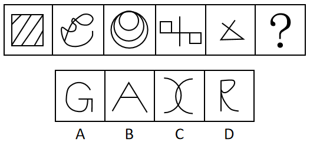
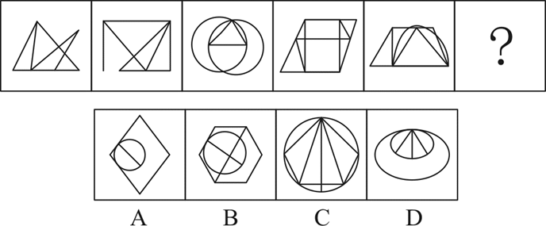
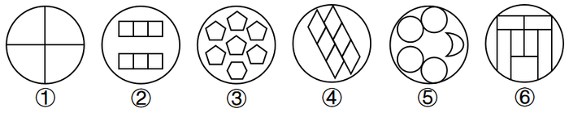
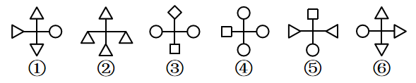
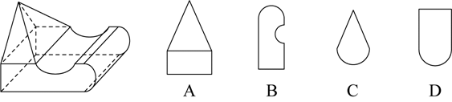
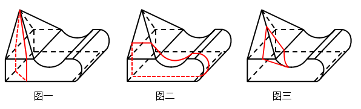
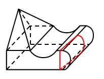
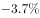
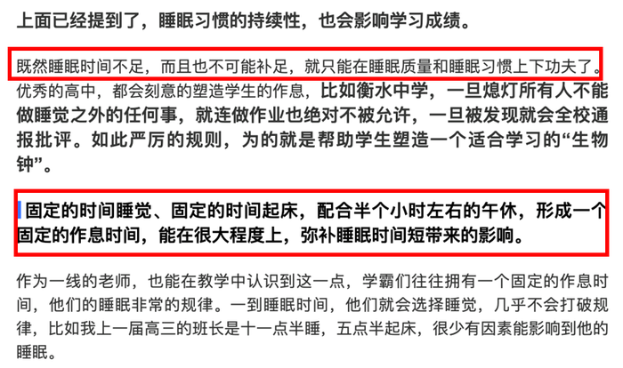

# 2020年新疆公务员录用考试《行测》试题（网友回忆版）

> 判断推理 · 35 题 · 新疆 2020

## 第 1 题　qid 2662233 · 图形推理

从所给的四个选项中，选择最合适的一个填入问号处，使之呈现一定的规律性：

- **A**. A　✅
- **B**. B
- **C**. C
- **D**. D

**答案**：A

**官方解析**

元素组成不同，且无明显属性规律，考虑数量规律。观察题干图形，图一明显被分割，考虑面数量，题干图形面数量依次为5、4、3、2、1、？，故？处图形面数量应为0，只有A项符合。
故正确答案为A。

---

## 第 2 题　qid 2662238 · 图形推理

从所给的四个选项中，选择最合适的一个填入问号处，使之呈现一定的规律性：

- **A**. A　✅
- **B**. B
- **C**. C
- **D**. D

**答案**：A

**官方解析**

元素组成不同，且无明显属性规律，考虑数量规律。观察发现图形分为多个封闭区域，窟窿明显，考虑面数量，但无规律；再观察发现，图二为明显一笔画图形，B项为“田”字变形图，考虑笔画数，题干图形均为一笔画图形，故？处也应为一笔画图形。A、B、C、D四项图形的笔画数分别为1、2、2、2，只有A项符合。
故正确答案为A。

---

## 第 3 题　qid 2662241 · 图形推理

把下面的六个图形分为两类，使每一类图形都有各自的共同特征或规律，分类正确的一项是：

- **A**. ①④⑤，②③⑥
- **B**. ①⑤⑥，②③④　✅
- **C**. ①③⑤，②④⑥
- **D**. ①④⑥，②③⑤

**答案**：B

**官方解析**

本题为分组分类题目。元素组成不同，且无明显属性规律，考虑数量规律。图形分割面特征明显，考虑数面，但面数量无明显规律。考虑面的细化，观察发现图②、图⑤明显具有相同面，考虑相同面的数量，图②③④相同面的数量均为6，图①⑤相同面的数量均为4，图⑥相同面的数量有2个、3个和4个，因此考虑图①⑤⑥中最多相同面的数量均为4，图②③④中最多相同面的数量均为6，即图①⑤⑥为一组，图②③④为一组。
故正确答案为B。

---

## 第 4 题　qid 2662244 · 图形推理

把下面的六个图形分为两类，使每一类图形都有各自的共同特征或规律，分类正确的一项是：

- **A**. ①④⑤，②③⑥
- **B**. ①②⑤，③④⑥
- **C**. ①③⑤，②④⑥
- **D**. ①④⑥，②③⑤　✅

**答案**：D

**官方解析**

本题为分组分类题目。元素组成不同，优先考虑属性规律。观察发现图形中出现三角形等对称图形，考虑对称性。其中图①④⑥横轴对称，图②③⑤竖轴对称，即图①④⑥为一组，图②③⑤为一组。
故正确答案为D。

---

## 第 5 题　qid 2662246 · 图形推理

左图是给定的立体图形，将其从任一面剖开，立体截面是：

- **A**. A
- **B**. B
- **C**. C
- **D**. D　✅

**答案**：D

**官方解析**

本题考查截面图。逐一分析选项。如下图所示，A、B、C三项均不可以截出，正确的截面图分别如下图一、图二、图三所示：

D项可以截出，具体剖切方式如下图所示：

故正确答案为D。

---

## 第 6 题　qid 2662249 · 定义判断

教育斗富是指在教育领域里打着“造福孩子”的旗帜相互攀比建设豪华学校，而忽视其实用性的现象。
根据上述定义，下列哪项不涉及“教育斗富”？

- **A**. 某中学增建大广场，校园里的建筑物使用的是大理石，教室内配备了有线电视、广播、同声监控等系统，但是这些设备在教学中很少使用
- **B**. 某中学配备了现代化的教学设施，但这些设施平常束之高阁，只有领导来视察时才会被启用
- **C**. 某小学配备了众多高端且先进的教学设施，校园各处随时方便上网，造成不少孩子一下课就上网
- **D**. 某大学增建学生宿舍，花大量资金更新各实验室设备，高薪聘请精专人才来校执教，大量高端人才慕名而来　✅

**答案**：D

**官方解析**

第一步：找出定义关键词。
“在教育领域里打着‘造福孩子’的旗帜”、“相互攀比”、“建设豪华学校”、“忽视其实用性”。
第二步：逐一分析选项。
A项：某中学增建大广场，校园里的建筑物使用的是大理石，教室内配备了有线电视、广播、同声监控等系统，符合“在教育领域里打着‘造福孩子’的旗帜”、“建设豪华学校”，这些设备在教学中很少使用，符合“忽视其实用性”，符合定义，排除； 
B项：某中学配备了现代化的教学设施，符合“在教育领域里打着‘造福孩子’的旗帜”、“建设豪华学校”，这些设施平常束之高阁，只有领导来视察时才会被启用，符合“忽视其实用性”，符合定义，排除；
C项：某小学配备了众多高端且先进的教学设施，校园各处随时方便上网，符合“在教育领域里打着‘造福孩子’的旗帜”、“建设豪华学校”，造成不少孩子一下课就上网，符合“忽视其实用性”，符合定义，排除；
D项：某大学增建学生宿舍，花大量资金更新各实验室设备，宿舍和实验设备是大学的基础设施和设备，不符合“建设豪华学校”，高薪聘请精专人才来校执教，大量高端人才慕名而来，人才是教育的关键所在，说明学校高薪聘请精专人才的行为有其重要价值，不符合“忽视其实用性”，不符合定义，当选。
本题为选非题，故正确答案为D。

---

## 第 7 题　qid 2662251 · 定义判断

绿色消费，是指以节约资源和保护环境为特征的消费行为，主要表现为崇尚勤俭节约，减少损失浪费，选择高效、环保的产品和服务，降低消费过程中的资源消耗和污染排放。
根据上述定义，下列不属于绿色消费的是：

- **A**. 刘阿姨在孩子电动玩具中，从不使用镍镉电池，更喜欢使用充电电池
- **B**. 小李个人比较讲究卫生，在食堂就餐时经常选择一次性木筷和纸杯　✅
- **C**. 老王对食材比较讲究，喜欢简单烹饪的天然食品，不喜欢反复加工和带防腐剂的食品
- **D**. 某装饰公司宣传新的家装理念，强调用天然材料装饰房间，倡导旧家具翻新利用

**答案**：B

**官方解析**

第一步：找出定义关键词。
“以节约资源和保护环境为特征的消费行为”、“崇尚勤俭节约，减少损失浪费，选择高效、环保的产品和服务”、“降低消费过程中的资源消耗和污染排放”。
第二步：逐一分析选项。
A项：孩子电动玩具中从不使用镍镉电池，更喜欢使用充电电池，充电电池可反复使用且经济、环保，符合“以节约资源和保护环境为特征的消费行为”、“崇尚勤俭节约，减少损失浪费，选择高效、环保的产品和服务”、“降低消费过程中的资源消耗和污染排放”，符合定义，排除；
B项：小李在食堂就餐时经常选择用一次性木筷和纸杯，浪费资源，污染环境，不符合“以节约资源和保护环境为特征的消费行为”、“崇尚勤俭节约，减少损失浪费，选择高效、环保的产品和服务”、“降低消费过程中的资源消耗和污染排放”，不符合定义，当选；
C项：老王喜欢简单烹饪的天然食品，不喜欢反复加工和带防腐剂的食品，符合“以节约资源和保护环境为特征的消费行为”、“崇尚勤俭节约，减少损失浪费，选择高效、环保的产品和服务”、“降低消费过程中的资源消耗和污染排放”，符合定义，排除；
D项：某装饰公司强调用天然材料装饰房间，天然材料多指未加工的材料，倡导旧家具翻新利用，符合“以节约资源和保护环境为特征的消费行为”、“崇尚勤俭节约，减少损失浪费，选择高效、环保的产品和服务”、“降低消费过程中的资源消耗和污染排放”，符合定义，排除。
本题为选非题，故正确答案为B。

---

## 第 8 题　qid 2662220 · 定义判断

求同法也叫契合法，是探求事物之间因果联系的方法之一。其基本内容是，在被研究现象a出现的若干场合中，只有一个先行情况是相同的，那么，这个相同的先行情况就是被研究现象a的原因。
根据上述定义，下列属于求同法的是：

- **A**. 在若干要求离婚的案例中，情况各不相同，但双方感情破裂是相同的。可见，双方感情破裂是要求离婚的重要原因　✅
- **B**. 一些社区居民牙齿都非常健康，居民也注重保护牙齿，经调查研究发现，这些社区水源中都含有天然氟化物，可见，水源中含有氟化物是这些社区居民牙齿健康的原因
- **C**. 某人连续三个夜晚出现失眠，第一晚，他看了两小时书，喝了几杯浓茶；第二晚，他看了两小时书，抽了很多烟；第三晚，他看了两小时书，喝了两杯咖啡。可见喝浓茶、喝咖啡、吸烟是失眠的原因
- **D**. 一对双胞胎去饭店就餐，所吃其他食物相同，一个吃了冰激凌，出现腹泻，另一个没吃冰激凌，没出现腹泻，因此，吃冰激凌是导致腹泻的原因

**答案**：A

**官方解析**

第一步：找出定义关键词。
“在被研究现象a出现的若干场合中”、“只有一个先行情况是相同的”、“这个相同的先行情况就是被研究现象a的原因”。
第二步：逐一分析选项。
A项：离婚的案例中情况各不相同，但双方感情破裂是相同的，符合“在被研究现象a出现的若干场合中”、“只有一个先行情况是相同的”，可见，双方感情破裂是要求离婚的重要原因，符合“这个相同的先行情况就是被研究现象a的原因”，符合定义，当选；
B项：一些社区居民牙齿都非常健康，居民也注重保护牙齿，经调查研究发现，这些社区水源中都含有天然氟化物，说明存在两个相同的先行情况：注重保护牙齿和水源含有天然氟化物，不符合“只有一个先行情况是相同的”，不符合定义，排除；
C项：根据某人三晚的情况，得出喝浓茶、喝咖啡、吸烟是失眠的原因，但看两小时书才是唯一相同的先行情况，不符合“只有一个先行情况是相同的”、“这个相同的先行情况就是被研究现象a的原因”，不符合定义，排除；
D项：一对双胞胎去饭店就餐，所吃其他食物相同，一个吃冰激凌腹泻，另一个没吃冰激凌没腹泻，两个人出现在相同场合但对于食物出现了不同的反应，不符合“在被研究现象a出现的若干场合中”、“只有一个先行情况是相同的”、“这个相同的先行情况就是被研究现象a的原因”，不符合定义，排除。
故正确答案为A。

---

## 第 9 题　qid 2662234 · 定义判断

外显学习是有意搜寻或把规则应用于刺激物领域的学习。在外显学习的过程中，人们的学习行为受意识的控制、有明确目的、需要注意资源、要作出一定的努力。内隐学习是指一种无需意志努力的潜意识的学习。这种学习的特点在于人们潜意识地获得某种知识，而且无需意志努力就可以将这些知识提取出来，并应用于特定任务的操作中。
根据上述定义，下列属于外显学习的是：

- **A**. 小红经常听姐姐唱歌，时间一长，她也掌握了唱歌的技巧
- **B**. 生长在相声世家的小刘，经耳濡目染，很小就会说几句相声了
- **C**. 小周在中考前做了大量的英语习题，因此在英语考试中获得满分　✅
- **D**. 小方经常陪着爷爷去下围棋，不知不觉他也会下围棋了

**答案**：C

**官方解析**

第一步：找出定义关键词。
“有意搜寻”、“受意识的控制、有明确目的”。
第二步：逐一分析选项。
A项：小红经常听姐姐唱歌，长时间后也掌握了唱歌技巧，不明确小红是否有意学习唱歌，不符合“有意搜寻”，不符合定义，排除；
B项：生长在相声世家的小刘耳濡目染，说明小刘不知不觉地受到影响，不符合“有意搜寻”，不符合定义，排除；
C项：小周在中考前做了大量的英语习题，英语考试得了满分，符合“有意搜寻”、“受意识的控制、有明确目的”，符合定义，当选；
D项：小方经常陪爷爷下围棋，不知不觉自己也会下了，与A项类似，不明确小方是否有意学习下围棋，不符合“有意搜寻”，不符合定义，排除。
故正确答案为C。

---

## 第 10 题　qid 2662240 · 定义判断

玩忽职守罪是指国家机关工作人员对工作严重不负责任，不履行或者不正确履行自己的工作职责，致使公共财产、国家和人民利益遭受重大损失的行为。
根据上述定义，下列行为属于玩忽职守罪的是：

- **A**. 法官执行判决时严重不负责任，因未履行法定执行职责，致当事人利益遭受重大损失
- **B**. 值班警察与女友电话聊天时接到杀人报警，又闲聊10分钟后才赶往现场，因延迟出警，致被害人被杀、歹徒逃走　✅
- **C**. 检察官讯问犯罪嫌疑人甲时，甲要求上厕所，因检察官违规打开械具后未跟随，致甲在厕所翻窗逃跑
- **D**. 市政府基建负责人因听信朋友介绍，未经审查便与对方签订建楼合同，致被骗300万元

**答案**：B

**官方解析**

第一步：找出定义关键词。
“国家机关工作人员”、“对工作严重不负责任”、“致使公共财产、国家和人民利益遭受重大损失”。
第二步：逐一分析选项。
这道题偏法律常识，如果严格按照定义所给关键词，很难精准对应唯一答案，所以同学们不必过分纠结该题，当成法律知识积累即可。
A项：法官执行判决时严重不负责任，致当事人利益遭受重大损失，在刑法中应直接认定为执行判决、裁定失职罪（注：判决、裁定失职罪是指司法工作人员在执行判决、裁定活动中，严重不负责任，不依法采取诉讼保全措施、不履行法定执行职责，致使当事人或者他人的利益遭受重大损失的行为。），而非玩忽职守罪，排除；
B项：值班警察接到报警后，电话闲聊10分钟才赶往现场，符合“国家机关工作人员”、“对工作严重不负责任”，致被害人被杀、歹徒逃走，造成人民利益严重受损，符合“致使公共财产、国家和人民的利益遭受重大损失”，该警察不负责任的行为符合玩忽职守罪，当选；
C项：因检察官违规打开械具后未跟随导致嫌疑人逃脱，检察官的失职行为构成失职致使在押人员脱逃罪（注：失职致使在押人员脱逃罪是指司法工作人员由于严重不负责任，致使在押的犯罪嫌疑人、被告人或者罪犯脱逃的行为。），而非玩忽职守罪，排除；
D项：基建负责人未经审查签署合同，在签署合同过程中被骗，该行为构成签订、履行合同失职被骗罪（注：签订、履行合同失职被骗罪是指国家机关工作人员在签订、履行合同过程中，因严重不负责任而被诈骗，致使国家利益遭受重大损失的行为。），而非玩忽职守罪，排除。
故正确答案为B。

---

## 第 11 题　qid 2662247 · 定义判断

共情可以划分为情绪共情和认知共情。前者是共情的初级形式，指的是“感其所感”，即我们的情绪会受到他人情绪（如痛苦、快乐）的感染；后者则指认知上采纳他人的观点，进入另一个人的角色，使得我们能理解他人，知道他人感受到了什么，并准确理解他人的想法。
根据上述定义，下列属于认知共情的是：

- **A**. 将心比心　✅
- **B**. 感同身受
- **C**. 志同道合
- **D**. 身临其境

**答案**：A

**官方解析**

第一步：找出定义关键词。
情绪共情：“情绪会受到他人情绪的感染”；
认知共情：“认知上采纳他人的观点”、“进入另一个人的角色”、“准确理解他人的想法”。
第二步：逐一分析选项。
A项：“将心比心”意思是拿自己的心去比照别人的心，指遇事设身处地替别人着想，符合“认知上采纳他人的观点”、“进入另一个人的角色”、“准确理解他人的想法”， 符合认知共情定义，当选；
B项：“感同身受”现在多比喻虽未亲身经历，却如同亲身经历过一样，符合“情绪会受到他人情绪的感染”，符合情绪共情定义，不符合认知共情定义，排除；
C项：“志同道合”的意思是志向相同，道路一致，形容彼此理想、志趣相合，不符合“认知上采纳他人的观点”、“进入另一个人的角色”，不符合认知共情定义，排除；
D项：“身临其境”的意思是亲身面临那种境地，不符合“认知上采纳他人的观点”、“进入另一个人的角色”，不符合认知共情定义，排除。
故正确答案为A。

---

## 第 12 题　qid 2662978 · 定义判断

彼得原理也被称为“向上爬”原理，是美国学者劳伦斯·彼得根据千百个有关组织中不能胜任的失败实例进行分析而归纳得出的一个结论，即在各种组织中，由于习惯于对在某个等级上称职的人员进行晋升提拔，因而雇员总是趋向于晋升到其不称职的地位。
根据上述定义，下列现象中符合彼得原理的是：

- **A**. 赵某因业务能力强，业绩突出，最近被提升为部门经理
- **B**. 优秀女排运动员张某，退役后被女排国家队聘为教练，工作获得高度认可
- **C**. 李某因岳父是公司的董事，入职后就被任命为中层管理者，但由于没有相关经验，他干得力不从心
- **D**. 奥克曼是莱姆汽修公司的杰出技师，当公司调升他做行政主管后，他每天忙得焦头烂额，疲惫不堪，毫无成就感　✅

**答案**：D

**官方解析**

第一步：找出定义关键词。
“习惯于对在某个等级上称职的人员进行晋升提拔”、“雇员总是趋向于晋升到其不称职的地位”。
第二步：逐一分析选项。
A项：赵某业务能力强，业绩突出说明其个人能力很强，提升为部门经理后没有说明是否可以胜任新的岗位，不符合“雇员总是趋向于晋升到其不称职的地位”，不符合定义，排除；
B项：张某退役后被聘为教练，工作获得高度认可说明其能胜任新的岗位，不符合“雇员总是趋向于晋升到其不称职的地位”，不符合定义，排除；
C项：李某一入职就被任命为中层管理者，不属于职位晋升提拔，既不符合“习惯于对在某个等级上称职的人员进行晋升提拔”，也不符合“雇员总是趋向于晋升到其不称职的地位”，不符合定义，排除；
D项：奥克曼是杰出技师，说明其能胜任莱姆汽修公司的技师岗位，调升他做行政主管，符合“习惯于对在某个等级上称职的人员进行晋升提拔”，他每天忙得焦头烂额，疲惫不堪，毫无成就感说明其不能胜任新的岗位，符合“雇员总是趋向于晋升到其不称职的地位”，符合定义，当选。
故正确答案为D。

---

## 第 13 题　qid 2663004 · 定义判断

虚假同感偏差也叫虚假一致性偏差，是指人们常常会高估或夸大自己的信念、判断及行为的普遍性。在认知他人时总喜欢把自己的特性赋予他人身上，假定他人与自己是相同的，而当遇到与此相冲突的信息时，会坚信自己信念和判断的正确性。
根据上述定义，下列不属于虚假同感偏差的是：

- **A**. 小明非常喜欢玩网络游戏，经常逃课去玩游戏，他认为那些整天学习的同学，是因为家里看得紧想玩却玩不成
- **B**. 张某和李某都是人文学院的青年教师，经常在一起讨论学术问题，两人往往各执一词，都认为对方是错的　✅
- **C**. 妈妈边带孩子边做家务，干得大汗淋漓，就把自己的外衣脱了。她生怕旁边的孩子也热着，就帮孩子把衣服也脱掉了，导致孩子受凉感冒
- **D**. 有一些大学生会挂着广告牌在校园里闲逛以获得报酬，他们认为那些不同意挂的人是自命清高的胆小鬼，而不同意挂广告牌的人会认为同意挂的人是装疯卖傻

**答案**：B

**官方解析**

第一步：找出定义关键词。
“高估或夸大自己的信念、判断及行为的普遍性”、“在认知他人时总喜欢把自己的特性赋予他人身上”、“假定他人与自己是相同的”、“遇到与此相冲突的信息时，会坚信自己信念和判断的正确性”。
第二步：逐一分析选项。
A项：小明喜欢玩网络游戏，便认为那些整天学习的同学是因为家里看得紧想玩却玩不成。自己喜欢便觉得同学也喜欢，符合“高估或夸大自己的信念、判断及行为的普遍性”、“在认知他人时总喜欢把自己的特性赋予他人身上”、“假定他人与自己是相同的”，符合定义，排除；
B项：张某和李某在一起讨论学术问题，往往各执一词，认为对方是错的，只是对于问题的讨论，不是对他人的认知，不符合“在认知他人时总喜欢把自己的特性赋予他人身上”，不符合定义，当选；
C项：妈妈做家务时大汗淋漓，觉得热就脱了外衣，生怕孩子热便把孩子的衣服也脱了。自己热便觉得孩子也热，符合“高估或夸大自己的信念、判断及行为的普遍性”、“在认知他人时总喜欢把自己的特性赋予他人身上”、“假定他人与自己是相同的”，符合定义，排除；
D项：同意挂广告牌的大学生认为不同意挂的人是自命清高的胆小鬼，而不同意挂广告牌的人认为同意挂的人是装疯卖傻，两种人都高估了自己行为的普遍性，符合“高估或夸大自己的信念、判断及行为的普遍性”、“在认知他人时总喜欢把自己的特性赋予他人身上”、“假定他人与自己是相同的”，符合定义，排除。
本题为选非题，故正确答案为B。

---

## 第 14 题　qid 2662979 · 定义判断

“模棱两不可”是违反普通逻辑基本规律排中律要求所犯的逻辑错误。排中律要求，在同一时间、同一关系下，对同一对象做出的具有矛盾关系或下反对关系的命题，不能都加以否定。如果都加以否定，就会犯“模棱两不可”的错误。
根据上述定义，下列犯了“模棱两不可”错误的是：

- **A**. 并非有人去考试了，也并非没人去考试　✅
- **B**. 不能任何人的话都相信，也不能任何人的话都不信
- **C**. 不是所有人都看电视直播了，也不是所有人都没看电视直播
- **D**. 讨论某甲是否有罪时，起初有人说：不能说某甲是有罪的；随着调查的深入，又有人说：也不能说某甲就没有罪

**答案**：A

**官方解析**

第一步：找出定义关键词。
排中律：“在同一时间、同一关系下，对同一对象”、“做出的具有矛盾关系或下反对关系的命题，不能都加以否定”；
“模棱两不可”错误：“在同一时间、同一关系下，对同一对象做出的具有矛盾关系或下反对关系的命题，都加以否定”。
第二步：逐一分析选项。
A项：“有人去考试”和“没人去考试”属于矛盾关系，并且对二者进行同时否定，符合“在同一时间、同一关系下，对同一对象做出的具有矛盾关系或下反对关系的命题，都加以否定”，符合定义，当选； 
B项：“任何人的话都相信”和“任何人的话都不信”，所有都和所有都不属于上反对关系，不符合“具有矛盾关系或下反对关系的命题”，不符合定义，排除；
C项：“所有人都看电视直播”和“所有人都没看电视直播”属于上反对关系，不符合“具有矛盾关系或下反对关系的命题”，不符合定义，排除；
D项：“起初有人说”和“随着调查的深入”，时间发生变化，不符合“在同一时间、同一关系下，对同一对象做出的具有矛盾关系或下反对关系的命题，都加以否定”，不符合定义，排除。
故正确答案为A。

---

## 第 15 题　qid 2662980 · 定义判断

划分就是把一个概念所反映的对象分为几小类来明确概念外延的逻辑方法，也可以说是把一个外延较大的属概念分成几个并列的种概念的逻辑方法。分解是在思维中将一个对象分成几个部分，反映部分的概念和反映整体的概念之间不是种属关系。
根据上述定义，下列属于正确划分的是：

- **A**. 定义分为被定义项、定义项和定义联项
- **B**. 呼和浩特市分为新城区、回民区、赛罕区、玉泉区
- **C**. 宇宙中的天体可分为自然天体和人造天体　✅
- **D**. 刑罚分为主刑、剥夺政治权利、没收财产等

**答案**：C

**官方解析**

第一步：找出定义关键词。
划分：“把一个外延较大的属概念”、“分成几个并列的种概念”；
分解：“反映部分的概念和反映整体的概念之间不是种属关系”。
第二步：逐一分析选项。
A项：定义是由被定义项、定义项和定义联项组成的，符合“反映部分的概念和反映整体的概念之间不是种属关系”，符合“分解”定义，不符合“划分”定义，排除； 
B项：新城区、回民区、赛罕区、玉泉区都是呼和浩特市的组成部分，符合“反映部分的概念和反映整体的概念之间不是种属关系”，符合“分解”定义，不符合“划分”定义，排除；
C项：自然天体和人造天体都是宇宙中的天体，且自然天体和人造天体是并列关系，符合“把一个外延较大的属概念”、也符合“分成几个并列的种概念”，符合“划分”定义，当选；
D项：刑罚分为主刑和附加刑，剥夺政治权利、没收财产都属于附加刑，主刑与剥夺政治权利、没收财产不是并列关系，不符合任何一个定义，排除。
故正确答案为C。

---

## 第 16 题　qid 2663658 · 逻辑判断

根据国家卫健委的数据，约有三分之一的中小学生每天户外运动时间不足一小时，超过的中小学生睡眠时间不达标，同时，重压也对青少年的健康造成影响，近视率不断上升，原因主要是家庭作业耗时太长。为此，有教育部门认为，晚上睡个好觉或许对孩子们更重要，在父母同意的情况下，孩子可在指定的睡眠时间后不做尚未完成的作业。但家长们并不感到高兴，他们担心自己的孩子最终只能上低质量的学校。

以下哪项如果为真，最有助于解释家长们的担心？

- **A**. 新规虽可能会减轻学生的作业负担，但现行规则下，大学都是依据高考成绩选择学生　✅
- **B**. 未来将开展人工智能辅助教学，学生们耗费在家庭作业上的时间将大大减少
- **C**. 有研究证明，良好的睡眠能够提高学习效率，有助于提高学习成绩
- **D**. 高校录取机制将进行新的改革，关注学生成绩的同时也会更加重视学生的综合素质

**答案**：A

**官方解析**

第一步：找出题干矛盾。
家长们不为孩子能睡个好觉感到高兴，反而担心孩子上低质量的学校。
第二步：逐一分析选项。
A项：根据题干可知孩子睡个好觉的同时作业量减少了，而大学都是依据高考成绩选择学生，家长们因此会担心作业量减少影响了成绩，只能上低质量的学校，解释了为什么家长们不为孩子能睡个好觉感到高兴，反而担心孩子上低质量的学校，可以解释题干矛盾，当选；
B项：指出未来人工智能辅助教学可以减少学生们做家庭作业的时间，针对的是未来，并不能解释现在家长们出现的担心，无法解释题干矛盾，排除；
C项：指出良好的睡眠有助于提高学习成绩，那么家长们就应该为孩子能睡个好觉感到高兴，而不应该担心孩子上低质量的学校，无法解释题干矛盾，排除；
D项：指出高校录取机制将进行的改革会关注成绩，也会重视学生的综合素质，家长就不应该为此而担心孩子上低质量的学校，无法解释题干矛盾，排除。
故正确答案为A。

---

## 第 17 题　qid 2663659 · 逻辑判断

近年来，“斜杠青年”成为很多人的时尚追求。它指的是一群不再满足“专一职业”生活方式，而选择拥有多重职业和身份的多元生活人群。对此，有人认为，新产业新技术新业态不断更迭，激烈的竞争促使青年人不断进行自我更新，“我们已经开始进入‘不斜杠即淘汰’的快速变化的社会”，然而，也有反对者指出，对于“斜杠青年”，社会可给予更多的理解和支持，但不能成为多数人的盲目追捧。
以下哪项如果为真，最能支持上述反对者的观点？

- **A**. “斜杠青年”本身就给人一种不踏实，不靠谱的感觉，不值得提倡
- **B**. 人一辈子精力有限，今天学这个，明天干那个，最后哪个也没干好，所以要专注才行
- **C**. “斜杠青年”的生活方式需要实力来支撑，他们实际上都是一群自控力强，经历过长期的自我投资与积累，并且拥有某种核心竞争力的人　✅
- **D**. 斜杠与年龄无关，越成熟的人成为斜杠的可能性越大，因为时间和阅历会让人更了解自己，并且有足够多的时间投入到喜欢的事情中

**答案**：C

**官方解析**

第一步：找出论点和论据。
论点：对于“斜杠青年”，社会可给予更多的理解和支持，但不能成为多数人的盲目追捧。
论据：无。
本题只有论点，无论据，加强优先考虑补充论据，解释原因或者举例加强。
第二步：逐一分析选项。
A项：指出“斜杠青年”不值得提倡，但不值得提倡不能说明社会应该给予更多的理解和支持，也不能支持“不能成为多数人的盲目追捧”的成立，无法加强，排除；
B项：指出人应该专注，但题干中“斜杠青年”是指选择拥有多重职业和身份，与专注含义不同，话题不一致，无法加强，排除；
C项：指出“斜杠青年”是一群自控力强，经历过长期的自我投资与积累，并且拥有某种核心竞争力的人，说的是“斜杠青年”本身具有很多的条件，要求很高，大多数人可能无法实现，应该理性对待，解释了为什么不能成为多数人的盲目追捧，补充论据，当选；
D项：指出越成熟的人成为斜杠的可能性越大，与论点无关，属于无关项，排除。
故正确答案为C。

---

## 第 18 题　qid 2663785 · 逻辑判断

电动车和内燃汽车的竞争已有百余年的历史。很长一段时间里，内燃汽车发展一枝独秀，获得了长足的进步。近十几年，随着电池技术的发展，电动车已占领多个领域，如自行车、摩托车、小型运输车以及大型的城市公交、机场港口摆渡车等。由此，有人提出电动车全面取代内燃汽车的时刻即将到来，甚至一些国家和地方纷纷提出了禁售燃油汽车时刻表。但也有反对者称，未来在相当长的时期内，内燃动力与电动力汽车还会相向而行。
以下哪项如果为真，最能支持反对者上述观点？

- **A**. 内燃动力汽车经一百多年的发展，已十分成熟
- **B**. 废旧电池处理、电池中特殊材料的资源应用，可能会带来一些社会问题
- **C**. 有专家指出，从纯电动车生命周期评估，二氧化碳的排放量未必少于汽油车
- **D**. 电动汽车发展的三大焦虑即里程焦虑、充电焦虑与电池焦虑表明，动力电池技术远未成熟，攻关道路仍很漫长　✅

**答案**：D

**官方解析**

第一步：找出论点和论据。
论点：未来在相当长的时期内，内燃动力与电动力汽车还会相向而行。
论据：无。
本题只有论点没有论据，加强优先考虑补充论据，即解释为什么内燃动力与电动力汽车还会相向而行，或举例证明内燃动力与电动力汽车还会相向而行。
第二步：逐一分析选项。
A项：该项说的是内燃动力汽车发展成熟，即使内燃动力汽车发展成熟也有可能被取代，与论点讨论的内燃动力与电动力汽车还会相向而行无关，无法加强，排除；
B项：该项说的是废旧电池处理、电池中特殊材料的资源应用，可能会带来一些社会问题，只是在讨论电动力汽车的电池，与论点讨论的内燃动力与电动力汽车还会相向而行无关，无法加强，排除；
C项：该项说的是有专家指出纯电动车二氧化碳的排放量未必少于汽油车，专家的观点是否正确未知，且排放量如何与论点讨论的内燃动力与电动力汽车还会相向而行无关，无法加强，排除；
D项：该项说的是电动汽车发展的焦虑，动力电池技术远未成熟，说明电动汽车技术发展不完善，电动力汽车暂时无法取代内燃动力汽车，说明了为什么内燃动力与电动力汽车还会相向而行，补充论据，可以加强，当选。
故正确答案为D。

---

## 第 19 题　qid 2663670 · 逻辑判断

近年来，压力重重的城市居民一直在绿色空间中寻找避风港，因为事实证明，绿色空间对身心健康有积极作用，而这常常被用作修建更多的市内公园和开辟更多林地的论据。而“蓝色空间”——海洋、河流、湖泊、瀑布甚至喷泉的好处没有那么广为人知。然而至少10年来，科学家始终认为：临水对人的身心都有好处。
以下哪项如果为真，最不能支持上述结论？

- **A**. 研究发现，每周至少去海边两次的人精神健康状况更好
- **B**. 有研究证明，持续待在城市环境中更让人容易感到疲劳，心情抑郁　✅
- **C**. 水生环境有独特的有利环境因素，如空气污染少、阳光更多，临水生活的人往往更加积极地参与体育锻炼，如水上运动、步行，临水还具有心理康复作用
- **D**. 研究表明，与绿色空间相比，待在水生环境中或附近可以激发积极情绪同时减少消极情绪和压力

**答案**：B

**官方解析**

第一步：找出论点和论据。
论点：临水对人的身心都有好处。
论据：无。
本题为选非题，采用排除的方法，将可以加强的选项排除，题干只有论点没有论据，所以考虑补充论据加强。
第二步：逐一分析选项。
A项：每周至少去海边两次的人精神健康状况更好，举例说明了临水确实对人的身心有好处，补充论据加强，排除；
B项：持续待在城市环境中，无法得知该城市环境是否临水，并且感到疲劳，心情抑郁说明对身心没有好处，无法加强，当选；
C项：解释说明了临水对人的身心有好处的原因，补充论据加强，排除； 
D项：补充论据说明了临水可以激发积极情绪同时减少消极情绪和压力，即临水对人的身心都有好处，可以加强，排除。
本题为选非题，故正确答案为B。

---

## 第 20 题　qid 2663760 · 逻辑判断

一直以来，科学家们为鸟类祖先是谁争论不休。关于鸟类的起源主要有槽齿类起源说、恐龙起源说和鳄类姊妹群说三种，其中槽齿类起源说和恐龙起源说最近争论得比较激烈。近年新发现的化石特别是在中国辽西发现的一系列化石再一次挑起鸟类起源的争论，证明鸟真的是恐龙的后代。
以下哪项如果为真，最能支持上述结论？

- **A**. 在恐龙家族中，有的恐龙不仅有羽毛，还有翅膀
- **B**. 北美发现的原鸟比中华龙鸟和始祖鸟要早几千万年，如果原鸟确实是鸟类，则鸟类几乎与恐龙同时出现
- **C**. 科学家利用电子显微镜，在恐龙化石里找到了一种黑色素体，这种黑色素体在现在鸟类的羽毛中也有，是恐龙基因的延续　✅
- **D**. 有研究认为中华龙鸟是长有“羽毛”的兽脚类恐龙，与美颌龙类似，其“羽毛”与真正鸟类的羽毛有所不同

**答案**：C

**官方解析**

第一步：找出论点和论据。
论点：近年新发现的化石特别是在中国辽西发现的一系列化石再一次挑起鸟类起源的争论，证明鸟真的是恐龙的后代。
论据：无。
第二步：逐一分析选项。
A项：在恐龙家族中，有的恐龙有羽毛和翅膀，并不能代表鸟是恐龙的后代，属于无关选项，无法加强，排除；
B项：鸟类几乎与恐龙同时出现，也无法确定鸟类是否是恐龙的后代，属于无关选项，无法加强，排除；
C项：恐龙化石和鸟类的羽毛中均找到了黑色素体，并且是恐龙基因的延续，说明鸟是恐龙的后代，补充论据，可以加强，当选；
D项：中华龙鸟与美颌龙类似，并不能代表鸟是恐龙的后代，属于无关选项，无法加强，排除。
故正确答案为C。

---

## 第 21 题　qid 2663790 · 逻辑判断

“裸婚”是指不办婚礼甚至没有婚戒而直接领证结婚的一种简朴的结婚方式。由于生活压力以及现代人越来越强调婚姻的自由和独立，婚礼在年轻一代的婚姻中被重视的程度日益削弱。裸婚的盛行，在社会上引起了广泛的关注和热议。有社会学家认为，年轻人主动选择裸婚的做法值得大力提倡，它是一种打破数千年来封建观念束缚的结婚方式，更是一种价值取向进步的体现。
以下哪项如果为真，最能质疑上述观点?

- **A**. 
一项关于裸婚态度的调查结果显示，的人表示因条件所限才会选择裸婚，有八成人坦承裸婚风险很大
　✅
- **B**. 
裸婚的出现，是对“有房有车有钻戒”的传统择偶条件和结婚标准的否定，但作为新生事物，发展中可能会有很多阻力

- **C**. 
据网上一项调查显示，赞成裸婚的年轻人占了大约六成，他们认为“爱情就应该抛弃金钱的世俗，真心相爱才是最重要的”

- **D**. 
裸婚一方面体现了现代社会对婚姻理解的转变，另一方面也体现了现代社会物质观念的转变

**答案**：A

**官方解析**

第一步：找出论点和论据。

论点：年轻人主动选择裸婚的做法值得大力提倡，它是一种打破数千年来封建观念束缚的结婚方式，更是一种价值取向进步的体现。

论据：无。

本题只有论点没有论据，优先考虑否定论点的方式来削弱，即年轻人主动选择裸婚的做法不值得大力提倡，它不是一种打破封建观念束缚的结婚方式和价值取向进步的体现。

第二步：逐一分析选项。

A项：的人表示因条件所限才会选择裸婚，说明很多人裸婚是条件限制，而不是价值取向进步的体现，有八成人坦承裸婚风险很大，说明裸婚的做法不值得大力提倡，可以削弱，当选；

B项：裸婚是对“有房有车有钻戒”的传统择偶条件和结婚标准的否定，说明裸婚是一种打破封建观念束缚的结婚方式，加强了论点，裸婚发展中可能会有很多阻力，但是否值得提倡不明确，无法削弱，排除；

C项：大约六成年轻人认为爱情应该抛弃金钱的世俗，是一种价值取向进步的体现，是对论点的加强，无法削弱，排除；

D项：裸婚体现了现代社会对婚姻理解的转变和物质观念的转变，但是裸婚是否应该提倡，是否是价值取向的进步都不明确，无法削弱，排除。

故正确答案为A。

---

## 第 22 题　qid 2663657 · 逻辑判断

我国的交强险于2006年7月正式实行，于2007年7月开始普遍推行。作为第一项法定强制险种，交强险经营的总体要求是不亏不盈。而事实上，自2007年开办以来，除了2008年实现盈利7.6亿元外，其余年份均为亏损，交强险累计承保利润为-508亿元，承保利润率为，直到2018年才扭转了12年半的亏损局面。但在66家经营交强险的公司中，40家盈利，仍有26家亏损。对一些保险公司来说，交强险是一种非但不赚钱，还多年连续亏损，却始终坚持不能放弃的业务。

以下哪项如果为真，最有助于解释这些保险公司的行为？

- **A**. 现在多数公司都已盈利，相信自己的公司未来在这个险种上也会盈利
- **B**. 交强险具有公益性、广泛性、强制性，保险公司必须承保，不能拒保
- **C**. 虽有很多车辆在交强险的赔付中赔付的数额远超过车主缴纳交强险时缴纳的金额，但也有很多车辆保险未用到赔付
- **D**. 通常车主为避免日后不必要的麻烦，不会将交强险和商业车险分开投保两家公司，而商业险的利润非常丰厚　✅

**答案**：D

**官方解析**

第一步：找出题干矛盾。
对一些保险公司来说，交强险是一种非但不赚钱，还多年连续亏损，却始终坚持不能放弃的业务。
第二步：逐一分析选项。
A项：相信自己公司未来会在这个险种上盈利和实际是否盈利无关，不能解释题干矛盾，排除；
B项：“保险公司不能拒保”是对经营交强险的公司做的法律规定，指经营交强险的公司不能拒绝客户购买交强险的要求，但是题干中讨论的是保险公司坚持承办交强险业务，而且并不是所有保险公司都必须承办交强险业务，比如寿险公司，因此如果是保险公司自愿申请承办交强险业务的话，B项便不能解释为什么保险公司“始终坚持不放弃交强险”，因此不明确，不能解释题干矛盾，排除；
C项：很多车辆保险未用到赔付，但具体总的赔付金额有没有超过所有车主缴纳交强险的金额不明确，不能解释题干矛盾，排除；
D项：交强险和商业车险捆绑，且商业险的利润非常丰厚，说明保险公司为了得到商业保险的利润也要经营交强险，可以解释为什么保险公司“始终坚持不放弃交强险”，可以解释题干矛盾，当选。
故正确答案为D。

---

## 第 23 题　qid 2663908 · 逻辑判断

最近一项研究证明了学习和睡眠的关系，研究人员在《自然》的合作刊物《学习科学》上，发表了相关的研究成果，指出睡眠质量、时间以及睡眠习惯的持续性与学习成绩成正相关。充足的睡眠对学生的学习更加有利。
以下除哪项外都是上述断定的逻辑推论？

- **A**. 睡眠充足、早起早睡、作息规律的学生普遍都拥有较好的成绩
- **B**. 绝大多数高中生都面临着睡眠不足的困扰，为了学习，他们很多人会选择课间或体育课的时间进行“补觉”
- **C**. 睡眠时间不足，而且也不可能补足，可以在睡眠质量和睡眠习惯上下功夫　✅
- **D**. 固定的时间睡觉、起床，形成固定的作息时间，能在很大程度上弥补睡眠时间短带来的影响

**答案**：C

**官方解析**

第一步：找出论点和论据。

论点：充足的睡眠对学生的学习更加有利。

论据：睡眠质量、时间以及睡眠习惯的持续性与学习成绩成正相关。

论点和论据讨论话题一致，考虑补充论据进行加强。

第二步：逐一分析选项。

A项：睡眠充足、早起早睡、作息规律的学生普遍都拥有较好的成绩，举例说明充足睡眠对成绩的影响，可以加强，排除；

B项：睡眠不足的高中生需要“补觉”来补充睡眠，从而有利学习，举例说明充足睡眠对成绩的影响，可以加强，排除；

C项：说的是睡眠时间与睡眠质量、睡眠习惯之间的关系，是否会影响到学习成绩不确定，因此无法加强，当选；

D项：固定的作息时间，能弥补睡眠时间短带来的影响，固定的作息时间指的是睡眠习惯，说明睡眠习惯也能给成绩带来影响，可以加强，排除。

本题为选非题，故正确答案为C。

补充：原文中C项和D项均为“睡眠习惯的持续性，也会影响学习成绩”的论证内容，但C项解释的是为什么要塑造学生的生物钟即睡眠习惯，因为睡眠时间不足，未提到与学习成绩的关系。而D项通过后面学霸的事例可以说明，固定作息可以提升成绩。

---

## 第 24 题　qid 2663740 · 逻辑判断

甲：目前人类对地球科学的认知水平还不高，从整体上还不能充分认识地震从孕育到发震的机理、时间空间分布规律，因此到目前为止人类还无法做到地震预测。
乙：我不同意你的观点，据权威媒体报道，我国已经建立了ICL地震预警系统，该系统自建成以来，已经成功预警数十次破坏性地震，无一误报。
对于乙的反驳，下列评价正确的是：

- **A**. 反驳有力，引用权威信息证明自己的观点
- **B**. 反驳有力，提出了一个比对方更有力的证据证明自己的观点
- **C**. 反驳无力，在反驳的关键概念上没有与对方保持一致　✅
- **D**. 反驳无力，在关键信息的引用上存在错误

**答案**：C

**官方解析**

第一步：找出论点和论据。
论点：到目前为止人类还无法做到地震预测。
论据：人类对地球科学的认知水平还不高，从整体上还不能充分认识地震从孕育到发震的机理、时间空间分布规律。
第二步：逐一分析选项。
A项：乙通过引用了权威信息来证明自己的观点，但是不确定权威信息的真实性，因此不能反驳，排除；
B项：乙通过提出了一个更有力的证据证明自己的观点，但是不能确定证据的真实性，因此不能反驳，排除；
C项：因为乙在反驳的时候提出的概念与甲不一致，甲提到的是地球科学的认知水平、地震机理以及时间分布规律，而乙提到的是ICL地震预警系统，两者讨论的关键概念不一致，因此反驳无力，当选；
D项：乙在关键信息的引用上存在错误，但是不确定此处的关键信息是什么，所以不明确，排除。
故正确答案为C。

---

## 第 25 题　qid 2663744 · 逻辑判断

只要拥有特色优势学科和一流的师资队伍，就能进入“双一流”建设名单行列。只有全面推进高校内涵发展，才能拥有特色优势学科和一流的师资队伍。M大学没有进入“双一流”建设名单行列。
如果上述断定是真的，则以下哪项也可能为真?
Ⅰ.M大学没有特色优势学科而且师资队伍不够一流
Ⅱ.M大学没有全面推进高校内涵发展
Ⅲ.M大学全面推进了高校内涵发展

- **A**. 仅Ⅰ
- **B**. 仅Ⅱ
- **C**. 仅Ⅲ
- **D**. Ⅰ、Ⅱ和Ⅲ　✅

**答案**：D

**官方解析**

第一步：翻译题干。

①特色优势学科 且 一流的师资队伍进入“双一流”建设名单行列

②特色优势学科 且 一流的师资队伍全面推进高校内涵发展

③“双一流”建设名单行列

第二步：逐一分析选项。

Ⅰ项：为：特色优势学科 且 师资队伍一流，条件③是对①的否后，否后必否前，得到“特色优势学科 或 一流的师资队伍”，Ⅰ只是“特色优势学科 或 一流的师资队伍”的一种可能性，故Ⅰ可能为真，保留；

Ⅱ和Ⅲ项：条件③是对①的否后，否后必否前，得到“特色优势学科 或 一流的师资队伍”，这是对②的否前，否前得不到必然结论，因此Ⅱ、Ⅲ可能为真，保留。

因此Ⅰ、Ⅱ、Ⅲ均有可能为真，只有D项符合。

故正确答案为D。

---

## 第 26 题　qid 2662259 · 类比推理

薯条：土豆

- **A**. 爆米花：玉米　✅
- **B**. 蔬菜：粮食
- **C**. 沙拉：水果
- **D**. 红酒：高粱

**答案**：A

**官方解析**

第一步：判断题干词语间逻辑关系。
土豆可以制作薯条，二者为原材料与成品的对应关系。
第二步：判断选项词语间逻辑关系。
A项：玉米可以制作爆米花，二者为原材料与成品的对应关系，与题干逻辑关系一致，保留；
B项：粮食不是制作蔬菜的原材料，与题干逻辑关系不一致，排除；
C项：水果可以制作沙拉，二者为原材料与成品的对应关系，与题干逻辑关系一致，保留；
D项：红酒的原材料是葡萄，不是高粱，与题干逻辑关系不一致，排除。
比较A、C两项，题干土豆是经过“油炸”制成薯条，A项玉米经过“油炸”制成爆米花，但C项水果不是经过“油炸”制成沙拉，A项与题干关系更为一致。
故正确答案为A。

---

## 第 27 题　qid 2662262 · 类比推理

转念：主意

- **A**. 转述：说话
- **B**. 转交：物品
- **C**. 转向：方向　✅
- **D**. 转录：翻译

**答案**：C

**官方解析**

第一步：判断题干词语间逻辑关系。
转念是指改变主意，二者是对应关系。
第二步：判断选项词语间逻辑关系。
A项：转述是指把别人说的话说给另外的人，并不是改变说话，与题干逻辑关系不一致，排除；
B项：转交物品为动宾关系，与题干逻辑关系不一致，排除；
C项：转向是指改变方向，二者是对应关系，与题干逻辑关系一致，当选；
D项：转录和翻译是蛋白质生物合成中基因表达的两个过程，二者是并列关系，与题干逻辑关系不一致，排除。
故正确答案为C。

---

## 第 28 题　qid 2662272 · 类比推理

检阅：部队：基地

- **A**. 消费：宾客：酒店
- **B**. 采访：代表：会场　✅
- **C**. 培训：员工：岗位
- **D**. 撒网：渔夫：大海

**答案**：B

**官方解析**

第一步：判断题干词语间逻辑关系。
部队在基地接受检阅，基地是个场所，部队接受检阅为被动动作。
第二步：判断选项词语间逻辑关系。
A项：宾客在酒店消费，酒店是个场所，但宾客消费是主动动作，与题干逻辑关系不一致，排除；
B项：代表在会场接受采访，会场是个场所，且代表接受采访为被动动作，与题干逻辑关系一致，当选；
C项：不能说员工在岗位接受培训，岗位不是场所，与题干逻辑关系不一致，排除；
D项：渔夫在大海撒网，大海是个场所，但渔夫撒网是主动动作，与题干逻辑关系不一致，排除。
故正确答案为B。

---

## 第 29 题　qid 2662182 · 类比推理

种植：水果：仓库

- **A**. 自习：知识：图书馆
- **B**. 裁剪：服饰：加工厂
- **C**. 烹饪：美食：保鲜柜　✅
- **D**. 挂职：干部：贫困县

**答案**：C

**官方解析**

第一步：判断题干词语间逻辑关系。
种植水果是动宾结构，水果存放在仓库中，二者是存储地点的对应关系。
第二步：判断选项词语间逻辑关系。
A项：通过自习可以获得知识，二者不是动宾结构，与题干逻辑关系不一致，排除；
B项：裁剪服饰是动宾结构，且加工厂是裁剪服饰的地点。而题干中种植水果的地点并不是仓库，与题干逻辑关系不一致，排除；
C项：烹饪美食是动宾结构，美食存放在保鲜柜中，二者是存储地点的对应关系，与题干逻辑关系一致，当选；
D项：挂职是指在不改变干部行政关系的前提下，委以具体的职务到其他地方来培养锻炼的一种临时性任职行为，挂职干部为偏正结构，挂职用来修饰干部，与题干逻辑关系不一致，排除。
故正确答案为C。

---

## 第 30 题　qid 2662193 · 类比推理

加薪：奖励：鼓励人才

- **A**. 话剧：艺术：陶冶情操
- **B**. 旅行：探索：增进感情
- **C**. 月食：现象：探索宇宙
- **D**. 返券：促销：提高销量　✅

**答案**：D

**官方解析**

第一步：判断题干词语间逻辑关系。
“加薪”是一种“奖励”方式，目的是“鼓励人才”，二者为方式目的的对应关系。
第二步：判断选项词语间逻辑关系。
A项：“话剧”是一种“艺术”，与题干逻辑关系不一致，排除；
B项：“旅行”和“探索”之间为交叉关系，且“旅行”的主要目的并不是“增进感情”，与题干逻辑关系不一致，排除；
C项：“月食”是一种“现象”，二者为种属关系；但“月食”的目的不是“探索宇宙”，与题干逻辑关系不一致，排除； 
D项：“返券”是一种“促销”方式，目的是“提高销量”，二者为方式目的的对应关系，与题干逻辑关系一致，当选。
故正确答案为D。

---

## 第 31 题　qid 2662199 · 类比推理

轮胎：自行车：代步

- **A**. 针头：注射器：预防
- **B**. 衣服：晾衣架：晾晒
- **C**. 风机：油烟机：排烟　✅
- **D**. 乘客：公交车：通勤

**答案**：C

**官方解析**

第一步：判断题干词语间逻辑关系。
轮胎是自行车的组成部分，二者为包容关系中的组成关系；自行车的功能是代步，二者为对应关系中的功能对应关系。
第二步：判断选项词语间逻辑关系。
A项：针头是注射器的组成部分，二者为包容关系中的组成关系；但注射器的功能不是预防，与题干逻辑关系不一致，排除；
B项：用晾衣架晾衣服，二者为对应关系而非组成关系，与题干逻辑关系不一致，排除；
C项：风机是油烟机的组成部分，二者为包容关系中的组成关系；油烟机的功能是排烟，二者为对应关系中的功能对应关系，与题干逻辑关系一致，当选； 
D项：乘客坐公交车，二者为对应关系而非组成关系，与题干逻辑关系不一致，排除。
故正确答案为C。

---

## 第 32 题　qid 2662207 · 类比推理

甲早于乙：乙早于丙：甲早于丙

- **A**. 甲战胜乙：乙战胜丙：甲战胜丙
- **B**. 甲属于乙：乙属于丙：甲属于丙　✅
- **C**. 甲信任乙：乙信任丙：甲信任丙
- **D**. 甲帮助乙：乙帮助丙：甲帮助丙

**答案**：B

**官方解析**

第一步：判断题干词语间逻辑关系。
根据“甲早于乙”和“乙早于丙”可以递推得到“甲早于丙”，“早于”存在传递关系，前两个词与第三个词为对应关系。
第二步：判断选项词语间逻辑关系。
A项：“甲战胜乙”和“乙战胜丙”递推不出“甲战胜丙”，“战胜”不存在传递关系，与题干逻辑关系不一致，排除；
B项：“甲属于乙”和“乙属于丙”可以递推得到“甲属于丙”，“属于”存在传递关系，前两个词与第三个词为对应关系，与题干逻辑关系一致，当选；
C项：“甲信任乙”和“乙信任丙”递推不出“甲信任丙”，“信任”不存在传递关系，与题干逻辑关系不一致，排除；
D项：“甲帮助乙”和“乙帮助丙”递推不出“甲帮助丙”，“帮助”不存在传递关系，与题干逻辑关系不一致，排除。
故正确答案为B。

---

## 第 33 题　qid 2662228 · 类比推理

竞聘 对于（    ）相当于（    ）对于 回报

- **A**. 演讲；报酬
- **B**. 岗位；补偿
- **C**. 连任；投资　✅
- **D**. 任期；付出

**答案**：C

**官方解析**

逐一代入选项。
A项：可以通过“演讲”的方式，达到“竞聘”的目的，二者为对应关系；“报酬”是一种“回报”，二者为种属关系，前后逻辑关系不一致，排除；
B项：“竞聘岗位”，二者为动宾关系；“补偿”与“回报”无明显逻辑关系，前后逻辑关系不一致，排除；
C项：“竞聘”之后可能会“连任”，二者为对应关系；“投资”之后可能会有“回报”，二者为对应关系，前后逻辑关系一致，当选；
D项：“竞聘”与“任期”无明显逻辑关系；“付出”之后可能会有“回报”，二者为对应关系，前后逻辑关系不一致，排除。
故正确答案为C。

---

## 第 34 题　qid 2662211 · 类比推理

喀纳斯 对于（    ）相当于（    ）对于 云南

- **A**. 新疆；丽江　✅
- **B**. 景区；旅游
- **C**. 喀什；米线
- **D**. 青海；傣族

**答案**：A

**官方解析**

逐一代入选项。
A项：喀纳斯位于新疆，是新疆的组成部分；丽江位于云南，是云南的组成部分，均为组成关系，前后逻辑关系一致，当选；
B项：喀纳斯是景区，二者为种属关系；云南是旅游的地点，二者是对应关系，前后逻辑关系不一致，排除；
C项：喀纳斯是新疆的景区，喀什是新疆的县级市，二者无明显逻辑关系；米线是云南的特色食品，前后逻辑关系不一致，排除；
D项：喀纳斯是位于新疆的景区，青海是中国的省份，二者无明显逻辑关系；傣族是主要聚居在云南的民族，前后逻辑关系不一致，排除。
故正确答案为A。

---

## 第 35 题　qid 2662215 · 类比推理

（    ）对于 做饭 相当于 车间 对于（    ）

- **A**. 厨师；机器
- **B**. 燃气；零件
- **C**. 刀具；噪音
- **D**. 厨房；生产　✅

**答案**：D

**官方解析**

逐一代入选项。
A项：厨师做饭，二者是主体与行为的对应关系；机器是车间中用于生产的工具，二者为场所与工具的对应关系，前后逻辑关系不一致，排除；
B项：燃气是用于做饭的燃料，二者为燃料与功能的对应关系；车间是制造零件的场所，二者为场所的对应关系，前后逻辑关系不一致，排除；
C项：刀具是用于做饭的工具，二者为工具与功能的对应关系；车间产生噪音，二者为场所的对应关系，前后逻辑关系不一致，排除；
D项：厨房是做饭的场所，车间是生产的场所，二者均为场所和行为的对应关系，前后逻辑关系一致，当选。
故正确答案为D。

---
