# 2020年江苏省公务员录用考试《行测》题（A类）（网友回忆版）

> 判断推理 · 50 题 · 江苏 2020

## 材料 1

在400米跑比赛中，罗、方、许、吕、田、石6人被分在一组。他们站在由内到外的1至6号赛道上。关于他们的位置，已知：

（1）田和石的赛道相邻；

（2）吕的赛道编号小于罗；

（3）田和罗之间隔着两条赛道；

（4）方的赛道编号小于吕，且中间隔着两条赛道。

### 第 1 题　qid 2452551 · 逻辑判断

根据以上陈述，关于田的位置，以下哪项是可能的？

- **A**. 在3号赛道上　✅
- **B**. 在4号赛道上
- **C**. 在5号赛道上
- **D**. 在6号赛道上

**答案**：A

**官方解析**

第一步：分析题干。
（1）田和石的赛道相邻；
（2）吕的赛道编号小于罗；
（3）田和罗之间隔着两条赛道；
（4）方的赛道编号小于吕，且中间隔着两条赛道。
第二步：根据题干条件分析选项。
提问方式为可能为真，因此，可以考虑代入法。
代入A项，田在3号赛道上，根据条件（3）可知，罗只能在6号赛道上；根据条件（2）（4）可知吕可能在4号或5号赛道上。如果吕在4号赛道上，则方在1号赛道上，根据条件（1）此时石只能在2号，此时满足题干所有要求，所以A项就是可能的，当选；
代入B项，田在4号赛道上，根据条件（3）可知，罗只能在1号赛道上，则吕的赛道编号不可能小于罗，与题干条件（2）矛盾，排除；
代入C项，田在5号赛道上，根据条件（3）可知，罗只能在2号赛道上，题干条件（2），吕只能在1赛道上，此时方的赛道编号不可能小于吕，与题干条件（4）矛盾，排除；
代入D项，田在6号赛道上，根据条件（3）可知，罗只能在3号赛道上，根据条件（2）可知吕可能在1号或2号赛道上，此时方的赛道不可能小于吕的同时隔着两条赛道，与题干条件（4）矛盾，排除。
故正确答案为A。

---

### 第 2 题　qid 2452559 · 逻辑判断

根据以上陈述，可以推出以下哪项？

- **A**. 许和石的赛道相邻
- **B**. 许和石之间隔着一条赛道
- **C**. 许和石之间隔着两条赛道　✅
- **D**. 许和石之间隔着三条赛道

**答案**：C

**官方解析**

第一步：分析题干。

（1）田和石的赛道相邻；

（2）吕的赛道编号小于罗；

（3）田和罗之间隔着两条赛道；

（4）方的赛道编号小于吕，且中间隔着两条赛道。

第二步：根据题干条件分析选项。

由条件（2）可知：

由条件（4）可知：

以上二者可知，，则方、吕、罗的赛道排列只有以下三种可能：

如果是情况一，根据条件（1）（3），田、石分别在2号、3号赛道，许只能在6号赛道；

如果是情况二，根据条件（1）（3），田、石分别在3号、2号赛道，许只能在5号赛道；

如果是情况三，根据条件（1）（3），田、石分别在3号、4号赛道，许只能在1号赛道；

无论哪种情况，许和石之间都是隔着两条赛道，对应C选项。

故正确答案为C。

---

### 第 3 题　qid 2452542 · 类比推理

唇亡：齿寒

- **A**. 安居：乐业
- **B**. 纲举：目张　✅
- **C**. 开卷：有益
- **D**. 惩前：毖后

**答案**：B

**官方解析**

第一步：判断题干词语间逻辑关系。
“唇亡”指嘴唇没有了，“齿寒”指牙齿就会寒冷，即因为“唇亡”，所以“齿寒”，二者为因果对应关系。
第二步：判断选项词语间逻辑关系。
A项：“安居”指安定的住在一起，“乐业”指愉快地从事自己的职业，二者为并列关系，与题干逻辑关系不一致，排除；
B项：“纲举”指提起鱼网上面的总绳，“目张”指一个个网眼都张开，即提起大绳子来，就能让一个个网眼张开了。因为“纲举”，所以“目张”，二者为因果对应关系，与题干逻辑关系一致，当选；
C项：“开卷”指打开书本读书，“有益”指有好处有收获，指的是读书总会有好处的。题干是两件事情之间的因果关系，而C项只有读书一件事，有益是读书本身的效果，二者不是因果关系，与题干逻辑关系不一致，排除；
D项：“惩前”指警戒之前犯的错误，“毖后”指以后谨慎，不致再犯，“惩前”的目的是“毖后”，二者是方式目的对应，与题干逻辑关系不一致，排除。
故正确答案为B。

---

### 第 4 题　qid 2452546 · 类比推理

湄公河：跨境河

- **A**. 黄鹤楼：吊脚楼
- **B**. 青海湖：内陆湖　✅
- **C**. 英国人：西欧人
- **D**. 中山门：凯旋门

**答案**：B

**官方解析**

第一步：判断题干词语间逻辑关系。
“湄公河”是亚洲最重要的跨国水系，因此“湄公河”是“跨境河”，且“湄公河”是“跨境河”中的一个，二者为包容关系中的特指。
第二步：判断选项词语间逻辑关系。
A项：“吊脚楼”为苗族（重庆、贵州等）、壮族、布依族、侗族、水族、土家族等族的传统民居，“黄鹤楼”是武汉标志性建筑，是名胜，因此“黄鹤楼”不是“吊脚楼”，与题干逻辑关系不一致，排除；
B项：“青海湖”是中国最大的“内陆湖”，因此“青海湖”是“内陆湖”，且“青海湖”是“内陆湖”中的一个，二者为包容关系中的特指，与题干逻辑关系一致，当选；
C项：“英国人”是“西欧人”，但英国人是一种统称，有很多英国人，二者不是包容关系中的特指，与题干逻辑关系不一致，排除；
D项：“中山门”和“凯旋门”为并列关系，与题干逻辑关系不一致，排除。
故正确答案为B。

---

### 第 5 题　qid 2452548 · 类比推理

柳：柳眉：柳腰

- **A**. 莲：莲花：莲蓬
- **B**. 松：松紧：松散
- **C**. 玉：玉手：玉食　✅
- **D**. 鸟：鸟瞰：鸟语

**答案**：C

**官方解析**

第一步：判断题干词语间逻辑关系。
柳眉指眉毛像柳叶一样细长，柳腰指腰像杨柳一样纤柔，两词都是和“柳”相关的比喻。
第二步：判断选项词语间逻辑关系。
A项：莲花指的是荷花，莲蓬指荷花开过后的花托，两词不存在比喻，与题干逻辑关系不一致，排除；
B项：松紧指松或紧的程度，松散指不紧凑，两词不存在比喻，与题干逻辑关系不一致，排除；
C项：玉手指的是像玉一样美好的手，玉食指的是像玉一样珍贵的食物，两词都是和“玉”相关的比喻，与题干逻辑关系一致，保留；
D项：鸟瞰指像鸟一样从上往下看，鸟语指的是小鸟的语言，后者不存在比喻，与题干逻辑关系不一致，排除。
故正确答案为C。

---

### 第 6 题　qid 2452554 · 类比推理

笔：文具：写字

- **A**. 缸：容器：盛水　✅
- **B**. 钟：时间：计时
- **C**. 草：植物：喂牛
- **D**. 瓦：建材：砌墙

**答案**：A

**官方解析**

第一步：判断题干词语间逻辑关系。
笔是一种文具，二者是种属关系；笔用来写字，二者是功能对应关系，且笔是人工用品。
第二步：判断选项词语间逻辑关系。
A项：缸是一种容器，二者是种属关系，缸用来盛水，二者是功能对应关系，且缸是人工用品，与题干逻辑关系一致，当选；
B项：钟可以显示时间，钟也可以用来计时，都是功能对应关系，与题干逻辑关系不一致，排除；
C项：草是一种植物，二者是种属关系，草可以用来喂牛，二者是功能对应关系，但草是大自然的产物而不是人工用品，与题干逻辑关系不一致，排除；
D项：瓦是一种建材，二者是种属关系，瓦不能用来砌墙，而是用来铺屋顶，二者不是功能对应，与题干逻辑关系不一致，排除。
故正确答案为A。

---

### 第 7 题　qid 2452639 · 类比推理

暴雨：洪灾：排涝

- **A**. 炎热：干旱：减产
- **B**. 路滑：摔倒：哭泣
- **C**. 假日：拥堵：疏导
- **D**. 地震：伤亡：救助　✅

**答案**：D

**官方解析**

第一步：判断题干词语间逻辑关系。
暴雨会导致洪灾，二者为因果的对应关系，排涝是洪灾的应对措施，二者为对应关系。
第二步：判断选项词语间逻辑关系。
A项：炎热会导致干旱，干旱会导致减产，而不是干旱的应对措施，与题干逻辑关系不一致，排除；
B项：路滑会导致摔倒，但哭泣不能解决摔倒的危害，与题干逻辑关系不一致，排除；
C项：假日会导致拥堵，疏导是拥堵的应对措施，与题干逻辑关系一致，保留；
D项：地震会导致伤亡，救助是伤亡的应对措施，与题干逻辑关系一致，保留。
对比C、D两项：D项更贴近题干，地震和暴雨都是自然灾害，排除C项。
故正确答案为D。

---

### 第 8 题　qid 2452640 · 类比推理

摸清致贫原因：提出扶贫措施

- **A**. 通过安全检查：进入高铁车厢　✅
- **B**. 增加作物产量：选育作物良种
- **C**. 改正错误言行：认识错误危害
- **D**. 增强合作意识：苦练服务本领

**答案**：A

**官方解析**

第一步：判断题干词语间逻辑关系。
先摸清致贫原因后提出扶贫措施，二者为时间先后顺序的对应关系，且摸清致贫原因与提出扶贫措施两个行为是同一主体。
第二步：判断选项词语间逻辑关系。
A项：先通过安全检查后进入高铁车厢，且通过安全检查与进入高铁车厢是同一主体，与题干逻辑关系一致，当选；
B项：先选育作物良种后增加作物产量，但两词顺序与题干相反，与题干逻辑关系不一致，排除；
C项：先认识错误危害后改正错误言行，但两词顺序与题干相反，与题干逻辑关系不一致，排除；
D项：增强合作意识与苦练服务本领之间无明显先后顺序，与题干逻辑关系不一致，排除。
故正确答案为A。

---

### 第 9 题　qid 2452642 · 类比推理

粮库 之于（    ）相当于（    ）之于 思想

- **A**. 仓库——记忆
- **B**. 粮田——认识
- **C**. 金库——思维
- **D**. 粮食——文章　✅

**答案**：D

**官方解析**

逐一代入选项。
A项：粮库是仓库的一种，二者是种属关系；记忆与思想之间无明显关系，前后逻辑关系不一致，排除；
B项：粮库用来储存粮田中的粮食，二者为对应关系；思想是认识的一种，二者为种属关系，前后逻辑关系不一致，排除；
C项：粮库和金库都是用来储存物品的仓库，二者为并列关系；思维和思想是近义词，前后逻辑关系不一致，排除；
D项：粮库用来储存粮食，文章用来承载思想，二者均为对应关系，前后逻辑关系一致，当选。
故正确答案为D。

---

### 第 10 题　qid 2452644 · 类比推理

（    ）之于 实事求是 相当于 南辕北辙 之于（    ）

- **A**. 按图索骥——方枘圆凿
- **B**. 上下求索——左顾右盼
- **C**. 量体裁衣——背道而驰　✅
- **D**. 刻舟求剑——声东击西

**答案**：C

**官方解析**

逐一代入选项。
A项：按图索骥比喻按着线索去寻找，实事求是是指从实际情况出发，不夸大、不缩小，正确地对待和处理问题，二者没有必然联系；南辕北辙指的是心想往南而车子却向北行，比喻行动和目的正好相反，方枘圆凿比喻格格不入、不相容、不适宜，二者没有必然联系，前后逻辑关系不一致，排除；
B项：上下求索比喻百折不挠，不遗余力地去追求和探索，实事求是是指从实际情况出发，不夸大、不缩小，正确地对待和处理问题，二者没有必然联系；南辕北辙指的是心想往南而车子却向北行，比喻行动和目的正好相反，左顾右盼指到处看，二者没有必然联系，前后逻辑关系不一致，排除；
C项：量体裁衣本义是按照身材尺寸裁剪衣服，比喻做事从实际情况出发，实事求是是指从实际情况出发，不夸大、不缩小，正确地对待和处理问题，二者为近义关系；南辕北辙指的是心想往南而车子却向北行，比喻行动和目的正好相反，背道而驰比喻行动方向和所要达到的目标完全相反，二者为近义关系，前后逻辑关系一致，当选；
D项：刻舟求剑比喻办事刻板，没有发展的眼光，实事求是是指从实际情况出发，不夸大、不缩小，正确地对待和处理问题，二者没有必然联系；南辕北辙指的是心想往南而车子却向北行，比喻行动和目的正好相反，声东击西指造成要攻打东边的声势，实际上却攻打西边，二者没有必然联系，前后逻辑关系不一致，排除。
故正确答案为C。

---

### 第 11 题　qid 2452645 · 类比推理

请从四个选项中选出恰当的一项，其特征或规律与题干给出的一串符号的特征或规律最为相符。

- **A**. 

- **B**. 

- **C**. 

- **D**. 

　✅

**答案**：D

**官方解析**

从相同符号的位置入手：位置1、7的符号相同；位置2、4的符号相同；位置3、6的符号相同；位置5、8的符号相同；位置9上的符号与其他位置均不相同。
第二步：判断选项符号间关系。
A项：位置5、8的符号并不相同，与题干不一致，排除；
B项：位置3、6的符号并不相同，与题干不一致，排除；
C项：位置5、8的符号并不相同，与题干不一致，排除；
D项：位置1、7的符号相同；位置2、4的符号相同；位置3、6的符号相同；位置5、8的符号相同；位置9上的符号与其他位置均不相同，与题干一致，当选。
故正确答案为D。

---

### 第 12 题　qid 2452650 · 类比推理

请从四个选项中选出恰当的一项，其特征或规律与题干给出的一串符号的特征或规律最为相符。
由甲申曱甲申甴甲由曱

- **A**. 己已巳乙已巳己已己乙
- **B**. 上下卡卞下卡土下上卞　✅
- **C**. 人八六入八六人八人入
- **D**. 土士二干士二二士土干

**答案**：B

**官方解析**

第一步：分析题干符号间关系。
从相同符号的位置入手：位置1、9的符号相同；位置2、5、8的符号相同；位置3、6的符号相同；位置4、10的符号相同；位置7的符号与其他位置均不相同。
第二步：判断选项符号间关系。
A项：位置7的符号与位置1、9的符号相同，与题干逻辑关系不一致，排除；
B项：位置1、9的符号相同；位置2、5、8的符号相同；位置3、6的符号相同；位置4、10的符号相同；位置7的符号与其他位置均不相同，与题干逻辑关系一致，当选；
C项：位置7的符号与位置1、9的符号相同，与题干逻辑关系不一致，排除；
D项：位置7的符号与位置3、6的符号相同，与题干逻辑关系不一致，排除。
故正确答案为B。

---

### 第 13 题　qid 2452533 · 图形推理

请从所给的四个选项中，选出最恰当的一项填入问号处，使之呈现一定的规律性。

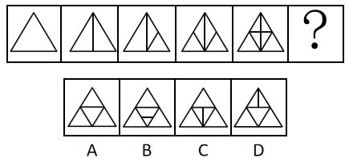

- **A**. A
- **B**. B　✅
- **C**. C
- **D**. D

**答案**：B

**官方解析**

元素组成不同，且无明显属性规律，考虑数量规律。观察发现，图形线条交叉明显，考虑数交点，题干每个图形交点的数量分别为：3、4、5、6、7，所以？处交点数应为8个。
故正确答案为B。

---

### 第 14 题　qid 2452534 · 图形推理

请从所给的四个选项中，选出最恰当的一项填入问号处，使之呈现一定的规律性。

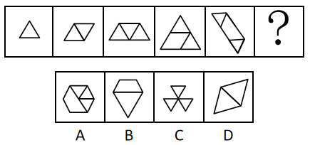

- **A**. A　✅
- **B**. B
- **C**. C
- **D**. D

**答案**：A

**官方解析**

元素组成不同，且无明显属性规律，优先考虑数量规律。观察发现，第一幅图为1个正三角形；第二幅图由2个相同的正三角形构成；第三幅图由3个相同的正三角形构成；第四幅图内部补上一条线，由4个相同的正三角形构成；第五幅图内部补上两条线，由5个相同的正三角形构成。所以问号处图形应满足内部补上线条后，由6个相同的正三角形构成。只有A项图形内部补上两条线，正好由6个相同的正三角形构成。
故正确答案为A。

---

### 第 15 题　qid 2452535 · 图形推理

请从所给的四个选项中，选出最恰当的一项填入问号处，使之呈现一定的规律性。

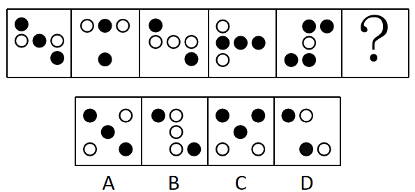

- **A**. A
- **B**. B
- **C**. C　✅
- **D**. D

**答案**：C

**官方解析**

元素组成不同，优先考虑属性规律。整体观察，将图形连线，图一、图三、图五为平行四边形，考虑对称性。图一中心对称、图二轴对称、图三中心对称、图四轴对称、图五中心对称，两种对称图形交替出现，？处选择轴对称图形，排除B、D两项。再次观察，发现题干中轴对称图形均只有一条对称轴，A项有两条对称轴，排除，C项有一条对称轴，当选。
故正确答案为C。

---

### 第 16 题　qid 2452537 · 图形推理

下面四个图形中，只有一个是由上面的四个图形拼合（只能通过上、下、左、右平移）而成的，请把它找出来。

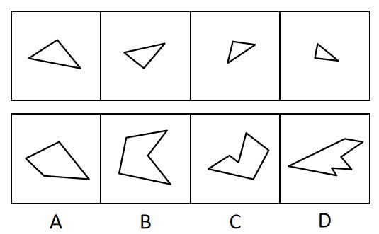

- **A**. A
- **B**. B　✅
- **C**. C
- **D**. D

**答案**：B

**官方解析**

本题考查平面拼合，可采用平行且等长相消的方式解题。消去平行且等长的线段后进行组合即可得到轮廓图，即为B选项。平行且等长相消的方式如下图所示。

故正确答案为B。

---

### 第 17 题　qid 2452538 · 图形推理

下面四个图形中，只有一个是由上面的四个图形拼合（只能通过上、下、左、右平移）而成的，请把它找出来。

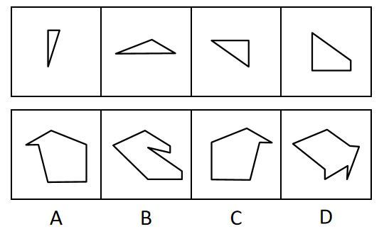

- **A**. A
- **B**. B
- **C**. C　✅
- **D**. D

**答案**：C

**官方解析**

本题考查平面拼合，可采用平行且等长相消的方式解题。消去平行且等长的线段后进行组合即可得到轮廓图，即为C选项。平行且等长相消的方式如下图所示。

故正确答案为C。

---

### 第 18 题　qid 2452545 · 图形推理

下面四个图形中，只有一个是由上面的四个图形拼合（只能通过上、下、左、右平移）而成的，请把它找出来。

- **A**. A
- **B**. B
- **C**. C
- **D**. D　✅

**答案**：D

**官方解析**

本题考查平面拼合，可采用平行且等长相消的方式解题。消去平行且等长的线段后进行组合即可得到轮廓图，即为D选项。平行且等长相消的方式如下图所示。

故正确答案为D。

---

### 第 19 题　qid 2452549 · 图形推理

下面四个图形中，只有一个是由上边的四个图形拼合（只能通过上、下、左、右平移）而成的，请把它找出来。

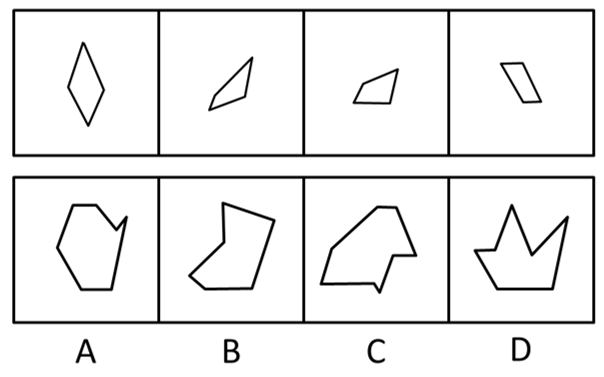

- **A**. A
- **B**. B
- **C**. C
- **D**. D　✅

**答案**：D

**官方解析**

本题考查平面拼合，可采用平行且等长相消的方式解题。消去平行且等长的线段后进行组合可得到轮廓图，即为D项。平行且等长相消的方式如下图所示：

故正确答案为D。

---

### 第 20 题　qid 2452557 · 图形推理

下面四个图形中，只有一个是由上边的四个图形拼合（只能通过上、下、左、右平移）而成的，请把它找出来。

- **A**. A
- **B**. B
- **C**. C　✅
- **D**. D

**答案**：C

**官方解析**

本题考查平面拼合，可采用平行且等长相消的方式解题。消去平行且等长的线段后进行组合可得到轮廓图，即为C项。平行且等长相消的方式如下图所示：

故正确答案为C。

---

### 第 21 题　qid 2452607 · 图形推理

下面给定的是纸盒外表面的展开图，右边哪一项能由它折叠而成？请把它找出来。

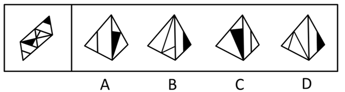

- **A**. A
- **B**. B
- **C**. C　✅
- **D**. D

**答案**：C

**官方解析**

将题干展开图中的面依次标注为面a、b、c、d，如下图：

A项：题干中，面c的阴影三角形和面d中的三角形底边右侧挨着，选项面c中阴影三角形与面d中的三角形底边左侧挨着，选项和题干不一致，排除；

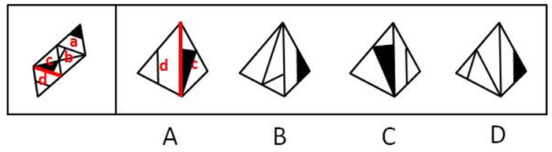

B项：题干中，面b的短竖线偏向于面a公共边的左侧，选项面b中短竖线偏向于和面a公共边的右侧，选项和题干不一致，排除；

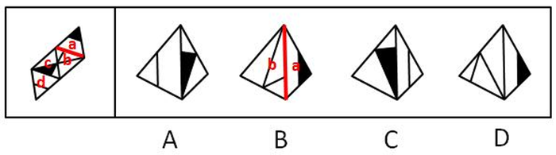

C项：与题干一致，当选；

D项：题干中，面b有短竖线交于面b与面a的公共边，选项中面b无短竖线交于面b与面a的公共边，选项与题干不一致，排除。

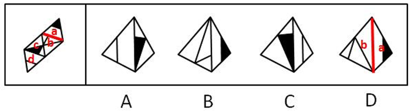

故正确答案为C。

---

### 第 22 题　qid 2452615 · 图形推理

下面给定的是纸盒外表面的展开图，右边哪一项能由它折叠而成？请把它找出来。

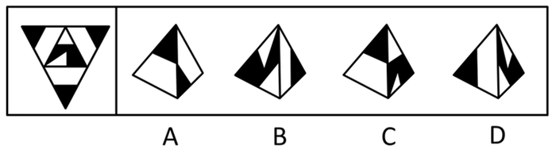

- **A**. A
- **B**. B　✅
- **C**. C
- **D**. D

**答案**：B

**官方解析**

将题干展开图中的面依次标注为面a、b、c、d，如下图：

A项：题干中，面a、c、d三个面两两之间的公共边如下图所示，均是黑三角形与黑三角形两两相邻，选项中黑三角形挨着空白区域，选项和题干不一致，排除；

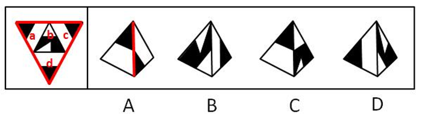

B项：与题干一致，当选；

C项：题干中，面b左侧的阴影和其他面的黑色小三角形没有公共点，选项中有公共点，选项和题干不一致，排除； 

D项：选项中，面b中白色小直角三角形不可能在所示的角落中，选项和题干不一致，排除。

故正确答案为B。

---

### 第 23 题　qid 2452620 · 图形推理

下面给定的是纸盒外表面的展开图，右边哪一项能由它折叠而成？请把它找出来。

- **A**. A
- **B**. B
- **C**. C　✅
- **D**. D

**答案**：C

**官方解析**

将展开图的面均标上序号，如下图。

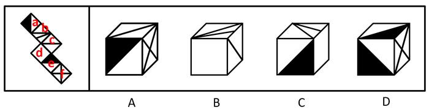

A项：选项出现了面c、面f，以及面a、面e中的一个，如果是面a，则面a和面c是相对面，不能同时出现；如果是面e，则面c、面e面f存在公共点，展开图中公共点发射出两条直线和一个黑色锐角，而选项只发射一条线和一个黑色锐角，选项与题干不一致，排除；

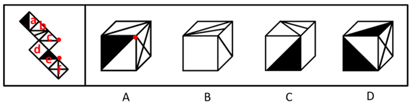

B项：选项出现了面b、面c和面d，面b和面d存在公共边，公共边上存在两个交点，而选项只有一个交点，选项与题干不一致，排除；

C项：选项出现了面b、面d，以及面a和面e中的一个，如果是面e，则面b与面e是相对面，不能同时出现；如果是面a，则选项与题干一致，当选；

D项：选项出现了面a、面e和面f。题干展开图中，面f和面e及面a中的白三角形均相邻，而选项中面f和顶面的黑三角形相邻，选项与题干展开图不一致，排除。

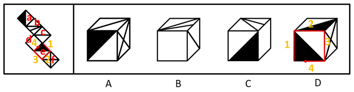

故正确答案为C。

---

### 第 24 题　qid 2452623 · 图形推理

下面给定的是纸盒外表面的展开图，右边哪一项能由它折叠而成？请把它找出来。

- **A**. A
- **B**. B
- **C**. C
- **D**. D　✅

**答案**：D

**官方解析**

将展开图的面均标上序号，如下图。

A项：选项出现了面a、面c和面e，面c和面e存在构成直角的两条边，该边为面c和面e的公共边，在展开图和选项中，以两个面的公共边为起点对面c进行画边，展开图中2对应面a，选项则是4对应面a，选项与题干不一致，排除；

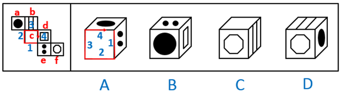

B项：选项出现了面e、面a和面d，面a和面d是相对面，不能同时出现，选项与题干不一致，排除；

C项：选项出现了面c、面f和面b，面c和面f是相对面，不能同时出现，选项与题干不一致，排除；

D项：选项出现了面b、面f和面a，选项与题干一致，当选。

故正确答案为D。

---

### 第 25 题　qid 2452625 · 图形推理

请从所给的四个选项中，选出最恰当的一项填入问号处，使之呈现一定的规律性。

- **A**. A
- **B**. B
- **C**. C
- **D**. D　✅

**答案**：D

**官方解析**

本题考查图形的实际意义，寻找最大共同点。九宫格优先横行看，观察发现，题干每行图片均为奶牛，第一行中奶牛头部的朝向左右交替，且奶牛身上的花纹相同，第二行也为此规律，故第三行运用规律，前两幅图奶牛的头部朝向分别为右、左，故问号处图形的奶牛头部应朝右，排除A、C项，B项奶牛身上的花纹与前两幅图不同，排除。
故正确答案为D。

---

### 第 26 题　qid 2452628 · 图形推理

请从所给的四个选项中，选出最恰当的一项填入问号处，使之呈现一定的规律性。

- **A**. A　✅
- **B**. B
- **C**. C
- **D**. D

**答案**：A

**官方解析**

元素组成相似，优先考虑样式规律。九宫格先看第一行，图1逆时针旋转90度再与图2求异得到图3，第二行规律一致，第三行图1逆时针旋转90度再与图2求异，只保留中间的圆。
故正确答案为A。

---

### 第 27 题　qid 2452532 · 图形推理

左图为给定的立体，从任意角度剖开，右边哪一项不可能是它的截面图？

- **A**. A　✅
- **B**. B
- **C**. C
- **D**. D

**答案**：A

**官方解析**

本题考查截面图，逐一分析选项。

A项：无法切出。

B项：从图形正上方切入，垂直向下切即可得到，排除；

C项：从图形六面体棱上切入，斜切，保证三条边等长，即可得到，排除；

D项：从图形六面体棱上切入，斜切，保证两条边等长，即可得到，排除。

本题为选非题，故正确答案为A。

注：A项截面中椭圆和长方形的中心可能存在重合的情况，但无法确定椭圆和长方形的大小比例、椭圆与长方形框的距离比例、椭圆和长方形的中心重合等是否可以同时满足，而BCD三个选项可以确定能够截出，故粉笔答案定为A项。

---

### 第 28 题　qid 2452541 · 逻辑判断

党内存在的很多问题都同政治问题相关联。不从政治上认识问题、解决问题，就会陷入头痛医头、脚痛医脚的被动局面，就无法从根本上解决问题。提高政治能力，很重要的一条就是要善于从政治上分析问题、解决问题。只有从政治上分析问题才能看清本质，只有从政治上解决问题才能抓住根本。
根据以上陈述，可以得出以下哪项？

- **A**. 只有从政治上认识问题、解决问题，才能从根本上解决问题　✅
- **B**. 如果善于从政治上分析问题、解决问题，就能提高政治能力
- **C**. 一旦陷入头痛医头、脚痛医脚的被动局面，就无法从根本上解决问题
- **D**. 如果没有看清本质、抓住根本，说明没有从政治上分析问题、解决问题

**答案**：A

**官方解析**

第一步：翻译题干。

①（政治上认识问题、解决问题）陷入头痛医头、脚痛医脚的被动局面

②（政治上认识问题、解决问题）根本上解决问题

③提高政治能力善于从政治上分析问题、解决问题

④看清本质政治上分析问题

⑤抓住根本政治上解决问题

第二步：逐一分析选项。

A项：翻译为根本上解决问题政治上认识问题、解决问题，是对②的否后，否后必否前，可以推出，当选；

B项：翻译为善于从政治上分析问题、解决问题提高政治能力，是对③的肯后，肯后得不到确定结论，无法推出，排除；

C项：翻译为陷入头痛医头、脚痛医脚的被动局面根本上解决问题，是对①的肯后，肯后得不到确定结论，无法和②中的“根本上解决问题”串在一起，无法推出，排除；

D项：翻译为（看清本质、抓准根本）（政治上分析问题、解决问题），是对④、⑤的否前，否前得不到确定结论，无法推出，排除。

故正确答案为A。

---

### 第 29 题　qid 2452547 · 逻辑判断

人类学家测量了历史上各个时期的人类头骨之后发现，当代成人的脑容量平均为1349毫升，相比中石器时代人类的脑容量，男性减少了，女性减少了。研究者认为，在分工日益明确的时代，富有合作精神的人比其他人有更多的生存和繁衍机会，“最友好者生存”是导致人类大脑不断缩小的重要原因。

以下哪项如果为真，最能支持上述结论？

- **A**. 当代脑科学研究表明，脑容量更小会使得人类更富有合作精神
- **B**. 合作会减少人类的攻击性，而攻击性的减少会使人身体变轻、脑容量减少　✅
- **C**. 随着气温的升高，人们对体重的要求降低，身体的缩小必然带来大脑的缩小
- **D**. 外部信息存储介质的出现减轻了大脑的记忆负担，人类的大脑随之缩小

**答案**：B

**官方解析**

第一步：找出论点和论据。
论点：在分工日益明确的年代，富有合作精神的人比其他人有更多的生存和繁衍机会，“最友好者生存”是导致人类大脑不断缩小的重要原因。
论据:无。
本题只有论点没有论据，加强优先考虑补充论据，即解释原因或举例子。
第二步：逐一分析选项。
A项：选项说的是脑容量更小让人更具有合作精神，而论点说的是合作会导致人类大脑不断缩小，该项颠倒了论点中的因果，因果倒置，无法加强，排除；
B项：选项说的是合作会减少攻击性，从而使脑容量减少，解释了为什么合作会导致人类大脑不断缩小，补充论据，可以加强，当选；
C项：选项说的是身体的缩小会让大脑缩小，而论点指出合作是导致大脑缩小的重要原因，身体的缩小与合作是否为重要原因无关，无法加强，排除；
D项：选项说的是外部存储介质会让大脑缩小，而论点指出合作是导致大脑缩小的重要原因，外部存储介质与合作是否为重要原因无关，无法加强，排除；
故正确答案为B。

---

### 第 30 题　qid 2452550 · 逻辑判断

每个“熊孩子”的背后都有一个“熊家长”。这些“熊家长”对“熊孩子”百依百顺，溺爱娇惯，这使得“熊孩子”以自我为中心，缺乏规则意识，容易产生过激的非理性行为。当“熊孩子”有些行为对他人和社会造成伤害时，“熊家长”也会以“他还是个孩子”来护短辩解，要求原谅。
以下哪项最可能是“熊家长”辩解所隐含的前提？

- **A**. “熊孩子”犯错误不是故意为之
- **B**. 只要是孩子就难免犯错
- **C**. “熊孩子”长大后会成为好孩子
- **D**. 孩子犯错误应当被原谅　✅

**答案**：D

**官方解析**

第一步:找出论点和论据。
论点:“熊家长”要求原谅“熊孩子”。
论据:“熊家长”以“他还是个孩子”来护短辩解。
题干中论点说的是要求他人原谅“熊孩子”，论据说的是“熊孩子”还是个孩子，论点论据话题不一致，因此考虑在“原谅”和“孩子”之间搭桥。
第二步:逐一分析选项。
A项：该项说的是犯错误不是故意为之，与“被原谅”无必然关系，不能加强，排除；
B项：该项说的是孩子就难免犯错，与“被原谅”无必然关系，不能加强，排除；
C项：该项说的是孩子长大后会成为好孩子，与“被原谅”无必然关系，不能加强，排除；
D项：在“原谅”和“孩子”之间搭桥，为搭桥项，是家长辩解的前提，可以加强，当选。
故正确答案为D。

---

### 第 31 题　qid 2452555 · 逻辑判断

张、王、李、赵四人计划在6至9月中分别选择一个月休年假，但部门人手短缺，一个月中不能有两个人休假。赵不希望安排在6月，张要求不要安排在9月，李表示6月或8月都可以，王提出只能安排在7、8月份。
如四人的要求均得到满足，则可以推出以下哪项？

- **A**. 张只能安排在6月或者7月
- **B**. 只要李不在6月，王一定会在7月　✅
- **C**. 如果李安排在8月，那么张安排在7月
- **D**. 如果王安排在7月，那么李安排在6月

**答案**：B

**官方解析**

本题信息较多，可考虑列表。

整理题干信息如下：

（1）一个月中不能有两个人休假；

（2）赵不在6月；

（3）张不在9月；

（4）李6月或8月；

（5）王只在7月或8月。

根据题干填入信息如下：

所以由表格可知赵在9月份。其他信息不确定。所以考虑代入选项。

A项：根据表格可以发现张可以安排在6月、7月和8月，故选项说法错误，排除；

B项：如果李不安排在6月，此时6月、7月和9月都不安排李，故李只能在8月，那么王一定会在7月，该项说法正确，当选；

C项：如果李安排在8月，那么王在7月，此时张只能安排在6月，选项说法错误，排除；

D项：如果王安排在7月，即张、李、赵都不能安排在7月，但此时李可以在6月也可以在8月，故该项选项错误，排除。

故正确答案为B。

---

### 第 32 题　qid 2452560 · 逻辑判断

某部门新录用甲、乙、丙三名工作人员，他们各自的籍贯为江苏、安徽、浙江中的某个省。张红、李梅和王芹对他们的籍贯有如下猜测：
张红：甲是浙江人，乙是安徽人，丙也是浙江人；
李梅：甲是浙江人，乙是江苏人，丙不是江苏人；
王芹：甲是江苏人，乙是浙江人，丙也是江苏人。
已知，对甲、乙、丙的籍贯，上述三人均猜对1个，猜错2个。
根据以上信息，以下哪项是可能的？

- **A**. 甲是江苏人，乙是安徽人，丙是浙江人
- **B**. 甲是浙江人，乙是江苏人，丙是江苏人
- **C**. 甲是安徽人，乙是浙江人，丙是江苏人
- **D**. 甲是江苏人，乙是安徽人，丙是安徽人　✅

**答案**：D

**官方解析**

题干条件不确定，优先采用代入法。
将A项代入，张红所说的第一句话错误，后面两句正确，不符合题干要求“猜对1个，猜错2个”，排除；
将B项代入，张红所说的第一句话正确，后面两句错误；李梅前两句正确，最后一句话错误，不符合题干要求“猜对1个，猜错2个”，排除；
将C项代入，张红所说的三句话均错误，不符合题干要求“猜对1个，猜错2个”，排除；
将D项代入，张红第二句话正确其余错误；李梅第三句话正确其余错误；王芹第一句话正确其余错误，符合题干要求，当选。
故正确答案为D。

---

### 第 33 题　qid 2452568 · 逻辑判断

一项对某企业基层工作人员的研究报告显示，使用社交软件的基层工作人员罹患糖尿病、精神疾病、缺血性心脏疾病的概率均显著低于不使用社交软件的。据此，该企业管理人员认为，社交软件的使用有利于基层工作人员的健康。
以下哪项如果为真，最能削弱上述管理人员的结论？

- **A**. 长时间使用电脑或者手机会引发包括精神疾病在内的多种健康问题
- **B**. 该企业基层工作人员没有足够多的时间和精力锻炼身体
- **C**. 该企业基层工作人员压力大，身心健康的人才在工作之余使用社交软件　✅
- **D**. 该企业基层工作人员普遍在四十岁以上，相当一部分人不使用社交软件

**答案**：C

**官方解析**

第一步：找出论点和论据。
论点：社交软件的使用有利于基层工作人员的健康。
论据：研究报告显示，使用社交软件的基层工作人员罹患糖尿病、精神疾病、缺血性心脏疾病的概率均显著低于不使用社交软件的。
本题论点论据话题一致，都在讨论社交软件与基层工作人员健康的关系，并且论点中具有因果关系，故可以优先考虑因果倒置。
第二步：逐一分析选项。
A项：论点讨论的是社交软件与基层工作人员健康的关系，该项说的是长期使用手机电脑会引发健康问题，话题不一致，无法削弱，排除；
B项：论点讨论的是社交软件与基层工作人员健康的关系，该项说的是基层工作人员没有时间锻炼身体，并未提到社交软件是否利于身体健康，话题不一致，无法削弱，排除；
C项：该项指出是因为人身体健康才会在工作之余使用社交软件，而论点说的是使用了社交软件会导致身体健康，选项中将原因和结果颠倒顺序，属于因果倒置，可以削弱，当选；
D项：论点讨论社交软件与基层工作人员健康的关系，而该项说的是企业基层工作人员的年龄，相当一部分人不使用社交软件，话题不一致，无法削弱，排除。
故正确答案为C。

---

### 第 34 题　qid 2452572 · 类比推理

由于业务量增加，某服务中心计划增加登记、咨询、报送、投诉和综合5个业务窗口，拟安排的5名工作人员所熟悉的业务各有不同：小丽作为新人，只熟悉登记业务；小马熟悉登记和咨询业务；小高熟悉报送和投诉业务；老王除了综合和投诉，其他业务都很熟悉；老董所有业务都很精通。最终，5名工作人员被分别安排到5个窗口负责各自熟悉的业务。
关于人员安排，以下说法正确的是

- **A**. 老董不负责综合业务窗口
- **B**. 小高负责报送业务窗口
- **C**. 小马不负责咨询业务窗口
- **D**. 老王负责报送业务窗口　✅

**答案**：D

**官方解析**

整理题干信息如下：

（1）小丽只负责登记业务

（2）小马负责登记或咨询业务

（3）小高负责报送或者投诉业务

（4）老王不负责综合和投诉

（5）老董所有业务都很精通

根据题干填入确定信息如下：

 

此时综合窗口只能老董负责，排除A项；又因5个业务窗口，安排的5名工作人员所熟悉的业务各有不同，即一人一个窗口，所以老董再不负责其他窗口，此时投诉窗口也已经有四个“×”，故只能小高负责投诉窗口，排除B项。此时报送窗口也已经有四个“×”，故只能老王负责报送窗口，D项说法正确，当选。又因为老王不负责其他窗口，此时咨询窗口也已经有四个“×”，故只能小马负责咨询窗口，排除C项，且小马不负责其他窗口，填入：

故正确答案为D。

---

### 第 35 题　qid 2452527 · 逻辑判断

随着社会经济的快速发展，很多现代化都市高楼林立，变成了钢铁水泥的森林。但欧洲某著名城市几乎没有一座高楼大厦，某旅游者在游览时了解到该城市仅有10万人。由此他认为，人口稀少、需求不旺是这座城市不建高楼大厦的主要原因。
以下哪项如果为真，最能质疑上述旅游者的观点？

- **A**. 许多住在老城区的社会精英都想住进现代化高楼
- **B**. 该城市已经规划3年内建造一座高层地标性建筑
- **C**. 该城市规定一般建筑物的高度不得超过当地教堂　✅
- **D**. 该地区人口近百万的其他城市也大都没有高楼大厦

**答案**：C

**官方解析**

第一步：找出论点和论据。
论点：人口稀少、需求不旺是这座城市不建高楼大厦的主要原因。
论据：欧洲某著名城市几乎没有一座高楼大厦，某旅游者在游览时了解到该城市仅有10万人。
本题论据说的是该城市人少，论点讨论的是人少是该城市不建高楼大厦的主要原因，论点和论据之间是有必然联系的，因此，可以考虑否定论点。除此之外，论点是在探讨不建高楼大厦的原因，因此，还可以考虑因果倒置和他因削弱两种削弱方式。
第二步：逐一分析选项。
A项：论点说的是人口稀少、需求不旺是这座城市不建高楼大厦的主要原因，该项说的是许多住在老城区的社会精英想住高楼，想要通过社会精英想住高楼来证明是有需求的，但是社会精英这个群体范围比较小，首先，没办法证明需求旺盛，也不能削弱论点当中的主要原因，无法削弱，排除；
B项：该项说的是三年内建造一座高层地标性建筑，与论点讨论的这座城市不建高楼大厦的主要原因无关，无法削弱，排除；
C项：该项说的是城市规定一般建筑物的高度不得超过当地教堂，说明城市规定才是这座城市不建高楼大厦的主要原因，削弱论点，当选；
D项：论点讨论的是这座城市不建高楼大厦的主要原因，而该项说的是其他城市有没有高楼大厦，话题不一致，无法削弱，排除。
故正确答案为C。

---

### 第 36 题　qid 2452597 · 定义判断

造血式扶贫：指政府部门或社会力量通过持续性地扶持农村产业发展，拓宽农产品销售及消费渠道等，帮助贫困地区、贫困人口增收脱贫的扶贫方式。
下列属于造血式扶贫的是

- **A**. 
某县按照“东部林果、旅游，西部设施农业”的整体思路，一直坚持“”的产业发展模式，使农民年收入翻了一番，人均达到近万元
　✅
- **B**. 
某县扶贫办组织了200多名山区农民，经过严格培训，输送到东南沿海城市工作。这些农民每月都按时寄钱回家，家里的日子越过越红火

- **C**. 
县农科所资助某村贫困家庭100头种羊，多次对他们进行科学养羊技术培训，并安排技术人员进行“一对一”的专业指导

- **D**. 
为了解决全村苹果严重滞销的问题，村里的几个年轻人共同开办了一个水果直销网店。不到半月时间，所有苹果就销售一空

**答案**：A

**官方解析**

第一步：找出定义关键词。

“政府部门或社会力量”、“持续性地扶持农村产业发展，拓宽农产品销售及消费渠道”、“帮助贫困地区、贫困人口增收脱贫”。

第二步：逐一分析选项。

A项：某县符合“政府部门或社会力量”，一直坚持“”的产业发展模式，符合“持续性地扶持农村产业发展，拓宽农产品销售及消费渠道”，使农民年收入翻了一番，人均达到近万元，符合“帮助贫困地区、贫困人口增收脱贫”，符合定义，当选；

B项：某县扶贫办组织了200多名山区农民，经过严格培训，输送到东南沿海城市工作，不符合“持续性地扶持农村产业发展，拓宽农产品销售及消费渠道”，不符合定义，排除；

C项：县农科所资助某村贫困家庭100头种羊，多次对他们进行科学养羊技术培训，不符合“持续性地扶持农村产业发展，拓宽农产品销售及消费渠道”，不符合定义，排除；

D项：为了解决全村苹果严重滞销的问题，村里的几个年轻人共同开办了一个水果直销网店，不符合“政府部门或社会力量”，且没有提到贫困，不符合“帮助贫困地区、贫困人口增收脱贫”，不符合定义，排除。

故正确答案为A。

---

### 第 37 题　qid 2452602 · 定义判断

分众化教育：指根据受众的具体差异，用典型案例分别进行宣传，以激发情感共鸣，达成特定目标的教育方式。
下列属于分众化教育的是

- **A**. 某市组织全市技术创新能手分别深入到所在行业部门，分享自己的创新经验，极大地激发了各行各业人士的创新热情　✅
- **B**. 某地组织的“五一劳动奖章”获得者宣讲团多次进行巡回报告，他们的先进事迹深深地打动了前来听讲的市民
- **C**. 每天傍晚，某学校附近地铁口都有艺术教育培训机构的招生人员散发传单，上面印着考入名校的学生彩照和成绩
- **D**. 在“不忘初心、牢记使命”主题教育中，某区组织党员干部分系统观看专题纪录片《警钟长鸣》，取得了预期效果

**答案**：A

**官方解析**

第一步：找出定义关键词。
“根据受众的具体差异，用典型案例分别进行宣传”、“激发情感共鸣，达成特定目标”。
第二步：逐一分析选项。
A项：某市组织全市技术创新能手分别深入到所在行业部门，分享自己的创新经验，符合“根据受众的具体差异，用典型案例分别进行宣传”，极大地激发了各行各业人士的创新热情，符合“激发情感共鸣，达成特定目标”，符合定义，当选； 
B项：某地组织的“五一劳动奖章” 获得者宣讲团多次进行巡回报告，不符合“根据受众的具体差异，用典型案例分别进行宣传”，不符合定义，排除；
C项：每天傍晚，某学校附近地铁口都有艺术教育培训机构的招生人员散发传单，不符合“根据受众的具体差异，用典型案例分别进行宣传”，不符合定义，排除；
D项：某区组织党员干部分系统观看专题纪录片《警钟长鸣》，不符合“根据受众的具体差异，用典型案例分别进行宣传”，不符合定义，排除。
故正确答案为A。

---

### 第 38 题　qid 2452605 · 定义判断

喘息服务：指由政府部门购买服务，为有失能失智老人的低收入家庭或特殊困难家庭提供临时性援助，让常年在家照顾亲属者得到短暂休息。
下列属于喘息服务的是

- **A**. 由于儿女移居国外，年迈的赵先生夫妇只得相依为命，平时一起去市场买日常用品，一起去医院就诊取药。社区了解情况后，专门雇人每天上门半小时帮他们料理家务
- **B**. 杨先生10多年前中风，老伴杜女士为了照料他，每天忙得团团转，连自己生病都没时间去医院。今年初，街道派护工不定期上门服务，让她能有时间到医院看病或稍事休息　✅
- **C**. 父亲去世后，年过六旬的张先生独自承担起了照顾精神病妹妹的重任，从来没有睡过一个安稳觉。不久前，老张专门请了一名钟点工照看妹妹，感觉轻松了许多
- **D**. 患健忘症的陈奶奶经常独自出门闲逛，多次走失，靠低保维持生活的儿子无力照顾。区民政部门了解情况后，把陈奶奶送进养老院，并承担了所有费用

**答案**：B

**官方解析**

第一步：找出定义关键词。
“政府部门购买服务”、“为有失能失智老人的低收入家庭或特殊困难家庭提供临时性援助”、“让常年在家照顾亲属者得到短暂休息”。
第二步：逐一分析选项。
A项：由于儿女移居国外，社区专门雇人每天上门半小时帮年迈的赵先生夫妇料理家务，不符合“为有失能失智老人的低收入家庭或特殊困难家庭提供临时性援助”，也不符合“让常年在家照顾亲属者得到短暂休息”，不符合定义，排除；
B项：杨先生10多年前中风，今年初街道派护工不定期上门服务，让杜女士能有时间到医院看病或稍事休息，符合“政府部门购买服务”、“为有失能失智老人的低收入家庭或特殊困难家庭提供临时性援助”、“让常年在家照顾亲属者得到短暂休息”，符合定义，当选；
C项：老张专门请了一名钟点工照看妹妹，不符合“政府部门购买服务”，不符合定义，排除；
D项：患健忘症的陈奶奶多次走失，区民政部门了解情况后，把陈奶奶送进养老院，并承担了所有费用，不符合“为有失能失智老人的低收入家庭或特殊困难家庭提供临时性援助”，不符合定义，排除。
故正确答案为B。

---

### 第 39 题　qid 2452617 · 定义判断

口述登记制：指办理个体工商户登记手续时，申请人无需亲自填表，只要口述各项信息，核对确认后即可当场领取营业执照的登记方式。
下列属于口述登记制的是

- **A**. 赵先生到市场监督管理部门办理个体户注册登记手续。在窗口人员指导下按照“申请-受理-核准”的步骤，半小时就办好了手续。第二天就拿到了自己的营业执照
- **B**. 汪先生打算申请运动器材店营业执照。他从网上弄清了申请程序，第二天来到区市场监督管理部门登记处，简要地回答了几个问题，不一会儿营业执照就办好了　✅
- **C**. 程先生到市场监督管理部门办理花店营业执照。按照现场人员的指导填好表格，经办人员输入系统打印出信息登记表，程先生签名确认后就拿到了营业执照
- **D**. 蔡先生到市场监督管理部门办理营业执照注销手续。在指定窗口完成自动身份识别后，回答了工作人员的询问，很快就办完了全部手续

**答案**：B

**官方解析**

第一步：找出定义关键词。
“办理个体工商户登记手续时”、“无需亲自填表”、“口述信息”、“核对后当场领取营业执照”。
第二步：逐一分析选项。
A项：赵先生在窗口人员的指导下按照“申请-受理-核准”的步骤，是本人亲自办理，但没有体现“口述信息”即可办理，而且，赵先生第二天拿到营业执照，不符合“核对后当场领取营业执照”，不符合定义，排除；
B项：汪先生在区市场监督管理部门，回答几个问题符合“口述信息”，然后“不一会儿营业执照就办好了”，符合“核对后当场领取营业执照”，符合定义，当选；
C项：程先生按照现场人员的指导填好表格，是本人亲自填表，不符合“无需亲自填表”，不符合定义，排除；
D项：蔡先生办理营业执照注销手续，不符合“办理个体工商户登记手续”，不符合定义，排除。
故正确答案为B。

---

### 第 40 题　qid 2452619 · 定义判断

垃圾资源化：指垃圾进行分选处理后，成为无污染的循环再利用原料，进而加工、转化为再生资源的垃圾处理方式。
下列属于垃圾资源化的是：

- **A**. 某市为了缓解因煤炭资源过度开采造成的地面下陷问题，新建了一个大型垃圾场，经过分类后的城市生活垃圾每天都会运到这里集中填埋
- **B**. 垃圾焚烧发电需要投入巨大资金，随着相关技术不断进步，电能产量越来越高，尽管排放问题还没有彻底解决，但它仍然是目前比较常见的城市垃圾处理方式
- **C**. 乡村垃圾大多采用分类处理的方法：有回收价值的，挑选出来后稍加处理卖给需要的人，其他大部分卖到废品回收站点，无回收价值的，堆到指定地点
- **D**. 某市正在推行新的垃圾处理方式：将厨余垃圾等有机物分离出来，制成有机肥料，将砖头瓦块、玻璃陶瓷等无机物分离出来，制成新型免烧砖　✅

**答案**：D

**官方解析**

第一步：找出定义关键词。
“垃圾进行分选处理后”、“成为无污染的循环再利用原料”、“加工、转化为再生资源”。
第二步：逐一分析选项。
A项：新建垃圾场，将分类后的城市生活垃圾集中填埋，只是简单填埋，没有将垃圾转化为可循环的原料，不符合“成为无污染的循环再利用原料”、“加工、转化为再生资源”，不符合定义，排除；
B项：垃圾焚烧发电是常见的垃圾处理方式，只是对垃圾进行焚烧，没有体现对垃圾的分类处理，不符合“垃圾进行分选处理后”，而且焚烧垃圾的排放问题没有彻底解决，不符合“成为无污染的循环再利用原料”，不符合定义，排除；
C项：将有回收价值的垃圾卖掉，将无回收价值的垃圾堆放到指定地点，只涉及垃圾的回收和变卖，但没有体现出将垃圾转化成其他资源，不符合“加工、转化为再生资源”，不符合定义，排除；
D项：将厨余垃圾等有机物分离出来，制成肥料，将无机物分离出来，制成免烧砖，符合“垃圾进行分选处理后”，而且将分选处理后的垃圾制成其他资源，符合“成为无污染的循环再利用原料”、“加工、转化为再生资源”，符合定义，当选。
故正确答案为D。

---

### 第 41 题　qid 2452621 · 定义判断

良性冲突：指管理者设法把企业内部的小冲突转化为凝聚力，推动企业发展的管理策略。
下列属于良性冲突的是

- **A**. 公司召开员工代表大会修订奖惩条例，与会者的意见出现了巨大分歧，大家争得面红耳赤，最后少数服从多数，通过了该条例的修订
- **B**. 某企业面临着一项急需解决的技术难题，总经理提议谁能提出解决方案就可以担任项目主管并获得10万元重奖。这一提议遭到部分与会者的反对，最终未能通过
- **C**. 徐先生和景先生是某公司的一对老搭档，在一些重大决策问题上经常意见相左，互不相让，最终却总能达成一致。在他们的领导下，公司业绩稳步提高
- **D**. 市场部蒋经理听到销售员反映产品质量问题后，向质检部反馈意见，与生产部经理产生了矛盾。公司组织三个部门多次开会协调，最终建立了良好沟通机制　✅

**答案**：D

**官方解析**

第一步：找出定义关键词。
“管理者”、“把企业内部小冲突转化为凝聚力”、“推动企业发展”。
第二步：逐一分析选项。
A项：与会者意见出现巨大分歧，不符合“企业内部小冲突”，不符合定义，排除； 
B项：提议遭到部分与会者反对，最终未能通过，不符合“将小冲突转化为凝聚力”，不符合定义，排除；
C项：徐先生和景先生是老搭档，在重大决策问题上经常意见相左，不符合“企业内部小冲突”，不符合定义，排除；
D项：市场部蒋经理与生产部经理产生矛盾，公司开会协调建立良好沟通机制，符合“将小冲突转化为凝聚力”，而且良好的沟通机制利于公司发展，符合“推动企业发展”，符合定义，当选。
故正确答案为D。

---

### 第 42 题　qid 2452564 · 定义判断

乡贤调解：指村民之间发生纠纷后，由具有较高威望和影响力的乡村贤达人士出面解决纠纷的民间调解方式。
下列不属于乡贤调解的是

- **A**. 老周与老马因借贷纠纷对簿公堂，法院受理后到村里开庭，并请了几位乡贤旁听，经过现场调解，双方达成谅解　✅
- **B**. 老肖年轻时走南闯北，见多识广，全村上上下下都很敬重他。张家的牛吃了李家的草，高家的水流进了齐家的房，村民只要找到他，问题一下就解决了
- **C**. 老于从镇司法所退休回村后，用老百姓的“土办法”解决了蒋家婆媳不和的老大难问题。从此以后，村里一旦发生什么纠纷，大家都爱跑来请他去评理
- **D**. 老张和邻居老李因为家门口的路闹得不可开交，把路堵死。家住村头的老支书过去调解，两人一见到他，火气就消了一大半，很快握手言好，开通了道路

**答案**：A

**官方解析**

第一步：找出定义关键词。
“村民之间发生纠纷后”、“较高威望和影响力的乡村贤达人士出面解决纠纷的民间调解方式”。
第二步：逐一分析选项。
A项：老周与老马因借贷纠纷对簿公堂，法院受理后到村里开庭，是法院作出调解，不符合“较高威望和影响力的乡村贤达人士出面解决纠纷的民间调解方式”，不符合定义，当选； 
B项：张家的牛吃了李家的草，高家的水流进了齐家的房，符合“村民之间发生纠纷后”，村民只要找到他，问题一下就解决了，符合“较高威望和影响力的乡村贤达人士出面解决纠纷的民间调解方式”，符合定义，排除；
C项：用老百姓的“土办法”解决了蒋家婆媳不和的老大难问题，符合“村民之间发生纠纷后”、“较高威望和影响力的乡村贤达人士出面解决纠纷的民间调解方式”，符合定义，排除；
D项：老张和邻居老李因为家门口的路闹得不可开交，符合“村民之间发生纠纷后”，家住村头的老支书过去调解，两人一见到他，火气就消了一大半，很快握手言好，开通了道路，符合“较高威望和影响力的乡村贤达人士出面解决纠纷的民间调解方式”，符合定义，排除。
本题为选非题，故正确答案为A。

---

### 第 43 题　qid 2452567 · 定义判断

等待经济：指商家利用人们购物、就医、出行时的空余时间，提供选择自由、使用方便的付费服务。
下列不属于等待经济的是

- **A**. 某购物中心在顾客休息区设置了多台VR游戏机，顾客扫码付费即可操作
- **B**. 某社区卫生服务中心添置了数台功能各异的按摩椅，供候诊患者刷卡使用
- **C**. 某小区内新开设了一家无人超市，每到周末附近居民就喜欢到这里来购物　✅
- **D**. 某火车站在候车室内放置了数台自动售卖机，供旅客自主选购饮料、食品

**答案**：C

**官方解析**

第一步：找出定义关键词。
“商家利用人们购物、就医、出行时的空余时间”、“提供选择自由、使用方便的付费服务”。
第二步：逐一分析选项。
A项：某购物中心在顾客休息区设置了多台VR游戏机，顾客扫码付费即可操作，符合“商家利用人们购物、就医、出行时的空余时间”、“提供选择自由、使用方便的付费服务”，符合定义，排除；
B项：某社区卫生服务中心添置了数台功能各异的按摩椅，供候诊患者刷卡使用，符合“商家利用人们购物、就医、出行时的空余时间”、“提供选择自由、使用方便的付费服务”，符合定义，排除；
C项：某小区内新开设了一家无人超市，每到周末附近居民就喜欢到这里来购物，不符合“商家利用人们购物、就医、出行时的空余时间”、“提供选择自由、使用方便的付费服务”，不符合定义，当选；
D项：某火车站在候车室内放置了数台自动售卖机，供旅客自主选购饮料、食品，符合“商家利用人们购物、就医、出行时的空余时间”、“提供选择自由、使用方便的付费服务”，符合定义，排除。
本题为选非题，故正确答案为C。

---

### 第 44 题　qid 2452570 · 定义判断

信息污染：指信息传播过程中混入危害性、欺骗性或误导性信息元素，从而影响对有效信息的正常获取和利用的现象。
下列属于信息污染的是

- **A**. 心理学家让实验对象每天看几千张不同的照片，几天后，被试者大都出现头痛、失眠等现象，无法按要求描述相似照片的差别
- **B**. 某牙科医院网站转载了某权威医学杂志的一篇科研论文，但在论文末尾的显著位置附上该医院相关产品的广告
- **C**. 自从帮父母开通微信账号后，小张的微信朋友圈里每天都会看到父母转发的各种养生鸡汤和伪科学信息
- **D**. 陈某在微博上转发某省森林火灾事故的新闻报导时，将五年前亚马孙雨林特大火灾的现场图片作为配图插入其中　✅

**答案**：D

**官方解析**

第一步：找出定义关键词。
“信息传播过程中”、“混入危害性、欺骗性或误导性信息元素”、“影响对有效信息的正常获取和利用”。
第二步：逐一分析选项。
A项：心理学家让实验对象每天看几千张不同的照片，实验对象就是要看这些照片，未体现混入别的信息元素，不符合“混入危害性、欺骗性或误导性信息元素”，不符合定义，排除；
B项：在论文末尾的显著位置附上该医院相关产品的广告，论文的内容本身没有发生改变，附上的广告并不影响读者对论文信息的获取，不符合“混入危害性、欺骗性或误导性信息元素”，不符合定义，排除；
C项：小张的微信朋友圈里每天都会看到父母转发的各种养生鸡汤和伪科学信息，伪科学本身就是假的，不是混入了欺骗性信息，而是整个信息内容本身为假，不符合“混入危害性、欺骗性或误导性信息元素”，不符合定义，排除；
D项：陈某在微博上转发某省森林火灾事故的新闻报道，符合“信息传播过程中”，将五年前亚马孙雨林特大火灾的现场图片作为配图插入其中，符合“混入危害性、欺骗性或误导性信息元素”、“影响对有效信息的正常获取和利用的现象”，符合定义，当选。
故正确答案为D。

---

### 第 45 题　qid 2452574 · 定义判断

痕迹管理：指按照相关部门要求，用文字或图片等材料记录、展示工作过程和业绩，作为绩效考核依据的监督管理手段。
下列不属于痕迹管理的是

- **A**. 李先生被派往分公司调研，每天忙得不亦乐乎：手机上装了多个工作APP，必须随时关注上边的各种信息，还得及时把现场工作照上传给公司领导
- **B**. 某公司人力资源部门存储了大量的记录公司各项活动的文字影像资料，为每年的年终总结和工作汇报提供了足够的第一手材料
- **C**. 按有关部门规定，申报项目时，除了填写申请书，还须以附件形式提供相应的图片、证书、文件等作为支撑材料，以供评审专家核查　✅
- **D**. 某窗帘公司要求安装人员为客户上门服务时，必须把测量、安装、调试、用户评价等每个环节拍成小视频，现场传给部门经理

**答案**：C

**官方解析**

第一步：找出定义关键词。
“用文字或图片等材料记录、展示工作过程和业绩”、“作为绩效考核依据的监督管理手段”。
第二步：逐一分析选项。
A项：李先生及时把现场工作照上传给工作公司领导，符合“用文字或图片等材料记录、展示工作过程和业绩”、“作为绩效考核依据的监督管理手段”，符合定义，排除；
B项：人力资源部门存储了大量的记录公司活动的文字影像资料，符合“用文字或图片等材料记录、展示工作过程和业绩”、“作为绩效考核依据的监督管理手段”，符合定义，排除；
C项：申报项目时的申请书以及图片、证书、文件等支撑材料只是为了让评审专家核查情况，不符合“作为绩效考核依据的监督管理手段”，不符合定义，当选；
D项：窗帘安装人员传给部门经理的每个环节小视频，符合“用文字或图片等材料记录、展示工作过程和业绩”、“作为绩效考核依据的监督管理手段”，符合定义，排除。
本题为选非题，故正确答案为C。

---

### 第 46 题　qid 2452524 · 定义判断

抢跑焦虑症：指家庭或学校由于担心孩子缺乏竞争力，急于进行超前教育、加深教学内容等违背教育教学基本规律的现象。
下列不属于抢跑焦虑症的是

- **A**. 暑假刚开始，小明的家长便为他买好了下学期的语文、数学、外语教材及教辅材料，要求他严格按计划完成全部的预习任务
- **B**. 某教育培训机构要求授课教师适当增加教学内容，加大学习难度，吸引更多的优秀学生前来参加各门各类课程的补习　✅
- **C**. 王女士儿子成绩一直很优秀，虽然才读小学三年级，家里就为他请了家教，每周两次一对一辅导法语学习
- **D**. 在全市中学生数学竞赛前夕，某校多次聘请大学教授占用其他课程的时间为参赛选手进行强化训练

**答案**：B

**官方解析**

第一步：找出定义关键词。
“家庭或学校担心孩子缺乏竞争力”、“急于进行超前教育、加深教学内容”、“违背教育教学基本规律”。
第二步：逐一分析选项。
A项：小明家长为他买好了下学期的语文、数学、外语教材，符合“家庭担心孩子缺乏竞争力、急于进行超前教育”，符合定义，排除； 
B项：某教育培训机构要求教师增加教学内容，吸引更多学生前来参加培训，不符合“家庭或学校担心孩子缺乏竞争力”，不符合定义，当选；
C项：王女士为三年级的儿子请家教学习法语，符合“家庭担心孩子缺乏竞争力急于进行超前教育、加深教学内容”，符合定义，排除； 
D项：某校多次聘请大学教授为参赛选手进行强化训练，符合“学校担心孩子缺乏竞争力、急于加深教学内容”、并且占用其他课程时间符合“违背教育教学基本规律”，符合定义，排除。 
本题为选非题，故正确答案为B。

---

### 第 47 题　qid 2452525 · 定义判断

情感营销：指在商品销售过程中，商家运用各种手段拉近与客户的情感距离，从而达到销售目的的营销策略。
下列属于情感营销的是

- **A**. 商场导购员一见到有人走近，就会满脸笑容地迎上来，用亲属之间的各种称谓拉着顾客去体验、购买商品　✅
- **B**. 小刘经常和小丁一起带孩子游玩，不仅帮小丁解决了儿子入学的难题，还为小丁的儿子购买了自己负责销售的儿童成长类保险产品
- **C**. 某社区组织爱心团队深入辖区低保家庭，悉心照顾孤寡老人，了解他们的消费需求，并从赞助商那里为他们挑选合适的商品
- **D**. 袁先生以前是张先生的供货商，当年帮了他很大的忙。现在张先生成立了自己的公司，袁先生已不再经商，但是两人仍亲如兄弟

**答案**：A

**官方解析**

第一步：找出定义关键词。
“在商品销售过程中”、“商家运用各种手段拉近与客户的情感距离”、“达到销售目的”。
第二步：逐一分析选项。
A项：导购员满脸笑容、用亲属之间的称谓拉着顾客体验商品，符合“在商品销售过程中，商家运用各种手段拉近与客户的情感距离”，并且也想“达到销售目的”，符合定义，当选；
B项：小刘为小丁的儿子购买了自己负责销售的保险产品，这属于小刘送给小丁儿子保险产品，不符合“在商品销售过程中”、“达到销售目的”，不符合定义，排除；
C项：某社区组织爱心团队照顾孤寡老人，为他们从赞助商挑选合适的商品，不符合“在商品销售过程中”、“商家运用各种手段达到销售目的”，不符合定义，排除；
D项：袁先生曾经是张先生的供货商，袁先生现在已经不再经商但两人感情亲如兄弟，不符合 “在商品销售过程中”、“商家运用各种手段拉近与客户的情感距离”从而“达到销售目的”，不符合定义，排除。
故正确答案为A。

---

### 第 48 题　qid 2452528 · 定义判断

同辈压力：指年龄相近的人因生活、工作、社会地位等方面存在差距，担心受到轻视排挤而产生的心理压力。
下列属于同辈压力的是

- **A**. 老王的朋友都为孩子买了婚房，他也想为儿子买一套，自己的经济实力却远远达不到，为此非常烦恼　✅
- **B**. 某学院近年引进的教师大多晋升了高级职称，有二十多年教龄的赵老师仍然还是讲师，他常常愁得睡不着觉
- **C**. 销售员小丁看到别人都已完成公司的年度销售任务，自己才完成了六成。为防止明年被调离销售部，不分昼夜联系客户
- **D**. 车间主任要求新员工小李一周内必须熟悉设备，能够独立操作。因担心不能顺利过关，他加班加点苦练技能

**答案**：A

**官方解析**

第一步：找出定义关键词。
“年龄相近的人”、“因生活、工作、社会地位等方面存在差距”、“担心受到轻视排挤而产生的心理压力”。
第二步：逐一分析选项。
A项：老王和他的朋友都想为孩子买房子，符合“年龄相近的人”，老王因自己经济实力达不到感到烦恼，符合“因生活、工作、社会地位等方面存在差距，担心受到轻视排挤而产生的心理压力”，符合定义，当选； 
B项：某学院近年引进的教师和有二十多年教龄的赵老师是否属于年龄相近的人不明确，不符合定义，排除；
C项：小丁和同公司的销售员是否属于年龄相近的人不明确，为防止明年被调离销售部，努力的原因是怕丢掉工作，不符合“担心受到轻视排挤而产生的心理压力”，不符合定义，排除；
D项：小李担心不能顺利过关，不符合“担心受到轻视排挤而产生的心理压力”，不符合定义，排除。
故正确答案为A。

---

### 第 49 题　qid 2452529 · 逻辑判断

谜语有多种猜法。比较法是将字形、字义相近或相反的词放在一起，加以比较而扣合谜底；溯源法是追溯谜面的来源及其与原出处的上下关联，然后再扣合谜底；拟物法是将人或人体某部分物化，将谜面字词语义或所言之事物化，扣合谜底。
①谜面：枕头。要求打一成语。谜底：置之脑后
②谜面：桃花潭水深千尺。要求打一成语。谜底：无与伦比
③谜面：加一笔不好，加一倍不少。要求打一字。谜底：夕
关于①②③谜语的猜法，下列判断正确的是

- **A**. ①溯源法，②比较法，③拟物法
- **B**. ①溯源法，②拟物法，③比较法
- **C**. ①比较法，②溯源法，③拟物法
- **D**. ①拟物法，②溯源法，③比较法　✅

**答案**：D

**官方解析**

第一步：找出定义关键词。
比较法：“将字形、字义相近或相反的词放在一起，加以比较而扣合谜底”。
溯源法：“追溯谜面的来源及其与原出处的上下关联，然后再扣合谜底”。
拟物法：“将人或人体某部分物化，将谜面字词语义或所言之事物化，扣合谜底” 。
第二步：逐一分析三个谜语。
谜语①：“枕头。要求打一成语。谜底：置之脑后”
分析：“枕头”指躺着的时候，垫在头下使头略高的卧具，“置之脑后”是说放在脑袋后面，符合“将人或人体某部分物化，将谜面字词语义或所言之事物化，扣合谜底”，属于拟物法。
谜语②：“桃花潭水深千尺。要求打一成语。谜底：无与伦比”
分析：“桃花潭水深千尺”出自于李白的《赠汪伦》，原句为：“桃花潭水深千尺，不及汪伦送我情”，含义是：桃花潭千尺深的水都比不上汪伦和我的友情，诗人用潭水深千尺比喻汪伦与他的友情。该谜面通过“追溯谜面的来源及其与原出处的上下关联，然后再扣合谜底”，属于溯源法。
谜语③：“加一笔不好，加一倍不少。要求打一字。谜底：夕”
分析：“加一笔不好”，“夕”加一笔是“歹”，“歹”是不好的意思；“加一倍不少”，“夕”再加一倍，也就是两个夕，即“多”，“多”也就是不少的意思。谜面是根据谜底“夕”的字形以及字义相近或相反的词来扣合谜底的，因此属于比较法。
因而谜语①对应拟物法，谜语②对应溯源法，谜语③对应比较法。
故正确答案为D。

---

### 第 50 题　qid 2452531 · 类比推理

层递：指根据事物的逻辑关系，连用结构相似的语句，把意思按照大小、多少、高低、轻重、远近等不同程度逐层排列出来，表达层次递进的事理。
下列没有使用层递的是

- **A**. 能尽其性，则能尽人之性；能尽人之性，则能尽物之性；能尽物之性，则可以赞天地之化育；可以赞天地之化育，则可以与天地参矣
- **B**. 吾十有五而志于学，三十而立，四十而不惑，五十而知天命，六十而耳顺，七十而从心所欲不逾矩
- **C**. 古之欲明明德于天下者，先治其国；欲治其国者，先齐其家；欲齐其家者，先修其身；欲修其身者，先正其心；欲正其心者，先诚其意；欲诚其意者，先致其知
- **D**. 一曰礼，二曰义，三曰廉，四曰耻。礼不逾节，义不自进，廉不蔽恶，耻不从枉。故不逾节则上位安，不自进则民无巧诈，不蔽恶则行自全，不从枉则邪事不生　✅

**答案**：D

**官方解析**

第一步：找出定义关键词。
“指根据事物的逻辑关系，连用结构相似的语句”、“意思按照大小、多少、高低、轻重、远近等不同程度逐层排列出来”、“表达层次递进的事理”。
第二步：逐一分析选项。
A项：该选项含义为：能尽知他自己的本性，就能尽知他人的本性；能尽知他人的本性，就能尽知万物的本性；能尽知万物的本性，就可以赞助天地万物的化育；能赞助天地万物的化育，就可以与天地并列为三了。该选项“连用结构相似的语句”，从自己到他人再到万物天地，按照事物的大小不同程度逐层排列，“表达层次递进的事理”，符合定义，排除； 
B项：该选项含义为：我十五岁就立志学习，三十岁能够自立，四十岁遇到事情不再感到困惑，五十岁就知道哪些是不能为人力支配的事情而乐知天命，六十岁时能听得进各种不同的意见，七十岁可以随心所欲（收放自如）却又不超出规矩。这一过程是按照年龄的增长、思想境界逐步提高的过程来排列的，符合“意思按照大小、多少、高低、轻重、远近等不同程度逐层排列出来”、“表达层次递进的事理”，符合定义，排除；
C项：该选项含义为：古代那些要想在天下弘扬光明正大品德的人，先要治理好自己的国家；要想治理好自己的国家，先要管理好自己的家庭和家族；要想管理好自己的家庭和家族，先要修养自身的品性；要想修养自身的品性，先要端正自己的思想；要端正自己的思想，先要使自己的意念真诚；要想使自己的意念真诚，先要使自己获得知识。这一过程从明明德到治国再到齐家、修身、正心、诚意，最后致其知，是按照从大到小的顺序排列，符合“意思按照大小、多少、高低、轻重、远近等不同程度逐层排列出来”、“表达层次递进的事理”，符合定义，排除；
D项：该选项含义为：一是礼，二是义，三是廉，四是耻。有礼，人们就不会超越应守的规范；有义，就不会妄自求进；有廉，就不会掩饰过错；有耻，就不会趋从坏人。人们不越出应守的规范，为君者的地位就安定；不妄自求进，人们就不巧谋欺诈；不掩饰过错，行为就自然端正；不趋从坏人，邪乱的事情也就不会发生了。该选项出自春秋时期管仲的《管子》，是在论述礼义廉耻对于国家的重要性，这四件事都很重要，未体现“意思按照大小、多少、高低、轻重、远近等不同程度逐层排列出来”、“表达层次递进的事理”，不符合定义，当选。
本题为选非题，故正确答案为D。

---
