# 2020年江苏省公务员录用考试《行测》题（B类）（网友回忆版）

> 判断推理 · 50 题 · 江苏 2020

## 材料 1

在400米跑比赛中，罗、方、许、吕、田、石6人被分在一组。他们站在由内到外的1至6号赛道上。关于他们的位置，已知：

（1）田和石的赛道相邻；

（2）吕的赛道编号小于罗；

（3）田和罗之间隔着两条赛道；

（4）方的赛道编号小于吕，且中间隔着两条赛道。

### 第 1 题　qid 2452551 · 逻辑判断

根据以上陈述，关于田的位置，以下哪项是可能的？

- **A**. 在3号赛道上　✅
- **B**. 在4号赛道上
- **C**. 在5号赛道上
- **D**. 在6号赛道上

**答案**：A

**官方解析**

第一步：分析题干。
（1）田和石的赛道相邻；
（2）吕的赛道编号小于罗；
（3）田和罗之间隔着两条赛道；
（4）方的赛道编号小于吕，且中间隔着两条赛道。
第二步：根据题干条件分析选项。
提问方式为可能为真，因此，可以考虑代入法。
代入A项，田在3号赛道上，根据条件（3）可知，罗只能在6号赛道上；根据条件（2）（4）可知吕可能在4号或5号赛道上。如果吕在4号赛道上，则方在1号赛道上，根据条件（1）此时石只能在2号，此时满足题干所有要求，所以A项就是可能的，当选；
代入B项，田在4号赛道上，根据条件（3）可知，罗只能在1号赛道上，则吕的赛道编号不可能小于罗，与题干条件（2）矛盾，排除；
代入C项，田在5号赛道上，根据条件（3）可知，罗只能在2号赛道上，题干条件（2），吕只能在1赛道上，此时方的赛道编号不可能小于吕，与题干条件（4）矛盾，排除；
代入D项，田在6号赛道上，根据条件（3）可知，罗只能在3号赛道上，根据条件（2）可知吕可能在1号或2号赛道上，此时方的赛道不可能小于吕的同时隔着两条赛道，与题干条件（4）矛盾，排除。
故正确答案为A。

---

### 第 2 题　qid 2452559 · 逻辑判断

根据以上陈述，可以推出以下哪项？

- **A**. 许和石的赛道相邻
- **B**. 许和石之间隔着一条赛道
- **C**. 许和石之间隔着两条赛道　✅
- **D**. 许和石之间隔着三条赛道

**答案**：C

**官方解析**

第一步：分析题干。

（1）田和石的赛道相邻；

（2）吕的赛道编号小于罗；

（3）田和罗之间隔着两条赛道；

（4）方的赛道编号小于吕，且中间隔着两条赛道。

第二步：根据题干条件分析选项。

由条件（2）可知：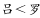

由条件（4）可知：

以上二者可知，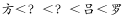，则方、吕、罗的赛道排列只有以下三种可能：

如果是情况一，根据条件（1）（3），田、石分别在2号、3号赛道，许只能在6号赛道；

如果是情况二，根据条件（1）（3），田、石分别在3号、2号赛道，许只能在5号赛道；

如果是情况三，根据条件（1）（3），田、石分别在3号、4号赛道，许只能在1号赛道；

无论哪种情况，许和石之间都是隔着两条赛道，对应C选项。

故正确答案为C。

---

### 第 3 题　qid 2452542 · 类比推理

唇亡：齿寒

- **A**. 安居：乐业
- **B**. 纲举：目张　✅
- **C**. 开卷：有益
- **D**. 惩前：毖后

**答案**：B

**官方解析**

第一步：判断题干词语间逻辑关系。
“唇亡”指嘴唇没有了，“齿寒”指牙齿就会寒冷，即因为“唇亡”，所以“齿寒”，二者为因果对应关系。
第二步：判断选项词语间逻辑关系。
A项：“安居”指安定的住在一起，“乐业”指愉快地从事自己的职业，二者为并列关系，与题干逻辑关系不一致，排除；
B项：“纲举”指提起鱼网上面的总绳，“目张”指一个个网眼都张开，即提起大绳子来，就能让一个个网眼张开了。因为“纲举”，所以“目张”，二者为因果对应关系，与题干逻辑关系一致，当选；
C项：“开卷”指打开书本读书，“有益”指有好处有收获，指的是读书总会有好处的。题干是两件事情之间的因果关系，而C项只有读书一件事，有益是读书本身的效果，二者不是因果关系，与题干逻辑关系不一致，排除；
D项：“惩前”指警戒之前犯的错误，“毖后”指以后谨慎，不致再犯，“惩前”的目的是“毖后”，二者是方式目的对应，与题干逻辑关系不一致，排除。
故正确答案为B。

---

### 第 4 题　qid 2452546 · 类比推理

湄公河：跨境河

- **A**. 黄鹤楼：吊脚楼
- **B**. 青海湖：内陆湖　✅
- **C**. 英国人：西欧人
- **D**. 中山门：凯旋门

**答案**：B

**官方解析**

第一步：判断题干词语间逻辑关系。
“湄公河”是亚洲最重要的跨国水系，因此“湄公河”是“跨境河”，且“湄公河”是“跨境河”中的一个，二者为包容关系中的特指。
第二步：判断选项词语间逻辑关系。
A项：“吊脚楼”为苗族（重庆、贵州等）、壮族、布依族、侗族、水族、土家族等族的传统民居，“黄鹤楼”是武汉标志性建筑，是名胜，因此“黄鹤楼”不是“吊脚楼”，与题干逻辑关系不一致，排除；
B项：“青海湖”是中国最大的“内陆湖”，因此“青海湖”是“内陆湖”，且“青海湖”是“内陆湖”中的一个，二者为包容关系中的特指，与题干逻辑关系一致，当选；
C项：“英国人”是“西欧人”，但英国人是一种统称，有很多英国人，二者不是包容关系中的特指，与题干逻辑关系不一致，排除；
D项：“中山门”和“凯旋门”为并列关系，与题干逻辑关系不一致，排除。
故正确答案为B。

---

### 第 5 题　qid 2452683 · 类比推理

裙子：毛料裙子：时装

- **A**. 酒精：食用酒精：粮食
- **B**. 手机：5G手机：通讯
- **C**. 包子：肉馅包子：蒸笼
- **D**. 小说：历史小说：名著　✅

**答案**：D

**官方解析**

第一步：判断题干词语间逻辑关系。
毛料裙子是裙子的一种，二者是种属关系，毛料裙子是从原材料角度区分的服装，时装是从流行程度上区分的服装，二者是交叉关系。
第二步：判断选项词语间逻辑关系。
A项：食用酒精是酒精的一种，二者是种属关系，粮食经过发酵可以变成食用酒精，二者是原材料对应，与题干逻辑关系不一致，排除；
B项：5G手机是手机的一种，二者是种属关系，通讯是手机的功能，与题干逻辑关系不一致，排除；
C项：肉馅包子是包子的一种，二者是种属关系，蒸笼是蒸包子时需要用到的工具，与题干逻辑关系不一致，排除；
D项：历史小说是小说的一种，二者是种属关系，历史小说是按照创作的题材来划分作品，名著是从知名程度来区分的作品，二者是交叉关系，与题干逻辑关系一致，当选。
故正确答案为D。

---

### 第 6 题　qid 2452685 · 类比推理

春节：饺子：饺皮

- **A**. 中秋节：月饼：蛋黄
- **B**. 清明节：青团：青艾
- **C**. 端午节：粽子：粽叶　✅
- **D**. 元宵节：酒酿：糯米

**答案**：C

**官方解析**

第一步：判断题干词语间逻辑关系。
饺皮是饺子的组成部分，二者是组成关系，且饺皮是饺子的最外层；春节会吃饺子，是传统节日和习俗的对应关系。
第二步：判断选项词语间逻辑关系。
A项：蛋黄可以作为月饼的馅，二者是组成关系，但蛋黄是包在月饼的里层，并不是在月饼的最外层，与题干逻辑关系不一致，排除；
B项：由青艾磨汁加入糯米粉制作青团，青艾汁是制作青团的原材料，二者是原材料对应，与题干逻辑关系不一致，排除；
C项：粽叶是粽子的组成部分，二者是组成关系，粽叶是粽子的最外层；端午节会吃粽子，是传统节日和习俗的对应关系，与题干逻辑关系一致，当选；
D项：糯米是制作酒酿的原材料，二者是原材料对应，与题干逻辑关系不一致，排除。
故正确答案为C。

---

### 第 7 题　qid 2452686 · 类比推理

暴雨：洪灾：排涝

- **A**. 炎热：干旱：减产
- **B**. 假日：拥堵：疏导
- **C**. 路滑：摔倒：骨折
- **D**. 地震：伤亡：救助　✅

**答案**：D

**官方解析**

第一步：判断题干词语间逻辑关系。
暴雨可能会导致洪灾，二者是因果对应，且暴雨是自然灾害；排涝是解决洪灾的方式，二者是方式对应。
第二步：判断选项词语间逻辑关系。
A项：炎热可能会导致干旱，二者是因果对应；干旱可能会导致减产，二者是因果对应，与题干逻辑关系不一致，排除；
B项：假日可能会导致拥堵，二者是因果对应，但是概率很小，且假日也不是自然灾害，与题干逻辑关系不一致，排除；
C项：路滑可能会让人摔倒，二者是因果对应；摔倒可能会导致骨折，二者是因果对应，与题干逻辑关系不一致，排除；
D项：地震可能会导致伤亡，二者是因果对应，且地震是自然灾害；救助是解决地震伤亡的方式，二者是方式对应，与题干逻辑关系一致，当选。
故正确答案为D。

---

### 第 8 题　qid 2452687 · 类比推理

开车不喝酒：喝酒不开车

- **A**. 家是最小国：国是千万家
- **B**. 不到长城非好汉：唯有好汉到长城
- **C**. 你好我好大家好：大家好了你我好
- **D**. 真金不怕火炼：怕火炼的不是真金　✅

**答案**：D

**官方解析**

第一步：判断题干词语间逻辑关系。

不喝酒（B）是开车（A）的必要条件，喝酒（B）是不开车（A）的充分条件 。

第二步：判断选项词语间逻辑关系。

A项：最小国（B）是家（A）的必要条件，国（B）是千万家（A）的充分条件，与题干逻辑关系不一致，排除；

B项：到长城（B）是好汉（A）的必要条件，到长城（B）是好汉（A）的充分条件，与题干逻辑关系不一致，排除；

C项：大家好（B）是你好我好（A）的必要条件，大家好（B）是你好我好（A）的充分条件，与题干逻辑关系不一致，排除；

D项：不怕火炼（B）是真金（A）的必要条件，怕火炼（B）是不是真金（A）的充分条件，与题干逻辑关系一致，当选。

故正确答案为D。

---

### 第 9 题　qid 2452688 · 类比推理

裤子 之于（    ）相当于（    ）之于 笔画

- **A**. 剪刀——色彩
- **B**. 秋裤——画笔
- **C**. 布料——汉字　✅
- **D**. 裁缝——书家

**答案**：C

**官方解析**

逐一代入选项。
A项：剪刀是制作裤子需要的工具，二者是对应关系，色彩和笔画没有必然联系，前后逻辑关系不一致，排除；
B项：秋裤是裤子，二者是种属关系，画笔可以写出笔画，二者为对应关系，前后逻辑关系不一致，排除；
C项：裤子是由布料组成的，二者是组成关系，汉字也是由笔画组成的，二者是组成关系，前后逻辑关系一致，当选；
D项：裁缝制作裤子，二者为主宾关系，书家书写笔画，二者也为主宾关系，但顺序反了，前后逻辑关系不一致，排除。
故正确答案为C。

---

### 第 10 题　qid 2452684 · 类比推理

（    ）之于 实事求是 相当于 南辕北辙 之于 （    ）。

- **A**. 按图索骥——方枘圆凿
- **B**. 上下求索——守株待兔
- **C**. 刻舟求剑——声东击西
- **D**. 量体裁衣——背道而驰　✅

**答案**：D

**官方解析**

逐一代入选项。
A项：按图索骥比喻按照线索去寻找；实事求是是指从实际情况出发，不夸大，不缩小，正确地对待和处理问题，二者没有必然联系，南辕北辙指的是心想往南而车子却向北行，比喻行动和目的正好相反；方枘圆凿比喻格格不入、不相容、不适宜，二者没有必然联系，前后逻辑关系不一致，排除；
B项：上下求索比喻百折不挠，不遗余力地去追求和探索；实事求是是指从实际情况出发，不夸大，不缩小，正确地对待和处理问题，二者没有必然联系，南辕北辙指的是心想往南而车子却向北行，比喻行动和目的正好相反；守株待兔指希望不经过努力而得到成功的侥幸心理，比喻死守狭隘经验，不知变通，二者没有必然联系，前后逻辑关系不一致，排除；
C项：刻舟求剑比喻办事刻板，没有发展的眼光；实事求是是指从实际情况出发，不夸大，不缩小，正确地对待和处理问题，二者没有必然联系，南辕北辙指的是心想往南而车子却向北行，比喻行动和目的正好相反；声东击西指造成要攻打东边的声势，实际上却攻打西边，二者没有必然联系，前后逻辑关系不一致，排除；
D项：量体裁衣本义是按照身材尺寸裁剪衣服，比喻做事从实际情况出发；实事求是是指从实际情况出发，不夸大，不缩小，正确地对待和处理问题，二者为近义关系，南辕北辙指的是心想往南而车子却向北行，比喻行动和目的正好相反；背道而驰比喻行动方向和所要达到的目标完全相反，二者为近义关系，前后逻辑关系一致，当选。
故正确答案为D。

---

### 第 11 题　qid 2452701 · 类比推理

请从四个选项中选出恰当的一项，其特征或规律与题干给出的一串符号的特征或规律最为相符。

- **A**. 

- **B**. 
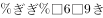

- **C**. 

　✅
- **D**. 

**答案**：C

**官方解析**

第一步：分析题干符号间关系。
从相同符号的位置入手：位置1、4的符号相同；位置2、3、9的符号相同；位置5、7的符号相同；位置6、8的符号相同。
第二步：判断选项符号间关系。
A项：位置2、3符号相同，但和位置9符号不相同，与题干不一致，排除； 
B项：位置2、3符号相同，但和位置9符号不相同，并且位置6、8符号不相同，与题干不一致，排除；
C项：位置1、4的符号相同；位置2、3、9的符号相同；位置5、7的符号相同；位置6、8的符号相同，与题干一致，当选；
D项：位置6、8符号不相同，与题干不一致，排除。
故正确答案为C。

---

### 第 12 题　qid 2452650 · 类比推理

请从四个选项中选出恰当的一项，其特征或规律与题干给出的一串符号的特征或规律最为相符。
由甲申曱甲申甴甲由曱

- **A**. 己已巳乙已巳己已己乙
- **B**. 上下卡卞下卡土下上卞　✅
- **C**. 人八六入八六人八人入
- **D**. 土士二干士二二士土干

**答案**：B

**官方解析**

第一步：分析题干符号间关系。
从相同符号的位置入手：位置1、9的符号相同；位置2、5、8的符号相同；位置3、6的符号相同；位置4、10的符号相同；位置7的符号与其他位置均不相同。
第二步：判断选项符号间关系。
A项：位置7的符号与位置1、9的符号相同，与题干逻辑关系不一致，排除；
B项：位置1、9的符号相同；位置2、5、8的符号相同；位置3、6的符号相同；位置4、10的符号相同；位置7的符号与其他位置均不相同，与题干逻辑关系一致，当选；
C项：位置7的符号与位置1、9的符号相同，与题干逻辑关系不一致，排除；
D项：位置7的符号与位置3、6的符号相同，与题干逻辑关系不一致，排除。
故正确答案为B。

---

### 第 13 题　qid 2452702 · 图形推理

请从所给的四个选项中，选出最恰当的一项填入问号处，使之呈现一定的规律性。

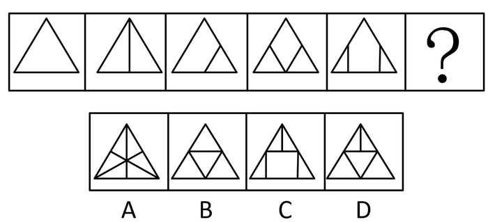

- **A**. A
- **B**. B
- **C**. C　✅
- **D**. D

**答案**：C

**官方解析**

图形元素组成不同，属性无明显规律，考虑数量规律。题干“窟窿”明显，优先考虑面数量，题干面数量分别是1、2、2、3、3，不成规律。继续观察图形特征，发现三角形内部线条交叉明显，考虑点数量，题干交点数分别是3、4、5、6、7，所以“？”处应选择8个交点的图形。A项7个交点，B项6个交点，C项8个交点，D项7个交点，只有C项符合。
故正确答案为C。

---

### 第 14 题　qid 2452703 · 图形推理

请从所给的四个选项中，选出最恰当的一项填入问号处，使之呈现一定的规律性。

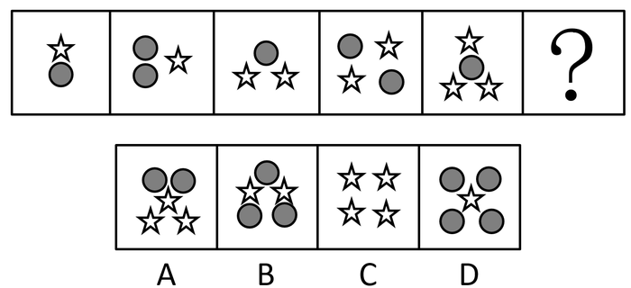

- **A**. A　✅
- **B**. B
- **C**. C
- **D**. D

**答案**：A

**官方解析**

题干图形中出现多个小元素，优先考虑元素的种类和个数。题干每幅图中均有2种小元素，排除C项。小元素个数依次为2、3、3、4、4，无规律。继续观察，题干图形和剩余选项都由两种元素构成，考虑元素换算。根据“第一个图形+第三个图形=2x第二个图形”的原则，换算后可知1个五角星=2个圆形，将五角星全部换算成圆形圆形个数分别是3、4、5、6、7，所以问号处应选一个换算后有8个圆形的选项。A项有8个圆形，B项有7个圆形，D项有6个圆形，只有A项符合。
故正确答案为A。

---

### 第 15 题　qid 2452704 · 图形推理

请从所给的四个选项中，选出最恰当的一项填入问号处，使之呈现一定的规律性。

- **A**. A　✅
- **B**. B
- **C**. C
- **D**. D

**答案**：A

**官方解析**

元素组成不同，优先考虑属性规律。观察发现，题干中的图形均由小黑球和小白球组成，题干图2和图5明显是“S或Z”的变形图，考虑对称性，继续观察，题干所有的图形都是中心对称图形，所以“？”处应选一个中心对称图形，只有A项符合。
故正确答案为A。

---

### 第 16 题　qid 2452675 · 图形推理

下面四个图形中，只有一个是由上面的四个图形拼合（只能通过上、下、左、右平移）而成的，请把它找出来。

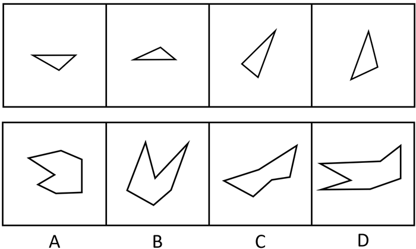

- **A**. A
- **B**. B　✅
- **C**. C
- **D**. D

**答案**：B

**官方解析**

本题考查平面拼合，可采用平行且等长相消的方式解题。消去平行且等长的线段后进行组合即可得到轮廓图，即为B选项。平行且等长相消的方式如下图所示：

故正确答案为B。

---

### 第 17 题　qid 2452676 · 图形推理

下面四个图形中，只有一个是由上面的四个图形拼合（只能通过上、下、左、右平移）而成的，请把它找出来。

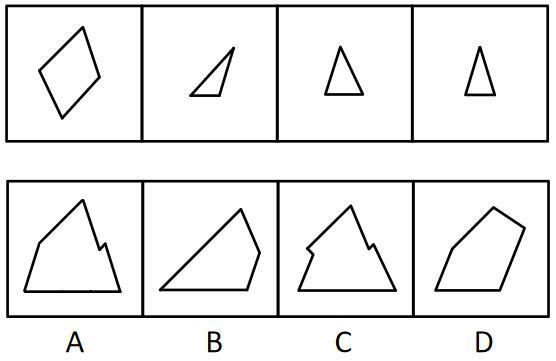

- **A**. A　✅
- **B**. B
- **C**. C
- **D**. D

**答案**：A

**官方解析**

本题考查平面拼合，可采用平行且等长相消的方式解题。消去平行且等长的线段后进行组合即可得到轮廓图，即为A选项。根据平行且等长相消，②应与④相拼合在右下角，③应在左下角。平行且等长相消的方式如下图所示：

故正确答案为A。

---

### 第 18 题　qid 2452677 · 图形推理

下面四个图形中，只有一个是由上面的四个图形拼合（只能通过上、下、左、右平移）而成的，请把它找出来。

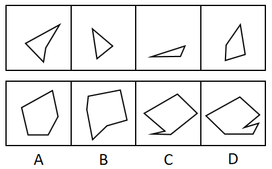

- **A**. A
- **B**. B
- **C**. C
- **D**. D　✅

**答案**：D

**官方解析**

本题考查平面拼合，可采用平行且等长相消的方式解题。消去平行且等长的线段后进行组合即可得到轮廓图，即为D选项。平行且等长相消的方式如下图所示：

故正确答案为D。

---

### 第 19 题　qid 2452678 · 图形推理

下面四个图形中，只有一个是由上面的四个图形拼合（只能通过上、下、左、右平移）而成的，请把它找出来。

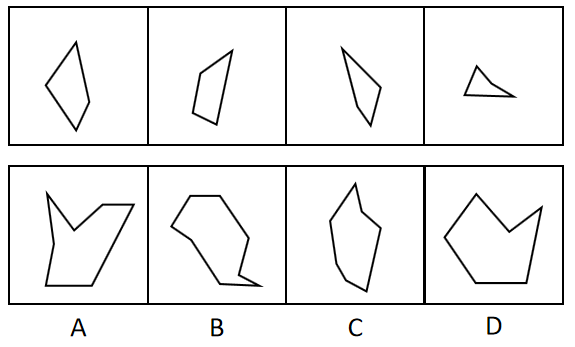

- **A**. A
- **B**. B
- **C**. C
- **D**. D　✅

**答案**：D

**官方解析**

本题考查平面拼合，可采用平行且等长相消的方式解题。消去平行且等长的线段后进行组合即可得到轮廓图，即为D选项。平行且等长相消的方式如下图所示：

故正确答案为D。

---

### 第 20 题　qid 2452679 · 图形推理

右边四个图形中，只有一个是由左边的四个图形拼合（只能通过上、下、左、右平移）而成的，请把它找出来。

- **A**. A
- **B**. B
- **C**. C
- **D**. D　✅

**答案**：D

**官方解析**

本题考查平面拼合，可采用平行且等长相消的方式解题。消去平行且等长的线段后进行组合可得到轮廓图，即为D项。平行且等长相消的方式如下图所示：

故正确答案为D。

---

### 第 21 题　qid 2452689 · 图形推理

左边给定的是纸盒外表面的展开图，右边哪一项能由它折叠而成？请把它找出来。

- **A**. A　✅
- **B**. B
- **C**. C
- **D**. D

**答案**：A

**官方解析**

将题干展开图中的面依次标注为面a、b、c、d，如下图：

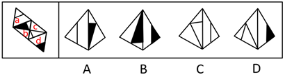

A项：与题干一致，当选；

B项：选项由面b、d构成，题干展开图中面b的白三角挨着面d（蓝色的线），选项中面b的黑三角挨着面d（蓝色的线），选项和题干不一致，排除；

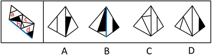

C项：选项由面a、c构成，题干展开图中面a中的线挨着公共边（绿色的线），选项中面a中的线没有挨着公共边（绿色的线），选项与题干不一致，排除；

D项：选项由面c、d构成，题干展开图中面c和面d的公共边（红色的线）与面c内的直线有交点，选项中面c和面d的公共边（红色的线）与面c内的直线无交点，选项与题干不一致，排除。

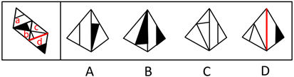

故正确答案为A。

---

### 第 22 题　qid 2452690 · 图形推理

下面给定的是纸盒外表面的展开图，右边哪一项能由它折叠而成？请把它找出来。

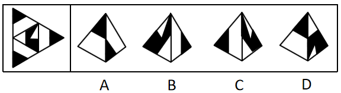

- **A**. A
- **B**. B
- **C**. C　✅
- **D**. D

**答案**：C

**官方解析**

将题干展开图中的面依次标注为面a、b、c、d，如下图：

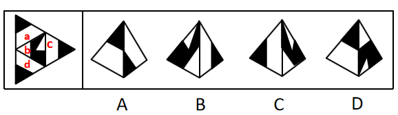

A项：选项由面a、c、d这三个面其中两个面构成，题干展开图中面a和面c，面a和面d，面c和面d，这三组面的公共边（红色的线）都是两个小黑三角并排挨着，选项中的公共边（红色的线）两个小黑三角是错位挨着，选项与题干不一致，排除；

B项：选项由面b、c构成，题干中面b从黑尖开始顺时针画边，边1到边2（绿色的线）中间经过白色的角，而选项中以此为顶点顺时针画边，边1到边2（绿色的线）中间经过的是半黑半白的角，选项与题干不一致，排除；

C项：与题干一致，当选；

D项：选项由面b和面a、c、d其中的一个面构成，题干展开图中面b和面a，面b和面c，面b和面d，这三组面的公共边（蓝色的线）都没有与顶角的小黑三角形挨着，而选项中的公共边（蓝色的线）与顶角的小黑三角形挨着，选项与题干不一致，排除。

故正确答案为C。

---

### 第 23 题　qid 2452691 · 图形推理

下面给定的是纸盒外表面的展开图，右边哪一项能由它折叠而成？请把它找出来。

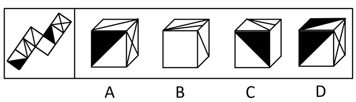

- **A**. A
- **B**. B
- **C**. C
- **D**. D　✅

**答案**：D

**官方解析**

将题干展开图中的面依次标号，如下图：

A项：选项由面c、e、f构成，题干中三个面的公共点（红色的点）引出面c和面f的两根线，选项中这三个面的公共点（红色的点）只引出面f的一根线，选项与题干不一致，排除；

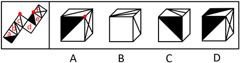

B项：选项由面b、c、d构成，以面b中两根线的交点（绿色的点）为起点在面b中顺时针画边，题干中边3挨着面a，选项中边3挨着面c，选项与题干不一致，排除；

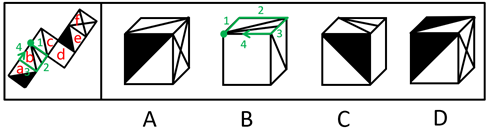

C项：选项由面a、b、d构成，以面b中两根线的交点（绿色的点）为起点在面b中顺时针画边，题干中边3挨着面a的白三角，选项中边3挨着面a的黑三角，选项与题干不一致，排除；

D项：选项与题干一致，当选。

故正确答案为D。

---

### 第 24 题　qid 2452692 · 图形推理

下面给定的是纸盒外表面的展开图，右边哪一项能由它折叠而成？请把它找出来。

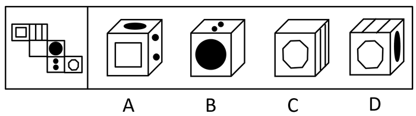

- **A**. A
- **B**. B　✅
- **C**. C
- **D**. D

**答案**：B

**官方解析**

将原展开图标上序号如下图，逐一进行分析。

A项：选项出现了面a和面d，面e，而面a和面d为相对面，不能同时出现，选项与题干不一致，排除；

B项：选项出现了面c，面d，面e，选项与题干一致，当选；

C项：选项出现了面b，面c，面f，而面c和面f为相对面，不能同时出现，选项与题干不一致，排除；

D项：选项出现了面b，面d，面f，以面b为唯一面，以面b和面d的公共边为唯一边（如图中绿线所示）。在展开图和选项的面b上，以唯一边为起始边，沿着顺时针方向同时进行画边，展开图中边2所对的面为面c，选项中边2所对的面不是面c，选项与题干不一致，排除。

故正确答案为B。

---

### 第 25 题　qid 2452625 · 图形推理

请从所给的四个选项中，选出最恰当的一项填入问号处，使之呈现一定的规律性。

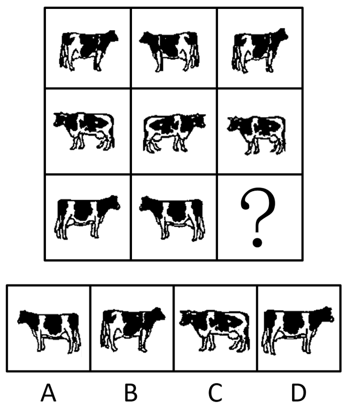

- **A**. A
- **B**. B
- **C**. C
- **D**. D　✅

**答案**：D

**官方解析**

本题考查图形的实际意义，寻找最大共同点。九宫格优先横行看，观察发现，题干每行图片均为奶牛，第一行中奶牛头部的朝向左右交替，且奶牛身上的花纹相同，第二行也为此规律，故第三行运用规律，前两幅图奶牛的头部朝向分别为右、左，故问号处图形的奶牛头部应朝右，排除A、C项，B项奶牛身上的花纹与前两幅图不同，排除。
故正确答案为D。

---

### 第 26 题　qid 2452693 · 图形推理

请从所给的四个选项中，选出最恰当的一项填入问号处，使之呈现一定的规律性。

- **A**. A　✅
- **B**. B
- **C**. C
- **D**. D

**答案**：A

**官方解析**

元素组成相似，优先考虑样式规律，且相同线条重复出现，故考虑样式规律中的加减同异。九宫格优先看横行，第一行中，图1逆时针旋转90˚，外框保留，内部元素与图2求异得到图3；经验证，第二行也满足此规律；第三行，应用此规律，选择一个图1逆时针旋转90˚，外框保留，内部元素与图2求异得到的图形，因此“？”处应该选择A项。
故正确答案为A。

---

### 第 27 题　qid 2452532 · 图形推理

左图为给定的立体，从任意角度剖开，右边哪一项不可能是它的截面图？

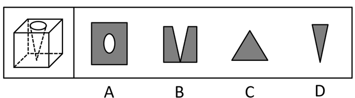

- **A**. A　✅
- **B**. B
- **C**. C
- **D**. D

**答案**：A

**官方解析**

本题考查截面图，逐一分析选项。

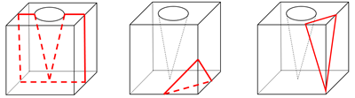

A项：无法切出。

B项：从图形正上方切入，垂直向下切即可得到，排除；

C项：从图形六面体棱上切入，斜切，保证三条边等长，即可得到，排除；

D项：从图形六面体棱上切入，斜切，保证两条边等长，即可得到，排除。

本题为选非题，故正确答案为A。

注：A项截面中椭圆和长方形的中心可能存在重合的情况，但无法确定椭圆和长方形的大小比例、椭圆与长方形框的距离比例、椭圆和长方形的中心重合等是否可以同时满足，而BCD三个选项可以确定能够截出，故粉笔答案定为A项。

---

### 第 28 题　qid 2452541 · 逻辑判断

党内存在的很多问题都同政治问题相关联。不从政治上认识问题、解决问题，就会陷入头痛医头、脚痛医脚的被动局面，就无法从根本上解决问题。提高政治能力，很重要的一条就是要善于从政治上分析问题、解决问题。只有从政治上分析问题才能看清本质，只有从政治上解决问题才能抓住根本。
根据以上陈述，可以得出以下哪项？

- **A**. 只有从政治上认识问题、解决问题，才能从根本上解决问题　✅
- **B**. 如果善于从政治上分析问题、解决问题，就能提高政治能力
- **C**. 一旦陷入头痛医头、脚痛医脚的被动局面，就无法从根本上解决问题
- **D**. 如果没有看清本质、抓住根本，说明没有从政治上分析问题、解决问题

**答案**：A

**官方解析**

第一步：翻译题干。

①（政治上认识问题、解决问题）陷入头痛医头、脚痛医脚的被动局面

②（政治上认识问题、解决问题）根本上解决问题

③提高政治能力善于从政治上分析问题、解决问题

④看清本质政治上分析问题

⑤抓住根本政治上解决问题

第二步：逐一分析选项。

A项：翻译为根本上解决问题政治上认识问题、解决问题，是对②的否后，否后必否前，可以推出，当选；

B项：翻译为善于从政治上分析问题、解决问题提高政治能力，是对③的肯后，肯后得不到确定结论，无法推出，排除；

C项：翻译为陷入头痛医头、脚痛医脚的被动局面根本上解决问题，是对①的肯后，肯后得不到确定结论，无法和②中的“根本上解决问题”串在一起，无法推出，排除；

D项：翻译为（看清本质、抓准根本）（政治上分析问题、解决问题），是对④、⑤的否前，否前得不到确定结论，无法推出，排除。

故正确答案为A。

---

### 第 29 题　qid 2452723 · 逻辑判断

为了研究早餐前锻炼和早餐后锻炼对健康的影响，研究人员进行了连续8周的实验，其中，实验组在早餐前锻炼，对照组在早餐后锻炼。结果发现，实验组锻炼过程中平均燃烧的脂肪量是对照组的2倍。体检结果进一步显示，实验组胰岛素反应能力得到了改善，而对照组没有。研究人员由此认为，相较于早餐后锻炼，早餐前锻炼更能降低罹患心血管疾病的风险。
以下哪项如果为真，最能支持上述研究人员的观点？

- **A**. 胰岛素反应能力强能有效稳定人体的血糖含量
- **B**. 脂肪量过高是罹患心血管疾病的主要原因　✅
- **C**. 饱食状态下锻炼常常会引起胃穿孔等意外
- **D**. 实验对象都是已经患有心血管疾病的个体

**答案**：B

**官方解析**

第一步：找出论点和论据。
论点：相较于早餐后锻炼，早餐前锻炼更能降低罹患心血管疾病的风险。
论据：实验组（即早餐前锻炼）锻炼过程中的平均燃烧的脂肪量是对照组（即早餐后锻炼）的2倍。实验组胰岛素反应能力得到了改善，而对照组没有。
论点强调的是早餐前锻炼和降低患心血管疾病风险之间的关系。论据说的是早餐前锻炼和脂肪量降低、胰岛素反应能力改善之间的关系。论点论据话题不一致，优先考虑搭桥。
第二步：逐一分析选项。
A项：论点说的是可以降低罹患心血管疾病的风险，该项说的是能有效稳定血糖含量，而血糖含量和心血管疾病之间是否存在必然关系并不确定，无法加强，排除；
B项：脂肪量过高是罹患心血管疾病的主要原因，所以脂肪量燃烧得多，患心血管疾病的风险就降低，在脂肪量和心血管疾病之间建立起联系，属于搭桥项，可以加强，当选；
C项：论点说的是早餐前锻炼和降低心血管疾病风险的关系，该项说的是餐后锻炼可能产生的问题，话题不一致，无法加强，排除；
D项：论点说的是降低罹患心血管疾病的风险，即减少得病的概率，该项说的是所有实验对象都已经患有心血管疾病，与题干论点无关，无法加强，排除。
故正确答案为B。

---

### 第 30 题　qid 2452550 · 逻辑判断

每个“熊孩子”的背后都有一个“熊家长”。这些“熊家长”对“熊孩子”百依百顺，溺爱娇惯，这使得“熊孩子”以自我为中心，缺乏规则意识，容易产生过激的非理性行为。当“熊孩子”有些行为对他人和社会造成伤害时，“熊家长”也会以“他还是个孩子”来护短辩解，要求原谅。
以下哪项最可能是“熊家长”辩解所隐含的前提？

- **A**. “熊孩子”犯错误不是故意为之
- **B**. 只要是孩子就难免犯错
- **C**. “熊孩子”长大后会成为好孩子
- **D**. 孩子犯错误应当被原谅　✅

**答案**：D

**官方解析**

第一步:找出论点和论据。
论点:“熊家长”要求原谅“熊孩子”。
论据:“熊家长”以“他还是个孩子”来护短辩解。
题干中论点说的是要求他人原谅“熊孩子”，论据说的是“熊孩子”还是个孩子，论点论据话题不一致，因此考虑在“原谅”和“孩子”之间搭桥。
第二步:逐一分析选项。
A项：该项说的是犯错误不是故意为之，与“被原谅”无必然关系，不能加强，排除；
B项：该项说的是孩子就难免犯错，与“被原谅”无必然关系，不能加强，排除；
C项：该项说的是孩子长大后会成为好孩子，与“被原谅”无必然关系，不能加强，排除；
D项：在“原谅”和“孩子”之间搭桥，为搭桥项，是家长辩解的前提，可以加强，当选。
故正确答案为D。

---

### 第 31 题　qid 2452725 · 逻辑判断

市民文化周期间，文化部门要在桃源、东山、南浦、九华四个社区分别举办书展、画展、影展和文博展四种不同的文化惠民活动，由于时间场地限制，每个社区只能举办一种活动。已知：
（1）桃源社区既不办影展，也不办画展；
（2）东山社区既不办书展，也不办画展；
（3）如果东山社区不办画展，则南浦社区不办书展；
（4）如果九华社区不办文博展，则南浦社区举办书展。
据此可以推出以下哪项？

- **A**. 东山社区有可能举办文博展
- **B**. 画展不可能在南浦社区举办
- **C**. 九华社区既没办影展，也没办画展　✅
- **D**. 书展要么是南浦社区办，要么是九华社区办

**答案**：C

**官方解析**

第一步：翻译题干。

要求为每个社区只能举办一种活动；

桃源社区影展 且画展

东山社区书展 且画展

东山社区画展  南浦社区书展

九华社区文博展  南浦社区书展

第二步：再推理。

结合确定信息和最大信息，和可知，东山社区不办画展，可知南浦社区不办书展。结合条件，逆否等价规则，可得九华社区办文博展；又根据要求每个社区只能举办一种活动。所以可得：九华社区既没办影展，也没办画展。

故正确答案为C。

---

### 第 32 题　qid 2452560 · 逻辑判断

某部门新录用甲、乙、丙三名工作人员，他们各自的籍贯为江苏、安徽、浙江中的某个省。张红、李梅和王芹对他们的籍贯有如下猜测：
张红：甲是浙江人，乙是安徽人，丙也是浙江人；
李梅：甲是浙江人，乙是江苏人，丙不是江苏人；
王芹：甲是江苏人，乙是浙江人，丙也是江苏人。
已知，对甲、乙、丙的籍贯，上述三人均猜对1个，猜错2个。
根据以上信息，以下哪项是可能的？

- **A**. 甲是江苏人，乙是安徽人，丙是浙江人
- **B**. 甲是浙江人，乙是江苏人，丙是江苏人
- **C**. 甲是安徽人，乙是浙江人，丙是江苏人
- **D**. 甲是江苏人，乙是安徽人，丙是安徽人　✅

**答案**：D

**官方解析**

题干条件不确定，优先采用代入法。
将A项代入，张红所说的第一句话错误，后面两句正确，不符合题干要求“猜对1个，猜错2个”，排除；
将B项代入，张红所说的第一句话正确，后面两句错误；李梅前两句正确，最后一句话错误，不符合题干要求“猜对1个，猜错2个”，排除；
将C项代入，张红所说的三句话均错误，不符合题干要求“猜对1个，猜错2个”，排除；
将D项代入，张红第二句话正确其余错误；李梅第三句话正确其余错误；王芹第一句话正确其余错误，符合题干要求，当选。
故正确答案为D。

---

### 第 33 题　qid 2452726 · 逻辑判断

某款策略类竞技游戏在所有时刻都有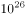种可以选择的操作，并且是一种不完全信息的游戏——玩家通常看不到对手在做什么，因此就无法预测下一步操作。最近，某互联网公司开发了能够玩该款游戏的智能机器人AlphaStar，在一周内就获得了宗师等级，这意味着它在该地区九万多名玩家中排在前。游戏开发者据此断言，AlphaStar在游戏策略上已经和人类持平或者胜过人类了。

以下哪项如果为真，最能支持上述游戏开发者的论断？

- **A**. AlphaStar的反应速度被限制在人类的反应水平　✅
- **B**. AlphaStar在游戏中隐藏了自己是机器人的身份
- **C**. AlphaStar汇集了人工智能最新发展的成果和技术
- **D**. AlphaStar可以利用的支持决策的信息量远超人类

**答案**：A

**官方解析**

第一步：找出论点和论据。

论点：AlphaStar在游戏策略上已经和人类持平或者胜过人类了。

论据：某互联网公司开发了能够玩该游戏的智能机器人AlphaStar，在一周内就获得了宗师等级，排名在该地区九万多名玩家中的前。

论据说的是AlphaStar一周内获得等级高，论点说的是AlphaStar在游戏策略上已经和人类持平或者胜过人类了，话题一致，优先考虑补充论据。

第二步：逐一分析选项。

A项：反应速度被限制在人类的反应水平，排除了其他因素的干扰，从而说明AlphaStar在游戏策略上真的已经和人类持平或者胜过人类，可以加强，当选；

B项：隐藏自己机器人的身份，与是否在游戏策略上已经和人类持平或者胜过人类无关，属于无关选项，排除；

C项：只是说明它汇集了人工智能最新发展的成果和技术，但并不能支持他是否在游戏策略上已经和人类持平或者胜过人类，排除；

D项：可以利用的支持决策的信息量远超人类，说明获胜也可能是因为本身信息量多，而不是仅仅是游戏策略强，削弱了论点中游戏策略导致获胜的结论，他因削弱，排除。

故正确答案为A。

附：通过查证原文，本题答案为A项。

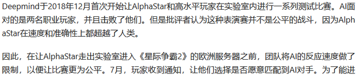

---

### 第 34 题　qid 2452555 · 逻辑判断

张、王、李、赵四人计划在6至9月中分别选择一个月休年假，但部门人手短缺，一个月中不能有两个人休假。赵不希望安排在6月，张要求不要安排在9月，李表示6月或8月都可以，王提出只能安排在7、8月份。
如四人的要求均得到满足，则可以推出以下哪项？

- **A**. 张只能安排在6月或者7月
- **B**. 只要李不在6月，王一定会在7月　✅
- **C**. 如果李安排在8月，那么张安排在7月
- **D**. 如果王安排在7月，那么李安排在6月

**答案**：B

**官方解析**

本题信息较多，可考虑列表。

整理题干信息如下：

（1）一个月中不能有两个人休假；

（2）赵不在6月；

（3）张不在9月；

（4）李6月或8月；

（5）王只在7月或8月。

根据题干填入信息如下：

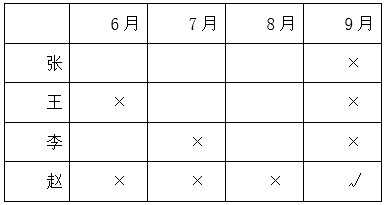

所以由表格可知赵在9月份。其他信息不确定。所以考虑代入选项。

A项：根据表格可以发现张可以安排在6月、7月和8月，故选项说法错误，排除；

B项：如果李不安排在6月，此时6月、7月和9月都不安排李，故李只能在8月，那么王一定会在7月，该项说法正确，当选；

C项：如果李安排在8月，那么王在7月，此时张只能安排在6月，选项说法错误，排除；

D项：如果王安排在7月，即张、李、赵都不能安排在7月，但此时李可以在6月也可以在8月，故该项选项错误，排除。

故正确答案为B。

---

### 第 35 题　qid 2452547 · 逻辑判断

人类学家测量了历史上各个时期的人类头骨之后发现，当代成人的脑容量平均为1349毫升，相比中石器时代人类的脑容量，男性减少了，女性减少了。研究者认为，在分工日益明确的时代，富有合作精神的人比其他人有更多的生存和繁衍机会，“最友好者生存”是导致人类大脑不断缩小的重要原因。

以下哪项如果为真，最能支持上述结论？

- **A**. 当代脑科学研究表明，脑容量更小会使得人类更富有合作精神
- **B**. 合作会减少人类的攻击性，而攻击性的减少会使人身体变轻、脑容量减少　✅
- **C**. 随着气温的升高，人们对体重的要求降低，身体的缩小必然带来大脑的缩小
- **D**. 外部信息存储介质的出现减轻了大脑的记忆负担，人类的大脑随之缩小

**答案**：B

**官方解析**

第一步：找出论点和论据。
论点：在分工日益明确的年代，富有合作精神的人比其他人有更多的生存和繁衍机会，“最友好者生存”是导致人类大脑不断缩小的重要原因。
论据:无。
本题只有论点没有论据，加强优先考虑补充论据，即解释原因或举例子。
第二步：逐一分析选项。
A项：选项说的是脑容量更小让人更具有合作精神，而论点说的是合作会导致人类大脑不断缩小，该项颠倒了论点中的因果，因果倒置，无法加强，排除；
B项：选项说的是合作会减少攻击性，从而使脑容量减少，解释了为什么合作会导致人类大脑不断缩小，补充论据，可以加强，当选；
C项：选项说的是身体的缩小会让大脑缩小，而论点指出合作是导致大脑缩小的重要原因，身体的缩小与合作是否为重要原因无关，无法加强，排除；
D项：选项说的是外部存储介质会让大脑缩小，而论点指出合作是导致大脑缩小的重要原因，外部存储介质与合作是否为重要原因无关，无法加强，排除；
故正确答案为B。

---

### 第 36 题　qid 2452597 · 定义判断

造血式扶贫：指政府部门或社会力量通过持续性地扶持农村产业发展，拓宽农产品销售及消费渠道等，帮助贫困地区、贫困人口增收脱贫的扶贫方式。
下列属于造血式扶贫的是

- **A**. 
某县按照“东部林果、旅游，西部设施农业”的整体思路，一直坚持“”的产业发展模式，使农民年收入翻了一番，人均达到近万元
　✅
- **B**. 
某县扶贫办组织了200多名山区农民，经过严格培训，输送到东南沿海城市工作。这些农民每月都按时寄钱回家，家里的日子越过越红火

- **C**. 
县农科所资助某村贫困家庭100头种羊，多次对他们进行科学养羊技术培训，并安排技术人员进行“一对一”的专业指导

- **D**. 
为了解决全村苹果严重滞销的问题，村里的几个年轻人共同开办了一个水果直销网店。不到半月时间，所有苹果就销售一空

**答案**：A

**官方解析**

第一步：找出定义关键词。

“政府部门或社会力量”、“持续性地扶持农村产业发展，拓宽农产品销售及消费渠道”、“帮助贫困地区、贫困人口增收脱贫”。

第二步：逐一分析选项。

A项：某县符合“政府部门或社会力量”，一直坚持“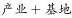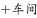”的产业发展模式，符合“持续性地扶持农村产业发展，拓宽农产品销售及消费渠道”，使农民年收入翻了一番，人均达到近万元，符合“帮助贫困地区、贫困人口增收脱贫”，符合定义，当选；

B项：某县扶贫办组织了200多名山区农民，经过严格培训，输送到东南沿海城市工作，不符合“持续性地扶持农村产业发展，拓宽农产品销售及消费渠道”，不符合定义，排除；

C项：县农科所资助某村贫困家庭100头种羊，多次对他们进行科学养羊技术培训，不符合“持续性地扶持农村产业发展，拓宽农产品销售及消费渠道”，不符合定义，排除；

D项：为了解决全村苹果严重滞销的问题，村里的几个年轻人共同开办了一个水果直销网店，不符合“政府部门或社会力量”，且没有提到贫困，不符合“帮助贫困地区、贫困人口增收脱贫”，不符合定义，排除。

故正确答案为A。

---

### 第 37 题　qid 2452602 · 定义判断

分众化教育：指根据受众的具体差异，用典型案例分别进行宣传，以激发情感共鸣，达成特定目标的教育方式。
下列属于分众化教育的是

- **A**. 某市组织全市技术创新能手分别深入到所在行业部门，分享自己的创新经验，极大地激发了各行各业人士的创新热情　✅
- **B**. 某地组织的“五一劳动奖章”获得者宣讲团多次进行巡回报告，他们的先进事迹深深地打动了前来听讲的市民
- **C**. 每天傍晚，某学校附近地铁口都有艺术教育培训机构的招生人员散发传单，上面印着考入名校的学生彩照和成绩
- **D**. 在“不忘初心、牢记使命”主题教育中，某区组织党员干部分系统观看专题纪录片《警钟长鸣》，取得了预期效果

**答案**：A

**官方解析**

第一步：找出定义关键词。
“根据受众的具体差异，用典型案例分别进行宣传”、“激发情感共鸣，达成特定目标”。
第二步：逐一分析选项。
A项：某市组织全市技术创新能手分别深入到所在行业部门，分享自己的创新经验，符合“根据受众的具体差异，用典型案例分别进行宣传”，极大地激发了各行各业人士的创新热情，符合“激发情感共鸣，达成特定目标”，符合定义，当选； 
B项：某地组织的“五一劳动奖章” 获得者宣讲团多次进行巡回报告，不符合“根据受众的具体差异，用典型案例分别进行宣传”，不符合定义，排除；
C项：每天傍晚，某学校附近地铁口都有艺术教育培训机构的招生人员散发传单，不符合“根据受众的具体差异，用典型案例分别进行宣传”，不符合定义，排除；
D项：某区组织党员干部分系统观看专题纪录片《警钟长鸣》，不符合“根据受众的具体差异，用典型案例分别进行宣传”，不符合定义，排除。
故正确答案为A。

---

### 第 38 题　qid 2452605 · 定义判断

喘息服务：指由政府部门购买服务，为有失能失智老人的低收入家庭或特殊困难家庭提供临时性援助，让常年在家照顾亲属者得到短暂休息。
下列属于喘息服务的是

- **A**. 由于儿女移居国外，年迈的赵先生夫妇只得相依为命，平时一起去市场买日常用品，一起去医院就诊取药。社区了解情况后，专门雇人每天上门半小时帮他们料理家务
- **B**. 杨先生10多年前中风，老伴杜女士为了照料他，每天忙得团团转，连自己生病都没时间去医院。今年初，街道派护工不定期上门服务，让她能有时间到医院看病或稍事休息　✅
- **C**. 父亲去世后，年过六旬的张先生独自承担起了照顾精神病妹妹的重任，从来没有睡过一个安稳觉。不久前，老张专门请了一名钟点工照看妹妹，感觉轻松了许多
- **D**. 患健忘症的陈奶奶经常独自出门闲逛，多次走失，靠低保维持生活的儿子无力照顾。区民政部门了解情况后，把陈奶奶送进养老院，并承担了所有费用

**答案**：B

**官方解析**

第一步：找出定义关键词。
“政府部门购买服务”、“为有失能失智老人的低收入家庭或特殊困难家庭提供临时性援助”、“让常年在家照顾亲属者得到短暂休息”。
第二步：逐一分析选项。
A项：由于儿女移居国外，社区专门雇人每天上门半小时帮年迈的赵先生夫妇料理家务，不符合“为有失能失智老人的低收入家庭或特殊困难家庭提供临时性援助”，也不符合“让常年在家照顾亲属者得到短暂休息”，不符合定义，排除；
B项：杨先生10多年前中风，今年初街道派护工不定期上门服务，让杜女士能有时间到医院看病或稍事休息，符合“政府部门购买服务”、“为有失能失智老人的低收入家庭或特殊困难家庭提供临时性援助”、“让常年在家照顾亲属者得到短暂休息”，符合定义，当选；
C项：老张专门请了一名钟点工照看妹妹，不符合“政府部门购买服务”，不符合定义，排除；
D项：患健忘症的陈奶奶多次走失，区民政部门了解情况后，把陈奶奶送进养老院，并承担了所有费用，不符合“为有失能失智老人的低收入家庭或特殊困难家庭提供临时性援助”，不符合定义，排除。
故正确答案为B。

---

### 第 39 题　qid 2452617 · 定义判断

口述登记制：指办理个体工商户登记手续时，申请人无需亲自填表，只要口述各项信息，核对确认后即可当场领取营业执照的登记方式。
下列属于口述登记制的是

- **A**. 赵先生到市场监督管理部门办理个体户注册登记手续。在窗口人员指导下按照“申请-受理-核准”的步骤，半小时就办好了手续。第二天就拿到了自己的营业执照
- **B**. 汪先生打算申请运动器材店营业执照。他从网上弄清了申请程序，第二天来到区市场监督管理部门登记处，简要地回答了几个问题，不一会儿营业执照就办好了　✅
- **C**. 程先生到市场监督管理部门办理花店营业执照。按照现场人员的指导填好表格，经办人员输入系统打印出信息登记表，程先生签名确认后就拿到了营业执照
- **D**. 蔡先生到市场监督管理部门办理营业执照注销手续。在指定窗口完成自动身份识别后，回答了工作人员的询问，很快就办完了全部手续

**答案**：B

**官方解析**

第一步：找出定义关键词。
“办理个体工商户登记手续时”、“无需亲自填表”、“口述信息”、“核对后当场领取营业执照”。
第二步：逐一分析选项。
A项：赵先生在窗口人员的指导下按照“申请-受理-核准”的步骤，是本人亲自办理，但没有体现“口述信息”即可办理，而且，赵先生第二天拿到营业执照，不符合“核对后当场领取营业执照”，不符合定义，排除；
B项：汪先生在区市场监督管理部门，回答几个问题符合“口述信息”，然后“不一会儿营业执照就办好了”，符合“核对后当场领取营业执照”，符合定义，当选；
C项：程先生按照现场人员的指导填好表格，是本人亲自填表，不符合“无需亲自填表”，不符合定义，排除；
D项：蔡先生办理营业执照注销手续，不符合“办理个体工商户登记手续”，不符合定义，排除。
故正确答案为B。

---

### 第 40 题　qid 2452619 · 定义判断

垃圾资源化：指垃圾进行分选处理后，成为无污染的循环再利用原料，进而加工、转化为再生资源的垃圾处理方式。
下列属于垃圾资源化的是：

- **A**. 某市为了缓解因煤炭资源过度开采造成的地面下陷问题，新建了一个大型垃圾场，经过分类后的城市生活垃圾每天都会运到这里集中填埋
- **B**. 垃圾焚烧发电需要投入巨大资金，随着相关技术不断进步，电能产量越来越高，尽管排放问题还没有彻底解决，但它仍然是目前比较常见的城市垃圾处理方式
- **C**. 乡村垃圾大多采用分类处理的方法：有回收价值的，挑选出来后稍加处理卖给需要的人，其他大部分卖到废品回收站点，无回收价值的，堆到指定地点
- **D**. 某市正在推行新的垃圾处理方式：将厨余垃圾等有机物分离出来，制成有机肥料，将砖头瓦块、玻璃陶瓷等无机物分离出来，制成新型免烧砖　✅

**答案**：D

**官方解析**

第一步：找出定义关键词。
“垃圾进行分选处理后”、“成为无污染的循环再利用原料”、“加工、转化为再生资源”。
第二步：逐一分析选项。
A项：新建垃圾场，将分类后的城市生活垃圾集中填埋，只是简单填埋，没有将垃圾转化为可循环的原料，不符合“成为无污染的循环再利用原料”、“加工、转化为再生资源”，不符合定义，排除；
B项：垃圾焚烧发电是常见的垃圾处理方式，只是对垃圾进行焚烧，没有体现对垃圾的分类处理，不符合“垃圾进行分选处理后”，而且焚烧垃圾的排放问题没有彻底解决，不符合“成为无污染的循环再利用原料”，不符合定义，排除；
C项：将有回收价值的垃圾卖掉，将无回收价值的垃圾堆放到指定地点，只涉及垃圾的回收和变卖，但没有体现出将垃圾转化成其他资源，不符合“加工、转化为再生资源”，不符合定义，排除；
D项：将厨余垃圾等有机物分离出来，制成肥料，将无机物分离出来，制成免烧砖，符合“垃圾进行分选处理后”，而且将分选处理后的垃圾制成其他资源，符合“成为无污染的循环再利用原料”、“加工、转化为再生资源”，符合定义，当选。
故正确答案为D。

---

### 第 41 题　qid 2452621 · 定义判断

良性冲突：指管理者设法把企业内部的小冲突转化为凝聚力，推动企业发展的管理策略。
下列属于良性冲突的是

- **A**. 公司召开员工代表大会修订奖惩条例，与会者的意见出现了巨大分歧，大家争得面红耳赤，最后少数服从多数，通过了该条例的修订
- **B**. 某企业面临着一项急需解决的技术难题，总经理提议谁能提出解决方案就可以担任项目主管并获得10万元重奖。这一提议遭到部分与会者的反对，最终未能通过
- **C**. 徐先生和景先生是某公司的一对老搭档，在一些重大决策问题上经常意见相左，互不相让，最终却总能达成一致。在他们的领导下，公司业绩稳步提高
- **D**. 市场部蒋经理听到销售员反映产品质量问题后，向质检部反馈意见，与生产部经理产生了矛盾。公司组织三个部门多次开会协调，最终建立了良好沟通机制　✅

**答案**：D

**官方解析**

第一步：找出定义关键词。
“管理者”、“把企业内部小冲突转化为凝聚力”、“推动企业发展”。
第二步：逐一分析选项。
A项：与会者意见出现巨大分歧，不符合“企业内部小冲突”，不符合定义，排除； 
B项：提议遭到部分与会者反对，最终未能通过，不符合“将小冲突转化为凝聚力”，不符合定义，排除；
C项：徐先生和景先生是老搭档，在重大决策问题上经常意见相左，不符合“企业内部小冲突”，不符合定义，排除；
D项：市场部蒋经理与生产部经理产生矛盾，公司开会协调建立良好沟通机制，符合“将小冲突转化为凝聚力”，而且良好的沟通机制利于公司发展，符合“推动企业发展”，符合定义，当选。
故正确答案为D。

---

### 第 42 题　qid 2452564 · 定义判断

乡贤调解：指村民之间发生纠纷后，由具有较高威望和影响力的乡村贤达人士出面解决纠纷的民间调解方式。
下列不属于乡贤调解的是

- **A**. 老周与老马因借贷纠纷对簿公堂，法院受理后到村里开庭，并请了几位乡贤旁听，经过现场调解，双方达成谅解　✅
- **B**. 老肖年轻时走南闯北，见多识广，全村上上下下都很敬重他。张家的牛吃了李家的草，高家的水流进了齐家的房，村民只要找到他，问题一下就解决了
- **C**. 老于从镇司法所退休回村后，用老百姓的“土办法”解决了蒋家婆媳不和的老大难问题。从此以后，村里一旦发生什么纠纷，大家都爱跑来请他去评理
- **D**. 老张和邻居老李因为家门口的路闹得不可开交，把路堵死。家住村头的老支书过去调解，两人一见到他，火气就消了一大半，很快握手言好，开通了道路

**答案**：A

**官方解析**

第一步：找出定义关键词。
“村民之间发生纠纷后”、“较高威望和影响力的乡村贤达人士出面解决纠纷的民间调解方式”。
第二步：逐一分析选项。
A项：老周与老马因借贷纠纷对簿公堂，法院受理后到村里开庭，是法院作出调解，不符合“较高威望和影响力的乡村贤达人士出面解决纠纷的民间调解方式”，不符合定义，当选； 
B项：张家的牛吃了李家的草，高家的水流进了齐家的房，符合“村民之间发生纠纷后”，村民只要找到他，问题一下就解决了，符合“较高威望和影响力的乡村贤达人士出面解决纠纷的民间调解方式”，符合定义，排除；
C项：用老百姓的“土办法”解决了蒋家婆媳不和的老大难问题，符合“村民之间发生纠纷后”、“较高威望和影响力的乡村贤达人士出面解决纠纷的民间调解方式”，符合定义，排除；
D项：老张和邻居老李因为家门口的路闹得不可开交，符合“村民之间发生纠纷后”，家住村头的老支书过去调解，两人一见到他，火气就消了一大半，很快握手言好，开通了道路，符合“较高威望和影响力的乡村贤达人士出面解决纠纷的民间调解方式”，符合定义，排除。
本题为选非题，故正确答案为A。

---

### 第 43 题　qid 2452567 · 定义判断

等待经济：指商家利用人们购物、就医、出行时的空余时间，提供选择自由、使用方便的付费服务。
下列不属于等待经济的是

- **A**. 某购物中心在顾客休息区设置了多台VR游戏机，顾客扫码付费即可操作
- **B**. 某社区卫生服务中心添置了数台功能各异的按摩椅，供候诊患者刷卡使用
- **C**. 某小区内新开设了一家无人超市，每到周末附近居民就喜欢到这里来购物　✅
- **D**. 某火车站在候车室内放置了数台自动售卖机，供旅客自主选购饮料、食品

**答案**：C

**官方解析**

第一步：找出定义关键词。
“商家利用人们购物、就医、出行时的空余时间”、“提供选择自由、使用方便的付费服务”。
第二步：逐一分析选项。
A项：某购物中心在顾客休息区设置了多台VR游戏机，顾客扫码付费即可操作，符合“商家利用人们购物、就医、出行时的空余时间”、“提供选择自由、使用方便的付费服务”，符合定义，排除；
B项：某社区卫生服务中心添置了数台功能各异的按摩椅，供候诊患者刷卡使用，符合“商家利用人们购物、就医、出行时的空余时间”、“提供选择自由、使用方便的付费服务”，符合定义，排除；
C项：某小区内新开设了一家无人超市，每到周末附近居民就喜欢到这里来购物，不符合“商家利用人们购物、就医、出行时的空余时间”、“提供选择自由、使用方便的付费服务”，不符合定义，当选；
D项：某火车站在候车室内放置了数台自动售卖机，供旅客自主选购饮料、食品，符合“商家利用人们购物、就医、出行时的空余时间”、“提供选择自由、使用方便的付费服务”，符合定义，排除。
本题为选非题，故正确答案为C。

---

### 第 44 题　qid 2452728 · 定义判断

银发危机：指老年人因为贪图小便宜而上当受骗，遭受财产损失和精神伤害双重打击的现象。
下列属于银发危机的是

- **A**. 小吴的父亲喜欢根据手机网站上文物鉴定专家的推荐收藏玉器，房子里到处都是他买来的“宝贝”，虽然小吴经常和他吵架，但他却不认为自己有错
- **B**. 赵大妈家附近的商场举办促销活动，每天前200名的顾客免费送10个鸡蛋，昨天她把鸡蛋领回家后，发现手上的金戒指不见了，在家整整生了一天闷气
- **C**. 在社区医院排队挂号时，一位“热心人”得知孙大妈有脑血管病，向她推荐了一种特效药，原价每瓶499元，只收她100元，她当场买了10瓶。回家后听女儿说这种药在正规药房只卖30元，她懊恼不已　✅
- **D**. 某企业在东方小区举行加湿器直销活动，李大妈在推销员劝说下买了一台，半月后才发现虽然货真价实，自家却完全用不上，她一气之下把它扔进地下室

**答案**：C

**官方解析**

第一步：找出定义关键词。
“老年人”、“因为贪图小便宜而上当受骗”、“遭受财产损失和精神伤害双重打击”。
第二步：逐一分析选项。
A项：小吴父亲购买玉器是出于喜爱，并非贪图小便宜，不符合“因为贪图小便宜而上当受骗”，不符合定义，排除；
B项：赵大妈是在领取鸡蛋的过程中丢失了金戒指，并未上当受骗，不符合“因为贪图小便宜而上当受骗”，不符合定义，排除；
C项：孙大妈被“热心人”的药价吸引而购买特效药，但该药价格高于正规药房的售价，符合“老年人”、“因为贪图小便宜而上当受骗”，回家后听女儿说完懊恼不已，符合“遭受财产损失和精神伤害双重打击”，符合定义，当选；
D项：李大妈在推销员的劝说下买了一台加湿器，加湿器本身货真价实，不符合“因为贪图小便宜而上当受骗”，不符合定义，排除。
故正确答案为C。

---

### 第 45 题　qid 2452570 · 定义判断

信息污染：指信息传播过程中混入危害性、欺骗性或误导性信息元素，从而影响对有效信息的正常获取和利用的现象。
下列属于信息污染的是

- **A**. 心理学家让实验对象每天看几千张不同的照片，几天后，被试者大都出现头痛、失眠等现象，无法按要求描述相似照片的差别
- **B**. 某牙科医院网站转载了某权威医学杂志的一篇科研论文，但在论文末尾的显著位置附上该医院相关产品的广告
- **C**. 自从帮父母开通微信账号后，小张的微信朋友圈里每天都会看到父母转发的各种养生鸡汤和伪科学信息
- **D**. 陈某在微博上转发某省森林火灾事故的新闻报导时，将五年前亚马孙雨林特大火灾的现场图片作为配图插入其中　✅

**答案**：D

**官方解析**

第一步：找出定义关键词。
“信息传播过程中”、“混入危害性、欺骗性或误导性信息元素”、“影响对有效信息的正常获取和利用”。
第二步：逐一分析选项。
A项：心理学家让实验对象每天看几千张不同的照片，实验对象就是要看这些照片，未体现混入别的信息元素，不符合“混入危害性、欺骗性或误导性信息元素”，不符合定义，排除；
B项：在论文末尾的显著位置附上该医院相关产品的广告，论文的内容本身没有发生改变，附上的广告并不影响读者对论文信息的获取，不符合“混入危害性、欺骗性或误导性信息元素”，不符合定义，排除；
C项：小张的微信朋友圈里每天都会看到父母转发的各种养生鸡汤和伪科学信息，伪科学本身就是假的，不是混入了欺骗性信息，而是整个信息内容本身为假，不符合“混入危害性、欺骗性或误导性信息元素”，不符合定义，排除；
D项：陈某在微博上转发某省森林火灾事故的新闻报道，符合“信息传播过程中”，将五年前亚马孙雨林特大火灾的现场图片作为配图插入其中，符合“混入危害性、欺骗性或误导性信息元素”、“影响对有效信息的正常获取和利用的现象”，符合定义，当选。
故正确答案为D。

---

### 第 46 题　qid 2452574 · 定义判断

痕迹管理：指按照相关部门要求，用文字或图片等材料记录、展示工作过程和业绩，作为绩效考核依据的监督管理手段。
下列不属于痕迹管理的是

- **A**. 李先生被派往分公司调研，每天忙得不亦乐乎：手机上装了多个工作APP，必须随时关注上边的各种信息，还得及时把现场工作照上传给公司领导
- **B**. 某公司人力资源部门存储了大量的记录公司各项活动的文字影像资料，为每年的年终总结和工作汇报提供了足够的第一手材料
- **C**. 按有关部门规定，申报项目时，除了填写申请书，还须以附件形式提供相应的图片、证书、文件等作为支撑材料，以供评审专家核查　✅
- **D**. 某窗帘公司要求安装人员为客户上门服务时，必须把测量、安装、调试、用户评价等每个环节拍成小视频，现场传给部门经理

**答案**：C

**官方解析**

第一步：找出定义关键词。
“用文字或图片等材料记录、展示工作过程和业绩”、“作为绩效考核依据的监督管理手段”。
第二步：逐一分析选项。
A项：李先生及时把现场工作照上传给工作公司领导，符合“用文字或图片等材料记录、展示工作过程和业绩”、“作为绩效考核依据的监督管理手段”，符合定义，排除；
B项：人力资源部门存储了大量的记录公司活动的文字影像资料，符合“用文字或图片等材料记录、展示工作过程和业绩”、“作为绩效考核依据的监督管理手段”，符合定义，排除；
C项：申报项目时的申请书以及图片、证书、文件等支撑材料只是为了让评审专家核查情况，不符合“作为绩效考核依据的监督管理手段”，不符合定义，当选；
D项：窗帘安装人员传给部门经理的每个环节小视频，符合“用文字或图片等材料记录、展示工作过程和业绩”、“作为绩效考核依据的监督管理手段”，符合定义，排除。
本题为选非题，故正确答案为C。

---

### 第 47 题　qid 2452698 · 定义判断

社交恐惧症：指公众场合或正常社交活动中，因为过分担心、害怕而刻意回避的心理现象。
下列属于社交恐惧症的是

- **A**. 小王以前多次参加招聘面试，每次面对考官都非常紧张，连一些常识性问题都答不上，现在他再也不愿参加招聘活动了　✅
- **B**. 赵先生从来不喜欢和同事打招呼，更不会主动开玩笑，同事们见了他也都远远地避开
- **C**. 张女士非常喜欢广场舞，却一直跳不好。每当看到一种新的广场舞，就在家里反复模仿练习，但是从来不去广场跳集体舞
- **D**. 小李是公司业务骨干，但是不善言辞。有一次，经理让他向客户介绍新产品的研发情况，小李刚讲了几句就满脸通红无话可说了

**答案**：A

**官方解析**

第一步：找出定义关键词。

“公众场合或正常社交活动中”、“害怕”、“刻意回避”。

第二步：逐一分析选项。

A项：小王多次参加面试，符合关键词“正常社交活动中”，面对考官都非常紧张，再也不愿参加招聘活动，符合关键词“害怕”、“刻意回避”，符合定义，当选；

B项：同事们见到赵先生都避开的原因是赵先生从来不喜欢和同事打招呼，不是“因为过分担心、害怕而刻意回避”，不符合定义，排除；

C项：张女士从来不去广场跳集体舞，不符合关键词“公众场合或正常社交活动中”，相比于A项，C项的“害怕”也不明确，对比择优，排除；

D项：小李讲了几句满脸通红的原因是自己不善言辞，未涉及关键词“刻意回避”，排除。

故正确答案为A。

注：有同学纠结A项的面试算不算社交，经过多方面资料查询，面试是属于社交的，所以这道题我们经过对比择优，选择A项。

---

### 第 48 题　qid 2452699 · 定义判断

情感消费：指消费者出于某种情感需要而购买商品的行为，这种情感通常与商品的使用功能并没有直接关系。
下列属于情感消费的是

- **A**. 小王和小马是同学，情同姐妹，小王是某大牌化妆品的经销商，小马每次都能以最低的价格从小王处购买她需要的化妆品
- **B**. 张先生看到某旅行社儿童节前推出的“欢乐童年南方行”定制旅游项目后，就选择了儿子一直梦寐以求的一条线路
- **C**. 小陈对某电商平台有深厚的感情，多年来一直喜欢在这家平台购买日常用品，因为这家电商的商品质量好、价格低、服务优
- **D**. 刘先生知道父亲有好多T恤衫，看到一件背后印有父亲生肖图案的T恤衫时，虽然价格不菲，还是毫不犹豫地买了回来　✅

**答案**：D

**官方解析**

第一步：找出定义关键词。
“消费者出于某种情感需要而购买商品的行为”、“这种情感通常与商品的使用功能并没有直接关系”。
第二步：逐一分析选项。
A项：小马去小王那里购买化妆品是因为能以最低的价格买到所需的化妆品，并未体现“消费者出于某种情感需要而购买商品的行为”，不符合定义，排除； 
B项：张先生选择该旅游项目是因为这个项目是儿子梦寐以求的，能够体现张先生对儿子的感情，符合“消费者出于某种情感需要而购买商品的行为”，这个项目本身就是为了让孩子们高兴的，跟产品的使用功能是有关系的，不符合“这种情感通常与商品的使用功能并没有直接关系”，不符合定义，排除；
C项：小陈对某电商平台有深厚的感情，所以一直都在这个电商平台上购买，符合“消费者出于某种情感需要而购买商品的行为”，但是他在这个电商平台上购买就是因为商品性价比高，与这些商品的功能有直接关系的，不符合“这种情感通常与商品的使用功能并没有直接关系”，不符合定义，排除；
D项：刘先生知道自己父亲有很多T恤，但是依然购买了背后印有自己父亲生肖的T恤，能够体现自己对父亲的感情的，符合“消费者出于某种情感需要而购买商品的行为”，并且他是因为背后有自己父亲生肖的图案才购买的，与T恤本身的功能无关，所以符合“这种情感通常与商品的使用功能并没有直接关系”，符合定义，当选。
故正确答案为D。

---

### 第 49 题　qid 2452700 · 图形推理

鬲（lì）是古代一种煮饭用的炊器，有陶制鬲和青铜鬲，其形状一般为侈口（口沿外倾），有三个中空的足，便于炊煮加热。觚（gū）是古代一种用于饮酒的容器，也用作礼器，圈足、敞口、长身，口部和底部都呈现为喇叭状。卣（yǒu）是古代的一种酒器，口椭圆形，圈足，有盖和提梁，腹深。尊（zūn）是古代的一种大中型盛酒器，圈足，圆腹或方腹，长颈，敞口，口径较大。

下列4个图形依次为

- **A**. 觚、尊、鬲、卣
- **B**. 尊、鬲、觚、卣
- **C**. 觚、卣、鬲、尊　✅
- **D**. 鬲、卣、尊、觚

**答案**：C

**官方解析**

第一步：找出定义关键词。
“鬲”：侈口（口沿外倾）、三个中空的足；
“觚”：圈足、敞口、长身，口部和底部都呈现为喇叭状；
“卣”：口椭圆形，圈足，有盖和提梁，腹深；
“尊”：圈足，圆腹或方腹，长颈，敞口，口径较大。
第二步：逐一分析选项。
题干四个图片从左到右依次是：觚、卣、鬲、尊，只有C项符合。
故正确答案为C。

---

### 第 50 题　qid 2452529 · 逻辑判断

谜语有多种猜法。比较法是将字形、字义相近或相反的词放在一起，加以比较而扣合谜底；溯源法是追溯谜面的来源及其与原出处的上下关联，然后再扣合谜底；拟物法是将人或人体某部分物化，将谜面字词语义或所言之事物化，扣合谜底。
①谜面：枕头。要求打一成语。谜底：置之脑后
②谜面：桃花潭水深千尺。要求打一成语。谜底：无与伦比
③谜面：加一笔不好，加一倍不少。要求打一字。谜底：夕
关于①②③谜语的猜法，下列判断正确的是

- **A**. ①溯源法，②比较法，③拟物法
- **B**. ①溯源法，②拟物法，③比较法
- **C**. ①比较法，②溯源法，③拟物法
- **D**. ①拟物法，②溯源法，③比较法　✅

**答案**：D

**官方解析**

第一步：找出定义关键词。
比较法：“将字形、字义相近或相反的词放在一起，加以比较而扣合谜底”。
溯源法：“追溯谜面的来源及其与原出处的上下关联，然后再扣合谜底”。
拟物法：“将人或人体某部分物化，将谜面字词语义或所言之事物化，扣合谜底” 。
第二步：逐一分析三个谜语。
谜语①：“枕头。要求打一成语。谜底：置之脑后”
分析：“枕头”指躺着的时候，垫在头下使头略高的卧具，“置之脑后”是说放在脑袋后面，符合“将人或人体某部分物化，将谜面字词语义或所言之事物化，扣合谜底”，属于拟物法。
谜语②：“桃花潭水深千尺。要求打一成语。谜底：无与伦比”
分析：“桃花潭水深千尺”出自于李白的《赠汪伦》，原句为：“桃花潭水深千尺，不及汪伦送我情”，含义是：桃花潭千尺深的水都比不上汪伦和我的友情，诗人用潭水深千尺比喻汪伦与他的友情。该谜面通过“追溯谜面的来源及其与原出处的上下关联，然后再扣合谜底”，属于溯源法。
谜语③：“加一笔不好，加一倍不少。要求打一字。谜底：夕”
分析：“加一笔不好”，“夕”加一笔是“歹”，“歹”是不好的意思；“加一倍不少”，“夕”再加一倍，也就是两个夕，即“多”，“多”也就是不少的意思。谜面是根据谜底“夕”的字形以及字义相近或相反的词来扣合谜底的，因此属于比较法。
因而谜语①对应拟物法，谜语②对应溯源法，谜语③对应比较法。
故正确答案为D。

---
