# 2020年江苏省公务员录用考试《行测》题（C类）（网友回忆版）

> 判断推理 · 45 题 · 江苏 2020

## 材料 1

在400米跑比赛中，罗、方、许、吕、田、石6人被分在一组。他们站在由内到外的1至6号赛道上。关于他们的位置，已知：

（1）田和石的赛道相邻；

（2）吕的赛道编号小于罗；

（3）田和罗之间隔着两条赛道；

（4）方的赛道编号小于吕，且中间隔着两条赛道。

### 第 1 题　qid 2452551 · 逻辑判断

根据以上陈述，关于田的位置，以下哪项是可能的？

- **A**. 在3号赛道上　✅
- **B**. 在4号赛道上
- **C**. 在5号赛道上
- **D**. 在6号赛道上

**答案**：A

**官方解析**

第一步：分析题干。
（1）田和石的赛道相邻；
（2）吕的赛道编号小于罗；
（3）田和罗之间隔着两条赛道；
（4）方的赛道编号小于吕，且中间隔着两条赛道。
第二步：根据题干条件分析选项。
提问方式为可能为真，因此，可以考虑代入法。
代入A项，田在3号赛道上，根据条件（3）可知，罗只能在6号赛道上；根据条件（2）（4）可知吕可能在4号或5号赛道上。如果吕在4号赛道上，则方在1号赛道上，根据条件（1）此时石只能在2号，此时满足题干所有要求，所以A项就是可能的，当选；
代入B项，田在4号赛道上，根据条件（3）可知，罗只能在1号赛道上，则吕的赛道编号不可能小于罗，与题干条件（2）矛盾，排除；
代入C项，田在5号赛道上，根据条件（3）可知，罗只能在2号赛道上，题干条件（2），吕只能在1赛道上，此时方的赛道编号不可能小于吕，与题干条件（4）矛盾，排除；
代入D项，田在6号赛道上，根据条件（3）可知，罗只能在3号赛道上，根据条件（2）可知吕可能在1号或2号赛道上，此时方的赛道不可能小于吕的同时隔着两条赛道，与题干条件（4）矛盾，排除。
故正确答案为A。

---

### 第 2 题　qid 2452559 · 逻辑判断

根据以上陈述，可以推出以下哪项？

- **A**. 许和石的赛道相邻
- **B**. 许和石之间隔着一条赛道
- **C**. 许和石之间隔着两条赛道　✅
- **D**. 许和石之间隔着三条赛道

**答案**：C

**官方解析**

第一步：分析题干。

（1）田和石的赛道相邻；

（2）吕的赛道编号小于罗；

（3）田和罗之间隔着两条赛道；

（4）方的赛道编号小于吕，且中间隔着两条赛道。

第二步：根据题干条件分析选项。

由条件（2）可知：

由条件（4）可知：

以上二者可知，，则方、吕、罗的赛道排列只有以下三种可能：

如果是情况一，根据条件（1）（3），田、石分别在2号、3号赛道，许只能在6号赛道；

如果是情况二，根据条件（1）（3），田、石分别在3号、2号赛道，许只能在5号赛道；

如果是情况三，根据条件（1）（3），田、石分别在3号、4号赛道，许只能在1号赛道；

无论哪种情况，许和石之间都是隔着两条赛道，对应C选项。

故正确答案为C。

---

### 第 3 题　qid 2452542 · 类比推理

唇亡：齿寒

- **A**. 安居：乐业
- **B**. 纲举：目张　✅
- **C**. 开卷：有益
- **D**. 惩前：毖后

**答案**：B

**官方解析**

第一步：判断题干词语间逻辑关系。
“唇亡”指嘴唇没有了，“齿寒”指牙齿就会寒冷，即因为“唇亡”，所以“齿寒”，二者为因果对应关系。
第二步：判断选项词语间逻辑关系。
A项：“安居”指安定的住在一起，“乐业”指愉快地从事自己的职业，二者为并列关系，与题干逻辑关系不一致，排除；
B项：“纲举”指提起鱼网上面的总绳，“目张”指一个个网眼都张开，即提起大绳子来，就能让一个个网眼张开了。因为“纲举”，所以“目张”，二者为因果对应关系，与题干逻辑关系一致，当选；
C项：“开卷”指打开书本读书，“有益”指有好处有收获，指的是读书总会有好处的。题干是两件事情之间的因果关系，而C项只有读书一件事，有益是读书本身的效果，二者不是因果关系，与题干逻辑关系不一致，排除；
D项：“惩前”指警戒之前犯的错误，“毖后”指以后谨慎，不致再犯，“惩前”的目的是“毖后”，二者是方式目的对应，与题干逻辑关系不一致，排除。
故正确答案为B。

---

### 第 4 题　qid 2452546 · 类比推理

湄公河：跨境河

- **A**. 黄鹤楼：吊脚楼
- **B**. 青海湖：内陆湖　✅
- **C**. 英国人：西欧人
- **D**. 中山门：凯旋门

**答案**：B

**官方解析**

第一步：判断题干词语间逻辑关系。
“湄公河”是亚洲最重要的跨国水系，因此“湄公河”是“跨境河”，且“湄公河”是“跨境河”中的一个，二者为包容关系中的特指。
第二步：判断选项词语间逻辑关系。
A项：“吊脚楼”为苗族（重庆、贵州等）、壮族、布依族、侗族、水族、土家族等族的传统民居，“黄鹤楼”是武汉标志性建筑，是名胜，因此“黄鹤楼”不是“吊脚楼”，与题干逻辑关系不一致，排除；
B项：“青海湖”是中国最大的“内陆湖”，因此“青海湖”是“内陆湖”，且“青海湖”是“内陆湖”中的一个，二者为包容关系中的特指，与题干逻辑关系一致，当选；
C项：“英国人”是“西欧人”，但英国人是一种统称，有很多英国人，二者不是包容关系中的特指，与题干逻辑关系不一致，排除；
D项：“中山门”和“凯旋门”为并列关系，与题干逻辑关系不一致，排除。
故正确答案为B。

---

### 第 5 题　qid 2452764 · 类比推理

充电器：充电桩：充电

- **A**. 互联网：局域网：联网
- **B**. 云计算：云服务：服务
- **C**. 银行卡：信用卡：购物　✅
- **D**. 朋友圈：生活圈：社交

**答案**：C

**官方解析**

第一步：判断题干词语间逻辑关系。
充电桩是一种充电器，二者为包容关系中的种属关系，充电器的功能是充电，二者为功能对应关系。
第二步：判断选项词语间逻辑关系。
A项：互联网指由若干计算机网络相互连接而成的网络，局域网指把小区域范围内的若干计算机和数据通信设备直接连接而成的网络，局域网是互联网的组成部分，二者为组成关系，与题干逻辑关系不一致，排除；
B项：云计算是一种云服务，二者为种属关系，但词语顺序不同，与题干逻辑关系不一致，排除；
C项：信用卡是一种银行卡，二者为种属关系，银行卡的功能是购物，二者为功能对应关系，与题干逻辑关系一致，当选；
D项：朋友圈是一种生活圈，二者为种属关系，但词语顺序不同，与题干逻辑关系不一致，排除。
故正确答案为C。

---

### 第 6 题　qid 2452554 · 类比推理

笔：文具：写字

- **A**. 缸：容器：盛水　✅
- **B**. 钟：时间：计时
- **C**. 草：植物：喂牛
- **D**. 瓦：建材：砌墙

**答案**：A

**官方解析**

第一步：判断题干词语间逻辑关系。
笔是一种文具，二者是种属关系；笔用来写字，二者是功能对应关系，且笔是人工用品。
第二步：判断选项词语间逻辑关系。
A项：缸是一种容器，二者是种属关系，缸用来盛水，二者是功能对应关系，且缸是人工用品，与题干逻辑关系一致，当选；
B项：钟可以显示时间，钟也可以用来计时，都是功能对应关系，与题干逻辑关系不一致，排除；
C项：草是一种植物，二者是种属关系，草可以用来喂牛，二者是功能对应关系，但草是大自然的产物而不是人工用品，与题干逻辑关系不一致，排除；
D项：瓦是一种建材，二者是种属关系，瓦不能用来砌墙，而是用来铺屋顶，二者不是功能对应，与题干逻辑关系不一致，排除。
故正确答案为A。

---

### 第 7 题　qid 2452686 · 类比推理

暴雨：洪灾：排涝

- **A**. 炎热：干旱：减产
- **B**. 假日：拥堵：疏导
- **C**. 路滑：摔倒：骨折
- **D**. 地震：伤亡：救助　✅

**答案**：D

**官方解析**

第一步：判断题干词语间逻辑关系。
暴雨可能会导致洪灾，二者是因果对应，且暴雨是自然灾害；排涝是解决洪灾的方式，二者是方式对应。
第二步：判断选项词语间逻辑关系。
A项：炎热可能会导致干旱，二者是因果对应；干旱可能会导致减产，二者是因果对应，与题干逻辑关系不一致，排除；
B项：假日可能会导致拥堵，二者是因果对应，但是概率很小，且假日也不是自然灾害，与题干逻辑关系不一致，排除；
C项：路滑可能会让人摔倒，二者是因果对应；摔倒可能会导致骨折，二者是因果对应，与题干逻辑关系不一致，排除；
D项：地震可能会导致伤亡，二者是因果对应，且地震是自然灾害；救助是解决地震伤亡的方式，二者是方式对应，与题干逻辑关系一致，当选。
故正确答案为D。

---

### 第 8 题　qid 2452765 · 类比推理

近海：靠近陆地的海域

- **A**. 充足：多到能满足需要
- **B**. 三包：包修包换和包退
- **C**. 四季：春夏秋冬的合称
- **D**. 忙月：农事繁忙的月份　✅

**答案**：D

**官方解析**

第一步：判断题干词语间逻辑关系。
近海指靠近陆地的海域，二者为全同关系。
第二步：判断选项词语间逻辑关系。
A项：充足指多到能满足需要，二者为全同关系，与题干逻辑关系一致，保留；
B项：三包是零售商业企业对所售商品实行“包修、包换、包退”的简称，二者为全同关系，与题干逻辑关系一致，保留；
C项：四季是春夏秋冬的合称，二者为全同关系，与题干逻辑关系一致，保留；
D项：忙月是指农事繁忙的月份，二者为全同关系，与题干逻辑关系一致，保留。
比较A、B、C、D四个选项，题干中“近海”是名词，A项“充足”为形容词，B项“三包”、C项“四季”与D项“忙月”均为名词，且题干“近海”与D项“忙月”为相同的偏正结构，D项比A、B、C三项与题干逻辑关系更一致。
故正确答案为D。

---

### 第 9 题　qid 2452642 · 类比推理

粮库 之于（    ）相当于（    ）之于 思想

- **A**. 仓库——记忆
- **B**. 粮田——认识
- **C**. 金库——思维
- **D**. 粮食——文章　✅

**答案**：D

**官方解析**

逐一代入选项。
A项：粮库是仓库的一种，二者是种属关系；记忆与思想之间无明显关系，前后逻辑关系不一致，排除；
B项：粮库用来储存粮田中的粮食，二者为对应关系；思想是认识的一种，二者为种属关系，前后逻辑关系不一致，排除；
C项：粮库和金库都是用来储存物品的仓库，二者为并列关系；思维和思想是近义词，前后逻辑关系不一致，排除；
D项：粮库用来储存粮食，文章用来承载思想，二者均为对应关系，前后逻辑关系一致，当选。
故正确答案为D。

---

### 第 10 题　qid 2452766 · 类比推理

（  ）之于 百折不挠 相当于 如愿以偿 之于（  ）

- **A**. 一蹶不振——称心如意
- **B**. 不屈不挠——大失所望
- **C**. 心满意足——百折不回
- **D**. 知难而退——事与愿违　✅

**答案**：D

**官方解析**

逐一代入选项。
A项：“一蹶不振”指一跌倒就再也爬不起来，比喻遭受一次挫折以后就再也振作不起来；“百折不挠”形容意志坚强，屡受挫折而不屈服，二者为反义关系。“如愿以偿”意思是像所希望的那样得到满足，指愿望实现；“称心如意”形容心满意足，事情的发展完全符合心意，二者为近义关系。前后逻辑关系不一致，排除；
B项：“不屈不挠”意思是在压力和困难面前不屈服，表现十分顽强；“百折不挠”形容意志坚强，屡受挫折而不屈服，二者为近义关系。“如愿以偿”意思是像所希望的那样得到满足，指愿望实现；“大失所望”指原来的希望完全落空，二者为反义关系。前后逻辑关系不一致，排除；
C项：“心满意足”指做了某事或得到什么事物等，自己心情很愉悦高兴，让自己觉得满意；“百折不挠”形容意志坚强，屡受挫折而不屈服，二者无明显关系。“如愿以偿”意思是像所希望的那样得到满足，指愿望实现；“百折不回”比喻意志坚强，无论受到多少次挫折，毫不动摇退缩，二者无明显关系。前后逻辑关系不一致，排除；
D项：“知难而退”原指作战要见机而行，不要做实际上无法办到的事，后泛指知道事情困难就后退；“百折不挠”形容意志坚强，屡受挫折而不屈服，二者为反义关系。“如愿以偿”意思是像所希望的那样得到满足，指愿望实现；“事与愿违”意思是事情的发展与愿望相反，指事情没能按照预想的方向发展，二者为反义关系。前后逻辑关系一致，当选。
故正确答案为D。

---

### 第 11 题　qid 2452767 · 类比推理

- **A**. 
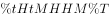

- **B**. 

　✅
- **C**. 

- **D**. 
柯河江河江珂江水柯河

**答案**：B

**官方解析**

第一步：分析题干符号间关系。
从相同符号的位置入手：位置1、9的符号相同；位置2、4、10的符号相同；位置3、5、7的符号相同；位置6、8的符号相同。
第二步：判断选项符号关系。
A项：位置2、4的符号相同，但与位置10的符号不相同，与题干逻辑关系不一致，排除；
B项：位置1、9的符号相同；位置2、4、10的符号相同；位置3、5、7的符号相同；位置6、8的符号相同，与题干逻辑关系一致，当选；
C项：位置2、4的符号不相同，与题干逻辑关系不一致，排除；
D项：位置6、8的符号不相同，与题干逻辑关系不一致，排除。
故正确答案为B。

---

### 第 12 题　qid 2452650 · 类比推理

请从四个选项中选出恰当的一项，其特征或规律与题干给出的一串符号的特征或规律最为相符。
由甲申曱甲申甴甲由曱

- **A**. 己已巳乙已巳己已己乙
- **B**. 上下卡卞下卡土下上卞　✅
- **C**. 人八六入八六人八人入
- **D**. 土士二干士二二士土干

**答案**：B

**官方解析**

第一步：分析题干符号间关系。
从相同符号的位置入手：位置1、9的符号相同；位置2、5、8的符号相同；位置3、6的符号相同；位置4、10的符号相同；位置7的符号与其他位置均不相同。
第二步：判断选项符号间关系。
A项：位置7的符号与位置1、9的符号相同，与题干逻辑关系不一致，排除；
B项：位置1、9的符号相同；位置2、5、8的符号相同；位置3、6的符号相同；位置4、10的符号相同；位置7的符号与其他位置均不相同，与题干逻辑关系一致，当选；
C项：位置7的符号与位置1、9的符号相同，与题干逻辑关系不一致，排除；
D项：位置7的符号与位置3、6的符号相同，与题干逻辑关系不一致，排除。
故正确答案为B。

---

### 第 13 题　qid 2452748 · 图形推理

请从所给的四个选项中，选出最恰当的一项填入问号处，使之呈现一定的规律性。

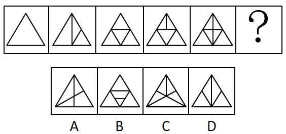

- **A**. A
- **B**. B　✅
- **C**. C
- **D**. D

**答案**：B

**官方解析**

元素组成不同，且无明显属性规律，优先考虑数量规律。题干出现较多的封闭空间和多边形，可以考虑数面或数直线，面的数量依次为1、3、4、5、6，直线的数量依次为3、5、6、7、7，均没有规律。继续观察发现，题干图五及选项A为田字变形，考虑笔画数，题干均为1笔画图形，故问号处也为1笔画图形。A项为2笔画，B项为1笔画，C项为3笔画，D项为2笔画。只有B项符合。
故正确答案为B。

---

### 第 14 题　qid 2452703 · 图形推理

请从所给的四个选项中，选出最恰当的一项填入问号处，使之呈现一定的规律性。

- **A**. A　✅
- **B**. B
- **C**. C
- **D**. D

**答案**：A

**官方解析**

题干图形中出现多个小元素，优先考虑元素的种类和个数。题干每幅图中均有2种小元素，排除C项。小元素个数依次为2、3、3、4、4，无规律。继续观察，题干图形和剩余选项都由两种元素构成，考虑元素换算。根据“第一个图形+第三个图形=2x第二个图形”的原则，换算后可知1个五角星=2个圆形，将五角星全部换算成圆形圆形个数分别是3、4、5、6、7，所以问号处应选一个换算后有8个圆形的选项。A项有8个圆形，B项有7个圆形，D项有6个圆形，只有A项符合。
故正确答案为A。

---

### 第 15 题　qid 2452751 · 图形推理

请从所给的四个选项中，选出最恰当的一项填入问号处，使之呈现一定的规律性。

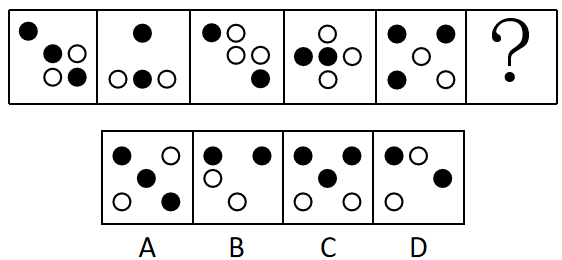

- **A**. A
- **B**. B
- **C**. C　✅
- **D**. D

**答案**：C

**官方解析**

元素组成不同，优先考虑属性规律。观察发现，题干中的图形均由小黑圆、小白圆组成，且所有图形都比较规整，优先考虑对称性，发现题干均为轴对称图形，且对称轴依次顺时针旋转，如下图：

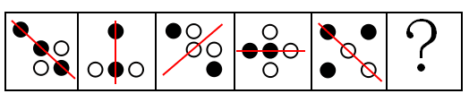

故问号处图形对称轴应为竖直方向，只有C项符合。

故正确答案为C。

---

### 第 16 题　qid 2452762 · 图形推理

下面四个图形中，只有一个是由上面的四个图形拼合（只能通过上、下、左、右平移）而成的，请把它找出来。

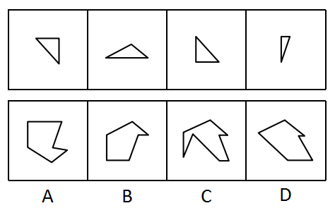

- **A**. A
- **B**. B　✅
- **C**. C
- **D**. D

**答案**：B

**官方解析**

本题考查平面拼合，可采用平行且等长相消的方式解题。消去平行且等长的线段后进行组合可得到轮廓图，即为B项。平行且等长相消的方式如下图所示：

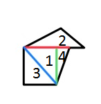

故正确答案为B。

---

### 第 17 题　qid 2452763 · 图形推理

下面四个图形中，只有一个是由上面的四个图形拼合（只能通过上、下、左、右平移）而成的，请把它找出来。

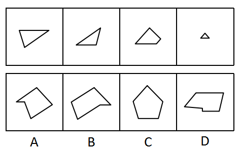

- **A**. A
- **B**. B
- **C**. C　✅
- **D**. D

**答案**：C

**官方解析**

本题考查平面拼合，可采用平行且等长相消的方式解题。消去平行且等长的线段后进行组合可得到轮廓图，即为C项。平行且等长相消的方式如下图所示：

故正确答案为C。

---

### 第 18 题　qid 2452677 · 图形推理

下面四个图形中，只有一个是由上面的四个图形拼合（只能通过上、下、左、右平移）而成的，请把它找出来。

- **A**. A
- **B**. B
- **C**. C
- **D**. D　✅

**答案**：D

**官方解析**

本题考查平面拼合，可采用平行且等长相消的方式解题。消去平行且等长的线段后进行组合即可得到轮廓图，即为D选项。平行且等长相消的方式如下图所示：

故正确答案为D。

---

### 第 19 题　qid 2452678 · 图形推理

下面四个图形中，只有一个是由上面的四个图形拼合（只能通过上、下、左、右平移）而成的，请把它找出来。

- **A**. A
- **B**. B
- **C**. C
- **D**. D　✅

**答案**：D

**官方解析**

本题考查平面拼合，可采用平行且等长相消的方式解题。消去平行且等长的线段后进行组合即可得到轮廓图，即为D选项。平行且等长相消的方式如下图所示：

故正确答案为D。

---

### 第 20 题　qid 2452786 · 图形推理

下面四个图形中，只有一个是由上面的四个图形拼合（只能通过上、下、左、右平移）而成的，请把它找出来。

- **A**. A
- **B**. B　✅
- **C**. C
- **D**. D

**答案**：B

**官方解析**

本题考查平面拼合，可采用平行且等长相消的方式解题。消去平行且等长的线段后进行组合即可得到轮廓图，即为B选项。平行且等长相消的方式如下图所示：

故正确答案为B。

---

### 第 21 题　qid 2452788 · 图形推理

左边给定的是纸盒外表面的展开图，右边哪一项能由它折叠而成？请把它找出来。

- **A**. A　✅
- **B**. B
- **C**. C
- **D**. D

**答案**：A

**官方解析**

将原展开图标上序号如下图，逐一进行分析。

A项：选项为面b和面c，与题干一致，当选；

B项：展开图和选项中均有面c，而面c是可以确定唯一点的（如下图中蓝点所示）。在展开图和选项的面c上，以唯一点为起始点，沿顺时针方向同时进行画边，展开图中边1所对的面为面b且不挨着黑三角的黑边，选项中边1挨着黑三角的黑边，选项与题干不一致，排除；

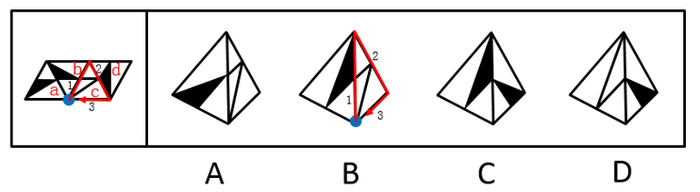

C项：选项中出现的是面 a、面 b、面 d 中的任意两个面，题干展开图中，“面a和面b”“面a和面d”以及“面b和面d”两个面中的小白色三角形均不相邻，而选项中两个面内的小白色三角形相邻且有公共边，选项与题干展开图不一致，排除；

D项：展开图和选项中均有面c，而面c是可以确定唯一点的（如下图中蓝点所示）。在展开图和选项的面c上，以唯一点为起始点，沿顺时针方向同时进行画边，展开图中边1所对的面为面b且面c的小等边三角形对着面b的大白三角形，选项中面c的小等边三角形对着面b的小白三角形，选项与题干不一致，排除。

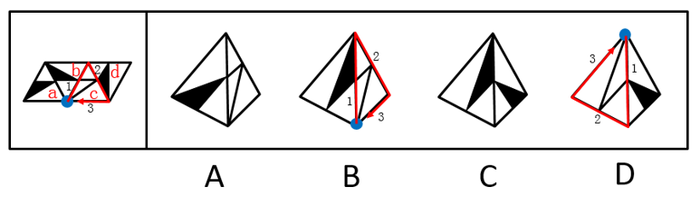

故正确答案为A。

---

### 第 22 题　qid 2452790 · 图形推理

左边给定的是纸盒外表面的展开图，右边哪一项能由它折叠而成？请把它找出来。

- **A**. A
- **B**. B
- **C**. C
- **D**. D　✅

**答案**：D

**官方解析**

将原展开图标上序号如下图，逐一进行分析。

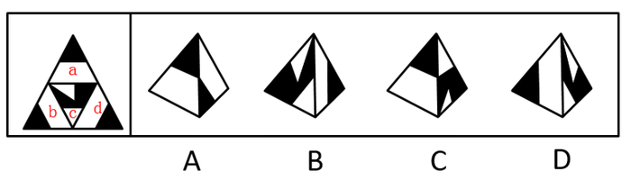

A项：选项出现的是面a、面b、面d中的任意两个，在展开图中面a、面b、面d三个面中的任意两个面的公共边都是黑色部分对应黑色部分，白色部分对应白色部分，而选项中两个面的公共边黑色部分对应白色部分，选项与题干不一致，排除；

B项：展开图和选项中均有面c，而面c是可以确定唯一点的（如下图中蓝点所示）。在展开图和选项的面c上，以唯一点为起始点，沿顺时针方向同时进行画边，题干展开图中边1和边2的夹角是半黑半白的角，而选项中边1和边2的夹角是黑色的角，选项与题干不一致，排除；

C项：展开图和选项中均有面c，而面c是可以确定唯一点的（如上图中蓝点所示）。在展开图和选项的面c上，以唯一点为起始点，沿顺时针方向同时进行画边，展开图中边3挨着面d的白色梯形底边，选项中边3挨着左侧面中黑色三角形斜边，选项与题干不一致，排除；

D项：选项由面b、c构成，选项与题干一致，当选。

故正确答案为D。

---

### 第 23 题　qid 2452792 · 图形推理

左边给定的是纸盒外表面的展开图，右边哪一项能由它折叠而成？请把它找出来。

- **A**. A
- **B**. B　✅
- **C**. C
- **D**. D

**答案**：B

**官方解析**

将原展开图标上序号如下图，逐一进行分析。

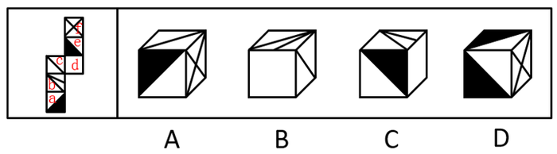

A项：选项中出现了面c，面f和带黑三角形的面，面c与面a是相对面，故选项中带黑三角形的面是面e，在展开图中，面c、面e、面f存在公共点（如下图中蓝点所示），公共点挨着面c的斜线，选项中公共点不挨着面c的斜线，选项与题干不一致，排除；

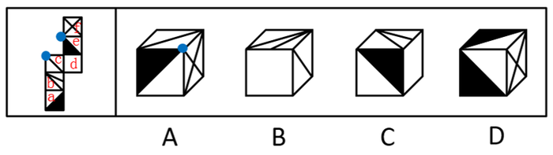

B项：选项为面b，面c和面d，与题干一致，当选；

C项：选项中出现了面b，面d和带黑三角形的面，面b与面e是相对面，故选项中带黑三角形的面是面a，在展开图中，面a和面b有公共边，公共边挨着面a的白色三角形，选项中，面a和面b的公共边挨着面a的黑三角形，选项与题干不一致，排除；

D项：选项中出现了面a，面e和面f，面a和面e长得一样，无法区分，但是可以确定唯一点的（如下图中绿点所示）。在展开图和选项的面a和面e上，以唯一点为起始点，沿顺时针方向同时进行画边，选项中面f分别挨着一个面的边2和另一个面的边3，展开图中只有一个面的边2挨着面f，另一个面的边3挨着面b，选项与题干不一致，排除。

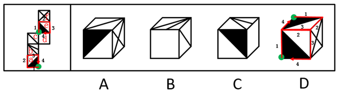

故正确答案为B。

---

### 第 24 题　qid 2452749 · 图形推理

左边给定的是纸盒外表面的展开图，右边哪一项能由它折叠而成？请把它找出来。

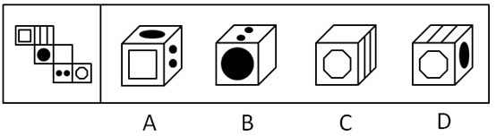

- **A**. A　✅
- **B**. B
- **C**. C
- **D**. D

**答案**：A

**官方解析**

将原展开图标上序号如下图，逐一进行分析。

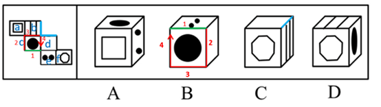

A项：选项与题干一致，当选； B项：选项中包含面c、面d和面e，面c和面e的公共边为上图绿色的边，在展开图和选项中，分别以绿色的边为起始边，在面c上沿顺时针方向进行画边，展开图中边2所对的面为面a，选项中边2所对的面不是面a而是面d，选项与题干不一致，排除； C项：选项中包含面b、面d和面f，其中面b和面d为相邻面，在展开图和选项中找到面b和面d的公共边（如上图蓝线所示），展开图中，公共边与面b内部的线条没有连接，选项中两个面的公共边和面b内部线条相连，选项与题干不一致，排除； D项：选项中包含面b、面c和面f，展开图中面c和面f为相对面，不能同时出现，选项与题干不一致，排除。 故正确答案为A。 

---

### 第 25 题　qid 2452625 · 图形推理

请从所给的四个选项中，选出最恰当的一项填入问号处，使之呈现一定的规律性。

- **A**. A
- **B**. B
- **C**. C
- **D**. D　✅

**答案**：D

**官方解析**

本题考查图形的实际意义，寻找最大共同点。九宫格优先横行看，观察发现，题干每行图片均为奶牛，第一行中奶牛头部的朝向左右交替，且奶牛身上的花纹相同，第二行也为此规律，故第三行运用规律，前两幅图奶牛的头部朝向分别为右、左，故问号处图形的奶牛头部应朝右，排除A、C项，B项奶牛身上的花纹与前两幅图不同，排除。
故正确答案为D。

---

### 第 26 题　qid 2452752 · 图形推理

请从所给的四个选项中，选出最恰当的一项填入问号处，使之呈现一定的规律性。

- **A**. A　✅
- **B**. B
- **C**. C
- **D**. D

**答案**：A

**官方解析**

元素组成相似，且相同线条重复出现，优先考虑样式规律中的加减同异。九宫格优先横行看，观察发现，第一行中，图1逆时针旋转后和图2外框保留、内部元素去同求异，可以得到图3；经验证，第二行图1逆时针旋转后和图2外框保留、内部元素去同求异，可以得到图3，满足此规律；第三行应用此规律，故“？”处应选择一个图1先逆时针旋转再和图2外框保留、内部元素去同求异得到的图形，观察选项发现，A项符合要求。 故正确答案为A。 

---

### 第 27 题　qid 2452755 · 图形推理

左边为给定的立体，从任意角度剖开，右边哪一项不可能是它的截面图？

- **A**. A
- **B**. B
- **C**. C　✅
- **D**. D

**答案**：C

**官方解析**

本题考查截面图。逐一分析选项。如下图所示，A、B、D均可截出，具体剖切方式分别对应如下图1、图2、图3所示。

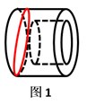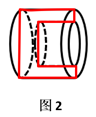

如下图所示，C项无法截出，因为中间圆柱是空心体，除此之外的外部是实体，所以C项中间应该是空白的，外侧应该是有阴影的。

 

故正确答案C。

---

### 第 28 题　qid 2452541 · 逻辑判断

党内存在的很多问题都同政治问题相关联。不从政治上认识问题、解决问题，就会陷入头痛医头、脚痛医脚的被动局面，就无法从根本上解决问题。提高政治能力，很重要的一条就是要善于从政治上分析问题、解决问题。只有从政治上分析问题才能看清本质，只有从政治上解决问题才能抓住根本。
根据以上陈述，可以得出以下哪项？

- **A**. 只有从政治上认识问题、解决问题，才能从根本上解决问题　✅
- **B**. 如果善于从政治上分析问题、解决问题，就能提高政治能力
- **C**. 一旦陷入头痛医头、脚痛医脚的被动局面，就无法从根本上解决问题
- **D**. 如果没有看清本质、抓住根本，说明没有从政治上分析问题、解决问题

**答案**：A

**官方解析**

第一步：翻译题干。

①（政治上认识问题、解决问题）陷入头痛医头、脚痛医脚的被动局面

②（政治上认识问题、解决问题）根本上解决问题

③提高政治能力善于从政治上分析问题、解决问题

④看清本质政治上分析问题

⑤抓住根本政治上解决问题

第二步：逐一分析选项。

A项：翻译为根本上解决问题政治上认识问题、解决问题，是对②的否后，否后必否前，可以推出，当选；

B项：翻译为善于从政治上分析问题、解决问题提高政治能力，是对③的肯后，肯后得不到确定结论，无法推出，排除；

C项：翻译为陷入头痛医头、脚痛医脚的被动局面根本上解决问题，是对①的肯后，肯后得不到确定结论，无法和②中的“根本上解决问题”串在一起，无法推出，排除；

D项：翻译为（看清本质、抓准根本）（政治上分析问题、解决问题），是对④、⑤的否前，否前得不到确定结论，无法推出，排除。

故正确答案为A。

---

### 第 29 题　qid 2452769 · 逻辑判断

随着食品工业的发展，丙酸经常被当作一种抑制霉菌生长的添加剂使用，烘焙食品中都喜欢添加丙酸来进行防腐。正常情况下，人体中的微生物也会在结肠中通过发酵未完全消化的碳水化合物产生丙酸，这种丙酸对人体有益。但最近一项研究表明，外源性摄入和自体产生的丙酸作用并不一样，长期摄入外源性丙酸会导致人体出现胰岛素偏高、胰岛素抵抗等现象。由此，某食品专家建议，应该禁止在食品中添加丙酸。
以下哪项如果为真，最能支持上述食品专家的建议？

- **A**. 将丙酸作为防腐剂使用只是食品行业的惯常做法，并未得到政府有关部门的确认
- **B**. 人体一旦出现胰岛素偏高、胰岛素抵抗等现象，就容易导致糖尿病和肥胖的发生　✅
- **C**. 从外界摄入的丙酸会出现在人体的各个部位，而自体产生的丙酸只存在结肠部分
- **D**. 丙酸不仅直接被添加到食品中，许多其他的食品添加剂也都通过加入丙酸进行防腐

**答案**：B

**官方解析**

第一步：找出论点和论据。
论点：应该禁止在食品中添加丙酸。
论据：外源性摄入和自体产生的丙酸作用并不一样，长期摄入外源性丙酸会导致人体出现胰岛素偏高、胰岛素抵抗等现象。
论点讨论的是应该禁止添加丙酸，论据讨论的是长期摄入外源性丙酸带来的结果，论点论据话题不一致，考虑搭桥的加强方式，在摄入带来的危害与禁止添加丙酸之间建立联系。
第二步：逐一分析选项。
A项：讨论加入丙酸这个做法是否得到有关部门的确认，和论点讨论的是否应该禁止添加丙酸无关，不能加强，排除；
B项：人出现胰岛素偏高、胰岛素抵抗等现象，就容易导致糖尿病和肥胖，而外源性丙酸的长期摄入又会导致人体的胰岛素偏高、胰岛素抵抗现象，所以应该禁止添加丙酸，在论点论据之间建立了联系，搭桥，能够加强，当选；
C项：说明外界摄入的丙酸和自体产生的丙酸出现的位置不同，但是出现在不同的位置，他们的作用是否是一样的，是否应该禁止添加丙酸，没有说明，无关选项，排除；
D项：其他食品也通过加入丙酸进行防腐，与是否应该禁止添加丙酸无关，不能加强，排除。
故正确答案为B。

---

### 第 30 题　qid 2452550 · 逻辑判断

每个“熊孩子”的背后都有一个“熊家长”。这些“熊家长”对“熊孩子”百依百顺，溺爱娇惯，这使得“熊孩子”以自我为中心，缺乏规则意识，容易产生过激的非理性行为。当“熊孩子”有些行为对他人和社会造成伤害时，“熊家长”也会以“他还是个孩子”来护短辩解，要求原谅。
以下哪项最可能是“熊家长”辩解所隐含的前提？

- **A**. “熊孩子”犯错误不是故意为之
- **B**. 只要是孩子就难免犯错
- **C**. “熊孩子”长大后会成为好孩子
- **D**. 孩子犯错误应当被原谅　✅

**答案**：D

**官方解析**

第一步:找出论点和论据。
论点:“熊家长”要求原谅“熊孩子”。
论据:“熊家长”以“他还是个孩子”来护短辩解。
题干中论点说的是要求他人原谅“熊孩子”，论据说的是“熊孩子”还是个孩子，论点论据话题不一致，因此考虑在“原谅”和“孩子”之间搭桥。
第二步:逐一分析选项。
A项：该项说的是犯错误不是故意为之，与“被原谅”无必然关系，不能加强，排除；
B项：该项说的是孩子就难免犯错，与“被原谅”无必然关系，不能加强，排除；
C项：该项说的是孩子长大后会成为好孩子，与“被原谅”无必然关系，不能加强，排除；
D项：在“原谅”和“孩子”之间搭桥，为搭桥项，是家长辩解的前提，可以加强，当选。
故正确答案为D。

---

### 第 31 题　qid 2452572 · 类比推理

由于业务量增加，某服务中心计划增加登记、咨询、报送、投诉和综合5个业务窗口，拟安排的5名工作人员所熟悉的业务各有不同：小丽作为新人，只熟悉登记业务；小马熟悉登记和咨询业务；小高熟悉报送和投诉业务；老王除了综合和投诉，其他业务都很熟悉；老董所有业务都很精通。最终，5名工作人员被分别安排到5个窗口负责各自熟悉的业务。
关于人员安排，以下说法正确的是

- **A**. 老董不负责综合业务窗口
- **B**. 小高负责报送业务窗口
- **C**. 小马不负责咨询业务窗口
- **D**. 老王负责报送业务窗口　✅

**答案**：D

**官方解析**

整理题干信息如下：

（1）小丽只负责登记业务

（2）小马负责登记或咨询业务

（3）小高负责报送或者投诉业务

（4）老王不负责综合和投诉

（5）老董所有业务都很精通

根据题干填入确定信息如下：

 

此时综合窗口只能老董负责，排除A项；又因5个业务窗口，安排的5名工作人员所熟悉的业务各有不同，即一人一个窗口，所以老董再不负责其他窗口，此时投诉窗口也已经有四个“×”，故只能小高负责投诉窗口，排除B项。此时报送窗口也已经有四个“×”，故只能老王负责报送窗口，D项说法正确，当选。又因为老王不负责其他窗口，此时咨询窗口也已经有四个“×”，故只能小马负责咨询窗口，排除C项，且小马不负责其他窗口，填入：

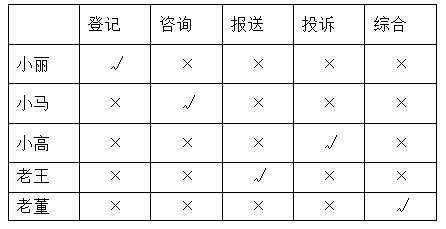

故正确答案为D。

---

### 第 32 题　qid 2452560 · 逻辑判断

某部门新录用甲、乙、丙三名工作人员，他们各自的籍贯为江苏、安徽、浙江中的某个省。张红、李梅和王芹对他们的籍贯有如下猜测：
张红：甲是浙江人，乙是安徽人，丙也是浙江人；
李梅：甲是浙江人，乙是江苏人，丙不是江苏人；
王芹：甲是江苏人，乙是浙江人，丙也是江苏人。
已知，对甲、乙、丙的籍贯，上述三人均猜对1个，猜错2个。
根据以上信息，以下哪项是可能的？

- **A**. 甲是江苏人，乙是安徽人，丙是浙江人
- **B**. 甲是浙江人，乙是江苏人，丙是江苏人
- **C**. 甲是安徽人，乙是浙江人，丙是江苏人
- **D**. 甲是江苏人，乙是安徽人，丙是安徽人　✅

**答案**：D

**官方解析**

题干条件不确定，优先采用代入法。
将A项代入，张红所说的第一句话错误，后面两句正确，不符合题干要求“猜对1个，猜错2个”，排除；
将B项代入，张红所说的第一句话正确，后面两句错误；李梅前两句正确，最后一句话错误，不符合题干要求“猜对1个，猜错2个”，排除；
将C项代入，张红所说的三句话均错误，不符合题干要求“猜对1个，猜错2个”，排除；
将D项代入，张红第二句话正确其余错误；李梅第三句话正确其余错误；王芹第一句话正确其余错误，符合题干要求，当选。
故正确答案为D。

---

### 第 33 题　qid 2452726 · 逻辑判断

某款策略类竞技游戏在所有时刻都有种可以选择的操作，并且是一种不完全信息的游戏——玩家通常看不到对手在做什么，因此就无法预测下一步操作。最近，某互联网公司开发了能够玩该款游戏的智能机器人AlphaStar，在一周内就获得了宗师等级，这意味着它在该地区九万多名玩家中排在前。游戏开发者据此断言，AlphaStar在游戏策略上已经和人类持平或者胜过人类了。

以下哪项如果为真，最能支持上述游戏开发者的论断？

- **A**. AlphaStar的反应速度被限制在人类的反应水平　✅
- **B**. AlphaStar在游戏中隐藏了自己是机器人的身份
- **C**. AlphaStar汇集了人工智能最新发展的成果和技术
- **D**. AlphaStar可以利用的支持决策的信息量远超人类

**答案**：A

**官方解析**

第一步：找出论点和论据。

论点：AlphaStar在游戏策略上已经和人类持平或者胜过人类了。

论据：某互联网公司开发了能够玩该游戏的智能机器人AlphaStar，在一周内就获得了宗师等级，排名在该地区九万多名玩家中的前。

论据说的是AlphaStar一周内获得等级高，论点说的是AlphaStar在游戏策略上已经和人类持平或者胜过人类了，话题一致，优先考虑补充论据。

第二步：逐一分析选项。

A项：反应速度被限制在人类的反应水平，排除了其他因素的干扰，从而说明AlphaStar在游戏策略上真的已经和人类持平或者胜过人类，可以加强，当选；

B项：隐藏自己机器人的身份，与是否在游戏策略上已经和人类持平或者胜过人类无关，属于无关选项，排除；

C项：只是说明它汇集了人工智能最新发展的成果和技术，但并不能支持他是否在游戏策略上已经和人类持平或者胜过人类，排除；

D项：可以利用的支持决策的信息量远超人类，说明获胜也可能是因为本身信息量多，而不是仅仅是游戏策略强，削弱了论点中游戏策略导致获胜的结论，他因削弱，排除。

故正确答案为A。

附：通过查证原文，本题答案为A项。

---

### 第 34 题　qid 2452725 · 逻辑判断

市民文化周期间，文化部门要在桃源、东山、南浦、九华四个社区分别举办书展、画展、影展和文博展四种不同的文化惠民活动，由于时间场地限制，每个社区只能举办一种活动。已知：
（1）桃源社区既不办影展，也不办画展；
（2）东山社区既不办书展，也不办画展；
（3）如果东山社区不办画展，则南浦社区不办书展；
（4）如果九华社区不办文博展，则南浦社区举办书展。
据此可以推出以下哪项？

- **A**. 东山社区有可能举办文博展
- **B**. 画展不可能在南浦社区举办
- **C**. 九华社区既没办影展，也没办画展　✅
- **D**. 书展要么是南浦社区办，要么是九华社区办

**答案**：C

**官方解析**

第一步：翻译题干。

要求为每个社区只能举办一种活动；

桃源社区影展 且画展

东山社区书展 且画展

东山社区画展  南浦社区书展

九华社区文博展  南浦社区书展

第二步：再推理。

结合确定信息和最大信息，和可知，东山社区不办画展，可知南浦社区不办书展。结合条件，逆否等价规则，可得九华社区办文博展；又根据要求每个社区只能举办一种活动。所以可得：九华社区既没办影展，也没办画展。

故正确答案为C。

---

### 第 35 题　qid 2452770 · 逻辑判断

螺旋锥蝇是一种极具攻击性的食肉蝇，偏好鲜血和活肉，喜欢攻击恒温动物（比如人类、牲畜)身上的小伤口，传播各类病菌。科学研究发现，雌螺旋锥蝇是单配性的，一生只能交配一次。据此，有科学家提出一种“以蝇制蝇”的昆虫绝育方法来消灭螺旋锥蝇，即将雄蝇置于超高辐射之下使其失去繁殖能力后放生到野外，如果雌蝇与之交配，产下的卵将不会孵化，日积月累，整个螺旋锥蝇种族就会自然消失。
以下各项如果为真，则除哪项外均能质疑上述科学家的建议？

- **A**. 经实验改造的绝育雄蝇数量不一定多于自然状态下有生育能力的雄蝇
- **B**. 用放射性手段改变雄螺旋锥蝇的特性，可能会破坏大自然的生态平衡
- **C**. 雌螺旋锥蝇有可能会排斥经过超高辐射而失去繁殖能力的雄螺旋锥蝇
- **D**. 虽然雌螺旋锥蝇是单配性的，但雄螺旋锥蝇可与多只雌螺旋锥蝇交配　✅

**答案**：D

**官方解析**

第一步：找出论点和论据。
论点：用“以蝇制蝇”的昆虫绝育方法来消灭螺旋锥蝇，即将雄蝇置于超高辐射之下使其失去繁殖能力后放到野外，如果雌蝇与之交配，产下的卵将不会孵化，日积月累，整个螺旋锥蝇种族就会自然消失。
论据：雌螺旋锥蝇是单配性的，一生只能交配一次。
第二步：逐一分析选项。
A项：改造的雄蝇数量不一定多于自然状态下的雄蝇，说明最后螺旋锥蝇还是会继续繁殖，不会消失，否定论点，排除；
B项：这个技术会破坏大自然的生态平衡，所以不能进行此项技术，否定论点，排除；
C项：雌蝇会排斥被辐射过的雄蝇，双方不会交配，雌蝇还是会和自然状态下的雄蝇交配产生后代，种族不会消失，否定论点，排除；
D项：雄蝇可以和很多只雌蝇交配，说明一只经高辐射处理的雄蝇可致多只雌蝇产生不会孵化的卵，日积月累，种族可能就消失了，是加强项，无法削弱，当选。
本题为选非题，故正确答案为D。

---

### 第 36 题　qid 2452597 · 定义判断

造血式扶贫：指政府部门或社会力量通过持续性地扶持农村产业发展，拓宽农产品销售及消费渠道等，帮助贫困地区、贫困人口增收脱贫的扶贫方式。
下列属于造血式扶贫的是

- **A**. 
某县按照“东部林果、旅游，西部设施农业”的整体思路，一直坚持“”的产业发展模式，使农民年收入翻了一番，人均达到近万元
　✅
- **B**. 
某县扶贫办组织了200多名山区农民，经过严格培训，输送到东南沿海城市工作。这些农民每月都按时寄钱回家，家里的日子越过越红火

- **C**. 
县农科所资助某村贫困家庭100头种羊，多次对他们进行科学养羊技术培训，并安排技术人员进行“一对一”的专业指导

- **D**. 
为了解决全村苹果严重滞销的问题，村里的几个年轻人共同开办了一个水果直销网店。不到半月时间，所有苹果就销售一空

**答案**：A

**官方解析**

第一步：找出定义关键词。

“政府部门或社会力量”、“持续性地扶持农村产业发展，拓宽农产品销售及消费渠道”、“帮助贫困地区、贫困人口增收脱贫”。

第二步：逐一分析选项。

A项：某县符合“政府部门或社会力量”，一直坚持“”的产业发展模式，符合“持续性地扶持农村产业发展，拓宽农产品销售及消费渠道”，使农民年收入翻了一番，人均达到近万元，符合“帮助贫困地区、贫困人口增收脱贫”，符合定义，当选；

B项：某县扶贫办组织了200多名山区农民，经过严格培训，输送到东南沿海城市工作，不符合“持续性地扶持农村产业发展，拓宽农产品销售及消费渠道”，不符合定义，排除；

C项：县农科所资助某村贫困家庭100头种羊，多次对他们进行科学养羊技术培训，不符合“持续性地扶持农村产业发展，拓宽农产品销售及消费渠道”，不符合定义，排除；

D项：为了解决全村苹果严重滞销的问题，村里的几个年轻人共同开办了一个水果直销网店，不符合“政府部门或社会力量”，且没有提到贫困，不符合“帮助贫困地区、贫困人口增收脱贫”，不符合定义，排除。

故正确答案为A。

---

### 第 37 题　qid 2452602 · 定义判断

分众化教育：指根据受众的具体差异，用典型案例分别进行宣传，以激发情感共鸣，达成特定目标的教育方式。
下列属于分众化教育的是

- **A**. 某市组织全市技术创新能手分别深入到所在行业部门，分享自己的创新经验，极大地激发了各行各业人士的创新热情　✅
- **B**. 某地组织的“五一劳动奖章”获得者宣讲团多次进行巡回报告，他们的先进事迹深深地打动了前来听讲的市民
- **C**. 每天傍晚，某学校附近地铁口都有艺术教育培训机构的招生人员散发传单，上面印着考入名校的学生彩照和成绩
- **D**. 在“不忘初心、牢记使命”主题教育中，某区组织党员干部分系统观看专题纪录片《警钟长鸣》，取得了预期效果

**答案**：A

**官方解析**

第一步：找出定义关键词。
“根据受众的具体差异，用典型案例分别进行宣传”、“激发情感共鸣，达成特定目标”。
第二步：逐一分析选项。
A项：某市组织全市技术创新能手分别深入到所在行业部门，分享自己的创新经验，符合“根据受众的具体差异，用典型案例分别进行宣传”，极大地激发了各行各业人士的创新热情，符合“激发情感共鸣，达成特定目标”，符合定义，当选； 
B项：某地组织的“五一劳动奖章” 获得者宣讲团多次进行巡回报告，不符合“根据受众的具体差异，用典型案例分别进行宣传”，不符合定义，排除；
C项：每天傍晚，某学校附近地铁口都有艺术教育培训机构的招生人员散发传单，不符合“根据受众的具体差异，用典型案例分别进行宣传”，不符合定义，排除；
D项：某区组织党员干部分系统观看专题纪录片《警钟长鸣》，不符合“根据受众的具体差异，用典型案例分别进行宣传”，不符合定义，排除。
故正确答案为A。

---

### 第 38 题　qid 2452605 · 定义判断

喘息服务：指由政府部门购买服务，为有失能失智老人的低收入家庭或特殊困难家庭提供临时性援助，让常年在家照顾亲属者得到短暂休息。
下列属于喘息服务的是

- **A**. 由于儿女移居国外，年迈的赵先生夫妇只得相依为命，平时一起去市场买日常用品，一起去医院就诊取药。社区了解情况后，专门雇人每天上门半小时帮他们料理家务
- **B**. 杨先生10多年前中风，老伴杜女士为了照料他，每天忙得团团转，连自己生病都没时间去医院。今年初，街道派护工不定期上门服务，让她能有时间到医院看病或稍事休息　✅
- **C**. 父亲去世后，年过六旬的张先生独自承担起了照顾精神病妹妹的重任，从来没有睡过一个安稳觉。不久前，老张专门请了一名钟点工照看妹妹，感觉轻松了许多
- **D**. 患健忘症的陈奶奶经常独自出门闲逛，多次走失，靠低保维持生活的儿子无力照顾。区民政部门了解情况后，把陈奶奶送进养老院，并承担了所有费用

**答案**：B

**官方解析**

第一步：找出定义关键词。
“政府部门购买服务”、“为有失能失智老人的低收入家庭或特殊困难家庭提供临时性援助”、“让常年在家照顾亲属者得到短暂休息”。
第二步：逐一分析选项。
A项：由于儿女移居国外，社区专门雇人每天上门半小时帮年迈的赵先生夫妇料理家务，不符合“为有失能失智老人的低收入家庭或特殊困难家庭提供临时性援助”，也不符合“让常年在家照顾亲属者得到短暂休息”，不符合定义，排除；
B项：杨先生10多年前中风，今年初街道派护工不定期上门服务，让杜女士能有时间到医院看病或稍事休息，符合“政府部门购买服务”、“为有失能失智老人的低收入家庭或特殊困难家庭提供临时性援助”、“让常年在家照顾亲属者得到短暂休息”，符合定义，当选；
C项：老张专门请了一名钟点工照看妹妹，不符合“政府部门购买服务”，不符合定义，排除；
D项：患健忘症的陈奶奶多次走失，区民政部门了解情况后，把陈奶奶送进养老院，并承担了所有费用，不符合“为有失能失智老人的低收入家庭或特殊困难家庭提供临时性援助”，不符合定义，排除。
故正确答案为B。

---

### 第 39 题　qid 2452619 · 定义判断

垃圾资源化：指垃圾进行分选处理后，成为无污染的循环再利用原料，进而加工、转化为再生资源的垃圾处理方式。
下列属于垃圾资源化的是：

- **A**. 某市为了缓解因煤炭资源过度开采造成的地面下陷问题，新建了一个大型垃圾场，经过分类后的城市生活垃圾每天都会运到这里集中填埋
- **B**. 垃圾焚烧发电需要投入巨大资金，随着相关技术不断进步，电能产量越来越高，尽管排放问题还没有彻底解决，但它仍然是目前比较常见的城市垃圾处理方式
- **C**. 乡村垃圾大多采用分类处理的方法：有回收价值的，挑选出来后稍加处理卖给需要的人，其他大部分卖到废品回收站点，无回收价值的，堆到指定地点
- **D**. 某市正在推行新的垃圾处理方式：将厨余垃圾等有机物分离出来，制成有机肥料，将砖头瓦块、玻璃陶瓷等无机物分离出来，制成新型免烧砖　✅

**答案**：D

**官方解析**

第一步：找出定义关键词。
“垃圾进行分选处理后”、“成为无污染的循环再利用原料”、“加工、转化为再生资源”。
第二步：逐一分析选项。
A项：新建垃圾场，将分类后的城市生活垃圾集中填埋，只是简单填埋，没有将垃圾转化为可循环的原料，不符合“成为无污染的循环再利用原料”、“加工、转化为再生资源”，不符合定义，排除；
B项：垃圾焚烧发电是常见的垃圾处理方式，只是对垃圾进行焚烧，没有体现对垃圾的分类处理，不符合“垃圾进行分选处理后”，而且焚烧垃圾的排放问题没有彻底解决，不符合“成为无污染的循环再利用原料”，不符合定义，排除；
C项：将有回收价值的垃圾卖掉，将无回收价值的垃圾堆放到指定地点，只涉及垃圾的回收和变卖，但没有体现出将垃圾转化成其他资源，不符合“加工、转化为再生资源”，不符合定义，排除；
D项：将厨余垃圾等有机物分离出来，制成肥料，将无机物分离出来，制成免烧砖，符合“垃圾进行分选处理后”，而且将分选处理后的垃圾制成其他资源，符合“成为无污染的循环再利用原料”、“加工、转化为再生资源”，符合定义，当选。
故正确答案为D。

---

### 第 40 题　qid 2452524 · 定义判断

抢跑焦虑症：指家庭或学校由于担心孩子缺乏竞争力，急于进行超前教育、加深教学内容等违背教育教学基本规律的现象。
下列不属于抢跑焦虑症的是

- **A**. 暑假刚开始，小明的家长便为他买好了下学期的语文、数学、外语教材及教辅材料，要求他严格按计划完成全部的预习任务
- **B**. 某教育培训机构要求授课教师适当增加教学内容，加大学习难度，吸引更多的优秀学生前来参加各门各类课程的补习　✅
- **C**. 王女士儿子成绩一直很优秀，虽然才读小学三年级，家里就为他请了家教，每周两次一对一辅导法语学习
- **D**. 在全市中学生数学竞赛前夕，某校多次聘请大学教授占用其他课程的时间为参赛选手进行强化训练

**答案**：B

**官方解析**

第一步：找出定义关键词。
“家庭或学校担心孩子缺乏竞争力”、“急于进行超前教育、加深教学内容”、“违背教育教学基本规律”。
第二步：逐一分析选项。
A项：小明家长为他买好了下学期的语文、数学、外语教材，符合“家庭担心孩子缺乏竞争力、急于进行超前教育”，符合定义，排除； 
B项：某教育培训机构要求教师增加教学内容，吸引更多学生前来参加培训，不符合“家庭或学校担心孩子缺乏竞争力”，不符合定义，当选；
C项：王女士为三年级的儿子请家教学习法语，符合“家庭担心孩子缺乏竞争力急于进行超前教育、加深教学内容”，符合定义，排除； 
D项：某校多次聘请大学教授为参赛选手进行强化训练，符合“学校担心孩子缺乏竞争力、急于加深教学内容”、并且占用其他课程时间符合“违背教育教学基本规律”，符合定义，排除。 
本题为选非题，故正确答案为B。

---

### 第 41 题　qid 2452772 · 定义判断

过度营销：指企业过分依赖或使用促销手段以获取利润或经营业绩，而不考虑顾客心理感受的短期营销行为。
下列属于过度营销的是

- **A**. 某影片首映期间，影院、市民广场、居民区甚至学校周围到处张贴着巨幅海报　✅
- **B**. 某微商为了扩大营销面，在各大门户网站发布大量广告，以推销自己的产品
- **C**. 某健身中心为稳定、扩大自己的客户群，以优惠的价格吸引顾客办理年卡
- **D**. 某博物馆为了让市民了解馆藏的国宝，连续十多天在新闻媒体上介绍国宝知识

**答案**：A

**官方解析**

第一步：找出定义关键词。
“企业过分依赖或使用促销手段获取利润或经营业绩”、“不考虑顾客心理感受的短期营销行为”。
第二步：逐一分析选项。
A项：在首映期间各地张贴巨幅海报宣传，符合“不考虑顾客心理感受的短期营销行为”，符合定义，当选；
B项：微商在门户网站发布大量广告，推销产品，不是为了短期营销，不符合“不考虑顾客心理感受的短期营销行为”，不符合定义，排除；
C项：健身中心以优惠价格吸引顾客办理年卡，不是为了短期营销，不符合“不考虑顾客心理感受的短期营销行为”，不符合定义，排除；
D项：博物馆并不是企业，主体不符合，并且它是为让大家了解国宝进行宣传，这不是一种营销行为，不符合“不考虑顾客心理感受的短期营销行为”，不符合定义，排除。
故正确答案为A。

---

### 第 42 题　qid 2452728 · 定义判断

银发危机：指老年人因为贪图小便宜而上当受骗，遭受财产损失和精神伤害双重打击的现象。
下列属于银发危机的是

- **A**. 小吴的父亲喜欢根据手机网站上文物鉴定专家的推荐收藏玉器，房子里到处都是他买来的“宝贝”，虽然小吴经常和他吵架，但他却不认为自己有错
- **B**. 赵大妈家附近的商场举办促销活动，每天前200名的顾客免费送10个鸡蛋，昨天她把鸡蛋领回家后，发现手上的金戒指不见了，在家整整生了一天闷气
- **C**. 在社区医院排队挂号时，一位“热心人”得知孙大妈有脑血管病，向她推荐了一种特效药，原价每瓶499元，只收她100元，她当场买了10瓶。回家后听女儿说这种药在正规药房只卖30元，她懊恼不已　✅
- **D**. 某企业在东方小区举行加湿器直销活动，李大妈在推销员劝说下买了一台，半月后才发现虽然货真价实，自家却完全用不上，她一气之下把它扔进地下室

**答案**：C

**官方解析**

第一步：找出定义关键词。
“老年人”、“因为贪图小便宜而上当受骗”、“遭受财产损失和精神伤害双重打击”。
第二步：逐一分析选项。
A项：小吴父亲购买玉器是出于喜爱，并非贪图小便宜，不符合“因为贪图小便宜而上当受骗”，不符合定义，排除；
B项：赵大妈是在领取鸡蛋的过程中丢失了金戒指，并未上当受骗，不符合“因为贪图小便宜而上当受骗”，不符合定义，排除；
C项：孙大妈被“热心人”的药价吸引而购买特效药，但该药价格高于正规药房的售价，符合“老年人”、“因为贪图小便宜而上当受骗”，回家后听女儿说完懊恼不已，符合“遭受财产损失和精神伤害双重打击”，符合定义，当选；
D项：李大妈在推销员的劝说下买了一台加湿器，加湿器本身货真价实，不符合“因为贪图小便宜而上当受骗”，不符合定义，排除。
故正确答案为C。

---

### 第 43 题　qid 2452617 · 定义判断

口述登记制：指办理个体工商户登记手续时，申请人无需亲自填表，只要口述各项信息，核对确认后即可当场领取营业执照的登记方式。
下列属于口述登记制的是

- **A**. 赵先生到市场监督管理部门办理个体户注册登记手续。在窗口人员指导下按照“申请-受理-核准”的步骤，半小时就办好了手续。第二天就拿到了自己的营业执照
- **B**. 汪先生打算申请运动器材店营业执照。他从网上弄清了申请程序，第二天来到区市场监督管理部门登记处，简要地回答了几个问题，不一会儿营业执照就办好了　✅
- **C**. 程先生到市场监督管理部门办理花店营业执照。按照现场人员的指导填好表格，经办人员输入系统打印出信息登记表，程先生签名确认后就拿到了营业执照
- **D**. 蔡先生到市场监督管理部门办理营业执照注销手续。在指定窗口完成自动身份识别后，回答了工作人员的询问，很快就办完了全部手续

**答案**：B

**官方解析**

第一步：找出定义关键词。
“办理个体工商户登记手续时”、“无需亲自填表”、“口述信息”、“核对后当场领取营业执照”。
第二步：逐一分析选项。
A项：赵先生在窗口人员的指导下按照“申请-受理-核准”的步骤，是本人亲自办理，但没有体现“口述信息”即可办理，而且，赵先生第二天拿到营业执照，不符合“核对后当场领取营业执照”，不符合定义，排除；
B项：汪先生在区市场监督管理部门，回答几个问题符合“口述信息”，然后“不一会儿营业执照就办好了”，符合“核对后当场领取营业执照”，符合定义，当选；
C项：程先生按照现场人员的指导填好表格，是本人亲自填表，不符合“无需亲自填表”，不符合定义，排除；
D项：蔡先生办理营业执照注销手续，不符合“办理个体工商户登记手续”，不符合定义，排除。
故正确答案为B。

---

### 第 44 题　qid 2452700 · 图形推理

鬲（lì）是古代一种煮饭用的炊器，有陶制鬲和青铜鬲，其形状一般为侈口（口沿外倾），有三个中空的足，便于炊煮加热。觚（gū）是古代一种用于饮酒的容器，也用作礼器，圈足、敞口、长身，口部和底部都呈现为喇叭状。卣（yǒu）是古代的一种酒器，口椭圆形，圈足，有盖和提梁，腹深。尊（zūn）是古代的一种大中型盛酒器，圈足，圆腹或方腹，长颈，敞口，口径较大。

下列4个图形依次为

- **A**. 觚、尊、鬲、卣
- **B**. 尊、鬲、觚、卣
- **C**. 觚、卣、鬲、尊　✅
- **D**. 鬲、卣、尊、觚

**答案**：C

**官方解析**

第一步：找出定义关键词。
“鬲”：侈口（口沿外倾）、三个中空的足；
“觚”：圈足、敞口、长身，口部和底部都呈现为喇叭状；
“卣”：口椭圆形，圈足，有盖和提梁，腹深；
“尊”：圈足，圆腹或方腹，长颈，敞口，口径较大。
第二步：逐一分析选项。
题干四个图片从左到右依次是：觚、卣、鬲、尊，只有C项符合。
故正确答案为C。

---

### 第 45 题　qid 2452529 · 逻辑判断

谜语有多种猜法。比较法是将字形、字义相近或相反的词放在一起，加以比较而扣合谜底；溯源法是追溯谜面的来源及其与原出处的上下关联，然后再扣合谜底；拟物法是将人或人体某部分物化，将谜面字词语义或所言之事物化，扣合谜底。
①谜面：枕头。要求打一成语。谜底：置之脑后
②谜面：桃花潭水深千尺。要求打一成语。谜底：无与伦比
③谜面：加一笔不好，加一倍不少。要求打一字。谜底：夕
关于①②③谜语的猜法，下列判断正确的是

- **A**. ①溯源法，②比较法，③拟物法
- **B**. ①溯源法，②拟物法，③比较法
- **C**. ①比较法，②溯源法，③拟物法
- **D**. ①拟物法，②溯源法，③比较法　✅

**答案**：D

**官方解析**

第一步：找出定义关键词。
比较法：“将字形、字义相近或相反的词放在一起，加以比较而扣合谜底”。
溯源法：“追溯谜面的来源及其与原出处的上下关联，然后再扣合谜底”。
拟物法：“将人或人体某部分物化，将谜面字词语义或所言之事物化，扣合谜底” 。
第二步：逐一分析三个谜语。
谜语①：“枕头。要求打一成语。谜底：置之脑后”
分析：“枕头”指躺着的时候，垫在头下使头略高的卧具，“置之脑后”是说放在脑袋后面，符合“将人或人体某部分物化，将谜面字词语义或所言之事物化，扣合谜底”，属于拟物法。
谜语②：“桃花潭水深千尺。要求打一成语。谜底：无与伦比”
分析：“桃花潭水深千尺”出自于李白的《赠汪伦》，原句为：“桃花潭水深千尺，不及汪伦送我情”，含义是：桃花潭千尺深的水都比不上汪伦和我的友情，诗人用潭水深千尺比喻汪伦与他的友情。该谜面通过“追溯谜面的来源及其与原出处的上下关联，然后再扣合谜底”，属于溯源法。
谜语③：“加一笔不好，加一倍不少。要求打一字。谜底：夕”
分析：“加一笔不好”，“夕”加一笔是“歹”，“歹”是不好的意思；“加一倍不少”，“夕”再加一倍，也就是两个夕，即“多”，“多”也就是不少的意思。谜面是根据谜底“夕”的字形以及字义相近或相反的词来扣合谜底的，因此属于比较法。
因而谜语①对应拟物法，谜语②对应溯源法，谜语③对应比较法。
故正确答案为D。

---
