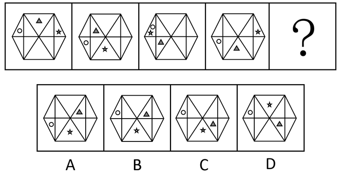
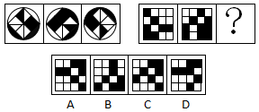
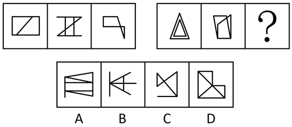
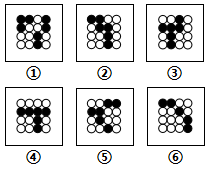
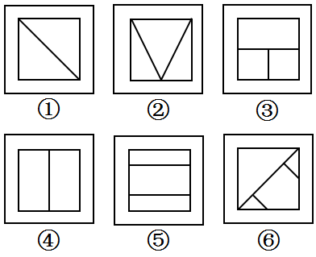

# 2020年浙江公务员考试《行测》（A类）试题（网友回忆版）

> 判断推理 · 25 题 · 浙江 2020

## 第 1 题　qid 2579743 · 图形推理

从所给的四个选项中，选择最合适的一个填入问号处，使之呈现一定的规律性：

- **A**. A
- **B**. B
- **C**. C　✅
- **D**. D

**答案**：C

**官方解析**

元素组成相同，优先考虑位置规律。观察发现，灰色三角形在最内圈（矩形的六个面）中每次逆时针平移1格，排除A、B两项；对比C、D两项，观察发现五角星位置不同，题干中五角星在外圈（与外框相连的六个面中）每次顺时针移动2格，故？处五角星的位置应该在最下方的三角形中，只有C项符合。
故正确答案为C。

---

## 第 2 题　qid 2579745 · 图形推理

从所给的四个选项中，选择最合适的一个填入问号处，使之呈现一定的规律性：

- **A**. A　✅
- **B**. B
- **C**. C
- **D**. D

**答案**：A

**官方解析**

元素组成相似，优先考虑样式规律。观察可知，题干图形轮廓相同，且内部分割相同，考虑黑白运算，但是发现黑白运算并不存在规律。继续观察发现，前一幅图的黑色区域和后一幅图的白色区域相同，且前一幅图的白色区域与后一幅图的黑色区域相同。左边一组图中，图一顺时针转之后，将黑白颜色互换，得到第二幅图；继续将第二幅图顺时针旋转之后，黑白颜色互换得到第三幅图。将此规律运用到右边一组图中发现，图一顺时针转之后，黑白颜色互换得到第二幅图，满足左边的规律，因此将右边图二再顺时针转且黑白颜色互换之后，得到A项的图形。

故正确答案为A。

---

## 第 3 题　qid 2579750 · 图形推理

从所给的四个选项中，选择最合适的一个填入问号处，使之呈现一定的规律性：

- **A**. A　✅
- **B**. B
- **C**. C
- **D**. D

**答案**：A

**官方解析**

图形元素组成不同，且无明显属性规律，考虑数量规律。题干中图形都是多边形，由多条直线构成，考虑直线数，但整体数直线没有规律，观察发现题干图形出现成对的平行线，故考虑平行线。如下图所示，第一组图中，每幅图均有2组平行线，第二组图前两幅图均有3组平行线，故问号处图形要满足有3组平行线，只有A选项符合。

故正确答案为A。

---

## 第 4 题　qid 2579754 · 图形推理

把下面的六个图形分为两类，使每一组图形都有各自的共同特征或规律。分类正确的一项是：

- **A**. ①②③，④⑤⑥
- **B**. ①②⑥，③④⑤　✅
- **C**. ①②④，③⑤⑥
- **D**. ①④⑥，②③⑤

**答案**：B

**官方解析**

本题为分组分类题目。元素组成不同，无明显属性规律，考虑数量规律。每个图形均由黑圆和白圆构成，且有部分黑白圆被分隔开，因此考虑数部分数。发现图①②⑥白色部分均为两部分，图③④⑤白色部分均为三部分，故①②⑥分为一组，③④⑤分为一组，只有B项符合。
故正确答案为B。

---

## 第 5 题　qid 2579760 · 图形推理

把下面的六个图形分为两类，使每一组图形都有各自的共同特征或规律。分类正确的一项是：

- **A**. ①②③，④⑤⑥
- **B**. ①②⑤，③④⑥
- **C**. ①②④，③⑤⑥
- **D**. ①④⑤，②③⑥　✅

**答案**：D

**官方解析**

本题为分组分类题。元素组成不同，优先考虑属性规律。观察可知，题干中出现了等腰三角形，是轴对称的特征图，优先考虑对称性。图①④⑤一组，有两条对称轴；图②③⑥一组，有一条对称轴，对应D项。
故正确答案为D。

---

## 第 6 题　qid 2579703 · 定义判断

体象障碍是指一个人强迫性地认为自己身体的某些部分有严重的缺陷，并采取特殊的方式来掩盖或“修复”。而这些被感受到的缺陷，通常是想象出来的；即便缺陷确实存在，它的严重性也是被夸大的。
根据上述定义，下列符合体象障碍表现的是：

- **A**. 爱美的小王在拍完证件照后让摄影师为其修图
- **B**. 爱干净的小李每天早上花一小时在卫生间洗漱
- **C**. 外表不突出的小高经常宅在家中，不喜欢参加社交活动
- **D**. 身高170厘米的张女士认为自己身材矮小，每次出门必穿高跟鞋　✅

**答案**：D

**官方解析**

第一步：找出定义关键词。
“强迫性地认为自己身体的某些部分有严重的缺陷”、“采取特殊的方式来掩盖或‘修复’”、“缺陷通常是想象出来的”、“即便缺陷确实存在，它的严重性也是被夸大的”。
第二步：逐一分析选项。
A项：小王因爱美让摄影师修图，不符合“强迫性地认为自己身体的某些部分有严重的缺陷”，不符合定义，排除； 
B项：小李因爱干净花一小时洗漱，不符合“强迫性地认为自己身体的某些部分有严重的缺陷”，不符合定义，排除；
C项：外表不突出的小高宅在家中不参加社交，不符合“强迫性地认为自己身体的某些部分有严重的缺陷”，不符合定义，排除；
D项：身高170厘米的张女士认为自己矮小，符合“强迫性地认为自己身体的某些部分有严重的缺陷”、“缺陷通常是想象出来的”，出门必穿高跟鞋，符合“采取特殊的方式来掩盖或‘修复’”，符合定义，当选。
故正确答案为D。

---

## 第 7 题　qid 2579709 · 定义判断

信息影响法则指的是人们往往会对极为熟悉的、形象生动的、特点鲜明的信息产生积极的心理反应，不仅表现得非常敏感，而且容易印象深刻。
根据上述定义，下列没有反映信息影响法则的是：

- **A**. 小郑在电视中看到某洗发水广告，他觉得葫芦形产品包装很可爱，于是去超市买了这款洗发水
- **B**. 小林最近加班多，觉得颈部不适，同事推荐给他一款配乐颈椎按摩仪，他试用了一下，觉得效果不错　✅
- **C**. 许多小朋友爱看某款动画片，当商场里出现该动画片里相关人物的玩偶时，小朋友们都会特别兴奋
- **D**. 小李在阅读一本推理小说时，发现作者的写法和自己之前看过的小说完全不同，因此他产生了更大的兴趣

**答案**：B

**官方解析**

第一步：找出定义关键词。
“对极为熟悉的、形象生动的、特点鲜明的信息”、“积极的心理反应”、“不仅表现得非常敏感，而且容易印象深刻”。
第二步：逐一分析选项。
A项：小郑觉得葫芦形洗发水产品包装可爱，符合“对极为熟悉的、形象生动的、特点鲜明的信息”“积极的心理反应”，去超市买了洗发水，符合“不仅表现得非常敏感，而且容易印象深刻”，符合定义，排除；
B项：同事推荐给小林一款配乐颈椎按摩仪，不符合“对极为熟悉的、形象生动的、特点鲜明的信息”，不符合定义，当选；
C项：小朋友爱看某款动画片，当商场里出现该动画片里相关人物的玩偶时，符合“对极为熟悉的、形象生动的、特点鲜明的信息”，小朋友们都会特别兴奋，符合“ 积极的心理反应”，也符合“不仅表现得非常敏感，而且容易印象深刻”，符合定义，排除；
D项：小李在阅读一本推理小说时，发现作者的写法和自己之前看过的小说完全不同，符合“对极为熟悉的、形象生动的、特点鲜明的信息”，他产生了更大的兴趣，符合“积极的心理反应”，也符合“不仅表现得非常敏感，而且容易印象深刻”，符合定义，排除。
本题为选非题，故正确答案为B。

---

## 第 8 题　qid 2579712 · 定义判断

市场补缺者战略是指行业中相对弱小的企业，在竞争中为避免与实力强大的企业正面冲突，选择未被满足的细分市场，向细分市场提供专门的产品或服务，以谋求生存与发展的战略。
根据上述定义，下列属于市场补缺者战略的是：

- **A**. 某小型培训机构通过降低学费、免费接送等方法吸引生源
- **B**. 某网商将市场上深受喜爱的卡通形象印制在水杯、优盘上出售，销量很好
- **C**. 某新成立的化妆品公司专门开发生产市场上较为稀缺的适合老年人使用的护肤品　✅
- **D**. 某小型服装生产企业将今年市场上的流行元素融入设计中，生产出物美价廉的女装

**答案**：C

**官方解析**

第一步：找出定义关键词。
“相对弱小的企业”、 “为避免与实力强大的企业正面冲突，选择未被满足的细分市场”、“向细分市场提供专门的产品或服务”。
第二步：逐一分析选项。
A项：小型培训机构，符合“相对弱小的企业”，通过降低学费、免费接送等方法来吸引生源，并没有针对某一细分市场上的生源，不符合“选择未被满足的细分市场”、“向细分市场提供专门的产品或服务”，不符合定义，排除；
B项：某网商将卡通形象印制在水杯、优盘上出售，某网商不确定是否是“相对弱小的企业”，把卡通形象印制在水杯上也不是针对某一细分市场，不符合“选择未被满足的细分市场”、 “向细分市场提供专门的产品或服务”，不符合定义，排除；
C项：新成立的化妆品公司专门生产老年人护肤品，新成立的公司符合“相对弱小的企业”，而且专门开发生产市场上较为稀缺的老年人护肤品，是针对老年人护肤品这个细分市场，也符合“选择未被满足的细分市场”、“向细分市场提供专门的产品或服务”，符合定义，当选；
D项：小型服装生产企业符合“相对弱小的企业”，生产物美价廉的女装，并没有针对某一细分市场上的消费者，不符合“选择未被满足的细分市场”、“向细分市场提供专门的产品或服务”，不符合定义，排除。
故正确答案为C。

---

## 第 9 题　qid 2579718 · 定义判断

单务合同是指一方只享有权利而不尽义务，另一方只尽义务而不享有权利的合同，该合同中，当事人的权利义务不存在对应关系。
根据上述定义，下列属于单务合同的是：

- **A**. 甲因资金周转困难，与乙签订合同，约定将个人名下的一辆越野车抵押给乙，乙一次性出借5万元给甲
- **B**. 甲与乙签订合同，合同约定甲一次性支付乙10万元，乙为甲提供市场调研与营销策略服务，期限为2年
- **C**. 甲与乙准备结婚，甲的父母将名下的一处房产赠予甲，并签订合同，约定该房产仅赠予甲，非夫妻共有财产　✅
- **D**. 甲被公司派至海外工作1年，甲将个人电脑、家庭影院等贵重设备委托乙保管，并签订合同，支付乙1000元保管费

**答案**：C

**官方解析**

第一步：找出定义关键词。
“一方只享有权利而不尽义务”、“另一方只尽义务而不享有权利”。
第二步：逐一分析选项。
A项：甲与乙签订合同，甲有得到5万元借款的权利，也有抵押越野车的义务；乙有出借5万元的义务，也有暂时拥有越野车的权利，不符合“一方只享有权利而不尽义务”，也不符合“另一方只尽义务而不享有权利”，不符合定义，排除；
B项：甲与乙签订合同，甲有支付10万元的义务，也有得到乙服务的权利；乙有得到10万元的权利，也有为甲提供服务的义务，不符合“一方只享有权利而不尽义务”，也不符合“另一方只尽义务而不享有权利”，不符合定义，排除；
C项：甲与甲的父母签订合同，甲只需要收下房产，符合“一方只享有权利而不尽义务”；甲的父母只需提供房产，符合“另一方只尽义务而不享有权利”，符合定义，当选；
D项：甲和乙签订合同，甲有物品得到保管的权利，也有支付1000元保管费的义务；乙有保管物品的义务，也有得到保管费的权利，不符合“一方只享有权利而不尽义务”，也不符合“另一方只尽义务而不享有权利”，不符合定义，排除。
故正确答案为C。

---

## 第 10 题　qid 2579726 · 定义判断

联边是一种为了表达的需要，在特定的语言环境中，连用三个以上的联边字（即偏旁部首相同的字）的修辞方式。运用联边的修辞手法，通过形旁表义，往往具有一定的形象性，看到形旁，人们会对其所表意义产生形象上的联想。
根据上述定义，以下哪项不属于联边？

- **A**. 腾欢今日新天地，澎湃潮流沸海江
- **B**. 但见云暗江心，波涛滚滚，杳无踪影
- **C**. 他一个人叽哩咕噜地说些不满意的话
- **D**. 烟锁池塘柳，桃燃锦江堤，炮镇海城楼　✅

**答案**：D

**官方解析**

第一步：找出定义关键词。
“连用三个以上的联边字（即偏旁部首相同的字）”。
第二步：逐一分析选项。
A项：“澎湃潮流沸海江”中的偏旁部首都是“氵”，符合“连用三个以上的联边字（即偏旁部首相同的字）”，符合定义，排除；  
B项：“波涛滚滚”四个字的偏旁部首都是“氵”，符合“连用三个以上的联边字（即偏旁部首相同的字）”，符合定义，排除；
C项：“叽哩咕噜”中的偏旁部首都是“口”，符合“连用三个以上的联边字（即偏旁部首相同的字）”，符合定义，排除；
D项：句中没有出现“连用三个以上的联边字（即偏旁部首相同的字）”，不符合定义，当选。
本题为选非题，故正确答案为D。

---

## 第 11 题　qid 2579716 · 类比推理

射箭：靶心

- **A**. 购买：卖家
- **B**. 审判：法庭
- **C**. 投标：项目　✅
- **D**. 出发：起点

**答案**：C

**官方解析**

第一步：判断题干词语间逻辑关系。
通过射箭射中靶心，射箭是射中靶心的方式，二者为对应关系。
第二步：判断选项词语间逻辑关系。
A项：购买和卖家无明显逻辑关系，与题干逻辑关系不一致，排除；
B项：在法庭审判，法庭是审判的地点，二者为地点对应关系，与题干逻辑关系不一致，排除；
C项：通过投标投中项目，投标是投中项目的方式，二者为对应关系，与题干逻辑关系一致，当选；
D项：在起点出发，起点是出发的地点，二者为地点对应关系，与题干逻辑关系不一致，排除。
故正确答案为C。

---

## 第 12 题　qid 2579722 · 类比推理

萧条：欣欣向荣

- **A**. 激进：墨守成规
- **B**. 全面：以偏概全　✅
- **C**. 默契：心照不宣
- **D**. 统一：众叛亲离

**答案**：B

**官方解析**

第一步：判断题干词语间逻辑关系。
欣欣向荣形容草木长得茂盛，比喻事业蓬勃发展，与萧条为反义关系。
第二步：判断选项词语间逻辑关系。
A项：墨守成规指思想保守，守着老规矩，强调一成不变，而激进的意思为急于变革和进取，强调的是变革的速度，二者不是反义关系，与题干逻辑关系不一致，排除；
B项：以偏概全指用片面的观点看待整体问题，与全面是反义关系，与题干逻辑关系一致，当选；
C项：心照不宣指彼此心里明白，而不公开说出来，与默契是近义关系，与题干逻辑关系不一致，排除；
D项：众叛亲离意思是不得人心，陷入完全孤立，强调的是个人的孤独，统一指的往往不是个人，二者主体不一致，不是反义关系，与题干逻辑关系不一致，排除。
故正确答案为B。

---

## 第 13 题　qid 2579728 · 类比推理

支援：雪中送炭

- **A**. 了解：洞若观火　✅
- **B**. 打击：祸起萧墙
- **C**. 打扮：天生丽质
- **D**. 配合：锦上添花

**答案**：A

**官方解析**

第一步：判断题干词语间逻辑关系。
雪中送炭是指在下雪天给人送炭取暖，比喻在别人急需时给以物质上或精神上的帮助，与支援是近义关系。
第二步：判断选项词语间逻辑关系。
A项：洞若观火指清楚得就像看火一样 ，形容观察事物非常清楚，与了解是近义关系，与题干逻辑关系一致，当选；
B项：祸起萧墙指祸乱发生在家里，比喻内部发生祸乱或身边的人带来灾祸，该词强调的是祸乱，与打击不是近义关系，与题干逻辑关系不一致，排除；
C项：天生丽质指生来容貌就姣好美丽，该词强调的是容貌，与打扮不是近义关系，与题干逻辑关系不一致，排除；
D项：锦上添花指在锦上面再绣上花，比喻使美好的事物更加美好，与配合不是近义关系，与题干逻辑关系不一致，排除。
故正确答案为A。

---

## 第 14 题　qid 2579734 · 类比推理

无知：教育

- **A**. 落后：与时俱进　✅
- **B**. 保守：解放思想
- **C**. 经济：反腐倡廉
- **D**. 温饱：改革开放

**答案**：A

**官方解析**

第一步：判断题干词语间逻辑关系。
教育可以改变无知，且无知是不好的事情。
第二步：判断选项词语间逻辑关系。
A项：与时俱进可以改变落后，且落后是不好的事情，与题干逻辑关系一致，当选；
B项：解放思想可以改变保守，但保守是中性词，与题干逻辑关系不一致，排除；
C项：反腐倡廉和经济没有必然联系，与题干逻辑关系不一致，排除；
D项：改革开放和温饱没有必然联系，与题干逻辑关系不一致，排除。
故正确答案为A。

---

## 第 15 题　qid 2579741 · 类比推理

保温杯：玻璃杯

- **A**. 望远镜：显微镜
- **B**. 自行车：三轮车
- **C**. 睡裙：真丝裙　✅
- **D**. 白炽灯：LED灯

**答案**：C

**官方解析**

第一步：判断题干词语间逻辑关系。
有的保温杯是玻璃杯，有的保温杯不是玻璃杯，有的玻璃杯是保温杯，有的玻璃杯不是保温杯，故两者之间是交叉关系，同时保温杯是因保温功能而得名，玻璃杯是因为玻璃材质而得名。
第二步：判断选项词语间逻辑关系。
A项：望远镜和显微镜是并列关系，与题干逻辑关系不一致，排除；
B项：自行车通常指二轮的小型陆上车辆，三轮车通常指三个轮子的车辆，二者为并列关系，与题干逻辑关系不一致，排除；
C项：有的睡裙是真丝裙，有的睡裙不是真丝裙，有的真丝裙是睡裙，有的真丝裙不是睡裙，二者是交叉关系，同时睡裙因功能而得名，真丝裙是因真丝材质而得名，与题干逻辑关系一致，当选；
D项：白炽灯与LED灯在发光原理、材料属性上都不同，二者之间无交叉，是并列关系，与题干逻辑关系不一致，排除。
故正确答案为C。

---

## 第 16 题　qid 2579730 · 逻辑判断

一项对准父亲饮食状况对后代影响的追踪研究发现，作为准父亲的男性，如果在有下一代之前，因饮食过量出现了肥胖症，那么他的孩子更容易出现肥胖症，而这一几率与母亲的体重关系不大；而当准父亲饮食匮乏并经历了饥饿的威胁时，那么他的孩子更容易出现心血管疾病。因此，该研究认为：准父亲的饮食状况会影响后代的健康。
以下哪项如果为真，最能支持上述结论？

- **A**. 有不少体重严重超标的孩子，其父亲并没有出现体重超标的情况
- **B**. 父亲的营养状况塑造其传递的生殖细胞的信息，这影响孩子的生理机能　✅
- **C**. 如果孩子的父亲患有心血管疾病，那么这个孩子成年后得该病的几率会大大增加
- **D**. 准父亲如果年龄过大或者有抽烟等不良生活习惯，其孩子出现新生儿缺陷的概率就会增高

**答案**：B

**官方解析**

第一步：找出论点和论据。
论点：准父亲的饮食状况会影响后代的健康。
论据：作为准父亲的男性，如果在有下一代之前，因饮食过量出现了肥胖症，那么他的孩子更容易出现肥胖症，而这一几率与母亲的体重关系不大；而当准父亲饮食匮乏并经历了饥饿的威胁时，那么他的孩子更容易出现心血管疾病。
本题论点和论据都在说准父亲的饮食状况会影响后代的健康，二者话题一致，可以通过补充论据的方式进行加强，即解释原因或举例。
第二步：逐一分析选项。
A项：该项说的是不少体重严重超标的孩子，其父亲没有体重超标，选项未涉及准父亲的饮食状况是否会影响后代的健康，话题不一致，无法加强，排除；
B项：该项说的是父亲的营养状况塑造其传递的生殖细胞的信息，这影响孩子的生理机能，父亲的营养状况与饮食状况有关，孩子的生理机能与健康有关，解释了为什么准父亲的饮食状况会影响后代的健康，补充论据，可以加强，当选；
C项：该项说的是孩子的父亲患有心血管疾病，这个孩子成年后得该病的几率会增加，选项未涉及准父亲的饮食状况是否会影响后代的健康，话题不一致，无法加强，排除；
D项：该项说的是准父亲的年龄过大或者有抽烟等不良生活习惯，会影响其孩子的健康，选项未涉及准父亲的饮食状况是否会影响后代的健康，话题不一致，无法加强，排除。
故正确答案为B。

---

## 第 17 题　qid 2579739 · 逻辑判断

对于设在花园小区内的社区养老机构，多数人认为老人们不仅可以在一起下棋聊天，愉悦身心，还能发挥余热，帮助其他居民。但老王提出反对意见，认为社区养老机构带来噪音污染，影响居民正常生活。
以下哪项如果为真，最能反驳老王的意见？

- **A**. 花园小区处于闹市区，噪音污染一直较重
- **B**. 部分居民对社区养老机构因为不了解而存在误会
- **C**. 老人们开展娱乐活动时的噪音低于日常生活的噪音　✅
- **D**. 未办社区养老机构前，噪音污染也是小区居民反映的主要问题

**答案**：C

**官方解析**

第一步：找出论点和论据。
论点：社区养老机构带来噪音污染，影响居民正常生活。
论据：无。
本题只有论点，没有论据，削弱优先考虑削弱论点，即证明社区养老机构不会带来噪音污染，或者社区养老机构带来的噪音污染不会影响居民正常生活。
第二步：逐一分析选项。
A项：花园小区处于闹市区，噪音污染一直较重，该项只是说明花园小区的噪音污染严重，并未涉及设立社区养老机构对居民的影响，话题不一致，无法削弱，排除；
B项：部分居民对社区养老机构因为不了解而存在误会，而论点是老王对社区养老机构的意见，无法确定部分居民是否包括老王，属于不明确选项，无法削弱，排除；
C项：老人们开展娱乐活动时的噪音低于日常生活的噪音，那说明设立社区养老机构不会带来噪音污染，不会影响居民正常生活，削弱论点，当选；
D项：未办社区养老机构前，噪音污染也是小区居民反映的主要问题，该项只是说明噪音污染是花园小区一直存在的问题，并未涉及设立社区养老机构对居民正常生活的影响，话题不一致，无法削弱，排除。
故正确答案为C。

---

## 第 18 题　qid 2579749 · 逻辑判断

某国一位经济学家指出：“除非该国采取大刀阔斧的举措来根治经济的顽疾，否则经济不可能稳健增长。没有经济稳健增长，公共债务就会不断攀升。”
由此可以推出：

- **A**. 如果公共债务不断攀升，则该国没有采取大刀阔斧的举措来根治经济的顽疾
- **B**. 只有该国不采取大刀阔斧的举措来根治经济的顽疾，公共债务才会不断攀升
- **C**. 如果该国采取大刀阔斧的举措来根治经济的顽疾，则公共债务就不会不断攀升
- **D**. 如果公共债务没有不断攀升，说明该国采取了大刀阔斧的举措来根治经济的顽疾　✅

**答案**：D

**官方解析**

第一步：翻译题干。

①经济稳健增长该国采取大刀阔斧的举措来根治经济的顽疾；

②经济稳健增长公共债务不断攀升。

将②进行逆否：公共债务不断攀升经济稳健增长，①②可串连为③公共债务不断攀升经济稳健增长该国采取大刀阔斧的举措来根治经济的顽疾。

第二步：逐一分析选项。

A项：翻译为公共债务不断攀升该国采取大刀阔斧的举措来根治经济的顽疾，是对③的否前，但否前得不到确定性的结论，无法推出，排除；

B项：翻译为公共债务不断攀升该国采取大刀阔斧的举措来根治经济的顽疾，是对③的否前，但否前得不到确定性的结论，无法推出，排除；

C项：翻译为该国采取大刀阔斧的举措来根治经济的顽疾公共债务不断攀升，是对③的肯后，但肯后得不到确定性的结论，无法推出，排除；

D项：翻译为公共债务不断攀升该国采取大刀阔斧的举措来根治经济的顽疾，是对③的肯前，肯前必肯后，可以推出，当选。

故正确答案为D。

---

## 第 19 题　qid 2579755 · 逻辑判断

研究人员招募了697名想要戒烟的吸烟者，把他们分为两组。第一组“快速戒烟”，即在戒烟当天停止吸烟；第二组“逐步戒烟”，设定一个停止吸烟的日期，在一个月内逐渐减少吸烟数量。一个月后，“快速戒烟”组戒烟成功的比率为，而“逐步戒烟”组则为。因此，研究人员认为“快速戒烟”成功率比“逐步戒烟”高。

以下哪项如果为真，最能支持上述结论？

- **A**. 相对于逐步戒烟，快速戒烟对心脏的损害更小
- **B**. 戒烟半年后，快速戒烟组仍想吸烟的欲望比逐步戒烟组低　✅
- **C**. 快速戒烟组在戒烟过程中承受的精神压力比逐步戒烟组小
- **D**. 快速戒烟组5～15年后发生中风的危险会降到不吸烟者的程度

**答案**：B

**官方解析**

第一步：找出论点和论据。

论点：研究人员认为“快速戒烟”成功率比“逐步戒烟”高。

论据：第一组“快速戒烟”，即在戒烟当天停止吸烟；第二组“逐步戒烟”，设定一个停止吸烟的日期，在一个月内逐渐减少吸烟数量。一个月后，“快速戒烟”组戒烟成功的比率为，而“逐步戒烟”组则为。

本题是通过对比“快速戒烟”组和 “逐步戒烟”组的戒烟成功率，得出“快速戒烟”成功率比“逐步戒烟”高的结论，论点论据话题一致 ，考虑补充论据进行加强。

第二步：逐一分析选项。

A项：该选项说相对于逐步戒烟，快速戒烟对心脏的损害更小，而本题论点在说“快速戒烟”成功率比“逐步戒烟”高，话题不一致，无法加强，排除；

B项：该选项说戒烟半年后，快速戒烟组仍想吸烟的欲望比逐步戒烟组低，补充了一个半年以后的试验结果，说明“快速戒烟”成功率比“逐步戒烟”高，补充论据，可以加强，当选；

C项：该选项说快速戒烟组在戒烟过程中承受的精神压力比逐步戒烟组小，但精神压力大小与戒烟成功率高低的具体关系不明确，属于不明确选项，无法加强，排除；

D项：该选项说快速戒烟组5～15年后发生中风的危险会降到不吸烟者的程度，说明快速戒烟组的好处，与“快速戒烟”和“逐步戒烟”的成功率无关，无法加强，排除。

故正确答案为B。

---

## 第 20 题　qid 2579762 · 逻辑判断

研究发现，人们在社交媒体上花费的时间越长，越容易感到孤独。研究人员招募了1787名19岁至32岁的成年人，让他们完成一份问卷。调查发现，在社交媒体上每天花费时间超过120分钟的人感受到的孤独，大约是那些每天费时少于30分钟的人的两倍。研究人员解释说，这可能是因为人们在社交媒体上花的时间越多，现实世界中与人交流的时间就越少，因此越容易感到孤独。
以下哪项如果为真，最能削弱上述研究结论？

- **A**. 越容易感到孤独的人越喜欢用社交媒体　✅
- **B**. 越喜欢用社交媒体的人，对生活的满意度越低
- **C**. 人们越来越喜欢通过社交媒体来了解其他人的生活
- **D**. 人们喜欢在社交媒体上发布积极经历，容易使接收此类信息的人心态失衡

**答案**：A

**官方解析**

第一步：找出论点和论据。
论点：人们在社交媒体上花费时间越长，越容易感到孤独。
论据：研究人员招募了1787名19岁至32岁的成年人，让他们完成一份问卷。调查发现，在社交媒体上每天花费时间超过120分钟的人感受到的孤独，大约是那些每天费时少于30分钟的人的两倍。
论点说的是社交媒体上花费时间长与孤独感之间的关系，论据说的也是社交媒体上花费时间长与孤独感之间的关系，论点论据话题一致，论点有因果关系，可优先考虑因果倒置和他因削弱。
第二步：逐一分析选项。
A项：该项讨论的是越容易感到孤独的人越喜欢用社交媒体，而论点讨论的是人们在社交媒体上花费时间越长越容易感到孤独，属于因果倒置，可以削弱，当选；
B项：该项讨论的是越喜欢用社交媒体的人，对生活的满意度越低，论点讨论的是人们在社交媒体上花费时间越长越容易感到孤独，话题不一致，无法削弱，排除；
C项：该项讨论的是人们喜欢用社交媒体来了解其他人的生活，论点讨论的是人们在社交媒体上花费时间越长越容易感到孤独，话题不一致，无法削弱，排除；
D项：该项讨论的是在社交媒体上接收积极经历信息的人容易心态失衡，但心态失衡是否会使人容易感到孤独并没有说明，与论点话题不一致，排除。
故正确答案为A。

---

## 第 21 题　qid 2579777 · 逻辑判断

一般消毒用的酒精浓度为～，此浓度的酒精渗透性最好，杀毒效果也最好，浓度更高的话，反而达不到消毒作用。因此，酒精浓度越高，消毒效果不一定越好。

以下哪项如果为真，最能支持上述结论？

- **A**. 
即使浓度低于，酒精也可以杀灭一部分病毒和细菌

- **B**. 
酒精通过渗透进入病原体并破坏其完整性，以达到杀毒效果

- **C**. 
高浓度的酒精会刺激皮肤，吸收表皮大量的水分，造成皮肤脱水

- **D**. 
浓度为的酒精可在病毒表面形成一层防止酒精渗透的保护壳
　✅

**答案**：D

**官方解析**

第一步：找出论点和论据。

论点：酒精浓度越高，消毒效果不一定越好。

论据：一般消毒用的酒精浓度为～，此浓度的酒精渗透性最好，杀毒效果也最好，浓度更高的话，反而达不到消毒作用。

本题论点说的是酒精浓度越高，消毒效果不一定越好，论据说～的酒精杀毒效果最好，浓度更高达不到消毒效果，论点论据话题一致，优先考虑补充论据，说明酒精浓度越高，消毒效果不一定越好。

第二步：逐一分析选项。

A项：即使浓度低于，酒精也可以杀灭一部分病毒和细菌，说明浓度较低的酒精也有杀菌效果，但题干论点在说酒精浓度越高，消毒效果不一定越好，与论点话题不一致，无法加强，排除；

B项：酒精通过渗透进入病原体并破坏其完整性，以达到杀毒效果，是对酒精的杀菌原理进行的阐述，与论点话题不一致，无法加强，排除；

C项：高浓度的酒精会刺激皮肤，吸收表皮大量的水分，造成皮肤脱水，是对高浓度酒精的坏处进行的阐述，与论点话题不一致，无法加强，排除；

D项：浓度为的酒精可在病毒表面形成一层防止酒精渗透的保护壳，说明的酒精高浓度反而起不到杀灭病毒的作用，可以进一步证明酒精浓度越高，消毒效果不一定越好，补充论据，可以加强，当选。

故正确答案为D。

---

## 第 22 题　qid 2579780 · 逻辑判断

国外某大学的团队研究了102种不同的毒蛇，调查了这些蛇的毒液、食物以及栖息地状况，发现生活在树上或水中这样三维环境中的蛇，毒性低于二维环境中（即地面）的蛇。研究人员推测，这是因为生活在三维环境中的蛇能遇到更多东西，所以遇到猎物的频率也更高，不需要毒性很强的毒液来确保每次捕猎都能成功。
以下哪项如果为真，最能质疑研究人员的推测？

- **A**. 不同的毒蛇分泌的毒液，毒性差别很大
- **B**. 三维环境中的动物比二维环境中的更为灵活，更难捕捉
- **C**. 同一种毒蛇在不同季节分泌的毒液，毒性成分并不完全相同
- **D**. 树上或水中遇到的猎物比地面上的小很多，蛇需要捕食更多才能果腹　✅

**答案**：D

**官方解析**

第一步：找出论点和论据。
论点：因为生活在三维环境中的蛇能遇到更多东西，所以不需要毒性很强的毒液。
论据：无。
本题只有论点，优先考虑削弱论点，比如：即使三维环境中的蛇能遇到更多猎物，也需要强毒液。
第二步：逐一分析选项。
A项：题干讨论的是不同环境的毒蛇毒性差距大的原因，该选项只是客观陈述不同的毒蛇毒性不同，讨论的话题不一致，无法削弱，排除；
B项：三维环境中的动物比二维环境中的更为灵活，更难捕捉，首先其中的“动物”指代的是“蛇”还是“蛇的猎物”不明确；其次，即使是猎物更难捕捉，难捕捉是否能推出一定需要强毒液，也不明确，保留；
C项：题干讨论的是不同环境的毒蛇毒性差距大的原因，该选项讨论的是同一种毒蛇不同季节的情况，讨论的话题不一致，无法削弱，排除；
D项：树上或水中（即三维环境）遇到的猎物比地面的小很多，蛇需要捕食更多才能果腹，说明即使遇到猎物频率高，但由于需要的量大，三维环境的蛇还是可能需要很强的毒性，保留； 
对比BD项，B项的“更难捕捉”和D项的“需要捕食更多才能果腹”都不能直接推出“一定需要强毒液”，都只是“可能需要强毒液”，但是D项的主体比B项更明确，更能与题干“三维环境的蛇及其猎物”对应上，择优选择D项。
故正确答案为D。

---

## 第 23 题　qid 2579783 · 逻辑判断

荷兰研究人员培育出了一种人造牛肉。从牛的肌肉组织中分离出干细胞，放入营养液中，促进细胞生长和繁衍，进而合成“牛肉”。有媒体据此认为，这种人造牛肉将会在未来取代真正的牛肉，人类可以停止对肉牛乃至其他牲畜的养殖。
以下哪项如果为真，最能质疑该媒体的观点？

- **A**. 目前人造牛肉的制造成本极高，无法大规模生产
- **B**. 很多人在品尝人造牛肉后认为其口感比真牛肉差
- **C**. 推广人造牛肉有助于人类应对未来的肉类紧缺问题
- **D**. 制备人造牛肉的干细胞需要从健康的圈养牛身上获取　✅

**答案**：D

**官方解析**

第一步：找出论点和论据。
论点：这种人造牛肉将会在未来取代真正的牛肉，人类可以停止对肉牛乃至其他牲畜的养殖。
论据：从牛的肌肉组织中分离出干细胞，放入营养液中，促进细胞生长和繁衍，进而合成“牛肉”。
题干论点论据话题一致，优先考虑削弱论点。削弱论点的时候既可以否定前半句，说人造牛肉不会取代牛肉，也可以否定后半句，说人类无法停止牲畜养殖。
第二步：逐一分析选项。
A项：选项讨论的是目前人造牛肉的制作成本，而论点讨论的是未来人造牛肉将取代真牛肉和人类停止牲畜养殖，二者讨论的话题不同，无法削弱，排除；
B项：选项讨论的是人造牛肉的口感，而论点讨论的是未来人造牛肉将取代真牛肉和人类停止牲畜养殖，二者讨论的话题不同，无法削弱，排除；
C项：选项讨论的是人造牛肉的作用，而论点讨论的是未来人造牛肉将取代真牛肉和人类停止牲畜养殖，二者讨论的话题不同，无法削弱，排除；
D项：指出制作人造牛肉离不开圈养牛，即人类不能停止对肉牛乃至其他牲畜的养殖，直接否定论点，可以削弱，当选。
故正确答案为D。

---

## 第 24 题　qid 2579784 · 逻辑判断

很多人认为大飞机比小飞机更安全，更愿意选择乘坐大飞机，因为大飞机飞得很平稳，而小飞机常常会有颠簸。
以下哪项如果为真，最能支持上述论证？

- **A**. 飞机颠簸的原因是气流的扰动，气流扰动不会影响飞机安全
- **B**. 某航空公司统计显示，小飞机的准点率低于大飞机的准点率
- **C**. 飞机在对流层飞行时颠簸最剧烈，小飞机主要在对流层飞行　✅
- **D**. 飞机的安全性主要取决于设备的可靠性，与飞机的大小无关

**答案**：C

**官方解析**

第一步：找出论点和论据。
论点：很多人认为大飞机比小飞机更安全。
论据：大飞机飞得很平稳，而小飞机常常会有颠簸。
本题论点说的是飞机大小与安全性之间的关系，论据说的是飞机大小与是否颠簸之间的关系，二者话题不一致，加强可考虑搭桥，即证明颠簸与安全之间有关系，也可以补充论据。
第二步：逐一分析选项。
A项：指出引起颠簸的真正原因，拆断颠簸与安全之间的联系，为拆桥项，排除；
B项：说明的是准点率问题，与安全与否无关，无法加强，排除；
C项：指出小飞机颠簸剧烈的原因，证明确实小飞机常常会有颠簸，补充论据，当选；
D项：指出安全与设备之间有关系，和飞机大小无关，否定论点，排除。
故正确答案为C。

---

## 第 25 题　qid 2579787 · 逻辑判断

为登上月球，有科学家开始进行“月球导航”的验证，他们表示目前地球轨道上的GPS卫星发射的信号，在月球上可以接收使用，定位精度能达到200米至300米。有研究人员认为，月球导航很快即可实现。
以下哪项如果为真，最能质疑上述结论？

- **A**. 目前的探月活动中，各国主要采用的是基于地面的测控进行导航定位
- **B**. 月球航天器可通过在一段时间内收到几颗卫星在某个弧段发来的数据，最终计算出自己的轨道
- **C**. 月球导航最直接有效的途径是各国合力在近月空间建设具备定位、授时功能的时空基准，打造一套“月球导航卫星系统”
- **D**. 月球航天器要具备远距离信号接收能力，就需要大天线，而从航天器研制、发射角度来说，天线越小越好，这对矛盾暂时无法破解　✅

**答案**：D

**官方解析**

第一步：找出论点和论据。
论点：月球导航很快即可实现。
论据：目前地球轨道上的GPS卫星发射的信号，在月球上可以接收使用，定位精度能达到200米至300米。
本题的论点和论据话题一致，优先考虑削弱论点，即说明月球导航不会很快实现。
第二步：逐一分析选项。
A项：目前的探月活动中，各国采用的导航方式，并没有说明月球导航不会很快实现，无关选项，排除；
B项：月球航天器可计算出自己的轨道，并没有说明月球导航不会很快实现，无关选项，排除；
C项：选项说明月球导航最有效的途径是什么，并没有说明月球导航不会很快实现，无关选项，排除；
D项：选项说明月球航天器要具备接受信号接受能力所需要的大天线，而从航天研制等角度无法实现大天线，说明了月球航天器无法具备远距离信号接受能力，故月球导航不会很快实现，削弱论点，当选。
故正确答案为D。

---
