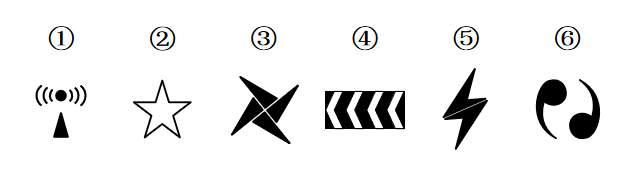
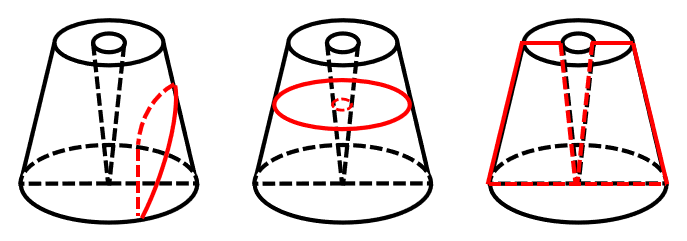

# 2020年海南公务员录用考试《行测》试题（网友回忆版）

> 判断推理 · 25 题 · 海南 2020

## 第 1 题　qid 2616105 · 图形推理

把下面六个图形分为两类，使每一类图形都有各自的共同特征或规律，分类正确的一项是：

- **A**. ①⑤⑥，②③④　✅
- **B**. ①②⑤，③④⑥
- **C**. ①②④，③⑤⑥
- **D**. ①③⑤，②④⑥

**答案**：A

**官方解析**

元素组成不同，优先考虑属性规律。对称、曲直均无明显规律，考虑开闭性。图①⑤⑥均为带有封闭区域的图形，图②③④均为全开放的图形，即①⑤⑥为一组，②③④为一组。
故正确答案为A。

---

## 第 2 题　qid 2616004 · 图形推理

把下面的六个图形分为两类，使每一类图形都有各自的共同特征或规律，分类正确的一项是：

- **A**. ①④⑥，②③⑤
- **B**. ①③⑥，②④⑤
- **C**. ①②⑥，③④⑤
- **D**. ①②④，③⑤⑥　✅

**答案**：D

**官方解析**

元素组成不同，优先考虑属性规律。观察发现，图①②④均是轴对称图形，图③⑤⑥均是中心对称图形，因此图①②④为一组，图③⑤⑥为一组。
故正确答案为D。

---

## 第 3 题　qid 2616003 · 图形推理

从所给的四个选项中，选择最合适的一个填入问号处，使之呈现一定的规律性：

- **A**. A
- **B**. B
- **C**. C　✅
- **D**. D

**答案**：C

**官方解析**

元素组成相同，优先考虑位置规律。九宫格图形优先按横行来看，观察第一行图形，发现图1通过顺时针旋转得到图2，图2通过左右翻转得到图3。第二行验证，同样满足此规律。因此问号处的图形应该是第三行中的图2通过左右翻转得到，四个选项中只有C项符合。

故正确答案为C。

---

## 第 4 题　qid 2615987 · 图形推理

一圆锥台如下图所示，从正中心挖掉一个小圆锥体，然后从任意面剖开，下面哪一项不可能是该圆锥台的截面？

- **A**. A
- **B**. B
- **C**. C
- **D**. D　✅

**答案**：D

**官方解析**

本题考查截面图，逐一分析选项。

A项：从图形腰部向下底面斜切即可得到，能切出，排除；

B项：沿图形水平方向切出即可得到，能切出，排除；

C项：从图形正中间竖直向下切即可得到，能切出，排除；

D项：图形中间有从上底面到下底面的空心圆锥，无法切出整圆，当选。

本题为选非题，故正确答案为D。

---

## 第 5 题　qid 2615988 · 定义判断

热传导是介质内无宏观运动时的传热现象，其在固体、液体和气体中均可发生。但严格而言，只有在固体中才是纯粹的热传导，在流体（泛指液体和气体）中又是另外一种情况，流体即使处于静止状态，也会由于温度梯度所造成的密度差而产生自然对流，因此在流体中热对流与热传导可能会同时发生。
根据上述定义，下列选项不存在热传导现象的是：

- **A**. 海洋上层高温水体和下层低温水体因温度差而交换
- **B**. 铁棒的一端放入热水中，另一端温度升高
- **C**. 太阳照射，导致地球表面温度升高　✅
- **D**. 在热水中加入冷水，热水变成温水

**答案**：C

**官方解析**

第一步：找出定义关键词。
“介质内无宏观运动”、“传热现象”、“流体中由于温度梯度所造成的密度差”。
第二步：逐一分析选项。
A项：海洋内部水体交换，符合“介质内无宏观运动”，海洋上层高温水体和下层低温水体因温度差而交换，符合“传热现象”、“流体中由于温度梯度所造成的密度差”，符合定义，排除； 
B项：铁棒的一端放入热水中，符合“介质内无宏观运动”，热量沿着铁棒传递到另一端，使得温度升高，符合“传热现象”，符合定义，排除；
C项：太阳照射，使地球表面温度升高，太阳与地球表面之间是真空环境，没有介质，不符合“介质内无宏观运动”，不符合定义，当选；
D项：热水中加入冷水，符合“介质内无宏观运动”，冷水和热水因温度差而发生热传递，最终变成温水，符合“传热现象”、“流体中由于温度梯度所造成的密度差”，符合定义，排除。
本题为选非题，故正确答案为C。

---

## 第 6 题　qid 2615995 · 定义判断

疼痛共情的偏好性，是指个体对他人疼痛的感知、判断和情绪反应，总是由于个体与他人之间的亲疏远近关系或情感认同程度不同而不同。
根据上述定义，下列没有体现疼痛共情的偏好性的是（    ）。

- **A**. 小明看到《西游记》里的白骨精被孙悟空打死，高兴得跳了起来
- **B**. 小张看到外来游客不幸溺水而亡，从此再也不敢去那条河里游泳　✅
- **C**. 小李在看歌剧《白毛女》时跳上戏台拉住喜儿，不让黄世仁抢走
- **D**. 小红听奶奶回忆自己在旧社会的苦日子时，禁不住潸然泪下

**答案**：B

**官方解析**

第一步：找出定义关键词。
“个体对他人疼痛的感知、判断和情绪反应”、“由于个体与他人之间的亲疏远近关系或情感认同程度不同而不同”。
第二步：逐一分析选项。
A项：小明看到《西游记》里的白骨精被孙悟空打死，高兴得跳了起来。小明对孙悟空和白骨精的情感认同程度不同，《西游记》中，孙悟空是正面形象，而白骨精是反面形象，通常人们对作品中的正义形象是支持和赞同的，所以小明看到正义获胜会很高兴、很支持，符合“个体对他人疼痛的感知、判断和情绪反应”、“由于个体与他人之间的亲疏远近关系或情感认同程度不同而不同”，符合定义，排除；
B项：小张看到外来游客不幸溺水而亡，从此再也不敢去那条河里游泳，小张与溺水游客属于陌生的关系，但溺水的不论是谁，小张都不会再去那条河里游泳，没有因为关系或认同感的不同而有区别，而是一种经验教训，不符合“由于个体与他人之间的亲疏远近关系或情感认同程度不同而不同”，不符合定义，当选；
C项：小李在看歌剧《白毛女》时跳上戏台拉住喜儿，不让黄世仁抢走，歌剧中喜儿的角色让观众怜惜，黄世仁的角色让观众厌恶，因此小李认知上会亲近喜儿，疏远黄世仁，最终跳上戏台阻止，符合“个体对他人疼痛的感知、判断和情绪反应”、“由于个体与他人之间的亲疏远近关系或情感认同程度不同而不同”，符合定义，排除；
D项：小红听奶奶回忆自己在旧社会的苦日子时，禁不住潸然泪下，小红正因为是她亲近的奶奶曾遭受了痛苦，所以忍不住得哭了，正常来讲大家对苦难的生活都有一定经历和承受力，如果是陌生人或者是讨厌的经历了苦难生活，我们未必会有特别大的情绪反应，符合“个体对他人疼痛的感知、判断和情绪反应”、“由于个体与他人之间的亲疏远近关系或情感认同程度不同而不同”，符合定义，排除。
本题为选非题，故正确答案为B。

---

## 第 7 题　qid 2615984 · 定义判断

亲环境行为是指个体通过减少或消除自身活动对环境的负面影响以达到改善生态系统结构的行为。它的本质是通过有效减轻环境问题实现环境改善，核心任务是构造环境稳态友好型的社会。
根据上述定义，下列选项属于亲环境行为的是：

- **A**. 植树造林
- **B**. 低碳出行　✅
- **C**. 细水长流
- **D**. 围海造田

**答案**：B

**官方解析**

第一步：找出定义关键词。

“个体通过减少或消除自身活动对环境的负面影响”、“改善生态系统结构”。

第二步：逐一分析选项。

A项：植树造林是新造或更新森林的生产活动，不符合“个体通过减少或消除自身活动对环境的负面影响”，不符合定义，排除； 

B项：低碳出行是一种降低“碳”的出行方式，符合“个体通过减少或消除自身活动对环境的负面影响”，符合“改善生态系统结构”，符合定义，当选；

C项：细水长流是指节约使用财物，精细安排，长远打算，与生态环境无关，不符合“个体通过减少或消除自身活动对环境的负面影响”，也不符合“改善生态系统结构”，不符合定义，排除；

D项：围海造田是把海洋变成陆地、田地，有效利用海洋空间，不符合“个体通过减少或消除自身活动对环境的负面影响”，也不符合“改善生态系统结构”，不符合定义，排除。

故正确答案为B。

注——本题出处如下：

王玉珏的论文《亲环境行为研究综述》中提到：个体亲环境行为可分为四类，其中私人领域的环保行为就包括“使用环保的出行工具”，即本题B项的“低碳出行”。

---

## 第 8 题　qid 2615989 · 定义判断

算法歧视是以算法为手段实施的歧视，主要指在大数据背景下，依靠机器计算的自动决策系统在对数据主体做出决策分析时，由于数据和算法本身不具有中立性或者隐含错误、被人为操控等原因，对数据主体进行差别对待，造成歧视性后果。
根据上述定义，下列属于算法歧视的是：

- **A**. 某新生班主任根据学生的入学成绩高低来安排他们的学号
- **B**. 某水果商家总是对长期参与团购的客户给予更低价格折扣
- **C**. 某信用评估平台通过用户的网络使用行为来判定其信用值
- **D**. 某招聘网站给男性推送高薪职位的广告次数是女性的6倍　✅

**答案**：D

**官方解析**

第一步：找出定义关键词。
“大数据背景下”、“机器计算的自动决策系统在对数据主体做出决策分析时”、“不具有中立性或者隐含错误、被人为操控”、“对数据主体进行差别对待，造成歧视性后果”。
第二步：逐一分析选项。
A项：某新生班主任根据学生的入学成绩高低来安排他们的学号，不符合“大数据背景下”，也不符合“对数据主体进行差别对待，造成歧视性后果”，不符合定义，排除； 
B项：某水果商家总是对长期参与团购的客户给予更低价格折扣，不符合“大数据背景下”，也不符合“对数据主体进行差别对待，造成歧视性后果”，不符合定义，排除； 
C项：某信用评估平台通过用户的网络使用行为来判定其信用值，不符合“对数据主体进行差别对待，造成歧视性后果”，不符合定义，排除；
D项：某招聘网站给男性推送高薪职位的广告次数是女性的6倍，符合“大数据背景下”，且性别本身并不存在差别，但是网站的推送结果存在差别，符合“不具有中立性或者隐含错误、被人为操控”、“对数据主体进行差别对待，造成歧视性后果”，符合定义，当选。
故正确答案为D。

---

## 第 9 题　qid 2616102 · 类比推理

鲜花：塑料花

- **A**. 纸质书：电子书
- **B**. 相片：画像
- **C**. 原本：复印本　✅
- **D**. 钤章：印泥

**答案**：C

**官方解析**

第一步：判断题干词语间逻辑关系。
鲜花和塑料花是并列关系，且鲜花是真花，而塑料花是仿真花，是根据鲜花人工制作而成的。
第二步：判断选项词语间逻辑关系。
A项：纸质书和电子书是并列关系，但二者是书籍的两种载体形式，与题干逻辑关系不一致，排除；
B项：相片和画像是并列关系，但二者是记录人像的两种表现形式，相片是利用照相机拍摄出来的，而画像是利用画笔画出来的，与题干逻辑关系不一致，排除；
C项：原本和复印本是并列关系，且原本是正品，而复印本是根据原本复印而来的，与题干逻辑关系一致，当选；
D项：钤章是指旧时机关团体使用的图章，需要和印泥配套使用，二者是配套对应关系，与题干逻辑关系不一致，排除。
故正确答案为C。

---

## 第 10 题　qid 2615963 · 类比推理

鸳：鸯

- **A**. 蚱蜢：蝗虫
- **B**. 白猫：黑猫
- **C**. 雄鸡：雌鸡　✅
- **D**. 红男：绿女

**答案**：C

**官方解析**

第一步：判断题干词语间逻辑关系。
鸳鸯是一种鸟类，鸳指雄鸟，鸯指雌鸟，二者为并列关系，且为并列关系中的矛盾关系。
第二步：判断选项词语间逻辑关系。
A项：蚱蜢和蝗虫的关系较有争议，多数资料显示二者为全同关系，与题干逻辑关系不一致，排除；
B项：白猫和黑猫是并列关系，但为并列关系中的反对关系，与题干逻辑关系不一致，排除；
C项：雄鸡和雌鸡是并列关系，且为并列关系中的矛盾关系，与题干逻辑关系一致，当选；
D项： 红男绿女，意思是指穿着各种漂亮服装的青年男女，二者为并列关系，但不是矛盾关系，与题干逻辑关系不一致，排除。
故正确答案为C。

---

## 第 11 题　qid 2615964 · 类比推理

售后：品控

- **A**. 数据：科学
- **B**. 融资：风投
- **C**. 龙骨：地板
- **D**. 听证：监管　✅

**答案**：D

**官方解析**

第一步：判断题干词语间逻辑关系。
售后需要品控，二者为对应关系，且品控不只是售后阶段存在，所有阶段都需要品控。
第二步：判断选项词语间逻辑关系。
A项：科学研究需要数据，但两词顺序与题干相反，与题干逻辑关系不一致，排除；
B项：风投是一种融资方式，二者为种属关系，与题干逻辑关系不一致，排除；
C项：龙骨是用来支撑造型、固定结构的一种建筑材料，龙骨用来支撑地板，与题干逻辑关系不一致，排除；
D项：听证需要监管，二者为对应关系，且监管不只是听证阶段存在，所有阶段都需要监管，与题干逻辑关系一致，当选。
故正确答案为D。

---

## 第 12 题　qid 2615965 · 类比推理

牵牛花：喇叭花

- **A**. 乞巧节：七夕节　✅
- **B**. 七巧板：橡皮泥
- **C**. 人行道：车行道
- **D**. 防腐剂：添加剂

**答案**：A

**官方解析**

第一步：判断题干词语间逻辑关系。
牵牛花又称喇叭花，二者为全同关系。
第二步：判断选项词语间逻辑关系。
A项：乞巧节又称七夕节，二者为全同关系，与题干逻辑关系一致，当选；
B项：七巧板和橡皮泥均为儿童玩具，二者为并列关系，与题干逻辑关系不一致，排除；
C项：人行道和车行道为并列关系，与题干逻辑关系不一致，排除；
D项：防腐剂是添加剂的一种，二者为种属关系，与题干逻辑关系不一致，排除。
故正确答案为A。

---

## 第 13 题　qid 2616137 · 类比推理

牡丹：洛阳：郑州

- **A**. 荷花：青岛：济南
- **B**. 木芙蓉：成都：成都
- **C**. 菊花：太原：石家庄
- **D**. 凤凰花：厦门：福州　✅

**答案**：D

**官方解析**

第一步：判断题干词语间逻辑关系。
牡丹是洛阳市花，郑州是河南省的省会城市，洛阳和郑州均为河南省的城市。
第二步：判断选项词语间逻辑关系。
A项：荷花是济南市花，青岛是山东省的城市，济南是山东省的省会城市，与题干逻辑关系不一致，排除；
B项：木芙蓉是成都市花，成都是四川省的省会城市，但成都和成都为同一个城市，与题干逻辑关系不一致，排除；
C项：菊花是太原市花，太原是山西省的省会城市，石家庄是河北省的省会城市，太原和石家庄是不同省份的城市，与题干逻辑关系不一致，排除；
D项：凤凰花又叫凤凰木，为厦门市树，厦门是福建省的城市，福州是福建省的省会城市，与题干逻辑关系一致，当选。
故正确答案为D。

---

## 第 14 题　qid 2615969 · 类比推理

空运：海运：运输

- **A**. 平装：精装：装帧　✅
- **B**. 货轮：客轮：邮轮
- **C**. 晚会：聚会：集会
- **D**. 试飞：试航：航天

**答案**：A

**官方解析**

第一步：判断题干词语间逻辑关系。
空运和海运是两种不同的运输方式，前两词为并列关系，并与第三词构成种属关系。
第二步：判断选项词语间逻辑关系。
A项：平装和精装是两种不同的装帧方式，前两词为并列关系，并与第三词构成种属关系，与题干逻辑关系一致，当选；
B项：货轮和客轮分别是用来运载货物和乘客的船舶，二者为并列关系，邮轮指的是在海洋中航行的旅游客轮，所以邮轮是客轮的一种，与货轮不构成种属关系，与题干逻辑关系不一致，排除；
C项：晚会是指在晚上举行的集会，多以文娱活动为主，聚会是指人数较多，有明确主题的集体活动，二者不构成并列关系，与题干逻辑关系不一致，排除；
D项：试飞是指在飞机交付使用前进行的试验性飞行，试航是指飞机、船只等在正式航行前进行的试验性航行，二者和航天没有必然关系，与题干逻辑关系不一致，排除。
故正确答案为A。

---

## 第 15 题　qid 2615968 · 类比推理

初伏：中伏：末伏

- **A**. 火星：木星：土星
- **B**. 大雨：小雨：谷雨
- **C**. 上旬：中旬：下旬　✅
- **D**. 大暑：小暑：处暑

**答案**：C

**官方解析**

第一步：判断题干词语间逻辑关系。
初伏、中伏、末伏，三者之间是并列关系，并且三者按照三伏天的时间先后顺序排列，先初伏，再中伏，最后末伏。
第二步：判断选项词语间逻辑关系。
A项：火星、木星、土星是太阳系八大行星中的三个行星，三者之间是并列关系，但是没有时间先后顺序，与题干逻辑关系不一致，排除；
B项：大雨、小雨是两种不同的天气，谷雨是二十四节气之一，三者不构成并列关系，与题干逻辑关系不一致，排除；
C项：上旬、中旬、下旬，三者之间是并列关系，并且三者按照一个月份的不同时间段的时间先后顺序排列，先上旬，再中旬，最后下旬，与题干逻辑关系一致，当选；
D项：大暑、小暑、处暑是二十四节气中的三个节气，三者之间是并列关系，但是它们的时间先后顺序应该是先小暑，再大暑，最后处暑，与题干逻辑关系不一致，排除。
故正确答案为C。

---

## 第 16 题　qid 2615967 · 类比推理

羊：羊奶：腥膻

- **A**. 蚕：蚕丝：雪白
- **B**. 蜘蛛：蛛丝：粘缚
- **C**. 蜂：蜂蜜：甘甜　✅
- **D**. 雨燕：燕窝：营养

**答案**：C

**官方解析**

第一步：判断题干词语间逻辑关系。
羊奶是羊的产出物，腥膻是羊奶的必然属性，且腥膻是一种味道。
第二步：判断选项词语间逻辑关系。
A项：蚕丝是蚕的产出物，但雪白不是蚕丝的必然属性，且雪白也不是一种味道，与题干逻辑关系不一致，排除；
B项：蛛丝是蜘蛛的产出物，但粘缚是蛛丝的功能，而非属性，与题干逻辑关系不一致，排除；
C项：蜂蜜是蜂的产出物，甘甜是蜂蜜的必然属性，且甘甜是一种味道，与题干逻辑关系一致，当选；
D项：燕窝是雨燕科几种金丝燕分泌的唾液及其绒羽混合粘结所筑成的巢穴，而燕窝并非是雨燕直接产出的，且营养也不是一种味道，与题干逻辑关系不一致，排除。
故正确答案为C。

---

## 第 17 题　qid 2615966 · 类比推理

花：牡丹：玫瑰

- **A**. 茶：红茶：绿茶
- **B**. 草：艾草：蓼草　✅
- **C**. 球：足球：绒球
- **D**. 车：轿车：客车

**答案**：B

**官方解析**

第一步：判断题干词语间逻辑关系。
玫瑰和牡丹都是花，二者之间为并列关系，与花均为种属关系，且玫瑰和牡丹都是自然界的植物。
第二步：判断选项词语间逻辑关系。
A项：红茶和绿茶都是茶，二者之间为并列关系，与茶均为种属关系，但红茶和绿茶都是经过人们加工而制成的，与题干逻辑关系不一致，排除；
B项：艾草和蓼草都是草，二者之间为并列关系，与草均为种属关系，且艾草和蓼草都是自然界的植物，与题干逻辑关系一致，当选；
C项：绒球是用彩色毛线或绒线扎成的球形物体，与足球不是一类事物，二者之间不是并列关系，与题干逻辑关系不一致，排除；
D项：轿车和客车都是车，二者之间为并列关系，与车均为种属关系，但轿车和客车都是人类制造出来的产物，与题干逻辑关系不一致，排除。
故正确答案为B。

---

## 第 18 题　qid 2615970 · 类比推理

了如指掌  对于（    ）相当于（    ）对于  坚固

- **A**. 知道；铁板一块
- **B**. 明白；坚不可摧
- **C**. 理解；铜墙铁壁
- **D**. 了解；固若金汤　✅

**答案**：D

**官方解析**

逐一代入选项。
A项：“了如指掌”是指对事物了解得非常清楚，“知道”是指有一定的了解和认识，二者为近义关系；“铁板一块”比喻结合紧密、不可分割的整体，“坚固”是指结实牢固，不容易破坏，二者无明显的关系，前后逻辑关系不一致，排除；
B项：“了如指掌”是指对事物了解得非常清楚，“明白”有知道、了解的意思，二者为近义关系；“坚不可摧”形容非常坚固，与“坚固”为近义关系，前后逻辑关系一致，保留；
C项：“了如指掌”是指对事物了解得非常清楚，“理解”是指懂、了解，二者为近义关系；“铜墙铁壁”是指防御十分坚固，与“坚固”为近义关系，前后逻辑关系一致，保留；
D项：“了如指掌”是指对事物了解得非常清楚，与“了解”为近义关系；“固若金汤”形容防守非常坚固，与“坚固”为近义关系，前后逻辑关系一致，保留。
对比B、C、D三项，题干的“了如指掌”和D项的“固若金汤”都含有比喻义，词语结构更加贴近，D项当选。
故正确答案为D。

---

## 第 19 题　qid 2615962 · 类比推理

（    ）对于  裁判  相当于  案件  对于（    ）

- **A**. 球员；法庭
- **B**. 黑哨；上诉
- **C**. 比赛；法官　✅
- **D**. 比分；律师

**答案**：C

**官方解析**

逐一代入选项。
A项：球员是裁判监督的对象，二者为主体和对象的对应关系，法庭是案件审判的场所，二者为场所对应关系，前后逻辑关系不一致，排除；
B项：黑哨是足球运动中裁判违反公平性原则的行为，二者为对应关系，上诉案件，二者为动宾关系，前后逻辑关系不一致，排除；
C项：裁判是一种职业，裁判可以判决比赛，法官是一种职业，法官可以判决案件，二者是职业主体和对象的对应关系，且主体与对象之间的关系均体现为“判决”，前后逻辑关系一致，当选；
D项：裁判是一种职业，裁判可以记录比分，律师是一种职业，律师可以处理案件，二者是职业主体和对象的对应关系，但主体与对象之间的关系不一致，前面为“记录”，后面为“处理”，前后逻辑关系不一致，排除。
故正确答案为C。

---

## 第 20 题　qid 2616032 · 逻辑判断

在市场竞争十分激烈的时候，一个企业要是不激流勇进，创造出富有竞争力的产品，也不适时撤退、主动割爱，放弃没有前景的市场，那么这个企业最后一定会陷入危机之中。
如果以上论断为真，下列说法正确的是（    ）。

- **A**. 某企业未能创造出富有竞争力的产品，最后一定会惨遭淘汰
- **B**. 某企业紧要关头急流勇退，转向其它市场，就可以避免危机
- **C**. 某企业放弃已显颓势的产业，转向新产品的开发，它可能不会被淘汰　✅
- **D**. 某企业研发出了富有竞争力的产品，它最后一定不会陷入危机之中

**答案**：C

**官方解析**

第一步：翻译题干。

-（激流勇进，创造出富有竞争力的产品）且-（适时撤退，主动割爱，放弃没有前景的市场）→陷入危机

第二步：逐一分析选项。

A项：翻译为-创造出有市场竞争力的产品→淘汰，“-创造出有市场竞争力的产品”是对题干翻译前件“且”关系一部分的肯定，据此无法判断整个“且”关系的真假，进而无法得出确定性结论，不能推出，排除；

B项：翻译为“急流勇退，转向其他市场陷入危机”，“急流勇退，转向其他市场”即“适时撤退、主动割爱，放弃没有前景的市场”，是对题干翻译前件“且”关系的一部分的否定，否前不能得到确定性结论，不能推出，排除；

C项：翻译为放弃已显颓势的产业→可能不会被淘汰，放弃已显颓势的产业是否定题干翻译前件“且关系”的一部分，否前不能得到确定性结论，但是C选项后面说的是可能不会被淘汰，是一种可能性的表述，可以推出，当选；

D项：翻译为富有竞争力的产品→-陷入危机，是否定题干翻译前件“且关系”的一部分，否前不能得到确定性结论，不能推出，排除。

故正确答案为C。

---

## 第 21 题　qid 2616107 · 类比推理

师范类院校学生来自全国各地，甲大学是师范类院校，所以甲大学的学生来自全国各地。
下列选项所犯逻辑错误与上述推理最相似的是：

- **A**. 牛不是食肉动物，而狮子不是牛，所以狮子不是食肉动物
- **B**. 父母爱读书的孩子爱运动，小黄爱运动，所以小黄的父母爱读书
- **C**. 私人捐赠的教学楼遍布全国各高校，何况是邵逸夫先生捐赠的逸夫楼　✅
- **D**. 文明司机都是礼让行人的，有些公务司机礼让行人，所以有些公务司机是文明司机

**答案**：C

**官方解析**

第一步：翻译题干。

A（师范类院校学生）B（来自全国各地），C（甲大学）A（师范类院校），结论：C（甲大学的学生）B（来自全国各地）。

第二步：逐一分析选项。

A项：A（牛）B（不是食肉动物），C（狮子）A（牛），结论：C（狮子）B（不是食肉动物），与题干推理形式不一致，排除；

B项：A（父母爱读书）B（孩子爱运动），C（小黄）B（爱运动），结论：C（小黄）A（父母爱读书），与题干推理形式不一致，排除；

C项：该句的后半句“何况是邵逸夫先生捐赠的逸夫楼”是反问，可以理解为“逸夫楼是私人捐赠的教学楼，所以逸夫楼遍布全国各高校”。即A（私人捐赠的教学楼）B（遍布全国各高校），C（逸夫楼）A（私人捐赠的教学楼），结论：C（逸夫楼）B（遍布全国各高校），与题干推理形式一致，当选；

D项：A（文明司机）B（礼让行人），C（有些公务司机）B（礼让行人），结论：C（有些公务司机）A（文明司机），与题干推理形式不一致，排除。

故正确答案为C。

---

## 第 22 题　qid 2616036 · 逻辑判断

食品添加剂是现代食品工业的重要组成部分，按规定使用食品添加剂既对人体无害，而且能够改善食品品质，起到防腐、保鲜的作用。正是因为有了食品添加剂的发展，才有了大量的方便食品，给人们的生活带来极大的便利。如果不加入食品添加剂，大部分食品要么难看、难吃或者难以保鲜，要么就是价格昂贵。
下列说法能够支持上面论点的是（    ）。

- **A**. 食品添加剂和人类文明史一样悠久，例如点豆腐用的卤水
- **B**. 如果不使用添加剂，食品会因微生物作用而引起食物中毒　✅
- **C**. 宣称无食品添加剂往往是商家迎合消费者心理造成的噱头
- **D**. 三聚氰胺也是一种添加剂，在水泥里能够作为高效减水剂

**答案**：B

**官方解析**

第一步：找出论点和论据。
论点：食品添加剂是现代食品工业的重要组成部分，按规定使用食品添加剂既对人体无害，而且能够改善食品品质，起到防腐、保鲜的作用。正是因为有了食品添加剂的发展，才有了大量的方便食品，给人们的生活带来极大的便利。如果不加入食品添加剂，大部分食品要么难看、难吃或者难以保鲜，要么就是价格昂贵。
论据：无
本题只有论点，没有论据，加强优先考虑补充论据，即解释为什么食品添加剂按规定添加既对人体无害，并且能够改善食品品质，防腐，保鲜，或举例证明某些食品添加剂对人体无害，并且能够改善食品品质，防腐，保鲜。
第二步：逐一分析选项。
A项：论点说的是食品添加剂按规定添加既对人体无害，并且能够改善食品品质，防腐，保鲜，该项说的是食品添加剂和人类文明一样历史悠久，话题不一致，无法加强，排除；
B项：若不使用食品添加剂，食品会因微生物作用而导致食物中毒，说明食品添加剂对于食品是有好处的，解释了为什么我们要在食品中添加食品添加剂，当选；
C项：论点说的是食品添加剂按规定添加既对人体无害，并且能够改善食品品质，防腐，保鲜，该项说的是商家会以什么样的噱头来吸引消费者，话题不一致，无法加强，排除；
D项：论点强调的是食品添加剂按规定添加既对人体无害，并且能够改善食品品质，防腐，保鲜，该项说的是三聚氰胺在不同的环境中所起到的作用，与题干话题不一致，排除。
故正确答案为B。

---

## 第 23 题　qid 2616135 · 逻辑判断

一项最新研究发现，世界上的绿海龟越来越“雌性化”。专家估计，到2100年，约有的新生绿海龟为雌性。研究表明，决定绿海龟性别的主要因素是绿海龟孵化时周围沙子的温度。如果沙子的温度在28到30度之间，孵化出来的绿海龟雌雄比例差不多；如果温度高出这个范围，那孵化出来的绿海龟大多数是雌性，相反，则大多数为雄性。

以下哪项如果为真，最能支持上述论断？

- **A**. 绿海龟终将无法正常繁殖最后在地球上灭绝
- **B**. 绿海龟是一种由孵化时温度决定性别的动物
- **C**. 温室效应将导致全球气候变暖问题日趋严重　✅
- **D**. 温度的持续升高使绿海龟孵化的死亡率增加

**答案**：C

**官方解析**

第一步：找出论点和论据。

论点：到2100年，约有的新生绿海龟为雌性。

论据：决定绿海龟性别的主要因素是海龟孵化时周围沙子的温度。如果沙子的温度在28到30度之间，孵化出来的绿海龟雌雄比例差不多；如果温度高出这个范围，那孵化出来的绿海龟大多数是雌性，相反，则大多数为雄性。

本题的论点讨论的是绿海龟到2100年新生绿海龟将有的为雌性，而论据讨论的是决定海龟性别的是温度，温度达到以上孵化的绿海龟中雌性的比例较大，论点论据话题不一致，优先考虑搭桥，即建立起“2100年”与“温度达到以上”的关系。

第二步：逐一分析选项。

A项：该项说的是绿海龟繁殖和灭绝之间的关系，论点论据讨论的是绿海龟性别和孵化温度的关系，话题不一致，无法加强，排除；

B项：该项只是指出了绿海龟孵化的性别与温度有关，没有明确说明雌性与温度的具体关系，也不明确未来温度是否会达到30度以上，属于不明确选项，无法加强，排除；

C项：该项讨论了温室效应将导致未来全球变暖更加严重，表明了未来温度将会升高，因此2100年的气温很有可能超过，如果气温超过孵化出的绿海龟大多数将为雌性海龟，搭桥项，可以加强，当选；

D项：论点说的是绿海龟性别和孵化温度的关系，该项讨论的是温度与绿海龟死亡率之间的关系，话题不一致，无法加强，排除。

故正确答案为C。

---

## 第 24 题　qid 2616034 · 逻辑判断

二氧化碳的排放量剧增导致全球气候变暖，使珠穆朗玛峰所在的喜马拉雅地区冰川面临急剧缩小的危险。研究显示，珠峰海拔在5000米到6000米的冰川集中区域出现快速融化的现象，这些地方将只在冬季而不是在温暖的季节时看到结冰。专家推论说，根据未来的气候变化趋势，喜马拉雅地区的冰川减少的速度还有可能加快，如果本世纪内气温如预计的一样继续升高，该地区的冰川最终将消失殆尽。
如果以下各项为真，最能削弱上述论证的是：

- **A**. 
喜马拉雅冰川每年缩小约到

- **B**. 
喜马拉雅其他地区冰川对温度不敏感
　✅
- **C**. 
过去50年珠峰周边冰川覆盖面积减少了

- **D**. 
珠穆朗玛峰7000米以上区域未出现冰川快速融化现象

**答案**：B

**官方解析**

第一步：找出论点和论据。

论点：根据未来的气候变化趋势，喜马拉雅地区的冰川减少的速度还有可能加快，如果本世纪内气温如预计的一样继续升高，该地区的冰川最终将消失殆尽。

论据：珠峰海拔在5000米到6000米的冰川集中区域出现快速融化的现象，这些地方将只在冬季而不是在温暖的季节时看到结冰。

论点说的是喜马拉雅地区的冰川将会消失殆尽，论据是珠峰海拔在5000米到6000米的冰川集中区域出现快速融化的现象，因此本题目的论证关系是通过珠穆朗玛峰5000米-6000米区域的变化，来预测喜马拉雅山未来整体的情况，论点和论据的话题不一致，要想否定论证，可以补充5000米-6000米之外的地方冰川不会消融来进行否定，即通过局部是推不出整体这种方式来进行否定。

第二步：逐一分析选项。

A项：选项说喜马拉雅冰川每年缩小约到，补充论据说明冰川在不断缩小，有加强力度，排除；

B项：选项说喜马拉雅其他地区冰川对温度不敏感，说明在珠穆朗玛峰5000米-6000米之外的其他地区冰川并不会受温度的影响，那么就说明从题干中的论据是推不出论点的，可以削弱，当选；

C项：过去50年珠峰周边冰川覆盖面积减少了，补充论据说明冰川在不断缩小，有加强力度，排除；

D项：珠穆朗玛峰7000米以上区域未出现冰川快速融化现象，通过举反例来证明冰川不会完全消失，但该项只是举出了7000米以上的地区，不如B项包含的范围广，可以削弱，但是力度比B项弱，排除。

故正确答案为B。

---

## 第 25 题　qid 2616033 · 逻辑判断

越是身处浮华的地方，我们越是希望能遇到一块心灵栖息地。虽然我们生活在一个商业化社会，但书店仍然是灵魂的慰藉之地。大到城市，小到商场，若能有一家文化味浓郁的书店，一定能让人们感受到不一样的氛围。书店入驻商场，这不仅能给商场带来客流，也能提升商场的品位。以书店融合阅读、休闲和其他文化产品的类似“文化商场”模式，更是可以在商场内部构建一个特别的文化链。
如果以上论断为真，则下列说法正确的是：

- **A**. 城市让人们感受到不一样的氛围，是因为拥有文化味浓郁的书店
- **B**. 想要在商场内部构建一个特别的文化链，就不应忽视书店这一环　✅
- **C**. 因为书店提升了商场的品位，所以书店给商场带来了客流
- **D**. 即便不是身处浮华的地方，我们也能遇到一块心灵栖息地

**答案**：B

**官方解析**

日常结论题，根据题干信息逐一分析选项。
A项：题干中指出文化味浓郁的书店可以推出让人们感受到不一样的氛围，选项中说是因为有文化味浓郁的书店所以让人们感受到不一样的氛围，推出关系不等于因果关系，无法推出，排除；
B项：根据题干最后一句话可知，书店可以在商场内部构建一个特别的文化链，选项中说想要在商场内部构建一个特别的文化链，不应该忽视书店这一环，是文段的同义替换，可以推出，当选；
C项：题干中指出书店既给商场带来客流也提升了商场的品位，选项中说是因为书店提升了商场的品位所以给商场带来了客流，无法推出，排除；
D项：题干说的是我们希望遇到心灵栖息地，选项说的是我们能否遇到心灵栖息地，属于偷换概念，无法推出，排除。
故正确答案为B。

---
