# 2020年深圳市考公务员录用考试《思维能力测验》试题（网友回忆版）

> 判断推理 · 49 题 · 深圳市考 2020

## 第 1 题　qid 2731632 · 类比推理

①现场心肺复苏
②工友触电倒地
③医护全力救治
④拨打急救电话
⑤立即切断电源

- **A**. ②④⑤①③
- **B**. ②⑤④①③　✅
- **C**. ②⑤④③①
- **D**. ③①②⑤④

**答案**：B

**官方解析**

第一步：先确定逻辑关系最为明显的逻辑顺序。
观察题干，五个事件主要围绕“工友触电倒地抢救“的过程展开。逻辑关系的先后顺序比较明显的是事件②和事件③，先触电倒地，才能全力救治，因此事件②应该在事件③前面，故事件②为首句，排除D项。
第二步：逐一对照选项并判断正确答案。
根据第一步的结果可以判断A、B、C三项均符合，触电后应首先切断电源，后拨打急救电话，所以事件⑤在事件④前面，排除A项；触电急救必须分秒必争，在医务人员未接替救治前，应立即就地迅速进行心肺复苏抢救，故事件①在事件③前面，排除C项。
故正确答案为B。

---

## 第 2 题　qid 2730671 · 类比推理

①各地赶赴增援
②暴雨引发洪涝
③沿岸受灾严重
④群众积极自救
⑤重建美好家园

- **A**. ②④⑤③①
- **B**. ②⑤③④①
- **C**. ②③④①⑤　✅
- **D**. ③②①④⑤

**答案**：C

**官方解析**

第一步：先确定逻辑关系最为明显的逻辑顺序。
观察题干，五个事件主要围绕“暴雨洪涝后重建家园”的过程。逻辑关系的先后顺序比较明显的是事件②和事件③，先暴雨引发洪涝，才会导致沿岸受灾，即事件②应该在事件③前面，故事件②为首句，排除D项。
第二步：逐一对照选项并判断正确答案。
根据第一步的结果可以判断A、B、C三项均符合，重建美好家园是群众积极自救和各地赶赴增援产生的结果，故事件①、事件④应在事件⑤前面，排除A、B两项。
故正确答案为C。

---

## 第 3 题　qid 2730691 · 类比推理

①最终陈述
②法庭辩论
③法庭调查
④宣告判决
⑤合议庭评议

- **A**. ②①③④⑤
- **B**. ②③①⑤④
- **C**. ③②①④⑤
- **D**. ③②①⑤④　✅

**答案**：D

**官方解析**

第一步：先确定逻辑关系最为明显的逻辑顺序。
观察题干，五个事件主要围绕“案件庭审”的过程。逻辑关系的先后顺序比较明显的是事件②和事件③，案件当事人会根据法庭调查阶段查明的事实和证据，阐明自己的观点和意见进行辩论，即事件③应该在事件②前面，故事件③为首句，排除A、B两项。
第二步：逐一对照选项并判断正确答案。
根据第一步的结果可以判断C、D两项均符合，合议庭评议后，审判长才能宣告判决，故事件⑤在事件④前面，排除C项。
故正确答案为D。

---

## 第 4 题　qid 2730736 · 类比推理

①动能损耗
②形成潮汐
③自转变慢
④海陆摩擦
⑤天体引力

- **A**. ③②⑤①④
- **B**. ③①⑤④②
- **C**. ⑤③②④①
- **D**. ⑤②④①③　✅

**答案**：D

**官方解析**

第一步：先确定逻辑关系最为明显的逻辑顺序。
观察题干，五个事件主要围绕“地球自转变慢的原因”。逻辑关系的先后顺序比较明显的是事件①和事件④，摩擦会导致动能损耗，即事件④应该在事件①前面，排除A、B两项。
第二步：逐一对照选项并判断正确答案。
根据第一步的结果可以判断C、D两项均符合，有摩擦力的情况下，动能损耗将导致速度变慢，故事件①在事件③前面，排除C项。
故正确答案为D。

---

## 第 5 题　qid 2730608 · 类比推理

①南水北调成功通水
②北方水资源短缺
③岸区移民搬迁安置
④水危机掣肘得到缓解
⑤南北经济齐飞共进

- **A**. ②③①④⑤　✅
- **B**. ②④③①⑤
- **C**. ⑤④①②③
- **D**. ②④①⑤③

**答案**：A

**官方解析**

第一步：先确定逻辑关系最为明显的逻辑顺序。
观察题干，五个事件主要围绕“缓解北方水资源危机”展开。逻辑关系的先后顺序比较明显的事件是事件①和事件④，先通过南水北调成功通水，水危机掣肘才能得到缓解，即事件①在事件④前面，排除B、C、D三项。
第二步：逐一对照选项并判断正确答案。
根据第一步的结果判断只有A项符合，事件②北方水资源短缺是事件的背景，然后先将岸区移民搬迁安置，再南水北调成功通水，因此事件③在事件①的前面，先是水危机掣肘得到缓解，再是南北经济齐飞共进，故事件④在事件⑤的前面，符合逻辑，当选。
故正确答案为A。

---

## 第 6 题　qid 2730614 · 类比推理

①包装运输
②晾晒加工
③收获海货
④出海打鱼
⑤网店销售

- **A**. ④③②①⑤　✅
- **B**. ④③①②⑤
- **C**. ②③④①⑤
- **D**. ②③④⑤①

**答案**：A

**官方解析**

第一步：先确定逻辑关系最为明显的逻辑顺序。
观察题干，五个事件主要围绕“海货加工销售”的过程。逻辑关系的先后顺序比较明显的是事件④和③，先出海打鱼，再收获海货，因此事件④应该在事件③的前面，排除C、D两项。
第二步：逐一对照选项并判断正确答案。
根据第一步的结果可以判断只有A、B两项符合，晾晒加工之后才能包装运输，因此事件②应该在事件①的前面，排除B项。
故正确答案为A。

---

## 第 7 题　qid 2730620 · 类比推理

①宇宙探索
②水中游弋
③四肢匍匐
④直立奔跑
⑤高空飞驰

- **A**. ②③①⑤④
- **B**. ②③④⑤①　✅
- **C**. ③②④⑤①
- **D**. ④③②①⑤

**答案**：B

**官方解析**

第一步：先确定逻辑关系最为明显的逻辑顺序。
观察题干，五个事件主要围绕“生命的演化”的过程。逻辑关系的先后顺序比较明显的事件是事件⑤和事件①，先完成高空飞驰，再到宇宙探索，因此事件⑤应该在事件①的前面，排除A、D两项。
第二步：逐一对照选项并判断正确答案。
根据第一步的结果可以判断只有B、C两项符合，生命的演化先从水中游弋再到陆地四肢匍匐，因此事件②应该在事件③的前面，排除C项。
故正确答案为B。

---

## 第 8 题　qid 2730637 · 类比推理

①发明司南和罗盘
②大航海时代开启
③发现磁石指向性
④偶然接触磁铁矿
⑤丝绸之路贯亚欧

- **A**. ④①②③⑤
- **B**. ④③①⑤②　✅
- **C**. ④③①②⑤
- **D**. ⑤④③①②

**答案**：B

**官方解析**

第一步：先确定逻辑关系最为明显的逻辑顺序。
观察题干，五个事件主要围绕“大航海时代的起源与发展的过程”来展开。逻辑关系的先后顺序比较明显的事件是事件①、事件③、事件④，先偶然接触磁铁矿，然后发现磁石指向性，再是发明司南和罗盘，因此事件④应该在事件③前，事件③应该在事件①前，排除A项。
第二步：逐一对照选项并判断正确答案。
根据第一步的结果可以判断B、C、D三项均符合，偶然接触磁铁矿的时间在战国时期（公元前475年-公元前221年），丝绸之路贯亚欧的时间大约在公元100年左右，大航海时代的开启在15世纪，因此事件④应该在事件⑤之前，事件⑤应该在事件②之前，排除C、D两项。
故正确答案为B。

---

## 第 9 题　qid 2730564 · 类比推理

①掌握发展主动
②发展前景受制
③科技基础薄弱
④专注技术研发
⑤获得核心专利

- **A**. ②③④⑤①
- **B**. ②③④①⑤
- **C**. ③②④⑤①　✅
- **D**. ②③⑤④①

**答案**：C

**官方解析**

第一步：先确定逻辑关系最为明显的逻辑顺序。
观察题干，五个事件主要围绕“科技如何突破现有困境做到发展创新”。逻辑关系先后顺序比较明显的事件是事件②和事件③，科技基础薄弱是发展前景受制的原因，事件③应当在事件②前面，排除A、B、D三项。
第二步：逐一对照选项并判断正确答案。
根据第一步的结果可以判断只有C项符合。出现发展前景受制的问题后，需要通过专注技术研发解决问题，然后获得核心专利，最终结果是掌握发展主动。符合逻辑，当选。
故正确答案为C。

---

## 第 10 题　qid 2730570 · 类比推理

①新三板揭牌
②深交所开业
③创业板上市
④证监会成立
⑤深港通启动

- **A**. ④②③⑤①
- **B**. ②③①④⑤
- **C**. ④②③①⑤
- **D**. ②④③①⑤　✅

**答案**：D

**官方解析**

第一步：先确定逻辑关系最为明显的逻辑顺序。
观察题干，五个事件主要围绕“五个主体具体成立时间先后”。根据选项首位分析，排在第一位的在事件②和④之间。深交所开业于1990年12月，证监会成立于1992年10月，根据时间先后顺序可知，事件②应在事件④之前，排除A、C两项。
第二步：逐一对照选项并判断正确答案。
根据第一步的结果可以判断只有B、D两项符合，新三板揭牌于2013年1月，创业板上市于2009年10月，深港通启动于2016年12月，根据时间先后顺序可知，接着是事件③，最后是事件①和事件⑤，排除B项。
故正确答案为D。

---

## 第 11 题　qid 2730645 · 图形推理

从四个选项中选择一个替代问号，使两套图形的规律表现出最大的相似性，最适合的是（    ）。

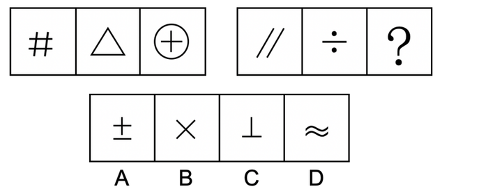

- **A**. A
- **B**. B
- **C**. C
- **D**. D　✅

**答案**：D

**官方解析**

元素组成不同，且无明显属性规律，考虑数量规律。观察发现，左侧三幅图中均出现直线，优先考虑数直线数。直线数分别为4、3、2，是公差为-1的等差数列。故右侧应遵循相同规律，直线数分别为2、1、？，故“？”处图形直线数应为0，只有D项符合。
故正确答案为D。

---

## 第 12 题　qid 2730643 · 图形推理

从四个选项中选择一个替代问号，使两套图形的规律表现出最大的相似性，最适合的是（    ）。

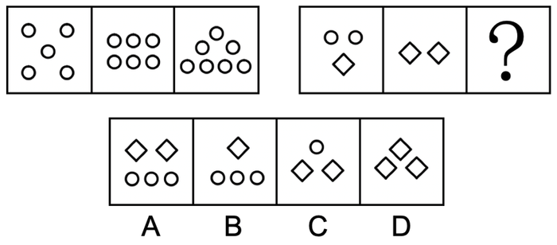

- **A**. A
- **B**. B
- **C**. C　✅
- **D**. D

**答案**：C

**官方解析**

本题考查元素运算。观察发现，左侧三幅图中的圆圈数量分别为5、6、7，每次增加一个圆圈。因此右侧三幅图中的圆圈数量也应依次递增，但因右侧前两幅图形中出现两种不同元素，考虑元素运算。第二组图去掉图一和图二中相同的一个菱形后，图一为两个圆圈，图二为一个菱形，而根据第一组图中可知，图一和图二差值应为1个圆圈，即两个圆圈再加上一个圆圈之后，得到一个菱形，即1个菱形3个圆圈，故“？”处图形经过运算应为7个圆圈，只有C项符合。

故正确答案为C。

---

## 第 13 题　qid 2730655 · 图形推理

从四个选项中选择一个替代问号，使两套图形的规律表现出最大的相似性，最适合的是（    ）。

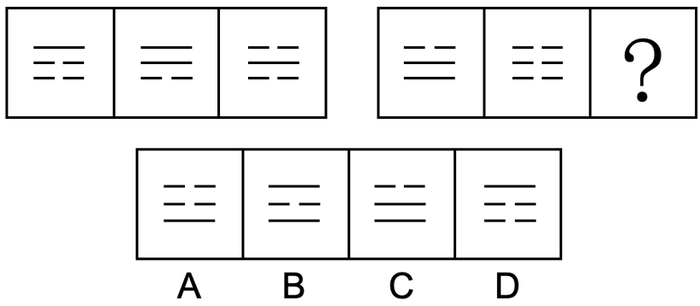

- **A**. A
- **B**. B
- **C**. C　✅
- **D**. D

**答案**：C

**官方解析**

元素组成相似，均由实线和虚线构成，优先考虑样式规律。观察第一组图发现：实线实线虚线，虚线实线实线，虚线虚线虚线。将规律应用到第二组图，最上方为虚线虚线虚线，排除B、D两项。观察A、C两项，下方两条线条不同，题干第二组图下方两条线都是实线虚线，得出结果应该一致，只有C项符合。

故正确答案为C。

---

## 第 14 题　qid 2730696 · 图形推理

从四个选项中选择一个替代问号，使两套图形的规律表现出最大的相似性，最适合的是（    ）。

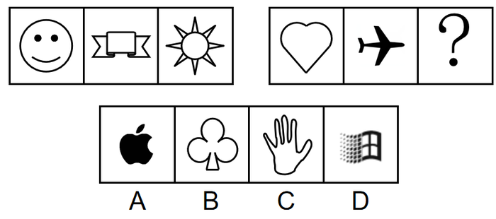

- **A**. A
- **B**. B　✅
- **C**. C
- **D**. D

**答案**：B

**官方解析**

元素组成不相同不相似，而且题目中出现了生活化、粗线条图形，优先考虑属性规律。观察发现第一组图中的图形均为轴对称图形，第二组图中前两幅图也为轴对称图形，故“？”处也应为轴对称图形，只有B项符合。
故正确答案为B。

---

## 第 15 题　qid 2616491 · 图形推理

从四个选项中选择一个替代问号，使之呈现出一定的规律性（   ）。

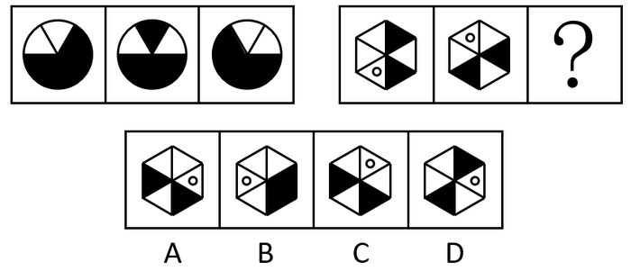

- **A**. A　✅
- **B**. B
- **C**. C
- **D**. D

**答案**：A

**官方解析**

元素组成相同，优先考虑位置规律。观察发现，题干第一组图形中，黑色扇形①依次顺时针移动2格；黑色半圆②依次顺时针移动1格，如下图所示：

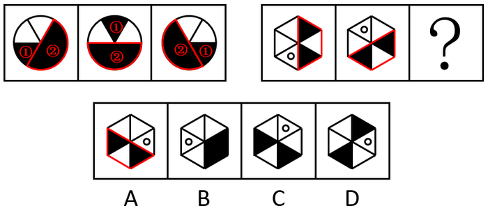

将规律代入第二组图，空白圆依次顺时针移动2格，黑色三角形依次顺时针移动1格，对应A项。

故正确答案为A。

---

## 第 16 题　qid 2730895 · 图形推理

从四个选项中选择一个替代问号，使之呈现出一定的规律性，最适合的是（    ）。

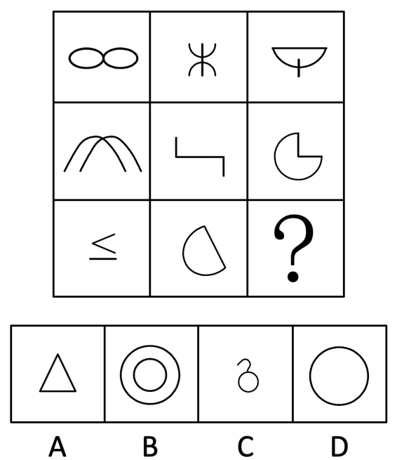

- **A**. A　✅
- **B**. B
- **C**. C
- **D**. D

**答案**：A

**官方解析**

元素组成不相同且不相似，无明显属性规律，考虑数量规律。观察发现，题干中线条交叉明显，优先数点。第一行图形点数量分别为1、2、3，第二行图形点数量分别为1、2、3，点数量呈递增规律，第三行前两幅图形点数量分别为1、2，因此“？”处点数量应为3，只有A项符合。
故正确答案为A。

---

## 第 17 题　qid 2730652 · 图形推理

从四个选项中选择一个替代问号，使之呈现一定规律性，最适合的是（    ）。

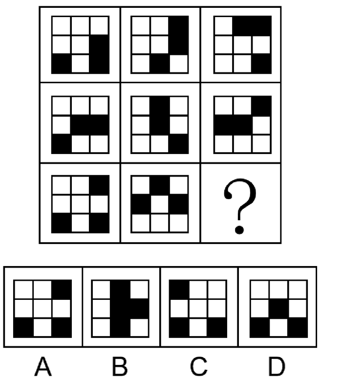

- **A**. A
- **B**. B
- **C**. C　✅
- **D**. D

**答案**：C

**官方解析**

元素组成相同，优先考虑位置规律。观察发现，第一行图形的三个黑色方块沿外圈逆时针平移一格；第二行图形中间的黑色方块不动，另外两个黑色方块沿外圈逆时针平移两格；第三行图形的三个黑色方块沿外圈逆时针平移三格，只有C项符合。
故正确答案为C。

---

## 第 18 题　qid 2730678 · 图形推理

从四个选项中选择一个替代问号，使之呈现一定规律性，最适合的是（    ）。

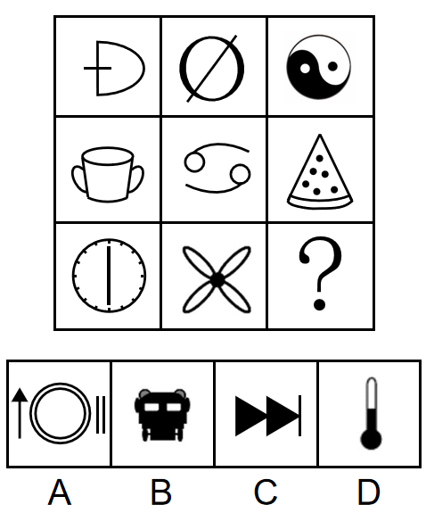

- **A**. A　✅
- **B**. B
- **C**. C
- **D**. D

**答案**：A

**官方解析**

元素组成不同，优先考虑属性规律。观察发现，第一行三个图形分别是：轴对称图形、中心对称图形、不对称图形；第二行验证满足此规律；第三行应用规律，故“？”处应找一个不对称图形，只有A项符合。
注：第三行第一个图形其实既是轴对称也是中心对称，但是我们不能只看单个图，而是整体观察图形的变化规律，本题没有更严谨的规律时，我们可以将每行第一列的共性特征归类为都为轴对称图形。
故正确答案为A。

---

## 第 19 题　qid 2730929 · 图形推理

从四个选项中选择一个替代问号，使之呈现一定规律性，最适合的是（    ）。

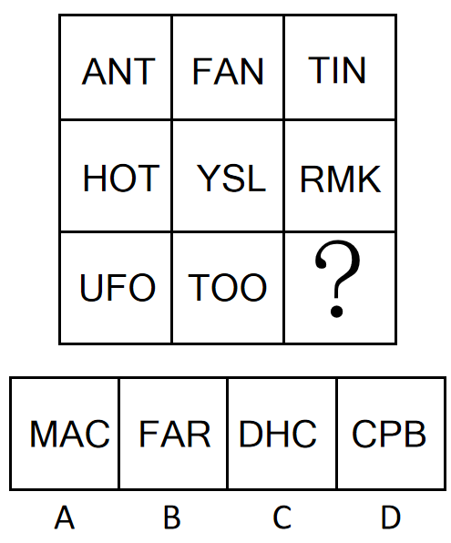

- **A**. A
- **B**. B
- **C**. C　✅
- **D**. D

**答案**：C

**官方解析**

思路一：
元素组成不同，且无明显属性规律，优先考虑数量规律。观察发现，第一行中，三幅图分别有0个由曲线构成的图形；第二行中，三幅图分别有1个由曲线构成的图形；第三行中，前两幅图均有2个由曲线构成的图形，故“？”处要有2个由曲线构成的图形，只有C项符合。
故正确答案为C。
思路二：
元素组成不同，且无明显属性规律，优先考虑数量规律。观察发现，题干存在明显封闭面，考虑数面。观察发现，第一列中，三幅图的面数量相加为3；第二列中，三幅图的面数量相加为3；第三列中，前两幅图的面数量相加为1，故“？”处要找一个面数量为2的图形，使第三列的面数量相加恒等于3，只有B项符合。
故正确答案为B。
本题有两个规律，但九宫格优先看横行，故粉笔倾向于第一种规律。
故正确答案为C。

---

## 第 20 题　qid 2731714 · 图形推理

从四个选项中选择一个替代问号，使之呈现一定规律性，最适合的是（    ）。

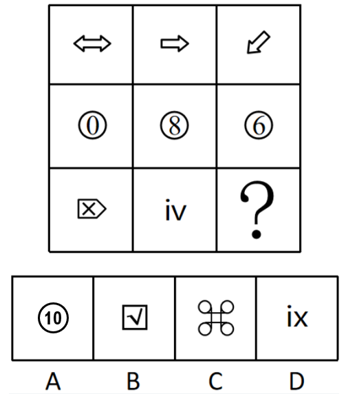

- **A**. A　✅
- **B**. B
- **C**. C
- **D**. D

**答案**：A

**官方解析**

元素组成不同，无明显属性规律，考虑数量规律。观察发现，题干出现字母、数字和多部分图形且部分数无规律，可以考虑笔画数。题干第一行的图形均为一笔画图形，第二行的图形均为两笔画图形，第三行的前两幅图为三笔画图形，因此“？”处也应选择一个三笔画图形，只有A项符合。
故正确答案为A。

---

## 第 21 题　qid 2730674 · 图形推理

把下面的六个图形分为两类，使每一类都有各自的共同特征或规律，分类正确的一项是（    ）。

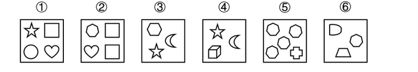

- **A**. ①③④，②⑤⑥　✅
- **B**. ①⑤⑥，②③④
- **C**. ①②④，③⑤⑥
- **D**. ①②⑤，③④⑥

**答案**：A

**官方解析**

本题为分组分类题目。观察发现，每个图形均由多个元素组成，但考虑元素的个数和种类均无规律。再次观察发现，图①③④中均存在相同的元素“小五角星”，图②⑤⑥均存在相同的元素“小七边形”。因此，图①③④为一组、图②⑤⑥为一组。
故正确答案为A。

---

## 第 22 题　qid 2730586 · 图形推理

把下面的六个图形分为两类，使每一类都有各自的共同特征或规律，分类正确的一项是（    ）。

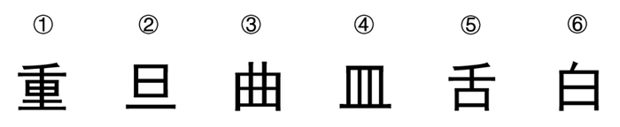

- **A**. ①③④，②⑤⑥
- **B**. ①②⑤，③④⑥
- **C**. ①③⑤，②④⑥
- **D**. ①⑤⑥，②③④　✅

**答案**：D

**官方解析**

本题为分组分类题目。观察题干图形发现，图①⑤⑥第一笔均为“丿”，图②③④第一笔均为“丨”，故图①⑤⑥为一组，图②③④为一组。
故正确答案为D。

---

## 第 23 题　qid 2730603 · 图形推理

把下面的六个图形分为两类，使每一类都有各自的共同特征或规律，分类正确的一项是（    ）。

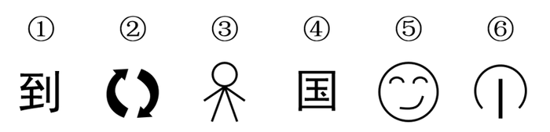

- **A**. ①②⑥，③④⑤　✅
- **B**. ①③④，②⑤⑥
- **C**. ①③⑤，②④⑥
- **D**. ①②④，③⑤⑥

**答案**：A

**官方解析**

本题为分组分类题目。图形元素组成不同，优先考虑属性规律。观察题干图形发现，图①②⑥均为全开放图形，图③④⑤均为带有封闭区域的图形，故图①②⑥为一组，图③④⑤为一组。
故正确答案为A。

---

## 第 24 题　qid 2730609 · 图形推理

把下面的六个图形分为两类，使每一类都有各自的共同特征或规律，分类正确的一项是（    ）。

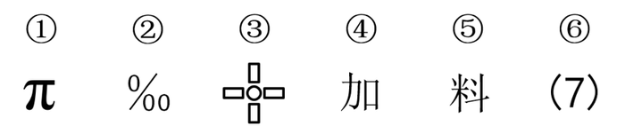

- **A**. ①⑤⑥，②③④　✅
- **B**. ①②③，④⑤⑥
- **C**. ①②⑥，③④⑤
- **D**. ①③⑤，②④⑥

**答案**：A

**官方解析**

本题为分组分类题目。图形元素组成不同，优先考虑属性规律。观察题干图形发现，图①⑤⑥均为全开放图形，图②③④均为带有封闭区域的图形，故图①⑤⑥为一组，图②③④为一组。
故正确答案为A。

---

## 第 25 题　qid 2616490 · 图形推理

把下面的六个图形分为两类，使每一类都有各自的共同特征或规律，分类正确的一项是（    ）。

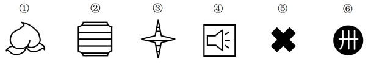

- **A**. ①②④，③⑤⑥
- **B**. ①⑤⑥，②③④　✅
- **C**. ①③⑥，②④⑤
- **D**. ①②⑥，③④⑤

**答案**：B

**官方解析**

本题为分组分类题目。元素组成不同，优先考虑属性规律。题干出现等腰元素，考虑对称性。观察发现，②③④三个图形均有一条对称轴，①⑥两个图形为非轴对称图形，没有对称轴，图⑤有四条对称轴，因此①⑤⑥三个图形都不为一条对称轴图形。即图①⑤⑥一组，图②③④一组。
故正确答案为B。

---

## 第 26 题　qid 2730646 · 类比推理

晨曦：清晨

- **A**. 雾霭：大漠
- **B**. 青春：追忆
- **C**. 皓月：夜晚　✅
- **D**. 蘑菇：下雨

**答案**：C

**官方解析**

第一步：判断题干词语间逻辑关系。
晨曦指的是黎明后的微光，是在清晨的时候出现的，二者是事物与其出现时间的对应关系。
第二步：判断选项词语间逻辑关系。
A项：雾霭指的是是雾气，大漠是地点，二者是事物与其出现地点的对应关系，与题干逻辑关系不一致，排除；
B项：追忆青春，二者是动宾关系，与题干逻辑关系不一致，排除；
C项：皓月指的是明月，是在夜晚的时候出现的，二者是事物与其出现时间的对应关系，与题干逻辑关系一致，当选；
D项：下雨不是一个时间，蘑菇与下雨不是事物与其出现时间的对应关系，与题干逻辑关系不一致，排除。
故正确答案为C。

---

## 第 27 题　qid 2730742 · 类比推理

劲敌：严冬

- **A**. 良师：暴雪　✅
- **B**. 朋友：海洋
- **C**. 阿爸：老虎
- **D**. 知音：飞鸟

**答案**：A

**官方解析**

第一步：判断题干词语间逻辑关系。
劲敌指强劲的敌人，严冬指极冷的冬天，二者之间没有明显的逻辑关系，所以拆开看，劲敌是偏正关系，严冬也是偏正关系。
第二步：判断选项词语间逻辑关系。
A项：良师指好老师，是偏正关系，暴雪指很大的雪，是偏正关系，与题干逻辑关系一致，当选；
B项：朋友和海洋二者之间没有明显的逻辑关系，但二者都不是偏正关系，与题干逻辑关系不一致，排除；
C项：阿爸和老虎二者之间没有明显的逻辑关系，但二者都不是偏正关系，与题干逻辑关系不一致，排除；
D项：知音和飞鸟二者之间没有明显的逻辑关系，知音指通晓音律，不是偏正关系，飞鸟指飞翔的鸟，是偏正关系，与题干逻辑关系不一致，排除。
故正确答案为A。

---

## 第 28 题　qid 2730901 · 类比推理

拨云：见日

- **A**. 彼竭：我盈
- **B**. 触景：生情　✅
- **C**. 翻山：越岭
- **D**. 筋疲：力尽

**答案**：B

**官方解析**

第一步：判断题干词语间逻辑关系。
拨云见日意思是拨开云雾，看见了太阳。因为拨云，所以见日，二者是因果关系。
第二步：判断选项词语间逻辑关系。
A项：彼竭我盈意思是对方士气已丧，我方士气正当旺盛。彼竭和我盈是并列关系，不是因果关系，与题干逻辑关系不一致，排除；
B项：触景生情意思是受到当前情景的触动而产生某种感情。因为触景，所以生情，二者是因果关系，与题干逻辑关系一致，当选；
C项：翻山越岭意思是翻越不少山头。翻山和越岭是并列关系，不是因果关系，与题干逻辑关系不一致，排除；
D项：筋疲力尽意思是精神疲乏，气力用尽。筋疲和力尽是并列关系，不是因果关系，与题干逻辑关系不一致，排除。
故正确答案为B。

---

## 第 29 题　qid 2730724 · 类比推理

闷闷不乐：黯然销魂

- **A**. 悲欢离合：悲喜交集
- **B**. 伤春悲秋：吞声忍泪
- **C**. 安贫乐道：乐不思蜀
- **D**. 低唱浅酌：放歌纵酒　✅

**答案**：D

**官方解析**

第一步：判断题干词语间逻辑关系。
闷闷不乐形容心事放不下，心里不快活；黯然销魂是指心神沮丧得好像丢了魂似的，形容非常悲伤或愁苦，二者为近义词，且后者比前者程度更深。
第二步：判断选项词语间逻辑关系。
A项：悲欢离合是指悲伤、欢乐、离散、聚会，泛指生活中经历的各种境遇和由此产生的各种心情；悲喜交集是指悲伤和喜悦的心情交织在一起，二者不是近义关系，与题干逻辑关系不一致，排除；
B项：伤春悲秋是指因季节、景物的变化而引起悲伤的情绪，多形容多愁善感；吞声忍泪是指不出声，忍住眼泪，不使流出来，形容强忍悲伤，二者不是近义关系，与题干逻辑关系不一致，排除；
C项：安贫乐道是指安于贫穷，以坚持自己的信念为乐，是旧时士大夫所主张的为人处世之道；乐不思蜀是指很快乐，不思念蜀国，比喻在新环境中得到乐趣，不再想回到原来环境中去，二者不是近义关系，与题干逻辑关系不一致，排除；
D项：低唱浅酌是指听人轻柔地歌唱，并自在地慢慢饮酒，形容一种安乐自在的神态；放歌纵酒是指尽情歌唱，放量地饮酒，形容开怀畅饮尽兴欢乐，二者为近义词，且后者比前者程度更深， 与题干逻辑关系一致，当选。
故正确答案为D。

---

## 第 30 题　qid 2730729 · 类比推理

五常大米：泰国香米

- **A**. 华南虎：非洲菊
- **B**. 奇异果：猕猴桃
- **C**. 玉皇大帝：达摩祖师
- **D**. 盐田港：纽约港　✅

**答案**：D

**官方解析**

第一步：判断题干词语间逻辑关系。
五常大米产于黑龙江省哈尔滨市五常市；泰国香米是产于泰国的长粒型大米，二者是并列关系。
第二步：判断选项词语间逻辑关系。
A项：华南虎是中国特有的虎亚种，主要生活在中国南方的森林山地；非洲菊原产于非洲南部的德兰士瓦，二者不是并列关系，与题干逻辑关系不一致，排除；
B项：猕猴桃也称奇异果（奇异果是猕猴桃的一个人工选育品种，因使用广泛而成为了猕猴桃的代称），二者是全同关系，与题干逻辑关系不一致，排除；
C项：玉皇大帝是中国道教神话众神佛的领袖，是一个虚拟人物形象；达摩祖师，原印度人，自称佛传禅宗第二十八祖，为中国禅宗的始祖，二者不是并列关系，与题干逻辑关系不一致，排除；
D项：盐田港位于深圳市南大鹏湾北岸盐田区；纽约港位于美国东北部纽约州，二者为并列关系，与题干逻辑关系一致，当选。
故正确答案为D。

---

## 第 31 题　qid 2730912 · 类比推理

主播：播报：带货

- **A**. 火药：武器：炼丹
- **B**. 手机：通讯：支付　✅
- **C**. 演员：唱歌：演戏
- **D**. 教师：教书：育人

**答案**：B

**官方解析**

第一步：判断题干词语间逻辑关系。
主播早期的功能为播报（通过广播、电视播送报道），而现在主播的功能也包括带货，第一个词和后两个词都是功能的对应关系，并且有时间先后之分。
第二步：判断选项词语间逻辑关系。
A项：火药可以作为有些武器的原材料，火药起源于中国古代的炼丹术，它是中国古代的炼丹家们在炼丹的过程中发明的，火药和后两个词不存在功能的对应关系，与题干逻辑关系不一致，排除；
B项：手机早期的功能为通讯，而现在手机的功能也包括支付，第一个词和后两个词都是功能的对应关系，并且有时间先后之分，与题干逻辑关系一致，当选；
C项：演员可以唱歌和演戏，但演员进行唱歌和演戏不存在时间先后之分，与题干逻辑关系不一致，排除；
D项：教师可以教书和育人，但教书和育人不存在时间先后之分，与题干逻辑关系不一致，排除。
故正确答案为B。

---

## 第 32 题　qid 2730967 · 类比推理

降温：冻结：坚硬

- **A**. 饥荒：打猎：灭绝
- **B**. 切割：金属：成型
- **C**. 接触：感染：咳嗽　✅
- **D**. 计数：运算：建模

**答案**：C

**官方解析**

第一步：判断题干词语间逻辑关系。
降温可能会导致（物体）冻结，冻结后（物体）可能会变得坚硬，二者均属于因果对应关系。
第二步：判断选项词语间逻辑关系。
A项：饥荒可能会迫使（民众）打猎，打猎也可能会导致（物种）灭绝，二者均属于因果对应关系，与题干逻辑关系一致，保留；
B项：切割金属为动宾关系，不是因果对应关系，与题干逻辑关系不一致，排除；
C项：接触可能会导致（人）感染，感染后（人）可能会有咳嗽的症状，二者均属于因果对应关系，与题干逻辑关系一致，保留；
D项：先计数，再运算，最后进行建模，三者存在时间的先后顺序，与题干逻辑关系不一致，排除。
对比A、C两项，A项中饥荒导致民众打猎，民众打猎导致物种灭绝，前后两层因果关系涉及到两个主体；C项中接触导致人感染，感染导致人咳嗽，前后只涉及“人”这一个主体；题干中降温导致物体被冻结，被冻结会导致物体变坚硬，前后两层因果关系只涉及到“物体”这一个主体，因此C项与题干逻辑关系更为接近。
故正确答案为C。

---

## 第 33 题　qid 2730769 · 类比推理

综合医院：牙科诊所：拔牙

- **A**. 珠三角：深圳：创业
- **B**. 美食城：酒楼：宴客　✅
- **C**. 深圳：大梅沙：度假
- **D**. 办事大厅：缴费专窗：受理

**答案**：B

**官方解析**

第一步：判断题干词语间逻辑关系。
综合医院和牙科诊所都为拔牙的地点场所，前两词为并列关系，二者与第三词分别构成地点场所的对应关系。
第二步：判断选项词语间逻辑关系。
A项：深圳是珠三角的组成部分，二者为组成关系，与题干逻辑关系不一致，排除；
B项：美食城和酒楼都为宴客的地点场所，前两词为并列关系，二者与第三词分别构成地点场所的对应关系，与题干逻辑关系一致，当选；
C项：大梅沙位于深圳，二者为组成关系，与题干逻辑关系不一致，排除；
D项：缴费专窗是办事大厅的组成部分，二者为组成关系，与题干逻辑关系不一致，排除。
故正确答案为B。

---

## 第 34 题　qid 2730785 · 类比推理

上肢：上臂肌肉：肱三头肌

- **A**. 电脑：键盘：塑料
- **B**. 图书馆：报纸：纸张
- **C**. 蔷薇科：被子植物：苹果树
- **D**. 汽车：制动系统：刹车盘　✅

**答案**：D

**官方解析**

第一步：判断题干词语间逻辑关系。
上臂肌肉是上肢的组成部分，二者为组成关系，肱三头肌是上臂肌肉的组成部分，二者为组成关系。
第二步：判断选项词语间逻辑关系。
A项：键盘是电脑的组成部分，二者为组成关系，键盘是用塑料制作而成的，二者为原材料的对应关系，与题干逻辑关系不一致，排除；
B项：图书馆里有报纸，二者为场所地点的对应关系，报纸是用纸张制作而成的，二者为原材料的对应关系，与题干逻辑关系不一致，排除；
C项：蔷薇科是被子植物的一种，二者为种属关系，苹果树是被子植物，二者为种属关系，与题干逻辑关系不一致，排除；
D项：制动系统是汽车的组成部分，二者为组成关系，刹车盘是制动系统的组成部分，二者为组成关系，与题干逻辑关系一致，当选。
故正确答案为D。

---

## 第 35 题　qid 2730966 · 类比推理

逗号：停顿：短暂

- **A**. 飞机：运输：快捷　✅
- **B**. 光盘：存储：科技
- **C**. 果汁：营养：甘甜
- **D**. 书籍：阅读：进步

**答案**：A

**官方解析**

第一步：判断题干词语间逻辑关系。
逗号用来停顿，前两词为功能对应关系，短暂地停顿，后两词构成偏正结构。
第二步：判断选项词语间逻辑关系。
A项：飞机用来运输，前两词为功能对应关系，快捷地运输，后两词构成偏正结构，与题干逻辑关系一致，当选；
B项：光盘用来存储，前两词为功能对应关系，科技是科学技术的简称，与存储不构成偏正结构，与题干逻辑关系不一致，排除；
C项：果汁含有营养，二者不是功能对应关系，与题干逻辑关系不一致，排除；
D项：阅读书籍，二者为动宾关系，通过阅读取得进步，后两词为方式目的的对应关系，与题干逻辑关系不一致，排除。
故正确答案为A。

---

## 第 36 题　qid 2730978 · 逻辑判断

小亮只爱吃肉不爱吃菜。妈妈批评他挑食，他却理直气壮地反驳道：“妈妈也不是什么都吃呀，你不吃甜品，你也挑食。”
小亮在反驳中使用的论证策略是：

- **A**. 论证另外一个不相干的问题来转移论证焦点
- **B**. 对概念作出另外一种解释来模糊“是”与“否”的界线
- **C**. 利用对方的言行矛盾做掩饰，以图降低对方观点的可信度　✅
- **D**. 选取一个特例来佐证一个一般性的结论

**答案**：C

**官方解析**

第一步：分析题干逻辑。
妈妈批评小亮挑食，小亮反驳妈妈的理由为妈妈不吃甜食，所以妈妈也挑食。
第二步：分析题干反驳中使用的论证策略。
A项：小亮与妈妈都在讨论挑食的话题，并非论证另外一个不相干的问题来转移论证焦点，与题干论证策略不一致，排除；
B项：妈妈批评小亮挑食的理由为只爱吃肉不爱吃菜，小亮反驳妈妈的理由为不吃甜食，都是以不吃某个东西作为判断是否挑食的界限，并非对概念作出另外一种解释来模糊“是”与“否”的界线，与题干论证策略不一致，排除；
C项：小亮指出妈妈也挑食，但妈妈只批评小亮却没批评自己，说明妈妈存在言行矛盾，据此说明妈妈的批评不具有可信度，属于利用对方的言行矛盾做掩饰，以图降低对方观点的可信度，与题干论证策略一致，当选；
D项：妈妈不吃甜食属于挑食的范畴，并未涉及特例，并非选取一个特例来佐证一个一般性的结论，与题干论证策略不一致，排除。
故正确答案为C。

---

## 第 37 题　qid 2730623 · 类比推理

孙行者为营救被妖怪抓走的师父来到盘丝洞口，只见有3个洞门（1号门，2号门，3号门）。每个洞门前都有一只守门小妖，因只有一个洞门通向师父所在处，孙行者便持棒逼问小妖，获得线索如下：
1号门的小妖：“此门通向你师父所在处。”
2号门的小妖：“此门不通向你师父的所在处。”
3号门的小妖：“他二位所言，只有一个可以取信。”
如果3号门的小妖所说为真，那么通向师父所在处的是：

- **A**. 1号门
- **B**. 2号门
- **C**. 3号门　✅
- **D**. 无法确定

**答案**：C

**官方解析**

第一步：找出题干关系。
①1号门通向师父所在处；
②2号门不通向师父所在处；
③条件①与条件②只有一个为真；
④条件③为真。
通过条件④可知条件③为真，即“1号门小妖和2号门小妖只有一个说真话”，条件①和条件②不存在矛盾关系或反对关系，故考虑假设法。
第二步：看其余。
假设条件①为真，则1号门通向师父所在处，因条件①与条件②只有一个为真，则条件②为假，2号门不通向师父所在处为假，即2号门通向师父所在处，此时1号门与2号门都通向师父的所在处，因题干要求只有一个洞门通向师父所在处，故假设不成立；
根据上述推理可知，条件①为假，则1号门通向师父所在处为假，即1号门不通向师父所在处；条件②为真，即2号门不通向师父所在处，此时1号门与2号门都不通向师父的所在处，所以只有3号门通向师父所在处。
故正确答案为C。

---

## 第 38 题　qid 2730771 · 类比推理

一些环保主义者是热爱旅游的人，所有的环保企业代表都支持减少风景区开发，所有热爱旅游的人都反对减少风景区开发。
由此可知：

- **A**. 所有环保主义者都反对减少风景区开发
- **B**. 所有的环保企业代表都不热爱旅游　✅
- **C**. 一些热爱旅游的人支持加大风景区开发
- **D**. 一些环保主义者支持减少风景区开发

**答案**：B

**官方解析**

第一步：翻译题干。

①有的环保主义者热爱旅游；

②环保企业代表支持减少风景区开发；

③热爱旅游支持减少风景区开发。

①③串联可得：④有的环保主义者热爱旅游支持减少风景区开发。

第二步：逐一分析选项。

A项：翻译为“环保主义者支持减少风景区开发”，根据条件④只能得到“有的环保主义者支持减少风景区开发”，“有的”不能推出“所有”，排除；

B项：翻译为“环保企业代表热爱旅游”，将条件②与条件③的逆否串联可得“环保企业代表支持减少风景区开发热爱旅游”，可以推出，当选；

C项：翻译为“有的热爱旅游支持加大风景区开发”，根据条件④换位只能得到“有的热爱旅游支持减少风景区开发”，不支持减少风景区开发不代表支持加大风景区开发，无法推出，排除；

D项：翻译为“有的环保主义者支持减少风景区开发”，由条件④只能得到“有的环保主义者支持减少风景区开发”，“有的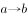”不能推出“有的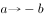”，排除。

故正确答案为B。

---

## 第 39 题　qid 2730644 · 定义判断

有一类问题属于开放式问题，即问题的答案不是固定的，还有一类问题是基于有限的事实而提出的，有且只有一个正确答案。
根据上述定义，以下属于开放式问题的是（    ）。

- **A**. 与现深圳陆地接壤的城市有哪些？
- **B**. 水凝固成冰后，你认为体积和密度哪个会变大？
- **C**. 孔子门下弟子三千，有多少人称得上贤能？　✅
- **D**. 孟子所称“君子三乐”是何三乐？

**答案**：C

**官方解析**

第一步：找出定义关键词。
开放式问题：“问题的答案不是固定的”；
另一类问题：“基于有限的事实而提出的”、“有且只有一个正确答案”。
第二步：逐一分析选项。
A项：与现深圳陆地接壤的城市为东莞和惠州，其答案是固定的，不符合“问题的答案不是固定的”，不符合定义，排除；
B项：水凝固成冰后的体积变大，密度变小，其答案是固定的，不符合“问题的答案不是固定的”，不符合定义，排除；
C项：贤能是主观的，孔子门下弟子有多少人称得上贤能，要取决于对贤能的理解，其答案不是固定的，符合“问题的答案不是固定的”，符合定义，当选；
D项：“君子三乐”中一乐为：父母俱在，兄弟无故；二乐为：仰不愧于天，俯不怍于人；三乐为：得天下英才而教育之。其答案是固定的，不符合“问题的答案不是固定的”，不符合定义，排除。
故正确答案为C。

---

## 第 40 题　qid 2730969 · 逻辑判断

某些错绘国界线的地图是严重违法违规的，这是因为有损我国领土和主权完整的地图是严重违法违规的。
若使上述论证有效，则必须要补充的前提是（    ）。

- **A**. 错绘国界线极有可能导致我国领土和主权完整受损
- **B**. 某些严重违法违规的地图有损我国领土和主权完整
- **C**. 所有错绘国界线的地图都有损我国领土和主权完整
- **D**. 某些错绘国界线的地图有损我国领土和主权完整　✅

**答案**：D

**官方解析**

第一步：找出论点和论据。

论点：某些错绘国界线的地图是严重违法违规的。

论据：有损我国领土和主权完整的地图是严重违法违规的。

本题论据结构为“12”，论点结构为“32” ，提问方式为“必须要补充的前提”，优先考虑搭桥，建立“1”与“3”的关系，需要让“31”，即“某些错绘国界线的地图有损我国领土和主权完整”，这样与原有论据结合，才能得到论点“32”。（注：绝大部分搭桥方向都是从论据搭到论点，此为唯一特例，特殊记忆即可。）

第二步：逐一分析选项。

A项：该项说明错绘国界线“极有可能导致”我国领土和主权完整受损，“极有可能导致”并不能说明一定会导致我国领土和主权完整受损，为不明确选项，排除；

B项：该项说明某些严重违法违规的地图有损我国领土和主权完整，但题干论点讨论的是错绘国界线的地图，不是必须要补充的前提，排除；

C项：该项说明所有错绘国界线的地图都有损我国领土和主权完整，题干论点强调“某些”错绘国界线的地图是严重违法违规的，选项所述“所有”错绘国界线的地图具有加强效果，但不是必须要补充的前提，排除；

D项：该项即某些错绘国界线的地图有损我国领土和主权完整，建立了“某些错绘国界线的地图”和“有损我国领土和主权完整”之间的联系，为搭桥项，可以加强，当选。

故正确答案为D。

---

## 第 41 题　qid 2730795 · 类比推理

某公司财务小组要求组员每年自学完成20讲的“财务会计人员能力提升”系列网课，年底前，组长向组员询问自学进度，组员的回答如下：
甲：“我没完成。”
乙：“丙完成了。”
丙：“大家都没完成。”
丁：“乙说的是谎话。”
戊：“乙完成了。”
己：“甲和丙中只有一个完成。”
组长通过查看后台数据，发现以上组员中有两人说谎。
由此可知，甲、乙、丙中完成自学的有（    ）人。

- **A**. 0
- **B**. 1
- **C**. 2　✅
- **D**. 3

**答案**：C

**官方解析**

本题为真假推理题。

第一步：找出题干矛盾命题。

（1）甲：甲完成；

（2）乙：丙完成；

（3）丙：所有人都没完成；

（4）丁：丙完成；

（5）戊：乙完成；

（6）己：甲和丙只有一人完成。

分析题干关系，乙和丁说的话是矛盾关系，必然满足一真一假。

第二步：看其余。

结合题干可知6句话里面有2假，本题除了乙和丁的矛盾命题（已包含一假）之外，剩下4句话里面只有1假。假设丙说真话，即所有人都没完成，此时，戊、己说的都是假话，那么剩下4句话里假话不止一个，与题干要求矛盾。故丙说的只能是假话，此时甲、戊、己说的都是真话。所以，乙、丙完成，但甲未完成。

故正确答案为C。

---

## 第 42 题　qid 2730826 · 类比推理

游戏“抢占阵地”的规则如下：有黑、白、蓝、粉、黄五个阵地，玩家抢占阵地后可以获得相应分数，分别为黑阵地1分、白阵地3分、蓝阵地5分、粉阵地7分、黄阵地9分。小张、小王、小李、小赵各自挑战了6次，每人在每次挑战中都成功占领了一个阵地。游戏结束交流成绩时，小张说：“我得了10分。”小王说：“我得了30分。”小李说：“我得了33分。”小赵说：“我得了58分。”
由此可知，（    ）说了假话。

- **A**. 至多三人
- **B**. 至多两人
- **C**. 至少一人
- **D**. 至少两人　✅

**答案**：D

**官方解析**

题干给出的是确定信息，从题干入手进行推理。通过分析发现，从最高分入手能更快确定谁说了假话。先验证小赵：已知黄阵地单次得分为9分，假设小赵6次均占领黄阵地，那么小赵最高得分只有54分，达不到58分，则小赵一定说了假话；再验证小李：每次得分均为奇数，而一共6次，6个奇数和一定是偶数，故无论怎么分配占领阵地的方式，都得不到33分，那么小李也一定说了假话；再验证小王：假设小王占领了6次蓝阵地，就可以满足得分30分，那么小王可能说真话；最后验证小张：假设小张占领了5次黑阵地和1次蓝阵地，就可以满足得分10分，那么小张也可能说真话。综上，小张、小王、小李、小赵四人至少两人说了假话。

故正确答案为D。

---

## 第 43 题　qid 2730918 · 定义判断

如果把一个造型精致的鸟笼挂在房间最显眼的地方，过不了几天主人就会做出下面两个选择之一：或者把鸟笼扔掉，或者买只鸟放在鸟笼里，因为这比无休止地向别人解释“空鸟笼”要轻松得多，这就是鸟笼逻辑。原因很简单，人们大多受制于惯性思维，认为鸟笼必定用于养鸟。
根据上述定义，下列情形体现了鸟笼逻辑的是：

- **A**. 沿海地区的许多车主都买了涉水险，大刘认为这是明智之举，于是也给自家的车买了涉水险
- **B**. 莉莉过生日时收到了朋友赠送的华贵礼服一件，为了搭配整体风格，她又买了价格不菲的高跟鞋和手拿包　✅
- **C**. 小明原本总是成绩排名靠后，新来的老师常夸他勤奋好学，不久后小明的成绩大幅提升
- **D**. 某人去异国旅游，所见到的都是女人，于是得出该国是女儿国的结论

**答案**：B

**官方解析**

第一步：找出定义关键词。
“人们大多受制于惯性思维，认为鸟笼必定用于养鸟”。
第二步：逐一分析选项。
A项：大刘并没有受制于某种惯性思维，而是自己根据大家的选择，主观判断买涉水险是否明智，不符合“人们大多受制于惯性思维，认为鸟笼必定用于养鸟”，不符合定义，排除； 
B项：莉莉收到了朋友赠送的华贵礼服，受制于惯性思维，为了搭配整体风格，她就去购买了昂贵的高跟鞋和手拿包，符合“人们大多受制于惯性思维，认为鸟笼必定用于养鸟”，符合定义，当选；
C项：小明是因为受到新老师的夸奖后受到鼓舞而提高了成绩，并未涉及到惯性思维，不符合“人们大多受制于惯性思维，认为鸟笼必定用于养鸟”，不符合定义，排除；
D项：某人通过所见到的都是女人而得出该国是女儿国的结论，是在利用不完全归纳的方式得出的一个结论，并未涉及惯性思维，不符合“人们大多受制于惯性思维，认为鸟笼必定用于养鸟”，不符合定义，排除。
故正确答案为B。

---

## 第 44 题　qid 2730798 · 逻辑判断

全球气候变暖使自燃野火的风险增加，但研究人员发现，全球经历火烧的土地面积正在减少，他们以卫星数据为基础计算出，从1988年到2015年，全球每年火烧土地面积缩小，其中包括热浪、雷电等导致的自燃野火，也包括烧荒等人类行为的影响。最明显的是草原地区，原本习惯防火烧荒的游牧居民的定居化，使非洲的热带稀树草原每年火烧土地面积缩小了约79万平方公里。

上述发现最能支持的论断是（    ）。

- **A**. 全球气候变化与全球火烧土地面积没有关联
- **B**. 全球火烧土地面积的减少有助于缓解气候变暖
- **C**. 随着草原地区人类生活方式的改变，全球火烧土地面积会继续减少　✅
- **D**. 防火烧荒等人类行为比自燃野火导致的火烧土地面积大得多

**答案**：C

**官方解析**

第一步：找出论点和论据。

这是一道论证考点下的特殊题型，由于本题问的是上述发现最能支持的论断是哪项，所以应该把整个题干当成是一个论据，需要根据题干找出能够成为论点的选项。

论据：全球经历火烧的土地面积正在减少，他们以卫星数据为基础计算出，从1988年到2015年，全球每年火烧土地面积缩小，其中包括热浪、雷电等导致的自燃野火，也包括烧荒等人类行为的影响。最明显的是草原地区，原本习惯防火烧荒的游牧居民的定居化，使非洲的热带稀树草原每年火烧土地面积缩小了约79万平方公里。

第二步：逐一分析选项。

A项：题干讨论的是全球经历火烧的土地面积正在减少，并且举出热浪、雷电、人类行为、游牧居民的定居化等原因。但没有提及全球气候变化和全球火烧土地面积之间的关系，不能成为题干的论点，排除；

B项：题干讨论的是全球经历火烧的土地面积正在减少，并且举出热浪、雷电、人类行为、游牧居民的定居化等原因。但没有提及全球火烧土地面积减少对气候变暖的意义，不能成为题干的论点，排除；

C项：题干讨论的是因为一系列的原因导致全球正在经历火烧的土地面积减少，选项说的是草原地区人类生活方式的改变使全球火烧土地面积继续减少，是对题干论据的推论，当选；

D项：题干讨论的是全球经历火烧的土地面积正在减少，并且举出热浪、雷电、人类行为、游牧居民的定居化等原因。但没有提及防火烧荒等人类行为和自燃野火哪一个原因导致火烧土地面积更大，不能成为题干的论点，排除。

故正确答案为C。

---

## 第 45 题　qid 2730905 · 逻辑判断

某CPU厂商称，搭载新型号CPU的2020款笔记本，其运行速度是搭载旧型号CPU的2019款笔记本的2倍。由此可见，新型号CPU可以显著提升笔记本性能。
下列说法如果为真，最能支持上述结论的是（    ）。

- **A**. 新款笔记本业内测评优秀，用户体验极佳
- **B**. 为迎合市场需求，新款笔记本的其他硬件（如主板、内存、硬盘等）均同步更新迭代
- **C**. 新旧两款笔记本除CPU和外观设计之外，尚无其他明显区别　✅
- **D**. 新型号CPU融合了前沿尖端技术，市场份额占据显著优势

**答案**：C

**官方解析**

第一步：找出论点和论据。
论点：新型号CPU可以显著提升笔记本性能。
论据：搭载新型号CPU的2020款笔记本，其运行速度是搭载旧型号CPU的2019款笔记本的2倍。
论点论据话题一致，可以通过补充论据等方式进行加强。
第二步：逐一分析选项。
A项：该项说的是新款笔记本用户体验好，论点所说的是新型号CPU对笔记本性能的影响，话题不一致，无法加强，排除；
B项：该项说的是新款笔记本的其他硬件同步更新了，与论点讨论的新型号CPU对笔记本性能的影响无关，无法加强，排除；
C项：该项说明新旧两款笔记本除了外观设计和CPU之外没有其他明显区别，不会是因为外观设计和别的区别影响了运行速度和性能，补充论据说明CPU能够影响笔记本的性能，可以加强，当选；
D项：该项说明CPU的特点及在当前市场上的优势，与论点讨论的新型号CPU对笔记本性能的影响无关，无法加强，排除。
故正确答案为C。

---

## 第 46 题　qid 2730980 · 逻辑判断

据媒体报道，近日，某学者完成了一项人类基因编辑实验。基因编辑婴儿已健康出生。该项实验的理论依据是，人类基因中的某个片段会在细胞表面产生一种特殊的受体蛋白，因为它的存在，使得流感病毒得以侵袭细胞；通过对这段基因进行编辑，使得人体不再生成这种受体蛋白，从而可以免疫流感。
下列说法如果为真，最能削弱实验预期效果的是（    ）。

- **A**. 基因编辑婴儿的存活率极低，理论上平均三百个婴儿中只有一个存活
- **B**. 实践证明，及时接种流感疫苗并加强体育锻炼，可有效预防流感
- **C**. 流感病毒变异极快，新的病毒亚型可侵袭其他受体蛋白　✅
- **D**. 编辑人类基因不仅有违医学伦理，还会污染人类基因库，引发其他不可预料的病症

**答案**：C

**官方解析**

第一步：找出论点和论据。
论点：人类基因中的某个片段会在细胞表面产生一种特殊的受体蛋白，使得流感病毒得以侵袭细胞；通过对这段基因进行编辑，使得人体不再生成这种受体蛋白，从而可以免疫流感。
论据：无。
本题没有论据，考虑否定论点进行削弱。
第二步：逐一分析选项。
A项：题干论述基因编辑是否能预防流感，而该项是在论述基因编辑婴儿的存活率问题，话题不一致，无法削弱，排除；
B项：题干论述基因编辑是否能预防流感，而该项是在说预防流感的其他方法，话题不一致，无法削弱，排除；
C项：该项说明流感病毒变异快，新的病毒亚型会侵袭其他受体蛋白，通过基因编辑方式仅仅是一种特殊的受体蛋白不再生成，但还是存在其他受体蛋白，因此无法做到免疫流感，直接否定了论点，可以削弱，当选；
D项：该项说明编辑人类基因的一些弊端，并未提到是否能预防流感，与题干讨论话题无关，无法削弱，排除。
故正确答案为C。

---

## 第 47 题　qid 2730659 · 逻辑判断

甲、乙、丙、丁、戊参加海岛图片识记比赛，在答题环节，五人的答案如下：
甲：“4号图是巴厘岛，5号图是塞舌尔。”
乙：“2号图是塞班岛，5号图是塔希提岛。”
丙：“4号图是帕劳，2号图是塞舌尔。”
丁：“3号图是巴厘岛，4号图是塞班岛。”
戊：“5号图是塞舌尔，1号图是巴厘岛。”
已知每人只答对一半，则巴厘岛、塞舌尔、塔希提岛、塞班岛、帕劳对应的图片序号依次是（    ）。

- **A**. 2，5，1，3，4
- **B**. 4，1，3，5，2
- **C**. 4，2，3，5，1
- **D**. 3，5，1，2，4　✅

**答案**：D

**官方解析**

第一步：观察题干。
由题干可知每人只答对了一半，考虑代入法，代入选项后符合每人只答对了一半的即为正确答案。
第二步：逐一代入选项。
A项代入，此时2号图为巴厘岛，5号图为塞舌尔，而乙说2号图是塞班岛，5号图是塔希提岛，乙的两个半句全错，与题干条件每人只答对了一半不符，排除；
B项代入，此时2号图为帕劳，5号图为塞班岛，而乙说2号图是塞班岛，5号图是塔希提岛，乙的两个半句全错，与题干条件每人只答对了一半不符，排除；
C项代入，此时2号图为塞舌尔，5号图为塞班岛，而乙说2号图是塞班岛，5号图是塔希提岛，乙的两个半句全错，与题干条件每人只答对了一半不符，排除；
D项代入，此时3号图为巴厘岛，5号图为塞舌尔、1号图为塔希提岛、2号图为塞班岛、4号图为帕劳，甲说4号图是巴厘岛错误，5号图是塞舌尔正确；乙说2号图是塞班岛正确，5号图是塔希提岛错误；丙说4号图是帕劳正确，2号图是塞舌尔错误；丁说3号图是巴厘岛正确，4号图是塞班岛错误；戊说5号图是塞舌尔正确，1号图是巴厘岛错误；5人答案都只对了一半，满足题干条件，当选。
故正确答案为D。

---

## 第 48 题　qid 2730661 · 逻辑判断

近年来，化妆品消费市场上，国产化妆品的市场占有率显著提升，品牌效应日益凸显。一项关于国产化妆品购买意愿的调查显示，的被调查者表示赞成购买国产化妆品。但是当问及这些被调查者是否曾购买国产化妆品自用，却有的人表示“没有”。

如果以下各项为真，最能够解释上述看似矛盾的现象的是（    ）。

- **A**. 
的被调查者表示，欧美化妆品的历史更久，品牌更大，更能够引领时尚

- **B**. 
大部分被调查者在购买自用化妆品时，主要考虑其功效及自身肤况，不太考虑产地

- **C**. 
购买国产化妆品的消费者中，的人将其作为礼物送人，只有的人选择自用
　✅
- **D**. 
大部分被调查者表示，会将每年的化妆品消费支出控制在1000元以内

**答案**：C

**官方解析**

第一步：找出题干矛盾。

的被调查者表示赞成购买国产化妆品，但是当问及这些被调查者是否曾购买国产化妆品自用，却有的人表示“没有”。

第二步：逐一分析选项。

A项：该项强调的是欧美化妆品多方面的优势，解释了消费者没有购买并自用国产化妆品的原因，但是不能解释题干中调查者赞同购买国产化妆品这一现象，无法解释题干矛盾，排除；

B项：该项强调了消费者在购买化妆品时着重考虑功效及自身肤况，不太考虑产地，国产化妆品的功效以及消费者自身肤况对消费者的赞成以及最终的购买情况有什么样的影响不明确，无法解释题干矛盾，排除；

C项：该项强调了购买国产化妆品的消费者中，的人将其作为礼物送人，只有的人选择自用，既解释了为什么赞成购买国产化妆品，又解释了购买后不自用的原因，可以解释题干矛盾，当选；

D项：该项强调了大部分被调查者会将每年的化妆品消费支出控制在1000元以内，不能解释大部分被调查者赞成购买国产化妆品，但是没有购买并自用国产化妆品，无法解释题干矛盾，排除。

故正确答案为C。

---

## 第 49 题　qid 2730663 · 类比推理

老赵前几天从张警官那儿听说了一场审讯，嫌疑人甲、乙、丙中有一人是真凶，关于审讯结案，张警官没有透露，但老赵当时根据获得的以下信息推测出了真凶：
（1）张警官说每个嫌疑人都指控另外两人中的一人为真凶，但是没说谁指控他；
（2）张警官说甲说了真话；
（3）张警官没说乙说的是真话还是假话；
（4）张警官说了丙说的是真话还是假话。
关于丙说话的真假，老赵现在已经忘了，但他稍作思考，还是再次推测出了真凶。
由此可知（    ）。

- **A**. 乙是真凶　✅
- **B**. 乙说真话
- **C**. 丙说假话
- **D**. 丙是真凶

**答案**：A

**官方解析**

第一步：分析题干条件。
（1）张警官说每个嫌疑人都指控另外两人中的一人为真凶，但是没说谁指控他；
（2）张警官说甲说了真话；
（3）张警官没说乙说的是真话还是假话；
（4）张警官说了丙说的是真话还是假话。
根据条件（1）、（2）可知，甲说真话，说明甲指控乙和丙其中一人为真凶；
根据条件（3）可知，张警官没说乙说的是真话还是假话，所以乙可能说真话，也可能说假话，题干信息存在多种不确定情况，考虑用假设法：
假设乙说的是真话：结合条件（2）可知，甲乙均说真话，说明甲乙均指控另外两人，说明甲乙均不是真凶，说明丙是真凶，此时B、D两项均成立，所以假设不成立，说明乙说的是假话，乙说假话，因此乙无论指控的是谁，被指控人都不是真凶，因此甲和丙都不是真凶，所以真凶是乙。
故正确答案为A。

---
