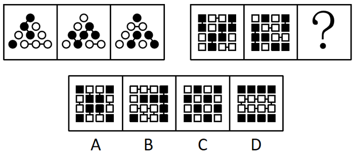
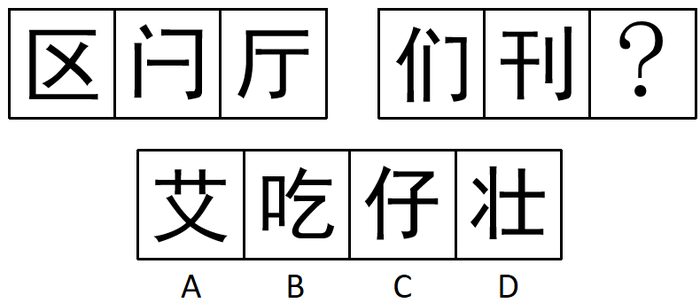
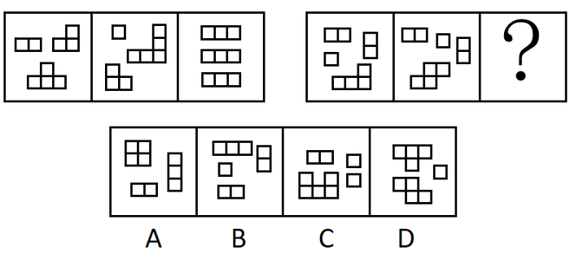
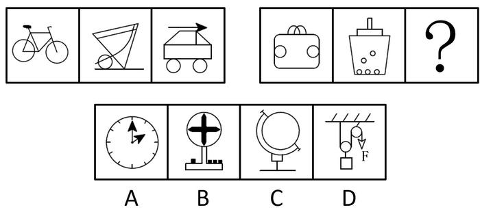
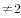
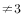
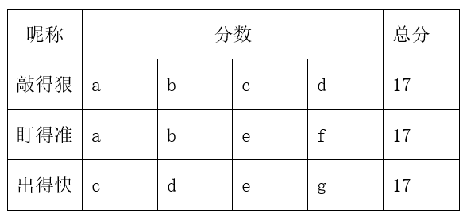
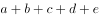
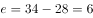

# 2020年深圳市考公务员录用考试《行测1》试题（网友回忆版）

> 判断推理 · 20 题 · 深圳市考 2020

## 第 1 题　qid 2730660 · 图形推理

从四个选项中选择一个替代问号，使两套图形的规律表现出最大的相似性，最适合的是（    ）。

- **A**. A
- **B**. B　✅
- **C**. C
- **D**. D

**答案**：B

**官方解析**

解析一：观察第一组图形，发现图形均由黑球、白球、短线组成，但数量不同且无规律，再观察发现每条短线均连接两个图形，且两个图形的颜色相同，第二组图形应用此规律，排除A、C两项；比较B、D两项发现，D项短线连接的只有白色图形，题干图形中短线连接的既有黑色图形也有白色图形，排除D项。
故正确答案为B。
解析二：观察第一组图形，发现斜向相邻的黑球以短线相连，横向相邻的白球以短线相连；第二组前两个图形中竖向相邻的黑块以短线相连，横向相邻的白块以短线相连，故？处图形应与其规律保持一致，排除A、B、D三项。
故正确答案为C。

---

## 第 2 题　qid 2731137 · 图形推理

从四个选项中选择一个替代问号，使两套图形的规律表现出最大的相似性，最适合的是（    ）。

- **A**. A
- **B**. B
- **C**. C　✅
- **D**. D

**答案**：C

**官方解析**

元素组成不同，且无明显属性规律，考虑数量规律。题干图形均为汉字，考虑汉字笔画数。第一组汉字的笔画数均为4，第二组前两个汉字的笔画数均为5，故问号处汉字笔画数应为5，排除B、D两项；比较A、C两项发现，A项为上下结构，C项为左右结构，题干第一组汉字均为半包围结构，第二组前两个汉字均为左右结构，故问号处汉字也应为左右结构，排除A项。
故正确答案为C。

---

## 第 3 题　qid 2730675 · 图形推理

从四个选项中选择一个替代问号，使之呈现一定规律性，最适合的是（    ）。

- **A**. A
- **B**. B
- **C**. C　✅
- **D**. D

**答案**：C

**官方解析**

观察发现题干图形均由小方块拼接而成的几部分构成，优先考虑部分数。第一组图形均由3部分构成，第二组前两个图形均由4部分组成，故问号处图形应为4部分，排除A、D两项。比较B、C两项，发现小方块数量不同，题干图形的小方块数均为9，排除B项，只有C项满足所有规律，当选。
故正确答案为C。

---

## 第 4 题　qid 2730558 · 图形推理

从四个选项中选择一个替代问号，使之呈现一定规律性，最适合的是（    ）。

- **A**. A
- **B**. B
- **C**. C
- **D**. D　✅

**答案**：D

**官方解析**

元素组成不同，且无明显属性规律，考虑数量规律。观察发现，题干每幅图形均存在明显的圆和直线，且圆与直线多存在相切，优先考虑切点数。第一组图切点数分别为0、1、2，数量递增；第二组图切点数分别为2、3、？，故问号处图形的切点数应为4，只有D项满足规律。
故正确答案为D。

---

## 第 5 题　qid 2730814 · 图形推理

从四个选项中选择一个替代问号，使之呈现一定规律性，最适合的是（    ）。

- **A**. A　✅
- **B**. B
- **C**. C
- **D**. D

**答案**：A

**官方解析**

解法一：元素组成不同，优先考虑属性规律。题干图形均为轴对称图形，排除B、C两项。观察发现，题干图形封闭区域明显，考虑面数量。第一组图形的面数量分别为3、4、5；第二组前两幅图的面数量分别为2、3，故问号处图形的面数量应为4，只有A项符合。
解法二：元素组成不同，优先考虑属性规律，但对称性无法得出唯一答案，考虑数量规律。观察发现第一组图中矩形的数量分别为3、4、5，数量递增；第二组图中三角形的数量为1、2（需重复数）、？，故问号处图形中三角形的数量应为3，只有A项满足规律。
注：一般三角形优先不重复数，但是如本题所示，矩形和三角形的特征明显，当数第二组图的图2时，想延续前面数量的等差规律，自然会重复数了，刚好也有唯一答案，这种思路也是没有问题的。即没思路时优先不重复数，有思路时可结合本题情况灵活判断。
故正确答案为A。

---

## 第 6 题　qid 2730904 · 类比推理

①《松花江上》
②《北京欢迎你》
③《走进新时代》
④《春天的故事》
⑤《中国人民志愿军战歌》

- **A**. ⑤④①②③
- **B**. ⑤①④③②
- **C**. ①⑤④③②　✅
- **D**. ①④⑤②③

**答案**：C

**官方解析**

第一步：先确定逻辑关系最为明显的逻辑顺序。
观察题干，五个事件均为歌曲，可根据歌曲的发行时间进行排序。顺序比较明显的是事件②《北京欢迎你》发行于2008年，事件③《走进新时代》发行于1997年和事件④《春天的故事》发行于1994年，顺序应为④③②，且发生在事件①和⑤之后，排除A、D两项。
第二步：逐一对照选项并判断正确答案。
根据第一步的结果可以判断只有B、C两项符合，再根据事件①《松花江上》发行于1936年，事件⑤《中国人民志愿军战歌》发行于1950年，可以判断事件①应在事件⑤之前，排除B项。
故正确答案为C。

---

## 第 7 题　qid 2730664 · 类比推理

①用绳捆绑，加以检木
②封泥盖章，作为信验
③火上炙干，刮去青皮
④联编成册，笔书文字
⑤截竹为筒，破箕成牒

- **A**. ⑤③④②①
- **B**. ①③⑤④②
- **C**. ⑤③④①②　✅
- **D**. ⑤①④③②

**答案**：C

**官方解析**

第一步：先确定逻辑关系最为明显的逻辑顺序。
观察题干，五个事件主要围绕“截竹制书”的过程。逻辑关系的先后比较明显的是事件⑤和事件③，先截竹，再炙干刮青皮，即⑤应紧邻着③排在前面，排除B、D两项。
第二步：逐一对照选项并判断正确答案。
根据第一步的结果可以判断只有A、C两项符合，先把简牍文书或物品以绳捆扎，再用泥团封信盖章，因此①在②前面，排除A项。
故正确答案为C。

---

## 第 8 题　qid 2730666 · 类比推理

①动物实验，结果积极
②志愿接种，临床研究
③获准上市，批量生产
④获取样本，分离毒株
⑤灭活减毒，制备疫苗

- **A**. ⑤-④-②-③-①
- **B**. ④-⑤-①-②-③　✅
- **C**. ②-④-①-③-⑤
- **D**. ③-④-①-⑤-②

**答案**：B

**官方解析**

观察题干，五个事件主要围绕“研制疫苗”的过程。逻辑关系的先后比较明显的是事件④和事件⑤，先获得样本分离毒株，再对病毒进行灭活，去除致病力，保留免疫原性，制备疫苗，即④紧邻着⑤，在⑤的前面，排除A、C、D三项。
故正确答案为B。

---

## 第 9 题　qid 2730672 · 类比推理

①惊涛骇浪
②离家远航
③抓挠负伤
④群猴哄抢
⑤流落荒野

- **A**. ②⑤④①③
- **B**. ②①⑤④③　✅
- **C**. ⑤④③②①
- **D**. ①⑤④③②

**答案**：B

**官方解析**

第一步：先确定逻辑关系最为明显的逻辑顺序。
观察题干，五个事件主要围绕“离家航海”的过程展开。逻辑关系的先后顺序比较明显的是事件①和事件②，先离家远航，再惊涛骇浪，即事件②应紧挨着事件①，在事件①的前面，且事件②是所有事情的开端，应在首句位置，排除A、C、D三项。
第二步：逐一对照选项并判断正确答案。
根据第一步的结果可以判断B项符合，先流落荒野，再遇到猴群哄抢，最后被抓挠并受伤，因此事件的顺序为⑤、④、③。
故正确答案为B。

---

## 第 10 题　qid 2730703 · 类比推理

①建立伏安特性曲线
②计算斜率，求解电阻值
③连接电路，闭合电键
④读取电流表与电压表示数
⑤调节滑动电阻器

- **A**. ⑤④①②③
- **B**. ③④①②⑤
- **C**. ③⑤④①②　✅
- **D**. ④①②③⑤

**答案**：C

**官方解析**

第一步：先确定逻辑关系最为明显的逻辑顺序。
观察题干，五个事件主要是围绕着“如何求出电阻值”开展的。逻辑关系的先后顺序比较明显的事件是事件③和事件④，要先连接电路，使电路通电后才可以读取电流表和电压表示数，事件③应该在事件④前面，排除A、D两项。
第二步：逐一对照选项并判断正确答案。
根据第一步的结果可以判断只有B、C两项符合，建立伏安特性曲线后才能计算斜率，进而求出电阻值，这里求出电阻值应为事件的结果，而不是⑤，因此事件②应是尾句，故排除B项。
故正确答案为C。

---

## 第 11 题　qid 2730792 · 逻辑判断

有的上位者缺乏主动性、创造性，因为他们不愿真正动脑筋想问题。
要使以上论证有效，必要的前提是（    ）。

- **A**. 缺乏主动性、创造性的人很难上位
- **B**. 某些不愿真正动脑筋想问题的人具有主动性、创造性
- **C**. 某些缺乏主动性、创造性的人不愿真正动脑筋想问题
- **D**. 不愿真正动脑筋想问题的人都缺乏主动性、创造性　✅

**答案**：D

**官方解析**

第一步：找出论点和论据。
论点：有的上位者缺乏主动性、创造性。
论据：他们不愿真正动脑筋想问题。
论据和论点话题不一致，并且问题是要求补充必要前提，所以优先考虑搭桥，补充说明缺乏主动性、创造性与不愿真正动脑筋之间的关系。
第二步：逐一分析选项。
A项：该项涉及的是缺乏主动性、创造性与很难上位之间的关系，很难上位与题干无关，不是需要补充的前提，排除；
B项：该项涉及的是具有主动性、创造性与不愿真正动脑筋想问题之间的关系，不是需要补充的前提，排除；
C项：该项相当于某些不愿真正动脑筋想问题的人是缺乏主动性、创造性的，无法使不愿真正动脑筋推出缺乏主动性、创造性，所以不是使论证有效的必要前提，排除；
D项：该项可以使不愿真正动脑筋推出缺乏主动性、创造性，建立论点和论据的联系，是题干论证有效的必要前提，当选。
故正确答案为D。

---

## 第 12 题　qid 2730656 · 逻辑判断

某国际连锁超市的中国大陆首店开业第一天，生意火爆程度令人瞠目结舌。当天新售会员卡即超16万张，因进店购物人数太多，超市入口处排起了长队，停车位至少要等3个小时。开业不到1小时，部分货架已挂上了商品售罄的牌子，分析人士认为，超市商品的低廉价格是引发抢购热潮的原因。
若以下各项为真，则最能削弱上述结论的是（    ）。

- **A**. 该超市实行会员制，必须购买会员卡才能购物
- **B**. 开业首日所售会员卡中，有相当部分是由超市管理层及其员工购入
- **C**. 低成本策略几乎是所有商家都会选择的经营策略，力求在价格上吸引消费者　✅
- **D**. 大多数客人都是被超市开业首日的巨大优惠广告吸引而来

**答案**：C

**官方解析**

第一步：找出论点和论据。
论点：超市商品的低廉价格是引发抢购热潮的原因。
论据：无。
本题只有论点，没有论据，优先考虑否定论点的削弱方式。
第二步：逐一分析选项。
A项：该项说明购物的前提是要购买会员卡，与引发抢购热潮的原因是否是商品价格低廉无关，与论点话题不一致，无法削弱，排除；
B项：该项说明超市会员卡的购买者都是哪些人，与引发抢购热潮的原因是否是商品价格低廉无关，与论点话题不一致，无法削弱，排除；
C项：该项表明几乎所有商家都会选择低成本策略，所以题干中的国际连锁超市引发抢购热潮的原因就不是商品的低廉价格，直接否定了论点，可以削弱，当选；
D项：该项说明超市商品的低廉价格确实是引发抢购热潮的原因，可以加强论点，排除。
故正确答案为C。

---

## 第 13 题　qid 2731069 · 类比推理

有黑、白、蓝、红、黄5个小球。甲、乙、丙、丁、戊每轮从中各拿1个，同时确认颜色后放回，经过5轮，正好每个人都拿到过5个颜色的小球。已知：
（1）甲最后拿的小球与乙第二轮拿的相同；
（2）乙第四轮拿的小球与戊第三轮拿的相同；
（3）丙第二轮拿的小球与甲第一轮拿的相同；
（4）丙最后拿的小球与乙第四轮拿的相同；
（5）丁第三轮拿的小球与丙第一轮拿的相同；
（6）丁最后拿的小球与丙第三轮拿的相同。
如果甲拿到的小球颜色依次是黑、白、蓝、红、黄，那么（    ）。

- **A**. 乙拿到的小球白、黄、红、黑、蓝
- **B**. 丙拿到的小球红、黑、黄、白、蓝
- **C**. 丁拿到的小球白、蓝、黄、黑、红　✅
- **D**. 戊拿到的小球蓝、黑、白、黄、红

**答案**：C

**官方解析**

第一步：分析题干条件。

关于小球颜色：

（1）甲5乙2；

（2）乙4戊3；

（3）丙2甲1；

（4）丙5乙4；

（5）丁3丙1；

（6）丁5丙3；

（7）甲1黑、甲2白、甲3蓝、甲4红、甲5黄。

第二步：根据题干条件进行推理。

条件（7）较为确定，可以从条件（7）入手解题；结合条件（1）（7）可知，乙2黄；结合条件（3）（7）可知，丙2黑，可列表如下：

在每一轮5个人小球的颜色不同情况下，根据丙2黑可以得到戊2黑，排除D项；

根据条件（2）（4）可知，乙4戊3丙5；根据每一轮中5人的颜色不相同可知，戊3甲3（蓝）、乙4甲4（红）、丙5甲5（黄），则乙4蓝、红、黄；根据每个人都拿到过5个颜色的小球以及前面推出的丙2黑，则丙5黑，可得乙4蓝、红、黄、黑。因此乙4戊3丙5白，排除A项和B项；

故正确答案为C。

---

## 第 14 题　qid 2730961 · 类比推理

某公司总经理郑某在家中被杀，警方确切掌握的是，案发当天，其下属赵一、王二、张三、李四都进出过一次郑某家中，且排除同时出现的可能性，被警方传讯前，四人秘密约定，向警方所作的每句供词都是虚假供述，供词如下：
赵一：“我们四人都没杀害他，我离开他家时，他还活着。”
王二：“我是第二个进他家的，我到他家时，他已经死了。”
张三：“我是第三个进他家的，我离开他家时，他还活着。”
李四：“凶手进他家不比我晚，我到他家时，他已经死了。”
由此可知推知，凶手是：

- **A**. 赵一　✅
- **B**. 王二
- **C**. 张三
- **D**. 李四

**答案**：A

**官方解析**

第一步：分析题干。

根据四人向警方所作的每句供词都是虚假供述，得知每人每句话的矛盾为真，即：

（1）赵一的矛盾：四人中有人杀害他，赵一离开他家时，他已经死了；

（2）王二的矛盾：王二不是第二个进他家的，王二到他家时，他还活着；

（3）张三的矛盾：张三不是第三个进他家的，张三离开他家时，他已经死了；

（4）李四的矛盾：凶手比我晚进他家，我到他家时，他还活着；

第二步：逐一分析选项。

根据条件（1）可知，赵一可能是凶手或在凶手之后进入郑某家中，即到来顺序：赵一凶手；根据条件（2）可知，王二可能是凶手或在凶手之前进入郑某家中，即到来顺序：凶手王二，且王二；根据条件（3）可知，张三可能是凶手或在凶手之后进入郑某家中，即到来顺序：张三凶手，且张三；根据条件（4）可知，凶手比李四晚进郑某家，即凶手李四，李四不可能是凶手，排除D项；

综合上述分析，得到四人进入郑某家中的顺序为：李四凶手赵一、王二凶手张三；假设王二是凶手，则王二第二个进入郑某家，与条件（2）矛盾，则王二不是凶手，排除B项；假设张三是凶手，则张三第三个进入郑某家，与条件（3）矛盾，则张三不是凶手，排除C项；则凶手只能是赵一，A项当选。

故正确答案为A。

---

## 第 15 题　qid 2730979 · 类比推理

有的人是他随时可以批判的。
如果以上说法为真，则以下判断必然为真的是：
（1）批判他的人不可能随时都被他批判；
（2）有的人他能一直批判；
（3）他随时都可能批判人；
（4）他不能批判所有人。

- **A**. 只有（3）　✅
- **B**. 只有（2）
- **C**. （1）（3）
- **D**. （2）（3）（4）

**答案**：A

**官方解析**

第一步：翻译题干。
有的人是他随时可以批判的（为“有的A是B”形式）。
第二步：逐一分析选项。
（1）“批判他的人不可能随时都被他批判”即为“有的人不可能随时都被他批判”，根据“有的A是B”无法推出“有的A不是B”，则无法根据“有的人是他随时可以批判的”推出“有的人不可能随时都被他批判”；
（2）“有的人他能一直批判”并不等价于“有的人是他随时可以批判的”，“随时”指任何时候，“一直”指始终不间断或状态始终不变，二者含义不同，无法推出；
（3）“他随时都可能批判人”即为“他随时都可能批判有的人”，等价于“有的人是他随时可以批判的”，可以推出；
（4）根据“有的人”无法推出“所有人”，则不能根据“有的人是他随时可以批判的”推出“他不能批判所有人”。
综上，只有（3）的判断是真的。
故正确答案为A。

---

## 第 16 题　qid 2730649 · 类比推理

如果古代帝王是否为圣贤明君有唯一标准，则秦始皇和武则天中至少有一人是圣贤明君。假设把秦始皇或武则天看作圣贤明君，那么汉武帝和明成祖则更加当之无愧。除非明朝出现永乐盛世且维持统治上千年，否则明成祖不配称为圣贤明君。但事实上，自明太祖朱元璋称帝建立大明，至李自成攻入北京明朝灭亡，历时仅276年。
根据上文，下列说法正确的是：

- **A**. 秦始皇和武则天中有一人是圣贤明君
- **B**. 汉武帝和明成祖都不是圣贤明君
- **C**. 古代帝王是否为圣贤明君并没有唯一标准　✅
- **D**. 明朝本可以维持统治上千年

**答案**：C

**官方解析**

第一步：翻译题干。

①古代帝王是否为圣贤明君有唯一标准秦始皇或武则天是圣贤明君；

②秦始皇或武则天是圣贤明君汉武帝且明成祖是圣贤明君；

③明成祖是圣贤明君明朝出现永乐盛世且维持统治上千年；

④明朝没有维持统治上千年。

第二步：根据题干条件进行推理。

从确定信息条件④入手，明朝没有维持统治上千年是对条件③的否后，根据否后必否前，可以得出：明成祖不是圣贤明君，此结论是对条件②的否后，根据否后必否前可以得出：秦始皇不是圣贤明君且武则天不是圣贤明君，此结论是对条件①的否后，根据否后必否前，可以得出： 古代帝王是否为圣贤明君没有唯一标准，故A、B两项推理错误，D项依据题干无法直接推出，均排除；C项当选。

故正确答案为C。

---

## 第 17 题　qid 2730560 · 定义判断

泡菜效应，是指人在不同的环境里长期耳濡目染，就会“近朱者赤，近墨者黑”，就像同样的蔬菜在不同的水中浸泡一段时间后，制成的泡菜风味是不一样的。
下列事例体现了“泡菜效应”的是（    ）。

- **A**. 某市市民有个饮食规律，一家人中爸爸喜欢新鲜泡菜，妈妈喜欢老坛泡菜，孩子不喜欢泡菜
- **B**. 泡菜公司职员阿斌在研发组时，整天和组内同事浑水摸鱼；后调动至推广组，全组积极上进，他也变得干劲十足　✅
- **C**. 某泡菜制作大师收了20名关门弟子同时授课，但还是有8名学徒制作的泡菜非常难吃
- **D**. 朴博士在欧洲旅居十年有余。但始终无法适应当地饮食习惯，每餐都会拿出家乡特产泡菜佐餐

**答案**：B

**官方解析**

第一步：找出定义关键词。
“在不同的环境里长期耳濡目染”、“近朱者赤，近墨者黑”、“就像同样的蔬菜在不同的水中浸泡一段时间后，制成的泡菜风味是不一样的”。
第二步：逐一分析选项。
A项：爸爸喜欢新鲜泡菜，妈妈喜欢老坛泡菜，孩子不喜欢泡菜，不符合“近朱者赤，近墨者黑”，不符合定义，排除；
B项：阿斌在研发组时，整天和组内同事浑水摸鱼，调动至推广组，全组积极上进，他也变得干劲十足，符合“在不同的环境里长期耳濡目染”、“近朱者赤，近墨者黑”、“就像同样的蔬菜在不同的水中浸泡一段时间后，制成的泡菜风味是不一样的”，符合定义，当选；
C项：泡菜制作大师收了20名关门弟子同时授课，但还是有8名学徒制作的泡菜非常难吃，不符合“在不同的环境里长期耳濡目染”、“近朱者赤，近墨者黑”，不符合定义，排除；
D项：朴博士在欧洲十年有余，但始终无法适应当地饮食习惯，不符合“近朱者赤，近墨者黑”、“就像同样的蔬菜在不同的水中浸泡一段时间后，制成的泡菜风味是不一样的”，不符合定义，排除。
故正确答案为B。

---

## 第 18 题　qid 2730908 · 类比推理

某款“打地鼠”游戏的规则如下：游戏开始后，界面随机出现编号为1-10的10只地鼠，玩家每次最多可击中1只地鼠，击中1号地鼠得1分，击中2号地鼠得2分，以此类推，击中10号地鼠得10分；玩家击中地鼠后，界面立即显示得分，游戏随即重新开始，游戏昵称分别为“盯得准”“出得快”“敲得狠”的3名玩家各参与4次游戏，每次都有得分，已知：
（1）没有人击中8-10号地鼠；
（2）每人总得分恰好都为17分，但每人的4次都击中了不同的地鼠；
（3）“敲得狠”有2次得分和“盯得准”相同，其余2次得分和“出得快”相同；
（4）“盯得准”和“出得快”只有1次得分相同。
由此可推知，“盯得准”和“出得快”都击中过（    ）地鼠。

- **A**. 2号
- **B**. 3号
- **C**. 4号
- **D**. 6号　✅

**答案**：D

**官方解析**

第一步：整理题干条件。

（1）没有人击中8-10号地鼠；

（2）每人总得分恰好都为17分，但每人的4次都击中了不同的地鼠；

（3）“敲得狠”有2次得分和“盯得准”相同，其余2次得分和“出得快”相同；

（4）“盯得准”和“出得快”只有1次得分相同。

根据条件（1）可知没有人击中8-10号地鼠，则击中的是1-7号地鼠；

根据条件（2）可知每人4次击中了不同的地鼠，且根据题干可知每次得分无法确定，所以可以用不同字母表示不同得分来梳理三个人的得分情况：

以a、b、c、d表示“敲得狠”的得分情况；又结合条件（3）“敲得狠”有2次得分和“盯得准”相同，其余2次得分和“出得快”相同，以及条件（4）“盯得准”和“出得快”只有1次得分相同，则“盯得准”得分情况可以用a、b、e、f表示，“出得快”得分情况用c、d、e、g表示。

故可将条件（2）（3）（4）信息中得分情况整理如下表：

第二步：根据题干条件进行推理。

根据“盯得准”和“出得快”得分情况可知，重复的地鼠为e，“盯得准”和“出得快”加和可知：，又由条件（1）可知击中的是1-7号地鼠，则，则“盯得准”和“出得快”重复的分数也就是击中的地鼠，故可以得知“盯得准”和“出得快”都击中了6号地鼠。

故正确答案为D。

---

## 第 19 题　qid 2730981 · 类比推理

小亮是一名初中生，本学期设有语文、英语、数学、历史、地理、物理、化学、生物、道德与法治、体育共10门课程，疫情期间他每天在家上7节网课，上午4节，下午3节，中午有休息。某天，妈妈下班后问小亮当天的上课情况，小亮卖了个关子，说出如下事实：
（1）只有一门课程安排了两节课，上、下午各一节；
（2）语文课是紧挨着数学课上的；
（3）体育老师布置的任务是课后跳绳200次，我怕打扰楼下邻居，所以还没完成；
（4）物理课、化学课是在下午上的；
（5）没有历史、地理、生物、道德与法治课。
对于当天的上课情况，可推知（    ）。

- **A**. 上了5门课程
- **B**. 上午上了体育课　✅
- **C**. 下午第一节课有可能是语文课
- **D**. 有可能上了两节化学课

**答案**：B

**官方解析**

第一步：整理题干条件
（1）只有一门课程安排了两节课，上、下午各一节；
（2）语文课是紧挨着数学课上的；
（3）体育课已经上完；
（4）物理化学在下午上课；
（5）没有历史、地理、生物、道德与法治课。
第二步：根据题干条件逐一分析选项。
根据条件（1）可知，有一门课程上了两节，且总共上7节课，因此小亮上了6门课程，排除A项；根据条件（1）（2）（4）可知，语文、数学、物理、化学只能上一节，排除D项；又因为物理化学已经在下午上，所以上午上的是语文和数学，排除C项；根据条件（5）可知，今天一共上了6门课，因此上两节的课程只能是英语或者体育，假设上两节的是体育，根据（1）（3）可知，上午上了体育；假设上两节的是英语，根据（1）（3）也可得出上午上了体育，B项当选。
故正确答案为B。

---

## 第 20 题　qid 2730998 · 逻辑判断

“开窗理论”即运动型免疫抑制，是指人在突然高强度运动之后容易导致免疫力降低，免疫力低下期一般持续3-72小时不等，有时会出现上呼吸道不适或感染等现象。因此，要适当控制运动强度，在运动过程中补充碳水化合物，运动后补充蛋白质、维生素等营养素。
若以下各项为真，对上述结论没有支持作用的是：

- **A**. 
高强度运动后，人对各种细菌、病毒的易感性增强

- **B**. 
碳水化合物、蛋白质、维生素可以增强人体免疫力

- **C**. 
专业运动员在高强度运动后的免疫低下期非常短暂
　✅
- **D**. 
超过90分钟的高强度运动会让运动者的免疫力降低

**答案**：C

**官方解析**

第一步：找出论点和论据。
论点：要适当控制运动强度，在运动过程中补充碳水化合物，运动后补充蛋白质、维生素等营养素。
论据：人在突然高强度运动之后容易导致免疫力降低，免疫力低下期一般持续3-72小时不等，有时会出现上呼吸道不适或感染等现象。
本题提问方式为“没有支持作用的是”，故排除可以加强的选项，选择不能加强的选项即可。
第二步：逐一分析选项。
A项：说的是高强度运动，人对各种细菌、病毒的易感性增强，说明高强度会使人的免疫力降低，补充论据，可以加强，排除；
B项：说的是碳水化合物、蛋白质、维生素可以增强免疫力，解释了为什么要补充这些物质，补充论据，可以加强，排除；
C项：说的是专业运动员在高强度运动后的免疫低下期非常短暂，而题干讨论的是突然的高强度运动后，人体的免疫力低下，需要适当控制运动强度，并补充相应营养物质，选项与题干话题不一致，无法加强，当选；
D项：说的是长时间高强度运动会使免疫力降低，说明高强度运动确实会使运动者的免疫力降低，补充论据，可以加强，排除。
本题为选非题，故正确答案为C。

---
