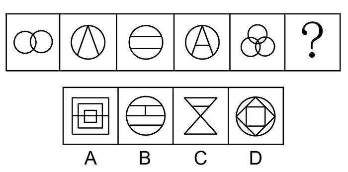
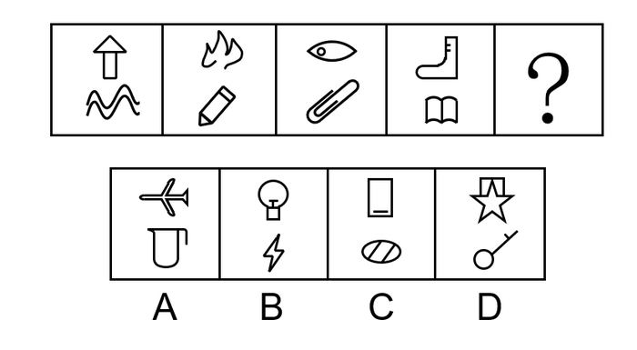
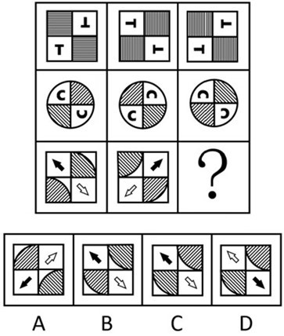
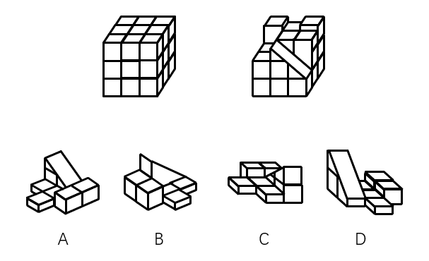
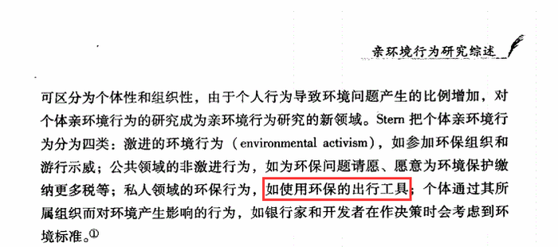
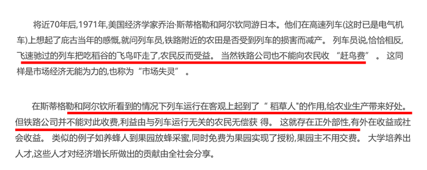
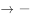
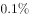
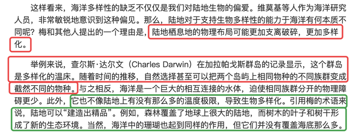

# 2020年湖北省公务员录用考试《行测》试题（网友回忆版）

> 判断推理 · 35 题 · 湖北 2020

## 第 1 题　qid 2615983 · 图形推理

从所给的四个选项中，选择最适合的一个填入问号处，使之呈现一定的规律性：

- **A**. A
- **B**. B
- **C**. C　✅
- **D**. D

**答案**：C

**官方解析**

元素组成不同，优先考虑属性规律。题干图形规整，考虑轴对称。观察对称轴，题干对称轴数量依次为2、1、2、1、3，无明显规律。属性无规律，考虑数量规律。再次观察图形发现，图1和图5出现“相交圆”，即笔画数的特征图，题干笔画数依次为1、1、2、2、1，无规律。题干图形线与线交叉明显，考虑交点数量。题干交点数依次为2、3、4、5、6、？，即“？”处应选择交点数为7的图形。选项交点数依次为18、8、7、8，C项符合。
故正确答案为C。

---

## 第 2 题　qid 2616142 · 图形推理

从所给的四个选项中，选择最合适的一个填入问号处，使之呈现一定的规律性：

- **A**. A
- **B**. B
- **C**. C
- **D**. D　✅

**答案**：D

**官方解析**

本题元素组成不相同也不相似，无明显属性规律，考虑数量规律。观察发现图一、图二和图三存在多端点图形，图四存在日字变形图，考虑笔画数。题干图形笔画数均为3。只有D项符合。
故正确答案为D。
注：本题不严谨，存在多个规律，如果考虑面数量是23232，选A；如果考虑部分数是32323，选C。通过对比择优，本题题干只有5幅图，周期规律不严谨，但笔画数都是3，数字恒等更加严谨，故本题粉笔更倾向于考虑笔画数，选D。

---

## 第 3 题　qid 2616105 · 图形推理

把下面六个图形分为两类，使每一类图形都有各自的共同特征或规律，分类正确的一项是：

- **A**. ①⑤⑥，②③④　✅
- **B**. ①②⑤，③④⑥
- **C**. ①②④，③⑤⑥
- **D**. ①③⑤，②④⑥

**答案**：A

**官方解析**

元素组成不同，优先考虑属性规律。对称、曲直均无明显规律，考虑开闭性。图①⑤⑥均为带有封闭区域的图形，图②③④均为全开放的图形，即①⑤⑥为一组，②③④为一组。
故正确答案为A。

---

## 第 4 题　qid 2616003 · 图形推理

从所给的四个选项中，选择最合适的一个填入问号处，使之呈现一定的规律性：

- **A**. A
- **B**. B
- **C**. C　✅
- **D**. D

**答案**：C

**官方解析**

元素组成相同，优先考虑位置规律。九宫格图形优先按横行来看，观察第一行图形，发现图1通过顺时针旋转得到图2，图2通过左右翻转得到图3。第二行验证，同样满足此规律。因此问号处的图形应该是第三行中的图2通过左右翻转得到，四个选项中只有C项符合。

故正确答案为C。

---

## 第 5 题　qid 2616106 · 图形推理

如下图所示，左侧为大立方体，右侧为其部分立体截面，问哪个选项能够与其拼成完整的大立方体： 

 

- **A**. A
- **B**. B
- **C**. C　✅
- **D**. D

**答案**：C

**官方解析**

本题考查立体拼合，解题原则为凹凸一致。根据题干要求，可知正确选项和右侧图形拼合后应为左侧正方体。如下图所示，将选项C进行转动后，可与题干右侧图形拼合成左侧正方体。

故正确答案为C。

---

## 第 6 题　qid 2615984 · 定义判断

亲环境行为是指个体通过减少或消除自身活动对环境的负面影响以达到改善生态系统结构的行为。它的本质是通过有效减轻环境问题实现环境改善，核心任务是构造环境稳态友好型的社会。
根据上述定义，下列选项属于亲环境行为的是：

- **A**. 植树造林
- **B**. 低碳出行　✅
- **C**. 细水长流
- **D**. 围海造田

**答案**：B

**官方解析**

第一步：找出定义关键词。

“个体通过减少或消除自身活动对环境的负面影响”、“改善生态系统结构”。

第二步：逐一分析选项。

A项：植树造林是新造或更新森林的生产活动，不符合“个体通过减少或消除自身活动对环境的负面影响”，不符合定义，排除； 

B项：低碳出行是一种降低“碳”的出行方式，符合“个体通过减少或消除自身活动对环境的负面影响”，符合“改善生态系统结构”，符合定义，当选；

C项：细水长流是指节约使用财物，精细安排，长远打算，与生态环境无关，不符合“个体通过减少或消除自身活动对环境的负面影响”，也不符合“改善生态系统结构”，不符合定义，排除；

D项：围海造田是把海洋变成陆地、田地，有效利用海洋空间，不符合“个体通过减少或消除自身活动对环境的负面影响”，也不符合“改善生态系统结构”，不符合定义，排除。

故正确答案为B。

注——本题出处如下：

王玉珏的论文《亲环境行为研究综述》中提到：个体亲环境行为可分为四类，其中私人领域的环保行为就包括“使用环保的出行工具”，即本题B项的“低碳出行”。

---

## 第 7 题　qid 2615991 · 定义判断

社会收缩是指人类聚落中人口持续流失，由此引发相应地区经济社会环境和文化在空间上的衰退过程。根据收缩行为是否是聚落行为主体主动采取的规划策略或管理措施，可以分为主动社会收缩和被动社会收缩。
根据上述定义，下列选项属于主动社会收缩的是（    ）。

- **A**. 某市因疏解核心区功能导致城区人口下降　✅
- **B**. 2019年我国春运人口迁移规模近30亿人次
- **C**. 某产煤大县因资源枯竭导致就业吸纳能力下降
- **D**. 某制造业基地因产业升级导致房屋空置率居高不下

**答案**：A

**官方解析**

第一步：找出定义关键词。
社会收缩：“人类聚落中人口持续流失，由此引发相应地区经济社会环境和文化在空间上的衰退过程”；
主动社会收缩：“收缩行为是聚落行为主体主动采取的规划策略或管理措施”；
被动社会收缩：“收缩行为不是聚落行为主体主动采取的规划策略或管理措施”。
第二步：逐一分析选项。
A项：某市疏解核心区功能是主动的行为，符合“收缩行为是聚落行为主体主动采取的规划策略或管理措施”，城区人口下降，符合“人类聚落中人口持续流失”，符合“主动社会收缩”定义，当选；
B项：春运人口大规模迁移，只是人口转移，不符合“人类聚落中人口持续流失”，不符合“社会收缩”定义，排除；
C项：某产煤大县资源枯竭不是主动的行为，不符合“收缩行为是聚落行为主体主动采取的规划策略或管理措施”，就业吸纳能力下降，不代表人口流失，不符合“人类聚落中人口持续流失”，不符合“主动社会收缩”定义，排除；
D项：某制造业基地产业升级导致房屋空置率居高不下，不代表人口流失，不符合“人类聚落中人口持续流失”，不符合“社会收缩”定义，排除。
故正确答案为A。

---

## 第 8 题　qid 2615986 · 定义判断

侵蚀作用指风力、流水、冰川、波浪等外力在运动状态下改变地面岩石及其风化物的过程。侵蚀作用可分为机械剥蚀作用和化学剥蚀作用。
根据上述定义，下列选项属于侵蚀作用的是：

- **A**. 裸露的人造雕像在长期的风吹日晒雨淋下，会出现机械剥蚀，甚至会出现崩塌碎裂
- **B**. 植物根部在岩缝中向岩石施加物理压力，并提供一个水及化学物的渗透渠道，造成岩石分解开裂
- **C**. 可溶性石灰岩在流水中部分溶解形成天然溶液而随水流失，造成岩体缩小甚至消失，形成岩溶地貌　✅
- **D**. 在气温变化突出的地区，岩石中的水分冻融交替，冰冻时体积膨胀，像楔子插入岩体内，导致岩石崩碎

**答案**：C

**官方解析**

第一步：找出定义关键词。
“风力、流水、冰川、波浪等外力在运动状态下”、“改变地面岩石及其风化物”。
第二步：逐一分析选项。
A项：裸露的人造雕像，不符合“改变地面岩石及其风化物”，不符合定义，排除； 
B项：植物根部在岩缝中向岩石施加物理压力最终导致岩石分解开裂，不符合“风力、流水、冰川、波浪等外力在运动状态下”，不符合定义，排除；
C项：可溶性石灰岩在流水中部分溶解形成天然溶液，符合“风力、流水、冰川、波浪等外力在运动状态下”、“改变地面岩石及其风化物”，符合定义，当选；
D项：岩石中的水分冻融交替，冰冻时体积膨胀，导致岩石崩碎，不符合“风力、流水、冰川、波浪等外力在运动状态下”，不符合定义，排除。
故正确答案为C。

---

## 第 9 题　qid 2616104 · 定义判断

印象管理是指人试图控制他人对自己形成的印象的过程。一个人留给他人的印象表明了他人对其的知觉、评价，甚至会使他人形成对其的特定应对方式。因而，为了给他人留下好的印象，得到他人好的评价与对待，人会用一种给他人造成特定印象的方式来自我表现。印象管理的运用，尤其要避免某些表演崩溃，包括无意动作、不合时宜的闯入、闹剧等。
根据上述定义，下列选项最能体现印象管理运用的是：

- **A**. 沙子龙在夜静人稀时，关好门，舞出一套断魂枪，微微一笑说：“不传不传”
- **B**. 许衡看到人们摘食路边的梨解渴，不为所动，说：“梨虽无主，而吾心有主”　✅
- **C**. 一向沉静温柔的小美在毕业之际，承受不住与同学离别的感伤，突然嚎啕大哭
- **D**. 岳飞的母亲为了激励岳飞奋勇抗金，用针在其背上刺了四个字：“精忠报国”

**答案**：B

**官方解析**

第一步：找出定义关键词。
印象管理：“试图控制他人对自己形成的印象的过程”、“为了给他人留下好的印象······用一种给他人造成特定印象的方式来自我表现”、“避免某些表演崩溃，包括无意动作、不合时宜的闯入、闹剧等”。
第二步：逐一分析选项。
A项：沙子龙在夜静人稀时，关门武枪，此时只有他自己，并非是想在他人面前树立自己形象，不符合“试图控制他人对自己形成的印象的过程”，也不符合“为了给他人留下好的印象······用一种给他人造成特定印象的方式来自我表现”，不符合定义，排除； 
B项：“梨虽无主,而吾心有主”的意思是梨虽然没有主人，但是我的心灵是有主见的，对比人们摘食路边的梨解渴的行为，体现了许衡“为了给他人留下好的印象······用一种给他人造成特定印象的方式来自我表现”，也符合“避免某些表演崩溃，包括无意动作”，符合定义，当选；
C项：一向沉静温柔的小美毕业之际嚎啕大哭，说明在毕业之际，小美的情绪崩溃了，不符合“避免某些表演崩溃”，不符合定义，排除；
D项：岳飞的母亲为了激励岳飞而刺字，并非是想在他人面前树立自己形象，不符合“试图控制他人对自己形成的印象的过程”，也不符合“为了给他人留下好的印象······用一种给他人造成特定印象的方式来自我表现”，不符合定义，排除。
故正确答案为B。

---

## 第 10 题　qid 2615995 · 定义判断

疼痛共情的偏好性，是指个体对他人疼痛的感知、判断和情绪反应，总是由于个体与他人之间的亲疏远近关系或情感认同程度不同而不同。
根据上述定义，下列没有体现疼痛共情的偏好性的是（    ）。

- **A**. 小明看到《西游记》里的白骨精被孙悟空打死，高兴得跳了起来
- **B**. 小张看到外来游客不幸溺水而亡，从此再也不敢去那条河里游泳　✅
- **C**. 小李在看歌剧《白毛女》时跳上戏台拉住喜儿，不让黄世仁抢走
- **D**. 小红听奶奶回忆自己在旧社会的苦日子时，禁不住潸然泪下

**答案**：B

**官方解析**

第一步：找出定义关键词。
“个体对他人疼痛的感知、判断和情绪反应”、“由于个体与他人之间的亲疏远近关系或情感认同程度不同而不同”。
第二步：逐一分析选项。
A项：小明看到《西游记》里的白骨精被孙悟空打死，高兴得跳了起来。小明对孙悟空和白骨精的情感认同程度不同，《西游记》中，孙悟空是正面形象，而白骨精是反面形象，通常人们对作品中的正义形象是支持和赞同的，所以小明看到正义获胜会很高兴、很支持，符合“个体对他人疼痛的感知、判断和情绪反应”、“由于个体与他人之间的亲疏远近关系或情感认同程度不同而不同”，符合定义，排除；
B项：小张看到外来游客不幸溺水而亡，从此再也不敢去那条河里游泳，小张与溺水游客属于陌生的关系，但溺水的不论是谁，小张都不会再去那条河里游泳，没有因为关系或认同感的不同而有区别，而是一种经验教训，不符合“由于个体与他人之间的亲疏远近关系或情感认同程度不同而不同”，不符合定义，当选；
C项：小李在看歌剧《白毛女》时跳上戏台拉住喜儿，不让黄世仁抢走，歌剧中喜儿的角色让观众怜惜，黄世仁的角色让观众厌恶，因此小李认知上会亲近喜儿，疏远黄世仁，最终跳上戏台阻止，符合“个体对他人疼痛的感知、判断和情绪反应”、“由于个体与他人之间的亲疏远近关系或情感认同程度不同而不同”，符合定义，排除；
D项：小红听奶奶回忆自己在旧社会的苦日子时，禁不住潸然泪下，小红正因为是她亲近的奶奶曾遭受了痛苦，所以忍不住得哭了，正常来讲大家对苦难的生活都有一定经历和承受力，如果是陌生人或者是讨厌的经历了苦难生活，我们未必会有特别大的情绪反应，符合“个体对他人疼痛的感知、判断和情绪反应”、“由于个体与他人之间的亲疏远近关系或情感认同程度不同而不同”，符合定义，排除。
本题为选非题，故正确答案为B。

---

## 第 11 题　qid 2615989 · 定义判断

算法歧视是以算法为手段实施的歧视，主要指在大数据背景下，依靠机器计算的自动决策系统在对数据主体做出决策分析时，由于数据和算法本身不具有中立性或者隐含错误、被人为操控等原因，对数据主体进行差别对待，造成歧视性后果。
根据上述定义，下列属于算法歧视的是：

- **A**. 某新生班主任根据学生的入学成绩高低来安排他们的学号
- **B**. 某水果商家总是对长期参与团购的客户给予更低价格折扣
- **C**. 某信用评估平台通过用户的网络使用行为来判定其信用值
- **D**. 某招聘网站给男性推送高薪职位的广告次数是女性的6倍　✅

**答案**：D

**官方解析**

第一步：找出定义关键词。
“大数据背景下”、“机器计算的自动决策系统在对数据主体做出决策分析时”、“不具有中立性或者隐含错误、被人为操控”、“对数据主体进行差别对待，造成歧视性后果”。
第二步：逐一分析选项。
A项：某新生班主任根据学生的入学成绩高低来安排他们的学号，不符合“大数据背景下”，也不符合“对数据主体进行差别对待，造成歧视性后果”，不符合定义，排除； 
B项：某水果商家总是对长期参与团购的客户给予更低价格折扣，不符合“大数据背景下”，也不符合“对数据主体进行差别对待，造成歧视性后果”，不符合定义，排除； 
C项：某信用评估平台通过用户的网络使用行为来判定其信用值，不符合“对数据主体进行差别对待，造成歧视性后果”，不符合定义，排除；
D项：某招聘网站给男性推送高薪职位的广告次数是女性的6倍，符合“大数据背景下”，且性别本身并不存在差别，但是网站的推送结果存在差别，符合“不具有中立性或者隐含错误、被人为操控”、“对数据主体进行差别对待，造成歧视性后果”，符合定义，当选。
故正确答案为D。

---

## 第 12 题　qid 2615985 · 定义判断

积极强化是指用某种有吸引力的结果对某一行为进行奖励和肯定，以期在类似条件下重复这一行为。消极强化是指在行为出现时把不愉快的刺激撤销或减少，这样也可以增加行为频率。
根据上述定义，下列选项属于积极强化的是（    ）。

- **A**. 君子一日三省其身
- **B**. 杀鸡骇猴以儆效尤
- **C**. 重赏之下必有勇夫　✅
- **D**. 从轻发落戴罪立功

**答案**：C

**官方解析**

第一步：找出定义关键词。
积极强化：“用某种有吸引力的结果”、“对某一行为进行奖励和肯定”、“以期在类似条件下重复这一行为”；
消极强化：“在行为出现时把不愉快的刺激撤销或减少”、“可以增加行为频率”。
第二步：逐一分析选项。
A项：君子一日三省其身，意思是君子多次自觉地检查自己，不符合“对某一行为进行奖励和肯定”，也不符合“在行为出现时把不愉快的刺激撤销或减少”，不符合任何一个定义，排除；
B项：杀鸡骇猴以儆效尤，意思是用惩罚一个人的办法来警告别人，未体现奖励或减少不愉快的刺激，不符合“对某一行为进行奖励和肯定”，也不符合“在行为出现时把不愉快的刺激撤销或减少”，不符合任何一个定义，排除；
C项：重赏之下必有勇夫，意思是用重金悬赏，就会有勇于出来干事的人，符合“用某种有吸引力的结果”、“对某一行为进行奖励和肯定”、“以期在类似条件下重复这一行为”，符合“积极强化”定义，当选；
D项：从轻发落戴罪立功，意思是处罚从宽，争取立下功劳，借以赎罪，不符合“对某一行为进行奖励和肯定”，也不符合“在行为出现时把不愉快的刺激撤销或减少”，不符合任何一个定义，排除。
故正确答案为C。

---

## 第 13 题　qid 2616001 · 定义判断

社会计算的内涵包括两个层面：一是社会的计算化，二是计算的社会化。社会的计算化是指通过人们在互联网上留下的海量而且相互关联的数据足迹，对人们的社会活动进行追踪、检索、汇编、计量和运算。计算的社会化则是指互联网创造了一种环境、一个平台，使人们能够广泛地参与计算过程，从而在数据的挖掘、分析和应用等方面获得更高效率。
根据上述定义，下列现象符合计算的社会化的是（    ）。

- **A**. 某购物平台根据用户购物经历，定期向用户推荐商品
- **B**. 某手机导航软件能为用户自动生成一个月来的行踪图
- **C**. 全班同学在暑假田野调查结束后合作制成精美的相册
- **D**. 小陈在众筹平台匿名捐款后，受助者上门送来感谢信　✅

**答案**：D

**官方解析**

第一步：找出定义关键词。
社会的计算化：“人们在互联网上留下的海量而且相互关联的数据足迹”、“对人们的社会活动进行追踪、检索、汇编、计量和运算”；
计算的社会化：“互联网创造了一种环境、一个平台”、“人们能够广泛地参与”、“获得更高效率”。
第二步：逐一分析选项。
A项：购物平台根据用户购物经历，符合“人们在互联网上留下的海量而且相互关联的数据足迹”，定期向用户推荐商品，符合“对人们的社会活动进行追踪、检索、汇编、计量和运算”，符合“社会的计算化”定义，不符合“计算的社会化”定义，排除；
B项：手机导航软件能为用户自动生成一个月来的行踪图，符合“人们在互联网上留下的海量而且相互关联的数据足迹”，符合“对人们的社会活动进行追踪、检索、汇编、计量和运算”，符合“社会的计算化”定义，不符合“计算的社会化”定义，排除；
C项：全班同学合作制成精美的相册，不符合“互联网创造了一种环境、一个平台”，也不符合“人们在互联网上留下的海量而且相互关联的数据足迹”，不符合任何一个定义，排除；
D项：小陈在众筹平台匿名捐款,其中众筹平台符合“互联网创造了一种环境、一个平台”、众筹这种方式符合“人们能够广泛地参与”、“获得更高效率”，符合“计算的社会化”定义，当选。
故正确答案为D。

---

## 第 14 题　qid 2615992 · 定义判断

外部性是指经济当事人的生产和消费行为对其他经济当事人的生产和消费行为施加的有益或者有害影响的效应。正外部性是指某个经济行为个体的活动使他人或社会受益，而受益者无需花费代价。负外部性是指某个经济行为个体的活动使他人或社会受损，而造成负外部性的人却没有为此承担成本。
根据上述定义，下列选项属于正外部性的是：

- **A**. 经过农田的蒸汽机车，喷出火花飞到农民种植的麦穗上
- **B**. 飞速行驶的火车尖锐的汽笛声吓跑在农田吃稻谷的小鸟　✅
- **C**. 某工厂在村庄建起了扶贫车间，为村民就近就业提供便利
- **D**. 某工厂排出了大量废水和有害气体，给周围居民带来健康危害

**答案**：B

**官方解析**

第一步：找出定义关键词。

正外部性：“某个经济行为个体的活动使他人或社会受益”、“受益者无需花费代价”；

负外部性：“某个经济行为个体的活动使他人或社会受损”、“造成负外部性的人却没有为此承担成本”。

第二步：逐一分析选项。

A项：火花飞到农民种植的麦穗上，对植物造成损害，符合“某个经济行为个体的活动使他人或社会受损”，不符合“某个经济行为个体的活动使他人或社会受益”，符合“负外部性”定义，不符合“正外部性”定义，排除；

B项：尖锐的汽笛声吓跑在农田吃稻谷的小鸟，保护了稻谷，符合“某个经济行为个体的活动使他人或社会受益”，且“受益者无需花费代价”，符合“正外部性”定义，当选；

C项：某工厂在村庄建起了扶贫车间，为村民就近就业提供便利，符合“某个经济行为个体的活动使他人或社会受益”，但村民到车间工作也需要付出劳动力等成本，不符合“受益者无需花费代价”，不符合任何一个定义，排除；

D项：某工厂排出了大量废水和有害气体，给周围居民带来健康危害，不符合“某个经济行为个体的活动使他人或社会受益”，不符合“正外部性”定义，排除。

故正确答案为B。

注：原文如下：

---

## 第 15 题　qid 2616103 · 定义判断

错觉是完全不符合刺激本身特征的失真的或扭曲事实的知觉经验，生活中，凭知觉经验所作的解释显然是失真的，甚至是错误的。幻觉是在没有相应的外界客观事物直接作用下发生的不真实感知。幻觉具有与真实知觉类似的特点，但它是虚幻的。正常人在某些特殊的状态下，如强烈的情绪体验并伴有生动的想象、回忆，或期待的心情、紧张的情绪，或处于催眠状态，都可能会出现幻觉。在入眠或醒觉状态的过程中，也会发生幻觉。
根据上述定义，下列属于幻觉的是：

- **A**. 杯弓有蛇影，草木疑皆兵
- **B**. 相看两不厌，唯有敬亭山
- **C**. 寝兴目存形，遗音犹在耳　✅
- **D**. 蝉噪林逾静，鸟鸣山更幽

**答案**：C

**官方解析**

第一步：找出定义关键词。
错觉：“不符合刺激本身特征”、“失真的或扭曲事实的”、“凭知觉经验所作的解释显然是失真的，甚至是错误的”；
幻觉：“没有相应的外界客观事物”、“不真实感知”。
第二步：逐一分析选项。
A项：杯弓有蛇影，出自东汉学者应劭的《风俗通义·怪神》，意思是将映在酒杯里的弓影误认为蛇；草木疑皆兵，出自《晋书·苻坚载记》，意思是把山上的草木都当做敌兵，符合“不符合刺激本身特征”、“失真的或扭曲事实的”，符合“错觉”定义，不符合“幻觉”定义，排除；
B项：相看两不厌，唯有敬亭山，出自唐代李白的《独坐敬亭山》，意思是敬亭山和我对视着，谁都看不够，看不厌，看来理解我的只有这敬亭山了，不符合“失真的或扭曲事实的”以及“没有相应的外界客观事物”，不符合任何一个定义，排除；
C项：寝兴目存形，遗音犹在耳，出自魏晋诗人潘安的《悼亡诗三首》，意思是睡下和起床的时候都还能看到你，你的声音仿佛还在我的耳边，表达了对亡妻深深的思念之情，符合“没有相应的外界客观事物”、“不真实感知”，也能对应题干“在入眠或醒觉状态的过程中”，符合“幻觉”定义，当选；
D项：蝉噪林逾静，鸟鸣山更幽，出自南朝王籍的《入若耶溪》，意思是蝉声高唱，树林却显得格外宁静，鸟鸣声声，深山里倒比往常更清幽，不符合“失真的或扭曲事实的”以及“没有相应的外界客观事物”，不符合任何一个定义，排除。
故正确答案为C。

---

## 第 16 题　qid 2615965 · 类比推理

牵牛花：喇叭花

- **A**. 乞巧节：七夕节　✅
- **B**. 七巧板：橡皮泥
- **C**. 人行道：车行道
- **D**. 防腐剂：添加剂

**答案**：A

**官方解析**

第一步：判断题干词语间逻辑关系。
牵牛花又称喇叭花，二者为全同关系。
第二步：判断选项词语间逻辑关系。
A项：乞巧节又称七夕节，二者为全同关系，与题干逻辑关系一致，当选；
B项：七巧板和橡皮泥均为儿童玩具，二者为并列关系，与题干逻辑关系不一致，排除；
C项：人行道和车行道为并列关系，与题干逻辑关系不一致，排除；
D项：防腐剂是添加剂的一种，二者为种属关系，与题干逻辑关系不一致，排除。
故正确答案为A。

---

## 第 17 题　qid 2615964 · 类比推理

售后：品控

- **A**. 数据：科学
- **B**. 融资：风投
- **C**. 龙骨：地板
- **D**. 听证：监管　✅

**答案**：D

**官方解析**

第一步：判断题干词语间逻辑关系。
售后需要品控，二者为对应关系，且品控不只是售后阶段存在，所有阶段都需要品控。
第二步：判断选项词语间逻辑关系。
A项：科学研究需要数据，但两词顺序与题干相反，与题干逻辑关系不一致，排除；
B项：风投是一种融资方式，二者为种属关系，与题干逻辑关系不一致，排除；
C项：龙骨是用来支撑造型、固定结构的一种建筑材料，龙骨用来支撑地板，与题干逻辑关系不一致，排除；
D项：听证需要监管，二者为对应关系，且监管不只是听证阶段存在，所有阶段都需要监管，与题干逻辑关系一致，当选。
故正确答案为D。

---

## 第 18 题　qid 2616102 · 类比推理

鲜花：塑料花

- **A**. 纸质书：电子书
- **B**. 相片：画像
- **C**. 原本：复印本　✅
- **D**. 钤章：印泥

**答案**：C

**官方解析**

第一步：判断题干词语间逻辑关系。
鲜花和塑料花是并列关系，且鲜花是真花，而塑料花是仿真花，是根据鲜花人工制作而成的。
第二步：判断选项词语间逻辑关系。
A项：纸质书和电子书是并列关系，但二者是书籍的两种载体形式，与题干逻辑关系不一致，排除；
B项：相片和画像是并列关系，但二者是记录人像的两种表现形式，相片是利用照相机拍摄出来的，而画像是利用画笔画出来的，与题干逻辑关系不一致，排除；
C项：原本和复印本是并列关系，且原本是正品，而复印本是根据原本复印而来的，与题干逻辑关系一致，当选；
D项：钤章是指旧时机关团体使用的图章，需要和印泥配套使用，二者是配套对应关系，与题干逻辑关系不一致，排除。
故正确答案为C。

---

## 第 19 题　qid 2615967 · 类比推理

羊：羊奶：腥膻

- **A**. 蚕：蚕丝：雪白
- **B**. 蜘蛛：蛛丝：粘缚
- **C**. 蜂：蜂蜜：甘甜　✅
- **D**. 雨燕：燕窝：营养

**答案**：C

**官方解析**

第一步：判断题干词语间逻辑关系。
羊奶是羊的产出物，腥膻是羊奶的必然属性，且腥膻是一种味道。
第二步：判断选项词语间逻辑关系。
A项：蚕丝是蚕的产出物，但雪白不是蚕丝的必然属性，且雪白也不是一种味道，与题干逻辑关系不一致，排除；
B项：蛛丝是蜘蛛的产出物，但粘缚是蛛丝的功能，而非属性，与题干逻辑关系不一致，排除；
C项：蜂蜜是蜂的产出物，甘甜是蜂蜜的必然属性，且甘甜是一种味道，与题干逻辑关系一致，当选；
D项：燕窝是雨燕科几种金丝燕分泌的唾液及其绒羽混合粘结所筑成的巢穴，而燕窝并非是雨燕直接产出的，且营养也不是一种味道，与题干逻辑关系不一致，排除。
故正确答案为C。

---

## 第 20 题　qid 2615966 · 类比推理

花：牡丹：玫瑰

- **A**. 茶：红茶：绿茶
- **B**. 草：艾草：蓼草　✅
- **C**. 球：足球：绒球
- **D**. 车：轿车：客车

**答案**：B

**官方解析**

第一步：判断题干词语间逻辑关系。
玫瑰和牡丹都是花，二者之间为并列关系，与花均为种属关系，且玫瑰和牡丹都是自然界的植物。
第二步：判断选项词语间逻辑关系。
A项：红茶和绿茶都是茶，二者之间为并列关系，与茶均为种属关系，但红茶和绿茶都是经过人们加工而制成的，与题干逻辑关系不一致，排除；
B项：艾草和蓼草都是草，二者之间为并列关系，与草均为种属关系，且艾草和蓼草都是自然界的植物，与题干逻辑关系一致，当选；
C项：绒球是用彩色毛线或绒线扎成的球形物体，与足球不是一类事物，二者之间不是并列关系，与题干逻辑关系不一致，排除；
D项：轿车和客车都是车，二者之间为并列关系，与车均为种属关系，但轿车和客车都是人类制造出来的产物，与题干逻辑关系不一致，排除。
故正确答案为B。

---

## 第 21 题　qid 2615969 · 类比推理

空运：海运：运输

- **A**. 平装：精装：装帧　✅
- **B**. 货轮：客轮：邮轮
- **C**. 晚会：聚会：集会
- **D**. 试飞：试航：航天

**答案**：A

**官方解析**

第一步：判断题干词语间逻辑关系。
空运和海运是两种不同的运输方式，前两词为并列关系，并与第三词构成种属关系。
第二步：判断选项词语间逻辑关系。
A项：平装和精装是两种不同的装帧方式，前两词为并列关系，并与第三词构成种属关系，与题干逻辑关系一致，当选；
B项：货轮和客轮分别是用来运载货物和乘客的船舶，二者为并列关系，邮轮指的是在海洋中航行的旅游客轮，所以邮轮是客轮的一种，与货轮不构成种属关系，与题干逻辑关系不一致，排除；
C项：晚会是指在晚上举行的集会，多以文娱活动为主，聚会是指人数较多，有明确主题的集体活动，二者不构成并列关系，与题干逻辑关系不一致，排除；
D项：试飞是指在飞机交付使用前进行的试验性飞行，试航是指飞机、船只等在正式航行前进行的试验性航行，二者和航天没有必然关系，与题干逻辑关系不一致，排除。
故正确答案为A。

---

## 第 22 题　qid 2615968 · 类比推理

初伏：中伏：末伏

- **A**. 火星：木星：土星
- **B**. 大雨：小雨：谷雨
- **C**. 上旬：中旬：下旬　✅
- **D**. 大暑：小暑：处暑

**答案**：C

**官方解析**

第一步：判断题干词语间逻辑关系。
初伏、中伏、末伏，三者之间是并列关系，并且三者按照三伏天的时间先后顺序排列，先初伏，再中伏，最后末伏。
第二步：判断选项词语间逻辑关系。
A项：火星、木星、土星是太阳系八大行星中的三个行星，三者之间是并列关系，但是没有时间先后顺序，与题干逻辑关系不一致，排除；
B项：大雨、小雨是两种不同的天气，谷雨是二十四节气之一，三者不构成并列关系，与题干逻辑关系不一致，排除；
C项：上旬、中旬、下旬，三者之间是并列关系，并且三者按照一个月份的不同时间段的时间先后顺序排列，先上旬，再中旬，最后下旬，与题干逻辑关系一致，当选；
D项：大暑、小暑、处暑是二十四节气中的三个节气，三者之间是并列关系，但是它们的时间先后顺序应该是先小暑，再大暑，最后处暑，与题干逻辑关系不一致，排除。
故正确答案为C。

---

## 第 23 题　qid 2616134 · 类比推理

十年寒窗：悬梁刺股：囊萤映雪

- **A**. 七月流火：以荻画地：临池学书
- **B**. 三月肉味：蓝田种玉：程门立雪
- **C**. 一寸光阴：凿壁偷光：闻鸡起舞　✅
- **D**. 一日三秋：卧薪尝胆：铁杆磨针

**答案**：C

**官方解析**

第一步：判断题干词语间逻辑关系。
十年寒窗、悬梁刺股和囊萤映雪都是形容刻苦攻读，勤学上进，三者为近义关系。
第二步：判断选项词语间逻辑关系。
A项：七月流火指夏去秋来，寒天将至；以荻画地是指用荻杆在地上写字画画；临池学书指刻苦练习书法；三者语义没有关系，与题干逻辑关系不一致，排除；
B项：三月肉味形容专心一意，全神贯注；蓝田种玉比喻男女获得了称心如意的美好姻缘；程门立雪指尊敬师长，重视自己的教育事业；三者语义没有关系，与题干逻辑关系不一致，排除；
C项：一寸光阴是指时间非常宝贵；凿壁偷光用来形容家贫而读书刻苦；闻鸡起舞是指听到鸡啼就起来舞剑，比喻有志报国的人及时奋起；三者均形容珍惜时间，勤学刻苦，为近义关系，与题干逻辑关系一致，当选；
D项：一日三秋比喻分别时间虽短，却觉得很长，形容思念殷切；卧薪尝胆比喻刻苦自励、发奋图强；铁杆磨针比喻只要有决心，肯下工夫，多么难的事情也能做成功；三者语义没有关系，与题干逻辑关系不一致，排除。
故正确答案为C。

---

## 第 24 题　qid 2615970 · 类比推理

了如指掌  对于（    ）相当于（    ）对于  坚固

- **A**. 知道；铁板一块
- **B**. 明白；坚不可摧
- **C**. 理解；铜墙铁壁
- **D**. 了解；固若金汤　✅

**答案**：D

**官方解析**

逐一代入选项。
A项：“了如指掌”是指对事物了解得非常清楚，“知道”是指有一定的了解和认识，二者为近义关系；“铁板一块”比喻结合紧密、不可分割的整体，“坚固”是指结实牢固，不容易破坏，二者无明显的关系，前后逻辑关系不一致，排除；
B项：“了如指掌”是指对事物了解得非常清楚，“明白”有知道、了解的意思，二者为近义关系；“坚不可摧”形容非常坚固，与“坚固”为近义关系，前后逻辑关系一致，保留；
C项：“了如指掌”是指对事物了解得非常清楚，“理解”是指懂、了解，二者为近义关系；“铜墙铁壁”是指防御十分坚固，与“坚固”为近义关系，前后逻辑关系一致，保留；
D项：“了如指掌”是指对事物了解得非常清楚，与“了解”为近义关系；“固若金汤”形容防守非常坚固，与“坚固”为近义关系，前后逻辑关系一致，保留。
对比B、C、D三项，题干的“了如指掌”和D项的“固若金汤”都含有比喻义，词语结构更加贴近，D项当选。
故正确答案为D。

---

## 第 25 题　qid 2615962 · 类比推理

（    ）对于  裁判  相当于  案件  对于（    ）

- **A**. 球员；法庭
- **B**. 黑哨；上诉
- **C**. 比赛；法官　✅
- **D**. 比分；律师

**答案**：C

**官方解析**

逐一代入选项。
A项：球员是裁判监督的对象，二者为主体和对象的对应关系，法庭是案件审判的场所，二者为场所对应关系，前后逻辑关系不一致，排除；
B项：黑哨是足球运动中裁判违反公平性原则的行为，二者为对应关系，上诉案件，二者为动宾关系，前后逻辑关系不一致，排除；
C项：裁判是一种职业，裁判可以判决比赛，法官是一种职业，法官可以判决案件，二者是职业主体和对象的对应关系，且主体与对象之间的关系均体现为“判决”，前后逻辑关系一致，当选；
D项：裁判是一种职业，裁判可以记录比分，律师是一种职业，律师可以处理案件，二者是职业主体和对象的对应关系，但主体与对象之间的关系不一致，前面为“记录”，后面为“处理”，前后逻辑关系不一致，排除。
故正确答案为C。

---

## 第 26 题　qid 2616033 · 逻辑判断

越是身处浮华的地方，我们越是希望能遇到一块心灵栖息地。虽然我们生活在一个商业化社会，但书店仍然是灵魂的慰藉之地。大到城市，小到商场，若能有一家文化味浓郁的书店，一定能让人们感受到不一样的氛围。书店入驻商场，这不仅能给商场带来客流，也能提升商场的品位。以书店融合阅读、休闲和其他文化产品的类似“文化商场”模式，更是可以在商场内部构建一个特别的文化链。
如果以上论断为真，则下列说法正确的是：

- **A**. 城市让人们感受到不一样的氛围，是因为拥有文化味浓郁的书店
- **B**. 想要在商场内部构建一个特别的文化链，就不应忽视书店这一环　✅
- **C**. 因为书店提升了商场的品位，所以书店给商场带来了客流
- **D**. 即便不是身处浮华的地方，我们也能遇到一块心灵栖息地

**答案**：B

**官方解析**

日常结论题，根据题干信息逐一分析选项。
A项：题干中指出文化味浓郁的书店可以推出让人们感受到不一样的氛围，选项中说是因为有文化味浓郁的书店所以让人们感受到不一样的氛围，推出关系不等于因果关系，无法推出，排除；
B项：根据题干最后一句话可知，书店可以在商场内部构建一个特别的文化链，选项中说想要在商场内部构建一个特别的文化链，不应该忽视书店这一环，是文段的同义替换，可以推出，当选；
C项：题干中指出书店既给商场带来客流也提升了商场的品位，选项中说是因为书店提升了商场的品位所以给商场带来了客流，无法推出，排除；
D项：题干说的是我们希望遇到心灵栖息地，选项说的是我们能否遇到心灵栖息地，属于偷换概念，无法推出，排除。
故正确答案为B。

---

## 第 27 题　qid 2616032 · 逻辑判断

在市场竞争十分激烈的时候，一个企业要是不激流勇进，创造出富有竞争力的产品，也不适时撤退、主动割爱，放弃没有前景的市场，那么这个企业最后一定会陷入危机之中。
如果以上论断为真，下列说法正确的是（    ）。

- **A**. 某企业未能创造出富有竞争力的产品，最后一定会惨遭淘汰
- **B**. 某企业紧要关头急流勇退，转向其它市场，就可以避免危机
- **C**. 某企业放弃已显颓势的产业，转向新产品的开发，它可能不会被淘汰　✅
- **D**. 某企业研发出了富有竞争力的产品，它最后一定不会陷入危机之中

**答案**：C

**官方解析**

第一步：翻译题干。

-（激流勇进，创造出富有竞争力的产品）且-（适时撤退，主动割爱，放弃没有前景的市场）→陷入危机

第二步：逐一分析选项。

A项：翻译为-创造出有市场竞争力的产品→淘汰，“-创造出有市场竞争力的产品”是对题干翻译前件“且”关系一部分的肯定，据此无法判断整个“且”关系的真假，进而无法得出确定性结论，不能推出，排除；

B项：翻译为“急流勇退，转向其他市场陷入危机”，“急流勇退，转向其他市场”即“适时撤退、主动割爱，放弃没有前景的市场”，是对题干翻译前件“且”关系的一部分的否定，否前不能得到确定性结论，不能推出，排除；

C项：翻译为放弃已显颓势的产业→可能不会被淘汰，放弃已显颓势的产业是否定题干翻译前件“且关系”的一部分，否前不能得到确定性结论，但是C选项后面说的是可能不会被淘汰，是一种可能性的表述，可以推出，当选；

D项：翻译为富有竞争力的产品→-陷入危机，是否定题干翻译前件“且关系”的一部分，否前不能得到确定性结论，不能推出，排除。

故正确答案为C。

---

## 第 28 题　qid 2616035 · 逻辑判断

心理学家考察了450位中年男性和女性，他们中有白领阶层，也有蓝领阶层；有技能判断型人群，也有决策制定型人群。结果发现，那些身居重要职位的高管人士普遍比一般员工更胖。研究者认为，做出许多决定所承受的压力通过饮食方式得到排解，这最终在一定程度上改变了高管人士之前的饮食习惯，如果你的职位幸运地得到晋升，你将发现不仅是薪水变多，自己的腰围也在变粗，伴随着体重上升。
以下哪项如果为真，最能质疑上述结论？（    ）

- **A**. 比较而言，技能判断型人群的腰围较小，决策制定型人群的腰围较大
- **B**. 比较而言，身居要职的高管人士更难抽出时间投入锻炼以缩小腰围　✅
- **C**. 每晋升一次，技能判断型人群的腰围平均会减少0.5厘米
- **D**. 每晋升一次，决策制定型人群的腰围平均会增大0.28厘米

**答案**：B

**官方解析**

第一步：找出论点和论据。
论点：做出许多决定所承受的压力通过饮食方式得到排解，这最终在一定程度上改变了高管人士之前的饮食习惯，如果你的职位幸运地得到晋升，你将发现不仅是薪水变多，自己的腰围也在变粗，伴随着体重上升。
论据：心理学家考察了450位中年男性和女性，他们中有白领阶层，也有蓝领阶层；有技术判断性人群，也有决策判断性人群，结果发现，那些身居重要职位的高管人士普遍比一般职员更胖。
本题的论据是做了一个研究，论点是研究之后的结果，并且以因果的方式呈现，所以可以考虑他因削弱和因果倒置。
第二步：逐一分析选项。
A项：比较技术判断型人和决策制定型人的腰围大小，和题干压力大饮食习惯变化导致腰围增加的论点没有关系，属于无关选项，排除；
B项：高管难抽出时间锻练无法减少腰围，论点是高管因为压力大饮食习惯发生变化导致腰围增加，而选项说明腰围变化的原因在于是否进行锻练，属于他因削弱，当选；
C项：技术判断型人群平均腰围随着晋升减少，题干说的是高管，而职级晋升不一定就是高管，属于不明确选项，排除；
D项：决策制定型人群平均腰围随着晋升增加，题干说的是高管，而职级晋升不一定就是高管，属于不明确选项，排除。
故正确答案为B。

---

## 第 29 题　qid 2616036 · 逻辑判断

食品添加剂是现代食品工业的重要组成部分，按规定使用食品添加剂既对人体无害，而且能够改善食品品质，起到防腐、保鲜的作用。正是因为有了食品添加剂的发展，才有了大量的方便食品，给人们的生活带来极大的便利。如果不加入食品添加剂，大部分食品要么难看、难吃或者难以保鲜，要么就是价格昂贵。
下列说法能够支持上面论点的是（    ）。

- **A**. 食品添加剂和人类文明史一样悠久，例如点豆腐用的卤水
- **B**. 如果不使用添加剂，食品会因微生物作用而引起食物中毒　✅
- **C**. 宣称无食品添加剂往往是商家迎合消费者心理造成的噱头
- **D**. 三聚氰胺也是一种添加剂，在水泥里能够作为高效减水剂

**答案**：B

**官方解析**

第一步：找出论点和论据。
论点：食品添加剂是现代食品工业的重要组成部分，按规定使用食品添加剂既对人体无害，而且能够改善食品品质，起到防腐、保鲜的作用。正是因为有了食品添加剂的发展，才有了大量的方便食品，给人们的生活带来极大的便利。如果不加入食品添加剂，大部分食品要么难看、难吃或者难以保鲜，要么就是价格昂贵。
论据：无
本题只有论点，没有论据，加强优先考虑补充论据，即解释为什么食品添加剂按规定添加既对人体无害，并且能够改善食品品质，防腐，保鲜，或举例证明某些食品添加剂对人体无害，并且能够改善食品品质，防腐，保鲜。
第二步：逐一分析选项。
A项：论点说的是食品添加剂按规定添加既对人体无害，并且能够改善食品品质，防腐，保鲜，该项说的是食品添加剂和人类文明一样历史悠久，话题不一致，无法加强，排除；
B项：若不使用食品添加剂，食品会因微生物作用而导致食物中毒，说明食品添加剂对于食品是有好处的，解释了为什么我们要在食品中添加食品添加剂，当选；
C项：论点说的是食品添加剂按规定添加既对人体无害，并且能够改善食品品质，防腐，保鲜，该项说的是商家会以什么样的噱头来吸引消费者，话题不一致，无法加强，排除；
D项：论点强调的是食品添加剂按规定添加既对人体无害，并且能够改善食品品质，防腐，保鲜，该项说的是三聚氰胺在不同的环境中所起到的作用，与题干话题不一致，排除。
故正确答案为B。

---

## 第 30 题　qid 2616034 · 逻辑判断

二氧化碳的排放量剧增导致全球气候变暖，使珠穆朗玛峰所在的喜马拉雅地区冰川面临急剧缩小的危险。研究显示，珠峰海拔在5000米到6000米的冰川集中区域出现快速融化的现象，这些地方将只在冬季而不是在温暖的季节时看到结冰。专家推论说，根据未来的气候变化趋势，喜马拉雅地区的冰川减少的速度还有可能加快，如果本世纪内气温如预计的一样继续升高，该地区的冰川最终将消失殆尽。
如果以下各项为真，最能削弱上述论证的是：

- **A**. 
喜马拉雅冰川每年缩小约到

- **B**. 
喜马拉雅其他地区冰川对温度不敏感
　✅
- **C**. 
过去50年珠峰周边冰川覆盖面积减少了

- **D**. 
珠穆朗玛峰7000米以上区域未出现冰川快速融化现象

**答案**：B

**官方解析**

第一步：找出论点和论据。

论点：根据未来的气候变化趋势，喜马拉雅地区的冰川减少的速度还有可能加快，如果本世纪内气温如预计的一样继续升高，该地区的冰川最终将消失殆尽。

论据：珠峰海拔在5000米到6000米的冰川集中区域出现快速融化的现象，这些地方将只在冬季而不是在温暖的季节时看到结冰。

论点说的是喜马拉雅地区的冰川将会消失殆尽，论据是珠峰海拔在5000米到6000米的冰川集中区域出现快速融化的现象，因此本题目的论证关系是通过珠穆朗玛峰5000米-6000米区域的变化，来预测喜马拉雅山未来整体的情况，论点和论据的话题不一致，要想否定论证，可以补充5000米-6000米之外的地方冰川不会消融来进行否定，即通过局部是推不出整体这种方式来进行否定。

第二步：逐一分析选项。

A项：选项说喜马拉雅冰川每年缩小约到，补充论据说明冰川在不断缩小，有加强力度，排除；

B项：选项说喜马拉雅其他地区冰川对温度不敏感，说明在珠穆朗玛峰5000米-6000米之外的其他地区冰川并不会受温度的影响，那么就说明从题干中的论据是推不出论点的，可以削弱，当选；

C项：过去50年珠峰周边冰川覆盖面积减少了，补充论据说明冰川在不断缩小，有加强力度，排除；

D项：珠穆朗玛峰7000米以上区域未出现冰川快速融化现象，通过举反例来证明冰川不会完全消失，但该项只是举出了7000米以上的地区，不如B项包含的范围广，可以削弱，但是力度比B项弱，排除。

故正确答案为B。

---

## 第 31 题　qid 2616067 · 逻辑判断

近年来，“类脑计算”从理念走向实践，正走出一条制造类人智能的新途径。所谓“类脑计算”，是指仿真、模拟和借鉴大脑神经系统结构和信息处理过程的装置、模型和方法，其目标是制造类脑计算机。然而有人提出质疑：大脑奥秘尚未揭示，我们还不了解智能背后的基本原理，怎么能制造出具有“大脑智能”的类脑计算机呢？
以下哪项如果为真，最能反驳上述质疑？

- **A**. 类脑计算机的器件速度是生物神经元和突触的百万倍，一旦产生智能，后果难以预料
- **B**. 关于“类脑计算”的伦理制度和风险评估等必须与“类脑计算”的技术发明同步展开
- **C**. 揭示大脑奥秘和发明类脑计算机是相互作用的复杂过程，不是“前者决定后者”的简单关系　✅
- **D**. 国内已经启动集合各高校、科研机构和企业优势研究力量的10多项“类脑计算”研究项目

**答案**：C

**官方解析**

第一步：找出论点和论据。
论点：大脑奥秘尚未揭示，我们还不了解智能背后的基本原理，怎么能制造出具有“大脑智能”的类脑计算机。
论据：无。
本题论点讨论揭示大脑奥秘，了解智能背后的基本原理和制造“大脑智能”的类脑计算机之间的关系，没有论据，优先考虑否定论点，即揭示大脑奥秘，了解智能背后的基本原理和制造“大脑智能”的类脑计算机之间没有必然联系。
第二步：逐一分析选项。
A项：选项讨论类脑计算机产生智能的后果，论点讨论的是能否制造出类脑计算机，话题不一致，无法削弱，排除；
B项：选项讨论的是“类脑计算”的伦理制度和风险评估，论点讨论的是能否制造出类脑计算机，话题不一致，无法削弱，排除；
C项：论点意为因为没有揭示大脑奥秘，不了解智能背后的基本原理，所以不能制造类脑计算机，选项指出了揭示大脑奥秘和发明类脑计算机不是简单的“前者决定后者”的关系，否定论点，可以削弱，当选；
D项：选项讨论的是国内已启动多项“类脑计算”研究项目，启动了项目不等于就能制造出类脑计算机，话题不一致，无法削弱，排除。
故正确答案为C。

---

## 第 32 题　qid 2616000 · 逻辑判断

地球表面的大部分都被海洋覆盖，生命也诞生于海洋之中。然而，据估计，地球有的物种生活在陆地上，而海洋中仅为，剩下的生活在淡水中。研究者认为，陆地栖息地的物理布局相对海洋可能更加支离破碎，是导致陆地物种更加多样化的主要原因之一。

以下哪项如果为真，最能加强上述研究者的观点？

- **A**. 地球表面可分成热带、南温带、北温带、南寒带、北寒带五个温度带，各温度带物种差异性大，种类丰富
- **B**. 深海相对于有阳光照射的浅海岸地区而言，基本上像个冰箱，而且门已经关上很久，物种远不如浅海丰富
- **C**. 根据某群岛记录显示，随着时间推移，自然选择甚至可以把两个岛屿上相同物种的不同族群变成截然不同的物种　✅
- **D**. 森林覆盖许多陆地，而树叶和枝干形成新的生态环境，海洋中的珊瑚也起同样作用，但覆盖海底的面积没那么大

**答案**：C

**官方解析**

第一步：找出论点和论据。

论点：陆地栖息地的物理布局相对海洋可能更加支离破碎，是导致陆地物种更加多样化的主要原因之一。

论据：无。

本题只有论点没有论据，优先考虑补充论据，补充能够证明陆地栖息地的物理布局比海洋更复杂和破碎，能影响陆地物种多样化的原因或例子。

第二步：逐一分析选项。

A项：该项说的是地球表面温度差异导致各温度带物种差异大，与论点讨论的陆地栖息地的物理布局更加支离破碎导致陆地物种更加多样化无关，话题不一致，无法加强，排除；

B项：该项说的是深海物种不如浅海丰富，与论点讨论的陆地栖息地的物理布局更加支离破碎导致陆地物种更加多样化无关，话题不一致，无法加强，排除；

C项：该项说的是自然选择可以让两个岛屿上的同一物种变得不同，即说明陆地栖息地的物理布局的破碎导致陆地物种更加多样化，通过举例的方式进行加强，当选； 

D项：该项说的是森林中树叶和枝干能形成新的生态环境，而且比海洋中起同样作用的珊瑚覆盖的面积更广，只能说明陆地与海洋相比，相似的生态环境面积要广，但是否一定带来物种的多样性不明确，不能加强，排除。

故正确答案为C。

注：【原文链接】http://www.360doc.com/content/17/0724/10/5554415_673699256.shtml

原文讨论的是陆地的物种多样性远超海洋的原因，根据文段结构，C项为“陆地栖息地的物理布局可能更加支离破碎，更加多样化”的例子，即本题论点的例子。而D项为解释海洋物理障碍少，陆地可以“建造出精品”的例子。

---

## 第 33 题　qid 2615998 · 逻辑判断

肌萎缩侧索硬化症（ALS），俗称“渐冻症”。某科研团队研究发现，ALS的疾病发展与肠道微生物AM菌的数量密切相关。研究人员观察和比较了37名ALS患者及29名健康亲属的肠道菌群和血液、脑脊液样本。他们发现肠道细菌菌株有差异，其中有一种菌株与烟酰胺的产生有关。此外，在这些ALS患者的血液和脑脊液中，烟酰胺水平有所下降。
若要上述研究发现成立，需要补充的前提是：

- **A**. 人类肠道中的微生物非常复杂
- **B**. 烟酰胺是肠道微生物AM菌的代谢物　✅
- **C**. 小鼠补充烟酰胺后，ALS症状得到了减轻
- **D**. 人体肠道细菌的变化与ALS的疾病发展速度有关

**答案**：B

**官方解析**

第一步：找出论点和论据。
论点： ALS的疾病发展与肠道微生物AM菌的数量密切相关。
论据： 研究人员观察和比较了37名ALS患者及29名健康亲属的肠道菌群和血液、脑脊液样本。他们发现肠道细菌菌株有差异，其中有一种菌株与烟酰胺的产生有关。此外，在这些ALS患者的血液和脑脊液中，烟酰胺水平有所下降。
本题论点说的是ALS疾病与AM菌数量的关系，论据说的是ALS疾病与烟酰胺水平的关系，论点论据话题不一致，优先考虑搭桥的加强方式，即说明烟酰胺和AM菌之间存在关系。
第二步:逐一分析选项。
A项：人类肠道中微生物复杂，未提及“AM菌”与“ALS疾病”的关系，与论点话题不一致，属于无关项，无法加强，排除；
B项：烟酰胺是肠道微生物AM菌的代谢物，在“烟酰胺”和“AM菌”之间建立了关系，说明通过ALS患者烟酰胺水平下降可以判断ALS疾病与AM菌数量之间存在关系，搭桥项，可以加强，当选；
C项：小鼠补充烟酰胺后，ALS症状得到了减轻，说的是“ALS疾病”与“烟酰胺”的关系，未提及“ALS疾病”与“AM菌”或“烟酰胺”与“AM菌”之间的关系，与论点话题不一致，属于无关项，无法加强，排除；
D项：人体肠道细菌的变化与ALS的疾病发展速度有关，说的是“ALS疾病”与“人体肠道细菌”的关系，肠道细菌指的是不是“AM菌”不明确，属于不明确项，无法加强，排除。
故正确答案为B。

---

## 第 34 题　qid 2616160 · 逻辑判断

一项心理学研究认为，出身经济层次最低家庭的人中年后出现代谢综合征的比例最高，无论他们获得多大成就都是如此。该研究同时发现代谢综合征虽与童年生活状况有关，但该群体中那些拥有慈母的人不容易出现该综合征。究其原因，慈母具有同情心，会告诉孩子如何应对压力并鼓励他们健康饮食，保持良好生活方式。因此，我们在现实中可以设计一套方案，指导母亲教育孩子如何应对压力、健康生活和掌控命运。
由此可以推出：

- **A**. 设计针对母亲的指导方案，有助于降低特定群体出现代谢综合征的比例　✅
- **B**. 因为缺少母爱，出身经济层次最低家庭的人出现代谢综合征的比例最高
- **C**. 因为父亲不教导孩子保持良好生活方式，所以父亲对孩子的健康没影响
- **D**. 出身经济层次最低家庭的人，童年如受到慈母呵护，中年后身体很健康

**答案**：A

**官方解析**

日常结论题，根据题干信息逐一分析选项。
A项：根据题干可知拥有慈母的人不容易出现代谢综合征，慈母可以教育孩子如何应对压力、健康生活和掌握命运，因此，设计一套方案指导母亲，可帮助出身经济最低的人群降低出现代谢综合征的几率，当选；
B项：由文段可以得出，出身经济层次最低家庭的人中年后出现代谢综合征的比例最高，慈母可以降低这一比例，但是并没有提到出现代谢综合征是否是因为缺少母爱，无法推出，排除；
C项：父亲不教导孩子保持良好生活方式，题干中并未出现父亲相关描述，属于无中生有，排除；
D项：出身经济层次最低的人群，受到慈母呵护，只能得出代谢综合征的情况不易出现，并不能说明身体整体的健康情况，属于偷换概念，排除。
故正确答案为A。

---

## 第 35 题　qid 2615990 · 逻辑判断

地球距离火星最近约为5500万公里，最远则超过4亿公里，只有地球与火星夹角为时发射探测器才能如期抵达火星。2020年，我国发射了火星探测器，预计2021年登陆火星。一位航天专家对此评论道：“如果没抓住2020年这个机会，那么，下一次合适的发射时间至少要推迟到2022年之后。”

上述专家的评论若要成立，需要补充的前提是：

- **A**. 火星探测器发射后，需要经过不少于7个月的飞行，才能抵达火星轨道
- **B**. 我国于2020年发射了火星探测器，缩小了与西方航天大国的差距
- **C**. 地球与火星的相对近点约每15年出现一次，二者距离近的年份是登陆火星的最佳时机
- **D**. 发射火星探测器须等到地球和火星形成一定夹角，而这个机会每隔26个月才出现一次　✅

**答案**：D

**官方解析**

第一步：找出论点和论据。

论点：如果没抓住2020年这个机会，那么，下一次合适的发射时间至少要推迟到2022年之后。

论据：地球距离火星最近约为5500万公里，最远则超过4亿公里，只有地球与火星夹角为时发射探测器才能如期抵达火星。

本题问题为“前提”，加强考虑搭桥和必要条件。论点说的是下一次合适的发射时间是2年后，而论据说的是只有地球与火星夹角为时发射探测器才能如期抵达火星，二者话题不一致，优先考虑搭桥，即在地球与火星夹角与下一次合适的发射时间是2年后之间建立联系。

第二步：逐一分析选项。

A项：指出火星探测器发射后需要经过不少于7个月的飞行，才能抵达火星轨道，与火星探测器下一次合适的发射时间无关，话题不一致，无法加强，排除；

B项：指出我国2020年发射了火星探测器，缩小了与西方航天大国的差距，与火星探测器下一次合适的发射时间无关，话题不一致，无法加强，排除；

C项：指出地球与火星距离近的年份是登陆火星的最佳时机，而论点说的是火星探测器下一次合适的发射时间，登陆与发射时间并不相同，且选项中说的是地球与火星的相对近点约每15年出现一次，而论点中说的是火星探测器下一次合适的发射时间是在2022年后，二者时间的长短差距较大，无法加强，排除；

D项：指出发射火星探测器须等到地球和火星形成一定夹角，而这个机会每隔26个月才出现一次，在地球与火星夹角与火星探测器下一次合适的发射时间是2年后之间建立联系，属于搭桥项，可以加强，当选。

故正确答案为D。

---
