# 2020年福建省公务员考试《行测》试题（网友回忆版）

> 判断推理 · 35 题 · 福建 2020

## 第 1 题　qid 2578095 · 图形推理

把下面的六个图形分为两类，使每一类图形都有各自的共同特征或规律，所给四个选项中分类正确的一项是：

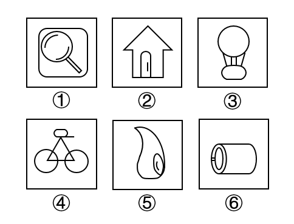

- **A**. ①②③；④⑤⑥
- **B**. ①②④；③⑤⑥
- **C**. ①②⑤；③④⑥　✅
- **D**. ①⑤⑥；②③④

**答案**：C

**官方解析**

本题为分组分类题目。元素组成不同，且无明显属性规律，考虑数量规律。观察发现，图①、图②均为生活化图形，可以考虑部分数。其中，图①②⑤均由多部分组成，图③④⑥均由一部分组成。因此，图①②⑤为一组、图③④⑥为一组。
注：分组分类题目中一组为一部分、一组为多部分的规律并不严谨，但此题出现明显生活化图形，无其他明显规律，且在以往的考试中确有出现过在考查部分数的知识点时，分为一部分与多部分两组的情况，故此题粉笔倾向于根据部分数进行分组分类。
故正确答案为C。

---

## 第 2 题　qid 2578104 · 图形推理

从所给四个选项中，选择最合适的一项填入问号处，使之呈现一定的规律性。

- **A**. A
- **B**. B　✅
- **C**. C
- **D**. D

**答案**：B

**官方解析**

本题为九宫格题。元素组成相同，优先考虑位置规律。九宫格优先看横行，第一行图1旋转得到图2，图2左右翻转得到图3，第二行验证符合此规律。第三行应用此规律，图1旋转得到图2，故？处图形由图2左右翻转得到，只有B项符合。

故正确答案为B。

---

## 第 3 题　qid 2578111 · 图形推理

从所给四个选项中，选择最合适的一项填入问号处，使之呈现一定的规律性。

- **A**. A
- **B**. B　✅
- **C**. C
- **D**. D

**答案**：B

**官方解析**

元素组成不同，且无明显属性规律，优先考虑数量规律。题干由若干小元素构成，考虑素的数量，其中白元素的个数分别为：1、2、3、5、？，没有明显的规律，再次观察发现存在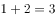、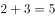的运算规律，？处应该为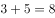，排除A、C两项；黑元素的个数分别为：2、0、2、2、？，同样存在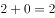、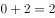的运算规律，？处应该为，对应B项。

故正确答案为B。

---

## 第 4 题　qid 2578116 · 图形推理

左图为某一零件的立体图形，右边哪一项不属于该立体图形的截面图？

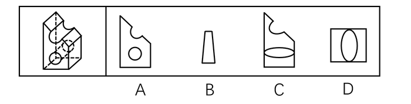

- **A**. A
- **B**. B
- **C**. C　✅
- **D**. D

**答案**：C

**官方解析**

本题考查截面图，逐一分析选项。

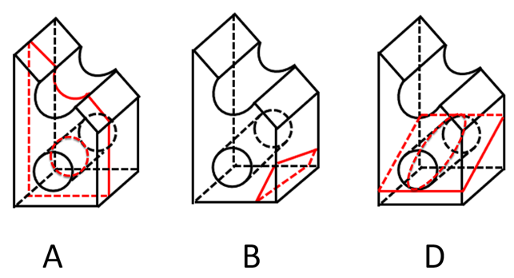

A项：如上图所示，沿着立体图形，从上到下竖直方向进行切割，可以切出，排除；

B项：如上图所示，沿着立体图形，从前到后斜着进行切割，可以切出，排除；

C项：该项的缺口处不是正圆，而题干缺口处是正圆，因此缺口只能斜着切出来，但按照这样的方向切，无法得到下方椭圆跟外框相接的图形，无法切出，当选；

D项：如上图所示，沿着立体图形，圆柱前面的底端斜切至圆柱后面的顶端，可以切出，排除。

本题为选非题，故正确答案为C。

---

## 第 5 题　qid 2578125 · 图形推理

从所给四个选项中，选择最合适的一项填入问号处，使之呈现一定的规律性。

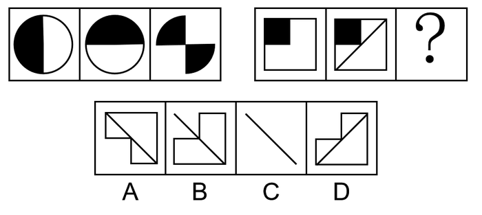

- **A**. A
- **B**. B
- **C**. C　✅
- **D**. D

**答案**：C

**官方解析**

元素组成相似，相同线条重复出现，优先考虑加减同异。第一组图图1和图2求异，相同部分去掉，不同部分保留，再顺时针或者逆时针旋转得到图3；第二组图应用此规律，图一图二求异只剩下一条斜对角线，再旋转，C项为前两图求异后顺时针或者逆时针旋转，只有C项符合。

故正确答案为C。

---

## 第 6 题　qid 2578064 · 定义判断

在高大建筑物顶端安装一根金属棒，并用金属线与埋在地下的金属板连接起来，通过金属棒尖端放电，让云层所带的电和地上的电逐渐中和，以保护建筑物免遭雷击。这种做法应用于管理界时被称为避雷针效应，指事先疏导，防患于未然，引领事态积极发展，即善疏则通，能导必安的管理方法。
根据上述定义，下列做法与避雷针效应无关的是：

- **A**. 某市推行“全民参与精准找茬”工作破解城市治理盲区漏点，市民怨气少了满意多了
- **B**. 某小区改建车库，物业方广泛地征求了业主的意见，并形成共识，使该工程顺利推进
- **C**. 某地实行“有事好商量”协商议事工作法，解决大量群众关心的事，化解了社会矛盾
- **D**. 某公司将召开员工发展问题研讨会，要求部门主管会前要调查掌握员工发展需求　✅

**答案**：D

**官方解析**

第一步：找出定义关键词。
“事先疏导，防患于未然”、“引领事态积极发展”。
第二步：逐一分析选项。
A项：推行“全民参与精准找茬”工作，可以让市民指出城市潜在的治理问题，符合“事先疏导，防患于未然”，市民怨气少了满意多了，反映出该工作的积极效果，也符合“引领事态积极发展”，符合定义，排除；
B项：物业方在改建车库前广泛地征求了业主的意见，符合“事先疏导，防患于未然”，征求之后，双方达成了共识，使该工程得以顺利推进，也符合“引领事态积极发展”，符合定义，排除；
C项：“有事好商量”协商议事工作法可以起到协调商讨的作用，减少群众冲突的发生，符合“事先疏导，防患于未然”，这种工作法解决了大量群众关心的事，化解了社会矛盾，也符合“引领事态积极发展”，符合定义，排除；
D项：公司将召开员工发展问题研讨会，要求部门主管会前要调查掌握员工发展需求，符合“事先疏导，防患于未然”，但并未提及员工是否会有好的发展，不符合“引领事态积极发展”，不符合定义，当选。
本题为选非题，故正确答案为D。

---

## 第 7 题　qid 2578068 · 定义判断

闯入性思维是指一些非自主的、反复出现的、无规律的进入个体大脑的干扰性想法，会造成一系列适应问题并诱发负面情绪，包括焦虑、抑郁和强迫症等。
根据上述定义，下列属于闯入性思维的是：

- **A**. 每到年底，在外地工作的小孟都要为回不回老家过年而纠结，并因此而情绪烦躁
- **B**. 这段时期股市波动较大，股民老张的心情也像股票指数一样起伏难料，焦虑至极
- **C**. 小强在上课的时候，头脑中总是出现网络游戏的画面，这让他很难静下心来学习　✅
- **D**. 一想到完不成销售任务所带来的负面后果，小程都感到一阵阵的沮丧

**答案**：C

**官方解析**

第一步：找出定义关键词。
“非自主的、反复出现的、无规律的”、“干扰性想法”、“造成一系列适应问题”。
第二步：逐一分析选项。
A项：小孟为回不回老家过年而纠结，是小孟自主的想法，不符合“非自主的、反复出现的、无规律的”、“干扰性想法”，不符合定义，排除；
B项：股民老张的心情像股票指数一样起伏难料，但心情不是“想法”，不符合“非自主的、反复出现的、无规律的”、“干扰性想法”，不符合定义，排除；
C项：小强在上课时头脑中总是出现网络游戏的画面，符合“非自主的、反复出现的、无规律的”，这让他很难静下心来学习，符合“干扰性想法”、“造成一系列适应问题”，符合定义，当选；
D项：一想到完不成销售任务所带来的负面后果，是小程自主的想法，不符合“非自主的、反复出现的、无规律的”、“干扰性想法”，不符合定义，排除。
故正确答案为C。

---

## 第 8 题　qid 2578077 · 定义判断

社交焦虑障碍，是指个体在可能受到他人审视的一种或多种社交环境中存在持久的强烈恐惧和回避行为。
根据上述定义，下列属于社交焦虑障碍的是：

- **A**. 尽管已经获得了公务员招录面试资格，但考虑到排名靠后再加上自己一贯不善于表达，陈某决定放弃这次机会
- **B**. 随着演讲比赛日期的临近，王刚的焦虑和压力也与日俱增，最后他干脆放弃了　✅
- **C**. 小杨一想到下周要当众发言，紧张得一连几天都睡不好觉
- **D**. 大强因为担心被父母催婚，今年春节决定不回家过年

**答案**：B

**官方解析**

第一步：找出定义关键词。
“个体”、“可能受到他人审视的一种或多种社交环境中”、“持久的强烈恐惧”、“回避”。
第二步：逐一分析选项。
A项：陈某，符合“个体”，考虑到排名靠后和不善表达而放弃机会，不符合“持久的强烈恐惧”，不符合定义，排除；
B项：王刚，符合“个体”，演讲比赛临近，符合“可能受到他人审视的一种或多种社交环境中”，他的焦虑压力与日俱增，符合“持久的强烈恐惧”，最后放弃，符合“回避”，符合定义，当选；
C项：小杨，符合“个体”，想到下周要当众发言，符合“可能受到他人审视的一种或多种社交环境中”，紧张得一连几天睡不好觉，符合“持久的强烈恐惧”，但不符合“回避”，不符合定义，排除；
D项：大强，符合“个体”，被父母催婚，不符合“可能受到他人审视的一种或多种社交环境中”，不符合定义，排除。
故正确答案为B。

---

## 第 9 题　qid 2578084 · 定义判断

员工绿色行为是指组织中员工展现的一系列旨在保护生态环境，降低个人活动对自然环境造成负面影响的行为，这些行为是组织正式绿色管理计划的重要补充，能提高组织绿色管理措施的效率，最终有利于环境的可持续发展。
根据上述定义，下列属于员工绿色行为的是：

- **A**. 公司员工自觉遵守公司关于垃圾分类的规定
- **B**. 部门经理经常利用废纸打印一些非正式文件　✅
- **C**. 办公室的一位女员工宁愿忍受高温也不愿开冷气，她认为这样更健康
- **D**. 公司保洁员经常把垃圾箱内的废塑料瓶收集起来，下班时顺便带回家

**答案**：B

**官方解析**

第一步：找出定义关键词。
“组织中员工展现的一系列旨在保护生态环境，降低个人活动对自然环境造成负面影响”、“组织正式绿色管理计划的重要补充”、“提高组织绿色管理措施的效率，最终有利于环境的可持续发展”。
第二步：逐一分析选项。
A项：公司员工自觉遵守公司关于垃圾分类的规定，说明是公司规定的，不是员工自愿的，不符合“组织中员工展现的一系列旨在保护生态环境，降低个人活动对自然环境造成负面影响”，不符合定义，排除；
B项：部门经理用废纸打印非正式文件，符合“组织中员工展现的一系列旨在保护生态环境，降低个人活动对自然环境造成负面影响”，也符合“组织正式绿色管理计划的重要补充”、“提高组织绿色管理措施的效率，最终有利于环境的可持续发展”，符合定义，当选；
C项：办公室的女员工不开冷气，认为这样更健康，是为了自己身体健康并不是为了环保，不符合“组织中员工展现的一系列旨在保护生态环境，降低个人活动对自然环境造成负面影响”，不符合定义，排除；
D项：公司保洁员把垃圾箱的废塑料瓶收集起来带回家，只是带回了家并不是为了环保，不符合“组织中员工展现的一系列旨在保护生态环境，降低个人活动对自然环境造成负面影响”，不符合定义，排除。
故正确答案为B。

---

## 第 10 题　qid 2578061 · 定义判断

类别化是指个体对自身或他人在社会中所处位置的感知和判断，这种感知和判断不仅基于现实社会中社会体制的不同分类标准，也基于自身与他人的社会比较过程。类别化分为社会类别化和自我类别化。社会类别化是个体基于共享的相似性把他人分为不同群体类别的主观心理过程。自我类别化指个体从独立个体到群体成员的过程是通过类别化而得以实现的，是通过“去个性化”实现对群体的归属和成员身份的定位。
根据上述定义，下列属于自我类别化的是：

- **A**. 只要每个人的素质提高了，我们整个国民的素质也就自然提高了，因此，重要的是首先做好自己
- **B**. 小明打算应聘公司某职位，但他的父母却认为他更适合做公务员
- **C**. 同学们都说小倩长得像明星，做主播肯定有前途
- **D**. 王医生常常为自己所从事的职业感到无比自豪　✅

**答案**：D

**官方解析**

第一步：找出定义关键词。
类别化：“个体对自身或他人在社会中所处位置的感知和判断”、“基于现实”、“也基于自身与他人的社会比较”；
社会类别化：“个体基于共享的相似性”、“把他人分为不同群体类别”；
自我类别化：“个体从独立个体到群体成员”、“实现对群体的归属和成员身份的定位”。
第二步：逐一分析选项。
A项：强调做好自己的重要性，并不涉及“个体对自身或他人在社会中所处位置的感知和判断”，不符合题干中任何一个定义，排除；
B项：父母认为小明适合做公务员，符合“个体基于共享的相似性”、“把他人分为不同群体类别”，符合“社会类别化”定义，不符合“自我类别化”定义，排除；
C项：同学们觉得小倩长得像明星，做主播有前途，符合“个体基于共享的相似性”、“把他人分为不同群体类别”，符合“社会类别化”定义，不符合“自我类别化”定义，排除；
D项：王医生为自己所从事的职业感到自豪，符合“个体从独立个体到群体成员”、“实现对群体的归属和成员身份的定位”，符合“自我类别化”定义，当选。
故正确答案为D。

---

## 第 11 题　qid 2578072 · 定义判断

分割谬误是指基于整体拥有某性质，而推论其中的部分或全部个体也都具备该性质。
根据上述定义，下列属于分割谬误的是：

- **A**. 本案被告很有钱，因为他出门都开豪华跑车
- **B**. 这座城市到处都有抢劫案，我光是在《城市晚报》就读到三起
- **C**. 这个足球队是本赛季最强的足球队，毫无疑问该球队的守门员也是最强的　✅
- **D**. 这个交响乐团中的每一位乐师都非常出色，所以这支交响乐团非常出色

**答案**：C

**官方解析**

第一步：找出定义关键词。
“整体拥有某性质，而推论其中的部分或全部个体也都具备该性质”。
第二步：逐一分析选项。
A项：因为出门开豪华跑车，推出被告很有钱，不符合“整体拥有某性质，而推论其中的部分或全部个体也都具备该性质”，不符合定义，排除； 
B项：从报纸读到三起抢劫案，推出城市到处都有抢劫案，不符合“整体拥有某性质，而推论其中的部分或全部个体也都具备该性质”，不符合定义，排除；
C项：从足球队最强，推出球队守门员最强，符合“整体拥有某性质，而推论其中的部分或全部个体也都具备该性质”，符合定义，当选；
D项：交响乐团的每一位乐师都出色，推出交响乐团出色，不符合“整体拥有某性质，而推论其中的部分或全部个体也都具备该性质”，不符合定义，排除。
故正确答案为C。

---

## 第 12 题　qid 2578075 · 定义判断

反生产力工作行为是指员工应对通常工作压力情境以及缓解其负面情绪体验，有意从事对组织或其成员有所损害的冲动性适应行为，并对组织具有广泛的不利影响。
根据上述定义，下列属于反生产力工作行为的是：

- **A**. 过高的物价使得民众难以承受，纷纷聚集到市政厅进行抗议
- **B**. 新部门工作节奏较快，小孙因工作压力过大只好请假不去上班
- **C**. 为反对公司要求每天工作14小时的规定，很多员工开始磨洋工
- **D**. 小李被领导批评后很不服气，偷偷将单位机密散布到网上，给单位带来了巨大损失　✅

**答案**：D

**官方解析**

第一步：找出定义关键词。
“员工”、“应对通常工作压力情境以及缓解其负面情绪体验”、“有意从事对组织或其成员有所损害的冲动性适应行为”、“对组织具有广泛的不利影响”。
第二步：逐一分析选项。
A项：过高的物价使得民众难以承受，民众不符合“员工”，不符合定义，排除；
B项：小孙因工作压力过大只好请假不去上班，不符合“有意从事对组织或其成员有所损害的冲动性适应行为”，不符合定义，排除；
C项：为反对公司每天工作14小时的规定，很多员工开始磨洋工，不符合“有意从事对组织或其成员有所损害的冲动性适应行为”，不符合定义，排除；
D项：小李由于被领导批评不服气，偷偷将单位机密散布到网上，符合“员工有意从事对组织或其成员有所损害的冲动性适应行为”，给单位带来了巨大损失，符合“对组织具有广泛的不利影响”，符合定义，当选。
故正确答案为D。

---

## 第 13 题　qid 2578082 · 定义判断

越轨创新是指组织在鼓励员工创新的同时，为防止过度自主而偏离组织发展轨道，设置相应的规章制度来约束其创新想法与行为，而一些员工在其创新方案被否决后，仍坚信其创新方案最终会为组织带来收益，并继续隐蔽地进行创新实践的行为。
根据上述定义，下列属于越轨创新的是：

- **A**. 服装设计师小王为公司设计了一系列新型饰品，因与公司发展定位不符被否定后，他仍在继续悄悄改进　✅
- **B**. 某高校保安经常到课堂蹭课学外语，队长提醒他这不符合制度规范，他就趁空闲时间偷偷继续过去旁听
- **C**. 因担心影响本职工作，经理反对小刘参加公司举办的创新技能大赛，但小刘仍私下准备着
- **D**. 程序员小张利用上班时间悄悄为朋友设计一款APP软件

**答案**：A

**官方解析**

第一步：找出定义关键词。
“组织鼓励员工创新”、“为防止过度自主而偏离组织发展轨道，设置相应的规章制度来约束其创新想法与行为”、“一些员工在其创新方案被否决后，仍坚信其创新方案最终会为组织带来收益，并继续隐蔽地进行创新实践的行为”。
第二步：逐一分析选项。
A项：小王为公司设计新型饰品，因与公司发展定位不符被否定后，他仍在继续悄悄改进，符合“为防止过度自主而偏离组织发展轨道，设置相应的规章制度来约束其创新想法与行为”，也符合“一些员工在其创新方案被否决后，仍坚信其创新方案最终会为组织带来收益，并继续隐蔽地进行创新实践的行为”，符合定义，当选；
B项：保安去课堂蹭课，队长提醒他不符合制度规范，不符合“组织鼓励员工创新”，不符合定义，排除；
C项：经理因担心影响本职工作反对小刘参加创新比赛，只是反对，不符合“为防止过度自主而偏离组织发展轨道，设置相应的规章制度来约束其创新想法与行为”，不符合定义，排除；
D项：小张利用上班时间悄悄为朋友设计APP软件，不符合“坚信其创新方案最终会为组织带来收益”，不符合定义，排除。
故正确答案为A。

---

## 第 14 题　qid 2578071 · 定义判断

辟谣有时会使受众将谣言错记为“事实”，其中原因之一是受众遗忘了谣言的反驳信息，即事实幻觉效应。为了避免这一认知错觉，可以采用“反驳改述谣言”的方法，即辟谣者可以将谣言改述为否定句式，再进行反驳。
根据上述定义，下列属于“反驳改述谣言”的是：

- **A**. 食用野兔等野生动物安全，这不是谣言
- **B**. 即便少量饮酒也不利于健康，这是谣言　✅
- **C**. 有节制的吸烟不易致癌，这不是谣言
- **D**. 药品X是危险的，这是谣言

**答案**：B

**官方解析**

第一步：找出定义关键词。
“将谣言改述为否定句式”、“再进行反驳”。
第二步：逐一分析选项。
A项：食用野兔等野生动物安全，不符合“将谣言改述为否定句式”，且“这不是谣言”也不符合“再进行反驳”，不符合定义，排除； 
B项：少量饮酒也不利于健康，符合“将谣言改述为否定句式”，且“这是谣言”符合“再进行反驳”，符合定义，当选；
C项：有节制的吸烟不易致癌，符合“将谣言改述为否定句式”，但“这不是谣言”不符合“再进行反驳”，不符合定义，排除； 
D项：药品X是危险的，不符合“将谣言改述为否定句式”，不符合定义，排除。
故正确答案为B。

---

## 第 15 题　qid 2578079 · 定义判断

一项新研究显示，中国的消费升级正在延续。所谓消费升级是指消费者对更能满足自己美好物质和精神生活需要的、价格更高的优质商品和服务日益增长的需求。
根据上述定义，下列最能体现消费升级的是：

- **A**. 
现在收入多了，生活水平高了，人们不再满足于吃饱穿暖，而是想要提高消费档次

- **B**. 
某机构研究发现，中国家庭2019年在生活消费品方面的开支预计相较去年增长

- **C**. 
中国人对包装食品、饮料、护肤品、洗发水和处方药等快速消费品的消费呈增长趋势

- **D**. 
越来越多中国人付出更多成本，去享受健康、快乐、体验好且富有内涵的高端商品和服务
　✅

**答案**：D

**官方解析**

第一步：找出定义关键词。

“消费者”、“更能满足自己美好物质和精神生活需要的、价格更高的优质商品和服务”、“日益增长的需求”。

第二步：逐一分析选项。

A项：现在收入多了，人们想要提高消费档次，但并不清楚档次提高后的消费是否属于价格更高的优质商品和服务，不符合“更能满足自己美好物质和精神生活需要的、价格更高的优质商品和服务”，不符合定义，排除；

B项：中国家庭2019年在生活消费品方面的开支预计相较去年增长，生活消费品的开支虽然增长了，但是不清楚这些生活消费品是否是价格更高的优质商品和服务，不符合“更能满足自己美好物质和精神生活需要的、价格更高的优质商品和服务”，不符合定义，排除；

C项：中国人对快速消费品的消费呈增长趋势，但是不清楚这些增长的快速消费品是否是价格更高的优质的商品和服务，不符合“更能满足自己美好物质和精神生活需要的、价格更高的优质商品和服务”，不符合定义，排除；

D项：越来越多的中国人付出更多成本，去享受健康、快乐、体验好且富有内涵的高端商品和服务，符合“更能满足自己美好物质和精神生活需要的、价格更高的优质商品和服务”，越来越多的中国人付出成本，也符合“日益增长的需求”，符合定义，当选。

故正确答案为D。

---

## 第 16 题　qid 2578088 · 类比推理

固根基：扬优势：补短板

- **A**. 清谈客：奋斗者：泥菩萨
- **B**. 勤思考：爱劳动：学习好
- **C**. 涉险滩：破坚冰：攻堡垒　✅
- **D**. 有政治：有形象：有人格

**答案**：C

**官方解析**

第一步：判断题干词语间逻辑关系。
固根基、扬优势和补短板三者均为动宾结构。
第二步：判断选项词语间逻辑关系。
A项：清谈客指纸上谈兵的人，奋斗者指奋斗的人，泥菩萨比喻虚弱不中用的人，三者均不是动宾结构，与题干逻辑关系不一致，排除；
B项：勤思考为偏正结构，爱劳动为动宾结构，学习好为主谓结构，与题干逻辑关系不一致，排除；
C项：涉险滩、破坚冰和攻堡垒三者均为动宾结构，与题干逻辑关系一致，保留；
D项：有政治、有形象、有人格三者均为动宾结构，与题干逻辑关系一致，保留。
对比C、D两项，题干和C项的动宾结构是根据不同的宾语搭配不同的动词，三个动词均不相同，而D项均为同一个动词，故C项与题干更一致，当选。
故正确答案为C。

---

## 第 17 题　qid 2578091 · 类比推理

大豆：豆油：压榨

- **A**. 茶叶：茶水：冲泡　✅
- **B**. 水泥：房屋：建造
- **C**. 布料：成衣：缝制
- **D**. 太阳：阳光：辐射

**答案**：A

**官方解析**

第一步：判断题干词语间逻辑关系。
大豆经过压榨得到豆油，三者为原材料、成品和工艺的对应关系，并且豆油是通过提取大豆中的成分得到的成品。
第二步：判断选项词语间逻辑关系。
A项：茶叶经过冲泡得到茶水，三者为原材料、成品和工艺的对应关系，并且茶水是通过提取茶叶中的成分得到的成品，与题干逻辑关系一致，当选；
B项：水泥经过建造得到房屋，三者为原材料、成品和工艺的对应关系，但房屋不是通过提取水泥中的成分得到的成品，与题干逻辑关系不一致，排除；
C项：布料经过缝制得到成衣，三者为原材料、成品和工艺的对应关系，但成衣不是通过提取布料中的成分得到的成品，与题干逻辑关系不一致，排除；
D项：太阳以辐射的方式产生阳光，三者不是原材料、成品和工艺的对应关系，与题干逻辑关系不一致，排除。
故正确答案为A。

---

## 第 18 题　qid 2578067 · 类比推理

青年人：公务员：服务人民

- **A**. 当代史：革命史：史海耕耘
- **B**. 下农村：进工厂：劳动锻炼
- **C**. 创业者：劳动者：市场打拼
- **D**. 大学生：志愿者：奉献社会　✅

**答案**：D

**官方解析**

第一步：判断题干词语间逻辑关系。
有的青年人是公务员，有的公务员是青年人，有的青年人不是公务员，有的公务员不是青年人，二者是交叉关系，“公务员”的宗旨是“服务人民”，二者是对应关系。
第二步：判断选项词语间逻辑关系。
A项：世界当代史为1945年-至今，中国当代史为1949年-至今，而革命史指二战结束前（1945年）一些具有历史意义革命的历史，当代史与革命史时间范围上不存在交叉，因此二者不属于交叉关系，与题干逻辑关系不一致，排除；
B项：“下农村”和“进工厂”是两种不同的“劳动锻炼”方式，二者是并列关系，与题干逻辑关系不一致，排除；
C项：“创业者”是主导劳动方式的领导人，“劳动者”是对从事劳作活动的一类人的统称，“创业者”是“劳动者”，二者是种属关系，与题干逻辑关系不一致，排除；
D项：有的大学生是志愿者，有的志愿者是大学生，有的大学生不是志愿者，有的志愿者不是大学生，二者是交叉关系，“志愿者”的宗旨是“奉献社会”，二者为对应关系，与题干逻辑关系一致，当选。
故正确答案为D。

---

## 第 19 题　qid 2578069 · 类比推理

有备：无患

- **A**. 有口：无心
- **B**. 前赴：后继
- **C**. 苦尽：甘来　✅
- **D**. 有眼：无珠

**答案**：C

**官方解析**

第一步：判断题干词语间逻辑关系。
“有备无患”意思是事先有准备，就可以避免祸患，因为“有备”，所以“无患”，二者是因果对应关系，且“无患”是好的结果。
第二步：判断选项词语间逻辑关系。
A项：“有口无心”意思是嘴上说了，心里可没那样想，二者为并列关系，与题干逻辑关系不一致，排除；
B项：“前赴后继”意思是前面的上去了，后面的紧跟上来，二者为并列关系，与题干逻辑关系不一致，排除；
C项：“苦尽甘来”意思是艰苦的日子过完，美好的日子来到了，因为“苦尽”，所以“甘来”，二者是因果对应关系，且“甘来”是好的结果，与题干逻辑关系一致，当选；
D项：“有眼无珠”用来责骂人瞎了眼，看不见某人或某事物的伟大或重要，二者为并列关系，与题干逻辑关系不一致，排除。
故正确答案为C。

---

## 第 20 题　qid 2578073 · 类比推理

筚路蓝缕：艰辛

- **A**. 焦金流石：干燥
- **B**. 伏虎降龙：强大　✅
- **C**. 毕雨箕风：简陋
- **D**. 集萤映雪：夏夜

**答案**：B

**官方解析**

第一步：判断题干词语间逻辑关系。
“筚路蓝缕”意思是驾着简陋的柴车，穿着破烂的衣服去开辟山林道路，形容创业的艰苦，与“艰辛”是近义关系。
第二步：判断选项词语间逻辑关系。
A项：“焦金流石”意思是把金属烤焦，把石头晒化，形容极其炎热难耐，与“干燥”不是近义关系，与题干逻辑关系不一致，排除；
B项：“伏虎降龙”意思是用威力使猛虎和恶龙屈服，形容力量强大，能战胜一切敌人和困难，与“强大”是近义关系，与题干逻辑关系一致，当选；
C项：“毕雨箕风”原指民性如星，星好风雨，比喻庶民喜好人主的恩泽，后为颂扬统治者普施仁政之词，与“简陋”不是近义关系，与题干逻辑关系不一致，排除；
D项：“集萤映雪”意思是家境贫穷，勤学苦读，与“夏夜”不是近义关系，与题干逻辑关系不一致，排除。
故正确答案为B。

---

## 第 21 题　qid 2578105 · 类比推理

摇曳：晃动

- **A**. 自满：自谦
- **B**. 翻天覆地：一成不变
- **C**. 悲痛：欲绝
- **D**. 顺风转舵：见机行事　✅

**答案**：D

**官方解析**

第一步：判断题干词语间逻辑关系。
摇曳指摇荡；晃动指摇晃、摆动，二者为近义关系。
第二步：判断选项词语间逻辑关系。
A项：自满多指满足于自己已有的成绩而沾沾自喜的心理状态；自谦指的是自抱谦逊态度，二者为反义关系，与题干逻辑关系不一致，排除；
B项：翻天覆地形容变化大；一成不变指的是一经形成，不再改变，二者为反义关系，与题干逻辑关系不一致，排除；
C项：悲痛指悲伤哀痛；欲绝指感情极其强烈的，非常激动的，用来形容悲痛的程度，二者为对应关系，与题干逻辑关系不一致，排除；
D项：顺风转舵比喻顺着情势改变态度；见机行事指看具体情况灵活办事，二者为近义关系，与题干逻辑关系一致，当选。
故正确答案为D。

---

## 第 22 题　qid 2578117 · 类比推理

栉风：沐雨

- **A**. 门当：户对　✅
- **B**. 东山：再起
- **C**. 万里：长城
- **D**. 助人：为乐

**答案**：A

**官方解析**

第一步：判断题干词语间逻辑关系。
“栉风”指的是以风梳头，“沐雨”指的是以雨洗发，二者为并列关系。
第二步：判断选项词语间逻辑关系。
A项：“门当”与“户对”是古民居建筑中大门的组成部分，古人结婚讲究二者要对等，二者为并列关系，与题干逻辑关系一致，当选；
B项：“东山”是名词，“再起”是一个动作，二者不是并列关系，与题干逻辑关系不一致，排除；
C项：“万里”是修饰“长城”的，二者为偏正关系，与题干逻辑关系不一致，排除；
D项：“助人”指的是帮助他人，“为乐”指当作快乐，二者为主谓关系，与题干逻辑关系不一致，排除。
故正确答案为A。

---

## 第 23 题　qid 2578121 · 类比推理

和衷共济：和合共生

- **A**. 如临深渊：如履薄冰　✅
- **B**. 或为玉碎：或为瓦全
- **C**. 不入虎穴：焉得虎子
- **D**. 锲而不舍：金石可镂

**答案**：A

**官方解析**

第一步：判断题干词语间逻辑关系。
和衷共济指团结互助，战胜困难；和合共生指相互协助，共同发展，二者为近义关系。
第二步：判断选项词语间逻辑关系。
A项：如临深渊指如同处于深渊边缘一般，比喻存有戒心，行事极为谨慎；如履薄冰指像走在薄冰上一样，比喻行事极为谨慎，存有戒心，二者为近义关系，与题干逻辑关系一致，当选；
B项：或为玉碎指或者玉器被打碎；或为瓦全指或者瓦器被保全，二者无近义关系，与题干逻辑关系不一致，排除；
C项：不入虎穴指不进入老虎的巢穴；焉得虎子指怎么能捉到小老虎，二者无近义关系，与题干逻辑关系不一致，排除；
D项：锲而不舍指不停地雕刻；金石可镂指金属、玉石也可以雕出花饰，二者无近义关系，与题干逻辑关系不一致，排除。
故正确答案为A。

---

## 第 24 题　qid 2578123 · 类比推理

护士：输液

- **A**. 策划：文案
- **B**. 园丁：教师
- **C**. 主持人：晚会
- **D**. 钢琴家：演奏　✅

**答案**：D

**官方解析**

第一步：判断题干词语间逻辑关系。
输液为护士的工作内容，二者为职业和工作内容的对应关系。
第二步：判断选项词语间逻辑关系。
A项：策划文案为动宾结构，与题干逻辑关系不一致，排除；
B项：园丁指专门从事园艺的劳动者，可以将教师比作园丁，二者为比喻象征义，与题干逻辑关系不一致，排除；
C项：主持人的工作内容为主持，而不是晚会，与题干逻辑关系不一致，排除；
D项：演奏为钢琴家的工作内容，二者为职业和工作内容的对应关系，与题干逻辑关系一致，当选。
故正确答案为D。

---

## 第 25 题　qid 2578135 · 类比推理

和谐 对于 （    ） 相当于 谦虚 对于 （    ）

- **A**. 强硬蛮横；安分守己
- **B**. 融洽无间；夜郎自大
- **C**. 波澜不惊；虚怀若谷
- **D**. 动荡不安；趾高气扬　✅

**答案**：D

**官方解析**

逐一代入选项。
A项：强硬蛮横是指骄横跋扈的人，与和谐没有语义关系；安分守己是指规矩本分的人，与谦虚没有语义关系，前后逻辑关系不一致，排除；
B项：融洽无间是指没有隔阂，相处和谐，与和谐是近义关系；夜郎自大比喻骄傲无知的肤浅自负或自大行为，与谦虚是反义关系，前后逻辑关系不一致，排除；
C项：波澜不惊是指没有什么变化或曲折，与和谐没有语义关系；虚怀若谷是指十分谦虚，能容纳别人的意见，与谦虚是近义关系，前后逻辑关系不一致，排除；
D项：动荡不安是指局势不稳定、不平静，与和谐是反义关系；趾高气扬是指骄傲自满，得意忘形的样子，与谦虚是反义关系，前后逻辑关系一致，当选。
故正确答案为D。

---

## 第 26 题　qid 2578119 · 逻辑判断

人们常说“要想身体好，天天吃核桃”，多年经验浓缩成的俗话一定有它的道理，最近，有研究证实，多吃核桃的确有益肠道健康，可增加大量的有益肠道细菌，因此对人类心脏有好处。
上述论证若要成立，必须增加的前提是：

- **A**. 充满益生菌的肠道，可以长时间地保护人类心脏健康　✅
- **B**. 核桃可以增加肠道益生菌，从而降低患高血压的风险
- **C**. 每天食用核桃可以帮助中老年人降低血压和胆固醇
- **D**. 核桃还对糖尿病人的血糖控制有一定的帮助

**答案**：A

**官方解析**

第一步：找出论点和论据。
论点：多吃核桃对人类心脏有好处。
论据：最近有研究证实，多吃核桃的确有益肠道健康，可增加大量的有益肠道细菌。
提问中问到“前提”，且论点和论据话题不一致，论点说的是“心脏”，论据说的是“肠道细菌”，考虑在两者之间搭桥进行加强。
第二步：逐一分析选项。
A项：充满益生菌的肠道可长时间地保护人类心脏健康，在“有益肠道细菌”和“心脏健康”之间建立了联系，属于搭桥，可以加强，当选；
B项：肠道益生菌降低患高血压风险，高血压与论点中的“对人类心脏有好处”没有关系，话题不一致，无法加强，排除；
C项：食用核桃降低血压和胆固醇，高血压、胆固醇与论点中的“对人类心脏有好处”没有关系，话题不一致，无法加强，排除；
D项：核桃有利于控制糖尿病人血糖，血糖与论点中的“对人类心脏有好处”没有关系，话题不一致，无法加强，排除。
故正确答案为A。

---

## 第 27 题　qid 2578124 · 逻辑判断

近年来，伴随着信息技术的发展和传播形态的演变，出现了一种“深度造假”新现象，这一现象是指经过处理的视频，或者通过人工智能技术生成的其他数字内容，它们会产生看似真实的虚假图像和声音。2019年初，某国际知名人工智能杂志的一篇文章提到：人工智能基金会筹集了1000万美元，开发了一套系统工具，能够通过人工审核或机器学习来识别诸如深度造假之类的欺骗性恶意内容。这篇文章还介绍了一家总部位于荷兰的科技初创公司努力将对抗性机器学习“作为探测深度造假的主要工具”。
由此可以推出：

- **A**. “深度造假”的技术往往是领先于最新的检测技术的
- **B**. 我们依靠技术进步才能解决“深度造假”带来的挑战
- **C**. 人类无法像人工智能那样能识别出“深度造假”现象
- **D**. 强大的人工智能技术可以用来检测虚假或欺骗性内容　✅

**答案**：D

**官方解析**

日常结论题，根据题干信息逐一分析选项。
A项：题干中指出“开发了一套系统工具，能够通过人工审核或机器学习来识别诸如深度造假之类的欺骗性恶意内容”，选项中是“深度造假”的技术领先于最新的检测技术，题干中并未对“深度造假”技术和检测技术进行比较，无法判断谁更领先，无法推出，排除；
B项：题干中指出开发的工具可以识别和探测深度造假，只是说明针对“深度造假”现象，技术进步可以解决，但没有提及我们是否只能依靠技术进步才能解决“深度造假”现象，逻辑错误，排除；
C项：题干中指出“开发了一套系统工具，能够通过人工审核或机器学习来识别诸如深度造假之类的欺骗性恶意内容”，选项中是人类无法像人工智能那样能识别出“深度造假”现象，题干中并未对人类和人工智能的识别水平进行比较，无法推出，排除；
D项：根据最后一句可知，机器学习可作为识别和探测深度造假的主要工具，机器学习属于人工智能技术，可以推出人工智能技术能用来检测虚假或欺骗性内容，该项属于最后一句的同义替换，可以推出，当选。
故正确答案为D。

---

## 第 28 题　qid 2578130 · 逻辑判断

2006年，国际天文学联合会(IAU)对太阳系大行星进行了重新定义，结果导致冥王星被排除出太阳系“九大行星”。最近有天文学家指出，由于冥王星运行在太阳系中天体密集的一个特殊区域——柯伊伯带，并且被证明是太阳系中第二复杂、最有趣、比火星更具活力的一颗天体，因此冥王星就是太阳系的第九大行星。
以下各项如果为真，最能质疑上述天文学家结论的是:

- **A**. 冥王星位于太阳系的外圈，非常黯淡，其个头甚至比月球还要小
- **B**. 冥王星轨道周边还有其他天体，就连其卫星都有它自身一半大小
- **C**. 太阳系其他八大行星围绕太阳运行的轨道基本都在同一个平面上
- **D**. 太阳系大行星必须有的特点之一是清理了轨道周边的其他天体　✅

**答案**：D

**官方解析**

第一步：找出论点和论据。
论点：冥王星就是太阳系的第九大行星。
论据：由于冥王星运行在太阳系中天体密集的一个特殊区域——柯伊伯带，并且被证明是太阳系中第二复杂、最有趣、比火星更具活力的一颗天体。
论点讨论的是“冥王星”与“第九大行星”的关系，论据讨论的是“冥王星”与“天体密集区域”的关系，二者话题不一致，削弱优先考虑拆桥。
第二步：逐一分析选项。
A项：论点说的是冥王星是太阳系的第九大行星，该项说的是冥王星个头的大小，无法削弱，排除；
B项：论点说的是冥王星是太阳系的第九大行星，该项说的是冥王星周围卫星大小的情况，话题不一致，无法削弱，排除；
C项：论点说的是冥王星是太阳系的第九大行星，该项说的是太阳系其他八大行星的运行情况，话题不一致，无法削弱，排除；
D项：该项指出太阳系大行星必须有的特点之一是清理了轨道周边的其他天体，但论据中指出冥王星运行在太阳系中天体密集的一个特殊区域，说明冥王星没有清理轨道周边的其他天体，不能满足太阳系大行星的必须特点，所以冥王星不能算作太阳系的第九大行星，切断了论据和论点之间的关系，拆桥项，可以削弱，当选。
故正确答案为D。

---

## 第 29 题　qid 2578149 · 逻辑判断

国外某公司从农户手中收购伪步行虫和蟋蟀等昆虫，把它们加工成粉末或油，再与其它食材混合，制成让人吃不出昆虫味道的美味食品。2019年该公司销售这种食品已实现百万美元盈利。联合国粮农组织肯定这家公司的做法，并指出食用昆虫，有利于应对世界性粮食供应紧缺和营养不良的问题。
上述论证若要成立，必须增加的前提是：

- **A**. 世界粮食供应紧张状况还将持续，开发昆虫等新食材，可有效应对食物需求增长
- **B**. 昆虫富含蛋白质、脂肪、补足维生素和铁的营养成分，是量大低成本的补充食材　✅
- **C**. 国外某权威研究机构称，在本世纪，食用昆虫有利于人口增长和蛋白质消费增加
- **D**. 亚洲、非洲一些缺粮且人口营养不良的地区在大力发展昆虫养殖加工业

**答案**：B

**官方解析**

第一步：找出论点和论据。
论点：食用昆虫，有利于应对世界性粮食供应紧缺和营养不良的问题。
论据：把昆虫加工成粉末或油，再与其它食材混合，制成美味食品，销售这种食品已经实现百万美元盈利。
本题的论点和论据都围绕食用昆虫展开，论点和论据话题一致，提问为“前提”，优先考虑必要条件。
第二步：逐一分析选项。
A项：昆虫等新食材可以有效应对食物需求增长，说的是昆虫可以应对食物需求增长，是论证成立的前提，但没有涉及补充营养，比较片面，排除；
B项：如果昆虫营养价值不高，那么就无法应对营养不良问题，如果昆虫没有量大价低的优势，那么就无法应对世界性粮食供应紧缺问题，选项是论点成立的必要条件，是论证成立的前提，并且两个方面都有涉及，比A项更好，当选；
C项：国外某研究机构的观点主要指出本世纪食用昆虫有相关好处，但并不明确食用昆虫是否能应对世界性粮食供应紧缺等问题，不是论证成立的前提，排除；
D项：亚洲、非洲部分地区正在发展昆虫养殖加工业，但并不明确发展昆虫养殖加工业是否能应对世界性粮食供应紧缺等问题，不是论证成立的前提，排除。
故正确答案为B。

---

## 第 30 题　qid 2578155 · 逻辑判断

一项研究利用250多万份图像，训练人工智能算法分析脑癌。研究结果表明，计算机能在三分钟内诊断出常见癌症，而一名医学专家作出诊断大约需要30分钟。在一项278名脑瘤患者参与的临床试验中，研究人员发现，人工智能算法的诊断结果与病理学家的诊断相符——实际上更准确一些。一实验中，医生误诊17次，而人工智能仅误诊14次。由此，研究者得出结论：人工智能虽还不能取代医生，但可以发挥复查作用，确保诊断万无一失。
以下各项如果为真，最能支持研究人员上述结论的是：

- **A**. 人工智能全天候二十四小时无间歇工作的特质，可以有效缓解现阶段优秀医生极度紧缺的状况
- **B**. 培养一名医生至少需要十年以上的时间，但人工智能只要技术上实现一次突破，就可以被复制
- **C**. 病理学家误诊的病例，人工智能无一出错；同时人工智能误诊的病例，也被病理学家逐一纠正　✅
- **D**. 现阶段，病例诊疗软件已经用于医学院教学和培训青年医生，机器人完成的手术台数已经破万

**答案**：C

**官方解析**

第一步：找出论点和论据。
论点：人工智能虽还不能取代医生，但可以发挥复查作用，确保诊断万无一失。
论据：人工智能算法的诊断结果与病理学家的诊断相符——实际上更准确一些。一实验中，医生误诊17次，而人工智能仅误诊14次。
本题论点和论据都在说人工智能的诊断结果准确，话题一致，可以通过补充论据的方式进行加强，即解释原因或举例。
第二步：逐一分析选项。
A项：该项说的是人工智能可以缓解现阶段优秀医生极度紧缺的状况，选项未涉及人工智能能否起到“复查作用”，话题不一致，无法加强，排除；
B项：该项说的是人工智能技术上的突破可以被复制，选项未涉及人工智能能否起到“复查作用”，话题不一致，无法加强，排除；
C项：病理学家误诊的病例，人工智能无一出错；同时人工智能误诊的病例，也被病理学家逐一纠正，二者是相辅相成的，能够说明人工智能可以发挥“复查作用”、确保诊断准确，补充论据，当选；
D项：该项说的是人工智能已经用于医学教学等领域，选项未涉及人工智能能否起到“复查作用”，话题不一致，无法加强，排除。
故正确答案为C。

---

## 第 31 题　qid 2578163 · 逻辑判断

最新研究显示，常喝绿茶有益心血管。研究者对十万余名参与者进行了为期七年的跟踪研究。参与者被分成两组：有喝绿茶习惯者（即每周喝绿茶三次以上的人）和没有喝绿茶习惯者（即从不或每周喝绿茶次数不到三次的人）。研究者发现，与没有喝绿茶习惯者相比，有喝绿茶习惯者患心脏病和中风的风险低，死于心脏病和中风的风险低。

以下各项如果为真，最能支持上述结论的是：

- **A**. 
与常喝绿茶的人相比，从不吸烟者患心脏病和中风的风险低

- **B**. 
绿茶中含有的黄酮醇类，具有预防血液凝块及血小板成团的作用
　✅
- **C**. 
绿茶中的儿茶素和多种维他命成分，可有效延缓衰老、预防癌症

- **D**. 
习惯喝绿茶组的参与者其年龄普遍大于无喝绿茶习惯组的参与者

**答案**：B

**官方解析**

第一步：找出论点和论据。

论点：常喝绿茶有益心血管。

论据：研究者对十万余名参与者进行了为期七年的跟踪研究。参与者被分成两组：有喝绿茶习惯者（即每周喝绿茶三次以上的人）和没有喝绿茶习惯者（即从不或每周喝绿茶次数不到三次的人）。研究者发现，与没有喝绿茶习惯者相比，有喝绿茶习惯者患心脏病和中风的风险低，死于心脏病和中风的风险低。

本题论点说的是常喝绿茶有益心血管，论据是对比有喝绿茶习惯者和没有喝绿茶习惯者患心脏病和中风的风险及死于心脏病和中风的风险的数据结果。二者话题一致，加强优先考虑补充论据。

第二步：逐一分析选项。

A项：论点说的是常喝绿茶有益心血管，对比的是常喝绿茶和不常喝绿茶，该项是常喝绿茶的人与从不吸烟者相比，话题不一致，无法加强，排除；

B项：该项说的是绿茶中的黄酮醇类，具有预防血液凝块及血小板成团的作用，而中风等心血管疾病常见的原因之一是血液凝固成团，解释了为什么常喝绿茶有益心血管，补充论据，当选；

C项：绿茶中的儿茶素和多种维他命成分，可有效延缓衰老、预防癌症，并没有说明绿茶中的儿茶素和多种维他命成分对心血管的益处，话题不一致，无法加强，排除；

D项：习惯喝绿茶组的参与者其年龄普遍大于无喝绿茶习惯组的参与者，无法确定中风和心脏病的患病和死亡风险与年龄之间的关系，也无法确定两组参与者之间的具体年龄差距，属于不明确选项，无法加强，排除。

故正确答案为B。

---

## 第 32 题　qid 2578169 · 逻辑判断

科研人员发现，鸟蛋颜色与温度有极大关联。研究结果显示，在日照强度较低的地方，深色鸟蛋更常见；而在阳光强度更高、更暖和的区域，鸟蛋颜色普遍更浅。研究小组认为，更深颜色的壳意味着可以吸收更多热量，从而在更寒冷的环境中具有生存优势。因为蛋中胚胎需要稳定的环境温度，但其自身却不具备温度调节能力。
以下各项如果为真，最能支持上述结论的是：

- **A**. 将不同品种的鸡蛋放置在阳光中，颜色更深的鸡蛋比浅色鸡蛋升温更快，而且其蛋壳表面保持较高温度的时间更长　✅
- **B**. 大杜鹃将自己生的蛋寄宿在一百多种鸟的巢中，为了避免蛋被鸟巢主人赶跑，它们能够高仿出二十多种色型的鸟蛋
- **C**. 要孵化出小鸟，适宜的温度十分重要，所以为了保证小鸟能顺利破壳，鸟妈妈只能待在窝里孵蛋，来提高蛋的温度
- **D**. 蛇、乌龟的蛋大多埋在地下，有隐蔽性，所以是白色的，而鸟蛋暴露在环境中，则需要斑纹和颜色做障眼法迷惑天敌

**答案**：A

**官方解析**

第一步：找出论点和论据。
论点：更深颜色的壳意味着可以吸收更多热量，从而在更寒冷的环境中具有生存优势。
论据：研究结果显示，在日照强度较低的地方，深色鸟蛋更常见；而在阳光强度更高、更暖和的区域，鸟蛋颜色普遍更浅。蛋中胚胎需要稳定的环境温度，但其自身却不具备温度调节能力。
本题的论点是蛋壳颜色与温度的关系，论据是在日照强度较低的地方深色鸟蛋更多，且蛋的胚胎不具备温度调节的能力，二者话题一致，优先考虑补充论据的方式加强，即举例子或解释原因。
第二步：逐一分析选项。
A项：举出鸡蛋在阳光中的例子，说明颜色更深的蛋壳可以吸收更多热量，举例加强，当选；
B项：该项说的是大杜鹃鸟为了避免蛋被鸟巢主人赶跑而高仿出二十多种颜色的鸟蛋，但是没有说明鸟蛋颜色的深浅与温度之间的关系，属于无关项，无法加强，排除；
C项：该项说的是为了保证小鸟顺利破壳，鸟妈妈只能待在窝里孵蛋，没有提及鸟蛋的颜色，属于无关项，无法加强，排除；
D项：该项说的是鸟蛋需要颜色做障眼法迷惑天敌，但是没有说明鸟蛋颜色的深浅与温度之间的关系，属于无关项，无法加强，排除。
故正确答案为A。

---

## 第 33 题　qid 2578141 · 逻辑判断

人体在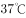左右的时候，能够使用最小的动力来维持身体需求的平衡。也就是说，人类在时通过获取少量的能量，就能达到最大的行动力。因此，一个多世纪以来，一直被当作人类健康的体温标准。然而日前一项研究却揭示，在过去的一个世纪，正常状态下人类的体温越来越低了，约每10年下降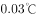。

以下各项如果为真，最不能支持上述结论的是：

- **A**. 温度计制造技术的逐步发展使得测量数据变得越来越精细　✅
- **B**. 现代生活方式降低了人类劳动强度，导致新陈代谢率下降
- **C**. 现代医学的进步降低了人类患病频次，炎症反应逐渐减少
- **D**. 温室效应引发全球气温上升，也使人类自降体温对抗炎热

**答案**：A

**官方解析**

第一步：找出论点和论据。

论点：在过去的一个世纪，正常状态下人类的体温越来越低了，约每10年下降。

论据：无。

本题只有论点，没有论据，加强方式考虑补充论据，即解释为什么正常状态下的人类体温越来越低或者举例证明正常状态下的人类体温越来越低。

第二步：逐一分析选项。

A项：该选项说的是温度计的测量数据变得越来越精细，但是温度计的数据对人类的体温不会产生影响，属于无关项，无法加强，当选；

B项：该选项说的是人类劳动强度下降，新陈代谢率下降，而新陈代谢率下降会对体温产生影响，解释了为什么正常状态下的人类体温越来越低，补充论据，排除；

C项：该选项说的是人类患病频次降低，炎症反应减少，炎症会导致体温上升，炎症的减少就可以解释为什么正常状态下的人类体温越来越低，补充论据，排除；

D项：该选项说的是温室效应引发的全球气温上升，使人类体温降低对抗炎热，解释了为什么正常状态下的人类体温越来越低，补充论据，排除。

本题为选非题，故正确答案为A。

备注：【题目来源】http://www.xinhuanet.com/science/2020-01/21/c_138722473.ht

《生活方式进步，炎症反应减少 人类因此越来越“冷”》

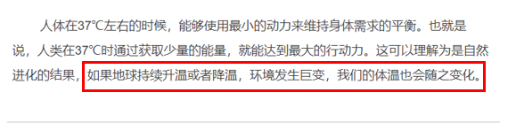

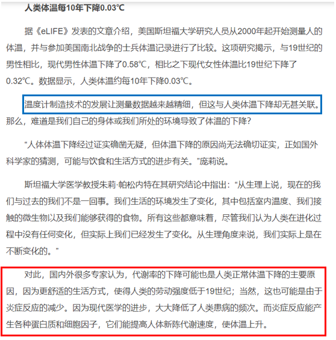

---

## 第 34 题　qid 2578144 · 逻辑判断

磷存在于我们的DNA中，是构成生命的基本元素之一，但它早期是如何到达地球的仍是一个谜。近日，科学家通过观测恒星形成区域，追踪到了含磷分子从宇宙到达地球的“旅程”。观测结果表明，含磷分子是在大质量恒星形成时产生的，刚形成的恒星会释放气流，在星际云中打造出一条通道。随着恒星震动和释放辐射，含磷分子在这些通道壁上沉积并产生大量一氧化磷粒子，这些粒子逐渐汇聚、融合，从一块小石头变成了彗星，而这些彗星，就成为了生命的“信使”，携带着生命分子来到了地球。
以下各项如果为真，最能质疑上述结论的是：

- **A**. 
科学家已经在陨石中找到了证据，研究发现为数不多的一些陨石携带有包含了一氧化二磷等含磷分子的有机物

- **B**. 
彗星撞击地球表面时，可产生36万个大气压，温度可达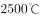，会引发彗星晶体中的磷元素发生未知化学变化
　✅
- **C**. 
早期的彗星撞击事件为地球带来每年10万亿千克的有机物质，它们进入地球环境后开启了地球生命的演化历程

- **D**. 
仅仅是拥有DNA的所需物质是远远不够的，只有上千万甚至是上亿万分之一的概率才能满足生命形成所需的条件

**答案**：B

**官方解析**

第一步：找出论点和论据。
论点：磷如何到达地球？含磷分子是在大质量恒星形成时产生的，刚形成的恒星会释放气流，在星际云中打造出一条通道。随着恒星震动和释放辐射，含磷分子在这些通道壁上沉积并产生大量一氧化磷粒子，这些粒子逐渐汇聚、融合，从一块小石头变成了彗星，而这些彗星，就成为了生命的“信使”，携带着生命分子来到了地球。
论据：无。
本题只有论点，没有论据，优先考虑否论点。
第二步：逐一分析选项。
A项：该项讨论的是陨石携带包含了一氧化二磷等含磷分子的有机物，题干讨论的是彗星携带一氧化磷粒子，讨论主体不一致，不能削弱，排除；
B项：该项表明彗星携带的磷元素在撞击地球表面时，会发生未知的化学变化，那么磷可能到达不了地球，无法成为构成生命的基本元素之一，可以削弱，当选；
C项：该项表明彗星撞击事件为地球带来了很多有机物质，开启了地球生命的演化历程，肯定了彗星携带着生命分子来到了地球，可以加强，排除；
D项：该项讨论的是生命形成所需的条件，与磷如何到达地球无关，无关项，排除。
故正确答案为B。

---

## 第 35 题　qid 2578148 · 类比推理

小严在商场看中一款鞋子，纠结是买黑色好还是买白色好。同行的好朋友小芳说：你去问下柜员，是黑色的销量高，还是白色的销量高，不就知道了吗？
以下选项与题干中的问答方式最为相似的是：

- **A**. 准备考研的小张在A培训班和B培训班之间犹豫不决，室友小王说：你去问问已经考上了研究生的学长学姐们，看看他们报的是A还是B，不就知道了吗
- **B**. 老郑打算给乔迁新居的战友老袁买一件礼物，在书法字画和艺术盆景之间有点为难，老伴说：你去花店打听下，乔迁送艺术盆景的人多不多，不就知道了吗
- **C**. 小莫和男友去网红美食街探寻美食，面对众多从未吃过的各地特色美食不知如何取舍，男友说：我们看看哪家店门口的队伍排得最长，就去吃哪家的吧
- **D**. 七夕节到了，小汪准备给女朋友送一支口红，不知道女朋友是喜欢001色号还是006色号，同事小林建议说：你上网查下哪个色号最热门，就选哪个呗　✅

**答案**：D

**官方解析**

第一步：分析题干问答方式。
小严在买黑色鞋还是白色鞋之间犹豫，而小芳建议询问柜员二者销量来进行选择，即建议是通过对比二者的销量来确定应该买什么。
第二步：逐一分析选项。
A项：准备考研的小张在报A班还是报B班之间犹豫，室友小王建议询问考上研究生的学长学姐们如何选择，即建议是通过别人报了什么来进行选择，而没有通过对比二者报名数量的多少来进行选择，与题干问答形式不一致，排除；
B项：老郑在买书法字画和艺术盆景之间犹豫，他老伴的建议是询问花店乔迁送艺术盆景的人多不多，建议的方式只是看艺术盆景的销量，而没有对比艺术盆景和书法字画的销量，与题干问答方式不一致，排除；
C项：小莫面对众多从未吃过的美食不知如何取舍，这是在众多美食中进行取舍，而不是二选一，与题干问答形式不一致，排除；
D项：小汪在买001色号和006色号之间犹豫，同事小林建议查找二者谁更热门来进行选择，即建议是通过对比二者的销量来确定应该买什么，与题干问答形式一致，当选。
故正确答案为D。

---
