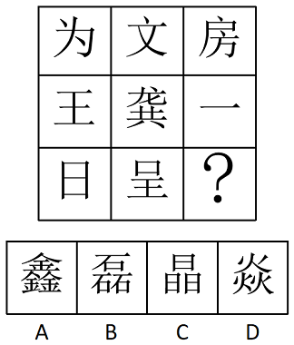
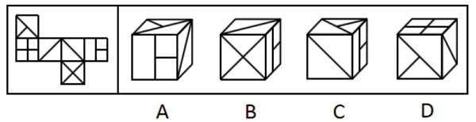
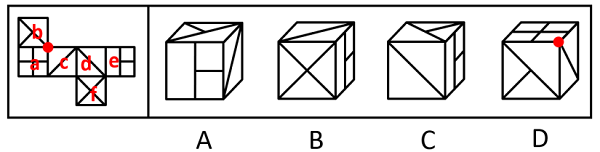
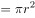
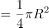
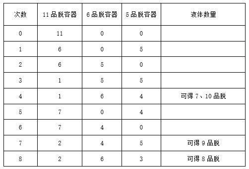

# 2020年重庆市选调优秀大学生到基层工作考试《行测》题

> 判断推理 · 30 题 · 选调 2020

## 第 1 题　qid 4678594 · 图形推理

根据图形规律，填入问号处最合适的一项是：

- **A**. A
- **B**. B　✅
- **C**. C
- **D**. D

**答案**：B

**官方解析**

图形元素组成不同，且无明显属性规律，考虑数量规律。观察发现，图形线条交叉明显，考虑交点数。题干图形的交点数分别为6、7、8、9、10、？，因此？处图形的交点数应为11，只有B项符合规律。
故正确答案为B。

---

## 第 2 题　qid 4678606 · 图形推理

根据图形规律，填入问号处最合适的一项是：

- **A**. A
- **B**. B
- **C**. C
- **D**. D　✅

**答案**：D

**官方解析**

图形元素组成不同，优先考虑属性规律。观察发现，题干出现全直线、全曲线图形，优先考虑曲直性。九宫格优先横行看，第一行图形均由直线组成，第二行图形均由曲线组成，第三行图1和图2均由曲线和直线构成，故？处图形应该由曲线和直线构成，只有D项符合规律。
故正确答案为D。

---

## 第 3 题　qid 4678625 · 图形推理

根据图形规律，填入问号处最合适的一项是：

- **A**. A
- **B**. B
- **C**. C　✅
- **D**. D

**答案**：C

**官方解析**

元素组成不同，九宫格优先横向看，观察发现，第一行汉字的第一笔均为“丶”，第二行汉字的第一笔均为“一”，第三行前两个汉字的第一笔均为“丨”，则问号处应选择第一笔为“丨”的汉字，只有C项符合。
故正确答案为C。

---

## 第 4 题　qid 4678632 · 图形推理

左边给定的是纸盒的外表面，下列哪一项能由它折叠而成？

- **A**. A
- **B**. B
- **C**. C　✅
- **D**. D

**答案**：C

**官方解析**

将原展开图标上序号如下图，逐一进行分析。

A项：选项前面是面e，面e的相对面是面c，相对面不能同时出现，所以选项右面是面d，选项中面e与面d的公共边挨着面e的两个小正方形，而展开图中面e与面d的公共边没有挨着面e的两个小正方形，选项与题干展开图不一致，排除；

B项：选项前面是面f，右面是面e，选项中面f挨着面e的大长方形长边，而展开图中面f没有挨着面e的大长方形长边，选项与题干展开图不一致，排除；

C项：选项由面b、面d与面e构成，选项与题干展开图一致，当选；

D项：选项前面是面b，上面是面a，面a的相对面是面d，相对面不能同时出现，所以选项右面是面c，选项中三个面的公共点（如图所示）引出的1条直线是由面c发出来的，而展开图中，三个面的公共点引出的1条直线是由面b发出来的，选项与题干展开图不一致，排除。

故正确答案为C。

---

## 第 5 题　qid 4678642 · 图形推理

把下面六组图形分成两类，使每一类都有各自的共同特征或规律，分类正确的一项是：

- **A**. ①④⑤，②③⑥
- **B**. ①③⑥，②④⑤　✅
- **C**. ①③⑤，②④⑥
- **D**. ①②③，④⑤⑥

**答案**：B

**官方解析**

本题为分组分类题目。元素组成不同，无明显属性规律，优先考虑数量规律。观察发现，每幅图形均由黑白两部分构成，且图⑥中黑色部分与白色部分面积相等，考虑黑白两部分的面积。图①③⑥中黑色部分与白色部分面积相等，图②④⑤中黑色部分面积为白色部分面积的三分之一。故图①③⑥为一组，图②④⑤为一组。

注：图③当中白色扇形的半径和黑色圆形的直径相等，且扇形圆心角为，假设圆形半径r为1，则扇形半径R为2，可知黑色圆形面积，白色扇形面积，两者面积相等。

故正确答案为B。

---

## 第 6 题　qid 4678648 · 定义判断

重大飞行事故罪，是指航空人员违反规章制度，因而发生重大飞行事故，危及公共安全，造成严重后果的行为。
根据上述定义，下列行为属于重大飞行事故罪的是：

- **A**. 某航空公司飞行员邀请“网红”进入驾驶舱就座。“网红”在驾驶舱拍摄的照片在微博引起热议，当事飞行员被处以终身禁飞
- **B**. 某客机因目的地机场下大雨，不适合降落，被迫在临近机场降落，结果导致乘客延误时间6小时
- **C**. 飞行员违反航空管理的有关规定，在未看见跑道的情况下，违规操纵飞机实施着陆，致使飞机着火坠毁　✅
- **D**. 恐怖分子劫持客机，导致客机坠毁

**答案**：C

**官方解析**

第一步：找出定义关键词。
“航空人员违反规章制度”、“因而发生重大飞行事故，危及公共安全，造成严重后果”。
第二步：逐一分析选项。
A项：飞行员邀请“网红”进入驾驶舱并拍照，违反了规章制度，但是否因此发生了重大飞行事故并未提及，不符合“因而发生重大飞行事故，危及公共安全，造成严重后果”，不符合定义，排除；
B项：客机因天气原因被迫在临近机场降落，航空人员并未违反规章制度，不符合“航空人员违反规章制度”，不符合定义，排除；
C项：飞行员违反航空管理的有关规定违规着陆，符合“航空人员违反规章制度”，致使飞机着火坠毁，符合“因而发生重大飞行事故，危及公共安全，造成严重后果”，符合定义，当选；
D项：恐怖分子劫持客机，导致客机坠毁，造成客机坠毁的原因是恐怖分子的劫持，并未提及航空人员是否违反规章制度，不符合“航空人员违反规章制度”，不符合定义，排除。
故正确答案为C。

---

## 第 7 题　qid 4678651 · 定义判断

罗森塔尔效应亦称“皮格马利翁效应”“人际期望效应”，是一种社会心理效应，指的是教师对学生的殷切希望能戏剧性地收到预期效果的现象。
根据上述定义，下列不属于罗森塔尔效应的是：

- **A**. 某小学一年级学生小明期末考试考了双百分，父母非常高兴，带他去上海迪士尼尽情玩了一周，以资鼓励，希望他再接再厉。果然不负父母所望，第二学期期末考试小明又考了双百分　✅
- **B**. 某小学班主任在选择班干部时，把学习成绩作为重要标准，期望这些班干部能带动班上其他学生的学习积极性。一年以后，这些班干部的成绩继续在班上名列前茅
- **C**. 一名研究者根据某小学的学生名册随机挑选了一些名字组成了一份“最有发展前途者”名单，并以赞许的口吻将其交给了校长和相关老师。一年后，该研究者再次对该小学的学生进行调查，结果显示，名单上的学生成绩都有了较大进步，且都有着很强的求知欲
- **D**. 罗尔斯从小顽皮、逃课、打架、斗殴，无所事事，令人头疼。有一次，当罗尔斯从窗台上跳下时，被校长保罗看见了，校长不但没有责备他，反而对他说：“我一看就知道，你将来是纽约州的州长。”校长的话对他的震动特别大。从此，罗尔斯记下了这句话，并在51岁那年成为纽约州州长

**答案**：A

**官方解析**

第一步：找出定义关键词。
“教师对学生的殷切希望”、“收到预期效果的现象”。
第二步：逐一分析选项。
A项：父母奖励小明并希望他再接再厉，是父母对孩子的殷切希望，不符合关键词“教师对学生的殷切希望”，不符合定义，保留；
B项：班主任期望班干部能带动班上其他学生的学习积极性，符合关键词“教师对学生的殷切希望”，但是一年以后这些班干部的成绩继续名列前茅，不明确是否带动了班上其他学生的学习积极性，不明确项，保留；
C项：研究者给了校长和相关老师一份“最有发展前途者”的学生名单，可能会让相关老师对这些学生产生期望，符合关键词“教师对学生的殷切希望”，最后名单上的学生成绩都有了较大进步，符合关键词“收到预期效果的现象”，符合定义，排除；
D项：校长跟罗尔斯说他将来是纽约州的州长，符合关键词“教师对学生的殷切希望”，罗尔斯在51岁那年确实成为了纽约州的州长，符合关键词“收到预期效果的现象”，符合定义，排除。
对比A、B两项，A项主体不符合，B项只是不明确，对比择优，选择A项。
本题为选非题，故正确答案为A。

---

## 第 8 题　qid 4678653 · 定义判断

湿垃圾，是指日常生活垃圾中在自然条件下容易分解的有机物质部分，其主要来源为家庭厨房、餐厅、饭店、食堂、市场及食品加工企业等。
根据上述定义，以下属于湿垃圾的是：

- **A**. 蛤蜊壳
- **B**. 塑料袋
- **C**. 瓜子壳　✅
- **D**. 口香糖

**答案**：C

**官方解析**

第一步：找出定义关键词。
“在自然条件下容易分解”、“有机物质部分”。
第二步：逐一分析选项。
A项：蛤蜊壳的主要成分是碳酸钙，碳酸钙是无机物，且在自然条件下不容易分解，不符合“在自然条件下容易分解”、“有机物质部分”，不符合定义，排除；
B项：日常生活中常见的塑料袋主要成分为聚丙烯、聚酯、尼龙等有机物质，符合“有机物质部分”，但常见的塑料袋在自然条件下不易降解，不符合“在自然条件下容易分解”，不符合定义，排除；
C项：瓜子壳的主要成分是纤维素、木质素、半木质素及少量的糖类、矿物质等，以有机物为主，符合“有机物质部分”，而且生活中将瓜子壳放置一段时间后易发生霉变，属于易腐垃圾，在自然条件下较容易降解，符合“在自然条件下容易分解”，符合定义，当选；
D项：口香糖的主要成分是胶基，由石油衍生聚合物、天然乳胶、树脂和蜡等大分子有机物混合而成，符合“有机物质部分”，但口香糖进入自然环境后难以降解和清除，不符合“在自然条件下容易分解”，不符合定义，排除。
故正确答案为C。

---

## 第 9 题　qid 4678655 · 定义判断

反事实推理又称反事实思维，是指对过去已经发生的事实进行否定而重新表征，以建构一种可能性假设的思维活动。反事实推理在头脑中是以条件命题的形式表现出来的，包括前提和结果两个部分，其典型形式为：如果当时······，就会（不会）······。
根据上述定义，以下诗句明确表达了反事实推理的是：

- **A**. 若非群玉山头见，会向瑶台月下逢
- **B**. 东风不与周郎便，铜雀春深锁二乔　✅
- **C**. 从今若许闲乘月，拄杖无时夜叩门
- **D**. 忽见陌头杨柳色，悔教夫婿觅封侯

**答案**：B

**官方解析**

第一步：找出定义关键词。
“对过去已经发生的事实进行否定而重新表征”、“以建构一种可能性假设的思维活动”。
第二步：逐一分析选项。
A项：出自唐代李白的《清平调·其一》，意思是如此天姿国色，不是群玉山头所见的飘飘仙子，就是瑶台殿前月光照耀下的神女，“不是······就是······”表示的是选择关系而非可能性假设，也没有对过去已经发生的事实进行否定，不符合“对过去已经发生的事实进行否定而重新表征”、“以建构一种可能性假设的思维活动”，不符合定义，排除；
B项：出自唐代杜牧的《赤壁》，意思是倘若当年东风不帮助周瑜的话，那么铜雀台就会深深地锁住东吴二乔了，此处作者提出了一个与历史事实相反的假设，符合“对过去已经发生的事实进行否定而重新表征”、“以建构一种可能性假设的思维活动”，符合定义，当选；
C项：出自宋代陆游的《游山西村》，意思是今后如果还能乘大好月色出外闲游，我随时会拄着拐杖来敲你的家门，没有对过去已经发生的事实进行否定，不符合“对过去已经发生的事实进行否定而重新表征”，不符合定义，排除；
D项：出自唐代王昌龄的《闺怨》，意思是忽然见到路边杨柳新绿，心中一阵忧愁，悔不该叫夫君去从军建功封爵，没有对过去已经发生的事实进行否定，不符合“对过去已经发生的事实进行否定而重新表征”、“以建构一种可能性假设的思维活动”，不符合定义，排除。
故正确答案为B。

---

## 第 10 题　qid 4678657 · 定义判断

智能投顾是指利用大数据分析、量化模型和算法，根据投资者的个人收益和风险偏好提供匹配的资产组合建议，并自动完成投资交易过程，再根据市场变化情况动态调整，让组合始终处于最优状态的财富管理服务。
根据上述定义，下列属于智能投顾的是：

- **A**. 甲把上个月的工资8000元借给朋友解燃眉之急
- **B**. 乙为低风险偏好者，购买了银行App为其推荐的保本型理财产品　✅
- **C**. 丙因为预算有限，从银行贷款购买了一辆价值12万的小轿车
- **D**. 丁利用信用卡分期付款买了一部苹果手机

**答案**：B

**官方解析**

第一步：找出定义关键词。
“利用大数据分析、量化模型和算法”、“根据投资者的个人收益和风险偏好提供匹配的资产组合建议，并自动完成投资交易过程”。
第二步：逐一分析选项。
A项：甲把工资借给朋友，甲并没有进行投资，不符合“利用大数据分析、量化模型和算法”、“根据投资者的个人收益和风险偏好提供匹配的资产组合建议，并自动完成投资交易过程”，不符合定义，排除； 
B项：银行APP为低风险偏好者推荐了保本型理财产品，符合“利用大数据分析、量化模型和算法”、“根据投资者的个人收益和风险偏好提供匹配的资产组合建议，并自动完成投资交易过程”，符合定义，当选；
C项：丙从银行贷款购买小轿车，丙并没有进行投资，不符合“利用大数据分析、量化模型和算法”、“根据投资者的个人收益和风险偏好提供匹配的资产组合建议，并自动完成投资交易过程”，不符合定义，排除；
D项：丁利用信用卡分期付款购买手机，丁并没有进行投资，不符合“利用大数据分析、量化模型和算法”、“根据投资者的个人收益和风险偏好提供匹配的资产组合建议，并自动完成投资交易过程”，不符合定义，排除。
故正确答案为B。

---

## 第 11 题　qid 4678689 · 逻辑判断

“只有努力才能成功，只有成功才能得到他人的尊重。”
如果上述断定为真，那么以下哪项一定为真？

- **A**. 如果不成功，那么一定没有努力
- **B**. 如果得到他人尊重了，那么一定努力了　✅
- **C**. 如果没有得到他人的尊重，那么一定没有成功
- **D**. 如果成功了，一定会得到他人尊重

**答案**：B

**官方解析**

第一步：翻译题干。

①成功努力；

②得到他人尊重成功；

将①和②串联可以递推出：③得到他人尊重成功努力。

第二步：逐一分析选项。

A项：翻译为：成功努力，是对①的否前，否前无必然结论，无法推出，排除；

B项：翻译为：得到他人尊重努力，是对③的肯前，肯前必肯后，可以推出，当选；

C项：翻译为：得到他人尊重成功，是对②的否前，否前无必然结论，无法推出，排除；

D项：翻译为：成功得到他人尊重，是对②的肯后，肯后无必然结论，无法推出，排除。

故正确答案为B。

---

## 第 12 题　qid 4678694 · 逻辑判断

到安徽旅游过的一名游客说过：“不到黄山，不算游过安徽；不去西递宏村，白来黄山。”
根据这句话，以下最能推出的结果是：

- **A**. 游黄山，只要去西递宏村就行了
- **B**. 西递宏村集中了安徽最精华的自然景观
- **C**. 游黄山，最令人难忘的是西递宏村　✅
- **D**. 游安徽，应该先去西递宏村

**答案**：C

**官方解析**

第一步：翻译题干。

①游过安徽到黄山；

②来黄山去西递宏村；

将①和②串联可以递推出③：游过安徽到黄山去西递宏村。

第二步：逐一分析选项。

A项：翻译为“去西递宏村游黄山”，是对②的肯后，肯后无必然结论，无法推出，排除；

B项：题干没有提及“最精华的自然景观”，无法从题干信息中推出，排除；

C项：选项说的是“游黄山，最令人难忘的是西递宏村”，这句话表达的意思是只有去了西递宏村，才会发现黄山最难忘的景色是什么，所以可以推出“游黄山去西递宏村”，是对②的肯前，肯前推肯后，可以推出，当选；

D项：题干没有提及先后顺序，游安徽只要去了西递宏村就行，故“应该先去西递宏村” 无法从题干信息中推出，排除。

故正确答案为C。

---

## 第 13 题　qid 4678703 · 类比推理

某次数学考试之后，班长跑去向老师打听成绩，老师给了他如下三个结果，并且告诉他，在这三个结果中只有一个是真的。
（1）有的同学考试成绩不及格；
（2）有的同学考试成绩及格了；
（3）数学课代表考试成绩不及格。
以下哪个选项一定为真？

- **A**. 只有数学课代表的考试成绩及格了
- **B**. 数学课代表的考试成绩不及格
- **C**. 班上所有同学的考试成绩都及格了　✅
- **D**. 班上所有同学的考试成绩都不及格

**答案**：C

**官方解析**

第一步：找关系。
（1）有的同学考试成绩不及格；
（2）有的同学考试成绩及格了；
（3）数学课代表考试成绩不及格。
根据条件（1）“有的同学考试成绩不及格”和条件（2）“有的同学考试成绩及格了”分别为“有的不是”、“有的是”的形式，二者中必有一真；再根据“三个结果中只有一个是真的”可知，条件（3）为假。
第二步：看其余。
根据条件（3）为假可知，数学课代表考试成绩及格了，可以推出条件（2）一定为真，那么条件（1）必然为假，则其矛盾命题为真，即所有同学的考试成绩都及格了，对应C项。
故正确答案为C。

---

## 第 14 题　qid 2003164 · 逻辑判断

如果选购了股票，则不能投资期货；只有投资期货，才能投资邮票；或者投资邮票，或者投资外汇；但是最近投资外汇风险太大，不能操作。
据此，可以推出：

- **A**. 选购股票
- **B**. 不选购股票　✅
- **C**. 不投资邮票
- **D**. 不投资期货

**答案**：B

**官方解析**

第一步：翻译题干。

①选购股票-投资期货；

②投资邮票投资期货；

③投资邮票 或 投资外汇；

④-投资外汇。

第二步：根据题干条件进行推理。

从确定信息条件④入手，-投资外汇是对条件③或关系的其中一项进行否定，根据“或关系否一推一”，可以推出投资邮票；投资邮票是对条件②的肯前，肯前必肯后，可以推出投资期货；投资期货是对条件①的否后，否后必否前，可以推出不选购股票，对应B项。

故正确答案为B。

---

## 第 15 题　qid 4678707 · 逻辑判断

基因编辑是指对基因组进行定点修饰的一项新技术，利用该技术，可以精确定位到基因组的某一位点上，在这个位点上剪断靶标DNA片段并插入新的基因片段，此过程既模拟了基因的自然突变，又修改并编辑了原有的基因组。该技术在过去几十年里得到了快速发展。然而，一些学者认为，应尽快采取各种禁止性或限制性措施，以防止对人类造成不可逆的危害。
以下哪项将严重削弱上述学者的观点？

- **A**. 近年来，基因编辑技术在植物、动物、微生物等领域的研究与应用突飞猛进
- **B**. 在人体上进行的基因编辑试验更多是针对体细胞而非生殖细胞，既能实现对疾病的治疗，还避免了被修改的基因遗传的问题　✅
- **C**. 基因编辑技术是一项新技术，存在构建复杂、价格昂贵，以及较大概率的脱靶效应等问题
- **D**. 科学狂人的冲动，有可能让中立的基因编辑技术越界，从而带来无法挽回的风险隐患和伦理悲剧

**答案**：B

**官方解析**

第一步：找出论点和论据。
论点：针对基因编辑技术，应尽快采取各种禁止性或限制性措施，以防止对人类造成不可逆的危害。
论据：无。
本题只有论点没有论据，优先考虑削弱论点，即基因编辑技术不会对人类造成不可逆的危害，或不需要尽快禁止或限制基因编辑技术。
第二步：逐一分析选项。
A项：该项讨论的是基因编辑技术在植物、动物、微生物等领域的研究与应用突飞猛进，而论点讨论的基因编辑技术对人类的影响，讨论的话题不一致，无法削弱，排除；
B项：该项指出人体的基因编辑更多是针对体细胞，以实现疾病的治疗，说明人体的基因编辑具有积极意义，还指出人体的基因编辑并非针对生殖细胞，这避免了被修改的基因遗传的问题，说明人体的基因编辑不会对人类造成不可逆的危害，即不需要禁止和限制基因编辑技术，削弱论点，当选；
C项：该项讨论的是基因编辑技术构建复杂、价格昂贵，较大概率的脱靶效应等问题，并未指出基因编辑技术是否会对人类造成不可逆的危害，以及是否需要尽快禁止或限制基因编辑技术，为无关项，无法削弱，排除；
D项：该项指出科学狂人的冲动可能使基因编辑技术带来无法挽回的风险隐患和伦理悲剧，补充说明了基因编辑技术可能带来的消极影响，即需要禁止或限制基因编辑技术，为加强项，无法削弱，排除。
故正确答案为B。

---

## 第 16 题　qid 4678671 · 逻辑判断

陈燕、李婷和赵伟被同一所大学的英语、经济和法律三个专业录取，对于她们的录取情况，同学们有以下猜测：
甲：陈燕是经济专业的，赵伟是法律专业的；
乙：陈燕是法律专业的，李婷是经济专业的；
丙：陈燕是英语专业的，赵伟是经济专业的；
结果出来后，每位同学都只对了一半。
那么，下列结论正确的是：

- **A**. 陈燕、李婷和赵伟分别是英语、经济和法律专业的　✅
- **B**. 陈燕、李婷和赵伟分别是经济、法律和英语专业的
- **C**. 陈燕、李婷和赵伟分别是英语、法律和经济专业的
- **D**. 陈燕、李婷和赵伟分别是法律、英语和经济专业的

**答案**：A

**官方解析**

题干信息不确定，优先考虑代入法。
A项：代入到题干中，每个人的猜测都对了一半，符合题干要求，当选；
B项：代入到题干中，乙的猜测都是错的，不符合题干要求，排除；
C项：代入到题干中，甲的猜测都是错的，不符合题干要求，排除；
D项：代入到题干中，甲的猜测都是错的，不符合题干要求，排除。
故正确答案为A。

---

## 第 17 题　qid 4678672 · 逻辑判断

王军说：“只有正式代表才可以发言。”刘念说：“不对吧！梁正也是正式代表但他并未发言。”
刘念的回答把王军的话错误地理解为以下哪项？

- **A**. 所有发言的人都是正式代表
- **B**. 所有正式代表都发言了　✅
- **C**. 没有正式代表发言
- **D**. 梁正不是正式代表

**答案**：B

**官方解析**

第一步：翻译题干。

王军的话翻译为：发言正式代表；

刘念的话翻译为：正式代表 且 发言。

题干的问法为刘念的回答把王军的话错误的理解为什么，刘念认为王军的话说错了，故拿梁正举例子反驳王军，所以刘念认为梁正的例子为王军的话的矛盾命题，故找到刘念例子的矛盾命题即为刘念的错误理解。

第二步：逐一分析选项。

A项：翻译为发言正式代表，与刘念的话并非矛盾关系，无法推出，排除；

B项：翻译为正式代表发言，与刘念的话为矛盾关系，即为刘念对王军的话的错误理解，可以推出，当选；

C项：翻译为正式代表发言，与刘念的话并非矛盾关系，无法推出，排除；

D项：翻译为梁正是正式代表，与刘念的话并非矛盾关系，无法推出，排除。

故正确答案为B。

---

## 第 18 题　qid 4678706 · 逻辑判断

甲大学的所有女生都爱吃油炸食品。所有爱吃油炸食品的人都不会嫌弃自己不健康。而只有甲大学的女生才会注意别人的评价。
假设上述论断都是真的，以下哪项也一定是真的？
Ⅰ.所有不嫌弃自己不健康的人都注重别人的评价
Ⅱ.所有注重别人评价的人都爱吃油炸食品
Ⅲ.嫌弃自己不健康的人中没有一个注重别人的评价

- **A**. 仅Ⅰ
- **B**. 仅Ⅱ
- **C**. 仅Ⅰ和Ⅱ
- **D**. 仅Ⅱ和Ⅲ　✅

**答案**：D

**官方解析**

第一步：翻译题干。

①甲大学的女生爱吃油炸食品；

②爱吃油炸食品不会嫌弃自己不健康；

③注意别人的评价甲大学的女生。

以上条件可以递推出：④注意别人的评价甲大学的女生爱吃油炸食品不会嫌弃自己不健康。

第二步：逐一判断选项。

Ⅰ：不嫌弃自己不健康注重别人的评价，是对④的肯后，肯后无法得出确定结论，无法推出，排除；

Ⅱ：注重别人的评价爱吃油炸食品，是对④的肯前，肯前必肯后，可以推出，当选；

Ⅲ：不会嫌弃自己不健康注重别人的评价，是对④的否后，否后必否前，可以推出，当选。

因此仅Ⅱ和Ⅲ可以推出，只有D项符合。

故正确答案为D。

---

## 第 19 题　qid 4678710 · 逻辑判断

小张需要一定数量的特定液体。目前，小张有一个容积为11品脱、装满了该液体且刻度模糊的容器，不满足他的需求，于是他向好友小刚寻求帮助，小刚拿出了两个刻度模糊、容积分别为5品脱和6品脱的容器，说小张将这两个容器都利用到就可以得到想要的液体数量。
由此可以推出，小张需要的液体数量可能是：

- **A**. 5品脱、7品脱、8品脱、10品脱
- **B**. 6品脱、7品脱、8品脱、9品脱
- **C**. 7品脱、8品脱、9品脱、10品脱　✅
- **D**. 8品脱、9品脱、10品脱、11品脱

**答案**：C

**官方解析**

第一步：分析题干条件。

（1）有一个11品脱刻度模糊的容器，且此容器装满了特定溶液；

（2）有两个刻度模糊的容器分别为5品脱和6品脱；

（3）5品脱和6品脱容器都要利用到。

第二步：根据题干条件进行推理。

根据条件（3）可知，5品脱和6品脱的容器都要利用到，不能只使用其中一个，故小张需要的液体数量肯定不能是单独的5品脱、6品脱或11品脱，排除A、B、D三项；而C项中的液体数量都可以利用这三个容器得到，如下表所示：

故正确答案为C。

---

## 第 20 题　qid 4678712 · 逻辑判断

一粒骰子的六面分别是1、2、3、4、5、6点。如果满足：①1的对面是5；②4和6相邻；③2和4相邻这三个条件。
那么下面结论错误的是：

- **A**. 1与4相邻
- **B**. 4的对面是3
- **C**. 2与6相邻　✅
- **D**. 5与3相邻

**答案**：C

**官方解析**

第一步：分析题干条件。

①1的对面是5；

②4和6相邻；

③2和4相邻。

第二步：根据题干条件进行推理。

根据题干信息构建出该骰子的一种情况，如下图所示：

由上图可知，1与4相邻，4的对面是3，2的对面是6，5与3相邻，只有C项错误。

本题为选非题，故正确答案为C。

---

## 第 21 题　qid 4678644 · 类比推理

纸张：钢笔

- **A**. 司机：汽车
- **B**. 牙齿：牙刷　✅
- **C**. 河流：水
- **D**. 森林：树木

**答案**：B

**官方解析**

第一步：判断题干词语间逻辑关系。
用钢笔在纸张上写字，二者为工具和作用对象的对应关系。
第二步：判断选项词语间逻辑关系。
A项：司机驾驶汽车，二者为职业和工具的对应关系，与题干逻辑关系不一致，排除；
B项：用牙刷清理牙齿，二者为工具和作用对象的对应关系，与题干逻辑关系一致，当选；
C项：河流是水资源的一种，二者为包容关系中的种属关系，与题干逻辑关系不一致，排除；
D项：树木是森林的组成部分，二者为包容关系中的组成关系，与题干逻辑关系不一致，排除。
故正确答案为B。

---

## 第 22 题　qid 4678650 · 类比推理

信息：语言

- **A**. 感觉：快乐　✅
- **B**. 教学：教育
- **C**. 状态：水
- **D**. 股东：股份

**答案**：A

**官方解析**

第一步：判断题干词语间逻辑关系。
语言是信息的一种，二者为包容关系中的种属关系。
第二步：判断选项词语间逻辑关系。
A项：快乐是感觉的一种，二者为包容关系中的种属关系，与题干逻辑关系一致，当选；
B项：教学是教育活动的一种，与教育不是种属关系，与题干逻辑关系不一致，排除；
C项：水具有多种状态，如固态、液态、气态，二者为对应关系，与题干逻辑关系不一致，排除；
D项：股东持有股份，二者为主宾关系，与题干逻辑关系不一致，排除。
故正确答案为A。

---

## 第 23 题　qid 4678664 · 类比推理

中国：亚洲

- **A**. 迪拜：亚洲
- **B**. 伊拉克：非洲
- **C**. 墨西哥：南美洲
- **D**. 新西兰：大洋洲　✅

**答案**：D

**官方解析**

第一步：判断题干词语间逻辑关系。
中国是位于亚洲的国家，二者为地点的对应关系。
第二步：判断选项词语间逻辑关系。
A项：迪拜是位于亚洲的城市，而不是国家，与题干逻辑关系不一致，排除；
B项：伊拉克是位于亚洲的国家，而不是非洲，与题干逻辑关系不一致，排除；
C项：墨西哥是位于北美洲的国家，而不是南美洲，与题干逻辑关系不一致，排除；
D项：新西兰是位于大洋洲的国家，二者为地点的对应关系，与题干逻辑关系一致，当选。
故正确答案为D。

---

## 第 24 题　qid 4678677 · 类比推理

压轴：最后一个

- **A**. 七月流火：天气转凉
- **B**. 空穴来风：必有根据
- **C**. 美轮美奂：景色美丽　✅
- **D**. 目无全牛：得心应手

**答案**：C

**官方解析**

第一步：判断题干词语间逻辑关系。
压轴指倒数第二个节目，不是指最后一个。
第二步：判断选项词语间逻辑关系。
A项：七月流火意思是在农历七月天气转凉的时节，天刚擦黑的时候，可以看见大火星从西方落下去，说的就是天气转凉的时候，与题干逻辑关系不一致，排除；
B项：空穴来风比喻消息和传说不是完全没有根据，现多用来指消息和传说毫无根据，两种用法均可，与题干逻辑关系不一致，排除；
C项：美轮美奂形容房屋等建筑高大众多，富丽堂皇，而不是形容景色美丽，与题干逻辑关系一致，当选；
D项：目无全牛形容技艺达到极纯熟的境界，得心应手形容技术纯熟，能运用自如，二者为近义关系，与题干逻辑关系不一致，排除。
故正确答案为C。

---

## 第 25 题　qid 4678692 · 类比推理

往：来：往来

- **A**. 牙：齿：牙齿
- **B**. 去：留：去留　✅
- **C**. 拼：搏：拼搏
- **D**. 耻：辱：耻辱

**答案**：B

**官方解析**

第一步：判断题干词语间逻辑关系。
往和来是反义关系，且二者构成了词语“往来”。
第二步：判断选项词语间逻辑关系。
A项：牙和齿都可以指牙齿，二者不是反义关系，与题干逻辑关系不一致，排除；
B项：去和留是反义关系，且二者构成了词语“去留”，与题干逻辑关系一致，当选；
C项：拼和搏都有奋斗的意思，二者是近义关系，与题干逻辑关系不一致，排除；
D项：耻和辱都有羞耻、羞愧的意思，二者是近义关系，与题干逻辑关系不一致，排除。
故正确答案为B。

---

## 第 26 题　qid 4678681 · 类比推理

黄色：橙色：红色

- **A**. 儿童：成人：老人
- **B**. 小学：大学：中学
- **C**. 晴天：阴天：雨天　✅
- **D**. 语文：数学：英语

**答案**：C

**官方解析**

第一步：判断题干词语间逻辑关系。
黄色、橙色、红色是3种不同的颜色，三者为并列关系，且颜色不断加深。
第二步：判断选项词语间逻辑关系。
A项：成人指成年的人，老人属于成人，二者为种属关系，与题干逻辑关系不一致，排除；
B项：小学、大学、中学是3种不同的学校，三者为并列关系，但小学、中学、大学才是学历的不断加深，选项顺序不对，与题干逻辑关系不一致，排除；
C项：晴天、阴天、雨天是3种不同的天气，三者为并列关系，且天气糟糕程度不断加深，与题干逻辑关系一致，当选；
D项：语文、数学、英语是3种不同的学科，三者为并列关系，但不存在程度的不断加深，与题干逻辑关系不一致，排除。
故正确答案为C。

---

## 第 27 题　qid 4678684 · 类比推理

阅览：阅读：审阅

- **A**. 要求：命令：建议
- **B**. 道理：理论：理据
- **C**. 尊重：尊敬：尊崇　✅
- **D**. 局长：市长：领导

**答案**：C

**官方解析**

第一步：判断题干词语间逻辑关系。
阅览指观看、观赏，阅读指阅览诵读，审阅指审查核阅，三者是近义关系，且程度逐渐加深。
第二步：判断选项词语间逻辑关系。
A项：要求指提出的具体愿望或条件，希望做到或实现，命令指发出号令，使人遵行，建议指向人提出的主张，三者是近义关系，但“建议”的程度比“要求”轻，与题干逻辑关系不一致，排除；
B项：道理指事物的规律；理由、情理，理论指由实践概括出来的有系统的结论，理据指理由、根据，第二个词与第一、三词不是近义关系，与题干逻辑关系不一致，排除；
C项：尊重指重视，尊敬指敬重，尊崇指尊敬推崇，三者是近义关系，且程度逐渐加深，与题干逻辑关系一致，当选；
D项：局长与市长都是领导的一种，前两词与第三词构成种属关系，与题干逻辑关系不一致，排除。
故正确答案为C。

---

## 第 28 题　qid 4678688 · 类比推理

曹雪芹：红楼梦：贾宝玉

- **A**. 罗贯中：三国演义：关二爷　✅
- **B**. 施耐庵：西游记：沙和尚
- **C**. 吴承恩：水浒传：林冲
- **D**. 许仲琳：封神演义：申公豹

**答案**：A

**官方解析**

第一步：判断题干词语间逻辑关系。
曹雪芹是红楼梦的作者，贾宝玉是红楼梦中的人物，三者是作者、作品和人物的对应关系，且红楼梦是四大名著之一。
第二步：判断选项词语间逻辑关系。
A项：罗贯中是三国演义的作者，关二爷是三国演义中的人物，三者是作者、作品和人物的对应关系，且三国演义是四大名著之一，与题干逻辑关系一致，当选；
B项：西游记的作者是吴承恩，而不是施耐庵，前两词不是作者与作品的对应关系，与题干逻辑关系不一致，排除；
C项：水浒传的作者是施耐庵，而不是吴承恩，前两词不是作者与作品的对应关系，与题干逻辑关系不一致，排除；
D项：封神演义的作者是许仲琳存在争议，申公豹是封神演义中的人物，但封神演义不是四大名著之一，与题干逻辑关系不一致，排除。
故正确答案为A。

---

## 第 29 题　qid 4678693 · 类比推理

感冒∶病毒∶传染

- **A**. 花朵∶蜜蜂∶传粉
- **B**. 癌症∶绝症∶化疗
- **C**. 血友病∶基因∶遗传　✅
- **D**. 伤口∶感染∶愈合

**答案**：C

**官方解析**

第一步：判断题干词语间逻辑关系。
感染病毒可能会引起感冒，二者为因果关系，感冒具有传染性，二者为对应关系。
第二步：判断选项词语间逻辑关系。
A项：花朵并非蜜蜂引起，二者不是因果关系，花朵也不具有传粉性，与题干逻辑关系不一致，排除；
B项：癌症并非绝症引起，二者不是因果关系，癌症也不具有化疗性，与题干逻辑关系不一致，排除；
C项：基因突变可能会引起血友病，二者为因果关系，血友病具有遗传性，二者为对应关系，与题干逻辑关系一致，当选；
D项：伤口可能引发感染，二者为因果关系，但和题干顺序相反，与题干逻辑关系不一致，排除。
故正确答案为C。

---

## 第 30 题　qid 4678704 · 类比推理

（    ） 对于 “一国两制” 相当于 马克思 对于 （    ）

- **A**. 邓小平；唯物主义
- **B**. 毛泽东；剩余价值理论
- **C**. 邓小平；剩余价值理论　✅
- **D**. 毛泽东；唯物史观

**答案**：C

**官方解析**

逐一代入选项。
A项：“邓小平”是“一国两制”的提出者，“唯物主义”与“马克思”无明显逻辑关系，前后逻辑关系不一致，排除；
B项：“毛泽东”与“一国两制”无明显逻辑关系，“马克思”是“剩余价值理论”的提出者，前后逻辑关系不一致，排除；
C项：“邓小平”是“一国两制”的提出者，“马克思”是“剩余价值理论”的提出者，前后逻辑关系一致，当选；
D项：“毛泽东”与“一国两制”无明显逻辑关系，“马克思”是“唯物史观”的提出者，前后逻辑关系不一致，排除。
故正确答案为C。

---
