# 2021年上海市公务员录用考试《行测》题（A类）（网友回忆版）

> 判断推理 · 35 题 · 上海 2021

## 材料 1

某单位今年招录了8名应届毕业生，其中甲和乙是文科生，丙、丁、戊是理科生，己、庚、辛是工科生。8人中，甲、丙、己是女士。单位拟从中选出5人组成一个研发团队，团队中文科生、理科生和工科生至少各有1人，并且至少要有1名女士参加。此外，还要满足下列条件：

（1）丙和庚至多有1人参加；

（2）若乙参加，则丁也参加；

（3）戊和辛要么都参加，要么都不参加。

### 第 1 题　qid 2731298 · 类比推理

下列（    ）项组合方案满足上述对于研发团队的要求。

- **A**. 甲、丙、丁、己、庚
- **B**. 甲、丁、戊、己、辛　✅
- **C**. 乙、丙、戊、己、辛
- **D**. 乙、丁、戊、己、庚

**答案**：B

**官方解析**

第一步，整理题干条件。

（1）丙或庚；

（2）乙丁；

（3）戊和辛要么都参加，要么都不参加。

第二步，根据题干条件分析选项。

根据条件（1）可知，丙和庚不能同时参加，排除A项；根据条件（2）可知，乙参加，丁一定参加，排除C项；根据条件（3）可知，戊和辛要么都参加，要么都不参加，排除D项。

故正确答案为B。

---

### 第 2 题　qid 2731301 · 类比推理

如果甲没有参加，则下列（    ）项可能为真。

- **A**. 理科生只有戊参加
- **B**. 工科生只有己参加
- **C**. 3名理科生都参加　✅
- **D**. 3名工科生都参加

**答案**：C

**官方解析**

第一步，整理题干条件。

（1）丙或庚；

（2）乙丁；

（3）戊和辛要么都参加，要么都不参加；

（4）甲不参加。

第二步，根据题干条件分析选项。

根据条件（4）可知，甲不参加，结合题干信息文科生至少有一人参加，则乙一定参加，又结合条件（2）可知，丁一定参加，因此可排除A项。

结合题干问“可能为真”，故可采用代入法。

代入B项：工科生只有己参加，那么庚、辛不参加。根据条件（3）可知，戊不参加；此时，甲、庚、辛、戊四人不参加，不满足选出5人参加这一条件，故B项不可能为真，排除；

代入C项：3名理科生都参加，即丙、丁、戊都参加。根据条件（1）可知，庚不参加；根据条件（3）可知，辛参加。此时，参加人数有：乙、丙、丁、戊、辛5人，不参加有：甲、庚两人，现只需己不参加，即可符合题干要求，故C项可能为真，当选；

代入D项：3名工科生都参加，即己、庚、辛都参加，根据条件（1）可知，丙不参加；根据条件（3）可知，戊参加。此时，参加人数有：乙、丁、己、庚、辛、戊6人，不符合题干要求，故D项不可能为真，排除。

故正确答案为C。

---

### 第 3 题　qid 2731049 · 类比推理

现代社会离不开电能，火力发电仍然是目前重要的发电形式之一，它“吃”进的是煤，“吐”的是电，在这个过程中的能量转化是：

- **A**. 
机械能内能化学能电能

- **B**. 
化学能内能机械能电能
　✅
- **C**. 
化学能重力势能动能电能

- **D**. 
内能化学能机械能电能

**答案**：B

**官方解析**

火力发电时，烧煤时煤的化学能先转变成内能，内能再转化为发电装置的机械能，最终转化为电能。
故正确答案为B。

---

### 第 4 题　qid 2731050 · 类比推理

利用下列几组器材中的                    ，可以最为方便地判断一段有绝缘外皮包裹的导线中是否有直流电流通过。

- **A**. 小灯泡及导线
- **B**. 铁棒及细棉线
- **C**. 带电的小纸球及细棉线
- **D**. 被磁化的缝衣针及细棉线　✅

**答案**：D

**官方解析**

A项：若将小灯泡用导线接在有绝缘外皮的导线上，无论有绝缘外皮包裹的导线中是否有直流电流通过，小灯泡均为短路状态，不亮，故无法判断有绝缘外皮包裹的导线是否有直流电流通过，错误；
B项：用棉线将铁棒吊在导线上方，靠近有绝缘外皮包裹的导线时，若导线中有直流电流通过，则其产生的电磁场对铁棒有磁场力的作用，但磁场力相对于铁棒的重力来说较小，铁棒不会发生偏转，无论有绝缘外皮包裹的导线中是否有直流电流通过，铁棒都不会发生偏转，故无法判断该导线是否有直流电流通过，错误；
C项：用棉线将小纸球吊在导线上方，靠近有绝缘外皮包裹的导线时，无论导线中是否有直流电流通过，都不会对小纸球有磁场力的作用，故无法判断该导线是否有直流电流通过，错误；
D项：用细棉线将被磁化的缝衣针吊在导线上方，靠近有绝缘外皮包裹的导线时，若导线中无直流电流通过，缝衣针不发生偏转；若导线中有直流电流通过，则缝衣针在磁场力的作用下发生偏转，故可以用来判断有绝缘外皮包裹的导线中是否有直流电流通过，正确。
故正确答案为D。

---

### 第 5 题　qid 2731052 · 类比推理

如图是两车发生交通事故后的现场图，由图片可判断：

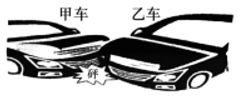

- **A**. 一定是甲车去撞乙车的
- **B**. 碰撞前瞬间乙车的速度一定比甲车大
- **C**. 碰撞时两车的相互作用力大小一定相等　✅
- **D**. 碰撞前瞬间两车的动能大小一定相等

**答案**：C

**官方解析**

A项：图片是汽车碰撞之后的现场图，无法判断碰撞之前汽车的运动状态，错误；

B项：图片是汽车碰撞之后的现场图，无法确定碰撞前瞬间两个汽车的运动速度，错误；

C项：由牛顿的第三定律可知，当两个物体相互作用时，彼此施加给对方的力必定大小相等，方向相反。故两车碰撞时，两车的相互作用力大小一定相等，正确；

D项：由动能的公式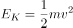可知，在碰撞之前两车的质量，速度，大小都不确定，故无法得知碰撞前瞬间两车动能的大小，错误。

故正确答案为C。

---

### 第 6 题　qid 2731055 · 类比推理

喷水鱼因特殊的捕食方式而得名，能喷出一股水柱，准确击落空中的昆虫作为食物。下列各图中能正确表示喷水鱼看到昆虫像的光路图的是：

- **A**. A
- **B**. B
- **C**. C　✅
- **D**. D

**答案**：C

**官方解析**

此题考察光在不同介质中的折射，喷水鱼在水中看空气中的昆虫，是昆虫反射的光线进入到喷水鱼的眼睛，故A、B两项错误；光从空气中斜射入水中，实际光线的入射角大于折射角，鱼的眼睛看到的是水中光线的反向延长线上昆虫的虚像，看到的虚像比实际昆虫的位置偏高，C项正确，D项错误。
故正确答案为C。

---

### 第 7 题　qid 2731059 · 定义判断

分类是科学研究的重要方法，物质可以分为纯净物和混合物，纯净物可以分为单质和化合物。下列四种物质符合如图所示关系的是：

- **A**. 铜
- **B**. 干冰
- **C**. 金刚石　✅
- **D**. 陶瓷

**答案**：C

**官方解析**

此题考察化学中常见物质分类，需要将题干中涉及的单质、导体、晶体、混合物的相关定义理解清楚。

单质：是由一种元素的原子组成的以游离形式较稳定存在的物质，例如：氧气（），铜（）等。

晶体：是原子、离子或分子按照一定的周期性，在三维空间作有规律的周期性重复排列所形成的物质，例如：冰（）等。

导体：能够导电的物体，例如铁（）等。

混合物：是由两种或多种物质混合而成的物质。

A项：铜（）既属于单质也属于导体，正确；

B项：干冰是固态的二氧化碳（），是纯净物，错误；

C项：金刚石（）是单质，也是原子晶体，正确；

D项：陶瓷是粘土、石英等混合烧制而成的，属于混合物，但陶瓷不能导电，是因为陶瓷原子的最外层电子被束缚在各自原子的四周，不能自由移动，错误。

故正确答案为C。

特殊说明：此题存在一定的争议，铜单质属于单质、导体、原子晶体，属于三者，图中的A只含有两个部分，粉笔更加倾向于选C。

---

### 第 8 题　qid 2732923 · 逻辑判断

有一根金属丝弯成半圆弧的形状竖直于平面内，蚂蚁从a沿金属缓慢爬向b（a、b同一水平线），下列说法正确的是：

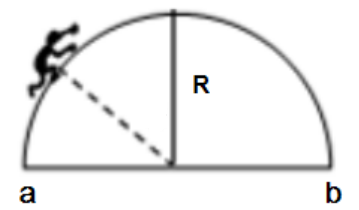

- **A**. 蚂蚁从a往圆顶爬时，它受摩擦力向下
- **B**. 蚂蚁从圆顶往b爬时，它受摩擦力向下
- **C**. 蚂蚁受的支持力，先增大后减小　✅
- **D**. 蚂蚁受的摩擦力，大小不变

**答案**：C

**官方解析**

A、B项：蚂蚁在沿着金属丝爬行时受到重力的作用，重力会使蚂蚁有沿着金属丝向下滑动的趋势，从a往圆顶爬行时，它所受摩擦力的方向沿着斜面的切线向上，蚂蚁从圆顶往b爬行时，它所受摩擦力的方向沿着斜面的切线向上，故A、B两项均错误；

C、D项：设蚂蚁的重力为， 蚂蚁和圆心连线与竖直方向的夹角为，对蚂蚁进行受力分析（如下图所示），蚂蚁在爬行时，受到重力、摩擦力、支持力，三个力的作用，蚂蚁在缓慢爬行时所受的合外力为0，根据受力平衡重力的分力的大小等于摩擦力，即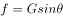，支持力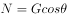，蚂蚁在爬行的过程中，先减小，后增大，则摩擦力先减小，后增大，支持力先增大，后减小。故C项正确，D项错误。

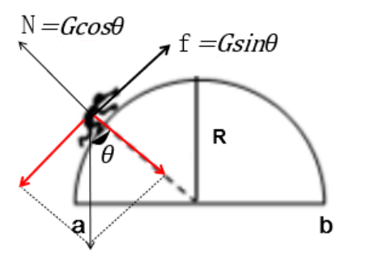

故正确答案为C。

---

### 第 9 题　qid 2731071 · 逻辑判断

如图所示，一个弹性小球从a点静止释放，竖直撞击水平地面后反弹，已知空气阻力大小恒定，撞击地面无能量损失。对于小球下落后反弹至最高点的过程中，下列说法正确的是：

- **A**. 因为空气阻力大小不变，所以下落过程阻力做功等于反弹时阻力做的功
- **B**. 因为撞击时地面给小球向上的作用力，所以小球反弹的最高点高于a点
- **C**. 小球下落过程中空气阻力做负功，反弹过程中空气阻力做正功
- **D**. 小球下落过程和反弹过程均是匀变速直线运动，但加速度不同　✅

**答案**：D

**官方解析**

A项：功的公式，下落过程和反弹过程空气阻力相等，但是空气阻力一直做负功，下落过程的位移大于反弹时的位移，所以两个过程中空气阻力做的功不相等，错误；

B、C两项：小球在下落过程中所受的空气阻力方向向上，空气阻力方向与运动的方向相反，空气阻力做负功；小球反弹之后，小球向上运动，小球所受的空气阻力向下，空气阻力方向与小球的运动方向相反，空气阻力做负功，无论小球向上还是向下运动，空气阻力始终做负功，空气阻力做负功，使小球的机械能减少，小球反弹之后最高点一定低于a点，均错误；

D项：设小球的质量为，分析小球的受力情况，小球在下降过程中受到竖直向下的重力和竖直向上的空气阻力，由牛顿的第二定律可得，加速度大小方向均不变，小球做匀加速直线运动。小球在反弹之后向上运动的过程中受到竖直向下的重力和空气阻力，由牛顿第二定律可得，大小和方向均不变，故小球做匀减速直线运动，由以上分析可知，正确。

故正确答案为D。

---

### 第 10 题　qid 2731104 · 类比推理

已知化学反应进行前后，参加反应的物质种类发生变化，总质量不发生变化，催化剂的质量也不发生变化。某密闭容器内有四种物质，反应一段时间后，测得反应前后各物质的质量如下表所示。下列说法正确的是：

- **A**. 丁一定是单质
- **B**. M的值是15
- **C**. 该反应是分解反应　✅
- **D**. 反应中的甲、丙质量比为15：27

**答案**：C

**官方解析**

A项：丁属于生成物，通过条件信息，无法确定丁是否为单质，错误；

B项：由化学反应原理可知，化学反应进行前后，反应前的物质总量等于反应后的物质的总量即，，错误；

C项：该反应为甲丙丁，故该反应为分解反应，正确；

D项：由以上分析可知，参加反应的甲为54克，生成的丙为30克，，错误。

故正确答案为C。

---

### 第 11 题　qid 2731139 · 定义判断

“绿色化学”要求物质回收或循环利用，反应物原子利用率为，且全部转化为产物，“三废”必须先处理再排放。下列做法或反应符合“绿色化学”要求的是：

- **A**. 
焚烧塑料以消除“白色污染”

- **B**. 
深埋含镉、汞的废旧电池

- **C**. 

　✅
- **D**. 

**答案**：C

**官方解析**

A项：焚烧塑料会产生大量的废气污染空气，不符合条件中的“绿色化学”要求，错误；

B项：深埋含镉、汞的废旧电池，没有先处理再排放，不符合“绿色化学”要求，并且深埋处理会污染土壤和水源，错误；

C项：由化学反应方程式可知，丙炔、氢气、一氧化碳反应生成戊二醛，原子的利用率为，符合“绿色化学”要求，正确；

D项：利用高锰酸钾加热生产氧气，产物还有锰酸钾和二氧化锰，原子的利用率不足，不符合“绿色化学”要求，错误。

故正确答案为C。

---

### 第 12 题　qid 2731143 · 逻辑判断

铝是地壳中含量最丰富的金属元素，具有良好的导电性和延展性，属于轻金属。下列有关铝的用途和性质，表述错误的是：

- **A**. 航空材料，密度小
- **B**. 电线电缆，导电性
- **C**. 耐火材料，熔点高　✅
- **D**. 铝箔，延展性好

**答案**：C

**官方解析**

A项：铝的密度比较小，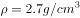，其密度约是铁的，同时铝还具有较强的防腐蚀能力，可以用来做航空材料，正确；

B项：铝的电阻率比较低，导电性比较强，延展性比较好，可以做电线电缆，正确；

C项：铝的熔点为，一般认为普通的耐火材料的耐火温度不低于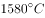，显然铝不适合做耐火材料，错误；

D项：铝的质地柔软，延展性比较好，可以直接把铝块压制成铝箔，正确。

本题为选非题，故正确答案为C。

---

### 第 13 题　qid 2731146 · 类比推理

制作变色眼镜时需要加入溴化银或者氯化银，这是利用溴（氯）化银光照分解生成银和溴（氯）单质的原理。以下物质中无色透明的是：

- **A**. 溴化银　✅
- **B**. 银
- **C**. 溴单质
- **D**. 氯气单质

**答案**：A

**官方解析**

变色眼镜在无光照的时候呈透明色，在有光照的情况下呈暗棕色。在有光照的情况下溴化银或者氯化银见光分解为银和溴（氯）单质。银单质呈银白色，溴单质呈红棕色，氯气单质呈黄绿色，这三种物质都不符合题意。在普通玻璃中加入适量的溴化银和氧化铜的微晶粒即为变色镜片。当强光照射时，溴化银分解为银和溴的微小晶粒，分解出的溴的微小晶粒，使玻璃呈现暗棕色。当光线变暗或者无光照时，银和溴在氧化铜的催化作用下，重新生成溴化银，于是镜片的颜色又变浅了。故B、C、D三项均不符合题意，排除。
故正确答案为A。

---

### 第 14 题　qid 2731152 · 图形推理

下列选项中，符合所给图形的变化规律的是：

- **A**. A
- **B**. B　✅
- **C**. C
- **D**. D

**答案**：B

**官方解析**

元素组成相同，优先考虑位置规律。题干八边形内部的田字形依次沿着八边形的边逆时针移动1、2、3条边，故？处应当在第4幅图的基础上逆时针移动4条边，排除A项。继续观察，田字形内部的小元素每幅图分别按照田字形的格子依次顺时针移动一格，只有B项符合规律。
故正确答案为B。

---

### 第 15 题　qid 2731161 · 图形推理

下列选项中，符合所给图形的变化规律的是：

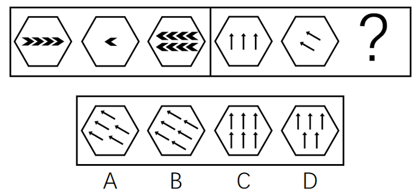

- **A**. A
- **B**. B　✅
- **C**. C
- **D**. D

**答案**：B

**官方解析**

题干每幅图中有多个小元素，优先考虑元素种类和个数。观察发现，左侧三幅图中，图三内部小元素数量为8，是图一内部小元素数量的2倍，同时图三内部小元素的方向与图二内部小元素的方向一致。右侧图形应用此规律，则？处图形内部箭头数量为图一内部箭头数量的2倍，应为6个箭头，排除A、D两项，图三内部箭头的方向应与图二内部箭头的方向一致，排除C项。
故正确答案为B。

---

### 第 16 题　qid 2731169 · 图形推理

从所给的四个选项中，选择最合适的一个填入问号处，使之呈现一定的规律性：

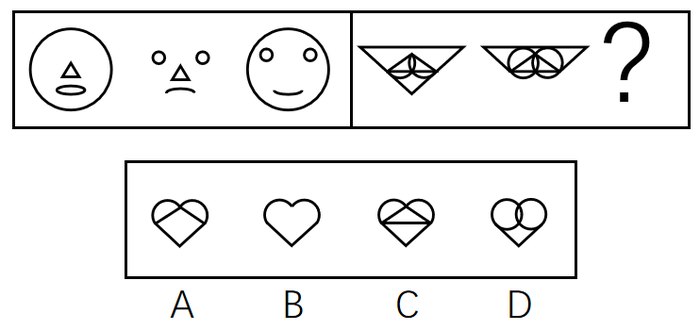

- **A**. A
- **B**. B　✅
- **C**. C
- **D**. D

**答案**：B

**官方解析**

元素组成相似，线条重复出现，考虑样式规律。观察左侧第一组图发现，前两幅图去同存异，得到第三幅图。将此规律应用到右侧第二组图中，只有B项符合。
故正确答案为B。

---

### 第 17 题　qid 2731178 · 图形推理

从所给的四个选项中，选择最合适的一个填入问号处，使之呈现一定的规律性：

- **A**. A
- **B**. B　✅
- **C**. C
- **D**. D

**答案**：B

**官方解析**

元素组成基本相同，优先考虑位置规律。整体来看，每一列都有三种元素，黑点、三角形、梯形，且三角形和梯形的位置依次往上移动。先看三角形，在依次往上移动的过程中，如果与黑点重合，三角形会把黑点覆盖，且三角形的方向会从尖朝上变成尖朝下，尖朝下时移动步数由一步变成两步，由第6列三角形尖朝上，可知三角形向上移动一步，排除C项。再看梯形，在往上移动的过程中，如果与黑点重合，梯形会把黑点覆盖，且梯形的方向会从短边在上变成短边在下，短边在下时步数由两步变成三步，由第6列梯形短边在下，可知梯形向上移动三步，又因为每一列都有三种元素，得知梯形在第7列必定与黑点重合了，所以梯形方向发生变化，由短边在下变成短边在上，排除A、D两项。
故正确答案为B。

---

### 第 18 题　qid 2731186 · 图形推理

下列选项中，可以由左图折叠而成的立体图是：

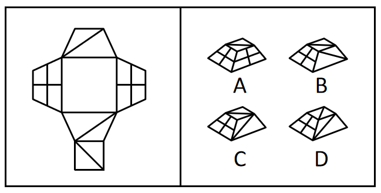

- **A**. A
- **B**. B
- **C**. C　✅
- **D**. D

**答案**：C

**官方解析**

本题考查六面体。将原展开图标上序号，如下图，逐一进行分析。

A项：选项中包括面b和面d，而展开图中面b和面d为相对面，不能同时出现，选项与展开图不一致，排除；

B项：选项中出现了面f、带斜线的梯形面和带十字的梯形面。在展开图中，带斜线的梯形面可能为面a或面e，其中面f中的斜线与面e中的斜线相交于点A，面f中的斜线与面a中的斜线相交于点B，如上图所示。而在选项中，面f中的斜线无论是与面a中的斜线还是面e中的斜线均无交点，选项与展开图不一致，排除；

C项：选项与展开图一致，当选；

D项：选项中出现了面f、带斜线的梯形面和带十字的梯形面。在展开图中，带斜线的梯形面可能为面a或面e，其中面f中的斜线与面e中的斜线相交于点A，面f中的斜线与面a中的斜线相交于点B，如上图所示。而在选项中，面f中的斜线无论是与面a中的斜线还是面e中的斜线均无交点，选项与展开图不一致，排除。

故正确答案为C。

---

### 第 19 题　qid 2731193 · 图形推理

下列选项中，符合所给图形的变化规律的是：

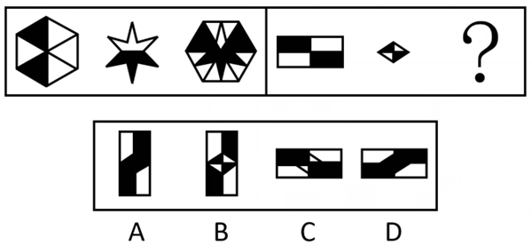

- **A**. A　✅
- **B**. B
- **C**. C
- **D**. D

**答案**：A

**官方解析**

元素组成相似，优先考虑样式规律。观察发现，第一组图，图1先顺时针旋转后，再与图2相加得到图3。第二组图满足同样的规律，图1先顺时针旋转后，再与图2相加得到图3，只有A项符合。

故正确答案为A。

---

### 第 20 题　qid 2731200 · 图形推理

下列选项中，符合所给图形的变化规律的是：

- **A**. A
- **B**. B　✅
- **C**. C
- **D**. D

**答案**：B

**官方解析**

观察发现，第一横行图中，将所有位置的小黑三角形拼在一起，可以得到一个完整的黑色正方形；经验证，第二横行满足此规律；第三横行应用此规律，故？处左上角区域和右下角区域应各有一个小黑三角形，只有B项符合。
故正确答案为B。

---

### 第 21 题　qid 2731208 · 图形推理

下列选项中，符合所给图形的变化规律的是：

- **A**. A　✅
- **B**. B
- **C**. C
- **D**. D

**答案**：A

**官方解析**

元素组成相同，优先考虑位置规律。每个图形都由5个圆组成，分别给这5个圆的位置标为1、2、3、4、5。从图一到图二，黑点由1号移动到2号位置，正方形由2号移动到4号位置，三角形由3号移动到1号位置，圆圈由4号移动到5号位置，×由5号移动到3号位置。经验证，从图二到图三也符合小元素由1号移动到2号位置，由2号移动到4号位置，由3号移动到1号位置，由4号移动到5号位置，由5号移动到3号位置。所以，从图三到图四也应符合此规律，只有A项符合。

故正确答案为A。

---

### 第 22 题　qid 2731219 · 图形推理

下列选项中，符合所给图形的变化规律的是：

- **A**. A
- **B**. B
- **C**. C　✅
- **D**. D

**答案**：C

**官方解析**

观察前两幅图，元素组成基本相同，优先考虑位置规律，图1横线以上部分（如下图所示），向下翻转后与下半部分重叠得到图2；后两幅图遵循此规律，将图3上半部分向下翻转后与下半部分重叠，只有C项符合。

故正确答案为C。

---

### 第 23 题　qid 2731224 · 图形推理

从所给的四个选项中，选择最合适的一个填入问号处，使之呈现一定的规律性：

- **A**. A
- **B**. B
- **C**. C
- **D**. D　✅

**答案**：D

**官方解析**

本题考查截面图。

观察发现，题干三幅立体图形水平截面都是圆，所以问号处立体图形的水平截面也应为圆，只有D项符合。

故正确答案为D。

---

### 第 24 题　qid 2731229 · 图形推理

从所给的四个选项中，选择最合适的一个填入问号处，使之呈现一定的规律性：

- **A**. A
- **B**. B　✅
- **C**. C
- **D**. D

**答案**：B

**官方解析**

元素组成相似，且相同线条重复出现，优先考虑样式规律中的加减同异。第一组规律为外框内部的竖线求同，内框内部的横线求同，内外框互换得到图3。第二组应遵循同样的规律，外框内部的竖线求同，内框内部的横线求同，内外框互换得到，对应B项。
故正确答案为B。

---

### 第 25 题　qid 2731237 · 图形推理

从所给的四个选项中，选择最合适的一个填入问号处，使之呈现一定的规律性：

- **A**. A
- **B**. B　✅
- **C**. C
- **D**. D

**答案**：B

**官方解析**

元素组成相同，优先考虑位置规律。通过观察发现，题干阴影三角形a从图1到图2，沿轴1进行翻转，从图2到图3，沿轴2进行上下翻转，图3到问号处也应遵循类似规律，阴影三角形a沿轴3进行翻转，呈现，排除C项；继续观察题干，根据就近原则，阴影三角形b从图1到图2，沿轴3进行翻转，从图2到图3，沿轴4进行左右翻转，图3到问号处也应遵循类似规律，阴影三角形b沿轴1进行翻转，呈现，排除A、D两项；进一步验证选项，阴影三角形c从图1到图2，沿轴1进行翻转，从图2到图3，沿轴2进行上下翻转，图3到问号处也应遵循类似规律，阴影三角形c沿轴3进行翻转，呈现，B项满足此规律。

故正确答案为B。

---

### 第 26 题　qid 2731238 · 逻辑判断

研究人员发现一颗距离地球仅16光年的行星上具有与地球相似的温度和气候条件，因此很有可能在这颗行星上发现生命存在的迹象。
如果上述结论成立，需要下列哪项作为前提假设？

- **A**. 该行星上的生命存在条件与地球上的类似　✅
- **B**. 该行星距离地球的距离越近越好
- **C**. 研究人员还需经过长期的观测才能发现这颗行星上的生命迹象
- **D**. 生物必须要在固定的温度和气候条件下才能存活

**答案**：A

**官方解析**

第一步：找出论点和论据。
论点：很有可能在这颗行星上发现生命存在的迹象。
论据：一颗距离地球仅16光年的行星上具有与地球相似的温度和气候条件。
论点讨论的是很可能在这颗行星上发现生命，论据讨论的是行星与地球存在相似的温度和气候条件，论点与论据讨论的话题不一致，提问为前提假设，优先考虑搭桥，选项需要建立起生命存在与温度和气候条件之间的联系。
第二步：逐一分析选项。
A项：该项强调行星上的生命存在条件与地球相似，说明有了这样的生存条件就可能存在生命，建立起了生命存在与温度和气候条件之间的联系，可以加强，当选；
B项：该项强调行星与地球距离越近越好，但是距地球远近与该行星是否会存在生命之间的关系无法得知，无法加强，排除；
C项：该项强调还需要经过长时间观测才能发现行星上的生命迹象，说明现阶段并没有发现该行星上存在生命，且与题干讨论的温度、气候条件相似是否能代表存在生命的话题无关，无法加强，排除；
D项：该项强调了生物必须要在固定的温度和气候条件下才能存活，但是这种固定的温度和气候条件与地球的温度和气候条件之间的关系不明确，无法加强，排除。
故正确答案为A。

---

### 第 27 题　qid 2731242 · 逻辑判断

根据中国和美国政府机构专家组成的工作组测算，美国官方统计的对华贸易逆差被高估了左右。更令人难以信服的是，美国政府引用的贸易数据只包括货物贸易，并未反映服务贸易。如果算进去，所谓的“贸易不平衡论”就更立不住了。

上述结论建立在下列哪项假设的基础之上？

- **A**. 美国对华服务贸易逆差巨大
- **B**. 美国对华服务贸易存在高额顺差　✅
- **C**. 美国购买了中国很多的工业产品
- **D**. 美国购买了中国很多的劳务服务

**答案**：B

**官方解析**

第一步：找出论点和论据。
论点：如果把服务贸易算进去，所谓的“贸易不平衡论”就更立不住了。
论据：美国政府引用的贸易数据只包括货物贸易，并未反映服务贸易。
本题问法为前提假设，加强优先考虑搭桥和必要条件，本题的论点和论据话题一致，都是在说服务贸易，故优先考虑补充必要条件。
第二步：逐一分析选项。
A项：指出美国对华服务贸易逆差巨大，如果把服务贸易算进去，增加了美国对华贸易存在的逆差，具有削弱作用，排除；
B项：指出美国对华服务贸易存在高额顺差，那么把服务贸易算进去，就会大大减少美国对华贸易存在的逆差，从而证明“贸易不平衡论”是立不住的，反过来如果美国对华服务贸易不存在高额顺差，那么即使把服务贸易算进去，也无法影响“贸易不平衡论”的成立，因此该项是论点成立的必要条件，当选；
C项：指出美国购买了中国很多的工业产品，工业产品属于货物贸易，与服务贸易无关，与论点话题不一致，无法加强，排除；
D项：指出美国购买了中国很多的劳务服务，但没有具体说明劳务服务是顺差还是逆差，无法加强，排除。
故正确答案为B。

---

### 第 28 题　qid 2731272 · 逻辑判断

哺乳动物在衰老过程中，大脑中的小胶质细胞会转变为促炎表型，出现过度活化，进而产生损害认知和运动功能的化学物质。这是为什么人到老年大脑功能会衰退的原因之一。实验表明，多补充膳食纤维，可以平衡与年龄有关的肠道微生物群失调，从而提高血液中丁酸盐的水平。研究人员据此建议老年人多吃富含膳食纤维的食物，称这有助于他们延缓大脑功能衰退的进程。
下列（    ）项如果为真，最能支持上述研究人员建议。

- **A**. 膳食纤维会促进肠道中有益细菌的生长，产生多种短链脂肪酸
- **B**. 丁酸盐可以减轻大脑中的小胶质细胞的促炎表型，增强细胞抗炎能力　✅
- **C**. 多吃富含膳食纤维的食物需要增加牙齿的咀嚼，这增加了口腔的运动量
- **D**. 老年人吸收功能降低，多吃富含膳食纤维的食物可以增加肠道蠕动

**答案**：B

**官方解析**

第一步：找出论点和论据。
论点：老年人多吃富含膳食纤维的食物，这有助于他们延缓大脑功能衰退的进程。
论据：多补充膳食纤维，可以平衡与年龄有关的肠道微生物群失调，从而提高血液中丁酸盐的水平。
本题论点说的是多吃富含膳食纤维的食物有助于延缓大脑功能衰退的进程，而论据说的是补充膳食纤维可以提高血液中丁酸盐的水平。论点和论据讨论的话题不一致，优先考虑搭桥，即建立“丁酸盐”和“延缓大脑功能衰退的进程”之间的联系。
第二步：逐一分析选项。
A项：指出膳食纤维会促进肠道中有益细菌的生长，产生多种短链脂肪酸，但无法说明这些短链脂肪酸是否会对延缓大脑功能衰退的进程产生作用，无法加强，排除；
B项：指出丁酸盐可以减轻大脑中的小胶质细胞的促炎表型，再结合题干中的内容，小胶质细胞的促炎表型的过度活化正是大脑功能衰退的原因之一，在“丁酸盐”和“延缓大脑功能衰退的进程”之间建立联系，属于搭桥项，可以加强，当选；
C项：指出多吃富含膳食纤维的食物增加了口腔的运动量，与论点讨论的多吃富含膳食纤维的食物有助于延缓大脑功能衰退的进程无关，话题不一致，无法加强，排除；
D项：指出老年人多吃富含膳食纤维的食物可以增加肠道蠕动，与论点讨论的多吃富含膳食纤维的食物有助于延缓大脑功能衰退的进程无关，话题不一致，无法加强，排除。
故正确答案为B。

---

### 第 29 题　qid 2731274 · 逻辑判断

有些人正是因为吃了太多肉类和海鲜，畅饮了过多啤酒，导致尿酸水平升高，造成尿酸盐在关节和肾脏部位沉积，才使他们患上痛风。因此，患上痛风，对于判断这些患者是否吃了太多肉类和海鲜，畅饮了过多啤酒是一项必不可少的条件。
下列（    ）项如果为真，最能削弱上述断定。

- **A**. 有些人吃了太多的肉类和海鲜，畅饮了过多的啤酒，经检验的确患有痛风
- **B**. 有些人没有吃太多的肉类和海鲜，畅饮过多的啤酒，但是患有痛风
- **C**. 有些人没有吃太多的肉类和海鲜，畅饮过多的啤酒，也未患有痛风
- **D**. 有些人吃了太多的肉类和海鲜，畅饮了过多的啤酒，但是并未患有痛风　✅

**答案**：D

**官方解析**

第一步：找出论点和论据。
论点：患上痛风，对于判断这些患者是否吃了太多肉类和海鲜，畅饮了过多啤酒是一项必不可少的条件。
论据：吃了太多肉类和海鲜，畅饮了过多啤酒，导致尿酸水平升高，造成尿酸盐在关节和肾脏部位沉积，才使他们患上痛风。
本题的论点和论据说的都是吃了太多肉类和海鲜，畅饮了过多啤酒会患上痛风，论点论据话题一致，优先考虑削弱论点，即证明吃了太多肉类和海鲜，畅饮了过多啤酒不会患上痛风。
第二步：逐一分析选项。
A项：指出有些人吃了太多的肉类和海鲜，畅饮了过多的啤酒，经检验的确患有痛风，是对论据的同义替换，无法削弱，排除；
B项：指出有些人没有吃太多的肉类和海鲜，畅饮过多的啤酒，而论点是有些人吃了太多的肉类和海鲜，畅饮了过多的啤酒，话题不一致，无法削弱，排除；
C项：指出有些人没有吃太多的肉类和海鲜，畅饮过多的啤酒，而论点是有些人吃了太多的肉类和海鲜，畅饮了过多的啤酒，话题不一致，无法削弱，排除；
D项：指出有些人吃了太多的肉类和海鲜，畅饮了过多的啤酒，但是并未患有痛风，说明患痛风并非是必不可少的条件，直接否定论点，可以削弱，当选。
故正确答案为D。

---

### 第 30 题　qid 2731279 · 逻辑判断

在针对某病症的一项医药疗效的双盲实验中，某课题组将实验对象分成两个组：实验组和对照组，两组的重症率都在左右，和同期患该病症的整体重症率相当。实验结果显示：对照组18例中死亡7人，病死率为；使用该药的实验组34例中死亡3人，病死率仅为。课题组由此认为，该药物对此病症具有明显的疗效。

下列（    ）项如果为真，最能质疑课题组的结论。

- **A**. 
该药物组成成分并没有全部公开

- **B**. 
同期患该病症的整体死亡率为
　✅
- **C**. 
在普通人群中，患该病症的人数不到

- **D**. 
在古代医药典籍中，就已经记载有该药物的配方

**答案**：B

**官方解析**

第一步：找出论点和论据。

论点：该药物对此病症具有明显的疗效。

论据：某课题组将实验对象分成两个组：实验组和对照组，两组的重症率都在左右，和同期患该病症的整体重症率相当。实验结果显示：对照组18例中死亡7人，病死率为；使用该药的实验组34例中死亡3人，病死率仅为。

本题论点讨论的是该药物对此病症有明显的疗效，论据讨论的是通过对比实验说明用了该药物的实验组病死率较低，从而说明该药物有效果。论点和论据讨论的话题一致，优先考虑削弱论点。

第二步：逐一分析选项。

A项：该项讨论的是没有全部公开该药物的组成成分，但药物组成成分没有全部公开与药物是否有效无关，为无关选项，无法削弱，排除；

B项：该项说明了同期患该病症的整体死亡率为，比题干中实验组用该药后的病死率低，说明使用了该药物对此病症效果不明显，削弱论点，当选；

C项：论点讨论的是该药物对此病症具有明显的疗效，而选项讨论的是普通人群中患该病症的人数比例极小，与论点话题不一致，为无关选项，无法削弱，排除；

D项：该项说明该药物配方有记载可依，但是没提到该药物对于此病症的效果如何，与论点话题不一致，为无关选项，无法削弱，排除。

故正确答案为B。

---

### 第 31 题　qid 2731283 · 逻辑判断

在一项考试成绩提升计划实施前，负责老师统计了参与该计划的、学业表现不佳的学生每天花在网上的平均时间。他重新制定了这些学生的学习计划，要求他们每天减少上网时间，并预测了遵守其要求的学生的考试成绩所可能的提升幅度。但是，考试成绩评定的最终结果表明，这些学生的成绩提升幅度并没有达到预期水平。
下列（    ）项如果为真，最能解释上述现象。

- **A**. 在计划结束前夕，参与计划的不少学生主动减少了比老师所要求的更多的上网时间
- **B**. 根据重新制定的学习计划，所有的课后作业都需要通过在线学习平台来完成和提交　✅
- **C**. 参与计划的学生每天上网时间的减少不会对他们完成新的学习计划产生影响
- **D**. 该负责老师成功预测过参与其他考试成绩提升计划的学生的成绩提升幅度

**答案**：B

**官方解析**

第一步：找出题干矛盾。
老师重新制定了学生的学习计划，要求他们每天减少上网时间，并预测了遵守其要求的学生的考试成绩所可能的提升幅度。但是，考试成绩评定的最终结果表明，这些学生的成绩提升幅度并没有达到预期水平。
第二步：逐一分析选项。
A项：该项只能说明有学生减少了更多的上网时间，但是没提到对成绩提升幅度的影响，不能解释题干矛盾，排除；
B项：该项说明根据重新制定的计划，所有的课后作业都需要通过在线学习平台来完成和提交，说明完成这些课后作业需要上网，但是计划要求减少上网时间，因此学习计划影响了学生完成和提交课后作业，从而可能会影响成绩的提升幅度，可以解释题干矛盾，当选；
C项：该项只能说明上网时间的减少不会对完成新的学习计划有影响，但是没提到对成绩的提升幅度是否有影响，不能解释题干矛盾，排除；
D项：该项只能说明该老师成功预测过参与其他学习计划的学生的成绩提升幅度，但是没提到此学习计划对这些学生的成绩提升幅度的影响，不能解释题干矛盾，排除。
故正确答案为B。

---

### 第 32 题　qid 2731289 · 逻辑判断

李白的《江上吟》末二句云：“功名富贵若长在，汉水亦应西北流。”汉水，又名汉江，发源于今陕西省宁强县，东南流经湖北襄阳，至汉口汇入长江。
根据以上信息，下列哪项最符合李白的观点？

- **A**. 功名富贵能长在，但汉水不应西北流
- **B**. 若功名富贵不长在，则汉水不应西北流
- **C**. 功名富贵不能长在　✅
- **D**. 若汉水能西北流，则功名富贵能长在

**答案**：C

**官方解析**

第一步：翻译题干。

①功名富贵长在汉水西北流；

②汉水是东南流向。

第二步：逐一分析选项。

A项：翻译为功名富贵长在 且 汉水不应西北流，该选项为条件①的矛盾命题，所以不符合李白的观点，排除；

B项：翻译为功名富贵不长在汉水不应西北流，否定了条件①的前件，否前得不到确定结论，排除；

C项：条件②汉水是东南流向，是对条件①的否后，否后必否前，应得到功名富贵不长在，符合李白的观点，当选；

D项：翻译为汉水能西北流功名富贵能长在，肯定了条件①的后件，肯后得不到确定结论，排除。

故正确答案为C。

---

### 第 33 题　qid 2731291 · 类比推理

赵、钱、孙、李、周、吴打算组队参加创新创业大赛。大赛规定一个团队必须为三位选手。赵说：“钱和李肯定不能组成一队。”钱说：“孙在哪队，我就在哪队。”孙说：我没和赵、李一队。”李说：“我和钱、孙一队。”周说：“我和赵不能在一队。”吴说：“我和周不在一队。”
如果六个人中有五个人的话为真，那么下列选项中正确的是（    ）项。

- **A**. 赵、钱、孙一队
- **B**. 钱、孙、周一队　✅
- **C**. 钱、孙、吴一队
- **D**. 赵、孙、李一队

**答案**：B

**官方解析**

第一步：分析题干条件。
赵、钱、孙、李、周、吴需要分为两组，每组有三人。
（1）赵：钱和李不在同一队；
（2）钱：孙和钱在同一队；
（3）孙：孙不和赵一队，孙也不和李一队；
（4）李：李、钱、孙都在同一队；
（5）周：周和赵不在同一队；
（6）吴：吴和周不在同一队。
分析题干条件，赵和李的话中针对的“钱和李是否在同一队”的说法必然有一假。
第二步：看其余，根据题干推理。
根据题干条件可知，六个人中有五个人的话为真，即本题只有一假，且赵和李的话必有一假，因此其他人说的都是真话。根据钱的话可知，钱和孙在一队，排除D项；根据孙的话可知，赵和李在一队，且不与孙一队，排除A项；根据周的话可知，周和赵不在同一队，排除C项，根据吴的话可知，吴和周不在同一队，整理所有结论可得，钱、孙、周在同一队，赵、李、吴在同一队，只有B项正确。
故正确答案为B。

---

### 第 34 题　qid 2731292 · 类比推理

某单位2019年初招聘了8名研发人员，他们都非常优秀。其中，小李、小孔和小陈3人研发小组表现尤其突出。该团队氛围极佳，组长小陈非常关心小李和小孔，而小李非常敬佩小孔，小孔非常敬佩小陈。年终时，小陈获得了四项发明专利，小李获得了五项发明专利。
根据以上信息，可以得出下列哪项？

- **A**. 小孔的发明专利比小陈多
- **B**. 组长小陈获得的发明专利最多
- **C**. 小李的发明专利没有小孔多
- **D**. 有人获得的发明专利比其敬佩的人多　✅

**答案**：D

**官方解析**

第一步：分析题干所给信息。
（1）组长小陈非常关心小李和小孔；
（2）小李非常敬佩小孔；
（3）小孔非常敬佩小陈；
（4）小陈获得了四项发明专利；
（5）小李获得了五项发明专利。
第二步：根据题干信息逐一分析选项。
A项：题干中没有提及小孔的发明专利数量，无法推出，排除；
B项：组长小陈获得了四项发明专利，小李获得了五项发明专利，则小陈的发明专利不是最多的，无法推出，排除；
C项：题干中没有提及小孔的发明专利数量，无法推出，排除；
D项：由于小孔的发明专利数量不明，因此对小孔的发明专利数量进行假设：
假设小孔的发明专利数量不超过4，根据小李获得了五项发明专利，且小李非常敬佩小孔，可以推出有人获得的发明专利比其敬佩的人多；
假设小孔的发明专利数量大于4，根据小陈获得了四项发明专利，且小孔非常敬佩小陈，可以推出有人获得的发明专利比其敬佩的人多。
综合以上两种情况，D项当选。
故正确答案为D。

---

### 第 35 题　qid 2731295 · 类比推理

将6盒茶叶放入甲、乙、丙、丁、戊、己、庚、辛八个箱子中，其中四个箱子有茶叶。已知：
（1）在甲、乙、丙、丁四个箱子中共有5盒茶叶；
（2）在丁、戊、己三个箱子中共有3盒茶叶；
（3）在丙、丁两个箱子中共有2盒茶叶。
根据以上信息，可以得出下列哪项？

- **A**. 甲箱中至少有1盒　✅
- **B**. 乙箱中至少有2盒
- **C**. 己箱中至少有2盒
- **D**. 戊箱中至少有1盒

**答案**：A

**官方解析**

第一步：分析题干条件。
（1）在甲、乙、丙、丁四个箱子中共有5盒茶叶；
（2）在丁、戊、己三个箱子中共有3盒茶叶；
（3）在丙、丁两个箱子中共有2盒茶叶。
第二步：根据题干条件进行推理。
根据条件（1）及茶叶总数量为6盒可知，戊、己、庚、辛四个箱子中共有1盒茶叶，则己箱中至多有1盒茶叶，排除C项；
根据条件（3）可知，丁箱子中至多有2盒茶叶，结合条件（2）可知，丁箱子中必定有2盒茶叶，丙箱子中没有茶叶，戊、己两个箱子中共有1盒茶叶，但不能确定茶叶在是戊箱子中还是己箱子中，排除D项；
此时丁箱子中有2盒茶叶，戊、己中的1个箱子中有1盒茶叶，丙、庚、辛三个箱子中没有茶叶；根据四个箱子有茶叶可知，甲、乙两个箱子中都要有茶叶；根据条件（1）（3）可知，甲、乙两个箱子中共有3盒茶叶，则可分为两种情况：①甲箱子中1盒茶叶，乙箱子中2盒茶叶；②甲箱子中2盒茶叶，乙箱子中1盒茶叶。综合以上两种情况，A项当选。
故正确答案为A。

---
