# 2021年上海市公务员录用考试《行测》题（B类）（网友回忆版）

> 判断推理 · 34 题 · 上海 2021

## 材料 1

某单位今年招录了8名应届毕业生，其中甲和乙是文科生，丙、丁、戊是理科生，己、庚、辛是工科生。8人中，甲、丙、己是女士。单位拟从中选出5人组成一个研发团队，团队中文科生、理科生和工科生至少各有1人，并且至少要有1名女士参加。此外，还要满足下列条件：

（1）丙和庚至多有1人参加；

（2）若乙参加，则丁也参加；

（3）戊和辛要么都参加，要么都不参加。

### 第 1 题　qid 2731298 · 类比推理

下列（    ）项组合方案满足上述对于研发团队的要求。

- **A**. 甲、丙、丁、己、庚
- **B**. 甲、丁、戊、己、辛　✅
- **C**. 乙、丙、戊、己、辛
- **D**. 乙、丁、戊、己、庚

**答案**：B

**官方解析**

第一步，整理题干条件。

（1）丙或庚；

（2）乙丁；

（3）戊和辛要么都参加，要么都不参加。

第二步，根据题干条件分析选项。

根据条件（1）可知，丙和庚不能同时参加，排除A项；根据条件（2）可知，乙参加，丁一定参加，排除C项；根据条件（3）可知，戊和辛要么都参加，要么都不参加，排除D项。

故正确答案为B。

---

### 第 2 题　qid 2731301 · 类比推理

如果甲没有参加，则下列（    ）项可能为真。

- **A**. 理科生只有戊参加
- **B**. 工科生只有己参加
- **C**. 3名理科生都参加　✅
- **D**. 3名工科生都参加

**答案**：C

**官方解析**

第一步，整理题干条件。

（1）丙或庚；

（2）乙丁；

（3）戊和辛要么都参加，要么都不参加；

（4）甲不参加。

第二步，根据题干条件分析选项。

根据条件（4）可知，甲不参加，结合题干信息文科生至少有一人参加，则乙一定参加，又结合条件（2）可知，丁一定参加，因此可排除A项。

结合题干问“可能为真”，故可采用代入法。

代入B项：工科生只有己参加，那么庚、辛不参加。根据条件（3）可知，戊不参加；此时，甲、庚、辛、戊四人不参加，不满足选出5人参加这一条件，故B项不可能为真，排除；

代入C项：3名理科生都参加，即丙、丁、戊都参加。根据条件（1）可知，庚不参加；根据条件（3）可知，辛参加。此时，参加人数有：乙、丙、丁、戊、辛5人，不参加有：甲、庚两人，现只需己不参加，即可符合题干要求，故C项可能为真，当选；

代入D项：3名工科生都参加，即己、庚、辛都参加，根据条件（1）可知，丙不参加；根据条件（3）可知，戊参加。此时，参加人数有：乙、丁、己、庚、辛、戊6人，不符合题干要求，故D项不可能为真，排除。

故正确答案为C。

---

### 第 3 题　qid 2731055 · 类比推理

喷水鱼因特殊的捕食方式而得名，能喷出一股水柱，准确击落空中的昆虫作为食物。下列各图中能正确表示喷水鱼看到昆虫像的光路图的是：

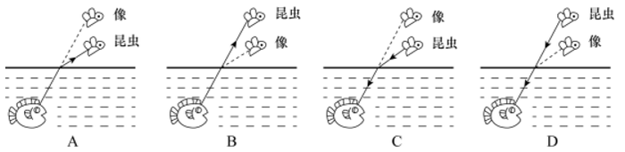

- **A**. A
- **B**. B
- **C**. C　✅
- **D**. D

**答案**：C

**官方解析**

此题考察光在不同介质中的折射，喷水鱼在水中看空气中的昆虫，是昆虫反射的光线进入到喷水鱼的眼睛，故A、B两项错误；光从空气中斜射入水中，实际光线的入射角大于折射角，鱼的眼睛看到的是水中光线的反向延长线上昆虫的虚像，看到的虚像比实际昆虫的位置偏高，C项正确，D项错误。
故正确答案为C。

---

### 第 4 题　qid 2731049 · 类比推理

现代社会离不开电能，火力发电仍然是目前重要的发电形式之一，它“吃”进的是煤，“吐”的是电，在这个过程中的能量转化是：

- **A**. 
机械能内能化学能电能

- **B**. 
化学能内能机械能电能
　✅
- **C**. 
化学能重力势能动能电能

- **D**. 
内能化学能机械能电能

**答案**：B

**官方解析**

火力发电时，烧煤时煤的化学能先转变成内能，内能再转化为发电装置的机械能，最终转化为电能。
故正确答案为B。

---

### 第 5 题　qid 2732696 · 逻辑判断

一根电热丝的电阻值为，将它接在电压为的电路中时，在时间内产生的热量为。使用一段时间后，将电热丝剪掉一小段，剩下一段的电阻值为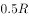。现将剩下的这段电热丝接入电路，则：

- **A**. 
若仍将它接在电压为的电路中，在时间t内产生的热量为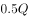

- **B**. 
若仍将它接在电压为的电路中，产生的热量为，所需时间为

- **C**. 
若将它接入电压为的电路中，在时间内产生的热量为
　✅
- **D**. 
若将它接入另一电路，在时间内产生的热量仍为，这个电路的电压为

**答案**：C

**官方解析**

热量的表达式为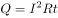，对于纯电阻电路可变式为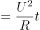。

当电路为一根电热丝时热量，当时，逐项分析：

A项，此时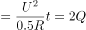，错误；

B项，若，则，错误；

C项，若，则，正确；

D项，若，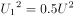，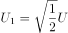，错误。

故正确答案为C。

---

### 第 6 题　qid 2731104 · 类比推理

已知化学反应进行前后，参加反应的物质种类发生变化，总质量不发生变化，催化剂的质量也不发生变化。某密闭容器内有四种物质，反应一段时间后，测得反应前后各物质的质量如下表所示。下列说法正确的是：

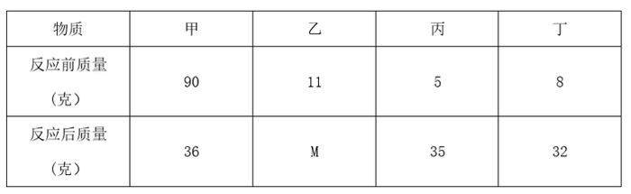

- **A**. 丁一定是单质
- **B**. M的值是15
- **C**. 该反应是分解反应　✅
- **D**. 反应中的甲、丙质量比为15：27

**答案**：C

**官方解析**

A项：丁属于生成物，通过条件信息，无法确定丁是否为单质，错误；

B项：由化学反应原理可知，化学反应进行前后，反应前的物质总量等于反应后的物质的总量即，，错误；

C项：该反应为甲丙丁，故该反应为分解反应，正确；

D项：由以上分析可知，参加反应的甲为54克，生成的丙为30克，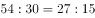，错误。

故正确答案为C。

---

### 第 7 题　qid 2732697 · 定义判断

日常生活中，需要对身边的一些常见的科学量进行估测，以下估测数据符合实际的是：

- **A**. 科学书中一页纸张的厚度约为0.01m
- **B**. 一粒西瓜子平放在桌面上时，对桌面的压强约为20Pa　✅
- **C**. 一个成年人从一楼走上二楼克服重力做的功约为150J
- **D**. 教室里的日光灯正常发光时的电流约为10mA

**答案**：B

**官方解析**

A项，0.01m1cm，一页纸张的厚度为1cm，不符合实际，错误；

B项，西瓜子的百粒平均重量约在20-30g之间，一粒西瓜子的质量约为0.2-0.3g，面积约为，根据压强计算公式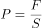，压强约在20-30pa之间，正确；

C项，功的计算公式为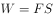，一个成年人的体重约为50-70kg，一层楼的高度约为3米，则克服重力做的功约为1500-2100J，150J不符合实际，错误；

D项，10mA0.01A，家庭电路的电压为220V，若电流为0.01A，根据，则日光灯工作时的功率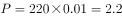W，功率太低，不符合实际，错误。

故正确答案为B。

---

### 第 8 题　qid 2731071 · 逻辑判断

如图所示，一个弹性小球从a点静止释放，竖直撞击水平地面后反弹，已知空气阻力大小恒定，撞击地面无能量损失。对于小球下落后反弹至最高点的过程中，下列说法正确的是：

- **A**. 因为空气阻力大小不变，所以下落过程阻力做功等于反弹时阻力做的功
- **B**. 因为撞击时地面给小球向上的作用力，所以小球反弹的最高点高于a点
- **C**. 小球下落过程中空气阻力做负功，反弹过程中空气阻力做正功
- **D**. 小球下落过程和反弹过程均是匀变速直线运动，但加速度不同　✅

**答案**：D

**官方解析**

A项：功的公式，下落过程和反弹过程空气阻力相等，但是空气阻力一直做负功，下落过程的位移大于反弹时的位移，所以两个过程中空气阻力做的功不相等，错误；

B、C两项：小球在下落过程中所受的空气阻力方向向上，空气阻力方向与运动的方向相反，空气阻力做负功；小球反弹之后，小球向上运动，小球所受的空气阻力向下，空气阻力方向与小球的运动方向相反，空气阻力做负功，无论小球向上还是向下运动，空气阻力始终做负功，空气阻力做负功，使小球的机械能减少，小球反弹之后最高点一定低于a点，均错误；

D项：设小球的质量为，分析小球的受力情况，小球在下降过程中受到竖直向下的重力和竖直向上的空气阻力，由牛顿的第二定律可得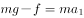，加速度大小方向均不变，小球做匀加速直线运动。小球在反弹之后向上运动的过程中受到竖直向下的重力和空气阻力，由牛顿第二定律可得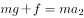，大小和方向均不变，故小球做匀减速直线运动，由以上分析可知，正确。

故正确答案为D。

---

### 第 9 题　qid 2731059 · 定义判断

分类是科学研究的重要方法，物质可以分为纯净物和混合物，纯净物可以分为单质和化合物。下列四种物质符合如图所示关系的是：

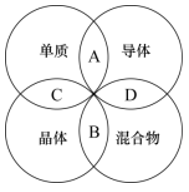

- **A**. 铜
- **B**. 干冰
- **C**. 金刚石　✅
- **D**. 陶瓷

**答案**：C

**官方解析**

此题考察化学中常见物质分类，需要将题干中涉及的单质、导体、晶体、混合物的相关定义理解清楚。

单质：是由一种元素的原子组成的以游离形式较稳定存在的物质，例如：氧气（），铜（）等。

晶体：是原子、离子或分子按照一定的周期性，在三维空间作有规律的周期性重复排列所形成的物质，例如：冰（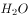）等。

导体：能够导电的物体，例如铁（）等。

混合物：是由两种或多种物质混合而成的物质。

A项：铜（）既属于单质也属于导体，正确；

B项：干冰是固态的二氧化碳（），是纯净物，错误；

C项：金刚石（）是单质，也是原子晶体，正确；

D项：陶瓷是粘土、石英等混合烧制而成的，属于混合物，但陶瓷不能导电，是因为陶瓷原子的最外层电子被束缚在各自原子的四周，不能自由移动，错误。

故正确答案为C。

特殊说明：此题存在一定的争议，铜单质属于单质、导体、原子晶体，属于三者，图中的A只含有两个部分，粉笔更加倾向于选C。

---

### 第 10 题　qid 2732698 · 类比推理

下图是碳酸氢铵（）化肥包装袋上的部分信息，关于该化肥的说法错误的是：

- **A**. 不要受潮或暴晒
- **B**. 与碱性化肥混合施用　✅
- **C**. 储存和运输时要注意密封
- **D**. 施用后要盖土或立即灌溉

**答案**：B

**官方解析**

A项，根据题干可以知道，碳酸氢铵（）受潮或暴晒时会分解，正确；

B项，碳酸氢铵（）中含有铵根离子，能和碱反应放出氨气，导致氮元素流失，肥效降低甚至完全消失，错误；

C项，运输过程中，需保持容器密封，利于防潮、防雨、防曝晒，正确；

D项，碳酸氢铵（）容易分解挥发，损失肥效，施用后要盖土或立即灌溉，可防止挥发，正确。

本题为选非题，故正确答案为B。

---

### 第 11 题　qid 2731139 · 定义判断

“绿色化学”要求物质回收或循环利用，反应物原子利用率为，且全部转化为产物，“三废”必须先处理再排放。下列做法或反应符合“绿色化学”要求的是：

- **A**. 
焚烧塑料以消除“白色污染”

- **B**. 
深埋含镉、汞的废旧电池

- **C**. 

　✅
- **D**. 
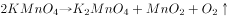

**答案**：C

**官方解析**

A项：焚烧塑料会产生大量的废气污染空气，不符合条件中的“绿色化学”要求，错误；

B项：深埋含镉、汞的废旧电池，没有先处理再排放，不符合“绿色化学”要求，并且深埋处理会污染土壤和水源，错误；

C项：由化学反应方程式可知，丙炔、氢气、一氧化碳反应生成戊二醛，原子的利用率为，符合“绿色化学”要求，正确；

D项：利用高锰酸钾加热生产氧气，产物还有锰酸钾和二氧化锰，原子的利用率不足，不符合“绿色化学”要求，错误。

故正确答案为C。

---

### 第 12 题　qid 2732702 · 类比推理

科学家认为二氧化碳不是造成温室效应的主要原因，导致温室效应的主要为以下四种气体：

从这个表不能确定哪种是影响温室效应的主要气体，还应该收集下列<u>          </u>的数据才能得出是什么气体主要导致了温室效应。

- **A**. 关于这四种气体的产源
- **B**. 植物所能吸收这些气体的量
- **C**. 这四种气体的分子式
- **D**. 这四种气体在大气中的总排放量　✅

**答案**：D

**官方解析**

温室效应是指透射阳光的密闭空间由于与外界缺乏热对流而形成的保温效应，即太阳短波辐射可以透过大气射入地面，而地面增暖后放出的长波辐射却被大气中的二氧化碳等物质所吸收，从而产生大气变暖的效应。大气中的二氧化碳就像一层厚厚的玻璃，使地球变成了一个大暖房。

从题干中表格可知，与其他三种气体相比，最少量的二氧化碳即可导致相同效果的温室效应，这仅说明了二氧化碳对温室效应的作用效果是最强的。但要确定哪种气体是造成温室效应的主要原因，还需确定每种气体在大气中的量。作用效果排放量综合分析后方可确定，故D项正确，A、B、C三项均与题意无关。

故正确答案为D。

---

### 第 13 题　qid 2731200 · 图形推理

下列选项中，符合所给图形的变化规律的是：

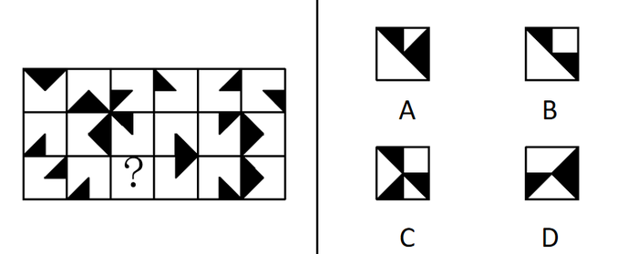

- **A**. A
- **B**. B　✅
- **C**. C
- **D**. D

**答案**：B

**官方解析**

观察发现，第一横行图中，将所有位置的小黑三角形拼在一起，可以得到一个完整的黑色正方形；经验证，第二横行满足此规律；第三横行应用此规律，故？处左上角区域和右下角区域应各有一个小黑三角形，只有B项符合。
故正确答案为B。

---

### 第 14 题　qid 2731208 · 图形推理

下列选项中，符合所给图形的变化规律的是：

- **A**. A　✅
- **B**. B
- **C**. C
- **D**. D

**答案**：A

**官方解析**

元素组成相同，优先考虑位置规律。每个图形都由5个圆组成，分别给这5个圆的位置标为1、2、3、4、5。从图一到图二，黑点由1号移动到2号位置，正方形由2号移动到4号位置，三角形由3号移动到1号位置，圆圈由4号移动到5号位置，×由5号移动到3号位置。经验证，从图二到图三也符合小元素由1号移动到2号位置，由2号移动到4号位置，由3号移动到1号位置，由4号移动到5号位置，由5号移动到3号位置。所以，从图三到图四也应符合此规律，只有A项符合。

故正确答案为A。

---

### 第 15 题　qid 2731219 · 图形推理

下列选项中，符合所给图形的变化规律的是：

- **A**. A
- **B**. B
- **C**. C　✅
- **D**. D

**答案**：C

**官方解析**

观察前两幅图，元素组成基本相同，优先考虑位置规律，图1横线以上部分（如下图所示），向下翻转后与下半部分重叠得到图2；后两幅图遵循此规律，将图3上半部分向下翻转后与下半部分重叠，只有C项符合。

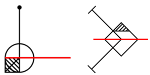

故正确答案为C。

---

### 第 16 题　qid 2731224 · 图形推理

从所给的四个选项中，选择最合适的一个填入问号处，使之呈现一定的规律性：

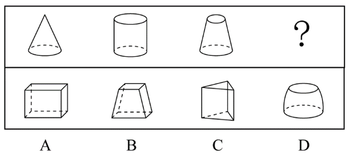

- **A**. A
- **B**. B
- **C**. C
- **D**. D　✅

**答案**：D

**官方解析**

本题考查截面图。

观察发现，题干三幅立体图形水平截面都是圆，所以问号处立体图形的水平截面也应为圆，只有D项符合。

故正确答案为D。

---

### 第 17 题　qid 2731229 · 图形推理

从所给的四个选项中，选择最合适的一个填入问号处，使之呈现一定的规律性：

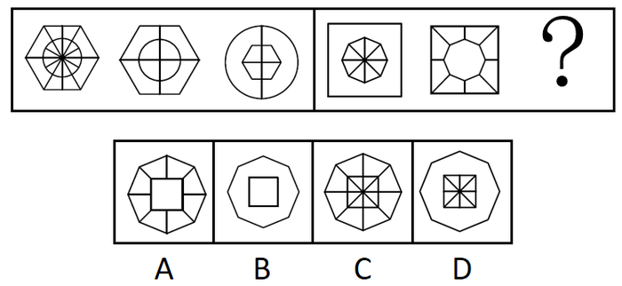

- **A**. A
- **B**. B　✅
- **C**. C
- **D**. D

**答案**：B

**官方解析**

元素组成相似，且相同线条重复出现，优先考虑样式规律中的加减同异。第一组规律为外框内部的竖线求同，内框内部的横线求同，内外框互换得到图3。第二组应遵循同样的规律，外框内部的竖线求同，内框内部的横线求同，内外框互换得到，对应B项。
故正确答案为B。

---

### 第 18 题　qid 2731237 · 图形推理

从所给的四个选项中，选择最合适的一个填入问号处，使之呈现一定的规律性：

- **A**. A
- **B**. B　✅
- **C**. C
- **D**. D

**答案**：B

**官方解析**

元素组成相同，优先考虑位置规律。通过观察发现，题干阴影三角形a从图1到图2，沿轴1进行翻转，从图2到图3，沿轴2进行上下翻转，图3到问号处也应遵循类似规律，阴影三角形a沿轴3进行翻转，呈现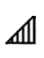，排除C项；继续观察题干，根据就近原则，阴影三角形b从图1到图2，沿轴3进行翻转，从图2到图3，沿轴4进行左右翻转，图3到问号处也应遵循类似规律，阴影三角形b沿轴1进行翻转，呈现，排除A、D两项；进一步验证选项，阴影三角形c从图1到图2，沿轴1进行翻转，从图2到图3，沿轴2进行上下翻转，图3到问号处也应遵循类似规律，阴影三角形c沿轴3进行翻转，呈现，B项满足此规律。

故正确答案为B。

---

### 第 19 题　qid 2732705 · 图形推理

下列选项中，符合所给图形变化规律的是：

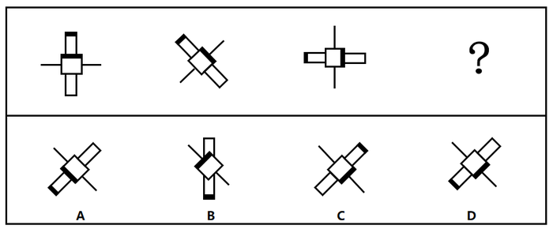

- **A**. A
- **B**. B
- **C**. C
- **D**. D　✅

**答案**：D

**官方解析**

元素组成相同，优先考虑位置规律。观察题干，图形中间部分的黑边正方形每幅图依次顺时针旋转，故？处图形中间部分的黑边正方形应在第三幅图形的基础上顺时针旋转，排除A、B两项；继续观察，题干图形的黑边长方形每幅图依次逆时针旋转，故？处图形的黑边长方形应在第三幅图形的基础上逆时针旋转，只有D项符合。

故正确答案为D。

---

### 第 20 题　qid 2732706 · 图形推理

下列选项中，符合所给图形的变化规律的是：

- **A**. A
- **B**. B
- **C**. C　✅
- **D**. D

**答案**：C

**官方解析**

元素组成不同，且无明显属性规律，考虑数量规律。九宫格优先横着看，第一行中，出现了单一线条，考虑线数量，线数量分别为1、4、3，加起来之和为8；第三行中，出现了立体图形，图2可以拆分看做4个六面体，立体图形个数分别为2、4、2，数量之和为8；第二行中，出现较多“窟窿”，考虑面数量，前两个图形的面数量分别为3、2，则“？”处面数量应为3，使面数量之和相加为8，只有C项符合。
故正确答案为C。

---

### 第 21 题　qid 2732708 · 图形推理

下列选项中，符合所给图形变化规律的是：

- **A**. A　✅
- **B**. B
- **C**. C
- **D**. D

**答案**：A

**官方解析**

元素组成相似，优先考虑样式规律。观察可知，题干图形轮廓相同，内部被切割且出现黑白格，考虑黑白运算，但直接进行黑白运算不存在规律，此时考虑样式规律与位置旋转相结合的复合考法。观察发现，运算规则为：；；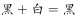；。根据此运算规则，第一组前两个图形叠加出的结果如图一所示，图一旋转得到第一组图中第三个图。第二组图遵循此规律，根据黑白运算规则得出的结果如图二所示，旋转，对应A项。

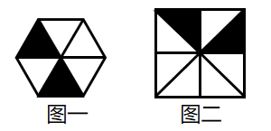

故正确答案为A。

---

### 第 22 题　qid 2732711 · 图形推理

“·”和“○”按箭头指示路线运动。下列选项中，符合所给图形的变化规律的是：

- **A**. A
- **B**. B
- **C**. C
- **D**. D　✅

**答案**：D

**官方解析**

元素组成相同，优先考虑位置规律。观察发现，黑点沿着第一幅图的箭头指示路线运动，从1号位置开始分别移动2、3、4步，因此问号处黑点位置应为前一幅图中黑点沿箭头路线走5步，应在7号位置，排除A、B两项；白圆沿着第一幅图的箭头指示路线，从2号位置开始分别移动1、2、3步，因此问号处白圆位置应为前一幅图中白圆沿箭头路径走4步，应在4号位置，排除C项。
故正确答案为D。

---

### 第 23 题　qid 2732713 · 图形推理

下列选项中，符合所给图形的变化规律的是：

- **A**. A　✅
- **B**. B
- **C**. C
- **D**. D

**答案**：A

**官方解析**

本题考查四面体的空间重构。将题干展开图中的面依次标注为面a、b、c、d，如下图，逐一进行分析。

A项：选项与题干一致，当选；

B项：选项中出现了面c和面d。题干中面c和面d的公共点m在面d上为黑色直角三角形较大锐角对应的顶点，而选项中面c和面d的公共点m在面d上为黑色直角三角形较小锐角对应的顶点，选项和题干不一致，排除；

C项：选项中出现了面c和黑色钝角三角形的面，其中黑色钝角三角形的面可能为面a或面b。假设黑色钝角三角形的面是面a，题干中面c的直线与公共边1垂直，选项中面c的直线和公共边1在顶点相交，因此选项中的面不是面a；假设黑色钝角三角形的面是面b，题干中面b和面c的公共点n为面b黑三角形锐角顶点和面c直线的交点，而选项中面b和面c的两点并没有相交，选项和题干不一致，排除；

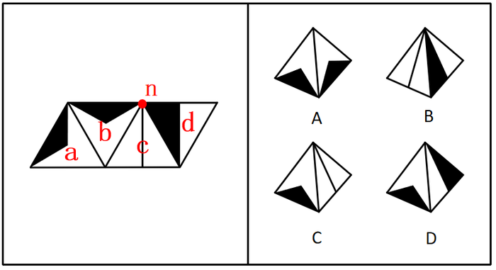

D项：选项中出现了面d和黑色钝角三角形的面，其中黑色钝角三角形的面可能为面a或面b。题干中公共边2在面a中为黑色钝角三角形的一条边，而选项中公共边2在面a中并非为黑色钝角三角形的一条边，因此选项中的面不可能是面a；题干中面b和面d的公共边3与选项也不一致，因此选项中的面也不可能是面b；选项和题干不一致，排除。

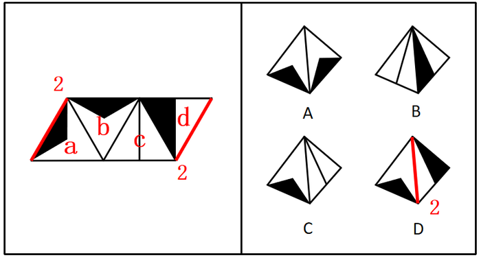

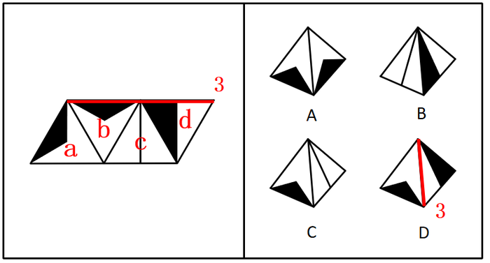

故正确答案为A。

---

### 第 24 题　qid 2732714 · 图形推理

下列选项中，符合所给图形的变化规律的是：

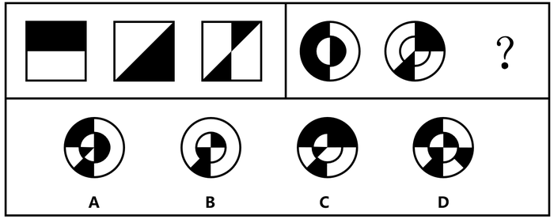

- **A**. A　✅
- **B**. B
- **C**. C
- **D**. D

**答案**：A

**官方解析**

元素组成相似，优先考虑样式规律。观察可知，题干图形轮廓相同，内部被切割且出现黑白格，考虑黑白运算，但直接进行黑白运算不存在规律，此时考虑样式规律与位置旋转相结合的复合考法。观察发现，第一组第一幅图顺时针旋转，再与第二幅图黑白运算可得出第三幅图（如下图所示），运算规则为：同色相加为白，异色相加为黑。将第二组第一幅图顺时针旋转，再与第二幅图运用上述运算规则，得出右上角外圈圆为白，右上角内圈圆为黑，排除C项；右下角外圈圆为白，排除D项；左上角外圈圆为黑，排除B项。

故正确答案为A。

---

### 第 25 题　qid 2732716 · 逻辑判断

一个人如果没有奋斗的目标，就不会非常努力地工作；一个人如果不是非常努力地工作，就会逐渐消沉下去，从而把生活搞得一团糟。大学刚毕业的小陈工作非常努力，所以他一定可以实现自我价值。
下列各项如果为真，        项最能支持以上论述。

- **A**. 小陈不会把生活搞得一团糟
- **B**. 一个人如果失去了奋斗的目标就会逐渐消沉
- **C**. 只要有奋斗的目标，就一定可以实现自我价值　✅
- **D**. 自我价值的实现离不开良好的环境和个人的努力奋斗

**答案**：C

**官方解析**

第一步：找出论点和论据。

论点：小陈一定可以实现自我价值。

论据：①没有奋斗的目标没有努力工作逐渐消沉且把生活搞得一团糟；②小陈工作努力；

结合①②根据否后推出否前可知：小陈有奋斗目标。

由论据可以得到小陈有奋斗目标，而论点为小陈一定可以实现自我价值，话题不一致，优先考虑搭桥，需要建立起有奋斗目标与可以实现自我价值之间的联系。

第二步：逐一分析选项。

A项：小陈不会把生活搞得一团糟，是对论据①的否后，否后推否前，能得到小陈工作努力，有奋斗目标，是对论据的肯定，可以加强，保留；

B项：翻译为：没有奋斗的目标逐渐消沉，是对论据条件①的重复，可以加强，保留；

C项：翻译为：有奋斗的目标可以实现自我价值，建立了有奋斗目标和实现自我价值之间的联系，属于搭桥项，可以加强，保留；

D项：翻译为：实现自我价值良好的环境且个人努力奋斗，论据已知的是小陈工作努力，由此推不出小陈能实现自我价值，无法加强，排除。

比较A、B、C三项，C项搭桥力度强于A、B两项，当选。

故正确答案为C。

---

### 第 26 题　qid 2732717 · 逻辑判断

在某市学生运动会上，男女100米短跑冠军均来自第一中学的体育班，而不是市体育学院，很多家长都在说：“第一中学比市体育学院的训练质量高。”
下列        项最能反驳这些家长们的结论。

- **A**. 本次运动会上第一中学的冠军数量比市体育学院少很多
- **B**. 有没有出现短跑冠军并不是衡量学校训练质量的唯一标准　✅
- **C**. 因为第一中学的老师待遇好，很多老师离开市体育学院去第一中学
- **D**. 第一中学的学生都住宿，所以他们在校训练的时间比市体育学院多

**答案**：B

**官方解析**

第一步：找出论点和论据。
论点：第一中学比市体育学院的训练质量高。
论据：在某市学生运动会上，男女100米短跑冠军均来自第一中学的体育班，而不是市体育学院。
本题的论点讨论第一中学与市体育学院训练质量的比较，论据讨论100米短跑冠军均来自第一中学的体育班，而不是市体育学院，二者话题不一致，削弱优先考虑拆桥。
第二步：逐一分析选项。
A项：该项讨论冠军数量，论点讨论第一中学比市体育学院的训练质量高，二者话题不一致，为无关项，无法削弱，排除；
B项：该项说明有没有出现短跑冠军并不是衡量学校训练质量的唯一标准，说明衡量学校训练质量不是完全以出现短跑冠军为依据的，拆断了论点论据之间的关系，为拆桥项，可以削弱，当选；
C项：该项讨论市体育学院很多老师离开市体育学院去了第一中学，论点讨论第一中学比市体育学院的训练质量高，二者话题不一致，为无关项，无法削弱，排除；
D项：该项讨论第一中学在校训练的时间更多，论点讨论第一中学比市体育学院的训练质量高，二者话题不一致，为无关项，无法削弱，排除。
故正确答案为B。

---

### 第 27 题　qid 2731242 · 逻辑判断

根据中国和美国政府机构专家组成的工作组测算，美国官方统计的对华贸易逆差被高估了左右。更令人难以信服的是，美国政府引用的贸易数据只包括货物贸易，并未反映服务贸易。如果算进去，所谓的“贸易不平衡论”就更立不住了。

上述结论建立在下列哪项假设的基础之上？

- **A**. 美国对华服务贸易逆差巨大
- **B**. 美国对华服务贸易存在高额顺差　✅
- **C**. 美国购买了中国很多的工业产品
- **D**. 美国购买了中国很多的劳务服务

**答案**：B

**官方解析**

第一步：找出论点和论据。
论点：如果把服务贸易算进去，所谓的“贸易不平衡论”就更立不住了。
论据：美国政府引用的贸易数据只包括货物贸易，并未反映服务贸易。
本题问法为前提假设，加强优先考虑搭桥和必要条件，本题的论点和论据话题一致，都是在说服务贸易，故优先考虑补充必要条件。
第二步：逐一分析选项。
A项：指出美国对华服务贸易逆差巨大，如果把服务贸易算进去，增加了美国对华贸易存在的逆差，具有削弱作用，排除；
B项：指出美国对华服务贸易存在高额顺差，那么把服务贸易算进去，就会大大减少美国对华贸易存在的逆差，从而证明“贸易不平衡论”是立不住的，反过来如果美国对华服务贸易不存在高额顺差，那么即使把服务贸易算进去，也无法影响“贸易不平衡论”的成立，因此该项是论点成立的必要条件，当选；
C项：指出美国购买了中国很多的工业产品，工业产品属于货物贸易，与服务贸易无关，与论点话题不一致，无法加强，排除；
D项：指出美国购买了中国很多的劳务服务，但没有具体说明劳务服务是顺差还是逆差，无法加强，排除。
故正确答案为B。

---

### 第 28 题　qid 2731289 · 逻辑判断

李白的《江上吟》末二句云：“功名富贵若长在，汉水亦应西北流。”汉水，又名汉江，发源于今陕西省宁强县，东南流经湖北襄阳，至汉口汇入长江。
根据以上信息，下列哪项最符合李白的观点？

- **A**. 功名富贵能长在，但汉水不应西北流
- **B**. 若功名富贵不长在，则汉水不应西北流
- **C**. 功名富贵不能长在　✅
- **D**. 若汉水能西北流，则功名富贵能长在

**答案**：C

**官方解析**

第一步：翻译题干。

①功名富贵长在汉水西北流；

②汉水是东南流向。

第二步：逐一分析选项。

A项：翻译为功名富贵长在 且 汉水不应西北流，该选项为条件①的矛盾命题，所以不符合李白的观点，排除；

B项：翻译为功名富贵不长在汉水不应西北流，否定了条件①的前件，否前得不到确定结论，排除；

C项：条件②汉水是东南流向，是对条件①的否后，否后必否前，应得到功名富贵不长在，符合李白的观点，当选；

D项：翻译为汉水能西北流功名富贵能长在，肯定了条件①的后件，肯后得不到确定结论，排除。

故正确答案为C。

---

### 第 29 题　qid 2731292 · 类比推理

某单位2019年初招聘了8名研发人员，他们都非常优秀。其中，小李、小孔和小陈3人研发小组表现尤其突出。该团队氛围极佳，组长小陈非常关心小李和小孔，而小李非常敬佩小孔，小孔非常敬佩小陈。年终时，小陈获得了四项发明专利，小李获得了五项发明专利。
根据以上信息，可以得出下列哪项？

- **A**. 小孔的发明专利比小陈多
- **B**. 组长小陈获得的发明专利最多
- **C**. 小李的发明专利没有小孔多
- **D**. 有人获得的发明专利比其敬佩的人多　✅

**答案**：D

**官方解析**

第一步：分析题干所给信息。
（1）组长小陈非常关心小李和小孔；
（2）小李非常敬佩小孔；
（3）小孔非常敬佩小陈；
（4）小陈获得了四项发明专利；
（5）小李获得了五项发明专利。
第二步：根据题干信息逐一分析选项。
A项：题干中没有提及小孔的发明专利数量，无法推出，排除；
B项：组长小陈获得了四项发明专利，小李获得了五项发明专利，则小陈的发明专利不是最多的，无法推出，排除；
C项：题干中没有提及小孔的发明专利数量，无法推出，排除；
D项：由于小孔的发明专利数量不明，因此对小孔的发明专利数量进行假设：
假设小孔的发明专利数量不超过4，根据小李获得了五项发明专利，且小李非常敬佩小孔，可以推出有人获得的发明专利比其敬佩的人多；
假设小孔的发明专利数量大于4，根据小陈获得了四项发明专利，且小孔非常敬佩小陈，可以推出有人获得的发明专利比其敬佩的人多。
综合以上两种情况，D项当选。
故正确答案为D。

---

### 第 30 题　qid 2732720 · 逻辑判断

与水和大气污染不同，土壤污染的隐蔽性较强。发达国家能用的土壤修复技术，在我国就不一定适用。目前，基于微生物细胞外呼吸的土壤原位修复技术已经成为我国华南地区土壤生物修复技术的生力军。与物理化学修复相比，这种修复方式具有高效率、低成本、非破坏、适用广等特点。
上述论述是建立在下列哪项的基础之上的？

- **A**. 发达国家的土壤和我国的有很大差异，并不适用土壤原位修复技术
- **B**. 土壤原位修复技术优于物理化学修复
- **C**. 土壤原位修复技术是在华南地区特点的土壤条件上开发起来的
- **D**. 发达国家的土壤修复主要采用物理化学修复　✅

**答案**：D

**官方解析**

第一步：找出论点和论据。
论点：发达国家能用的土壤修复技术，在我国就不一定适用。
论据：目前，基于微生物细胞外呼吸的土壤原位修复技术已经成为我国华南地区土壤生物修复技术的生力军。与物理化学修复相比，这种修复方式具有高效率、低成本、非破坏、适用广等特点。
本题的论点和论据话题不一致，论点是在论述发达国家土壤修复技术在我国未必适用，而论据是在说我国现有的土壤原位修复技术与物理化学修复技术相比的优势。论点、论据的话题不一致，加强优先考虑在发达国家土壤修复技术与物理化学修复技术进行搭桥。
第二步：逐一分析选项。
A项：论点是在论述发达国家的土壤修复技术是否适用于我国土壤，而非我国的土壤原位修复技术不适用于发达国家，属于无关项，无法加强，排除；
B项：选项指出我国土壤原位修复技术优于物理化学修复技术，但并未提及与发达国家的关系，属于无关项，无法加强，排除；
C项：选项在论述土壤原位修复技术完全适用于我国华南地区的土壤，但未与发达国家建立联系，属于无关项，无法加强，排除；
D项：选项指出发达国家运用的土壤修复技术就是物理化学修复技术，那么发达国家的土壤修复技术就不一定适用于我国，在论点和论据之间搭桥，可以加强，当选。
故正确答案为D。

---

### 第 31 题　qid 2731295 · 类比推理

将6盒茶叶放入甲、乙、丙、丁、戊、己、庚、辛八个箱子中，其中四个箱子有茶叶。已知：
（1）在甲、乙、丙、丁四个箱子中共有5盒茶叶；
（2）在丁、戊、己三个箱子中共有3盒茶叶；
（3）在丙、丁两个箱子中共有2盒茶叶。
根据以上信息，可以得出下列哪项？

- **A**. 甲箱中至少有1盒　✅
- **B**. 乙箱中至少有2盒
- **C**. 己箱中至少有2盒
- **D**. 戊箱中至少有1盒

**答案**：A

**官方解析**

第一步：分析题干条件。
（1）在甲、乙、丙、丁四个箱子中共有5盒茶叶；
（2）在丁、戊、己三个箱子中共有3盒茶叶；
（3）在丙、丁两个箱子中共有2盒茶叶。
第二步：根据题干条件进行推理。
根据条件（1）及茶叶总数量为6盒可知，戊、己、庚、辛四个箱子中共有1盒茶叶，则己箱中至多有1盒茶叶，排除C项；
根据条件（3）可知，丁箱子中至多有2盒茶叶，结合条件（2）可知，丁箱子中必定有2盒茶叶，丙箱子中没有茶叶，戊、己两个箱子中共有1盒茶叶，但不能确定茶叶在是戊箱子中还是己箱子中，排除D项；
此时丁箱子中有2盒茶叶，戊、己中的1个箱子中有1盒茶叶，丙、庚、辛三个箱子中没有茶叶；根据四个箱子有茶叶可知，甲、乙两个箱子中都要有茶叶；根据条件（1）（3）可知，甲、乙两个箱子中共有3盒茶叶，则可分为两种情况：①甲箱子中1盒茶叶，乙箱子中2盒茶叶；②甲箱子中2盒茶叶，乙箱子中1盒茶叶。综合以上两种情况，A项当选。
故正确答案为A。

---

### 第 32 题　qid 2731291 · 类比推理

赵、钱、孙、李、周、吴打算组队参加创新创业大赛。大赛规定一个团队必须为三位选手。赵说：“钱和李肯定不能组成一队。”钱说：“孙在哪队，我就在哪队。”孙说：我没和赵、李一队。”李说：“我和钱、孙一队。”周说：“我和赵不能在一队。”吴说：“我和周不在一队。”
如果六个人中有五个人的话为真，那么下列选项中正确的是（    ）项。

- **A**. 赵、钱、孙一队
- **B**. 钱、孙、周一队　✅
- **C**. 钱、孙、吴一队
- **D**. 赵、孙、李一队

**答案**：B

**官方解析**

第一步：分析题干条件。
赵、钱、孙、李、周、吴需要分为两组，每组有三人。
（1）赵：钱和李不在同一队；
（2）钱：孙和钱在同一队；
（3）孙：孙不和赵一队，孙也不和李一队；
（4）李：李、钱、孙都在同一队；
（5）周：周和赵不在同一队；
（6）吴：吴和周不在同一队。
分析题干条件，赵和李的话中针对的“钱和李是否在同一队”的说法必然有一假。
第二步：看其余，根据题干推理。
根据题干条件可知，六个人中有五个人的话为真，即本题只有一假，且赵和李的话必有一假，因此其他人说的都是真话。根据钱的话可知，钱和孙在一队，排除D项；根据孙的话可知，赵和李在一队，且不与孙一队，排除A项；根据周的话可知，周和赵不在同一队，排除C项，根据吴的话可知，吴和周不在同一队，整理所有结论可得，钱、孙、周在同一队，赵、李、吴在同一队，只有B项正确。
故正确答案为B。

---

### 第 33 题　qid 2731283 · 逻辑判断

在一项考试成绩提升计划实施前，负责老师统计了参与该计划的、学业表现不佳的学生每天花在网上的平均时间。他重新制定了这些学生的学习计划，要求他们每天减少上网时间，并预测了遵守其要求的学生的考试成绩所可能的提升幅度。但是，考试成绩评定的最终结果表明，这些学生的成绩提升幅度并没有达到预期水平。
下列（    ）项如果为真，最能解释上述现象。

- **A**. 在计划结束前夕，参与计划的不少学生主动减少了比老师所要求的更多的上网时间
- **B**. 根据重新制定的学习计划，所有的课后作业都需要通过在线学习平台来完成和提交　✅
- **C**. 参与计划的学生每天上网时间的减少不会对他们完成新的学习计划产生影响
- **D**. 该负责老师成功预测过参与其他考试成绩提升计划的学生的成绩提升幅度

**答案**：B

**官方解析**

第一步：找出题干矛盾。
老师重新制定了学生的学习计划，要求他们每天减少上网时间，并预测了遵守其要求的学生的考试成绩所可能的提升幅度。但是，考试成绩评定的最终结果表明，这些学生的成绩提升幅度并没有达到预期水平。
第二步：逐一分析选项。
A项：该项只能说明有学生减少了更多的上网时间，但是没提到对成绩提升幅度的影响，不能解释题干矛盾，排除；
B项：该项说明根据重新制定的计划，所有的课后作业都需要通过在线学习平台来完成和提交，说明完成这些课后作业需要上网，但是计划要求减少上网时间，因此学习计划影响了学生完成和提交课后作业，从而可能会影响成绩的提升幅度，可以解释题干矛盾，当选；
C项：该项只能说明上网时间的减少不会对完成新的学习计划有影响，但是没提到对成绩的提升幅度是否有影响，不能解释题干矛盾，排除；
D项：该项只能说明该老师成功预测过参与其他学习计划的学生的成绩提升幅度，但是没提到此学习计划对这些学生的成绩提升幅度的影响，不能解释题干矛盾，排除。
故正确答案为B。

---

### 第 34 题　qid 2731279 · 逻辑判断

在针对某病症的一项医药疗效的双盲实验中，某课题组将实验对象分成两个组：实验组和对照组，两组的重症率都在左右，和同期患该病症的整体重症率相当。实验结果显示：对照组18例中死亡7人，病死率为；使用该药的实验组34例中死亡3人，病死率仅为。课题组由此认为，该药物对此病症具有明显的疗效。

下列（    ）项如果为真，最能质疑课题组的结论。

- **A**. 
该药物组成成分并没有全部公开

- **B**. 
同期患该病症的整体死亡率为
　✅
- **C**. 
在普通人群中，患该病症的人数不到

- **D**. 
在古代医药典籍中，就已经记载有该药物的配方

**答案**：B

**官方解析**

第一步：找出论点和论据。

论点：该药物对此病症具有明显的疗效。

论据：某课题组将实验对象分成两个组：实验组和对照组，两组的重症率都在左右，和同期患该病症的整体重症率相当。实验结果显示：对照组18例中死亡7人，病死率为；使用该药的实验组34例中死亡3人，病死率仅为。

本题论点讨论的是该药物对此病症有明显的疗效，论据讨论的是通过对比实验说明用了该药物的实验组病死率较低，从而说明该药物有效果。论点和论据讨论的话题一致，优先考虑削弱论点。

第二步：逐一分析选项。

A项：该项讨论的是没有全部公开该药物的组成成分，但药物组成成分没有全部公开与药物是否有效无关，为无关选项，无法削弱，排除；

B项：该项说明了同期患该病症的整体死亡率为，比题干中实验组用该药后的病死率低，说明使用了该药物对此病症效果不明显，削弱论点，当选；

C项：论点讨论的是该药物对此病症具有明显的疗效，而选项讨论的是普通人群中患该病症的人数比例极小，与论点话题不一致，为无关选项，无法削弱，排除；

D项：该项说明该药物配方有记载可依，但是没提到该药物对于此病症的效果如何，与论点话题不一致，为无关选项，无法削弱，排除。

故正确答案为B。

---
