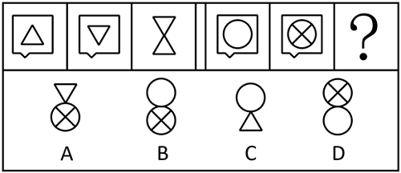
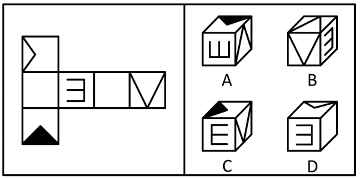
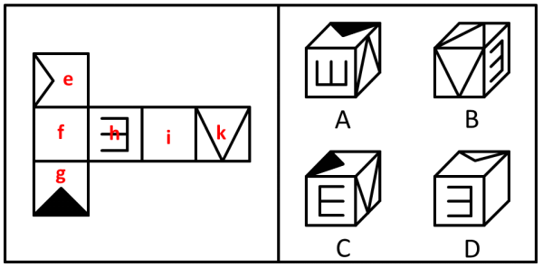
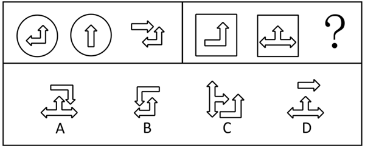
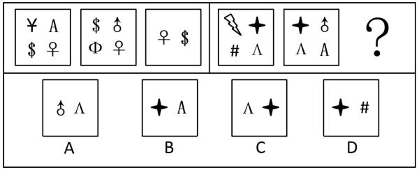
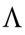
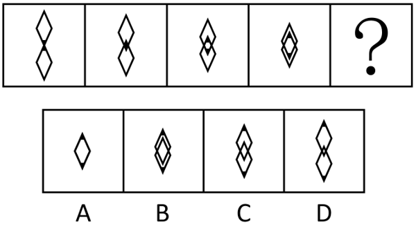
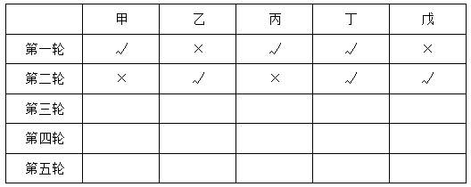

# 2021年上海市行政执法类考试《行测》试题（网友回忆版）

> 判断推理 · 24 题 · 上海 2021

## 第 1 题　qid 19889510 · 定义判断

级差地租指耕种较优土地所获得的，归于土地所有者占有的超额利润。
根据上述定义，下列属于级差地租的是        。

- **A**. 甲以600元/亩的价格承包了村里一座70亩的山
- **B**. 农民甲外出打工，遂将家里的4块地租给乙耕种，其中最肥沃那块地租金最贵　✅
- **C**. 甲在不同区域拥有3套面积相当的房子，其中地段最好的那套租金最贵
- **D**. 甲将家里的10亩地给乙耕种，乙将每季度收益的30%作为地租支付给甲

**答案**：B

**官方解析**

第一步：找出定义关键词。
“耕种较优土地所获得的”、“归于土地所有者占有的超额利润”。
第二步：逐一分析选项。
A项：甲以600元/亩的价格承包了村里一座70亩的山，仅提到承包价格，未体现不同土地的优劣差异，也没有涉及因耕种较优土地产生的超额利润，不符合“耕种较优土地所获得的”、“归于土地所有者占有的超额利润”，不符合定义，排除；
B项：农民甲租给乙耕种的最肥沃那块地租金最贵，符合“耕种较优土地所获得的”、“归于土地所有者占有的超额利润”，符合定义，当选；
C项：甲地段最好的那套房子租金最贵，甲拥有的是房子而非土地，不符合“耕种较优土地所获得的”、“归于土地所有者占有的超额利润”，不符合定义，排除；
D项：乙将每季度收益的30%作为地租支付给甲，此为固定比例的租金，未体现不同土地的优劣差异及由此产生的超额利润，不符合“耕种较优土地所获得的”、“归于土地所有者占有的超额利润”，不符合定义，排除。
故正确答案为B。

---

## 第 2 题　qid 19889512 · 定义判断

强迫症是一种以源于自我但违反自我意愿而重复出现，缺乏现实意义的、不合情理的观念、情绪、意向或行为等强迫症状为主，具有意识的自我强迫和反强迫并存且冲突强烈，虽力图克制但又无力摆脱特点的神经症。
根据上述定义，下列不属于强迫症的是        。

- **A**. 甲头脑里总是不断回想别人说过的话，挥之不去，痛苦难耐
- **B**. 乙洗脸时，总会先洗额头再洗脸颊，一旦顺序颠倒，她就会重洗一次
- **C**. 丙想到第二天要参加高考，紧张情绪就冒了出来，总是忍不住不停的搓手，呼吸加速　✅
- **D**. 上课时，丁总是担心自己在回家路上会出车祸

**答案**：C

**官方解析**

第一步：找出定义关键词。
“源于自我但违反自我意愿而重复出现”、“缺乏现实意义的、不合情理的观念、情绪、意向或行为”、“意识的自我强迫和反强迫并存且冲突强烈”、“虽力图克制但又无力摆脱”。
第二步：逐一分析选项。
A项：甲头脑里不断回想别人说过的话，挥之不去且痛苦难耐，符合“意识的自我强迫和反强迫并存且冲突强烈”、“虽力图克制但又无力摆脱”，符合定义，排除；
B项：乙洗脸时必须遵循固定顺序，颠倒后要重洗，洗脸的顺序不影响洗脸效果，这种固定洗脸顺序源于自我、无现实意义且不合情理，符合“源于自我但违反自我意愿而重复出现”、“缺乏现实意义的、不合情理的观念、情绪、意向或行为”，符合定义，排除；
C项：丙因为即将参加高考而产生紧张情绪，进而表现出不停搓手、呼吸加速，这种行为是由高考这一现实事件引发的，具有合理性，不符合“缺乏现实意义的、不合情理的观念、情绪、意向或行为”，不符合定义，当选；
D项：丁上课时总是担心自己在回家路上会出车祸，丁在没有具体风险证据时过度担忧车祸，这种担心源于自我、无现实依据且不合情理，符合“源于自我但违反自我意愿而重复出现”、“缺乏现实意义的、不合情理的观念、情绪、意向或行为”，符合定义，排除。
本题为选非题，故正确答案为C。

---

## 第 3 题　qid 19889505 · 定义判断

自然的人化，一方面是指外在于人的客观对象被注入了人的本质力量，也可指人类在改造客观世界的过程中脱离了自身的自然属性而具有了社会化的品性。
根据上述定义，下列属于自然的人化的是        。

- **A**. 某工程公司根据项目需要将山挖开，作为某房地产项目的地基　✅
- **B**. 某偏远山区的人仍然保留着狩猎的传统
- **C**. 在长期演化过程中而形成的某地区特有的人文景观
- **D**. 某旅游公司决定开发推出一个特色旅游地方案

**答案**：A

**官方解析**

第一步：找出定义关键词。
“外在于人的客观对象被注入了人的本质力量”、“人类在改造客观世界的过程中脱离了自身的自然属性而具有了社会化的品性”。
第二步：逐一分析选项。
A项：工程公司将山挖开作为房地产项目地基，山是外在于人的客观对象，挖开体现了人类对自然的改造，将其用于房地产建设，是将人的需求注入自然对象，符合“外在于人的客观对象被注入了人的本质力量”，符合定义，当选；
B项：偏远山区的人保留狩猎传统，狩猎是人类依赖自然获取资源的原始行为，体现的是人类的自然属性，未体现对客观对象注入人的本质力量，也未体现改造客观世界的过程中脱离自然属性形成社会化品性，不符合“外在于人的客观对象被注入了人的本质力量”、“人类在改造客观世界的过程中脱离了自身的自然属性而具有了社会化的品性”，不符合定义，排除；
C项：长期演化形成的特有人文景观，若演化是自然过程而非人类主动改造，则未体现注入人的本质力量；即使包含人类活动，也未明确体现人类脱离了自身的自然属性，不符合“外在于人的客观对象被注入了人的本质力量”、“人类在改造客观世界的过程中脱离了自身的自然属性而具有了社会化的品性”，不符合定义，排除；
D项：旅游公司开发特色旅游地方案，是企业的商业规划行为，还没有付诸行动，未涉及对外在于人的客观对象的改造，也未体现人类自然属性的社会化转变，不符合“外在于人的客观对象被注入了人的本质力量”、“人类在改造客观世界的过程中脱离了自身的自然属性而具有了社会化的品性”，不符合定义，排除。
故正确答案为A。

---

## 第 4 题　qid 19889506 · 定义判断

分层抽样是指将总体的所有单位按其属性或特征，以一定的分类标准（如年龄、职业、地区）划分为若干层次或类型，然后在各层（各类）中进行抽样的方法。
根据上述定义，下列描述中属于分层抽样的是        。

- **A**. 某工厂想了解不同车间工人的敬业度，根据不同车间的总人数在每个车间随机抽取一定比例的员工进行问卷调查　✅
- **B**. 为了解中国人和外国人的开放度，小雷在上海人民广场随机寻找不同的中国人和外国人进行问卷调研
- **C**. 为了对企业生产的产品进行质量检测，质量管理员每8小时抽取1小时内生产的所有产品进行全面检测
- **D**. 为调查中学生患近视的情况，某研究小组选取了某中学高一年级7个班的学生作为调查对象

**答案**：A

**官方解析**

第一步：找出定义关键词。
“将总体的所有单位按其属性或特征，以一定的分类标准（如年龄、职业、地区）划分为若干层次或类型”、“在各层（各类）中进行抽样”。
第二步：逐一分析选项。
A项：某工厂根据不同车间的总人数进行问卷调查，是将工人按车间进行分层，符合“将总体的所有单位按其属性或特征，以一定的分类标准（如年龄、职业、地区）划分为若干层次或类型”，在每个车间随机抽取一定比例的员工，符合“在各层（各类）中进行抽样”，符合定义，当选；
B项：小雷随机寻找不同的中国人和外国人，没有体现出在中国人和外国人两个层次中分别进行抽样，不符合“在各层（各类）中进行抽样”，不符合定义，排除；
C项：质量管理员每8小时抽取1小时内生产的所有产品，没有体现出对产品的属性或特征进行分层，也没有在各层中进行抽样，不符合“将总体的所有单位按其属性或特征，以一定的分类标准（如年龄、职业、地区）划分为若干层次或类型”、“在各层（各类）中进行抽样”，不符合定义，排除；
D项：某研究小组选取了某中学高一年级7个班的学生作为调查对象，没有体现出对学生进行分层，也没有在各层中进行抽样，不符合“将总体的所有单位按其属性或特征，以一定的分类标准（如年龄、职业、地区）划分为若干层次或类型”、“在各层（各类）中进行抽样”，不符合定义，排除。
故正确答案为A。

---

## 第 5 题　qid 19889511 · 定义判断

合作剩余是指合作者通过合作所得到的纯收益，即扣除合作成本后的纯收益与如果不合作或竞争所能得到的纯收益（扣除竞争成本后的收益）之间的差额。它一般是通过市场交换中人们之间的诚信合作和商业信用来实现的。
根据上述定义，下列属于合作剩余的是         。

- **A**. 老王借钱给同事买房子，同事给他高于银行利率的利息，多获得的利息就是老王和同事的合作剩余　✅
- **B**. 银行贷款给企业，银行赚利息，企业赚利润，这种利息和利润就是银行与企业的合作剩余
- **C**. 连锁经营企业的经营利润就是连锁企业间的合作剩余
- **D**. 服装企业生产服装，网络商场和服装公司各自销售，两个销售渠道的利润之和就是合作剩余

**答案**：A

**官方解析**

第一步：找出定义关键词。
“合作者通过合作所得到的纯收益”、“扣除合作成本后的纯收益与如果不合作或竞争所能得到的纯收益（扣除竞争成本后的收益）之间的差额”。
第二步：逐一分析选项。
A项：老王借钱给同事，同事给他的利息符合“扣除合作成本后的纯收益”，这笔钱如果存在银行产生的利息符合“如果不合作或竞争所能得到的纯收益”，同事给他高于银行利率的利息，其中多获得的利息符合“合作者通过合作所得到的纯收益”、“扣除合作成本后的纯收益与如果不合作或竞争所能得到的纯收益（扣除竞争成本后的收益）之间的差额”，符合定义，当选；
B项：银行贷款给企业，银行赚利息，企业赚利润，这两者都属于合作后的收益，不涉及“如果不合作或竞争所能得到的纯收益”，不符合“扣除合作成本后的纯收益与如果不合作或竞争所能得到的纯收益（扣除竞争成本后的收益）之间的差额”，不符合定义，排除；
C项：连锁经营企业的经营利润，这属于合作后的收益，不涉及“如果不合作或竞争所能得到的纯收益”，不符合“扣除合作成本后的纯收益与如果不合作或竞争所能得到的纯收益（扣除竞争成本后的收益）之间的差额”，不符合定义，排除；
D项：网络商场和服装公司各自销售，二者没有合作，不符合“合作者通过合作所得到的纯收益”，不符合定义，排除。
故正确答案为A。

---

## 第 6 题　qid 19889513 · 图形推理

下列选项中，符合所给图形的变化规律的是<u>        </u>。

- **A**. A　✅
- **B**. B
- **C**. C
- **D**. D

**答案**：A

**官方解析**

元素组成相同，优先考虑位置规律。九宫格图形优先看横行，观察发现，第一行中图1外框位置不变、内部箭头通过左右翻转得到图2，图2外框位置不变、内部箭头通过顺时针旋转得到图3。经验证，第二行满足此规律。因此问号处图形应该是第三行中的图2外框位置不变、内部箭头通过顺时针旋转得到，只有A项符合。

故正确答案为A。

---

## 第 7 题　qid 19889517 · 图形推理

下列选项中，能由左边的图形折叠而成的是<u>        </u>。

- **A**. A　✅
- **B**. B
- **C**. C
- **D**. D

**答案**：A

**官方解析**

本题考查六面体。将题干展开图标上序号，如下图，逐一进行分析。

A项：选项由面g、面h与面i组成，选项与题干展开图一致，当选；

B项：选项由面e、面f与面k组成，题干展开图中，面e与面k的公共边挨着面k中的三个×，而选项中，面e与面k的公共边没有挨着面k中的三个×，选项与题干展开图不一致，排除；

C项：选项由面g、面i与面k组成，面i与面k是相对面，由于相对面不能同时出现，选项与题干展开图不一致，排除；

D项：选项由面g、面h与面i组成，以三个面的公共点为起始点在面g内顺时针画边，题干展开图中，边1挨着面h，而选项中，边1挨着面i，选项与题干展开图不一致，排除。

故正确答案为A。

---

## 第 8 题　qid 19889518 · 图形推理

下列选项中，符合所给图形的变化规律的是<u>        </u>。

- **A**. A　✅
- **B**. B
- **C**. C
- **D**. D

**答案**：A

**官方解析**

元素组成不同，且无明显属性规律，考虑数量规律。题干图形封闭区域明显，优先考虑数面。九宫格优先看横行，第一行图形的面数量依次为10、7、3，第三行图形的面数量依次为10、4、6，面数量的规律均为图2+图3=图1，第二行图一的面数量为10，图三的面数量为5，因此，？处图形的面数量应为5，只有A项符合。
故正确答案为A。

---

## 第 9 题　qid 19889522 · 图形推理

下列选项中，符合所给图形的变化规律的是<u>        </u>。

- **A**. A
- **B**. B
- **C**. C
- **D**. D　✅

**答案**：D

**官方解析**

元素组成相似，且相同线条重复出现，优先考虑样式规律中的加减同异。观察发现，第一组图中的前两幅图去掉相同的外框，经过组合后得到图三，其中，图一的内部图形在下方，图二的内部图形在上方。第二组图遵循相同的规律，只有D项符合。
故正确答案为D。

---

## 第 10 题　qid 18899566 · 图形推理

下列选项中，由左边图形折叠而成的是<u>        </u>。

- **A**. A
- **B**. B
- **C**. C
- **D**. D　✅

**答案**：D

**官方解析**

本题为空间重构题。对题干展开图标上序号，如下图所示，逐一进行分析。

A项：选项由面g、面h和面k构成，题干展开图中面h和面k为相对面，相对面不能同时出现，选项与题干展开图不一致，排除；

B项：选项出现两个面k，其中一个为无中生有的面，选项与题干展开图不一致，排除；

C项：选项由面g、面h和面k构成，题干展开图中面h和面k为相对面，相对面不能同时出现，选项与题干展开图不一致，排除；

D项：选项由面e、面h和面i构成，选项与题干展开图一致，当选。

故正确答案为D。

---

## 第 11 题　qid 18899568 · 图形推理

下列选项中，符合所给图形的变化规律的是<u>        </u>。

- **A**. A
- **B**. B
- **C**. C　✅
- **D**. D

**答案**：C

**官方解析**

元素组成相似，且有相似线条重复出现，优先考虑样式规律中的加减同异。第一组图形中，将图2顺时针旋转后，与图1之间，把相同的外框圆去掉，剩下的内部图案均保留从而得到图3；第二组图形也应满足此规律，将图2顺时针旋转后，与图1之间，把相同的外框矩形去掉，剩下的内部图案均保留从而得到？处图形，只有C项符合。

故正确答案为C。

---

## 第 12 题　qid 17619288 · 图形推理

下列选项中，符合所给图形的变化规律的是<u>        </u>。

- **A**. A
- **B**. B
- **C**. C　✅
- **D**. D

**答案**：C

**官方解析**

元素组成不同，且出现了不同的小元素，优先考虑元素的种类和个数。第一组图中图一和图二均有4个不同的小元素，而图三只有2个不同的小元素，且这2个小元素均出现在了图一和图二中。第二组图应用此规律，图一和图二中的相同小元素为“”和“”，故？处的图形应含有这2个小元素，对应C项。

故正确答案为C。

---

## 第 13 题　qid 18899567 · 图形推理

下列选项中，符合所给图形的变化规律的是<u>        </u>。

- **A**. A　✅
- **B**. B
- **C**. C
- **D**. D

**答案**：A

**官方解析**

元素组成不同，优先考虑属性规律。观察发现，右上角的图案和左下角的图案形状相同，二者为中心对称，故左上角和右下角的图案也应是形状相同，且为中心对称，当放入该图案后，题干图形整体为中心对称图形，故？处应填入A项。
故正确答案为A。

---

## 第 14 题　qid 17619291 · 图形推理

两个菱形上下平移，每次移动边长的，下列选项中，符合所给图形的变化规律的是<u>        </u>。

- **A**. A　✅
- **B**. B
- **C**. C
- **D**. D

**答案**：A

**官方解析**

元素组成相同，优先考虑位置规律。根据题干得知，两个菱形上下平移，每次平移边长的。观察发现，图一中位于上方的菱形向下平移其边长的，同时位于下方的菱形向上平移其边长的，即两个菱形一共平移菱形边长的，相当于整个菱形高度的，其他图形也符合该规律，图四到？处为第4次平移，故？处图形中两个菱形应平移到正好重合的位置，只有A项符合。

故正确答案为A。

---

## 第 15 题　qid 19889525 · 逻辑判断

除非是星期天、元旦或得了不宜进行高强度训练的疾病，否则国际级游泳运动员每天进行游泳训练的时间不少于6小时。
如果以上论断为真，以下        项所描述的运动员不可能是国际级的游泳运动员。

- **A**. 某运动员连续三天每天游泳5小时，并且没有发现任何身体不适　✅
- **B**. 某运动员几乎每天都要去水上训练中心进行训练
- **C**. 某运动员在某个星期三没有进行游泳训练
- **D**. 某运动员在右臂肌肉拉伤痊愈的一周里每天游泳至多3小时

**答案**：A

**官方解析**

第一步：翻译题干。

每天进行游泳训练的时间少于6小时是星期天、元旦或得了不宜进行高强度训练的疾病。

第二步：逐一分析选项。

A项：某运动员每天游泳5小时是对题干条件的肯前，肯前必肯后，可得是星期天、元旦或得了不宜进行高强度训练的疾病，但连续三天不满足“是星期天、元旦”（最多连续两天），没有身体不适说明不存在“不宜进行高强度训练的疾病”，该项是题干条件的矛盾命题，因此，该运动员不可能是国际级的游泳运动员，当选；

B项：某运动员几乎每天都要去水上训练中心进行训练，题干并没有提及训练中心，且去训练中心与训练时长无关，因此，无法判断该运动员是否为国际级的游泳运动员，排除；

C项：某运动员在某个星期三没有进行游泳训练，没有游泳训练是对题干条件的肯前，肯前必肯后，可得是星期天、元旦或得了不宜进行高强度训练的疾病，若该星期三是“元旦”或当天存在“不宜进行高强度训练的疾病”，则与题干条件不冲突，该运动员可能是国际级的游泳运动员，排除；

D项：某运动员每天游泳至多3小时是对题干条件的肯前，肯前必肯后，可得是星期天、元旦或得了不宜进行高强度训练的疾病，而右臂肌肉拉伤痊愈满足“不宜进行高强度训练的疾病”，此时与题干条件不冲突，该运动员可能是国际级的游泳运动员，排除。

故正确答案为A。

---

## 第 16 题　qid 19889523 · 逻辑判断

20世纪70年代以前，美国主要通过投放化学药物来控制日益泛滥的水生植物和藻类。为了避免化学药物所带来的环境安全问题，美国鱼类和野生动物局准备使用生物方法，从中国等国家引进亚洲鲤鱼作为河流和池塘的清洁员。
如果这一生物方法付诸实施，以下        项是它获得成功的必要条件。

- **A**. 引进美国的亚洲鲤鱼除了吃水生植物和藻类外，也以野生蚌类或鱼类为食
- **B**. 生长在美国河流与池塘中的水生植物和藻类也生长在中国等亚洲国家
- **C**. 水生植物和藻类的数量减少后，鱼类对这些水生植物和藻类所引起的疾病将会产生免疫力
- **D**. 引进美国的亚洲鲤鱼能够顺利存活并且形成一个足够大的群体，以便能大量消耗水生植物和藻类　✅

**答案**：D

**官方解析**

第一步：找出论点和论据。
论点：为了避免化学药物所带来的环境安全问题，美国鱼类和野生动物局准备使用生物方法，从中国等国家引进亚洲鲤鱼作为河流和池塘的清洁员，来控制日益泛滥的水生植物和藻类。
论据：无。
本题只有论点没有论据，且提问方式为“必要条件”，加强优先考虑必要条件。
第二步：逐一分析选项。
A项：该项在讨论亚洲鲤鱼的食物来源，而论点讨论的是亚洲鲤鱼能否控制水生植物和藻类，话题不一致，无法加强，排除；
B项：该项在讨论水生植物和藻类的生长环境，而论点讨论的是亚洲鲤鱼能否控制水生植物和藻类，话题不一致，无法加强，排除；
C项：该项在讨论鱼类对植物引起的疾病能否免疫，而论点讨论的是亚洲鲤鱼能否控制水生植物和藻类，话题不一致，无法加强，排除；
D项：该项指出引进美国的亚洲鲤鱼能够顺利存活并且形成一个足够大的群体，以便能大量消耗水生植物和藻类，如果亚洲鲤鱼不能存活，或无法形成足够大的群体，就不可能“大量消耗水生植物和藻类”，则生物方法不可行，即该项不成立则论点不成立，为论点成立的必要条件，可以加强，当选。
故正确答案为D。

---

## 第 17 题　qid 19889529 · 逻辑判断

参加奥数兴趣班的学生通常比那些不参加此类兴趣班的学生在学校数学考试中取得更好的成绩，因此参加奥数兴趣班有助于提高学生的数学考试成绩。
以下        项如果为真，最能构成对上述结论的质疑。

- **A**. 奥数兴趣班通过讲解思路、大量练习，能够提高学生对题目的反应能力
- **B**. 每学期都有相当一部分学生从奥数兴趣班退学
- **C**. 资料表明，参加奧数兴趣班的男生人数要多于女生
- **D**. 参加奧数兴趣班的往往是那些对数学有兴趣而且数学考试成绩较好的学生　✅

**答案**：D

**官方解析**

第一步：找出论点和论据。
论点：参加奥数兴趣班有助于提高学生的数学考试成绩。
论据：参加奥数兴趣班的学生通常比那些不参加此类兴趣班的学生在学校数学考试中取得更好的成绩。
本题论点和论据均在讨论参加奥数兴趣班和提高数学考试成绩的关系，二者话题一致，削弱优先考虑削弱论点，且论点为因果关系，也可以考虑因果倒置和他因削弱。
第二步：逐一分析选项。
A项：该项指出奥数兴趣班提高学生对题目的反应能力，说明对提高数学考试成绩有帮助，为加强项，无法削弱，排除；
B项：该项指出每学期都有部分学生从奥数兴趣班退学，但此行为与成绩高低无关，为无关项，无法削弱，排除；
C项：该项指出参加奥数兴趣班的性别比例，但性别比例与成绩高低无关，为无关项，无法削弱，排除；
D项：该项指出参加奥数兴趣班的学生对数学有兴趣而且数学考试成绩较好，即数学考试成绩好是参加奥数兴趣班的原因，而非结果，颠倒了题干的因果关系，因果倒置，可以削弱，当选。
故正确答案为D。

---

## 第 18 题　qid 19889524 · 逻辑判断

根据一项在美国25个州持续进行的医学调查，每天吸烟15—20支的人，其易患肺癌致死的概率是不吸烟者的14倍，这项具有很高可信度的调查排除了调查结果是碰巧发生的可能性。
如果上述信息是真的，那么它最能指出以下        项结论。

- **A**. 吸烟会造成肺部损伤
- **B**. 吸烟、酗酒、吸毒与因肺癌致死之间没有什么关系
- **C**. 吸烟的行为与吸烟者因肺癌致死之间具有显著的相关性　✅
- **D**. 这项医学调查试图证明人们不应该吸烟

**答案**：C

**官方解析**

日常结论题，根据题干信息逐一分析选项。
A项：题干仅探讨根据调查吸烟者易患肺癌致死的概率是不吸烟者的14倍，并未提及吸烟者是否存在肺部损伤，无中生有，无法推出，排除；
B项：题干“每天吸烟15—20支的人，其易患肺癌致死的概率是不吸烟者的14倍”说明吸烟和因肺癌致死之间明显相关，而非“没有什么关系”，且题干未提及酗酒、吸毒，无法推出，排除；
C项：题干“每天吸烟15—20支的人，其易患肺癌致死的概率是不吸烟者的14倍”说明吸烟和因肺癌致死之间明显相关，可以推出，当选；
D项：题干仅探讨调查的结果，未提及调查的目的，无中生有，无法推出，排除。
故正确答案为C。

---

## 第 19 题　qid 19889527 · 逻辑判断

由于大批农村少年儿童的父母进城务工，而他们的子女又很难随迁进城上学，每年仅有春节的短暂时间能与父母在家团圆，致使这些少年儿童的情绪长期处于一个较为焦虑的状态。有专家建议：为了确保少年儿童的健康成长和农民工家庭的幸福生活，教育部门应该明确规定并创造条件使农民工的子女能够在父母工作所在地上学。
以下        项如果为真，最能够支持专家的上述结论。

- **A**. 无论是城市居民还是农村进城务工人员，都有义务为少年儿童的健康成长创造条件
- **B**. 长期的情绪焦虑不利于少年儿童的健康成长以及他们所在家庭的幸福生活　✅
- **C**. 随着有关政策的调整，大部分农民工的子女将能够在父母工作所在地上学
- **D**. 这位专家之所以提出这些建议，其目的在于降低未能随父母迁往城市上学的农民工子女的情绪焦虑水平

**答案**：B

**官方解析**

第一步：找出论点和论据。
论点：为了确保少年儿童的健康成长和农民工家庭的幸福生活，教育部门应该明确规定并创造条件使农民工的子女能够在父母工作所在地上学。
论据：由于大批农村少年儿童的父母进城务工，而他们的子女又很难随迁进城上学，每年仅有春节的短暂时间能与父母在家团圆，致使这些少年儿童的情绪长期处于一个较为焦虑的状态。
本题论据讨论农民工子女因“难与父母团圆”而“长期焦虑”，论点讨论教育部门应创造条件“使农民工子女能在父母工作所在地上学”，使农民工子女与其父母“团圆”来确保“少年儿童的健康成长和农民工家庭的幸福生活”，话题不一致，加强优先考虑搭桥。
第二步：逐一分析选项。
A项：“城市居民和农村进城务工人员”都有义务为少年儿童的健康成长创造条件，而论点讨论“教育部门”应创造条件保障少年儿童的健康成长，主体不一致，为无关项，无法加强，排除；
B项：长期的情绪焦虑不利于少年儿童的健康成长以及他们所在家庭的幸福生活，在“长期焦虑”与“少年儿童的健康成长和农民工家庭的幸福生活”间建立联系，为搭桥项，可以加强，当选；
C项：随着有关政策的调整，大部分农民工的子女将能够在父母工作所在地上学，讨论政策的“执行进度”，而论点讨论这类政策的“目的和效果”，话题不一致，为无关项，无法加强，排除；
D项：专家提出这些建议的目的在于降低未能随父母迁往城市上学的农民工子女的情绪焦虑水平，但并不清楚该目的能否达成，为不明确项，无法加强，排除。
故正确答案为B。

---

## 第 20 题　qid 19889534 · 逻辑判断

一个人一定要有独立的人格、独立的思想。一个经过独立思考而坚持错误观点的人比一个不假思索而接受正确观点的人更值得肯定。
如果上述表述属实，则以下        项推断是正确的。

- **A**. 观点正确与否只有建立在独立思考的基础上才有意义　✅
- **B**. 拥有独立的人格和思想是一个人最重要的品质
- **C**. 经过独立思考而坚持正确的观点比经过独立思考而坚持错误的观点更值得肯定
- **D**. 独立思考的人比不假思索的人更容易接受错误的观点

**答案**：A

**官方解析**

日常结论题，根据题干信息逐一分析选项。
A项：根据题干第二句话“一个经过独立思考而坚持错误观点的人比一个不假思索而接受正确观点的人更值得肯定”可知，独立思考比单纯的观点正误更有意义，是该项的同义替换，可以推出，当选；
B项：根据题干第一句话“一个人一定要有独立的人格、独立的思想”可知，拥有独立的人格和思想是“必要的”，但题干并未提及这是“最重要的”品质，无法推出，排除；
C项：“经过独立思考而坚持正确的观点”题干并未提及，无中生有，无法推出，排除；
D项：“更容易接受错误的观点”题干并未提及，无中生有，无法推出，排除。
故正确答案为A。

---

## 第 21 题　qid 19889530 · 逻辑判断

在旺季，S服装厂的工人都需要加班加点赶货，工厂会采取更加严格的安全措施。所以，当订单增多时，工人们会更谨慎，工作的出错率会大大降低。
以下        项为真，最能质疑上述观点。

- **A**. 旺季时，员工常常加班加点，许多员工要求增加加班工资
- **B**. 员工对旺季很满意，因为他们可以获得更多的收入
- **C**. 为了提高效率，工厂可能淘汰一批旧设备，引进一批新设备
- **D**. 旺季时往往人手不足，需要招聘新的工人，而新工人通常缺乏必要的技能培训　✅

**答案**：D

**官方解析**

第一步：找出论点和论据。
论点：当订单增多时，工人们会更谨慎，工作的出错率会大大降低。
论据：在旺季，S服装厂的工人都需要加班加点赶货，工厂会采取更加严格的安全措施。
本题论据说的是订单增多时，某工厂会采取更加严格的安全措施；论点是基于此得出的订单增多时，工人们工作的出错率会降低，二者话题一致，削弱优先考虑削弱论点，即订单增多时，工人们工作的出错率并不会降低。
第二步：逐一判断选项。
A项：该项讨论的是加班的工资，而论点讨论的是工人们工作的出错率，二者话题不一致，无法削弱，排除；
B项：该项讨论的是旺季时，员工会因收入增多而感到满意，而论点讨论的是工人们工作的出错率，二者话题不一致，无法削弱，排除；
C项：该项指出为了提高效率，工厂可能更换新设备，但不清楚更换新设备后，工人们工作的出错率是否一定会降低，无法削弱，排除；
D项：该项指出旺季时往往需要招聘新工人，而新工人通常缺乏必要的技能培训，说明订单增多时，新招的工人会因技能不足而出错，即工人们工作的出错率会升高，削弱论点，可以削弱，当选。
故正确答案为D。

---

## 第 22 题　qid 19889533 · 逻辑判断

从20世纪80年代以来，曾广布于四川各地的麻雀大幅减少。出现这一现象是因为全球气候变暖引起麻雀从四川盆地向气温较低的地区举家迁移。
要得出上述结论需要以下        项为前提。

- **A**. 20世纪80年代以来四川盆地的平均气温与之前相比无显著差异
- **B**. 没有证据表明气温以外的其他因素与该地区麻雀数量减少有关　✅
- **C**. 麻雀喜欢在温暖、潮湿的环境内栖息
- **D**. 四川盆地是我国主要的麻雀栖息地

**答案**：B

**官方解析**

第一步：找出论点和论据。
论点：出现这一现象（曾广布于四川各地的麻雀大幅减少）是因为全球气候变暖引起麻雀从四川盆地向气温较低的地区举家迁移。
论据：无。
本题只有论点，没有论据，且提问方式为“前提”，加强优先考虑必要条件，即没有这个选项，论点则无法成立。
第二步：逐一分析选项。
A项：该项指出20世纪80年代以来四川盆地气候并未变暖，因此气候变暖并不是麻雀迁移的原因，削弱论点，无法加强，排除；
B项：该项指出没有证据表明气温以外的其他因素与该地区麻雀数量减少有关，否定代入，如果有气温以外的因素也导致了麻雀数量减少，那么说明麻雀举家迁移除了气温外还有其他原因，论点无法成立，是上述结论成立的前提，可以加强，当选；
C项：该项指出麻雀喜欢在温暖、潮湿的环境内栖息，而论点讨论的是全球气候变暖，不明确四川盆地的环境以及麻雀是否从四川盆地向其他地区迁移，为不明确项，无法加强，排除；
D项：该项指出四川盆地是我国主要的麻雀栖息地，仅说明四川盆地麻雀数量较多，而论点讨论的是我国麻雀从四川盆地迁出的原因，话题不一致，无关项，无法加强，排除。
故正确答案为B。

---

## 第 23 题　qid 19889535 · 类比推理

某病房中的五名病人甲、乙、丙、丁、戊轮流使用三台吸氧机。三台吸氧机每次只能供三人使用。下列是有关的使用规则：
（1）没有人可以连续吸氧超过三轮；
（2）没有人可以连续两轮不吸氧；
（3）每个人都必须吸氧三轮。
如果甲、丙和丁在第一轮使用吸氧机，而乙、丁和戊在第二轮使用，那么        一定会在第四轮使用吸氧机。

- **A**. 甲
- **B**. 乙
- **C**. 丙
- **D**. 丁　✅

**答案**：D

**官方解析**

第一步：分析题干条件。

（1）连续吸氧不能超过三轮；

（2）不能连续两轮不吸氧；

（3）每个人都必须吸氧三轮；

（4）甲、丙和丁在第一轮使用吸氧机，乙、丁和戊在第二轮使用吸氧机；

（5）三台吸氧机每次只能供三人使用。

第二步：根据题干条件进行推理。

条件（4）信息确定，以条件（4）作为推理的起点，结合条件（3）和（5）可知，最终使用吸氧机的轮次一共应有五轮。截至第二轮，吸氧的具体情况如下表所示：

结合条件（2）可知，第三轮中甲、丙一定需要吸氧，因此剩余吸氧的人应在乙、丁、戊中选择一人。由于乙、戊前两轮的吸氧情况一致，因此可以从不同的丁入手进行假设。假设第三轮中吸氧的人是丁。那么丁在前三轮中都吸氧。为满足条件（3），丁的第四轮和第五轮均不能再吸氧，此时与条件（2）发生矛盾。因此，该假设不成立，说明在第三轮中，丁不能吸氧。此时具体情况如下表所示：

结合条件（2）“不能连续两轮不吸氧”可知，丁在第四轮一定要使用吸氧机。

故正确答案为D。

---

## 第 24 题　qid 19889537 · 类比推理

有三瓶酒精浓度分别为42度、52度和70度的白酒。这三瓶白酒的包装分别为红色、白色和黄色，瓶身材质各不同。现了解到情况如下：玻璃瓶身和白色包装的白酒是70度的；瓷质瓶身的白酒不是52度的；塑料瓶身的白酒包装不是黄色的。
根据上文，下列说法正确的是        。

- **A**. 42度的白酒是塑料瓶身的
- **B**. 瓷质瓶身的白酒是红色包装的
- **C**. 塑料瓶身的白酒是52度的　✅
- **D**. 42度的白酒是红色包装的

**答案**：C

**官方解析**

第一步：分析题干条件。
（1）玻璃瓶身和白色包装的白酒是70度的；
（2）瓷质瓶身的白酒不是52度的；
（3）塑料瓶身的白酒包装不是黄色的。
第二步：根据题干条件进行推理。
条件（1）中“瓶身的材质”“包装的颜色”“白酒的度数”均已明确，可以作为突破口。结合条件（1）（2）可知，瓷质瓶身的白酒度数是42度，因此塑料瓶身的白酒度数是52度。结合（1）（3）可知，塑料瓶身的白酒应该是红色包装，因此瓷质瓶身的白酒应该是黄色包装。综上可知：
玻璃瓶身的白酒是白色包装，度数为70度；
瓷质瓶身的白酒是黄色包装，度数为42度；
塑料瓶身的白酒是红色包装，度数为52度。
因此，只有C项说法正确。
故正确答案为C。

---
