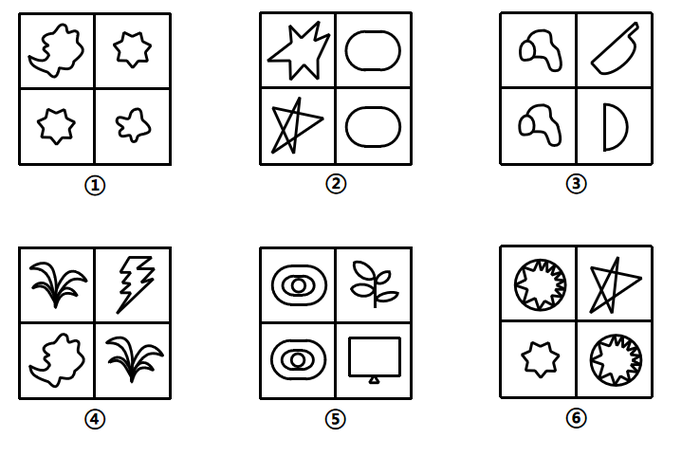
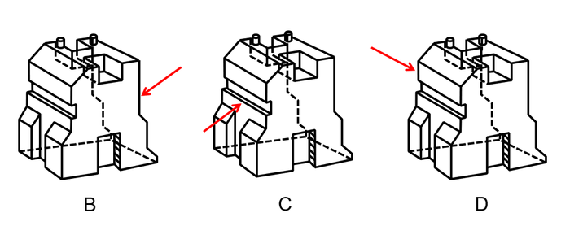

# 2021年云南公务员录用考试《行测》题（网友回忆版）

> 判断推理 · 30 题 · 云南 2021

## 第 1 题　qid 3523361 · 图形推理

从所给的四个选项中，选择最合适的一个填入问号处，使之呈现一定的规律性：

- **A**. A
- **B**. B
- **C**. C
- **D**. D　✅

**答案**：D

**官方解析**

解法一：元素组成不同，优先考虑属性规律。九宫格图形优先看横行，第一行图1的第1个字母包含曲线，图2的第2个字母包含曲线，图3的第3个字母包含曲线；第二行验证满足此规律；第三行运用此规律，则？处图形的第3个字母应包含曲线，只有D项符合。
故正确答案为D。
解法二：元素组成不同，考虑数量规律。观察发现，题干都是字母，且出现S、C、U、O等全曲线图形，优先考虑数曲线。九宫格图形优先看横行，第一行图形的曲线数分别为1、1、1，其相加和为3；第二行图形的曲线数分别为1、1、1，其相加也为3；第三行应满足同样的规律，图1和图2的曲线数分别为1、2，故？处图形的曲线数应为0，只有C项符合。
故正确答案为C。
注：解法一涉及整体每一个图形和位置，解法二仅关注了曲线，解法一相对解法二是更为全面的规律，因此粉笔更倾向于选D。

---

## 第 2 题　qid 3522441 · 图形推理

从所给的四个选项中，选择最合适的一个填入问号处，使之呈现一定的规律性：

- **A**. A
- **B**. B
- **C**. C
- **D**. D　✅

**答案**：D

**官方解析**

元素组成相同，优先考虑位置规律。观察发现，题干第一组图形中的两个白球在九宫格外圈整体顺时针平移2格，而两个“十字”在九宫格外圈整体顺/逆时针平移4格。第二组图形应遵循同样规律，只有D项满足。
故正确答案为D。

---

## 第 3 题　qid 3523357 · 图形推理

把下面的图形分为两类，使每一类图形都有各自的共同特征或规律，分类正确的一项是：

- **A**. ①④⑥，②③⑤　✅
- **B**. ①③⑤，②④⑥
- **C**. ①②④，③⑤⑥
- **D**. ①⑤⑥，②③④

**答案**：A

**官方解析**

本题为分组分类题目。元素组成不同，无明显属性规律，考虑数量规律。观察发现，每幅图均有4个元素，且均存在两个相同元素，图①④⑥中相同元素都是相对的，图②③⑤中相同元素都是相邻的。即①④⑥为一组，②③⑤为一组。
故正确答案为A。

---

## 第 4 题　qid 3523381 · 类比推理

从所给四个选项中，选出能与给定的①、②、③、④零件共同构成如下图所示的方块组合的一项：

- **A**. A
- **B**. B
- **C**. C　✅
- **D**. D

**答案**：C

**官方解析**

注：本题不严谨，CD都能拼成，选哪个都算对，因粉笔题库系统只能设置一个正确答案，故暂定答案为C。

解析一：优先考虑数数，但是选项都是4个方块，无法排除选项，因此考虑拼合。优先考虑把方块数量多的图进行拼合，可将图①贴边放，图②可以与图①拼在同一层，该层只差一个小方块，图④刚好竖着放，能填补空缺的小方块，那么底下一层拼满；再看上面一层，可以把图③贴边放，而且无论图③如何贴边放，都有一个单独的小方块空缺，刚好可以和图④的另一个小方块拼凑起来，观察发现，剩余空缺的部分刚好就是C项中的图形。

故正确答案为C。

解析二：如下图所示，将图③、图④拼在一起，那么这层还差1个方块和2个连在一起的方块可以填满，图①立起来刚好有1个方块可以填到该层空缺处，图②立起来刚好能填满另外2个方块空缺处，最底下一层可拼满；再看上面一层，刚好差4个方块的正方形，即D项中的图形可以填满上面一层。

故正确答案为D。

---

## 第 5 题　qid 3522445 · 类比推理

下图右侧四个选项中，哪一个不是左侧零件的立面？

- **A**. A　✅
- **B**. B
- **C**. C
- **D**. D

**答案**：A

**官方解析**

本题考查三视图。如下图所示，B、C、D三项按图中箭头方向观察，均可看到，排除；A项最上面凹槽处缺少一根线，无法看到，当选。

本题为选非题，故正确答案为A。

---

## 第 6 题　qid 3523359 · 定义判断

分粥效应是哲学家罗尔斯在《正义论》中讨论社会财富时做的一个比喻，说明只要把制度建立在对每一个人都不信任的基础上，就可以导出合理、具有监管力度的制度。这种制度不但要科学，而且其制定一定要有所依据、简单明了，具有针对性、可操作性，便于执行。
根据上述定义，假设“M”是某团队一项小福利，下列选项最能体现该定义的是：

- **A**. 通过选举，由品德高尚的小李主持分“M”，基本公平公正
- **B**. 拟定一人负责分“M”工作，并成立董事会，及时处理问题
- **C**. 选举产生分“M”委员会和监督委员会，有效落实执行和监督
- **D**. 参与者轮流值日分“M”，但主持分“M”者每次必须最后领取　✅

**答案**：D

**官方解析**

第一步：找出定义关键词。
“只要把制度建立在对每一个人都不信任的基础上，就可以导出合理、具有监管力度的制度”、“这种制度不但要科学，而且其制定一定要有所依据、简单明了，具有针对性、可操作性，便于执行”。
第二步：逐一分析选项。
A项：由品德高尚的小李主持分“M”，说明小李有了特权，其他人信任小李，不符合“只要把制度建立在对每一个人都不信任的基础上，就可以导出合理、具有监管力度的制度”，小李凭借高尚品德在主持分配，时间长了也可能导致分配不均，说明这种制度不够科学，也不符合“这种制度不但要科学，而且其制定一定要有所依据、简单明了，具有针对性、可操作性，便于执行”，不符合定义，排除； 
B项：拟定一人负责分“M”工作，说明这个人拥有了分“M”的特权，其他人信任负责分配的人，不符合“只要把制度建立在对每一个人都不信任的基础上，就可以导出合理、具有监管力度的制度”，不符合定义，排除；
C项：选举产生分“M”委员会和监督委员会，说明委员会和监督委员会有了分“M”的特权，其他人信任委员会和监督委员会，不符合“只要把制度建立在对每一个人都不信任的基础上，就可以导出合理、具有监管力度的制度”，不符合定义，排除；
D项：参与者轮流值日分“M”，说明每个人都有机会主持分配“M”，这样就不存在特权，主持分“M”者每次必须最后领取，说明作为主持者能把自己利益放到最后，这样的分配才会更合理、更公平，符合“只要把制度建立在对每一个人都不信任的基础上，就可以导出合理、具有监管力度的制度”、“这种制度不但要科学，而且其制定一定要有所依据、简单明了，具有针对性、可操作性，便于执行”，符合定义，当选。
故正确答案为D。

---

## 第 7 题　qid 3522389 · 定义判断

虚假相关指的是两个没有因果关系的事件之间，基于一些其他未见的因素（潜在变量）而推断出因果关系，引致两个事件是“有所联系”的假象，但这种联系并不能通过客观的试验来证实。
根据上述定义，下列选项不属于虚假相关的是:

- **A**. 童鞋的大小与孩子的语言能力
- **B**. 冷饮的销量与泳池溺水的人数
- **C**. 惯性的大小与汽车的核载重量　✅
- **D**. 网民的数量与房屋的折旧程度

**答案**：C

**官方解析**

第一步：找出定义关键词。
“两个没有因果关系的事件”、“基于一些其他未见的因素（潜在变量）而推断出因果关系”、“引致两个事件是‘有所联系’的假象，但这种联系并不能通过客观的试验来证实”。
第二步：逐一分析选项。
A项：童鞋的大小与孩子的语言能力不存在直接联系，二者没有因果关系，符合关键词“两个没有因果关系的事件”，但二者可能都与“年龄”相关，年龄大可能导致童鞋大，同时导致语言能力较强，基于“年龄”这一潜在变量，二者之间“有所联系”，符合关键词“基于一些其他未见的因素（潜在变量）而推断出因果关系”、“引致两个事件是‘有所联系’的假象，但这种联系并不能通过客观的试验来证实”，符合定义，排除；
B项：冷饮的销量与泳池溺水的人数不存在直接联系，二者没有因果关系，符合关键词“两个没有因果关系的事件”，但二者可能都是由于“天气炎热”引起的，基于“天气炎热”这一潜在变量，二者之间“有所联系”，符合关键词“基于一些其他未见的因素（潜在变量）而推断出因果关系”、“引致两个事件是‘有所联系’的假象，但这种联系并不能通过客观的试验来证实”，符合定义，排除；
C项：惯性与物体的质量有关，物体的质量越大则惯性越大，而汽车核载重量与汽车质量成正比，所以惯性的大小与汽车的核载重量存在因果关系，不符合关键词“两个没有因果关系的事件”，且惯性和物体重量之间的关系可通过实验来证实，不符合关键词“引致两个事件是‘有所联系’的假象，但这种联系并不能通过客观的试验来证实”，不符合定义，当选；
D项：网民的数量与房屋的折旧程度不存在直接联系，二者没有因果关系，符合关键词“两个没有因果关系的事件”，但二者可能都与“时间”相关，随着时间推移，网民数量逐渐增多，同时房屋折旧程度越高，基于“时间”这一潜在变量，二者之间“有所联系”，符合关键词“基于一些其他未见的因素（潜在变量）而推断出因果关系”、“引致两个事件是‘有所联系’的假象，但这种联系并不能通过客观的试验来证实”，符合定义，排除。
本题为选非题，故正确答案为C。

---

## 第 8 题　qid 3523358 · 定义判断

产城融合是指产业园区与城市融合发展，以城市为基础，承载产业空间和发展产业经济，以产业为保障，驱动城市更新和完善服务配套，进一步提升土地价值，以达到产业、城市、人之间有活力、持续向上发展的模式。它一般由四个阶段组成，从“生产聚集”到“产业主导”，再到“产业完善”，最后完成“产城融合”。其核心就是促进居住和就业的融合，即居住人群和就业人群结构的匹配。
根据上述定义，下列选项属于产城融合的是：

- **A**. 某市为避免污染影响居民生活，将药厂移至城郊新建的产业园
- **B**. 某市出台相关政策吸引高校毕业生到新建的产业园创业、就业
- **C**. 某市利用网络平台招商引资计划在郊区新建一个电子产业园区
- **D**. 某市在成熟的产业园周边地区开发很多配套设施齐全的新楼盘　✅

**答案**：D

**官方解析**

第一步：找出定义关键词。
“产业园区与城市融合发展，以城市为基础，以产业为保障”、“促进居住和就业的融合，即居住人群和就业人群结构的匹配”。
第二步：逐一分析选项。
A项：某市将药厂移至城郊新建的产业园，其目的是为了避免污染影响居民生活，不符合“促进居住和就业的融合，即居住人群和就业人群结构的匹配”，不符合定义，排除；
B项：某市出台相关政策吸引毕业生到新建的产业园创业、就业，其目的是为了吸引毕业生在产业园创业、就业，没有提到居住人群，不符合“促进居住和就业的融合，即居住人群和就业人群结构的匹配”，不符合定义，排除；
C项：某市利用网络平台招商引资计划新建电子产业园区，其目的是为了建立电子产业园，没有提到居住人群，不符合“促进居住和就业的融合，即居住人群和就业人群结构的匹配”，不符合定义，排除；
D项：某市在成熟的产业园周边开发了配套设施齐全的新楼盘，体现了“产业园区与城市融合发展，以城市为基础，以产业为保障”，且在产业园区周边建立新楼盘，可以保障在产业园区就业、在新开发楼盘居住，符合“促进居住和就业的融合，即居住人群和就业人群结构的匹配”，符合定义，当选。
故正确答案为D。

---

## 第 9 题　qid 3522398 · 定义判断

音爆是飞行器在突破音障时，由于对空气的压缩无法迅速传播，会逐渐形成激波面，激波面上高度集中的声学能量引起巨大响声，让人耳感受到短暂而极其强烈的爆炸声。音爆只有在突破音速即超音速飞行时才会产生。音爆云则是以飞行器为中心轴、从机翼前段开始向四周均匀扩散的圆锥状云团。其产生主要是由于气流流速突破音速时比空气传导速度更快，无法有效向下拉气流，导致密度减小，气压降低，水气凝结成微小的水珠，肉眼看来就像是云雾般的状态。音爆云在跨音速飞行时常常出现，但不仅在跨音速飞行时才能出现。
根据上述定义，下列说法正确的是：

- **A**. 音爆产生时就会出现音爆云
- **B**. 音爆云出现标志着音爆产生
- **C**. 音爆云出现说明突破了音障
- **D**. 音爆产生时是超音速飞行　✅

**答案**：D

**官方解析**

第一步：找出定义关键词。
音爆：“飞行器在突破音障时”、“对空气的压缩无法迅速传播，会逐渐形成激波面”、“激波面上高度集中的声学能量引起巨大响声，让人耳感受到短暂而极其强烈的爆炸声”、“只有在突破音速即超音速飞行时才会产生”；
音爆云：“以飞行器为中心轴、从机翼前段开始向四周均匀扩散的圆锥状云团”、“产生主要是由于气流流速突破音速时比空气传导速度更快，无法有效向下拉气流，导致密度减小，气压降低，水气凝结成微小的水珠，肉眼看来就像是云雾般的状态”、“在跨音速飞行时常常出现，但不仅在跨音速飞行时才能出现”。
第二步：逐一分析选项。
A项：音爆云在跨音速飞行时常常出现，说明在跨音速飞行时也可能不会产生音爆云，而音爆只有在突破音速即超音速飞行时才会产生，说明音爆产生时也有可能不会产生音爆云，因此“音爆产生时就会出现音爆云”的说法不正确，排除；
B项：音爆云不仅在跨音速飞行时才能出现，意味着音爆云可能在非跨音速飞行时产生，而音爆只有在突破音速即超音速飞行时才会产生，因此可能出现有音爆云但没有音爆的情况，因此“音爆云出现标志着音爆产生”的说法不正确，排除；
C项：说的是音爆云出现说明突破了音障，音爆是飞行器在突破音障时产生的，而音爆云的出现并不能说明突破了音障，因此“音爆云出现说明突破了音障”的说法不正确，排除；
D项：说的是音爆产生时是超音速飞行，符合音爆“只有在突破音速即超音速飞行时才会产生”，符合定义，当选。
故正确答案为D。

---

## 第 10 题　qid 3522428 · 定义判断

价值链的数字重生指价值链的某个必要环节以数字化方式呈现，以数据实时在线为基础推动价值链的实现。价值链的数字新生是以新定义的用户价值为中心、数据实时在线为基础，融合新价值链要素，创造全新价值链结构。
根据上述定义，下列哪项属于价值链的数字重生？

- **A**. 为给用户带来全新的旅行前、旅行中和旅行后的服务体验，立体化整合旅游目的地的资源要素
- **B**. 依靠在线实时数据，使美食供应商更便利精准地了解用户的美食习惯，开拓新颖的服务渠道
- **C**. 电商平台通过发布商品信息和销售实时动态，使消费者在选购时可以查询货物即时情况　✅
- **D**. 核电设备的数字三维模型可以为设计、制造、运行以及维护等多个环节带来价值增长点

**答案**：C

**官方解析**

第一步：找出定义关键词。
价值链的数字重生：“某个必要环节以数字化方式呈现”、“数据实时在线为基础”、“推动价值链的实现”；
价值链的数字新生：“用户价值为中心”、“数据实时在线为基础”、“融合新价值链要素”、“创造全新价值链结构”。
第二步：逐一分析选项。
A项：整合资源给用户带来全新的旅行前、旅行中和旅行后的服务体验，不符合“某个必要环节以数字化方式呈现”，且没有提到“数据的实时在线”，不符合价值链的数字重生的定义，排除；
B项：依靠在线实时数据，符合“数据实时在线为基础”，开拓新颖的服务渠道，是对价值链的创新，不符合“推动价值链的实现”，不符合价值链的数字重生的定义，排除；
C项：电商平台发布商品信息和销售实时动态，符合“数据实时在线为基础”，消费者在选购时可以查询货物即时情况，符合“某个必要环节以数字化方式呈现”，符合价值链的数字重生的定义，当选；
D项：核电设备的数字三维模型可以为多个环节带来价值增长点，不符合“数据实时在线为基础”，不符合价值链的数字重生的定义，排除。
故正确答案为C。

---

## 第 11 题　qid 3522379 · 类比推理

优雅：天鹅

- **A**. 风沙：塞外
- **B**. 高洁：梅花　✅
- **C**. 友好：同窗
- **D**. 幽默：笑话

**答案**：B

**官方解析**

第一步：判断题干词语间逻辑关系。
天鹅象征着优雅，二者为比喻象征关系。
第二步：判断选项词语间逻辑关系。
A项：塞外有风沙，二者为地点对应关系，与题干逻辑关系不一致，排除；
B项：梅花象征着高洁的品质，二者为比喻象征关系，与题干逻辑关系一致，当选；
C项：同窗是指同在一个学校学习的人，同窗之间的关系可以是友好的，二者为对应关系，与题干逻辑关系不一致，排除；
D项：“笑话”是“幽默”的一种表现形式，二者为属性对应关系，与题干逻辑关系不一致，排除。
故正确答案为B。

---

## 第 12 题　qid 3522384 · 类比推理

赫兹：频率

- **A**. 法拉：电容　✅
- **B**. 焦耳：功率
- **C**. 牛顿：压强
- **D**. 电阻：欧姆

**答案**：A

**官方解析**

第一步：判断题干词语间逻辑关系。
“赫兹”是国际单位制中“频率”的单位，二者为对应关系。
第二步：判断选项词语间逻辑关系。
A项：“法拉”是国际单位制中“电容”的单位，二者为对应关系，与题干逻辑关系一致，当选；
B项：“焦耳”是“能量和做功”的国际单位，“瓦特”是国际单位制中“功率”的单位，焦耳和功率二者无明显逻辑关系，与题干逻辑关系不一致，排除；
C项：“牛顿”是“力”的国际单位，“帕斯卡”（简称帕）是国际单位制中表示“压强”的基本单位，牛顿和压强二者无明显逻辑关系，与题干逻辑关系不一致，排除；
D项：“欧姆”是“电阻”的国际单位，但二者与题干顺序相反，与题干逻辑关系不一致，排除。
故正确答案为A。

---

## 第 13 题　qid 3522390 · 类比推理

顿悟：醍醐灌顶

- **A**. 渴望：望梅止渴
- **B**. 移交：完璧归赵
- **C**. 消费：坐吃山空
- **D**. 孝顺：彩衣娱亲　✅

**答案**：D

**官方解析**

第一步：判断题干词语间逻辑关系。
醍醐灌顶意思是将牛奶中精炼出来的乳酪浇到头上，比喻灌输智慧，使人得到启发，彻底醒悟，与顿悟是近义关系。
第二步：判断选项词语间逻辑关系。
A项：望梅止渴意思是梅子酸，人想吃梅子就会流涎，因而止渴，比喻愿望无法实现，用空想安慰自己。与渴望不是近义关系，与题干逻辑关系不一致，排除；
B项：完璧归赵意思是蔺相如将完美无瑕的和氏璧，完好地从秦国带回赵国，后比喻把物品完好地归还给物品的主人。与移交不是近义关系，与题干逻辑关系不一致，排除；
C项：坐吃山空意思是只坐着吃，山也要空，指光是消费而不从事生产，即使有堆积如山的财富，也要耗尽。与消费不是近义关系，与题干逻辑关系不一致，排除；
D项：彩衣娱亲意思是传说春秋时有个老莱子，很孝顺，七十岁了还穿着彩色衣服扮成幼儿，引父母发笑，后作为孝顺父母的典故。与孝顺是近义关系，与题干逻辑关系一致，当选。
故正确答案为D。

---

## 第 14 题　qid 3522387 · 类比推理

超声波：次声波：军事

- **A**. 处女作：代表作：文学
- **B**. 路由器：隔离卡：网络　✅
- **C**. 潜水艇：核潜艇：科技
- **D**. 北极星：北斗星：星辰

**答案**：B

**官方解析**

第一步：判断题干词语间逻辑关系。
超声波是指频率高于20000赫兹的声波，次声波是指频率小于20赫兹的声波，二者为并列关系；且超声波和次声波都可以运用在军事上，为对应关系。
第二步：判断选项词语间逻辑关系。
A项：有的处女作是代表作，有的处女作不是代表作，有的代表作是处女作，有的代表作不是处女作，二者为交叉关系，与题干逻辑关系不一致，排除；
B项：路由器是连接两个或多个网络的硬件设备，在网络间起网关的作用；隔离卡是一种应用在计算机上的硬件，使得计算机在完全安全状态下联结内网和外网，二者均为电脑硬件设备，为并列关系。且路由器和隔离卡都可以运用在网络连接上，为对应关系，与题干逻辑关系一致，当选；
C项：核潜艇是潜水艇的一种，二者为种属关系，与题干逻辑关系不一致，排除；
D项：北极星又称北辰、紫微星，指的是最靠近北天极的一颗恒星；北斗星又称北斗七星，是大熊座的组成部分，属于紫微垣的一个星官。二者不是并列关系，但二者都是星辰，前两词分别与第三词构成种属关系，与题干逻辑关系不一致，排除。
故正确答案为B。

---

## 第 15 题　qid 3522378 · 类比推理

戊：己：庚

- **A**. 钠：镁：铝　✅
- **B**. 寅：卯：巳
- **C**. 牛：虎：龙
- **D**. 秦：汉：隋

**答案**：A

**官方解析**

第一步：判断题干词语间逻辑关系。
天干是中国古代的一种文字计序符号，其包括：甲、乙、丙、丁、戊、己、庚、辛、壬、癸，被称为“十天干”。戊、己、庚是“十天干”中的三个，三者是并列关系，且三者在天干中排列紧密连续。
第二步：判断选项词语间逻辑关系。
A项：钠、镁、铝是元素周期表中的三个元素，三者是并列关系，且三者在元素周期表中排列紧密连续，与题干逻辑关系一致，当选；
B项：寅、卯、巳是古代十二地支中的三个地支，三者是并列关系，但三者在十二地支中的排列并不是紧密连续的，与题干逻辑关系不一致，排除；
C项：牛、虎、龙是十二生肖中的三个生肖，三者是并列关系，但三者在十二生肖中的排列并不是紧密连续的，与题干逻辑关系不一致，排除；
D项：秦、汉、隋是我国古代的三个朝代，三者是并列关系，但三者在古代朝代中的排列并不是紧密连续的，与题干逻辑关系不一致，排除。
故正确答案为A。

---

## 第 16 题　qid 3523363 · 类比推理

骈偶：颠倒

- **A**. 语言：科技
- **B**. 贡献：共享
- **C**. 开关：旋转
- **D**. 把握：给予　✅

**答案**：D

**官方解析**

第一步：判断题干词语间逻辑关系。
“骈偶”指对偶，与“颠倒”没有明显的逻辑关系，故考虑词语拆分。“骈”和“偶”均可表示成双成对，“颠”和“倒”均可表示倒置、相反放置，都可以理解为近义关系。
第二步：判断选项词语间逻辑关系。
A项：“语言”和“科技”没有明显的逻辑关系，但“科”和“技”分别表示科学和技术，二者不是近义关系，与题干逻辑关系不一致，排除；
B项：“贡献”和“共享”没有明显的逻辑关系，但“共”表示公共、共同，而“享”表示享用，二者不是近义关系，与题干逻辑关系不一致，排除；
C项：“开关”和“旋转”没有明显的逻辑关系，但“开”和“关”是反义关系，与题干逻辑关系不一致，排除；
D项：“把握”和“给予”没有明显的逻辑关系，“把”和“握”均可表示拿和握，“给”和“予”均有送给的意思，都可以理解为近义关系，与题干逻辑关系一致，当选。
故正确答案为D。

---

## 第 17 题　qid 3523355 · 类比推理

防爆膜：防刮花：抗撞击

- **A**. 驱蛇粉：驱动器：驱逐舰
- **B**. 萤火虫：荧光棒：荧惑星
- **C**. 防晒伞：超轻便：抗强风
- **D**. 净水器：除杂质：去异味　✅

**答案**：D

**官方解析**

第一步，判断题干词语间逻辑关系。
防爆膜的功能是防刮花和抗撞击，后两词分别与第一词构成功能的对应关系。
第二步，判断选项词语间逻辑关系。
A项：驱动器和驱逐舰均不是驱蛇粉的功能，三词间无明显的逻辑关系，与题干逻辑关系不一致，排除；
B项：荧光棒和荧惑星均不是萤火虫的功能，荧惑星是指火星，与前两词无明显逻辑关系。与题干逻辑关系不一致，排除；
C项：超轻便是防晒伞的属性，第一词与第二词为属性对应关系，与题干逻辑关系不一致，排除；
D项：净水器的功能是除杂质和去异味，后两词分别与第一词构成功能的对应关系，与题干逻辑关系一致，当选。
故正确答案为D。

---

## 第 18 题　qid 3523356 · 类比推理

区块链 对于 （    ） 相当于 （    ） 对于 核电站

- **A**. 密码学；反应堆
- **B**. 比特币；放射性
- **C**. 云平台；常规岛
- **D**. 物联网；原子能　✅

**答案**：D

**官方解析**

逐一代入选项。
A项：区块链使用密码学技术，二者为应用与技术的对应关系，反应堆是核电站中的装置之一，二者为组成关系，前后逻辑关系不一致，排除；
B项：比特币使用区块链技术，核电站使用的部分物质具有放射性，前后逻辑关系不一致，排除；
C项：云平台使用区块链技术，二者为技术与应用的对应关系，常规岛是核电装置中汽轮发电机组及其配套设施和它们所在厂房的总称，属于核电站的一部分，二者为组成关系，前后逻辑关系不一致，排除；
D项：物联网使用区块链技术，核电站使用原子能技术，均为技术与应用的对应关系，前后逻辑关系一致，当选。
故正确答案为D。

---

## 第 19 题　qid 3522395 · 类比推理

火箭筒 对于 （    ） 相当于 （    ） 对于 三节棍

- **A**. 发射  狼牙棒
- **B**. 手榴弹 方天戟　✅
- **C**. 爆炸  软器械
- **D**. 热动力 锻造术

**答案**：B

**官方解析**

逐一代入选项。
A项：“火箭筒”具有“发射”火箭弹的功能，二者属于功能对应关系，狼牙棒和三节棍都是用于攻击的工具，二者为并列关系，前后逻辑关系不一致，排除；
B项：火箭筒和手榴弹都是武器，二者为并列关系，方天戟和三节棍都是兵器，二者为并列关系，前后逻辑关系一致，当选；
C项：火箭筒发射的火箭弹能够爆炸，二者为对应关系，三节棍是软器械的一种，二者为种属关系，前后逻辑关系不一致，排除；
D项：火箭筒的工作原理是利用了热动力，二者为原理对应关系，三节棍经过锻造术锻造而成，二者为工艺对应关系，前后逻辑关系不一致，排除。
故正确答案为B。

---

## 第 20 题　qid 3522400 · 类比推理

高屋建瓴 对于 （    ） 相当于 （    ） 对于 技艺

- **A**. 格局 左支右绌
- **B**. 形势 目无全牛　✅
- **C**. 气势 天造地设
- **D**. 地势 逆水行舟

**答案**：B

**官方解析**

逐一代入选项。
A项：高屋建瓴意思是把瓶子里的水从高层顶上倾倒，形容居高临下的形势，与格局无必然联系；左支右绌意思是力量不足，应付了这一方面，那一方面又有了问题，与技艺无必然联系，前后逻辑关系不一致，排除；
B项：高屋建瓴意思是把瓶子里的水从高层顶上倾倒，形容居高临下的形势，高屋建瓴形容形势；目无全牛意思是眼中没有完整的牛，只有牛的筋骨结构，形容人的技艺高超，得心应手，已经到达非常纯熟的地步，目无全牛形容技艺，前后逻辑关系一致，当选；
C项：高屋建瓴意思是把瓶子里的水从高层顶上倾倒，形容居高临下的形势，与气势无必然联系；天造地设意思是自然形成而合乎理想，不必再加工，与技艺无必然联系，前后逻辑关系不一致，排除；
D项：高屋建瓴意思是把瓶子里的水从高层顶上倾倒，形容居高临下的形势，与地势无必然联系；逆水行舟意思是比喻学习或做事就好像逆水行船，不努力就要退步，与技艺无必然联系，前后逻辑关系不一致，排除。
故正确答案为B。

---

## 第 21 题　qid 3522462 · 逻辑判断

越来越多的人已经习惯于在“云端”漫步，享受快速发展带来的成果，却不见：德国正在推进“工业4.0”计划，美国正在呼唤“再工业化”；却不知：没有强大的生产制造能力、创新设计能力，国计民生就没有保障，国家实力就无从谈起，“互联网”也就只能是空中楼阁；却不思：只醉心于虚拟经济是靠不住的。越是在宏观层面，越要充分认识到互联网的诸多局限性。

如果以上为真，则以下哪项为真？

- **A**. 
“互联网”使很多人沉迷于虚拟经济

- **B**. 
“互联网”在微观层面的局限性更少

- **C**. 
只有国计民生得到保障，才能发展“互联网”

- **D**. 
只有提高生产制造和创新设计能力，才能发展“互联网”
　✅

**答案**：D

**官方解析**

第一步：翻译题干。

①强大的生产制造能力、创新设计能力国计民生有保障

②强大的生产制造能力、创新设计能力国家实力

③强大的生产制造能力、创新设计能力“互联网”

第二步：逐一分析选项。

A项：题干只涉及醉心于虚拟经济靠不住，并不涉及“互联网”和使很多人沉迷于虚拟经济的关系，无法推出，排除；

B项：题干只涉及在宏观层面要充分认识到互联网的局限性，并不涉及“互联网”在微观层面的局限性，无法推出，排除；

C项：翻译为发展“互联网”国计民生有保障，两者不存在推出关系，排除；

D项：翻译为发展“互联网”提高生产制造、创新设计能力，是对③的否后，否后必否前，可以推出，当选。

故正确答案为D。

---

## 第 22 题　qid 3522380 · 逻辑判断

如果一片森林的树木物种多样性非常丰富，那么这时缺失一个物种对于整个森林的生产力来讲，影响还并不是太大；但在物种多样性越稀缺的时候，树的种类继续变少，对整个森林生产力产生的打击就会越来越大。
由此可以推出：

- **A**. 除非树木物种多样性锐减，整个森林的生产力不会受到影响
- **B**. 只要森林的树木物种减少，整个森林的生产力就会受到影响
- **C**. 如果森林的生产力下降，那么森林的树木物种多样性就已经受损　✅
- **D**. 要么森林的树木物种多样性非常丰富，要么森林的生产力非常可观

**答案**：C

**官方解析**

第一步：翻译题干。

①物种多样性丰富对森林生产力影响不大

注：题干第一句话可以理解为“如果一片森林的树木物种多样性非常丰富，（即使缺失一个物种），对于整个森林的生产力影响还并不是太大”

如果A，即使B，那么C。此处的“即使B”不是充要条件，可以忽略，最后翻译为AC即可。例.如果你不好好学习，即使你再聪明，也不能圆梦，翻译为好好学习圆梦。

第二步：逐一分析选项。 

A项：翻译为森林生产力受影响物种多样性锐减（即“物种多样性丰富”），仅根据“森林生产力受影响”无法判断影响的大小，无法推出，排除；

B项：翻译为树木物种减少森林生产力受影响，仅根据“树木物种减少”无法判断是减少一种还是多种，是否影响树木物种丰富性，无法推出，排除；

C项：翻译为森林的生产力下降（即“对森林生产力影响大”）树木物种多样性受损（即“树木物种多样性不丰富”），是对题干①的否后推否前，可以推出，当选；

D项：“要么···要么···”表示两者之间只能成立一个且必须成立一个，题干重点论述的是“树木物种多样性”对“森林的生产力”的影响，而不是二者只能有一种情况发生，无法推出，排除。

故正确答案为C。

---

## 第 23 题　qid 3522405 · 逻辑判断

吴老师、张老师、孙老师、苏老师都是某校教师，分别教授语文、生物、物理、化学四门课程。
已知：
①如果吴老师教语文，那么张老师不教生物
②或者孙老师教语文，或者吴老师教语文
③如果张老师不教生物，那么苏老师不教物理
④或者吴老师不教化学，或者苏老师教物理
以下哪项如果为真，可以推出孙老师教语文：

- **A**. 吴老师教语文
- **B**. 张老师不教生物
- **C**. 吴老师教化学　✅
- **D**. 苏老师不教物理

**答案**：C

**官方解析**

第一步：翻译题干。

①吴老师教语文张老师教生物；

②孙老师教语文或者吴老师教语文；

③张老师教生物苏老师教物理；

④吴老师教化学或者苏老师教物理。

第二步：逐一分析选项。

提问为“推出孙老师教语文”，本题是给出了结论，需要从结论出发倒推条件。

根据条件②可知：想要推出“孙老师教语文”，需要吴老师不教语文；

根据条件①可知：想要得到“吴老师不教语文”，需要张老师教生物；

根据条件③可知：想要得到“张老师教生物”，需要苏老师教物理；

根据条件④可知：想要得到“苏老师教物理”，需要吴老师教化学。

即：想要推出“孙老师教语文”，需要吴老师教化学。

故正确答案为C。

---

## 第 24 题　qid 3522415 · 逻辑判断

黑洞其实并不“黑”，它会以黑体热辐射的形式向外辐射能量，放出极其微弱的光（电磁波），这种光被称为“霍金辐射”。因为“霍金辐射”会释放出能量，所以黑洞会逐渐变小，直至最后消失（黑洞蒸发）。有科学家认为，“霍金辐射”中不含有信息，也就是说被黑洞吞噬的物体信息会消失。
以下说法如果为真，最能支持上述科学家观点的是：

- **A**. 黑洞的表面就像“全息图的底片”，保存着黑洞内部所含的一切信息
- **B**. 根据量子物理学的信息守恒定律，信息在任何条件下都不会完全消失
- **C**. 任何携带信息的物质被黑洞吞噬后，从黑洞释放出的热辐射不携带任何信息　✅
- **D**. 黑洞引力极强，任何物质被它吞噬都无法逃逸，连光也不能幸免，因此无法确认被吞噬的物体信息

**答案**：C

**官方解析**

第一步：找出论点和论据。
论点：“霍金辐射”中不含有信息，也就是说被黑洞吞噬的物体信息会消失。
论据：无。
本文只有论点，因此优先考虑补充论据的形式来加强，考虑原因解释或举例子。
第二步：逐一分析选项。
A项：黑洞表面保存着黑洞内部的所有信息，说明被黑洞吞噬的物体信息不会消失，为削弱项，无法加强，排除；
B项：选项说信息不会完全消失，否定论点中的被黑洞吞噬的物体信息会消失，削弱项，无法加强，排除；
C项：选项解释了被黑洞吞噬的物体信息会消失，补充论据进行加强，当选；
D项：选项说明无法明确物体信息，属于不明确选项，无法加强，排除。
故正确答案为C。

---

## 第 25 题　qid 3522461 · 逻辑判断

近几年，一些大城市的社区银行频频出现关门潮。与此同时，无人银行、5G银行、智能银行等一系列新概念银行不断出现，银行网点正在告别冷冰冰的玻璃柜台和金属板凳，传统网点交易处理的功能变弱了，定制服务、产品体验、社交互动等功能越来越突出。因此，有专家预测：二十年内，传统银行网点会消失。
以下各项如果为真，最能支持上述专家观点的是：

- **A**. 客户需进门取号、等待叫号，办理一项简单的业务耗费较长时间
- **B**. 人工智能等科技手段的引进，改变了人们对银行网点的固有印象
- **C**. 复杂业务必须到银行网点面签办理，如开户、销户等需本人办理且务必人工审核
- **D**. 网上银行、手机银行等接连涌现，银行网点作为服务主渠道的地位正在不断弱化　✅

**答案**：D

**官方解析**

第一步：找出论点和论据。
论点：二十年内，传统银行网点会消失。
论据：近几年，一些大城市的社区银行频频出现关门潮。与此同时，无人银行、5G银行、智能银行等一系列新概念银行不断出现，银行网点正在告别冷冰冰的玻璃柜台和金属板凳，传统网点交易处理的功能变弱了，定制服务、产品体验、社交互动等功能越来越突出。
本题论点讨论的是传统银行网点会消失，论据陈述了传统银行的一些现状，论点和论据讨论的话题一致，加强可以考虑补充论据。
第二步：逐一分析选项。
A项：办理一项简单的业务耗费较长时间，讨论的是办理业务时间长短的问题，不能得出传统银行网点会消失的结论，无法加强，排除；
B项：人工智能等科技手段改变了人们对银行网点的固有印象，和论点讨论的传统银行网点是否会消失无关，无法加强，排除；
C项：复杂业务必须到银行网点面签办理，说明传统银行网点很重要，不会消失，削弱论点，无法加强，排除；
D项：银行网点地位弱化，补充论据解释了传统银行网点会消失的原因，可以加强，当选。
故正确答案为D。

---

## 第 26 题　qid 3522385 · 逻辑判断

某科学家在一个宇宙科学网站上刊载了一项成果，该成果宣称找到了地球生命来自彗星的“证据”，引发了广泛关注。他声称在一块坠落到斯里兰卡的陨石里找到了微观硅藻化石，该石头有着疏松多孔的结构，密度比在地球上找到的所有东西都低。他推断这是一颗彗星的一部分，并指出样本中找到的微观硅藻化石与恐龙时代留存下来的化石中的微观有机体类似，从而为彗星胚种论提供了强有力的证据。
以下哪项如果为真，最能反驳该科学家的观点？

- **A**. 发表该成果的网站缺乏可信性，所载论文良莠不齐，有些曾沦为笑柄
- **B**. 该科学家是彗星胚种论的狂热支持者，曾宣称SARS和流感来自彗星
- **C**. 该成果配图中被标示成“丝状硅藻”的东西实际上只是硅藻细胞断片
- **D**. 该成果根本无法证明该石头是碳质球粒陨石，甚至难以确定其是陨石　✅

**答案**：D

**官方解析**

第一步：找出论点和论据。
论点：地球生命来自彗星。
论据：一块坠落到斯里兰卡的陨石里找到了微观硅藻化石，该石头有着疏松多孔的结构，密度比在地球上找到的所有东西都低。他推断这是一颗彗星的一部分，并指出样本中找到的微观硅藻化石与恐龙时代留存下来的化石中的微观有机体类似，从而为彗星胚种论提供了强有力的证据。
本题的论据说的是陨石找到的微观硅藻化石与恐龙时代留存下来的化石中的微观有机体类似，同时该研究还推断该陨石是一颗彗星的一部分，即说明该陨石（彗星的一部分）与生命有关系，而论点说的是地球生命来自彗星，所以，二者讨论话题一致，削弱可以考虑削弱论点，也可以考虑削弱论据。
第二步：逐一分析选项。
A项：该成果的网站缺乏可信性，所载论文良莠不齐，代表不了这次实验成果的可靠性，属于无关项，排除；
B项：只是说该科学家是彗星胚种论的狂热支持者，支持者说的话无法辨别真假，同时即便SARS和流感来自彗星，也无法判断生命是否来源于彗星，不明确选项，排除；
C项：选项是说配图中的东西本质是硅藻细胞断片，一定程度上质疑了题干研究成果的可信性，可能削弱论据，保留；
D项：该成果根本无法证明该石头是陨石，直接质疑了论据的研究成果，直接削弱论据，保留。
对比C、D两项：C项为可能削弱论据，D项为直接削弱论据，D项当选。
故正确答案为D。

---

## 第 27 题　qid 3522407 · 逻辑判断

慢性疲劳综合征危害极大，它使人在正常的工作后感到极度疲劳，怎么休息也无济于事。这种疾病过去不能通过验血或其他检查得出明确的生物指标，因此其病因历来被归为心理因素。最近，研究人员对诊断为慢性疲劳综合征的48名患者和39名健康志愿者的大便和血液样本进行研究后得出结论：肠道细菌和血液中的致炎因子可能与该疾病有关。
以下哪项如果为真，最不能支持上述结论？

- **A**. 该疾病患者的大便样本中肠道细菌的多样性较低且抗炎细菌较少
- **B**. 该疾病患者的血液样本中被检测出致炎因子，而健康志愿者没有
- **C**. 目前不确定肠道细菌是导致该疾病的原因还是该疾病导致的结果
- **D**. 最新研究表明饮食治疗和益生菌等无助于为该疾病患者缓解疲劳　✅

**答案**：D

**官方解析**

第一步：找出论点和论据。
论点：肠道细菌和血液中的致炎因子可能与慢性疲劳综合征有关。
论据：无。
首先注意本题问的是“······最不能支持上述结论？”，我们的做题思路是找出哪些是能支持的排除，如果不能支持的选项中出现无关选项，不明确选项和削弱选项，首选削弱项。
第二步：逐一分析选项。
A项：患者的肠道细菌多样性低且抗炎细菌较少，说明了肠道细菌可能与该疾病有关，为题干中论点补充了论据，属于加强选项。题干问的是最不能支持的，排除；
B项：患者的血液样本中有致炎因子，而健康志愿者没有，说明了血液中的致炎因子可能与该疾病有关，补充论据，属于加强选项。题干问的是最不能支持的，排除；
C项：不确定肠道细菌是病因还是该疾病导致的结果，但无论是原因还是结果，都能证明肠道细菌与该疾病确实有关，属于加强选项，题干问的是最不能支持的，排除；
D项：饮食治疗和益生菌对缓解患者疲劳无用，与题干论点无关，不能加强，当选。 
本题为选非题，故正确答案为D。

---

## 第 28 题　qid 3523364 · 逻辑判断

普通消费者囿于专业弱势群体的地位无从对错误或失真的负面信息进行有效甄别，即便企业努力澄清，但在当前“好事不出门，坏事传千里”的舆论传播环境下，强烈的记忆效应将使得追求风险规避的人们很难改变原有的错误认知，他们仍然会将之作为未来相当长一段时间内的消费决策指南，致使某些守法企业的“不白之冤”难以澄清，也给企业带来了严重损失。
以下哪项如果为真，最能削弱上述观点？

- **A**. 传媒利用其便利且易与大众认知结构相契合的特点向社会普及专业知识
- **B**. 监管部门为企业建立信用档案，为消费者提供企业情况的动态信息全景　✅
- **C**. 那些有过“前科”但力图“改过自新”的企业很难回归正常的交易轨道
- **D**. 不良声誉一旦成为社会的集体记忆，在公众的认知中就会有很强的粘性

**答案**：B

**官方解析**

第一步：找出论点和论据。
论点：某些守法企业的“不白之冤”难以澄清，给企业带来了严重损失。
论据：普通消费者囿于专业弱势群体的地位无从对错误或失真的负面信息进行有效甄别······强烈的记忆效应将使得追求风险规避的人们很难改变原有的错误认知，他们仍然会将之作为未来相当长一段时间内的消费决策指南。
本题论点论据话题一致，讨论的都是普通消费者无法对错误或失真的负面信息不能有效甄别，最终会导致企业的“不白之冤”难以澄清，给企业带来损失。削弱优先考虑削弱论点，即守法企业的“不白之冤”可以澄清，不会给企业带来严重损失。
第二步：逐一分析选项。
A项：指出传媒向社会普及专业知识，但无法判断专业知识的具体内容是什么，也无法判断专业知识是否可以改变原有的错误认知，属于不明确项，无法削弱，排除；
B项：指出监管部门为企业建立信用档案和为消费者提供企业情况的动态信息全景，说明普通消费者可以通过该档案了解真实情况，企业的“不白之冤”可以澄清，削弱论点，当选；
C项：题干论点讨论的是某些“守法企业”的不白之冤难以澄清，而C项的主体是有过“前科”的企业，讨论主体不一致，排除；
D项：指出不良声誉一旦成为社会的集体记忆，在公众的认知中就会有很强的粘性，说明强烈的记忆效应将使得人们很难改变原有的错误认知，企业的“不白之冤”难以澄清，具有加强作用，无法削弱，排除。
故正确答案为B。

---

## 第 29 题　qid 3522465 · 定义判断

气象研究团队开发出一种基于人工智能的计算模型，用以检测云的旋转运动。研究人员鉴定并标记了逗点状云系的形态和运动，并利用计算机视觉和机器学习技术，“教会”计算机自动识别和检测卫星图像中的逗点状云系，以帮助人们更高效地在海量天气数据中及时发现恶劣天气的“端倪”。该计算模型有助于更快、更准确地预测恶劣天气。
以下各项如果为真，不属于上述结论必要前提的是：

- **A**. 
该计算模型能检测出逗点状云系，准确率达，甚至在其完全形成前就能检测到

- **B**. 
从卫星图像中看，逗点状云系因其外形类似于逗号而得名，与气旋的形成密切相关

- **C**. 
该计算模型如与其他天气预报模型相结合，将能有效地预测出的恶劣天气事件
　✅
- **D**. 
气象学认为气旋的形成可导致冰雹雷暴、大风和暴风雨等各种恶劣天气事件发生

**答案**：C

**官方解析**

第一步：找出论点和论据。

论点：基于人工智能的计算模型有助于更快、更准确地预测恶劣天气。

论据：研究人员鉴定并标记了逗点状云系的形态和运动，并利用计算机视觉和机器学习技术，“教会”计算机自动识别和检测卫星图像中的逗点状云系，以帮助人们更高效地在海量天气数据中及时发现恶劣天气的“端倪”。

本题论点和论据都在讨论该计算模型有助于发现、预测恶劣天气，二者话题一致，必要前提优先考虑必要条件。本题为选非题，找出结论成立的必要条件排除即可。

第二步：逐一分析选项。

A项：选项说明该计算模型准确率达，甚至在其完全形成前就能检测到，若该计算模型准确率低或者不能检测出逗点状云系，则该计算模型就无法预测恶劣天气，是上述结论的必要前提，排除；

B项：选项说明逗点状云系与气旋形成密切相关，若逗点状云系与气旋形成无关，则不能根据逗点状云系预测恶劣天气，是上述结论的必要前提，排除；

C项：选项说明该计算模型如果与其他天气预报模型结合，能有效预测出的恶劣天气事件，但是有效地预测情况是否为该计算模型的作用，不能确定，不是上述结论的必要前提，当选；

D项：论点是通过检测气旋的形成来预测恶劣天气的，选项说气旋的形成可导致恶劣天气，是上述结论的必要前提，排除。

本题为选非题，故正确答案为C。

---

## 第 30 题　qid 3522463 · 逻辑判断

长期生活不规律会导致免疫细胞和胆固醇积聚在血管壁上，变成粥样斑块。这些斑块破碎时会形成血栓，血栓有可能脱落，沿血管流动。由于牙周病菌是一种厌氧菌，而血管中有大量氧气，因此牙周病菌单独进入血管并不能存活。但是，因为免疫细胞能够有效隔绝血管中的氧气，所以人们认为牙周病菌能把免疫细胞当作交通工具，借此移动至身体各处。
以下哪项如果为真，最能加强上述论证？

- **A**. 生活不规律会使体内产生大量胆固醇和厌氧菌
- **B**. 血栓脱落会导致血管不通顺阻碍牙周病菌移动
- **C**. 免疫细胞的整体内环境不会造成牙周病菌失活　✅
- **D**. 牙周病菌对身体血管健康的影响是公认的

**答案**：C

**官方解析**

第一步：找出论点和论据。
论点：牙周病菌能把免疫细胞当作交通工具，借此移动至身体各处。
论据：牙周病菌是一种厌氧菌，而血管中有大量氧气，免疫细胞能够有效隔绝血管中的氧气。
本题论点讨论的是免疫细胞帮助牙周病菌移动至身体各处，论据讨论的是免疫细胞帮助牙周病菌隔绝血管中的氧气，都在讨论免疫细胞帮助牙周病菌移动，话题一致，且问法为“加强论证”，加强优先考虑必要条件。
第二步：逐一分析选项。
A项：论点说的是免疫细胞帮助牙周病菌移动至身体各处，该项说的是生活不规律的危害，话题不一致，无法加强，排除；
B项：血栓脱落会导致血管不通顺阻碍牙周病菌移动，血栓阻碍了流通，那牙周病菌也无法移动，免疫细胞就无法帮助牙周病菌移动至身体各处，削弱项，无法加强，排除；
C项：免疫细胞的整体内环境不会造成牙周病菌失活，如果免疫细胞的整体内环境会造成牙周病菌失活，那免疫细胞就无法帮助牙周病菌移动至身体各处，因此该项是题干结论能够成立的必要条件，可以加强，当选；
D项：论点说的是免疫细胞帮助牙周病菌移动至身体各处，该项说的是牙周病菌对身体血管健康的影响，话题不一致，无法加强，排除。
故正确答案为C。

---
