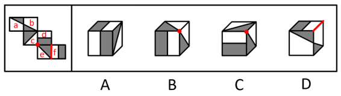

# 2021年四川下半年公务员录用考试《行测》试题（网友回忆版）

> 判断推理 · 30 题 · 四川 2021

## 第 1 题　qid 4658571 · 图形推理

从所给的四个选项中，选择最合适的一个填入问号处，使之呈现一定的规律性：

- **A**. A　✅
- **B**. B
- **C**. C
- **D**. D

**答案**：A

**官方解析**

元素组成不同，且无明显属性规律，优先考虑数量规律。题干汉字比较简单且存在窟窿面，但笔画数和面数量均无规律。观察题干发现，“回”字存在明显的横线和竖线，题干其他汉字也具备相同特点，优先考虑横线和竖线的数量。题干图形横线数依次为：1、2、3、4、5，竖线数依次为1、2、3、4、5，即横线和竖线的数量相等，只有A项符合。
故正确答案为A。

---

## 第 2 题　qid 4658458 · 图形推理

从所给的四个选项中，选择最合适的一个填入问号处，使之呈现一定的规律性：

- **A**. A　✅
- **B**. B
- **C**. C
- **D**. D

**答案**：A

**官方解析**

元素组成不同，且无明显属性规律，优先考虑数量规律。观察发现，题干图形被分割、窟窿明显，考虑面数量。题干图形面数量依次为：2、3、4、5、6、？，故“？”处应该选择有7个面的图形，观察选项，只有A项符合。
故正确答案为A。

---

## 第 3 题　qid 4658540 · 图形推理

从所给的四个选项中，选择最合适的一个填入问号处，使之呈现一定的规律性：

- **A**. A
- **B**. B
- **C**. C　✅
- **D**. D

**答案**：C

**官方解析**

元素组成不同，且无明显属性规律，优先考虑数量规律。观察发现，题干图形封闭区域明显，优先考虑数面，题干图形的面数量依次为3、4、3、6、5、？，单独数面无规律；继续观察发现，题干图形的外框均为多边形，考虑数外框直线数，外框直线数依次为3、4、3、6、5、？，规律为面数量=外框直线数量，只有C项符合此规律。
故正确答案为C。

---

## 第 4 题　qid 4658541 · 图形推理

左图为所给正方体纸盒的外表面展开图，问哪一项可以由其折叠而成？

- **A**. A　✅
- **B**. B
- **C**. C
- **D**. D

**答案**：A

**官方解析**

将题干展开图标上序号如下图所示，逐一进行分析。

A项：选项由面d、面e和面f组成，选项与题干展开图一致，当选；

B项：选项一定包含面c和面e，由于面c和面f为Z字形两端的相对面，相对面不能同时出现，故选项的正面应为面d。在题干展开图中，面c、面d和面e的公共点挨着面d中的灰色长方形，但在选项中，三个面的公共点挨着面d中的白色长方形，选项与题干展开图不一致，排除；

C项：选项一定包含面c和面e，由于面c和面f为Z字形两端的相对面，相对面不能同时出现，故选项的正面应为面d。在题干展开图中，面c、面d和面e的公共点挨着面d中的灰色长方形，但在选项中，三个面的公共点挨着面d中的白色长方形，选项与题干展开图不一致，排除；

D项：选项一定包含面a和面b，由于面a和面d为Z字形两端的相对面，相对面不能同时出现，故选项的顶面应为面f。在题干展开图中，面f中的白色长方形的长边挨着面e，但在选项中，面f中的白色长方形的长边不挨着面e，选项与题干展开图不一致，排除。

故正确答案为A。

---

## 第 5 题　qid 4658468 · 图形推理

将下列六个图形分为两类，使每一类图形都有各自的特征或规律，分类正确的是：

- **A**. ①④⑤，②③⑥
- **B**. ①②⑥，③④⑤　✅
- **C**. ①⑤⑥，②③④
- **D**. ①②③，④⑤⑥

**答案**：B

**官方解析**

本题为分组分类题目。元素组成不同，优先考虑属性规律。观察发现，图①②⑥均存在明显的等腰元素，故考虑对称性。图①②⑥为对称图形，图③④⑤不是对称图形，即图①②⑥为一组，图③④⑤为一组。
故正确答案为B。

---

## 第 6 题　qid 4658570 · 图形推理

将下列六个图形分为两类，使每一类图形都有各自的特征或规律，分类正确的是：

- **A**. ①②④，③⑤⑥
- **B**. ①⑤⑥，②③④　✅
- **C**. ①③⑤，②④⑥
- **D**. ①③⑥，②④⑤

**答案**：B

**官方解析**

本题为分组分类题目。元素组成相同，但无明显位置规律，观察发现，题干图形均由2个白球和2个黑球组成，考虑相同元素的位置。图①⑤⑥中白球到白球无需经过黑球，图②③④中白球到白球必须经过黑球，且黑球满足同样的规律，故图①⑤⑥为一组，图②③④为一组。
故正确答案为B。

---

## 第 7 题　qid 4658568 · 定义判断

自媒体是指区别于传统媒体的一种新媒体，即个人在任何地点、任何时间，通过网络个人平台向外界传递有关信息，与他人进行即时通讯，分享自己的真实感受。
根据上述定义，下列属于自媒体的是：

- **A**. 某晚报编辑小周管理旅游类公众号，定期推送副刊文章，转发率很高
- **B**. 张教授建立个人微信公众平台，发布自己原创诗词作品，受到学生好评　✅
- **C**. 小王参加了电台举办的“职场中的女性情感”网络直播活动，备受关注
- **D**. 摄影师小林不定期在某著名摄影杂志发布个人摄影作品，受到粉丝追捧

**答案**：B

**官方解析**

第一步：找出定义关键词。
“个人在任何地点、任何时间”、“通过网络个人平台向外界传递有关信息”、“与他人进行即时通讯，分享自己的真实感受”。
第二步：逐一分析选项。
A项：某晚报编辑小周管理的旅游类公众号，不是自己的网络个人平台，不符合“通过网络个人平台向外界传递有关信息”，定期推送副刊文章，不符合“个人在任何地点、任何时间”、“与他人进行即时通讯，分享自己的真实感受”，不符合定义，排除；
B项：张教授在自己的个人微信公众平台上发布原创诗词作品，符合“个人在任何地点、任何时间”、“通过网络个人平台向外界传递有关信息”、“与他人进行即时通讯，分享自己的真实感受”，符合定义，当选；
C项：小王参加的是电台举办的网络直播活动，不是自己的网络个人平台，不符合“通过网络个人平台向外界传递有关信息”，不符合定义，排除；
D项：小林不定期在某著名摄影杂志发布个人摄影作品，摄影杂志不属于小林自己的网络个人平台，不符合“通过网络个人平台向外界传递有关信息”，不符合定义，排除。
故正确答案为B。

---

## 第 8 题　qid 4658573 · 定义判断

见义勇为是指在法定职责、法定义务或者约定义务之外，为保护国家利益、社会公共利益或者他人的人身财产安全，挺身而出，同违法犯罪行为作斗争或者抢险、救灾、救人的行为。
根据上述定义，下列属于见义勇为的是：

- **A**. 某大学保安小张在日常巡查过程中，发现某实验室起火，迅速冲进实验室灭火，导致他脸上手上多处烧伤
- **B**. 赵大妈看到某美容院的橱窗中挂着邻居王女士的照片，经询问美容院并未获得王女士的授权，赵大妈坚决要求美容院老板撤下照片
- **C**. 小杨的父亲在河边挖土，不小心掉进了3米多深的河道，听到呼救声，小杨不顾一切赶上前去，迅速跳进冰冷的河水里，把父亲救上岸
- **D**. 黄老伯邻居家的几个孩子在河边玩耍，其中一个小孩掉进河里，听到孩子们的哭喊声，黄老伯不顾个人安危毅然冲进河中，将孩子救了　✅

**答案**：D

**官方解析**

第一步：找出定义关键词。
“在法定职责、法定义务或者约定义务之外”、“为保护国家利益、社会公共利益或者他人的人身财产安全”、“挺身而出”、“同违法犯罪行为作斗争或者抢险、救灾、救人”。
第二步：逐一分析选项。
A项：保安小张在巡查中发现起火，因处理灭火导致烧伤，防火是保安的主要职责，不符合“在法定职责、法定义务或者约定义务之外”，不符合定义，排除；
B项：赵大妈得知美容院并末获得王女士的授权，坚决要求撤下照片，但肖像权不属于“人身财产安全”，不符合“为保护国家利益、社会公共利益或者他人的人身财产安全”，不符合定义，排除；
C项：父亲掉进了河道，小杨把父亲救上岸，小杨对父亲有救援义务，不符合“在法定职责、法定义务或者约定义务之外”，不符合定义，排除；
D项：邻居家的小孩掉进河里，黄老伯不顾安危将孩子救了上来，符合“在法定职责、法定义务或者约定义务之外”、“为保护国家利益、社会公共利益或者他人的人身财产安全”、“挺身而出”、“同违法犯罪行为作斗争或者抢险、救灾、救人”，符合定义，当选。
故正确答案为D。

---

## 第 9 题　qid 4658567 · 定义判断

战争中的随机是指战争主体随着战争情况和条件的改变，因时因地灵活机智地把握和应对已出现的有利于或不利于军事行动的时机。
根据上述定义，下列没有体现战争中的随机的是：

- **A**. 得时无怠，时不再来
- **B**. 知己知彼，百战不殆　✅
- **C**. 待其来者而正之，因时之所宜而定之
- **D**. 兵无常势，水无常形，能因敌变化而取胜者，谓之神

**答案**：B

**官方解析**

第一步：找出定义关键词。
“战争主体随着战争情况和条件的改变”、“因时因地灵活机智地把握和应对已出现的时机”
第二步：逐一分析选项。
A项：意思是“得到了机遇就不要懈怠，机遇一旦错过，就不会再度重来。”该项指出能否遇到机遇是随机的，要灵活地把握机遇，体现了随机性，符合“战争主体随着战争情况和条件的改变”、“因时因地灵活机智地把握和应对已出现的时机”，符合定义，排除；
B项：意思是“如果对敌我双方的情况都能了解透彻，打多少次仗都不会失败。”该项只说明了常胜之道在于了解自身和对方，未体现对于时机的灵活应对，不符合“因时因地灵活机智地把握和应对已出现的时机”，不符合定义，当选；
C项：意思是“等待时机到来时就把不利于自己的局面扭转过来，根据对自己最适宜的情况把已扭转的局面予以巩固。”该项指出要灵活地利用时机来扭转局面，体现了随机性，符合“战争主体随着战争情况和条件的改变”、“因时因地灵活机智地把握和应对已出现的时机”，符合定义，排除；
D项：意思是“用兵作战没有固定不变的方式，如同水流没有固定的形状，能够依据敌情的变化而取胜，可称得上用兵如神了”。该项指出需要根据敌情的变化来布置战术，体现了随机性，符合“战争主体随着战争情况和条件的改变”、“因时因地灵活机智地把握和应对已出现的时机”，符合定义，排除。
本题为选非题，故正确答案为B。

---

## 第 10 题　qid 4658566 · 定义判断

碎片推理是指从只言片语或少量个案推导一般性结论的推理，这类推理往往以偏概全，缺乏说服力。
根据上述定义，下列不属于碎片推理的是：

- **A**. 有的家长让孩子“在家上学”，有的家长把孩子送到国外，这说明当下的应试教育很成问题
- **B**. 某位京剧名家想收一个关门弟子，挑了几次没有中意的，他很失望，认为现在的年轻人都比较怕吃苦
- **C**. 蔡某参加某企业的研发人员招聘面试，表达欠佳，面试官因此断定蔡某的技术能力有限，决定不予聘用
- **D**. 某教师在班级管理中采用了金钱奖励制度，想培养学生的经济意识，但有家长表示不满，认为不能让金钱污染孩子的心灵　✅

**答案**：D

**官方解析**

第一步：找出定义关键词。
“从只言片语或少量个案推导一般性结论的推理”、“以偏概全，缺乏说服力”。
第二步：逐一分析选项。
A项：让孩子“在家上学”或把孩子送到国外，只是部分家长的做法，属于少量个案，据此得出当下的应试教育很成问题，该观点是针对整个应试教育的判断，属于一般性结论，符合“从只言片语或少量个案推导一般性结论的推理”、“以偏概全，缺乏说服力”，符合定义，排除；
B项：某位京剧名家想收—个关门弟子，挑了几次没有中意的，这里挑选的几个人，属于少量个案，据此认为现在的年轻人都比较怕吃苦，该观点是针对整个年轻人群体的判断，属于一般性结论，符合“从只言片语或少量个案推导一般性结论的推理”、“以偏概全，缺乏说服力”，符合定义，排除；
C项：蔡某参加某企业的研发人员招聘面试，表达欠佳，面试官据此断定蔡某的技术能力有限，属于仅从一次面试的表达情况出发，来推断这个人的技术能力，符合“从只言片语或少量个案推导一般性结论的推理”、“以偏概全，缺乏说服力”，符合定义，排除；
D项：由于某教师在班级管理中采用了金钱奖励制度，家长表示不满并认为不能让金钱污染孩子的心灵，属于从制度本身出发，来推断该制度存在的问题，说明推出的是针对性结论，并非一般性结论，不符合“从只言片语或少量个案推导一般性结论的推理”，同时该推断具有一定的说服力，并非以偏概全，也不符合“以偏概全，缺乏说服力”，不符合定义，当选。
本题为选非题，故正确答案为D。

---

## 第 11 题　qid 4658577 · 定义判断

共同犯罪是指二人以上共同故意犯罪，共同故意犯罪要求共犯人知道共犯的内容及社会意义，并希望结果的发生，并且共犯人主观上要有共同犯罪意思联络，知道自己不是孤立的在犯罪，而是和他人一起共同犯罪。
根据上述定义，下列案件不属于共同犯罪的是：

- **A**. 李某和杨某系夫妻，与邻居黄某因为排水问题发生纠纷，继而发生口角，黄某被李某殴打。黄某受伤倒地后杨某未实施救助，与李某快速离开了现场。经鉴定，黄某受重伤　✅
- **B**. 周某和陈某对刘某怀恨在心，二人商议杀死刘某，于是二人非法购买了枪支，准备第二天杀死刘某。但是陈某感到害怕，于当天晚上告知刘某杀人计划，并和刘某一起到公安机关报案
- **C**. 张某和王某两人互不认识。一天深夜，张某进入一家超市偷东西时，碰到王某也在该超市偷东西，两人相视而笑。之后，张某和王某一起将偷取的东西变卖，分别获利2.2万元和1.3万元
- **D**. 谢某和丁某共谋盗窃汽车，谢某将开车所需的钥匙交给丁某。后来，谢某后悔，让丁某归还钥匙。丁某请求谢某让他配置—把钥匙之后再归还，谢某同意。随后丁某利用自己配置的钥匙盗窃了汽车

**答案**：A

**官方解析**

第一步：找出定义关键词。
“二人以上共同故意犯罪”、“要求共犯人知道共犯的内容及社会意义”、“希望结果的发生”、“共犯人主观上知道自己不是孤立的在犯罪”。
第二步：逐一分析选项。
A项：黄某被李某殴打至倒地后，身为李某妻子的杨某虽然未实施救助，但杨某本身并没有伤害邻居黄某，也无法预见丈夫会殴打黄某，并没有与丈夫共同故意犯罪，不符合“二人以上共同故意犯罪”，不符合定义，当选；
B项：周某和陈某商议杀死刘某，而且购买了枪支，说明二人的共同目的是杀死刘某，并且希望这个结果的发生，符合“二人以上共同故意犯罪”、“希望结果的发生”、“共犯人主观上知道自己不是孤立的在犯罪”。尽管陈某后来因害怕阻止了犯罪结果的发生，但二人曾为了这场犯罪付出了实际行动购买了枪支，仍属于共同犯罪，符合定义，排除；
C项：张某和王某虽然之前并不认识，但在偷盗过程中认识后一起将偷取的东西变卖以获利，说明二人的共同目的是偷窃东西获利，并且希望这个结果的发生，符合“要求共犯人知道共犯的内容及社会意义”、“希望结果的发生”、“共犯人主观上知道自己不是孤立的在犯罪”，符合定义，排除；
D项：谢某和丁某共谋盗窃汽车，而且谢某将车钥匙交给了丁某，说明二人的共同目的是盗窃汽车，并且希望这个结果的发生，符合“二人以上共同故意犯罪”、“希望结果的发生”、“共犯人主观上知道自己不是孤立的在犯罪”。尽管谢某后来后悔了，但行动上却仍默许了丁某配置汽车钥匙，使其成功盗窃了汽车，仍属于共同犯罪，符合定义，排除。
本题为选非题，故正确答案为A。

---

## 第 12 题　qid 4658579 · 定义判断

检出症候偏倚是医学研究中出现的一种系统误差，指的是病人常因某些与致病无关的因素就医，从而提高了早期病例的检出率，致使研究者过高地估计了该疾病与这些因素的关联程度，由此产生了系统误差。
根据上述定义，下列哪项反映了检出症候偏倚？

- **A**. 喜食高嘌呤饮食的痛风患者改善饮食后痊愈，研究者由此得出高嘌呤饮食与痛风有关的结论
- **B**. 有些中年人出现胸闷心悸后就诊，发现患有早期冠心病，研究者由此认为胸闷心悸与冠心病有关
- **C**. 某体检中心为社区30岁以上居民进行血脂检查，老年人因怀疑自身血脂异常乐于采血，年轻人却逃避检查，研究者由此得出30岁以上人群血脂异常比例大的结论
- **D**. 绝经期妇女服用雌激素造成子宫出血，就诊使子宫内膜癌被早期发现，而未服用者易漏诊或较迟发现，研究者由此得出绝经期妇女服用雌激素会导致子宫内膜癌的结论　✅

**答案**：D

**官方解析**

第一步：找出定义关键词。
“病人常因某些与致病无关的因素就医”、“提高了早期病例的检出率”。
第二步：逐一分析选项。
A项：高嘌呤饮食是与痛风相关的因素，而且痛风患者并没有出现就医行为，不符合“病人常因某些与致病无关的因素就医”，不符合定义，排除；
B项：中年人因胸闷心悸就诊，胸闷心悸是与冠心病相关的因素，不符合“病人常因某些与致病无关的因素就医”，不符合定义，排除；
C项：老年人因怀疑自身血脂异常而进行检查，血脂异常是疾病，老年人是因为可能出现的疾病就医，而不是因为与血脂异常不相关的因素就医，不符合“病人常因某些与致病无关的因素就医”，不符合定义，排除；
D项：妇女服用雌激素造成子宫出血，就诊时发现子宫内膜癌，而雌激素造成的子宫出血不是子宫内膜癌的致病因素，符合“病人常因某些与致病无关的因素就医”，子宫内膜癌被早期发现，也符合“提高了早期病例的检出率”，符合定义，当选。
故正确答案为D。

---

## 第 13 题　qid 4658583 · 定义判断

选择性理解是指不同的受众对传播媒介所传播的同一信息做出不同的解释、结论和反应。造成这种现象的主要原因是受众在理解过程中加进了许多主观因素，如固有的观念、态度、立场，个人的感情、情绪、习惯，使用传播媒介的动机和目的，等等。
根据上述定义，下列情形属于选择性理解的是：

- **A**. 小吴与小宋经常就新闻报道中的观点发生争执　✅
- **B**. 小婷与小凤就新闻受众问题提出不同的学术观点
- **C**. 小陈认为看时政新闻有意思，而小李认为文体新闻更刺激
- **D**. 小伍觉得晚上看新闻更有感觉，小王认为早上看能早知道

**答案**：A

**官方解析**

第一步：找出定义关键词。
“不同的受众”、“对传播媒介所传播的同一信息”、“做出不同的解释、结论和反应”。
第二步：逐一分析选项。
A项：小吴与小宋经常就新闻报道中的观点发生争执，符合“不同的受众”、“对传播媒介所传播的同一信息”、“做出不同的解释、结论和反应”，符合定义，当选；
B项：小婷与小凤就新闻受众问题提出不同的学术观点，二人讨论的对象是新闻受众，不符合“对传播媒介所传播的同一信息”，不符合定义，排除；
C项：小陈认为看时政新闻有意思，而小李认为文体新闻更刺激，只体现了二人对新闻类型的偏好不同，不符合“对传播媒介所传播的同一信息”，不符合定义，排除；
D项：小伍觉得晚上看新闻更有感觉，小王认为早上看能早知道，只体现了二人对看新闻时间的偏好不同，不符合“对传播媒介所传播的同一信息”，不符合定义，排除。
故正确答案为A。

---

## 第 14 题　qid 4658589 · 定义判断

隐形贫困人口是指工作收入并不低，但由于无节制的消费造成日常生活有时比较窘困的一类人。
根据上述定义，下列不属于隐形贫困人口是：

- **A**. 甲在某大型企业市场部工作，喜欢结交朋友，每月工资到手，通常隔三差五地邀请朋友聚会，潇洒过后，只能蹭朋友的饭或借钱度日
- **B**. 公关部经理乙因为工作原因，特别注意穿着打扮，每月工资一大半花费在购买时尚服装及高档化妆品上，而平时的生活只能将就着过
- **C**. 高级工程师丙收入不菲，儿子本科毕业后出国攻读硕士学位，虽然费用昂贵，但丙全力支持儿子的选择，自己在家过着俭朴的生活　✅
- **D**. 丁喜欢过安逸舒适的生活，刚工作不久便用收入的大部分租住高档小区，日常生活开销只能尽量缩减，或刷卡透支以待下月偿还

**答案**：C

**官方解析**

第一步：找出定义关键词。
“工作收入并不低”、“由于无节制的消费造成日常生活有时比较窘困”。
第二步：逐一分析选项。
A项：甲在某大型企业市场部工作，符合“工作收入并不低”，每月工资到手，隔三差五地邀请朋友聚会，潇洒过后，只能蹭朋友的饭或借钱度日，符合“由于无节制的消费造成日常生活有时比较窘困”，符合定义，排除；
B项：乙是公关部经理，符合“工作收入并不低”，每月工资一大半花费在购买时尚服装及高档化妆品上，平时生活只能将就着过，符合“由于无节制的消费造成日常生活有时比较窘困”，符合定义，排除；
C项：丙是高级工程师，收入不菲，符合“工作收入并不低”，但丙是为支持儿子出国攻读硕士学位而过着俭朴的生活，并非因为无节制的消费，不符合“由于无节制的消费造成日常生活有时比较窘困”，不符合定义，当选；
D项：丁刚工作不久便租得起高档小区，符合“工作收入并不低”，但丁把自己收入的大部分都用于租住高档小区，导致日常生活开销只能尽量缩减，或刷卡透支，符合“由于无节制的消费造成日常生活有时比较窘困”，符合定义，排除。
本题为选非题，故正确答案为C。

---

## 第 15 题　qid 4658581 · 定义判断

补偿性消费，也称“报复性”消费，是指某个特殊时期或场合限制了人们的消费需求，一旦解除限制，消费的需求会大幅度增加，甚至会超出合理的范畴。
根据上述定义，下列属于补偿性消费的是：

- **A**. 经济危机后，居民消费欲望低迷，为防风险，银行居民储蓄存款大幅增加
- **B**. 民俗有正月剃头不吉利的说法，因此农历二月一到，镇上的理发店人满为患　✅
- **C**. 月收入2500元的小丽为追赶时尚经常刷信用卡购买名牌服装，每月入不敷出
- **D**. 老丁常年忙于出差应酬，为了补偿对儿子的忽视，经常给他买一些贵重的礼物

**答案**：B

**官方解析**

第一步：找出定义关键词。
“某个特殊时期或场合限制了人们的消费需求”、“解除限制”、“消费的需求会大幅度增加”。
第二步：逐一分析选项。
A项：经济危机后，说明经济危机已经过去，符合“解除限制”，但银行居民储蓄存款大幅增加，说明人们把钱存进了银行，并没有用于消费，不符合“消费的需求会大幅度增加”，不符合定义，排除；
B项：民俗有正月剃头不吉利的说法，因此人们在正月期间不去理发店剃头，进入农历二月，解除了不能剃头的限制后，理发店人满为患，符合“某个特殊时期或场合限制了人们的消费需求”、“解除限制”、“消费的需求会大幅度增加”，符合定义，当选；
C项：小丽经常刷信用卡购买名牌服装，每月入不敷出，没有体现出消费需求被限制，不符合“某个特殊时期或场合限制了人们的消费需求”、“解除限制”、“消费的需求会大幅度增加”，不符合定义，排除；
D项：老丁为了补偿对儿子的忽视，经常给他买一些贵重的礼物，没有体现出在特殊时期或场合限制消费需求的情况，不符合“某个特殊时期或场合限制了人们的消费需求”、“解除限制”、“消费的需求会大幅度增加”，不符合定义，排除。
故正确答案为B。

---

## 第 16 题　qid 4658463 · 定义判断

损失憎恶效应是基于对资源浪费的担心而宁愿做出不理智或者错误选择的行为。这种担心与事情本身通常并不相干，其行为也是低效无益的。
根据上述定义，下列属于损失憎恶心理的是：

- **A**. 对于剩饭剩菜，老年人往往舍不得倒掉，就算子女极力反对，他们也要尽可能吃光，哪怕会吃坏身体　✅
- **B**. 在影院看一场近期很火的电影，刚刚开始看就发现完全不对胃口，但许多人还是会坚持到散场，因为毕竟是买了票来看这部电影的
- **C**. 老同学在微信朋友圈给他的女儿拉票，尽管孩子的舞蹈跳的一般，但还是有许多同学每天坚持去点赞，否则怕伤了那位老同学的心
- **D**. 陪孩子去上钢琴培训班，老李每次都要在教室外待上两个小时，虽然不太情愿，但也有收获，毕竟孩子明年就要参加钢琴十级考试了

**答案**：A

**官方解析**

第一步：找出定义关键词。

“基于对资源浪费的担心”、“宁愿做出不理智或者错误选择的行为”。
第二步：逐一分析选项。
A项：老年人舍不得倒掉剩饭剩菜，是担心浪费粮食，符合“基于对资源浪费的担心”，他们也要尽可能吃光，哪怕会吃坏身体，是一种错误的选择，符合“宁愿做出不理智或者错误选择的行为”，符合定义，当选；
B项：许多人坚持看完不对胃口的电影，是担心浪费电影票钱，符合“基于对资源浪费的担心”，但坚持看完电影，不符合“宁愿做出不理智或者错误选择的行为”，不符合定义，排除；
C项：许多同学投票是为了不让老同学伤心，并不是担心浪费资源，不符合“基于对资源浪费的担心”，不符合定义，排除；
D项：陪孩子学钢琴，老李在教室外待上两个小时，不符合“基于对资源浪费的担心”、“宁愿做出不理智或者错误选择的行为”，不符合定义，排除。
故正确答案为A。

---

## 第 17 题　qid 4658461 · 类比推理

文字：资料：图片

- **A**. 木板：建材：钢铁　✅
- **B**. 红色：颜色：彩色
- **C**. 塑料：脸盆：脚盆
- **D**. 窗户：窗帘：布料

**答案**：A

**官方解析**

第一步：判断题干词语间逻辑关系。
文字和图片是两种不同的信息展现方式，二者为并列关系，且二者都属于资料，与资料都构成种属关系。
第二步：判断选项词语间逻辑关系。
A项：木板和钢铁是两种不同的材料，二者为并列关系，且二者都属于建材，与建材都构成种属关系，与题干逻辑关系一致，当选；
B项：彩色是指除黑白灰之外的各种颜色，彩色包含红色，二者为包容关系，与题干逻辑关系不一致，排除；
C项：塑料是脚盆的原材料，二者为原材料与成品的对应关系，与题干逻辑关系不一致，排除；
D项：布料是窗帘的原材料，二者为原材料与成品的对应关系，与题干逻辑关系不一致，排除。
故正确答案为A。

---

## 第 18 题　qid 4658456 · 类比推理

公众号：新媒体：传播

- **A**. 电视：电器：消费
- **B**. 电饭煲：炊具：饮食
- **C**. 手机：通讯工具：交流　✅
- **D**. 电脑：电子产品：打字

**答案**：C

**官方解析**

第一步：判断题干词语间逻辑关系。
公众号是一种新媒体，二者为种属关系；新媒体的功能是传播，二者为功能对应。
第二步：判断选项词语间逻辑关系。
A项：电视是一种电器，二者为种属关系；电器的功能是为人们生产生活提供便利并非消费，与题干逻辑关系不一致，排除；
B项：电饭煲是一种炊具，二者为种属关系；炊具的功能是加工食材并非饮食，与题干逻辑关系不一致，排除；
C项：手机是一种通讯工具，二者为种属关系；通讯工具的功能是交流，二者为功能对应，与题干逻辑关系一致，当选；
D项：电脑是一种电子产品，二者为种属关系；电子产品的功能是学习娱乐并非打字，与题干逻辑关系不一致，排除。
故正确答案为C。

---

## 第 19 题　qid 4658537 · 类比推理

琴棋书画：古琴：围棋

- **A**. 梅兰竹菊：梅花：兰花　✅
- **B**. 花鸟虫鱼：菊花：画眉
- **C**. 笔墨纸砚：毛笔：砚台
- **D**. 江河湖海：长江：黄河

**答案**：A

**官方解析**

第一步：判断题干词语间逻辑关系。
琴棋书画原指古琴、围棋、书法、国画，后泛指弹琴、弈棋、写字、绘画，用来表示个人的文化素养。琴棋书画四字为并列关系，琴即为古琴，棋即为围棋，后两词分别与第一个词的前两个字为全同关系。
第二步：判断选项词语间逻辑关系。
A项：梅兰竹菊四字为并列关系，梅即为梅花，兰即为兰花，后两词分别与第一个词的前两个字为全同关系，与题干逻辑关系一致，当选；
B项：花鸟虫鱼四字为并列关系，菊花是花的一种，画眉是鸟的一种，后两词分别与第一个词的前两个字为种属关系，与题干逻辑关系不一致，排除；
C项：笔墨纸砚四字为并列关系，笔即为毛笔，砚即为砚台，但砚为第一个词中的第四个字，与题干逻辑关系不一致，排除；
D项：江河湖海四字为并列关系，长江是江的一种，黄河是河的一种，后两词分别与第一个词的前两个字为种属关系，与题干逻辑关系不一致，排除。
故正确答案为A。

---

## 第 20 题　qid 4658542 · 类比推理

睡觉对于（    ）相当于（    ）对于身体健康

- **A**. 精力充沛；跑步　✅
- **B**. 身心愉悦；工作
- **C**. 梦游；以逸待劳
- **D**. 减肥；有氧运动

**答案**：A

**官方解析**

逐一代入选项。
A项：睡觉可以使人精力充沛，跑步可以使人身体健康，二者均为方式目的的对应关系，前后逻辑关系一致，当选；
B项：睡觉可以使人身心愉悦，二者为方式目的的对应关系，工作压力大时会影响人的身体健康，二者不是方式目的的对应关系，前后逻辑关系不一致，排除；
C项：睡觉时可能会出现梦游，以逸待劳指在战争中养精蓄锐，等疲乏的敌人来犯时给以迎头痛击，和身体健康没有必然联系，前后逻辑关系不一致，排除；
D项：睡觉和减肥没有必然联系，有氧运动可以使人身体健康，前后逻辑关系不一致，排除。
故正确答案为A。

---

## 第 21 题　qid 4658457 · 类比推理

病毒 对于 （    ） 相当于 （    ） 对于 鲸鱼

- **A**. 疫苗；捕鲸船
- **B**. 微小；庞大
- **C**. 医生；渔夫
- **D**. 细菌；熊猫　✅

**答案**：D

**官方解析**

逐一代入选项。
A项：“疫苗”能够帮助免疫系统产生抗体阻止“病毒”对人体造成伤害，二者为功能对象的对应关系；捕鲸船是一种专门用于捕鲸、加工鲸鱼的专用船，二者为工具的对应关系，前后逻辑关系不一致，排除；
B项：病毒是一种个体微小，结构简单的非细胞型生物，微小是病毒的属性，二者为属性对应关系；鲸鱼是体型庞大的海洋生物，庞大是鲸鱼的属性，二者为属性对应关系，但是前后顺序相反，前后逻辑关系不一致，排除；
C项：医生消灭病毒，二者为主宾关系；渔夫捕捉鲸鱼，二者为主宾关系，但是前后顺序相反，前后逻辑关系不一致，排除；
D项：病毒和细菌是两种不同的病原微生物，二者为并列关系中的反对关系；熊猫和鲸鱼是两种不同的哺乳动物，二者为并列关系中的反对关系，前后逻辑关系一致，当选。
故正确答案为D。

---

## 第 22 题　qid 4658650 · 逻辑判断

甲醛作为室内空气污染物，被世界卫生组织列为致癌和致畸形物质，研究者发现在甲醛胁迫下，植物光合作用的速率降低，植物叶片叶绿素含量下降，抗性越弱的植物品种其叶绿素含量下降越快。所以，甲醛污染对室内植物的影响与植物的抗性强弱有关。
以下哪项如果为真，最能反驳上述研究者的观点？

- **A**. 植物的抗性越好叶绿素含量越高，越能吸收甲醛
- **B**. 植物叶绿素含量变化是评价其抗性强弱的重要指标
- **C**. 甲醛污染对室内植物的影响取决于植物叶片的大小　✅
- **D**. 光合作用的速率改变，植物叶片叶绿素含量随之变化

**答案**：C

**官方解析**

第一步：找出论点和论据。
论点：甲醛污染对室内植物的影响与植物的抗性强弱有关。
论据：在甲醛胁迫下，植物光合作用的速率降低，植物叶片叶绿素含量下降，抗性越弱的植物品种其叶绿素含量下降越快。
本题论点和论据都在讨论甲醛污染对植物的影响与植物抗性强弱之间的关系，话题一致，削弱可以优先考虑否定论点。
第二步：逐一分析选项。
A项：该项指出植物抗性强弱与叶绿素含量有关，而叶绿素含量又与甲醛有关，因此该项从科学的角度解释了甲醛污染对植物的影响与植物抗性强弱之间确实存在着关联，为加强项，无法削弱，排除；
B项：该项指出叶绿素含量变化是评价植物抗性的重要指标，说明叶绿素和植物抗性之间有关系，为加强项，无法削弱，排除；
C项：该项指出植物叶片的大小才是甲醛污染对室内植物影响的决定性因素，即甲醛污染对室内植物的影响并不取决于植物的抗性强弱，直接否定了论点，可以削弱，当选；
D项：该项指出光合作用的速率会影响植物叶片的叶绿素含量，说明光合作用速率和叶绿素含量有关系，为加强项，无法削弱，排除。
故正确答案为C。

---

## 第 23 题　qid 4658543 · 逻辑判断

德国的一项研究显示，长期居住在天寒地冻、杳无人烟的南极洲，人的大脑平均会缩小7%，学习、记忆以及与人交往能力随之减弱。因此，生活在炎热地区的人比生活在寒冷地区的人更聪明。
以下哪项如果为真，最能削弱上述论证？

- **A**. 该项研究成果尚未公开发表
- **B**. 气候会对人的智力产生巨大的影响
- **C**. 寒冷令人们为保存更多能量，倾向于减少学习及社交活动
- **D**. 该研究结果是可逆的，离开南极洲一段时间后人的大脑基本恢复正常水平　✅

**答案**：D

**官方解析**

第一步：找出论点和论据。
论点：生活在炎热地区的人比生活在寒冷地区的人更聪明。
论据：研究显示，长期居住在天寒地冻、杳无人烟的南极洲，人的大脑平均会缩小7％，学习、记忆以及与人交往能力随之减弱。
本题的论点、论据话题一致，均在讨论气温与智力之间的关系，削弱可以考虑削弱论点，即证明生活在炎热地区的人并不比生活在寒冷地区的人更聪明，也可以考虑削弱论据，即证明研究结果不科学，无法得到结论。
第二步：逐一分析选项。
A项：说明成果尚未公开发表，但并不明确研究结论是否准确，无法削弱，排除；
B项：说明气候对人的智力影响巨大，但影响巨大也不明确气温高是否会导致智力高，为不明确项，无法削弱，排除；
C项：说明寒冷会让人减少学习和社交，肯定了题干中的论据部分，即寒冷让学习、记忆以及与人交往能力随之减弱，为加强项，无法削弱，排除；
D项：说明研究结果是可逆的，离开南极洲后人脑基本恢复正常水平，对研究结果本身提出质疑，可以削弱，当选。
故正确答案为D。

---

## 第 24 题　qid 4658459 · 逻辑判断

有人建议，英语四六级考试应该改变统一考试模式，实行社会化改革，由社会机构组织，大学生自愿选择报考，大学与用人单位自主认可，而不再是所有学生必须统一参加、企事业单位招聘统一要求成绩的考试，这能令大学英语教育摆脱应试教育。
以下哪项如果为真，最能削弱上述结论？

- **A**. 大学生自愿选择报考有助于学生自主学习
- **B**. 社会机构组织英语考试也会导致应试教育　✅
- **C**. 企事业单位招聘并没有统一要求英语成绩
- **D**. 英语应试教育不仅仅是四六级统一考试造成的

**答案**：B

**官方解析**

第一步：找出论点和论据。
论点：（英语四六级考试应该改变统一考试模式，实行社会化改革，由社会机构组织，大学生自愿选择报考，大学与用人单位自主认可）这能令大学英语教育摆脱应试教育。
论据：无。
本题只有论点，没有论据，削弱可以优先考虑削弱论点。
第二步：逐一分析选项。
A项：该项说的是大学生自愿选择报考和学生自主学习之间的关系，论点讨论的是大学生自愿选择报考和大学英语教育摆脱应试教育之间的关系，话题不一致，无法削弱，排除；
B项：该项说的是社会机构组织英语考试也会导致应试教育，说明改变统一考试的模式，由社会机构组织英语考试并不能让大学英语教育摆脱应试教育，直接否定论点，可以削弱，当选；
C项：该项说的是企事业单位招聘并没有统一要求英语成绩，也就是说大学与用人单位自主认可对大学英语教育摆脱应试教育的影响并不明确，不明确项，无法削弱，排除；
D项：该项说的是英语应试教育不仅仅是四六级统一考试造成的，还存在其他的原因，因此仅改变统一考试的模式是否能令大学英语教育摆脱应试教育并不明确，不明确项，无法削弱，排除。
故正确答案为B。

---

## 第 25 题　qid 4658536 · 逻辑判断

随着靶向及免疫治疗方式的飞跃发展，某专科医生近日宣布，淋巴瘤已成为目前控制率、治愈率最高的肿瘤，淋巴瘤主要分为霍奇金淋巴瘤和非霍奇金淋巴瘤两大类，非霍奇金淋巴瘤是最常见的淋巴瘤类型，约占所有淋巴瘤的91%，其治愈率高达70%；而霍奇金淋巴瘤临床治愈率最高可达80%。除了发达的医学技术，该高治愈率还与越来越多的肿瘤药物被纳入医保报销、提高了药物的可及性有关。
以下哪项如果为真，最能支持上述专科医生的论证?

- **A**. 淋巴瘤不属于恶性肿瘤，治愈率高
- **B**. 淋巴瘤的高治愈率与其控制率提高有关
- **C**. 如果医疗费用提高，则淋巴瘤治愈率将下降　✅
- **D**. 患霍奇金淋巴瘤的被治愈人数比非霍奇金淋巴瘤的更多

**答案**：C

**官方解析**

第一步：找出论点和论据。
论点：淋巴瘤已成为目前控制率、治愈率最高的肿瘤，除了发达的医学技术，该高治愈率还与越来越多的肿瘤药物被纳入医保报销、提高了药物的可及性有关。
论据：无。
本题只有论点，没有论据，加强优先考虑补充论据。
第二步：逐一分析选项。
A项：论点说的是“淋巴瘤的高治愈率、控制率”与“发达的医学技术和肿瘤药物纳入医保、药物可及性提高”有关，而该项提出“淋巴瘤的高治愈率”与“淋巴瘤不属于恶性肿瘤”有关，话题不一致，不能加强，排除；
B项：论点说的是“淋巴瘤的高治愈率、控制率”与“发达的医学技术和肿瘤药物纳入医保、药物可及性提高”有关，而该项提出“淋巴瘤的高治愈率”与“控制率提高”有关，话题不一致，不能加强，排除；
C项：论点说的是“淋巴瘤的高治愈率、控制率”与“发达的医学技术和肿瘤药物纳入医保、药物可及性提高”有关，该项指出如果医疗费用提高，那么治愈率会下降，说明医疗费用和治愈率有关系，即淋巴瘤的高治愈率和医保有关，补充反面论据，可以加强，当选；
D项：论点说的是“淋巴瘤的高治愈率、控制率”与“发达的医学技术和肿瘤药物纳入医保、药物可及性提高”有关，而该项提出患不同淋巴瘤的被治愈人数的不同，话题不一致，不能加强，排除。
故正确答案为C。

---

## 第 26 题　qid 4658535 · 逻辑判断

国外某中学通过走访和调研了解人们对基础教育的期望，排在前4位的是让学生“有清晰的目标”“能在行动中学习”“能在发现问题、解决问题中展示个人能力”“有勇气进入陌生领域”。有基础教育专家据此指出，每个孩子都是独立的个体，应该关注孩子的个性体验和挑战现状、解决问题的能力，而不是统一标准的考试成绩。
以下哪项如果为真，最能削弱该基础教育专家的观点？

- **A**. 教师在统一的大班制教学中也同样能让学生学会用已有的知识解决未知的问题
- **B**. 统一标准的考试并不妨碍学生确立清晰的学习目标、锻炼进入陌生领域的勇气　✅
- **C**. 中国的教育资源比较紧缺，统一标准的考试有助于体现教育选拔的公平和公正
- **D**. 大班制教学有助于激发学生的竞争意识，培养其团队合作和挑战现状以及解决问题的能力

**答案**：B

**官方解析**

第一步：找出论点和论据。
论点：每个孩子都是独立的个体，应该关注孩子的个性体验和挑战现状、解决问题的能力，而不是统一标准的考试成绩。
论据：国外某中学通过走访和调研了解人们对基础教育的期望，排在前4位的是让学生“有清晰的目标”“能在行动中学习”“能在发现问题、解决问题中展示个人能力”“有勇气进入陌生领域”。
本题论点说的是孩子基础教育阶段需要重点关注各项综合素质，而不是统一标准的考试成绩，论据说的是人们对基础教育的期望排在前4位的是孩子的目标、在行动中学习、个人能力、勇气。论点论据话题一致，削弱优先考虑否定论点。
第二步：逐一分析选项。
A项：该项说大班制教学同样能够让学生学会用已有知识解决未知问题，但论点说的是统一标准的考试成绩是否应该关注，大班制教学是授课模式，统一标准的考试成绩是考核方式，话题不一致，无法削弱，排除；
B项：该项说统一标准的考试不妨碍学生确立清晰的目标、锻炼进入陌生领域的勇气，也就是说即使学生的各项综合素质比较重要，也无法得出不应该关注统一标准考试成绩的结论，直接否定论点，可以削弱，当选；
C项：该项说明统一标准的考试在教育选拔上有优点，但论点讨论的是基础教育阶段需要重点关注各项综合素质还是统一标准的考试成绩，话题不一致，无法削弱，排除；
D项：该项说明大班制教学的优点，但论点说的是统一标准的考试成绩是否应该关注，大班制教学是授课模式，统一标准的考试成绩是考核方式，话题不一致，无法削弱，排除。
故正确答案为B。

---

## 第 27 题　qid 4658582 · 逻辑判断

科学家对19岁以上的1524名男性和2008名女性共3532人进行了调查。结果显示，不吃早餐的男性在1年内体重增加3公斤以上的比重是吃早餐的1.9倍之多；不吃早餐的女性在1年内体重增加3公斤以上的比重是吃早餐的1.4倍之多。因此，他们得出结论：如果不吃早餐，无论男女，体重增加的概率都会比较高。
以下哪项如果为真，最能削弱上述结论？

- **A**. 不吃早餐，男女体重不一定都会增加
- **B**. 男女体重增加主要是早上睡懒觉造成的　✅
- **C**. 18岁以下的人群不一定会出现研究中的结果
- **D**. 相比男性，不吃早餐对女性体重增加的影响并不大

**答案**：B

**官方解析**

第一步：找出论点和论据。
论点：如果不吃早餐，无论男女，体重增加的概率都会比较高。
论据：不吃早餐的男性在1年内体重增加3公斤以上的比重是吃早餐的1.9倍之多；不吃早餐的女性在1年内体重增加3公斤以上的比重是吃早餐的1.4倍之多。
本题的论点讨论的是不吃早餐，且无论男女体重增加的概率都会比较高，论据讨论的是通过对19岁以上的男性和女性吃早餐情况的调查得出的研究结果，论点论据主体范围不一致，削弱可以优先考虑拆桥，也可以考虑削弱论点。
第二步：逐一分析选项。
A项：该项说的是不吃早餐，男女体重不一定都会增加，并没有明确说明不吃早餐后体重的具体变化情况，不明确选项，无法削弱，排除；
B项：该项说的是男女体重增加主要是早上睡懒觉造成的，可以直接指出男女体重增加不是因为不吃早餐而是因为睡懒觉，直接削弱论点，保留；
C项：该项说的是18岁以下的人群不一定会出现研究中的结果，指出了论据可能因为研究对象的范围不够充分导致得不出结论，可能性拆桥，保留；
D项：该项说的是不吃早餐对女性体重增加的影响比男性小，但在不吃早餐的人群中男性与女性的比较并不能说明不吃早餐后男女体重增加的概率会不会比较高，无关项，无法削弱，排除。
对比B、C两项，B项直接给出了男女体重增加的真因，直接否定了论点，而C项虽然指出了论据与论点中主体范围不一致的问题，能够拆桥，但表述中出现了“不一定”这种可能性的字眼，为可能性削弱，因此，B项的削弱力度比C项更强。
故正确答案为B。

---

## 第 28 题　qid 4658591 · 逻辑判断

只有持之以恒抓基层、打基础，发挥基层党组织战斗堡垒作用和党员先锋模范作用，机关党建工作才能落地生根，只有与时俱进、改革创新，勇于探索实践、善于总结经验，机关党建工作才能不断提高质量、充满活力。
根据以上陈述，可以得出以下哪项结论？

- **A**. 如果不能持之以恒抓基层、打基础，发挥基层党组织战斗堡垒作用和党员先锋模范作用，机关党建工作就不能不断提高质量、充满活力
- **B**. 只要持之以恒抓基层、打基础，发挥基层党组织战斗堡垒作用和党员先锋模范作用，机关党建工作就能落地生根
- **C**. 如果不能与时俱进、改革创新，勇于探索实践、善于总结经验，机关党建工作就不能不断提高质量、充满活力　✅
- **D**. 只要与时俱进、改革创新，勇于探索实践、善于总结经验，机关党建工作就能不断提高质量、充满活力

**答案**：C

**官方解析**

第一步：翻译题干。

①机关党建工作落地生根持之以恒抓基层、打基础，发挥基层党组织战斗堡垒作用和党员先锋模范作用；

②机关党建工作不断提高质量、充满活力与时俱进、改革创新，勇于探索实践、善于总结经验。

第二步：逐一分析选项。

A项：翻译为机关党建工作不断提高质量、充满活力持之以恒抓基层、打基础，发挥基层党组织战斗堡垒作用和党员先锋模范作用，题干中这两者之间没有推出关系，无法推出，排除；

B项：翻译为持之以恒抓基层、打基础，发挥基层党组织战斗堡垒作用和党员先锋模范作用机关党建工作落地生根，是对①的肯后，肯后得不出必然结论，无法推出，排除；

C项：翻译为机关党建工作不断提高质量、充满活力与时俱进、改革创新，勇于探索实践、善于总结经验，是对②的肯前，肯前必肯后，可以推出，当选；

D项：翻译为与时俱进、改革创新，勇于探索实践、善于总结经验机关党建工作不断提高质量、充满活力，是对②的肯后，肯后得不出必然结论，无法推出，排除。

故正确答案为C。

---

## 第 29 题　qid 4658642 · 逻辑判断

导游：“从朝天宫到金顶有两条道路可以走，一条是明代神道，一条是清代神道。清代神道路程比较近，台阶坡度也较小，走起来容易；明代神道路程比较远，台阶坡度也比较大。”选择走清代神道的小马走了一半，发现清代神道的台阶也很多、很陡，他不由得抱怨导游误导了他。
以下哪项如果为真，最能解释上述导游和小马的认识差异？

- **A**. 明代神道的台阶更多、更陡　✅
- **B**. 小马平时缺少锻炼，爬山少
- **C**. 清代神道的台阶主要集中在前半段
- **D**. 导游几乎天天爬山，他说容易，但是对于游客却很难

**答案**：A

**官方解析**

第一步：找出题干矛盾。
导游根据清代神道与明代神道总体情况的比较而给出了建议，而小马只是走了清代神道就觉得清代神道走起来难，两人的认识差异在于导游是根据比较得出的结论，而小马没有比较，只是单纯觉得走清代神道并不容易，从而产生认知差异。
第二步：逐一分析选项。
A项：小马只是走了清代神道就觉得清代神道的台阶很多、很陡，但该项说明实际上明代神道的台阶更多、更陡，所以导游是比较两条神道的情况而得出清代神道更容易走，而小马不知道明代神道的情况，所以没有对比，可以解释导游和小马的认识差异，当选；
B项：导游和小马的认识差异在于导游根据两条神道情况的比较而给出建议，但小马没有通过比较就单纯觉得清代神道比较难走，该项说小马平时缺少锻炼，爬山少，只能解释为什么小马觉得清代神道难走，无法解释导游和小马的认识差异，排除；
C项：该项只是阐述清代神道的情况，但明代神道具体情况怎样没有提及，而题干中导游和小马的认识差异在于导游是对比两条神道的情况而给出建议，但小马没有通过比较就单纯觉得清代神道比较难走，由该项无法得知两条神道的对比情况，无法解释导游和小马的认识差异，排除；
D项：导游和小马的认识差异在于导游是对比两条神道的情况而给出建议，但小马没有通过比较就单纯觉得清代神道比较难走，该项没有提及两条神道情况的对比，无法解释导游和小马的认识差异，排除。
故正确答案为A。

---

## 第 30 题　qid 4658595 · 逻辑判断

某物业公司为住户提供24小时全年无休的门卫保安服务，门卫保安每日分为白班和夜班，每班均有一名保安人员上班。三名保安人员每3天排一轮班，已知本轮排班中，甲、乙、丙的上班情况如下：①没有人连续上一整天班；②甲、乙、丙在本轮排班中都有一个整天在休息；③没有人被全部安排白班或夜班；④为确保员工充足休息，刚排完夜班之后不能接着排白班。则在本轮排班中，以下情况可能发生的是：

- **A**. 某住户已经连续两天看到乙上班　✅
- **B**. 某住户连续两天都看到甲和乙在上班
- **C**. 某住户前天白天出门和今天夜晚回家时都看见丙在上班
- **D**. 某住户已经连续三天晚上下班回家都没有看见丙在上班

**答案**：A

**官方解析**

第一步：分析题干条件。

本轮排班中，上班情况如下：

①没有人连续上一整天班；

②每人都有一个整天在休息；

③没有人被全部安排白班或夜班；

④刚排完夜班之后不能接着排白班。

第二步：根据题干条件进行推理。

提问为“可能”，优先考虑代入法。

代入A项，该项说连续两天看到乙上班，假设第一天白班排乙，根据条件③可知，第二天夜班可以排乙。若第一天夜班排给丙，则根据条件①②③和④，可得出如下表所示的情况：

此时满足题干所有条件，可能为真，当选；

代入B项，若满足连续两天看到甲和乙均上班，则第一天和第二天只能都排给甲和乙，那么第三天只能都排给丙，与条件①不符，不可能为真，排除；

代入C项，若满足前天白天出门和今天夜晚回家时都能看到丙上班，则第一天的白班和第三天的夜班都必须排给丙，根据条件①④可知，无论第一天夜班排甲还是乙，此人第二天只能上夜班，此时就会有人全都被排夜班，与条件③不符，不可能为真，排除；

代入D项，若满足连续三天没有看到丙上夜班，则三天的夜班均只能排甲和乙，而丙在这一轮排班中只能上白班，与条件③不符，不可能为真，排除。

故正确答案为A。

---
