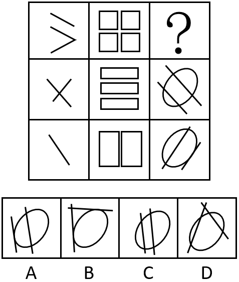
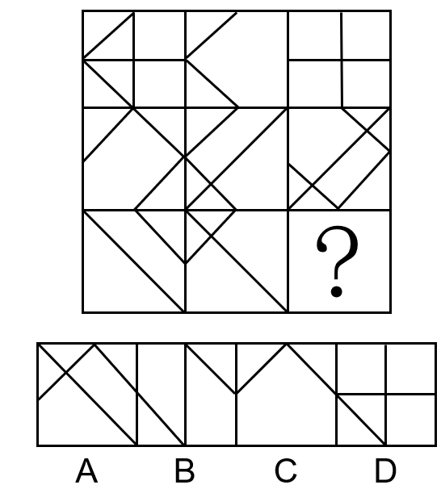
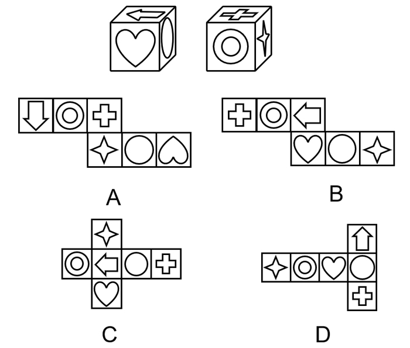
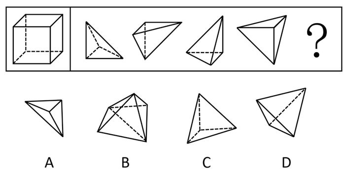
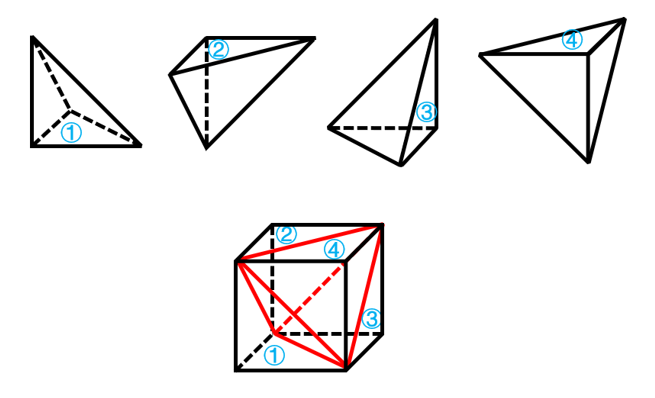
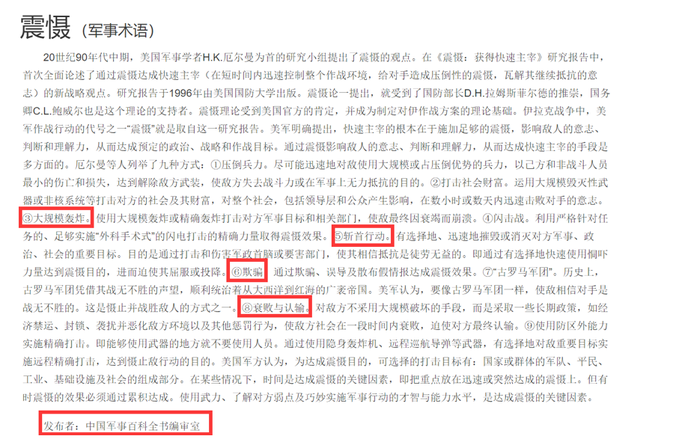
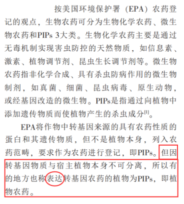

# 2021年四川省公务员录用考试《行测》题（网友回忆版）

> 判断推理 · 30 题 · 四川 2021

## 第 1 题　qid 3523636 · 图形推理

从所给的四个选项中，选择最合适的一个填入问号处，使之呈现一定的规律性：

- **A**. A
- **B**. B
- **C**. C　✅
- **D**. D

**答案**：C

**官方解析**

元素组成不同，且无明显属性规律，考虑数量规律。观察发现，图三和图四为多圆相切的变形图，考虑笔画数。题干图形均为一笔画，所以？处图形也应该是一笔画图形。A项三笔，B项两笔，C项一笔，D项两笔。只有C项满足规律。
故正确答案为C。

---

## 第 2 题　qid 3523639 · 图形推理

从所给的四个选项中，选择最合适的一个填入问号处，使之呈现一定的规律性:

- **A**. A
- **B**. B
- **C**. C
- **D**. D　✅

**答案**：D

**官方解析**

元素组成不同，且无明显属性规律，优先考虑数量规律。图形出现明显多边形，优先考虑数直线。整体数直线无规律，考虑数多边形的边数量。题干图形多边形边数量依次为3、4、5、6、？、8，因此？处的多边形应为7条边，只有D符合。
故正确答案为D。

---

## 第 3 题　qid 3523643 · 图形推理

从所给的四个选项中，选择最合适的一个填入问号处，使之呈现一定的规律性:

- **A**. A　✅
- **B**. B
- **C**. C
- **D**. D

**答案**：A

**官方解析**

元素组成不同，优先考虑属性规律，图形规整，考虑对称性，题干都是轴对称图形，但无唯一答案。继续观察发现，题干图形封闭面明显，考虑数面。题干第一组图形面数量依次为：2、3、4，呈现等差递增，第二组图遵循相同规律，前两幅图面数量依次为3、4，故“？”处应该选择有5个面的图形，只有A项符合。
故正确答案为A。

---

## 第 4 题　qid 3523644 · 图形推理

从所给的四个选项中，选择最合适的一个填入问号处，使之呈现一定的规律性：

- **A**. A
- **B**. B
- **C**. C
- **D**. D　✅

**答案**：D

**官方解析**

元素组成不同，且无明显属性规律，考虑数量规律。第一列图一中出现了单一直线，考虑数直线，第一列直线数分别为3、2、1；第二列封闭面明显，考虑面数量，分别为4、3、2；第三列线条交叉明显，考虑交点数，分别为？、4、3。所以问号处交点数应该为5，只有D项符合。
故正确答案为D。
注：第三列数面也可以，选4个面的图形，也只有D项符合。

---

## 第 5 题　qid 3523645 · 图形推理

从所给的四个选项中，选择最合适的一个填入问号处，使之呈现一定的规律性：

- **A**. A
- **B**. B
- **C**. C　✅
- **D**. D

**答案**：C

**官方解析**

图形元素组成相似，相同线条重复出现，优先考虑样式规律。九宫格优先按行看，第一行中，图1和图2求异得到图3，第二行验证符合此规律，第三行应用此规律，只有C选项符合。
故正确答案为C。

---

## 第 6 题　qid 3523638 · 图形推理

图①和图②分别是某立方体从不同角度的视图，下列哪项不可能是该立方体的外表面展开图?

- **A**. A　✅
- **B**. B
- **C**. C
- **D**. D

**答案**：A

**官方解析**

A项：选项中同心圆面与四角星面之间的直角边为同一条边（如图1红线所示），则箭头面与四角星面的公共边为图1绿线所示，此时箭头面内箭头指向四角星面，背向四角星面的相对面，即心形面，而题干箭头背向圆面，与题干不一致，当选。

本题为选非题，故正确答案为A。

---

## 第 7 题　qid 3523626 · 图形推理

要想使右侧图形在不旋转的情况下拼合成左侧的正方体造型，还需在问号处添加的图形是：

- **A**. A
- **B**. B
- **C**. C
- **D**. D　✅

**答案**：D

**官方解析**

本题考查立体拼合。观察发现，右侧四个图形包含左侧正方体的所有外表面（可通过12个直角三角形面进行判断），因此“？”处图形无法与直角三角形面进行拼合，需与右侧四个图形中非直角三角形面（4个）进行拼合，只有D项符合。具体拼合如下图所示：

故正确答案为D。

---

## 第 8 题　qid 3523641 · 图形推理

把下面的六个图形分为两类，使每一类图形都有各自的共同特征或规律，分类正确的一项是：

- **A**. ①②④，③⑤⑥
- **B**. ①④⑤，②③⑥
- **C**. ①④⑥，②③⑤
- **D**. ①③④，②⑤⑥　✅

**答案**：D

**官方解析**

本题为分组分类题目，元素组成不同，优先考虑属性规律。观察发现，图②④⑤⑥中均出现等腰元素，考虑对称性。图①③④为既轴对称又中心对称图形，图②⑤⑥为轴对称图形。即图①③④为一组，图②⑤⑥为一组。
故正确答案为D。

---

## 第 9 题　qid 3523642 · 定义判断

精准扶贫是针对不同贫困区域环境、不同贫困农户状况，运用科学有效程序对扶贫对象实施精确识别、精确帮扶、精确管理的治贫方式。
根据上述定义，下列属于精准扶贫的是：

- **A**. 希望村地理位置偏僻，常年属于贫困村，为响应国家脱贫号召，更快实现致富，村民集体研究决定凡成年劳动力均外出务工
- **B**. 某贫困村村干部为使村民享有更优美的生活环境，带领村民加班奋战10昼夜，用5万元扶贫款将全村房屋统一粉刷一新，使村容村貌大幅改观
- **C**. 某山区万同学从小失去双亲，但她刻苦努力，获得的奖状挂满了简陋的屋子，她的精神感动了来调研的扶贫工作组，他们自发捐给万同学2000元钱
- **D**. 精准扶贫“回头看”中，向阳村制定了排除法。通过信息比对或入户调查，对虽然没有“运营车辆”和“商品房”，但家庭收入却远高于贫困县的农户进行了清退　✅

**答案**：D

**官方解析**

第一步：找出定义关键词。
“针对不同贫困区域环境、不同贫困农户状况”、“运用科学有效程序对扶贫对象实施精确识别、精确帮扶、精确管理的治贫方式”。
第二步：逐一分析选项。
A项：让贫困村所有成年劳动力均外出务工，没有体现针对“不同贫困农户状况”进行治贫，不符合定义，排除；
B项：村干部带领村民用扶贫款将全村房屋统一粉刷一新，这种做法是为了改善村容村貌，并非针对“不同贫困农户状况”进行治贫，不符合定义，排除；
C项：扶贫工作组为万同学捐款，是因为被她的精神所感动，并非“运用科学有效程序对扶贫对象实施精确识别、精确帮扶、精确管理的治贫方式”，不符合定义，排除；
D项：向阳村对家庭收入高于贫困县的农户进行清退，是针对“不同贫困农户状况”进行的“精确识别、精确管理”，符合定义，当选。
故正确答案为D。

---

## 第 10 题　qid 3523635 · 定义判断

海参在海底用管足和肌肉伸缩行动，速度非常缓慢，遇到敌人来袭时，海参会把它的内脏喷出，趁机逃跑。而把肚肠抛掉的海参，大概再过50天，就能长出新的内脏来。其生存法则看似弱势和简单，其实充满哲理与智慧，人们将其称为海参哲学。
根据上述定义，下列哪种说法与海参哲学无关？

- **A**. 吃亏是福
- **B**. 吃一堑长一智　✅
- **C**. 小不忍则乱大谋
- **D**. 舍得舍得，不舍不得

**答案**：B

**官方解析**

第一步：找出定义关键词。
“关键时刻，要舍弃一些东西，趁机脱困”、“舍弃的东西会再回来”。
第二步：逐一分析选项。
A项：吃亏是福的意思是说能吃亏，会吃亏的人，也算是一个有福气的人，题干海参就是吃了丢内脏的亏，保住了生命，符合“关键时刻，要舍弃一些东西，趁机脱困”，符合定义，排除；
B项：吃一堑长一智的意思是经过失败取得教训，不符合“关键时刻，要舍弃一些东西，趁机脱困”，也不符合“舍弃的东西会再回来”，不符合定义，当选；
C项：小不忍则乱大谋的意思是小事不忍耐就会坏了大事，题干海参就是忍了丢内脏的苦，保住了生命，符合“关键时刻，要舍弃一些东西，趁机脱困”，符合定义，排除；
D项：舍得舍得，不舍不得的意思是有舍才有得，题干海参就是舍了内脏，保了生命，最后内脏又长了回来，符合“关键时刻，要舍弃一些东西，趁机脱困”，也符合“舍弃的东西会再回来”，符合定义，排除。
本题为选非题，故正确答案为B。

---

## 第 11 题　qid 3523622 · 定义判断

价格歧视是指商品或服务的提供者以不同的价格把同样品质的商品或者服务卖给不同的顾客。
根据上述定义，下列不构成价格歧视的是：

- **A**. 
某服装店定期把有瑕疵的服装打折销售
　✅
- **B**. 
某景点对本地居民实行门票半价优惠政策

- **C**. 
某网约车平台在相同情况下，总是多收老客户的费用

- **D**. 
某商家给消费10次以上的顾客升级为VIP，购物享九折优惠

**答案**：A

**官方解析**

第一步：找出定义关键词。

“不同的价格”、“同样品质的商品或者服务”、“不同的顾客”。

第二步：逐一分析选项。

A项：某服装店定期把有瑕疵的服装打折销售，有瑕疵的服装和普通的服装不属于“同样品质的商品或者服务”，不符合定义，当选；

B项：某景点对本地居民实行门票半价优惠政策，对本地居民和外地居民的门票采取不同的定价，符合“不同的价格”、“同样品质的商品或者服务”、“不同的顾客”，符合定义，排除；

C项：某网约车平台在相同情况下，总是多收老客户的费用，“相同情况”说明符合“同样品质的商品或者服务”，老客户和新客户的费用不同，符合“不同的价格”、“不同的顾客”，符合定义，排除；

D项：某商家给消费10次以上的顾客升级为VIP，购物享九折优惠，VIP客户和普通客户买东西的价格不同，符合“不同的价格”、“同样品质的商品或者服务”、“不同的顾客”，符合定义，排除。

本题为选非题，故正确答案为A。

---

## 第 12 题　qid 3523627 · 定义判断

退出壁垒指现有企业在市场前景不好、企业业绩不佳时意欲退出该产业（市场），但由于各种因素的阻挠，资源不能顺利转移出去。
根据上述定义，下列属于退出壁垒的是：

- **A**. 某企业委托咨询公司对餐饮市场进行调研并寻找适合项目， 耗资不少但未能如愿
- **B**. 某企业因为转型，不得不闲置一部分设备，原有设备的投资不能完全收回，损失很大　✅
- **C**. 某企业为产品升级既要更新设备，又要为工人适岗支付一大笔培训费用，陷入资金困境
- **D**. 某企业因与一老客户失和，单方终止了购买原材料合同，为此必须支付大笔违约金，该企业财务状况明显恶化

**答案**：B

**官方解析**

第一步：找出定义关键词。
“企业”、“前景不好、业绩不佳时退出该产业（市场）”、“资源不能顺利转移”。
第二步：逐一分析选项。
A项：企业是想要对餐饮市场调研寻找合适项目进入餐饮市场，而题干是退出市场，不符合“前景不好、业绩不佳时退出该产业（市场）”，不符合定义，排除；
B项：企业转型，虽然没有提到转型原因，但转型即经营其他类型产业，符合“退出该产业（市场）”，原有设备投资不能完全收回，符合“资源不能顺利转移”，符合定义，当选；
C项：企业产品升级，是在原有基础上更新设备，不符合“前景不好、业绩不佳时退出该产业（市场）”，不符合定义，排除；
D项：企业因为单方终止合同赔付违约金，不涉及退出产业，不符合“前景不好、业绩不佳时退出该产业（市场）”，不符合定义，排除。
故正确答案为B。

---

## 第 13 题　qid 3523629 · 定义判断

植物耐逆性指植物处于不利环境时，通过自身内部代谢反应，迅速阻止、降低或修复由逆境造成的损伤，使其仍保持正常的生理活动。
根据上述定义，下列体现了植物耐逆性的是：

- **A**. 离离原上草，一岁一枯荣；野火烧不尽，春风吹又生
- **B**. 墙角数枝梅，凌寒独自开；遥知不是雪，为有暗香来
- **C**. 尽管戈壁滩的气候异常恶劣，但胡杨树仍然可以很好地生存下去
- **D**. 一些植物在高盐环境下通过改善细胞膜的通透性来阻止大量失水　✅

**答案**：D

**官方解析**

第一步：找出定义关键词。
“植物处于不利环境时”、“通过自身内部代谢反应，迅速阻止、降低或修复由逆境造成的损伤，使其仍保持正常的生理活动”。
第二步：逐一分析选项。
A项：诗句含义为长长的原上草是多么茂盛，每年秋冬枯黄春来草色浓。无情的野火只能烧掉干叶，春风吹来大地又是绿茸茸。只是讲述了秋冬时野草的生存条件，不符合“通过自身内部代谢反应，迅速阻止、降低或修复由逆境造成的损伤，使其仍保持正常的生理活动”，不符合定义，排除；
B项：诗句含义为那墙角的几枝梅花，冒着严寒独自盛开。为什么远望就知道洁白的梅花不是雪呢？因为梅花隐隐传来阵阵的香气。诗句只是描写了梅花在严寒中生长，不符合“通过自身内部代谢反应，迅速阻止、降低或修复由逆境造成的损伤，使其仍保持正常的生理活动”，不符合定义，排除；
C项：胡杨树在气候恶劣的环境下能够很好地生存下去是因为胡杨树自身的生命力强大，不符合“通过自身内部代谢反应，迅速阻止、降低或修复由逆境造成的损伤，使其仍保持正常的生理活动”，不符合定义，排除；
D项：一些植物处于高盐环境下，符合“植物处于不利环境时”，通过改善细胞膜的通透性来阻止大量失水，符合“通过自身内部代谢反应，迅速阻止、降低或修复由逆境造成的损伤，使其仍保持正常的生理活动”，符合定义，当选。
故正确答案为D。

---

## 第 14 题　qid 3523630 · 定义判断

震慑是指利用各种手段造成足够强大的胁迫和强制力量，从而使对手慑于巨大的压力而丧失继续抵抗意志的一种军事战略形式。
根据上述定义，下列军事行动不属于震慑的是：

- **A**. 运用大规模毁灭性武器打击敌国重要设施，数天内即瓦解敌国的抵抗意志
- **B**. 对敌国主战派进行有选择的、迅速的斩首行动，使敌国主战派丧失主心骨　✅
- **C**. 长时间使用经济禁运、骚扰等恶化敌人生存环境的手段胁迫使敌人崩溃
- **D**. 通过欺骗、误导、散布假情报等方式，使敌人相信自己不堪一击从而放弃抵抗

**答案**：B

**官方解析**

第一步：找出定义关键词。

“利用各种手段造成足够强大的胁迫和强制力量”、“使对手慑于巨大的压力而丧失继续抵抗意志”。

第二步：逐一分析选项。

A项：运用大规模毁灭性武器打击敌国重要设施，符合“利用各种手段造成足够强大的胁迫和强制力量”，数天内即瓦解敌国的抵抗意志，也符合“使对手慑于巨大的压力而丧失继续抵抗意志”，符合定义，排除；

B项：对敌国主战派进行有选择的、迅速的斩首行动，符合“利用各种手段造成足够强大的胁迫和强制力量”，使敌国主战派丧失主心骨，不等同于丧失抵抗意志，不符合“使对手慑于巨大的压力而丧失继续抵抗意志”，不符合定义，当选； 

C项：长时间使用经济禁运、骚扰等恶化敌人生存环境，符合“利用各种手段造成足够强大的胁迫和强制力量”，胁迫使敌人崩溃，也符合“使对手慑于巨大的压力而丧失继续抵抗意志”，符合定义，排除； 

D项：欺骗、误导、散布假情报等方式，使敌人相信自己不堪一击从而放弃抵抗，符合“利用各种手段造成足够强大的胁迫和强制力量”，也符合“使对手慑于巨大的压力而丧失继续抵抗意志”，符合定义，排除。

本题为选非题，故正确答案为B。

备注：通过查询相关文献发现，其实ABCD项均在原文有所体现，但是出题人明显改动了B项的斩首行动，将原文中的目的进行了删减，从而使B项跟其他三项相比，关键词并不完全对应，本题问“不属于”，故小粉笔更倾向把答案给到B项。

---

## 第 15 题　qid 3523633 · 定义判断

补偿性工资差别是指在实际经济活动中，即使能力和受教育程度相同的劳动者，从事不同的工作也会存在工资差别。这种差别不是由于行业和区域垄断造成的，而是与工作性质和条件有关，由此引起的工资差别称为补偿性工资差别。
根据上述定义，下列没有涉及补偿性工资差别的是：

- **A**. 两项工作对工作人员的要求相同，但由于其中一项工作的条件比较艰苦，因此需要给出更高的工资才能招聘到人
- **B**. 尽管殡葬行业并不比其他行业辛苦，工作环境也不错，但大家都认为殡葬行业从业人员领取高工资理所应当
- **C**. 某学院统计显示，该学院的毕业生在北京比在上海更容易找到工作，工资水平更高　✅
- **D**. 某公司在进行薪资改革时，提出收入分配应向科技工作者和一线职工倾斜

**答案**：C

**官方解析**

第一步：找出定义关键词。
“能力和受教育程度相同的劳动者”、“从事不同的工作也会存在工资差别”、“这种差别不是由于行业和区域垄断造成的，而是与工作性质和条件有关”。
第二步：逐一分析选项。
A项：两项工作对工作人员的要求相同，符合“能力和受教育程度相同的劳动者”，其中一项工作的条件比甲艰苦，需给出更高的工资，符合“从事不同的工作也会存在工资差别”、“这种差别不是由于行业和区域垄断造成的，而是与工作性质和条件有关”，符合定义，排除； 
B项：大家都认为殡葬行业领取高工资理所应当，殡葬行业具有特殊的工作性质和条件，符合“这种差别不是由于行业和区域垄断造成的，而是与工作性质和条件有关”，符合定义，排除；
C项：在北京比在上海更容易找到工作，工资水平更高，是区域导致的工资差别，与工作本身的性质和条件无关，不符合“这种差别不是由于行业和区域垄断造成的，而是与工作性质和条件有关”，不符合定义，当选；
D项：收入分配应向科技工作者和一线职工倾斜，科技工作者与一线职工的工作均风险高责任大，符合“这种差别不是由于行业和区域垄断造成的，而是与工作性质和条件有关”，符合定义，排除。
本题为选非题，故正确答案为C。

---

## 第 16 题　qid 3523631 · 类比推理

钢笔：书写

- **A**. 水瓶：保温
- **B**. 春天：播种
- **C**. 手表：计时　✅
- **D**. 眼睛：阅读

**答案**：C

**官方解析**

第一步：判断题干词语间逻辑关系。
钢笔具有书写的功能，且钢笔是具体的一种工具，二者为工具与功能的对应关系。
第二步：判断选项词语间逻辑关系。
A项：水瓶的功能应该是盛水，一般说暖水瓶具有保温的功能，与题干逻辑关系不一致，排除；
B项：春天是播种的季节，不是功能的对应关系，与题干逻辑关系不一致，排除；
C项：手表具有计时的功能，且手表是具体的一种工具，二者为工具与功能的对应关系，与题干逻辑关系一致，当选；
D项：眼睛具有阅读的功能，但眼睛是人的身体器官，不属于工具与功能的对应关系，与题干逻辑关系不一致，排除。
故正确答案为C。

---

## 第 17 题　qid 3523634 · 类比推理

下载：网站：上传

- **A**. 购物：商家：退货　✅
- **B**. 打工：城市：返乡
- **C**. 上学：学校：放学
- **D**. 上场：比赛：下场

**答案**：A

**官方解析**

第一步：判断题干词语间逻辑关系。
从网站下载，上传至网站，三者为对应关系。
第二步：判断选项词语间逻辑关系。
A项：从商家购物，退货至商家，三者为对应关系，与题干逻辑关系一致，当选；
B项：去城市打工，从城市返乡，与题干逻辑关系不一致，排除；
C项：去学校上学，从学校放学，与题干逻辑关系不一致，排除；
D项：比赛之前需要上场，比赛之后需要下场，与题干逻辑关系不一致，排除。
故正确答案为A。

---

## 第 18 题　qid 3523637 · 类比推理

能源：核能：核武器

- **A**. 材料：木材：家具　✅
- **B**. 运动：游泳：泳衣
- **C**. 网络：网站：网友
- **D**. 手机：计时器：闹钟

**答案**：A

**官方解析**

第一步：判断题干词语间逻辑关系。
核能是一种能源，二者为种属关系，制作核武器利用了核能，二者为对应关系。 
第二步：判断选项词语间逻辑关系。
A项：木材是一种材料，二者为种属关系，制作家具利用了木材，二者为对应关系，与题干逻辑关系一致，当选；
B项：游泳是一种运动，二者为种属关系，但是游泳时需要用到泳衣，与题干逻辑关系不一致，排除；
C项：网站要借助网络才能使用，二者之间不是种属关系，与题干逻辑关系不一致，排除；
D项：手机和计时器都有相同的功能，都可以用来计时，二者是功能相同的并列关系，不是种属关系，与题干逻辑关系不一致，排除。
故正确答案为A。

---

## 第 19 题　qid 3523528 · 类比推理

二氧化碳：珊瑚骨骼：腐蚀

- **A**. 物种灭绝：动物：威胁
- **B**. 天灾人祸：物种：减少
- **C**. 土壤沙化：空气：雾霾
- **D**. 气候变暖：冰川：消融　✅

**答案**：D

**官方解析**

第一步：判断题干词语间逻辑关系。
“二氧化碳”会“腐蚀”“珊瑚骨骼”，题干为因果对应关系。
第二步：判断选项词语间逻辑关系。
A项：“物种灭绝”本身就包含“动物”被“威胁”的意思，与题干逻辑关系不一致，排除；
B项：“天灾人祸”会“减少”“物种”，为因果对应关系，与题干逻辑关系一致，保留；
C项：“土壤沙化”会导致“雾霾”，与题干逻辑关系不一致，排除；
D项：“气候变暖”会“消融”“冰川”，与题干逻辑关系一致，保留。
对于BD两项，题干的“二氧化碳”和D项的“气候变暖”只是独立的一个原因，但B项的原因可以拆分为“天灾”和“人祸”两个原因，因此D项与题干更为一致。
故正确答案为D。

---

## 第 20 题　qid 3523640 · 类比推理

因循守旧 对于 （    ） 相当于 （    ） 对于 胆量

- **A**. 创新；畏缩不前　✅
- **B**. 古板；闻风丧胆
- **C**. 保守；胆大妄为
- **D**. 落后；一往无前

**答案**：A

**官方解析**

逐一代入选项。
A项：“因循守旧”是指死守老一套，缺乏创新精神，形容缺乏“创新”，二者为对应关系；“畏缩不前”是指畏惧退缩，不敢前进，形容缺乏“胆量”，二者为对应关系，前后逻辑关系一致，当选；
B项：“因循守旧”是指死守老一套，缺乏创新精神，与“古板”为近义关系；“闻风丧胆”是指听到风声就吓得丧失了勇气，形容缺乏“胆量”，二者为对应关系，前后逻辑关系不一致，排除；
C项：“因循守旧”是指死守老一套，缺乏创新精神，与“保守”为近义关系；“胆大妄为”是指毫无顾忌地干坏事或大胆地乱做事，形容“胆量大”，前后逻辑关系不一致，排除；
D项：“因循守旧”会导致落后，二者为因果关系；“一往无前”是指勇猛无畏地前进，与胆量不是因果关系，前后逻辑关系不一致，排除。
故正确答案为A。

---

## 第 21 题　qid 3523623 · 逻辑判断

中国共产党党章是对每一位共产党员的基本要求。党员领导干部要做学习党章、遵守党章的模范。凡是党章规定党员必须做到的，领导干部要首先做到；凡是党章规定党员一定不能做的，领导干部要带头不做。
根据以上信息，可以得出以下哪项？

- **A**. 凡是党章规定领导干部首先做到的，党员必须做到
- **B**. 凡是党章规定领导干部带头不做的，党员一定不能做
- **C**. 有些党章规定领导干部要首先做到的，党员必须做到　✅
- **D**. 有些党章没有规定党员必须做的，领导干部要首先去做

**答案**：C

**官方解析**

第一步：翻译题干。

①党员必须做到的领导干部要首先做到；

②党员一定不能做的领导干部要带头不做。

第二步：逐一分析选项。

A项：翻译为“领导干部首先做到的党员必须做到”，是对条件①的肯后，肯后得不到确定性结论，无法推出，排除；

B项：翻译为“领导干部带头不做的党员一定不能做”，是对条件②的肯后，但肯后得不到确定性结论，排除；

C项：翻译为“有些党章规定领导干部首先做到的党员必须做到”，根据集合推理“换位规则”可知，“所有A都是B”可推出“有的B是A”，则条件①可以推出C项“有些党章规定领导干部要首先做到的党员必须做到”，可以推出，当选；

D项：翻译为“有的党员不必做的领导干部首先去做”，是对条件①的否前，否前得不到确定性结论，无法推出，排除。

故正确答案为C。

---

## 第 22 题　qid 3522620 · 逻辑判断

许多人在拍照时喜欢摆出“剪刀手”动作。对此，有人认为，如果手离镜头足够近，相机分辨率足够高，拍出的照片一旦上网，黑客就能通过照片放大技术和人工智能增强技术将照片中的人物指纹信息还原出来。这会让指纹认证及个人身份信息无密可保。因此，拍照时摆出“剪刀手”动作存在安全风险。
以下哪项如果为真，最能质疑上述结论?

- **A**. 目前智能手机虽在高速发展，但是分辨率还不足以拍出清晰的指纹
- **B**. 即使是高清网传照片，通过它还原指纹信息也存在一定的技术门槛
- **C**. 实验证明，网络照片受自身清晰度影响不满足识别指纹信息的条件　✅
- **D**. 从电子照片中提取到用户指纹信息的相关报道，实为愚人节新闻

**答案**：C

**官方解析**

第一步：找出论点和论据。
论点：拍照时摆出“剪刀手”动作存在安全风险。
论据：如果手离镜头足够近，相机分辨率足够高，拍出的照片一旦上网，黑客就能通过照片放大技术和人工智能增强技术将照片中的人物指纹信息还原出来。这会让指纹认证及个人身份信息无密可保。
本题论点讨论的是拍照时摆出“剪刀手”动作存在安全风险，论据讨论的是拍照时摆出“剪刀手”动作会把指纹呈现在照片中，上传到网络后黑客会通过各种技术还原指纹信息，使得指纹认证和个人身份信息无密可保，都是在说手离镜头足够近，会带来安全风险，话题一致，削弱优先考虑削弱论点。
第二步：逐一分析选项。
A项：该项说的是智能手机的分辨率还不足以拍出清晰的指纹，但不明确黑客能否通过一系列技术把指纹信息还原出来并带来安全风险，属于不明确选项，无法削弱，排除；
B项：该项讨论的是通过高清网传照片还原指纹信息存在一定的技术门槛，说明还原指纹信息困难，但是没有明确黑客最终能否通过技术还原指纹并带来安全风险，属于不明确选项，无法削弱，排除；
C项：该项指出网络照片受自身清晰度影响不满足识别指纹信息的条件，从而说明拍照时摆出“剪刀手”动作不会存在安全风险，可以削弱题干论点，当选；
D项：该项说的是这些报道实为愚人节新闻，但不明确拍照时摆出“剪刀手”动作能否带来安全风险，属于不明确选项，无法削弱，排除。
故正确答案为C。

---

## 第 23 题　qid 3523625 · 逻辑判断

近日，某语言学习与评估研究中心的一项针对英语学习的研究成果表明，AI英语老师对学习者的英语水平提升效果明显。
以下哪项如果为真，最能支持上述论述？

- **A**. 
最初被评定为低级别英语水平的测试者取得的进步更大

- **B**. 
近的测试者表示他们喜欢AI英语教学，并计划继续使用

- **C**. 
AI英语教学可以精确记录、分析、反馈测试者的学习表现，做到视觉、听觉、认知“三位一体”

- **D**. 
测试者每使用AI英语教学APP学习1小时，英语考试成绩将平均提升0.324分，在全体测试者中，约的用户获得了更高的分数
　✅

**答案**：D

**官方解析**

第一步：找出论点和论据。
论点：AI英语老师对学习者的英语水平提升效果明显。
论据：无。
本题只有论点没有论据，加强优先考虑补充论据，如解释原因加强或举例加强。
第二步：逐一分析选项。
A项：低级别英语水平的测试者取得的进步更大，说明是在和其他级别的测试者比较，但低级别的测试者所占比重、其他级别的测试者的英语水平是否有提升均不明确，不明确项，无法加强，排除；
B项：喜欢、继续使用AI英语教学不代表该方式效果好、提升效果明显，可能是因为方便快捷等其它原因，不明确项，无法加强，排除；
C项：介绍AI英语教学的特点，但没有提及这些特点是否能给学习者的英语水平带来提升效果，不明确项，无法加强，排除；
D项：通过列举事实数据说明AI英语教学对学习者的英语水平提升效果明显，补充论据，可以加强，当选。
故正确答案为D。

---

## 第 24 题　qid 3523628 · 逻辑判断

“生酮饮食”不仅可以达到减肥的效果，而且因为燃烧脂肪取代葡萄糖，身体可以得到更持续，稳定的供能。通常，在摄取食物（主要是碳水化合物）之后，人体内的血糖含量会达到一个峰值。随着能量被消耗，血糖供应不足，身体会发送饥饿信号，催促人吃东西。一般情况下，脂肪是很难被转化为能量的。“生酮饮食”是通过断绝碳水化合物的摄入，迫使身体燃烧脂肪来供能，将脂肪转化为“酮”，作为生命的养料，相比葡萄糖只能提供几小时的供能，由燃烧脂肪产生的“酮”可以提供几周、甚至几个月稳定、不间断的能量。
以下哪项如果为真，最能质疑上述研究结论?

- **A**. “生酮饮食”容易造成营养不良，它可能对女性的内分泌产生间接影响
- **B**. 不少坚持“生酮饮食”的人在半年以后会出现代谢异常、肠道菌群失衡而复胖　✅
- **C**. “生酮饮食”要求实行者依循饿就吃、不饿不吃的原则。只要是依此原则生活的健康人都不会胖
- **D**. “生酮饮食”初期，各个器官还没有适应新的变化，会有注意力无法集中、情绪烦躁易怒等状况出现

**答案**：B

**官方解析**

第一步：找出论点和论据。
论点：“生酮饮食”不仅可以达到减肥的效果，而且因为燃烧脂肪取代葡萄糖，身体可以得到更持续，稳定的供能。
论据：“生酮饮食”通过断绝碳水化合物的摄入，迫使身体燃烧脂肪来供能，将脂肪转化为“酮”，作为生命的养料，相比葡萄糖只能提供几小时的供能，由燃烧脂肪产生的“酮”可以提供几周、甚至几个月稳定、不间断的能量。
本题论点论据都在说“生酮饮食”有减肥效果，且身体能获得更持续、稳定供能，二者话题一致，削弱优先考虑削弱论点。
第二步：逐一分析选项。
A项：该项说的是生酮饮食可能会影响女性的内分泌，但论点讨论的是生酮饮食能不能减肥，话题不一致，排除；
B项：该项说的是坚持生酮饮食的人半年后反而因为代谢异常、肠道菌群失衡而复胖，直接否定论点中说的生酮饮食可以减肥的观点，削弱论点，可以削弱，当选；
C项：该项说的是只要实行者依循饿就吃、不饿不吃的原则就不会胖，为加强项，不能削弱，排除；
D项：该项说的是生酮饮食初期的负面现象，与生酮饮食能不能减肥无关，不能削弱，排除。
故正确答案为B。

---

## 第 25 题　qid 3523632 · 逻辑判断

近年来，通过多项针对科研人员参与科普情况的调查分析，发现存在重科研轻科普的现象，科研人员从事科普工作往往被某些圈内人士看作不务正业、不思进取，做科普反倒给学术形象的塑造带来了“负面”效应。科研人员一旦缺席科普，非专业的“科普人士”就会哗众取宠，谣言就有了存在的空间，最终不利于科学事业本身的发展。有学者认为，让更多有热情、有能力的科研人员投身科普，关键在于社会要形成科普与科研同等重要的共识。
以下哪项如果为真，最能支持该学者的观点?

- **A**. 在中国创造成为时代强音的今天，社会和公众需要越来越多的“网红”科学家
- **B**. 把科研成果描述得让社会和普通公众能明白、看得懂，才是科研人员的真本事
- **C**. 科研人员被认为是“科学传播的第一发球员”，他们有责任培养更多的科学公民
- **D**. 在科研和人才考评体系中把科普纳入考核范围，可以促使科研人员挺直腰杆做科普　✅

**答案**：D

**官方解析**

第一步：找出论点和论据。
论点：让更多有热情、有能力的科研人员投身科普，关键在于社会要形成科普与科研同等重要的共识。
论据：无。
本题只有论点没有论据，可以考虑补充论据进行加强，论点讨论的是科研人员投身科普的关键在于社会要形成科普科研同等重要的共识，即需要补充论据说明，目前社会重科研轻科普的认识制约了科研人员投身科普工作。
第二步：逐一分析选项。
A项：该项指出社会和公众需要更多的“网红”科学家，与论点讨论的如何让更多科研人员投身科普无关，无法加强，排除；
B项：该项指出把科研成果描述得让公众看得懂才是科研人员的真本事，即做好科普才是科研人员的真本事，只是强调了科普的重要性，没有提及制约科研人员投身科普工作的原因，也没有明确说明科普应该比科研更重要，还是科普、科研应该同等重要，无法加强，排除；
C项：该项指出科研人员被认为是“科学传播的第一发球员”，侧重在其他人对科研人员的看法，而论点更想强调的是要有科普与科研同等重要的意识，无法加强，排除；
D项：该项指出把科普纳入考核范围可以促使科研人员挺直腰杆做科普，把科普纳入考核范围，说明原来的考核制度中不包括科普，补充论据说明制度上也存在“重科研轻科普”的现象，影响了科研人员投身科普工作的热情，可以加强，而在科研和人才考评体系中将科普纳入考核范围，说明要在制度上让科研、科普都受到重视，体现了二者同等重要的地位，补充论据，可以加强，当选。
故正确答案为D。
注：本题难度较大，题干文段主要在探讨制约科研人员投身科普的原因是对科普的不重视，以及想要解决这个问题关键在于形成科研、科普同等重要的共识， D项人才评价体系中不重视科普，与题干背景中已有的科研人员做科普被看做不务正业，二者共同说明从思想、制度上都存在“重科研轻科普”的认识，这种认识制约了科研人员投身科普工作，而将科研考评体系中加入科普考核，能够促进形成科普与科研同等重要的共识，进而解决科研人员不愿投身科普工作的问题，可以加强论点；而B项只是强调对于科研人员来说，科普能够体现真本事，但没有说明目前科研、科普的是否同等重要，也没有说明到底是何原因制约了科研人员投身科普工作，不能加强，因此选择D项。

---

## 第 26 题　qid 3523602 · 逻辑判断

美国环境保护署把作物转基因中具有农药性的蛋白和遗传物质（不包括植物其他部分）列入农药范畴，称为植物农药，要求将其作为农药进行登记。但一些专家认为，因为转基因物质与宿主本身不可分离，植物具有农药性，所以应直接称含转基因农药的植物为植物农药。
以下哪项如果为真，最能反驳专家的观点？

- **A**. 不含农药性质的转基因植物不能称为植物农药
- **B**. 含转基因农药的植物应作为农药登记，这说明它是一种农药
- **C**. 将具有农药性的转基因物质转移到新宿主上，农药性可能消失　✅
- **D**. 如果将转基因物质与宿主分离，则分离后的转基因植物不是植物农药

**答案**：C

**官方解析**

第一步：找出论点和论据。

论点：应直接称含转基因农药的植物为植物农药。

论据：转基因物质与宿主本身不可分离，植物具有农药性。

本题论点说的是如何界定植物农药，即应将“含转基因农药的植物”称为植物农药，论据说的是这样界定植物农药的原因。如果要想削弱论点，就要表明论据中界定植物农药的原因是不合理的或不成立的。

由于本题的题干不易理解，因此我们可以先分析一下题干的含义和逻辑。论据的第一句话说“转基因物质与宿主本身不可分离”，由于从专业上来看，转基因物质是可以更换宿主的，因此论据中“不可分离”的含义并不是转基因物质和具体的某一个宿主是永久绑定的，而是强调转基因物质是存在于宿主中的，二者形成了一个整体，具有整体性。论据第二句话说“植物具有农药性”，这句话承接前一句话，其中的“植物”指的就是“转基因物质+宿主”这个整体，也就是论点中说的“含转基因农药的植物”。因此，从论据到论点，是根据“含转基因农药的植物是一个整体，整体具有农药性”得出“应将含转基因农药的植物这一整体称为植物农药”。

第二步：逐一分析选项。

A项：选项表明“不含农药性质的转基因植物”不能称为植物农药，而论点说的是应将“含转基因农药的植物”称为植物农药，根据“不含农药性质的转基因植物”的情况，无法判断“含转基因农药的植物”的情况，无法削弱，排除；

B项：选项表明含转基因农药的植物应作为“农药”登记，这说明它是一种“农药”，而论点说的是含转基因农药的植物是“植物农药”，根据某一植物是“农药”无法判断其是否是“植物农药”，无法削弱，排除；

C项：选项的意思是在某些情况下，含转基因农药的植物可能不具有农药性，那么就不应该把所有“含有”转基因农药的植物都命名为植物农药，可以削弱论点，当选；

最后小粉笔也去查询了相关文献，如下图所示，原文表明，应将“表达”转基因农药的植物称为植物农药，而本题论点说应将“含有”转基因农药的植物称为植物农药，即本题论点将原文中的“表达”偷换成了“含有”。简单说就是“含有”转基因农药不一定能“表达”农药性，这和C项中植物整体的农药性可能表达不出来（即“消失”），含义是相同的，因此C项举反例可以削弱。

注：C项中出现了“可能”一词，很多同学会觉得削弱的力度较弱，就直接排除了C项。这里同学们需要注意，削弱的力度是需要进行比较的，当其他选项没有削弱力度时，含有“可能”的选项也可以成为正确答案。

D项：选项表明如果将转基因物质与宿主分离，则分离后的转基因植物不是植物农药，也就是说分离后的转基因植物（即宿主）不是植物农药，但在本题的论述中，将植物整体进行命名的原因，仅在于转基因物质和宿主是一个整体，且整体具有农药性，而与宿主是否具有农药性无关，所以本项和论据、论点的逻辑均不冲突，无法削弱，排除。

故正确答案为C。

---

## 第 27 题　qid 3523603 · 类比推理

我坚信火星上有生命存在，不信你看火星上有许多长条状阴影，就是火星人在上面开凿的运河。
以下哪项与上述论证方式最为相似？

- **A**. 我坚信相对论是真理，你想爱因斯坦是天才，他能说错吗？
- **B**. 我坚信这件事就是他干的，你想如果不是他干的，还会有谁呢？
- **C**. 我坚信地球以外一定居住着其他智慧生物，你看宇宙那么大，要不然就太浪费了
- **D**. 我坚信全球气候正在变暖，你看有些耐寒的动物已经灭绝了，那就是全球变暖导致的　✅

**答案**：D

**官方解析**

第一步：分析题干推理形式。
题干首先提出观点：坚信火星上有生命存在（a），然后进行举例论证：火星上有许多长条状阴影（b），最后得出结论：就是火星人在上面开凿的运河（a导致b）。故论证方式为：坚信a，举例b，得出结论a导致b。
第二步：逐一分析选项。
A项：坚信相对论是真理（a），举例爱因斯坦是天才（b），但并未得出结论a导致b，与题干论证方式不同，排除；
B项：坚信这件事就是他干的（a），如果不是他干的，还会有谁呢？不是举例论证，也并未得出a导致b，与题干论证方式不同，排除；
C项：坚信地球以外一定居住着其他智慧生物（a），举例宇宙那么大（b），得出结论要不然就太浪费了，其结论并不是a导致b，与题干论证方式不同，排除；
D项：坚信全球气候正在变暖（a），举例有些耐寒的动物已经灭绝了（b），得出结论那就是全球变暖导致的（a导致b），与题干论证方式相同，当选。
故正确答案为D。

---

## 第 28 题　qid 3523604 · 逻辑判断

小张的所有同学（假定只有王，周，陈三人）都给小张的同一个朋友打过电话，小张的所有朋友（假定只有李、朱、余三人）都给小张的同一个同学打过电话，王和教师李从无联系，余和企业家周从无联系。接到小张所有同学电话的那个人不是教师就是工程师，接到小张所有朋友电话的那个人不是公务员就是企业家。小张的所有同学和朋友职业各不相同。
由此可以推出：

- **A**. 陈是公务员，朱是工程师　✅
- **B**. 王是公务员，余是工程师
- **C**. 余是公务员，朱是工程师
- **D**. 陈是公务员，王是工程师

**答案**：A

**官方解析**

第一步：分析题干条件。
（1）小张的所有同学（王，周，陈）都给小张的同一个朋友打过电话；
（2）小张的所有朋友（李、朱、余）都给小张的同一个同学打过电话；
（3）王和教师李从无联系；
（4）余和企业家周从无联系；
（5）接到小张所有同学（王，周，陈）电话的那个人不是教师就是工程师；
（6）接到小张所有朋友（李、朱、余）电话的那个人不是公务员就是企业家；
（7）小张的所有同学和朋友职业各不相同。
第二步：根据题干条件进行推理。
根据条件（1）与条件（2），小张的所有同学（王，周，陈）都给小张的同一个朋友打过电话，所有朋友（李、朱、余）都给小张的同一个同学打过电话，结合条件（3）和（4）可知，接到小张所有同学（王，周，陈）电话的那个人不是李、不是余，只能是朱；接到小张所有朋友（李、朱、余）电话的不是周、不是王，只能是陈。再根据条件（3）李是教师，结合条件（5）和（7）可知，朱只能是工程师。根据条件（4）周是企业家，结合条件（6）和（7）可知，陈只能是公务员。
故正确答案为A。

---

## 第 29 题　qid 3523605 · 逻辑判断

中国有句古语：“留得五湖明月在，不愁无处下金钩。”
据此，以下哪项是不可能的？

- **A**. 如果留得五湖明月，定有去处可下金钩
- **B**. 虽然五湖明月俱在，但已无处可下金钩　✅
- **C**. 没有留得五湖明月，也有去处可下金钩
- **D**. 没有留得五湖明月，可能会无处下金钩

**答案**：B

**官方解析**

第一步：翻译题干。

题干翻译为：留得五湖明月在有去处下金钩（无处下金钩）。

第二步：逐一分析选项。

A项：翻译为：留得五湖明月有去处下金钩，是对题干条件关系的肯前，肯前必肯后，一定为真，排除；

B项：翻译为：五湖明月俱在 且 无处可下金钩，与题干的条件关系相矛盾，不可能为真，当选；

C项：翻译为：留得五湖明月 且 有去处下金钩，“留得五湖明月”是对题干条件关系的否前，否前无必然结论，因此可能为真，排除；

D项：前半句“留得五湖明月”是对题干条件关系的否前，否前无必然结论，因此可能无处下金钩，排除。

本题为选非题，故正确答案为B。

---

## 第 30 题　qid 3523606 · 逻辑判断

档案室有五个柜子，分别放着教育学院、体育学院、人文学院、管理学院和信息学院五个学院的资料，现在由甲、乙、丙、丁、戊五位同学来猜这五个柜子和五个学院的对应关系：
甲：第二个柜子是教育学院的，第三个柜子是体育学院的。
乙：第二个柜子是人文学院的，第四个柜子是管理学院的。
丙：第一个柜子是管理学院的，第五个柜子是信息学院的。
丁：第三个柜子是人文学院的，第四个柜子是信息学院的。
戊：第二个柜子是体育学院的，第五个柜子是教育学院的。
打开柜子后发现，每个人都只猜对了一半，而且每个柜子都有一个人猜对。由此可以推出：

- **A**. 第一个柜子里放着人文学院的资料
- **B**. 第二个柜子里放着教育学院的资料
- **C**. 第三个柜子里放着管理学院的资料
- **D**. 第四个柜子里放着信息学院的资料　✅

**答案**：D

**官方解析**

第一步：找突破口。
本题突破口是“每个人都只猜对了一半，而且每个柜子都有一个人猜对”。
第二步：开始推理。
第一个柜子只有丙进行了猜测，因此肯定是正确的，即第一个柜子是管理学院的，排除A、C两项。
由此可知，乙对于第四个柜子是管理学院的猜测是错的，则第二个柜子是人文学院的，排除B项。
故正确答案为D。

---
