# 2021年国家公务员录用考试《行测》题（副省级网友回忆版）

> 判断推理 · 40 题 · 国考 2021

## 第 1 题　qid 2719436 · 图形推理

从所给的四个选项中，选择最合适的一个填入问号处，使之呈现一定的规律性：

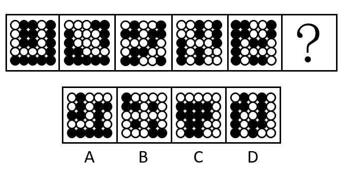

- **A**. A　✅
- **B**. B
- **C**. C
- **D**. D

**答案**：A

**官方解析**

元素组成不同，优先考虑属性规律。观察发现，每幅图形整体并无规律，继续观察，每幅图形的白色区域分别是轴对称、中心对称、轴对称、中心对称、轴对称。因此？处白色区域应为中心对称图形。A项白色区域为中心对称图形，当选。B项白色区域为轴对称图形，C、D两项白色区域为非对称图形，均排除。
故正确答案为A。

---

## 第 2 题　qid 2719385 · 图形推理

从所给的四个选项中，选择最合适的一个填入问号处，使之呈现一定的规律性。

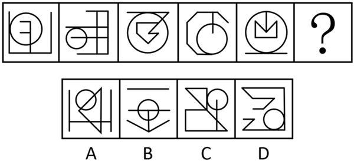

- **A**. A
- **B**. B
- **C**. C　✅
- **D**. D

**答案**：C

**官方解析**

元素组成不同，且无明显属性规律，考虑数量规律。观察发现，题干每幅图形均存在曲线与直线，且曲直相交，优先考虑曲直交点数。题干每幅图形的曲直交点数均为2个，但无法得出唯一答案。继续观察发现，题干图形相切明显，考虑切点数，每幅图的切点数均为1个，只有C项符合规律。
故正确答案为C。

---

## 第 3 题　qid 2719386 · 图形推理

从所给四个选项中，选择最合适的一个填入问号处，使之呈现一定的规律性。

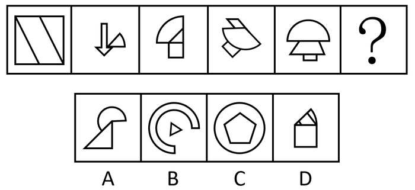

- **A**. A　✅
- **B**. B
- **C**. C
- **D**. D

**答案**：A

**官方解析**

元素组成不同，且无明显属性规律，考虑数量规律。题干大部分图形存在扇形，且扇形的面积不同，考虑扇形面积大小规律。观察发现，图1没有扇形，图2扇形为个圆，图3扇形为个圆，图4扇形为个圆，图5扇形为个圆，扇形面积呈递增规律，故？处扇形面积应为个圆，只有A项符合，当选。

故正确答案为A。

---

## 第 4 题　qid 2719388 · 图形推理

从所给四个选项中，选择最合适的一个填入问号处，使之呈现一定的规律性。

- **A**. A
- **B**. B
- **C**. C
- **D**. D　✅

**答案**：D

**官方解析**

元素组成相似，优先考虑样式规律。题干图形均存在黑色部分和空白部分，考虑黑白运算。第一组图的黑白运算规律为：黑黑白，白黑黑，黑白黑，白白白。第二组图运用此规律，可以将图形分为四行看，第二行最左侧应满足白白白，排除B、C两项。第三行最右侧应满足白黑黑，排除A项，只有D项符合，当选。

故正确答案为D。

---

## 第 5 题　qid 2719391 · 图形推理

左图给定的是正方体纸盒，右边哪项可能是其正确的外表面展开图？

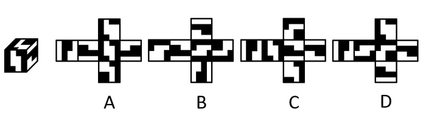

- **A**. A　✅
- **B**. B
- **C**. C
- **D**. D

**答案**：A

**官方解析**

将题干立体图及选项展开图中对应的面标上序号，如下图所示，逐一分析选项。

A项：选项与题干一致，当选；

B项：选项中面a与面b的公共边（如下图线1所示），面a挨着面b的小黑色方块，而题干立体图中面a没有挨着面b的小黑色方块，选项与题干不一致，排除；

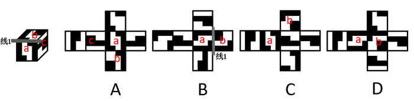

C项：题干立体图中，面a挨着面c中较细的黑色部分，但选项中面a与左右两个相邻面中的较细黑色部分均不相邻（如下图线2和线2&#39;所示），选项与题干立体图不一致，排除；

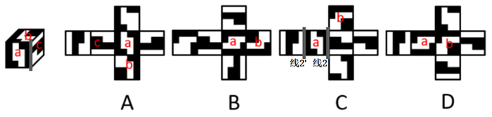

D项：因呈直角的两条边是同一条边，故选项中线3折合之后为同一条边，观察发现，选项中面a挨着下方图形较粗的黑色部分（如下图线3所示），而题干立体图中面a没有挨着较粗的黑色部分，选项与题干不一致，排除。

故正确答案为A。

---

## 第 6 题　qid 2719441 · 图形推理

左图给定的是由18个相同大小的正方体组合成的多面体，这个多面体可以切割为3个完全相同的小多面体，问切成的小多面体是：

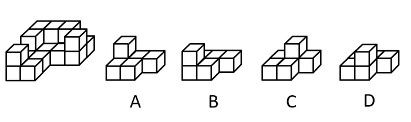

- **A**. A　✅
- **B**. B
- **C**. C
- **D**. D

**答案**：A

**官方解析**

本题考查立体拼合，如下图所示，题干立体图形可由3个完全相同的A项图形拼合而成。

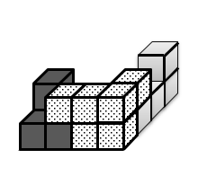

故正确答案为A。

---

## 第 7 题　qid 2719393 · 图形推理

左图为给定的多面体，从任一角度观看，右边哪项可能是该多面体的视图？

- **A**. A
- **B**. B　✅
- **C**. C
- **D**. D

**答案**：B

**官方解析**

本题考查三视图，逐一分析选项。

A项：从下往上看，应如图所示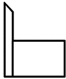，题干A选项右上角应为梯形，排除；

B项：从前往后看，与题干一致，当选；

C项：从上往下看，应如图所示，题干C选项左下角应为梯形而非长方形，排除；

D项：从右往左看，应如图所示，题干D选项右下角应为长方形而非梯形，排除。

故正确答案为B。

---

## 第 8 题　qid 2719401 · 图形推理

把下面的六个图形分为两类，使每一类图形都有各自的共同特征或规律，分类正确的一项是（    ）。

- **A**. ①②③，④⑤⑥
- **B**. ①②④，③⑤⑥
- **C**. ①③④，②⑤⑥　✅
- **D**. ①③⑤，②④⑥

**答案**：C

**官方解析**

元素组成不同，且无明显属性规律，考虑数量规律。观察发现，图形被分割明显，考虑数面。图①③④均有2个面，图②⑤⑥均有4个面，即图①③④一组，图②⑤⑥一组。
故正确答案为C。

---

## 第 9 题　qid 2719403 · 图形推理

把下面的六个图形分为两类，使每一类图形都有各自的共同特征或规律，分类正确的一项是（    ）。

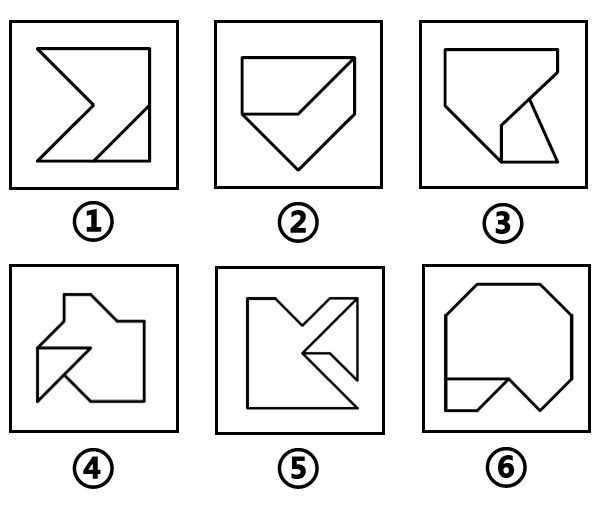

- **A**. ①②④，③⑤⑥
- **B**. ①③⑤，②④⑥
- **C**. ①③⑥，②④⑤
- **D**. ①⑤⑥，②③④　✅

**答案**：D

**官方解析**

本题为分组分类题目。观察发现，题干每幅图形均由两个面相交而成，考虑图形间关系。图①⑤⑥中两个图形具有1条相交边，图②③④中两个图形具有2条相交边，即图①⑤⑥一组，图②③④一组。
故正确答案为D。

---

## 第 10 题　qid 2719404 · 图形推理

把下面的六个图形分为两类，使每一类图形都有各自的共同特征或规律，分类正确的一项是（    ）。

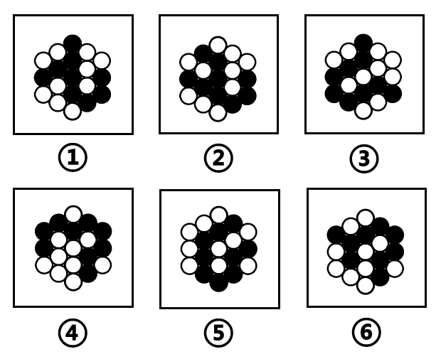

- **A**. ①③④，②⑤⑥
- **B**. ①③⑤，②④⑥
- **C**. ①②⑥，③④⑤　✅
- **D**. ①④⑥，②③⑤

**答案**：C

**官方解析**

本题为分组分类题目。元素组成相同，但无明显位置规律。观察发现，所有图形中黑球全部相连，如果将所有黑球连成线，图③④⑤中所有黑球连成的线能一笔画成，而图①②⑥中所有黑球连成的线存在4个奇点，为两笔画成，如下图所示。因此图①②⑥一组，图③④⑤一组。

故正确答案为C。

---

## 第 11 题　qid 2719443 · 定义判断

串对是指在诗句或对联中，出句与对句在意义上和语法结构上不是相对，而是上下相承，两句不能互相脱离，更不能颠倒，在语言结构上有一定的前后顺序。

根据上述定义，下列属于串对的是：

- **A**. 到此已穷千里目，谁知才上一层楼　✅
- **B**. 书山有路勤为径，学海无涯苦作舟
- **C**. 横眉冷对千夫指，俯首甘为孺子牛
- **D**. 江间波浪兼天涌，塞上风云接地阴

**答案**：A

**官方解析**

第一步：找出定义关键词。
“出句与对句在意义上和语法结构上不是相对，而是上下相承”、“在语言结构上有一定的前后顺序”。
第二步：逐一分析选项。
A项：诗句的意思是“到目前已经看到目力所能达到的地方了，却不想才登上了一层楼而已”。前一句描写的是目前的状态，后一句阐述由此发现的事实，前后两句有固定顺序，符合“出句与对句在意义上和语法结构上不是相对，而是上下相承”、“在语言结构上有一定的前后顺序”，符合定义，当选；
B项：诗句的意思是“用书堆积起来的大山中，要想攀登遥远的高峰，勤奋就是那登顶的唯一路径；无边无际的知识海洋里，苦难将是一艘前行的船，能够载你走向成功”。前一句描写勤奋，后一句描写刻苦，前后两句语法结构上是相对的，不符合“出句与对句在意义上和语法结构上不是相对，而是上下相承”，不符合定义，排除；
C项：诗句的意思是“对敌人决不屈服，对人民大众甘愿服务”。前一句描写的是对敌人的态度，后一句描写的是对人民的态度，前后两句语法结构上是相对的，不符合“出句与对句在意义上和语法结构上不是相对，而是上下相承”，不符合定义，排除；
D项：诗句的意思是“巫峡里面波浪滔天，上空的乌云则像是要压到地面上来似的，天地一片阴沉”。前一句描写的是波浪，后一句描写的是乌云，前后两句语法结构上是相对的，不符合“出句与对句在意义上和语法结构上不是相对，而是上下相承”，不符合定义，排除。
故正确答案为A。

---

## 第 12 题　qid 2719361 · 定义判断

互益素是一种生物释放的、能引起他种接受生物产生对释放者和接受者都有益的反应的信息化学物质。
根据上述定义，下列涉及互益素的是（    ）。

- **A**. 苹果实蝇在植物果实上产卵后会留下一种标记信息素，以避免自己再次到这里产卵
- **B**. 楝科植物印楝的种子、树叶和树皮中含有的印楝素，对几乎所有害虫都有驱杀效果
- **C**. 亚洲玉米螟雌蛾释放的性信息素能够吸引雄蛾，使雄蛾能够准确找到雌蛾的方位
- **D**. 小麦在遭受麦长管蚜攻击后会释放出水杨酸甲酯，可吸引麦长管蚜的天敌异色瓢虫　✅

**答案**：D

**官方解析**

第一步：找出定义关键词。
“生物释放的”、“引起他种接受生物产生对释放者和接受者都有益的反应”。
第二步：逐一分析选项。
A项：苹果实蝇在植物果实上留下标记信息素避免重复产卵，释放者和接受者都是苹果实蝇，不是他种接受生物，不符合“引起他种接受生物产生对释放者和接受者都有益的反应”，不符合定义，排除；
B项：印楝含有的印楝素有驱杀害虫的效果，只对释放者印楝本身有益，对接受者害虫无益，不符合“引起他种接受生物产生对释放者和接受者都有益的反应”，不符合定义，排除；
C项：亚洲玉米螟雌蛾和雄蛾属于同一物种，不符合“引起他种接受生物产生对释放者和接受者都有益的反应”，不符合定义，排除； 
D项：小麦遭受麦长管蚜攻击后释放的水杨酸甲酯，可吸引麦长管蚜的天敌异色瓢虫，对释放者小麦和接受者异色瓢虫都有益，符合“生物释放的”、“引起他种接受生物产生对释放者和接受者都有益的反应”，符合定义，当选。
故正确答案为D。

---

## 第 13 题　qid 2719444 · 定义判断

国际多式联运是指按照多式联运合同，以至少两种不同的运输方式，由多式联运经营人将货物从一国境内接货地点运至另一国境内指定交货地点的一种运输方式。
根据上述定义，下列属于国际多式联运的是：

- **A**. 将货运汽车直接开上火车车皮进行铁路运输，到达目的地再把货车从车皮上开下来
- **B**. 某公司为员工采购进口商品，通过厢式货车运送到公司楼下，员工再开车将商品带回家
- **C**. 电商从海外采购生鲜商品，由物流公司通过航空冷链进口到国内，然后由冷链车运至全国各地　✅
- **D**. 船运公司将从外海打捞的海鲜运输到沿海地区，再由买家分销到各个生鲜市场

**答案**：C

**官方解析**

第一步：找出定义关键词。
“按照多式联运合同”、“至少两种不同的运输方式”、“由多式联运经营人”、“将货物从一国境内接货地点运至另一国境内指定交货地点”。
第二步：逐一分析选项。
A项：将货运汽车开上火车进行运输，没有提及是否从一国运至另一国，不符合“将货物从一国境内接货地点运至另一国境内指定交货地点”，不符合定义，排除；
B项：某公司通过厢式货车将进口商品运到公司楼下，再由员工开车带回家，都是以汽车为运输方式，不符合“至少两种不同的运输方式”，不符合定义，排除；
C项：航空冷链和冷链车是两种不同的运输方式，符合“至少两种不同的运输方式”，电商从海外采购生鲜商品进口到国内，符合“将货物从一国境内接货地点运至另一国境内指定交货地点”，符合定义，当选；
D项：船运公司将从外海打捞的海鲜运输到沿海地区再分销到各个生鲜市场，只体现了船运一种运输方式，不符合“至少两种不同的运输方式”，且是否为自己国家的外海不明确，不符合“将货物从一国境内接货地点运至另一国境内指定交货地点”，不符合定义，排除。
故正确答案为C。

---

## 第 14 题　qid 2719363 · 定义判断

统计数据分为定性数据与定量数据。定性数据包括分类数据和顺序数据。分类数据是指只能归于某一类别的非数字型数据，它是对事物进行分类的结果，用文字表述；顺序数据是指归于某一有序类别的非数字型数据。定量数据是指表现为具体数字观测值的数据。
①按城市规模可将城市分为特大城市、大城市、中等城市和小城市；
②婚姻状况：1-未婚，2-已婚，3-离异，4-丧偶；
③A地到B地的距离为200公里，到C地为320公里，到D地为100公里；
④某医院建筑面积37.5万平方米，开放床位3182个，临床医生687人。
根据上述定义，关于以上4组数据的说法正确的是（    ）。

- **A**. ②④都是分类数据
- **B**. ②③④都是定量数据
- **C**. ①②都是顺序数据
- **D**. 仅②是分类数据　✅

**答案**：D

**官方解析**

第一步：找出定义关键词。
分类数据：“只能归于某一类别的非数字型数据”、“是对事物进行分类的结果，用文字表述”；
顺序数据：“归于某一有序类别的非数字型数据”；
定量数据：“表现为具体数字观测值的数据”。
第二步：逐一分析数据。
数据①：按城市规模可将城市分为特大城市、大城市，中等城市和小城市，体现出规模大小上的顺序，符合“归于某一有序类别的非数字型数据”，属于顺序数据；
数据②：婚姻状况：1-未婚， 2-已婚，3-离异，4-丧偶，将婚姻状况分为四类，符合“只能归于某一类别的非数字型数据”、“是对事物进行分类的结果，用文字表述”，属于分类数据；
数据③：A地到B地的距离为200公里，到C地为320公里，到D地为100公里，都是具体数字观测值的数据，符合“表现为具体数字观测值的数据”，属于定量数据；
数据④：某医院建筑面积37.5万平方米，开放床位3182个，临床医生687人，医院建筑面积、开放床位数、临床医生数都是具体数字观测值的数据，符合“表现为具体数字观测值的数据”，属于定量数据。
综上，①属于顺序数据，②属于分类数据，③④都属于定量数据。
故正确答案为D。

---

## 第 15 题　qid 2719367 · 定义判断

拮抗作用是一种常见的感觉变化现象，是指因一种呈味物质的存在，而使另一种呈味物质的呈味特性减弱的现象。
根据上述定义，下列没有体现拮抗作用的是（    ）。

- **A**. 在橘子汁中添加少量柠檬酸会感觉甜味减弱，如再加砂糖，又会感到酸味减弱
- **B**. 糖精带有苦味，在糖精中添加少量的谷氨酸钠，苦味可明显缓和
- **C**. 同时服用氯化钠和奎宁后，再饮用清水会有微甜的感觉　✅
- **D**. 在食用过酸涩的西非山榄后，再吃酸味食品，会尝不到酸味

**答案**：C

**官方解析**

第一步：找出定义关键词。
“因一种呈味物质的存在”、“使另一种呈味物质的呈味特性减弱”。
第二步：逐一分析选项。
A项：因加入少量柠檬酸使橘子汁甜味减弱，又因再加入砂糖使橘子汁酸味减弱，符合“因一种呈味物质的存在”、“使另一种呈味物质的呈味特性减弱”，符合定义，排除；
B项：在带有苦味的糖精中添加少量的谷氨酸钠可使苦味明显缓和，因为谷氨酸钠的存在使糖精的呈味特性减弱，符合“因一种呈味物质的存在”、“使另一种呈味物质的呈味特性减弱”，符合定义，排除；
C项：同时服用氯化钠和奎宁后，再饮用清水会有微甜的感觉，清水本身无味，不属于呈味物质，不符合“因一种呈味物质的存在”、“使另一种呈味物质的呈味特性减弱”，不符合定义，当选；
D项：在食用过酸涩的西非山榄后，再吃酸味食品，会尝不到酸味，因为西非山榄的存在使酸味食品的呈味特性减弱，符合“因一种呈味物质的存在”、“使另一种呈味物质的呈味特性减弱”，符合定义，排除。
本题为选非题，故正确答案为C。

---

## 第 16 题　qid 2719368 · 定义判断

通过提供产品及服务使顾客产生愉悦等积极情感，从而使顾客觉得从产品及服务中获得了超过使用价值的新价值，以此为手段进行情感营销的过程，称为情感价值链。
根据上述定义，下列没有凸显情感价值链的是（    ）。

- **A**. 小张从事美容工作多年，她总是专注而耐心地倾听客户说话，让客户在享受按摩的同时心情舒畅
- **B**. 智能音箱“小美”深受孩子们喜爱，因为它不仅能播放儿歌和故事，还能跟小朋友“对话、握手和点头”　✅
- **C**. 电视上，一对年轻夫妻为“该谁扫地了”而犯愁，之后扫地机器人登场，并闪现广告语“有了它，更幸福”
- **D**. 洗碗机广告中，一位女士愁眉苦脸刷着油腻的碗盘，看着自己粗糙的双手，广告词是“你要做这样的女人吗？”

**答案**：B

**官方解析**

第一步：找出定义关键词。
“通过提供产品及服务使顾客产生愉悦等积极情感”、“获得了超过使用价值的新价值”。
第二步：逐一分析选项。
A项：小张倾听客户说话，让客户在享受按摩的同时心情舒畅，符合“通过提供产品及服务使顾客产生愉悦等积极情感”、“获得了超过使用价值的新价值”，符合定义，排除；
B项：智能音箱“小美”不仅能播放儿歌和故事，还能跟小朋友“对话、握手和点头”，这只是音箱的功能，并没有体现出“获得了超过使用价值的新价值”，不符合定义，当选；
C项：扫地机器人为年轻夫妻解决扫地难题，增加生活幸福感，符合“通过提供产品及服务使顾客产生愉悦等积极情感”、“获得了超过使用价值的新价值”，符合定义，排除；
D项：洗碗机广告中，一位女士刷着碗盘，双手粗糙，愁眉苦脸，广告精确地掌握客户的心理需求，从反面切入，让客户感觉可以通过洗碗机摆脱这样愁苦的生活，获得情感价值，符合“通过提供产品及服务使顾客产生愉悦等积极情感”、“获得了超过使用价值的新价值”，符合定义，排除。
本题为选非题，故正确答案为B。

---

## 第 17 题　qid 2719373 · 定义判断

预测干预是指人们受预测信息的影响而采取了某种行为，造成原本有多种可能性的结果真的朝着预测所指示的方向发展。
根据上述定义，下列属于预测干预的是（    ）。

- **A**. 某财经访谈栏目中一名专家预测H股票将大涨，结果很多收看该节目的观众争相购买该股票，导致该股票涨停　✅
- **B**. 某福利彩票代销点宣称他们卖出的彩票多次中奖，结果到该代销点购买彩票的人经常排起长队
- **C**. 某国首脑在新年致辞中对该国经济形势进行了展望，因而该国老百姓对未来经济好转充满了信心
- **D**. 甲国大选前，与其敌对的乙国媒体大肆渲染，认为M党总统候选人将当选，结果甲国很多选民转而支持N党总统候选人

**答案**：A

**官方解析**

第一步：找出定义关键词。
“人们受预测信息的影响而采取了某种行为”、“造成原本有多种可能性的结果真的朝着预测所指示的方向发展”。
第二步：逐一分析选项。
A项：专家预测H股票将大涨，观众争相购买股票，符合“人们受预测信息的影响而采取了某种行为”，观众的行为导致股票涨停，符合“造成原本有多种可能性的结果真的朝着预测所指示的方向发展”，符合定义，当选；
B项：某福利彩票代销点宣称的内容不属于预测信息，不符合“人们受预测信息的影响而采取了某种行为”，不符合定义，排除；
C项：某国首脑在新年致辞中展望了该国经济形势，而百姓只是对未来经济好转充满信心，并未对此采取行动，不符合“人们受预测信息的影响而采取了某种行为”，不符合定义，排除；
D项：乙国媒体认为M党总统候选人当选，结果选民支持N党总统候选人，不符合“造成原本有多种可能性的结果真的朝着预测所指示的方向发展”，不符合定义，排除。
故正确答案为A。

---

## 第 18 题　qid 2719379 · 定义判断

人们常常系统地高估自己对事件的控制程度或影响力，而低估机会、运气等不可控制因素在事件发展过程及其结果上所扮演的角色，这一现象被称为控制错觉。
根据上述定义，下列没有体现控制错觉的是：

- **A**. 人们想用骰子掷出“双6”时会在心中默念，用力揉捏骰子，相信这样做就会如愿
- **B**. 一些股民往往借助几个简单的因素预测大盘指数，结果常常是谬以千里
- **C**. 某企业经理认为今年当地举办的运动会对企业发展非常有利，预测今年营业额会有所上涨　✅
- **D**. 景区某摆渡车驾驶员常年走山路，认为自己路况熟、技术好，所以在山路上开得非常快

**答案**：C

**官方解析**

第一步：找出定义关键词。
“高估自己对事件的控制程度或影响力”、“低估机会、运气等不可控制因素在事件发展过程及其结果上所扮演的角色”。
第二步：逐一分析选项。
A项：掷骰子是随机事件，人们心中默念并用力揉捏骰子，相信这样做会掷出“双6”，符合“高估自己对事件的控制程度或影响力”，也低估了不可控因素的作用，符合定义，排除；
B项：一些股民仅借助“几个简单的因素”就认为自己能够预测大盘指数，符合“高估自己对事件的控制程度或影响力”，符合定义，排除；
C项：某企业经理认为运动会对企业发展有利，能够增加营业额，预测的是运动会对企业的影响，不符合“高估自己对事件的控制程度或影响力”，不符合定义，当选；
D项：某摆渡车驾驶员认为自己路况熟、技术好而在山路上开快车，体现了此人因为“高估自己对事件的控制程度或影响力”而进行了不安全的驾驶行为，符合定义，排除。
本题为选非题，故正确答案为C。

---

## 第 19 题　qid 2719372 · 定义判断

对立互补命题指的是先后叙述的两个结构基本相同的句式中含有两对或者两对以上相互对立的概念，但是其阐发的意思是一致的或者是相互补充的。
根据上述定义，下列不属于对立互补命题的是（    ）。

- **A**. 君子坦荡荡，小人长戚戚
- **B**. 先天下之忧而忧，后天下之乐而乐
- **C**. 仓廪实而知礼节，衣食足而知荣辱　✅
- **D**. 穷在闹市无人问，富在深山有远亲

**答案**：C

**官方解析**

第一步：找出定义关键词。
“先后叙述的两个结构基本相同的句式”、“两对或者两对以上相互对立的概念”、“意思是一致的或者是相互补充的”。
第二步：逐一分析选项。
A项：意思是“君子心胸开阔，能够包容别人，小人爱斤斤计较，患得患失”，“君子”和“小人”、“坦荡荡”和“长戚戚”分别出现在前后两句中，且概念对立，符合“先后叙述的两个结构基本相同的句式”、“两对或者两对以上相互对立的概念”、“意思是一致的或者是相互补充的”，符合定义，排除；
B项：意思是“为官者应把国家、民族的利益摆在首位，为祖国的前途、命运分愁担忧，为天下的人民幸福出力”，“先”和“后”、“忧”和“乐”分别出现在前后两句中，且概念对立，符合“先后叙述的两个结构基本相同的句式”、“两对或者两对以上相互对立的概念”、“意思是一致的或者是相互补充的”，符合定义，排除；
C项：意思是“百姓的粮仓充足，丰衣足食，才能顾及到礼仪，重视荣誉和耻辱”，“仓廪实”和“衣食足”、“知礼节”和“知荣辱”均不属于相互对立的概念，不符合“两对或者两对以上相互对立的概念”，不符合定义，当选；
D项：意思是“人穷的时候亲戚朋友在身边也很少来往，富有的时候就算远在深山老林亲戚都会来找你”，“穷”和“富”、“闹市”和“深山”分别出现在前后两句中，且概念对立，符合“先后叙述的两个结构基本相同的句式”、“两对或者两对以上相互对立的概念”、“意思是一致的或者是相互补充的”，符合定义，排除。
本题为选非题，故正确答案为C。

---

## 第 20 题　qid 2719370 · 定义判断

一般来说，科学实验中主要涉及三种变量：自变量、因变量和控制变量，自变量是指在实验中由实验者操作的变量。因变量是指随着自变量的变化而变化的变量。控制变量是指实验中除自变量以外的影响实验变化和结果的潜在因素或条件。
根据上述定义，下列说法正确的是（    ）。

- **A**. 研究小麦供给量受当地采购价格的影响，小麦供给量是控制变量，采购价格是因变量
- **B**. 研究不同税率对稀土出口量的影响，稀土出口量是自变量，税率是因变量
- **C**. 研究气候条件对棉花产量的影响，气候条件是因变量，害虫影响是控制变量
- **D**. 研究制糖厂营业额受糖产量的影响，糖的单价是控制变量，糖产量是自变量　✅

**答案**：D

**官方解析**

第一步：找出定义关键词。
自变量：“实验中由实验者操作的变量”；
因变量：“随着自变量的变化而变化的变量”；
控制变量：“除自变量以外的影响实验变化和结果的潜在因素或条件”。
第二步：逐一分析选项。
A项：研究小麦供给量受当地采购价格的影响，当地采购价格是需要研究人员操作的变量，符合“实验中由实验者操作的变量”，符合自变量定义，不符合因变量定义；小麦供给量是随着当地采购价格变化而变化的量，符合“随着自变量的变化而变化的变量”，符合因变量定义，不符合控制变量定义，排除；
B项：研究不同税率对稀土出口量的影响，不同税率是该研究中需要研究人员改变的量，符合“实验中由实验者操作的变量”，符合自变量定义，不符合因变量定义；稀土出口量是随着税率的变化而变化的量，符合“随着自变量的变化而变化的变量”，符合因变量定义，不符合自变量定义，排除；
C项：研究气候条件对棉花产量的影响，气候条件是该研究中需要研究人员改变的量，符合“实验中由实验者操作的变量”，符合自变量定义，不符合因变量定义，排除；
D项：研究制糖厂营业额受糖产量的影响，糖产量是该研究中需要研究人员改变的量，符合“实验中由实验者操作的变量”，符合自变量定义；糖的单价是该研究中除了糖产量以外的能够影响制糖厂营业额的一种潜在因素，符合“除自变量以外的影响实验变化和结果的潜在因素或条件”，符合控制变量定义，当选。
故正确答案为D。

---

## 第 21 题　qid 2719445 · 类比推理

江河湖海：水体

- **A**. 鳏寡孤独：身份
- **B**. 油盐酱醋：调味
- **C**. 山珍海味：美食
- **D**. 绫罗绸缎：面料　✅

**答案**：D

**官方解析**

第一步：判断题干词语间逻辑关系。
水体是江、河、湖、海、地下水、冰川等的总称。江、河、湖、海是四种不同的水体，与水体分别构成种属关系，且江、河、湖、海之间是并列关系。
第二步：判断选项词语间逻辑关系。
A项：鳏寡孤独泛指没有劳动力而又没有亲属供养、无依无靠的人。鳏指年老无妻或丧妻的男子，寡指年老无夫或丧夫的女子，孤指年幼丧父的孩子，独指年老无子女的人。鳏、寡、孤、独是四种不同的身份，与身份分别构成种属关系，且鳏、寡、孤、独之间是并列关系，与题干逻辑关系一致，保留；
B项：油盐酱醋的功能是调味，二者为功能对应关系，与题干逻辑关系不一致，排除；
C项：山珍海味指山野和海里出产的各种珍贵食品。但山、珍、海、味并非四种不同的美食，与题干逻辑关系不一致，排除；
D项：绫罗绸缎泛指各种精美的丝织品。绫、罗、绸、缎是四种不同的丝织面料，与面料分别构成种属关系，且绫、罗、绸、缎之间是并列关系，与题干逻辑关系一致，保留。
对比A、D两项，A项的身份是抽象事物，D项的面料和题干的水体均为具体事物，因此D项与题干的逻辑关系更贴近，当选。

故正确答案为D。

---

## 第 22 题　qid 2719351 · 类比推理

船舶抛锚：请求救援

- **A**. 安全着陆：平稳飞行
- **B**. 行政复议：获得赔偿
- **C**. 卖出高粱：买入白酒
- **D**. 违规销售：停业整顿　✅

**答案**：D

**官方解析**

第一步：判断题干词语间逻辑关系。
船舶抛锚是指把锚投入水中，使船停稳，即“停船”（注：如果是车抛锚，那就是车发生故障而停止行驶，与船舶抛锚的意思有区别），所以是先“船舶抛锚”，后“请求救援”，二者存在先后顺序。
第二步：判断选项词语间逻辑关系。
A项：先“平稳飞行”，后“安全着陆”，二者存在先后顺序，但顺序与题干相反，与题干逻辑关系不一致，排除；
B项：先“行政复议”，后“获得赔偿”，二者存在先后顺序，与题干逻辑关系一致，保留；
C项：“卖出高粱”和“买入白酒”没有必然的先后顺序，与题干逻辑关系不一致，排除；
D项：先“违规销售”，后“停业整顿”，二者存在先后顺序，与题干逻辑关系一致，保留；
对比BD项，进行二级辨析，题干的“请求救援”和D项的“停业整顿”都是说明事情偏负面，而B项的结果“获得赔偿”相对来说偏积极，择优选择D项。
故正确答案为D。

---

## 第 23 题　qid 2719356 · 类比推理

春山暖日和风：阑干楼阁帘栊

- **A**. 绿蚁新醅酒：红泥小火炉
- **B**. 鸡声茅店月：人迹板桥霜　✅
- **C**. 江碧鸟逾白：山青花欲燃
- **D**. 柴门闻犬吠：风雪夜归人

**答案**：B

**官方解析**

第一步：判断题干词语间逻辑关系。
“春山暖日和风，阑干楼阁帘栊”指的是桃红柳绿的春山，煦暖的阳光照耀，和柔的东风吹拂，楼阁上卷起帘拢。每句都包含三种事物，春山、暖日、和风三者为并列关系，阑干、楼阁、帘栊三者也为并列关系。
第二步：判断选项词语间逻辑关系。
A项：“绿蚁新醅酒，红泥小火炉”指的是新酿的米酒，色绿香浓；小小红泥炉，烧得殷红。每句只包含一件事物，与题干逻辑关系不一致，排除；
B项：“鸡声茅店月，人迹板桥霜”指的是鸡声嘹亮，茅草店沐浴着晓月的余晖；板桥弥漫清霜，先行客人足迹行行。每句都包含三件事物，鸡声、茅店、月三者为并列关系，人迹、板桥、霜三者也为并列关系，与题干逻辑关系一致，当选；
C项：“江碧鸟逾白，山青花欲燃”指的是碧绿的江水把鸟儿的羽毛映衬得更加洁白，山色青翠欲滴，红艳的野花似乎将要燃烧起来。每句只包含两件事物，与题干逻辑关系不一致，排除；
D项：“柴门闻犬吠，风雪夜归人”指的是柴门外忽传来犬吠声声，原来是有人冒着风雪归家门。每句中只包含两件事物，与题干逻辑关系不一致，排除。
故正确答案为B。

---

## 第 24 题　qid 2719360 · 图形推理

立体化战争：数字化战争

- **A**. 民主型管理：专制型管理
- **B**. 防风林：观赏树木
- **C**. 有氧运动：医疗瘦身
- **D**. 绩效奖励：物质奖励　✅

**答案**：D

**官方解析**

第一步：判断题干词语间逻辑关系。
立体化战争，指在地面（水面）、地下（水下）、空中以及前方、后方同时或交互进行的战争。数字化战争，就是数字化部队在数字化战场进行的信息战，它是以信息为主要手段，以信息技术为基础的战争，是信息战的一种形式。有的立体化战争是数字化战争，有的立体化战争不是数字化战争，有的数字化战争是立体化战争，有的数字化战争不是立体化战争，二者是交叉关系。
第二步：判断选项词语间逻辑关系。
A项：民主型管理和专制型管理是管理的两种形式，除此之外还有放任型管理，所以二者属于并列关系中的反对关系，与题干逻辑关系不一致，排除；
B项：防风林是一种以防御自然灾害、维护基础设施、保护生产、改善环境和维持生态平衡等为主要目的的森林群落，观赏树木指可供观赏的木本植物，不能说有的防风林是观赏树木，有的观赏树木是防风林，二者不是交叉关系，与题干逻辑关系不一致，排除；
C项：有氧运动指人体在氧气充分供应的情况下进行的体育锻炼，是体育锻炼的一种形式，医疗瘦身指的是借助医疗的方法瘦身，是瘦身的一种形式，不能说有的有氧运动是医疗瘦身，二者不是交叉关系，与题干逻辑关系不一致，排除；
D项：绩效奖励有物质奖励和精神奖励，所以有的绩效奖励是物质奖励，有的绩效奖励不是物质奖励，有的物质奖励是绩效奖励，有的物质奖励不是绩效奖励，二者是交叉关系，与题干逻辑关系一致，当选。
故正确答案为D。

---

## 第 25 题　qid 2719365 · 类比推理

风筝：篾刀：竹条

- **A**. 泥塑：黏土：颜料
- **B**. 绣品：绣针：绣线　✅
- **C**. 糖人：蔗糖：竹签
- **D**. 漆器：描金：涂料

**答案**：B

**官方解析**

第一步：判断题干词语间逻辑关系。
篾刀是制作风筝的工具，竹条是制作风筝的原材料，三者为成品、工具、原材料的对应关系。
第二步：判断选项词语间逻辑关系。
A项：黏土是泥塑的原材料，颜料也是泥塑的原材料，与题干逻辑关系不一致，排除；
B项：绣针是制作绣品的工具，绣线是制作绣品的原材料，三者为成品、工具、原材料的对应关系，与题干逻辑关系一致，当选；
C项：蔗糖是制作糖人的原材料，糖人粘在竹签上，与题干逻辑关系不一致，排除；
D项：描金是制作漆器的一种工艺，涂料是制作漆器的原材料，与题干逻辑关系不一致，排除。
故正确答案为B。

---

## 第 26 题　qid 2719369 · 类比推理

檀香：麝香：香料

- **A**. 木材：钢筋：建材　✅
- **B**. 日光：月光：光明
- **C**. 薯条：粉条：食物
- **D**. 鲸鱼：鲍鱼：海鱼

**答案**：A

**官方解析**

第一步：判断题干词语间逻辑关系。
檀香取于檀香科乔木檀香树的木质心材，属于香料的一种；麝香为鹿科动物麝的雄性腺囊中的分泌物干燥而成，是一种高级香料；二者为并列关系且原料不同，同时二者均与香料构成种属关系。
第二步：判断选项词语间逻辑关系。
A项：木材是建材的一种，钢筋是建材的一种，二者为并列关系且原料不同，同时二者均与建材构成种属关系，与题干逻辑关系一致，当选；
B项：日光与月光都是光的一种，但不是光明的一种，二者与光明不构成种属关系，与题干逻辑关系不一致，排除；
C项：薯条与粉条一般都是由土豆作为原材料加工而成的食物，二者为并列关系但原料可以相同，与题干逻辑关系不一致，排除；
D项：鲸鱼属于哺乳动物，不属于鱼类，与题干逻辑关系不一致，排除。
故正确答案为A。

---

## 第 27 题　qid 2719374 · 类比推理

中央预算：年度预算：地方预算

- **A**. 历史题材：军事题材：现实题材　✅
- **B**. 户外广告：文字广告：电视广告
- **C**. 知识创新：技术创新：管理创新
- **D**. 人身权利：生命权利：财产权利

**答案**：A

**官方解析**

第一步：判断题干词语间逻辑关系。
中央预算和地方预算均属于国家预算，二者为并列关系；且年度预算分别与中央预算、地方预算是交叉关系。
第二步：判断选项词语间逻辑关系。
A项：现实题材和历史题材是以时间为划分标准的两种文学创作题材，二者为并列关系；且军事题材分别与历史题材、现实题材是交叉关系，与题干逻辑关系一致，当选；
B项：户外广告是通过户外传播的广告形式，电视广告是一种通过电视播放的广告，文字广告是通过文字形式传播的广告，三者互为交叉关系，与题干逻辑关系不一致，排除；
C项：知识创新是指获得新的基础科学和技术科学知识的创新活动，技术创新是指以创造新技术为目的的创新活动，管理创新是指企业把新的管理要素引入企业管理系统的创新活动，三者为并列关系，与题干逻辑关系不一致，排除；
D项：生命权利属于人身权利，二者为种属关系；人身权利又称非财产权利，与财产权利属于并列关系，与题干逻辑关系不一致，排除。
故正确答案为A。

---

## 第 28 题　qid 2719376 · 类比推理

健康监测：体检：疾病筛查

- **A**. 为国聚财：税收：调节分配　✅
- **B**. 发掘遗迹：考古：考证年代
- **C**. 解决争议：审判：强制执行
- **D**. 太空飞行：航天：地质分析

**答案**：A

**官方解析**

第一步：判断题干词语间逻辑关系。
健康监测和疾病筛查是体检的目的，三者为目的对应关系。
第二步：判断选项词语间逻辑关系。
A项：为国聚财和调节分配是税收的目的，与题干逻辑关系一致，当选；
B项：发掘遗迹和考证年代是考古的过程和内容，与题干逻辑关系不一致，排除；
C项：解决争议是审判的目的，但强制执行不是审判的目的，与题干逻辑关系不一致，排除；
D项：航天又被称为太空飞行，二者为全同关系，与题干逻辑关系不一致，排除。
故正确答案为A。

---

## 第 29 题　qid 2719384 · 类比推理

（    ） 对于 口罩 相当于 竹子 对于 （    ）

- **A**. 耳挂；竹炭
- **B**. 无纺布；斗笠　✅
- **C**. 卫生用品；竹叶
- **D**. 医用口罩；箭竹

**答案**：B

**官方解析**

逐一代入选项。
A项：耳挂是口罩的组成部分，二者为组成关系；竹子是竹炭的原材料，二者为对应关系，前后逻辑关系不一致，排除；
B项：无纺布是制作口罩的原材料，二者为对应关系；竹子是制作斗笠的原材料，二者为对应关系，前后逻辑关系一致，当选；
C项：口罩是一种卫生用品，二者为种属关系；竹叶是竹子的组成部分，二者为组成关系，前后逻辑关系不一致，排除；
D项：医用口罩是口罩的一种，二者为种属关系；箭竹是竹子的一种，二者为种属关系，但词语前后顺序相反，前后逻辑关系不一致，排除。
故正确答案为B。

---

## 第 30 题　qid 2719446 · 类比推理

核安全 对于 （    ） 相当于 （    ） 对于 虚拟货币

- **A**. 核技术；货币
- **B**. 核泄漏；交易货币
- **C**. 国家安全；比特币　✅
- **D**. 网络安全；游戏币

**答案**：C

**官方解析**

逐一代入选项。
A项：核安全是核技术开发的保障，二者为对应关系，虚拟货币是一种货币，二者为种属关系，前后逻辑关系不一致，排除；
B项：核泄漏不是核安全的一种，交易货币和虚拟货币是交叉关系，前后逻辑关系不一致，排除；
C项：核安全是构成国家安全的要素之一，二者为组成关系，比特币是一种虚拟货币，二者为种属关系，在此需要注意，在没有更好答案的情况下，组成关系和种属关系都属于包容关系，可以暂时保留；
D项：网络安全与核安全为并列关系，游戏币和虚拟货币是交叉关系，前后逻辑关系不一致，排除。
注：本题并不是很常规，在历年极个别真题中也曾考查过，重点学习思维即可，即如果题干是种属关系，选项没有种属关系，可以择优选择组成关系。
故正确答案为C。

---

## 第 31 题　qid 2719447 · 逻辑判断

中国互联网络信息中心发布报告显示，截至2018年12月，我国短视频用户规模达6.48亿，其中青少年用户占了很大比重，开展青少年防沉迷工作刻不容缓。相关主管部门组织短视频平台企业研发了青少年防沉迷系统，进入“青少年模式”后，每日使用时长将限定为累计40分钟，打赏、充值、提现、直播等功能将不可用，每天22时至次日6时期间，禁止使用短视频App。
以下哪项如果为真，最能质疑该模式的有效性？

- **A**. 用户使用“青少年模式”需提交身份证信息等，增加了泄露个人隐私的风险
- **B**. 不加选择地浏览视频内容，可能会对青少年价值观产生负面影响
- **C**. 该系统通过大数据分析来识别疑似青少年用户，可能会“误伤”成年人
- **D**. “青少年模式”目前尚无法识别网络使用者的真实身份　✅

**答案**：D

**官方解析**

第一步：找出论点和论据。
论点：相关主管部门组织短视频平台企业研发了青少年防沉迷系统，进入“青少年模式”后，每日使用时长将限定为累计40分钟，打赏、充值、提现、直播等功能将不可用，每天22时至次日6时期间，禁止使用短视频App，该模式对于青少年防沉迷是有效的。
论据：无。
本题只有论点，没有论据，削弱优先考虑否论点，即青少年防沉迷系统中“青少年模式”对青少年防沉迷没有作用。
第二步：逐一分析选项。
A项：论点讨论“青少年模式”是否能起到防沉迷的作用，而该项说用户使用“青少年模式”会增加泄露个人隐私的风险，增加泄露个人隐私的风险与该模式是否有防沉迷的作用无关，无法削弱，排除；
B项：论点讨论“青少年模式”是否能起到防沉迷的作用，而该项说不加选择浏览视频内容可能会影响青少年价值观，二者话题不一致，无法削弱，排除；
C项：论点讨论“青少年模式”是否能起到防沉迷的作用，而该项说该系统可能会“误伤”成年人，二者话题不一致，无法削弱，排除；
D项：该项说“青少年模式”目前尚无法识别网络使用者的真实身份，即“青少年模式”无法识别出用户是否为青少年，就没有办法对所有真正的青少年起到防沉迷的作用，可以质疑该模式的有效性，可以削弱，当选。
故正确答案为D。

---

## 第 32 题　qid 2719405 · 逻辑判断

有研究人员认为，胶原蛋白保持皮肤年轻的说法并不科学，他们认为，皮肤得以保持年轻，应归功于表皮干细胞，哺乳动物的表皮细胞会持续更新，新细胞来源于表皮干细胞，这些干细胞会通过一种特定分化的多元蛋白结构——半桥粒附着在基膜上。表皮干细胞会不断复制、分化，产生新细胞取代受损的老细胞，这一更新有利于维持皮肤的年轻。因此，表皮干细胞的更新才是保持皮肤年轻的原因。
以下哪项如果为真，最能削弱上述结论？

- **A**. 表皮干细胞的更新还需要其他化合物的促进
- **B**. 表皮干细胞的再生能力会随着年龄的增长而衰退
- **C**. 胶原蛋白对促进表皮干细胞的更新至关重要　✅
- **D**. 胶原蛋白的表达在不同干细胞之间存在很大差异

**答案**：C

**官方解析**

第一步：找出论点和论据。
论点：胶原蛋白不是保持皮肤年轻的原因，表皮干细胞的更新才是保持皮肤年轻的原因。
论据：表皮干细胞会不断复制、分化，产生新细胞取代受损的老细胞，这一更新有利于维持皮肤的年轻。
本题论点和论据都在说表皮干细胞的更新有利于维持皮肤的年轻，话题一致，因此可以预设否定论点的方式进行削弱，即说明表皮干细胞的更新不是保持皮肤年轻的原因。且本题中双方观点关于如何保持皮肤年轻的原因争执，因此如果能说明胶原蛋白能导致表皮干细胞的更新，也可以起到削弱“研究人员”观点的效果。
第二步：逐一分析选项。
A项：论点说的是表皮干细胞的更新是保持皮肤年轻的原因，该项说的是表皮干细胞的更新还需要其他化合物的促进，其他化合物未提及，对保持皮肤年轻的影响不明确，排除；
B项：论点说的是表皮干细胞的更新是保持皮肤年轻的原因，该项说的是表皮干细胞的再生能力，话题不一致，无法削弱，排除；
C项：论点说的是表皮干细胞的更新是保持皮肤年轻的原因，该项说的是胶原蛋白对促进表皮干细胞的更新至关重要，因此保持皮肤年轻的根本原因还是胶原蛋白，削弱论点，当选；
D项：论点说的是表皮干细胞的更新是保持皮肤年轻的原因，该项说的是胶原蛋白的表达，主体不一致，无法削弱，排除。
故正确答案为C。

---

## 第 33 题　qid 2719448 · 逻辑判断

小赵和小刘是非常熟悉的好朋友，两家相距很近，疫情期间，小赵曾给本单位同处室的同事发了警示微信，小刘也给所在小区他认识的所有人发了警示微信，并进一步通过电话进行了确认提醒，小赵、小刘互通了电话，提醒近期不相互走动，小赵给小刘发过警示微信，小刘没有给小赵发过警示微信。
根据以上陈述，以下哪项不可能？

- **A**. 小赵近期没有去过小刘家
- **B**. 小刘、小赵是同事
- **C**. 小刘、小赵不是一个处室的
- **D**. 小赵、小刘住一个小区　✅

**答案**：D

**官方解析**

第一步：翻译题干。

①小赵同处室的同事收到小赵发的警示微信；

②小刘同小区且认识的人收到了小刘发的警示微信且电话进行确认提醒；

③小赵、小刘互通了电话，提醒近期不相互走动；

④小赵给小刘发过警示微信；

⑤小刘没有给小赵发过警示微信；

⑥小赵和小刘认识。

第二步：逐一分析选项。

A项：根据条件③可知小赵和小刘互通了电话，提醒近期不相互走动，即小赵近期有可能没有去过小刘的家里，可能成立，排除；

B项：根据条件④可知小刘收到了小赵发的警示微信，是对①的肯后，肯后可以得到可能性结论，即小刘和小赵可能是同处室的同事，可能成立，排除；

C项：根据条件④可知小刘收到了小赵发的警示微信，是对①的肯后，肯后可以得到可能性结论，即小刘和小赵可能是同处室的同事，也可能不是同处室的同事，可能成立，排除；

D项：根据条件⑤可知小刘没有给小赵发过警示微信，是对②的否后，否后必否前可以推出同小区或认识，结合⑥小刘和小赵认识，否一推一，可以得到小赵和小刘不住在同一小区，选项不可能成立，当选。

本题为选非题，故正确答案为D。

---

## 第 34 题　qid 2719406 · 逻辑判断

羟苯甲酮是一种常见的紫外线吸收剂，多用于防晒护肤品中，全球3500种品牌的防晒霜中均含有该物质。研究表明，即使是极低浓度的羟苯甲酮也会给珊瑚带来致命的伤害，有专家指出，为了保护珊瑚，在海滨浴场应该禁止使用防晒霜。
以下哪项如果为真，最能支持上述观点？

- **A**. 一些远离海岸的大洋中部分水域已检测到羟苯甲酮，但浓度较低
- **B**. 羟苯甲酮易引起皮肤过敏，长期使用会影响人体免疫力和生殖能力
- **C**. 羟苯甲酮会破坏、改变珊瑚的DNA，降低幼年珊瑚正常发育的几率　✅
- **D**. 人们在很多场合都使用防晒霜，仅在海滨浴场限制使用效果有限

**答案**：C

**官方解析**

第一步：找出论点和论据。
论点：为了保护珊瑚，在海滨浴场应该禁止使用防晒霜。
论据：羟苯甲酮是一种常见的紫外线吸收剂，多用于防晒护肤品中，全球3500种品牌的防晒霜中均含有该物质。研究表明，即使是极低浓度的羟苯甲酮也会给珊瑚带来致命的伤害。
本题的论点和论据话题一致，都在说明防晒霜中所含有的物质——羟苯甲酮会给珊瑚带来伤害，在浴场不能使用防晒霜。所以，我们需要以补充论据的方式来加强。
第二步：逐一分析选项。
A项：虽在远离海岸的大洋中部水域检测到了羟苯甲酮，浓度较低，但并没有说明该大洋中是否有珊瑚，以及是否给珊瑚带来了致命伤害，属于不明确选项，无法加强，排除；
B项：羟苯甲酮易引起皮肤过敏，长期使用会影响人体免疫力和生殖能力，都是在说羟苯甲酮对人体的伤害而非对珊瑚的伤害，话题不一致，无法加强，排除；
C项：羟苯甲酮会通过改变珊瑚的DNA来降低幼年珊瑚正常发育的几率，说明该项是在解释该物质如何对珊瑚产生致命伤害，补充论据，当选；
D项：仅在海滨浴场限制使用效果有限，只能说明措施使用效果一般，但与是否应该禁止使用防晒霜无关，话题不一致，无法加强，排除。
故正确答案为C。

---

## 第 35 题　qid 2719449 · 逻辑判断

某便利店新进了一批个性商品，如带酸味的啤酒，芥末味道的饼干等，这些个性商品摆放在单独设立的区域进行销售，三个月之后，店长发现：和之前没有引进个性商品时相比，店里的总销售额大幅提升，所以店长认为销售额增加的主要原因是引进了这些个性商品。
以下哪项如果为真，最能支持店长的观点？

- **A**. 三个月以来，这些个性商品的销量和销售额都很有限
- **B**. 来店消费的主要是年轻人，年轻人喜欢尝试新鲜事物　✅
- **C**. 近三个月，该店对货品摆放进行了重新规划和调整，货品陈列更加有序醒目
- **D**. 除了增加个性商品，店里常规商品也增加了一些品牌和种类

**答案**：B

**官方解析**

第一步：找出论点和论据。
论点：销售额增加的主要原因是引进了这些个性商品。
论据：和之前没有引进个性商品时相比，店里的总销售额大幅提升。
论点论据话题一致，可以通过补充论据进行加强。
第二步：逐一分析选项。
A项：个性商品的销量、销售额有限，说明它对销售额增加的贡献程度很低， 直接否定论点，属于削弱项，无法加强，排除；
B项：说明商店的主要客户喜欢尝试新鲜事物，而个性商品属于新鲜事物，解释了为什么个性商品是销售额增加的主要原因，补充论据，可以加强，当选；
C项：说明近三个月除了增加个性商品，还优化了货品陈列，那么销售额增长的主要原因就不一定是个性商品了，属于他因削弱，无法加强，排除；
D项：说明近三个月除了增加个性商品，还增加了常规商品，那么销售额增长的主要原因就不一定是个性商品了，属于他因削弱，无法加强，排除。
故正确答案为B。

---

## 第 36 题　qid 2719450 · 逻辑判断

研究人员在2011年至2017年间采集了600多名60岁以上老年人的身高、血压和饮食习惯等多项数据，随后，又对研究对象进行了神经心理评估和认知障碍评定，在排除吸烟饮酒等风险因素后发现，那些每周吃两次、每次吃约150克蘑菇的老年人，比每周吃蘑菇少于一次的老年人患轻度认知障碍的风险低。研究人员解释说，这是因为蘑菇中含有一种特殊化合物——麦角硫因，因此，食用蘑菇有助于降低老年人患轻度认知障碍的风险。

以下哪项如果为真，最能支持上述结论？

- **A**. 研究发现，每周食用两次以上蘑菇的年轻人患心脏病的风险降低
- **B**. 轻度认知障碍老年患者血浆中麦角硫因的水平明显低于同龄健康人　✅
- **C**. 上述研究中老年人主要食用的是金针菇、平菇等6种常见蘑菇
- **D**. 人体实际上无法自行合成麦角硫因，只能从食物中获取

**答案**：B

**官方解析**

第一步：找出论点和论据。
论点：食用蘑菇有助于降低老年人患轻度认知障碍的风险。
论据：蘑菇中含有一种特殊化合物——麦角硫因。
论点与论据话题不一致，优先考虑搭桥。
第二步：逐一分析选项。
A项：论点说的是食用蘑菇能降低老年人患轻度认知障碍的风险，该项说的是吃蘑菇能降低年轻人患心脏病的风险，话题不一致，无法加强，排除；
B项：轻度认知障碍老年患者血浆中麦角硫因的水平明显低于同龄健康人，说明麦角硫因和轻度认知障碍之间有关，在论点和论据之间搭桥，可以加强，当选；
C项：论点说的是食用蘑菇能降低老年人患轻度认知障碍的风险，该项说的是老年人主要食用的蘑菇品种，话题不一致，无法加强，排除； 
D项：论点说的是食用蘑菇能降低老年人患轻度认知障碍的风险，该项说的是麦角硫因只能从食物中获取，但是否能降低老年人患轻度认知障碍的风险不确定，不明确选项，无法加强，排除。
故正确答案为B。

---

## 第 37 题　qid 2719408 · 逻辑判断

地质学家在澳大利亚中部距地表3公里的地下发现了两处直径超过200公里的神秘自然景观，景观所含有的石英砂中有着一簇簇的细线，这些细线大部分是互相平行的直线。地质学家认为，这些景观很可能是巨大陨石撞击形成的陨石坑，而石英砂的结构就是造成断裂的证据。
以下哪项是上述论证的必要前提？

- **A**. 只有经历高速的陨石撞击，地层中石英砂才会显示出含有平行直线的断裂结构　✅
- **B**. 石英砂普遍存在于地球表面，由于坚硬、耐磨、化学性能稳定而很少发生变化
- **C**. 该景观的直径之大，并不同于其他的陨石坑，很可能不是一次形成的
- **D**. 该景观周围的岩石是3亿年到4.2亿年之前形成的，那么撞击也应发生在那一时期

**答案**：A

**官方解析**

第一步：找出论点和论据。
论点：直径超过200公里的神秘自然景观很可能是巨大陨石撞击形成的陨石坑。
论据：石英砂的结构（石英砂中有着一簇簇的细线，这些细线大部分是互相平行的直线）是造成断裂的证据。
本题问题为“必要前提”，优先考虑搭桥和必要条件。论点说的是神秘自然景观是陨石撞击形成的陨石坑，而论据讨论石英砂的断裂结构，二者话题不一致，优先考虑搭桥，即建立“石英砂断裂结构”和“陨石撞击”的联系。
第二步：逐一分析选项。
A项：选项指出只有经历陨石撞击，地层中石英砂才会显示出含有平行直线的断裂结构，即建立了“石英砂中含有平行直线的断裂结构”和“陨石撞击”的联系，属于搭桥项，可以加强，当选；
B项：选项指出石英砂普遍存在于地球表面，且很少发生变化，只是在讨论石英砂的性质，与论点讨论的该景观是否为陨石撞击形成的陨石坑无关，话题不一致，无法加强，排除；
C项：选项指出该景观直径大，与其他陨石坑不同，可能不是一次形成的，与论点讨论的该景观是否为陨石撞击形成的陨石坑无关，话题不一致，无法加强，排除；
D项：选项指出景观周围岩石形成的时间，推断撞击发生的时间，与论点讨论的该景观是否为陨石撞击形成的陨石坑无关，话题不一致，无法加强，排除。
故正确答案为A。

---

## 第 38 题　qid 2719409 · 逻辑判断

近年来，国家从药品生产、流通和销售各环节发力，频频出台降低药价的相关政策。但是，让不少患者感到疑惑的是，一方面是国家降低药价的政策不断出台，另一方面却是诸多常用药价格不断上涨。
以下哪项如果为真，最能解释上述现象？

- **A**. 价格下降的药品占大多数，价格上涨的药品占少数，因此从整体上来说，药品价格仍然是下降了
- **B**. 常用进口药的需求增多，相关政策无法控制此类药品的价格上涨　✅
- **C**. 国家虽然出台了降低药价的政策，但是其影响要经过―段时间才能显现出来
- **D**. 降低药价的政策可以有效控制药品市场中因制药原料涨价而导致的药价上涨

**答案**：B

**官方解析**

第一步：找出题干矛盾。
一方面是国家降低药价的政策不断出台，另一方面却是诸多常用药价格不断上涨。
第二步：逐一分析选项。
A项：指出整体来说药品价格下降，没有说明为什么政策出台的同时诸多常用药价格却上涨，不能解释题干矛盾，排除；
B项：指出国家降低药价的政策无法控制常用进口药的价格上涨，又因为这些药的需求在增多，所以这些药物的价格在国家降低药价的政策不断出台时却不断上涨，可以解释题干矛盾，当选；
C项：指出降低药价的政策影响要经过一段时间才能显现，可以解释政策出台后短时间药价不下降的情况，但不能解释为什么政策出台的同时诸多常用药价格却上涨，不能解释题干矛盾，排除；
D项：指出降价政策可以有效控制因原料涨价而涨价的现象，说明政策有效，不能解释为什么政策出台的同时诸多常用药价格却上涨，不能解释题干矛盾，排除。
故正确答案为B。

---

## 第 39 题　qid 2719451 · 类比推理

单位安排甲、乙、丙、丁、戊、己、庚、辛8人出差，他们恰好被安排在宾馆同一排左右相邻的8个房间。已知：
①甲和丙中间隔着3人；
②乙和己中间隔着2人；
③丁在庚的左边，他们中间隔着2人；
④辛和戊中间隔着1人。
根据以上信息，按照从左到右的顺序，下列哪项是不可能的？

- **A**. 丁在第一个房间
- **B**. 丁在第二个房间
- **C**. 丁在第三个房间　✅
- **D**. 丁在第四个房间

**答案**：C

**官方解析**

第一步：分析题干。

①甲和丙中间隔着3人；

②乙和己中间隔着2人；

③丁在庚的左边，他们中间隔着2人；

④辛和戊中间隔着1人；

提问方式为“不可能”，优先考虑选项代入。

第二步：逐一代入选项。

A项：假设丁在第一个房间，根据条件③丁在庚的左边，他们中间隔着2人可知庚在4号房，因为本题问“不可能”，所以只需要在满足题干所有条件的情况下，任意给出一种排序方式即为可能，如下图所示，丁可以在1号房，且题干所有条件均满足，排除；

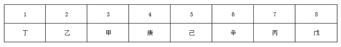

B项：假设丁在第二个房间，根据条件③丁在庚的左边，他们中间隔着2人可知庚在5号房，因为本题问“不可能”，所以只需要在满足题干所有条件的情况下，任意给出一种排序方式即为可能，如下图所示，丁可以在2号房，且题干所有条件均满足，排除；

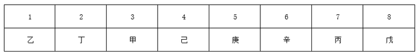

C项：当丁在3号房，根据条件③丁在庚的左边，他们中间隔着2人可知，庚在6号房，根据条件①甲和丙中间隔着3人，只能是以下两种情况：

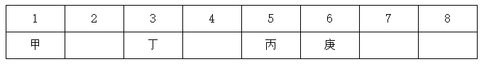

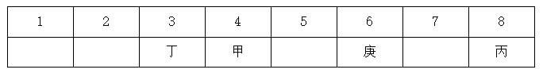

对于第一种情况，根据②乙和己中间隔着2人，只能是在4号房和7号房，剩余的2号房和8号房，无法满足④辛和戊中间隔着1人；对于第二种情况，根据②乙和己中间隔着2人，只能是在2号房和5号房，剩余的1号房和7号房，无法满足④辛和戊中间隔着1人。因此，没有任何排序方式可以使题干所有条件同时成立，故丁不可能在3号房，当选；

D项：假设丁在第四个房间，根据条件③丁在庚的左边，他们中间隔着2人可知庚在7号房，因为本题问“不可能”，所以只需要在满足题干所有条件的情况下，任意给出一种排序方式即为可能，如下图所示，丁可以在4号房，且题干所有条件均满足，排除。

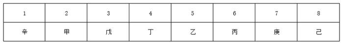

本题为选非题，故正确答案为C。

---

## 第 40 题　qid 2719410 · 逻辑判断

近日，有研究团队通过对44个反刍动物物种的基因组测序研究，创建了一个反刍动物的系统进化树，从而解释大量反刍动物的演化史。结果揭示，在近10万年前，反刍动物种群发生大幅衰减，而这些种群数的减少与人类向非洲之外迁徙的时间相符。有人据此认为，这佐证了早期人类活动造成了反刍动物种群的衰减。
以下哪项如果为真，最能质疑上述结论？

- **A**. 反刍动物种群衰减后，植被愈加茂盛，为人类提供了更多食物
- **B**. 反刍动物通常有角，在遇到人类攻击时能发挥一定的防御作用
- **C**. 同一时期的马、驴等奇蹄目动物的种群也出现大幅衰减的现象
- **D**. 同一时期大型猫科动物繁盛，它们大规模捕杀反刍动物　✅

**答案**：D

**官方解析**

第一步：找出论点和论据。
论点：这佐证了早期人类活动造成了反刍动物种群的衰减。
论据：在近10万年前，反刍动物种群发生大幅衰减，而这些种群数的减少与人类向非洲之外迁徙的时间相符。
论点论据都在讨论早期人类活动和反刍动物种群之间的关系，论点论据话题一致，论点中存在因果关系，可优先考虑因果倒置和他因削弱。
第二步：逐一分析选项。
A项：该项说的是反刍动物衰减后给人类的影响，论点说的是早期人类活动造成了反刍动物种群的衰减，话题不一致，无法削弱，排除；
B项：该项说的反刍动物对人类攻击有一定的防御作用，那到底是否是人类活动造成的反刍动物种群衰减不是十分明确，属于不确定选项，无法削弱，排除；
C项：该项说的是同一时期奇蹄目动物的种群也大幅度衰减，论点说的是早期人类活动造成反刍动物种群的衰减，主体不一致，无法削弱，排除；
D项：该项说的是同一时期，还有另外一个原因也就是猫科动物大规模捕杀反刍动物也造成反刍动物种群的衰减，属于他因削弱，当选。
故正确答案为D。

---
