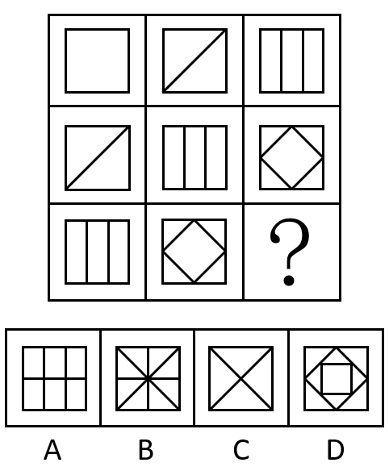
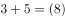
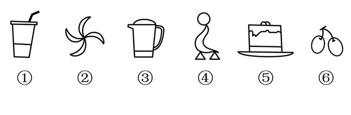

# 2021年安徽省公务员录用考试《行测》题（网友回忆版）

> 判断推理 · 35 题 · 安徽 2021

## 第 1 题　qid 3522378 · 类比推理

戊：己：庚

- **A**. 钠：镁：铝　✅
- **B**. 寅：卯：巳
- **C**. 牛：虎：龙
- **D**. 秦：汉：隋

**答案**：A

**官方解析**

第一步：判断题干词语间逻辑关系。
天干是中国古代的一种文字计序符号，其包括：甲、乙、丙、丁、戊、己、庚、辛、壬、癸，被称为“十天干”。戊、己、庚是“十天干”中的三个，三者是并列关系，且三者在天干中排列紧密连续。
第二步：判断选项词语间逻辑关系。
A项：钠、镁、铝是元素周期表中的三个元素，三者是并列关系，且三者在元素周期表中排列紧密连续，与题干逻辑关系一致，当选；
B项：寅、卯、巳是古代十二地支中的三个地支，三者是并列关系，但三者在十二地支中的排列并不是紧密连续的，与题干逻辑关系不一致，排除；
C项：牛、虎、龙是十二生肖中的三个生肖，三者是并列关系，但三者在十二生肖中的排列并不是紧密连续的，与题干逻辑关系不一致，排除；
D项：秦、汉、隋是我国古代的三个朝代，三者是并列关系，但三者在古代朝代中的排列并不是紧密连续的，与题干逻辑关系不一致，排除。
故正确答案为A。

---

## 第 2 题　qid 3522379 · 类比推理

优雅：天鹅

- **A**. 风沙：塞外
- **B**. 高洁：梅花　✅
- **C**. 友好：同窗
- **D**. 幽默：笑话

**答案**：B

**官方解析**

第一步：判断题干词语间逻辑关系。
天鹅象征着优雅，二者为比喻象征关系。
第二步：判断选项词语间逻辑关系。
A项：塞外有风沙，二者为地点对应关系，与题干逻辑关系不一致，排除；
B项：梅花象征着高洁的品质，二者为比喻象征关系，与题干逻辑关系一致，当选；
C项：同窗是指同在一个学校学习的人，同窗之间的关系可以是友好的，二者为对应关系，与题干逻辑关系不一致，排除；
D项：“笑话”是“幽默”的一种表现形式，二者为属性对应关系，与题干逻辑关系不一致，排除。
故正确答案为B。

---

## 第 3 题　qid 3522384 · 类比推理

赫兹：频率

- **A**. 法拉：电容　✅
- **B**. 焦耳：功率
- **C**. 牛顿：压强
- **D**. 电阻：欧姆

**答案**：A

**官方解析**

第一步：判断题干词语间逻辑关系。
“赫兹”是国际单位制中“频率”的单位，二者为对应关系。
第二步：判断选项词语间逻辑关系。
A项：“法拉”是国际单位制中“电容”的单位，二者为对应关系，与题干逻辑关系一致，当选；
B项：“焦耳”是“能量和做功”的国际单位，“瓦特”是国际单位制中“功率”的单位，焦耳和功率二者无明显逻辑关系，与题干逻辑关系不一致，排除；
C项：“牛顿”是“力”的国际单位，“帕斯卡”（简称帕）是国际单位制中表示“压强”的基本单位，牛顿和压强二者无明显逻辑关系，与题干逻辑关系不一致，排除；
D项：“欧姆”是“电阻”的国际单位，但二者与题干顺序相反，与题干逻辑关系不一致，排除。
故正确答案为A。

---

## 第 4 题　qid 3522388 · 类比推理

巴蜀：燕赵

- **A**. 京津：淮海
- **B**. 闽越：荆湘
- **C**. 齐鲁：秦晋　✅
- **D**. 殷商：云贵

**答案**：C

**官方解析**

第一步：判断题干词语间逻辑关系。
“巴蜀”指的是巴国和蜀国，“燕赵”指的是燕国和赵国，四者都属于中国历史上存在的国家，为并列关系中的反对关系。
第二步：判断选项词语间逻辑关系。
A项：“京津”指的是北京和天津，“淮海”指的是以徐州为中心的淮河以北及海州（今连云港市西南）一带的地区，并不是国家，与题干逻辑关系不一致，排除；
B项：“闽越”指的是闽越国，“荆湘”指的是长江中游地区的江汉—洞庭湖平原，并不全是国家，与题干逻辑关系不一致，排除；
C项：“齐鲁”指的是齐国和鲁国，“秦晋”指的是秦国和晋国，四者都属于中国历史上存在的国家，为并列关系中的反对关系，与题干逻辑关系一致，当选；
D项：“殷商”指的商朝，“云贵”指的是云南和贵州地区，并不是国家，与题干逻辑关系不一致，排除。
故正确答案为C。

---

## 第 5 题　qid 3522390 · 类比推理

顿悟：醍醐灌顶

- **A**. 渴望：望梅止渴
- **B**. 移交：完璧归赵
- **C**. 消费：坐吃山空
- **D**. 孝顺：彩衣娱亲　✅

**答案**：D

**官方解析**

第一步：判断题干词语间逻辑关系。
醍醐灌顶意思是将牛奶中精炼出来的乳酪浇到头上，比喻灌输智慧，使人得到启发，彻底醒悟，与顿悟是近义关系。
第二步：判断选项词语间逻辑关系。
A项：望梅止渴意思是梅子酸，人想吃梅子就会流涎，因而止渴，比喻愿望无法实现，用空想安慰自己。与渴望不是近义关系，与题干逻辑关系不一致，排除；
B项：完璧归赵意思是蔺相如将完美无瑕的和氏璧，完好地从秦国带回赵国，后比喻把物品完好地归还给物品的主人。与移交不是近义关系，与题干逻辑关系不一致，排除；
C项：坐吃山空意思是只坐着吃，山也要空，指光是消费而不从事生产，即使有堆积如山的财富，也要耗尽。与消费不是近义关系，与题干逻辑关系不一致，排除；
D项：彩衣娱亲意思是传说春秋时有个老莱子，很孝顺，七十岁了还穿着彩色衣服扮成幼儿，引父母发笑，后作为孝顺父母的典故。与孝顺是近义关系，与题干逻辑关系一致，当选。
故正确答案为D。

---

## 第 6 题　qid 3522387 · 类比推理

超声波：次声波：军事

- **A**. 处女作：代表作：文学
- **B**. 路由器：隔离卡：网络　✅
- **C**. 潜水艇：核潜艇：科技
- **D**. 北极星：北斗星：星辰

**答案**：B

**官方解析**

第一步：判断题干词语间逻辑关系。
超声波是指频率高于20000赫兹的声波，次声波是指频率小于20赫兹的声波，二者为并列关系；且超声波和次声波都可以运用在军事上，为对应关系。
第二步：判断选项词语间逻辑关系。
A项：有的处女作是代表作，有的处女作不是代表作，有的代表作是处女作，有的代表作不是处女作，二者为交叉关系，与题干逻辑关系不一致，排除；
B项：路由器是连接两个或多个网络的硬件设备，在网络间起网关的作用；隔离卡是一种应用在计算机上的硬件，使得计算机在完全安全状态下联结内网和外网，二者均为电脑硬件设备，为并列关系。且路由器和隔离卡都可以运用在网络连接上，为对应关系，与题干逻辑关系一致，当选；
C项：核潜艇是潜水艇的一种，二者为种属关系，与题干逻辑关系不一致，排除；
D项：北极星又称北辰、紫微星，指的是最靠近北天极的一颗恒星；北斗星又称北斗七星，是大熊座的组成部分，属于紫微垣的一个星官。二者不是并列关系，但二者都是星辰，前两词分别与第三词构成种属关系，与题干逻辑关系不一致，排除。
故正确答案为B。

---

## 第 7 题　qid 3522391 · 类比推理

握瑜：怀瑾：美玉

- **A**. 南辕：北辙：马车
- **B**. 金戈：铁马：战争
- **C**. 敲金：击石：乐器　✅
- **D**. 锦衣：玉食：珍馐

**答案**：C

**官方解析**

第一步：判断题干词语间逻辑关系。
“瑜”和“瑾”指美玉，且握瑜和怀瑾都是动宾结构。
第二步：判断选项词语间逻辑关系。
A项：“辕”指车前驾牲畜的两根直木，“辙”指车轮压的痕迹，二者均不能用来指马车，且南辕和北辙都不是动宾结构，与题干逻辑关系不一致，排除；
B项：“戈”指古代的一种兵器，“马”指马匹，二者均不能直接指战争，且金戈和铁马都不是动宾结构，与题干逻辑关系不一致，排除；
C项：“金”和“石”指钟磬一类的乐器，且敲金和击石均为动宾结构，与题干逻辑关系一致，当选；
D项：“衣”指衣服，“食”指食物，二者均不能用来指珍馐，且锦衣和玉食都不是动宾结构，与题干逻辑关系不一致，排除。
故正确答案为C。

---

## 第 8 题　qid 3522395 · 类比推理

火箭筒 对于 （    ） 相当于 （    ） 对于 三节棍

- **A**. 发射  狼牙棒
- **B**. 手榴弹 方天戟　✅
- **C**. 爆炸  软器械
- **D**. 热动力 锻造术

**答案**：B

**官方解析**

逐一代入选项。
A项：“火箭筒”具有“发射”火箭弹的功能，二者属于功能对应关系，狼牙棒和三节棍都是用于攻击的工具，二者为并列关系，前后逻辑关系不一致，排除；
B项：火箭筒和手榴弹都是武器，二者为并列关系，方天戟和三节棍都是兵器，二者为并列关系，前后逻辑关系一致，当选；
C项：火箭筒发射的火箭弹能够爆炸，二者为对应关系，三节棍是软器械的一种，二者为种属关系，前后逻辑关系不一致，排除；
D项：火箭筒的工作原理是利用了热动力，二者为原理对应关系，三节棍经过锻造术锻造而成，二者为工艺对应关系，前后逻辑关系不一致，排除。
故正确答案为B。

---

## 第 9 题　qid 3522400 · 类比推理

高屋建瓴 对于 （    ） 相当于 （    ） 对于 技艺

- **A**. 格局 左支右绌
- **B**. 形势 目无全牛　✅
- **C**. 气势 天造地设
- **D**. 地势 逆水行舟

**答案**：B

**官方解析**

逐一代入选项。
A项：高屋建瓴意思是把瓶子里的水从高层顶上倾倒，形容居高临下的形势，与格局无必然联系；左支右绌意思是力量不足，应付了这一方面，那一方面又有了问题，与技艺无必然联系，前后逻辑关系不一致，排除；
B项：高屋建瓴意思是把瓶子里的水从高层顶上倾倒，形容居高临下的形势，高屋建瓴形容形势；目无全牛意思是眼中没有完整的牛，只有牛的筋骨结构，形容人的技艺高超，得心应手，已经到达非常纯熟的地步，目无全牛形容技艺，前后逻辑关系一致，当选；
C项：高屋建瓴意思是把瓶子里的水从高层顶上倾倒，形容居高临下的形势，与气势无必然联系；天造地设意思是自然形成而合乎理想，不必再加工，与技艺无必然联系，前后逻辑关系不一致，排除；
D项：高屋建瓴意思是把瓶子里的水从高层顶上倾倒，形容居高临下的形势，与地势无必然联系；逆水行舟意思是比喻学习或做事就好像逆水行船，不努力就要退步，与技艺无必然联系，前后逻辑关系不一致，排除。
故正确答案为B。

---

## 第 10 题　qid 3522404 · 类比推理

晕轮效应 对于 （    ） 相当于 （    ） 对于 变本加厉

- **A**. 扬长避短 墨菲定理
- **B**. 以偏概全 破窗效应　✅
- **C**. 欲扬先抑 增减效应
- **D**. 举一反三 蝴蝶效应

**答案**：B

**官方解析**

逐一代入选项。
A项：“晕轮效应”是指在人际知觉中所形成的以点概面或以偏概全的主观印象，其本质是一种用片面的观点看待整体问题的认知偏误；“扬长避短”是指发扬优点、回避缺点，二者没有明显逻辑关系。“墨菲定理”的根本内容是：如果事情有变坏的可能，不管这种可能性有多小，它总会发生；“变本加厉”指情况变得比本来更加严重，二者没有明显逻辑关系。前后逻辑关系不一致，排除；
B项：“以偏概全”是指片面地根据局部现象来推论整体，得出错误的结论，是“晕轮效应”的本质；“破窗效应”是指环境中的不良现象如果被放任存在，会诱使人们仿效，甚至变本加厉，“变本加厉”是其本质，前后逻辑关系一致，当选；
C项：“欲扬先抑”是指要发扬、放开，就要先控制、压抑，与“晕轮效应”之间没有明显逻辑关系；“增减效应”是指人们最喜欢那些对自己的喜欢显得不断增加的人，最不喜欢那些对自己的喜欢显得不断减少的人，与“变本加厉”之间没有明显逻辑关系，前后逻辑关系不一致，排除；
D项：“举一反三”是指从懂得的一点，类推而知道其他，与“晕轮效应”之间没有明显逻辑关系；“蝴蝶效应”是指初始条件下微小的变化能带动整个系统的长期的巨大的连锁反应，与“变本加厉”之间没有明显逻辑关系，前后逻辑关系不一致，排除。
故正确答案为B。

---

## 第 11 题　qid 3522437 · 图形推理

从所给的四个选项中，选择最合适的一个填入问号处，使之呈现一定的规律性：

- **A**. A
- **B**. B　✅
- **C**. C
- **D**. D

**答案**：B

**官方解析**

元素组成相似，优先考虑样式规律，经过验证无规律。继续观察发现，图形均明显被分割，考虑数量规律中的面数量。第一行图形中面的数量满足：，第二行图形中面的数量满足：，则第三行图形中面的数量应满足：，A、C、D三项均不满足，B项当选。

故正确答案为B。

---

## 第 12 题　qid 3522441 · 图形推理

从所给的四个选项中，选择最合适的一个填入问号处，使之呈现一定的规律性：

- **A**. A
- **B**. B
- **C**. C
- **D**. D　✅

**答案**：D

**官方解析**

元素组成相同，优先考虑位置规律。观察发现，题干第一组图形中的两个白球在九宫格外圈整体顺时针平移2格，而两个“十字”在九宫格外圈整体顺/逆时针平移4格。第二组图形应遵循同样规律，只有D项满足。
故正确答案为D。

---

## 第 13 题　qid 3522442 · 图形推理

把下面的六个图形分为两类，使每一类图形都有各自的共同特征或规律，分类正确的一项是：

- **A**. ①③⑥，②④⑤
- **B**. ①②⑤，③④⑥
- **C**. ①⑤⑥，②③④
- **D**. ①③⑤，②④⑥　✅

**答案**：D

**官方解析**

本题为分组分类题目。观察发现，题干图形均出现多个封闭面连在一起，考虑图形间关系。图①③⑤中封闭面之间有公共边，图②④⑥中封闭面之间没有公共边（通过点或线连接），即图①③⑤为一组，图②④⑥为一组。
故正确答案为D。

---

## 第 14 题　qid 3522444 · 图形推理

从所给的四个选项中，选择最合适的一个填入问号处，使下列正方形图形呈现一定的规律性：

- **A**. A
- **B**. B　✅
- **C**. C
- **D**. D

**答案**：B

**官方解析**

元素组成不同，且无明显属性规律，优先考虑数量规律。观察题干图形，发现图形分割明显，可考虑面数量，但面数量无规律。再次观察发现，分割后的图形三角形较多，且明显存在直角，可考虑单一直角数。题干图形的单一直角数分别为2、3、？、5、6，故？处图形的单一直角数应为4，只有B项符合。
故正确答案为B。

---

## 第 15 题　qid 3522445 · 类比推理

下图右侧四个选项中，哪一个不是左侧零件的立面？

- **A**. A　✅
- **B**. B
- **C**. C
- **D**. D

**答案**：A

**官方解析**

本题考查三视图。如下图所示，B、C、D三项按图中箭头方向观察，均可看到，排除；A项最上面凹槽处缺少一根线，无法看到，当选。

本题为选非题，故正确答案为A。

---

## 第 16 题　qid 3522381 · 定义判断

单质是由同一种元素组成的纯净物。化合物是由两种或两种以上元素的原子（不同元素的原子）组成的纯净物。混合物是指由两种或两种以上不同的单质或化合物机械混合而成的物质，无固定化学式，混合物的各种成分之间没有发生化学反应，混合物可以用物理的方法将所含的物质分离。
根据上述定义，下列选项同时具有以上三类物质的是：

- **A**. 氮气、氧气、二氧化碳、空气　✅
- **B**. 食盐水、盐酸、氨水、蒸馏水
- **C**. 氢气、氖气、水蒸气、汞蒸气
- **D**. 二氧化碳、水蒸气、矿泉水、天然气

**答案**：A

**官方解析**

第一步：找出定义关键词。
单质：“由同一种元素组成的纯净物”；
化合物：“由两种或两种以上元素的原子（不同元素的原子）组成的纯净物”；
混合物：“由两种或两种以上不同的单质或化合物机械混合而成”、“无固定化学式”。
第二步：逐一分析选项。
A项：氮气是由氮元素组成的纯净物，氧气是由氧元素组成的纯净物，均符合“由同一种元素组成的纯净物”，符合单质的定义；二氧化碳是由碳元素和氧元素组成的纯净物，符合“由两种或两种以上元素的原子（不同元素的原子）组成的纯净物”，符合化合物的定义；空气由氮气、氧气、二氧化碳等物质组成，符合“由两种或两种以上不同的单质或化合物机械混合而成”、“无固定化学式”，符合混合物的定义。选项同时具有三类物质，符合题干要求，当选； 
B项：食盐水是由氯化钠和水等组成的溶液，盐酸是氯化氢和水组成的溶液，氨水是氨和水组成的溶液，均符合“由两种或两种以上不同的单质或化合物机械混合而成”、“无固定化学式”，符合混合物的定义；蒸馏水是由氢元素和氧元素组成的纯净物，符合“由两种或两种以上元素的原子（不同元素的原子）组成的纯净物”，符合化合物的定义。选项缺少单质，不符合题干要求，排除；
C项：氢气是由氢元素组成的纯净物，氖气是由氖元素组成的纯净物，汞蒸气是汞蒸发而成的纯净物，均符合“由同一种元素组成的纯净物”，符合单质的定义；水蒸气是由氢元素和氧元素组成的纯净物，符合“由两种或两种以上元素的原子（不同元素的原子）组成的纯净物组成的纯净物”，符合化合物的定义。选项缺少混合物，不符合题干要求，排除；
D项：二氧化碳是由碳元素和氧元素组成的纯净物，水蒸气是由氢元素和氧元素组成的纯净物，均符合“由两种或两种以上元素的原子（不同元素的原子）组成的纯净物”，符合化合物的定义；矿泉水由水、矿物盐、二氧化碳等物质组成，天然气由烃类和非烃类气体混合而成，均符合“由两种或两种以上不同的单质或化合物机械混合而成”、“无固定化学式”，符合混合物的定义。选项缺少单质，不符合题干要求，排除。
故正确答案为A。

---

## 第 17 题　qid 3522386 · 定义判断

先赋资本是指建立在血缘、遗传等先天条件下，不经过个人努力就可以拥有的资本。自致资本是指通过个人后天努力取得，为个人所支配的资本。
根据上述定义，下列选项中的内容均属于自致资本的是：

- **A**. 婚姻、职业、政治面貌　✅
- **B**. 家世、民族、文化程度
- **C**. 国籍、收入、工作单位
- **D**. 种族、户口、父辈职业

**答案**：A

**官方解析**

第一步：找出定义关键词。
先赋资本：“建立在血缘、遗传等先天条件下”、“不经过个人努力就可以拥有”；
自致资本：“通过个人后天努力取得”、“为个人所支配”。
第二步：逐一分析选项。
A项：婚姻、职业、政治面貌都是通过后天努力取得的，均符合自致资本的定义，当选； 
B项：家世、民族是建立在遗传的先天条件下，不经过个人努力就可以拥有的，符合先赋资本的定义；文化程度是通过后天努力取得的，符合自致资本的定义，排除；
C项：国籍是建立在遗传的先天条件下，不经过个人努力就可以拥有的，符合先赋资本的定义；收入和工作单位是通过后天努力取得的，均符合自致资本的定义，排除；
D项：种族、户口和父辈职业都是建立在血缘、遗传等先天条件下，不经过个人努力就可以拥有的，均符合先赋资本的定义，排除。
故正确答案为A。

---

## 第 18 题　qid 3522389 · 定义判断

虚假相关指的是两个没有因果关系的事件之间，基于一些其他未见的因素（潜在变量）而推断出因果关系，引致两个事件是“有所联系”的假象，但这种联系并不能通过客观的试验来证实。
根据上述定义，下列选项不属于虚假相关的是:

- **A**. 童鞋的大小与孩子的语言能力
- **B**. 冷饮的销量与泳池溺水的人数
- **C**. 惯性的大小与汽车的核载重量　✅
- **D**. 网民的数量与房屋的折旧程度

**答案**：C

**官方解析**

第一步：找出定义关键词。
“两个没有因果关系的事件”、“基于一些其他未见的因素（潜在变量）而推断出因果关系”、“引致两个事件是‘有所联系’的假象，但这种联系并不能通过客观的试验来证实”。
第二步：逐一分析选项。
A项：童鞋的大小与孩子的语言能力不存在直接联系，二者没有因果关系，符合关键词“两个没有因果关系的事件”，但二者可能都与“年龄”相关，年龄大可能导致童鞋大，同时导致语言能力较强，基于“年龄”这一潜在变量，二者之间“有所联系”，符合关键词“基于一些其他未见的因素（潜在变量）而推断出因果关系”、“引致两个事件是‘有所联系’的假象，但这种联系并不能通过客观的试验来证实”，符合定义，排除；
B项：冷饮的销量与泳池溺水的人数不存在直接联系，二者没有因果关系，符合关键词“两个没有因果关系的事件”，但二者可能都是由于“天气炎热”引起的，基于“天气炎热”这一潜在变量，二者之间“有所联系”，符合关键词“基于一些其他未见的因素（潜在变量）而推断出因果关系”、“引致两个事件是‘有所联系’的假象，但这种联系并不能通过客观的试验来证实”，符合定义，排除；
C项：惯性与物体的质量有关，物体的质量越大则惯性越大，而汽车核载重量与汽车质量成正比，所以惯性的大小与汽车的核载重量存在因果关系，不符合关键词“两个没有因果关系的事件”，且惯性和物体重量之间的关系可通过实验来证实，不符合关键词“引致两个事件是‘有所联系’的假象，但这种联系并不能通过客观的试验来证实”，不符合定义，当选；
D项：网民的数量与房屋的折旧程度不存在直接联系，二者没有因果关系，符合关键词“两个没有因果关系的事件”，但二者可能都与“时间”相关，随着时间推移，网民数量逐渐增多，同时房屋折旧程度越高，基于“时间”这一潜在变量，二者之间“有所联系”，符合关键词“基于一些其他未见的因素（潜在变量）而推断出因果关系”、“引致两个事件是‘有所联系’的假象，但这种联系并不能通过客观的试验来证实”，符合定义，排除。
本题为选非题，故正确答案为C。

---

## 第 19 题　qid 3522393 · 定义判断

色素色是指有机色素通过选择性地吸收、反射和投射特定频率的光线后直观呈现出的颜色。结构色又称物理色，是指通过可见光与物质物理上的微观结构（如物体表面或表层的纹、刻点、沟缝或颗粒等）发生相互作用，这些大量的微观有序结构对不同波长的光散射、衍射或干涉后产生的各种颜色。
根据上述定义，下列颜色属于色素色的是:

- **A**. 用激光束刻录的光盘上的彩色花纹
- **B**. 蝴蝶翅膀上的鳞片呈现出五颜六色
- **C**. 阳光下肥皂泡泡呈现缤纷的虹彩色
- **D**. 用乌饭树叶捣汁煮出的糯米饭呈现黑色　✅

**答案**：D

**官方解析**

第一步：找出定义关键词。
色素色：“有机色素”、“通过选择性地吸收、反射和投射特定频率的光线后直观呈现出的颜色”；
结构色：“通过可见光与物质物理上的微观结构（如物体表面或表层的纹、刻点、沟缝或颗粒等）发生相互作用”、“这些大量的微观有序结构对不同波长的光散射、衍射或干涉后产生的各种颜色”。
第二步：逐一分析选项。
A项：用激光束刻录的光盘上的彩色花纹，光盘本身的颜色是单一色，而光盘上的彩色花纹是由于光盘表面的特殊结构对光散射、衍射或干涉形成的，符合“通过可见光与物质物理上的微观结构（如物体表面或表层的纹、刻点、沟缝或颗粒等）发生相互作用”、“这些大量的微观有序结构对不同波长的光散射、衍射或干涉后产生的各种颜色”，符合结构色的定义，不符合色素色的定义，排除；
B项：蝴蝶翅膀上的鳞片呈现出五颜六色，主要是由于鳞片表面凹凸不平的奇特构造，使光线发生反射、折射或干涉等光学作用而产生，符合“通过可见光与物质物理上的微观结构（如物体表面或表层的纹、刻点、沟缝或颗粒等）发生相互作用”、“这些大量的微观有序结构对不同波长的光散射、衍射或干涉后产生的各种颜色”，符合结构色的定义，不符合色素色的定义，排除；
C项：阳光下肥皂泡泡呈现缤纷的虹彩色，肥皂泡本身是无色的，在阳光的照耀下呈现出虹彩色是由于肥皂泡表面的膜产生的，符合“通过可见光与物质物理上的微观结构（如物体表面或表层的纹、刻点、沟缝或颗粒等）发生相互作用”、“这些大量的微观有序结构对不同波长的光散射、衍射或干涉后产生的各种颜色”，符合结构色的定义，不符合色素色的定义，排除；
D项：用乌饭树叶捣汁煮出的糯米饭呈现黑色，主要是因为乌饭树叶中的色素与糯米饭中的蛋白质发生了一系列复杂反应，生成物可以吸收绝大部分光，所以呈现出来是黑色的，符合“有机色素”、“通过选择性地吸收、反射和投射特定频率的光线后直观呈现出的颜色”，符合色素色的定义，当选。
故正确答案为D。

---

## 第 20 题　qid 3522398 · 定义判断

音爆是飞行器在突破音障时，由于对空气的压缩无法迅速传播，会逐渐形成激波面，激波面上高度集中的声学能量引起巨大响声，让人耳感受到短暂而极其强烈的爆炸声。音爆只有在突破音速即超音速飞行时才会产生。音爆云则是以飞行器为中心轴、从机翼前段开始向四周均匀扩散的圆锥状云团。其产生主要是由于气流流速突破音速时比空气传导速度更快，无法有效向下拉气流，导致密度减小，气压降低，水气凝结成微小的水珠，肉眼看来就像是云雾般的状态。音爆云在跨音速飞行时常常出现，但不仅在跨音速飞行时才能出现。
根据上述定义，下列说法正确的是：

- **A**. 音爆产生时就会出现音爆云
- **B**. 音爆云出现标志着音爆产生
- **C**. 音爆云出现说明突破了音障
- **D**. 音爆产生时是超音速飞行　✅

**答案**：D

**官方解析**

第一步：找出定义关键词。
音爆：“飞行器在突破音障时”、“对空气的压缩无法迅速传播，会逐渐形成激波面”、“激波面上高度集中的声学能量引起巨大响声，让人耳感受到短暂而极其强烈的爆炸声”、“只有在突破音速即超音速飞行时才会产生”；
音爆云：“以飞行器为中心轴、从机翼前段开始向四周均匀扩散的圆锥状云团”、“产生主要是由于气流流速突破音速时比空气传导速度更快，无法有效向下拉气流，导致密度减小，气压降低，水气凝结成微小的水珠，肉眼看来就像是云雾般的状态”、“在跨音速飞行时常常出现，但不仅在跨音速飞行时才能出现”。
第二步：逐一分析选项。
A项：音爆云在跨音速飞行时常常出现，说明在跨音速飞行时也可能不会产生音爆云，而音爆只有在突破音速即超音速飞行时才会产生，说明音爆产生时也有可能不会产生音爆云，因此“音爆产生时就会出现音爆云”的说法不正确，排除；
B项：音爆云不仅在跨音速飞行时才能出现，意味着音爆云可能在非跨音速飞行时产生，而音爆只有在突破音速即超音速飞行时才会产生，因此可能出现有音爆云但没有音爆的情况，因此“音爆云出现标志着音爆产生”的说法不正确，排除；
C项：说的是音爆云出现说明突破了音障，音爆是飞行器在突破音障时产生的，而音爆云的出现并不能说明突破了音障，因此“音爆云出现说明突破了音障”的说法不正确，排除；
D项：说的是音爆产生时是超音速飞行，符合音爆“只有在突破音速即超音速飞行时才会产生”，符合定义，当选。
故正确答案为D。

---

## 第 21 题　qid 3522394 · 定义判断

迎臂效应也被称为“请到我家后院来”。从表面意思来看，迎臂就是张开双臂欢迎的意思，是指某个地区的居民认为相关机构、设施、景观具有正的外部效应，能给本社区发展带来好处，因此，不排斥甚至欢迎这些项目在本社区落地。
根据上述定义，下列选项属于迎臂效应的是：

- **A**. 群众深度参与，点赞街道残障康复中心成立　✅
- **B**. 公司升级业态，积极在社区推广无人零售店
- **C**. 新设备耗电低，企业要求园区加快引进速度
- **D**. 加气站易漏气，附近居民担心火灾要求搬迁

**答案**：A

**官方解析**

第一步：找出定义关键词。
“某个地区的居民”、“认为相关机构、设施、景观具有正的外部效应，能给本社区发展带来好处”、“不排斥甚至欢迎这些项目在本社区落地”。
第二步：逐一分析选项。
A项：群众深度参与，符合“某个地区的居民”，点赞街道残障康复中心成立，说明群众认可、十分欢迎，符合“认为相关机构、设施、景观具有正的外部效应，能给本社区发展带来好处”，也符合“不排斥甚至欢迎这些项目在本社区落地”，符合定义，当选；
B项：公司升级业态，积极在社区推广无人零售店，没有体现出被推广社区居民的态度，是否欢迎，不符合定义，排除；
C项：新设备耗电低，企业要求园区加快引进速度，园区不是社区，企业也不是社区居民，不符合“某个地区的居民”，不符合定义，排除；
D项：加气站易漏气，附近居民担心火灾要求搬迁，是居民害怕带来危险，不符合“认为相关机构、设施、景观具有正的外部效应，能给本社区发展带来好处”、“不排斥甚至欢迎这些项目在本社区落地”，不符合定义，排除。
故正确答案为A。

---

## 第 22 题　qid 3522406 · 定义判断

人合公司是指以股东的个人信用为公司信用基础的公司；资合公司是指由公司股东分别出资而形成的财产作为信用基础的公司；人资兼合公司则同时具备上述两种性质的信用基础。
根据上述定义，下列哪个公司属于人合公司：

- **A**. 某公司注册资本为全体股东缴纳股本的总和，股东的出资以现金及财产为限，根据出资对公司负责
- **B**. 某公司的全部股份由公司独立创立者百分百持有，公司聘请多位经验丰富的职业经理人分管不同业务
- **C**. 某公司由于经营不善导致资金链断裂，在申请破产时以全部注册资本作数，股东个人财产并不受影响
- **D**. 某公司的资产以股东个人的所有财产为抵押，股东对公司经营负无限责任，并且不能任意地转让股份　✅

**答案**：D

**官方解析**

第一步：找出定义关键词。
人合公司：“以股东的个人信用为公司信用基础”；
资合公司：“由公司股东分别出资而形成的财产作为信用基础”；
人资兼合公司：同时以“股东的个人信用”和“股东分别出资而形成的财产”作为信用基础。
第二步：逐一分析选项。
A项：某公司注册资本为全体股东缴纳股本的总和，符合“公司股东分别出资而形成的财产”，属于资合公司，不属于人合公司，排除；
B项：某公司的全部股份由公司独立创立者百分百持有，但是公司聘请多位经验丰富的职业经理人分管不同业务，不符合“以股东的个人信用为公司信用基础”，不属于人合公司，排除；
C项：股东个人财产并不受影响，说明不符合“以股东的个人信用为公司信用基础”，不属于人合公司，排除；
D项：以股东个人的所有财产为抵押，股东对公司经营负无限责任，符合“以股东的个人信用为公司信用基础”，属于人合公司，当选。
故正确答案为D。

---

## 第 23 题　qid 3522418 · 定义判断

文化挪用是指将本不属于本地的异域或其他民族的文化资源借用过来，从而对本地的文化形成影响，创造出新的文化产品的现象。
根据上述定义，下列属于文化挪用的是：

- **A**. 某苗族民间工艺组织设计制作的具有苗绣元素的彩绘玻璃、蜡染布等文创作品畅销全国
- **B**. 某法国女生在毕业舞会上穿着优雅别致的印度传统服装纱丽翩翩起舞，让大家大饱眼福
- **C**. 某荷兰社区大学为学生开设中华太极拳课程以增强他们的健身意识，受到学生普遍欢迎
- **D**. 世界之窗展示了众多全球著名景观和建筑成为深圳打卡的地标，是当地热门的旅游景点　✅

**答案**：D

**官方解析**

第一步：找出定义关键词。
“将本不属于本地的异域或其他民族的文化资源借用过来”、“对本地的文化形成影响”、“创造出新的文化产品”。
第二步：逐一分析选项。
A项：某苗族民间工艺组织设计制作的具有苗绣元素的文创作品，不符合“将本不属于本地的异域或其他民族的文化资源借用过来”，不符合定义，排除；
B项：某法国女生穿着印度传统服装纱丽翩翩起舞，符合“将本不属于本地的异域或其他民族的文化资源借用过来”，但让大家大饱眼福，不符合“创造出新的文化产品”，不符合定义，排除；
C项：某荷兰社区大学为学生开设中华太极拳课程，符合“将本不属于本地的异域或其他民族的文化资源借用过来”，但是并没有“对本地的文化形成影响”、“创造出新的文化产品”，不符合定义，排除；
D项：世界之窗展示了众多全球著名景观和建筑，符合“将本不属于本地的异域或其他民族的文化资源借用过来”，成为当地热门的旅游景点，符合“对本地的文化形成影响”、“创造出新的文化产品”，符合定义，当选。
故正确答案为D。

---

## 第 24 题　qid 3522428 · 定义判断

价值链的数字重生指价值链的某个必要环节以数字化方式呈现，以数据实时在线为基础推动价值链的实现。价值链的数字新生是以新定义的用户价值为中心、数据实时在线为基础，融合新价值链要素，创造全新价值链结构。
根据上述定义，下列哪项属于价值链的数字重生？

- **A**. 为给用户带来全新的旅行前、旅行中和旅行后的服务体验，立体化整合旅游目的地的资源要素
- **B**. 依靠在线实时数据，使美食供应商更便利精准地了解用户的美食习惯，开拓新颖的服务渠道
- **C**. 电商平台通过发布商品信息和销售实时动态，使消费者在选购时可以查询货物即时情况　✅
- **D**. 核电设备的数字三维模型可以为设计、制造、运行以及维护等多个环节带来价值增长点

**答案**：C

**官方解析**

第一步：找出定义关键词。
价值链的数字重生：“某个必要环节以数字化方式呈现”、“数据实时在线为基础”、“推动价值链的实现”；
价值链的数字新生：“用户价值为中心”、“数据实时在线为基础”、“融合新价值链要素”、“创造全新价值链结构”。
第二步：逐一分析选项。
A项：整合资源给用户带来全新的旅行前、旅行中和旅行后的服务体验，不符合“某个必要环节以数字化方式呈现”，且没有提到“数据的实时在线”，不符合价值链的数字重生的定义，排除；
B项：依靠在线实时数据，符合“数据实时在线为基础”，开拓新颖的服务渠道，是对价值链的创新，不符合“推动价值链的实现”，不符合价值链的数字重生的定义，排除；
C项：电商平台发布商品信息和销售实时动态，符合“数据实时在线为基础”，消费者在选购时可以查询货物即时情况，符合“某个必要环节以数字化方式呈现”，符合价值链的数字重生的定义，当选；
D项：核电设备的数字三维模型可以为多个环节带来价值增长点，不符合“数据实时在线为基础”，不符合价值链的数字重生的定义，排除。
故正确答案为C。

---

## 第 25 题　qid 3522430 · 定义判断

拟剧理论指人与人在社会生活中的相互行为在某种程度上是一种表演。每一个人就像演员一样，在某种特定的场景下，按照一定的角色要求在舞台上表演给观众看。在整个表演过程中，人总是尽量使自己的行为更为接近想要呈现给观众的那个角色，观众看到的是那个表现出来的角色而不是演员本身。当表演结束，演员回到后台以后，他的真实面目才展现出来，演员才又恢复其本来的自我。
根据上述定义，下列选项不能印证拟剧理论的是：

- **A**. 小丽来找小明探讨功课，小明没有立刻开门，而是先把臭袜子藏到床下
- **B**. 在“国王的新装”故事里，新装展示游行时臣民交口称赞新装华贵美丽
- **C**. 小魏生活拮据但工作努力，老板不动声色地开豪车替其去机场接其父母　✅
- **D**. 小菲通过盗图和拼接，天天在微信朋友圈发吃美食、健身、游玩的照片

**答案**：C

**官方解析**

第一步：找出定义关键词。
“人与人的相互行为某种程度上是种表演”、“使自己的行为接近想要呈现的角色”、“观众看到的是角色而不是演员本身”、“表演结束后，恢复本来的自我”。
第二步：逐一分析选项。
A项：小明没有立刻开门，而是先把臭袜子藏到床下，说明他不想被小丽看到自己邋遢的一面，符合“使自己的行为接近想要呈现的角色”、“观众看到的是角色而不是演员本身”，符合定义，排除；
B项：在“国王的新装”故事里，国王实际没有穿衣服，但是臣民交口称赞新装华贵美丽，符合“人与人的相互行为某种程度上是种表演”，符合定义，排除；
C项：小魏生活拮据工作努力，但是开豪车接父母的人是老板不是小魏，没有体现二者的行为是表演出来的，不符合“人与人的相互行为某种程度上是种表演”，不符合定义，当选；
D项：小菲天天在微信朋友圈发照片是通过盗图和拼接，说明朋友圈呈现的并非她的真实生活，符合“使自己的行为接近想要呈现的角色”、“观众看到的是角色而不是演员本身”，符合定义，排除。
本题为选非题，故正确答案为C。

---

## 第 26 题　qid 3522380 · 逻辑判断

如果一片森林的树木物种多样性非常丰富，那么这时缺失一个物种对于整个森林的生产力来讲，影响还并不是太大；但在物种多样性越稀缺的时候，树的种类继续变少，对整个森林生产力产生的打击就会越来越大。
由此可以推出：

- **A**. 除非树木物种多样性锐减，整个森林的生产力不会受到影响
- **B**. 只要森林的树木物种减少，整个森林的生产力就会受到影响
- **C**. 如果森林的生产力下降，那么森林的树木物种多样性就已经受损　✅
- **D**. 要么森林的树木物种多样性非常丰富，要么森林的生产力非常可观

**答案**：C

**官方解析**

第一步：翻译题干。

①物种多样性丰富对森林生产力影响不大

注：题干第一句话可以理解为“如果一片森林的树木物种多样性非常丰富，（即使缺失一个物种），对于整个森林的生产力影响还并不是太大”

如果A，即使B，那么C。此处的“即使B”不是充要条件，可以忽略，最后翻译为AC即可。例.如果你不好好学习，即使你再聪明，也不能圆梦，翻译为好好学习圆梦。

第二步：逐一分析选项。 

A项：翻译为森林生产力受影响物种多样性锐减（即“物种多样性丰富”），仅根据“森林生产力受影响”无法判断影响的大小，无法推出，排除；

B项：翻译为树木物种减少森林生产力受影响，仅根据“树木物种减少”无法判断是减少一种还是多种，是否影响树木物种丰富性，无法推出，排除；

C项：翻译为森林的生产力下降（即“对森林生产力影响大”）树木物种多样性受损（即“树木物种多样性不丰富”），是对题干①的否后推否前，可以推出，当选；

D项：“要么···要么···”表示两者之间只能成立一个且必须成立一个，题干重点论述的是“树木物种多样性”对“森林的生产力”的影响，而不是二者只能有一种情况发生，无法推出，排除。

故正确答案为C。

---

## 第 27 题　qid 3522385 · 逻辑判断

某科学家在一个宇宙科学网站上刊载了一项成果，该成果宣称找到了地球生命来自彗星的“证据”，引发了广泛关注。他声称在一块坠落到斯里兰卡的陨石里找到了微观硅藻化石，该石头有着疏松多孔的结构，密度比在地球上找到的所有东西都低。他推断这是一颗彗星的一部分，并指出样本中找到的微观硅藻化石与恐龙时代留存下来的化石中的微观有机体类似，从而为彗星胚种论提供了强有力的证据。
以下哪项如果为真，最能反驳该科学家的观点？

- **A**. 发表该成果的网站缺乏可信性，所载论文良莠不齐，有些曾沦为笑柄
- **B**. 该科学家是彗星胚种论的狂热支持者，曾宣称SARS和流感来自彗星
- **C**. 该成果配图中被标示成“丝状硅藻”的东西实际上只是硅藻细胞断片
- **D**. 该成果根本无法证明该石头是碳质球粒陨石，甚至难以确定其是陨石　✅

**答案**：D

**官方解析**

第一步：找出论点和论据。
论点：地球生命来自彗星。
论据：一块坠落到斯里兰卡的陨石里找到了微观硅藻化石，该石头有着疏松多孔的结构，密度比在地球上找到的所有东西都低。他推断这是一颗彗星的一部分，并指出样本中找到的微观硅藻化石与恐龙时代留存下来的化石中的微观有机体类似，从而为彗星胚种论提供了强有力的证据。
本题的论据说的是陨石找到的微观硅藻化石与恐龙时代留存下来的化石中的微观有机体类似，同时该研究还推断该陨石是一颗彗星的一部分，即说明该陨石（彗星的一部分）与生命有关系，而论点说的是地球生命来自彗星，所以，二者讨论话题一致，削弱可以考虑削弱论点，也可以考虑削弱论据。
第二步：逐一分析选项。
A项：该成果的网站缺乏可信性，所载论文良莠不齐，代表不了这次实验成果的可靠性，属于无关项，排除；
B项：只是说该科学家是彗星胚种论的狂热支持者，支持者说的话无法辨别真假，同时即便SARS和流感来自彗星，也无法判断生命是否来源于彗星，不明确选项，排除；
C项：选项是说配图中的东西本质是硅藻细胞断片，一定程度上质疑了题干研究成果的可信性，可能削弱论据，保留；
D项：该成果根本无法证明该石头是陨石，直接质疑了论据的研究成果，直接削弱论据，保留。
对比C、D两项：C项为可能削弱论据，D项为直接削弱论据，D项当选。
故正确答案为D。

---

## 第 28 题　qid 3522402 · 逻辑判断

最近有研究团队以问卷调查的方式，调查了519名从未吸过传统香烟，年龄在18岁至25岁间的年轻人，调查内容包括这些年轻人吸电子烟的情况和吸传统香烟的意向等，研究报告称，在从未吸过传统香烟的年轻人中，那些正在吸电子烟的人更可能尝试传统香烟，有关电子烟的监管政策要注意保护年轻人。
以下各项如果为真，最能支持上述结论的是：

- **A**. 受访者中有20%的人尝试过电子烟或未来很可能会尝试电子烟
- **B**. 即使只尝了两三口电子烟，也有可能提高吸传统香烟的可能性
- **C**. 受访者中正在吸电子烟的有60%表示未来一定会尝试传统香烟　✅
- **D**. 电子烟对健康的危害比传统香烟小，但仍然含有很多有害物质

**答案**：C

**官方解析**

第一步：找出论点和论据。

论点：在从未吸过传统香烟的年轻人中，那些正在吸电子烟的人更可能尝试传统香烟，有关电子烟的监管政策要注意保护年轻人。

论据：无。

本题只有论点，没有论据，优先考虑补充论据加强，即解释或举例证明“正在吸电子烟的年轻人更可能尝试传统香烟”。

第二步：逐一分析选项。

A项：论点说的是更可能尝试传统香烟，该项说的是有多少人尝试过电子烟，以及未来可能会尝试，话题不一致，无法加强，排除；

B项：选项表明吸电子烟的人相比于不吸电子烟的人而言，更可能吸传统香烟，该项是针对论点的可能性加强，属于补充论据，保留；

C项：该项表明受访者中正在吸电子烟的有60%表示未来一定会尝试传统香烟，该项比B项加强力度更大，原因有二：

一是题干论点强调保护年轻人，而C项的受试者正是年轻人，表明的是吸电子烟的年轻人的意愿，B项没分，年纪大小都可以，那为什么不保护年纪大的，而要特别保护年轻人呢？

二是如下图原文所示，C项把原文中的“可能或肯定”，改为“一定”，应该是为了区分B的可能，综上C项更有可能是出题人想设置的正确答案；

D项：论点说的是正在吸电子烟的年轻人更可能尝试传统香烟，该项说的是电子烟的危害，话题不一致，无法加强，排除。

故正确答案为C。

---

## 第 29 题　qid 3522405 · 逻辑判断

吴老师、张老师、孙老师、苏老师都是某校教师，分别教授语文、生物、物理、化学四门课程。
已知：
①如果吴老师教语文，那么张老师不教生物
②或者孙老师教语文，或者吴老师教语文
③如果张老师不教生物，那么苏老师不教物理
④或者吴老师不教化学，或者苏老师教物理
以下哪项如果为真，可以推出孙老师教语文：

- **A**. 吴老师教语文
- **B**. 张老师不教生物
- **C**. 吴老师教化学　✅
- **D**. 苏老师不教物理

**答案**：C

**官方解析**

第一步：翻译题干。

①吴老师教语文张老师教生物；

②孙老师教语文或者吴老师教语文；

③张老师教生物苏老师教物理；

④吴老师教化学或者苏老师教物理。

第二步：逐一分析选项。

提问为“推出孙老师教语文”，本题是给出了结论，需要从结论出发倒推条件。

根据条件②可知：想要推出“孙老师教语文”，需要吴老师不教语文；

根据条件①可知：想要得到“吴老师不教语文”，需要张老师教生物；

根据条件③可知：想要得到“张老师教生物”，需要苏老师教物理；

根据条件④可知：想要得到“苏老师教物理”，需要吴老师教化学。

即：想要推出“孙老师教语文”，需要吴老师教化学。

故正确答案为C。

---

## 第 30 题　qid 3522407 · 逻辑判断

慢性疲劳综合征危害极大，它使人在正常的工作后感到极度疲劳，怎么休息也无济于事。这种疾病过去不能通过验血或其他检查得出明确的生物指标，因此其病因历来被归为心理因素。最近，研究人员对诊断为慢性疲劳综合征的48名患者和39名健康志愿者的大便和血液样本进行研究后得出结论：肠道细菌和血液中的致炎因子可能与该疾病有关。
以下哪项如果为真，最不能支持上述结论？

- **A**. 该疾病患者的大便样本中肠道细菌的多样性较低且抗炎细菌较少
- **B**. 该疾病患者的血液样本中被检测出致炎因子，而健康志愿者没有
- **C**. 目前不确定肠道细菌是导致该疾病的原因还是该疾病导致的结果
- **D**. 最新研究表明饮食治疗和益生菌等无助于为该疾病患者缓解疲劳　✅

**答案**：D

**官方解析**

第一步：找出论点和论据。
论点：肠道细菌和血液中的致炎因子可能与慢性疲劳综合征有关。
论据：无。
首先注意本题问的是“······最不能支持上述结论？”，我们的做题思路是找出哪些是能支持的排除，如果不能支持的选项中出现无关选项，不明确选项和削弱选项，首选削弱项。
第二步：逐一分析选项。
A项：患者的肠道细菌多样性低且抗炎细菌较少，说明了肠道细菌可能与该疾病有关，为题干中论点补充了论据，属于加强选项。题干问的是最不能支持的，排除；
B项：患者的血液样本中有致炎因子，而健康志愿者没有，说明了血液中的致炎因子可能与该疾病有关，补充论据，属于加强选项。题干问的是最不能支持的，排除；
C项：不确定肠道细菌是病因还是该疾病导致的结果，但无论是原因还是结果，都能证明肠道细菌与该疾病确实有关，属于加强选项，题干问的是最不能支持的，排除；
D项：饮食治疗和益生菌对缓解患者疲劳无用，与题干论点无关，不能加强，当选。 
本题为选非题，故正确答案为D。

---

## 第 31 题　qid 3522415 · 逻辑判断

黑洞其实并不“黑”，它会以黑体热辐射的形式向外辐射能量，放出极其微弱的光（电磁波），这种光被称为“霍金辐射”。因为“霍金辐射”会释放出能量，所以黑洞会逐渐变小，直至最后消失（黑洞蒸发）。有科学家认为，“霍金辐射”中不含有信息，也就是说被黑洞吞噬的物体信息会消失。
以下说法如果为真，最能支持上述科学家观点的是：

- **A**. 黑洞的表面就像“全息图的底片”，保存着黑洞内部所含的一切信息
- **B**. 根据量子物理学的信息守恒定律，信息在任何条件下都不会完全消失
- **C**. 任何携带信息的物质被黑洞吞噬后，从黑洞释放出的热辐射不携带任何信息　✅
- **D**. 黑洞引力极强，任何物质被它吞噬都无法逃逸，连光也不能幸免，因此无法确认被吞噬的物体信息

**答案**：C

**官方解析**

第一步：找出论点和论据。
论点：“霍金辐射”中不含有信息，也就是说被黑洞吞噬的物体信息会消失。
论据：无。
本文只有论点，因此优先考虑补充论据的形式来加强，考虑原因解释或举例子。
第二步：逐一分析选项。
A项：黑洞表面保存着黑洞内部的所有信息，说明被黑洞吞噬的物体信息不会消失，为削弱项，无法加强，排除；
B项：选项说信息不会完全消失，否定论点中的被黑洞吞噬的物体信息会消失，削弱项，无法加强，排除；
C项：选项解释了被黑洞吞噬的物体信息会消失，补充论据进行加强，当选；
D项：选项说明无法明确物体信息，属于不明确选项，无法加强，排除。
故正确答案为C。

---

## 第 32 题　qid 3522461 · 逻辑判断

近几年，一些大城市的社区银行频频出现关门潮。与此同时，无人银行、5G银行、智能银行等一系列新概念银行不断出现，银行网点正在告别冷冰冰的玻璃柜台和金属板凳，传统网点交易处理的功能变弱了，定制服务、产品体验、社交互动等功能越来越突出。因此，有专家预测：二十年内，传统银行网点会消失。
以下各项如果为真，最能支持上述专家观点的是：

- **A**. 客户需进门取号、等待叫号，办理一项简单的业务耗费较长时间
- **B**. 人工智能等科技手段的引进，改变了人们对银行网点的固有印象
- **C**. 复杂业务必须到银行网点面签办理，如开户、销户等需本人办理且务必人工审核
- **D**. 网上银行、手机银行等接连涌现，银行网点作为服务主渠道的地位正在不断弱化　✅

**答案**：D

**官方解析**

第一步：找出论点和论据。
论点：二十年内，传统银行网点会消失。
论据：近几年，一些大城市的社区银行频频出现关门潮。与此同时，无人银行、5G银行、智能银行等一系列新概念银行不断出现，银行网点正在告别冷冰冰的玻璃柜台和金属板凳，传统网点交易处理的功能变弱了，定制服务、产品体验、社交互动等功能越来越突出。
本题论点讨论的是传统银行网点会消失，论据陈述了传统银行的一些现状，论点和论据讨论的话题一致，加强可以考虑补充论据。
第二步：逐一分析选项。
A项：办理一项简单的业务耗费较长时间，讨论的是办理业务时间长短的问题，不能得出传统银行网点会消失的结论，无法加强，排除；
B项：人工智能等科技手段改变了人们对银行网点的固有印象，和论点讨论的传统银行网点是否会消失无关，无法加强，排除；
C项：复杂业务必须到银行网点面签办理，说明传统银行网点很重要，不会消失，削弱论点，无法加强，排除；
D项：银行网点地位弱化，补充论据解释了传统银行网点会消失的原因，可以加强，当选。
故正确答案为D。

---

## 第 33 题　qid 3522462 · 逻辑判断

越来越多的人已经习惯于在“云端”漫步，享受快速发展带来的成果，却不见：德国正在推进“工业4.0”计划，美国正在呼唤“再工业化”；却不知：没有强大的生产制造能力、创新设计能力，国计民生就没有保障，国家实力就无从谈起，“互联网”也就只能是空中楼阁；却不思：只醉心于虚拟经济是靠不住的。越是在宏观层面，越要充分认识到互联网的诸多局限性。

如果以上为真，则以下哪项为真？

- **A**. 
“互联网”使很多人沉迷于虚拟经济

- **B**. 
“互联网”在微观层面的局限性更少

- **C**. 
只有国计民生得到保障，才能发展“互联网”

- **D**. 
只有提高生产制造和创新设计能力，才能发展“互联网”
　✅

**答案**：D

**官方解析**

第一步：翻译题干。

①强大的生产制造能力、创新设计能力国计民生有保障

②强大的生产制造能力、创新设计能力国家实力

③强大的生产制造能力、创新设计能力“互联网”

第二步：逐一分析选项。

A项：题干只涉及醉心于虚拟经济靠不住，并不涉及“互联网”和使很多人沉迷于虚拟经济的关系，无法推出，排除；

B项：题干只涉及在宏观层面要充分认识到互联网的局限性，并不涉及“互联网”在微观层面的局限性，无法推出，排除；

C项：翻译为发展“互联网”国计民生有保障，两者不存在推出关系，排除；

D项：翻译为发展“互联网”提高生产制造、创新设计能力，是对③的否后，否后必否前，可以推出，当选。

故正确答案为D。

---

## 第 34 题　qid 3522463 · 逻辑判断

长期生活不规律会导致免疫细胞和胆固醇积聚在血管壁上，变成粥样斑块。这些斑块破碎时会形成血栓，血栓有可能脱落，沿血管流动。由于牙周病菌是一种厌氧菌，而血管中有大量氧气，因此牙周病菌单独进入血管并不能存活。但是，因为免疫细胞能够有效隔绝血管中的氧气，所以人们认为牙周病菌能把免疫细胞当作交通工具，借此移动至身体各处。
以下哪项如果为真，最能加强上述论证？

- **A**. 生活不规律会使体内产生大量胆固醇和厌氧菌
- **B**. 血栓脱落会导致血管不通顺阻碍牙周病菌移动
- **C**. 免疫细胞的整体内环境不会造成牙周病菌失活　✅
- **D**. 牙周病菌对身体血管健康的影响是公认的

**答案**：C

**官方解析**

第一步：找出论点和论据。
论点：牙周病菌能把免疫细胞当作交通工具，借此移动至身体各处。
论据：牙周病菌是一种厌氧菌，而血管中有大量氧气，免疫细胞能够有效隔绝血管中的氧气。
本题论点讨论的是免疫细胞帮助牙周病菌移动至身体各处，论据讨论的是免疫细胞帮助牙周病菌隔绝血管中的氧气，都在讨论免疫细胞帮助牙周病菌移动，话题一致，且问法为“加强论证”，加强优先考虑必要条件。
第二步：逐一分析选项。
A项：论点说的是免疫细胞帮助牙周病菌移动至身体各处，该项说的是生活不规律的危害，话题不一致，无法加强，排除；
B项：血栓脱落会导致血管不通顺阻碍牙周病菌移动，血栓阻碍了流通，那牙周病菌也无法移动，免疫细胞就无法帮助牙周病菌移动至身体各处，削弱项，无法加强，排除；
C项：免疫细胞的整体内环境不会造成牙周病菌失活，如果免疫细胞的整体内环境会造成牙周病菌失活，那免疫细胞就无法帮助牙周病菌移动至身体各处，因此该项是题干结论能够成立的必要条件，可以加强，当选；
D项：论点说的是免疫细胞帮助牙周病菌移动至身体各处，该项说的是牙周病菌对身体血管健康的影响，话题不一致，无法加强，排除。
故正确答案为C。

---

## 第 35 题　qid 3522465 · 定义判断

气象研究团队开发出一种基于人工智能的计算模型，用以检测云的旋转运动。研究人员鉴定并标记了逗点状云系的形态和运动，并利用计算机视觉和机器学习技术，“教会”计算机自动识别和检测卫星图像中的逗点状云系，以帮助人们更高效地在海量天气数据中及时发现恶劣天气的“端倪”。该计算模型有助于更快、更准确地预测恶劣天气。
以下各项如果为真，不属于上述结论必要前提的是：

- **A**. 
该计算模型能检测出逗点状云系，准确率达，甚至在其完全形成前就能检测到

- **B**. 
从卫星图像中看，逗点状云系因其外形类似于逗号而得名，与气旋的形成密切相关

- **C**. 
该计算模型如与其他天气预报模型相结合，将能有效地预测出的恶劣天气事件
　✅
- **D**. 
气象学认为气旋的形成可导致冰雹雷暴、大风和暴风雨等各种恶劣天气事件发生

**答案**：C

**官方解析**

第一步：找出论点和论据。

论点：基于人工智能的计算模型有助于更快、更准确地预测恶劣天气。

论据：研究人员鉴定并标记了逗点状云系的形态和运动，并利用计算机视觉和机器学习技术，“教会”计算机自动识别和检测卫星图像中的逗点状云系，以帮助人们更高效地在海量天气数据中及时发现恶劣天气的“端倪”。

本题论点和论据都在讨论该计算模型有助于发现、预测恶劣天气，二者话题一致，必要前提优先考虑必要条件。本题为选非题，找出结论成立的必要条件排除即可。

第二步：逐一分析选项。

A项：选项说明该计算模型准确率达，甚至在其完全形成前就能检测到，若该计算模型准确率低或者不能检测出逗点状云系，则该计算模型就无法预测恶劣天气，是上述结论的必要前提，排除；

B项：选项说明逗点状云系与气旋形成密切相关，若逗点状云系与气旋形成无关，则不能根据逗点状云系预测恶劣天气，是上述结论的必要前提，排除；

C项：选项说明该计算模型如果与其他天气预报模型结合，能有效预测出的恶劣天气事件，但是有效地预测情况是否为该计算模型的作用，不能确定，不是上述结论的必要前提，当选；

D项：论点是通过检测气旋的形成来预测恶劣天气的，选项说气旋的形成可导致恶劣天气，是上述结论的必要前提，排除。

本题为选非题，故正确答案为C。

---
