# 2021年山东省公务员录用考试《行测》试题（网友回忆版）

> 判断推理 · 30 题 · 山东 2021

## 第 1 题　qid 2741620 · 图形推理

从所给的四个选项中，选择最合适的一个填入问号处，使之呈现一定的规律性：

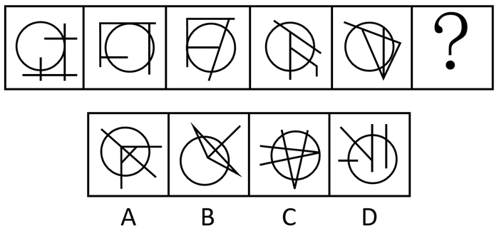

- **A**. A　✅
- **B**. B
- **C**. C
- **D**. D

**答案**：A

**官方解析**

元素组成不同，且无明显属性规律，优先考虑数量规律。观察发现，题干图形均有圆，并且线条将圆明显分割成多个面，故考虑圆内面数量。题干图形圆内面数量从左到右依次为1、2、3、4、5，故“？”处圆内面数量应为6，A项圆内面数量为6，B项圆内面数量为5，C项圆内面数量为9，D项圆内面数量为2，只有A项符合规律。
故正确答案为A。

---

## 第 2 题　qid 2741623 · 图形推理

从所给的四个选项中，选择最合适的一个填入问号处，使之呈现一定的规律性：

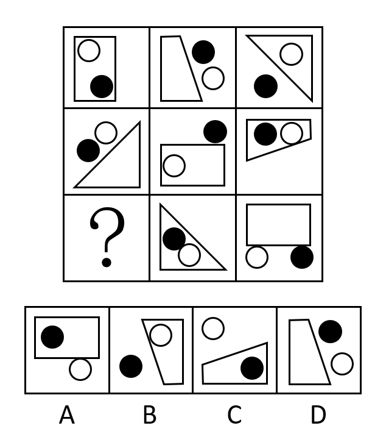

- **A**. A
- **B**. B　✅
- **C**. C
- **D**. D

**答案**：B

**官方解析**

元素组成相似，优先考虑样式规律。九宫格优先看横行，观察发现，第一行，由长方形、梯形、三角形和黑白点组成，且每行黑白点的位置有三种，都在图形内、都在图形外、白点在图形内黑点在图形外；第二行验证符合此规律；第三行应用此规律，后两幅图形出现了三角形和长方形，则“？”处应有梯形，排除A项；继续观察，后两幅图的黑白点位置分别为都在图形内、都在图形外，则“？”处白点应在图形内黑点应在图形外，排除C、D两项。

故正确答案为B。

---

## 第 3 题　qid 2741626 · 图形推理

左图为给定的立体图形，将其从任一面剖开，右边哪一项不可能是该立体图形的截面？

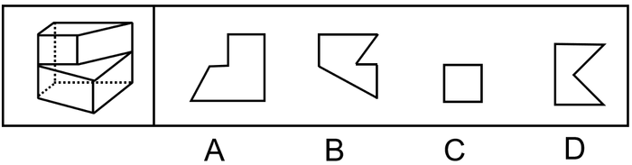

- **A**. A
- **B**. B
- **C**. C
- **D**. D　✅

**答案**：D

**官方解析**

A项：如图所示可切出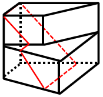，排除；

B项：如图所示可切出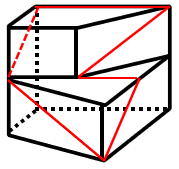，排除；

C项：如图所示可切出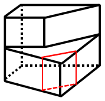，排除；

D项：无法切出，当选。

本题为选非题，故正确答案为D。

---

## 第 4 题　qid 2741630 · 图形推理

左图是给定的立体图形，下面选项哪个是该立体图形的外表面展开图？

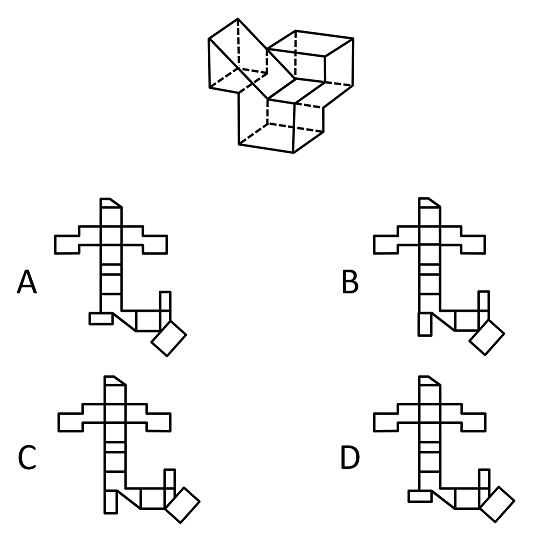

- **A**. A
- **B**. B
- **C**. C　✅
- **D**. D

**答案**：C

**官方解析**

本题为空间重构题。观察选项，主要区别在于左下角的小矩形和右下角的矩形位置不同。

 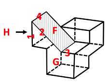

回到原图中观察G面（从正面看到的七边形面），如上图，在其面上以凸出的三角底边为起点，顺时针分别标出序号1、2、3，边3对应相邻矩形面的短边，而在A、D项中边3对应的是矩形的长边,如下图，排除A、D项；

  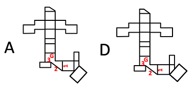

再次观察题干立体图形，边1对应的是H面（最左侧的面），H面与其相邻的较大的长矩形面F（立体图中标阴影的面）有一条等长且完全重合的公共边4，对比B、C项，C选项中两个面的公共边等长且完全重合，而B选项中两个面的公共边不完全重合，排除B项。

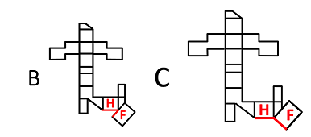 

故正确答案为C。

---

## 第 5 题　qid 2741632 · 图形推理

把下面的六个图形分为两类，使每一类图形都有各自的共同特征或规律，分类正确的一项是：

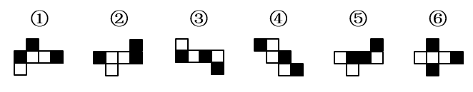

- **A**. ①③④，②⑤⑥
- **B**. ①③⑤，②④⑥
- **C**. ①②⑤，③④⑥　✅
- **D**. ①④⑥，②③⑤

**答案**：C

**官方解析**

本题为分组分类题目。观察题干图形发现，题干图形均为正六面体展开图，且出现小黑块。继续观察图形特征发现，图①②⑤中的小黑块互为相邻面，图③④⑥中的小黑块其中两个组成一组相对面，故①②⑤分为一组，③④⑥分为一组。
故正确答案为C。

---

## 第 6 题　qid 2741726 · 定义判断

见微知著是指见到一点儿苗头，就能知道它的发展趋向或问题的实质。下列最能体现见微知著的是：

- **A**. 见一叶落而知秋之将至。　✅
- **B**. 千里之堤，毁于蚁穴。
- **C**. 岁寒，然后知松柏之后凋也。
- **D**. 路遥知马力，日久见人心。

**答案**：A

**官方解析**

第一步：找出定义关键词。
“见到一点儿苗头”、“知道它的发展趋向或问题的实质”。
第二步：逐一分析选项。
A项：意思是从一片树叶的凋落，知道秋天的到来，符合“见到一点儿苗头”、“知道它的发展趋向或问题的实质”，符合定义，当选；
B项：意思是千里长的大堤，往往因蚂蚁（白蚁）洞穴而崩溃，不符合“见到一点儿苗头”、“知道它的发展趋向或问题的实质”，不符合定义，排除；
C项：意思是到了每年天气最冷的时候，就知道其他植物都凋零，只有松柏挺拔、不落，不符合“见到一点儿苗头”、“知道它的发展趋向或问题的实质”，不符合定义，排除；
D项：意思是路途遥远，才可以知道马的力气的大小，不符合“见到一点儿苗头”、“知道它的发展趋向或问题的实质”，不符合定义，排除。
故正确答案为A。

---

## 第 7 题　qid 2741729 · 定义判断

一个论证是一组陈述，其中的一个或多个陈述（即前提）被用来为另外一个陈述（即结论）提供支持的理由。
根据上述定义，下列属于论证的是：

- **A**. 食物的基因改造存在风险。基因改造过程中，会把意料之外的改变引入到为人类提供食物的生物DNA中，这些改变对于消费者来说可能是有害的。　✅
- **B**. 我们相信我们的公司能为我们的客户提供最好的产品，我们相信我们的产品一定比我们竞争对手的好。
- **C**. 1648~1789年是欧洲主要君主国之间激烈竞争的年代之一，强国之间战争频繁，期间法国成为最重要的国家，在权力之间的平衡阻止了法国的扩张。
- **D**. 不管位置如何，固体都保持各自的形状和体积，液体则占有一定的体积，但其形状与盛装容器的形状有关。

**答案**：A

**官方解析**

第一步：找出定义关键词。
“一组陈述，其中的一个或多个陈述（即前提）”、“被用来为另外一个陈述（即结论）提供支持的理由”。
第二步：逐一分析选项。
A项：基因改造过程中意料之外的改变可能对消费者有害，此前提可用来证明食物的基因改造存在风险，符合“一组陈述，其中的一个或多个陈述（即前提）”，也符合“被用来为另外一个陈述（即结论）提供支持的理由”，符合定义，当选；
B项：相信我们的公司能为我们的客户提供最好的产品，相信我们的产品比竞争对手的好，两个陈述互相无法提供支持，不符合“被用来为另外一个陈述（即结论）提供支持的理由”，不符合定义，排除；
C项：该项中关于1648~1789年间的历史只是对客观事实的陈述，几个陈述句中不存在结论句，不符合“被用来为另外一个陈述（即结论）提供支持的理由”，不符合定义，排除；
D项：固体保持自己的形状，液体占有一定体积，陈述之间无法互相支持，不符合“被用来为另外一个陈述（即结论）提供支持的理由”，不符合定义，排除。
故正确答案为A。

---

## 第 8 题　qid 2741732 · 定义判断

衬托是为了突出主要事物，用类似的事物或反面的、有差别的事物作陪衬的一种修辞方法。对比是指用相反或相似的两种事物互相比照，以共同表现某种思想或意境的一种修辞方法。二者的区别在于衬托是以次要事物为陪衬来突出主要事物，而对比中体现的两种事物不分主次。
根据上述定义，下列同时使用了上述两种修辞方法的是：

- **A**. 朱门酒肉臭，路有冻死骨。
- **B**. 桃花潭水深千尺，不及汪伦送我情。
- **C**. 蝉噪林逾静，鸟鸣山更幽。　✅
- **D**. 千里黄云白日曛，北风吹雁雪纷纷。

**答案**：C

**官方解析**

第一步：找出定义关键词。
衬托：“用类似的事物或反面的、有差别的事物作陪衬”、“次要事物为陪衬来突出主要事物”；
对比：“相反或相似的两种事物互相比照”、“共同表现某种思想或意境”、“两种事物不分主次”。
第二步：逐一分析选项。
A项：“朱门酒肉臭，路有冻死骨”的意思是富贵人家门前飘出酒肉的味道，穷人们却在街头因冻饿而死，将封建统治集团的穷奢极欲、醉生梦死，与劳动人民的被奴役、被掠夺、冻死路旁的悲惨状况作了鲜明的对照，符合“相反或相似的两种事物互相比照”，也符合“两种事物不分主次”，符合“对比”的定义，不符合“衬托”的定义，排除；
B项：“桃花潭水深千尺，不及汪伦送我情”的意思是桃花潭水即使深至千尺，也比不上汪伦送我之情，用桃花潭的水深“衬托”出作者与汪伦的友情更深，有主有次，符合“衬托”的定义，但不符合“对比”的定义，排除；
C项：“蝉噪林逾静，鸟鸣山更幽”的意思是蝉噪阵阵，林间愈见寂静，鸟鸣声声，山中更觉幽深。静为主，动为次，运用以动显静的手法来渲染山林的幽静，使用了“衬托”的手法；将蝉鸣与鸟鸣、林静与山幽这些相似的事物进行对照，不分主次，使用了“对比”的手法，同时满足“衬托”和“对比”两种修辞手法，当选；
D项：“千里黄云白日曛，北风吹雁雪纷纷”的意思是千里黄云遮天蔽日，天气阴沉，北风送走雁群又吹来纷扬大雪，使用了夸张的手法，不符合“衬托”的定义，也不符合“对比”的定义，排除。
故正确答案为C。

---

## 第 9 题　qid 2741737 · 定义判断

类比论证是根据两个对象在某些属性上的相同或相似，推论两者在其他属性上也有相同或相似。其逻辑形式为：对象A具有a、b、c、d的属性。对象B具有a、b、c的属性。所以对象B具有d的属性。
根据上述定义，下列属于类比论证的是：

- **A**. 陶渊明不为五斗米折腰，李白不摧眉折腰事权贵······这说明有志气的人都不以高官厚禄为荣。
- **B**. 光和声都具有直线传播、折射、反射等现象，所以光和声一样，也具有波动性。　✅
- **C**. 与一些工作不负责任、拈轻怕重的人相比，白求恩同志对工作极端负责，对同志、对人民极端热情，这说明白求恩同志具有毫不利己，专门利人的伟大精神。
- **D**. 银与铜都是金属，都具有导电性，但是银的电阻率更低，因此银比铜更适宜做导电材料。

**答案**：B

**官方解析**

第一步：找出定义关键词。
“根据两个对象在某些属性上的相同或相似”、“推论两者在其他属性上也有相同或相似”。
第二步：逐一分析选项。
A项：该项说的是二人都有志气，但没有体现出二人在其他方面也有共性，不符合“根据两个对象在某些属性上的相同或相似”、“推论两者在其他属性上也有相同或相似”，不符合定义，排除；
B项：该项根据光和声都具有直线传播、折射、反射等现象，推出光和声一样，也具有波动性，符合“根据两个对象在某些属性上的相同或相似”、“推论两者在其他属性上也有相同或相似”，符合定义，当选；
C项：该项说的是白求恩与不负责任的人有什么区别，而不是共性，不符合“根据两个对象在某些属性上的相同或相似”，不符合定义，排除；
D项：该项根据银和铜电阻率的区别，得出银更适宜做导电材料，是根据二者的区别，得出谁更适合，不符合“根据两个对象在某些属性上的相同或相似”、“推论两者在其他属性上也有相同或相似”，不符合定义，排除。
故正确答案为B。

---

## 第 10 题　qid 2741740 · 定义判断

比例原则是指行政机关实施行政行为应兼顾行政目标的实现和适当性手段的选择，保障公共利益和相对人权益的均衡，如为实现行政目标可能对相对人权益造成某种不利影响时，应将这种不利影响限制在尽可能小的范围和限度内，保持二者处于适度的比例。
根据上述定义，行政机关的下列行为最符合比例原则的是：

- **A**. 夫妻二人在家中发生口角，吵闹声较大，公安机关以扰乱公共秩序为由对二人处以罚款500元的处罚。
- **B**. 交通运输局交通执法员黄某在查处车辆超载的过程中，殴打超载冲卡企图逃逸的司机。
- **C**. 规划局批准某公司建造九层商业楼，该公司私自加盖至十二层，规划局认定为违章建筑，要求其把楼房全部拆除。
- **D**. 市政府计划建设化工项目，论证后认为该项目会对附近的国家级风景区和居民生活区造成严重污染，遂将该项目叫停。　✅

**答案**：D

**官方解析**

第一步：找出定义关键词。
“行政机关实施行政行为”、“兼顾行政目标的实现和适当性手段的选择”、“保障公共利益和相对人权益的均衡”。
第二步：逐一分析选项。
A项：公安机关对在家发生口角的夫妻以扰乱公共秩序为由处罚500元，该处罚相对较重，不符合“兼顾行政目标的实现和适当性手段的选择”、“保障公共利益和相对人权益的均衡”，不符合定义，排除；
B项：执法员黄某殴打超载冲卡企图逃逸的司机，不属于正常的执法方式，不符合“兼顾行政目标的实现和适当性手段的选择”、“保障公共利益和相对人权益的均衡”，不符合定义，排除；
C项：该公司加盖的部分楼层属于违章建筑，但要求拆除的是整栋楼房，不符合“兼顾行政目标的实现和适当性手段的选择”、“保障公共利益和相对人权益的均衡”，不符合定义，排除；
D项：市政府叫停会造成严重污染的化工项目，符合“兼顾行政目标的实现和适当性手段的选择”、“保障公共利益和相对人权益的均衡”，符合定义，当选。
故正确答案为D。

---

## 第 11 题　qid 2741617 · 类比推理

桂：广西

- **A**. 皖：江西
- **B**. 杜鹃花：映山红　✅
- **C**. 河流：湖泊
- **D**. 西红柿：圣女果

**答案**：B

**官方解析**

第一步：判断题干词语间逻辑关系。
桂是广西的简称，二者为全同关系。
第二步：判断选项词语间逻辑关系。
A项：皖是安徽的简称，与江西不是全同关系，与题干逻辑关系不一致，排除；
B项：映山红是杜鹃花的别名，二者为全同关系，与题干逻辑关系一致，当选；
C项：河流与湖泊是两种不同的水体，二者为并列关系，与题干逻辑关系不一致，排除；
D项：圣女果指小西红柿，是西红柿的一种，二者为种属关系，与题干逻辑关系不一致，排除。
故正确答案为B。

---

## 第 12 题　qid 2741619 · 类比推理

水生动物：卵生动物

- **A**. 腔肠动物：软体动物
- **B**. 甲壳纲动物：节肢动物
- **C**. 飞行动物：哺乳动物　✅
- **D**. 脊椎动物：无脊椎动物

**答案**：C

**官方解析**

第一步：判断题干词语间逻辑关系。
有的水生动物是卵生动物，有的水生动物不是卵生动物，有的卵生动物是水生动物，有的卵生动物不是水生动物，二者为交叉关系。
第二步：判断选项词语间逻辑关系。
A项：腔肠动物和软体动物都是无脊椎动物的一种，二者为并列关系，与题干逻辑关系不一致，排除；
B项：甲壳纲动物是节肢动物门中的一个亚门，故甲壳纲动物是节肢动物的一种，二者为种属关系，与题干逻辑关系不一致，排除；
C项：有的飞行动物是哺乳动物，有的飞行动物不是哺乳动物，有的哺乳动物是飞行动物，有的哺乳动物不是飞行动物，二者为交叉关系，与题干逻辑关系一致，当选；
D项：脊椎动物是指有脊椎骨的动物，无脊椎动物是背侧没有脊椎骨的动物，二者为并列关系，与题干逻辑关系不一致，排除。
故正确答案为C。

---

## 第 13 题　qid 2741622 · 类比推理

诗：赋：词

- **A**. 纸：丝绸：竹简
- **B**. 昆曲：戏剧：京剧
- **C**. 油画：水墨画：工笔画
- **D**. 甲骨文：隶书：楷书　✅

**答案**：D

**官方解析**

第一步：判断题干词语间逻辑关系。
诗、赋、词均属于中国传统文学体裁，三者为并列关系，且三者出现顺序从早到晚。
第二步：判断选项词语间逻辑关系。
A项：纸、丝绸和竹简是我国古今文字的载体，但纸的发明时间晚于丝绸和竹简，与题干逻辑关系不一致，排除；
B项：昆曲又称昆剧，与京剧是并列关系；昆曲和京剧都属于我国戏剧的剧种，二者与戏剧是种属关系，与题干逻辑关系不一致，排除；
C项：油画是以快干性的植物油为颜料作画的画种，水墨画即中国画，是由水和墨调配成墨色作画的画种，二者为并列关系；工笔画是工整细致的一类画法，水墨、浅绛、青绿、金碧、界画等艺术形式均可表现工笔画，因此工笔画和水墨画是交叉关系，与题干逻辑关系不一致，排除；
D项：甲骨文、隶书和楷书均属于中国古代文字形体，三者为并列关系，且三者出现顺序从早到晚，与题干逻辑关系一致，当选。
故正确答案为D。

---

## 第 14 题　qid 2741625 · 类比推理

油田：钻探：石油

- **A**. 房产：交易：证书
- **B**. 车站：驾驶：乘客
- **C**. 渔场：捕捞：海鲜　✅
- **D**. 灯塔：搭建：轮船

**答案**：C

**官方解析**

第一步：判断题干词语间逻辑关系。
钻探与石油构成动宾关系，油田是钻探石油的场所，油田与钻探石油构成场所对应关系。
第二步：判断选项词语间逻辑关系。
A项：房产交易证书，证书是房产进行交易的凭证，与题干逻辑关系不一致，排除；
B项：驾驶与乘客不构成动宾关系，与题干逻辑关系不一致，排除；
C项：捕捞与海鲜构成动宾关系，渔场是捕捞海鲜的场所，渔场与捕捞海鲜构成场所对应关系，与题干逻辑关系一致，当选；
D项：搭建轮船构成动宾关系，但灯塔不是搭建轮船的场所，与题干逻辑关系不一致，排除。
故正确答案为C。

---

## 第 15 题　qid 2741629 · 类比推理

铁：铜：镁

- **A**. 棒球：排球：台球　✅
- **B**. 高跟鞋：高帮鞋：增高鞋
- **C**. 高筋粉：米粉：面粉
- **D**. 羊肉：牛肉：腊肉

**答案**：A

**官方解析**

第一步：判断题干词语间逻辑关系。
铁、铜、镁是三种金属元素，三者是并列关系中的反对关系。
第二步：判断选项词语间逻辑关系。
A项：棒球、排球、台球是三种运动，三者是并列关系中的反对关系，与题干逻辑关系一致，当选；
B项：有的增高鞋是高帮鞋，有的增高鞋不是高帮鞋，有的高帮鞋是增高鞋，有的高帮鞋不是增高鞋，二者是交叉关系，与题干逻辑关系不一致，排除；
C项：高筋粉是面粉，二者是种属关系，米粉与面粉为并列关系，与题干逻辑关系不一致，排除；
D项：羊肉和牛肉是并列关系，腊肉指肉经腌制后再经过烘烤（或日光下曝晒）的过程所制成的加工品，羊肉、牛肉是制作腊肉的原材料，与题干逻辑关系不一致，排除。
故正确答案为A。

---

## 第 16 题　qid 2741624 · 类比推理

策划：编排：直播

- **A**. 测试：上线：研发
- **B**. 育苗：移栽：收割　✅
- **C**. 学车：年检：考证
- **D**. 选房：入住：装修

**答案**：B

**官方解析**

第一步：判断题干词语间逻辑关系。
先策划，再编排，最后直播，三者为时间先后顺序的对应关系。
第二步：判断选项词语间逻辑关系。
A项：先测试后上线，但是研发应该在测试和上线之前，与题干逻辑关系不一致，排除；
B项：先育苗，再移栽，最后收割，三者为时间先后顺序的对应关系，与题干逻辑关系一致，当选；
C项：先学车后考证，但是年检一般是在考证之后，与题干逻辑关系不一致，排除；
D项：先选房，再装修，最后入住，装修应该在入住之前发生，与题干逻辑关系不一致，排除。
故正确答案为B。

---

## 第 17 题　qid 2741627 · 类比推理

老鹰：树枝：天空

- **A**. 蜜蜂：蜂箱：花丛　✅
- **B**. 蟒蛇：山涧：森林
- **C**. 蚊子：沟渠：野外
- **D**. 鲈鱼：江河：海洋

**答案**：A

**官方解析**

第一步：判断题干词语间逻辑关系。
老鹰在树枝上休息，老鹰在天空中飞翔，前后均是动物与地点的对应关系，并且第二个词是休息状态对应的地点，第三个词是忙碌状态对应的地点。
第二步：判断选项词语间逻辑关系。
A项：蜜蜂在蜂箱中休息，蜜蜂在花丛中飞翔，前后均是动物与地点的对应关系，并且第二个词是休息状态对应的地点，第三个词是忙碌状态对应的地点，与题干逻辑关系一致，当选；
B项：蟒蛇与山涧和森林也均能组成动物与地点的对应关系，但是在这两个地点中，蟒蛇没有明显的休息和忙碌的两种状态区分，与题干逻辑关系不一致，排除；
C项：蚊子与沟渠和野外也均能组成动物与地点的对应关系，但是在这两个地点中，蚊子没有明显的休息和忙碌的两种状态区分，与题干逻辑关系不一致，排除；
D项：鲈鱼与江河和海洋也均能组成动物与地点的对应关系，但是在这两个地点中，鲈鱼没有明显的休息和忙碌的两种状态区分，与题干逻辑关系不一致，排除。
故正确答案为A。

---

## 第 18 题　qid 2741631 · 类比推理

粘土：陶瓷杯：器具

- **A**. 门窗：房屋：财产
- **B**. 蚕丝：旗袍：服饰　✅
- **C**. 纸张：扉页：图书
- **D**. 牛肉：肉馅：饺子

**答案**：B

**官方解析**

第一步：判断题干词语间逻辑关系。
粘土是制作陶瓷杯的原材料，二者为原材料的对应关系；陶瓷杯是一种器具，二者为种属关系。
第二步：判断选项词语间逻辑关系。
A项：门窗是房屋的组成部分，二者为组成关系，与题干逻辑关系不一致，排除；
B项：蚕丝是制作旗袍的原材料，二者为原材料的对应关系；旗袍是一种服饰，二者为种属关系，与题干逻辑关系一致，当选；
C项：纸张是制作图书的原材料，二者为原材料的对应关系；扉页是图书的组成部分，二者为组成关系，与题干逻辑关系不一致，排除；
D项：牛肉是制作肉馅的原材料，二者为原材料的对应关系；肉馅是饺子的组成部分，二者为组成关系，与题干逻辑关系不一致，排除。
故正确答案为B。

---

## 第 19 题　qid 2741633 · 类比推理

天然气：气体：燃料

- **A**. 读后感：感想：散文
- **B**. 量角器：圆规：文具
- **C**. 金银花：花卉：中药　✅
- **D**. 互联网：网络：网站

**答案**：C

**官方解析**

第一步：判断题干词语间逻辑关系。
天然气是一种气体，故天然气与气体为种属关系；天然气是一种燃料，故天然气与燃料为种属关系；有的气体是燃料，有的气体不是燃料，有的燃料是气体，有的燃料不是气体，故气体和燃料为交叉关系。
第二步：判断选项词语间逻辑关系。
A项：读后感是感想的一种，二者为种属关系，但是有的读后感是散文，有的读后感不是散文，有的散文是读后感，有的散文不是读后感，故读后感和散文是交叉关系，与题干逻辑关系不一致，排除；
B项：量角器与圆规都是文具的一种，故量角器与圆规为并列关系，量角器与文具为种属关系，圆规与文具也为种属关系，与题干逻辑关系不一致，排除；
C项：金银花是一种花卉，故金银花与花卉为种属关系；金银花是一种中药，故金银花与中药为种属关系；有的花卉是中药，有的花卉不是中药，有的中药是花卉，有的中药不是花卉，故花卉和中药为交叉关系，与题干逻辑关系一致，当选；
D项：互联网是网络的一种，构成种属关系，但是互联网和网站之间并无此关系，与题干逻辑关系不一致，排除。
故正确答案为C。

---

## 第 20 题　qid 2741636 · 类比推理

食品：蔬菜：绿色食品

- **A**. 电影：历史片：科幻片
- **B**. 中国：海口市：海南省
- **C**. 地图：交通图：单色地图　✅
- **D**. 孔雀：绿孔雀：蓝孔雀

**答案**：C

**官方解析**

第一步：判断题干词语间逻辑关系。
蔬菜是食品的一种，二者为种属关系；绿色食品是指产自优良生态环境、按照绿色食品标准生产、实行全程质量控制并获得绿色食品标志使用权的安全、优质食用农产品及相关产品，绿色食品是食品的一种，二者为种属关系；有的蔬菜是绿色食品，有的蔬菜不是绿色食品，有的绿色食品是蔬菜，有的绿色食品不是蔬菜，二者为交叉关系。
第二步：判断选项词语间逻辑关系。
A项：有的电影是历史片，有的电影不是历史片，有的历史片是电影，有的历史片不是电影，二者为交叉关系，与题干逻辑关系不一致，排除；
B项：海口市是海南省的省会，是海南省的组成部分，二者为组成关系；海南省是中国的一个省份，是中国的组成部分，二者为组成关系，与题干逻辑关系不一致，排除；
C项：交通图是地图的一种，二者为种属关系；单色地图是地图的一种，二者为种属关系；有的交通图是单色地图，有的交通图不是单色地图，有的单色地图是交通图，有的单色地图不是交通图，二者为交叉关系，与题干逻辑关系一致，当选；
D项：孔雀从颜色可以分成三种，分别是蓝孔雀、绿孔雀和变种白孔雀，绿孔雀和蓝孔雀都是孔雀的一种，二者为并列关系，与题干逻辑关系不一致，排除。
故正确答案为C。

---

## 第 21 题　qid 2741733 · 逻辑判断

运动会长跑成绩公布后，小张说：“我的排名在前五名，小夏的名次不好，小王是最后过终点的。”小夏说：“我的长跑成绩一直都在这个水平，我紧跟着小王的后面跑过终点。”小王说：“小张和小夏的成绩都比我好。”三个人中最多一个人说假话。
据此，可以推出：

- **A**. 小张说了假话
- **B**. 小夏说了假话　✅
- **C**. 小王说了假话
- **D**. 三人都没说假话

**答案**：B

**官方解析**

第一步：找关系。
小张：我的排名在前五名，小夏的名次不好，小王是最后过终点的；
小夏：我的长跑成绩一直都在这个水平，我紧跟着小王的后面跑过终点；
小王：小张和小夏的成绩都比我好；
小张和小夏说的话不可能同时为真，根据题干“三个人中最多一个人说假话”可知，小张和小夏说的话为一真一假。
第二步：看其余。
根据小张和小夏说的话一真一假可知，小王说的“小张和小夏的成绩都比我好”为真，即小张和小夏在小王的前面过终点，所以小夏所说“我紧跟着小王的后面跑过终点”为假话。
故正确答案为B。

---

## 第 22 题　qid 2741735 · 逻辑判断

不用“管住嘴，迈开腿”就能成功瘦身，大概是很多人的梦想。然而一边吃的很饱一边掉体重却成了宇航员们的噩梦，因为这会使宇航员损失骨骼和肌肉，还会影响心血管系统的正常运作。宇航员总是表示已经吃饱了，然而与此同时，他们的体重却减轻了，为什么宇航员摄入的食物不够？一位航空研究所人员提出，这是因为食物在失重环境下不会像地球上一样老实待在胃里，它们在胃里漂动，撑开胃部，会更快给大脑送去“你已经吃饱了，别再吃了”的信号。
以下哪项如果为真，最能驳斥这个研究员的解释？

- **A**. 宇航员必须坚持每周六天的高强度锻炼，否则低重力环境会让肌肉萎缩，但这也意味着他们会消耗更多的热量
- **B**. 吃饭习惯于细嚼慢咽的人，通常在摄入过多的食物之前，大脑就会接受到饱胀感，从而减低食欲，避免进食过多
- **C**. 实验证明，在失重情况下，胃壁本身的张力并不会受到太大影响，胃的内部压力也没有太大变化　✅
- **D**. 太空食物通常不需要太多咀嚼，研究显示，咀嚼次数越多，口腔活动会刺激体内消化和吸收活动更加活跃，热量消耗也越多

**答案**：C

**官方解析**

第一步：找出论点和论据。
论点：因为食物在失重环境下不会像地球上一样老实待在胃里，它们在胃里漂动，撑开胃部，会更快给大脑送去“你已经吃饱了，别再吃了”的信号。
论据：无。
本题只有论点，没有论据，优先考虑否定论点进行削弱，即食物在失重环境下不会在胃里漂动，撑开胃部，给大脑送去“你已经吃饱了，别再吃了”的信号。
第二步：逐一分析选项。
A项：该项讨论的是宇航员必须坚持高强度锻炼，也因此消耗更多的热量，而论点讨论的是食物在失重环境下在胃里漂动，撑开胃部，给大脑送去“你已经吃饱了，别再吃了”的信号，坚持锻炼消耗热量与食物在失重环境下在胃里的情况无关，二者话题不一致，无法削弱，排除；
B项：该项讨论的是吃饭细嚼慢咽的人容易产生饱胀感，从而减低食欲，避免进食过多，而论点讨论的是食物在失重环境下在胃里漂动，撑开胃部，给大脑送去“你已经吃饱了，别再吃了”的信号，细嚼慢咽减低食欲与食物在失重环境下在胃里的情况无关，二者话题不一致，无法削弱，排除；
C项：该项说明在失重情况下，胃壁本身的张力并不会受到太大影响，胃的内部压力也没有太大变化，即食物在失重环境下不会在胃里漂动，撑开胃部，否定论点，可以削弱，当选；
D项：该项讨论的是咀嚼次数越多，热量消耗也越多，而论点讨论的是食物在失重环境下在胃里漂动，撑开胃部，给大脑送去“你已经吃饱了，别再吃了”的信号，二者话题不一致，无法削弱，排除。
故正确答案为C。

---

## 第 23 题　qid 2741739 · 逻辑判断

环境与生活方式能使基因表达发生改变，但不涉及DNA序列的变化，研究人员发现，喝茶也能让人发生这种变化，但其作用仅限于女性。研究结果显示，经常喝茶的女性的确也出现了基因表达改变的现象，并且不少变异的基因与癌症和雌激素水平有关。
以下哪项如果为真，最能支持上述结论？

- **A**. 不饮茶的女性较少出现基因表达改变的情况　✅
- **B**. 女性经常喝茶能减少炎症的发生
- **C**. 常饮茶和常饮咖啡的女性雌激素水平有较大差异
- **D**. 女性和男性体内含有的激素水平不同

**答案**：A

**官方解析**

第一步：找出论点和论据。
论点：喝茶也能让人基因表达发生改变，但其作用仅限于女性。
论据：经常喝茶的女性的确也出现了基因表达改变的现象，并且不少变异的基因与癌症和雌激素水平有关。
本题的论点是说喝茶会使女性的基因表达发生改变，论据是说经常喝茶的女性发生基因表达改变的现象，且不少变异的基因与癌症和雌激素水平有关。论点和论据均在讨论女性喝茶与基因表达改变的关系，话题一致，加强优先考虑补充论据，即解释原因和举例子。
第二步：逐一分析选项。
A项：该项指出不饮茶的女性较少出现基因表达改变的情况，补充了反面论证，补充论据，可以加强，当选；
B项：该项指出女性经常喝茶能减少炎症的发生，但减少炎症与基因表达改变无关，话题不一致，无法加强，排除；
C项：该项指出经常饮茶和饮咖啡的女性雌激素水平有较大差异，但题干并没有比较饮茶和饮咖啡的关系，话题不一致，无法加强，排除；
D项：该项指出女性和男性体内含有的激素水平不同，题干并没有比较女性和男性激素水平的差异，话题不一致，无法加强，排除。
故正确答案为A。

---

## 第 24 题　qid 2741741 · 逻辑判断

某国针对本国本科毕业生的调查数据显示，该国的大多数本科毕业生为工学类，也有一部分本科毕业生为人文社科类，在这些毕业生中，大多数在毕业时就已经就业，只有少部分未就业。
由此一定可以推出的是：

- **A**. 大多数工学类本科毕业生在毕业时已就业
- **B**. 有些人文社科类本科毕业生在毕业时未就业
- **C**. 有些工学类本科毕业生在毕业时已就业　✅
- **D**. 有些人文社科类毕业生在毕业时已就业

**答案**：C

**官方解析**

第一步：翻译题干。
①大多数（＞50％）本科毕业生是工学类；
②一部分本科毕业生是人文社科类；
③大多数（＞50％）本科毕业生在毕业时已经就业；
④少部分本科毕业生在毕业时未就业。
（注：逻辑上“大多数”的含义是大于50％）
第二步：逐一分析选项。
A项：涉及到“工学类”和“已就业”的是条件①和③，通过“大多数A是B，大多数A是C”可以得到“有的B是C”，结合条件①和③，可以得到“有的工学类毕业生在毕业时已经就业”，但是因为“有的”无法推出“大多数”，所以无法通过“有的工学类毕业生在毕业时已经就业”得到“大多数工学类毕业生在毕业时已经就业”，所以该项无法推出，排除；
B项：涉及到“人文社科类”和“未就业”的是条件②和④，通过“有的A是B，有的A是C”无法得到“有的B是C”，所以该项无法推出，排除；
C项：涉及到“工学类”和“已就业”的是条件①和③，通过“大多数A是B，大多数A是C”可以得到“有的B是C”，结合条件①和③，可以得到“有的工学类毕业生在毕业时已经就业”，可以推出，当选。
D项：涉及到“人文社科类”和“已就业”的是条件②和③，因为“大多数”可以推出“有的”，所以条件③可以推出“有的本科毕业生在毕业时已经就业”，通过“有的A是B，有的A是C”无法得到“有的B是C”，所以该项无法推出，排除。
故正确答案为C。

---

## 第 25 题　qid 2741743 · 逻辑判断

日常生活中，摄像头几乎与我们如影随形。不同部门、单位甚至个人都安装了摄像头，出现了人们所到之处几乎处处都有摄像头的乱象。有专家指出，“摄像头乱象”的出现，主要原因是与视频监控系统管理相关的法律法规不健全、不完善，体现在使用主体的权限、设备的规格、监控人员的资质及素质要求、监控资料及数据的复制、传播等方面。因此，完善与视频监控系统管理相关的法律法规即可以解决“摄像头乱象”。
以下哪项如果为真，最能削弱上述结论？

- **A**. 在使用和管理方面，还存在视频监控资料未经合法程序即被复制、传播的现象
- **B**. 在解决其他社会问题上，法律法规的完善并没有起到立竿见影的作用
- **C**. 一些人对公共空间和个人空间的认识不清也是“摄像头乱象”产生的原因　✅
- **D**. 视频监控系统的技术标准在行业内部已基本达成共识

**答案**：C

**官方解析**

第一步：找出论点和论据。
论点：完善与视频监控系统管理相关的法律法规即可以解决“摄像头乱象”。
论据：“摄像头乱象”的出现，主要原因是与视频监控系统管理相关的法律法规不健全、不完善，体现在使用主体的权限、设备的规格、监控人员的资质及素质要求、监控资料及数据的复制、传播等方面。
本题的论点和论据都在讨论“摄像头乱象”和相关法律法规之间的关系，二者话题一致，优先考虑削弱论点，即完善与视频监控系统管理相关的法律法规不能解决“摄像头乱象”。
第二步：逐一分析选项。
A项：该项指出存在视频监控资料未经合法程序被复制、传播的现象，这与论点讨论的是否可以解决“摄像头乱象”无关，排除；
B项：该项指出在解决其他社会问题上，完善法律法规不能起到立竿见影的作用，而论点说的是“摄像头乱象”的问题，话题不一致，无法削弱，排除；
C项：该项指出一些人对公共空间和个人空间的认识不清也是“摄像头乱象”产生的原因，但完善相关法律法规不能解决“对公共空间和个人空间的认识不清”这一问题，证明了即使完善相关的法律法规也不能彻底解决“摄像头乱象”的问题，削弱论点，当选；
D项：该项指出视频监控系统的技术标准在行业内部已基本达成共识，但论点说的是完善相关法律法规是否能解决“摄像头乱象”的问题，话题不一致，无法削弱，排除。
故正确答案为C。

---

## 第 26 题　qid 2741725 · 逻辑判断

F、G、H、J四个人是大学同学，他们都参加了研究生考试，但最后只有一个人考上了研究生。而其余三人分别成为了作曲家、高中老师和公务员。在研究生考试复习期间，有一天他们坐在一起预测大家将来的生活，F说：G肯定不会成为作曲家；G说：H肯定可以考上研究生；H说：J不会成为公务员；J预测他自己将来会娶一名外国妻子。可是他们的预测中只有一个是正确的，且预测正确的那个人考上了研究生。
据此可以推断出以下哪项是错误的？

- **A**. J并未娶外国人为妻
- **B**. F考上了研究生
- **C**. G成为了高中老师
- **D**. H成为了公务员　✅

**答案**：D

**官方解析**

第一步：分析题干条件。
F：G肯定不会成为作曲家；
G：H肯定可以考上研究生；
H：J不会成为公务员；
J：J将来会娶一名外国妻子。
第二步：根据题干条件进行推理。
条件为“他们的预测中只有一个是正确的，且预测正确的那个人考上了研究生”，所以先从研究生入手。“H肯定可以考上研究生”涉及研究生，假设“H肯定可以考上研究生”为真，则与“预测正确的那个人考上了研究生”矛盾，所以H没有考上研究生，即G的预测是错误的，则G也没有考上研究生，那么H的预测也是错误的，所以J成为了公务员。因此，考上研究生的是F，则F的预测是正确的，G、H、J的预测均是错误的，即G不是作曲家，J是公务员，J没有娶外国妻子，可以推出G是高中老师，H是作曲家，即A、B、C三项均正确，D项错误。
本题为选非题，故正确答案为D。

---

## 第 27 题　qid 2578997 · 逻辑判断

研究人员对1728名抑郁症患者以及7199名非抑郁症患者进行了检查，结果显示，在这些抑郁症患者中，有65%的人患有复发性抑郁症。研究发现，患有复发性抑郁症的患者大脑中的海马体明显小很多。研究人员据此得出结论，海马体缩小是复发性抑郁症的原因。
以下哪项如果为真，最能削弱上述结论？

- **A**. 轻度抑郁症患者的海马体未出现缩小的现象
- **B**. 存在认知障碍的中老年人的海马体也会缩小
- **C**. 复发性抑郁症患者普遍伴有注意力不集中的现象
- **D**. 社交越少，患精神类疾病时间越长，其海马体萎缩越严重　✅

**答案**：D

**官方解析**

第一步：找出论点和论据。
论点：海马体缩小是复发性抑郁症的原因。
论据：患有复发性抑郁症的患者大脑中的海马体明显小很多。
本题论点和论据都是在讨论“海马体大小”与“复发性抑郁症”之间的关系，论点和论据话题一致，且论点中存在因果关系，削弱优先考虑因果倒置和他因削弱。
第二步：逐一分析选项。
A项：该项说明“轻度抑郁症”患者海马体的情况，而论点讨论的是“复发性抑郁症”患者海马体的情况，“轻度抑郁症”与“复发性抑郁症”并不完全一样，不明确选项，无法削弱，排除；
B项：该项说明“认知障碍”的中老年人海马体也会缩小，而论点讨论的对象是“复发性抑郁症”患者，“认知障碍”与“复发性抑郁症”并不完全一样，二者讨论的对象不一致，无法削弱，排除；
C项：该项说明复发性抑郁症患者存在一些症状，是在讨论患上复发性抑郁症后有哪些具体表现，而论点讨论的是复发性抑郁症的得病原因，二者讨论的话题不一致，无法削弱，排除；
D项：社交少、患精神疾病时间长会导致海马体萎缩，题干中复发性抑郁症是精神类疾病，所以复发性抑郁症是海马体萎缩的原因，将论点中的因果关系进行了颠倒，因果倒置，当选。
故正确答案为D。

---

## 第 28 题　qid 2741728 · 逻辑判断

在成功的道路上，所有捷径都是弯路，所有弯路都是必经之路。因此，依附强者并不是成功道路上的捷径。
补充以下哪项作为前提，可以使上述结论成立？

- **A**. 所有捷径都是必经之路
- **B**. 依附强者不是必经之路　✅
- **C**. 所有弯路都不是捷径
- **D**. 依附强者都是弯路

**答案**：B

**官方解析**

第一步：找出论点和论据。

论点：依附强者并不是成功道路上的捷径。

论据：在成功的道路上，所有捷径都是弯路，所有弯路都是必经之路。

本题的论点可翻译为“依附强者捷径”，论据可翻译为“捷径弯路，弯路必经之路”，即“捷径弯路必经之路”，要想使上述结论成立，可以在“依附强者与弯路”或“依附强者与必经之路”之间建立联系来进行搭桥。

第二步：逐一分析选项。

A项：论点讨论的是依附强者并不是成功道路上的捷径，该项指出所有捷径都是必经之路，没有提及与依附强者的关系，不是结论成立的前提，排除；

B项：论点讨论的是依附强者并不是成功道路上的捷径，该项指出依附强者不是必经之路，是对论据的否后，否后推否前，可以得到“依附强者捷径”，在“依附强者与必经之路”之间建立了联系，是结论成立的前提，当选；

C项：论点讨论的是依附强者并不是成功道路上的捷径，该项指出所有弯路都不是捷径，没有提及与依附强者的关系，不是结论成立的前提，排除；

D项：论点讨论的是依附强者并不是成功道路上的捷径，该项指出依附强者都是弯路，是对论据的肯后，得不到“依附强者捷径”，不是结论成立的前提，排除。

故正确答案为B。

---

## 第 29 题　qid 2741731 · 逻辑判断

一项最新研究表明，火星表面可能包含着一种叫做高氯酸镁的有毒化合物，它在紫外线下能够摧毁细菌。在实验室里，研究人员将枯草杆菌放置在短波紫外线辐射下，其状况类似于火星表面。他们发现，在此状况下，高氯酸镁具有强杀菌性，使得枯草杆菌短短几分钟之内就失去生存能力。研究人员认为，这表明火星不适宜生命存活。
以下哪项如果为真，最能加强上述论证？

- **A**. 枯草杆菌是太空飞船中常见的细菌
- **B**. 地球自然界土壤中高氯酸镁的含量很低
- **C**. 高氯酸镁对生物体的皮肤、粘膜和上呼吸道有刺激作用，危害健康
- **D**. 火星表面的氧化铁和过氧化氢与高氯酸镁结合后杀菌性能增强十倍　✅

**答案**：D

**官方解析**

第一步：找出论点和论据。
论点：火星不适宜生命存活。
论据：火星表面可能包含着一种叫做高氯酸镁的有毒化合物，它在紫外线下能够摧毁细菌。在实验室里，研究人员将枯草杆菌放置在短波紫外线辐射下，其状况类似于火星表面。他们发现，在此状况下，高氯酸镁具有强杀菌性，使得枯草杆菌短短几分钟之内就失去生存能力。
本题论点与论据均在讨论火星因为高氯酸镁的存在而不适宜生命存活，二者话题一致，加强可以考虑补充论据。
第二步：逐一分析选项。
A项：该项描述的是太空飞船中的情况，与题干论点讨论的话题无关，无法加强，排除；
B项：该项描述的是地球上的情况，与题干论点讨论的话题无关，无法加强，排除；
C项：该项表明高氯酸镁会危害健康，但是健康与生命存活的关系不明确，是不明确选项，排除；
D项：该项表明在一定条件下高氯酸镁的杀菌性会增强，说明火星的环境确实不适宜生命的存活，补充论据，可以加强，当选。
故正确答案为D。

---

## 第 30 题　qid 2741734 · 逻辑判断

今年入夏以来，全球持续出现高温天气。对于高温天气产生的原因，一种观点认为，入夏以来，高温天气的出现是由全球气候变暖造成的。在全球气候变暖的大背景下，高温这样的灾害性天气会有增多的趋势。反对者则认为高温天气的出现并不一定是由全球气候变暖造成的，而是与大气环流特征的变化相关。大气环流特征的变化会导致多种极端天气频繁地发生，包括高温天气。
以下哪项如果为真，最能支持第一种观点？

- **A**. 全球气候变暖是由大气环流特征变化导致的
- **B**. 高温天气是暖气团控制下的温度较高的炎热天气
- **C**. 全球气候变暖通过改变大气环流特征来改变高温等极端天气事件的强度和发生频率　✅
- **D**. 气象学家们认为，造成持续高温天气的原因很复杂，既有直接原因，也有间接原因

**答案**：C

**官方解析**

第一步：找出论点和论据。
论点：本题要求支持第一种观点，先找到第一种观点，即入夏以来，高温天气的出现是由全球气候变暖造成的。
论据：在全球气候变暖的大背景下，高温这样的灾害性天气会有增多的趋势。
本题论点和论据都在强调高温天气和全球气候变暖的关系，话题一致，因此优先考虑补充论据的方式进行加强。且本题中“第一种观点”和“第二种观点”在“打架”，因此如果能反驳第二种观点，即说明大气环流特征的变化不会导致高温天气的出现，也可以起到支持第一种观点的效果。
第二步：逐一分析选项。
A项：该项说的是大气环流特征变化导致全球气候变暖，说明大气环流特征变化确实会导致高温天气的出现，而论点说的是全球气候变暖导致高温天气的出现，削弱论点，无法加强，排除；
B项：该项解释了高温天气的具体内容，与论点讨论的全球气候变暖导致高温天气的出现无关，无法加强，排除；
C项：该项说的是全球气候变暖通过改变大气环流特征来影响高温天气，解释了全球气候变暖影响高温天气的内在机理，说明全球气候变暖是导致高温天气出现的根本原因，可以加强，当选；
D项：该项说的是造成持续高温天气的原因既有直接原因，也有间接原因，但不明确全球气候变暖是否为高温天气出现的原因，无法加强，排除。
故正确答案为C。

---
