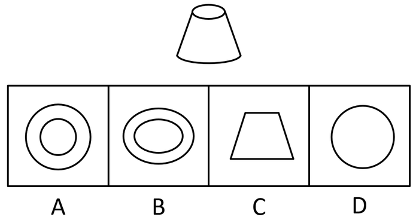
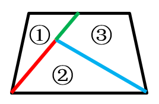

# 2021年广东省公务员录用考试《行测》题（乡镇卷）（网友回忆版）

> 判断推理 · 20 题 · 广东 2021

## 第 1 题　qid 3018848 · 图形推理

下列选项中最符合所给图形规律的是：

- **A**. A
- **B**. B　✅
- **C**. C
- **D**. D

**答案**：B

**官方解析**

图形元素组成不同，考虑属性规律。观察发现，图1、图3存在明显的等腰元素，考虑对称性。画出图形对称轴发现，题干图形的对称轴都只有一条，且竖轴和横轴交替出现，图4是横轴对称，故？处应该选择竖轴对称的图形，只有B项符合。
故正确答案为B。

---

## 第 2 题　qid 3019151 · 图形推理

下列选项中最符合所给图形规律的是：

- **A**. A
- **B**. B
- **C**. C　✅
- **D**. D

**答案**：C

**官方解析**

元素组成相似，优先考虑样式规律。观察发现，在第一组图形中，第一个图形减去第二个图形可以得到第三个图形，同理，第二组图形应该满足同样的规律，符合条件的只有C项。
故正确答案为C。

---

## 第 3 题　qid 3018855 · 图形推理

下列选项中最符合所给图形规律的是：

- **A**. A
- **B**. B
- **C**. C
- **D**. D　✅

**答案**：D

**官方解析**

图形元素组成不同，且无明显属性规律，考虑数量规律。观察发现，题干图形都有直线，考虑直线数。题干图形直线数依次为1、2、3、4，故？处图形中直线数应为5。A项直线数为6，B项为7，C项为4，只有D项符合。
故正确答案为D。

---

## 第 4 题　qid 3018856 · 图形推理

下列选项中最符合所给图形规律的是：

- **A**. A
- **B**. B
- **C**. C　✅
- **D**. D

**答案**：C

**官方解析**

观察发现，题干图形均存在灰块，且灰块数量依次递增，故？处图形中灰块数量应为6，但没有唯一答案。继续观察发现，灰块位置有明显移动，考虑灰块的位置规律。16宫格内圈灰块依次顺时针移动1格，排除A项；16宫格外圈灰块依次顺时针移动1格且在最前边增加一个灰块，排除B、D两项。

如下图所示。

故正确答案为C。

---

## 第 5 题　qid 3018878 · 图形推理

下列选项中最符合所给图形规律的是：

- **A**. A
- **B**. B
- **C**. C　✅
- **D**. D

**答案**：C

**官方解析**

本题将选项填入题干图形所缺的？处，即可拼合成一幅完整图形，故将选项顺时针旋转后与题干进行拼接。观察发现，若想与题干完整拼接，则？左上角应为黑色，右上角应为白色，只有C项符合。

故正确答案为C。

---

## 第 6 题　qid 3019152 · 定义判断

如图所示是一个圆台，则下列选项不可能属于该圆台视图的是：

- **A**. A
- **B**. B　✅
- **C**. C
- **D**. D

**答案**：B

**官方解析**

本题考查立体图形的视图问题。
A项，从上往下看，可以看到，为俯视图，排除；
B项，无法得到两个椭圆形，当选；
C项，从前往后看，可以看到，为主视图，排除；
D项，从下往上看，可以看到，为仰视图，排除。
本题为选非题，故正确答案为B。

---

## 第 7 题　qid 3019154 · 类比推理

不经过旋转，下列选项能组成所给梯形的是：

- **A**. ②③④
- **B**. ①③④
- **C**. ①②④
- **D**. ①②③　✅

**答案**：D

**官方解析**

本题考查平面拼合。观察发现梯形具有两条横线，下方长横线对应图②下方的横线，梯形上方横线对应图①与图③上方的短横线（需要拼接），故题干所给梯形可由图①②③组合得到，具体拼合方式如下图：

故正确答案为D。

---

## 第 8 题　qid 3018865 · 图形推理

下列选项中，能够折成如图所示立方体的是（    ）。

- **A**. A
- **B**. B
- **C**. C　✅
- **D**. D

**答案**：C

**官方解析**

本题考查六面体，逐一进行分析。
A项：选项中两个直角三角形的公共边为直角边，而题干中为斜边，选项与题干不一致，排除；
B项：选项中两个直角三角形无法拼合成一个完整的正方形，因此该展开图无法折叠为正方体，选项与题干不一致，排除；
C项：选项与题干一致，当选；
D项：选项中两个直角三角形的相对面不是同一个面，无法拼合成一个完整的正方形，因此该展开图无法折叠为正方体，选项与题干不一致，排除。
故正确答案为C。

---

## 第 9 题　qid 3018880 · 图形推理

下列选项中，与所给的立体图形不可能是同一图形的是：

- **A**. A　✅
- **B**. B
- **C**. C
- **D**. D

**答案**：A

**官方解析**

将题干的小长方体分别标上序号，逐一进行分析。

A项：当②号块和③号块在前面，①号块和④号块在后面时，根据题干，④号块一定偏左而非偏右，与题干图形不一致，当选；

B项：将选项沿图中轴1顺时针旋转之后，与题干图形一致，排除；

C项：将选项先沿图中轴1顺时针旋转，再水平顺时针旋转之后，与题干图形一致，排除；

D项：将选项先沿图中轴1逆时针旋转，再水平逆时针旋转之后，与题干图形一致，排除。

本题为选非题，故正确答案为A。

---

## 第 10 题　qid 3018863 · 图形推理

下方分别是一个由长方体堆积而成的立体图形和该立体图形的左视图、后视图，那么该立体图形的俯视图是（    ）。

- **A**. A
- **B**. B
- **C**. C　✅
- **D**. D

**答案**：C

**官方解析**

本题考查三视图，逐一分析选项。
A项：若选项左上角的小方块从俯视处可看见，则该立体图形从前至后第3行、从左至右第1列相交处存在一个较矮的小立体图形，因此后视图最右边的长方形应当存在一条横线，与题干中后视图不符，排除；
B项：与A项同理，排除；
C项：与题干一致，当选；
D项：若选项从上至下第2行、从左至右第1列处的小方块从俯视图处可看见，则该立体图形从前至后第2行、从左至右第1列相交处存在一个较矮的小立体图形，因此后视图最右边的长方形应当存在一条横线，与题干中后视图不符，排除。
故正确答案为C。

---

## 第 11 题　qid 3019155 · 类比推理

开：关

- **A**. 听：闻
- **B**. 念：想
- **C**. 推：拉　✅
- **D**. 聚：合

**答案**：C

**官方解析**

第一步：判断题干词语间逻辑关系。
开和关为语义关系中的反义关系。
第二步：判断选项词语间逻辑关系。
A项：闻既可以理解为听见的含义，也可以理解为用鼻子嗅气味，这两种含义都不能和听形成反义关系，与题干逻辑关系不一致，排除；
B项：念有惦记、想念的含义，和想形成语义关系中的近义关系，与题干逻辑关系不一致，排除；
C项：推和拉为语义关系中的反义关系，与题干逻辑关系一致，当选；
D项：聚和合都有会合、集合的含义，两者为语义关系中的近义关系，与题干逻辑关系不一致，排除。
故正确答案为C。

---

## 第 12 题　qid 3019156 · 类比推理

学习：进步

- **A**. 改革：发展　✅
- **B**. 开花：收获
- **C**. 心平：气和
- **D**. 跑步：健身

**答案**：A

**官方解析**

第一步：判断题干词语间逻辑关系。
因为学习，所以能取得进步，二者为因果关系。
第二步：判断选项词语间逻辑关系。
A项：因为改革，所以能有发展，二者为因果关系，与题干逻辑关系一致，当选；
B项：先开花，后收获，二者是时间先后顺序对应关系，与题干逻辑关系不一致，排除；
C项：心平指的是心情平静，气和指的是不急躁，不生气，二者都可以用来形容思想或精神平静，但二者之间不存在因果关系，与题干逻辑关系不一致，排除；
D项：跑步是一种健身的方式，二者为方式对应关系，与题干逻辑关系不一致，排除。
故正确答案为A。
注：本题在广东的考情中优先看成因果对应关系，进步是对状态的表述，也是一种结果。

---

## 第 13 题　qid 3019157 · 类比推理

恳求：要求

- **A**. 复杂：嘈杂
- **B**. 恪守：遵守　✅
- **C**. 动机：动力
- **D**. 妥协：协调

**答案**：B

**官方解析**

第一步：判断题干词语间逻辑关系。
恳求和要求都有要求别人做事情的意思，二者为近义关系。
第二步：判断选项词语间逻辑关系。
A项：复杂指事物的种类、头绪等多而杂，嘈杂指声音杂乱喧闹，二者并非近义关系，与题干逻辑关系不一致，排除；
B项：恪守和遵守都有依照规定行动而不违背的意思，二者为近义关系，与题干逻辑关系一致，保留；
C项：动机和动力都指引发人从事某种行为的力量和念头，二者为近义关系，与题干逻辑关系一致，保留；
D项：妥协指用让步的方法避免冲突或争执；协调指正确处理组织内外各种关系，二者并非近义关系，与题干逻辑关系不一致，排除。
对比B、C两项，题干中“恳求”比“要求”更郑重，程度更深；B项“恪守”也比“遵守”更郑重，程度更深，C项“动机”和“动力”程度上没有明显差别，因此择优选B项。
故正确答案为B。

---

## 第 14 题　qid 3019158 · 类比推理

东奔：西走

- **A**. 跋山：涉水
- **B**. 完整：无缺
- **C**. 顾此：失彼
- **D**. 大街：小巷　✅

**答案**：D

**官方解析**

第一步：判断题干词语间逻辑关系。
东奔和西走均指到处奔波，二者为近义关系，且“东”和“西”为反义关系，“奔”和“走”为近义关系。
第二步：判断选项词语间逻辑关系。
A项：跋山指翻山越岭，涉水指趟水过河，二者为并列关系，且“跋”和“涉”、“山”和“水”均为并列关系，与题干逻辑关系不一致，排除；
B项：完整指完全保持原有的整体，无缺指没有损坏或残缺，二者为近义关系，但“完”和“无”不是反义关系，与题干逻辑关系不一致，排除；
C项：顾此指顾了这个，失彼指丢了那个，二者为并列关系，且“顾”和“失”、“此”和“彼”均为反义关系，与题干逻辑关系不一致，排除；
D项：大街和小巷均指城镇里的街道，二者为近义关系，且“大”和“小”为反义关系，“街”和“巷”为近义关系，与题干逻辑关系一致，当选。
故正确答案为D。

---

## 第 15 题　qid 3019159 · 类比推理

老师：学生：知识

- **A**. 父母：子女：家庭
- **B**. 青蛙：害虫：庄稼
- **C**. 园丁：农田：花朵
- **D**. 医生：病人：疾病　✅

**答案**：D

**官方解析**

第一步：判断题干词语间逻辑关系。
老师给学生传授知识，学生是老师传授的对象，知识是老师传授的内容，三者为对应关系。
第二步：判断选项词语间逻辑关系。
A项：父母和子女是家庭的组成成员，前两词分别与第三词构成组成关系，与题干逻辑关系不一致，排除；
B项：青蛙捕食庄稼上的害虫，害虫是青蛙捕食的对象，但庄稼不是其捕食的内容，与题干逻辑关系不一致，排除；
C项：园丁呵护花朵，花朵是园丁呵护的对象，园丁一般在公园、花园、果园等植物园区内工作，农田与园丁无明显逻辑关系，与题干逻辑关系不一致，排除；
D项：医生给病人治疗疾病，病人是医生治疗的对象，疾病是医生治疗的内容，三者为对应关系，与题干逻辑关系一致，当选。
故正确答案为D。

---

## 第 16 题　qid 3018801 · 逻辑判断

调查研究显示，相较传统的农业生产方式，有机农业生产出的农作物产量会有一定程度的下降。但现在仍然有越来越多的农民从传统农业转向有机农业，甚至花费资金，添置用于有机农业耕作的农用设备。
以下选项如果为真，最能解释上述现象的是：

- **A**. 有机农业耕作方式更有助于保护生态环境
- **B**. 许多科技节目都在推广有机农业耕作方式
- **C**. 有机农业生产出的农作物市场售价远高于传统农业　✅
- **D**. 对于少部分农作物而言，有机农业耕作并不会降低其产量

**答案**：C

**官方解析**

第一步：找出题干矛盾。
相较传统的农业生产方式，有机农业生产出的农作物产量会下降，但仍然有越来越多的农民从传统农业转向有机农业，甚至花费资金添置设备。
第二步：逐一分析选项。
A项：该项只能说明有机农业耕作方式更有利于保护生态环境，但是没提到为什么在有机农业生产出的农作物产量下降的情况下，越来越多的农民还愿意从传统农业转向有机农业，甚至花费资金添置设备，不能解释题干矛盾，排除；
B项：该项只能说明有机农业耕作方式的宣传力度大，但是没提到为什么在有机农业生产出的农作物产量下降的情况下，越来越多的农民还愿意从传统农业转向有机农业，甚至花费资金添置设备，不能解释题干矛盾，排除；
C项：该项说明有机农业生产出的农作物市场售价远高于传统农业，因此虽然有机农业生产出的农作物产量会下降，但并不会降低农民收益，甚至有可能增加农民的收益，因此越来越多的农民从传统农业转向有机农业，可以解释题干矛盾，当选；
D项：该项仅指出有机农业耕作并不会降低少部分农作物的产量，但不能解释为什么越来越多的农民愿意从传统农业转向有机农业，不能解释题干矛盾，排除。
故正确答案为C。

---

## 第 17 题　qid 3018818 · 类比推理

今年持续暴雨，各地花椒严重减产。由此可以预见，今年的花椒价格将会显著上涨。
要使上述推理成立，需要补充的前提条件是：

- **A**. 花椒价格仅受到产量的影响　✅
- **B**. 全国花椒需求量与往年持平
- **C**. 花椒的价格不会影响群众的购买意愿
- **D**. 历年花椒价格的波动都与其产量密切相关

**答案**：A

**官方解析**

第一步：找出论点和论据。
论点：今年的花椒价格将会显著上涨。
论据：今年持续暴雨，各地花椒严重减产。
本题论点讨论了今年的花椒价格将会显著上涨，论据讨论了今年持续暴雨，各地花椒严重减产，话题不一致，加强优先考虑搭桥。
第二步：逐一分析选项。
A项：该项指出花椒价格仅受到产量的影响，在花椒价格和减产之间建立联系，搭桥项，保留；
B项：该项说的是全国花椒需求量与往年持平，但是没有提及花椒价格和减产之间的关系，无法加强，排除；
C项：该项说的是花椒的价格不会影响群众的购买意愿，但是没有提及花椒价格和减产之间的关系，无法加强，排除；
D项：该项指出历年花椒价格的波动都与其产量密切相关，在花椒价格和减产之间建立联系，搭桥项，保留。
比较A、D两项，A项指出产量是影响花椒价格的唯一因素，D项仅说二者密切相关，则可能存在其他因素影响花椒价格，且题干论点、论据说的都是今年花椒的价格和产量，而D项仅提及历年花椒价格和产量的情况，没有提及今年的情况。因此，A项加强力度大于D项，故排除D项，A项当选。
故正确答案为A。

---

## 第 18 题　qid 3018812 · 类比推理

某镇计划安排小蒋、小陈、小刘3名干部到甲、乙、丙3个村子驻点，每村只安排1人。3人中有一人是农学专业，一人是法学专业，一人是工学专业。已知：小陈没有前往甲村，农学专业的没有前往甲村，工学专业的去了丙村，小陈不是农学专业。
根据以上表述，以下推论必然正确的是（    ）。

- **A**. 小刘去了甲村
- **B**. 小蒋去了乙村
- **C**. 小刘是工学专业的
- **D**. 小陈是工学专业的　✅

**答案**：D

**官方解析**

第一步：整理题干条件。
（1）小陈没有前往甲村；
（2）农学专业的没有前往甲村；
（3）工学专业的去了丙村；
（4）小陈不是农学专业。
第二步：根据题干条件进行推理。
根据题干所说的“某镇计划安排小蒋、小陈、小刘3名干部到甲、乙、丙3个村子驻点，每村只安排1人。3人中有一人是农学专业，一人是法学专业，一人是工学专业”，结合条件（2）和条件（3）可知，农学专业和工学专业的没有前往甲村，则法学专业的去了甲村，农学专业的去了乙村。最后结合条件（1）和条件（4）可知，小陈没有前往甲村，也没有前往乙村，故小陈前往了丙村，因此，小陈是工学专业的。
故正确答案为D。

---

## 第 19 题　qid 3018833 · 逻辑判断

农科院在一档农业电视节目中介绍了一种经济价值高的养殖动物——肉兔，强调肉兔有易于养殖、繁殖速度快等优点，节目播出后受到了大家的关注。但是，某村在养殖肉兔之后，发现肉兔在当地市场销路并不理想。
以下选项如果为真，最能解释这一现象的是（    ）。

- **A**. 电视节目播出后，当地许多大型养殖企业都开始养殖肉兔　✅
- **B**. 该村的其他养殖企业同期推出了市场价格更高的黑毛乌骨鸡
- **C**. 虽然当地有食用兔肉的习俗，但在全国范围内兔肉并不被广泛接受
- **D**. 由于养殖技术成熟，肉兔养殖已成为最具经济效益的养殖产业之一

**答案**：A

**官方解析**

第一步：找出题干矛盾。
农科院在某农业节目中介绍了一种经济价值高的养殖动物——肉兔，受到大家的关注，但是某村在养殖肉兔之后，发现肉兔在当地市场销路并不理想。
第二步：逐一分析选项。
A项：电视节目播出后，当地许多大型养殖企业都开始养殖肉兔，说明肉兔养殖量增加，供货量大于购买量，且人们会倾向于购买正规、大型企业的养殖动物，因此解释了为什么肉兔经济价值高、受关注度大，但是某村养殖的肉兔在当地市场销路不理想，可以解释题干矛盾，当选；
B项：该村的其他养殖企业推出了市场价格更高的黑毛乌骨鸡，但不明确黑毛乌骨鸡价格更高是否会影响肉兔的销售量，不能解释题干矛盾，排除；
C项：该项指出当地有食用兔肉的习俗，虽然在全国范围内兔肉并不被广泛接受，但既然当地有食用兔肉的习俗，就无法解释为什么肉兔受关注大但在当地市场的销路不理想，不能解释题干矛盾，排除；
D项：该项指出肉兔养殖是最具经济效益的养殖产业之一，只能说明肉兔是具有经济价值的，但不能解释为什么肉兔经济价值高、受关注度大，但是某村养殖的肉兔在当地市场销路不理想，不能解释题干矛盾，排除。
故正确答案为A。

---

## 第 20 题　qid 3018765 · 类比推理

希望过上好日子的村民都愿意接受就业辅导。村民小王愿意接受就业辅导，因此，他希望过上好日子。
以下选项存在与题干最为相似的逻辑错误的是（    ）。

- **A**. 该店所有出售的水果都通过了农药残留检测，苹果通过了农药残留检测，因此该店正在出售苹果　✅
- **B**. 张家苗圃在使用了这批肥料后花木长势很好，李家苗圃长势不好，因此李家苗圃没有使用这批肥料
- **C**. 许多坚持运动的儿童身体都比较健康，许多成年人也会坚持运动，因此坚持运动的成年人身体都比较健康
- **D**. 只有经过Ⅲ期临床试验的新药才可能被批准上市，该新药没有经过Ⅲ期临床试验，所以它没有被批准上市

**答案**：A

**官方解析**

第一步：找出题干逻辑错误。

题干翻译为：希望过上好日子愿意接受就业辅导，

推理为：小王愿意接受就业辅导，因此，小王希望过上好日子。

所犯逻辑错误是“肯后推肯前”。

第二步：逐一分析选项。

A项：该店出售的水果通过了农药残留检测，苹果通过了农药残留检测，所以，该店正在出售苹果，肯后推肯前，与题干所犯逻辑错误相似，当选；

B项：张家苗圃使用肥料花木长势好，李家苗圃长势不好，并非“肯后”，与题干所犯逻辑错误不相似，排除；

C项：坚持运动的儿童身体健康，许多成年人也会坚持运动，并非“肯后”，与题干所犯逻辑错误不相似，排除；

D项：上市经过Ⅲ期临床试验，该新药没有经过Ⅲ期临床试验，属于“否后”，并非“肯后”，与题干所犯逻辑错误不相似，排除。

故正确答案为A。

---
