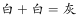
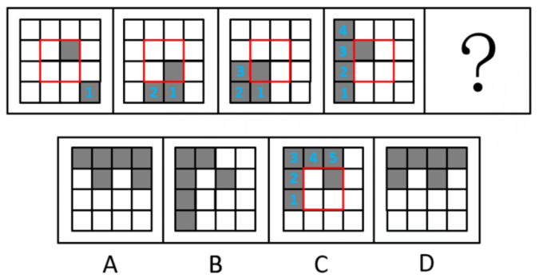
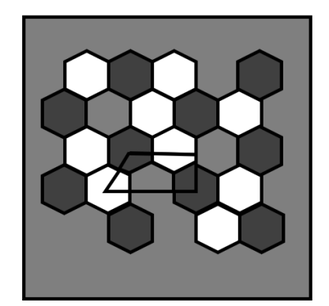
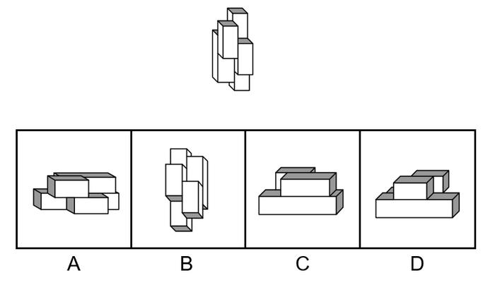
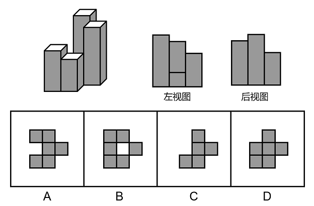
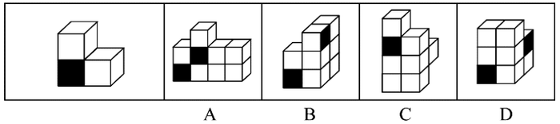
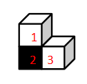
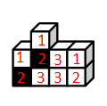
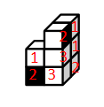

# 2021年广东省公务员录用考试《行测》题（县级卷）（网友回忆版）

> 判断推理 · 35 题 · 广东 2021

## 第 1 题　qid 3018848 · 图形推理

下列选项中最符合所给图形规律的是：

- **A**. A
- **B**. B　✅
- **C**. C
- **D**. D

**答案**：B

**官方解析**

图形元素组成不同，考虑属性规律。观察发现，图1、图3存在明显的等腰元素，考虑对称性。画出图形对称轴发现，题干图形的对称轴都只有一条，且竖轴和横轴交替出现，图4是横轴对称，故？处应该选择竖轴对称的图形，只有B项符合。
故正确答案为B。

---

## 第 2 题　qid 3018853 · 图形推理

下列选项中最符合所给图形规律的是：

- **A**. A
- **B**. B　✅
- **C**. C
- **D**. D

**答案**：B

**官方解析**

图形元素组成相似，优先考虑样式规律。观察发现图形外部轮廓相同，但内部颜色不同，考虑黑白运算。第一组图：、、、；第二组图运用此规律，正上方：，排除C项；正下方：，排除A、D两项。

故正确答案为B。

---

## 第 3 题　qid 3018855 · 图形推理

下列选项中最符合所给图形规律的是：

- **A**. A
- **B**. B
- **C**. C
- **D**. D　✅

**答案**：D

**官方解析**

图形元素组成不同，且无明显属性规律，考虑数量规律。观察发现，题干图形都有直线，考虑直线数。题干图形直线数依次为1、2、3、4，故？处图形中直线数应为5。A项直线数为6，B项为7，C项为4，只有D项符合。
故正确答案为D。

---

## 第 4 题　qid 3018856 · 图形推理

下列选项中最符合所给图形规律的是：

- **A**. A
- **B**. B
- **C**. C　✅
- **D**. D

**答案**：C

**官方解析**

观察发现，题干图形均存在灰块，且灰块数量依次递增，故？处图形中灰块数量应为6，但没有唯一答案。继续观察发现，灰块位置有明显移动，考虑灰块的位置规律。16宫格内圈灰块依次顺时针移动1格，排除A项；16宫格外圈灰块依次顺时针移动1格且在最前边增加一个灰块，排除B、D两项。

如下图所示。

故正确答案为C。

---

## 第 5 题　qid 3018878 · 图形推理

下列选项中最符合所给图形规律的是：

- **A**. A
- **B**. B
- **C**. C　✅
- **D**. D

**答案**：C

**官方解析**

本题将选项填入题干图形所缺的？处，即可拼合成一幅完整图形，故将选项顺时针旋转后与题干进行拼接。观察发现，若想与题干完整拼接，则？左上角应为黑色，右上角应为白色，只有C项符合。

故正确答案为C。

---

## 第 6 题　qid 3018880 · 图形推理

下列选项中，与所给的立体图形不可能是同一图形的是：

- **A**. A　✅
- **B**. B
- **C**. C
- **D**. D

**答案**：A

**官方解析**

将题干的小长方体分别标上序号，逐一进行分析。

A项：当②号块和③号块在前面，①号块和④号块在后面时，根据题干，④号块一定偏左而非偏右，与题干图形不一致，当选；

B项：将选项沿图中轴1顺时针旋转之后，与题干图形一致，排除；

C项：将选项先沿图中轴1顺时针旋转，再水平顺时针旋转之后，与题干图形一致，排除；

D项：将选项先沿图中轴1逆时针旋转，再水平逆时针旋转之后，与题干图形一致，排除。

本题为选非题，故正确答案为A。

---

## 第 7 题　qid 3018863 · 图形推理

下方分别是一个由长方体堆积而成的立体图形和该立体图形的左视图、后视图，那么该立体图形的俯视图是（    ）。

- **A**. A
- **B**. B
- **C**. C　✅
- **D**. D

**答案**：C

**官方解析**

本题考查三视图，逐一分析选项。
A项：若选项左上角的小方块从俯视处可看见，则该立体图形从前至后第3行、从左至右第1列相交处存在一个较矮的小立体图形，因此后视图最右边的长方形应当存在一条横线，与题干中后视图不符，排除；
B项：与A项同理，排除；
C项：与题干一致，当选；
D项：若选项从上至下第2行、从左至右第1列处的小方块从俯视图处可看见，则该立体图形从前至后第2行、从左至右第1列相交处存在一个较矮的小立体图形，因此后视图最右边的长方形应当存在一条横线，与题干中后视图不符，排除。
故正确答案为C。

---

## 第 8 题　qid 3018865 · 图形推理

下列选项中，能够折成如图所示立方体的是（    ）。

- **A**. A
- **B**. B
- **C**. C　✅
- **D**. D

**答案**：C

**官方解析**

本题考查六面体，逐一进行分析。
A项：选项中两个直角三角形的公共边为直角边，而题干中为斜边，选项与题干不一致，排除；
B项：选项中两个直角三角形无法拼合成一个完整的正方形，因此该展开图无法折叠为正方体，选项与题干不一致，排除；
C项：选项与题干一致，当选；
D项：选项中两个直角三角形的相对面不是同一个面，无法拼合成一个完整的正方形，因此该展开图无法折叠为正方体，选项与题干不一致，排除。
故正确答案为C。

---

## 第 9 题　qid 3018867 · 图形推理

左侧立体图形仅有图中所示的一个面被涂黑。下列选项不可能由三个左侧立体图形构成的是（    ）。

- **A**. A
- **B**. B
- **C**. C
- **D**. D　✅

**答案**：D

**官方解析**

本题考查立体拼合。题干立体图形由3个小方块组成，分别标1、2、3，如下图所示。

A项：如下图所示，左下角和中间的立体图形（分别标记为1、2、3）可以拼成2个题干中的立体图形，右下角（标记为1、2、3）的立体图形可由题干中的立体图形通过位置变换得到（此时黑面朝内，无法看到），排除；

B项：如下图所示，左下角和右上角的立体图形（分别标记为1、2、3）可以拼成2个题干中的立体图形，在右下角标2的立体图形（此时黑面朝内，无法看到）的左侧可以有另外一个立体图形（标记应为3），组合拼成题干中的立体图形，排除；

C项：如下图所示，上方的立体图形和右侧的立体图形（分别标记为1、2、3，此时右侧图形黑面朝内，无法看到）可以拼成2个题干中的立体图形，在第三层（从上往下数）标2（此时黑面朝内，无法看到）的立体图形的内侧可以有另外一个立体图形（标记应为3），组合拼成题干中的立体图形，排除；

D项：如下图所示，左下角的立体图形（标记为1、2、3）可以拼成1个题干中的立体图形，右面的立体图形（标记为1、2、3）可以拼成1个题干中的立体图形，但根据题干图形的特征及黑面的位置，只存在图示中唯一的拼法。此时第一层（从上往下数）的2个小方块无法和内部的其他方块拼成题干中的立体图形，当选。

本题为选非题，故正确答案为D。

---

## 第 10 题　qid 3018870 · 图形推理

下图所示立体图形沿OMN面斜切，由切面所见截面最可能是（    ）。

- **A**. A
- **B**. B
- **C**. C
- **D**. D　✅

**答案**：D

**官方解析**

本题考查截面图。题干图形由上、下两个立体图形组成，且下方为圆柱体。从上方立体图形的顶面斜切，再从圆柱体的底部切出，经过上、下立体图形的顶面切出来的均为直线，经过其他部位切出来的均为曲线，即经过上方立体图形的侧面和圆柱体柱身切出来的均为半弧形截面，符合要求的只有D项。
故正确答案为D。

---

## 第 11 题　qid 3018873 · 类比推理

塑料：容器

- **A**. 石灰：水泥
- **B**. 陶瓷：餐具　✅
- **C**. 桥墩：桥梁
- **D**. 木材：木头

**答案**：B

**官方解析**

第一步：判断题干词语间逻辑关系。
塑料是制作容器的原材料，二者为原材料与成品的对应关系。
第二步：判断选项词语间逻辑关系。
A项：石灰和水泥都是无机胶凝材料，二者为并列关系，与题干逻辑关系不一致，排除；
B项：陶瓷是制作餐具的原材料，二者为原材料与成品的对应关系，与题干逻辑关系一致，当选；
C项：桥墩是桥梁的组成部分，二者为组成关系，与题干逻辑关系不一致，排除；
D项：木头是木材和木料的统称，二者为种属关系，与题干逻辑关系不一致，排除。
故正确答案为B。

---

## 第 12 题　qid 3018876 · 类比推理

钢琴：演奏

- **A**. 艺术：写生
- **B**. 书法：展览
- **C**. 画笔：绘画　✅
- **D**. 二胡：配音

**答案**：C

**官方解析**

第一步：判断题干词语间逻辑关系。
用钢琴进行演奏，钢琴是演奏的工具，二者为工具的对应关系。
第二步：判断选项词语间逻辑关系。
A项：通过写生创作的作品称为艺术，但艺术并非工具，与题干逻辑关系不一致，排除；
B项：展览的内容可以为书法作品，但书法并非工具，与题干逻辑关系不一致，排除；
C项：用画笔进行绘画，画笔是绘画的工具，二者为工具的对应关系，与题干逻辑关系一致，当选；
D项：二胡一般用来配乐，而不是配音，与题干逻辑关系不一致，排除。
故正确答案为C。

---

## 第 13 题　qid 3018763 · 类比推理

经营：纳税

- **A**. 借书：归还　✅
- **B**. 评比：投票
- **C**. 球赛：运动
- **D**. 注册：登记

**答案**：A

**官方解析**

第一步：判断题干词语间逻辑关系。
经营和纳税是两种行为，且先经营，后纳税，二者为时间先后顺序的对应关系。
第二步：判断选项词语间逻辑关系。
A项：借书和归还是两种行为，且先借书，后归还，二者为时间先后顺序的对应关系，与题干逻辑关系一致，当选；
B项：投票是一种评比的方式，二者为方式对应关系，与题干逻辑关系不一致，排除；
C项：球赛与运动相关，二者为对应关系，但球赛并不是行为，与题干逻辑关系不一致，排除；
D项：注册指把名字记入簿册获得某种资格，登记指把有关事项或东西记载在册籍上，两者意思相近，没有先后之分，与题干逻辑关系不一致，排除。
故正确答案为A。

---

## 第 14 题　qid 3018778 · 类比推理

暴雨：冰雹：天灾

- **A**. 汽车：滑梯：玩具
- **B**. 归纳：总结：逻辑
- **C**. 舞蹈：歌剧：戏剧
- **D**. 没收：罚款：处罚　✅

**答案**：D

**官方解析**

第一步：判断题干词语间逻辑关系。
暴雨和冰雹都是一种天灾，前两词分别与第三词构成种属关系。
第二步：判断选项词语间逻辑关系。
A项：汽车不是玩具，二者不是种属关系，与题干逻辑关系不一致，排除；
B项：总结指的是分析研究某一阶段的工作、学习或思想中的各种经验或情况，总结不属于逻辑，二者不是种属关系，与题干逻辑关系不一致，排除；
C项：舞蹈和戏剧属于不同的艺术类别，二者是并列关系，与题干逻辑关系不一致，排除；
D项：没收和罚款都是处罚的一种，前两词分别与第三词构成种属关系，与题干逻辑关系一致，当选。
故正确答案为D。

---

## 第 15 题　qid 3018786 · 类比推理

和风细雨：暴风骤雨

- **A**. 年富力强：风烛残年　✅
- **B**. 如沐春风：如履薄冰
- **C**. 耀武扬威：扬眉吐气
- **D**. 雪中送炭：落井下石

**答案**：A

**官方解析**

第一步：判断题干词语间逻辑关系。
和风细雨指的是温和的风，细小的雨，比喻方式和缓，不粗暴；暴风骤雨指的是又猛又急的大风雨，比喻声势浩大，发展急速而猛烈；二者是反义关系，且“和风”和“细雨”是并列关系，“暴风”和“骤雨”是并列关系。
第二步：判断选项词语间逻辑关系。
A项：年富力强形容年纪轻，精力旺盛；风烛残年比喻人到了接近死亡的晚年；二者是反义关系，且“年富”和“力强”是并列关系，“风烛”和“残年”是并列关系，与题干逻辑关系一致，当选；
B项：如沐春风指的是像坐在春风中间，比喻同品德高尚且有学识的人相处并受到熏陶；如履薄冰指的是像走在薄冰上一样，比喻行事极为谨慎，存有戒心；二者不是反义关系，与题干逻辑关系不一致，排除；
C项：耀武扬威指的是炫耀武力，显示威风；扬眉吐气指的是扬起眉头，吐出怨气，形容摆脱了长期受压状态后高兴痛快的样子；二者不是反义关系，与题干逻辑关系不一致，排除；
D项：雪中送炭指的是在下雪天给人送炭取暖，比喻在别人急需时给以物质上或精神上的帮助；落井下石指的是看见人要掉进陷阱里，不伸手救他，反而推他下去，又扔下石头，比喻乘人有危难时加以陷害；二者是反义关系，但“雪中”和“送炭”、“落井”和“下石”均不是并列关系，与题干逻辑关系不一致，排除。
故正确答案为A。

---

## 第 16 题　qid 3018801 · 逻辑判断

调查研究显示，相较传统的农业生产方式，有机农业生产出的农作物产量会有一定程度的下降。但现在仍然有越来越多的农民从传统农业转向有机农业，甚至花费资金，添置用于有机农业耕作的农用设备。
以下选项如果为真，最能解释上述现象的是：

- **A**. 有机农业耕作方式更有助于保护生态环境
- **B**. 许多科技节目都在推广有机农业耕作方式
- **C**. 有机农业生产出的农作物市场售价远高于传统农业　✅
- **D**. 对于少部分农作物而言，有机农业耕作并不会降低其产量

**答案**：C

**官方解析**

第一步：找出题干矛盾。
相较传统的农业生产方式，有机农业生产出的农作物产量会下降，但仍然有越来越多的农民从传统农业转向有机农业，甚至花费资金添置设备。
第二步：逐一分析选项。
A项：该项只能说明有机农业耕作方式更有利于保护生态环境，但是没提到为什么在有机农业生产出的农作物产量下降的情况下，越来越多的农民还愿意从传统农业转向有机农业，甚至花费资金添置设备，不能解释题干矛盾，排除；
B项：该项只能说明有机农业耕作方式的宣传力度大，但是没提到为什么在有机农业生产出的农作物产量下降的情况下，越来越多的农民还愿意从传统农业转向有机农业，甚至花费资金添置设备，不能解释题干矛盾，排除；
C项：该项说明有机农业生产出的农作物市场售价远高于传统农业，因此虽然有机农业生产出的农作物产量会下降，但并不会降低农民收益，甚至有可能增加农民的收益，因此越来越多的农民从传统农业转向有机农业，可以解释题干矛盾，当选；
D项：该项仅指出有机农业耕作并不会降低少部分农作物的产量，但不能解释为什么越来越多的农民愿意从传统农业转向有机农业，不能解释题干矛盾，排除。
故正确答案为C。

---

## 第 17 题　qid 3018812 · 类比推理

某镇计划安排小蒋、小陈、小刘3名干部到甲、乙、丙3个村子驻点，每村只安排1人。3人中有一人是农学专业，一人是法学专业，一人是工学专业。已知：小陈没有前往甲村，农学专业的没有前往甲村，工学专业的去了丙村，小陈不是农学专业。
根据以上表述，以下推论必然正确的是（    ）。

- **A**. 小刘去了甲村
- **B**. 小蒋去了乙村
- **C**. 小刘是工学专业的
- **D**. 小陈是工学专业的　✅

**答案**：D

**官方解析**

第一步：整理题干条件。
（1）小陈没有前往甲村；
（2）农学专业的没有前往甲村；
（3）工学专业的去了丙村；
（4）小陈不是农学专业。
第二步：根据题干条件进行推理。
根据题干所说的“某镇计划安排小蒋、小陈、小刘3名干部到甲、乙、丙3个村子驻点，每村只安排1人。3人中有一人是农学专业，一人是法学专业，一人是工学专业”，结合条件（2）和条件（3）可知，农学专业和工学专业的没有前往甲村，则法学专业的去了甲村，农学专业的去了乙村。最后结合条件（1）和条件（4）可知，小陈没有前往甲村，也没有前往乙村，故小陈前往了丙村，因此，小陈是工学专业的。
故正确答案为D。

---

## 第 18 题　qid 3018818 · 类比推理

今年持续暴雨，各地花椒严重减产。由此可以预见，今年的花椒价格将会显著上涨。
要使上述推理成立，需要补充的前提条件是：

- **A**. 花椒价格仅受到产量的影响　✅
- **B**. 全国花椒需求量与往年持平
- **C**. 花椒的价格不会影响群众的购买意愿
- **D**. 历年花椒价格的波动都与其产量密切相关

**答案**：A

**官方解析**

第一步：找出论点和论据。
论点：今年的花椒价格将会显著上涨。
论据：今年持续暴雨，各地花椒严重减产。
本题论点讨论了今年的花椒价格将会显著上涨，论据讨论了今年持续暴雨，各地花椒严重减产，话题不一致，加强优先考虑搭桥。
第二步：逐一分析选项。
A项：该项指出花椒价格仅受到产量的影响，在花椒价格和减产之间建立联系，搭桥项，保留；
B项：该项说的是全国花椒需求量与往年持平，但是没有提及花椒价格和减产之间的关系，无法加强，排除；
C项：该项说的是花椒的价格不会影响群众的购买意愿，但是没有提及花椒价格和减产之间的关系，无法加强，排除；
D项：该项指出历年花椒价格的波动都与其产量密切相关，在花椒价格和减产之间建立联系，搭桥项，保留。
比较A、D两项，A项指出产量是影响花椒价格的唯一因素，D项仅说二者密切相关，则可能存在其他因素影响花椒价格，且题干论点、论据说的都是今年花椒的价格和产量，而D项仅提及历年花椒价格和产量的情况，没有提及今年的情况。因此，A项加强力度大于D项，故排除D项，A项当选。
故正确答案为A。

---

## 第 19 题　qid 3018830 · 逻辑判断

由于全球碳排放量的不断增长，全球范围内气候呈现升温趋势。但与此同时，气候变暖也会让部分树木生长速率加快，从而使树木从大气中吸收二氧化碳的效率增加。因此，人类不需要过于担忧碳排放导致的气候变暖问题。
下列选项如果为真，最能有效削弱上述结论的是（    ）。

- **A**. 不同树种碳吸收效率提升的情况有差异
- **B**. 树木并非是地球上吸收储存二氧化碳的主力
- **C**. 树木死亡后其储存的碳可能会重新释放到大气中
- **D**. 目前人类产生的碳排放增量远远超过了树木的吸收能力　✅

**答案**：D

**官方解析**

第一步：找出论点和论据。
论点：人类不需要过于担忧碳排放导致的气候变暖问题。
论据：气候变暖也会让部分树木生长速率加快，从而使树木从大气中吸收二氧化碳的效率增加。
本题论点讨论了人类无需过于担忧碳排放导致的气候变暖，论据讨论了气候变暖可以促进树木生长，增加树木吸收二氧化碳的效率，即树木吸收二氧化碳的量可以抵消二氧化碳排放的量，话题一致，削弱优先考虑否定论点。
第二步：逐一分析选项。
A项：该项指出不同树种碳吸收效率的提升情况不同，而论点在讨论人类是否需要过于担忧碳排放导致的气候变暖，话题不一致，无法削弱，排除；
B项：该项指出树木不是地球上吸收储存二氧化碳的主力，而论点在讨论人类是否需要过于担忧碳排放导致的气候变暖，话题不一致，无法削弱，排除；
C项：该项指出树木死亡后储存的碳可能会重新释放到大气中，即树木有可能并不具备吸收储存二氧化碳的能力，具有削弱效果，保留；
D项：该项指出人类的碳排放增量远超于树木的吸收能力，说明了“树木吸收的二氧化碳”不能抵消“二氧化碳排放的量”，人类还需要担忧气候变暖问题，可以削弱，保留。
比较C、D两项，C项是说树木“可能”会重新释放二氧化碳，而D项则是明确说明二氧化碳排放量远远大于吸收量，故D项更为合适，当选。
故正确答案为D。

---

## 第 20 题　qid 3018833 · 逻辑判断

农科院在一档农业电视节目中介绍了一种经济价值高的养殖动物——肉兔，强调肉兔有易于养殖、繁殖速度快等优点，节目播出后受到了大家的关注。但是，某村在养殖肉兔之后，发现肉兔在当地市场销路并不理想。
以下选项如果为真，最能解释这一现象的是（    ）。

- **A**. 电视节目播出后，当地许多大型养殖企业都开始养殖肉兔　✅
- **B**. 该村的其他养殖企业同期推出了市场价格更高的黑毛乌骨鸡
- **C**. 虽然当地有食用兔肉的习俗，但在全国范围内兔肉并不被广泛接受
- **D**. 由于养殖技术成熟，肉兔养殖已成为最具经济效益的养殖产业之一

**答案**：A

**官方解析**

第一步：找出题干矛盾。
农科院在某农业节目中介绍了一种经济价值高的养殖动物——肉兔，受到大家的关注，但是某村在养殖肉兔之后，发现肉兔在当地市场销路并不理想。
第二步：逐一分析选项。
A项：电视节目播出后，当地许多大型养殖企业都开始养殖肉兔，说明肉兔养殖量增加，供货量大于购买量，且人们会倾向于购买正规、大型企业的养殖动物，因此解释了为什么肉兔经济价值高、受关注度大，但是某村养殖的肉兔在当地市场销路不理想，可以解释题干矛盾，当选；
B项：该村的其他养殖企业推出了市场价格更高的黑毛乌骨鸡，但不明确黑毛乌骨鸡价格更高是否会影响肉兔的销售量，不能解释题干矛盾，排除；
C项：该项指出当地有食用兔肉的习俗，虽然在全国范围内兔肉并不被广泛接受，但既然当地有食用兔肉的习俗，就无法解释为什么肉兔受关注大但在当地市场的销路不理想，不能解释题干矛盾，排除；
D项：该项指出肉兔养殖是最具经济效益的养殖产业之一，只能说明肉兔是具有经济价值的，但不能解释为什么肉兔经济价值高、受关注度大，但是某村养殖的肉兔在当地市场销路不理想，不能解释题干矛盾，排除。
故正确答案为A。

---

## 第 21 题　qid 3018838 · 逻辑判断

奶茶，乍一想应该既有奶又有茶，是一种营养丰富的健康饮品。事实果真如此吗？有专家指出，市面上的奶茶大多由茶粉勾兑而成，咖啡因超标。因此专家提醒：对青少年而言，为了保持身体健康，奶茶好喝可别“贪杯”。
要使上述推论成立。可以补充的前提为（    ）。

- **A**. 过量摄入咖啡因会影响人们的身体健康　✅
- **B**. 相比其他人群，奶茶对青少年的吸引力更高
- **C**. 奶茶中的咖啡因可能使人兴奋不已，甚至失眠
- **D**. 青少年正处于生长发育的关键期，对咖啡因更敏感

**答案**：A

**官方解析**

第一步：找出论点和论据。
论点：对青少年而言，为了保持身体健康，奶茶好喝可别“贪杯”。
论据：市面上的奶茶大多由茶粉勾兑而成，咖啡因超标。
本题论点论据话题不一致，论点讨论青少年为了健康要少喝奶茶，论据讨论奶茶中咖啡因超标，话题不一致，加强优先考虑搭桥。找到论据与论点中不同的关键词为“由茶粉勾兑而成，咖啡因超标”与“青少年的身体健康”，需要在二者之间进行搭桥。
第二步：逐一分析选项。
A项：过量摄入咖啡因会影响人们的身体健康，是在“咖啡因超标”与“人们的身体健康”之间建立联系，且“人们”是泛指，包括青少年群体，属于搭桥项，可以加强，当选；
B项：该项是在比较奶茶对哪个群体的吸引力更高，而题干是说青少年应不应该为了健康少喝奶茶，话题不一致，无法加强，排除；
C项：奶茶中的咖啡因使人兴奋、失眠，都是在说奶茶中咖啡因的副作用，但不确定兴奋、失眠会不会直接对健康造成威胁，且题干所指的是“咖啡因超标”而非是“咖啡因”带来的影响，无法加强，排除；
D项：处于生长发育关键期的青少年对咖啡因更敏感，但不确定会不会危及到青少年的身体健康，无法加强，排除。
故正确答案为A。

---

## 第 22 题　qid 3018842 · 类比推理

快递企业在激烈的市场竞争中会被迫大幅下调收费单价，而特色快递企业能够避免卷入激烈的市场竞争。快递员都愿意在收费单价高的快递企业工作，但某国的快递员并没有为特色快递企业工作的强烈愿望。由此可以推断（    ）。

- **A**. 该国快递市场竞争不激烈　✅
- **B**. 该国快递企业很难招到快递员
- **C**. 该国快递行业收费单价普遍不高
- **D**. 该国特色快递企业的快递员收入不高

**答案**：A

**官方解析**

日常结论题，根据题干信息逐一分析选项。
A项：根据题干第二句话可知，该国的快递员并没有为特色快递企业工作的强烈愿望，说明该国的非特色快递企业收费单价并没有大幅降低，再结合题干第一句话可知，快递企业既然没有大幅下调收费单价，说明该国快递市场竞争并不激烈，可以推出，当选；
B项：题干中没有涉及到快递企业招聘快递员的难度问题，无中生有，排除；
C项：根据题干第二句话可知，某国快递员并没有为特色快递企业工作的强烈愿望，而快递员都愿意在收费单价高的快递企业工作，可以推出该国普通快递企业和特色快递企业的收费单价没有明显高低之分，但不能得出该国快递行业收费单价一定普遍不高，也可能普遍偏高，排除；
D项：题干中没有涉及到快递企业快递员的收入问题，无中生有，排除。
故正确答案为A。

---

## 第 23 题　qid 3018843 · 类比推理

优秀的大学生既要有扎实的专业知识，也必须具备优秀的人文素养和爱国情怀。因此，只重视专业知识教育的高校无法培育出优秀的大学生。
以下选项的逻辑推理结构与题干最为相似的是（    ）。

- **A**. 教育要通过生活才能发挥作用而成为真正意义上的教育。因此，脱离实际的教育是空洞的，更是毫无现实意义的
- **B**. 制度设计和资金支持在农村社会保障体系中缺一不可。因此，即使有着合理的制度设计，要建成农村社会保障体系，资金支持仍然不可或缺　✅
- **C**. 城市空间资源的价值不仅体现在其土地价值上，还体现在内部的人群、设施和建筑上。因此，不能仅靠提高城市土地价格来推升城市空间资源价值
- **D**. 互联网既为经济发展注入了强大动能，又为社会治理带来了许多新难题。因此，片面强调互联网带来的经济效益，忽视其带来的社会问题并不可取

**答案**：B

**官方解析**

第一步：分析题干推理形式。

题干推理形式为：优秀的大学生有扎实的专业知识且优秀的人文素养和爱国情怀，因此，只注重专业知识优秀的大学生。

第二步：逐一分析选项。

A项：真正意义上的教育通过生活发挥作用，因此，脱离实际空洞、毫无现实意义的教育，与题干推理形式不同，排除；

B项：农村社会保障体系制度设计且资金支持，因此后的这句话表达的意思是如果只有合理的制度设计，也无法建成农村社会保障体系，即，只有合理的制度设计建成农村社会保障体系，与题干推理形式相同，当选；

C项：城市空间资源的价值土地价值且内部的人群、设施、建筑，因此，仅靠提高土地价格城市空间资源价值，第一句话说的是土地的价值，而因此之后说的是土地的价格，价格与价值并不完全一致，而B项前后用词完全一致，故该项没有B项对应的更好，与题干推理形式不同，排除；

D项：互联网为经济发展注入强大动能且为社会治理带来了许多新难题，因此，只强调经济效益且忽视带来的社会问题不可取，与题干推理形式不同，排除。

故正确答案为B。

---

## 第 24 题　qid 3018844 · 逻辑判断

有人认为，师范院校的拟聘教师应该先到中小学任教一段时间，通过考核后，才可以正式聘任。这是因为师范院校的教师如果连中小学生都教不好，他们又如何能培养好中小学校的教师呢？
以下选项为真，最能质疑上述结论的是（    ）。

- **A**. 师范院校的教师并非全都参与中小学教师的培养
- **B**. 优秀的中小学教师不一定能胜任师范院校的教师岗位
- **C**. 一名好的中小学教师是在中小学教育实践中成长起来的
- **D**. 对中小学生的教育要求和对中小学教师的培养要求是不同的　✅

**答案**：D

**官方解析**

第一步：找出论点和论据。
论点：师范院校的拟聘教师应该先到中小学任教一段时间，通过考核后，才可以正式聘任。
论据：师范院校的教师如果连中小学生都教不好，他们就培养不好中小学校的教师。
本题论点讨论师范院校的拟聘教师应该先到中小学任教合格后再正式到师范院校任教，论据讨论师范院校的教师如果连中小学生都教不好就培养不好中小学校的教师，论点论据都是说中小学任教和师范院校任教二者间的关系，话题一致，削弱优先考虑削弱论点。
第二步：逐一分析选项。
A项：师范院校的教师并非全都参与中小学教师培养，题干并未讨论这个比例问题，无法削弱，排除；
B项：切断了优秀的中小学教师和师范院校的教师岗之间的关系，即中小学任教合格的老师也不一定能成为师范院校教师，“不一定”为可能性削弱的表述，保留；
C项：该项讨论好的中小学教师是如何成长，与论点讨论的师范院校的拟聘教师主体不一致，无法削弱，排除；
D项：切断了中小学生的教育要求和中小学教师的培养要求之间的联系，即中小学任教合格也不能说明就可以成为师范院校教师，削弱论点，保留。
比较B、D两项，B项为可能性的削弱，D项为确定性的削弱，故D项更为合适。
故正确答案为D。

---

## 第 25 题　qid 3018765 · 类比推理

希望过上好日子的村民都愿意接受就业辅导。村民小王愿意接受就业辅导，因此，他希望过上好日子。
以下选项存在与题干最为相似的逻辑错误的是（    ）。

- **A**. 该店所有出售的水果都通过了农药残留检测，苹果通过了农药残留检测，因此该店正在出售苹果　✅
- **B**. 张家苗圃在使用了这批肥料后花木长势很好，李家苗圃长势不好，因此李家苗圃没有使用这批肥料
- **C**. 许多坚持运动的儿童身体都比较健康，许多成年人也会坚持运动，因此坚持运动的成年人身体都比较健康
- **D**. 只有经过Ⅲ期临床试验的新药才可能被批准上市，该新药没有经过Ⅲ期临床试验，所以它没有被批准上市

**答案**：A

**官方解析**

第一步：找出题干逻辑错误。

题干翻译为：希望过上好日子愿意接受就业辅导，

推理为：小王愿意接受就业辅导，因此，小王希望过上好日子。

所犯逻辑错误是“肯后推肯前”。

第二步：逐一分析选项。

A项：该店出售的水果通过了农药残留检测，苹果通过了农药残留检测，所以，该店正在出售苹果，肯后推肯前，与题干所犯逻辑错误相似，当选；

B项：张家苗圃使用肥料花木长势好，李家苗圃长势不好，并非“肯后”，与题干所犯逻辑错误不相似，排除；

C项：坚持运动的儿童身体健康，许多成年人也会坚持运动，并非“肯后”，与题干所犯逻辑错误不相似，排除；

D项：上市经过Ⅲ期临床试验，该新药没有经过Ⅲ期临床试验，属于“否后”，并非“肯后”，与题干所犯逻辑错误不相似，排除。

故正确答案为A。

---

## 第 26 题　qid 3018773 · 逻辑判断

胼胝体是人类大脑的重要部分，是连接大脑左右半球的主要通道。研究表明，专业打击乐演奏者的大脑中，胼胝体中的纤维比一般人少且更粗壮。因此，练习打击乐能够有效刺激甚至改变大脑结构。
补充以下选项作为前提，最有助于使上述结论成立的是（    ）。

- **A**. 专业打击乐演奏者的大脑左右半球与一般人相比也存在差异
- **B**. 其他类型乐手的胼胝体纤维也存在与专业打击乐演奏者相似的特征
- **C**. 专业打击乐演奏者在练习打击乐之前的胼胝体纤维与一般人并无区别　✅
- **D**. 打击乐业余爱好者胼胝体纤维粗细程度介于专业演奏者和普通人之间

**答案**：C

**官方解析**

第一步：找出论点和论据。
论点：练习打击乐能够有效刺激甚至改变大脑结构。
论据：专业打击乐演奏者的大脑中，胼胝体中的纤维比一般人少且更粗壮。
本题的论点讨论的是打击乐和大脑结构的关系，论据讨论的是打击乐和大脑胼胝体中纤维的关系，题干第一句已经说明胼胝体是人类大脑的重要部分，话题一致，且提问是“补充前提”，加强优先考虑必要条件。
第二步：逐一分析选项。
A项：论点说的是练习打击乐能刺激甚至改变大脑结构，该项说的是专业打击乐演奏者的大脑结构与一般人的大脑结构有差异，但是不知道是不是由于练习打击乐导致的，属于不明确项，无法加强，排除；
B项：论点说的是练习打击乐能刺激甚至改变大脑结构，该项说的是其他类型乐手，话题不一致，无法加强，排除；
C项：如果专业打击乐演奏者在练习打击乐之前的胼胝体纤维与一般人不一样，那么就不能通过练习打击乐后与一般人大脑胼胝体的对比得到论点练习打击乐能改变大脑的结构，该项为论点成立的必要条件，可以加强，当选；
D项：论据指出专业打击乐演奏者胼胝体纤维比普通人粗，而选项指出业余爱好者介于专业演奏者和普通人之间，即专业&gt;业余&gt;普通，补充论据证明打击乐演奏对胼胝体纤维有影响，具有一定的加强作用，但不是论点成立的必要条件，排除。
故正确答案为C。

---

## 第 27 题　qid 3018784 · 类比推理

甲、乙、丙三人对一块花田里种植的花朵品种做了两次猜测：
甲：①“它是月季”；②“它不是玫瑰”。
乙：①“它不是月季”；②“它是玫瑰”。
丙：①“它不是月季”；②“它不是牡丹”。
工作人员听到后表示：“你们三人中，只有一个人两次都猜对了，一个人猜对了一次，还有一个人完全猜错了。”
如果工作人员的说法是对的，则该花田里种植的是（    ）。

- **A**. 玫瑰
- **B**. 月季　✅
- **C**. 牡丹
- **D**. 玫瑰、月季和牡丹之外的花种

**答案**：B

**官方解析**

第一步：分析题干条件。
（1）甲：①它是月季，②它不是玫瑰；
（2）乙：①它不是月季，②它是玫瑰；
（3）丙：①它不是月季，②它不是牡丹；
（4）三人中，只有一个人两次都猜对了，一个人猜对了一次，还有一个人完全猜错了。
第二步：根据题干条件进行推理。
题干信息不明确，考虑采用代入法解题。
A项：如果是玫瑰，则甲的两句全错，乙的两句全对，丙的两句全对，不符合条件（4），排除；
B项：如果是月季，则甲的两句全对，乙的两句全错，丙的两句一对一错，符合条件（4），当选；
C项：如果是牡丹，则甲的两句一对一错，乙的两句一对一错，丙的两句一对一错，不符合条件（4），排除；
D项：如果是玫瑰、月季和牡丹之外的花种，则：甲的两句一对一错，乙的两句一对一错，丙的两句全对，不符合条件（4），排除。
故正确答案为B。

---

## 第 28 题　qid 3018792 · 逻辑判断

某在线教育机构在网上推出了一个面向中小学生的直播课，这个直播课在试播时组织了很多中小学生和家长免费观看，获得了很高的评价，但是在正式播出后，在线收看的人数并不理想。
下列选项最不能解释这一现象的是（    ）。

- **A**. 正式的直播课程需要付费观看
- **B**. 该直播课的正式播出时间不合理
- **C**. 该直播课为系列课程，共计开设10节　✅
- **D**. 其他在线教育机构推出了许多同类型的直播课

**答案**：C

**官方解析**

第一步：找出题干矛盾。
某在线教育机构面向中小学生的直播课免费试播时获得了很高的评价，但是在正式播出后，在线收看的人数并不理想。
第二步：逐一分析选项。
A项：指出正式的直播课程需要付费观看，而试播是免费的，有些人只想观看免费课，不想付费观看，可以解释题干矛盾，排除；
B项：指出直播课的正式播出时间不合理，有人会因此无法及时观看直播课程，导致正式播出后在线收看的人数并不理想，可以解释题干矛盾，排除；
C项：指出直播课的数量是10节，但课程数量不能说明为什么正式直播的在线观看人数不理想，不能解释题干矛盾，当选；
D项：指出其他机构推出同类型在线直播课，有一部分观看试播的用户可能会选择其他机构的课程，因此正式播出后，在线收看的人数并不理想，可以解释题干矛盾，排除。
本题为选非题，故正确答案为C。

---

## 第 29 题　qid 3018798 · 逻辑判断

尽管许多行业并不看重从业者的学历，但对于从事金融咨询服务的人来说，学历还是极其重要的。有研究指出，人们在进行理财咨询时，更重视金融咨询师的学历而非资历。因此，就读金融服务管理专业的学生应尽可能获得高学历。
上述论证最可能基于的潜在假设是（    ）。

- **A**. 金融咨询服务者的资历与其能力水平没有必然关联
- **B**. 总体而言，高学历的人专业水平更高、工作能力更强
- **C**. 就读金融服务管理专业的学生都会投身金融咨询服务行业　✅
- **D**. 近年来，越来越多的行业在招聘时限定其求职者必须具有高学历

**答案**：C

**官方解析**

第一步：找出论点和论据。
论点：就读金融服务管理专业的学生应尽可能获得高学历。
论据：人们在进行理财咨询时，更重视金融咨询师的学历而非资历。
本题论点讨论的是“金融服务管理专业的学生”应尽可能获得“高学历”，论据说的是人们进行“理财咨询”时看中的是“学历”不是资历，论点与论据话题不一致，加强优先考虑搭桥，即在“金融服务管理专业的学生”与“理财咨询”之间建立联系。
第二步：逐一分析选项。
A项：讨论的是资历与能力的关系，而论点讨论的是金融服务管理专业与学历之间的关系，话题不一致，无法加强，排除；
B项：讨论的是学历与能力的关系，而论点讨论的是金融服务管理专业与学历之间的关系，话题不一致，无法加强，排除；
C项：指出“金融服务管理专业的学生”都会投身“金融咨询服务”行业，建立起论点与论据之间的联系，搭桥项，可以加强，当选；
D项：指出越来越多的行业在招聘时需要求职者具有高学历，但不确定是否包括“金融服务管理专业的学生”要从事的行业，无法加强，排除。
故正确答案为C。

---

## 第 30 题　qid 3018789 · 类比推理

李女士刚搬入新家，打算一次性购买几种盆栽。她的想法如下：
①购买绿萝、罗汉松中的一种；
②文竹、绿萝和橡皮树至少买一种；
③罗汉松、橡皮树、虎尾兰至少买两种；
④只要买了罗汉松，就不买文竹。
如果上述条件都要满足，则下列推论必然正确的是（    ）。

- **A**. 李女士购买了虎尾兰
- **B**. 李女士购买了橡皮树　✅
- **C**. 李女士购买了罗汉松或文竹
- **D**. 李女士至少买了三种盆栽

**答案**：B

**官方解析**

第一步：分析题干条件。

①要么购买绿萝，要么购买罗汉松；

②文竹、绿萝和橡皮树至少买一种；

③罗汉松、橡皮树、虎尾兰至少买两种；

④买罗汉松买文竹。

第二步：根据题干条件进行推理。

题干信息不确定，优先考虑假设法，从最大信息入手，条件①、③、④分别提到了罗汉松，故从罗汉松开始假设，共有如下两种情况：

第一种情况，购买罗汉松。

根据条件①可知，不买绿萝；

根据条件④可知，不买文竹；

根据条件②可知，必须购买橡皮树；

此时必须购买的只有橡皮树和罗汉松，满足题干所有条件。

第二种情况，不购买罗汉松。

根据条件①可知，购买绿萝，同时满足条件②；

根据条件③罗汉松、橡皮树、虎尾兰至少买两种，说明橡皮树和虎尾兰必须购买；

此时必须购买的有绿萝、橡皮树、虎尾兰，满足题干所有条件。

结合上述两种情况，可以推出必须购买橡皮树，B项当选。

故正确答案为B。

---

## 第 31 题　qid 3018794 · 逻辑判断

药物生产厂商在生产某些治疗罕见疾病的药物时会面临亏损的风险，因为只把药卖给数量不多的患者不可能收回制药成本。X病是一种罕见病，因此药厂生产治疗X病的药物肯定会亏损。
以下选项如果为真，最能有效削弱上述结论的是（    ）。

- **A**. 治疗罕见病的药物销售单价往往都很高
- **B**. 随着环境的变化，人们患上X病的风险有所增加
- **C**. 药厂有必要承担一定的社会责任，而非一味追求经济效益
- **D**. 生产治疗罕见病药物的药厂可以获得较高金额的政府补贴　✅

**答案**：D

**官方解析**

第一步：找出论点和论据。
论点：药厂生产治疗X病的药物肯定会亏损。
论据：药物生产厂商在生产某些治疗罕见疾病的药物时会面临亏损的风险，因为只把药卖给数量不多的患者不可能收回制药成本。X病是一种罕见病。
本题论点讨论的是生产治疗罕见病X病的药品，药厂会亏损，论据讨论的是生产某些治疗罕见疾病的药物药厂会亏损，都在讨论生产治疗罕见病药物药厂会不会亏损，话题一致，削弱方法优先考虑否定论点。
第二步：逐一分析选项。
A项：说明治疗罕见病的药物销售单价往往都很高，虽然药品单价高，但罕见病的人数毕竟是少数，购买的人少，难以避免企业亏损，所以药品单价高，对解决亏损状态是否有效是不明确的，属于不明确项，无法削弱，排除；
B项：风险虽然增加，但是具体得X病的人有无增加以及增加多少均不明确，属于不明确项，无法削弱，排除；
C项：选项论述的是药厂需要承担社会责任，承担社会责任即生产该药，但是否生产和生产之后是否亏损无关，属于无关项，无法削弱，排除；
D项：生产治疗罕见病药物的药厂可以获得较高金额的政府补贴，说明只要生产该药就会有补贴，那么即使购买的人少，也能有效解决因为购买人少引起的亏损，药厂不一定会亏损，否定论点，可以削弱，当选。
故正确答案为D。

---

## 第 32 题　qid 3018803 · 类比推理

均衡化的国家治理价值目标结构指引下的农地制度设置能够强化农业要素供给。农业供给侧结构性改革的重点是强化农业要素供给，因此，国家治理价值目标的均衡化有利于农业供给侧结构性改革。
以下选项的逻辑推理结构与题干最为相似的是（    ）。

- **A**. 传统中国没有现代意义上的自然科学，它的认识论本身就是审美化的。因此中国美学研究不能执守西方现代科学为美学划定的边界
- **B**. 方言体系保存越完整的地方，往往宗族性就越强大，地方文化也越发相对闭合。因此，地方文化相对闭合的地方，方言体系往往能够完整保存
- **C**. 产业结构的转型给人们的职业流动创造了机会，职业流动有利于劳动者获得丰厚的劳动报酬。因此，产业结构的转型有利于人们获得丰厚的劳动报酬　✅
- **D**. 改革开放以来，我国城市化发展迅速，城市的管理水平和宜居程度也随之有了巨大提升。因此，城市宜居程度的普遍提高是我国改革开放的一大成果

**答案**：C

**官方解析**

第一步：分析题干逻辑关系。
均衡化的国家治理价值目标（a）有利于强化农业要素供给（b），强化农业要素供给（b）有利于农业供给侧结构性改革（c）。因此，均衡化的国家治理价值目标（a）有利于农业供给侧结构性改革（c）。推理形式为a有利于b，b有利于c。因此，a有利于c。
第二步：分析选项逻辑关系。
A项：因此后面的“执守西方现代科学为美学划定的边界”是前面没有提到的内容，并不能形成“因此，a有利于c”的结构，与题干推理结构不一致，排除；
B项：方言体系保存越完整（a）则宗族性越强大（b）且地方文化越发相对闭合（c）。因此，地方文化越发相对闭合（c）则方言体系保存越完整（a），推理形式为有a则有b且c。因此，有c则有a，与题干推理结构不一致，排除；
C项：产业结构的转型（a）有利于职业流动（b），职业流动（b）有利于劳动者获得丰厚的劳动报酬（c）。因此，产业结构的转型（a）有利于人们获得丰厚的劳动报酬（c），推理形式为a有利于b，b有利于c。因此，a有利于c，与题干推理结构一致，当选；
D项：改革开放（a）有利于城市化发展（b），有利于城市的管理水平提升（c）和宜居程度提升（d）。因此，改革开放（a）有利于宜居程度提升（d），推理形式为a有利于b，有利于c且d。因此，a有利于d，与题干推理结构不一致，排除。
故正确答案为C。

---

## 第 33 题　qid 3018810 · 逻辑判断

互联网公司从社会招聘成熟的计算机人才，往往需要提供相当高的薪酬福利，并且难以挖掘到核心人才。而毕业生初入社会，大部分都踏实肯干，前期成本也不高，后期还可以进行优胜劣汰的选择。因此，互联网公司更愿意培养这些新人。
以下选项如果为真，最能质疑上述判断的是（    ）。

- **A**. 在互联网行业，毕业生也存在流动的可能性
- **B**. 相较于工作经验，互联网公司更关注薪酬成本和人员的稳定性
- **C**. 成熟的计算机人才进入互联网公司后带来的收益要远远高于毕业生　✅
- **D**. 需要接受大量培训，毕业生才能具备接近成熟计算机人才的工作能力

**答案**：C

**官方解析**

第一步：找出论点和论据。
论点：互联网公司更愿意培养这些新人。
论据：互联网公司从社会招聘成熟的计算机人才，往往需要提供相当高的薪酬福利，并且难以挖掘到核心人才。而毕业生初入社会，大部分都踏实肯干，前期成本也不高，后期还可以进行优胜劣汰的选择。
本题论点和论据都在讨论互联网公司与招聘人才的内容，话题一致，优先考虑削弱论点，即相比于培养新人，互联网公司更愿意选择成熟的计算机人才。
第二步：逐一分析选项。
A项：该项说的是毕业生存在流动的可能性，但是不明确这种可能性是否会发生，而且这种可能性是否会影响互联网公司的培养也是不确定的，属于无关项，无法削弱，排除；
B项：该项说的是互联网公司更关注薪酬成本和人员的稳定性，题干论据中明确了新人更加踏实肯干，前期成本不高，这就解释了为什么互联网公司更愿意培养这些新人，属于加强项，无法削弱，排除；
C项：该项说的是成熟的计算机人才能为互联网公司带来的收益远高于毕业生，虽然这类人才需要较高薪酬，但同毕业生相比，成熟人才能够创造非常高的收益，所以互联网公司会更愿意招聘成熟的计算机人才，削弱论点，当选；
D项：该项说的是毕业生需接受大量培训后工作能力才能接近成熟的计算机人才，重点在于毕业生如何提高能力，而题干讨论的重点在于互联网公司招聘人才的原因及结果，话题不一致，属于无关项，无法削弱，排除。
故正确答案为C。

---

## 第 34 题　qid 3018820 · 逻辑判断

一项调查显示：甲品牌汽车的购买者中，有8成都是女性，是最受女性青睐的汽车品牌。但是，最近连续6个月的女性购车量排行榜却显示，乙品牌汽车的女性购买量位居第一。
以下选项如果为真，最能解释上述现象的是（    ）。

- **A**. 
甲品牌汽车的销量远低于乙品牌汽车
　✅
- **B**. 
乙品牌汽车的女性买主所占比例为

- **C**. 
排行榜设立的目的之一是引导消费者的购车意图

- **D**. 
购买意愿和购买行为并不总是一致的，不可混为一谈

**答案**：A

**官方解析**

第一步：找出题干矛盾。
甲品牌汽车的购买者中，有8成都是女性，但是最近连续6个月的女性购车量排行榜中，乙品牌位居第一。
第二步：逐一分析选项。
A 项：题干中，女性购买者占比是甲品牌高，但是女性购买量是乙品牌多，该项说明总销量上乙品牌要比甲品牌高很多，即使乙品牌的女性购买者占比低于甲品牌，但是女性购车量很可能高于甲品牌，可以解释题干矛盾，当选；
B 项：题干中，女性购买者占比是甲品牌高，但是女性购买量是乙品牌多，该项只是给出了乙品牌的女性购买者占比，并不知道甲、乙品牌的总销量分别是多少，不能解释题干矛盾，排除；
C项：该项只是说明了排行榜设立的目的，和题干中两个品牌汽车的女性购买比例或数量无关，不能解释题干矛盾，排除；
D项：该项说明购买意愿和购买行为存在差别，但是，在题干出现的矛盾中涉及的都是已经发生的购买行为，而不涉及购买意愿，不能解释题干矛盾，排除。
故正确答案为A。

---

## 第 35 题　qid 3018823 · 类比推理

有人认为，网络社交互动并不会减少人们与他人面对面交流的时间，因为性格内向的人即使停止网络社交也不会增加他们与人面对面交流的时间。
以下选项与题干的逻辑最为相近的是（    ）。

- **A**. 保护野生动物的意义不大，因为再怎么加大保护力度，自然界中也会有物种自然灭绝
- **B**. 即使不打击盗版，购买正版的人数依然众多，所以盗版产品并不会影响正版产品的销量
- **C**. 不喜欢锻炼的人即使不接触电子产品也不会成为运动员，所以，电子产品并不会妨碍人们成为运动员　✅
- **D**. 文体活动对学生的学习不会产生影响，因为喜欢学习的人即使参加了文体活动也不会减少自己的学习时间

**答案**：C

**官方解析**

第一步：分析题干逻辑关系。
题干论点为“网络社交互动并不会减少人们与他人面对面交流的时间”，原因为“性格内向的人即使停止网络社交也不会增加他们与人面对面交流的时间”，即“A（网络社交互动）不影响B（与他人面对面交流的时间），因为没有A（网络社交互动）也不影响B（与他人面对面交流的时间）”。
第二步：逐一分析选项。
A项：选项论点为“保护野生动物的意义不大”，原因为“加大保护力度对物种自然灭绝不会有影响”，即“A（保护野生动物）意义不大，因为有A（保护野生动物）也不影响B（物种自然灭绝）”，与题干中逻辑关系不一致，排除；
B项：选项论点为“盗版产品并不会影响正版产品的销量”，原因为“不打击盗版，购买正版的人数依然众多”，即“A（盗版产品）不影响B（正版产品的销量），因为有A（盗版产品）也不影响B（正版产品的销量）”，与题干中逻辑关系不一致，排除；
C项：选项论点为“电子产品并不会妨碍人们成为运动员”，原因为“不喜欢锻炼的人即使不接触电子产品也不会成为运动员”，即“A（电子产品）不影响B（人们成为运动员），因为没有A（电子产品）也不影响B（人们成为运动员）”，与题干中逻辑关系一致，当选；
D项：选项论点为“文体活动对学生的学习不会产生影响”，原因为“喜欢学习的人即使参加了文体活动也不会减少自己的学习时间”，即“A（文体活动）不影响B（学生的学习），因为有A（文体活动）也不影响B（学生的学习）”，与题干中逻辑关系不一致，排除。
故正确答案为C。

---
