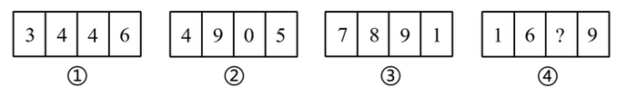
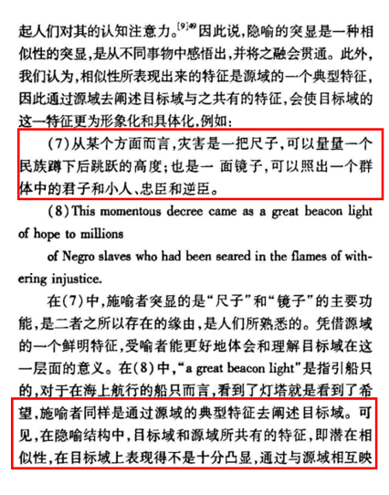

# 2021年广西区考公务员录用考试《行测》题（网友回忆版）

> 判断推理 · 40 题 · 广西 2021

## 第 1 题　qid 3522626 · 图形推理

从所给四个选项中，选择最合适的一项填入问号处，使之呈现一定的规律性。

- **A**. A
- **B**. B　✅
- **C**. C
- **D**. D

**答案**：B

**官方解析**

元素组成不相同，且无明显属性规律，考虑数量规律。图形由若干白球和黑球组成，可以考虑分开看黑球和白球的数量。横行竖行单独看黑球数量和白球数量没有规律，且黑球均出现在九宫格的四角处，可以考虑“米”字型看。“米”字型的四条线上，除最中间的图形外，两端的黑球相加数量为10，两端白球数量相加为10，所以？处应为2个黑球，对应B项。

故正确答案为B。

备注：本题的框架参照我国古代文明图案“河图洛书”所命制（如下图），在河图上，排列成数阵的黑点和白点，蕴藏着无穷的奥秘；在洛书上，纵、横、斜三条线上的三个数字，其和皆等于15。本题选取的即是洛书的排列形式，因此考虑横向、纵向、斜向相加均为15也是可以的。

---

## 第 2 题　qid 3522641 · 图形推理

把下面的六个图形分为两类，使每一类图形都有各自的共同特征或规律，分类正确的一项是：

- **A**. ①②③，④⑤⑥
- **B**. ①②④，③⑤⑥
- **C**. ①③④，②⑤⑥　✅
- **D**. ①③⑥，②④⑤

**答案**：C

**官方解析**

本题为分组分类题目。元素组成不同，优先考虑属性规律。题干出现等腰元素，考虑对称性。①③④三个图形均有一条对称轴，仅为轴对称图形；②⑤⑥三个图形均有两条相互垂直的对称轴，既是轴对称图形也是中心对称图形。即①③④为一组，②⑤⑥为一组。
故正确答案为C。

---

## 第 3 题　qid 3522643 · 图形推理

把下面的六个图形分为两类，使每一类图形都有各自的共同特征或规律，分类正确的一项是：

- **A**. ①③④，②⑤⑥　✅
- **B**. ①③⑤，②④⑥
- **C**. ①②⑥，③④⑤
- **D**. ①④⑥，②③⑤

**答案**：A

**官方解析**

本题为分组分类题目。元素组成不同，无明显属性规律，考虑数量规律。图形均有一条曲线，且曲线和直线交点明显，考虑曲直交点数，但图形曲直交点均为1，无法分组。观察图四切点特征明显，考虑切点数量。图①③④的切点数量均为1，图②⑤⑥的切点数量均为0。即图①③④为一组，图②⑤⑥为一组。
故正确答案为A。

---

## 第 4 题　qid 3523443 · 图形推理

分析下图中图形的变化规律，变化后第五行的图形应该是：

- **A**. A
- **B**. B　✅
- **C**. C
- **D**. D

**答案**：B

**官方解析**

元素组成相同，优先考虑位置规律。观察发现，每一行的图形每次向右平移一格（循环走），B项当选。
故正确答案为B。

---

## 第 5 题　qid 3523447 · 图形推理

若题干最左边的图形编号为1，其余图形的编号依次递增1，编号为90、91、92的图形应该是：

- **A**. A　✅
- **B**. B
- **C**. C
- **D**. D

**答案**：A

**官方解析**

该题为三个图形依次排列且呈周期性遍历，因此图1、图2、图3为一组，图4、图5、图6为一组······以此类推，当遇到3的倍数时恰好为完整的一组结束，因此90号应为上一组的最后一个图，即六面体，91、92为下一组的前两个图形，分别是圆柱、六面体。
故正确答案为A。

---

## 第 6 题　qid 3523511 · 图形推理

右边四个小图形中，只有一个是由左边的四个图形拼合而成（只能通过上、下、左、右平移），请把它找出来。

- **A**. A
- **B**. B
- **C**. C　✅
- **D**. D

**答案**：C

**官方解析**

本题考查平面拼合，可采用平行且等长相消的方式解题。消去平行且等长的线段后进行组合即可得到轮廓图，即为C项。平行且等长相消的方式如下图所示：

故正确答案为C。

---

## 第 7 题　qid 3523454 · 图形推理

把下面的六个图形分为两类，使每一类图形都有各自的共同特征或规律，分类正确的一项是：

- **A**. ①②④，③⑤⑥
- **B**. ①③⑥，②④⑤　✅
- **C**. ①②⑤，③④⑥
- **D**. ①⑤⑥，②③④

**答案**：B

**官方解析**

本题为分组分类题目。元素组成不同，属性规律无答案，考虑数量规律。观察发现，题干出现了圆相交，多端点图形，考虑笔画数，题干笔画数依次为：1、7、1、3、4、1。根据是一笔画还是多笔画分为：①③⑥一组，②④⑤一组。
故正确答案为B。

---

## 第 8 题　qid 3523526 · 图形推理

根据①②③图形的变化规律，编号④的图形中空缺的数字应该是：

- **A**. 8
- **B**. 1
- **C**. 4　✅
- **D**. 2

**答案**：C

**官方解析**

元素组成不同，无明显属性规律，考虑数量规律。观察发现，四幅图均为数字，考虑数面。图①②③内数字中面的总数都是3，则图④内数字中面的总数也应是3，故问号处应选择有1个面的数字，只有C项符合。
故正确答案为C。

---

## 第 9 题　qid 3522623 · 定义判断

化学沉积作用是指在水介质中，以胶体溶液和真溶液形式搬运的物质到达适宜场所后，当化学条件发生变化时，产生沉淀、堆积的过程。其中，胶体溶液是指含有一定大小的固体颗粒物质或高分子化合物的溶液，真溶液是指透明度较高的水溶液。
根据上述定义，下列不属于化学沉积作用的是：

- **A**. 干旱气候区，湖水很少外泄，蒸发作用使湖水的氯化钠增加、累积，变成咸水湖
- **B**. 当海水中的绿色粘土矿物随水流动时，会和含有铝、铁的胶体物质聚合形成海绿石
- **C**. 富含磷质的海水上升至浅海区，因压力减小，温度升高，磷质析出、沉积而形成磷矿
- **D**. 湖泊里的生物骨骼，它们吸收了空气中的二氧化碳形成碳酸钙，当碳酸钙浓度达到一定程度就在海底堆积下来，形成石灰岩　✅

**答案**：D

**官方解析**

第一步：找出定义关键词。

化学沉积作用：“水介质”、“以胶体溶液和真溶液形式搬运”、“当化学条件发生变化时，产生沉淀、堆积”；

胶体溶液：“含有一定大小的固体颗粒物质或高分子化合物的溶液”；

真溶液：“透明度较高的水溶液”。

第二步：逐一分析选项。

A项：湖水是水介质，符合“透明度较高的水溶液”，蒸发使湖水的氯化钠增加累积，变成咸水湖，即湖水搬运的最终物质是氯化钠，符合“当化学条件发生变化时，产生沉淀、堆积”，符合定义，排除；

B项：海水是水介质，符合“透明度较高的水溶液”，绿色粘土矿物随海水流动和含有铝、铁的胶体物质聚合形成海绿石，符合“以胶体溶液和真溶液形式搬运”、“当化学条件发生变化时，产生沉淀、堆积”，符合定义，排除；

C项：海水是水介质，符合“透明度较高的水溶液”，压力减小、温度升高导致磷质析出沉积形成磷矿，符合“以胶体溶液和真溶液形式搬运”、“当化学条件发生变化时，产生沉淀、堆积”，符合定义，排除；

D项：湖泊是水介质，符合“透明度较高的水溶液”，但生物骨骼最终形成的石灰岩不是在真溶液形式搬运下发生的沉淀、堆积，属于生物沉积作用，不符合“当化学条件发生变化时，产生沉淀、堆积”，不符合定义，当选。

本题是选非题，故正确答案为D。

备注：本题很多学生比较纠结A项和D项，如下图所示，A项是在“化学沉积”相关文献中的典型案例，通过对比择优，本题问“不属于”，故小粉笔更倾向把答案给到D项。

---

## 第 10 题　qid 3522631 · 定义判断

农业生产周期指在连续不断的农业再生产过程中，从开始生产到获得产品的整个过程所经过的全部时间，在种植业中一般是从整地开始到产品收获所经过的全部时间，在畜牧业中一般是从饲养幼畜开始到获得畜产品的时间。由于作为农业生产对象的动植物有自身的特性，并且受自然环境影响较大，其生产周期一般比工业生产周期长。
根据上述定义，下列选项涉及农业生产周期的是：

- **A**. 小李耕地、播种、打枝、摘棉花、纺线、织布······年复一年，周而复始　✅
- **B**. 小黄办了一家乡镇企业，从原材料购进、生产管理再到产品销售，他都亲力亲为
- **C**. 小刘今年在承包的荒山种植优质苹果树苗，经科学管理，树苗全部成活且长势良好
- **D**. 小王有个养猪场，虽年复一年重复着把猪崽养大的简单枯燥劳动，但始终干劲十足

**答案**：A

**官方解析**

第一步：找出定义关键词。
“连续不断的农业再生产过程中，从开始生产到获得产品的整个过程所经过的全部时间”、“在种植业中一般是从整地开始到产品收获所经过的全部时间”、“在畜牧业中一般是从饲养幼畜开始到获得畜产品的时间”。
第二步：逐一分析选项。
A项：小李耕地、播种、打枝、摘棉花、纺线、织布……年复一年，周而复始，耕地符合“从整地开始”，“摘棉花”符合“产品收获”，整个流程符合“连续不断的农业再生产过程中，从开始生产到获得产品的整个过程所经过的全部时间”，符合定义，当选；
B项：小黄办企业，买进材料、生产产品、销售产品，属于工业生产活动，不符合“农业再生产过程中”，不符合定义，排除；
C项：小刘种苹果树苗长势良好，没有提到最终是否获得产品，也没有提到是否是连续不断种树苗，不符合“连续不断的农业再生产过程中，从开始生产到获得产品的整个过程所经过的全部时间”，不符合定义，排除；
D项：小王年复一年重复把猪崽养大，畜产品指的是畜牧业生产所获得的产品（包括乳、肉、蛋、毛、皮及其副产品），养大后的猪崽属于牲畜，不属于畜产品，因此最终并未获得畜产品，不符合定义，排除。
注：A项中的纺线、织布虽属于加工业，但前面的耕地到摘棉花涉及了完整的农业生产周期。而D项并未获得畜产品，生产周期不完整。考虑本题提问方式为“涉及”，只有A项涉及了完整的农业生产周期，因此择优选择A项。
故正确答案为A。

---

## 第 11 题　qid 3522634 · 定义判断

相反相成修辞手法是指把通常相互对立、排斥的两个概念或判断巧妙地联系在一起，这样不仅能够揭示出存在于客观事物深层的矛盾辩证关系，还可以增加语言的意蕴。
根据上述定义，下列不属于相反相成修辞手法的是：

- **A**. 横眉冷对千夫指，俯首甘为孺子牛
- **B**. 有的人活着，他已经死了；有的人死了，他还活着
- **C**. 墙上芦苇，头重脚轻根底浅；山中竹笋，嘴尖皮厚腹中空　✅
- **D**. 这一天，死去的伟人在诗的国度里永生；这一天，活着的小丑在人们心上被埋葬

**答案**：C

**官方解析**

第一步：找出定义关键词。
“把通常相互对立、排斥的两个概念或判断巧妙地联系在一起”。
第二步：逐一分析选项。
A项：选项这句话意为对待敌人决不屈服，对人民大众甘愿服务。横眉和俯首是一个人的两个相互对立的态度，符合“把通常相互对立、排斥的两个概念或判断巧妙地联系在一起”，符合定义，排除； 
B项：选项这句话意为有的人虽然活着，但是他的道德败坏，就如已经死了一样没有价值，而有的人死了，他还活着，他的高尚的品格，代代相传，永远激励后人。活着和死了是一个人的两个相互对立的状态，符合“把通常相互对立、排斥的两个概念或判断巧妙地联系在一起”，符合定义，排除； 
C项：选项这句话用芦苇和竹笋比喻那些没有学问只会自吹自擂的人，芦苇和竹笋不符合“相互对立、排斥的两个概念或判断”，不符合定义，当选；
D项：选项这句话表达了不同类型的人在“这一天”的情况，死去和永生、活着和埋葬是一个人的两个相互对立的状态，符合“把通常相互对立、排斥的两个概念或判断巧妙地联系在一起”，符合定义，排除。
本题为选非题，故正确答案为C。

---

## 第 12 题　qid 3523521 · 定义判断

生物浓缩，是指生物有机体或处于同一营养级上的许多生物种群，从周围环境中蓄积某种元素或难分解化合物，使生物有机体内该物质的浓度超过环境中该物质浓度的现象。
根据上述定义，以下涉及到生物浓缩的是：

- **A**. 农业上用于杀死昆虫的DDT通过食物链传递到白头鹰体内，导致生下的蛋皆是软壳的，无法孵化　✅
- **B**. 在湖泊、河流等地方出现的藻类及其他浮游生物迅速繁殖，水质恶化，鱼类及其他生物大量死亡的现象
- **C**. 山羊吃多玉米粒之后，一时间难以消化，再加上山羊饮入水后，玉米长时间聚集在胃内，容易引起胃胀
- **D**. 由于严重的白色污染，原本干净清洁的海滩，如今聚集了大量的塑料袋、瓶子等垃圾，以至于无人问津

**答案**：A

**官方解析**

第一步：找出定义关键词。
“生物有机体或处于同一营养级上的许多生物种群”、“从周围环境中蓄积某种元素或难分解化合物”、“使生物有机体内该物质的浓度超过环境中该物质浓度的现象”。
第二步：逐一分析选项。
A项：白头鹰体内，符合“生物有机体或处于同一营养级上的许多生物种群”，通过食物链传递导致白头鹰体内有DDT，符合“从周围环境中蓄积某种元素或难分解化合物”，白头鹰的蛋壳变软的原因在于有害化学物质DDT逐步在其体内积累的结果，符合“使生物有机体内该物质的浓度超过环境中该物质浓度的现象”，符合定义，当选；
B项：藻类和浮游生物迅速繁殖，鱼类及其他生物大量死亡，是因为鱼类生存所需的营养物质被藻类和浮游生物抢占了，不符合“使生物有机体内该物质的浓度超过环境中该物质浓度的现象”，不符合定义，排除；
C项：山羊吃多玉米粒之后，玉米聚集在胃里引起胃胀，不符合“使生物有机体内该物质的浓度超过环境中该物质浓度的现象”，不符合定义，排除；
D项：干净清洁的海滩受到白色污染，没有涉及生物有机体或者生物种群，不符合“生物有机体或处于同一营养级上的许多生物种群”，不符合定义，排除。
故正确答案为A。

---

## 第 13 题　qid 3522640 · 定义判断

涟漪效应是指在突发事件中，身处不同地区民众所呈现的不同心理状态，越靠近危机事件中心区域，人们对事件的风险认知和负性情绪越高。
根据上述定义，下列符合涟漪效应的是：

- **A**. 台风外围空气旋转剧烈，而处于中心的风力流动反而相对微弱，因此，灾民负性情绪从“暴风眼”区域向外逐渐增强
- **B**. 地震带上的重灾区民众在风险认知、心理健康水平及应对行为上都显著高于非重灾区民众　✅
- **C**. 距离垃圾焚烧厂、核反应堆越近的民众，其风险认知程度越高，因而其忧虑感越强
- **D**. 距离大规模传染疫情爆发的时间越短，民众的焦虑情绪及恐慌程度就越高

**答案**：B

**官方解析**

第一步：找出定义关键词。

“在突发事件中”、“身处不同地区民众所呈现的不同心理状态”、“越靠近危机事件中心区域，人们对事件的风险认知和负性情绪越高”。

第二步：逐一分析选项。

A项：灾民的负性情绪是从“暴风眼”区域向外逐渐增强的，不符合“越靠近危机事件中心区域，人们对事件的风险认知和负性情绪越高”，不符合定义，排除；

B项：地震符合“在突发事件中”，地震带上的重灾区民众在心理健康水平及应对行为上都显著高于非重灾区民众，符合“身处不同地区民众所呈现的不同心理状态”，虽未提及“负性情绪”，但也符合“越靠近危机事件中心区域，人们对事件的风险认知越高”，符合定义，当选；

C项：垃圾焚烧厂、核反应堆，不符合“在突发事件中”，不符合定义，排除；

D项：距离大规模传染疫情爆发的时间越短，是所有人都会面临的，没有体现身处不同地区，不符合“身处不同地区民众所呈现的不同心理状态”，不符合定义，排除。

故正确答案为B。

附原文说明：

---

## 第 14 题　qid 3522624 · 定义判断

自豪是一种产生于对自己的积极评价的情绪，其主要依赖于自我意识、自我评价以及自我反思。基于对成就的不同归因，自豪可分为真实自豪和自大自豪。真实自豪是以成就为导向的一种积极的自豪情绪，其主要来源于个体将成就归因于自身的努力；自大自豪是指一种偏向于消极的自豪情绪，其主要来源于个体将成就归因于自身的天赋。
根据上述定义，下列最符合自大自豪的是：

- **A**. 兴酣落笔摇五岳，诗成笑傲凌沧州
- **B**. 黄金白璧买歌笑，一醉累月轻王侯
- **C**. 俱怀逸兴壮思飞，欲上青天揽明月
- **D**. 天生我材必有用，千金散尽还复来　✅

**答案**：D

**官方解析**

第一步：找出定义关键词。
“偏向于消极的自豪情绪”、“主要来源于个体将成就归因于自身的天赋”。
第二步：逐一分析选项。
A项：“兴酣落笔摇五岳，诗成笑傲凌沧州”出自李白（唐）的《江上吟》，意思是我高兴起来落笔能让五岳震动，写出来的诗足以笑傲天下，表达出作者对自身诗才的自信，其态度是积极的，不符合“偏向于消极的自豪情绪”，不符合定义，排除；
B项：“黄金白璧买歌笑，一醉累月轻王侯”出自李白（唐）的《忆旧游寄谯郡元参军》，意思是花黄金白璧买来宴饮与欢歌笑语时光，一次酣醉使我数月轻蔑王侯将相，作者借喝酒买醉后的情绪轻蔑王侯将相，不符合“主要来源于个体将成就归因于自身的天赋”，不符合定义，排除；
C项：“俱怀逸兴壮思飞，欲上青天揽明月”出自李白（唐）的《宣州谢朓楼饯别校书叔云》，意思是我们都怀有豪情逸兴、雄心壮志，酒酣兴发，更是飘然欲飞，想登上青天摘取明月，不符合“偏向于消极的自豪情绪”，也不符合“主要来源于个体将成就归因于自身的天赋”，不符合定义，排除；
D项：“天生我材必有用，千金散尽还复来”出自李白（唐）的《将进酒》，意思是上天造就了我的才干就必然是有用处的，千两黄金花完了也能够再次获得，该诗句为作者政治上遭遇挫折，符合“偏向于消极的自豪情绪”，有才能就一定有用处，符合“主要来源于个体将成就归因于自身的天赋”，符合定义，当选。
故正确答案为D。

---

## 第 15 题　qid 3523520 · 定义判断

名词的体是指人们对名词指示的人或事物在空间维度所表现出来的诸如数量、大小、形状和结构等特征的一种认知方式或结果。
根据上述定义，下列表现名词的体的是：

- **A**. 激战上甘岭
- **B**. 原始人的独木舟
- **C**. 弯弯的月亮　✅
- **D**. 未来的希望

**答案**：C

**官方解析**

第一步：找出定义关键词。
“名词指示的人或事物”、“在空间维度所表现出来的诸如数量、大小、形状和结构等特征”。
第二步：逐一分析选项。
A项：激战上甘岭，其中“激战”不符合“名词指示的人或事物”，不符合定义，排除；
B项：原始人的独木舟，其中“原始人的”不符合“在空间维度所表现出来的诸如数量、大小、形状和结构等特征”的描述，不符合定义，排除；
C项：弯弯的月亮，其中“月亮”符合“名词指示的人或事物”，“弯弯的”是对月亮形状特征的描述，符合“在空间维度所表现出来的诸如数量、大小、形状和结构等特征”的描述，符合定义，当选；
D项：未来的希望，其中“未来的”不符合“在空间维度所表现出来的诸如数量、大小、形状和结构等特征”的描述，不符合定义，排除。
故正确答案为C。

---

## 第 16 题　qid 3522628 · 定义判断

软暴力是指行为人为谋取不法利益或形成非法影响，对他人或者在有关场所进行滋扰、纠缠、哄闹、聚众造势等，足以使他人产生恐惧、恐慌进而形成心理强制，或者足以影响、限制人身自由、危及人身财产安全，影响正常生活、工作、生产、经营的违法犯罪手段。
根据上述定义，下列属于软暴力的是：

- **A**. 张某威胁王法官，如不秉公判案就举报其贪污的事实
- **B**. 甲公司为了在竞标中获胜，私下散布关于竞争对手的不利信息
- **C**. 某恶势力团伙为了向王某讨要赌债将其堵在酒店房间，24小时看守并不让其睡觉
- **D**. 网贷公司催收员长期使用群呼、群发短信、揭发隐私等手段滋扰欠款人及其紧急联系人、通讯录联系人　✅

**答案**：D

**官方解析**

第一步：找出定义关键词。

“为谋取不法利益或形成非法影响”、“对他人或者在有关场所进行滋扰、纠缠、哄闹、聚众造势”、“使他人产生恐惧、恐慌或影响、限制人身自由、危及人身财产安全，影响正常生活、工作、生产、经营的违法犯罪手段”。

第二步：逐一分析选项。

A项：张某威胁王法官秉公判案，不符合“为谋取不法利益或形成非法影响”，不符合定义，排除；

B项：甲公司为了在竞标中获胜，不符合“为谋取不法利益或形成非法影响”，不符合定义，排除；

C项：某恶势力将王某堵在房间不让其睡觉长达24小时，属于严重的人身强制行为，不属于“对他人或者在有关场所进行滋扰、纠缠、哄闹、聚众造势等”，不符合定义，排除；

D项：网贷公司使用群呼、群发、揭发隐私等手段滋扰欠款人及其紧急联系人、通讯录联系人，符合“对他人进行滋扰”，长期如此，符合“使他人产生恐惧、恐慌或影响”和“影响正常生活、工作、生产、经营的违法犯罪手段”，符合定义，当选。

故正确答案为D。

备注：下图中给出的示例，引自《光明日报》，该案是北京市首例网络“软暴力”的案件，与D项对应，而C项中的“24小时不让其睡觉”，直接限制了人身自由和行为且时间较长，二者比较，D项更符合定义。

---

## 第 17 题　qid 3522638 · 定义判断

转喻是指两个认知对象在空间上或时间上的邻近共存以及其中一个对另一个的凸显可及，从而通过另一种事物来理解和体验当前的事物。
根据上述定义，下列不属于转喻的是：

- **A**. 一间阴暗的小屋里，上面坐着两位老爷，一东一西。东边的一个是马褂，西边的一个是西装
- **B**. 当一个游子想他家乡的时候我猜想它是像菜花一样金黄
- **C**. 灾害是一把尺子，可以测量一个民族蹲下后跳跃的高度　✅
- **D**. 朱门酒肉臭，路有冻死骨

**答案**：C

**官方解析**

第一步：找出定义关键词。

“两个认知对象”、“在空间上或时间上的邻近共存”、“通过另一种事物来理解和体验当前的事物”。

第二步：逐一分析选项。

A项：一间小屋东西各坐着一位老爷，马褂指代东边的老爷，西装指代西边的老爷，人物和身穿的衣服，符合“两个认知对象在空间上的邻近共存”，在特定场合穿着打扮体现着人物的身份，符合“通过另一种事物来理解和体验当前的事物”，符合定义，排除；

B项：选项取自《感情什么颜色》，用颜色来形容感情，家乡一般到处都种着菜花，菜花和家乡就有了空间上的邻近关系，符合“两个认知对象在空间上的邻近共存”，“金黄”的菜花，比喻春天的气息，生动刻画了游子对家乡的神往和思念，符合“通过另一种事物来理解和体验当前的事物”，符合定义，排除；

C项：用灾害这把“尺子”测量“民族蹲下后跳跃的高度”，灾害和尺子不存在空间上或时间上的邻近共存，不符合“两个认知对象在空间上或时间上的邻近共存”，不符合定义，当选；

D项：“朱门酒肉臭，路有冻死骨”意思是贵族人家的红漆大门里散发出酒肉的香味，路边就有冻死的骸骨。其中“朱门”指“贵族人家”，“冻死骨”指“穷苦百姓”，符合“两个认知对象”、“在空间上或时间上的邻近共存”，“朱门的酒肉臭”体现了贵族人家的骄奢淫逸，“路边的冻死骨”体现了穷苦人家的生活惨状，符合“通过另一种事物来理解和体验当前的事物”，符合定义，排除。

本题为选非题，故正确答案为C。

备注：如下图所示，从小粉笔查询到的相关文献来看，C项属于“隐喻”，而非“转喻”。

---

## 第 18 题　qid 3522646 · 定义判断

青春发动时相是指与同龄人相比，青少年自我感觉自身的青春发育水平是提前、适时或是延迟。根据上述定义，下列属于青春发动时相中“适时”的是：

- **A**. 初中生甲的身高是班级男生中最矮的，但其父母认为还算正常
- **B**. 初中生乙脸上长了几颗青春痘，而其他同学都没有，这让他很不自在
- **C**. 初中生丙在生理卫生课上和其他同学一样对异性生理结构充满了好奇
- **D**. 初中生丁在《青春期生理健康发育自我评估量表》各项内容中认真地勾选了“正常”选项　✅

**答案**：D

**官方解析**

第一步：找出定义关键词。
“与同龄人相比”、“青少年自我感觉”、“自身的青春发育水平适时”。
第二步：逐一分析选项。
A项：其父母认为还算正常，不符合“青少年自我感觉”，不符合定义，排除；
B项：其他同学都没有，不符合“自身的青春发育水平适时”，不符合定义，排除；
C项：对异性生理结构充满了好奇，不是对自身的青春发育水平的感觉，不符合定义，排除；
D项：自我评估量表，符合“青少年自我感觉”，认真选择“正常”选项，符合“青少年自我感觉”、“自身的青春发育水平适时”，符合定义，当选。
故正确答案为D。

---

## 第 19 题　qid 3522630 · 定义判断

气候保险是一种为遭受气候风险的资产、生计和生命损失提供支持的保障机制，它通过在一个比较大的空间和时间范围内，投保者定期支付确定的小额保费来应对不确定的气候风险损失，能够确保遭遇直接气候风险损失的投保者获得有效和迅速的资金支持。
根据上述定义，下列属于气候保险承保范围的是：

- **A**. 天气异常干旱造成水稻大面积减产　✅
- **B**. 地震引发山体滑坡，掩埋了山下一处工厂
- **C**. 暴雪封路，导致大批牲畜得不到及时照料而被饿死
- **D**. 上游泄洪造成下游地区发生溃堤，导致当地农作物大面积毁损

**答案**：A

**官方解析**

第一步：找出定义关键词。
“遭受气候风险”、“资产、生计和生命损失”、“投保者定期支付确定的小额保费”、“遭遇直接气候风险损失”、“获得有效和迅速的资金支持”。
第二步：逐一分析选项。
A项：天气异常干旱，属于气候因素，符合“遭受气候风险”，造成水稻大面积减产，符合“资产、生计和生命损失”，且减产是天气异常直接导致的，符合“遭遇直接气候风险损失”，符合定义，当选；
B项：地震引发山体滑坡，属于地质灾害，不符合“遭受气候风险”，不符合定义，排除；
C项：暴雪封路，符合“遭受气候风险”，但最后大批牲畜死亡是得不到及时照料导致的，并非气候因素直接导致的，不符合“遭遇直接气候风险损失”，不符合定义，排除；
D项：上游泄洪造成下游地区发生溃堤，属于人为因素，不符合“遭受气候风险”，不符合定义，排除。
故正确答案为A。

---

## 第 20 题　qid 3523527 · 定义判断

背书品牌指出现在一个产品品牌与服务品牌背后的支持性品牌。背书品牌又叫做父母品牌，被背书的叫子品牌。分两类：一是硬背书品牌，采取企业总品牌子品牌形式。企业总品牌一般是有较长历史，较高知名度及无形资产价值的大品牌，子品牌需借助总品牌吸引消费者。二是软背书品牌，即子品牌前并不直接冠以背书品牌，子品牌是流通的主角，企业总品牌只是为子品牌提供信誉担保。

根据上述定义，下列属于硬背书品牌的是：

- **A**. 别克、欧宝、雪佛莱、凯迪拉克是通用汽车旗下四大主力品牌
- **B**. 某药企的产品都包含有“999”的品牌，如三九胃泰、999感冒灵　✅
- **C**. 浏阳河、京酒、金六福等产品包装上都没标明背书品牌五粮液
- **D**. 无论是潘婷、汰渍，还是舒肤佳，它们都是宝洁公司的产品

**答案**：B

**官方解析**

第一步：找出定义关键词。

背书品牌：“在一个产品品牌与服务品牌背后的支持性品牌”。

硬背书品牌：“总品牌子品牌形式”、“总品牌一般是有较长历史，较高知名度及无形资产价值的大品牌”、“子品牌需借助总品牌吸引消费者”。

软背书品牌：“子品牌前并不直接冠以背书品牌”、“子品牌是流通的主角”、“总品牌只是为子品牌提供信誉担保”。

第二步：逐一分析选项。

A项：别克、欧宝、雪佛莱、凯迪拉克是通用汽车旗下四大主力品牌，不符合“总品牌子品牌形式”、“子品牌需借助总品牌吸引消费者”，不符合定义，排除；

B项：“999”的品牌是总品牌，三九胃泰、999感冒灵是子品牌，符合“总品牌子品牌形式”，符合定义，当选；

C项：浏阳河、京酒、金六福等产品包装上都没标明背书品牌五粮液，符合“子品牌前并不直接冠以背书品牌”，属于软背书品牌，不符合定义，排除；

D项：潘婷、汰渍、舒肤佳都是宝洁公司的产品，不符合“总品牌子品牌形式”、“子品牌需借助总品牌吸引消费者”，不符合定义，排除。

故正确答案为B。

---

## 第 21 题　qid 3522636 · 类比推理

匹马：单枪

- **A**. 万水：千山　✅
- **B**. 花红：柳绿
- **C**. 地久：天长
- **D**. 猴年：马月

**答案**：A

**官方解析**

第一步：判断题干词语间逻辑关系。
匹马是指一匹马，单枪是指一杆枪，二者属于并列关系，并且“匹”和“单”均可以用来表示数量。
第二步：判断选项词语间逻辑关系。
A项：万水和千山为并列关系，并且“万”与“千”均可以用来表示数量，与题干逻辑关系一致，当选；
B项：花红和柳绿为并列关系，但“花”与“柳”不可用来表示数量，与题干逻辑关系不一致，排除；
C项：地久和天长为并列关系，但“地”和“天”不可用来表示数量，与题干逻辑关系不一致，排除；
D项：猴年和马月为并列关系，但“猴”和“马”不可用来表示数量，与题干逻辑关系不一致，排除。
故正确答案为A。

---

## 第 22 题　qid 3522639 · 类比推理

铭心刻骨：记忆

- **A**. 冥思苦想：思想
- **B**. 繁花似锦：繁华
- **C**. 闭月羞花：容貌　✅
- **D**. 冷若冰霜：冷漠

**答案**：C

**官方解析**

第一步：判断题干词语间的逻辑关系。
造句子：铭心刻骨的记忆。二者可以构成偏正结构。
第二步：判断选项词语间逻辑关系。
A项：“冥思苦想”指绞尽脑汁，苦思苦想，与思想没有明显的逻辑关系，排除；
B项：“繁花似锦”是指许多色彩纷繁的鲜花，好像富丽多彩的锦缎，与繁华没有明显的逻辑关系，排除；
C项：“闭月羞花”指女子的容貌美丽，可以造句为闭月羞花的容貌，二者为偏正结构，与题干逻辑关系一致，当选；
D项：“冷若冰霜”比喻待人接物毫无感情，像冰霜一样冷，与冷漠构成近义关系，与题干逻辑关系不一致，排除。
故正确答案为C。

---

## 第 23 题　qid 3522644 · 类比推理

少壮不努力：老大徒伤悲

- **A**. 不入虎穴：焉得虎子
- **B**. 己所不欲：勿施于人
- **C**. 不忘初心：方得始终　✅
- **D**. 若要人不知：除非己莫为

**答案**：C

**官方解析**

第一步：判断题干词语间逻辑关系。
因为 “少壮不努力”，所以“老大徒伤悲”，前者是因，后者是果，二者为因果关系。
第二步：判断选项词语间逻辑关系。
A项：“不入虎穴”是“焉得虎子”的充分条件，与题干逻辑关系不一致，排除；
B项：因果关系必定有先后性，因在前，果在后，“己所不欲”和“勿施于人”没有必然先后性，所以不是因果关系，与题干逻辑关系不一致，排除；
C项：因为“不忘初心”，所以“才得始终”，前者是因，后者是果，二者为因果关系，与题干逻辑关系一致，当选；
D项：“人不知”是“己莫为”的充分条件，与题干逻辑关系不一致，排除。
故正确答案为C。

---

## 第 24 题　qid 3522629 · 类比推理

党员：干部：服务人民

- **A**. 青年：才俊：报效国家　✅
- **B**. 科学：精英：科技立身
- **C**. 大国：工匠：技术强国
- **D**. 学校：教师：教书育人

**答案**：A

**官方解析**

第一步：判断题干词语间逻辑关系。
有的党员是干部，有的党员不是干部，有的干部是党员，有的干部不是党员，二者为交叉关系，党员和干部都是服务人民的主体，与服务人民是对应关系。
第二步：判断选项词语间逻辑关系。
A项：有的青年是才俊，有的青年不是才俊，有的才俊是青年，有的才俊不是青年，二者为交叉关系，青年和才俊都是报效国家的主体，与报效国家是对应关系，与题干逻辑关系一致，当选；
B项：科学和精英不是交叉关系，且科学不是科技立身的主体，与题干逻辑关系不一致，排除；
C项：大国和工匠不是交叉关系，且大国不是技术强国的主体，与题干逻辑关系不一致，排除；
D项：学校是教师的工作地点，二者不是交叉关系，且学校也不是教书育人的主体，与题干逻辑关系不一致，排除。
故正确答案为A。

---

## 第 25 题　qid 3522635 · 类比推理

叔侄：关系：血亲

- **A**. 银河：恒星：宇宙
- **B**. 姑嫂：亲人：家庭
- **C**. 课堂：知识：书本
- **D**. 抑郁：疾病：心理　✅

**答案**：D

**官方解析**

第一步：判断题干词语间逻辑关系。
叔侄是一种关系，血亲是关系种类的限定，三者之间存在种属关系。
第二步：判断选项词语间逻辑关系。
A项：银河和恒星都是宇宙的一部分，银河和恒星分别与宇宙为组成关系，与题干逻辑关系不一致，排除；
B项：姑嫂是家庭的一部分，二者为组成关系，与题干逻辑关系不一致，排除；
C项：课堂和书本都是获取知识的载体，课堂和书本分别与知识为载体对应关系，与题干逻辑关系不一致，排除；
D项：抑郁是一种疾病，心理是疾病种类的限定，三者之间存在种属关系，与题干逻辑关系一致，当选。
故正确答案为D。

---

## 第 26 题　qid 3523522 · 类比推理

就地保护：易地保护

- **A**. 汽车爆胎：汽车漏油
- **B**. 防洪堤：绿化带
- **C**. 纯种繁育：杂交繁育　✅
- **D**. 销售提成：股份分红

**答案**：C

**官方解析**

第一步：判断题干词语间逻辑关系。
就地保护和易地保护是保护生物多样性的两种形式，二者为并列关系，且为并列中的矛盾关系。
第二步：判断选项词语间逻辑关系。
A项：汽车爆胎和汽车漏油均为汽车会出现的故障，二者为并列关系，但是汽车除了爆胎和漏油外还会出现其他故障，所以二者为并列中的反对关系，与题干逻辑关系不一致，排除；
B项：防洪堤是为了防止河流泛滥而建立的堤坝，而绿化带是为了起到绿化的作用，美化环境，二者构不成并列关系，与题干逻辑关系不一致，排除；
C项：纯种繁育是同一品种内进行后代繁育，杂交繁育是不同品种间进行后代繁育，二者为并列关系，且为并列中的矛盾关系，与题干逻辑关系一致，当选；
D项：销售提成与股份分红均为获得收入的两种形式，二者为并列关系，但是获得收入除了销售提成与股份分红外还有其他形式，所以二者为并列关系中的反对关系，与题干逻辑关系不一致，排除。
故正确答案为C。

---

## 第 27 题　qid 3522642 · 类比推理

（    ） 对于 汽车 相当于 （    ） 对于 相机

- **A**. 轮胎 手机
- **B**. 速度 像素
- **C**. 马达 快门　✅
- **D**. 单车 单反

**答案**：C

**官方解析**

逐一代入选项。
A项：轮胎是汽车的组成部分，二者是组成关系，手机和相机是两种电子设备，二者是并列关系，前后逻辑关系不一致，排除；
B项：速度是衡量汽车行驶快慢的指标，二者是必然对应关系，像素是相机中衡量清晰度的指标，但它只适用于数码相机，胶片相机不涉及像素这一概念，二者是或然对应关系，前后逻辑关系不一致，排除；
C项：马达是汽车的组成部分，二者是组成关系，快门是相机的组成部分，二者是组成关系，而且均是必然组成关系，前后逻辑关系一致，当选；
D项：单车和汽车是两种交通工具，二者是并列关系，单反的全称是单镜头反光相机，它是相机的一种，二者是种属关系，前后逻辑关系不一致，排除。
故正确答案为C。

---

## 第 28 题　qid 3522617 · 类比推理

绵羊 对于 （    ） 相当于 （    ） 对于 高粱

- **A**. 麻雀 水稻
- **B**. 老鹰 麦子
- **C**. 羚羊 玉米　✅
- **D**. 山羊 玫瑰

**答案**：C

**官方解析**

逐一代入选项。
A项：绵羊与麻雀都是动物，但绵羊是哺乳动物，而麻雀是鸟类，二者范畴不一致，高粱与水稻都是粮食作物，二者为并列关系，前后逻辑关系不一致，排除；
B项：绵羊与老鹰都是动物，但绵羊是哺乳动物，而老鹰是鸟类，二者范畴不一致，高粱与麦子都是粮食作物，二者为并列关系，前后逻辑关系不一致，排除；
C项：绵羊与羚羊都是反刍类哺乳动物，二者为并列关系，高粱与玉米都是粮食作物，二者为并列关系，前后逻辑关系一致，当选；
D项：绵羊与山羊都是反刍类哺乳动物，二者为并列关系，高粱与玫瑰都是植物，但高粱是粮食作物，玫瑰是观赏性植物，二者范畴不一致，前后逻辑关系不一致，排除。
故正确答案为C。

---

## 第 29 题　qid 3523528 · 类比推理

二氧化碳：珊瑚骨骼：腐蚀

- **A**. 物种灭绝：动物：威胁
- **B**. 天灾人祸：物种：减少
- **C**. 土壤沙化：空气：雾霾
- **D**. 气候变暖：冰川：消融　✅

**答案**：D

**官方解析**

第一步：判断题干词语间逻辑关系。
“二氧化碳”会“腐蚀”“珊瑚骨骼”，题干为因果对应关系。
第二步：判断选项词语间逻辑关系。
A项：“物种灭绝”本身就包含“动物”被“威胁”的意思，与题干逻辑关系不一致，排除；
B项：“天灾人祸”会“减少”“物种”，为因果对应关系，与题干逻辑关系一致，保留；
C项：“土壤沙化”会导致“雾霾”，与题干逻辑关系不一致，排除；
D项：“气候变暖”会“消融”“冰川”，与题干逻辑关系一致，保留。
对于BD两项，题干的“二氧化碳”和D项的“气候变暖”只是独立的一个原因，但B项的原因可以拆分为“天灾”和“人祸”两个原因，因此D项与题干更为一致。
故正确答案为D。

---

## 第 30 题　qid 3522637 · 类比推理

乡风：民俗：乡村文化

- **A**. 德治：法治：治理能力
- **B**. 小学：中学：基础教育　✅
- **C**. 习惯：民约：社会规则
- **D**. 通讯：网络：通信网络

**答案**：B

**官方解析**

第一步：判断题干词语间逻辑关系。
乡风是指乡里的风俗，民俗是指一个国家或民族中广大民众所创造、享用和传承的生活文化，二者是并列关系；乡风和民俗是乡村文化，前两词与第三词均是种属关系。
第二步：判断选项词语间逻辑关系。
A项：德治和法治都是治理方式，与治理能力没有必然联系，与题干逻辑关系不一致，排除；
B项：小学和中学为并列关系，小学和中学属于基础教育，前两词与第三词均是种属关系，与题干逻辑关系一致，当选；
C项：习惯是指积久养成的生活方式，民约是指人们约定共同遵守的契约，民约是一种习惯，二者是种属关系，与题干逻辑关系不一致，排除；
D项：通信网络是网络的一种，通讯和网络不是并列关系，与题干逻辑关系不一致，排除。
故正确答案为B。

---

## 第 31 题　qid 3522619 · 逻辑判断

某实验结果表明：源于植物的“天然化合物”组合可以分解新冠病毒与人细胞相连的刺突蛋白，从而能非常有效地抑制新冠病毒，该化合物组合很可能对抑制暴露在新冠病毒环境中的人群遭受感染方面具有立竿见影的效果。
要得到上述研究推论，还需基于以下哪一前提：

- **A**. 新冠病毒的刺突蛋白会随着传播过程发生突变
- **B**. 新冠病毒主要是通过呼吸道飞沫和密切接触而传播
- **C**. 刺突蛋白是病毒本身将其侵入人体细胞的组成部分　✅
- **D**. 刺突蛋白变异会使传染性更强，药物是否有效还待验证

**答案**：C

**官方解析**

第一步：找出论点和论据。
论点：源于植物的“天然化合物”组合可以分解新冠病毒与人细胞相连的刺突蛋白，从而能非常有效地抑制新冠病毒，该化合物组合很可能对抑制暴露在新冠病毒环境中的人群遭受感染方面具有立竿见影的效果。
论据：无。
本题论点讨论了“天然化合物”组合可以分解新冠病毒与人细胞相连的刺突蛋白，从而能有效地抑制新冠病毒，无明显论据，且提问方式为前提，加强优先考虑补充必要条件。
第二步：逐一分析选项。
A项：选项强调的是新冠病毒的刺突蛋白会发生突变，论点讨论的是“天然化合物”组合可以分解新冠病毒与人细胞相连的刺突蛋白，从而能有效地抑制新冠病毒，话题不一致，不是论点成立的前提条件，排除；
B项：选项讨论的是新冠病毒的传播方式，论点讨论的是“天然化合物”组合可以分解新冠病毒与人细胞相连的刺突蛋白，从而能有效地抑制新冠病毒，话题不一致，不是论点成立的前提条件，排除；
C项：选项表明刺突蛋白是病毒本身将其侵入人体细胞的组成部分，结合论点可以确认“天然化合物”组合能够用于分解新冠病毒与人细胞相连的刺突蛋白，说明该方法具有可行性，是论点成立的前提条件，当选；
D项：选项重点强调的是现有药物是否有效有待验证，但不明确现有药物是否用到了“天然化合物”组合且是否能够有效地抑制新冠病毒，不是论点成立的前提条件，排除。
故正确答案为C。

---

## 第 32 题　qid 3522620 · 逻辑判断

许多人在拍照时喜欢摆出“剪刀手”动作。对此，有人认为，如果手离镜头足够近，相机分辨率足够高，拍出的照片一旦上网，黑客就能通过照片放大技术和人工智能增强技术将照片中的人物指纹信息还原出来。这会让指纹认证及个人身份信息无密可保。因此，拍照时摆出“剪刀手”动作存在安全风险。
以下哪项如果为真，最能质疑上述结论?

- **A**. 目前智能手机虽在高速发展，但是分辨率还不足以拍出清晰的指纹
- **B**. 即使是高清网传照片，通过它还原指纹信息也存在一定的技术门槛
- **C**. 实验证明，网络照片受自身清晰度影响不满足识别指纹信息的条件　✅
- **D**. 从电子照片中提取到用户指纹信息的相关报道，实为愚人节新闻

**答案**：C

**官方解析**

第一步：找出论点和论据。
论点：拍照时摆出“剪刀手”动作存在安全风险。
论据：如果手离镜头足够近，相机分辨率足够高，拍出的照片一旦上网，黑客就能通过照片放大技术和人工智能增强技术将照片中的人物指纹信息还原出来。这会让指纹认证及个人身份信息无密可保。
本题论点讨论的是拍照时摆出“剪刀手”动作存在安全风险，论据讨论的是拍照时摆出“剪刀手”动作会把指纹呈现在照片中，上传到网络后黑客会通过各种技术还原指纹信息，使得指纹认证和个人身份信息无密可保，都是在说手离镜头足够近，会带来安全风险，话题一致，削弱优先考虑削弱论点。
第二步：逐一分析选项。
A项：该项说的是智能手机的分辨率还不足以拍出清晰的指纹，但不明确黑客能否通过一系列技术把指纹信息还原出来并带来安全风险，属于不明确选项，无法削弱，排除；
B项：该项讨论的是通过高清网传照片还原指纹信息存在一定的技术门槛，说明还原指纹信息困难，但是没有明确黑客最终能否通过技术还原指纹并带来安全风险，属于不明确选项，无法削弱，排除；
C项：该项指出网络照片受自身清晰度影响不满足识别指纹信息的条件，从而说明拍照时摆出“剪刀手”动作不会存在安全风险，可以削弱题干论点，当选；
D项：该项说的是这些报道实为愚人节新闻，但不明确拍照时摆出“剪刀手”动作能否带来安全风险，属于不明确选项，无法削弱，排除。
故正确答案为C。

---

## 第 33 题　qid 3522621 · 逻辑判断

小米熬成稀粥后，大分子淀粉会发生水解反应，产生小分子的糊精和少量脂肪，这些成分都浮在粥的表面，稍稍冷却后形成一层薄薄的米油。有人说，小米粥上的这层米油营养价值极高，滋补能力极强，还可以保护胃黏膜。
以下各项如果为真，最能质疑上述观点的组合是：
①未精制的小米富含维生素Bl、B2和钾等成分
②米油没有什么极高营养价值和极强的滋补能力
③米油可助消化，但助消化并不等于营养价值高
④研究证明，米油对胃黏膜没有明显的保护作用

- **A**. ①③
- **B**. ②④
- **C**. ①③④
- **D**. ②③④　✅

**答案**：D

**官方解析**

第一步：找出论点和论据。 

论点：小米粥上的这层米油营养价值极高，滋补能力极强，还可以保护胃黏膜。

论据：无。

本题只有论点，没有论据，削弱可以优先考虑削弱论点，即米油营养价值不高，滋补能力不强，不能保护胃黏膜。

第二步：逐一分析选项。

题干给出了4个条件，逐一分析4个条件。

①该条件指出未精制的小米含有的成分，但是不代表这些成分的营养价值高低、滋补能力强弱和是否能保护胃黏膜，与论点讨论的话题无关，不能削弱；

②该条件指出米油没有极高营养价值和极强的滋补能力，直接削弱论点；

③该条件指出米油可助消化，但助消化不等于营养价值高，说明米油可能营养价值不高，能削弱论点；

备注：因为第③句是否能削弱，有争议，故放上原文供大家参考，在原文中，作者是用“助消化并不等于营养价值高”来质疑论点“米油营养价值极高”这句，是有可以削弱的。

④该条件指出米油对胃黏膜没有明显的保护作用，直接削弱论点。

因此，最能质疑观点的组合是②③④。

故正确答案为D。

---

## 第 34 题　qid 3522622 · 逻辑判断

AI助手在医学应用上有着明显的优势：放射科医生每天要阅读并分析大量的影像，医生会因为疲劳导致效率降低，AI助手则不会，它甚至比人眼能更加迅捷地找到影像中的可疑病变，帮助医生做出初步诊断。
 以下哪项如果为真，最能支持上述结论?

- **A**. 甲医院医生借助AI技术将疑难影像分类归档
- **B**. 乙医院呼吸科借助AI助手完成了一次远程会诊
- **C**. 丙医院放射科利用AI技术半天就可完成对200多个患者的影像诊断　✅
- **D**. 丁医院借助AI助手检测出远程会诊患者胸腔部位的异常征象，并为其确定治疗方案

**答案**：C

**官方解析**

第一步：找出论点和论据。
论点：AI助手在医学应用上有着明显的优势。
论据：放射科医生每天要阅读并分析大量的影像，医生会因为疲劳导致效率降低，AI助手则不会，它甚至比人眼能更加迅捷地找到影像中的可疑病变，帮助医生做出初步诊断。
本题论据讨论的是AI助手与医生相比更不会疲劳、效率更高，可以更快帮助医生做出诊断，论点讨论的是AI助手有着明显的优势，论点和论据话题一致，加强优先考虑补充论据。
第二步：逐一分析选项。
A项：甲医院医生借助AI助手将影像分类归档，但是并未和人类医生做比较，故无法判断AI助手是否在医学应用上有着明显的优势，无法加强，排除；
B项：乙医院借助AI助手完成了一次远程会诊，但是并未和人类医生做比较，故无法判断AI助手是否在医学应用上有着明显的优势，无法加强，排除；
C项：丙医院的放射科利用AI技术半天就可完成200多个患者的诊断，体现了AI助手不会疲惫，能更快帮助医生做出初步诊断，补充论据，可以加强，当选；
D项：丁医院借助AI助手完成对患者的诊断并确定治疗方案，但是并未和人类医生做比较，故无法判断AI助手是否在医学应用上有着明显的优势，无法加强，排除。
故正确答案为C。

---

## 第 35 题　qid 3522648 · 逻辑判断

所有卫星在返回地球大气层时都会焚毁并产生氧化铝微粒，这些微粒会在大气层中飘浮很长时间，最终对环境造成影响。目前大约有6000颗人造卫星环绕地球旋转，其中的卫星已经停止运行，成为太空垃圾。专家警告称，随着人类不断发射卫星和太空飞船，太空垃圾极有可能坠向地球。据此科学家认为，应致力于研发木制人造卫星。

以下哪项如果为真，最能支持上述观点？

- **A**. 
1969年-2006年，我国发射的返回式卫星，其隔热罩由浸渍白橡木制成，时可安全燃烧

- **B**. 
木头不会阻挡电磁波或地球磁场，天线可放置在木制卫星主体内部，使卫星设计更加简单

- **C**. 
科学家已筛选出能有效承受极端温度和空间辐射轰击、可做卫星主体结构的合适木质材料

- **D**. 
木制卫星在回收时可直接燃烧，不会向地球大气层释放有害物质，也不会向地面倾泻碎片
　✅

**答案**：D

**官方解析**

第一步：找出论点和论据。
论点：应致力于研发木制人造卫星。
论据：随着人类不断发射卫星和太空飞船，太空垃圾极有可能坠向地球。
论点讨论的是应该研发木制人造卫星，论据讨论的是卫星等太空垃圾可能产生的危害，二者话题不一致，加强优先考虑搭桥。
第二步：逐一分析选项。
A项：该项说的是我国发射的返回式卫星可安全燃烧，但是并未说明是否会对环境造成影响，话题不一致，无法加强，排除；
B项：该项说的是木制卫星的设计更加简单，但是并未说明木制卫星对环境的影响程度，话题不一致，无法加强，排除；
C项：该项说的是科学家已筛选出可做卫星主体结构的合适木质材料，但是并未说明木制卫星对环境的影响程度，话题不一致，无法加强，排除；
D项：该项说木制卫星在回收时可直接燃烧，不会产生危害，在论据“卫星等太空垃圾可能产生的危害”与论点“木制卫星”之间建立联系，为搭桥项，当选。
故正确答案为D。

---

## 第 36 题　qid 3522649 · 逻辑判断

专家发现，传播疟疾的蚊子被人的气味分子吸引，抗击疟疾的设备负责消除空气中的人体气味，在人体周围制造一个范围为2平方米的电场，让气味分子掉落在地上。这样，传播疟疾的蚊子就找不到它们的猎物了，因为它们在没有气味的空间中会迷失方向。
以下哪项如果为真，最能支持上述观点？

- **A**. 科学家已成功研发出吸引疟疾蚊子的芳香物质，可直接引诱和杀死这些蚊子
- **B**. 现有实验已证实，传播疟疾的蚊子对疟疾患者散发出的人体气味特别感兴趣
- **C**. 传播疟疾的蚊子必须长时间大量吸食血液才能获得繁殖的能量
- **D**. 带疟疾病毒的蚊子无法嗅到人体气味，就会拒绝进食直至死亡　✅

**答案**：D

**官方解析**

第一步：找出论点和论据。
论点：抗击疟疾的设备负责消除空气中的人体气味（即在人体周围制造一个范围为2平方米的电场，让气味分子掉落在地上），这样传播疟疾的蚊子就找不到它们的猎物了。
论据：传播疟疾的蚊子在没有气味的空间中会迷失方向。
论点和论据在讨论消除人体气味对传播疟疾的蚊子的影响，话题一致，考虑补充论据，可以通过解释原因或举例进行加强。
第二步：逐一分析选项。
A项：该项指出芳香物质可直接引诱和杀死传播疟疾的蚊子，与论点中消除人体气味对传播疟疾的蚊子的影响无关，话题不一致，无法加强，排除；
B项：该项指出传播疟疾的蚊子对疟疾患者散发出的人体气味感兴趣，并未说明消除人体气味是否会影响到传播疟疾的蚊子找到猎物，话题不一致，无法加强，排除；
C项：该项指出传播疟疾的蚊子如何获得繁殖的能量，与论点中消除人体气味对传播疟疾的蚊子的影响无关，话题不一致，无法加强，排除；
D项：该项指出带疟疾病毒的蚊子无法嗅到人体气味，就会拒绝进食直至死亡，解释了为什么抗击疟疾的设备消除人体气味后就能使得传播疟疾的蚊子找不到它们的猎物了，属于解释原因，可以加强，当选。
故正确答案为D。

---

## 第 37 题　qid 3522650 · 逻辑判断

野生动物之间因病毒入侵会暴发传染病。最新研究发现，热带、亚热带或低海拔地区的动物，因生活环境炎热，一直面临着罹患传染病的风险。生活在高纬度或高海拔等低温环境的动物，过去因长久寒冬可免于病毒入侵，但现在冬季正变得越来越温暖，持续时间也越来越短。因此，气温升高将加剧野生动物传染病的暴发。
以下哪项如果为真，最能支持上述观点？

- **A**. 无论气候如何变化，生活在炎热地带的动物始终面临着患传染病风险
- **B**. 适应寒带和高海拔栖息地的动物物种遭遇传染病暴发的风险正在升高
- **C**. 气温高低与野生动物患传染病风险之间存在正相关性，即气温越高患病风险越高　✅
- **D**. 寒冷气候可能让野生动物免受病毒入侵，炎热气候却更易导致野生动物感染病毒

**答案**：C

**官方解析**

第一步：找出论点和论据。
论点：气温升高将加剧野生动物传染病的暴发。
论据：热带、亚热带或低海拔地区的动物，因生活环境炎热，一直面临着罹患传染病的风险。生活在高纬度或高海拔等低温环境的动物，过去因长久寒冬可免于病毒入侵，但现在冬季正变得越来越温暖，持续时间也越来越短。
论据讨论的是炎热地区与低温地区对于动物罹患传染病的风险情况，论点讨论的是气温升高将加剧野生动物传染病的暴发，论据论点均在讨论气温与野生动物传染病的关系，话题一致，可以考虑补充论据进行加强。
第二步：逐一分析选项。
A项：该项指出炎热地带的动物始终面临着患传染病风险，而论点的主体为野生动物；同时该项并未说明气温升高是否会加剧野生动物传染病的暴发，话题不一致，无法加强，排除；
B项：该项指出适应寒带和高海拔栖息地的动物物种遭遇传染病暴发的风险正在升高，但并未说明气温升高与野生动物传染病暴发之间的关系，话题不一致，无法加强，排除；
C项：该项指出气温高低与野生动物患传染病风险之间存在正相关性，说明气温升高确实会加剧野生动物传染病的暴发，属于补充论据，可以加强，当选；
D项：该项指出寒冷气候与炎热气候对野生动物感染病毒的风险存在差异，属于重复论据，无法得知气温升高是否会加剧野生动物传染病的暴发，且是一种“可能”的说法，加强力度小于C项，排除。
故正确答案为C。

---

## 第 38 题　qid 3523501 · 逻辑判断

1901年在伊朗苏萨城废墟中出土的罐子上发现了一种古老语言，被称为埃兰语，考古学家最近破译了它。考证发现：埃兰语与美索不达米亚原始楔形文字一样久远，但不是起源于美索不达米亚，而是在古波斯一带使用。与表音并表意的美索不达米亚楔形文字不同，埃兰语是表音语言。考古学家由此推测：埃兰语是古波斯一带人们独立使用的语言。
上述推测如果为真，最能质疑下列哪项观点？

- **A**. 埃兰语由表示音节、辅音和元音的符号构成，遵循由左向右的书写规则
- **B**. 埃兰语大约4000年前在现今西亚一带使用，使用时间可能超过1400年
- **C**. 埃兰语与美索不达米亚原始楔形文字、古埃及的圣书体等语言同时产生
- **D**. 埃兰语源于美索不达米亚原始楔形文字，与楔形文字是母体和子体关系　✅

**答案**：D

**官方解析**

第一步：分析题干。
注意问法为用题干推测来削弱选项观点，所以题干可视为论据。
推测：埃兰语是古波斯一带人们独立使用的语言。
考证发现：埃兰语与美索不达米亚原始楔形文字一样久远，但不是起源于美索不达米亚，而是在古波斯一带使用。与表音并表意的美索不达米亚楔形文字不同，埃兰语是表音语言。
第二步：逐一分析选项。
A项：推测说的是埃兰语是古波斯一带人们独立使用的语言，该项说的是埃兰语的构成符号，遵循的书写规则，话题不一致，无法削弱，排除；
B项：推测说的是埃兰语是古波斯一带人们独立使用的语言，该项说的是埃兰语在现今西亚一带使用过，以及使用时间范围，话题不一致，无法削弱，排除；
C项：推测说的是埃兰语是古波斯一带人们独立使用的语言，该项说的是埃兰语与美索不达米亚原始楔形文字、古埃及的圣书体等语言同时产生，语言同时产生不等同于语言在古波斯一带独立使用，话题不一致，无法削弱，排除；
D项：推测说的是埃兰语是古波斯一带人们独立使用的语言，考证发现说的是埃兰语与表音并表意的美索不达米亚原始楔形文字不同，埃兰语是表音语言，该项说的是埃兰语与美索不达米亚原始楔形文字是母体和子体关系，且埃兰语来源于美索不达米亚原始楔形文字，削弱选项观点，当选。
故正确答案为D。

---

## 第 39 题　qid 3523516 · 类比推理

三位房东甲、乙、丙将自己的房子分别租给租客小李、小张、小王。甲说他租给的是小李；小李说他租的是丙的房子；丙说他租给的是小王。
若这三人均没有说真话，则下列选项正确的是：

- **A**. 房东乙将房子租给了小张
- **B**. 房东丙将房子租给了小李
- **C**. 小王租的是房东乙的房子
- **D**. 小李租的是房东乙的房子　✅

**答案**：D

**官方解析**

第一步：分析题干条件。
（1）甲房租给小李；
（2）小李租丙房；
（3）丙房租给小王；
（4）三个人都没说真话。
第二步：根据题干信息进行推理。
三人都说假话，首先把假话变成真话为：
（1）甲房没租给小李；
（2）小李没租丙房；
（3）丙房没租给小王。
根据最大信息，条件（1）、（2）都提到小李，即小李没租甲房和丙房，则小李一定租的是乙房。
故正确答案为D。

---

## 第 40 题　qid 3522618 · 逻辑判断

最新的两项研究成果引起人们关注：一是利用某种细菌来制造人造肉的蛋白质，该细菌靠吸收温室气体二氧化碳生长，每产生1千克蛋白质约需2千克二氧化碳；二是把从大气中回收的二氧化碳和水合成乙醇，生产1千克乙醇需要1.5千克二氧化碳。专家预测，这些新技术将有助于21世纪中期实现温室气体零排放的目标。
由此可以推出：

- **A**. 利用二氧化碳生产食品和酒类将成为一项新兴产业
- **B**. 未来可以通过人造食品吃掉二氧化碳来减少其排放
- **C**. 只有二氧化碳资源化利用才能实现温室气体零排放
- **D**. 二氧化碳资源化利用可能实现温室气体零排放目标　✅

**答案**：D

**官方解析**

日常结论题，根据题干信息逐一分析选项。
A项：题干前面介绍了两项研究成果，即二氧化碳可以用来制造人造肉的蛋白质以及合成乙醇，但没有提及利用二氧化碳生产食品和酒类将成为一项新兴行业，无中生有，排除；
B项：题干第一项研究成果介绍了二氧化碳可以用来制造人造肉的蛋白质，最后说这些新技术将有助于21世纪中期实现温室气体零排放的目标，这是专家预测的未来的事情，但未来是否真的能通过人造食品吃掉二氧化碳来减少其排放，题干没有提及，无法推出，排除；
C项：根据题干最后一句话，这些新技术将有助于21世纪中期实现温室气体零排放的目标，但没有提及只有二氧化碳资源化利用才能实现温室气体零排放，表述过于绝对，无法推出，排除；
D项：题干前面介绍了两种利用二氧化碳的技术，最后说这些新技术将有助于21世纪中期实现温室气体零排放的目标，可以推出二氧化碳资源化利用可能实现温室气体零排放目标，可以推出，当选。
故正确答案为D。

---
