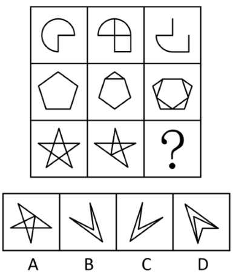
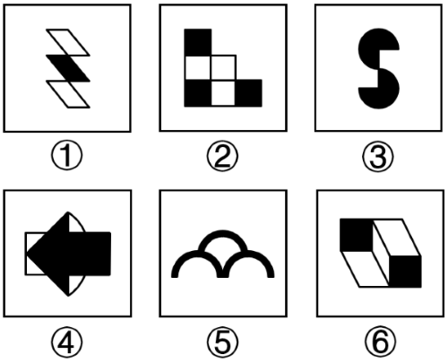

# 2021年度浙江省党政机关选调应届优秀大学毕业生《行测》题（网友回忆版）

> 判断推理 · 15 题 · 浙江 2021

## 第 1 题　qid 5832386 · 逻辑判断

某医生认为，受外伤后不宜食用海鲜。因为海鲜属于“发物”，对人体有刺激性，会导致伤口愈合变慢、伤口复发甚至化脓。
以下哪项如果为真，最能质疑该医生的观点？

- **A**. 传统医学对“发物”的定义并不清晰，其作用机制也缺乏实质性证据
- **B**. 不新鲜或处理不当的海鲜会携带大量致病细菌，食用这种海鲜会使伤口发炎
- **C**. 一些海鲜中富含长链多不饱和脂肪酸，该物质有助于创伤患者修复神经系统
- **D**. 伤口愈合时，身体需要消耗更多的蛋白质，海鲜富含优质蛋白质有利于伤口愈合　✅

**答案**：D

**官方解析**

第一步：找出论点和论据。
论点：受外伤后不宜食用海鲜。
论据：海鲜属于“发物”，对人体有刺激性，会导致伤口愈合变慢、伤口复发甚至化脓。
本题论点说的是受外伤后不宜食用海鲜，论据是对论点的解释说明，二者话题一致，削弱可以考虑削弱论点或削弱论据。
第二步：逐一分析选项。
A项：该项指出传统医学对“发物”的定义并不清晰，其作用机制也缺乏实质性证据，说明无法确定海鲜是否属于“发物”，但未明确指出受外伤是否可以吃海鲜，不明确选项，排除；
B项：该项指出食用不新鲜或处理不当的海鲜会使伤口发炎，讨论的是“不新鲜或处理不当的海鲜”对伤口的影响，而论点说的是“海鲜”对伤口的影响，主体不一致，无法削弱，排除；
C项：该项指出一些海鲜有助于创伤患者修复神经系统，说明有些海鲜有利于创伤患者的恢复，削弱论点，可以削弱，保留；
D项：该项指出海鲜富含优质蛋白质，有利于伤口愈合，说明受外伤后可食用海鲜来促进伤口愈合，削弱论点，可以削弱，保留。
对比C、D两项，C项说“一些”海鲜有助于修复神经系统，但不明确其他海鲜是否对创伤患者有益，而D项直接表明海鲜有利于伤口愈合，且与论证的话题相关度更高，D项的削弱力度更强，当选。
故正确答案为D。

---

## 第 2 题　qid 5832377 · 逻辑判断

研究人员发现一个现象：红外体温测量仪在测量化浓妆的人时会出现较大误差，且测量示数都比测量对象的实际体温低。通过实验，研究人员发现了原因：水类化妆品会因为液体蒸发吸热，导致皮肤表面温度降低；霜类化妆品会在皮肤表面形成一层隔热膜，让红外相机探测到的温度低于皮肤的实际温度。
要得到上述结论，需要补充的重要前提是（    ）。

- **A**. 女性体温一般比男性体温略高
- **B**. 实验所用的化妆品都是市面上常见的产品
- **C**. 这些红外体温测量仪测量的都是面部温度　✅
- **D**. 水类、霜类化妆品的效用都会在4小时内消失

**答案**：C

**官方解析**

第一步：找出论点和论据。
论点：红外体温测量仪在测量化浓妆的人时，测量示数都比测量对象的实际体温低的原因是水类化妆品会因为液体蒸发吸热，导致皮肤表面温度降低；霜类化妆品会在皮肤表面形成一层隔热膜，让红外相机探测到的温度低于皮肤的实际温度。
论据：无。
本题只有论点，没有论据，且提问方式为“前提”，加强优先考虑必要条件。
第二步：逐一分析选项。
A项：该项指出女性体温一般比男性体温略高，讨论的是男女体温差异，而论点讨论的是红外体温测量仪测量化浓妆者的体温低于实际体温的原因，话题不一致，无法加强，排除；
B项：该项指出实验所用的化妆品都是市面上常见的产品，即使不是“常见的”，也能证明化浓妆会导致测量体温低于实际温度，不是论点成立的必要条件，排除；
C项：该项指出这些红外体温测量仪测量的都是面部温度，而实验中提到的化妆品也用于面部，如果红外体温测量仪测量的不是面部温度，就不能得到所测体温低于实际体温的原因是化妆品，是论点成立的必要条件，当选；
D项：该项指出水类、霜类化妆品的效用都会在4小时内消失，讨论的是化妆品的效用时长，而论点没有提到效用时长，话题不一致，无法加强，排除。
故正确答案为C。

---

## 第 3 题　qid 5832393 · 逻辑判断

某课题组在一项调查中发现，家庭收入对子女教育水平有显著影响。年收入超过20万的家庭，其子女考取重点大学的概率是年收入低于10万家庭子女的1.5倍。课题组认为，家庭收入越高，其子女教育水平也越高。
以下哪项如果为真，没有支持该课题组的结论？

- **A**. 很多家境贫寒的学生学习比普通学生更刻苦，但辍学率也更高
- **B**. 普通高中的学生考入高水平大学的概率显著低于重点高中的学生　✅
- **C**. 收入水平高的父母往往对孩子的要求也高，经常会给孩子报补习班
- **D**. 某重点大学中，家庭年收入20万以上的学生占比高于家庭年收入10万以下的学生

**答案**：B

**官方解析**

第一步：找出论点和论据。
论点：家庭收入越高，其子女教育水平也越高。
论据：家庭收入对子女教育水平有显著影响。年收入超过20万的家庭，其子女考取重点大学的概率是年收入低于10万家庭子女的1.5倍。
本题论点论据说的都是“家庭收入”与“子女教育水平”之间的关系，二者话题一致，加强优先考虑补充论据。本题为选非题，将可以加强的选项排除即可。
第二步：逐一分析选项。
A项：该项说的是家境贫寒的学生辍学率更高，那么教育水平自然会降低，说明家庭收入越高其子女教育水平也越高，补充论据，可以加强，排除；
B项：该项将“普通高中”和“重点高中”学生考入高水平大学的概率进行比较，而论点说的是“家庭收入”与“子女教育水平”的关系，话题不一致，无法加强，当选；
C项：该项说的是收入水平高的父母会对孩子有更高的要求，经常给孩子报补习班，这有利于提高孩子的受教育水平，解释了家庭收入越高其子女教育水平也越高的原因，补充论据，可以加强，排除；
D项：该项说的是某重点大学中家庭年收入更高的学生占比更高，举例说明家庭收入越高的学生考上重点大学的几率越大，从而说明家庭收入越高其子女教育水平也越高，补充论据，可以加强，排除。
本题为选非题，故正确答案为B。

---

## 第 4 题　qid 5832392 · 逻辑判断

一项调查显示，若父母均有高血压，子女高血压发病率高达46%，同时约60%的高血压患者有高血压家族史。研究人员据此认为，高血压是会遗传的，所以无法预防。
以下哪项如果为真，最能质疑研究人员的结论？

- **A**. 熬夜、吸烟、喝酒、高钠盐饮食等不健康的生活习惯会引发高血压
- **B**. 若父母中仅有一方患高血压，其子女患高血压的风险也会显著提高
- **C**. 高血压的病因尚不完全明确，治疗方式存在局限性，无法彻底治愈
- **D**. 非高血压人群可以通过慢跑、游泳等有氧运动控制和改善血压水平　✅

**答案**：D

**官方解析**

第一步：找出论点和论据。
论点：高血压是会遗传的，所以无法预防。
论据：若父母均有高血压，子女高血压发病率高达46%，同时约60%的高血压患者有高血压家族史。
本题论点论据均在讨论高血压会遗传，所以无法预防，话题一致，削弱优先考虑削弱论点。
第二步：逐一分析选项。
A项：该项指出不健康的生活习惯会引发高血压，即其他方式也会得高血压，但是与论点讨论的“父母得了高血压会不会遗传给孩子，孩子能不能预防高血压”无关，不能削弱，排除；
B项：该项举例证明高血压与遗传有关系，补充论据加强，无法削弱，排除；
C项：该项指出高血压的病因不明，无法彻底“治愈”，而题干讨论的是高血压的“遗传与预防”，话题不一致，无法削弱，排除；
D项：该项指出“非高血压人群”可以通过运动控制和改善血压，即高血压是可以预防的，可以削弱，当选。
故正确答案为D。

---

## 第 5 题　qid 5832407 · 逻辑判断

专家建议应长期饮用矿泉水，因为矿泉水中有丰富的矿物质元素，可以为身体补充钙质；如果长期饮用纯净水，会导致身体缺钙。
以下哪项如果为真，最能质疑以上论述？

- **A**. 一些矿泉水只是在纯净水中加入了一些矿物质，并非天然矿泉水
- **B**. 矿泉水中的矿物质元素都是以无机状态存在的，不能被人体吸收　✅
- **C**. 正常情况下，人每天从饮水中摄取的钙元素少于从食物中摄取的
- **D**. 纯净水是通过将自来水中的钾、钙等矿物质元素过滤掉而制成的

**答案**：B

**官方解析**

第一步：找出论点和论据。
论点：应长期饮用矿泉水。
论据：矿泉水中有丰富的矿物质元素，可以为身体补充钙质；如果长期饮用纯净水，会导致身体缺钙。
本题论据指出“喝矿泉水可以为身体补充钙质”，论点是据此得出的建议“应长期饮用矿泉水”，二者话题一致，论点为预测或建议时，削弱优先考虑削弱论据。
第二步：逐一分析选项。
A项：该项指出一些矿泉水只是在纯净水中加入了“一些矿物质”，不确定这些矿物质是否包含“钙元素”，为无关项，无法削弱，排除；
B项：该项指出矿泉水中的矿物质元素不能被人体吸收，因此矿泉水中的钙元素也不能被人体吸收，无法起到补充钙质的作用，削弱论据，当选；
C项：该项指出从饮水中摄取的钙元素少于从食物中摄取的钙元素，但并未提及应饮用哪种水来补充钙质，话题不一致，无法削弱，排除；
D项：该项指出“纯净水”不含钙元素，解释了论据中“长期饮用纯净水，会导致身体缺钙”的原因，补充论据，无法削弱，排除。
故正确答案为B。

---

## 第 6 题　qid 5832396 · 类比推理

心脏：器官：毛发

- **A**. 玫瑰：植物：生物
- **B**. 内存：硬件：显示器
- **C**. 水银：金属：钻石　✅
- **D**. 猫：生肖：龙

**答案**：C

**官方解析**

第一步：判断题干词语间逻辑关系。
心脏是器官，前两词为种属关系；毛发不是器官，后两词为反向种属关系。
第二步：判断选项词语间逻辑关系。
A项：玫瑰是植物，植物是生物，前两词与后两词均为种属关系，与题干逻辑关系不一致，排除；
B项：内存和显示器均是硬件，前两词与后两词均为种属关系，与题干逻辑关系不一致，排除；
C项：水银，即汞，是金属，前两词为种属关系；钻石不是金属，后两词为反向种属关系，与题干逻辑关系一致，当选；
D项：猫不是生肖，前两词为反向种属关系；龙是生肖，后两词为种属关系，但第一词和第三词的顺序反了，与题干逻辑关系不一致，排除。
故正确答案为C。

---

## 第 7 题　qid 5832400 · 类比推理

（    ） 对于 引力 相当于 胰脏 对于 （    ）

- **A**. 地球 血糖
- **B**. 距离 肾上腺素
- **C**. 斥力 糖尿病
- **D**. 电磁力 脾脏　✅

**答案**：D

**官方解析**

逐一代入选项。
A项：地球有引力，二者为对应关系；血糖指静脉血浆中的葡萄糖浓度，和胰脏无明显逻辑关系，前后逻辑关系不一致，排除；
B项：距离会影响引力，二者为对应关系；肾上腺素由肾上腺释放，和胰脏无明显逻辑关系，前后逻辑关系不一致，排除；
C项：引力和斥力为并列关系；胰脏分泌胰岛素不足会引发糖尿病，二者为对应关系，前后逻辑关系不一致，排除；
D项：引力和电磁力是两种不同的基本力，除此之外还有弱相互作用力、强相互作用力，因此二者为反对关系；胰脏和脾脏是两种不同的脏器，二者为反对关系，前后逻辑关系一致，当选。
故正确答案为D。

---

## 第 8 题　qid 5832412 · 类比推理

人：稻草人：纸人

- **A**. 花：窗花：塑料花　✅
- **B**. 狗：看门狗：加密狗
- **C**. 车：风车：马车
- **D**. 床：河床：病床

**答案**：A

**官方解析**

第一步：判断题干词语间逻辑关系。
稻草人和纸人都是假人，二者都不是真人，后两个词与第一个词为反向种属关系。
第二步：判断选项词语间逻辑关系。
A项：窗花和塑料花都是假花，二者都不是真花，后两个词与第一个词为反向种属关系，与题干逻辑关系一致，当选；
B项：看门狗是狗，二者为种属关系，与题干逻辑关系不一致，排除；
C项：马车是车，二者为种属关系，与题干逻辑关系不一致，排除；
D项：病床是床，二者为种属关系，与题干逻辑关系不一致，排除。
故正确答案为A。

---

## 第 9 题　qid 5832438 · 类比推理

注册：登录：注销

- **A**. 审问：扣押：释放
- **B**. 起飞：降落：返航
- **C**. 创作：出版：印刷
- **D**. 成立：运营：倒闭　✅

**答案**：D

**官方解析**

第一步：判断题干词语间逻辑关系。
首先注册，其次登录，最后注销，三者为时间先后顺序的对应关系，且三个动作可以是同一主体发出。
第二步：判断选项词语间逻辑关系。
A项：存在先审问，再扣押的情况，也存在先扣押，再审问的情况，二者之间没有必然的时间先后顺序，与题干逻辑关系不一致，排除；
B项：可以先起飞，再降落，最后返航，但也可以先起飞，中途返航，最后降落，降落和返航之间没有必然的时间先后顺序，与题干逻辑关系不一致，排除；
C项：首先创作，其次出版，最后印刷，三者为时间先后顺序的对应关系，创作的主体是作者，出版的主体是出版社，印刷的主体是印刷厂，三者的主体不一致，与题干逻辑关系不一致，排除；
D项：首先成立，其次运营，最后倒闭，三者为时间先后顺序的对应关系，且三个动作可以是同一主体发出，与题干逻辑关系一致，当选。
故正确答案为D。

---

## 第 10 题　qid 5832423 · 类比推理

大熊猫 对于 （    ） 相当于 （    ） 对于 青春

- **A**. 中国 绿色　✅
- **B**. 龙 生命
- **C**. 国宝 大自然
- **D**. 稀有 希望

**答案**：A

**官方解析**

逐一代入选项。
A项：大熊猫是中国的国宝，象征着中国，二者为比喻象征义；绿色象征着青春，二者为比喻象征义，前后逻辑关系一致，当选；
B项：大熊猫是中国的国宝，象征着中国，龙是中国古代传说中的神异动物，象征着中国和中华民族，二者为并列关系；青春可以指青年时期，是生命中的一部分，二者为组成关系，前后逻辑关系不一致，排除；
C项：大熊猫是中国的国宝，二者为种属关系；大自然和青春没有明显的逻辑关系，前后逻辑关系不一致，排除；
D项：大熊猫是稀有动物，稀有是其属性，二者为属性对应关系；青春象征着希望，二者为比喻象征义，前后逻辑关系不一致，排除。
故正确答案为A。

---

## 第 11 题　qid 5832448 · 图形推理

从所给的四个选项中，选择最合适的一个填入问号处，使之呈现一定的规律性（    ）。

- **A**. A
- **B**. B
- **C**. C
- **D**. D　✅

**答案**：D

**官方解析**

元素组成不同，且无明显属性规律，考虑数量规律。题干每幅图形均由黑球和白球构成，且黑球存在明显断开，优先考虑部分数。九宫格优先横向看，观察发现，黑球部分数整体没有规律，考虑白球部分数。第一行中，每幅图形白球的部分数均为1；第二行中，每幅图形白球的部分数均为2；第三行中，前两幅图形白球的部分数均为3，故“？”处应用此规律，白球的部分数应为3，只有D项符合。
故正确答案为D。

---

## 第 12 题　qid 5832468 · 图形推理

把下面六个图形分为两类，使每一类图形都有各自的共同特征或规律，分类正确的一项是：

- **A**. ①②③，④⑤⑥
- **B**. ①②⑤，③④⑥　✅
- **C**. ①③⑥，②④⑤
- **D**. ①④⑤，②③⑥

**答案**：B

**官方解析**

本题为分组分类题目。元素组成不同，且无明显属性规律，考虑数量规律。观察发现，题干出现多个圆相切的变形图，优先考虑笔画数。图①②⑤均为一笔画图形，图③④⑥均为两笔画图形。即图①②⑤为一组，图③④⑥为一组。
故正确答案为B。

---

## 第 13 题　qid 5832444 · 图形推理

从所给的四个选项中，选择最合适的一个填入问号处，使之呈现一定的规律性（    ）。

- **A**. A
- **B**. B
- **C**. C　✅
- **D**. D

**答案**：C

**官方解析**

元素组成相似，优先考虑样式规律。九宫格优先横向看，第一行中，图一和图二求异得到图三；经验证，第二行满足此规律；第三行应用此规律，图一和图二求异，只有C项符合。
故正确答案为C。

---

## 第 14 题　qid 5832459 · 图形推理

把下面六个图形分为两类，使每一类图形都有各自的共同特征或规律，分类正确的一项是（    ）。

- **A**. ①②③，④⑤⑥　✅
- **B**. ①②⑤，③④⑥
- **C**. ①②④，③⑤⑥
- **D**. ①③④，②⑤⑥

**答案**：A

**官方解析**

本题为分组分类题目。元素组成不同，且无明显属性规律，考虑数量规律。观察发现，题干图形均由直线构成，且存在明显的平行线，优先考虑平行线数量。图①②③中，均有一组平行线，图④⑤⑥中，均有两组平行线。即图①②③为一组，图④⑤⑥为一组。
故正确答案为A。

---

## 第 15 题　qid 5832461 · 图形推理

把下面六个图形分为两类，使每一类图形都有各自的共同特征或规律，分类正确的一项是（    ）。

- **A**. ①②③，④⑤⑥
- **B**. ①③⑤，②④⑥
- **C**. ①③⑥，②④⑤　✅
- **D**. ①④⑥，②③⑤

**答案**：C

**官方解析**

本题为分组分类题目。元素组成不同，优先考虑属性规律。观察发现，题干出现多个等腰元素，优先考虑对称性。图①③⑥均为中心对称图形，图②④⑤均为轴对称图形，即图①③⑥为一组，图②④⑤为一组。
故正确答案为C。

---
