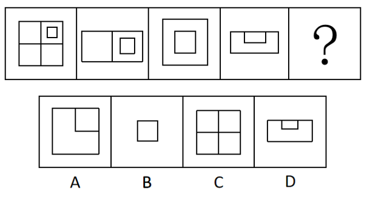
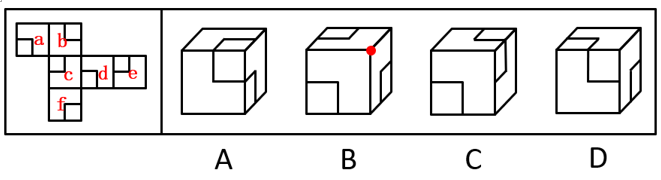
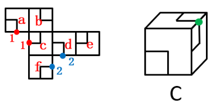
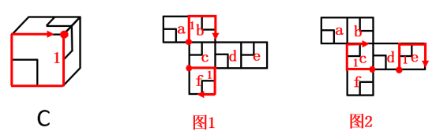
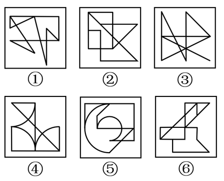
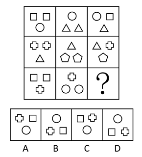
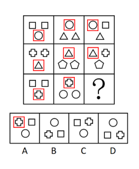
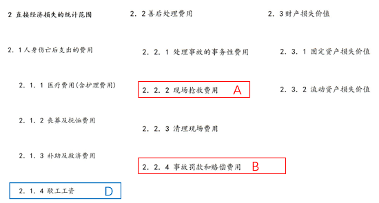
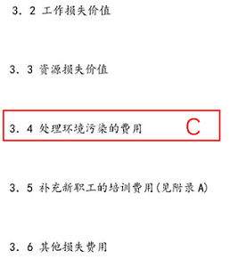
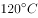

# 2021年新疆公务员录用考试《行测》试题（网友回忆版）

> 判断推理 · 35 题 · 新疆 2021

## 第 1 题　qid 4630364 · 图形推理

从所给的四个选项中，选择最合适的一个填入问号处，使之呈现一定的规律性：

- **A**. A　✅
- **B**. B
- **C**. C
- **D**. D

**答案**：A

**官方解析**

本题考查翻折。图一从水平中间位置进行翻折可得到图二，图二从竖直中间位置进行翻折可得到图三，图三从水平中间位置进行翻折可得到图四，因此，问号处应该是图四从竖直中间位置进行翻折得到，只有A项符合。
故正确答案为A。

---

## 第 2 题　qid 4630369 · 图形推理

从所给的四个选项中，选择最合适的一个填入问号处，使之呈现一定的规律性：

- **A**. A
- **B**. B
- **C**. C　✅
- **D**. D

**答案**：C

**官方解析**

解法一：元素组成不同，且无明显属性规律，考虑数量规律。观察发现题干图形均有一个面，但无法排除选项，考虑面的细化。发现题干图形中的面都是轴对称图形，排除A、D两项；继续观察发现，题干图形都存在一条出头线与面相连，且出头线的方向依次为竖、横、斜、竖、横，故？处应填入出头线方向为斜的图形，排除B项。
故正确答案为C。
解法二：元素组成不同，且无明显属性规律，考虑数量规律。观察发现题干图形均有一个面，但无法排除选项，考虑面的细化。发现题干图形中的面都是轴对称图形，排除A、D两项；继续观察发现，题干图形都存在一条出头线与面相交于点，通过该交点能引出图形的对称轴，排除C项。
故正确答案为B。
注：解法一和解法二均根据面的对称性和出头线的规律选出答案，但题干图形出头线方向“竖、横、斜”的遍历规律明显，因此粉笔更倾向于选C。

---

## 第 3 题　qid 4630374 · 图形推理

下图是给定纸盒的外表面，以下哪一项能由它折叠而成？

- **A**. A
- **B**. B
- **C**. C
- **D**. D　✅

**答案**：D

**官方解析**

将题干展开图标上序号，如下图所示，逐一分析选项。

A项：选项中正前方和上方两个面的小方块边相接，只可能为面b和面e，标出两个面中小方块相接的点（点1），在展开图中，与该点相连的面为面d，故选项中三个面为面b、面d和面e。在选项中，面d与面b或面e中的一个面存在方块相接的点（点2），而在展开图中，面d中小方块与这两个面均不相交，选项与展开图不一致，排除；

B项：选项中三个面的小方块均与公共边没有交点，而在展开图中不存在三个面的小方块与公共边没有交点，选项与展开图不一致，排除；

C项：观察题干展开图，若想出现选项中右侧和上方两个面的小方块存在一个点相接的情况，只可能为面a和面c（两个面的小方块相交于点1）或者面d和面f（两个面的小方块相交于点2），如下图所示：

当右侧和上方的两个面为面a和面c时，正前方的面可能为面b或面f，以三个面的公共点为起点，对立体图形中正前方的面和展开图中面b、面f顺时针画边，在选项中，边1与相邻面的小方块相交，而在展开图中，面b和面f中的边1均没有与相邻面的小方块相交，如图1所示，选项与展开图不一致，排除；

当右侧和上方的两个面为面d和面f时，正前方的面可能为面c和面e，以三个面的公共点为起点，对面c、面e顺时针画边，在选项中，边1与相邻面中的小方块相交，而在展开图中，面c和面e的边1均没有与相邻面的小方块相交，如图2所示，选项与展开图不一致，排除；

D项：选项由面a、面b与面c构成，选项与展开图一致，当选。

故正确答案为D。

---

## 第 4 题　qid 4630433 · 图形推理

把下面的六个图形分为两类，使每一类图形都有各自的共同特征或规律，分类正确的一项是：

- **A**. ①③④，②⑤⑥
- **B**. ①③⑤，②④⑥　✅
- **C**. ①②⑥，③④⑤
- **D**. ①④⑥，②③⑤

**答案**：B

**官方解析**

本题为分组分类题目。元素组成不同，且无明显属性规律，优先考虑数量规律。观察发现，图①为明显一笔画图形，图③中含有明显的出头端点，考虑笔画数。如下图所示，图①③⑤的奇点数都是2，为一笔画图形，图②④⑥的奇点数都是4，为两笔画图形。即图①③⑤为一组，图②④⑥为一组。

故正确答案为B。

---

## 第 5 题　qid 4630437 · 图形推理

从所给四个选项中，选择最适合的一个填入问号处，使之呈现一定的规律性：

- **A**. A　✅
- **B**. B
- **C**. C
- **D**. D

**答案**：A

**官方解析**

元素组成相似，且相同元素重复出现，优先考虑遍历。九宫格优先看横行，如下图所示，第一行图形中，图1和图2相同的小图形圆，移动到图3左上角的位置，第二行图形中，图1和图2相同的小图形三角形，移动到图3左上角的位置，验证符合此规律，第三行应用此规律，图1和图2相同的图形为十字多边形，则？处左上角的图形为十字多边形，只有A项符合。

故正确答案为A。

---

## 第 6 题　qid 4630365 · 定义判断

社会协商是指社会公众就广泛存在的基层社会矛盾或问题所展开的协商解决方式，是基层群众自治范畴内的一种民主决策方式。
根据上述定义，下列属于社会协商的是：

- **A**. 某市市长在接待日接待来访的市民
- **B**. 某市为调整煤气价格举行公开听证
- **C**. 为解决宠物粪便清理问题，社区召开居民议事会　✅
- **D**. 电视台就化解停车难问题邀请专家进行电视评论

**答案**：C

**官方解析**

第一步：找出定义关键词。
“社会公众协商解决基层社会矛盾或问题”、“基层群众自治范畴”。
第二步：逐一分析选项。
A项：该项中市长接待来访的市民，并不是基层群众的自治行为，不符合“基层群众自治范畴”，不符合定义，排除；
B项：该项中某市举行公开听证，主导是政府机关，并不是基层群众的自治行为，不符合“基层群众自治范畴”，不符合定义，排除；
C项：该项中社区召开居民议事会，属于基层群众之间协商解决问题的一种方式，符合“社会公众协商解决基层社会矛盾或问题”、“基层群众自治范畴”，符合定义，当选；
D项：该项中电视台邀请专家进行电视评论，评论只是在发表自己的观点，并非通过协商来解决问题，不符合“社会公众协商解决基层社会矛盾或问题”，不符合定义，排除。
故正确答案为C。

---

## 第 7 题　qid 4630368 · 定义判断

乡愁经营指那些凭借历史典故、自然风光发展旅游，将地方饮食推向市场，在古村落搞商业开发活动，将能够聚集“乡愁”的资源转化为商品与服务的经营行为。
根据上述定义，下列属于乡愁经营的是：

- **A**. 某皖南村落借助历史传说，在一个风景秀丽的山边建设了成片具有徽派建筑风格的房屋，开办“农家乐”餐馆，吸引了众多游人前来赏景消费　✅
- **B**. 某市进行大面积危旧房屋改造，将大量明清风格的危旧房屋全部拆除，高标准兴建高新技术开发区，吸引众多海内外投资
- **C**. 某地小吃享有盛名，地方政府近来兴建小吃城，不但引进本地小吃，而且还汇聚了全国各地的著名小吃，然而，前来品尝的食客并不见多
- **D**. 某市计划将一坐落在僻静悠远深山里的古镇打造成一座新城，为此他们请来了国际著名的设计师，投入巨资建设

**答案**：A

**官方解析**

第一步：找出定义关键词。
“凭借历史典故、自然风光发展旅游”、“将地方饮食推向市场，在古村落搞商业开发活动”、“将能够聚集‘乡愁’的资源转化为商品与服务”。
第二步：逐一分析选项。
A项：某皖南村落借助历史传说，符合“凭借历史典故、自然风光发展旅游”，建设徽派建筑风格的房屋，开办“农家乐”餐馆，吸引游人赏景消费，符合“将地方饮食推向市场，在古村落搞商业开发活动”、“将能够聚集‘乡愁’的资源转化为商品与服务”，符合定义，当选；
B项：某市将大量明清风格的危旧房屋全部拆除，不符合“凭借历史典故、自然风光发展旅游”，不符合定义，排除；
C项：某地小吃享有盛名，地方政府兴建小吃城，不符合“凭借历史典故、自然风光发展旅游”，不符合定义，排除；
D项：某市计划将坐落在深山里的古镇打造成新城，不符合“凭借历史典故、自然风光发展旅游”，不符合定义，排除。
故正确答案为A。

---

## 第 8 题　qid 4630371 · 定义判断

超限效应指刺激过多、过强或作用时间过久，从而引起被刺激者极不耐烦或逆反的心理现象。
根据上述定义，下列行为中不属于超限效应的是：

- **A**. 某药店店员遭顾客投诉，店长对该店员进行了罚款200元的处罚并进行严厉批评，后又多次在全体店员会议上提及此事，导致该店员辞职
- **B**. 小强期中考试语文、数学意外只考了80多分，爸妈很失望，常在临睡前批评他，小强渐渐感到烦躁，结果期末考试只考了70多分
- **C**. 赵老师喜欢“拖堂”，结果期中考试时有一题一半同学都做错了，而该题就是他在某一次“拖堂”时所讲的内容
- **D**. 张老师中考前召开班会，强调考试注意事项，有同学迟到了几分钟，当晚她又给所有同学及家长发了短信，再次告知班会内容　✅

**答案**：D

**官方解析**

第一步：找出定义关键词。
“刺激过多、过强或作用时间过久”、“引起被刺激者极不耐烦或逆反的心理现象”。
第二步：逐一分析选项。
A项：店长对店员进行了罚款并严厉批评，后又多次提及此事，符合“刺激过多、过强或作用时间过久”，导致该店员辞职，符合“引起被刺激者极不耐烦或逆反的心理现象”，符合定义，排除；
B项：爸妈因期中考试成绩对小强很失望，常在临睡前批评他，符合“刺激过多、过强或作用时间过久”，小强渐渐感到烦躁，结果期末考试成绩更差了，符合“引起被刺激者极不耐烦或逆反的心理现象”，符合定义，排除；
C项：赵老师喜欢“拖堂”，符合“刺激过多、过强或作用时间过久”，考试中赵老师“拖堂”时讲的题目有一半同学都做错了，符合“引起被刺激者极不耐烦或逆反的心理现象”，符合定义，排除；
D项：张老师召开班会强调中考注意事项，因部分同学迟到，当晚给所有同学及家长发了短信，再次告知班会内容，不符合“刺激过多、过强或作用时间过久”，同时未体现同学和家长对此的反应，不符合“引起被刺激者极不耐烦或逆反的心理现象”，不符合定义，当选。
本题为选非题，故正确答案为D。

---

## 第 9 题　qid 4630376 · 定义判断

《中华人民共和国产品质量法》第二条规定“在中华人民共和国境内从事产品生产、销售活动，必须遵守本法。”这里所称产品是指经过加工、制作，用于销售的产品，不包括内在质量主要取决于自然因素的产品。
根据上述说法，下列选项不属于产品质量法调整范围的是：

- **A**. 东莞的某工厂专门为英国一科技公司组装VR产品，销往英国
- **B**. 中国人张亮赴泰国采购了2吨榴莲水果回中国国内销售　✅
- **C**. 美国人杰克从中国采购了1万件服装回美国销售
- **D**. 个体户小王每天生产豆腐到农贸市场销售

**答案**：B

**官方解析**

第一步：找出定义关键词。
“在中华人民共和国境内”、“从事产品生产、销售活动”、“不包括内在质量主要取决于自然因素的产品”。
第二步：逐一分析选项。
A项：东莞某工厂组装VR产品，符合“在中华人民共和国境内”、“从事产品生产、销售活动”，同时组装产品的质量取决于人工因素，也符合“不包括内在质量主要取决于自然因素的产品”，符合定义，排除；
B项：张亮赴泰国采购榴莲水果回国内销售，但榴莲水果属于自然生长的产物，产品质量取决于自然因素，不符合“不包括内在质量主要取决于自然因素的产品”，不符合定义，当选；
C项：杰克从中国采购服装，符合“在中华人民共和国境内”、“从事产品生产、销售活动”，同时服装的质量取决于人工因素，也符合“不包括内在质量主要取决于自然因素的产品”，符合定义，排除；
D项：小王生产豆腐到农贸市场销售，符合“在中华人民共和国境内”、“从事产品生产、销售活动”，同时豆腐的质量取决于人工因素，也符合“不包括内在质量主要取决于自然因素的产品”，符合定义，排除。
本题为选非题，故正确答案为B。

---

## 第 10 题　qid 4630386 · 定义判断

底线思维指在困难面前做好最坏打算，临危不乱地做好充分准备，以实际行动从容应对困难的一种积极思维和心态。
根据上述定义，下列属于底线思维的是：

- **A**. 面临明年可能来临的“五十年一遇”降雨，J市对市政排水系统进行了彻底升级改造，将设计标准提升到“百年一遇”　✅
- **B**. 由于工作成绩突出，小王获得了年度先进个人的表彰，但他对明年的工作仍不敢大意，努力把工作计划做得更加充分
- **C**. 某公司每次面临危机，但最终都能在罗经理的带领下走出困境，这很大程度上得益于他的豁达心态
- **D**. 伴随着技术变革和媒体整合，很多媒体经营出现困难，但N报业始终坚持职业操守，守住底线

**答案**：A

**官方解析**

第一步：找出定义关键词。
“在困难面前”、“做好最坏打算，临危不乱地做好充分准备，以实际行动从容应对困难”。
第二步：逐一分析选项。
A项：面临明年可能来临的“五十年一遇”降雨，符合“在困难面前”，J市将市政排水系统升级改造的设计标准提升到“百年一遇”，符合“做好最坏打算，临危不乱地做好充分准备，以实际行动从容应对困难”，符合定义，当选；
B项：小王只是对明年工作仍不敢大意，并未体现小王遇到困难，不符合“在困难面前”，不符合定义，排除；
C项：某公司每次面临危机，符合“在困难面前”，但最终走出困境主要得益于罗经理的豁达心态，并未体现做好最坏打算、做好充分准备，不符合“做好最坏打算，临危不乱地做好充分准备，以实际行动从容应对困难”，不符合定义，排除；
D项：很多媒体经营出现困难，符合“在困难面前”，但N报业始终坚持职业操守，并未体现做好最坏打算、做好充分准备，不符合“做好最坏打算，临危不乱地做好充分准备，以实际行动从容应对困难”，不符合定义，排除。
故正确答案为A。

---

## 第 11 题　qid 4630375 · 定义判断

易感人群指基于维护自身权益的切实需要，极易对相关消息、传闻或网络信息、相关政策等产生共鸣，并采取转发、点评乃至在现实生活中积极行动的方式放大相关信号的人群。
根据上述定义，下列不属于易感人群的是：

- **A**. 买了新房的小李夫妇经常关注有关商品房质量的投诉报道，拿到房后立即请专业人员对所购房屋进行详细查验，并将查验过程群发给所有朋友
- **B**. 小江今年参加高考，在填报志愿时，无法确定自己该填报哪几所高校，于是通过QQ询问了最要好的同学，之后小江选择填报了同类高校　✅
- **C**. 吴某收到一条微信消息，说中国与某国签署免签证协议。因为他儿子在该国留学，于是立刻将这一消息转发到朋友圈
- **D**. 老王因儿子在美国工作，手头上有一些美元积蓄，平时非常关注美元的汇率及相关信息，并经常与朋友们交流分享他的看法

**答案**：B

**官方解析**

第一步：找出定义关键词。
“基于维护自身权益的切实需要”、“极易对相关消息、传闻或网络信息、相关政策等产生共鸣”、“采取转发、点评乃至在现实生活中积极行动的方式放大相关信号”。
第二步：逐一分析选项。
A项：买了新房的小李夫妇经常关注有关商品房质量的投诉报道，说明该报道与他们的自身权益有关，符合“基于维护自身权益的切实需要”，也符合“极易对相关消息、传闻或网络信息、相关政策等产生共鸣”，同时将房屋查验过程群发给所有朋友，符合“采取转发、点评乃至在现实生活中积极行动的方式放大相关信号”，符合定义，排除；
B项：小江在填报高考志愿时不确定填报哪几所高校，说明该选择与他的自身权益有关，符合“基于维护自身权益的切实需要”，但并未体现他对相关消息等产生共鸣，不符合“极易对相关消息、传闻或网络信息、相关政策等产生共鸣”，同时询问最要好的同学，也不符合“采取转发、点评乃至在现实生活中积极行动的方式放大相关信号”，不符合定义，当选；
C项：吴某收到关于中国与某国签署免签证协议的微信消息，且他儿子在该国留学，说明该协议与他的自身权益有关，符合“基于维护自身权益的切实需要”，也符合“极易对相关消息、传闻或网络信息、相关政策等产生共鸣”，同时立刻转发消息到朋友圈，符合“采取转发、点评乃至在现实生活中积极行动的方式放大相关信号”，符合定义，排除；
D项：老王因儿子在美国工作，手头上有一些美元积蓄，平时非常关注美元的汇率及相关信息，说明美元的汇率及相关信息与他的自身权益有关，符合“基于维护自身权益的切实需要”，也符合“极易对相关消息、传闻或网络信息、相关政策等产生共鸣”，同时经常与朋友们交流分享他的看法，符合“采取转发、点评乃至在现实生活中积极行动的方式放大相关信号”，符合定义，排除。
本题为选非题，故正确答案为B。

---

## 第 12 题　qid 4630378 · 定义判断

契合差异并用法是判明现象因果关系的一种归纳方法。先确定某现象出现的各个场合里其唯一共同点在于有某条件，某现象不出现的各个场合里其唯一共同点正好在于不具有该条件，再把上述结果加以比较，从而判明该条件与某现象有因果联系。
根据上述定义，下列属于契合差异并用法的是：

- **A**. 在土壤等都相同的两块土地上种同一品种作物，一块施肥一块不施肥，结果施肥的产量高，不施肥的产量低，说明施肥是产量高的原因
- **B**. 某地长寿老人在当地人口中占比极高，经调查研究发现，该地空气中的负离子非常高，因此负离子高的空气是老人长寿的原因
- **C**. 医疗队在几个甲状腺肿大流行病区的水域中检测不出碘，而在一些非流行病区能检测出碘，说明碘缺乏是造成甲状腺肿大的原因　✅
- **D**. 一定压力下的一定量气体，温度升高，体积增大；温度降低，体积缩小。这说明气体温度的改变是其体积改变的原因

**答案**：C

**官方解析**

第一步：找出定义关键词。
“某现象出现的各个场合唯一共同点在于有某条件”、“某现象不出现的各个场合里唯一共同点在于不具有该条件”、“判明该条件与某现象有因果联系”。
第二步：逐一分析选项。
A项：该项指出在土壤等都相同的两块土地上种同一品种作物，一块施肥一块不施肥，这里只是采用了控制变量的方式进行实验，没有提及某现象出现的各个场合，也没有提及某现象不出现的各个场合，不符合“某现象出现的各个场合唯一共同点在于有某条件”、“某现象不出现的各个场合里唯一共同点在于不具有该条件”，不符合定义，排除；
B项：该项只分析了某地长寿老人人口占比高，是因为该地空气中的负离子高，并没有分析其他长寿老人人口占比高的地方，是否空气中的负离子同样高，不符合“某现象出现的各个场合唯一共同点在于有某条件”，也没有分析其他长寿老人人口占比不高的地方，是否空气中的负离子也不高，不符合“某现象不出现的各个场合里唯一共同点在于不具有该条件”，不符合定义，排除；
C项：医疗队在几个甲状腺肿大流行病区的水域中检测不出碘，即存在碘缺乏（条件）是甲状腺肿大流行病区（某现象出现的各个场合）的共同点，符合“某现象出现的各个场合唯一共同点在于有某条件”，而在一些非流行病区能检测出碘，即不存在碘缺乏（不具有该条件）是甲状腺肿大非流行病区（某现象不出现的各个场合）的共同点，符合“某现象不出现的各个场合里唯一共同点在于不具有该条件”，根据以上两点最终得出碘缺乏是造成甲状腺肿大的原因，符合“判明该条件与某现象有因果联系”，符合定义，当选；
D项：该项指出一定压力下的一定量气体，温度和体积存在正比的关系，这里只是研究了两种物理量之间的变化关系，没有提及某现象出现的各个场合，也没有提及某现象不出现的各个场合，不符合“某现象出现的各个场合唯一共同点在于有某条件”、“某现象不出现的各个场合里唯一共同点在于不具有该条件”，不符合定义，排除。
故正确答案为C。

---

## 第 13 题　qid 4630384 · 定义判断

比例相对指标是将总体内某一部分数值与另一部分数值对比，反映总体内部各组成部分之间数量对比关系的综合指标；比较相对指标是将两个总体的同类指标作静态对比得出的综合指标。
根据上述定义，下列属于比较相对指标的是：

- **A**. 甲企业每百米棉布全厂生产耗电比乙企业高出57%　✅
- **B**. 某地每人平均钢产量为35.98公斤/人
- **C**. 今年粮食产量比去年约增产三成
- **D**. 某企业某年的产值是100万元，计划是90万元，计划完成程度是11%

**答案**：A

**官方解析**

第一步：找出定义关键词。
比例相对指标：“将总体内某一部分数值与另一部分数值对比”、“总体内部各组成部分之间数量对比关系”；
比较相对指标：“两个总体的同类指标作静态对比”。
第二步：逐一分析选项。
A项：甲企业与乙企业属于两个总体，两个企业对比的都是“每百米棉布全厂生产耗电”这一指标，属于同类指标，甲企业比乙企业高出57%，符合“两个总体的同类指标作静态对比”，符合比较相对指标的定义，当选；
B项：某地“每人平均钢产量”是该地总钢产量与该地人数之比，钢产量和人数不属于同类指标，不符合“两个总体的同类指标作静态对比”，不符合比较相对指标的定义，排除；
C项：今年的粮食产量和去年的作对比，属于同类指标，但针对的是同一个总体，不符合“两个总体的同类指标作静态对比”，不符合比较相对指标的定义，排除；
D项：某企业实际产值和计划产值作对比，属于同类指标，但针对的是同一个总体，不符合“两个总体的同类指标作静态对比”，不符合比较相对指标的定义，排除。
故正确答案为A。

---

## 第 14 题　qid 4630391 · 定义判断

蔡格尼克记忆效应，是指人们对已完成的工作因为有始有终办事动机已经得到满足反而容易忘记，而对于尚未完成的工作，因为有始有终办事动机没有得到满足而容易留下深刻印象的一种心理现象。
根据上述定义，下列不属于蔡格尼克记忆效应的是：

- **A**. 大学生小李回老家参加初中同学会，聊起当年中考的情况，发现自己居然不记得当年中考的成绩了
- **B**. 小李上大学时有一次毛衣织了一半时就放弃了，很多年后她还记得这件半途而废的毛衣的颜色
- **C**. 第二天一早就有个重要会议，但老丁读到一本好书，直到凌晨3点仍不肯放下，完全忘记了第二天的会议　✅
- **D**. 以前乙曾经帮助过甲，甲一直想感谢乙，多年后两人相遇，甲感谢乙当年的相助，但乙已完全不记得当年的事

**答案**：C

**官方解析**

第一步：找出定义关键词。
将题干的关键信息概括为：“对已完成的工作容易忘记”、“对于尚未完成的工作容易留下深刻印象”。
第二步：逐一分析选项。
A项：大学生小李参加同学聚会，忘记当年中考的成绩，中考属于已经完成的事，符合“对已完成的工作容易忘记”，符合定义，排除；
B项：小李曾经上大学时毛衣织了一半就放弃了，但多年后对毛衣的颜色依然有印象，织毛衣属于尚未完成的事，符合“对于尚未完成的工作容易留下深刻印象”，符合定义，排除；
C项：老丁因为读一本好书而忘记了第二天的重要会议，重要会议属于尚未完成的工作，不符合“对于尚未完成的工作容易留下深刻印象”，不符合定义，当选；
D项：甲因为乙曾经帮助过自己而想表示感谢，但多年后乙已不记得自己的帮助行为，乙对甲的帮助行为属于已经完成的事，符合“对已完成的工作容易忘记”，符合定义，排除。
本题为选非题，故正确答案为C。

---

## 第 15 题　qid 4630398 · 定义判断

伤亡事故经济损失指企业职工在劳动生产过程中发生伤亡事故所引起的一切经济损失，包括直接经济损失和间接经济损失。其中，直接经济损失指因事故造成人身伤亡及善后处理支出的费用和毁坏财产的价值；间接经济损失指因事故导致产值减少、资源破坏和受事故影响而造成其他损失的价值。
根据上述定义，下列说法错误的是：

- **A**. 某制衣厂发生火灾，现场抢救花费了10万元，这属于直接经济损失
- **B**. 某公司私自使用废弃车间导致爆炸，被罚款50万元，这属于直接经济损失
- **C**. 某供气公司的爆炸事故造成了有害物质泄漏，处理相关污染的费用属于间接经济损失
- **D**. 某化纤公司工人在生产过程中吸入有毒气体被送医，此工人歇工时的工资属于间接经济损失　✅

**答案**：D

**官方解析**

第一步：找出定义关键词。

伤亡事故经济损失：“企业职工”、“在劳动生产过程中”、“发生伤亡事故所引起的一切经济损失”；

直接经济损失：“因事故造成人身伤亡及善后处理支出的费用和毁坏财产的价值”；

间接经济损失：“因事故导致产值减少、资源破坏和受事故影响而造成其他损失的价值”。

第二步：逐一分析选项。

A项：某制衣厂发生火灾，现场抢救的花费属于对事故的善后处理而支出的费用，符合“因事故造成人身伤亡及善后处理支出的费用和毁坏财产的价值”，符合直接经济损失的定义，该项说法正确，排除；

B项：某公司因私自使用废弃车间导致爆炸而被处罚，罚款属于对事故的善后处理而支出的费用，符合“因事故造成人身伤亡及善后处理支出的费用和毁坏财产的价值”，符合直接经济损失的定义，该项说法正确，排除；

C项：某供气公司的爆炸事故造成了有害物质泄漏，处理相关污染，即处理因有害物质泄漏导致的环境污染，此费用属于受事故影响而造成其他损失的支出，符合“因事故导致产值减少、资源破坏和受事故影响而造成其他损失的价值”，符合间接经济损失的定义，该项说法正确，排除；

D项：某化纤公司工人因吸入毒气被送医后，工人歇工时的工资属于对人身伤亡而支出的费用，符合“因事故造成人身伤亡及善后处理支出的费用和毁坏财产的价值”，符合直接经济损失的定义，不符合间接经济损失的定义，该项说法错误，当选。

本题为选非题，故正确答案为D。

各选项对应如下图：

---

## 第 16 题　qid 4630380 · 逻辑判断

味精让食物鲜美，其主要成分是谷氨酸钠，水解后变为谷氨酸。谷氨酸本身不会增加食物鲜味，只有被提炼出来变成游离的氨基酸盐时才能为食物增鲜。实验显示，如果在以上的高温中使用味精，谷氨酸钠会转变为焦谷氨酸钠。有人认为，焦谷氨酸钠会致癌，所以高温烹饪时使用味精会大大增加人体罹患癌症的风险。

以下哪项如果为真，最能削弱上述观点？

- **A**. 专家建议，从健康的角度出发，孕妇、婴幼儿最好不要吃含味精的食物
- **B**. 人们用大米或玉米来生产味精，所以味精是绿色食品，不是化工合成制品
- **C**. 挑选味精时，将味精放进嘴里尝试，如果是苦涩的，那是混进了硫酸铵的假味精
- **D**. 在不同温度的实验条件下，人均每天仅食用50克左右味精，不会对人体产生危害　✅

**答案**：D

**官方解析**

第一步：找出论点和论据。

论点：焦谷氨酸钠会致癌，所以高温烹饪时使用味精会大大增加人体罹患癌症的风险。

论据：实验显示，如果在以上的高温中使用味精，谷氨酸钠会转变为焦谷氨酸钠。

本题论点讨论的是焦谷氨酸钠会致癌，所以在高温烹饪时使用味精会增加人体罹患癌症的风险，论据讨论的是在高温条件下，味精中的谷氨酸钠会转变为焦谷氨酸钠，论据可以合理推出论点，二者话题一致，削弱优先考虑削弱论点。

第二步：逐一分析选项。

A项：专家建议孕妇、婴幼儿最好不要吃含味精的食物，但没有说明为什么不要吃，无法判断是否与致癌相关，无法削弱，排除；

B项：指出味精的原材料是大米或玉米，味精是绿色食品，但是并未说明高温烹饪时味精是否致癌，话题不一致，无法削弱，排除；

C项：选项说的是如何判断真假味精，而论点说的是高温烹饪时味精是否会致癌，话题不一致，无法削弱，排除；

D项：指出如果每天仅食用50克左右味精，在不同温度（包括以上）的实验条件下都不会对人体产生危害，证明在量一定的情况下高温烹饪时使用味精也不会“大大”增加人体罹患癌症的风险，削弱论点，当选。

故正确答案为D。

---

## 第 17 题　qid 4630397 · 逻辑判断

某地交通部门在该地交通主干道上安装了新型测速探头，经过一个月的试用，由新型测速探头检测出的超速违章案件数量比上个月增加了17.3%。交通部门领导对于该新型测速探头的试用效果十分满意，认为它比过去的测速探头更加有效。
以下哪项最可能是上述领导结论所需要的假设？

- **A**. 新型测速探头测出的超速违章数据至少有一些是错误的
- **B**. 过去测速探头测出的超速违章数据至少有一些是错误的
- **C**. 新型测速探头安装前后，该地交通主干道上实际发生的超速违章案件数基本相同　✅
- **D**. 新型测速探头安装后，该地交通主干道上实际发生的超速违章案件数比过去有所增加

**答案**：C

**官方解析**

第一步：找出论点和论据。
论点：该新型测速探头比过去的测速探头更加有效。
论据：经过一个月的试用，由新型测速探头检测出的超速违章案件数量比上个月增加了17.3%。
本题论点说的是新型测速探头比过去的测速探头有效，论据说的是安装新型测速探头后超速违章案件数量增加，论据可以合理推出论点，二者话题一致，且提问方式为“前提假设”，加强优先考虑必要条件。
第二步：逐一分析选项。
A项：指出新型测速探头测出的超速违章数据存在错误，但没有提及过去测速探头是否存在同样的错误，无法进行比较，不能加强，排除；
B项：指出过去测速探头测出的超速违章数据存在错误，但没有提及新型测速探头是否存在同样的错误，无法进行比较，不能加强，排除；
C项：指出新型测速探头安装前后该地交通主干道上实际发生的超速违章案件数基本相同，如果安装前后交通主干道上实际发生的超速违章案件数不同，那么就无法根据超速违章案件数量的增加来证明新型测速探头有效，是论点成立的必要条件，当选；
D项：指出新型测速探头安装后超速违章案件数比过去有所增加，这可能是新型测速探头检测超速违章案件数量增加的原因，不代表新型测速探头更加有效，具有削弱作用，不能加强，排除。
故正确答案为C。

---

## 第 18 题　qid 4630408 · 逻辑判断

为加强对青少年的健康监测，科学家分析了4257名青少年的数据，这些孩子在12岁、14岁和16岁的时候，戴着加速计，在至少3天的时间里跟踪他们至少10个小时并随访6年。加速计客观记录佩戴者是否正在进行轻度活动，是否正在进行中度体力活动，或者是否久坐。研究发现，在12岁、14岁和16岁时，每天每增加1个小时的久坐时间，到18岁时抑郁评分分别增加11.1%、8%、10.5%。科学家据此得出结论，青少年久坐，不运动会增加抑郁症风险。
以下哪项如果为真，最能质疑上述结论？

- **A**. 这些久坐的青少年大多数沉迷恐怖类游戏，对他们精神造成严重影响　✅
- **B**. 这些孩子中，家境不好、长期奔波兼职的青少年也会患上抑郁症
- **C**. 这些孩子中，长期久坐的青少年最终学习成绩普遍好于同龄学生
- **D**. 与成年人相比，经常久坐不运动的青少年所占比例事实上很低

**答案**：A

**官方解析**

第一步：找出论点和论据。
论点：青少年久坐，不运动会增加抑郁症风险。
论据：研究发现，在12岁、14岁和16岁时，每天每增加1个小时的久坐时间，到18岁时抑郁评分分别增加11.1%、8%、10.5%。
本题论点和论据都在讨论“青少年久坐”和“抑郁症风险”的关系，话题一致，且论点为因果关系，削弱可优先考虑因果倒置或他因削弱。
第二步：逐一分析选项。
A项：“大多数”证明这些久坐的青少年大多存在“沉迷恐怖类游戏”这个因素，且该因素会对他们精神造成严重影响，而抑郁症与精神密切相关，即削弱了题干“久坐”这个原因的唯一性，他因削弱，当选；
B项：指出题干实验中家境不好、长期奔波兼职的青少年也会患上抑郁症，但并不明确家境不好、长期奔波兼职的青少年身上是否同时存在“久坐”这个因素，不明确项，没有A项直接，排除；
C项：选项说的是长期久坐的青少年最终学习成绩如何，而论点说的是抑郁症风险，二者话题不一致，无关项，排除；
D项：选项说的是经常久坐不运动的青少年所占比例低于成年人，而论点讨论的是久坐带来的危害，二者话题不一致，无关项，排除。
故正确答案为A。

---

## 第 19 题　qid 4630413 · 逻辑判断

在全球范围内，各类有声读物成为一些音频平台快速成长的业务板块，主打声音的娱乐节目不断增加。与此同时，耳机销售正在强劲增长，有估算显示：2019年全球耳机销售额接近210亿美元。据此，有人认为，一个“听时代”正在到来。
以下哪项如果为真，最能质疑上述结论？

- **A**. 不爱“看”而爱“听”的听觉型学习者群体人数众多
- **B**. “听”为越来越多喜欢利用碎片时间的现代人提供了多线程工作的可能
- **C**. 从趋势来看，从文本到广播，从视频到VR，媒介形态与时俱进、不断立体化　✅
- **D**. 世界卫生组织指出，全球12岁至35岁人群中的近半数，即11亿人因经常戴耳机收听音频信息正面临听力损伤的风险

**答案**：C

**官方解析**

第一步：找出论点和论据。
论点：一个“听时代”正在到来。
论据：在全球范围内，各类有声读物成为一些音频平台快速成长的业务板块，主打声音的娱乐节目不断增加。与此同时，耳机销售正在强劲增长，有估算显示：2019年全球耳机销售额接近210亿美元。
本题论点说的是“听时代”正在到来，论据说的是各类有声读物、主打声音的娱乐节目增加和耳机销售量上涨，论据可以合理推出论点，话题一致，削弱优先考虑削弱论点。
第二步：逐一分析选项。
A项：指出听觉型学习者群体人数众多，说明爱“听”的人多，有利于“听时代”的到来，具有加强作用，不能削弱，排除；
B项：指出“听”对现代人的好处，可以提供更多工作上的便利，有利于“听时代”的到来，具有加强作用，不能削弱，排除；
C项：指出媒介形态的趋势不断立体化，“立体化”意味着不仅包括“听”，也包括“看”等其他多种形式，证明了新时代并不是单一的“听时代”，削弱论点，当选；
D项：指出11亿人因经常戴耳机面临听力受损的危险，证明耳机可能会让听力受损，不利于“听时代”的到来，但“听力受损”不代表会“不听”，且戴耳机只是“听”的一种方式，削弱力度不如C项，排除。
故正确答案为C。

---

## 第 20 题　qid 4630421 · 逻辑判断

近日，有研究统计全球疟原虫感染率与癌症死亡率的关系，发现剔除经济、环境、医疗水平等干扰因素后，二者之间仍然存在显著的负相关性。在后续的实验中，实验者让小鼠患上刘易斯肺癌，接着对实验组小鼠注射疟原虫，结果显示，感染疟原虫的小鼠生存时间大大增加。于是研究者宣称“疟原虫感染可以治疗癌症”。
以下哪项如果为真，最能支持上述结论？

- **A**. 疟原虫感染率越高的地区，癌症死亡率越高
- **B**. 实验时间普遍较短，长期的安全性与有效性未知
- **C**. 小鼠感染疟原虫后的症状与人类不同，动物实验有效不等于人体治疗有效
- **D**. 疟原虫入侵人体之后，可以激活NK细胞，NK细胞可以同时杀死疟原虫和癌细胞　✅

**答案**：D

**官方解析**

第一步：找出论点和论据。
论点：疟原虫感染可以治疗癌症。
论据：近日，有研究统计全球疟原虫感染率与癌症死亡率的关系，发现剔除经济、环境、医疗水平等干扰因素后，二者之间仍然存在显著的负相关性。实验者让小鼠患上刘易斯肺癌，接着对实验组小鼠注射疟原虫，结果显示，感染疟原虫的小鼠生存时间大大增加。
本题论点说的是疟原虫感染可以治疗癌症，论据说的是患上刘易斯肺癌并注射疟原虫的小鼠生存时间增加，二者话题不一致，加强考虑搭桥，即在“小鼠”和“人”之间建立联系，也可以考虑补充论据，解释为什么疟原虫感染可以治疗癌症或者举例证明论点成立。
第二步：逐一分析选项。
A项：该项说明疟原虫感染率与癌症死亡率正相关，意味着疟原虫感染可能无法治疗癌症，属于削弱项，无法加强，排除；
B项：该项说明实验设计存在问题，实验结果的安全性和有效性无法保证，属于削弱项，无法加强，排除；
C项：该项说明小鼠与人类不同，动物的实验结果不能应用到人类身上，切断了“小鼠”和“人”之间的联系，属于削弱项，无法加强，排除；
D项：该项指出疟原虫入侵人体后可以激活NK细胞，NK细胞可以杀死癌细胞，解释了为什么疟原虫感染可以治疗癌症，补充论据，可以加强，当选。
故正确答案为D。

---

## 第 21 题　qid 4630396 · 逻辑判断

最近，某国医学协会发布了新版高血压防控指南，新版指南中将高血压“门槛”由以往的140/90毫米汞柱下调为130/80毫米汞柱。这意味着该国近半数人民可能血压超标，需改变生活习惯或吃药进行控制。有媒体认为，这是协会与医药公司的一场联合“阴谋”，为了售卖更多的降压药从而获取巨额利润。
以下如果哪项为真，最能反驳该媒体的观点？

- **A**. 该协会在世界范围内享誉盛名，曾多次在心血管疾病方面有重大的科学发现
- **B**. 指南中认为因为标准改变而被判断成高血压的人无需服用药物　✅
- **C**. 该国的医药公司并未有计划加大降压药的生产
- **D**. 该国人民普遍并不关注自己的血压状况

**答案**：B

**官方解析**

第一步：找出论点和论据。
论点：某国医学协会发布的新版高血压防控指南是协会与医药公司的一场联合“阴谋”，为了售卖更多的降压药从而获取巨额利润。
论据：无。
本题只有论点，没有论据，削弱优先考虑削弱论点，即证明此防控指南的发布不是一场“阴谋”，不能达到获取巨额利润的目的。
第二步：逐一分析选项。
A项：该项说的是该协会的地位和曾经的成就，而论点说的是防控指南的发布是为了获取巨额的利润，话题不一致，无法削弱，排除；
B项：该项指出因指南中标准的改变而确定为高血压的人无需服用药物，说明新版高血压防控指南的发布不会让更多的人去购买药物，也就无法因此获取巨额利润，削弱论点，当选；
C项：该项说的是医药公司没有计划加大降压药的生产，但产量不增加不代表销量不能增加，无法证明防控指南的发布不是为了获取巨额的利润，无法削弱，排除；
D项：该项说的是该国人是否关注自己的血压状况，而论点说的是该防控指南发布的目的，话题不一致，无法削弱，排除。
故正确答案为B。

---

## 第 22 题　qid 4630404 · 逻辑判断

周末回家，女儿小楠向老妈提出建议：粉蒸肉和蒸排骨至多做一样；如果不做粉蒸肉，就做梅菜扣肉或清炖肉。梅菜扣肉和清蒸鳜鱼至少做一样。结果，老妈做了蒸排骨，没有做清炖肉。
据此，可以推出：

- **A**. 老妈做了梅菜扣肉　✅
- **B**. 老妈没做梅菜扣肉
- **C**. 老妈做了清蒸鳜鱼
- **D**. 老妈没做清蒸鳜鱼

**答案**：A

**官方解析**

第一步：翻译题干。

（1）粉蒸肉 或 蒸排骨；

（2）粉蒸肉梅菜扣肉 或 清炖肉；

（3）梅菜扣肉 或 清蒸鳜鱼；

（4）已知：蒸排骨 且 清炖肉。

第二步：根据题干条件进行推理。

根据条件（4）可知做了蒸排骨，根据条件（1）或关系否一推一可知，没有做粉蒸肉，结合条件（2）可知，做了梅菜扣肉或清炖肉，再结合条件（4）没做清炖肉，可以推出做了梅菜扣肉，对应A项。

故正确答案为A。

---

## 第 23 题　qid 4630410 · 逻辑判断

（1）如果新的市政府大楼要建在交通特别便捷的地方，那么它必须选址在靠近城市中心的位置。（2）如果这个新的市政府大楼要想发挥它高效的行政功能，那么它必须建成一个足以容纳绝大部分政府机构的大厦。（3）如果该大楼既要选址在市中心又要建成一个大厦，那么它的建造成本将会超过一亿元。（4）但是根据政府预算，这个大楼的成本不能超过一亿元。
由此可以推出：

- **A**. 新的市政府大楼不会建在交通特别便捷的地方并且也不会发挥它高效的行政功能
- **B**. 如果新的市政府大楼要想发挥它高效的行政功能，就不能建在交通特别便捷的地方　✅
- **C**. 新的市政府大楼只有建在交通特别便捷的地方，才能发挥它高效的行政功能
- **D**. 如果新的市政府大楼不建在交通特别便捷的地方，那么就不能发挥它高效的行政功能

**答案**：B

**官方解析**

第一步：翻译题干。

（1）建在交通便捷的地方选址在市中心；

（2）发挥功能建成大厦；

（3）选址在市中心 且 建成大厦建造成本将会超过一亿元；

（4）建造成本将会超过一亿元。

第二步：逐一分析选项。

A项：翻译为：建在交通便捷的地方 且 发挥功能，根据条件（3）（4）的逆否可以推出“选址在市中心 或 建成大厦”，无法根据条件（1）（2）得出该项结论，无法推出，排除；

B项：翻译为：发挥功能建在交通便捷的地方，“发挥功能”是对条件（2）的肯前，肯前必肯后，可以推出将建成大厦，再根据条件（3）（4）的逆否可以推出“选址在市中心 或 建成大厦”，综合上述推理可以推出“选址在市中心”，是对条件（1）的否后，否后必否前，可以推出“建在交通便捷的地方”，可以推出，当选；

C项：翻译为：发挥功能建在交通便捷的地方，根据B项推理过程可知，“发挥功能”可以推出“建在交通便捷的地方”，无法推出，排除；

D项：翻译为：建在交通特别便捷的地方发挥功能，该项是对C项逻辑关系的逆否，C项不成立，则该项无法推出，排除。

故正确答案为B。

---

## 第 24 题　qid 4630416 · 类比推理

新学期某班级周一早上有四节课，课程名称是语文、数学、英语、体育，有甲、乙、丙、丁四名同学在讨论并猜测这四节课从第一节到第四节的排序：
（1）甲：语文、英语不相邻；
（2）乙：数学与体育相邻；
（3）丙：语文不在第一；
（4）丁：英语在最后。
甲、乙、丙、丁四人中如果仅有一人的猜测不正确，由此不可能出现的排序是：

- **A**. 数学、体育、语文、英语
- **B**. 数学、语文、体育、英语
- **C**. 语文、英语、数学、体育　✅
- **D**. 语文、数学、体育、英语

**答案**：C

**官方解析**

第一步：分析题干条件。
（1）甲：语文、英语不相邻；
（2）乙：数学与体育相邻；
（3）丙：语文不在第一；
（4）丁：英语在第四；
（5）四人中一人猜测错误，三人猜测正确。
第二步：逐一验证选项。
问题为“不可能”，题干信息不确定，选项信息充分，优先考虑代入法。
代入A项，甲的猜测错误，而乙、丙、丁的猜测均正确，符合题干条件，排除；
代入B项，乙的猜测错误，而甲、丙、丁的猜测均正确，符合题干条件，排除；
代入C项，甲、丙、丁的猜测均错误，而乙的猜测正确，不符合题干条件，当选；
代入D项，丙的猜测错误，而甲、乙、丁的猜测均正确，符合题干条件，排除。
本题为选非题，故正确答案为C。

---

## 第 25 题　qid 4630420 · 类比推理

某单位招聘1名工作人员，有甲、乙、丙、丁4人同时参加竞争。招聘规则如下：先进行笔试，根据笔试成绩，选前3名进入面试；面试后，根据成绩选前2名进入主题辩论；主题辩论后，最终胜出者将被该单位录用。已知：
（1）甲、乙是女性，丙、丁是男性；
（2）乙比丁准备充分，如果丁能通过笔试，乙肯定能通过笔试；
（3）丙的水平比甲高，如果甲能参加面试，丙肯定能参加面试；
（4）甲在面试中不是最后一名；
（5）进行主题辩论的是男女两人；
（6）最终胜出者与首轮淘汰者的性别不同。
根据以上陈述，该单位录用的人是：

- **A**. 甲　✅
- **B**. 乙
- **C**. 丙
- **D**. 丁

**答案**：A

**官方解析**

第一步：分析题干条件。

（1）甲、乙是女性，丙、丁是男性；

（2）准备充分：乙&gt;丁，丁进面乙进面；

（3）水平：丙&gt;甲，甲进面丙进面；

（4）甲在面试中是前两名（3人进面）；

（5）主题辩论的是男女两人；

（6）最终（主题辩论）胜出者与首轮淘汰者（未进面）的性别不同；

（7）4人中3人进面，2人进主题辩论，1人录用。

第二步：根据题干条件进行推理。

条件（4）为确定信息，故由此入手进行推理。根据条件（4）可知，甲已经进面且在前两名，可以推出甲进面且进入主题辩论，再结合条件（3）可以推出，丙也进面；

根据条件（7）进面有3人以及甲、丙进面可知，乙、丁只有1人进面，结合条件（2）可以推出，丁不能进面，乙能进面，即进面的3人为甲、乙、丙，首轮淘汰者为丁；

根据条件（1）和（6）可知，最终录用的是女性，根据条件（4）和（5）可知，最终进入主题辩论环节的只能是甲和丙，甲为女性，丙为男性，所以最终录用的是甲。

故正确答案为A。

---

## 第 26 题　qid 4630383 · 类比推理

夕阳：傍晚

- **A**. 宠物：警犬
- **B**. 生病：治疗
- **C**. 海滩：大海　✅
- **D**. 美貌：整容

**答案**：C

**官方解析**

第一步：判断题干词语间逻辑关系。
夕阳指傍晚的太阳，因此傍晚是夕阳存在的必要条件，二者为必要条件的对应关系。
第二步：判断选项词语间逻辑关系。
A项：宠物是指家庭豢养的受人喜爱的小动物，警犬是指受过训练，能帮助人侦查、搜捕、巡逻、警戒的狗，警犬不是一种宠物，二者为反向种属关系，与题干逻辑关系不一致，排除；
B项：先生病，后治疗，二者为时间先后顺序的对应关系，与题干逻辑关系不一致，排除；
C项：海滩是指海边的滩地，因此大海是海滩存在的必要条件，二者为必要条件的对应关系，与题干逻辑关系一致，当选；
D项：整容是为了获得美貌，二者为方式目的的对应关系，与题干逻辑关系不一致，排除。
故正确答案为C。

---

## 第 27 题　qid 4630390 · 类比推理

火药：爆竹

- **A**. 棉花：棉袄　✅
- **B**. 粉丝：明星
- **C**. 报纸：报社
- **D**. 勇敢：勇士

**答案**：A

**官方解析**

第一步：判断题干词语间逻辑关系。
“火药”是“爆竹”的原材料，二者为原材料对应关系。
第二步：判断选项词语间逻辑关系。
A项：“棉花”是“棉袄”的原材料，二者为原材料对应关系，与题干逻辑关系一致，当选；
B项：“粉丝”是指迷恋、崇拜某个名人的人，“粉丝”迷恋“明星”，二者并非原材料对应关系，与题干逻辑关系不一致，排除；
C项：“报社”是指编辑和出版“报纸”的机构，二者并非原材料对应关系，与题干逻辑关系不一致，排除；
D项：“勇敢”是“勇士”的属性，二者为属性对应关系，与题干逻辑关系不一致，排除。
故正确答案为A。

---

## 第 28 题　qid 4630393 · 类比推理

风险：社会：预防

- **A**. 食品：安全：维护
- **B**. 腐败：官员：惩治　✅
- **C**. 超车：弯道：严禁
- **D**. 命运：改变：读书

**答案**：B

**官方解析**

第一步：判断题干词语间逻辑关系。
可造句为：预防社会风险。
第二步：判断选项词语间逻辑关系。
A项：可造句为：维护食品安全，但词语顺序与题干相反，与题干逻辑关系不一致，排除；
B项：可造句为：惩治官员腐败，与题干逻辑关系一致，保留；
C项：可造句为：严禁弯道超车，与题干逻辑关系一致，保留；
D项：可造句为：读书改变命运，但“改变命运”为动宾关系，与题干逻辑关系不一致，排除。
对比B、C两项，题干中“社会风险”是社会本身的风险，B项的“官员腐败”是官员本身的腐败，而C项的“弯道超车”则指在弯道上超车，并非弯道本身的超车，因此B项当选。
故正确答案为B。

---

## 第 29 题　qid 4630399 · 类比推理

曲艺：相声：评书

- **A**. 法律：民法：刑法　✅
- **B**. 学生：男生：女生
- **C**. 教育：中学：小学
- **D**. 运动：足球：弓箭

**答案**：A

**官方解析**

第一步：判断题干词语间逻辑关系。
“相声”是指用说笑话、滑稽问答、说唱、模仿等引起观众发笑；“评书”多讲说长篇故事，用折扇、手帕、醒木等做道具，二者为反对关系，且二者均是“曲艺”的一种，与“曲艺”构成种属关系。
第二步：判断选项词语间逻辑关系。
A项：除“民法”“刑法”外还包括宪法等，因此二者为反对关系，与“法律”均构成种属关系，与题干逻辑关系一致，当选；
B项：“男生”与“女生”为矛盾关系，与题干逻辑关系不一致，排除；
C项：“中学”与“小学”为反对关系，二者均具有“教育”的功能，二者与“教育”构成对应关系，与题干逻辑关系不一致，排除；
D项：“足球”是一种“运动”，二者为种属关系，但“弓箭”是一种兵器，与其他两词无明显逻辑关系，与题干逻辑关系不一致，排除。
故正确答案为A。

---

## 第 30 题　qid 4630405 · 类比推理

电厂：电流：冰箱

- **A**. 太阳：辐射：地球
- **B**. 长城：烽火：烽火台
- **C**. 网站：网络：电脑
- **D**. 电台：电磁波：收音机　✅

**答案**：D

**官方解析**

第一步：判断题干词语间逻辑关系。
“电厂”是输出“电流”的场所，“冰箱”依靠电厂输出的电流发挥作用，三者为对应关系。
第二步：判断选项词语间逻辑关系。
A项：“太阳”是发出“辐射”的场所，但“地球”不是通过太阳的辐射运行，与题干逻辑关系不一致，排除；
B项：“长城”上设有“烽火台”，“烽火台”通过“烽火”传递消息，与题干逻辑关系不一致，排除；
C项：“网站”不是输出“网络”的场所，与题干逻辑关系不一致，排除；
D项：“电台”是输出“电磁波”的场所，“收音机”依靠电台输出的电磁波发挥作用，与题干逻辑关系一致，当选。
故正确答案为D。

---

## 第 31 题　qid 4630379 · 类比推理

图书馆：著作：收藏

- **A**. 菜市场：商贩：售卖
- **B**. 电影院：影片：拍摄
- **C**. 咖啡厅：饮品：制作　✅
- **D**. 游乐场：设施：购买

**答案**：C

**官方解析**

第一步：判断题干词语间逻辑关系。
“图书馆”是“收藏著作”的场所，为地点对应关系。
第二步：判断选项词语间逻辑关系。
A项：“菜市场”是“商贩售卖货品”的场所，而不是“售卖商贩”的场所，与题干逻辑关系不一致，排除；
B项：“电影院”是“放映影片”的场所，而不是“拍摄影片”的场所，与题干逻辑关系不一致，排除；
C项：“咖啡厅”是“制作饮品”的场所，为地点对应关系，与题干逻辑关系一致，当选；
D项：“游乐场”不是“购买设施”的场所，不是地点的对应关系，与题干逻辑关系不一致，排除。
故正确答案为C。

---

## 第 32 题　qid 4630388 · 类比推理

成绩：合格：升学

- **A**. 合作：共赢：挑战
- **B**. 疾病：痊愈：出院　✅
- **C**. 跑步：奖状：鼓励
- **D**. 体检：达标：锻炼

**答案**：B

**官方解析**

第一步：判断题干词语间逻辑关系。
先“成绩合格”，再“升学”，三者为时间先后顺序的对应关系。
第二步：判断选项词语间逻辑关系。
A项：在“合作共赢”的过程中随时可能会遇到“挑战”，三者之间没有明显的时间先后顺序，与题干逻辑关系不一致，排除；
B项：先“疾病痊愈”，再“出院”，三者为时间先后顺序的对应关系，与题干逻辑关系一致，当选；
C项：“跑步”和“奖状”之间没有必然联系，与题干逻辑关系不一致，排除；
D项：“体检达标”与“锻炼”之间没有明显的时间先后顺序，与题干逻辑关系不一致，排除。
故正确答案为B。

---

## 第 33 题　qid 4630402 · 类比推理

顿悟 对于 （    ） 相当于 研究 对于 （    ）

- **A**. 灵感；探索　✅
- **B**. 观察；实验
- **C**. 思维；实践
- **D**. 真理；信仰

**答案**：A

**官方解析**

逐一代入选项。
A项：“顿悟”是指“忽然领悟”；“灵感”是指“突然产生的富有创造性的思路”，二者都有突然领悟的意思，二者为近义关系；“研究”是指“探求事物真相、性质、规律等”；“探索”是指“多方寻求答案，解决疑问”，二者都有探求答案的意思，二者为近义关系，前后逻辑关系一致，当选；
B项：“顿悟”与“观察”之间无明显逻辑关系；“实验”是“研究”的一种方式，前后逻辑关系不一致，排除；
C项：“顿悟”是指“忽然领悟”，也是“通过领悟明了和发现目标与手段之间的联系来解决问题的思维过程”，二者为种属关系；“研究”与“实践”之间无明显逻辑关系，前后逻辑关系不一致，排除；
D项：“顿悟”是指“忽然领悟”，也是“对真理的突然觉悟”，二者为对应关系；“研究”与“信仰”之间无明显逻辑关系，前后逻辑关系不一致，排除。
故正确答案为A。

---

## 第 34 题　qid 4630415 · 类比推理

腐败 对于 （    ） 相当于 癌症 对于 （    ）

- **A**. 罪恶；风险
- **B**. 法律；疾病
- **C**. 政治；身体　✅
- **D**. 铲除；病灶

**答案**：C

**官方解析**

逐一代入选项。
A项：“腐败”是指制度、组织、机构、措施等混乱、黑暗；“罪恶”是指严重犯罪或作恶的行为，“腐败”是一种“罪恶”，二者为种属关系；“癌症”会对生命构成“风险”，二者为对应关系，前后逻辑关系不一致，排除；
B项：“法律”是判定是否“腐败”的依据，二者为对应关系；“癌症”是“疾病”的一种，二者为种属关系，前后逻辑关系不一致，排除；
C项：在“政治”中可能存在“腐败”，二者为对应关系；在“身体”中可能存在“癌症”，二者为对应关系，前后逻辑关系一致，当选；
D项：“铲除腐败”，二者为动宾结构；“病灶”是指机体上发生病变的部分，而“癌症”是指生有恶性肿瘤的病，二者不是动宾关系，前后逻辑关系不一致，排除。
故正确答案为C。

---

## 第 35 题　qid 4630424 · 类比推理

（    ） 对于 词典 相当于 台词 对于 （    ）

- **A**. 字典；舞台
- **B**. 学生；演员
- **C**. 释义；表达
- **D**. 词语；剧本　✅

**答案**：D

**官方解析**

逐一代入选项。
A项：“字典”和“词典”分别是用来对单字和词语进行释义的工具书，二者为并列关系；演员在“舞台”说“台词”，二者不是并列关系，前后逻辑关系不一致，排除；
B项：“学生”查阅“词典”，二者为主宾关系；“演员”背诵“台词”，二者为主宾关系，但词语前后顺序相反，前后逻辑关系不一致，排除；
C项：词典是收集词汇加以解释供人检查参考的工具书，“词典”有“释义”的功能，二者为功能的对应关系；台词是戏剧、影视剧中角色所说的话，“台词”有“表达”的功能，二者为功能的对应关系，但词语前后顺序相反，前后逻辑关系不一致，排除；
D项：词典是收集词汇加以解释供人检查参考的工具书，“词语”是“词典”的组成部分，二者为组成关系；剧本主要是由台词和舞台指示组成的一种文学样式，“台词”是“剧本”的组成部分，二者为组成关系，前后逻辑关系一致，当选。
故正确答案为D。

---
