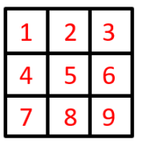
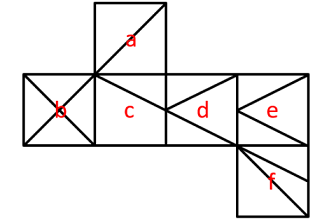
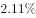
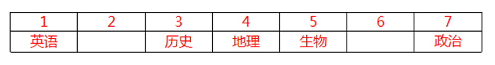

# 2021年新疆生产建设兵团行政执法类公务员考试《行测》题（网友回忆版）

> 判断推理 · 35 题 · 新疆 2021

## 第 1 题　qid 4004555 · 图形推理

从所给的四个选项中，选择最合适的一个填入问号处，使之呈现一定的规律性：

- **A**. A
- **B**. B
- **C**. C
- **D**. D　✅

**答案**：D

**官方解析**

元素组成相同，优先考虑位置规律。如下图所示，将题干图形中小图形在九宫格中的位置依次标为1-9号：

观察发现：

图一1号位置的在图一至图五中位置变化轨迹为15948；

图一5号位置的在图一至图五中位置变化轨迹为59482；

图一9号位置的在图一至图五中位置变化轨迹为94826；

图一4号位置的在图一至图五中位置变化轨迹为48267；

图一8号位置的在图一至图五中位置变化轨迹为82673；

图一2号位置的在图一至图五中位置变化轨迹为26731。

依此类推可以发现，题干图形中所有小图形在九宫格中的位置均按照1594826731的顺序在循环移动，按照此规律在“？”处图形中应在九宫格的5号位置，只有D项满足此规律，且D项其他小图形在九宫格中的位置变化同样满足此规律。

故正确答案为D。

---

## 第 2 题　qid 4004562 · 图形推理

上边给出的是纸盒的外表面展开图，下边哪一项能由其折叠而成？

- **A**. A
- **B**. B
- **C**. C
- **D**. D　✅

**答案**：D

**官方解析**

将题干展开图标上序号，如下图所示，逐一分析选项。

A项：选项中必然存在面a与面f，题干展开图中面a和面f为相对面，不能同时出现，选项与题干展开图不一致，排除；

B项：选项由面a、面b与面c构成，题干展开图中面a、面b与面c的公共点引出3条线，而选项中三个面的公共点只引出1条线，选项与题干展开图不一致，排除；

C项：选项中必然存在面b，题干展开图中面b与面d为相对面，不能同时出现，故选项由面a、面b与面e构成，题干展开图中面a、面b与面e的公共点引出2条线，而选项中三个面的公共点引出3条线，选项与题干展开图不一致，排除；

D项：选项由面b、面e与面f构成，与题干展开图一致，当选。

故正确答案为D。

---

## 第 3 题　qid 4004569 · 图形推理

从所给的四个选项中，选择最合适的一个填入问号处，使之呈现一定的规律性：

- **A**. A
- **B**. B　✅
- **C**. C
- **D**. D

**答案**：B

**官方解析**

元素组成相似，优先考虑样式规律。观察发现，第一行前两个图形去同存异得到第三个图形，经验证第二行图形满足此运算规律，第三行前两个图形去同存异得到B项。
故正确答案为B。

---

## 第 4 题　qid 4004575 · 图形推理

从所给的四个选项中，选择最合适的一个填入问号处，使之呈现一定的规律性：

- **A**. A
- **B**. B
- **C**. C
- **D**. D　✅

**答案**：D

**官方解析**

图形元素组成不同，属性与数量没有明显规律。观察发现，题干图形出现箭头较多，且前三幅图形箭头指向明显，箭头指向依次为上、左、下，第四幅图形存在变形，可将月亮右侧突出的弧线看成指向右的箭头，即题干图形中箭头的指向依次逆时针旋转，故“？”处应选择箭头指向为上的图形，只有D项满足此规律。

故正确答案为D。

---

## 第 5 题　qid 4004584 · 图形推理

从所给的四个选项中，选择最合适的一个填入问号处，使之呈现一定的规律性：

- **A**. A
- **B**. B
- **C**. C　✅
- **D**. D

**答案**：C

**官方解析**

观察发现，第一组三幅图形均由圆形和五边形构成，且两个图形间的关系依次为圆形位于五边形上方、圆形位于五边形内部（不相交）、圆形位于五边形外部（相交）。第二组前两幅图形均由三角形和矩形构成，且两个图形间的关系依次为三角形位于矩形上方、三角形位于矩形内部（不相交），故“？”处图形应由三角形和矩形构成，且三角形应位于矩形外部（相交），只有C项符合。
故正确答案为C。

---

## 第 6 题　qid 4004594 · 定义判断

我们对一个难题束手无策，不知从何入手时，思维就进入了“酝酿阶段”。直到有一天，当我们抛开面前的问题去做其他的事情时，百思不得其解的答案却突然出现在我们面前，这就叫“酝酿效应”。
根据上述定义，下列哪一诗句是这一效应的写照？

- **A**. 云外经年见双阙，马头乘兴数前山
- **B**. 不识庐山真面目，只缘身在此山中
- **C**. 山重水复疑无路，柳暗花明又一村　✅
- **D**. 风飒沉思眼忽开，尘埃污得是庸才

**答案**：C

**官方解析**

第一步：找出定义关键词。
“对一个难题束手无策，不知从何入手时”、“抛开面前的问题去做其他的事情时，百思不得其解的答案却突然出现在我们面前”。
第二步：逐一分析选项。
A项：出自韩元吉的《同叶梦锡赵德庄游牛首山》，描写的是诗人游览牛首山的情景，没有体现“对一个难题束手无策”，也没有体现“抛开面前的问题去做其他的事情”和“百思不得其解的答案却突然出现在我们面前”，不符合定义，排除；
B项：出自苏轼的《题西林壁》，意思是之所以认不清庐山真正的面目，是因为我人身处在庐山之中，只是解释了为什么会“不识庐山真面目”，没有体现“抛开面前的问题去做其他的事情时，百思不得其解的答案却突然出现在我们面前”，不符合定义，排除；
C项：出自陆游的《游山西村》，意思是山峦重叠水流曲折正担心无路可走，柳绿花艳忽然眼前又出现一个山村，现被用来形容已陷入绝境，忽然又出现转机，“疑无路”体现了“对一个难题束手无策，不知从何入手”，“又一村”体现了“百思不得其解的答案却突然出现在我们面前”，符合定义，当选；
D项：出自刘得仁的《寄友人》，描述的是突然想明白了一些事情，没有体现“对一个难题束手无策，不知从何入手”，也没有体现“抛开面前的问题去做其他的事情时，百思不得其解的答案却突然出现在我们面前”，不符合定义，排除。
故正确答案为C。

---

## 第 7 题　qid 4004610 · 定义判断

幸存者偏差指的是当取得资讯的渠道，仅来自于幸存者时，此资讯可能会与实际情况存在偏差。
根据上述定义，下列结论的得出存在幸存者偏差的是：

- **A**. 李老师通过小刚的成绩单看出小刚偏好文科
- **B**. 警察通过调查监控发现小赵并没有偷超市里的东西
- **C**. 王老师分别与小明、小亮谈话后总结出了他们俩打架的原因
- **D**. 媒体对长寿老人进行采访发现他们都喜欢喝葡萄酒，便得出喝葡萄酒可以长寿的结论　✅

**答案**：D

**官方解析**

第一步：找出定义关键词。
“当取得资讯的渠道，仅来自于幸存者时”、“资讯可能会与实际情况存在偏差”。
第二步：逐一分析选项。
A项：李老师的资讯来自于成绩单，而小刚的成绩单是可以体现小刚偏好科目的资讯，不符合“仅来自于幸存者时”，也不符合“与实际情况存在偏差”，不符合定义，排除；
B项：警察的资讯来自于监控，不符合“当取得资讯的渠道，仅来自于幸存者时”，不符合定义，排除；
C项：王老师的资讯来自于打架的双方，说明得到的资讯是全面的，不符合“当取得资讯的渠道，仅来自于幸存者时”，不符合定义，排除；
D项：媒体的资讯来自于活着的长寿老人，这些人是同样年龄中的幸存者，符合“当取得资讯的渠道，仅来自于幸存者时”，由于获得的资讯不全面，故结论不一定准确，符合“资讯可能会与实际情况存在偏差”，符合定义，当选。
故正确答案为D。

---

## 第 8 题　qid 4004617 · 定义判断

共生营销就是两个或两个以上的企业通过分享市场营销中的资源，达到降低成本、提高效率、增强市场竞争力目的的一种营销策略。
根据上述定义，下列属于共生营销的是：

- **A**. 某印刷厂和图书发行公司决定整合资源，成立新的集团公司
- **B**. 安踏公司推出的安踏和漫威联名款产品，受到漫威狂热粉的争相抢购
- **C**. 某企业售卖自己公司产品的同时，也在帮忙售卖朋友公司推出的新产品
- **D**. 五个家具企业整合各自品牌优势，联合共同举办看样订货会，吸引了更多商客　✅

**答案**：D

**官方解析**

第一步：找出定义关键词。
“两个或两个以上的企业”、“分享市场营销中的资源”、“降低成本、提高效率、增强市场竞争力”。
第二步：逐一分析选项。
A项：整合资源成立新的集团公司，意味着所有资源都进行了整合分享，不仅仅是“分享市场营销中的资源”，不符合定义，排除；
B项：热销的是安踏公司的产品，而不是漫威的产品，并未体现安踏公司分享市场营销中的资源给漫威，不符合“两个或两个以上的企业”、“分享市场营销中的资源”，不符合定义，排除；
C项：某企业帮忙售卖朋友公司推出的新产品，只有一家公司分享了市场营销中的资源，不符合“两个或两个以上的企业”、“分享市场营销中的资源”，不符合定义，排除；
D项：五个家具企业联合举办看样订货会，吸引了更多商客，符合“两个或两个以上的企业”、“分享市场营销中的资源”、“降低成本、提高效率、增强市场竞争力”，符合定义，当选。
故正确答案为D。

---

## 第 9 题　qid 4004650 · 定义判断

阳性强化法是建立、训练某种良好行为的治疗技术或矫正方法，也称“正强化法”或“积极强化法”。通过及时奖励目标行为，忽视或淡化异常行为，促进目标行为的产生。
根据上述定义，如果要纠正一名经常乱扔玩具、把饭撒桌子上等不断制造麻烦的儿童的行为，下列治疗方法不属于阳性强化法的是：

- **A**. 当他乱扔玩具时，及时制止，并让他旁观其他小朋友整理玩具的过程，然后引导他将自己的玩具放置好　✅
- **B**. 当他出现认真收拾饭桌上自己撒的饭渣行为时，家长和老师及时积极鼓励和表扬，让他感受到更多的关注，促进他不断重复目标行为
- **C**. 当他随便乱扔玩具、哭闹不停时，周围人对他的这种不良行为不予关注，没有半分反应
- **D**. 家长对于他乱扔玩具的行为，每减少一次就奖励一次他自己喜欢的东西，慢慢的他乱扔玩具的频率越来越低

**答案**：A

**官方解析**

第一步：找出定义关键词。
“及时奖励目标行为”、“忽视或淡化异常行为”、“促进目标行为的产生”。
第二步：逐一分析选项。
A项：乱扔玩具属于异常行为，制止乱扔玩具不符合“忽视或淡化异常行为”，不符合定义，当选； 
B项：家长和老师及时积极鼓励和表扬，促进他不断重复目标行为，符合“及时奖励目标行为”、“促进目标行为的产生”，符合定义，排除；
C项：周围人对他的不良行为不予关注，符合“忽视或淡化异常行为”，符合定义，排除；
D项：家长的奖励降低了乱扔玩具的频率，符合“及时奖励目标行为”、“促进目标行为的产生”，符合定义，排除。
本题为选非题，故正确答案为A。

---

## 第 10 题　qid 4004668 · 定义判断

旁观者效应也称为责任分散效应，是指对某一件事来说，如果是单个个体被要求单独完成任务，责任感就会很强，会做出积极的反应。但如果是要求一个群体共同完成任务，群体中的每个个体的责任感就会很弱，面对困难或遇到责任往往会退缩。
根据上述定义，下列属于旁观者效应的是：

- **A**. 小赵开车在公路上行驶时，车辆发生故障，小赵在车道设立警示标识，示意后面车辆绕行
- **B**. 运送水果的货车在高速路上发生侧翻，附近居民一哄而上捡拾水果带回家
- **C**. 小李看到路旁停放的自行车被风吹倒，跟着行人一起绕开走了　✅
- **D**. 小孙看到有人在路边突然晕倒，见周围无人见证，怕承担责任不敢上前帮助

**答案**：C

**官方解析**

第一步：找出定义关键词。
“单个个体被要求单独完成任务，责任感就会很强，会做出积极的反应”、“要求一个群体共同完成任务，群体中的每个个体的责任感就会很弱，面对困难或遇到责任往往会退缩”。
第二步：逐一分析选项。
A项：小赵车辆发生故障，在车道设立警示标识，没有涉及被要求单独完成任务，不符合“单个个体被要求单独完成任务，责任感就会很强，会做出积极的反应”，也没有体现出群体中每个个体的责任感很弱，不符合“要求一个群体共同完成任务，群体中的每个个体的责任感就会很弱，面对困难或遇到责任往往会退缩”，不符合定义，排除；
B项：运送水果的货车侧翻后遭到居民哄抢，没有体现出单个个体的责任感增强，也没有体现出群体遇到困难或遇到责任会退缩，不符合“单个个体被要求单独完成任务，责任感就会很强，会做出积极的反应”、“要求一个群体共同完成任务，群体中的每个个体的责任感就会很弱，面对困难或遇到责任往往会退缩”，不符合定义，排除；
C项：小李看到路旁停放的自行车被风吹倒，跟着行人一起绕开走了，说明群体中的个体责任感很弱，遇到责任会退缩，符合“要求一个群体共同完成任务，群体中的每个个体的责任感就会很弱，面对困难或遇到责任往往会退缩”，符合定义，当选；
D项：小孙看到有人晕倒，但周围并没有其他人，不敢上前帮助，不存在群体，不符合“要求一个群体共同完成任务，群体中的每个个体的责任感就会很弱，面对困难或遇到责任往往会退缩”，不符合定义，排除。
故正确答案为C。

---

## 第 11 题　qid 4004681 · 定义判断

知觉恒常性是指，当客观条件在一定范围内改变时，我们的知觉印象在相当程度上，保持着它的稳定性。即对物体某种特性的知觉，在外界条件与感觉信号输入改变时，仍保持常定的倾向。
根据上述定义，下列未体现出知觉恒常性的是：

- **A**. 在观察一本书时，不管从正上方看还是从斜上方看，看起来都是长方形的
- **B**. 一个成人从近处走向远处，眼睛看到的人像虽然相应缩小，但不会把他当成儿童
- **C**. 室内的家具，在不同色光照明下，对其颜色知觉仍保持相对不变
- **D**. 古语说：窥一斑而知全豹，就是通过豹子的一个斑点，就可以得出这个动物是豹子　✅

**答案**：D

**官方解析**

第一步：找出定义关键词。
“当客观条件在一定范围内改变时”、“知觉印象在相当程度上，保持着它的稳定性”、“对物体某种特性的知觉，在外界条件与感觉信号输入改变时，仍保持常定的倾向”。
第二步：逐一分析选项。
A项：从不同的角度观察一本书，符合“当客观条件在一定范围内改变时”，不同角度看起来都是长方形的，符合“知觉印象在相当程度上，保持着它的稳定性”，符合定义，排除；
B项：从近处和远处分别看一个成人，符合“当客观条件在一定范围内改变时”，远处看人像虽然缩小，但不会觉得是儿童，符合“知觉印象在相当程度上，保持着它的稳定性”，符合定义，排除；
C项：不同色光照明下的室内家具，符合“当客观条件在一定范围内改变时”，对其颜色知觉仍保持相对不变，符合“知觉印象在相当程度上，保持着它的稳定性”，符合定义，排除；
D项：通过观察豹子身上的一个斑点就可以得出这个动物是豹子，整个过程中客观条件并没有发生改变，也没有体现出知觉印象的稳定性，不符合“当客观条件在一定范围内改变时”、“知觉印象在相当程度上，保持着它的稳定性”，不符合定义，当选。
本题为选非题，故正确答案为D。

---

## 第 12 题　qid 4004693 · 定义判断

气候贫穷，是指由于全球气候变化带来的影响及产生的灾害所导致的贫穷或使得贫穷加剧的现象。
根据上述定义，下列不属于气候贫穷的是：

- **A**. 西北地区夏季增温幅度大而降水增加量少，影响农业生产导致农民返贫
- **B**. 突然发生的地震给人们的生命财产造成了极大的损失，使他们一夜致贫　✅
- **C**. 气候变化增加了疾病的发生和传播的机会，危害人类健康，贫困地区劳动力不断减少，贫者愈贫
- **D**. 全球气温不断升高，冰川面积缩减进一步加剧了某地的水资源矛盾，给他们的生产生活造成极大影响，使贫困加剧

**答案**：B

**官方解析**

第一步：找出定义关键词。
“由于全球气候变化带来的影响及产生的灾害”、“导致的贫穷或使得贫穷加剧”。
第二步：逐一分析选项。
A项：西北地区夏季增温幅度大而降水增加量少，符合“由于全球气候变化带来的影响及产生的灾害”，影响农业生产导致农民返贫，符合“导致的贫穷或使得贫穷加剧”，符合定义，排除；
B项：突然发生的地震给人们的生命财产造成了极大的损失，但地震属于地质灾害，不符合“由于全球气候变化带来的影响及产生的灾害”，不符合定义，当选；
C项：气候变化增加了疾病的发生和传播的机会，危害人类健康，符合“由于全球气候变化带来的影响及产生的灾害”，贫困地区劳动力不断减少，贫者愈贫，符合“导致的贫穷或使得贫穷加剧”，符合定义，排除；
D项：全球气温不断升高给某地居民的生产生活造成极大影响，符合“由于全球气候变化带来的影响及产生的灾害”，使他们的贫困加剧，符合“导致的贫穷或使得贫穷加剧”，符合定义，排除。
本题为选非题，故正确答案为B。

---

## 第 13 题　qid 4004699 · 定义判断

反馈原来是物理学中的一个概念，心理学借用这一概念，以说明学习者对自己学习结果的了解，而这种对结果的了解又起到了强化作用，促进了学习者更加努力学习，从而提高学习效率。这一心理现象被称作“反馈效应”。
根据上述定义，下列说法符合反馈效应的是：

- **A**. 小李参加公司的新员工培训成绩最差，心灰意冷，未过试用期就提出了辞职
- **B**. 老师习惯于按照学习成绩的好坏来划分学生的优劣，并据此来指导学生的学习
- **C**. 让学生自己来评改练习作业，比由老师来评改所起到的激励作用要大，学习效果更佳　✅
- **D**. 小明帮妈妈打扫卫生，妈妈却嫌弃小明打扫得不干净

**答案**：C

**官方解析**

第一步：找出定义关键词。
“学习者对自己学习结果的了解起到了强化作用”、“促进了学习者更加努力学习，从而提高学习效率”。
第二步：逐一分析选项。
A项：小李因为培训成绩最差，心灰意冷，不符合“学习者对自己学习结果的了解起到了强化作用”，未过试用期就提出了辞职，不符合“促进了学习者更加努力学习，从而提高学习效率”，不符合定义，排除；
B项：老师按照学习成绩的好坏来指导学生学习，老师不是学习者，不符合“学习者对自己学习结果的了解起到了强化作用”，不符合定义，排除；
C项：学生自己评改作业，其激励作用更大，学习效果更佳，符合“学习者对自己学习结果的了解起到了强化作用”、“促进了学习者更加努力学习，从而提高学习效率”，符合定义，当选；
D项：妈妈嫌弃小明卫生打扫得不干净，不符合“学习者对自己学习结果的了解起到了强化作用”、也不符合“促进了学习者更加努力学习，从而提高学习效率”，不符合定义，排除。
故正确答案为C。

---

## 第 14 题　qid 4004710 · 定义判断

法的适用，通常是指国家司法机关根据法定职权和法定程序，具体应用法律处理案件的专门活动。
根据上述定义，下列属于法的适用的是：

- **A**. 某科技公司根据法律相关规定和李某签订了劳动合同
- **B**. 张某依法将子女送入学校进行义务教育
- **C**. 某海关工作人员认为刘某涉嫌走私手机，因而对其进行查办
- **D**. 某地检察机关对王某的渎职案依法进行侦查　✅

**答案**：D

**官方解析**

第一步：找出定义关键词。
“国家司法机关”、“根据法定职权和法定程序，具体应用法律处理案件”。
第二步：逐一分析选项。
A项：选项的主体为某科技公司，不符合“国家司法机关”，不符合定义，排除；
B项：选项的主体为张某，不符合“国家司法机关”，不符合定义，排除；
C项：选项的主体为某海关工作人员，不符合“国家司法机关”，不符合定义，排除；
D项：选项的主体为“某地检察机关”，符合“国家司法机关”，对渎职案依法进行侦查，符合“根据法定职权和法定程序，具体应用法律处理案件”，符合定义，当选。
故正确答案为D。

---

## 第 15 题　qid 4004720 · 定义判断

蝴蝶效应，是指在一个动力系统中，初始条件下微小的变化能带动整个系统长期巨大的连锁反应。它是一种混沌现象，说明了任何事情发展均存在定数与变数，事物在发展过程中，其发展轨迹有规律可循，同时也存在不可测的变数，往往还会适得其反，一个微小的变化能影响事物的发展，证实了事物的发展具有复杂性。
根据上述定义，下列没有反映蝴蝶效应的是：

- **A**. 美国发现一宗疑假疯牛病案例，牛肉产业遭到冲击，作为养牛业主要饲料来源的美国玉米和大豆业，期货价格呈现下降趋势。美国消费者对牛肉产品出现的信心下降，给刚刚复苏的美国经济带来一场破坏性很强的飓风
- **B**. 某员工因不公平待遇离职，带走了有同样遭遇的几名员工，他们自主创业后，与原公司竞争，导致原公司破产
- **C**. 丢失一个钉子，坏了一只蹄铁；坏了一只蹄铁，折了一匹战马；折了一匹战马，伤了一位骑士；伤了一位骑士，输了一场战斗；输了一场战斗，亡了一个帝国
- **D**. 某公司因经济不景气面临破产的危机，为了节源，他们裁掉了很大一部分员工，只留下骨干员工　✅

**答案**：D

**官方解析**

第一步：找出定义关键词。
“在一个动力系统中”、“初始条件下微小的变化”、“带动整个系统长期巨大的连锁反应”。
第二步：逐一分析选项。
A项：一宗疑假疯牛病案例，符合“初始条件下微小的变化”，影响了美国玉米和大豆业的期货价格，破坏了美国经济，符合“带动整个系统长期巨大的连锁反应”，上述所有事件均“在一个动力系统中”，符合定义，排除；
B项：某员工因不公平待遇离职，符合“初始条件下微小的变化”，离职后带走了几名同样遭遇的员工，然后他们进行自主创业，与原公司竞争，最终导致原公司破产，符合“带动整个系统长期巨大的连锁反应”，上述所有事件均“在一个动力系统中”，符合定义，排除；
C项：丢失一个钉子，符合“初始条件下微小的变化”，进而影响了蹄铁质量、战马生存、骑士征战、战斗结果、帝国走向，符合“带动整个系统长期巨大的连锁反应”，上述所有事件均“在一个动力系统中”，符合定义，排除；
D项：某公司因经济不景气面临破产的危机，对于该公司这个动力系统来说是比较大的变化，不符合“初始条件下微小的变化”，同时也没有体现出“带动整个系统长期巨大的连锁反应”，不符合定义，当选。
本题为选非题，故正确答案为D。

---

## 第 16 题　qid 4004740 · 类比推理

文科：历史

- **A**. 手提包：双肩包
- **B**. 咸水湖：鄱阳湖
- **C**. 桃：水果
- **D**. 微量元素：铅　✅

**答案**：D

**官方解析**

第一步：判断题干词语间逻辑关系。
历史属于文科，二者为种属关系。
第二步：判断选项词语间逻辑关系。
A项：手提包和双肩包是两种不同类型的包，二者为并列关系，与题干逻辑关系不一致，排除；
B项：鄱阳湖是淡水湖，不是咸水湖，二者为反向种属关系，与题干逻辑关系不一致，排除；
C项：桃是一种水果，二者为种属关系，但顺序与题干相反，与题干逻辑关系不一致，排除；
D项：微量元素指生物体正常生理活动所必需但需求量很少的元素，铅是一种微量元素，二者为种属关系，与题干逻辑关系一致，当选。
故正确答案为D。

---

## 第 17 题　qid 4004748 · 类比推理

患得患失：三三两两

- **A**. 好大喜功：浑浑噩噩
- **B**. 居安思危：口口声声
- **C**. 能屈能伸：兢兢业业　✅
- **D**. 捕风捉影：茕茕孑立

**答案**：C

**官方解析**

第一步：判断题干词语间逻辑关系。
患得患失指对于个人的利害得失斤斤计较；三三两两指三个一群两个一伙（多指人），二者没有语义关系，考虑成语拆分，患得患失的第一个字和第三个字相同，且“得”和“失”为反义关系，三三两两的前两个字相同，后两个字也相同。
第二步：判断选项词语间逻辑关系。
A项：好大喜功的第一个字和第三个字不相同，且“大”和“功”不是反义关系，与题干逻辑关系不一致，排除；
B项：居安思危的第一个字和第三个字不相同，与题干逻辑关系不一致，排除；
C项：能屈能伸的第一个字和第三个字相同，且“屈”和“伸”为反义关系，兢兢业业的前两个字相同，后两个字也相同，与题干逻辑关系一致，当选；
D项：捕风捉影的第一个字和第三个字不相同，且“风”和“影”不是反义关系，与题干逻辑关系不一致，排除。
故正确答案为C。

---

## 第 18 题　qid 4004756 · 类比推理

教练：学员

- **A**. 歌唱家：唱歌
- **B**. 医生：病人　✅
- **C**. 律师：法庭
- **D**. 作家：读者

**答案**：B

**官方解析**

第一步：判断题干词语间逻辑关系。
教练教学员，二者是主宾关系，且教练给学员提供服务，为提供服务和被服务的关系。
第二步：判断选项词语间逻辑关系。
A项：歌唱家唱歌，二者是主谓宾关系，与题干逻辑关系不一致，排除；
B项：医生治疗病人，二者是主宾关系，且医生给病人提供服务，为提供服务和被服务的关系，与题干逻辑关系一致，当选；
C项：律师在法庭，二者是人物和地点的对应关系，与题干逻辑关系不一致，排除；
D项：作家和读者不是主宾关系，且作家给读者提供的是作品而不是服务，并非提供服务和被服务的关系，与题干逻辑关系不一致，排除。
故正确答案为B。

---

## 第 19 题　qid 4004765 · 类比推理

布：衣服

- **A**. 牛奶：酸奶
- **B**. 粮食：酒
- **C**. 木材：餐桌　✅
- **D**. 朱古力：巧克力

**答案**：C

**官方解析**

第一步：判断题干词语间逻辑关系。
布经过加工可以制成衣服，二者为原材料的对应关系，且制作过程是物理变化。
第二步：判断选项词语间逻辑关系。
A项：牛奶经过发酵可以制成酸奶，二者为原材料的对应关系，但发酵是化学变化，与题干逻辑关系不一致，排除；
B项：粮食经过发酵可以制成酒，二者为原材料的对应关系，但发酵是化学变化，与题干逻辑关系不一致，排除；
C项：木材经过加工可以制成餐桌，二者为原材料的对应关系，且制作过程是物理变化，与题干逻辑关系一致，当选；
D项：朱古力和巧克力是同一种事物的不同称谓，二者为全同关系，与题干逻辑关系不一致，排除。
故正确答案为C。

---

## 第 20 题　qid 4004774 · 类比推理

手：足

- **A**. 口：鼻　✅
- **B**. 钢：铁
- **C**. 心：肝
- **D**. 男：女

**答案**：A

**官方解析**

第一步：判断题干词语间逻辑关系。

手和足均是人体器官，二者为并列关系当中的反对关系，且二者均为人体外部器官。

第二步：判断选项词语间逻辑关系。

A项：口和鼻均是人体器官，二者为并列关系当中的反对关系，且二者均为人体外部器官，与题干逻辑关系一致，当选；

B项：钢是含碳量介于至之间的铁碳合金，铁是一种金属元素，可用铁与少量的碳制成钢，所以铁是制作钢的原材料之一，且二者均为金属材料，与题干逻辑关系不一致，排除；

C项：心和肝均是人体器官，二者为并列关系当中的反对关系，但二者均为人体内脏器官，而非人体外部器官，与题干逻辑关系不一致，排除；

D项：男和女均表示性别，二者为并列关系当中的矛盾关系，与题干逻辑关系不一致，排除。

故正确答案为A。

---

## 第 21 题　qid 4004781 · 类比推理

七上：八下

- **A**. 五颜：六色
- **B**. 三长：两短　✅
- **C**. 欺上：瞒下
- **D**. 万紫：千红

**答案**：B

**官方解析**

第一步：判断题干词语间逻辑关系。
七上八下形容心里慌乱不安。在词语中，七与八表示不同的数字，二者为并列关系，上与下，二者为反义关系。
第二步：判断选项词语间逻辑关系。
A项：五颜六色形容色彩复杂或花样繁多。在词语中，五与六表示不同的数字，二者为并列关系，但颜与色均表示色彩，二者为近义关系，与题干逻辑关系不一致，排除；
B项：三长两短指意外的灾祸或事故。在词语中，三与两表示不同的数字，二者为并列关系，长与短，二者为反义关系，与题干逻辑关系一致，当选；
C项：欺上瞒下指对上欺骗，博取信任，对下隐瞒，掩盖真相。在词语中，欺与瞒不是表示不同的数字，与题干逻辑关系不一致，排除；
D项：万紫千红形容百花齐放，色彩艳丽。在词语中，万与千表示不同的数量，二者为并列关系，但紫与红表示不同的颜色，二者为并列关系，与题干逻辑关系不一致，排除。
故正确答案为B。

---

## 第 22 题　qid 4004793 · 类比推理

黄果树瀑布：西江苗寨：贵州

- **A**. 洪泽湖：洞庭湖：江苏
- **B**. 黄山：太湖：浙江
- **C**. 庐山：会稽山：江西
- **D**. 泰山：大明湖：山东　✅

**答案**：D

**官方解析**

第一步：判断题干词语间逻辑关系。
“黄果树瀑布”和“西江苗寨”均在贵州省，前两个词为并列关系，与第三个词均为地点对应关系。
第二步：判断选项词语间逻辑关系。
A项：“洪泽湖”在江苏省，但是“洞庭湖”在湖南省，不在江苏省，与题干逻辑关系不一致，排除；
B项：“黄山”在安徽省，不在浙江省，“太湖”横跨江苏省和浙江省，与题干逻辑关系不一致，排除；
C项：“庐山”在江西省，但是“会稽山”在浙江省，不在江西省，与题干逻辑关系不一致，排除；
D项：“泰山”和“大明湖”均在山东省，前两个词为并列关系，与第三个词均为地点对应关系，与题干逻辑关系一致，当选。
故正确答案为D。

---

## 第 23 题　qid 4004800 · 类比推理

负荆请罪：廉颇：蔺相如

- **A**. 萧规曹随：萧何：曹奇
- **B**. 一字之师：齐己：郑谷　✅
- **C**. 图穷匕见：张良：秦王
- **D**. 手不释卷：吴蒙：孙权

**答案**：B

**官方解析**

第一步：判断题干词语间逻辑关系。
“负荆请罪”讲述的是“廉颇”跟“蔺相如”不和，后来廉颇认识到了这样对国家不利，便脱了上衣、背着荆条去向蔺相如谢罪的故事。主人公分别是“廉颇”和“蔺相如”，三者是历史典故与历史人物的对应关系。
第二步：判断选项词语间逻辑关系。
A项：“萧规曹随”讲述的是萧何和曹参在西汉初期先后任丞相，萧何创立了一套规章制度，在他死后曹参继任，完全照章行事的故事。主人公分别是“萧何”和“曹参”，而非“曹奇”，与题干逻辑关系不一致，排除；
B项：“一字之师”讲述的是齐己带着自己写好的诗前去请教“郑谷”，郑谷只提出一个字的修改意见，便使该诗变得更好的故事。主人公分别是“齐己”和“郑谷”，三者是历史典故与历史人物的对应关系，与题干逻辑关系一致，当选；
C项：“图穷匕见”讲述的是荆轲以献地图为借口，在卷起的地图中藏了把匕首，以谋刺杀秦王，当地图展开后，匕首就露出来的故事。主人公分别是“荆轲”和“秦王”，而非“张良”，与题干逻辑关系不一致，排除；
D项：“手不释卷”讲述的是孙权用自己和前人手不释卷的例子劝学，吕蒙深受感动，从此发奋学习的故事。主人公分别是“吕蒙”和“孙权”，而非“吴蒙”，与题干逻辑关系不一致，排除。
故正确答案为B。

---

## 第 24 题　qid 4004807 · 类比推理

莫愁前路无知己 对于 （    ） 相当于 （    ） 对于 感恩

- **A**. 爱情 恩疏媒劳志多乖
- **B**. 场所 千古兴亡多少事
- **C**. 离别 报答平生未展眉　✅
- **D**. 送别 西出阳关无故人

**答案**：C

**官方解析**

逐一代入选项。
A项：“莫愁前路无知己”的意思是此去不要担心遇不到知己，表达了作者与朋友的离别之情，与“爱情”无明显逻辑关系；“恩疏媒劳志多乖”的意思是皇帝疏远，举荐徒劳，壮志难酬，与“感恩”无明显逻辑关系，前后逻辑关系不一致，排除；
B项：“莫愁前路无知己”的意思是此去不要担心遇不到知己，表达了作者与朋友的离别之情，与“场所”无明显逻辑关系；“千古兴亡多少事”的意思是从古到今，有多少国家兴亡大事呢，表达了作者怀古的愁思和感慨，与“感恩”无明显逻辑关系，前后逻辑关系不一致，排除；
C项：“莫愁前路无知己”的意思是此去不要担心遇不到知己，表达了作者与朋友的“离别”之情，二者为对应关系；“报答平生未展眉”的意思是报答你一生的愁苦奔忙，表达了“感恩”之情，二者为对应关系，前后逻辑关系一致，当选；
D项：“莫愁前路无知己”的意思是此去不要担心遇不到知己，表达了作者对朋友的“送别”之情，二者为对应关系；“西出阳关无故人”的意思是当你向西出了阳关后，就难以遇到故人了，表达了作者与朋友的离别之情，与“感恩”无明显逻辑关系，前后逻辑关系不一致，排除。
故正确答案为C。

---

## 第 25 题　qid 4004812 · 类比推理

（    ） 对于 冰箱 相当于 （    ） 对于 教师

- **A**. 空调 医生　✅
- **B**. 食物 教室
- **C**. 冷冻 校长
- **D**. 防腐 家长

**答案**：A

**官方解析**

逐一代入选项。
A项：空调和冰箱是两种不同的家电，二者为并列关系中的反对关系；医生和教师是两种不同的职业，二者为并列关系中的反对关系，前后逻辑关系一致，当选；
B项：食物放在冰箱里保存，教师在教室上课，均为场所对应关系，但前后词语顺序相反，前后逻辑关系不一致，排除；
C项：冰箱具有冷冻的功能，二者为功能对应关系；校长可以管理教师，二者为对应关系，前后逻辑关系不一致，排除；
D项：冰箱具有防腐的功能，二者为功能对应关系，但不能说教师具有家长的功能，前后逻辑关系不一致，排除。
故正确答案为A。

---

## 第 26 题　qid 4004816 · 逻辑判断

某社区公共财物被损毁，公安机关锁定了四名犯罪嫌疑人，并分别对他们进行了审问：
甲：我没有做这件事，这件事是乙做的；
乙：甲、丙、丁中肯定有一人做了这件事；
丙：此事是由甲和乙中的一人做的；
丁：甲说的是事实。
经过调查，发现两个人说的真话，由此可以推出：

- **A**. 甲是罪犯　✅
- **B**. 乙是罪犯
- **C**. 丙是罪犯
- **D**. 丁是罪犯

**答案**：A

**官方解析**

第一步：找出题干矛盾命题。

（1）甲∶甲，乙；

（2）乙∶甲、丙、丁中一人做了；

（3）丙∶要么甲，要么乙；

（4）丁∶甲，乙。

第二步：根据题干条件进行推理。

题干两真两假，且甲和丁说的话一致，因此甲、丁要么都说真话，要么都说假话，可以采用假设法分别讨论。

若甲、丁均说真话，可得甲不是罪犯，乙是罪犯，此时丙说的也是真话，共有三人说真话，与题干信息矛盾；

若甲、丁均说假话，可得甲是罪犯，乙不是罪犯，此时乙、丙均说真话，与题干信息不矛盾，A项当选。

故正确答案为A。

---

## 第 27 题　qid 4004819 · 逻辑判断

某兴趣小组成员都是艺术特长生，有的艺术特长生体育很好，小明体育很好。由此可以推出：

- **A**. 小明是艺术特长生
- **B**. 小明不是艺术特长生
- **C**. 该兴趣小组成员体育都很好
- **D**. 该兴趣小组成员可能体育都不好　✅

**答案**：D

**官方解析**

第一步：翻译题干。

①兴趣小组成员艺术特长生；

②有的艺术特长生体育很好；

③小明体育很好。

第二步：逐一分析选项。

A项：根据条件②可换位为“有的体育很好的人艺术特长生”，虽然已知③“小明体育很好”，但他是否属于“有的体育很好的人”并不确定，无法推出“小明是艺术特长生”，排除；

B项：根据条件②可换位为“有的体育很好的人艺术特长生”，虽然已知③“小明体育很好”，但无论他是否属于“有的体育很好的人”里，均无法推出“小明不是艺术特长生”，排除；

C项：翻译为“兴趣小组成员体育很好”，根据条件②可知“有的艺术特长生体育很好”，虽然已知①“兴趣小组成员艺术特长生”，但兴趣小组成员是否属于“有的艺术特长生”并不确定，无法推出，排除；

D项：翻译为“兴趣小组成员可能体育不好”，根据条件②可知“有的艺术特长生体育很好”，虽然已知①“兴趣小组成员艺术特长生”，但兴趣小组成员可能均不属于“有的艺术特长生”，所以他们可能体育都不好，可以推出，当选。

故正确答案为D。

---

## 第 28 题　qid 4004823 · 逻辑判断

某研究团队最新研究显示，偏头痛患者的大脑视觉皮层会“过度兴奋”。招募60名志愿者参加了相关试验，其中有一半人患有偏头痛。试验中研究人员向志愿者展示了条纹栅格测试图，并让他们回答看后是否感到不舒服；进一步的测试中，还让他们在看图的同时接受脑电图测试。结果发现那些患偏头痛的志愿者在看到条纹栅格测试图后脑部的视觉皮层出现了较明显的反应。
以下哪项为真，最不能削弱研究者的结论?

- **A**. 在那些没有患偏头痛但对视觉刺激比较敏感的某些志愿者中，视觉皮层也会出现类似反应
- **B**. 此项研究中所研究的样本数量过少没有说服力
- **C**. 偏头痛患者看除条纹栅格测试图之外的其他测试图，大脑视觉皮层并未有明显反应
- **D**. 志愿者在做此项试验之前并未受到其他因素干扰　✅

**答案**：D

**官方解析**

第一步：找出论点和论据。
论点：偏头痛患者的大脑视觉皮层会“过度兴奋”。
论据：招募60名志愿者参加了相关试验，其中有一半人患有偏头痛。试验中研究人员向志愿者展示了条纹栅格测试图，并让他们回答看后是否感到不舒服；进一步的测试中，还让他们在看图的同时接受脑电图测试。结果发现那些患偏头痛的志愿者在看到条纹栅格测试图后脑部的视觉皮层出现了较明显的反应。
本题论点论据话题一致，削弱可以考虑削弱论点，即说明偏头痛患者的大脑视觉皮层不会“过度兴奋”，也可以考虑削弱论据，即证明试验的设置不科学，得到的结果不严谨。
第二步：逐一分析选项。
A项：没有患偏头痛的人大脑视觉皮层也会“过度兴奋”，通过举反例来否定论点，可以削弱，排除；
B项：通过说明样本数量过少质疑试验严谨性，否定了论据，可以削弱，排除；
C项：偏头痛患者看其他测试图时，大脑视觉皮层并未有明显反应，通过举反例来否定论点，可以削弱，排除；
D项：该项说明研究团队排除了其他变量，保证了试验严谨性，属于必要条件加强，无法削弱，当选。
本题为选非题，故正确答案为D。

---

## 第 29 题　qid 4004827 · 逻辑判断

发酵乳制品因为其丰富的营养和益生菌含量，给人们带来了广泛的健康益处，比如，益生菌中最突出的乳酸杆菌和双歧杆菌能够减少病理改变，刺激粘膜免疫与炎症介质相互作用和增强免疫系统。最近，有科学家通过对190多万人的研究得出，发酵乳制品能够降低肿瘤的发生风险。
以下哪项如果为真，最能支持上述结论?

- **A**. 目前国内未有此类明确的专业报道
- **B**. 发酵物产生的益生菌都是对身体有益的
- **C**. 喝酸奶能够降低19%的肿瘤发生风险，此说法受到权威专家的认可
- **D**. 发酵乳制品中的益生菌可以维持肠道稳态并发挥潜在的抗癌作用　✅

**答案**：D

**官方解析**

第一步：找出论点和论据。

论点：发酵乳制品能够降低肿瘤的发生风险。

论据：无。

本题只有论点，没有论据，加强优先考虑补充论据，可以通过解释原因或举例进行加强。

第二步：逐一分析选项。

A项：该项说的是目前未有此类明确的专业报道，没有说明发酵乳制品是否能够降低肿瘤的发生风险，属于不明确项，无法加强，排除；

B项：该项说的是发酵物产生的益生菌都是对身体有益的，而论点在说发酵乳制品能够降低肿瘤的发生风险，对身体有益是否就能降低肿瘤的发生风险并不明确，属于不明确项，无法加强，排除；

C项：该项说的是喝酸奶能够降低的肿瘤发生风险，酸奶属于发酵乳制品，举例补充论据，可以加强，保留；

D项：该项说的是发酵乳制品中的益生菌可以维持肠道稳态并发挥潜在的抗癌作用，解释了为什么发酵乳制品能够降低肿瘤的发生风险，解释原因补充论据，可以加强，保留。

对比C、D两项，C项是举例，D项是解释原因，解释原因的加强力度大于举例，D项当选。

故正确答案为D。

---

## 第 30 题　qid 4004832 · 逻辑判断

相比那些不练习瑜伽的人来说，经常练习瑜伽的人体型更好一些。可见，瑜伽能锻炼人的柔韧性，塑造完美体型。
以下哪项如果为真，最能对上述结论提出质疑？

- **A**. 大部分人喜欢瑜伽，就是因为瑜伽能够让人拥有更好的体型
- **B**. 塑造完美体型的方式不仅仅只有瑜伽
- **C**. 瑜伽不仅能够塑造人的完美体型，还能预防关节炎
- **D**. 真正体型不好的人一般不会选择练习瑜伽　✅

**答案**：D

**官方解析**

第一步：找出论点和论据。
论点：瑜伽能锻炼人的柔韧性，塑造完美体型。
论据：相比那些不练习瑜伽的人来说，经常练习瑜伽的人体型更好一些。
本题的论点和论据讨论的都是瑜伽能塑造完美体型，论点和论据话题一致，削弱优先考虑削弱论点，且论点为因果关系，也可以考虑因果倒置（体型好的人才会练瑜伽），还可以考虑他因削弱（对于完美体型的人来说，除了练瑜伽还做了其他塑造体型的方式）。
第二步：逐一分析选项。
A项：该项说的是大部分人喜欢瑜伽，就是因为瑜伽可以让人拥有更好的体型，有加强作用，无法削弱，排除；
B项：该项说的是塑造完美体型的方式不仅仅只有瑜伽，但是对于题干论据中练习瑜伽的群体是否还有其他塑造体型的方式，并不明确，无法削弱，排除；
C项：该项说的是瑜伽除了塑造完美体型外还有其他的功能，有加强作用，无法削弱，排除；
D项：该项说的是体型不好的人一般不会练瑜伽，即体型好的人才会练瑜伽，而论点在说瑜伽能塑造完美体型，该项颠倒了论点中的因果，属于因果倒置，可以削弱，当选。
故正确答案为D。

---

## 第 31 题　qid 4004840 · 逻辑判断

某公司发生失窃案，公安机关经过调查锁定了犯罪嫌疑人是该公司会计张某。办案民警小王说：“一定不是他”，办案民警小李发表了反对观点：“当其他可能性被排除了，剩下的不管看起来多么不可能，但一定是事情的真相。”
以下哪项如果为真，最能削弱小李的说法？

- **A**. 追究违法行为最重要的是用证据说话
- **B**. 办案民警无法极尽所有可能性　✅
- **C**. 办案民警小王比小李更了解案件经过
- **D**. 公司职员评价张某平时为人老实诚恳

**答案**：B

**官方解析**

第一步：找出论点和论据。
论点：小李认为犯罪嫌疑人是该公司会计张某。
论据：其他人是嫌疑人的可能性都被排除了。
小王认为犯罪嫌疑人不是张某，小李和小王的观点相反，双方在“掐架”，此时要削弱小李的说法可以考虑削弱论据，即还有其他人是嫌疑人的可能性。
第二步：逐一分析选项。
A项：该项说的是追究违法行为最重要的是用证据说话，而论点说的是小李认为犯罪嫌疑人是张某，话题不一致，无法削弱，排除；
B项：该项指出办案民警无法极尽所有可能性，与题干中小李说其他可能性被排除了相矛盾，直接削弱论据，可以削弱，当选；
C项：该项说的是办案民警小王比小李更了解案件经过，而论点说的是小李认为犯罪嫌疑人是张某，话题不一致，无法削弱，排除；
D项：该项说的是公司职员评价张某平时为人老实诚恳，而论点说的是小李认为犯罪嫌疑人是张某，张某老实诚恳不能说明其不是犯罪嫌疑人，无法削弱，排除。
故正确答案为B。

---

## 第 32 题　qid 4004847 · 类比推理

只有市值超过100亿的企业才能加入企业联盟。只要加入企业联盟的企业就会被评为优秀企业。甲市的部分企业是企业联盟会员。乙市的企业市值都没有超过100亿。
根据上述论断，不能推出的是：

- **A**. 甲市的部分企业被评为优秀企业
- **B**. 乙市有的企业被评为优秀企业　✅
- **C**. 乙市的企业都没有加入企业联盟
- **D**. 甲市的部分企业市值超过100亿

**答案**：B

**官方解析**

第一步：翻译题干。

①加入企业联盟市值超过100亿的企业；

②加入企业联盟被评为优秀企业；

③有的甲市企业加入企业联盟；

④乙市的企业市值超过100亿的企业；

由①和③可知：⑤有的甲市企业加入企业联盟市值超过100亿的企业；

由①和④可知：⑥乙市的企业市值超过100亿的企业加入企业联盟；

由②和③可知：⑦有的甲市企业加入企业联盟被评为优秀企业。

第二步：逐一分析选项。

A项：由⑦可知，甲市的部分企业被评为优秀企业，可以推出，排除；

B项：由⑥可知，乙市的企业没有加入企业联盟，这是对②的否前，否前得不到确定结论，故得不到乙市有的企业被评为优秀企业，无法推出，当选；

C项：由⑥可知，乙市的企业没有加入企业联盟，可以推出，排除；

D项：由⑤可知，甲市的部分企业市值超过100亿，可以推出，排除。

本题为选非题，故正确答案为B。

---

## 第 33 题　qid 4004854 · 逻辑判断

要保证学生的视力健康，就必须让他们与不卫生的用眼习惯作斗争；如果不对他们错误的用眼行为加以纠正，就会助长他们的不卫生用眼习惯。因此：

- **A**. 有不卫生的用眼习惯的人中没有学生
- **B**. 只有学生才会与不卫生的用眼习惯作斗争
- **C**. 如果不让学生与不卫生的用眼习惯作斗争就无法保证学生的视力健康　✅
- **D**. 所有学生都与不卫生的用眼习惯作斗争

**答案**：C

**官方解析**

第一步：翻译题干。

①保证学生的视力健康与不卫生的用眼习惯作斗争；

②错误的用眼行为加以纠正助长不卫生的用眼习惯。

第二步：逐一分析选项。

A项：翻译为“有不卫生的用眼习惯学生”，推理前后话题均和题干话题不一致，无法推出，排除；

B项：翻译为“与不卫生的用眼习惯作斗争学生”，是对条件①的肯后，肯后得不出确定结论，且条件①的前件是保证学生的视力健康，而不是学生，话题也不一致，无法推出，排除；

C项：翻译为“与不卫生的用眼习惯作斗争保证学生的视力健康”，是对条件①的否后，否后必否前，可以推出，当选；

D项：翻译为“学生与不卫生的用眼习惯作斗争”，学生与题干话题不一致，无法推出，排除。

故正确答案为C。

---

## 第 34 题　qid 4004861 · 类比推理

小明根据明天的课程制定了预习计划，数学、语文、英语、政治、历史、地理、生物七科，每一科都要预习，但是预习的顺序必须符合如下要求：
（1）预习地理之前要先预习英语，预习这两科之间还要预习另外两科（生物除外）；
（2）第一科或者最后一科预习政治；
（3）第三科预习历史；
（4）预习生物要在地理之前或者刚预习完地理之后。
如果小明首先预习英语，则可以确定他的预习顺序是：

- **A**. 第二科预习语文
- **B**. 第五科预习生物　✅
- **C**. 第五科预习地理
- **D**. 第二科预习数学

**答案**：B

**官方解析**

第一步：分析题干条件。

（1）英语XX地理（间隔不可生物）；

（2）政治：要么第一，要么第七；

（3）历史：第三；

（4）生物要在地理之前或者紧挨着地理并且在地理之后；

（5）英语：第一。

第二步：根据题干条件分析选项。

从确定性条件入手，根据条件（3）可知历史在第三，根据条件（5）可知英语在第一，再根据条件（2）可知政治在第七，又根据条件（1）（5）可知地理在第四。再根据条件（1）（4）可知英语和地理中间不可能是生物，而生物要么在地理前，要么紧挨在地理后，可知生物在第五。剩余科目数学和语文在第二和第六，不能确定具体排位。列表为下图：

故正确答案为B。

---

## 第 35 题　qid 4004867 · 逻辑判断

某次幼儿园的课堂上，老师拿出五种水果，并依次编号为①—⑤，然后要求小朋友说出其中任意两种水果的名称。
小李说：③是苹果，②是龙眼。
小赵说：④是香蕉，②是猕猴桃。
小钱说：①是香蕉，⑤是梨子。
小孙说：④是梨子，③是猕猴桃。
小王说：②是苹果，⑤是龙眼。
结果是他们每人只说对了一半，根据以上条件下列正确的是：

- **A**. ①是香蕉，②是苹果
- **B**. ②是猕猴桃，③是梨子
- **C**. ③是苹果，④是梨子　✅
- **D**. ④是龙眼，⑤是梨子

**答案**：C

**官方解析**

此题为组合排列题型，题干信息不确定，优先考虑代入法解题。
代入A项，此时小李的说法均错误，不符合题干要求，排除；
代入B项，此时小李的说法均错误，不符合题干要求，排除；
代入C项，此时小李的前半句为真，即③是苹果，那么小孙的后半句为假，其前半句就为真，即④是梨子，那么小赵的前半句为假，后半句就为真，即②是猕猴桃，那么小王的前半句为假，后半句就为真，即⑤是龙眼，那么小钱的后半句为假，前半句就为真，即①是香蕉，符合题干要求，当选；
代入D项，此时小赵和小孙的前半句都为假，那么小赵和小孙的后半句都为真，即②是猕猴桃和③是猕猴桃都为真，不符合题干要求，排除。
故正确答案为C。

---
