# 2021年江苏省公务员录用考试《行测》题（A类）（网友回忆版）

> 判断推理 · 50 题 · 江苏 2021

## 材料 1

一条新开通的南北向高速公路，中间有6条隧道：长川隧道、大美隧道、青山隧道、绿水隧道、彩石隧道、白玉隧道。已知：

（1）白玉隧道在彩石隧道的北边并与之相邻，在大美隧道的南边但与之不相邻；

（2）长川隧道与青山隧道之间隔一条隧道。

### 第 1 题　qid 2741994 · 逻辑判断

根据上述信息，以下哪项是不可能的？

- **A**. 长川隧道在最南边　✅
- **B**. 绿水隧道在最北边
- **C**. 彩石隧道与青山隧道隔一条隧道
- **D**. 白玉隧道与大美隧道隔一条隧道

**答案**：A

**官方解析**

第一步：分析题干条件。

（1）白玉隧道在彩石隧道的北边并与之相邻，在大美隧道的南边但与之不相邻；

（2）长川隧道与青山隧道之间隔一条隧道。

第二步：根据题干条件进行推理。

提问方式为“不可能”，优先使用代入法。

代入A项：已知长川隧道在最南边（即第6位），根据条件（2）可知，青山隧道在第4位，又根据条件（1）可知，白玉隧道在彩石隧道的北边且相邻，故白玉隧道和彩石隧道只能在第1位和第2位，或在第2位和第3位，又已知白玉隧道在大美隧道的南边但不相邻，此时与前面矛盾，不满足题干条件，该项不可能成立，当选；

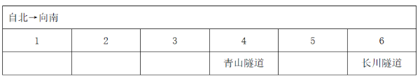

代入B项：已知绿水隧道在最北边，假设大美隧道在第2位，根据条件（1），白玉隧道和彩石隧道可以在第4位和第5位，或第5位和第6位，但这两种情况都不符合条件（2）。再次假设大美隧道在第3位，此时白玉隧道和彩石隧道只能在第5位和第6位，此时长川隧道和青山隧道可以分别在第2位和第4位，可进行如下安排，满足题干条件，该项可能成立，排除；

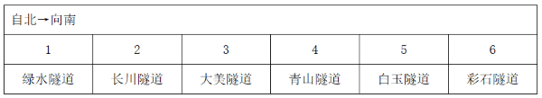

代入C项：已知彩石隧道与青山隧道隔一条隧道，假设大美隧道在第1位，根据条件（1）和（2），此时白玉隧道和彩石隧道只能在第5位和第6位，可知青山隧道在第4位，长川隧道在第2位，继续推理可知，绿水隧道在第3位，可进行如下安排，满足题干条件，该项可能成立，排除；

代入D项：已知白玉隧道与大美隧道隔一条隧道，假设大美隧道在第1位，可知白玉隧道在第3位，根据条件（1），彩石隧道在第4位，此时不满足条件（2）。再次假设大美隧道在第2位，可知白玉隧道和彩石隧道分别在第4位和第5位，此时长川隧道和青山隧道可以分别在第1位和第3位，继续推理可知，绿水隧道在第6位，可进行如下安排，满足题干条件，该项可能成立，排除。

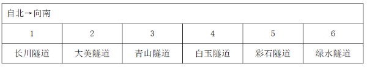

本题为选非题，故正确答案为A。

---

### 第 2 题　qid 2741999 · 逻辑判断

如果绿水隧道与白玉隧道相邻，则以下哪项一定为真？

- **A**. 彩石隧道处于由南向北的第二位
- **B**. 大美隧道处于由北向南的第二位　✅
- **C**. 长川隧道处于由北向南的第三位
- **D**. 青山隧道处于由南向北的第三位

**答案**：B

**官方解析**

第一步：分析题干条件。

（1）白玉隧道在彩石隧道的北边并与之相邻，在大美隧道的南边但与之不相邻；

（2）长川隧道与青山隧道之间隔一条隧道；

（3）绿水隧道与白玉隧道相邻。

第二步：根据题干条件进行推理。

根据条件（1）和（3）可知：白玉隧道与彩石隧道相邻，并且白玉隧道在彩石隧道的北边。同时绿水隧道也和白玉隧道相邻，所以他们三者由北向南的顺序为：绿水隧道、白玉隧道、彩石隧道；

根据条件（1）和（2）可知：由于长川隧道和青山隧道中间间隔一条隧道，故中间只能是大美隧道。又由于白玉隧道在大美隧道的南边，所以长川隧道、青山隧道、大美隧道都在白玉隧道的北边。

所以六条隧道由北向南的顺序有以下两种情况，因此可以推出大美隧道处于由北向南的第二位，对应B项。

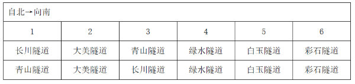

故正确答案为B。

---

### 第 3 题　qid 2741967 · 类比推理

调查：求真

- **A**. 晨练：健身　✅
- **B**. 施肥：收割
- **C**. 记忆：怀念
- **D**. 备份：复制

**答案**：A

**官方解析**

第一步：判断题干词语间逻辑关系。
调查是求真的一种方式，二者为方式的对应关系。
第二步：判断选项词语间逻辑关系。
A项：晨练是健身的一种方式，二者为方式的对应关系，与题干逻辑关系一致，当选；
B项：先施肥，再收割，二者是时间先后的对应关系，与题干逻辑关系不一致，排除；
C项：记忆可以用来怀念，二者是功能的对应关系，与题干逻辑关系不一致，排除；
D项：备份是指将电子计算机存储设备中的数据复制到其他存储设备的方式，复制是备份的一个步骤，二者不是方式目的的对应关系，与题干逻辑关系不一致，排除。
故正确答案为A。

---

### 第 4 题　qid 2741968 · 类比推理

头雁：雁阵

- **A**. 蜂王：蜂巢
- **B**. 猎狗：羊群
- **C**. 蚁后：工蚁
- **D**. 狮王：狮群　✅

**答案**：D

**官方解析**

第一步：判断题干词语间逻辑关系。
头雁是雁阵的组成部分，二者是组成关系，且头雁是雁阵的领头部分。
第二步：判断选项词语间逻辑关系。
A项：蜂巢是蜂王生活的场所，二者是场所对应关系，与题干逻辑关系不一致，排除；
B项：猎狗不是羊群的组成部分，与题干逻辑关系不一致，排除；
C项：蚁后和工蚁是并列关系中的反对关系，与题干逻辑关系不一致，排除；
D项：狮王是狮群的组成部分，二者是组成关系，且狮王是狮群的领头部分，与题干逻辑关系一致，当选。
故正确答案为D。

---

### 第 5 题　qid 2741971 · 类比推理

粮食安全：国家安全

- **A**. 传统文化：中国文化
- **B**. 家庭和谐：社会和谐　✅
- **C**. 主流媒体：纸质媒体
- **D**. 地摊经济：马路经济

**答案**：B

**官方解析**

第一步：判断题干词语间逻辑关系。
粮食安全是国家安全的组成部分，二者是包容关系中的组成关系。
第二步：判断选项词语间逻辑关系。
A项：很多国家都有自己的传统文化，中国文化有传统文化也有现代文化。故有的传统文化是中国文化，有的传统文化不是中国文化，有的中国文化是传统文化，有的中国文化不是传统文化，二者是交叉关系，与题干逻辑关系不一致，排除；
B项：家庭和谐是社会和谐的组成部分，二者是包容关系中的组成关系，与题干逻辑关系一致，当选；
C项：主流媒体就是具备一定的规模、影响力的主要媒体，是从媒体影响力进行分类，纸质媒体是以纸质材料为载体、以印刷（包括手写）为记录手段而产生的一种信息媒体，是从记录手段进行分类，二者分类标准不同。有的主流媒体是纸质媒体，有的主流媒体不是纸质媒体，有的纸质媒体是主流媒体，有的纸质媒体不是主流媒体，二者是交叉关系，与题干逻辑关系不一致，排除；
D项：地摊经济，是指通过摆地摊获得收入来源而形成的一种经济形式，马路经济其实就是指占道摆摊，二者是全同关系，与题干逻辑关系不一致，排除。
故正确答案为B。

---

### 第 6 题　qid 2741975 · 类比推理

金：金币：货币

- **A**. 木：木床：床　✅
- **B**. 水：水稻：稻
- **C**. 火：火盆：盆
- **D**. 土：土鸡：鸡

**答案**：A

**官方解析**

第一步：判断题干词语间逻辑关系。
金是制造金币的原材料，二者为原材料对应关系，金币是一种货币，二者是种属关系。
第二步：判断选项词语间逻辑关系。
A项：木是制造木床的原材料，二者为原材料对应关系，木床是一种床，二者是种属关系，与题干逻辑关系一致，当选；
B项：水是水稻生长的必要条件，二者是必要条件的对应关系，与题干逻辑关系不一致，排除；
C项：火不是制造火盆的原材料，火盆是一种盆，与题干逻辑关系不一致，排除；
D项：土不是制造土鸡的原材料，土鸡是一种鸡，与题干逻辑关系不一致，排除。
故正确答案为A。

---

### 第 7 题　qid 2741977 · 类比推理

花：鸟：杜鹃

- **A**. 戏：剧：昆曲
- **B**. 钟：表：秒表
- **C**. 草：木：植物
- **D**. 人：畜：黄牛　✅

**答案**：D

**官方解析**

第一步：判断题干词语间逻辑关系。
花和鸟是并列关系；且杜鹃既可以是花的一种，也可以是鸟的一种，第三词与前两词为种属关系。
第二步：判断选项词语间逻辑关系。
A项：戏和剧都可以用来指戏剧。昆曲是中国古老的戏曲声腔、剧种，现又被称为昆剧，昆曲是戏剧的一种，为种属关系，与题干逻辑关系不一致，排除；
B项：钟和表是并列关系；但秒表是表的一种，与题干逻辑关系不一致，排除；
C项：草和木是并列关系；但草和木均属于植物，与题干逻辑关系不一致，排除；
D项：人和畜是并列关系；且黄牛既可以是人的一种（票贩子），也可以是畜的一种，第三词与前两词为种属关系，与题干逻辑关系一致，当选。
故正确答案为D。

---

### 第 8 题　qid 2741980 · 类比推理

白鸽：母鸽：鸽

- **A**. 柿饼：甜饼：饼
- **B**. 桃花：梨花：花
- **C**. 零售：网售：买
- **D**. 水桶：铁桶：桶　✅

**答案**：D

**官方解析**

第一步：判断题干词语间逻辑关系。
有的白鸽是母鸽，有的白鸽不是母鸽，有的母鸽是白鸽，有的母鸽不是白鸽，二者为交叉关系；且白鸽和母鸽都是鸽的一种，前两词与第三词为种属关系。
第二步：判断选项词语间逻辑关系。
A项：柿饼指的是用柿子制作成的饼状食品，不是饼的一种，与题干逻辑关系不一致，排除；
B项：桃花与梨花为并列关系，与题干逻辑关系不一致，排除；
C项：有的零售是网售，有的零售不是网售，有的网售是零售，有的网售不是零售，二者为交叉关系；但零售和网售均不属于买，与题干逻辑关系不一致，排除；
D项：有的水桶是铁桶，有的水桶不是铁桶，有的铁桶是水桶，有的铁桶不是水桶，二者为交叉关系；且水桶和铁桶都是桶的一种，前两词与第三词为种属关系，与题干逻辑关系一致，当选。
故正确答案为D。

---

### 第 9 题　qid 2741987 · 类比推理

国家：治理：现代化

- **A**. 企业：规制：自动化
- **B**. 社会：建设：法治化　✅
- **C**. 社区：服务：数字化
- **D**. 政府：管理：一体化

**答案**：B

**官方解析**

第一步：判断题干词语间逻辑关系。
治理国家，前两词为动宾关系；且治理国家的目的是为了实现现代化，前两词与第三词之间为目的对应关系。
第二步：判断选项词语间逻辑关系。
A项：规制企业，前两词为动宾关系；但规制企业的目的不是为了实现自动化，而是为了在市场经济体制下，矫正和改善市场机制内在的问题，与题干逻辑关系不一致，排除；
B项：建设社会，前两词为动宾关系；且建设社会的目的是为了实现国家法治化，前两个词与第三个词之间为目的对应关系，与题干逻辑关系一致，当选；
C项：服务社区，搭配不当，应为“社区服务”，与题干逻辑关系不一致，排除；
D项：管理政府，搭配不当，应为“政府管理”，与题干逻辑关系不一致，排除。
故正确答案为B。

---

### 第 10 题　qid 2741979 · 类比推理

河长：河道巡查：水清岸绿

- **A**. 湖长：污染治理：波平浪静
- **B**. 路长：道路维修：车水马龙
- **C**. 机长：客机驾驶：安全准点　✅
- **D**. 村长：带头致富：鸟语花香

**答案**：C

**官方解析**

第一步：判断题干词语间逻辑关系。
河长指负责督办河流管理工作的人，河道巡查是河长的工作职责，河道巡查的目的是为了实现水清岸绿，三者之间为负责人、工作职责、工作目的的对应关系。
第二步：判断选项词语间逻辑关系。
A项：湖长指负责湖泊管理保护工作的人，污染治理是湖长的工作职责，但污染治理不是为了实现波平浪静，而是为了改善中国水环境，与题干逻辑关系不一致，排除；
B项：路长指负责道路管理工作的各交通支大队民警及相关负责人，但道路维修不是路长的工作职责，与题干逻辑关系不一致，排除；
C项：机长指民用航空器运输机长，客机驾驶是机长的工作职责，客机驾驶是为了把旅客安全准点送达目的地，与题干逻辑关系一致，当选；
D项：村长指依照村委会组织法选举产生的群众自治性的村民委员会的主任，但带头致富不是村长的工作职责，与题干逻辑关系不一致，排除。
故正确答案为C。

---

### 第 11 题　qid 2741985 · 类比推理

微信群  之于（    ） 相当于（    ）之于  教学

- **A**. 符号；黑板
- **B**. 点赞；教师
- **C**. 社交；教室　✅
- **D**. 红包；奖励

**答案**：C

**官方解析**

逐一代入选项。
A项：“微信群”里的人文字沟通时会用到“符号”，“黑板”是“教学”时用到的工具，前后逻辑关系不一致，排除；
B项：“点赞”与“微信群”没有必然的逻辑关系，“教师”是“教学”过程中的主体，前后逻辑关系不一致，排除；
C项：“微信群”是“社交”的场所，“教室”是“教学”的场所，均是场所对应关系，前后逻辑关系一致，当选；
D项：“微信群”里可以发“红包”，为场所对应关系，“奖励”是“教学”的一种方式，为方式对应关系，前后逻辑关系不一致，排除。
故正确答案为C。

---

### 第 12 题　qid 2741993 · 类比推理

水车  之于  （    ）相当于  （    ）  之于  计算器

- **A**. 风车；口算
- **B**. 稻田；计算
- **C**. 河水；数据
- **D**. 水泵；算盘　✅

**答案**：D

**官方解析**

逐一代入选项。
A项：“水车”是一种灌溉工具，“风车”可用来发电，也可用来灌溉，二者都具有灌溉的功能，“口算”是一种计算方式，“计算器”是一种计算工具，前后逻辑关系不一致，排除；
B项：“水车”用来灌溉“稻田”，“计算器”用来“计算”，但“稻田”为名词，“计算”为动词，且前后顺序相反，前后逻辑关系不一致，排除；
C项：“水车”是将“河水”灌溉到农田中的一种工具，“计算器”可以用来计算“数据”，但前后顺序相反，前后逻辑关系不一致，排除；
D项：“水车”与“水泵”都是抽水的工具，“算盘”与“计算器”都是计算的工具，功能相同且均为并列关系，前后逻辑关系一致，当选。
故正确答案为D。

---

### 第 13 题　qid 2742008 · 图形推理

请从所给的四个选项中，选出最恰当的一项填入问号处，使之呈现一定的规律。

- **A**. A　✅
- **B**. B
- **C**. C
- **D**. D

**答案**：A

**官方解析**

元素组成不同，无明显属性规律，考虑数量规律。选项中出现信封等生活化图形，考虑部分数。观察发现，题干图形的部分数均为2，所以？处要选一个部分数为2的图形，只有A项符合，当选。
故正确答案为A。

---

### 第 14 题　qid 2742014 · 图形推理

请从所给的四个选项中，选出最恰当的一项填入问号处，使之呈现一定的规律。

- **A**. A　✅
- **B**. B
- **C**. C
- **D**. D

**答案**：A

**官方解析**

元素组成不同，无明显属性规律，考虑数量规律。观察发现，题干中的图形封闭区域明显，优先考虑数面，题干图形的面数量依次为3、4、4、5、3、？，单看无规律。再次观察发现，题干图形的外框均为多边形，且出现较多三角形、四边形，考虑外框直线数。外框直线数量依次为3、4、4、5、3、？。可知题干的规律为面数量外框直线数量，只有A项符合规律，当选。

故正确答案为A。

---

### 第 15 题　qid 2742022 · 图形推理

请从所给的四个选项中，选出最恰当的一项填入问号处，使之呈现一定的规律。

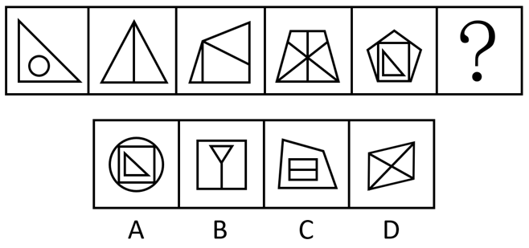

- **A**. A
- **B**. B　✅
- **C**. C
- **D**. D

**答案**：B

**官方解析**

元素组成不同，且无明显属性规律，优先考虑数量规律。题干图1和图5有明显的单一直角三角形，且图2是一个三角形被分割成两个明显的直角三角形，考虑直角数量。观察发现，题干图形的直角数量分别为1、2、3、4、5，故？处图形的直角数量应为6。B项直角数量为6，当选；A项直角数量为5，C项直角数量为8，D项直角数量为0，均排除。
故正确答案为B。

---

### 第 16 题　qid 2742027 · 图形推理

请从所给的四个选项中，选出最恰当的一项填入问号处，使之呈现一定的规律。

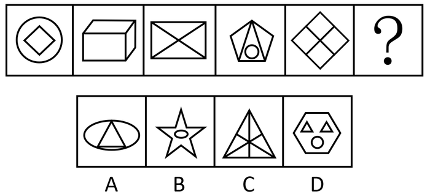

- **A**. A
- **B**. B　✅
- **C**. C
- **D**. D

**答案**：B

**官方解析**

元素组成不同，且无明显属性规律，优先考虑数量规律。观察发现，题干图三及图五为“田”字变形，考虑笔画数。题干图形均为两笔画，所以？处也应为两笔画图形。A项是一笔画图形；B项是两笔画图形；C项是三笔画图形；D项是四笔画图形，只有B项满足规律，当选。
故正确答案为B。

---

### 第 17 题　qid 2742057 · 图形推理

请从所给的四个选项中，选出最恰当的一项填入问号处，使之呈现一定的规律。

- **A**. A
- **B**. B
- **C**. C　✅
- **D**. D

**答案**：C

**官方解析**

元素组成相同，优先考虑位置规律。观察题干图形，未发现明显位置规律。继续观察发现，题干每幅图中小黑块的数量均为5，且题干每幅图中所有小黑块均以点连接成一个整体，只有C项符合。
故正确答案为C。

---

### 第 18 题　qid 2742058 · 图形推理

请从所给的四个选项中，选出最恰当的一项填入问号处，使之呈现一定的规律。

- **A**. A
- **B**. B　✅
- **C**. C
- **D**. D

**答案**：B

**官方解析**

本题考查三视图，九宫格优先横行找规律。观察发现，第一行立体图形的俯视图均相同，如下图所示；验证第二行发现也满足此规律；第三行应用此规律，故“？”处应选择一个俯视图与其他图形相同的立体图形，排除A、C两项。继续观察发现，题干立体图形均为2层，D项立体图形为3层，排除，只有B项符合规律，当选。

故正确答案为B。

---

### 第 19 题　qid 2742059 · 图形推理

请从所给的四个选项中，选出最恰当的一项填入问号处，使之呈现一定的规律。

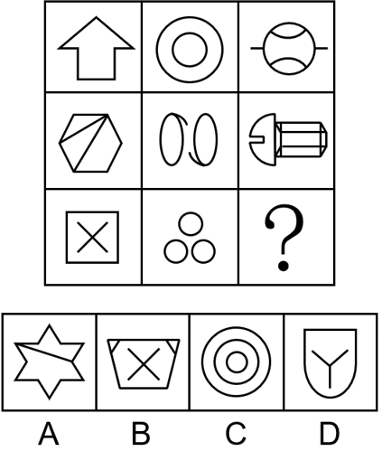

- **A**. A
- **B**. B
- **C**. C
- **D**. D　✅

**答案**：D

**官方解析**

元素组成不同，优先考虑属性规律。观察发现，题干出现全直线、全曲线图形，优先考虑曲直性。九宫格优先横行看，第一行图1由全直线构成，图2由全曲线构成，图3由直线和曲线构成；第二行图1由全直线构成，图2由全曲线构成，图3由直线和曲线构成；第三行图1由全直线构成，图2由全曲线构成，故“？”处图形应该由直线和曲线构成，只有D项符合规律，当选。
故正确答案为D。

---

### 第 20 题　qid 2742060 · 图形推理

下边四个图形中，只有一个是由上边的四个图形拼合（只能通过上、下、左、右平移）而成的，请把它找出来。

- **A**. A　✅
- **B**. B
- **C**. C
- **D**. D

**答案**：A

**官方解析**

本题考查平面拼合，可采用平行且等长相消的方式解题。消去平行且等长的线段后进行组合可得到轮廓图，即为A项。平行且等长相消的方式如下图所示：

故正确答案为A。

---

### 第 21 题　qid 2742061 · 图形推理

下边四个图形中，只有一个是由上边的四个图形拼合（只能通过上、下、左、右平移）而成的，请把它找出来。

- **A**. A
- **B**. B
- **C**. C　✅
- **D**. D

**答案**：C

**官方解析**

本题考查平面拼合，可采用平行且等长相消的方式解题。消去平行且等长的线段后进行组合可得到轮廓图，即为C项。平行且等长相消的方式如下图所示：

故正确答案为C。

---

### 第 22 题　qid 2742062 · 图形推理

下边四个图形中，只有一个是由上边的四个图形拼合（只能通过上、下、左、右平移）而成的，请把它找出来。

- **A**. A　✅
- **B**. B
- **C**. C
- **D**. D

**答案**：A

**官方解析**

本题考查平面拼合，题干已知图形均为等腰直角三角形，依据题干要求只能通过上、下、左、右平移实现拼合，经过拼合后只能得到A项。如下图所示：

故正确答案为A。

---

### 第 23 题　qid 2742063 · 图形推理

下边四个图形中，只有一个是由上边的四个图形拼合（只能通过上、下、左、右平移）而成的，请把它找出来。

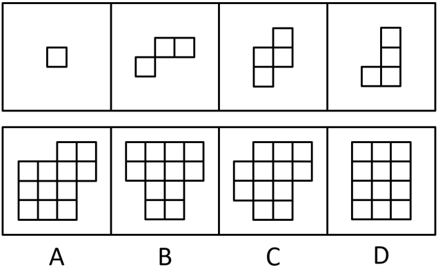

- **A**. A
- **B**. B
- **C**. C
- **D**. D　✅

**答案**：D

**官方解析**

本题为平面拼合，拼合方式如下图所示：

故正确答案为D。

---

### 第 24 题　qid 2742064 · 图形推理

左边给定的是多面体的外表面，右边哪一项能由它折叠而成？请把它找出来。

- **A**. A
- **B**. B　✅
- **C**. C
- **D**. D

**答案**：B

**官方解析**

本题考查六面体。将展开图中上下两个面移动，并给每个面标号，如下图所示：

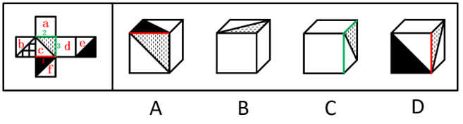

逐一分析选项。

A项：选项中必然存在面c，展开图中面c与面e为相对面，无法同时出现，故选项上侧面为面f，展开图中面c与面f的公共边——边1为面c上白色三角形的直角边，而选项中两个面的公共边为面c上竖线三角形的直角边，选项与展开图不一致，排除；

B项：选项由面a、面c与面d构成，与展开图一致，当选；

C项：选项由面a、面c与面d构成，展开图中面c与面a、面d的公共边——边2与边3均为面c上竖线三角形的直角边，而选项中有一条公共边为面c上白色三角形的直角边，选项与展开图不一致，排除；

D项：选项中必然存在面c，展开图中面c与面e为相对面，无法同时出现，故选项正面为面f，展开图中面c与面f的公共边——边1为面c上白色三角形的直角边，而选项中两个面的公共边均为面c上竖线三角形的直角边，选项与展开图不一致，排除。

故正确答案为B。

---

### 第 25 题　qid 2742065 · 图形推理

左边给定的是多面体的外表面，右边哪一项能由它折叠而成？请把它找出来。

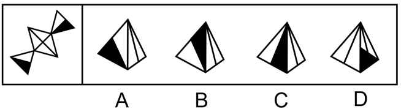

- **A**. A
- **B**. B　✅
- **C**. C
- **D**. D

**答案**：B

**官方解析**

本题考查四面体，将原展开图标上序号，如下图所示：

逐一分析选项。

A项：展开图中面c与面a、面d的公共边均与面a、面d上的黑色三角形的边相交，而选项中右侧面与左侧面的黑色三角形的边不相交，因此选项中右侧面不可能为面c，应为面b，展开图中面b左侧面应为面a，且面b引出线条的顶点与面a的黑色三角形的一个顶点相交，而选项中面b引出线条的顶点与左侧面上的黑色三角形顶点不相交，选项与展开图不一致，排除；

B项：选项由面c、面d构成，与展开图一致，当选；

C项：选项中左侧面与右侧面的公共边为黑色直角三角形的斜边，展开图中只有面c与面d的公共边为黑色直角三角形的斜边，故选项由面c与面d构成，展开图中面c引出线条的顶点与面d中黑色直角三角形短直角边与斜边的顶点相交，而选项中面c引出线条的顶点与面d中黑色直角三角形长直角边与斜边的顶点相交，选项与展开图不一致，排除；

D项：选项右侧面在展开图中不存在，属于无中生有面，排除。

故正确答案为B。

---

### 第 26 题　qid 2742066 · 图形推理

左边给定的是多面体的外表面，右边哪一项不能由它折叠而成？请把它找出来。

- **A**. A
- **B**. B
- **C**. C
- **D**. D　✅

**答案**：D

**官方解析**

本题考查六面体，将展开图上下两个面移动，并为每个面标上序号，如下图所示：

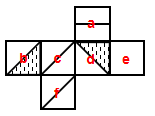

逐一分析选项。

A项：选项由面a、面d与面e构成，与题干展开图一致，排除；

B项：选项由面b、面c与面f构成，与题干展开图一致，排除；

C项：选项由面a、面b与面c构成，与题干展开图一致，排除；

D项：选项中必然有面c和面f，展开图中面c与面f上的对角线不相交，而选项中两条对角线相交，选项与展开图不一致，当选。

本题为选非题，故正确答案为D。

---

### 第 27 题　qid 2742067 · 图形推理

左边给定的是立方体，右边哪一项是它的外表面展开图？请把它找出来。

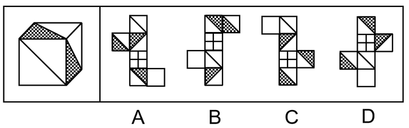

- **A**. A
- **B**. B
- **C**. C　✅
- **D**. D

**答案**：C

**官方解析**

将展开图的面均标上序号，如下图所示。

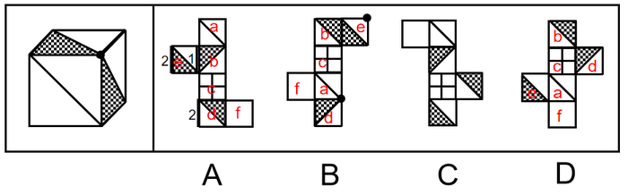

A项：立方体中两个阴影三角形面的公共边与空白三角形相接，若两个阴影三角形的面为展开图中的面b和面e，两个面的公共边与面b中阴影三角形相接，与题干不符；若两个阴影三角形的面为面b和面d，面b和面d为相对面不可能同时出现；若两个阴影三角形的面为面e和面d，两个面的公共边与面e中阴影三角形相接，与题干不符。以上三种情况均与题干不一致，排除；

B项：展开图中面a与面b为相对面不可能同时出现，所以两个阴影三角形的面只能为面d和面e。立方体中面a、面d与面e的公共点为两个阴影三角形的锐角交点，展开图中三个面的公共点为阴影三角形的锐角和空白三角形直角的交点，与题干不一致，排除；

C项：与题干一致，当选；

D项：若立体图的展开图为面a、面b和面d，面a和面b为相对面不可能同时出现，与题干不符；若立体图的展开图为面a、面b和面e，面a和面b为相对面不可能同时出现，与题干不符；若立体图的展开图为面a、面e和面d，面e和面d为相对面不可能同时出现，与题干不符。以上三种情况均与题干不一致，排除。

故正确答案为C。

---

### 第 28 题　qid 2742068 · 逻辑判断

人无精神则不立，国无精神则不强。精神是一个民族赖以长久生存的灵魂，唯有精神上达到一定的高度，一个民族才能在历史的洪流中奋勇向前。
根据以上陈述，可以得出以下哪项？

- **A**. 人有精神则立，国有精神则强
- **B**. 一个民族如果精神上没有达到一定的高度，就没有赖以长久生存的灵魂
- **C**. 一个民族若在历史的洪流中奋勇向前，则精神上已达到一定的高度　✅
- **D**. 一个民族如果精神上达到一定的高度，就会在历史的洪流中奋勇向前

**答案**：C

**官方解析**

第一步：翻译题干。

①人无精神不立，国无精神不强；

②一个民族在历史的洪流中奋勇向前精神上达到一定的高度。

第二步：逐一分析选项。

A项：翻译为人有精神立，国有精神强，是对①的否前，否前得不到确定性结论，排除；

B项：翻译为一个民族精神上没有达到一定的高度没有赖以长久生存的灵魂，但是题干并无精神与灵魂之间的推出关系，无法推出，排除；

C项：翻译为一个民族在历史的洪流中奋勇向前精神上已达到一定的高度，是对②的肯前，肯前必肯后，可以推出，当选；

D项：翻译为一个民族精神上达到一定的高度在历史的洪流中奋勇向前，是对②的肯后，肯后得不到确定性结论，无法推出，排除。

故正确答案为C。

---

### 第 29 题　qid 2742069 · 类比推理

古人云：立善法于天下，则天下治；立善法于一国，则一国治。
以下哪项与上述古人说法的形式结构最为相似？

- **A**. 民生在勤，勤则不匮
- **B**. 穷则独善其身，达则兼济天下　✅
- **C**. 明者因时而变，知者随事而制
- **D**. 俭则约，约则百善俱兴；侈则肆，肆则百恶俱纵

**答案**：B

**官方解析**

第一步：分析题干的形式结构。

题干的含义为：在天下设立好法制，天下就会太平；在一国制定好法制，一国就会太平。其形式结构为12，34。

第二步：逐一分析选项。

A项：该项的含义为：民众的生计、生活在于勤劳，勤劳就不会出现物资匮乏。其形式结构为12，与题干形式结构不同，排除；

B项：该项的含义为：如果自己不得志，那么就要管好自己的道德修养，如果自己得志，那么就要努力让天下人都能得到好处。其结构形式为12，34，与题干形式结构相似，当选；

C项：该项的含义为：聪明的人会根据时期的不同而改变自己的策略和方法，有大智慧的人会根据事物发展方向的不同而制定相应的管理方法。其中不包含推理关系，与题干形式结构不同，排除；

D项：该项的含义为：节俭就会有节制，有节制则百善都会兴起；奢侈就会放肆，放肆则百恶都会爆发。其结构形式为12，23，45，56，与题干形式结构不同，排除。

故正确答案为B。

---

### 第 30 题　qid 2742070 · 逻辑判断

最近，一些海洋考古人员在地中海卡梅尔海岸附近的海底发现了一堵约100米长的巨型石墙。尽管石墙上没有留下任何文字符号，历史上也没有留下关于这堵石墙的任何记录，考古人员仍然通过对散落在石墙附近的木桩、石碗和兽骨等物品的测定，认为石墙是7000年前人类创造的遗迹。它的用途究竟是什么？由于当时敌人很难来自海上，研究人员推断，当时这里的人们筑起石墙，主要是为了避免海水上涨后淹没村庄。
以下哪项如果为真，最能支持上述研究人员的推断？

- **A**. 7000年前，地球正处于冰河期结束前期，地中海海平面每年抬升4至7毫米　✅
- **B**. 石墙之后发现有人类定居点的遗迹，现在它们都被海水淹没在三四米深的海底
- **C**. 考古发现的石墙虽然只有100米长，但算上损毁部分，其长度足够包围定居点
- **D**. 今天的人类同样面临海平面上升的风险，有的国家也采取筑墙防御的应对策略

**答案**：A

**官方解析**

第一步：找出论点和论据。
论点：当时（即7000年前）这里的人们筑起石墙，主要是为了避免海水上涨后淹没村庄。
论据：当时敌人很难来自海上。
第二步：逐一分析选项。
A项：该项指出在7000年前，海平面每年均会上涨，说明当时确实存在海平面上涨的情况，才使得沿海居民可能为了避免海水上涨后淹没村庄，而选择筑起石墙，属于补充论据，可以加强，当选；
B项：该项指出石墙之后有人类定居点的遗迹，现在都被淹了，论点讨论的是7000年前筑起石墙的原因，石墙之后的人类定居具体是何时发生的事，属于不明确选项，没有A项时间点对应准确，排除；
C项：该项指出石墙的长度足以包围定居点，但不确定包围定居点的长度与修建石墙的目的之间是否有关，包围定居点也有可能是为了阻挡猛兽袭击，可能性很多，不明确，排除；
D项：该项指出有的国家采取筑墙防御来应对海平面上升的风险，说的是现在的情况，而论点讨论的是7000年前筑起石墙的原因，无法加强，排除。
故正确答案为A。

---

### 第 31 题　qid 2741973 · 类比推理

甲、乙、丙、丁4位中学同学毕业30年后相聚。现在，他们已成为企业家、大学教师、歌手和会计师，且每人只有一种身份，并不重复。他们在中学时代就各人的未来职业有过如下预言:
甲：乙不会成为歌手；
乙：丙会成为会计师；
丙：丁不会成为企业家；
丁：乙不会成为大学教师。
现在看来，他们当中只有会计师的预言是正确的。
根据上述信息可以推断，甲、乙、丙、丁的职业分别是：

- **A**. 企业家、大学教师、歌手、会计师
- **B**. 大学教师、歌手、企业家、会计师
- **C**. 企业家、歌手、会计师、大学教师
- **D**. 会计师、大学教师、歌手、企业家　✅

**答案**：D

**官方解析**

第一步：分析题干条件。
（1）甲：乙不会成为歌手；
（2）乙：丙会成为会计师；
（3）丙：丁不会成为企业家；
（4）丁：乙不会成为大学教师。
根据“他们当中只有会计师的预言是正确的”，可知其余人的预言是错误的，但是无法根据题干条件知道谁是会计师，所以优先采用假设法。
第二步：根据已知条件进行推理。
条件（2）乙说的话出现丙和会计师，优先考虑假设乙和丙的职业。
假设乙为会计师：若乙为会计师，说明乙的预言正确，即丙是会计师，此时会计师同时为乙和丙，不符合题干中每人只有一种身份，故乙不是会计师，所以乙说的是假话；
假设丙为会计师：若丙为会计师，说明乙的预言正确，不符合题干“只有会计师的预言是正确的”，故丙不是会计师，排除C项；由于丙不是会计师，故丙的预言不正确，结合条件（3）可知丁为企业家，结合选项，只有D项符合，当选。
故正确答案为D。

---

### 第 32 题　qid 2741976 · 逻辑判断

2020年疫情肆虐，但电商直播逆势崛起，一季度全国电商直播超过400万场，“万物可播、全民可播”成为一个响亮的口号。一项针对消费者和商家的调查显示，在电商直播中，许多消费者能以优惠的价格购买到心仪的商品，商家也能提升其销售额。有专家据此推断，电商直播的商业模式在疫情过后仍会受到商家和消费者的追捧。
以下各项如果为真，则除哪项外均能削弱上述专家的观点？

- **A**. 低价促销已经成为当前直播带货的常态，这种价格竞争让商家无利润可赚
- **B**. 直播带货往往造成线上线下的价格不一致，不利于商家维护企业品牌形象
- **C**. 许多消费者购买直播销售的商品后遇到了以次充好、售后维权困难等情况
- **D**. 个别带货主播为了利益常常夸大自己的销售数据，而消费者对此并不知情　✅

**答案**：D

**官方解析**

第一步：找出论点和论据。
论点：电商直播的商业模式在疫情过后仍会受到商家和消费者的追捧。
论据：在电商直播中，许多消费者能以优惠的价格购买到心仪的商品，商家也能提升其销售额。
第二步：逐一分析选项。
A项：该项讨论的是商品低价促销让商家无利润可赚，说明对于消费者来说是利好的，但是商家赚不到钱，对于商家来说是不利的，所以电商直播不能受到商家的追捧，可以削弱，排除；
B项：该项讨论的是商品线上线下的价格不一致，不利于商家维护企业品牌形象，说明直播带货不会受到商家的追捧，可以削弱，排除；
C项：该项讨论的是消费者通过直播购买商品后发现商品质量有问题和售后维权困难，说明直播带货有弊端，所以不会受到消费者的追捧，可以削弱，排除；
D项：该项讨论的是主播夸大销售数据，而消费者对此并不知情，但是题干论点讨论的是电商直播这种商业模式是否会被商家和消费者追捧，与论点讨论的话题无关，为无关选项，无法削弱，当选。
本题为选非题，故正确答案为D。

---

### 第 33 题　qid 2741978 · 逻辑判断

一般认为，7万多年前的多巴火山喷发造成了全球气候变冷及环境恶化，并最终导致热带非洲以外地区人类的灭绝。近期一项对现生人群的基因研究认为，约6万年前至5万年前之间曾有一次非洲人群替代其他地区人群的过程，关于现代人的起源，“完全替代假说”是成立的，即非洲人是其他地区人群的直接祖先。
以下哪项如果为真，最能质疑上述研究人员的论证？

- **A**. 多巴火山喷发后，热带非洲以外的地区仍有人类活动
- **B**. 多巴火山的喷发短时间内仅对附近地区造成毁灭性的影响
- **C**. 距今10万年前至4万年前，东亚地区的人类演化链条从来没有中断过　✅
- **D**. 尼安德特人在2万年前至3万年前已经灭绝，但现存智人仍保留他们的基因

**答案**：C

**官方解析**

第一步：找出论点和论据。
论点：关于现代人的起源，“完全替代假说”是成立的，即非洲人是其他地区人群的直接祖先。
论据：7万多年前的多巴火山喷发造成了全球气候变冷及环境恶化，并最终导致热带非洲以外地区人类的灭绝。约6万年前至5万年前之间曾有一次非洲人群替代其他地区人群的过程。
本题论点和论据都在讨论非洲人群和其他地区人群的关系，话题一致，因此可以预设否定论点的方式进行削弱，即说明非洲人群不是其他地区人群的直接祖先。
第二步：逐一分析选项。
A项：该项说的是多巴火山喷发后，热带非洲以外的地区仍有人类活动，但不明确活动的人群是原有人群还是非洲人群，不明确选项，无法削弱，排除；
B项：该项说的是多巴火山的喷发短时间内仅对附近地区造成毁灭性的影响，但是不明确火山喷发的长期影响是否会造成热带非洲以外地区人类的灭绝，不明确选项，无法削弱，排除；
C项：该项说的是距今10万年前至4万年前，东亚地区的人类演化链条从来没有中断，即说明了在此期间东亚地区的人类没有发生过人群替代的过程，非洲人也就不是其他地区人群的直接祖先，削弱论点，可以削弱，当选；
D项：该项说的是尼安德特人在2万年前至3万年前已经灭绝，而题干说的是6万年前至5万年前之间的人群替代问题，话题不一致，无法削弱，排除。
故正确答案为C。

---

### 第 34 题　qid 2741981 · 逻辑判断

近日，某社区为活跃社区文化气氛，开展了一场别开生面的社区文化活动，有若干兴趣社团供居民选择。已知报名情况如下：
（1）居民在诗词社和书法社中至少参加了一个；
（2）居民如果参加了诗词社，则没有参加合唱团；
（3）李女士参加了合唱团。
社区主任知道上述情况后断定，李女士也参加了戏迷社。
以下哪项如果为真，可以成为社区主任断定所需的前提？

- **A**. 李女士没有参加诗词社
- **B**. 参加了戏迷社的也参加了书法社
- **C**. 李女士没有参加书法社
- **D**. 不参加戏迷社的都不参加书法社　✅

**答案**：D

**官方解析**

第一步：找出论点和论据。

论点：李女士也参加了戏迷社。

论据：

（1）居民在诗词社和书法社中至少参加了一个；

（2）居民如果参加了诗词社，则没有参加合唱团。出现逻辑关联词，可以翻译为：参加诗词社没有参加合唱团；

（3）李女士参加了合唱团。

论据（3）“李女士参加了合唱团”是对论据（2）“参加诗词社没有参加合唱团”的否后，根据“否后必否前”原则，可以得到李女士没有参加诗词社；结合论据（1）“居民在诗词社和书法社中至少参加了一个”可知，李女士参加了书法社。

本题需要找出论点成立的前提，可优先考虑搭桥的加强方式进行加强，即建立“李女士参加了合唱团”与“李女士参加戏迷社”、“李女士没有参加诗词社”与“李女士参加戏迷社”、“李女士参加了书法社”与“李女士参加戏迷社”的联系。

第二步：逐一分析选项。

A项：“李女士没有参加诗词社”，结合论据“居民在诗词社和书法社中至少参加了一个”可知，李女士参加了书法社，无法建立与“李女士参加戏迷社”的联系，不是论点成立的前提，排除；

B项：“参加了戏迷社的也参加了书法社”可以翻译为：参加戏迷社参加书法社，根据题干论据得到“李女士参加了书法社”是对该推出关系的肯后，肯后得不到必然结论，不是论点成立的前提，排除；

C项：“李女士没有参加书法社”，与题干论据“李女士参加了书法社”矛盾，削弱论据，不是论点成立的前提，排除；

D项：“不参加戏迷社的都不参加书法社”可以翻译为：不参加戏迷社不参加书法社，根据题干论据得到“李女士参加了书法社”是对该推出关系的否后，根据“否后必否前”原则，可以得到李女士参加了戏迷社，建立了“李女士参加书法社”与“李女士参加戏迷社”之间的联系，是论点成立的前提，当选。

故正确答案为D。

---

### 第 35 题　qid 2741984 · 逻辑判断

当前，很多高校规定研究生毕业之前必须发表一定数量的学术文章，并将其与学位获得资格挂钩。校方认为，研究生学习期间发表论文，有利于提高其学术水平，增强其学术能力，既能实现人才培养的目标，又能扩大学校的知名度。然而，最近某高校取消了研究生论文发表与学位获得资格挂钩的规定，受到许多研究生导师的认同。他们认为，这一规定更有利于培养该校研究生的学术能力。
以下哪项如果为真，最能支持上述研究生导师们的观点？

- **A**. 该校的研究生素质高，即使学校不做规定，大部分研究生也会想方设法发表论文
- **B**. 该校曾有极少数研究生为了学位而肆意抄袭、买卖论文，严重影响学校声誉
- **C**. 该校许多导师指导多名研究生，需要花费大量时间来修改学生的投稿论文
- **D**. 该校过去用论文发表要求来代替培养过程监督，导致学生难以沉下心来研究学问　✅

**答案**：D

**官方解析**

第一步：找出论点和论据。
论点：许多研究生导师认为高校取消研究生论文发表与学位获得资格挂钩的规定更有利于培养该校研究生的学术能力。
论据：无。
题干中只有论点没有论据，因此考虑补充论据，通过解释或者举例子来加强。
第二步：逐一分析选项。
A项：该项说的是大部分研究生素质高会想方设法发表论文，论点讨论的是取消研究生论文发表与学位获得资格挂钩的规定有利于培养该校研究生的学术能力，想方设法发表论文与取消规定有利于培养学术能力无关，话题不一致，不能加强，排除；
B项：该项说的是极少数研究生为了学位而肆意抄袭、买卖论文，论点讨论的是取消研究生论文发表与学位获得资格挂钩的规定有利于培养该校研究生的学术能力，为了学位抄袭、买卖论文与取消规定培养学术能力无关，话题不一致，不能加强，排除；
C项：该项说的是导师需要花费大量时间来修改学生的投稿论文，而论点说的是取消研究生论文发表与学位获得资格挂钩的规定有利于培养该校研究生的学术能力，话题不一致，不能加强，排除；
D项：该项说明了校方的规定导致学生难以沉下心来研究学问，进而不利于学术能力的提升，补充论据进行加强，当选。
故正确答案为D。

---

### 第 36 题　qid 2741983 · 定义判断

逆向文化冲击：指旅居他乡者回到故国或故乡后，短时间内在生活、心理等方面难以适应本土文化的现象。
下列不属于逆向文化冲击的是：

- **A**. 
大卫在中国从事英语培训工作10多年，回国后感到很不习惯。他在不久前的一段视频中抱怨说：半夜饿了，在中国拿出手机点个外卖，半个小时就送到了，而这里啥都没有，只能饿死在去超市的路上

- **B**. 
在城里生活多年的老杨，今年春节回到农村老家后，亲戚朋友请他到附近饭店吃饭。开席后，他习惯性地让服务员去拿公筷、公勺，服务员惊讶地看着他，半天没反应过来，亲戚们也觉得他怪怪的

- **C**. 
留学刚回国的小吴约朋友去青岛看海，因为没有12306账户，只得请朋友帮忙购票。上车后他惊讶地发现，高铁上不仅可以扫码点餐，还可以点外卖，自己头天准备的面包、饼干一点没用上。他感觉自己在朋友心目中简直就像个弱智

- **D**. 
欧洲姑娘玛丽来华留学，虽然早已听说过中国的无现金支付，第一周她还是惊呆了：楼下卖红薯的大爷都在用“互联网”，菜市场的每个摊位上居然都有收款二维码，更不要说超市和商场了
　✅

**答案**：D

**官方解析**

第一步：找出定义关键词。
“旅居他乡者回到故国或故乡后”、“短时间内在生活、心理等方面难以适应本土文化”。
第二步：逐一分析选项。
A项：大卫在中国从事英语培训，回国之后不习惯，符合“旅居他乡者回到故国后”，也符合“短时间内在生活、心理等方面难以适应本土文化”，符合定义，排除；
B项：老杨在城市生活多年，春节回老家，符合“旅居他乡者回到故乡后”，习惯性地让服务员去拿公筷、公勺，而服务员半天没反应过来，符合“短时间内在生活、心理等方面难以适应本土文化”，符合定义，排除；
C项：留学回国的小吴符合“旅居他乡者回到故国后”，不知道高铁上可以扫码点餐而准备了食物，符合“短时间内在生活、心理等方面难以适应本土文化”，符合定义，排除；
D项：欧洲姑娘玛丽来华留学，不适应中国的无现金支付，不符合“回到故国或故乡后”，不符合定义，当选。
本题为选非题，故正确答案为D。

---

### 第 37 题　qid 2741988 · 定义判断

双塔效应：指两个实力雄厚的相邻经济体强强联合，利用各自的集聚辐射能力，共同带动周围区域发展的现象。
下列属于双塔效应的是：

- **A**. 某市围绕“精准定位消费人群、打造特色商业体”的要求，以市区著名商圈为轴心，推动商业布局错位竞争，建成了商务、文化、居住等不同功能区
- **B**. 某区域两个特大城市利用优越的区位条件，按照“发挥优势、取长补短、互惠互利”的原则，经过多年努力，在科技、文化、工业等方面形成了国内领先的优势　✅
- **C**. 某市为了加快经济发展，将经济基础雄厚、发展空间有限的核心区与基础薄弱但发展潜力巨大的城郊区进行了区域整合，城市综合实力很快有了显著提升
- **D**. 某市国家级创新产业园成立之初，重点培育信息和医药两大产业，吸引多家世界500强企业入驻，进一步促进了本市产业转型升级，提升了城市的整体竞争力

**答案**：B

**官方解析**

第一步：找出定义关键词。
“两个实力雄厚的相邻经济体强强联合”、“各自的集聚辐射能力”、“共同带动周围区域发展”。
第二步：逐一分析选项。
A项：某市围绕要求，以商圈为轴心推动商业竞争，不符合“两个实力雄厚的相邻经济体强强联合”，不符合定义，排除；
B项：某区域两个特大城市，符合“两个实力雄厚的相邻经济体强强联合”，发挥优势、取长补短、互惠互利，符合“各自的集聚辐射能力”，在科技、文化、工业等方面形成了国内领先的优势，符合“共同带动周围区域发展”，符合定义，当选；
C项：经济基础雄厚、发展空间有限的核心区与基础薄弱但发展潜力巨大的城郊区整合，不符合“两个实力雄厚的相邻经济体强强联合”，不符合定义，排除；
D项：在成立之初重点培育信息和医药两大产业，并非两个实力雄厚的经济体，不符合“两个实力雄厚的相邻经济体强强联合”，不符合定义，排除。
故正确答案为B。

---

### 第 38 题　qid 2741992 · 定义判断

闭环思维：指工作学习过程中用各种方式的提示、应答使每个操作环节形成封闭的环，以利于实时把握进程、及时调整方向的一种思维方式。
下列不属于闭环思维的是：

- **A**. 赵教练每次收到学员发来的信息时，都会给予答复并习惯性地发送一个表情，他的手机里存了很多张风格各异的应答图片
- **B**. 钱先生每次给下属布置任务，都要求他们尽快回复信息，包括是否收到、能否完成、什么时候完成等，与他共事的人都感觉很有压力
- **C**. 小孙刚到单位时，领导安排的任务他总是很爽快地答应下来并想方设法去完成。半年后，工作越来越忙，他发现有些任务很难完成，再也不敢随意应承了
- **D**. 经理要求小李一周内草拟一个工作计划。经过认真调研，小李完成了计划书并用电子邮件发给了经理。十几天后经理特意问他：计划书写好了吗？小李惊讶地说：我早已发给你了　✅

**答案**：D

**官方解析**

第一步：找出定义关键词。
“工作学习过程中”、“各种方式的提示、应答”、“每个操作环节形成封闭的环”、“利于实时把握进程、及时调整方向”。
第二步：逐一分析选项。
A项：赵教练存了很多张图片来应答学员的消息，符合“工作学习过程中”、“各种方式的提示、应答”、“每个操作环节形成封闭的环”、“利于实时把握进程、及时调整方向”，符合定义，排除；
B项：钱先生要求下属尽快回复信息，符合“工作学习过程中”、“各种方式的提示、应答”、“每个操作环节形成封闭的环”、“利于实时把握进程、及时调整方向”，符合定义，排除；
C项：小孙刚到单位时，爽快地答应任务并完成，符合“工作学习过程中”、“各种方式的提示、应答”、“每个操作环节形成封闭的环”，在小孙发现任务很难完成后不再随意应承，符合“实时把握进程、及时调整方向”，符合定义，排除；
D项：小李已经将计划书发给了经理，但是经理十几天之后问他是否完成，不符合“每个操作环节形成封闭的环”，不符合定义，当选。
本题为选非题，故正确答案为D。

---

### 第 39 题　qid 2741995 · 定义判断

隐性管理：指通过引导、支持或服务等行为，对员工施加非制度性影响以达到预期目标的管理方式。
下列属于隐性管理的是：

- **A**. 为了丰富员工的业余文化生活，某公司专门成立了羽毛球协会，定期举办相关活动，不久以后大多数员工的羽毛球水平都有了明显提高
- **B**. 迟到早退是困扰公司多年的老大难问题，今年初公司安装了门禁系统，经理每天带头准时打卡上班，一段时间后，几乎再也看不到员工迟到早退　✅
- **C**. 小李因家庭纠纷，工作时情绪低落，单位领导得知情况后多次与他沟通交谈，解开了他心中的疙瘩，现在小李的工作比以前更出色了
- **D**. 某企业办公楼装修完后，在楼外各个角落安装了十多个摄像头，既解决了安全问题，又解决了长期以来员工乱扔垃圾、乱停私家车的问题

**答案**：B

**官方解析**

第一步：找出定义关键词。
“引导、支持或服务等行为”、“对员工施加非制度性影响”、“以达到预期目标”、“管理方式”。
第二步：逐一分析选项。
A项：某公司成立羽毛球协会，定期举办活动，属于业余活动，与管理无关，不符合“管理方式”，不符合定义，排除；
B项：安装了门禁系统，符合“引导、支持或服务等行为”，经理每天带头准时打卡上班，符合“对员工施加非制度性影响”，看不到员工迟到早退，符合“以达到预期目标”、“管理方式”，符合定义，当选；
C项：领导和小李谈心解开小李心中的疙瘩，谈的是家庭纠纷问题，是小李的个人问题，不符合“管理方式”，不符合定义，排除；
D项：某企业在各个角落安装摄像头，不符合“引导、支持或服务等行为”，解决了长期以来员工乱扔垃圾、乱停私家车的问题，不符合“管理方式”，不符合定义，排除。
故正确答案为B。

---

### 第 40 题　qid 2742001 · 定义判断

网络社交消费：指在网络社交过程中对某商品产生即兴消费欲望，借助社交平台链接完成购买行为的一种消费方式。
下列属于网络社交消费的是：

- **A**. 小夏在微博上看到一篇介绍某品牌跑步机的文章，感觉很对自己的胃口，毫不犹豫地点赞并通过博文后面的网址购买了一台　✅
- **B**. 果蔬团购微信群中可以定时秒杀群主发布的低价产品，也可以预定自己想要的品种，既便捷又实惠，小李是这些活动的常客
- **C**. 歌手小兰上传了一个翻唱经典老歌的短视频，她在视频中戴的船形帽迅速走红，“歌手小兰爆款船形帽”成为网络热搜词，在各大购物网站上卖到断货
- **D**. 某甜品店的订餐卡上印有自己的公众号，顾客关注该公众号订购甜品比外卖平台还要便宜并且可以免费送货

**答案**：A

**官方解析**

第一步：找出定义关键词。
“在网络社交过程中对某商品产生即兴消费欲望”、“借助社交平台链接完成购买”。
第二步：逐一分析选项。
A项：小夏在微博上看到一篇介绍某品牌跑步机的文章并感觉很对自己胃口，符合“在网络社交过程中对某商品产生即兴消费欲望”，并通过博文后面的网址购买了一台，符合“借助社交平台链接完成购买”，符合定义，当选；
B项：在微信群中定时秒杀低价产品，不是突然对这种产品产生消费欲望，不符合“在网络社交过程中对某商品产生即兴消费欲望”，不符合定义，排除；
C项：小兰上传短视频，视频中的船形帽迅速走红，符合“在网络社交过程中对某商品产生即兴消费欲望”，但是在各大购物网站上卖到断货没有借助社交平台链接完成购买，不符合“借助社交平台链接完成购买”，不符合定义，排除；
D项：关注公众号订购更便宜还能免费送货，不符合“在网络社交过程中对某商品产生即兴消费欲望”，不符合定义，排除。
故正确答案为A。

---

### 第 41 题　qid 2742020 · 定义判断

逆化用：指根据表达需要，将他人的语句化解后重新组合融入自己的作品中，所表达的意思与原意相反。
下列属于逆化用的是：

- **A**. 
原句：失之东隅，收之桑榆

化用：东隅已逝，桑榆非晚

- **B**. 
原句：无边落木萧萧下，不尽长江滚滚来

化用：千古兴亡多少事，悠悠，不尽长江滚滚流

- **C**. 
原句：归师勿遏，围师必阙，穷寇勿追

化用：宜将剩勇追穷寇，不可沽名学霸王
　✅
- **D**. 
原句：国破山河在，城春草木深

化用：无限山河泪，谁言天地宽

**答案**：C

**官方解析**

第一步：找出定义关键词。
“将他人的语句化解后重新组合融入自己的作品中”、“表达的意思与原意相反”。
第二步：逐一分析选项。
A项：原句比喻开始在这一方面失败了，最后在另一方面取得胜利，其中“东隅”指日出处，指早晨；“桑”“榆”均指日落处，也指日暮。化用的意思是早年的时光消逝，如果珍惜时光，发愤图强，晚年并不晚，其中“东隅”指日出处，表示早年；桑榆：指日落处，表示晚年。两句中的“东隅”和“桑榆”表达的意思并不相反，不符合“表达的意思与原意相反”，不符合定义，排除；
B项：原句的意思是无边无际的树木萧萧地飘下落叶，长江滚滚涌来奔腾不息。化用的意思是自古以来，不知道经历过多少朝代兴亡的事变，都像无穷无尽的长江一样滚滚地流过去了。原句的“不尽长江滚滚来”和化用的“不尽长江滚滚流”表达的含义相近，不符合“表达的意思与原意相反”，不符合定义，排除；
C项：原句的意思是指对败退的敌军不要袭击，对被围困的敌人要留个缺口，对走投无路的残敌不要死追。化用的意思是应该趁现在这敌衰我盛的大好时机，痛追残敌，不可学那贪图虚名、放纵敌人而造成自己失败的楚霸王项羽。两句中原句是不要追残敌，化用是要追残敌，符合“将他人的语句化解后重新组合融入自己的作品中”，也符合“表达的意思与原意相反”，符合定义，当选；
D项：原句的意思是长安沦陷，国家破碎，只有山河依旧；春天来了，人烟稀少的长安城里草木茂密。化用的意思是无限美好河山失陷伤痛泪，谁还敢说天庭宽阔地又广。两句中的“山河”意思相近，不符合“表达的意思与原意相反”，不符合定义，排除。
故正确答案为C。

---

### 第 42 题　qid 2742024 · 定义判断

共享用工：指企业在特殊时期，为了降低人力成本或解决人工短缺问题，通过借用或外派员工实现劳动力共享的临时用工方式。
下列属于共享用工的是：

- **A**. 为节省成本支出，某广告公司长期通过创客网站发包设计任务，并与一些水平较高的自由创客人员签订了合作协议，建立了密切的业务关系
- **B**. 某公司正在扩大生产经营规模，急需大量技术人员，通过线上线下相结合的形式，招聘一批兼职技术人员，既解决了无人可用的燃眉之急，又节约了用人成本
- **C**. 疫情期间，某生鲜电商平台订单激增，该平台与当地的餐饮、酒店等行业的数十家公司进行协商合作，利用他们派来的员工，缓解了自身的用工压力　✅
- **D**. 某高校在科研项目攻关过程中遇到研发人员不足的问题，于是借用多家单位的科研人员组成联合攻关团队，终于成功解决了一系列技术难题

**答案**：C

**官方解析**

第一步：找到定义关键词。
“企业在特殊时期”、“降低人力成本或解决人工短缺”、“借用或外派员工实现劳动力共享”、“临时用工方式”。
第二步：逐一分析选项。
A项：广告公司长期通过网站发包任务，不符合“特殊时期”、“临时用工方式”，不符合定义，排除；
B项：某公司在扩大生产经营规模期间招聘一批兼职技术人员，不符合“借用或外派员工实现劳动力共享”、“临时用工方式”，不符合定义，排除；
C项：疫情期间符合“企业在特殊时期”，平台订单激增符合“降低人力成本或解决人工短缺”，电商平台利用餐饮、酒店的员工，符合“借用或外派员工实现劳动力共享”、“临时用工方式”，符合定义，当选；
D项：某高校不符合题干主体“企业”，不符合定义，排除。
故正确答案为C。

---

### 第 43 题　qid 2741982 · 定义判断

城市文化客厅：指城市利用商圈、地铁、机场等处的小型公共空间举办艺术、历史、民俗等方面的常态性文化休闲活动，让市民和八方来客共享的场所。
下列不属于城市文化客厅的是：

- **A**. 某市中心步行街最近举行了十周年庆典活动，亲子类节目浸入式戏剧展演以及深受学生喜爱的二次元展、电竞展，吸引了很多年轻一族前来“打卡”　✅
- **B**. 某市图书馆附近的广场上，陈列了多组以昆曲、扬剧、锡剧、淮剧为主题的形态各异的雕塑，每到周末前来观赏的市民络绎不绝
- **C**. 某市中心地下过街通道的墙壁上最近换上了记录近百年来城市发展变化的老照片，它与周边的会展中心、大剧院、科技馆等新建筑群形成强烈对比
- **D**. 某机场近年来在候机大厅举办多场小型非遗作品展，四面八方的旅客在候机之余感受、体验到了中华传统文化的魅力

**答案**：A

**官方解析**

第一步：找出定义关键词。
“城市利用商圈、地铁、机场等处的小型公共空间”、“艺术、历史、民俗等方面的常态性文化休闲活动”。
第二步：逐一分析选项。
A项：步行街的十周年庆典活动，不符合“常态性文化休闲活动”，不符合定义，当选；
B项：图书馆附近的广场，符合“城市的小型公共空间”，陈列形态各异的雕塑，符合“艺术、历史、民俗等方面的常态性文化休闲活动”，符合定义，排除；
C项：市中心地下过街通道的墙壁，符合“城市的小型公共空间”，换上记录近百年来城市发展变化的老照片，符合“艺术、历史、民俗等方面的常态性文化休闲活动”，符合定义，排除；
D项：机场候机大厅，符合“城市的小型公共空间”，近年来举办多场小型非遗作品展，符合“艺术、历史、民俗等方面的常态性文化休闲活动”，符合定义，排除。
本题为选非题，故正确答案为A。

---

### 第 44 题　qid 2741986 · 定义判断

信息疫情：指事件传播过程中掺杂了影响判断和认知的不实信息，这些信息可能给人们带来消极影响，甚至危害身心健康。
下列不属于信息疫情的是：

- **A**. 某地发生多人腹泻、发烧现象，有人说大蒜可以预防，也有人说白醋可以治疗，短短几天时间，大蒜、白醋在当地超市脱销，后来这些传言都被证实是无稽之谈
- **B**. 一村民在微信群里说，他家院子里的老井最近水温突然升高，其他村民议论纷纷，有人说，三天以内肯定要发生大地震，许多村民连续一周都不敢在室内睡觉
- **C**. 王先生一直在向朋友抱怨，五年前购房时听很多人说自家小区附近很快就会开一家大型超市，地铁也会在那里设一个站点，可是到现在却没有一点动静
- **D**. 某山区连日暴雨，巡山员发现山上有小石头滚落，估计将发生山体塌方，立即通知村民撤离，半信半疑的村民刚刚全部搬出村子，滑落的山体就摧毁了村民房屋　✅

**答案**：D

**官方解析**

第一步：找出定义关键词。
“事件传播过程中”、“影响判断和认知的不实信息”、“可能给人们带来消极影响，甚至危害身心健康”。
第二步：逐一分析选项。
A项：某地发生多人腹泻、发烧现象，有人说大蒜可以预防，也有人说白醋可以治疗，符合“事件传播过程”，传言都被证实是无稽之谈，符合“影响判断和认知的不实信息”，大蒜、白醋脱销，符合“可能给人们带来消极影响，甚至危害身心健康”，符合定义，排除；
B项：一村民在微信群发布消息导致村民议论纷纷，符合“事件传播过程中”，有人说三天以内肯定要发生大地震，许多村民连续一周都不敢在室内睡觉，说明一周内没有发生地震，符合“影响判断和认知的不实信息”“可能给人们带来消极影响，甚至危害身心健康”，符合定义，排除；
C项：王先生五年前听说自家小区附近会开超市，符合“事件传播过程”，现在没动静，符合“影响判断和认知的不实信息”，王先生一直抱怨，符合“可能给人们带来消极影响，甚至危害身心健康”，符合定义，排除；
D项：村民全部搬出村子后，滑落的山体就摧毁了村民房屋，不符合“影响判断和认知的不实信息”，这些信息不符合“可能给人们带来消极影响，甚至危害身心健康”，不符合定义，当选。
本题为选非题，故正确答案为D。

---

### 第 45 题　qid 2741991 · 定义判断

U盘化生存：只凭借个人技能而不依赖组织内的身份，自主决定是否参与社会协作，完全由市场评判其个人价值的生存方式。
下列不属于U盘化生存的是：

- **A**. 小韩大学毕业后，曾在多家培训机构当过数学老师，她总是感觉这样工作收入虽然高，但是太辛苦了，前不久，她没有同家人商量，就自作主张进了一所民办中学　✅
- **B**. 网络写手周女士根据自己之前的职场经历写出了多部网络畅销小说，多家著名网站慕名向她约稿，由于不愿受交稿日期的限制，她经常会拒绝一些约稿
- **C**. 木匠老周进城打工十年多了，活儿干得很好，挣了不少钱，现在他有了自己的装修队，每天从早到晚都有人找他联系装修的事
- **D**. 从单位辞职后，刘先生夫妇来到南方，将租下的一栋小楼改造成了民宿。在他们精心打理下，生意十分红火，客房一度需要提前两个月预定

**答案**：A

**官方解析**

第一步：找出定义关键词。
“凭借个人技能”、“不依赖组织内的身份”、“自主决定是否参与社会协作”、“由市场评判其个人价值”。
第二步：逐一分析选项。
A项：小韩是数学老师，符合“凭借个人技能”，但是她没有同家人商量，就自作主张进了一所民办中学，不符合“不依赖组织内的身份”，且进入之后不能自由决定自己是否参与工作，不符合“自主决定是否参与社会协作”，不符合定义，当选；
B项：网络写手周女士，符合“凭借个人技能”，她经常会拒绝一些约稿，符合“自主决定是否参与社会协作”，符合定义，排除；
C项：木匠老周，符合“凭借个人技能”，有人找他联系装修的事，符合“自主决定是否参与社会协作”，符合定义，排除；
D项：刘先生夫妇将租下的一栋小楼改造成了民宿，符合“凭借个人技能”，从单位辞职改做民宿，符合“不依赖组织内的身份”、“自主决定是否参与社会协作”，符合定义，排除。
本题为选非题，故正确答案为A。

---

### 第 46 题　qid 2741996 · 定义判断

百姓讲师：指基层单位选用普通群众，用喜闻乐见的形式宣传党和政府的方针政策。
下列属于百姓讲师的是：

- **A**. 镇政府经常邀请熟悉乡情乡风的村民为新入职的干部介绍农村基本情况，讲解在农村落实上级政策的办法
- **B**. 村支书记老陈每天准时收看《新闻联播》，通过和村民聊天宣传党和国家的方针政策，并解答他们的疑问
- **C**. 朱老师退休后长期走街串巷，宣传移风易俗、乡村振兴的道理，被乡政府授予“乡村文化名人”称号
- **D**. 市民蒋先生受街道办委托把新医保政策编成快板，并录成视频，每天都发布在微信公众号及朋友圈中　✅

**答案**：D

**官方解析**

第一步：找出定义关键词。
“基层单位选用普通群众”、“用喜闻乐见的形式宣传党和政府的方针政策”。
第二步：逐一分析选项。
A项：镇政府是基层单位，邀请熟悉乡情乡风的村民为新入职的干部介绍农村基本情况，讲解在农村落实上级政策的办法，但是不知道具体形式是什么，不符合“用喜闻乐见的形式宣传党和政府的方针政策”，不符合定义，排除；
B项：村支书记老陈宣传党和国家的方针政策并解答疑问，村支书记不是普通群众，不符合“基层单位选用普通群众”，不符合定义，排除；
C项：朱老师退休后因为宣传移风易俗、乡村振兴的道理，而被乡政府授予“乡村文化名人”称号，朱老师并不是被乡政府选用才去做这件事，不符合“基层单位选用普通群众”，不符合定义，排除；
D项：市民蒋先生受街道办委托把新医保政策编成快板，并录成视频，每天都发布在微信公众号及朋友圈中，符合“基层单位选用普通群众”、“用喜闻乐见的形式宣传党和政府的方针政策”，符合定义，当选。
故正确答案为D。

---

### 第 47 题　qid 2742002 · 定义判断

能力陷阱：人们总是喜欢做比较擅长的、能够带来自信心和满足感的事情，由此而造成某种单一能力强化和其他能力弱化，难以适应社会变化对能力的新要求。
下列属于能力陷阱的是：

- **A**. 小李博士毕业后在一所大学任教，不到五年就评上了副教授。近两年来，他的工作越来越忙，成果越来越多，一直没时间考虑成家的事
- **B**. 老张修了多年自行车，小日子过得有滋有味。这两年，来修自行车的人越来越少，收入大不如前，他几次尝试学习摩托车修理都没学会，现在只能给电动车补胎　✅
- **C**. 林先生整天忙着扩大经营规模，连锁店越开越多，效益越来越好，但他对日常生活琐事既不擅长也不关心，购物、做饭、打扫卫生等家务均由妻子承担
- **D**. 王师傅擅长淮扬菜，在江苏小有名气，到四川后很快就发现没有用武之地了，于是他花了半年时间，终于学会了川菜的做法，虽然不够正宗，他自己却很满意

**答案**：B

**官方解析**

第一步：找出定义关键词。
“喜欢做比较擅长的、能够带来自信心和满足感的事情”、“造成某种单一能力强化和其他能力弱化，难以适应社会变化对能力的新要求”。
第二步：逐一分析选项。
A项：小李工作越来越忙，成果越来越多，一直没时间考虑成家的事，不符合“造成某种单一能力强化和其他能力弱化，难以适应社会变化对能力的新要求”，不符合定义，排除；
B项：老张修了多年自行车，小日子过得有滋有味，符合“喜欢做比较擅长的、能够带来自信心和满足感的事情”，几次尝试学习摩托车修理都没学会，现在只能给电动车补胎，符合“造成某种单一能力强化和其他能力弱化，难以适应社会变化对能力的新要求”，符合定义，当选；
C项：林先生对日常生活琐事既不擅长也不关心，家务均由妻子承担，不符合“造成某种单一能力强化和其他能力弱化，难以适应社会变化对能力的新要求”，不符合定义，排除；
D项：王师傅擅长淮扬菜，到四川后学着做川菜，是做不擅长的事，不符合“喜欢做比较擅长的、能够带来自信心和满足感的事情”，不符合定义，排除。
故正确答案为B。

---

### 第 48 题　qid 2742005 · 定义判断

数字困境：指老年人由于生活习惯、文化水平等因素，不熟悉数字化产品的使用方法，给日常生活带来困扰的现象。
下列不属于数字困境的是：

- **A**. 小高为父母安装了网络电视，由于操作太复杂，父母总是找不到想看的频道，只好把旧电视机重新搬了出来
- **B**. 疫情期间各种公共场所都必须出示健康码，由于老孙不会使用智能手机，每次外出都会遇到不少麻烦
- **C**. 老陈的手机开通了移动支付功能，却从没使用过，虽然偶尔也会遇到一些麻烦，但他觉得这些没什么大不了　✅
- **D**. 医院早已开通了网络预约挂号，但是患慢性病多年的老钱不会上网，每次都得到医院窗口排队挂号

**答案**：C

**官方解析**

第一步：找出定义关键词。
“老年人由于生活习惯、文化水平等因素，不熟悉数字化产品的使用方法”、“给日常生活带来困扰”。
第二步：逐一分析选项。
A项：小高父母使用网络电视总是找不到想看的频道，只好把旧电视机重新搬出，符合“老年人由于生活习惯、文化水平等因素，不熟悉数字化产品的使用方法”、“给日常生活带来困扰”，符合定义，排除；
B项：老孙不会使用智能手机，符合“老年人由于生活习惯、文化水平等因素，不熟悉数字化产品的使用方法”，每次外出都会遇到不少麻烦，符合“给日常生活带来困扰”，符合定义，排除；
C项：老陈的手机开通了移动支付功能，却从没使用过，不符合“老年人由于生活习惯、文化水平等因素，不熟悉数字化产品的使用方法”，虽然偶尔会遇到一些麻烦，但他觉得没什么大不了，说明并未给生活带来困扰，不符合定义，当选；
D项：老钱不会上网，符合“老年人由于生活习惯、文化水平等因素，不熟悉数字化产品的使用方法”，每次都得到医院窗口排队挂号，符合“给日常生活带来困扰”，符合定义，排除。
本题为选非题，故正确答案为C。

---

### 第 49 题　qid 2742009 · 定义判断

超极化：指先列举一种比较极端的情况，然后再列出更为极端的情况，从而达到层层推进效果的表达手法。
下列不属于超极化的是：

- **A**. 扶桑已在渺茫中，家在扶桑东更东
- **B**. 洞天有路不知处，绝顶异香难更闻　✅
- **C**. 怕说万山天样远，房陵更在万山西
- **D**. 平芜尽处是春山，行人更在春山外

**答案**：B

**官方解析**

第一步：找出定义关键词。
“先列举一种比较极端的情况”、“再列出更为极端的情况”、“从而达到层层推进效果”。
第二步：逐一分析选项。
A项：出自韦庄的《送日本国僧敬龙归》，意思是扶桑在渺茫的大海那边，而您的家还在更远的地方。扶桑在渺茫的大海那边，符合“先列举一种比较极端的情况”，家还在更远的地方，符合“再列出更为极端的情况”，也符合“从而达到层层推进效果”，符合定义，排除；
B项：出自司空图的《携仙箓九首》，意思是通往仙山的路不知何处寻找，最高峰之上的异香更是难以闻到。通往仙山的路不知何处寻找，符合“先列举一种比较极端的情况”，最高峰之上的异香更是难以闻到，符合“再列出更为极端的情况”，但这两句诗分别对应两种不同的极端情况，不符合“从而达到层层推进效果”，不符合定义，当选；
C项：出自陈造的《寄张守仲思十首其一》，意思是万重山像天一样遥远，而房陵更是远在万山的西边。万重山像天一样遥远，符合“先列举一种比较极端的情况”，而房陵更是远在万山的西边，符合“再列出更为极端的情况”，也符合“从而达到层层推进效果”，符合定义，排除；
D项：出自欧阳修的《踏莎行·候馆梅残》，意思是平坦的草地尽头就是重重春山，行人还在那重重春山之外。平坦的草地尽头就是重重春山，符合“先列举一种比较极端的情况”，行人还在那重重春山之外，符合“再列出更为极端的情况”，也符合“从而达到层层推进效果”，符合定义，排除。
本题为选非题，故正确答案为B。

---

### 第 50 题　qid 2742013 · 定义判断

凡尔赛文学：指在各种公开场合用先抑后扬、明贬暗褒的手法，故作低调，实则自我炫耀的说话方式。
下列属于凡尔赛文学的是：

- **A**. 邻居家的电脑出了故障，打来电话求助。李先生告诉他：“我对电脑真是一窍不通，平时出了问题，都是秘书帮着解决的，我自己一点办法也没有”
- **B**. 刘先生经常向别人讲述：“我一点也不擅长写作，去年随手把高中时写的一篇小说投到网络平台，没想到点击量超百万，到现在我都不明白这是怎么回事”　✅
- **C**. 朋友们很羡慕郑先生良好的生活习惯，他多次解释原因：小时候家里很穷，晚上经常一碗稀粥就权当晚餐，为了不挨饿，只好早睡早起，就养成了这样的习惯
- **D**. 小张向参加聚会的高中同学说：“我家住在小山脚下，附近没有几户人家，周围很幽静，有时会有松鼠闯进后院，只是离市中心有点远，交通不太方便”

**答案**：B

**官方解析**

第一步：找出定义关键词。
“在各种公开场合用先抑后扬、明贬暗褒的手法，故作低调”、“实则自我炫耀”。
第二步：逐一分析选项。
A项：李先生拒绝邻居的求助，是因为他对电脑一窍不通，平时都是秘书帮着解决的，是对实际情况的客观描述，不符合“在各种公开场合用先抑后扬、明贬暗褒的手法，故作低调”，也不符合“实则自我炫耀”，不符合定义，排除；
B项：刘先生经常向别人讲述自己一点也不擅长写作，符合“在各种公开场合用先抑后扬、明贬暗褒的手法，故作低调”，但又提到高中时写的小说在网络平台上点击量超百万，符合“实则自我炫耀”，符合定义，当选；
C项：郑先生是在解释自己良好生活习惯的形成原因，是对实际情况的客观描述，不符合“在各种公开场合用先抑后扬、明贬暗褒的手法，故作低调”，也不符合“实则自我炫耀”，不符合定义，排除；
D项：小张在描述自己家所处地理位置的特点，是对实际情况的客观描述，不符合“在各种公开场合用先抑后扬、明贬暗褒的手法，故作低调”，也不符合“实则自我炫耀”，不符合定义，排除。
故正确答案为B。

---
