# 2021年江苏省公务员录用考试《行测》题（B类）（网友回忆版）

> 判断推理 · 50 题 · 江苏 2021

## 第 1 题　qid 2742118 · 类比推理

抗疫：疫苗

- **A**. 修路：路基
- **B**. 投诉：诉状
- **C**. 反驳：数据　✅
- **D**. 医疗：患者

**答案**：C

**官方解析**

第一步：判断题干词语间逻辑关系。
疫苗可以用来抗疫，二者是功能对应关系。
第二步：判断选项词语间逻辑关系。
A项：路基是轨道或者路面的基础，路基不是用来修路的，二者不是功能对应关系，与题干逻辑关系不一致，排除；
B项：诉状是指民事案件原告人和刑事案件公诉人、自诉人向法院提起诉讼的书面材料，诉状是用来诉讼的，诉讼和投诉不同，二者没有明显逻辑关系，与题干逻辑关系不一致，排除；
C项：数据可以用来反驳，二者是功能对应关系，与题干逻辑关系一致，当选；
D项：医疗是指医治和疾病治疗，患者是医疗的对象，二者不是功能对应关系，与题干逻辑关系不一致，排除。
故正确答案为C。

---

## 第 2 题　qid 2741967 · 类比推理

调查：求真

- **A**. 晨练：健身　✅
- **B**. 施肥：收割
- **C**. 记忆：怀念
- **D**. 备份：复制

**答案**：A

**官方解析**

第一步：判断题干词语间逻辑关系。
调查是求真的一种方式，二者为方式的对应关系。
第二步：判断选项词语间逻辑关系。
A项：晨练是健身的一种方式，二者为方式的对应关系，与题干逻辑关系一致，当选；
B项：先施肥，再收割，二者是时间先后的对应关系，与题干逻辑关系不一致，排除；
C项：记忆可以用来怀念，二者是功能的对应关系，与题干逻辑关系不一致，排除；
D项：备份是指将电子计算机存储设备中的数据复制到其他存储设备的方式，复制是备份的一个步骤，二者不是方式目的的对应关系，与题干逻辑关系不一致，排除。
故正确答案为A。

---

## 第 3 题　qid 2742120 · 类比推理

石墙：土墙

- **A**. 风能：水能　✅
- **B**. 合法：非法
- **C**. 河道：水道
- **D**. 木床：婚床

**答案**：A

**官方解析**

第一步：判断题干词语间逻辑关系。
石墙和土墙是不同材质的墙，二者是并列关系中的反对关系。
第二步：判断选项词语间逻辑关系。
A项：风能和水能是两种不同的能源，二者是并列关系中的反对关系，与题干逻辑关系一致，当选；
B项：事情只有合法和非法之分，二者是并列关系中的矛盾关系，与题干逻辑关系不一致，排除；
C项：河道是一种水道，二者是种属关系，与题干逻辑关系不一致，排除；
D项：木床是按照材料进行分类，婚床是按照用途进行分类，分类标准不同。有的木床是婚床，有的木床不是婚床，有的婚床是木床，有的婚床不是木床，二者是交叉关系，与题干逻辑关系不一致，排除。
故正确答案为A。

---

## 第 4 题　qid 2742123 · 类比推理

就诊：病愈

- **A**. 跑步：娱乐
- **B**. 刷牙：美容
- **C**. 投资：盈利　✅
- **D**. 禁捕：生态

**答案**：C

**官方解析**

第一步：判断题干词语间逻辑关系。
就诊之后可能会病愈，病愈是就诊的或然结果，二者为对应关系。
第二步：判断选项词语间逻辑关系。
A项：跑步是一种娱乐，二者为种属关系，与题干逻辑关系不一致，排除；
B项：刷牙和美容没有时间先后顺序，与题干逻辑关系不一致，排除；
C项：投资之后可能会盈利，盈利是投资的或然结果，二者为对应关系，与题干逻辑关系一致，当选；
D项：禁捕可能会保护生态，但生态不是禁捕的结果，与题干逻辑关系不一致，排除。
故正确答案为C。

---

## 第 5 题　qid 2742127 · 类比推理

形象：花容月貌

- **A**. 态度：前倨后恭
- **B**. 体格：虎背熊腰　✅
- **C**. 行踪：闲云野鹤
- **D**. 环境：山清水秀

**答案**：B

**官方解析**

第一步：判断题干词语间逻辑关系。
花容月貌指女子美丽的容貌，可用来形容形象，且花和月都是一种比喻，二者为对应关系。
第二步：判断选项词语间逻辑关系。
A项：前倨后恭指待人接物态度前后不一，可用来形容态度，但前和后不是一种比喻，与题干逻辑关系不一致，排除；
B项：虎背熊腰指背宽厚如虎，腰粗壮如熊，可用来形容体格，且虎和熊都是一种比喻，与题干逻辑关系一致，当选；
C项：闲云野鹤比喻无拘无束、来去自如的人，不能用来形容行踪，与题干逻辑关系不一致，排除；
D项：山清水秀指风景优美，可用来形容环境，但山和水不是一种比喻，与题干逻辑关系不一致，排除。
故正确答案为B。

---

## 第 6 题　qid 2741977 · 类比推理

花：鸟：杜鹃

- **A**. 戏：剧：昆曲
- **B**. 钟：表：秒表
- **C**. 草：木：植物
- **D**. 人：畜：黄牛　✅

**答案**：D

**官方解析**

第一步：判断题干词语间逻辑关系。
花和鸟是并列关系；且杜鹃既可以是花的一种，也可以是鸟的一种，第三词与前两词为种属关系。
第二步：判断选项词语间逻辑关系。
A项：戏和剧都可以用来指戏剧。昆曲是中国古老的戏曲声腔、剧种，现又被称为昆剧，昆曲是戏剧的一种，为种属关系，与题干逻辑关系不一致，排除；
B项：钟和表是并列关系；但秒表是表的一种，与题干逻辑关系不一致，排除；
C项：草和木是并列关系；但草和木均属于植物，与题干逻辑关系不一致，排除；
D项：人和畜是并列关系；且黄牛既可以是人的一种（票贩子），也可以是畜的一种，第三词与前两词为种属关系，与题干逻辑关系一致，当选。
故正确答案为D。

---

## 第 7 题　qid 2741987 · 类比推理

国家：治理：现代化

- **A**. 企业：规制：自动化
- **B**. 社会：建设：法治化　✅
- **C**. 社区：服务：数字化
- **D**. 政府：管理：一体化

**答案**：B

**官方解析**

第一步：判断题干词语间逻辑关系。
治理国家，前两词为动宾关系；且治理国家的目的是为了实现现代化，前两词与第三词之间为目的对应关系。
第二步：判断选项词语间逻辑关系。
A项：规制企业，前两词为动宾关系；但规制企业的目的不是为了实现自动化，而是为了在市场经济体制下，矫正和改善市场机制内在的问题，与题干逻辑关系不一致，排除；
B项：建设社会，前两词为动宾关系；且建设社会的目的是为了实现国家法治化，前两个词与第三个词之间为目的对应关系，与题干逻辑关系一致，当选；
C项：服务社区，搭配不当，应为“社区服务”，与题干逻辑关系不一致，排除；
D项：管理政府，搭配不当，应为“政府管理”，与题干逻辑关系不一致，排除。
故正确答案为B。

---

## 第 8 题　qid 2742194 · 类比推理

小岗村：村：安徽

- **A**. 石家庄：庄：河北
- **B**. 驻马店：店：河南
- **C**. 景德镇：镇：江西
- **D**. 洪泽湖：湖：江苏　✅

**答案**：D

**官方解析**

第一步：判断题干词语间逻辑关系。
小岗村是位于安徽省的一个村，第一个词和第二个词是种属关系，第一个词和第三个词是地点对应关系。
第二步：判断选项词语间逻辑关系。
A项：石家庄位于河北省，但石家庄不是一个庄，而是一个市，与题干逻辑关系不一致，排除；
B项：驻马店位于河南省，但驻马店不是一个店，而是一个市，与题干逻辑关系不一致，排除；
C项：景德镇位于江西省，但景德镇不是一个镇，而是一个市，与题干逻辑关系不一致，排除；
D项：洪泽湖是位于江苏省的一个湖，第一个词和第二个词是种属关系，第一个词和第三个词是地点对应关系，与题干逻辑关系一致，当选。
故正确答案为D。

---

## 第 9 题　qid 2742180 · 类比推理

大豆 之于 （    ） 相当于 原木 之于 （    ）

- **A**. 豆豉；木炭　✅
- **B**. 豆芽；桐木
- **C**. 红豆；檀木
- **D**. 豆腐；木桶

**答案**：A

**官方解析**

逐一代入选项。
A项：大豆经过发酵变成豆豉，二者为原材料对应关系，且发酵是一种化学变化；原木经过不完全燃烧变成木炭，二者为原材料对应关系，且燃烧也是一种化学变化，前后逻辑关系一致，当选；
B项：大豆是豆芽的种子，二者为对应关系；“原木”指采伐后未经加工的木料，桐木是树木的一个品种，有的原木是桐木，有的原木不是桐木，有的桐木是原木，有的桐木不是原木，二者为交叉关系，前后逻辑关系不一致，排除；
C项：“大豆”通常指黄豆，与“红豆”为并列关系；“原木”指采伐后未经加工的木料，檀木是树木的一个品种，有的原木是檀木，有的原木不是檀木，有的檀木是原木，有的檀木不是原木，二者为交叉关系，前后逻辑关系不一致，排除；
D项：大豆加工成豆腐，需要煮沸，而加热时会发生蛋白质变性这一化学变化，因此制作豆腐的过程中存在物理变化和化学变化；原木加工成木桶，过程中只存在物理变化，前后逻辑关系不一致，排除。
故正确答案为A。

---

## 第 10 题　qid 2742182 · 类比推理

球员 之于 （    ） 相当于 （    ） 之于 蜂群

- **A**. 球队；工蜂　✅
- **B**. 球赛；采蜜
- **C**. 领队；蜂王
- **D**. 球场；蜜源

**答案**：A

**官方解析**

逐一代入选项。
A项：球员是球队的组成部分，二者为组成关系；工蜂是蜂群的组成部分，二者为组成关系，前后逻辑关系一致，当选；
B项：球员参加球赛，球员与球赛为主宾关系；蜂群采蜜，二者为主谓宾关系，但主语位置颠倒，前后逻辑关系不一致，排除；
C项：领队带领球员，蜂王带领蜂群，二者均为对应关系，但位置颠倒，前后逻辑关系不一致，排除；
D项：球员在球场踢球，蜂群在蜜源地采蜜，二者均为地点场所的对应关系，但位置颠倒，前后逻辑关系不一致，排除。
故正确答案为A。

---

## 第 11 题　qid 2742186 · 图形推理

从所给的四个选项中，选择最合适的一个填入问号处，使之呈现一定的规律性：

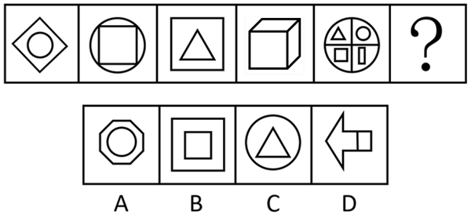

- **A**. A
- **B**. B　✅
- **C**. C
- **D**. D

**答案**：B

**官方解析**

元素组成相似，且某些元素不止一次出现在各图形中，优先考虑样式规律中的遍历。比较相邻图形发现，题干已知图形都包含正方形元素，故问号处图形也应满足此规律，只有B项符合。
故正确答案为B。

---

## 第 12 题　qid 2742183 · 图形推理

从所给的四个选项中，选择最合适的一个填入问号处，使之呈现一定的规律性：

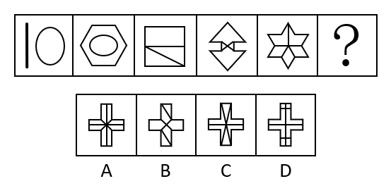

- **A**. A
- **B**. B
- **C**. C　✅
- **D**. D

**答案**：C

**官方解析**

元素组成不同，且无明显属性规律，优先考虑数量规律。观察发现，题干图形空白区域明显，考虑数面。题干图形面数量依次为：1、2、3、4、5，？，故“？”处应该选择有6个面的图形，A项和D项均为8个面，排除。再次观察发现，题干均含有两种不一样的图形（图一为圆和直线，图二为圆和六边形，图三为三角形和四边形，图四为三角形和六边形，图五为菱形和五边形），B项有三种图形，C项有两种图形，C项符合规律，当选。
故正确答案为C。

---

## 第 13 题　qid 2742191 · 图形推理

从所给的四个选项中，选择最合适的一个填入问号处，使之呈现一定的规律性：

- **A**. A
- **B**. B　✅
- **C**. C
- **D**. D

**答案**：B

**官方解析**

元素组成不同，且无明显属性规律，考虑数量规律。观察发现，图形线条交叉明显，考虑交点数。题干图形的交点数分别为：2、3、4、5、6，所以？处图形的交点数应为7个，只有B项符合规律。
故正确答案为B。

---

## 第 14 题　qid 2742148 · 图形推理

从所给的四个选项中，选择最合适的一个填入问号处，使之呈现一定的规律性：

- **A**. A
- **B**. B
- **C**. C
- **D**. D　✅

**答案**：D

**官方解析**

观察发现，题干图形均由小三角构成，优先考虑元素的种类和个数。题干已知图形均由4个尖角朝上的正三角形（）构成，故问号处应选择一个由4个尖角朝上的正三角形构成的图形，只有D项符合。

故正确答案为D。

---

## 第 15 题　qid 2742162 · 图形推理

从所给的四个选项中，选择最合适的一个填入问号处，使之呈现一定的规律性：

- **A**. A
- **B**. B
- **C**. C
- **D**. D　✅

**答案**：D

**官方解析**

元素组成不同，且无明显属性规律，优先考虑数量规律。观察发现，图2、图3为“日”字变形图，考虑笔画数。题干图形均为一笔画图形，故？处图形也应为一笔画图形，只有D项满足规律。
故正确答案为D。

---

## 第 16 题　qid 2742142 · 图形推理

从所给的四个选项中，选择最合适的一个填入问号处，使之呈现一定的规律性：

- **A**. A
- **B**. B
- **C**. C　✅
- **D**. D

**答案**：C

**官方解析**

题干图形均为同一个六面体，展开图如下图所示：

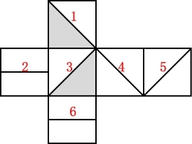

九宫格优先横向观察，第一行图1整体沿水平方向顺时针旋转得到图2，图2整体沿水平方向顺时针旋转得到图3；经验证第二行满足此规律；第三行应用此规律，“？”处图形应由第三行图2整体沿水平方向顺时针旋转所得，即顶面为斜线面，正面为灰色三角形面，排除B、D两项；比较A、C两项发现右侧面不同，但均出现了两个斜线面，根据上图可确定两斜线面分别为面4和面5，且两个面上的斜线相交于一点（第一行图1、第二行图2也同时出现面4和面5），而A项中两个斜线面上的斜线不相交，可排除。

故正确答案为C。

---

## 第 17 题　qid 2742144 · 图形推理

从所给的四个选项中，选择最合适的一个填入问号处，使之呈现一定的规律性：

- **A**. A
- **B**. B
- **C**. C　✅
- **D**. D

**答案**：C

**官方解析**

图形元素组成相似，优先考虑样式规律，且相同线条重复出现，故考虑样式规律中的加减同异。九宫格优先按行看，第一行中，图2逆时针旋转，然后与图1求异得到图3。经验证，第二行也满足此规律。第三行，应用此规律，将图2逆时针旋转，然后与图1求异，因此“？”处应选择C项。

故正确答案为C。

---

## 第 18 题　qid 2742145 · 图形推理

下面四个图形中，只有一个是由上面的四个图形拼合（只能通过上、下、左、右平移）而成的，请把它找出来。

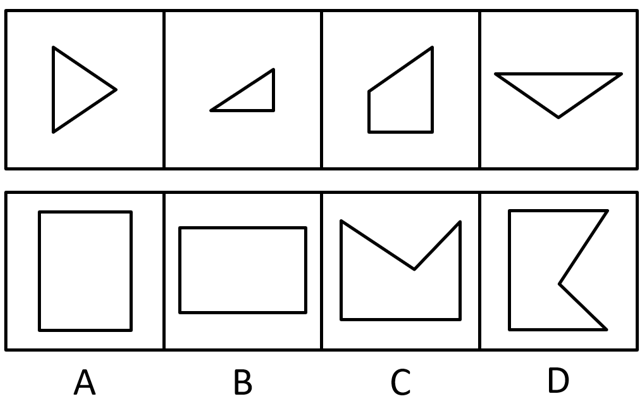

- **A**. A
- **B**. B　✅
- **C**. C
- **D**. D

**答案**：B

**官方解析**

本题考查平面拼合，可采用平行且等长相消的方式解题。

消去平行且等长的线段后进行组合即可得到轮廓图，即为B选项。

平行且等长相消的方式如下图所示：

故正确答案为B。

---

## 第 19 题　qid 2742146 · 图形推理

下面四个图形中，只有一个是由上面的四个图形拼合（只能通过上、下、左、右平移）而成的，请把它找出来。

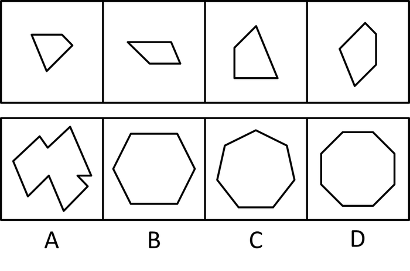

- **A**. A
- **B**. B
- **C**. C
- **D**. D　✅

**答案**：D

**官方解析**

本题考查平面拼合，可采用平行且等长相消的方式解题。

消去平行且等长的线段后进行组合即可得到轮廓图，即为D选项。

平行且等长相消的方式如下图所示：

故正确答案为D。

---

## 第 20 题　qid 2742172 · 图形推理

下边四个图形中，只有一个是由上边的四个图形拼合（只能通过上、下、左、右平移）而成的，请把它找出来。

- **A**. A
- **B**. B
- **C**. C　✅
- **D**. D

**答案**：C

**官方解析**

本题考查平面拼合，可采用平行且等长相消的方式解题。消去平行且等长的线段后进行组合即可得到轮廓图，即为C项。平行且等长相消的方式如下图所示：

故正确答案为C。

---

## 第 21 题　qid 2742175 · 图形推理

下边四个图形中，只有一个是由上边的四个图形拼合（只能通过上、下、左、右平移）而成的，请把它找出来。

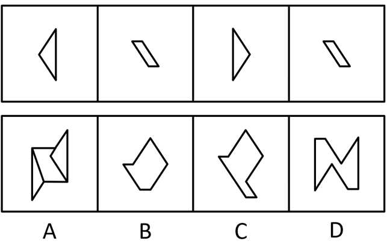

- **A**. A
- **B**. B
- **C**. C
- **D**. D　✅

**答案**：D

**官方解析**

本题考查平面拼合，可采用平行且等长相消的方式解题。消去平行且等长的线段后进行组合可得到轮廓图，即为D项。平行且等长相消的方式如下图所示：

故正确答案为D。

---

## 第 22 题　qid 2742179 · 图形推理

左边给定的是多面体的外表面，右边哪一项能由它折叠而成？请把它找出来。

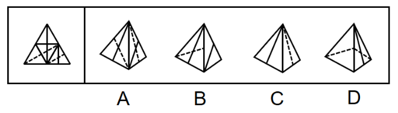

- **A**. A
- **B**. B　✅
- **C**. C
- **D**. D

**答案**：B

**官方解析**

将原展开图标上序号如下图，逐一进行分析。

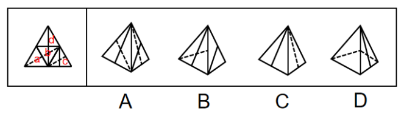

A项：该项由面b和面c构成，题干中面b和面c都以虚线顶点为起点，在面中顺时针画边，无论是哪个面第一条边都是面b和面c的公共边。而选项中以此顶点为起点顺时针画边，无论哪个面第一条边都不是面b和面c的公共边，选项与题干不一致，排除；

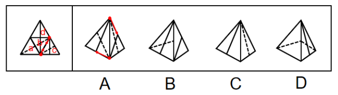

B项：该项由面c和面d构成，选项与题干一致，当选；

C项：该项由面a和面d构成，题干中面d以实线顶点为起点，在面中顺时针画边，第一条边挨着面c。而选项以此顶点为起点顺时针画边，第一条边挨着a面，选项与题干不一致，排除；

D项：题干中面a以虚线顶点为起点，在面中顺时针画边，第二条边先经过面b中的虚线再经过实线顶点，而选项以此顶点为起点顺时针画边，第二条边先经过面b中的实线顶点再经过虚线，选项与题干不一致，排除。

故正确答案为B。

---

## 第 23 题　qid 2742064 · 图形推理

左边给定的是多面体的外表面，右边哪一项能由它折叠而成？请把它找出来。

- **A**. A
- **B**. B　✅
- **C**. C
- **D**. D

**答案**：B

**官方解析**

本题考查六面体。将展开图中上下两个面移动，并给每个面标号，如下图所示：

逐一分析选项。

A项：选项中必然存在面c，展开图中面c与面e为相对面，无法同时出现，故选项上侧面为面f，展开图中面c与面f的公共边——边1为面c上白色三角形的直角边，而选项中两个面的公共边为面c上竖线三角形的直角边，选项与展开图不一致，排除；

B项：选项由面a、面c与面d构成，与展开图一致，当选；

C项：选项由面a、面c与面d构成，展开图中面c与面a、面d的公共边——边2与边3均为面c上竖线三角形的直角边，而选项中有一条公共边为面c上白色三角形的直角边，选项与展开图不一致，排除；

D项：选项中必然存在面c，展开图中面c与面e为相对面，无法同时出现，故选项正面为面f，展开图中面c与面f的公共边——边1为面c上白色三角形的直角边，而选项中两个面的公共边均为面c上竖线三角形的直角边，选项与展开图不一致，排除。

故正确答案为B。

---

## 第 24 题　qid 2742184 · 图形推理

左边给定的是多面体的外表面，右边哪一项能由它折叠而成？请把它找出来。

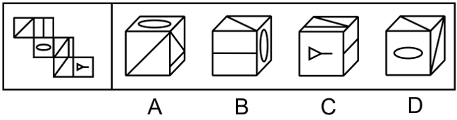

- **A**. A
- **B**. B
- **C**. C　✅
- **D**. D

**答案**：C

**官方解析**

将原展开图标上序号如下图，逐一进行分析。

A项：选项三个面为面a，面c和面d，面a和面d为相对面，相对面不能同时出现，选项与题干不一致，排除；

B项：选项三个面为面a，面b和面c，在题干展开图中，三个面的公共点在a面没有引出线条，在选项中，三个面公共点在a面引出了线条，选项与题干不一致，排除；

C项：选项与题干一致，当选；

D项：选项上面和右侧面均为面a，题干面a只出现一次，选项与题干不一致，排除。

故正确答案为C。

---

## 第 25 题　qid 2742190 · 图形推理

左边为给定的立体图，从任意角度剖开，右边哪一项可能是它的截面图？

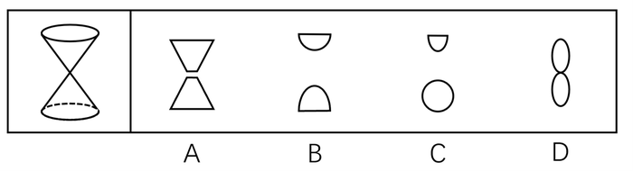

- **A**. A
- **B**. B　✅
- **C**. C
- **D**. D

**答案**：B

**官方解析**

本题考查截面图，逐一分析选项。

A项：垂直于上下底面偏离圆锥顶点不能切出两个梯形，切出的应该是双曲线加两条平行线的图形，选项与题干不一致，排除；

B项：如下图所示，B项可截出，选项与题干一致，当选；

C项：要想切出上面的形状，刀片应该斜切，要想切出下面的形状，应该平行于上下底面切，不同角度切出来的面不能存在于同一平面，选项与题干不一致，排除；

D项：要想切出相切的两个椭圆，必然要经过两个圆锥顶点，但是经过顶点斜切不能切出椭圆，选项与题干不一致，排除。

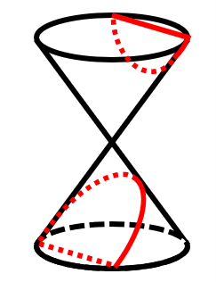

故正确答案为B。

---

## 第 26 题　qid 2742111 · 逻辑判断

任何企业存在于社会之中，都是社会的企业。社会是企业家施展才华的舞台。只有真诚回报社会、切实履行社会责任的企业家，才能真正得到社会认可，才是符合时代要求的企业家。
根据以上陈述，可以得出以下哪项？

- **A**. 企业家如果符合时代要求，就会真正得到社会认可
- **B**. 企业家如果施展才华，企业就会长期存在于社会之中
- **C**. 企业家如果真诚回报社会，就是符合时代要求的企业家
- **D**. 企业家如果没有切实履行社会责任，就不会真正得到社会认可　✅

**答案**：D

**官方解析**

第一步：翻译题干。

①企业存在于社会之中社会的企业；

②社会认可真诚回报社会且切实履行社会责任的企业家；

③符合时代要求真诚回报社会且切实履行社会责任的企业家。

第二步：逐一分析选项。

A项：翻译为符合时代要求社会认可，符合时代要求和社会认可互相推不出，无法推出，排除；

B项：翻译为施展才华企业存在于社会之中，施展才华和存在于社会之中互相推不出，无法推出，排除；

C项：翻译为真诚回报社会符合时代要求，是对③箭头后且关系其中一项的肯定，得不到确定性的结论，无法推出，排除；

D项：翻译为履行社会责任社会认可，是对②箭头后且关系的否定，否后必否前，可以推出，当选。

故正确答案为D。

---

## 第 27 题　qid 2742069 · 类比推理

古人云：立善法于天下，则天下治；立善法于一国，则一国治。
以下哪项与上述古人说法的形式结构最为相似？

- **A**. 民生在勤，勤则不匮
- **B**. 穷则独善其身，达则兼济天下　✅
- **C**. 明者因时而变，知者随事而制
- **D**. 俭则约，约则百善俱兴；侈则肆，肆则百恶俱纵

**答案**：B

**官方解析**

第一步：分析题干的形式结构。

题干的含义为：在天下设立好法制，天下就会太平；在一国制定好法制，一国就会太平。其形式结构为12，34。

第二步：逐一分析选项。

A项：该项的含义为：民众的生计、生活在于勤劳，勤劳就不会出现物资匮乏。其形式结构为12，与题干形式结构不同，排除；

B项：该项的含义为：如果自己不得志，那么就要管好自己的道德修养，如果自己得志，那么就要努力让天下人都能得到好处。其结构形式为12，34，与题干形式结构相似，当选；

C项：该项的含义为：聪明的人会根据时期的不同而改变自己的策略和方法，有大智慧的人会根据事物发展方向的不同而制定相应的管理方法。其中不包含推理关系，与题干形式结构不同，排除；

D项：该项的含义为：节俭就会有节制，有节制则百善都会兴起；奢侈就会放肆，放肆则百恶都会爆发。其结构形式为12，23，45，56，与题干形式结构不同，排除。

故正确答案为B。

---

## 第 28 题　qid 2742112 · 逻辑判断

近日，某些城市上线了“随手拍交通违法”小程序，市民可以将自己拍摄的机动车闯红灯、违停等各类违法行为的照片或者视频，通过该小程序实名上传并进行举报。对于所举报的交通违法行为一经核实，相关部门会给予举报人奖励。有专家由此断定，“随手拍交通违法”可以有效扩大交通监督的范围，形成警民共治的局面。
以下哪项如果为真，最能支持上述专家的断定？

- **A**. 交警部门的执法力量相对有限，不足以应对现实生活中大量交通违法的行为
- **B**. 国家有关法律明令禁止闯红灯，违停等交通违法行为，并有相应的处罚规定
- **C**. 有些地方出现过举报人信息被泄露的案例，保护举报者个人隐私已刻不容缓
- **D**. “随手拍交通违法”小程序上线以来，有关部门已接到大量交通违法行为举报　✅

**答案**：D

**官方解析**

第一步：找出论点和论据。
论点：“随手拍交通违法”可以有效扩大交通监督的范围，形成警民共治的局面。
论据：对于所举报的交通违法行为一经核实，相关部门会给予举报人奖励。
本题论据和论点都在讨论“随手拍可以使警民共治”，论据和论点话题一致，可以考虑补充论据证明“随手拍交通违法”这个方式确实可以有效扩大交通监督的范围，形成警民共治的局面。
第二步：逐一分析选项。
A项：论点说的是“随手拍交通违法”这个方式是否可以达到有效扩大交通监督的范围，形成警民共治的局面这个效果，该项说的是交警部门的执法力量，话题不一致，无法加强，排除；
B项：论点说的是“随手拍交通违法”这个方式是否可以达到有效扩大交通监督的范围，形成警民共治的局面这个效果，该项说的是国家法律的规定，话题不一致，无法加强，排除；
C项：该项在说随手拍这个方式可能有一些负面影响，但是题干论点讨论的是随手拍这个方式能不能达到效果，和是否有负面影响没有关系，话题不一致，无法加强，排除；
D项：通过举例子说明“随手拍交通违法”小程序上线以来，对交通违法行为确实有举报作用，也就是说可以扩大交通监督的范围，形成警民共治的局面，补充论据，当选。
故正确答案为D。

---

## 第 29 题　qid 2742113 · 类比推理

某大学张、刘、李、赵4位互不熟悉的选手参加全校演讲比赛。他们来自数学、逻辑、文学和历史专业。赛前4人分别作出了如下猜测：
张：赵的专业是逻辑；
刘：李的专业是文学；
李：张的专业不是数学；
赵：刘的专业是历史。
事后得知，只有数学、逻辑专业选手的猜测是正确的。
根据上述信息可以推断，张、刘、李、赵4人各自的专业分别是：

- **A**. 数学、逻辑、文学、历史
- **B**. 数学、历史、文学、逻辑
- **C**. 文学、历史、逻辑、数学　✅
- **D**. 历史、文学、逻辑、数学

**答案**：C

**官方解析**

第一步：分析题干。

（1）张：赵逻辑；

（2）刘：李文学；

（3）李：张数学；

（4）赵：刘历史；

（5）数学和逻辑说的正确，文学和历史说的错误。

第二步：根据题干条件分析选项。

选项信息充分，可以考虑代入法。

代入A项：张（数学）说的是真话，即赵的专业是逻辑，与选项矛盾，排除；

代入B项：张（数学）说的是真话，赵（逻辑）说的也为真话，刘（历史）说的是假话，即李不是文学专业的，与选项矛盾，排除；

代入C项：李（逻辑）说的是真话，即张不是数学专业的，赵（数学）说的是真话，即刘是历史专业的，张（文学）说的是假话，即赵不是逻辑专业的，刘（历史）说的是假话，即李不是文学专业的，均与选项一致，符合题干条件（5），当选；

代入D项：李（逻辑）说的是真话，即张不是数学专业的，赵（数学）说的是真话，即刘是历史专业的，与选项矛盾，排除。

故正确答案为C。

---

## 第 30 题　qid 2742117 · 逻辑判断

我国有关法律规定，大中型危险化学品生产企业与居民建筑物应至少保持1000米的安全红线，然而，随着城市的快速发展，很多原先地处偏远的危化品生产企业逐渐被居民区包围，一旦发生事故，会对周边居民的生命财产造成不可估量的损失。为防范危化品生产企业带给附近居民的风险，有专家建议在城市郊区设立化工园区，集中安置原本分散在城市各地的危化品生产企业，并严格遵守1000米安全红线规定。
以下哪项如果为真，最能质疑上述专家的建议？

- **A**. 危化品在销售废弃等环节无法远离居民区，这些环节也有可能发生事故
- **B**. 新建化工园区设备先进，管理严格，入驻企业的前期运营成本将大幅提高
- **C**. 化工企业集中安置容易引发连锁事故，可能威胁到数千米之外的居民安全　✅
- **D**. 许多危化品生产企业考虑到运输和销售的便利性，并不愿意搬迁到郊区来

**答案**：C

**官方解析**

第一步：找出论点和论据。
论点：在城市郊区设立化工园区，集中安置原本分散在城市各地的危化品生产企业，并严格遵守1000米安全红线规定。
论据：防范危化品生产企业带给附近居民的风险。
论点和论据都在讨论危化品生产企业和居民安全问题，论点论据话题一致，可以考虑否定论点来削弱。
第二步：逐一分析选项。
A项：该项讨论的是危化品在销售废弃等环节的危害，论点讨论的是危化品生产企业的集中安置环节，话题不一致，无法削弱，排除；
B项：该项讨论的是前期运营成本将大幅提高，论点讨论的是危化品生产企业集中安置，话题不一致，无法削弱，排除；
C项：该项说明集中安置化工企业，反而容易引发连锁事故，进而会威胁到数千米之外的居民安全，所以不能集中安置，直接否定论点，可以削弱，当选；
D项：该项讨论的是危化品生产企业考虑到运输和销售的便利性是否愿意搬迁，与论点讨论的话题不一致，无法削弱，排除。
故正确答案为C。

---

## 第 31 题　qid 2742121 · 逻辑判断

从2019年5月1日至2019年底，某机构统计的新能源车辆事故共计113起，着火事故占有一定比例。在着火事故车辆中，乘用车占比达到，专用车次之，公交车最低。这说明，在新能源车辆中，乘用车的安全性大大低于专用车和公交车。

以下哪项如果为真，最能质疑上述结论？

- **A**. 
新能源汽车中乘用车的利润最高，企业对其安全性设施的研发投入也最高

- **B**. 
新能源专用车和公交车的司机一般驾龄较长、水平较高，出车事故率较低

- **C**. 
在新能源汽车的着火事故中，乘用车的伤亡人数远远少于专用车和公交车

- **D**. 
据该机构统计，新能源专用车和公交车保有量不到新能源汽车总量的
　✅

**答案**：D

**官方解析**

第一步：找出论点和论据。

论点：在新能源车辆中，乘用车的安全性大大低于专用车和公交车。

论据：某机构统计的新能源车辆事故共计113起，着火事故占有一定比例。在着火事故车辆中，乘用车占比达到，专用车次之，公交车最低。

本题题干论点在讨论新能源车辆的安全性，论据在说新能源车辆中着火事故的车辆占比，论点论据话题不一致，优先考虑拆桥。

第二步：逐一分析选项。

A项：该项说的是新能源汽车中乘用车的利润最高，企业对其安全性设施的研发投入也最高，但是不能证明“投入高”等于“安全性高”，与题干论点话题不一致，无法削弱，排除；

B项：该项只能说明专用车和公交车事故率低是因为司机驾驶水平高，但是不明确乘用车的司机的驾驶水平，没有提及乘用车出事故率高跟安全性之间的关系，无法削弱，排除；

C项：该项说的是在新能源汽车的着火事故中，乘用车的伤亡人数远远少于专用车和公交车，“伤亡人数的多少”并不等同于“安全性的高低”，无法根据乘用车的伤亡人数判定其与专用车和公交车的安全性高低，无法削弱，排除；

D项：据该机构统计，新能源专用车和公交车保有量不到新能源汽车总量的10%说明了乘用车占90%，证明不能用论据中69.6%推出乘用车的安全性低于专用车和公交车，切断了论据和论点的联系，当选。

故正确答案为D。

---

## 第 32 题　qid 2741981 · 逻辑判断

近日，某社区为活跃社区文化气氛，开展了一场别开生面的社区文化活动，有若干兴趣社团供居民选择。已知报名情况如下：
（1）居民在诗词社和书法社中至少参加了一个；
（2）居民如果参加了诗词社，则没有参加合唱团；
（3）李女士参加了合唱团。
社区主任知道上述情况后断定，李女士也参加了戏迷社。
以下哪项如果为真，可以成为社区主任断定所需的前提？

- **A**. 李女士没有参加诗词社
- **B**. 参加了戏迷社的也参加了书法社
- **C**. 李女士没有参加书法社
- **D**. 不参加戏迷社的都不参加书法社　✅

**答案**：D

**官方解析**

第一步：找出论点和论据。

论点：李女士也参加了戏迷社。

论据：

（1）居民在诗词社和书法社中至少参加了一个；

（2）居民如果参加了诗词社，则没有参加合唱团。出现逻辑关联词，可以翻译为：参加诗词社没有参加合唱团；

（3）李女士参加了合唱团。

论据（3）“李女士参加了合唱团”是对论据（2）“参加诗词社没有参加合唱团”的否后，根据“否后必否前”原则，可以得到李女士没有参加诗词社；结合论据（1）“居民在诗词社和书法社中至少参加了一个”可知，李女士参加了书法社。

本题需要找出论点成立的前提，可优先考虑搭桥的加强方式进行加强，即建立“李女士参加了合唱团”与“李女士参加戏迷社”、“李女士没有参加诗词社”与“李女士参加戏迷社”、“李女士参加了书法社”与“李女士参加戏迷社”的联系。

第二步：逐一分析选项。

A项：“李女士没有参加诗词社”，结合论据“居民在诗词社和书法社中至少参加了一个”可知，李女士参加了书法社，无法建立与“李女士参加戏迷社”的联系，不是论点成立的前提，排除；

B项：“参加了戏迷社的也参加了书法社”可以翻译为：参加戏迷社参加书法社，根据题干论据得到“李女士参加了书法社”是对该推出关系的肯后，肯后得不到必然结论，不是论点成立的前提，排除；

C项：“李女士没有参加书法社”，与题干论据“李女士参加了书法社”矛盾，削弱论据，不是论点成立的前提，排除；

D项：“不参加戏迷社的都不参加书法社”可以翻译为：不参加戏迷社不参加书法社，根据题干论据得到“李女士参加了书法社”是对该推出关系的否后，根据“否后必否前”原则，可以得到李女士参加了戏迷社，建立了“李女士参加书法社”与“李女士参加戏迷社”之间的联系，是论点成立的前提，当选。

故正确答案为D。

---

## 第 33 题　qid 2741976 · 逻辑判断

2020年疫情肆虐，但电商直播逆势崛起，一季度全国电商直播超过400万场，“万物可播、全民可播”成为一个响亮的口号。一项针对消费者和商家的调查显示，在电商直播中，许多消费者能以优惠的价格购买到心仪的商品，商家也能提升其销售额。有专家据此推断，电商直播的商业模式在疫情过后仍会受到商家和消费者的追捧。
以下各项如果为真，则除哪项外均能削弱上述专家的观点？

- **A**. 低价促销已经成为当前直播带货的常态，这种价格竞争让商家无利润可赚
- **B**. 直播带货往往造成线上线下的价格不一致，不利于商家维护企业品牌形象
- **C**. 许多消费者购买直播销售的商品后遇到了以次充好、售后维权困难等情况
- **D**. 个别带货主播为了利益常常夸大自己的销售数据，而消费者对此并不知情　✅

**答案**：D

**官方解析**

第一步：找出论点和论据。
论点：电商直播的商业模式在疫情过后仍会受到商家和消费者的追捧。
论据：在电商直播中，许多消费者能以优惠的价格购买到心仪的商品，商家也能提升其销售额。
第二步：逐一分析选项。
A项：该项讨论的是商品低价促销让商家无利润可赚，说明对于消费者来说是利好的，但是商家赚不到钱，对于商家来说是不利的，所以电商直播不能受到商家的追捧，可以削弱，排除；
B项：该项讨论的是商品线上线下的价格不一致，不利于商家维护企业品牌形象，说明直播带货不会受到商家的追捧，可以削弱，排除；
C项：该项讨论的是消费者通过直播购买商品后发现商品质量有问题和售后维权困难，说明直播带货有弊端，所以不会受到消费者的追捧，可以削弱，排除；
D项：该项讨论的是主播夸大销售数据，而消费者对此并不知情，但是题干论点讨论的是电商直播这种商业模式是否会被商家和消费者追捧，与论点讨论的话题无关，为无关选项，无法削弱，当选。
本题为选非题，故正确答案为D。

---

## 第 34 题　qid 2742138 · 逻辑判断

某村青年甲、乙、丙、丁、戊5人到某房屋维修公司应聘。根据各自专长，他们5人被聘为焊工、瓦工、电工、木工和水工。已知他们每人只做一个工种，每个工种均有他们5人中的1人做，另外还知道：
（1）如果甲做焊工，则丙做木工；
（2）如果乙和丁两人之一做水工，则甲做焊工；
（3）丙或做瓦工，或做电工。
如果戊做瓦工，则可以得出以下哪项？

- **A**. 甲做水工　✅
- **B**. 甲做木工
- **C**. 乙做木工
- **D**. 乙做焊工

**答案**：A

**官方解析**

分析题干信息。

（1）甲焊工丙木工；

（2）乙水工甲焊工，丁水工甲焊工；

（3）丙瓦工或丙电工。

从确定信息入手，题干给出新的条件，“如果戊做瓦工” 。结合条件（3），根据或关系的否一推一，可知丙做电工；结合条件（1），否后必否前，可知甲不做焊工；结合条件（2），否后必否前，可知甲焊工乙水工，甲焊工丁水工；即乙水工且丁水工。

结合已推出信息，乙、丁不做水工，戊做瓦工，丙做电工，则甲一定做水工。

故正确答案为A。

---

## 第 35 题　qid 2742139 · 逻辑判断

某村青年甲、乙、丙、丁、戊5人到某房屋维修公司应聘。根据各自专长，他们5人被聘为焊工、瓦工、电工、木工和水工。已知他们每人只做一个工种，每个工种均有他们5人中的1人做，另外还知道：
（1）如果甲做焊工，则丙做木工；
（2）如果乙和丁两人之一做水工，则甲做焊工；
（3）丙或做瓦工，或做电工。
如果丁做电工，则可以得出以下哪项？

- **A**. 甲或做焊工，或做水工
- **B**. 乙或做焊工，或做木工　✅
- **C**. 丙或做木工，或做焊工
- **D**. 戊或做水工，或做焊工

**答案**：B

**官方解析**

分析题干信息。

（1）甲焊工丙木工；

（2）乙水工甲焊工，丁水工甲焊工；

（3）丙瓦工或丙电工。

由确定信息入手，题干给出新的条件，“如果丁做电工”。

结合条件（3），根据或关系否一推一，可知丙电工丙瓦工，排除C项；

结合条件（1），否后必否前，可知丙木工甲焊工；

结合条件（2），否后必否前，可知甲焊工乙水工，甲焊工丁水工，即乙水工且丁水工。

结合丁做电工，丙做瓦工，乙不做水工，可得乙做焊工或木工，戊可能做焊工，木工，水工其中之一。

故正确答案为B。

---

## 第 36 题　qid 2741982 · 定义判断

城市文化客厅：指城市利用商圈、地铁、机场等处的小型公共空间举办艺术、历史、民俗等方面的常态性文化休闲活动，让市民和八方来客共享的场所。
下列不属于城市文化客厅的是：

- **A**. 某市中心步行街最近举行了十周年庆典活动，亲子类节目浸入式戏剧展演以及深受学生喜爱的二次元展、电竞展，吸引了很多年轻一族前来“打卡”　✅
- **B**. 某市图书馆附近的广场上，陈列了多组以昆曲、扬剧、锡剧、淮剧为主题的形态各异的雕塑，每到周末前来观赏的市民络绎不绝
- **C**. 某市中心地下过街通道的墙壁上最近换上了记录近百年来城市发展变化的老照片，它与周边的会展中心、大剧院、科技馆等新建筑群形成强烈对比
- **D**. 某机场近年来在候机大厅举办多场小型非遗作品展，四面八方的旅客在候机之余感受、体验到了中华传统文化的魅力

**答案**：A

**官方解析**

第一步：找出定义关键词。
“城市利用商圈、地铁、机场等处的小型公共空间”、“艺术、历史、民俗等方面的常态性文化休闲活动”。
第二步：逐一分析选项。
A项：步行街的十周年庆典活动，不符合“常态性文化休闲活动”，不符合定义，当选；
B项：图书馆附近的广场，符合“城市的小型公共空间”，陈列形态各异的雕塑，符合“艺术、历史、民俗等方面的常态性文化休闲活动”，符合定义，排除；
C项：市中心地下过街通道的墙壁，符合“城市的小型公共空间”，换上记录近百年来城市发展变化的老照片，符合“艺术、历史、民俗等方面的常态性文化休闲活动”，符合定义，排除；
D项：机场候机大厅，符合“城市的小型公共空间”，近年来举办多场小型非遗作品展，符合“艺术、历史、民俗等方面的常态性文化休闲活动”，符合定义，排除。
本题为选非题，故正确答案为A。

---

## 第 37 题　qid 2742140 · 定义判断

词义泛化：指某个词语本来专指某种特定的事物或现象，后来可以泛指相关的多个事物或现象。
下列属于词义泛化的是：

- **A**. 古代的称谓词语“父”，现在一般用“父亲”表示
- **B**. “河”在古代专指“黄河”，现在也可以指其他河流　✅
- **C**. “恨”在古代既可以表示痛恨，也可以表示遗憾，现在通常表示痛恨
- **D**. 汉代以前的“涕”，本来专指眼泪，后来一般指鼻涕，有时也可以指泪水

**答案**：B

**官方解析**

第一步：找出定义关键词。
“某个词语本来专指某种特定的事物或现象”，“后来可以泛指相关的多个事物或现象”。
第二步：逐一分析选项。
A项：古代和现在对于词语“父”的解读都是指父亲，不符合“后来可以泛指相关的多个事物或现象”，不符合定义，排除；
B项：“河”在古代专指“黄河”，符合“某个词语本来专指种特定的事物或现象”，现在“河”也可以指其他河流，符合“后来可以泛指相关的多个事物或现象”，符合定义，当选；
C项：“恨”在古代既可以表示痛恨，也可以表示遗憾，不符合“某个词语专指某种特定的事物或现象”，不符合定义，排除；
D项：“涕”后来指鼻涕，也可以指泪水，鼻涕和泪水是两类不同的事物，二者没有相关性，不符合“后来可以泛指相关的多个事物或现象”，不符合定义，排除。
故正确答案为B。

---

## 第 38 题　qid 2741983 · 定义判断

逆向文化冲击：指旅居他乡者回到故国或故乡后，短时间内在生活、心理等方面难以适应本土文化的现象。
下列不属于逆向文化冲击的是：

- **A**. 
大卫在中国从事英语培训工作10多年，回国后感到很不习惯。他在不久前的一段视频中抱怨说：半夜饿了，在中国拿出手机点个外卖，半个小时就送到了，而这里啥都没有，只能饿死在去超市的路上

- **B**. 
在城里生活多年的老杨，今年春节回到农村老家后，亲戚朋友请他到附近饭店吃饭。开席后，他习惯性地让服务员去拿公筷、公勺，服务员惊讶地看着他，半天没反应过来，亲戚们也觉得他怪怪的

- **C**. 
留学刚回国的小吴约朋友去青岛看海，因为没有12306账户，只得请朋友帮忙购票。上车后他惊讶地发现，高铁上不仅可以扫码点餐，还可以点外卖，自己头天准备的面包、饼干一点没用上。他感觉自己在朋友心目中简直就像个弱智

- **D**. 
欧洲姑娘玛丽来华留学，虽然早已听说过中国的无现金支付，第一周她还是惊呆了：楼下卖红薯的大爷都在用“互联网”，菜市场的每个摊位上居然都有收款二维码，更不要说超市和商场了
　✅

**答案**：D

**官方解析**

第一步：找出定义关键词。
“旅居他乡者回到故国或故乡后”、“短时间内在生活、心理等方面难以适应本土文化”。
第二步：逐一分析选项。
A项：大卫在中国从事英语培训，回国之后不习惯，符合“旅居他乡者回到故国后”，也符合“短时间内在生活、心理等方面难以适应本土文化”，符合定义，排除；
B项：老杨在城市生活多年，春节回老家，符合“旅居他乡者回到故乡后”，习惯性地让服务员去拿公筷、公勺，而服务员半天没反应过来，符合“短时间内在生活、心理等方面难以适应本土文化”，符合定义，排除；
C项：留学回国的小吴符合“旅居他乡者回到故国后”，不知道高铁上可以扫码点餐而准备了食物，符合“短时间内在生活、心理等方面难以适应本土文化”，符合定义，排除；
D项：欧洲姑娘玛丽来华留学，不适应中国的无现金支付，不符合“回到故国或故乡后”，不符合定义，当选。
本题为选非题，故正确答案为D。

---

## 第 39 题　qid 2742002 · 定义判断

能力陷阱：人们总是喜欢做比较擅长的、能够带来自信心和满足感的事情，由此而造成某种单一能力强化和其他能力弱化，难以适应社会变化对能力的新要求。
下列属于能力陷阱的是：

- **A**. 小李博士毕业后在一所大学任教，不到五年就评上了副教授。近两年来，他的工作越来越忙，成果越来越多，一直没时间考虑成家的事
- **B**. 老张修了多年自行车，小日子过得有滋有味。这两年，来修自行车的人越来越少，收入大不如前，他几次尝试学习摩托车修理都没学会，现在只能给电动车补胎　✅
- **C**. 林先生整天忙着扩大经营规模，连锁店越开越多，效益越来越好，但他对日常生活琐事既不擅长也不关心，购物、做饭、打扫卫生等家务均由妻子承担
- **D**. 王师傅擅长淮扬菜，在江苏小有名气，到四川后很快就发现没有用武之地了，于是他花了半年时间，终于学会了川菜的做法，虽然不够正宗，他自己却很满意

**答案**：B

**官方解析**

第一步：找出定义关键词。
“喜欢做比较擅长的、能够带来自信心和满足感的事情”、“造成某种单一能力强化和其他能力弱化，难以适应社会变化对能力的新要求”。
第二步：逐一分析选项。
A项：小李工作越来越忙，成果越来越多，一直没时间考虑成家的事，不符合“造成某种单一能力强化和其他能力弱化，难以适应社会变化对能力的新要求”，不符合定义，排除；
B项：老张修了多年自行车，小日子过得有滋有味，符合“喜欢做比较擅长的、能够带来自信心和满足感的事情”，几次尝试学习摩托车修理都没学会，现在只能给电动车补胎，符合“造成某种单一能力强化和其他能力弱化，难以适应社会变化对能力的新要求”，符合定义，当选；
C项：林先生对日常生活琐事既不擅长也不关心，家务均由妻子承担，不符合“造成某种单一能力强化和其他能力弱化，难以适应社会变化对能力的新要求”，不符合定义，排除；
D项：王师傅擅长淮扬菜，到四川后学着做川菜，是做不擅长的事，不符合“喜欢做比较擅长的、能够带来自信心和满足感的事情”，不符合定义，排除。
故正确答案为B。

---

## 第 40 题　qid 2741988 · 定义判断

双塔效应：指两个实力雄厚的相邻经济体强强联合，利用各自的集聚辐射能力，共同带动周围区域发展的现象。
下列属于双塔效应的是：

- **A**. 某市围绕“精准定位消费人群、打造特色商业体”的要求，以市区著名商圈为轴心，推动商业布局错位竞争，建成了商务、文化、居住等不同功能区
- **B**. 某区域两个特大城市利用优越的区位条件，按照“发挥优势、取长补短、互惠互利”的原则，经过多年努力，在科技、文化、工业等方面形成了国内领先的优势　✅
- **C**. 某市为了加快经济发展，将经济基础雄厚、发展空间有限的核心区与基础薄弱但发展潜力巨大的城郊区进行了区域整合，城市综合实力很快有了显著提升
- **D**. 某市国家级创新产业园成立之初，重点培育信息和医药两大产业，吸引多家世界500强企业入驻，进一步促进了本市产业转型升级，提升了城市的整体竞争力

**答案**：B

**官方解析**

第一步：找出定义关键词。
“两个实力雄厚的相邻经济体强强联合”、“各自的集聚辐射能力”、“共同带动周围区域发展”。
第二步：逐一分析选项。
A项：某市围绕要求，以商圈为轴心推动商业竞争，不符合“两个实力雄厚的相邻经济体强强联合”，不符合定义，排除；
B项：某区域两个特大城市，符合“两个实力雄厚的相邻经济体强强联合”，发挥优势、取长补短、互惠互利，符合“各自的集聚辐射能力”，在科技、文化、工业等方面形成了国内领先的优势，符合“共同带动周围区域发展”，符合定义，当选；
C项：经济基础雄厚、发展空间有限的核心区与基础薄弱但发展潜力巨大的城郊区整合，不符合“两个实力雄厚的相邻经济体强强联合”，不符合定义，排除；
D项：在成立之初重点培育信息和医药两大产业，并非两个实力雄厚的经济体，不符合“两个实力雄厚的相邻经济体强强联合”，不符合定义，排除。
故正确答案为B。

---

## 第 41 题　qid 2742024 · 定义判断

共享用工：指企业在特殊时期，为了降低人力成本或解决人工短缺问题，通过借用或外派员工实现劳动力共享的临时用工方式。
下列属于共享用工的是：

- **A**. 为节省成本支出，某广告公司长期通过创客网站发包设计任务，并与一些水平较高的自由创客人员签订了合作协议，建立了密切的业务关系
- **B**. 某公司正在扩大生产经营规模，急需大量技术人员，通过线上线下相结合的形式，招聘一批兼职技术人员，既解决了无人可用的燃眉之急，又节约了用人成本
- **C**. 疫情期间，某生鲜电商平台订单激增，该平台与当地的餐饮、酒店等行业的数十家公司进行协商合作，利用他们派来的员工，缓解了自身的用工压力　✅
- **D**. 某高校在科研项目攻关过程中遇到研发人员不足的问题，于是借用多家单位的科研人员组成联合攻关团队，终于成功解决了一系列技术难题

**答案**：C

**官方解析**

第一步：找到定义关键词。
“企业在特殊时期”、“降低人力成本或解决人工短缺”、“借用或外派员工实现劳动力共享”、“临时用工方式”。
第二步：逐一分析选项。
A项：广告公司长期通过网站发包任务，不符合“特殊时期”、“临时用工方式”，不符合定义，排除；
B项：某公司在扩大生产经营规模期间招聘一批兼职技术人员，不符合“借用或外派员工实现劳动力共享”、“临时用工方式”，不符合定义，排除；
C项：疫情期间符合“企业在特殊时期”，平台订单激增符合“降低人力成本或解决人工短缺”，电商平台利用餐饮、酒店的员工，符合“借用或外派员工实现劳动力共享”、“临时用工方式”，符合定义，当选；
D项：某高校不符合题干主体“企业”，不符合定义，排除。
故正确答案为C。

---

## 第 42 题　qid 2741996 · 定义判断

百姓讲师：指基层单位选用普通群众，用喜闻乐见的形式宣传党和政府的方针政策。
下列属于百姓讲师的是：

- **A**. 镇政府经常邀请熟悉乡情乡风的村民为新入职的干部介绍农村基本情况，讲解在农村落实上级政策的办法
- **B**. 村支书记老陈每天准时收看《新闻联播》，通过和村民聊天宣传党和国家的方针政策，并解答他们的疑问
- **C**. 朱老师退休后长期走街串巷，宣传移风易俗、乡村振兴的道理，被乡政府授予“乡村文化名人”称号
- **D**. 市民蒋先生受街道办委托把新医保政策编成快板，并录成视频，每天都发布在微信公众号及朋友圈中　✅

**答案**：D

**官方解析**

第一步：找出定义关键词。
“基层单位选用普通群众”、“用喜闻乐见的形式宣传党和政府的方针政策”。
第二步：逐一分析选项。
A项：镇政府是基层单位，邀请熟悉乡情乡风的村民为新入职的干部介绍农村基本情况，讲解在农村落实上级政策的办法，但是不知道具体形式是什么，不符合“用喜闻乐见的形式宣传党和政府的方针政策”，不符合定义，排除；
B项：村支书记老陈宣传党和国家的方针政策并解答疑问，村支书记不是普通群众，不符合“基层单位选用普通群众”，不符合定义，排除；
C项：朱老师退休后因为宣传移风易俗、乡村振兴的道理，而被乡政府授予“乡村文化名人”称号，朱老师并不是被乡政府选用才去做这件事，不符合“基层单位选用普通群众”，不符合定义，排除；
D项：市民蒋先生受街道办委托把新医保政策编成快板，并录成视频，每天都发布在微信公众号及朋友圈中，符合“基层单位选用普通群众”、“用喜闻乐见的形式宣传党和政府的方针政策”，符合定义，当选。
故正确答案为D。

---

## 第 43 题　qid 2742141 · 定义判断

内涵型消费升级：指个人在消费转型过程中物质消费趋于克制、精神消费趋于丰富的行为。
下列属于内涵型消费升级的是：

- **A**. 某高档写字楼的一些白领，午餐大都舍弃排场的桌餐，而选择性价比高的快餐，他们觉得这样就餐既安全、卫生，还节省了宝贵的时间
- **B**. 赵先生偏爱旅游，在到达目的地前，短途交通、中转过夜，绝不会选择豪华的舱位、车辆或酒店。到达之后，为了体验当地文化、感受地域特色，他很舍得花钱
- **C**. 小马以前喜欢追求时尚，看到中意的新潮服装就毫不犹豫地买下，常入不敷出。现在她几乎不买什么衣服了，用省下的钱与家人一起运动、娱乐　✅
- **D**. 某书城以前只销售图书，现在还为公众提供主题文化活动空间，顾客可以亲手设计文具，定制刻有自己姓名的水杯，选购与阅读主题有关的装饰小摆件

**答案**：C

**官方解析**

第一步：找出定义关键词。
“个人”、“在消费转型过程中”、“物质消费趋于克制”、“精神消费趋于丰富”。
第二步：逐一分析选项。
A项：一些白领符合“个人”，选择午餐时大都从排场的桌餐转变为性价比高的快餐，符合“在消费转型过程中”、“物质消费趋于克制”，但没有提及精神消费的变化，不符合定义，排除； 
B项：赵先生符合“个人”，在到达目的地前绝不会选择豪华的舱位、车辆或酒店，不舍得花钱，但到达之后很舍得花钱，体现的是旅游过程中的变化，不符合“在消费转型过程中”，也不符合“物质消费趋于克制”，不符合定义，排除；
C项：小马符合“个人”，以前常买新潮服装、入不敷出，但现在几乎不买衣服，符合“物质消费趋于克制”，省下钱与家人运动娱乐，也符合“在消费转型过程中”、“精神消费趋于丰富”，符合定义，当选；
D项：书城以前只销售图书，现在还为公众提供其他服务，不符合“个人”，不符合定义，排除。
故正确答案为C。

---

## 第 44 题　qid 2741992 · 定义判断

闭环思维：指工作学习过程中用各种方式的提示、应答使每个操作环节形成封闭的环，以利于实时把握进程、及时调整方向的一种思维方式。
下列不属于闭环思维的是：

- **A**. 赵教练每次收到学员发来的信息时，都会给予答复并习惯性地发送一个表情，他的手机里存了很多张风格各异的应答图片
- **B**. 钱先生每次给下属布置任务，都要求他们尽快回复信息，包括是否收到、能否完成、什么时候完成等，与他共事的人都感觉很有压力
- **C**. 小孙刚到单位时，领导安排的任务他总是很爽快地答应下来并想方设法去完成。半年后，工作越来越忙，他发现有些任务很难完成，再也不敢随意应承了
- **D**. 经理要求小李一周内草拟一个工作计划。经过认真调研，小李完成了计划书并用电子邮件发给了经理。十几天后经理特意问他：计划书写好了吗？小李惊讶地说：我早已发给你了　✅

**答案**：D

**官方解析**

第一步：找出定义关键词。
“工作学习过程中”、“各种方式的提示、应答”、“每个操作环节形成封闭的环”、“利于实时把握进程、及时调整方向”。
第二步：逐一分析选项。
A项：赵教练存了很多张图片来应答学员的消息，符合“工作学习过程中”、“各种方式的提示、应答”、“每个操作环节形成封闭的环”、“利于实时把握进程、及时调整方向”，符合定义，排除；
B项：钱先生要求下属尽快回复信息，符合“工作学习过程中”、“各种方式的提示、应答”、“每个操作环节形成封闭的环”、“利于实时把握进程、及时调整方向”，符合定义，排除；
C项：小孙刚到单位时，爽快地答应任务并完成，符合“工作学习过程中”、“各种方式的提示、应答”、“每个操作环节形成封闭的环”，在小孙发现任务很难完成后不再随意应承，符合“实时把握进程、及时调整方向”，符合定义，排除；
D项：小李已经将计划书发给了经理，但是经理十几天之后问他是否完成，不符合“每个操作环节形成封闭的环”，不符合定义，当选。
本题为选非题，故正确答案为D。

---

## 第 45 题　qid 2741986 · 定义判断

信息疫情：指事件传播过程中掺杂了影响判断和认知的不实信息，这些信息可能给人们带来消极影响，甚至危害身心健康。
下列不属于信息疫情的是：

- **A**. 某地发生多人腹泻、发烧现象，有人说大蒜可以预防，也有人说白醋可以治疗，短短几天时间，大蒜、白醋在当地超市脱销，后来这些传言都被证实是无稽之谈
- **B**. 一村民在微信群里说，他家院子里的老井最近水温突然升高，其他村民议论纷纷，有人说，三天以内肯定要发生大地震，许多村民连续一周都不敢在室内睡觉
- **C**. 王先生一直在向朋友抱怨，五年前购房时听很多人说自家小区附近很快就会开一家大型超市，地铁也会在那里设一个站点，可是到现在却没有一点动静
- **D**. 某山区连日暴雨，巡山员发现山上有小石头滚落，估计将发生山体塌方，立即通知村民撤离，半信半疑的村民刚刚全部搬出村子，滑落的山体就摧毁了村民房屋　✅

**答案**：D

**官方解析**

第一步：找出定义关键词。
“事件传播过程中”、“影响判断和认知的不实信息”、“可能给人们带来消极影响，甚至危害身心健康”。
第二步：逐一分析选项。
A项：某地发生多人腹泻、发烧现象，有人说大蒜可以预防，也有人说白醋可以治疗，符合“事件传播过程”，传言都被证实是无稽之谈，符合“影响判断和认知的不实信息”，大蒜、白醋脱销，符合“可能给人们带来消极影响，甚至危害身心健康”，符合定义，排除；
B项：一村民在微信群发布消息导致村民议论纷纷，符合“事件传播过程中”，有人说三天以内肯定要发生大地震，许多村民连续一周都不敢在室内睡觉，说明一周内没有发生地震，符合“影响判断和认知的不实信息”“可能给人们带来消极影响，甚至危害身心健康”，符合定义，排除；
C项：王先生五年前听说自家小区附近会开超市，符合“事件传播过程”，现在没动静，符合“影响判断和认知的不实信息”，王先生一直抱怨，符合“可能给人们带来消极影响，甚至危害身心健康”，符合定义，排除；
D项：村民全部搬出村子后，滑落的山体就摧毁了村民房屋，不符合“影响判断和认知的不实信息”，这些信息不符合“可能给人们带来消极影响，甚至危害身心健康”，不符合定义，当选。
本题为选非题，故正确答案为D。

---

## 第 46 题　qid 2741991 · 定义判断

U盘化生存：只凭借个人技能而不依赖组织内的身份，自主决定是否参与社会协作，完全由市场评判其个人价值的生存方式。
下列不属于U盘化生存的是：

- **A**. 小韩大学毕业后，曾在多家培训机构当过数学老师，她总是感觉这样工作收入虽然高，但是太辛苦了，前不久，她没有同家人商量，就自作主张进了一所民办中学　✅
- **B**. 网络写手周女士根据自己之前的职场经历写出了多部网络畅销小说，多家著名网站慕名向她约稿，由于不愿受交稿日期的限制，她经常会拒绝一些约稿
- **C**. 木匠老周进城打工十年多了，活儿干得很好，挣了不少钱，现在他有了自己的装修队，每天从早到晚都有人找他联系装修的事
- **D**. 从单位辞职后，刘先生夫妇来到南方，将租下的一栋小楼改造成了民宿。在他们精心打理下，生意十分红火，客房一度需要提前两个月预定

**答案**：A

**官方解析**

第一步：找出定义关键词。
“凭借个人技能”、“不依赖组织内的身份”、“自主决定是否参与社会协作”、“由市场评判其个人价值”。
第二步：逐一分析选项。
A项：小韩是数学老师，符合“凭借个人技能”，但是她没有同家人商量，就自作主张进了一所民办中学，不符合“不依赖组织内的身份”，且进入之后不能自由决定自己是否参与工作，不符合“自主决定是否参与社会协作”，不符合定义，当选；
B项：网络写手周女士，符合“凭借个人技能”，她经常会拒绝一些约稿，符合“自主决定是否参与社会协作”，符合定义，排除；
C项：木匠老周，符合“凭借个人技能”，有人找他联系装修的事，符合“自主决定是否参与社会协作”，符合定义，排除；
D项：刘先生夫妇将租下的一栋小楼改造成了民宿，符合“凭借个人技能”，从单位辞职改做民宿，符合“不依赖组织内的身份”、“自主决定是否参与社会协作”，符合定义，排除。
本题为选非题，故正确答案为A。

---

## 第 47 题　qid 2742013 · 定义判断

凡尔赛文学：指在各种公开场合用先抑后扬、明贬暗褒的手法，故作低调，实则自我炫耀的说话方式。
下列属于凡尔赛文学的是：

- **A**. 邻居家的电脑出了故障，打来电话求助。李先生告诉他：“我对电脑真是一窍不通，平时出了问题，都是秘书帮着解决的，我自己一点办法也没有”
- **B**. 刘先生经常向别人讲述：“我一点也不擅长写作，去年随手把高中时写的一篇小说投到网络平台，没想到点击量超百万，到现在我都不明白这是怎么回事”　✅
- **C**. 朋友们很羡慕郑先生良好的生活习惯，他多次解释原因：小时候家里很穷，晚上经常一碗稀粥就权当晚餐，为了不挨饿，只好早睡早起，就养成了这样的习惯
- **D**. 小张向参加聚会的高中同学说：“我家住在小山脚下，附近没有几户人家，周围很幽静，有时会有松鼠闯进后院，只是离市中心有点远，交通不太方便”

**答案**：B

**官方解析**

第一步：找出定义关键词。
“在各种公开场合用先抑后扬、明贬暗褒的手法，故作低调”、“实则自我炫耀”。
第二步：逐一分析选项。
A项：李先生拒绝邻居的求助，是因为他对电脑一窍不通，平时都是秘书帮着解决的，是对实际情况的客观描述，不符合“在各种公开场合用先抑后扬、明贬暗褒的手法，故作低调”，也不符合“实则自我炫耀”，不符合定义，排除；
B项：刘先生经常向别人讲述自己一点也不擅长写作，符合“在各种公开场合用先抑后扬、明贬暗褒的手法，故作低调”，但又提到高中时写的小说在网络平台上点击量超百万，符合“实则自我炫耀”，符合定义，当选；
C项：郑先生是在解释自己良好生活习惯的形成原因，是对实际情况的客观描述，不符合“在各种公开场合用先抑后扬、明贬暗褒的手法，故作低调”，也不符合“实则自我炫耀”，不符合定义，排除；
D项：小张在描述自己家所处地理位置的特点，是对实际情况的客观描述，不符合“在各种公开场合用先抑后扬、明贬暗褒的手法，故作低调”，也不符合“实则自我炫耀”，不符合定义，排除。
故正确答案为B。

---

## 第 48 题　qid 2741995 · 定义判断

隐性管理：指通过引导、支持或服务等行为，对员工施加非制度性影响以达到预期目标的管理方式。
下列属于隐性管理的是：

- **A**. 为了丰富员工的业余文化生活，某公司专门成立了羽毛球协会，定期举办相关活动，不久以后大多数员工的羽毛球水平都有了明显提高
- **B**. 迟到早退是困扰公司多年的老大难问题，今年初公司安装了门禁系统，经理每天带头准时打卡上班，一段时间后，几乎再也看不到员工迟到早退　✅
- **C**. 小李因家庭纠纷，工作时情绪低落，单位领导得知情况后多次与他沟通交谈，解开了他心中的疙瘩，现在小李的工作比以前更出色了
- **D**. 某企业办公楼装修完后，在楼外各个角落安装了十多个摄像头，既解决了安全问题，又解决了长期以来员工乱扔垃圾、乱停私家车的问题

**答案**：B

**官方解析**

第一步：找出定义关键词。
“引导、支持或服务等行为”、“对员工施加非制度性影响”、“以达到预期目标”、“管理方式”。
第二步：逐一分析选项。
A项：某公司成立羽毛球协会，定期举办活动，属于业余活动，与管理无关，不符合“管理方式”，不符合定义，排除；
B项：安装了门禁系统，符合“引导、支持或服务等行为”，经理每天带头准时打卡上班，符合“对员工施加非制度性影响”，看不到员工迟到早退，符合“以达到预期目标”、“管理方式”，符合定义，当选；
C项：领导和小李谈心解开小李心中的疙瘩，谈的是家庭纠纷问题，是小李的个人问题，不符合“管理方式”，不符合定义，排除；
D项：某企业在各个角落安装摄像头，不符合“引导、支持或服务等行为”，解决了长期以来员工乱扔垃圾、乱停私家车的问题，不符合“管理方式”，不符合定义，排除。
故正确答案为B。

---

## 第 49 题　qid 2742001 · 定义判断

网络社交消费：指在网络社交过程中对某商品产生即兴消费欲望，借助社交平台链接完成购买行为的一种消费方式。
下列属于网络社交消费的是：

- **A**. 小夏在微博上看到一篇介绍某品牌跑步机的文章，感觉很对自己的胃口，毫不犹豫地点赞并通过博文后面的网址购买了一台　✅
- **B**. 果蔬团购微信群中可以定时秒杀群主发布的低价产品，也可以预定自己想要的品种，既便捷又实惠，小李是这些活动的常客
- **C**. 歌手小兰上传了一个翻唱经典老歌的短视频，她在视频中戴的船形帽迅速走红，“歌手小兰爆款船形帽”成为网络热搜词，在各大购物网站上卖到断货
- **D**. 某甜品店的订餐卡上印有自己的公众号，顾客关注该公众号订购甜品比外卖平台还要便宜并且可以免费送货

**答案**：A

**官方解析**

第一步：找出定义关键词。
“在网络社交过程中对某商品产生即兴消费欲望”、“借助社交平台链接完成购买”。
第二步：逐一分析选项。
A项：小夏在微博上看到一篇介绍某品牌跑步机的文章并感觉很对自己胃口，符合“在网络社交过程中对某商品产生即兴消费欲望”，并通过博文后面的网址购买了一台，符合“借助社交平台链接完成购买”，符合定义，当选；
B项：在微信群中定时秒杀低价产品，不是突然对这种产品产生消费欲望，不符合“在网络社交过程中对某商品产生即兴消费欲望”，不符合定义，排除；
C项：小兰上传短视频，视频中的船形帽迅速走红，符合“在网络社交过程中对某商品产生即兴消费欲望”，但是在各大购物网站上卖到断货没有借助社交平台链接完成购买，不符合“借助社交平台链接完成购买”，不符合定义，排除；
D项：关注公众号订购更便宜还能免费送货，不符合“在网络社交过程中对某商品产生即兴消费欲望”，不符合定义，排除。
故正确答案为A。

---

## 第 50 题　qid 2742143 · 定义判断

舆论碰瓷：指用出格的言行举止故意挑起事端或争议，以引起舆论关注的逐利行为。
下列属于舆论碰瓷的是：

- **A**. 张教授发现一部新出的著作与自己的专著内容多有雷同，就向法院提起诉论，并接受了一些媒体的专访
- **B**. 蒋某经常对妻子实施家暴，妻子将遭遇向蒋某单位和社区领导作了反映，不料妻子故意将事情闹大，让他没脸做人
- **C**. 沉寂多年的某歌星，最近在娱乐网站不时爆出自己与多人的暧昧关系，引发了圈内外的轩然大波后，突然宣布已准备好重返歌坛　✅
- **D**. 某厂拖欠工人数月工资，工人多次讨要无果，到政府信访部门反映。有关部门准备约谈厂领导，厂长出面支付了拖欠的工资

**答案**：C

**官方解析**

第一步：找出定义关键词。
“用出格的言行举止故意挑起事端或争议”、“引起舆论关注”、“逐利行为”。
第二步：逐一分析选项。
A项：张教授发现其他著作与自己的作品雷同，向法院起诉并接受媒体采访均是正常的维权行为，不符合“用出格的言行举止故意挑起事端或争议”，不符合定义，排除； 
B项：妻子将被家暴的遭遇向丈夫单位和社区领导反映是正常的维护自身利益的行为，不符合“用出格的言行举止故意挑起事端或争议”，故意闹大只是因为丈夫家暴，也不符合“逐利行为”，不符合定义，排除；
C项：某歌星在娱乐网站不时爆出自己与多人的暧味关系，符合“用出格的言行举止故意挑起事端或争议”，引发了圈内外的轩然大波，符合“引起舆论关注”，突然宣布已准备好重返歌坛，符合“逐利行为”，符合定义，当选；
D项：工人多次讨要拖欠工资无果，到政府信访部门反映，是正常的维权行为，不符合“用出格的言行举止故意挑起事端或争议”，不符合定义，排除。
故正确答案为C。

---
