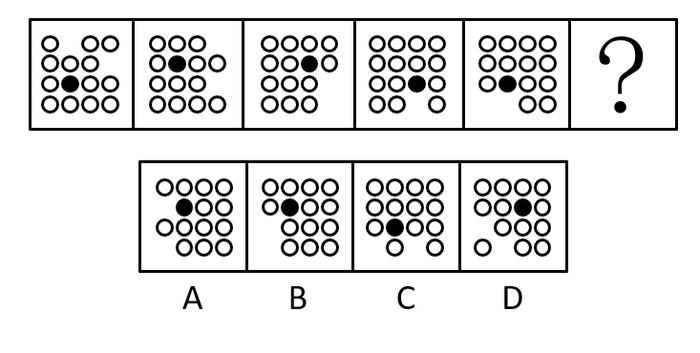
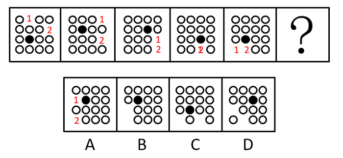
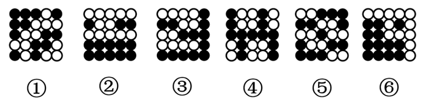
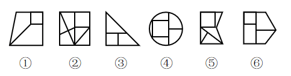
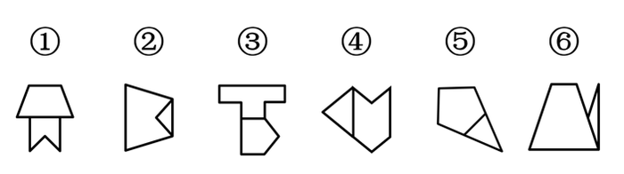
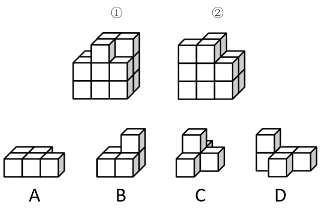
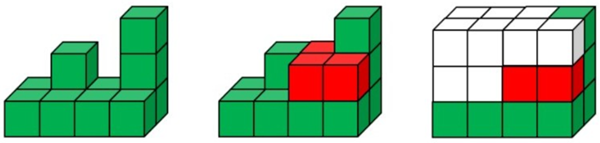

# 2021年浙江省公务员录用考试《行测》题（B类）（网友回忆版）

> 判断推理 · 35 题 · 浙江 2021

## 第 1 题　qid 2776039 · 图形推理

从所给的四个选项中，去掉哪一个后，剩下的图形序列可以呈现一定的规律性？

- **A**. A
- **B**. B　✅
- **C**. C
- **D**. D

**答案**：B

**官方解析**

图形元素组成不同，且无属性规律，考虑数量规律。观察发现，图形被分割，封闭面明显，考虑数面，题干图形和选项都是3个面，无法排除，考虑面的细化。发现题干的两幅图都是由2个三角形的面和1个四边形的面组成，观察选项，只有B项是由3个三角形的面组成，没有四边形的面，不能和题干形成规律性，故只有B项不符合规律。
本题为选非题，故正确答案为B。

---

## 第 2 题　qid 2776045 · 图形推理

从所给的四个选项中，选择最合适的一个填入问号处，使之呈现一定的规律性：

- **A**. A　✅
- **B**. B
- **C**. C
- **D**. D

**答案**：A

**官方解析**

图形元素组成相同，优先考虑位置规律。观察发现，图中小黑球沿16宫格的内圈每次顺时针移动一格，空白1沿外圈每次顺时针移动两格，空白2沿外圈每次顺时针移动一格，因此？处图形的小黑球、空白1和空白2的位置如下图所示，对应A项。

故正确答案为A。

---

## 第 3 题　qid 2776050 · 图形推理

从所给的四个选项中，选择最合适的一个填入问号处，使之呈现一定的规律性：

- **A**. A
- **B**. B
- **C**. C
- **D**. D　✅

**答案**：D

**官方解析**

图形元素组成不同，考虑数量规律。每个图形中均存在一个黑色三角形和白色区域，并且题干所有图形中白色区域面积均为黑色区域面积的3倍，如下图所示，只有D项符合。

故正确答案为D。

---

## 第 4 题　qid 2776055 · 图形推理

从所给的四个选项中，选择最合适的一个填入问号处，使之呈现一定的规律性：

- **A**. A
- **B**. B
- **C**. C
- **D**. D　✅

**答案**：D

**官方解析**

元素组成不同，优先考虑属性规律。观察发现，题干图形均为轴对称图形，且每幅图的对称轴依次呈顺时针旋转的规律，排除A、C两项。继续观察，题干每幅图形的对称轴均有穿过原图形的交点，排除B项，只有D项符合。

故正确答案为D。

---

## 第 5 题　qid 2776062 · 图形推理

从所给的四个选项中，选择最合适的一个填入问号处，使之呈现一定的规律性：

- **A**. A
- **B**. B
- **C**. C　✅
- **D**. D

**答案**：C

**官方解析**

元素组成相似，优先考虑样式规律。九宫格优先横行看，第一行中，将第二幅图覆盖到第一幅图上得到第三幅图；第二行验证满足此规律；第三行运用此规律，只有C项符合。
故正确答案为C。

---

## 第 6 题　qid 2776136 · 图形推理

把下面的六个图形分为两类，使每一类图形都有各自的共同特征或规律，分类正确的一项是：

- **A**. ①③④，②⑤⑥
- **B**. ①③⑤，②④⑥
- **C**. ①②⑥，③④⑤　✅
- **D**. ①④⑥，②③⑤

**答案**：C

**官方解析**

本题为分组分类题目，元素组成相同，但无位置规律，优先考虑属性规律。观察发现，题干图形均由黑色部分和白色部分组成，图①②⑥中白色部分均为轴对称图形，图③④⑤中白色部分均为中心对称图形，故图①②⑥为一组，图③④⑤为一组。
故正确答案为C。

---

## 第 7 题　qid 2776139 · 图形推理

把下面的六个图形分为两类，使每一类图形都有各自的共同特征或规律，分类正确的一项是：

- **A**. ①③④，②⑤⑥
- **B**. ①③⑥，②④⑤　✅
- **C**. ①②⑤，③④⑥
- **D**. ①④⑥，②③⑤

**答案**：B

**官方解析**

元素组成不同，且无明显属性规律，考虑数量规律。观察发现，题干图形“窟窿”较多，且分割区域明显，考虑数面，但数面无法选出正确答案，考虑面的细化。继续观察发现，图①③⑥中最小的面均为正方形，图②④⑤中最大的面均为正方形，故图①③⑥为一组，图②④⑤为一组。
故正确答案为B。

---

## 第 8 题　qid 2776144 · 图形推理

把下面的六个图形分为两类，使每一类图形都有各自的共同特征或规律，分类正确的一项是：

- **A**. ①②③，④⑤⑥
- **B**. ①②⑤，③④⑥　✅
- **C**. ①②④，③⑤⑥
- **D**. ①④⑥，②③⑤

**答案**：B

**官方解析**

元素组成不同，优先考虑属性规律。观察发现，题干图形均由两个轴对称图形组成，如下图所示，将所有图形的对称轴画出来后发现，图①②⑤中两个图形的对称轴方向相同，图③④⑥中两个图形的对称轴方向垂直，故图①②⑤为一组，图③④⑥为一组。

故正确答案为B。

---

## 第 9 题　qid 2776146 · 图形推理

下面①和②分别是给定立体图形的正视图和后视图，此立体图形由三块完全相同的图形构成，则该图形是：

- **A**. A　✅
- **B**. B
- **C**. C
- **D**. D

**答案**：A

**官方解析**

本题考查立体拼合。四个选项中，A项的立体图形可以组成题干立体图形，如下图所示：

四个选项中，B项的立体图形可以组成题干立体图形，如下图所示：

注：本题有误，AB项均能拼成。

---

## 第 10 题　qid 2776149 · 类比推理

下列哪个选项可与①和②组成一个长方体？

- **A**. A
- **B**. B
- **C**. C
- **D**. D　✅

**答案**：D

**官方解析**

本题考查立体拼合。根据题干可知组成的是一个4×2×3的长方体，图①有3层，11个小方块，且最下面一层不缺方块，图②有3个小方块，可知要找一个有2层，10个小方块的图形，B项有13个小方块，C项有3层，排除B、C两项。从下向上逐层分析题干图形，第一层放了8个小方块，对比A、D两项图形，均有一层含有7个小方块，可以与图①中顶层的一个小方块拼成一整层，观察这两项剩余的三个小方块，只有D项剩余的三个小方块呈“L”形，可以与图②一起拼入图①的中间层，具体拼合方式如下图所示，排除A项。

故正确答案为D。

---

## 第 11 题　qid 2776051 · 定义判断

经验假说是根据观察或实验的种种结果及已有的科学原理对事物现象及其规律所作出的推测性解释；而理论假说则是通过直觉、想象、抽象等思维过程对事物现象及其规律所作出的推测性解释。
根据上述定义，下列属于理论假说的是：

- **A**. 伽利略通过多次斜面实验，提出了惯性概念
- **B**. 哥德巴赫通过对数字规律的考察，提出了哥德巴赫猜想　✅
- **C**. 贝塞尔发现天狼星的运动具有周期性偏差，提出了天狼星有伴星的猜测
- **D**. 哥白尼在不同的时间和地点观察行星，发现每颗行星运行情况都不相同，提出了日心说

**答案**：B

**官方解析**

第一步：找出定义关键词。
经验假说：“根据观察或实验的种种结果及已有的科学原理”；
理论假说：“通过直觉、想象、抽象等思维过程”。
第二步：逐一分析选项。
A项：伽利略根据多次斜面实验的结果及已有的与重力相关的科学原理，提出了惯性概念，符合“根据观察或实验的种种结果及已有的科学原理”，符合经验假说，不符合理论假说，排除；
B项：哥德巴赫考察数字规律提出猜想，是一种抽象的思维过程，符合“通过直觉、想象、抽象等思维过程”，符合理论假说，当选；
C项：贝塞尔根据观察到的天狼星的运动及已有的与伴星相关的科学原理，提出了天狼星有伴星的猜测，符合“根据观察或实验的种种结果及已有的科学原理”，符合经验假说，不符合理论假说，排除；
D项：哥白尼根据在不同的时间和地点观察到的行星运行情况，结合已有的天体相关科学原理提出日心说，符合“根据观察或实验的种种结果及已有的科学原理”，符合经验假说，不符合理论假说，排除。
故正确答案为B。

---

## 第 12 题　qid 2776057 · 定义判断

并提是古代汉语中常见的一种修辞方法，为了使句子紧凑，文辞简练，把本来应该用两个短语或者句子表达的内容，合并为一个短语或句子。合并时把相同的成份放在一起，使短语或句子的前后两部分有一种分别相承的关系。
根据上述定义，下列没有使用并提修辞手法的是：

- **A**. 《论衡·明雩》：“尧、汤水旱。”
- **B**. 《长恨歌》：“行宫见月伤心色，夜雨闻铃肠断声。”　✅
- **C**. 《孟子·离娄上》：“继之以规矩准绳，以为方圆平直。”
- **D**. 《颜氏家训·风操篇》：“父之遗书，母之杯圈，感其手口之泽，不忍读用。”

**答案**：B

**官方解析**

第一步：找出定义关键词。
“把两个短语或者句子表达的内容合并为一个短语或句子”、“把相同的成份放在一起”、“使短语或句子的前后两部分有一种分别相承的关系”。
第二步：逐一分析选项。
A项：“尧、汤水旱”。意思是尧君在位时遭遇洪水，汤君在位时遭遇大旱。句中尧水和汤旱是两方面的内容，符合“把两个短语或者句子表达的内容合并为一个短语或句子”，符合定义，排除；
B项：“行宫见月伤心色，夜雨闻铃肠断声。”意思是行宫里看见月亮仿佛是伤心的颜色，夜雨中听到铃响如闻断肠声，每个句子表达的是各自的内容，不符合“把两个短语或者句子表达的内容合并为一个短语或句子”、“把相同的成份放在一起”、“使短语或句子的前后两部分有一种分别相承的关系”，不符合定义，当选；
C项：“继之以规矩准绳，以为方圆平直。”意思是用圆规、曲尺来制作方的、圆的，用水准、绳墨来制作平的、直的东西。句中规矩、准绳属于相同成份，方圆、平直属于相同成份，且两句为顺承关系，符合“把相同的成份放在一起”、“使短语或句子的前后两部分有一种分别相承的关系”，符合定义，排除；
D项：“父之遗书，母之杯圈，感其手口之泽，不忍读用。”意思是父亲留下的书籍，母亲用过的杯圈，觉得上面有汗水和唾水，就不忍再阅读使用。句中的手口之泽为遗书上的汗水和杯圈上的唾水，是两方面的内容，符合“把两个短语或者句子表达的内容合并为一个短语或句子”，符合定义，排除。
本题为选非题，故正确答案为B。

---

## 第 13 题　qid 2776064 · 定义判断

防御性倾听是指在沟通过程中，当讯息接收方察觉对方话语中的指责时，所做出的自我保护性的回应，例如否认、辩解、攻击等。
根据上述定义，当甲被乙指责做事不认真时，下列甲的回应中不属于防御性倾听的是：

- **A**. “你比我做事还不认真”
- **B**. “你知道我做事一向很认真”
- **C**. “最近身体不好，没办法全力以赴”
- **D**. “很抱歉，由于我不认真，给你带来了麻烦”　✅

**答案**：D

**官方解析**

第一步：找出定义关键词。
“在沟通过程中”、“当讯息接收方察觉对方话语中的指责时”、“做出的自我保护性的回应”、“例如否认、辩解、攻击等”。
第二步：逐一分析选项。
A项：“你比我做事还不认真”属于在受到指责时攻击对方，符合关键词“做出的自我保护性的回应”、“例如否认、辩解、攻击等”，符合定义，排除；
B项：“你知道我做事一向很认真”属于否认了对方的指责，符合关键词“做出的自我保护性的回应”、“例如否认、辩解、攻击等”，符合定义，排除；
C项：“最近身体不好，没办法全力以赴”属于在受到指责时为自己辩解，符合关键词“做出的自我保护性的回应”、“例如否认、辩解、攻击等”，符合定义，排除；
D项：“很抱歉，由于我不认真，给你带来了麻烦”属于接受了指责，没有自我保护性的回应，不符合关键词“做出的自我保护性的回应”、“例如否认、辩解、攻击等”，不符合定义，当选。
本题为选非题，故正确答案为D。

---

## 第 14 题　qid 2776070 · 定义判断

当事人适格是指就特定的诉讼，有资格以自己的名义成为原告或被告的成年人或法人，因而成为受本案例判决拘束的当事人，当事人非适格是指有缺陷的诉讼当事人，这种缺陷是指当事人因与特定诉讼标的没有事实上或法律上的关系，既不是该诉讼标的的权利或法律关系主体，也没有诉讼担当人的资格（比如失去财产管理与处分权等），对该诉讼根本没有诉讼实施权。
根据上述定义，下列选项中，“甲”为当事人适格的是：

- **A**. 甲13岁，在放学路上被该校高年级学生乙殴打致伤，甲起诉乙
- **B**. 甲与乙婚后育有一女丙，离婚后丙由乙抚养，甲一直未支付抚养费，于是乙起诉甲　✅
- **C**. 甲公司进行一项公共工程，路人乙因甲公司施工不当而摔倒，造成右臂骨折，后乙起诉甲公司要求国家赔偿
- **D**. 甲公司向乙公司借款100万，后向丙公司购买300万汽车一辆，甲将100万借款作为支付丙的分期付款的头期款，后甲公司破产，乙将甲列为被告

**答案**：B

**官方解析**

第一步：找出定义关键词。
当事人适格：“就特定的诉讼”、“有资格以自己的名义成为原告或被告”、“成年人或法人”、“受本案例判决拘束的当事人”；
当事人非适格：“有缺陷的诉讼当事人”、“当事人因与特定诉讼标的没有事实上或法律上的关系”、“不是该诉讼标的的权利或法律关系主体”、“没有诉讼担当人的资格（比如失去财产管理与处分权等）”、“对该诉讼根本没有诉讼实施权”。
第二步：逐一分析选项。
A项：甲13岁被乙打伤并起诉乙，甲是未成年人，且在此案件中甲也不是法人，不符合“成年人或法人”，不符合“当事人适格”定义，排除；
B项：甲和乙离婚后，甲不支付孩子丙的抚养费，于是乙起诉甲，符合“就特定的诉讼”、“有资格以自己的名义成为原告或被告”、“成年人或法人”、“受本案例判决拘束的当事人”，符合“当事人适格”定义，当选；
C项：甲公司在公共工程的施工过程中因施工不当造成乙受伤，但乙要求的是国家赔偿，而不是甲公司赔偿，所以甲公司不符合“受本案例判决拘束的当事人”，不符合“当事人适格”定义，排除；
D项：甲公司向乙公司借款100万，后甲公司破产，乙将甲列为被告，甲公司破产后已经不具备法人资格，不符合“成年人或法人”，不符合“当事人适格”定义，排除。
故正确答案为B。

---

## 第 15 题　qid 2776075 · 定义判断

感觉营销是指企业以产品或服务为载体，利用人们的感受器（眼、耳、鼻、口、指等）对光线、色彩、声音、气味等基本刺激的直接反应为消费者创造出一种心理舒适与精神满足，从而达到营销目的的营销方式。
根据上述定义，下列不属于感觉营销的是：

- **A**. 某面包店将新出炉的面包拿给过路群众免费试吃，不少人觉得好吃进店购买
- **B**. 某影院开了一家爆米花店，爆米花飘香四溢，即使是刚用过餐的顾客也觉得十分诱人，会购买一大桶带进放映厅
- **C**. 咖啡店通常光线较暗，并播放曲调舒缓的音乐，这样会给顾客带来一种独立的空间感和自在感，让更多顾客喜欢这里
- **D**. 人们往往倾向于填补图形中缺少的部分，如被遮住的一部分文字或图形等，许多公司正是利用这一点来鼓励人们参与活动，宣传自己的产品　✅

**答案**：D

**官方解析**

第一步：找出定义关键词。
“企业以产品或服务为载体”、“利用人们的感受器（眼、耳、鼻、口、指等）对光线、色彩、声音、气味等基本刺激的直接反应”、“为消费者创造出一种心理舒适与精神满足”、“达到营销目的的营销方式”。
第二步：逐一分析选项。
A项：该项中提到的“面包”为面包店的产品，符合“企业以产品或服务为载体”，“试吃”利用了人们的味觉，符合“利用人们的感受器（眼、耳、鼻、口、指等）对光线、色彩、声音、气味等基本刺激的直接反应”，不少人觉得好吃进店“购买”，符合“达到营销目的的营销方式”，符合定义，排除；
B项：该项中提到的“爆米花”为影院的产品，符合“企业以产品或服务为载体”，飘香四溢利用了人们的嗅觉，符合“利用人们的感受器（眼、耳、鼻、口、指等）对光线、色彩、声音、气味等基本刺激的直接反应”，顾客会“购买”一大桶，符合“达到营销目的的营销方式”，符合定义，排除；
C项：该项提到的咖啡店“光线较暗”、“播放曲调舒缓的音乐”是咖啡店提供的服务，利用了人们的听觉和视觉，符合“企业以产品或服务为载体”及“利用人们的感受器（眼、耳、鼻、口、指等）对光线、色彩、声音、气味等基本刺激的直接反应”，给顾客带来独立的空间感和自在感，符合“为消费者创造出一种心理舒适与精神满足”，符合定义，排除；
D项：该项提到的人们倾向于填补图形中缺少的部分，虽然利用了人们的视觉，但吸引人们参与活动的是填补图形的活动，而非企业的产品或服务本身，因此并未利用人们的视觉对产品或服务本身产生的反应，不符合“企业以产品或服务为载体”，“利用人们的感受器（眼、耳、鼻、口、指等）对光线、色彩、声音、气味等基本刺激的直接反应”，不符合定义，当选。
本题为选非题，故正确答案为D。

---

## 第 16 题　qid 2776029 · 定义判断

虚假同感偏差又叫作虚假一致性偏差，是指人们常常高估或夸大自己的信念、判断及行为的普遍性，它是人们坚信自己信念、判断正确性的一种方式。
根据上述定义，下列不属于虚假同感偏差的是：

- **A**. 他以为别人都是善良的　✅
- **B**. 这个青椒很好吃，我特意给你点的
- **C**. 我是他的粉丝，我同学肯定也很喜欢他
- **D**. 我支持这个做法，反对的人脑子不正常

**答案**：A

**官方解析**

第一步：找出定义关键词。
“高估或夸大自己的信念、判断及行为的普遍性”、“坚信自己信念、判断正确性”。
第二步：逐一分析选项。
A项：他以为别人都是善良的，只是个人的观点，不符合“高估或夸大自己的信念、判断及行为的普遍性”、“坚信自己信念、判断正确性”，不符合定义，当选；
B项：我觉得这个青椒很好吃才特意给你点的，无意间夸大自己意见的普遍性，把自己的判断也赋予他人身上，符合“高估或夸大自己的信念、判断及行为的普遍性”、“坚信自己信念、判断正确性”，符合定义，排除；
C项：因为自己是他的粉丝就认为同学肯定也很喜欢他，无意间夸大自己意见的普遍性，把自己的判断也赋予他人身上，符合“高估或夸大自己的信念、判断及行为的普遍性”、“坚信自己信念、判断正确性”，符合定义，排除；
D项：因为自己支持这个做法就认为反对者都是错误的，无意间夸大自己意见的普遍性，把自己的判断也赋予他人身上，符合“高估或夸大自己的信念、判断及行为的普遍性”、“坚信自己信念、判断正确性”，符合定义，排除。
本题为选非题，故正确答案为A。

---

## 第 17 题　qid 2776034 · 定义判断

行政机关为了实现行政管理或者公共服务目标，与公民、法人或者其他组织协商订立的具有行政法上权利义务内容的协议，属于行政协议。
根据上述定义，下列不属于行政协议的是：

- **A**. 某县自然资源管理局与某矿业公司签订矿业权出让协议
- **B**. 某区人民政府与王某签订政府保障性住房租赁协议
- **C**. 县房屋征收部门与被征人某教育局签订国有土地上房屋征收补偿协议
- **D**. 某市公安机关和某市交通管理部门签订关于联合整治超限超载专项行动合作协议　✅

**答案**：D

**官方解析**

第一步：找出定义关键词。
“行政机关为了实现行政管理或者公共服务目标”、“与公民、法人或者其他组织协商订立”、“具有行政法上权利义务内容的协议”。
第二步：逐一分析选项。
A项：某县自然资源管理局与某矿业公司，符合“行政机关为了实现行政管理或者公共服务目标”、“与公民、法人或者其他组织协商订立”；签订矿业权出让协议，符合“具有行政法上权利义务内容的协议”，符合定义，排除；
B项：某区人民政府与王某，符合“行政机关为了实现行政管理或者公共服务目标”、“与公民、法人或者其他组织协商订立”；签订政府保障性住房租赁协议，符合“具有行政法上权利义务内容的协议”，符合定义，排除；
C项：县房屋征收部门与被征人某教育局，符合“行政机关为了实现行政管理或者公共服务目标”、“与公民、法人或者其他组织协商订立”；签订国有土地上房屋征收补偿协议，符合“具有行政法上权利义务内容的协议”，符合定义，排除；
D项：关于联合整治超限超载专项行动合作协议，不符合“具有行政法上权利义务内容的协议”，不符合定义，当选。
本题为选非题，故正确答案为D。

---

## 第 18 题　qid 2776031 · 类比推理

先礼：后兵

- **A**. 居安：思危
- **B**. 头重：脚轻　✅
- **C**. 鞍前：马后
- **D**. 生离：死别

**答案**：B

**官方解析**

第一步：判断题干词语间逻辑关系。
先礼后兵是指先以讲礼貌的方式与对方交涉，行不通时再使用强硬的手段。在词语中，先与后、礼与兵分别为反义关系。
第二步：判断选项词语间逻辑关系。
A项：居安思危指虽然处在平安的环境里，也想到有出现危险的可能。在词语中，安与危为反义关系，但居与思并非反义关系，与题干逻辑关系不一致，排除；
B项：头重脚轻指头脑发胀，脚下无力。在词语中，头与脚、重与轻分别为反义关系，与题干逻辑关系一致，当选；
C项：鞍前马后指马前马后，追随左右。在词语中，前与后为反义关系，但鞍与马并非反义关系，与题干逻辑关系不一致，排除；
D项：生离死别指分离好像和死者永别一样。在词语中，生与死为反义关系，但离与别为近义关系，与题干逻辑关系不一致，排除。
故正确答案为B。

---

## 第 19 题　qid 2776036 · 类比推理

胃口：兴趣

- **A**. 心腹：器官
- **B**. 黑马：比赛
- **C**. 桃李：学生　✅
- **D**. 亲人：骨肉

**答案**：C

**官方解析**

第一步：判断题干词语间逻辑关系。
胃口可以比喻象征兴趣，二者构成比喻象征义。
第二步：判断选项词语间逻辑关系。
A项：心属于身体器官，而心腹是象征亲信的人，心腹与器官并无明显逻辑关系，与题干逻辑关系不一致，排除；
B项：黑马可以指在比赛中一鸣惊人的获胜者，二者为对应关系，与题干逻辑关系不一致，排除；
C项：桃李可以比喻象征学生，二者构成比喻象征义，与题干逻辑关系一致，当选；
D项：骨肉可以比喻象征亲人，二者构成比喻象征义，但两词顺序与题干相反，与题干逻辑关系不一致，排除。
故正确答案为C。

---

## 第 20 题　qid 2776043 · 类比推理

大米：大米粥

- **A**. 蜘蛛：蜘蛛网
- **B**. 玻璃：玻璃水
- **C**. 马尾：马尾辫
- **D**. 图书：图书馆　✅

**答案**：D

**官方解析**

第一步，判断题干词语间逻辑关系。
“大米”是“大米粥”的组成部分，二者之间为包容关系中的组成关系。
第二步，判断选项词语间逻辑关系。
A项：“蜘蛛网”是“蜘蛛”吐丝所编成的网状物，与题干逻辑关系不一致，排除；
B项：“玻璃水”的作用是清洗“玻璃”，与题干逻辑关系不一致，排除；
C项：“马尾辫”因看起来像“马尾”而得名，与题干逻辑关系不一致，排除；
D项：“图书”是“图书馆”的组成部分，二者之间为包容关系中的组成关系，与题干逻辑关系一致，当选。
故正确答案为D。
注：本题题干也可以看成“原材料与成品”的对应关系，但如果这么理解，是没有答案的，说明本题出题人没有细究对应关系与组成关系的区别，在这种情况下，可以择优选择组成关系。

---

## 第 21 题　qid 2776042 · 类比推理

电影：话剧：演员

- **A**. 公路：人行道：机动车
- **B**. 电器：空调：修理工
- **C**. 数学课：体育课：教师　✅
- **D**. 运算：存储：硬盘

**答案**：C

**官方解析**

第一步：判断题干词语间逻辑关系。
电影和话剧是两种不同的艺术形式，二者为并列关系，演员是在电影和话剧中进行表演的人。
第二步：判断选项词语间逻辑关系。
A项：公路一般指市区以外的可以通过各种车辆的宽阔平坦的道路，与人行道为并列关系，但机动车不能在人行道上行驶，与题干逻辑关系不一致，排除；
B项：空调是一种电器，二者为种属关系，与题干逻辑关系不一致，排除；
C项：数学课和体育课是两种不同的课程，二者为并列关系，教师是在数学课和体育课中进行授课的人，与题干逻辑关系一致，当选；
D项：运算和存储是计算机的两个功能，存储是硬盘的功能，与题干逻辑关系不一致，排除。
故正确答案为C。

---

## 第 22 题　qid 2776049 · 类比推理

道教：基督教：基督新教

- **A**. 软件：程序：游戏
- **B**. 怀表：手表：电子表
- **C**. 淡水湖：咸水湖：死海　✅
- **D**. 含羞草：茉莉花：玫瑰花

**答案**：C

**官方解析**

第一步：判断题干词语间逻辑关系。
道教和基督教是两种不同的宗教，二者为并列关系，基督新教是基督教的三大流派之一，二者为种属关系。
第二步：判断选项词语间逻辑关系。
A项：软件由程序、文档和数据三部分组成，软件和程序为组成关系，与题干逻辑关系不一致，排除；
B项：怀表和手表佩戴形式不同，二者为并列关系，电子表是内部装配有电子元件的表，有的电子表是怀表，有的电子表不是怀表，有的电子表是手表，有的电子表不是手表，电子表与怀表、手表均为交叉关系，与题干逻辑关系不一致，排除；
C项：淡水湖和咸水湖是并列关系，死海是咸水湖，二者为种属关系，与题干逻辑关系一致，当选；
D项：含羞草、玫瑰花、茉莉花是三种不同的植物，三者为并列关系，与题干逻辑关系不一致，排除。
故正确答案为C。

---

## 第 23 题　qid 2776053 · 类比推理

被告人：法庭：罪犯

- **A**. 江水：水电站：交流电
- **B**. 投资者：市场：消费者
- **C**. 高中生：学习：大学生
- **D**. 种子：试验田：农作物　✅

**答案**：D

**官方解析**

第一步：判断题干词语间逻辑关系。
罪犯是指因犯罪而服刑役的人，被告人在法庭由法官进行审判，被告人经过法庭审判可以变成罪犯，且法庭是个场所。
第二步：判断选项词语间逻辑关系。
A项：江水在水电站通过一系列操作后产生交流电，与题干逻辑关系不一致，排除；
B项：投资者与消费者是市场的两个不同主体，二者为并列关系，与题干逻辑关系不一致，排除；
C项：高中生经过努力学习后可以变成大学生，但学习并不是场所，与题干逻辑关系不一致，排除；
D项：种子经过试验田培育可以变成农作物，且试验田是试验场所，与题干逻辑关系一致，当选。
故正确答案为D。

---

## 第 24 题　qid 2776067 · 类比推理

月亮 对于 （    ） 相当于 理发师 对于 （    ）

- **A**. 潮汐；剪刀
- **B**. 太阳；学徒
- **C**. 月光；造型师
- **D**. 天体；职业　✅

**答案**：D

**官方解析**

逐一代入选项。
A项：潮汐是一种自然现象，指海水在月亮等天体作用下所产生的周期性运动，因此潮汐是由月亮引起的，二者为因果关系，剪刀是理发师理发时使用的工具，二者为工具对应关系，前后逻辑关系不一致，排除；
B项：月亮和太阳是并列关系，有的学徒是理发师，有的学徒不是理发师，有的理发师是学徒，有的理发师不是学徒，二者为交叉关系，前后逻辑关系不一致，排除；
C项：月光是从月亮照射到地球的光线，但光线来源于太阳，二者为对应关系，有的造型师是理发师，有的造型师不是理发师，有的理发师是造型师，有的理发师不是造型师，二者为交叉关系，前后逻辑关系不一致，排除；
D项：月亮是一个天体，理发师是一种职业，均为种属关系，前后逻辑关系一致，当选。
故正确答案为D。

---

## 第 25 题　qid 2776074 · 类比推理

（    ） 对于 行李箱 相当于 烹饪 对于 （    ）

- **A**. 滚轮；勺子
- **B**. 旅行；砂锅　✅
- **C**. 品牌；厨师
- **D**. 保险箱；红烧

**答案**：B

**官方解析**

逐一代入选项。
A项：滚轮是行李箱的组成部分，二者为组成关系，勺子是烹饪工具，二者为对应关系，前后逻辑关系不一致，排除；
B项：行李箱是用于旅行的工具之一，砂锅是用于烹饪的工具之一，二者均为工具对应关系，前后逻辑关系一致，当选；
C项：行李箱有不同的品牌，二者为对应关系，厨师烹饪，二者为主谓关系，前后逻辑关系不一致，排除；
D项：保险箱与行李箱是用途不同的两种箱子，二者为并列关系，红烧是一种烹饪方式，二者为种属关系，前后逻辑关系不一致，排除。
故正确答案为B。

---

## 第 26 题　qid 2776046 · 逻辑判断

小张、小王、小李、小赵4人参加学习小组，每人从《习近平谈治国理政》第一卷、《习近平谈治国理政》第二卷、《习近平谈治国理政》第三卷这三本书中挑选一本，再从这本书中选择出1-3个专题进行学习，并谈心得体会。已知：
（1）小张和小赵挑选的书不同，选择学习的专题数也不同
（2）有1人选择了1个专题进行学习，有2人选择2个专题进行学习
（3）小李选择了《习近平谈治国理政》第三卷中的3个专题进行学习
（4）每本书都有人挑选，小王和小赵挑选了《习近平谈治国理政》第一卷
由此可以推出：

- **A**. 小张和小李挑选了同一本书
- **B**. 小王选择了2个专题进行学习　✅
- **C**. 有人与小李选择了相同的书或专题数
- **D**. 小赵选择了第一卷的2个专题进行学习

**答案**：B

**官方解析**

第一步：分析题干条件。
（1）小张、小赵书不同，专题数不同
（2）1人选择了1个专题，2人选择了2个专题
（3）小李：第三卷，3个专题
（4）每本书都有人挑选，小王、小赵：第一卷
第二步：根据题干条件进行推理。
先从条件（3）入手进行推理，由条件（3）可知小李是3个专题，则剩余的小张、小王、小赵应与条件（2）匹配，又根据条件（1）小张、小赵专题数不同可知，小张、小赵中1人选择1个专题，1人选择2个专题，则另外一个选择2个专题的人为小王。因此，小王选择了2个专题。
故正确答案为B。

---

## 第 27 题　qid 2776056 · 逻辑判断

2020年的冬天似乎比往年更早到来。还没进入11月份，我国部分地区就出现了第一场降雪和气温降至零度以下的情况。有专家据此表示，2020年的冬天将成为我国60年来最冷的一个冬天。
以下哪项如果为真，最能削弱上述论述？

- **A**. 我国其他一些地区的气温并未出现较往年明显下降的迹象
- **B**. 11月前出现大雪天气的地区往年几乎没有出现过类似现象
- **C**. 在全球变暖的情况下，近年来我国冬季平均气温呈上升趋势
- **D**. 据统计，第一场降雪的时间与整个冬天的平均气温无明显相关　✅

**答案**：D

**官方解析**

第一步：找出论点和论据。
论点：2020年的冬天将成为我国60年来最冷的一个冬天。
论据：2020年的冬天似乎比往年更早到来。还没进入11月份，我国部分地区就出现了第一场降雪和气温降至零度以下的情况。
本题的论点说的是2020年冬天将是我国60年以来最冷的冬天，论据说的是第一场降雪和气温降至零下的时间，论点论据话题不一致，可以优先考虑拆桥。
第二步：逐一分析选项。
A项：选项指出其他一些地区气温并未明显下降，所以2020年的冬天不一定是60年来最冷的冬天，可以削弱，保留；
B项：选项指出一些地区往年几乎没有出现过11月前出现大雪天气的情况，只能说明2020年的天气反常，但是不能得出2020年的冬天是不是60年以来最冷的冬天，无法削弱，排除；
C项：选项指出近年来我国冬季平均气温呈上升趋势，无法得知2020年的冬天是不是60年以来最冷的冬天，无法削弱，排除；
D项：选项指出第一场降雪的时间与整个冬天的平均气温无明显相关，即不能由第一场降雪的时间得出整个冬天的气温情况，切断了论点与论据的联系，可以削弱，保留。
对比A、D两项，A项说的是其他一些地区气温未明显下降，这些地区有多少，对整个中国的平均气温的影响有多少，均不明确，即削弱力度比较弱，D项是拆桥削弱，说明由当前的论据推不出论点，力度比较强，因此，排除A项，D项当选。
故正确答案为D。

---

## 第 28 题　qid 2776068 · 逻辑判断

1990年，W市70岁以上老人骨折发生率很高，同时，70岁以上老人的死亡率也很高，因此可以得知，骨折高发导致了70岁以上老人死亡率的上升。
以下哪项如果为真，最能削弱上述结论？

- **A**. 1990年，W市正在经历战乱　✅
- **B**. W市很多70多岁以上的老人都是独居老人
- **C**. 此后十年，W市70岁以上老人的骨折率和死亡率一直很高
- **D**. W市60岁到65岁老人骨折发生率是70岁以上老人的2倍

**答案**：A

**官方解析**

第一步：找出论点和论据。
论点：骨折高发导致了70岁以上老人死亡率的上升。
论据：1990年，W市70岁以上老人骨折发生率很高，同时，70岁以上老人的死亡率也很高。
本题论点论据都在讨论骨折高发和70岁以上老人死亡率之间的关系，论点论据话题一致，且论点中存在因果关系，可优先考虑因果倒置和他因削弱。
第二步:逐一分析选项。
A项：该项说的是1990年W市正在经历战乱，说明战乱也是70岁以上老人死亡率高的原因，提出了另外一个导致70岁以上老人死亡率上升的关键因素，属于他因削弱，可以削弱，当选；
B项：该项说的是W市很多70多岁以上的老人都是独居老人，而论点说的是骨折高发导致了70岁以上老人死亡率的上升，话题不一致，无法削弱，排除；
C项：该项说的是此后十年，W市70岁以上老人的骨折率和死亡率一直很高，强调数据高，而论点强调的是骨折高发导致了70岁以上老人死亡率的上升，话题不一致，无法削弱，排除；
D项：该项说的是W市60岁到65岁老人骨折发生率是70岁以上老人的2倍，只说了两个年龄段之间骨折发生率的关系，并没有涉及死亡率，而论点说的是骨折高发导致了70岁以上老人死亡率的上升，话题不一致，无法削弱，排除。
故正确答案为A。

---

## 第 29 题　qid 2776081 · 逻辑判断

近年来，公众对于糖有害健康的讨论越来越多。数据表明白糖的销售量明显下降。这说明公众对糖的危害性的警觉导致了白糖销售量的下降。
以下哪项如果为真，最能削弱上述结论？

- **A**. 
盐和醋的销售量近年来不断攀升

- **B**. 
现在人均白糖消费量是10年前的

- **C**. 
减少白糖摄入后，一些嗜甜者出现了睡眠障碍

- **D**. 
近年来，白糖价格因为甘蔗种植面积大幅缩减而飙升
　✅

**答案**：D

**官方解析**

第一步：找出论点和论据。

论点：公众对糖的危害性的警觉导致了白糖销售量的下降。

论据：近年来，公众对于糖有害健康的讨论越来越多。数据表明白糖的销售量明显下降。

本题论点论据都在讨论公众对糖的危害性的警觉和白糖销售量下降之间的关系，论点论据话题一致，且论点中存在因果关系，可优先考虑因果倒置和他因削弱。

第二步：逐一分析选项。

A项：该项说的是盐和醋的销售量近年来不断攀升，而论点话题的主体是白糖的销售量，主体不一致，无法削弱，排除；

B项：该项说的是现在人均白糖消费量是10年前的，与论点讨论的白糖销售量下降的原因无关，无法削弱，排除；

C项：该项说的是减少白糖摄入后，一些嗜甜者出现了睡眠障碍，强调的是少吃糖后造成的后果，与论点讨论的白糖销售量下降的原因无关，无法削弱，排除；

D项：该项说的是近年来，白糖价格因为甘蔗种植面积大幅缩减而飙升，说明白糖价格飙升也是白糖销售量下降的原因，提出了另外一个导致白糖销售量下降的关键因素，属于他因削弱，可以削弱，当选。

故正确答案为D。

---

## 第 30 题　qid 2776085 · 逻辑判断

与其他能够有效替代化石燃料的能源作物相比，藻类的产油能力十分突出。为提高藻类燃料的出产率，有研究人员致力于开发转基因藻类。但是，反对者认为转基因藻类的大量繁殖会产生毒素，而且会将水体中的氧气消耗殆尽，造成水中其他生物大量死亡，这会导致生态平衡被严重破坏。
以下哪项如果为真，最能削弱反对者的担心？

- **A**. 很多科学家表示，转基因藻类非常安全
- **B**. 转基因藻类经过简单加工后就可以源源不断地提供理想的燃料
- **C**. 全球每年消耗大量石油和煤炭，如果再不找到一种替代燃料，全球能源很快会消耗殆尽
- **D**. 过去20年，已发生过数起实验室培植的转基因藻类外流事件，从未给自然环境造成严重后果　✅

**答案**：D

**官方解析**

第一步：找出论点和论据。
论点：转基因藻类的大量繁殖会产生毒素，而且会将水体中的氧气消耗殆尽，造成水中其他生物大量死亡，这会导致生态平衡被严重破坏。
论据：无。
本题的论点讨论的是转基因藻类大量繁殖最终会导致生态平衡被严重破坏，且本题没有论据，只有论点，优先考虑通过削弱论点的方式进行削弱。
第二步：逐一分析选项。
A项：该项指出很多科学家表示转基因藻类非常安全，但是没有提及科学家的观点是否准确，属于不明确项，无法削弱，排除；
B项：该项讨论的是转基因藻类经过简单加工可以提供理想的燃料，与论点话题不一致，属于无关项，无法削弱，排除；
C项：该项讨论的是需要找到一种替代燃料来供给全球的能源，与论点话题不一致，属于无关项，无法削弱，排除；
D项：该项指出过去20年，发生过多起实验室培植的转基因藻类外流事件，但没有给自然环境造成严重后果，说明转基因藻类在自然环境中不会因为大量繁殖而破坏生态平衡，削弱论点，当选。
故正确答案为D。

---

## 第 31 题　qid 2776027 · 逻辑判断

以前很多科学家相信，人类来自于非洲。但是最近科学家们在非洲的撒哈拉沙漠发现了早期灵长类动物4个物种的化石，这些物种可能生活在3900万年前，但它们与同期或者更早在非洲生活的物种都不相同，这表明它们是在其他地方进化后才到达非洲的。科学家们认为，最有可能的解释是这些物种源于亚洲，然后从亚洲迁移到了非洲。
以下哪项如果为真，最能支持上述结论？

- **A**. 这4个物种来自于灵长类家族中不同的分支，它们拥有同一个祖先
- **B**. 科学家们在亚洲发现了生活在4500万年前的这些早期灵长类动物化石　✅
- **C**. 进化成这4个早期灵长类动物的物种需花费很长时间，但在非洲却找不到其进化痕迹
- **D**. 3900万年前，在非洲没有物种能与这些早期灵长类动物相抗衡，因此它们有了一段繁盛的发展时期

**答案**：B

**官方解析**

第一步：找出论点和论据。
论点：最有可能的解释是这些物种源于亚洲，然后从亚洲迁移到了非洲。
论据：最近科学家们在非洲的撒哈拉沙漠发现了早期灵长类动物4个物种的化石，这些物种可能生活在3900万年前，但它们与同期或者更早在非洲生活的物种都不相同，这表明它们是在其他地方进化后才到达非洲的。
本题论据讨论的是发现有早期灵长类动物4个物种是从其他地方进化后来到非洲的，论点讨论的是这4个物种是从亚洲迁移到非洲的，论点和论据讨论的话题一致，考虑补充论据来进行加强。
第二步：逐一分析选项。
A项：该项讨论的是被发现的这4个物种有同一个祖先，与论点讨论的话题不一致，无法加强，排除；
B项：该项指出在亚洲发现了这些早期灵长类动物化石，4500万年前这些物种生活在亚洲，说明这些物种确实是从亚洲迁移到非洲的，补充论据，可以加强，当选；
C项：该项说的是进化成这4个早期灵长类动物的物种需要很长时间，且在非洲找不到其进化的痕迹，说明确实是在其他地方进化后才到达非洲的，但是否是从亚洲迁移过去不明确，与论点讨论的话题不一致，无法加强，排除；
D项：该项讨论了3900万年前这些早期灵长类动物在非洲有一段繁盛的发展时期，与论点讨论的话题不一致，无法加强，排除。
故正确答案为B。

---

## 第 32 题　qid 2776035 · 逻辑判断

小李对小张说：“你少吃一点咸菜，平时吃得太咸，将来会得高血压。”小张反驳道：“吃得咸不咸跟高血压没有关系，你看五十年代的人，天天都吃咸菜疙瘩，也没有现在这么多人得高血压。”
以下哪项如果为真，不能帮助小李质疑小张的观点？

- **A**. 过去医疗条件落后，民众健康意识淡薄，即使得了高血压也不知道
- **B**. 吃太多盐会影响钙和锌的吸收，易患骨质疏松，还会加重肝肾代谢负担　✅
- **C**. 五十年代的人作息更规律，运动量更大，有助于排出体内的钠，降低血压
- **D**. 吸烟、饮酒、高盐饮食、精神紧张都会导致高血压和心脑血管疾病风险增加

**答案**：B

**官方解析**

第一步：找出论点和论据。
论点：吃得咸不咸跟高血压没有关系。
论据：五十年代的人，天天都吃咸菜疙瘩，也没有现在这么多人得高血压。
论点和论据话题一致，讨论的都是吃得咸不咸和高血压的关系，可以优先考虑否定论点或者否定论据。
第二步：逐一分析选项。
A项：该项表明过去的人可能得了高血压也不知道，削弱了论据中五十年代得高血压的人不多，可以削弱，排除；
B项：该项表明吃太多盐所产生的除了高血压以外的负面后果有哪些，但并没有提及吃得咸会不会得高血压，属于无关项，无法削弱，当选；
C项：该项表明五十年代的人作息规律和运动量大，有助于排出体内的钠，可以起到降低血压的作用，进而使人们得高血压的可能性减少，所以说明吃得咸不咸和高血压有一定的关系，否定论点，可以削弱，排除；
D项：该项表明吸烟、饮酒、高盐饮食、精神紧张都会导致高血压风险增加，说明高盐饮食确实和高血压有关，否定论点，可以削弱，排除。
本题为选非题，故正确答案为B。

---

## 第 33 题　qid 2776041 · 逻辑判断

老王是胰腺癌晚期患者，医生曾告知他可能只能存活几个月。他在医生建议下，尝试了一种免疫新疗法，现在已生存了5年。根据老王的情况，医生认为这种免疫新疗法对治疗胰腺癌有效果，应该进行推广。
以下哪项如果为真，不能削弱医生的观点？

- **A**. 
这种免疫新疗法在临床中尚未得到大面积推广
　✅
- **B**. 
这种免疫新疗法所起到的效果与老王的个人体质有关

- **C**. 
即使只做手术和化疗，也会有左右的胰腺癌患者存活超过5年

- **D**. 
一种新的治疗方法是否可以推广应慎重决定，不能仅根据个案作出判断

**答案**：A

**官方解析**

第一步：找出论点和论据。
论点：这种免疫新疗法对治疗胰腺癌有效果，应该进行推广。
论据：老王是胰腺癌晚期患者，医生曾告知他可能只能存活几个月。他在医生建议下，尝试了一种免疫新疗法，现在已生存了5年。
第二步：逐一分析选项。
A项：该项表明目前免疫新疗法在临床中尚未得到大面积推广，无法说明新疗法是否有效及以后是否应该推广，为无关项，无法削弱，当选；
B项：该项表明这种免疫新疗法的效果与老王的个人体质有关，不一定能适用于其他人，所以不宜推广，可以削弱，排除；
C项：该项表明手术与化疗也可能使胰腺癌患者的生命延长5年，即传统疗法能起到与免疫新疗法同样的功效，既然传统疗法同样有效，就不一定非要推广免疫新疗法，可以削弱，排除；
D项：该项表明仅根据论据中老王的情况不能推出该免疫新疗法可以推广的结论，可以削弱，排除。
本题为选非题，故正确答案为A。

---

## 第 34 题　qid 2776047 · 逻辑判断

不少车辆在交通高峰期只有一人使用，极大浪费了有限的道路资源。因此，有人提出设置“多乘员车辆专用车道”（HOV），该车道只允许乘坐2人以上车辆进入，只有驾驶员一人的“单身车”不得在工作日的某些时间段内进入该车道，以此提高道路使用效率、缓解交通拥堵。
以下哪项如果为真，最能质疑上述设想？

- **A**. 因出发地或目的地不同等原因，单身车主找人合乘不易
- **B**. 设置HOV后，增加了车辆的变道难度，容易加剧交通拥堵　✅
- **C**. 有些单身车驾驶员可能以遮蔽车窗等手段逃避监管，侵占HOV
- **D**. 通过鼓励乘坐公共交通工具出行的方法，更能提高道路使用效率

**答案**：B

**官方解析**

第一步：找出论点和论据。
论点：设置“多乘员车辆专用车道”（HOV），该车道只允许乘坐2人以上车辆进入，只有驾驶员一人的“单身车”不得在工作日的某些时间段内进入该车道，以此提高道路使用效率、缓解交通拥堵。
论据：无。
本题只有论点没有论据，预设削弱论点的方式进行削弱，即说明设置“多乘员车辆专用车道”（HOV）不能提高道路使用效率、缓解交通拥堵。
第二步：逐一分析选项。
A项：该项说的是单身车主找人合乘不易，这些人可能无法使用HOV，与设置HOV能否提高道路使用效率、缓解交通拥堵无关，无法削弱，排除；
B项：该项说的是设置HOV后，反而容易加剧交通拥堵，则设置HOV不能提高道路使用效率、缓解交通拥堵，削弱论点，可以削弱，当选；
C项：该项说的是有些单身车驾驶员可能采取手段侵占HOV，与设置HOV能否提高道路使用效率、缓解交通拥堵无关，无法削弱，排除；
D项：该项说的是通过鼓励乘坐公共交通工具更能提高道路使用效率，与设置HOV能否提高道路使用效率、缓解交通拥堵无关，无法削弱，排除。
故正确答案为B。

---

## 第 35 题　qid 2776052 · 逻辑判断

近年来，全世界的水稻田中陆续出现了杂草稻，它们直接导致稻田减产、品质下降，灾害严重的稻田甚至大面积绝收。这种杂草稻是通过基因组变异去驯化并适应环境的，有着正常水稻所不具备的强大生长优势。因此，不少人认为它们的存在将严重影响正常水稻的产量。
以下哪项如果为真，不能支持上述结论？

- **A**. 杂草稻与正常水稻外观上极难区分，无法轻易清除
- **B**. 杂草稻米粒口感坚硬粗糙，收割时混入这种“假米”，稻米的品质将降低　✅
- **C**. 杂草稻生长速度极快，能迅速入侵到稻田中争夺资源，严重影响水稻的产量与品质
- **D**. 杂草稻随水稻的生长而生长，当该土地改种其他作物后，它会立刻休眠，直到这块地再次种植水稻后复活

**答案**：B

**官方解析**

第一步：找出论点和论据。
论点：不少人认为它们的存在将严重影响正常水稻的产量。
论据：这种杂草稻是通过基因组变异去驯化并适应环境的，有着正常水稻所不具备的强大生长优势。
本题为选非题，可以使用排除法，将可以支持的选项排除，剩余的即为无法支持的选项。
第二步：逐一分析选项。
A项：该项说的是杂草稻与正常水稻外观相似，无法轻易清除，说明杂草稻对正常水稻的影响无法轻易消除，则可能会影响正常水稻的产量，可以支持，排除；
B项：该项说的是混入杂草稻米粒会降低稻米的品质，而论点说杂草稻会影响正常水稻的产量，品质和产量话题不一致，无法支持，当选；
C项：该项说的是杂草稻生长速度快，会严重影响水稻的产量与品质，说明杂草稻确实会影响正常水稻的产量，可以支持，排除；
D项：该项说的是杂草稻会一直伴随水稻生长，对正常水稻的影响一直存在，则可能会影响正常水稻的产量，可以支持，排除。
本题为选非题，故正确答案为B。

---
