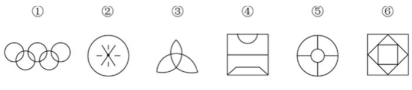
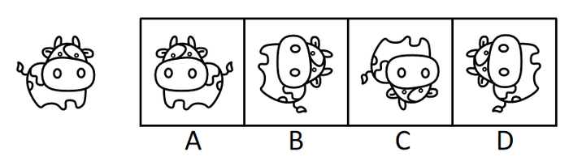
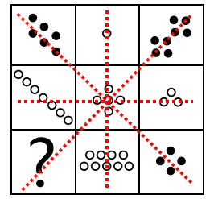
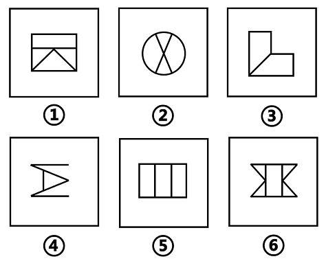
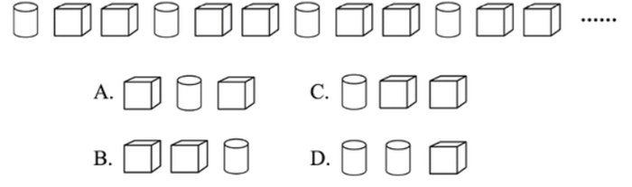
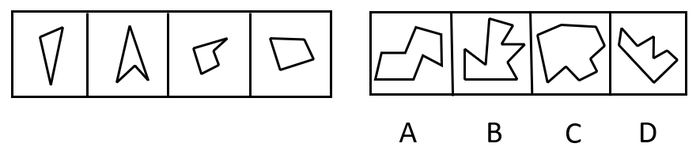
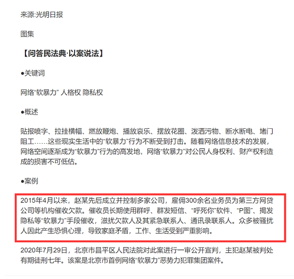
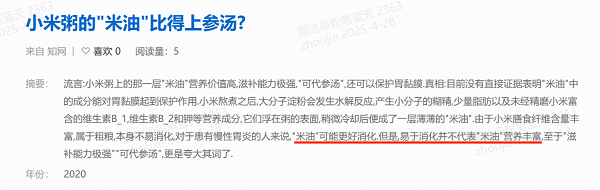

# 2021年海南省公务员录用考试《行测》题（网友回忆版）

> 判断推理 · 30 题 · 海南 2021

## 第 1 题　qid 3523454 · 图形推理

把下面的六个图形分为两类，使每一类图形都有各自的共同特征或规律，分类正确的一项是：

- **A**. ①②④，③⑤⑥
- **B**. ①③⑥，②④⑤　✅
- **C**. ①②⑤，③④⑥
- **D**. ①⑤⑥，②③④

**答案**：B

**官方解析**

本题为分组分类题目。元素组成不同，属性规律无答案，考虑数量规律。观察发现，题干出现了圆相交，多端点图形，考虑笔画数，题干笔画数依次为：1、7、1、3、4、1。根据是一笔画还是多笔画分为：①③⑥一组，②④⑤一组。
故正确答案为B。

---

## 第 2 题　qid 3523443 · 图形推理

分析下图中图形的变化规律，变化后第五行的图形应该是：

- **A**. A
- **B**. B　✅
- **C**. C
- **D**. D

**答案**：B

**官方解析**

元素组成相同，优先考虑位置规律。观察发现，每一行的图形每次向右平移一格（循环走），B项当选。
故正确答案为B。

---

## 第 3 题　qid 2172768 · 逻辑判断

以下哪项不是由左图得到的？

- **A**. A
- **B**. B
- **C**. C　✅
- **D**. D

**答案**：C

**官方解析**

元素组成相同，优先考虑位置规律，逐一分析选项。

A项：可由左图左右翻转得到，排除；

B项：可由左图先顺时针旋转，再上下翻转得到，排除；

C项：选项图形与左图不一致，选项缺少一个牛角，不能由左图得到，当选；

D项：可由左图逆时针旋转得到，排除。

本题为选非题，故正确答案为C。

---

## 第 4 题　qid 3522626 · 图形推理

从所给四个选项中，选择最合适的一项填入问号处，使之呈现一定的规律性。

- **A**. A
- **B**. B　✅
- **C**. C
- **D**. D

**答案**：B

**官方解析**

元素组成不相同，且无明显属性规律，考虑数量规律。图形由若干白球和黑球组成，可以考虑分开看黑球和白球的数量。横行竖行单独看黑球数量和白球数量没有规律，且黑球均出现在九宫格的四角处，可以考虑“米”字型看。“米”字型的四条线上，除最中间的图形外，两端的黑球相加数量为10，两端白球数量相加为10，所以？处应为2个黑球，对应B项。

故正确答案为B。

备注：本题的框架参照我国古代文明图案“河图洛书”所命制（如下图），在河图上，排列成数阵的黑点和白点，蕴藏着无穷的奥秘；在洛书上，纵、横、斜三条线上的三个数字，其和皆等于15。本题选取的即是洛书的排列形式，因此考虑横向、纵向、斜向相加均为15也是可以的。

---

## 第 5 题　qid 3522641 · 图形推理

把下面的六个图形分为两类，使每一类图形都有各自的共同特征或规律，分类正确的一项是：

- **A**. ①②③，④⑤⑥
- **B**. ①②④，③⑤⑥
- **C**. ①③④，②⑤⑥　✅
- **D**. ①③⑥，②④⑤

**答案**：C

**官方解析**

本题为分组分类题目。元素组成不同，优先考虑属性规律。题干出现等腰元素，考虑对称性。①③④三个图形均有一条对称轴，仅为轴对称图形；②⑤⑥三个图形均有两条相互垂直的对称轴，既是轴对称图形也是中心对称图形。即①③④为一组，②⑤⑥为一组。
故正确答案为C。

---

## 第 6 题　qid 3523447 · 图形推理

若题干最左边的图形编号为1，其余图形的编号依次递增1，编号为90、91、92的图形应该是：

- **A**. A　✅
- **B**. B
- **C**. C
- **D**. D

**答案**：A

**官方解析**

该题为三个图形依次排列且呈周期性遍历，因此图1、图2、图3为一组，图4、图5、图6为一组······以此类推，当遇到3的倍数时恰好为完整的一组结束，因此90号应为上一组的最后一个图，即六面体，91、92为下一组的前两个图形，分别是圆柱、六面体。
故正确答案为A。

---

## 第 7 题　qid 3523511 · 图形推理

右边四个小图形中，只有一个是由左边的四个图形拼合而成（只能通过上、下、左、右平移），请把它找出来。

- **A**. A
- **B**. B
- **C**. C　✅
- **D**. D

**答案**：C

**官方解析**

本题考查平面拼合，可采用平行且等长相消的方式解题。消去平行且等长的线段后进行组合即可得到轮廓图，即为C项。平行且等长相消的方式如下图所示：

故正确答案为C。

---

## 第 8 题　qid 3522628 · 定义判断

软暴力是指行为人为谋取不法利益或形成非法影响，对他人或者在有关场所进行滋扰、纠缠、哄闹、聚众造势等，足以使他人产生恐惧、恐慌进而形成心理强制，或者足以影响、限制人身自由、危及人身财产安全，影响正常生活、工作、生产、经营的违法犯罪手段。
根据上述定义，下列属于软暴力的是：

- **A**. 张某威胁王法官，如不秉公判案就举报其贪污的事实
- **B**. 甲公司为了在竞标中获胜，私下散布关于竞争对手的不利信息
- **C**. 某恶势力团伙为了向王某讨要赌债将其堵在酒店房间，24小时看守并不让其睡觉
- **D**. 网贷公司催收员长期使用群呼、群发短信、揭发隐私等手段滋扰欠款人及其紧急联系人、通讯录联系人　✅

**答案**：D

**官方解析**

第一步：找出定义关键词。

“为谋取不法利益或形成非法影响”、“对他人或者在有关场所进行滋扰、纠缠、哄闹、聚众造势”、“使他人产生恐惧、恐慌或影响、限制人身自由、危及人身财产安全，影响正常生活、工作、生产、经营的违法犯罪手段”。

第二步：逐一分析选项。

A项：张某威胁王法官秉公判案，不符合“为谋取不法利益或形成非法影响”，不符合定义，排除；

B项：甲公司为了在竞标中获胜，不符合“为谋取不法利益或形成非法影响”，不符合定义，排除；

C项：某恶势力将王某堵在房间不让其睡觉长达24小时，属于严重的人身强制行为，不属于“对他人或者在有关场所进行滋扰、纠缠、哄闹、聚众造势等”，不符合定义，排除；

D项：网贷公司使用群呼、群发、揭发隐私等手段滋扰欠款人及其紧急联系人、通讯录联系人，符合“对他人进行滋扰”，长期如此，符合“使他人产生恐惧、恐慌或影响”和“影响正常生活、工作、生产、经营的违法犯罪手段”，符合定义，当选。

故正确答案为D。

备注：下图中给出的示例，引自《光明日报》，该案是北京市首例网络“软暴力”的案件，与D项对应，而C项中的“24小时不让其睡觉”，直接限制了人身自由和行为且时间较长，二者比较，D项更符合定义。

---

## 第 9 题　qid 3523520 · 定义判断

名词的体是指人们对名词指示的人或事物在空间维度所表现出来的诸如数量、大小、形状和结构等特征的一种认知方式或结果。
根据上述定义，下列表现名词的体的是：

- **A**. 激战上甘岭
- **B**. 原始人的独木舟
- **C**. 弯弯的月亮　✅
- **D**. 未来的希望

**答案**：C

**官方解析**

第一步：找出定义关键词。
“名词指示的人或事物”、“在空间维度所表现出来的诸如数量、大小、形状和结构等特征”。
第二步：逐一分析选项。
A项：激战上甘岭，其中“激战”不符合“名词指示的人或事物”，不符合定义，排除；
B项：原始人的独木舟，其中“原始人的”不符合“在空间维度所表现出来的诸如数量、大小、形状和结构等特征”的描述，不符合定义，排除；
C项：弯弯的月亮，其中“月亮”符合“名词指示的人或事物”，“弯弯的”是对月亮形状特征的描述，符合“在空间维度所表现出来的诸如数量、大小、形状和结构等特征”的描述，符合定义，当选；
D项：未来的希望，其中“未来的”不符合“在空间维度所表现出来的诸如数量、大小、形状和结构等特征”的描述，不符合定义，排除。
故正确答案为C。

---

## 第 10 题　qid 3522646 · 定义判断

青春发动时相是指与同龄人相比，青少年自我感觉自身的青春发育水平是提前、适时或是延迟。根据上述定义，下列属于青春发动时相中“适时”的是：

- **A**. 初中生甲的身高是班级男生中最矮的，但其父母认为还算正常
- **B**. 初中生乙脸上长了几颗青春痘，而其他同学都没有，这让他很不自在
- **C**. 初中生丙在生理卫生课上和其他同学一样对异性生理结构充满了好奇
- **D**. 初中生丁在《青春期生理健康发育自我评估量表》各项内容中认真地勾选了“正常”选项　✅

**答案**：D

**官方解析**

第一步：找出定义关键词。
“与同龄人相比”、“青少年自我感觉”、“自身的青春发育水平适时”。
第二步：逐一分析选项。
A项：其父母认为还算正常，不符合“青少年自我感觉”，不符合定义，排除；
B项：其他同学都没有，不符合“自身的青春发育水平适时”，不符合定义，排除；
C项：对异性生理结构充满了好奇，不是对自身的青春发育水平的感觉，不符合定义，排除；
D项：自我评估量表，符合“青少年自我感觉”，认真选择“正常”选项，符合“青少年自我感觉”、“自身的青春发育水平适时”，符合定义，当选。
故正确答案为D。

---

## 第 11 题　qid 3523437 · 定义判断

替代性创伤是指在听到或看到一些灾难性事件的信息后，损害程度超过其中部分人群的心理和情绪的耐受极限，产生与经历者等同的情绪、躯体反应的现象。
根据上述定义，下列现象属于替代性创伤的是：

- **A**. 乘客甲经历紧急故障迫降事件后从此再也不敢乘坐任何飞机
- **B**. 抗疫志愿者乙目睹新冠肺炎感染者遭受病痛折磨而严重失眠　✅
- **C**. 丙听朋友描述澳洲大火的细节之后反复梦见自己被大火吞噬
- **D**. 医生丁面对因医学技术上的局限而不能治愈的患者深感自责

**答案**：B

**官方解析**

第一步：找出定义关键词。
“在听到或看到一些灾难性事件的信息后”、“产生与经历者等同的情绪、躯体反应”。
第二步：逐一分析选项。
A项：乘客甲经历了灾难性事件，是经历者，不符合“在听到或看到一些灾难性事件的信息后”，也不符合“产生与经历者等同的情绪、躯体反应”，不符合定义，排除；
B项：抗疫志愿者乙目睹新冠肺炎感染者遭受病痛折磨，符合“在听到或看到一些灾难性事件的信息后”，严重失眠，符合“产生与经历者等同的情绪、躯体反应”，符合定义，当选；
C项：丙听朋友描述澳洲大火的细节，符合“在听到或看到一些灾难性事件的信息后”，但反复梦见自己被大火吞噬，做梦不属于情绪、躯体反应，不符合“产生与经历者等同的情绪、躯体反应”，不符合定义，排除；
D项：医生丁面对因医学技术上的局限而不能治愈的患者深感自责，不符合“在听到或看到一些灾难性事件的信息后”，也不符合“产生与经历者等同的情绪、躯体反应”，不符合定义，排除。
故正确答案为B。
经查询资料，本题C项应更符合创伤后应激障碍（PTSD），其中一个表现为患者的思维、记忆或梦中反复、不自主地涌现与创伤有关的情境或内容，也可出现严重的触景生情反应，甚至感觉创伤性事件好像再次发生一样。
由此可见C项更符合创伤后应激障碍，而不是替代性创伤。

---

## 第 12 题　qid 3522623 · 定义判断

化学沉积作用是指在水介质中，以胶体溶液和真溶液形式搬运的物质到达适宜场所后，当化学条件发生变化时，产生沉淀、堆积的过程。其中，胶体溶液是指含有一定大小的固体颗粒物质或高分子化合物的溶液，真溶液是指透明度较高的水溶液。
根据上述定义，下列不属于化学沉积作用的是：

- **A**. 干旱气候区，湖水很少外泄，蒸发作用使湖水的氯化钠增加、累积，变成咸水湖
- **B**. 当海水中的绿色粘土矿物随水流动时，会和含有铝、铁的胶体物质聚合形成海绿石
- **C**. 富含磷质的海水上升至浅海区，因压力减小，温度升高，磷质析出、沉积而形成磷矿
- **D**. 湖泊里的生物骨骼，它们吸收了空气中的二氧化碳形成碳酸钙，当碳酸钙浓度达到一定程度就在海底堆积下来，形成石灰岩　✅

**答案**：D

**官方解析**

第一步：找出定义关键词。

化学沉积作用：“水介质”、“以胶体溶液和真溶液形式搬运”、“当化学条件发生变化时，产生沉淀、堆积”；

胶体溶液：“含有一定大小的固体颗粒物质或高分子化合物的溶液”；

真溶液：“透明度较高的水溶液”。

第二步：逐一分析选项。

A项：湖水是水介质，符合“透明度较高的水溶液”，蒸发使湖水的氯化钠增加累积，变成咸水湖，即湖水搬运的最终物质是氯化钠，符合“当化学条件发生变化时，产生沉淀、堆积”，符合定义，排除；

B项：海水是水介质，符合“透明度较高的水溶液”，绿色粘土矿物随海水流动和含有铝、铁的胶体物质聚合形成海绿石，符合“以胶体溶液和真溶液形式搬运”、“当化学条件发生变化时，产生沉淀、堆积”，符合定义，排除；

C项：海水是水介质，符合“透明度较高的水溶液”，压力减小、温度升高导致磷质析出沉积形成磷矿，符合“以胶体溶液和真溶液形式搬运”、“当化学条件发生变化时，产生沉淀、堆积”，符合定义，排除；

D项：湖泊是水介质，符合“透明度较高的水溶液”，但生物骨骼最终形成的石灰岩不是在真溶液形式搬运下发生的沉淀、堆积，属于生物沉积作用，不符合“当化学条件发生变化时，产生沉淀、堆积”，不符合定义，当选。

本题是选非题，故正确答案为D。

备注：本题很多学生比较纠结A项和D项，如下图所示，A项是在“化学沉积”相关文献中的典型案例，通过对比择优，本题问“不属于”，故小粉笔更倾向把答案给到D项。

---

## 第 13 题　qid 3523521 · 定义判断

生物浓缩，是指生物有机体或处于同一营养级上的许多生物种群，从周围环境中蓄积某种元素或难分解化合物，使生物有机体内该物质的浓度超过环境中该物质浓度的现象。
根据上述定义，以下涉及到生物浓缩的是：

- **A**. 农业上用于杀死昆虫的DDT通过食物链传递到白头鹰体内，导致生下的蛋皆是软壳的，无法孵化　✅
- **B**. 在湖泊、河流等地方出现的藻类及其他浮游生物迅速繁殖，水质恶化，鱼类及其他生物大量死亡的现象
- **C**. 山羊吃多玉米粒之后，一时间难以消化，再加上山羊饮入水后，玉米长时间聚集在胃内，容易引起胃胀
- **D**. 由于严重的白色污染，原本干净清洁的海滩，如今聚集了大量的塑料袋、瓶子等垃圾，以至于无人问津

**答案**：A

**官方解析**

第一步：找出定义关键词。
“生物有机体或处于同一营养级上的许多生物种群”、“从周围环境中蓄积某种元素或难分解化合物”、“使生物有机体内该物质的浓度超过环境中该物质浓度的现象”。
第二步：逐一分析选项。
A项：白头鹰体内，符合“生物有机体或处于同一营养级上的许多生物种群”，通过食物链传递导致白头鹰体内有DDT，符合“从周围环境中蓄积某种元素或难分解化合物”，白头鹰的蛋壳变软的原因在于有害化学物质DDT逐步在其体内积累的结果，符合“使生物有机体内该物质的浓度超过环境中该物质浓度的现象”，符合定义，当选；
B项：藻类和浮游生物迅速繁殖，鱼类及其他生物大量死亡，是因为鱼类生存所需的营养物质被藻类和浮游生物抢占了，不符合“使生物有机体内该物质的浓度超过环境中该物质浓度的现象”，不符合定义，排除；
C项：山羊吃多玉米粒之后，玉米聚集在胃里引起胃胀，不符合“使生物有机体内该物质的浓度超过环境中该物质浓度的现象”，不符合定义，排除；
D项：干净清洁的海滩受到白色污染，没有涉及生物有机体或者生物种群，不符合“生物有机体或处于同一营养级上的许多生物种群”，不符合定义，排除。
故正确答案为A。

---

## 第 14 题　qid 3522634 · 定义判断

相反相成修辞手法是指把通常相互对立、排斥的两个概念或判断巧妙地联系在一起，这样不仅能够揭示出存在于客观事物深层的矛盾辩证关系，还可以增加语言的意蕴。
根据上述定义，下列不属于相反相成修辞手法的是：

- **A**. 横眉冷对千夫指，俯首甘为孺子牛
- **B**. 有的人活着，他已经死了；有的人死了，他还活着
- **C**. 墙上芦苇，头重脚轻根底浅；山中竹笋，嘴尖皮厚腹中空　✅
- **D**. 这一天，死去的伟人在诗的国度里永生；这一天，活着的小丑在人们心上被埋葬

**答案**：C

**官方解析**

第一步：找出定义关键词。
“把通常相互对立、排斥的两个概念或判断巧妙地联系在一起”。
第二步：逐一分析选项。
A项：选项这句话意为对待敌人决不屈服，对人民大众甘愿服务。横眉和俯首是一个人的两个相互对立的态度，符合“把通常相互对立、排斥的两个概念或判断巧妙地联系在一起”，符合定义，排除； 
B项：选项这句话意为有的人虽然活着，但是他的道德败坏，就如已经死了一样没有价值，而有的人死了，他还活着，他的高尚的品格，代代相传，永远激励后人。活着和死了是一个人的两个相互对立的状态，符合“把通常相互对立、排斥的两个概念或判断巧妙地联系在一起”，符合定义，排除； 
C项：选项这句话用芦苇和竹笋比喻那些没有学问只会自吹自擂的人，芦苇和竹笋不符合“相互对立、排斥的两个概念或判断”，不符合定义，当选；
D项：选项这句话表达了不同类型的人在“这一天”的情况，死去和永生、活着和埋葬是一个人的两个相互对立的状态，符合“把通常相互对立、排斥的两个概念或判断巧妙地联系在一起”，符合定义，排除。
本题为选非题，故正确答案为C。

---

## 第 15 题　qid 3522631 · 定义判断

农业生产周期指在连续不断的农业再生产过程中，从开始生产到获得产品的整个过程所经过的全部时间，在种植业中一般是从整地开始到产品收获所经过的全部时间，在畜牧业中一般是从饲养幼畜开始到获得畜产品的时间。由于作为农业生产对象的动植物有自身的特性，并且受自然环境影响较大，其生产周期一般比工业生产周期长。
根据上述定义，下列选项涉及农业生产周期的是：

- **A**. 小李耕地、播种、打枝、摘棉花、纺线、织布······年复一年，周而复始　✅
- **B**. 小黄办了一家乡镇企业，从原材料购进、生产管理再到产品销售，他都亲力亲为
- **C**. 小刘今年在承包的荒山种植优质苹果树苗，经科学管理，树苗全部成活且长势良好
- **D**. 小王有个养猪场，虽年复一年重复着把猪崽养大的简单枯燥劳动，但始终干劲十足

**答案**：A

**官方解析**

第一步：找出定义关键词。
“连续不断的农业再生产过程中，从开始生产到获得产品的整个过程所经过的全部时间”、“在种植业中一般是从整地开始到产品收获所经过的全部时间”、“在畜牧业中一般是从饲养幼畜开始到获得畜产品的时间”。
第二步：逐一分析选项。
A项：小李耕地、播种、打枝、摘棉花、纺线、织布……年复一年，周而复始，耕地符合“从整地开始”，“摘棉花”符合“产品收获”，整个流程符合“连续不断的农业再生产过程中，从开始生产到获得产品的整个过程所经过的全部时间”，符合定义，当选；
B项：小黄办企业，买进材料、生产产品、销售产品，属于工业生产活动，不符合“农业再生产过程中”，不符合定义，排除；
C项：小刘种苹果树苗长势良好，没有提到最终是否获得产品，也没有提到是否是连续不断种树苗，不符合“连续不断的农业再生产过程中，从开始生产到获得产品的整个过程所经过的全部时间”，不符合定义，排除；
D项：小王年复一年重复把猪崽养大，畜产品指的是畜牧业生产所获得的产品（包括乳、肉、蛋、毛、皮及其副产品），养大后的猪崽属于牲畜，不属于畜产品，因此最终并未获得畜产品，不符合定义，排除。
注：A项中的纺线、织布虽属于加工业，但前面的耕地到摘棉花涉及了完整的农业生产周期。而D项并未获得畜产品，生产周期不完整。考虑本题提问方式为“涉及”，只有A项涉及了完整的农业生产周期，因此择优选择A项。
故正确答案为A。

---

## 第 16 题　qid 3523522 · 类比推理

就地保护：易地保护

- **A**. 汽车爆胎：汽车漏油
- **B**. 防洪堤：绿化带
- **C**. 纯种繁育：杂交繁育　✅
- **D**. 销售提成：股份分红

**答案**：C

**官方解析**

第一步：判断题干词语间逻辑关系。
就地保护和易地保护是保护生物多样性的两种形式，二者为并列关系，且为并列中的矛盾关系。
第二步：判断选项词语间逻辑关系。
A项：汽车爆胎和汽车漏油均为汽车会出现的故障，二者为并列关系，但是汽车除了爆胎和漏油外还会出现其他故障，所以二者为并列中的反对关系，与题干逻辑关系不一致，排除；
B项：防洪堤是为了防止河流泛滥而建立的堤坝，而绿化带是为了起到绿化的作用，美化环境，二者构不成并列关系，与题干逻辑关系不一致，排除；
C项：纯种繁育是同一品种内进行后代繁育，杂交繁育是不同品种间进行后代繁育，二者为并列关系，且为并列中的矛盾关系，与题干逻辑关系一致，当选；
D项：销售提成与股份分红均为获得收入的两种形式，二者为并列关系，但是获得收入除了销售提成与股份分红外还有其他形式，所以二者为并列关系中的反对关系，与题干逻辑关系不一致，排除。
故正确答案为C。

---

## 第 17 题　qid 3522627 · 类比推理

洪涝：干旱：防洪抗旱

- **A**. 地震：海啸：抗震救灾
- **B**. 滑坡：雪崩：道路抢修
- **C**. 严寒：酷热：防冻消暑　✅
- **D**. 风沙：雾霾：防沙除霾

**答案**：C

**官方解析**

第一步：判断题干词语间逻辑关系。
洪涝与干旱，二者为反义关系，且防洪与抗旱分别是前两种现象针对性的应对方法，与前两词构成对应关系。
第二步：判断选项词语间逻辑关系。
A项：地震与海啸，二者并不是反义关系，抗震是地震的应对方法，但救灾范围太大，与海啸对应关系并不贴切，与题干逻辑关系不一致，排除；
B项：滑坡与雪崩，二者并不是反义关系，且滑坡与雪崩都可能需要进行道路抢修，与题干逻辑关系不一致，排除；
C项：严寒与酷热，二者为反义关系，防冻是严寒的应对方法，消暑是酷热的应对方法，是两种现象的应对方式，与题干逻辑关系一致，当选；
D项：风沙与雾霾，二者并不是反义关系，与题干逻辑关系不一致，排除。
故正确答案为C。
注：本题有同学通过自然灾害选了D，这也是个角度，但是从题干特征来看，本题题干前两词反义关系明显，故优先考虑反义关系，不行的情况下再考虑是否是自然灾害，做题的首要原则是题干特征。

---

## 第 18 题　qid 3522629 · 类比推理

党员：干部：服务人民

- **A**. 青年：才俊：报效国家　✅
- **B**. 科学：精英：科技立身
- **C**. 大国：工匠：技术强国
- **D**. 学校：教师：教书育人

**答案**：A

**官方解析**

第一步：判断题干词语间逻辑关系。
有的党员是干部，有的党员不是干部，有的干部是党员，有的干部不是党员，二者为交叉关系，党员和干部都是服务人民的主体，与服务人民是对应关系。
第二步：判断选项词语间逻辑关系。
A项：有的青年是才俊，有的青年不是才俊，有的才俊是青年，有的才俊不是青年，二者为交叉关系，青年和才俊都是报效国家的主体，与报效国家是对应关系，与题干逻辑关系一致，当选；
B项：科学和精英不是交叉关系，且科学不是科技立身的主体，与题干逻辑关系不一致，排除；
C项：大国和工匠不是交叉关系，且大国不是技术强国的主体，与题干逻辑关系不一致，排除；
D项：学校是教师的工作地点，二者不是交叉关系，且学校也不是教书育人的主体，与题干逻辑关系不一致，排除。
故正确答案为A。

---

## 第 19 题　qid 3522642 · 类比推理

（    ） 对于 汽车 相当于 （    ） 对于 相机

- **A**. 轮胎 手机
- **B**. 速度 像素
- **C**. 马达 快门　✅
- **D**. 单车 单反

**答案**：C

**官方解析**

逐一代入选项。
A项：轮胎是汽车的组成部分，二者是组成关系，手机和相机是两种电子设备，二者是并列关系，前后逻辑关系不一致，排除；
B项：速度是衡量汽车行驶快慢的指标，二者是必然对应关系，像素是相机中衡量清晰度的指标，但它只适用于数码相机，胶片相机不涉及像素这一概念，二者是或然对应关系，前后逻辑关系不一致，排除；
C项：马达是汽车的组成部分，二者是组成关系，快门是相机的组成部分，二者是组成关系，而且均是必然组成关系，前后逻辑关系一致，当选；
D项：单车和汽车是两种交通工具，二者是并列关系，单反的全称是单镜头反光相机，它是相机的一种，二者是种属关系，前后逻辑关系不一致，排除。
故正确答案为C。

---

## 第 20 题　qid 3522617 · 类比推理

绵羊 对于 （    ） 相当于 （    ） 对于 高粱

- **A**. 麻雀 水稻
- **B**. 老鹰 麦子
- **C**. 羚羊 玉米　✅
- **D**. 山羊 玫瑰

**答案**：C

**官方解析**

逐一代入选项。
A项：绵羊与麻雀都是动物，但绵羊是哺乳动物，而麻雀是鸟类，二者范畴不一致，高粱与水稻都是粮食作物，二者为并列关系，前后逻辑关系不一致，排除；
B项：绵羊与老鹰都是动物，但绵羊是哺乳动物，而老鹰是鸟类，二者范畴不一致，高粱与麦子都是粮食作物，二者为并列关系，前后逻辑关系不一致，排除；
C项：绵羊与羚羊都是反刍类哺乳动物，二者为并列关系，高粱与玉米都是粮食作物，二者为并列关系，前后逻辑关系一致，当选；
D项：绵羊与山羊都是反刍类哺乳动物，二者为并列关系，高粱与玫瑰都是植物，但高粱是粮食作物，玫瑰是观赏性植物，二者范畴不一致，前后逻辑关系不一致，排除。
故正确答案为C。

---

## 第 21 题　qid 3523523 · 类比推理

山有色：水发声

- **A**. 山河在：草木深
- **B**. 客舍青：柳色新
- **C**. 鸟飞绝：人踪灭
- **D**. 花作尘：鸟不惊　✅

**答案**：D

**官方解析**

第一步：判断题干词语间逻辑关系。
两个词语无明显的逻辑关系，考虑分开看。有色是对山的描述，发声是对水的描述。即后两个字是对第一个字的描述。
第二步：判断选项词语间逻辑关系。
A项：“在”是对“山河”的描述，“深”是对“草木”的描述，即第三个字是对前两个字的描述，与题干逻辑关系不一致，排除；
B项：“青”是对“客舍”的描述，“新”是对“柳色”的描述，即第三个字是对前两个字的描述，与题干逻辑关系不一致，排除；
C项：“飞绝”是对“鸟”的描述，即后两个字是对第一个字的描述，但是“灭”是对“人踪”的描述，即第三个字是对前两个字的描述，与题干逻辑关系不一致，排除；
D项：“作尘”是对“花”的描述，“不惊”是对“鸟”的描述，即后两个字是对第一个字的描述，与题干逻辑关系一致，当选。
故正确答案为D。

---

## 第 22 题　qid 3522636 · 类比推理

匹马：单枪

- **A**. 万水：千山　✅
- **B**. 花红：柳绿
- **C**. 地久：天长
- **D**. 猴年：马月

**答案**：A

**官方解析**

第一步：判断题干词语间逻辑关系。
匹马是指一匹马，单枪是指一杆枪，二者属于并列关系，并且“匹”和“单”均可以用来表示数量。
第二步：判断选项词语间逻辑关系。
A项：万水和千山为并列关系，并且“万”与“千”均可以用来表示数量，与题干逻辑关系一致，当选；
B项：花红和柳绿为并列关系，但“花”与“柳”不可用来表示数量，与题干逻辑关系不一致，排除；
C项：地久和天长为并列关系，但“地”和“天”不可用来表示数量，与题干逻辑关系不一致，排除；
D项：猴年和马月为并列关系，但“猴”和“马”不可用来表示数量，与题干逻辑关系不一致，排除。
故正确答案为A。

---

## 第 23 题　qid 3522650 · 逻辑判断

野生动物之间因病毒入侵会暴发传染病。最新研究发现，热带、亚热带或低海拔地区的动物，因生活环境炎热，一直面临着罹患传染病的风险。生活在高纬度或高海拔等低温环境的动物，过去因长久寒冬可免于病毒入侵，但现在冬季正变得越来越温暖，持续时间也越来越短。因此，气温升高将加剧野生动物传染病的暴发。
以下哪项如果为真，最能支持上述观点？

- **A**. 无论气候如何变化，生活在炎热地带的动物始终面临着患传染病风险
- **B**. 适应寒带和高海拔栖息地的动物物种遭遇传染病暴发的风险正在升高
- **C**. 气温高低与野生动物患传染病风险之间存在正相关性，即气温越高患病风险越高　✅
- **D**. 寒冷气候可能让野生动物免受病毒入侵，炎热气候却更易导致野生动物感染病毒

**答案**：C

**官方解析**

第一步：找出论点和论据。
论点：气温升高将加剧野生动物传染病的暴发。
论据：热带、亚热带或低海拔地区的动物，因生活环境炎热，一直面临着罹患传染病的风险。生活在高纬度或高海拔等低温环境的动物，过去因长久寒冬可免于病毒入侵，但现在冬季正变得越来越温暖，持续时间也越来越短。
论据讨论的是炎热地区与低温地区对于动物罹患传染病的风险情况，论点讨论的是气温升高将加剧野生动物传染病的暴发，论据论点均在讨论气温与野生动物传染病的关系，话题一致，可以考虑补充论据进行加强。
第二步：逐一分析选项。
A项：该项指出炎热地带的动物始终面临着患传染病风险，而论点的主体为野生动物；同时该项并未说明气温升高是否会加剧野生动物传染病的暴发，话题不一致，无法加强，排除；
B项：该项指出适应寒带和高海拔栖息地的动物物种遭遇传染病暴发的风险正在升高，但并未说明气温升高与野生动物传染病暴发之间的关系，话题不一致，无法加强，排除；
C项：该项指出气温高低与野生动物患传染病风险之间存在正相关性，说明气温升高确实会加剧野生动物传染病的暴发，属于补充论据，可以加强，当选；
D项：该项指出寒冷气候与炎热气候对野生动物感染病毒的风险存在差异，属于重复论据，无法得知气温升高是否会加剧野生动物传染病的暴发，且是一种“可能”的说法，加强力度小于C项，排除。
故正确答案为C。

---

## 第 24 题　qid 3523501 · 逻辑判断

1901年在伊朗苏萨城废墟中出土的罐子上发现了一种古老语言，被称为埃兰语，考古学家最近破译了它。考证发现：埃兰语与美索不达米亚原始楔形文字一样久远，但不是起源于美索不达米亚，而是在古波斯一带使用。与表音并表意的美索不达米亚楔形文字不同，埃兰语是表音语言。考古学家由此推测：埃兰语是古波斯一带人们独立使用的语言。
上述推测如果为真，最能质疑下列哪项观点？

- **A**. 埃兰语由表示音节、辅音和元音的符号构成，遵循由左向右的书写规则
- **B**. 埃兰语大约4000年前在现今西亚一带使用，使用时间可能超过1400年
- **C**. 埃兰语与美索不达米亚原始楔形文字、古埃及的圣书体等语言同时产生
- **D**. 埃兰语源于美索不达米亚原始楔形文字，与楔形文字是母体和子体关系　✅

**答案**：D

**官方解析**

第一步：分析题干。
注意问法为用题干推测来削弱选项观点，所以题干可视为论据。
推测：埃兰语是古波斯一带人们独立使用的语言。
考证发现：埃兰语与美索不达米亚原始楔形文字一样久远，但不是起源于美索不达米亚，而是在古波斯一带使用。与表音并表意的美索不达米亚楔形文字不同，埃兰语是表音语言。
第二步：逐一分析选项。
A项：推测说的是埃兰语是古波斯一带人们独立使用的语言，该项说的是埃兰语的构成符号，遵循的书写规则，话题不一致，无法削弱，排除；
B项：推测说的是埃兰语是古波斯一带人们独立使用的语言，该项说的是埃兰语在现今西亚一带使用过，以及使用时间范围，话题不一致，无法削弱，排除；
C项：推测说的是埃兰语是古波斯一带人们独立使用的语言，该项说的是埃兰语与美索不达米亚原始楔形文字、古埃及的圣书体等语言同时产生，语言同时产生不等同于语言在古波斯一带独立使用，话题不一致，无法削弱，排除；
D项：推测说的是埃兰语是古波斯一带人们独立使用的语言，考证发现说的是埃兰语与表音并表意的美索不达米亚原始楔形文字不同，埃兰语是表音语言，该项说的是埃兰语与美索不达米亚原始楔形文字是母体和子体关系，且埃兰语来源于美索不达米亚原始楔形文字，削弱选项观点，当选。
故正确答案为D。

---

## 第 25 题　qid 3522622 · 逻辑判断

AI助手在医学应用上有着明显的优势：放射科医生每天要阅读并分析大量的影像，医生会因为疲劳导致效率降低，AI助手则不会，它甚至比人眼能更加迅捷地找到影像中的可疑病变，帮助医生做出初步诊断。
 以下哪项如果为真，最能支持上述结论?

- **A**. 甲医院医生借助AI技术将疑难影像分类归档
- **B**. 乙医院呼吸科借助AI助手完成了一次远程会诊
- **C**. 丙医院放射科利用AI技术半天就可完成对200多个患者的影像诊断　✅
- **D**. 丁医院借助AI助手检测出远程会诊患者胸腔部位的异常征象，并为其确定治疗方案

**答案**：C

**官方解析**

第一步：找出论点和论据。
论点：AI助手在医学应用上有着明显的优势。
论据：放射科医生每天要阅读并分析大量的影像，医生会因为疲劳导致效率降低，AI助手则不会，它甚至比人眼能更加迅捷地找到影像中的可疑病变，帮助医生做出初步诊断。
本题论据讨论的是AI助手与医生相比更不会疲劳、效率更高，可以更快帮助医生做出诊断，论点讨论的是AI助手有着明显的优势，论点和论据话题一致，加强优先考虑补充论据。
第二步：逐一分析选项。
A项：甲医院医生借助AI助手将影像分类归档，但是并未和人类医生做比较，故无法判断AI助手是否在医学应用上有着明显的优势，无法加强，排除；
B项：乙医院借助AI助手完成了一次远程会诊，但是并未和人类医生做比较，故无法判断AI助手是否在医学应用上有着明显的优势，无法加强，排除；
C项：丙医院的放射科利用AI技术半天就可完成200多个患者的诊断，体现了AI助手不会疲惫，能更快帮助医生做出初步诊断，补充论据，可以加强，当选；
D项：丁医院借助AI助手完成对患者的诊断并确定治疗方案，但是并未和人类医生做比较，故无法判断AI助手是否在医学应用上有着明显的优势，无法加强，排除。
故正确答案为C。

---

## 第 26 题　qid 3522647 · 逻辑判断

研究表明，肉食中的化合物可能引发部分儿童气喘，进而导致哮喘或其他呼吸道疾病。这些化合物被称作“晚期糖基化终产物”，是肉类在高温烤炸烘焙时释放出的物质。所以，素食或者少吃肉可避免儿童患哮喘的风险。
以下哪项如果为真，最能质疑上述观点？

- **A**. 肉类在非高温烤炸烘焙情况下，不产生晚期糖基化终产物，与哮喘的关联性未知
- **B**. 科学家研究显示，体内的晚期糖基化终产物主要来自于但又并非仅仅来自于肉类　✅
- **C**. 晚期糖基化终产物除导致哮喘外，还能加速人体衰老，引发各种慢性退化性疾病
- **D**. 晚期糖基化终产物作为一种蛋白质，在人体中自然生成，并随着年龄的增长不断积聚

**答案**：B

**官方解析**

第一步：找出论点和论据。
论点：素食或者少吃肉可避免儿童患哮喘的风险。
论据：肉食中的化合物可能引发部分儿童气喘，进而导致哮喘或其他呼吸道疾病。这些化合物被称作“晚期糖基化终产物”，是肉类在高温烤炸烘焙时释放出的物质。
论据提出肉类烤炸烘焙时产生的晚期糖基化终产物可能引发部分儿童哮喘，论点认为素食或者少吃肉可避免儿童患哮喘的风险，二者话题一致，削弱优先考虑否定论点。
第二步：逐一分析选项。
A项：非高温烤炸烘焙肉类与哮喘关联性未知，因此素食或者少吃肉能否避免儿童患哮喘的风险并不明确，不明确选项，排除；
B项：指出晚期糖基化终产物并非仅仅来自于肉类，说明其他途径也会产生晚期糖基化终产物，只是素食或者少吃肉并不能“避免”儿童患哮喘的风险，可以削弱，保留；
C项：指出晚期糖基化终产物会带来其他不好的作用，与素食或者少吃肉可避免儿童患哮喘的风险无关，无法削弱，排除；
D项：指出晚期糖基化终产物在人体中自然生成，说明晚期糖基化终产物不是仅通过吃肉得到的，人体本身也会产生该物质，只是素食或者少吃肉并不能“避免”儿童患哮喘的风险，可以削弱，保留；
对比B、D两项，B、D两项都是从除了肉类之外还有其他途径会产生晚期糖基化终产物的角度来进行削弱；但题干论点是素食或者少吃肉可避免“儿童”患哮喘，D项的潜台词是人年龄越来越大，晚期糖基化终产物不断积聚，可能避免不了得哮喘，问题是到多大年纪，积聚了多少，才会得哮喘呢？如果是积聚到儿童阶段，就会得哮喘，那能削弱论点，说明素食或者少吃肉不可避免“儿童”患哮喘；但如果积聚到中老年阶段，才会得哮喘，那就与论点主体无关了，不确定素食或者少吃肉能不能避免“儿童”阶段患哮喘，综上所述B项比D项更明确。
故正确答案为B。

---

## 第 27 题　qid 3523530 · 逻辑判断

黄烷醇是存在于许多水果，蔬菜和可可中的小分子物质，人们在日常生活中会很容易摄入含有黄烷醇的食物。如果食用富含黄烷醇的食物，将会促进心血管功能。心血管功能改善有助于提高脑血管功能。某种物质有益于脑血管功能，则会对认知功能产生积极影响。
由此可以推出：

- **A**. 如果要改善心血管功能，就要食用富含黄烷醇的食物
- **B**. 如果要改善脑血管功能，就要食用富含黄烷醇的食物
- **C**. 如果要改善认知功能，就要食用富含黄烷醇的食物
- **D**. 如果要食用富含黄烷醇的食物，就对认知功能产生积极影响　✅

**答案**：D

**官方解析**

第一步：翻译题干。

①食用富含黄烷醇的食物促进心血管功能；

②心血管功能改善提高脑血管功能；

③有益于脑血管功能对认知功能产生积极影响。

将①②③串联起来可以递推出：④食用富含黄烷醇的食物促进心血管功能提高脑血管功能对认知功能产生积极影响。

第二步：逐一分析选项。

A项：翻译为改善心血管功能食用富含黄烷醇的食物，是对条件①的肯后，但肯后得不到确定性的结论，无法推出，排除；

B项：翻译为改善脑血管功能食用富含黄烷醇的食物，是对条件④的肯后，但肯后得不到确定性的结论，无法推出，排除；

C项：翻译为改善认知功能食用富含黄烷醇的食物，是对条件④的肯后，但肯后得不到确定性的结论，无法推出，排除；

D项：翻译为食用富含黄烷醇的食物对认知功能产生积极影响，是对条件④的肯前，肯前必肯后，可以推出，当选。

故正确答案为D。

---

## 第 28 题　qid 3522618 · 逻辑判断

最新的两项研究成果引起人们关注：一是利用某种细菌来制造人造肉的蛋白质，该细菌靠吸收温室气体二氧化碳生长，每产生1千克蛋白质约需2千克二氧化碳；二是把从大气中回收的二氧化碳和水合成乙醇，生产1千克乙醇需要1.5千克二氧化碳。专家预测，这些新技术将有助于21世纪中期实现温室气体零排放的目标。
由此可以推出：

- **A**. 利用二氧化碳生产食品和酒类将成为一项新兴产业
- **B**. 未来可以通过人造食品吃掉二氧化碳来减少其排放
- **C**. 只有二氧化碳资源化利用才能实现温室气体零排放
- **D**. 二氧化碳资源化利用可能实现温室气体零排放目标　✅

**答案**：D

**官方解析**

日常结论题，根据题干信息逐一分析选项。
A项：题干前面介绍了两项研究成果，即二氧化碳可以用来制造人造肉的蛋白质以及合成乙醇，但没有提及利用二氧化碳生产食品和酒类将成为一项新兴行业，无中生有，排除；
B项：题干第一项研究成果介绍了二氧化碳可以用来制造人造肉的蛋白质，最后说这些新技术将有助于21世纪中期实现温室气体零排放的目标，这是专家预测的未来的事情，但未来是否真的能通过人造食品吃掉二氧化碳来减少其排放，题干没有提及，无法推出，排除；
C项：根据题干最后一句话，这些新技术将有助于21世纪中期实现温室气体零排放的目标，但没有提及只有二氧化碳资源化利用才能实现温室气体零排放，表述过于绝对，无法推出，排除；
D项：题干前面介绍了两种利用二氧化碳的技术，最后说这些新技术将有助于21世纪中期实现温室气体零排放的目标，可以推出二氧化碳资源化利用可能实现温室气体零排放目标，可以推出，当选。
故正确答案为D。

---

## 第 29 题　qid 3522621 · 逻辑判断

小米熬成稀粥后，大分子淀粉会发生水解反应，产生小分子的糊精和少量脂肪，这些成分都浮在粥的表面，稍稍冷却后形成一层薄薄的米油。有人说，小米粥上的这层米油营养价值极高，滋补能力极强，还可以保护胃黏膜。
以下各项如果为真，最能质疑上述观点的组合是：
①未精制的小米富含维生素Bl、B2和钾等成分
②米油没有什么极高营养价值和极强的滋补能力
③米油可助消化，但助消化并不等于营养价值高
④研究证明，米油对胃黏膜没有明显的保护作用

- **A**. ①③
- **B**. ②④
- **C**. ①③④
- **D**. ②③④　✅

**答案**：D

**官方解析**

第一步：找出论点和论据。 

论点：小米粥上的这层米油营养价值极高，滋补能力极强，还可以保护胃黏膜。

论据：无。

本题只有论点，没有论据，削弱可以优先考虑削弱论点，即米油营养价值不高，滋补能力不强，不能保护胃黏膜。

第二步：逐一分析选项。

题干给出了4个条件，逐一分析4个条件。

①该条件指出未精制的小米含有的成分，但是不代表这些成分的营养价值高低、滋补能力强弱和是否能保护胃黏膜，与论点讨论的话题无关，不能削弱；

②该条件指出米油没有极高营养价值和极强的滋补能力，直接削弱论点；

③该条件指出米油可助消化，但助消化不等于营养价值高，说明米油可能营养价值不高，能削弱论点；

备注：因为第③句是否能削弱，有争议，故放上原文供大家参考，在原文中，作者是用“助消化并不等于营养价值高”来质疑论点“米油营养价值极高”这句，是有可以削弱的。

④该条件指出米油对胃黏膜没有明显的保护作用，直接削弱论点。

因此，最能质疑观点的组合是②③④。

故正确答案为D。

---

## 第 30 题　qid 3522651 · 类比推理

动物园中有三种动物：骆驼、大象和猴子，它们的年龄均为整数。三个伙伴小张、小王和小李去动物园参观动物，他们各选择一种动物去参观，三人选的动物各不相同。已知：
①大象住在动物园东边的动物馆；
②骆驼已经4岁，住在西边的动物馆；
③小王去看的是动物园东边和西边之间的动物；
④小张去看的动物年龄最小；
⑤三种动物年龄从西到东依次增加，且平均年龄为5岁。
以下说法正确的是：

- **A**. 猴子年龄为5岁　✅
- **B**. 大象年龄为7岁
- **C**. 小王参观的是大象
- **D**. 小李参观的是骆驼

**答案**：A

**官方解析**

第一步：分析题干条件。
（1）骆驼、大象和猴子的年龄均为整数；
（2）大象住在动物园东边；
（3）骆驼4岁，住在动物园西边；
（4）小王看的是动物园东边和西边之间的动物；
（5）小张去看的动物年龄最小；
（6）三种动物年龄从西到东依次增加，且平均年龄为5岁。
第二步：根据题干条件进行推理。
根据条件（2）（3）和（4），大象住东边，骆驼住西边，可知住动物园东边和西边之间的动物是猴子，则小王看的是猴子，排除C项；根据条件（6）可知，三种动物的年龄排序从小到大为骆驼、猴子和大象，结合条件（5）可知小张看的是骆驼，排除D项；根据条件（3）可知骆驼4岁，根据（1）和条件（6）可知，猴子的年龄为5岁，大象的年龄为6岁，排除B项。
故正确答案为A。

---
