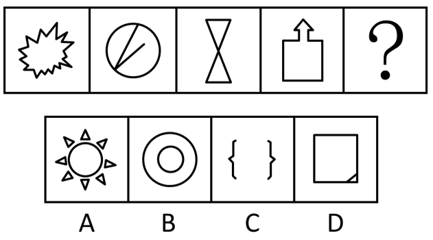
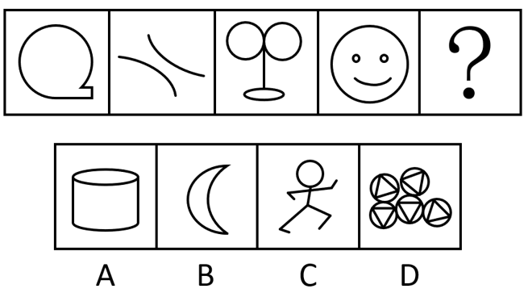

# 2021年湖北省选调生招录考试综合知识和行政职业能力测验试卷（网友回忆版）

> 判断推理 · 16 题 · 湖北 2021

## 第 1 题　qid 5518363 · 图形推理

从下列所给四个选项中选择最合适的一个填入问号处，使之呈现一定的规律性（    ）。

- **A**. A
- **B**. B
- **C**. C
- **D**. D　✅

**答案**：D

**官方解析**

方法一：元素组成不同，且无明显属性规律，考虑数量规律。观察发现，题干图形均为一部分，故“？”处图形也应为一部分，只有D项符合。
方法二：元素组成不同，且无明显属性规律，考虑数量规律。观察发现，图1为明显的一笔画图形，图三为“日”字变形图，考虑笔画数。题干图形均为一笔画图形，故“？”处图形也应为一笔画图形，只有D项符合。
故正确答案为D。

---

## 第 2 题　qid 5518369 · 图形推理

从下列所给四个选项中选择最合适的一个填入问号处，使之呈现一定的规律性（    ）。

- **A**. A
- **B**. B
- **C**. C
- **D**. D　✅

**答案**：D

**官方解析**

元素组成不同，且无明显属性规律，考虑数量规律。观察发现，题干图形都存在曲线，且图2和图4均有单一曲线，优先考虑数曲线。题干图形的曲线数依次为1、2、3、4，故“？”处图形的曲线数应为5，只有D项符合。
故正确答案为D。

---

## 第 3 题　qid 5518386 · 定义判断

建设高标准农田，是巩固和提高粮食生产能力、保障国家粮食安全的关键举措。高标准农田是指土地平整、土壤肥沃、集中连片、设施配套、旱涝保收、节水高效、稳产高产、生态友好，与现代农业生产和经营方式相适应的永久基本农田。
根据上述定义，以下属于高标准农田建设的是（    ）。

- **A**. 高村流转360亩土地种水稻，通过机械化种植和精细化管理，亩均单产达到1200斤，户均增收700元
- **B**. 杨村农田经改造，实现了肥土成片、沟渠相连、主辅路通、旱灌涝排、机械耕种、网络管理和绿色丰产　✅
- **C**. 李村集中撂荒稻田，购置旋耕机、开沟机、插秧机、收割机、机动喷雾器等农机具，实施大规模水稻种植
- **D**. 严村加强高标准农田建设，推动规模化种植、标准化生产和产业化经营，助力种植业绿色高质量的发展

**答案**：B

**官方解析**

第一步：找出定义关键词。
“土地平整、土壤肥沃、集中连片、设施配套、旱涝保收、节水高效、稳产高产、生态友好，与现代农业生产和经营方式相适应的永久基本农田”。
第二步：逐一分析选项。
A项：高村通过机械化种植和精细化管理实现水稻高产，只涉及了“设施配套、稳产高产”，未体现“土壤肥沃、集中连片、生态友好”等关键词，定义关键词不全面，不符合定义，排除；
B项：杨村农田经改造后“肥土成片”体现了“土地平整、土壤肥沃、集中连片”，“沟渠相连、主辅路通、旱灌涝排”体现了“设施配套、旱涝保收、节水高效”，“机械耕种、网络管理”体现了“与现代农业生产和经营方式相适应”，“绿色丰产”体现了“稳产高产、生态友好”，定义关键词全面，符合定义，当选；
C项：李村“购置旋耕机、开沟机、插秧机、收割机、机动喷雾器等农机具，实施大规模水稻种植”，只涉及了“设施配套”，未体现“土地平整、土壤肥沃、集中连片、旱涝保收、节水高效、稳产高产、生态友好”，定义关键词不全面，不符合定义，排除；
D项：严村只是推行了“高标准农田建设”，但并未体现严村推行后是否达到结果，没有明确体现是否符合定义关键词，而B项实现了“高标准农田建设”，明确符合定义关键词，优于D项，排除。
故正确答案为B。

---

## 第 4 题　qid 5518400 · 定义判断

农业生产时间是从农业劳动力和农业生产资料投入生产过程开始，到产品出售前所需要的全部劳动时间，即劳动、资本或资金处在生产过程中的时间，包括：生产准备和劳动者使用生产工具作用于劳动对象的时间；劳动过程中断时，动植物自然生长发育时间、酒类等自然发酵时间；原材料、燃料、种子、肥料等储备时间、产品库存待售时间。
根据上述定义，以下不属于农业生产时间的是（    ）。

- **A**. 晨曦下，M农场的职工在高标准水田中，驾着插秧机抢插早稻秧
- **B**. 晴空下，M农场一望无际的田野里稻花飘香，稻浪起伏硕果累累
- **C**. 又是一个丰收之年，M农场收获的稻谷堆满粮仓，职工们喜洋洋
- **D**. 车轮滚滚，县粮站干部职工服务上门，将M农场早稻粮收购运走　✅

**答案**：D

**官方解析**

第一步：找出定义关键词。
“劳动、资本或资金处在生产过程中的时间”、“生产准备和劳动者使用生产工具作用于劳动对象的时间”、“劳动过程中断时，动植物自然生长发育时间、酒类等自然发酵时间”、“原材料、燃料、种子、肥料等储备时间、产品库存待售时间”。
第二步：逐一分析选项。
A项：该项中职工驾驶插秧机插秧花费的时间属于生产过程中的时间，符合“劳动、资本或资金处在生产过程中的时间”、“生产准备和劳动者使用生产工具作用于劳动对象的时间”，符合定义，排除；
B项：该项中稻花飘香，稻浪起伏硕果累累，说明稻子在自然成长，符合“劳动、资本或资金处在生产过程中的时间”、“劳动过程中断时，动植物自然生长发育时间、酒类等自然发酵时间”，符合定义，排除；
C项：该项中稻谷堆满粮仓属于产品库存待售时间，符合“劳动、资本或资金处在生产过程中的时间”、“原材料、燃料、种子、肥料等储备时间、产品库存待售时间”，符合定义，排除；
D项：该项中早稻粮被收购运走，说明产品已经被售出运走，不属于生产过程中的时间，不符合“劳动、资本或资金处在生产过程中的时间”，不符合定义，当选。
本题为选非题，故正确答案为D。

---

## 第 5 题　qid 5518383 · 逻辑判断

规模互借是一种小城市抱团发展的现象，指地理临近且联系紧密的小城市由于相互联合，使企业获得资本和技术集聚效应，灵活的劳动力市场、仓储和商业服务等功能，也使小城市居民可以享有大规模城市才有的公共设施和服务，从而具有与同等规模的单一特大城市相同的经济社会发展功能。
以下体现了规模互借定义的是（    ）。

- **A**. 长三角城市已实现品牌效应互借，如乌镇举办世界互联网大会，借助了上海城市品牌和信息技术产业
- **B**. 小城市能借力周边大城市促进自身发展，如昆山市没有机场，其制造业蓬勃发展受益于上海虹桥机场
- **C**. 规模互借不一定要求城市在地理上相互临近，空间分离的各单元也可以凭借信息化紧密地联系在一起
- **D**. 研究表明，长三角108个小城市已形成优势和功能互补，其公共设施和服务水平不亚于一些省会城市　✅

**答案**：D

**官方解析**

第一步：找出定义关键词。
“地理临近且联系紧密的小城市”、“相互联合”、“具有与同等规模的单一特大城市相同的经济社会发展功能”。
第二步：逐一分析选项。
A项：长三角城市如乌镇和上海实现品牌效应互借，但上海属于特大城市，不符合“地理临近且联系紧密的小城市”，不符合定义，排除；
B项：小城市（昆山）能借力周边大城市（上海）促进自身发展，不符合“地理临近且联系紧密的小城市”、“相互联合”，不符合定义，排除；
C项：空间分离的各单元也可以凭借信息化紧密地联系在一起，既不符合地理相邻，也没有提及城市规模，不符合“地理临近且联系紧密的小城市”，不符合定义，排除；
D项：长三角108个小城市已形成优势和功能互补，符合“地理临近且联系紧密的小城市”、“相互联合”，其公共设施和服务水平不亚于一些省会城市，符合“具有与同等规模的单一特大城市相同的经济社会发展功能”，符合定义，当选。
故正确答案为D。

---

## 第 6 题　qid 5518403 · 定义判断

《中国康养产业发展报告》指出我国养老产业发展潜力巨大，到2030年即将达到22万亿元产业规模，康养产业是以维护、改善和促进人民群众身心健康为目的，为社会公众特别是老年群众提供身心健康直接或间接相关的产品或服务的生产经营活动。
根据上述定义，以下属于康养产业的是（    ）。

- **A**. 健康知识教育与健康科技普及
- **B**. 个别旅游景点“三无”保健品销售
- **C**. 老年人专用手机的生产和销售
- **D**. 老年医疗卫生和养老照护服务　✅

**答案**：D

**官方解析**

第一步：找出定义关键词。
“维护、改善和促进人民群众身心健康”、“社会公众特别是老年群众”、“提供身心健康直接或间接相关的产品或服务的生产经营活动”。
第二步：逐一分析选项。
A项：健康知识教育与健康科技普及一般是公益活动，且没有提及针对人群，不符合“社会公众特别是老年群众”、“提供身心健康直接或间接相关的产品或服务的生产经营活动”，不符合定义，排除；
B项：个别旅游景点“三无”保健品销售，“三无”保健品很有可能不利于身体健康，不符合“维护、改善和促进人民群众身心健康”、“提供身心健康直接或间接相关的产品或服务的生产经营活动”，不符合定义，排除；
C项：老年人专用手机的生产和销售，该手机是通讯工具，没有体现出身心健康，不符合“维护、改善和促进人民群众身心健康”、“提供身心健康直接或间接相关的产品或服务的生产经营活动”，不符合定义，排除；
D项：老年医疗卫生和养老照护服务是与老年人身体健康直接相关的服务，符合“维护、改善和促进人民群众身心健康”、“社会公众特别是老年群众”、“提供身心健康直接或间接相关的产品或服务的生产经营活动”，符合定义，当选。
故正确答案为D。

---

## 第 7 题　qid 5518364 · 类比推理

聚沙：成塔

- **A**. 山积：而高
- **B**. 集腋：为裘　✅
- **C**. 滴水：穿石
- **D**. 绳锯：木断

**答案**：B

**官方解析**

第一步：判断题干词语间逻辑关系。
聚沙成塔指把细沙堆积成宝塔，比喻积少成多。“聚沙”是为了“成塔”，二者为方式目的的对应关系，且均为动宾结构。
第二步：判断选项词语间逻辑关系。
A项：山积而高指山是由土石日积月累而高耸起来的。“山积”和“而高”均不是方式目的的对应关系，且均不是动宾结构，与题干逻辑关系不一致，排除；
B项：集腋为裘指狐狸腋下的皮虽很小，但聚集起来就能制一件皮袍，比喻积少成多。“集腋”是为了“为裘”，二者为方式目的的对应关系，且均为动宾结构，与题干逻辑关系一致，当选；
C项：滴水穿石指水滴不断地滴，可以滴穿石头，比喻坚持不懈，集细微的力量也能成就难能的功劳。“滴水”导致“穿石”，二者为因果的对应关系，与题干逻辑关系不一致，排除；
D项：绳锯木断指用绳当锯子，也能把木头锯断，比喻力量虽小，只要坚持下去，事情就能成功。“绳锯”导致“木断”，二者为因果的对应关系，且均不是动宾结构，与题干逻辑关系不一致，排除。
故正确答案为B。

---

## 第 8 题　qid 5518376 · 类比推理

文化：乡村：乡村文化

- **A**. 历史：城市：城市历史　✅
- **B**. 习俗：民间：民间习俗
- **C**. 风气：社会：社会风气
- **D**. 作风：机关：机关作风

**答案**：A

**官方解析**

第一步：判断题干词语间逻辑关系。
文化和乡村构成偏正短语乡村文化，且乡村是具体的人类居住场所之一。
第二步：判断选项词语间逻辑关系。
A项：历史和城市构成偏正短语城市历史，且城市是具体的人类居住场所之一，与题干逻辑关系一致，当选；
B项：习俗和民间构成偏正短语民间习俗，但民间不是具体的人类居住场所之一，与题干逻辑关系不一致，排除； 
C项：风气和社会构成偏正短语社会风气，但社会不是具体的人类居住场所之一，与题干逻辑关系不一致，排除；
D项：作风和机关构成偏正短语机关作风，但机关不是具体的人类居住场所之一，与题干逻辑关系不一致，排除。
故正确答案为A。

---

## 第 9 题　qid 5518381 · 类比推理

抗疫情：稳经济：保民生

- **A**. 治弱项：补短板：强基础
- **B**. 数字化：网络化：智能化
- **C**. 信仰坚：能力强：作风硬
- **D**. 集民智：聚人心：共事业　✅

**答案**：D

**官方解析**

第一步：判断题干词语间逻辑关系。
抗疫情和稳经济，二者为并列关系；抗疫情和稳经济的目的都是保民生，前两个词均与第三个词构成方式目的对应关系。
第二步：判断选项词语间逻辑关系。
A项：治弱项和补短板均指针对不足之处进行提高，二者意思相近，且治弱项和补短板的目的并非强基础，与题干逻辑关系不一致，排除；
B项：数字化、网络化和智能化，三者为并列关系，与题干逻辑关系不一致，排除；
C项：信仰坚、能力强和作风硬，三者为并列关系，与题干逻辑关系不一致，排除；
D项：集民智和聚人心，二者为并列关系；集民智和聚人心的目的都是共事业（共同承担事业），前两个词均与第三个词构成方式目的对应关系，与题干逻辑关系一致，当选。
故正确答案为D。

---

## 第 10 题　qid 5518408 · 类比推理

（    ）对于 孺子牛 相当于 艰苦奋斗、吃苦耐劳 对于（    ）

- **A**. 创新发展、攻坚克难；探索者
- **B**. 为民服务、无私奉献；老黄牛　✅
- **C**. 奋楫笃行、锐意进取；拓荒牛
- **D**. 勤于探索、勇于实践；志愿者

**答案**：B

**官方解析**

逐一代入选项。
A项：孺子牛比喻为民服务、无私奉献的人，与创新发展、攻坚克难无必然逻辑关系；探索者是指探究未知事物的人，艰苦奋斗、吃苦耐劳可以用来修饰探索者，二者为偏正关系，前后逻辑关系不一致，排除；
B项：孺子牛比喻为民服务、无私奉献的人，二者为比喻象征义；老黄牛比喻艰苦奋斗、吃苦耐劳的人，二者为比喻象征义，前后逻辑关系一致，当选；
C项：孺子牛比喻为民服务、无私奉献的人，与奋楫笃行、锐意进取无必然逻辑关系；拓荒牛比喻有开拓精神、意志坚韧不拔的人，与艰苦奋斗、吃苦耐劳无必然逻辑关系，前后逻辑关系不一致，排除；
D项：孺子牛比喻为民服务、无私奉献的人，与勤于探索、勇于实践无必然逻辑关系；志愿者是指自愿为社会公益活动、赛事、会议等服务的人，艰苦奋斗、吃苦耐劳可以用来修饰志愿者，二者为偏正关系，前后逻辑关系不一致，排除。
故正确答案为B。

---

## 第 11 题　qid 5518394 · 逻辑判断

一些国际著名投资者称，只有经济持续快速增长才能吸引更多国际投资，而任何经济体保持经济持续快速增长的主要基础，是其自身市场消费需求旺盛。有鉴于此，2021年以来，这些国际投资者纷纷把自己对中国资本市场的投资，在其投资组合中的比例提高到前所未有的水平。
这些国际投资者积极投资中国市场，主要是他们看到了什么？

- **A**. 中国决胜全面建成小康社会取得决定性成就
- **B**. 中国消费者信心越来越强，消费需求越来越旺盛　✅
- **C**. 国际机构纷纷预测，2021年中国GDP将增长8.3%
- **D**. 中国可能在2028年重新成为世界上最大的经济体

**答案**：B

**官方解析**

第一步：翻译题干。

①吸引更多国际投资经济持续快速增长；

②经济持续快速增长自身市场消费需求旺盛；

①和②串联可以得到③：吸引更多国际投资经济持续快速增长自身市场消费需求旺盛。

第二步：根据题干条件进行推理。

题干中已知“国际投资者积极投资中国市场”，即“中国市场吸引了更多国际投资”，是对③的肯前，肯前必肯后，可以得到“中国自身市场消费需求旺盛”的结论，对应B项。A、C、D三项所述内容题干均未提及，排除。

故正确答案为B。

---

## 第 12 题　qid 5518416 · 逻辑判断

政府债券是投资者寻求收益和有效对冲股市普遍下跌的工具。国内外媒体报道说，2020年，中国政府债券表现出避风港的效用，在美国、欧洲和日本等主要经济体政府债券收益率普遍下跌的情况下，外国投资人持有的中国债券规模激增至创纪录的1.79万亿元人民币。媒体预测，未来3年内，中国政府债券都是外国投资人首选的投资产品。
以下各项如果为真，最能支持媒体预测的是？

- **A**. 中国人民银行不会跟随发达国家央行全面实施货币宽松政策以贬值货币
- **B**. 中国央行不是像其他国家那样压低收益率，而是限制抛售并提供稳定性
- **C**. 中国债券相对其他主权债券处于有利地位，可以提供正收益和风险对冲　✅
- **D**. 国外许多有影响的投资者2020年都卖了其他政府债券，转投中国债券

**答案**：C

**官方解析**

第一步：找出论点和论据。
论点：未来3年内，中国政府债券都是外国投资人首选的投资产品。
论据：2020年，中国政府债券表现出避风港的效用，在美国、欧洲和日本等主要经济体政府债券收益率普遍下跌的情况下，外国投资人持有的中国债券规模激增至创纪录的1.79万亿元人民币。
论点和论据都在讨论“外国投资人选择投资中国政府债券”，二者话题一致，加强优先考虑补充论据。
第二步：逐一分析选项。
A项：该项指出中国人民银行不会全面实施货币宽松政策以贬值货币，即中国政府债券的收益率不会走低，但投资者投资政府债券的主要目的是寻求收益和有效对冲股市风险，该项无法确定未来3年内中国政府债券是否为外国投资人首选的投资产品，无法加强，排除；
B项：该项指出中国央行不会压低收益率，而会限制抛售并提供稳定性，但投资者投资政府债券的主要目的是寻求收益和有效对冲股市风险，该项无法确定未来3年内中国政府债券是否为外国投资人首选的投资产品，无法加强，排除；
C项：该项指出中国债券相对其他主权债券处于有利地位，可以提供正收益和风险对冲，这符合投资者投资政府债券的主要目的，并且中国债券比其他主权债券有优势，解释了未来3年内中国政府债券是外国投资人首选投资产品的原因，补充论据，可以加强，当选；
D项：该项指出国外许多有影响的投资者2020年都卖了其他政府债券，转投中国债券，说的是2020年的情况，无法说明未来3年内中国政府债券是否会成为外国投资人首选的投资产品，无法加强，排除。
故正确答案为C。

---

## 第 13 题　qid 5518505 · 逻辑判断

几年来，某产粮基地种的都是适合当地气候的长粒型优质“香优6203”水稻，亩产650公斤以上，为每年粮食丰收作出显著贡献。有关人士表示，目前，我国粮食生产良种覆盖率在96%以上，一粒小小的良种，对我国粮食连年丰收和重要农产品稳产保供，起着战略支撑作用。
以上叙述如果为真，能推出的结论是（    ）。

- **A**. 良种资源是保障国家粮食安全与重要农产品供给的战略性资源　✅
- **B**. 加强良种培育和供给保障才能保障粮食安全和重要农产品供给
- **C**. 有好种子才能产好粮、多产粮，没有好种子就不会有粮食丰收
- **D**. 落实藏粮于地、藏粮于技战略的出路就在于培育优质种子资源

**答案**：A

**官方解析**

日常结论题，根据题干信息逐一分析选项。
A项：根据题干最后一句话可知，良种资源是保障国家粮食安全和重要农产品供给的战略性资源，可以推出，当选；
B项：题干提及了良种资源对我国粮食连年丰收和重要农产品稳产保供，起着战略支撑作用，但是并没有提及只有加强良种培育和供给保障才能保障粮食安全和重要农产品供给，无中生有，无法推出，排除；
C项：题干提及了良种资源对我国粮食连年丰收起着战略支撑作用，但是并没有提及没有好种子的情况，无中生有，无法推出，排除；
D项：题干没有提及落实藏粮于地、藏粮于技战略的出路在哪，无中生有，无法推出，排除。
故正确答案为A。

---

## 第 14 题　qid 5518506 · 逻辑判断

国外某航空航天公司目前发射了世界上第一枚使用生物燃料的火箭。该公司负责人表示，相比传统火箭燃料，该公司使用的生物燃料能减少二氧化碳和二氧化硫排放，完全无毒无污染。有专业人士则反驳说，太空生物燃料在发射过程中排放的氮氧化物比传统燃料多出10%，所以并不是无毒无污染的。
以下各项如果为真，最能支持上述反驳的是：

- **A**. 该公司的生物燃料能减少二氧化碳和二氧化硫排放，不等于零排放
- **B**. 生物燃料对植物油的用量远高于传统燃料，污染会比传统燃料更高
- **C**. 实验证明，氮氧化物都具有不同程度的毒性，对人体存在多种危害　✅
- **D**. 制作生物燃料需砍伐大量森林，二氧化碳排放量也将随之大幅增加

**答案**：C

**官方解析**

第一步：找出论点和论据。
论点：太空生物燃料不是无毒无害无污染的。
论据：太空生物燃料发射过程中排放的氮氧化物比传统燃料多10%。
本题论点说太空生物燃料和无毒无害无污染的关系，论据说太空生物燃料和氮氧化物的关系，话题不一致，考虑搭桥。
第二步：逐一分析选项。
A项：该项说明生物燃料能减少二氧化碳和二氧化硫的排放，是在讨论排放量的问题，但论点讨论的是太空生物燃料是否有毒有污染，话题不一致，无法加强，排除；
B项：该项说明生物燃料对植物油的用量远高于传统燃料，污染更高，能够证明生物燃料确实有污染，但论点讨论的是太空生物燃料是否有毒有污染，该项中生物燃料对植物油的用量一方面并不明确是否用在发射过程中，另一方面也没有提到氮氧化物，属于不明确项，无法加强，排除；
C项：在氮氧化物和毒性之间建立联系，搭桥项，当选；
D项：该项说明制作生物燃料需砍伐大量森林，二氧化碳排放量也将随之大幅增加，但论点讨论的是太空生物燃料本身是否有毒有污染，而非制作过程是否有污染，话题不一致，无法加强，排除。
故正确答案为C。

---

## 第 15 题　qid 5518519 · 逻辑判断

2021年2月2日是第25个世界湿地日。湿地被称为“淡水之源”“地球之肾”，是重要生态资源。以我国为例，湿地保存着96%的可利用淡水资源，全国共有湿地植物4220种、湿地植被483个群系，脊椎动物2312种，是名副其实的“物种基因库”。最新研究认为，湿地还能发挥降解水体污染的生态功能。
以下各组合为真，最能支持上述新研究结论的是？
①研究证明，氮和磷是地表水主要的污染源
②多省市已制订氮磷污染源水污染防治方案
③每公顷湿地每年可去除水体中1000多公斤氮和130多公斤磷
④为遏制地表水氮磷污染加剧势头，须用法律和科技守护好湿地

- **A**. ①③　✅
- **B**. ②④
- **C**. ①②③
- **D**. ①②③④

**答案**：A

**官方解析**

第一步：找出论点和论据。
论点：湿地还能发挥降解水体污染的生态功能。
论据：无。
本题只有论点，没有论据，加强优先考虑补充论据。
第二步：逐一分析选项。
题干给出了4个条件，逐一分析4个条件。
①指出氮和磷是水体主要的污染源；
②指出多省市已制订防治氮磷污染水体的方案；
③指出湿地去除水体中氮和磷的能力；
④指出须用法律和科技守护好湿地，遏制氮磷污染水体；
将①和③进行组合，可以得到氮和磷是水体主要的污染源，而湿地具有去除氮和磷的能力，可以解释为什么湿地能发挥降解水体污染的生态功能，补充论据，可以加强，A项当选；
②中提到的“防治方案”和④中提到的“用法律和科技守护湿地”均与论点讨论的湿地能发挥降解水体污染的生态功能无关，为无关项，无法加强，排除B、C、D三项。
故正确答案为A。

---

## 第 16 题　qid 5518513 · 逻辑判断

过去50多年，全球山地冰川在快速消融。为阻止这一趋势，2020年8月，某研究团队尝试了给冰川盖“被子”的新方法，即用一块超薄超强、防水、隔热和反光的高分子合成纤维材料在青藏高原达古冰川覆盖了一块500平方米的分离区域。团队年底宣布，实验证明，这种新方法能够减缓冰川消融，对阻止小型山地冰川融化具有普遍适用性。
以下各组合如果为真，最能支持上述实验结论的是？
①实验结果一：覆盖区域与未覆盖区域的冰体相比，减少冰川消融厚度达1米
②实验结果二：达古冰川受太阳直接辐射影响，运动相对频繁、消退速度较快
③实验结果三：“被子”材料抗腐蚀、抗生物破坏，可回收利用，对环境无害
④实验结果四：新方法投入人、财、物少，可在小型山地冰川大规模推广应用

- **A**. ①③
- **B**. ②④
- **C**. ①③④　✅
- **D**. ①②③④

**答案**：C

**官方解析**

第一步：找出论点和论据。
论点：实验证明，这种新方法能够减缓冰川消融，对阻止小型山地冰川融化具有普遍适用性。
论据：某研究团队尝试了给冰川盖“被子”的新方法，即用一块超薄超强、防水、隔热和反光的高分子合成纤维材料在青藏高原达古冰川覆盖了一块500平方米的分离区域。
本题论据说的是针对冰川消融开展了一项实验，而论点说的是根据实验结果所得出的结论，二者话题一致，都是在讨论新方法是否可以减缓冰川消融，加强优先考虑补充论据。
第二步：逐一分析选项。
题干给出了4个条件，逐一分析4个条件。
①指出覆盖区域比未覆盖区域的冰体少消融了达1米的厚度；
②指出达古冰川的运动相对频繁、消退速度较快；
③指出实验采用的材料并不会对环境造成负面影响；
④指出新方法的成本小，可在小型山地冰川大规模推广应用；
将①、③和④进行组合，其中①补充了实验结果，说明这种新方法确实能够减缓冰川消融，补充论据，可以支持实验结论；③和④指出实验采用的材料抗腐蚀、抗生物破坏，可回收利用，对环境无害以及新方法的成本小，可在小型山地冰川大规模推广应用，这两项是新方法能推广的必要条件，可以支持实验结论。
②中提到“达古冰川正在消融”是冰川的基本情况，与论点讨论的新方法能否有效减缓冰川消融无关，为无关项，无法支持实验结论。
故正确答案为C。

---
