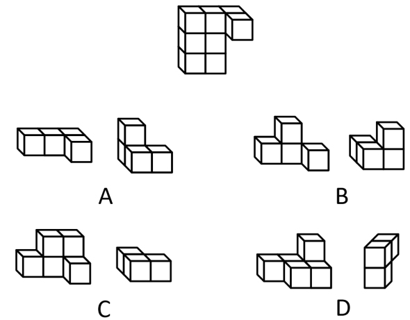
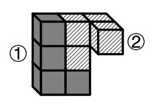
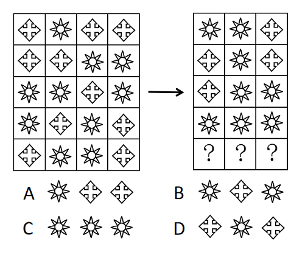
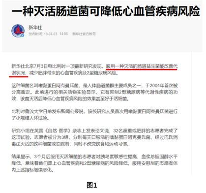
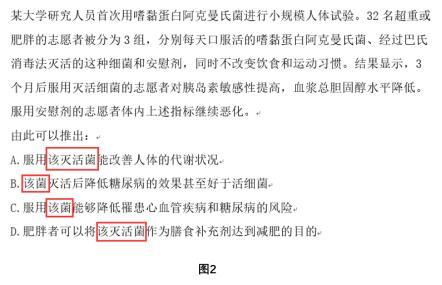

# 2021年湖南省公务员录用考试《行测》题（网友回忆版）

> 判断推理 · 40 题 · 湖南 2021

## 第 1 题　qid 3522626 · 图形推理

从所给四个选项中，选择最合适的一项填入问号处，使之呈现一定的规律性。

- **A**. A
- **B**. B　✅
- **C**. C
- **D**. D

**答案**：B

**官方解析**

元素组成不相同，且无明显属性规律，考虑数量规律。图形由若干白球和黑球组成，可以考虑分开看黑球和白球的数量。横行竖行单独看黑球数量和白球数量没有规律，且黑球均出现在九宫格的四角处，可以考虑“米”字型看。“米”字型的四条线上，除最中间的图形外，两端的黑球相加数量为10，两端白球数量相加为10，所以？处应为2个黑球，对应B项。

故正确答案为B。

备注：本题的框架参照我国古代文明图案“河图洛书”所命制（如下图），在河图上，排列成数阵的黑点和白点，蕴藏着无穷的奥秘；在洛书上，纵、横、斜三条线上的三个数字，其和皆等于15。本题选取的即是洛书的排列形式，因此考虑横向、纵向、斜向相加均为15也是可以的。

---

## 第 2 题　qid 3523525 · 图形推理

从所给的四个选项中，选择最合适的一个选项拼搭出题干中的图形。

- **A**. A　✅
- **B**. B
- **C**. C
- **D**. D

**答案**：A

**官方解析**

本题考查立体拼合。根据题干给出的立体图形可知该图形共由8个小立方体组成，观察选项发现，C、D两项均共有9个小正方体，与题干不符，排除；

再逐一分析剩下两个选项：

A项：将图①立起来，再将图②进行左右上下翻转，进行拼合即可得到题干立体图形，如图所示，当选；

B项：选项中包含两块凸起的小立方体，但是题干立体图形中只有一块小立方体是凸起的，所以无法得到题干立体图形，排除。

故正确答案为A。

---

## 第 3 题　qid 3523447 · 图形推理

若题干最左边的图形编号为1，其余图形的编号依次递增1，编号为90、91、92的图形应该是：

- **A**. A　✅
- **B**. B
- **C**. C
- **D**. D

**答案**：A

**官方解析**

该题为三个图形依次排列且呈周期性遍历，因此图1、图2、图3为一组，图4、图5、图6为一组······以此类推，当遇到3的倍数时恰好为完整的一组结束，因此90号应为上一组的最后一个图，即六面体，91、92为下一组的前两个图形，分别是圆柱、六面体。
故正确答案为A。

---

## 第 4 题　qid 3522641 · 图形推理

把下面的六个图形分为两类，使每一类图形都有各自的共同特征或规律，分类正确的一项是：

- **A**. ①②③，④⑤⑥
- **B**. ①②④，③⑤⑥
- **C**. ①③④，②⑤⑥　✅
- **D**. ①③⑥，②④⑤

**答案**：C

**官方解析**

本题为分组分类题目。元素组成不同，优先考虑属性规律。题干出现等腰元素，考虑对称性。①③④三个图形均有一条对称轴，仅为轴对称图形；②⑤⑥三个图形均有两条相互垂直的对称轴，既是轴对称图形也是中心对称图形。即①③④为一组，②⑤⑥为一组。
故正确答案为C。

---

## 第 5 题　qid 3523526 · 图形推理

根据①②③图形的变化规律，编号④的图形中空缺的数字应该是：

- **A**. 8
- **B**. 1
- **C**. 4　✅
- **D**. 2

**答案**：C

**官方解析**

元素组成不同，无明显属性规律，考虑数量规律。观察发现，四幅图均为数字，考虑数面。图①②③内数字中面的总数都是3，则图④内数字中面的总数也应是3，故问号处应选择有1个面的数字，只有C项符合。
故正确答案为C。

---

## 第 6 题　qid 3523454 · 图形推理

把下面的六个图形分为两类，使每一类图形都有各自的共同特征或规律，分类正确的一项是：

- **A**. ①②④，③⑤⑥
- **B**. ①③⑥，②④⑤　✅
- **C**. ①②⑤，③④⑥
- **D**. ①⑤⑥，②③④

**答案**：B

**官方解析**

本题为分组分类题目。元素组成不同，属性规律无答案，考虑数量规律。观察发现，题干出现了圆相交，多端点图形，考虑笔画数，题干笔画数依次为：1、7、1、3、4、1。根据是一笔画还是多笔画分为：①③⑥一组，②④⑤一组。
故正确答案为B。

---

## 第 7 题　qid 3523511 · 图形推理

右边四个小图形中，只有一个是由左边的四个图形拼合而成（只能通过上、下、左、右平移），请把它找出来。

- **A**. A
- **B**. B
- **C**. C　✅
- **D**. D

**答案**：C

**官方解析**

本题考查平面拼合，可采用平行且等长相消的方式解题。消去平行且等长的线段后进行组合即可得到轮廓图，即为C项。平行且等长相消的方式如下图所示：

故正确答案为C。

---

## 第 8 题　qid 3522441 · 图形推理

从所给的四个选项中，选择最合适的一个填入问号处，使之呈现一定的规律性：

- **A**. A
- **B**. B
- **C**. C
- **D**. D　✅

**答案**：D

**官方解析**

元素组成相同，优先考虑位置规律。观察发现，题干第一组图形中的两个白球在九宫格外圈整体顺时针平移2格，而两个“十字”在九宫格外圈整体顺/逆时针平移4格。第二组图形应遵循同样规律，只有D项满足。
故正确答案为D。

---

## 第 9 题　qid 3522632 · 图形推理

根据左右图形的变化规律，从所给四个选项中，选择最适合的一项填入问号处。

- **A**. A
- **B**. B　✅
- **C**. C
- **D**. D

**答案**：B

**官方解析**

元素组成相似，考虑样式规律。左右两侧宫格，每行均由和构成，且左侧到右侧图形个数、位置不同。由左侧的四列变为右侧的三列，考虑相邻两列做黑白运算。观察发现，每行相邻的两个图形做运算，左侧宫格第一列和第二列做运算等于右侧宫格第一列，左侧宫格第二列和第三列做运算等于右侧宫格第二列，左侧宫格第三列和第四列做运算等于右侧宫格第三列，即，，，。经验证，每一行均满足此运算规律；第五行按照此运算规律得到B项。

故正确答案为B。

---

## 第 10 题　qid 3523357 · 图形推理

把下面的图形分为两类，使每一类图形都有各自的共同特征或规律，分类正确的一项是：

- **A**. ①④⑥，②③⑤　✅
- **B**. ①③⑤，②④⑥
- **C**. ①②④，③⑤⑥
- **D**. ①⑤⑥，②③④

**答案**：A

**官方解析**

本题为分组分类题目。元素组成不同，无明显属性规律，考虑数量规律。观察发现，每幅图均有4个元素，且均存在两个相同元素，图①④⑥中相同元素都是相对的，图②③⑤中相同元素都是相邻的。即①④⑥为一组，②③⑤为一组。
故正确答案为A。

---

## 第 11 题　qid 3522628 · 定义判断

软暴力是指行为人为谋取不法利益或形成非法影响，对他人或者在有关场所进行滋扰、纠缠、哄闹、聚众造势等，足以使他人产生恐惧、恐慌进而形成心理强制，或者足以影响、限制人身自由、危及人身财产安全，影响正常生活、工作、生产、经营的违法犯罪手段。
根据上述定义，下列属于软暴力的是：

- **A**. 张某威胁王法官，如不秉公判案就举报其贪污的事实
- **B**. 甲公司为了在竞标中获胜，私下散布关于竞争对手的不利信息
- **C**. 某恶势力团伙为了向王某讨要赌债将其堵在酒店房间，24小时看守并不让其睡觉
- **D**. 网贷公司催收员长期使用群呼、群发短信、揭发隐私等手段滋扰欠款人及其紧急联系人、通讯录联系人　✅

**答案**：D

**官方解析**

第一步：找出定义关键词。

“为谋取不法利益或形成非法影响”、“对他人或者在有关场所进行滋扰、纠缠、哄闹、聚众造势”、“使他人产生恐惧、恐慌或影响、限制人身自由、危及人身财产安全，影响正常生活、工作、生产、经营的违法犯罪手段”。

第二步：逐一分析选项。

A项：张某威胁王法官秉公判案，不符合“为谋取不法利益或形成非法影响”，不符合定义，排除；

B项：甲公司为了在竞标中获胜，不符合“为谋取不法利益或形成非法影响”，不符合定义，排除；

C项：某恶势力将王某堵在房间不让其睡觉长达24小时，属于严重的人身强制行为，不属于“对他人或者在有关场所进行滋扰、纠缠、哄闹、聚众造势等”，不符合定义，排除；

D项：网贷公司使用群呼、群发、揭发隐私等手段滋扰欠款人及其紧急联系人、通讯录联系人，符合“对他人进行滋扰”，长期如此，符合“使他人产生恐惧、恐慌或影响”和“影响正常生活、工作、生产、经营的违法犯罪手段”，符合定义，当选。

故正确答案为D。

备注：下图中给出的示例，引自《光明日报》，该案是北京市首例网络“软暴力”的案件，与D项对应，而C项中的“24小时不让其睡觉”，直接限制了人身自由和行为且时间较长，二者比较，D项更符合定义。

---

## 第 12 题　qid 3523521 · 定义判断

生物浓缩，是指生物有机体或处于同一营养级上的许多生物种群，从周围环境中蓄积某种元素或难分解化合物，使生物有机体内该物质的浓度超过环境中该物质浓度的现象。
根据上述定义，以下涉及到生物浓缩的是：

- **A**. 农业上用于杀死昆虫的DDT通过食物链传递到白头鹰体内，导致生下的蛋皆是软壳的，无法孵化　✅
- **B**. 在湖泊、河流等地方出现的藻类及其他浮游生物迅速繁殖，水质恶化，鱼类及其他生物大量死亡的现象
- **C**. 山羊吃多玉米粒之后，一时间难以消化，再加上山羊饮入水后，玉米长时间聚集在胃内，容易引起胃胀
- **D**. 由于严重的白色污染，原本干净清洁的海滩，如今聚集了大量的塑料袋、瓶子等垃圾，以至于无人问津

**答案**：A

**官方解析**

第一步：找出定义关键词。
“生物有机体或处于同一营养级上的许多生物种群”、“从周围环境中蓄积某种元素或难分解化合物”、“使生物有机体内该物质的浓度超过环境中该物质浓度的现象”。
第二步：逐一分析选项。
A项：白头鹰体内，符合“生物有机体或处于同一营养级上的许多生物种群”，通过食物链传递导致白头鹰体内有DDT，符合“从周围环境中蓄积某种元素或难分解化合物”，白头鹰的蛋壳变软的原因在于有害化学物质DDT逐步在其体内积累的结果，符合“使生物有机体内该物质的浓度超过环境中该物质浓度的现象”，符合定义，当选；
B项：藻类和浮游生物迅速繁殖，鱼类及其他生物大量死亡，是因为鱼类生存所需的营养物质被藻类和浮游生物抢占了，不符合“使生物有机体内该物质的浓度超过环境中该物质浓度的现象”，不符合定义，排除；
C项：山羊吃多玉米粒之后，玉米聚集在胃里引起胃胀，不符合“使生物有机体内该物质的浓度超过环境中该物质浓度的现象”，不符合定义，排除；
D项：干净清洁的海滩受到白色污染，没有涉及生物有机体或者生物种群，不符合“生物有机体或处于同一营养级上的许多生物种群”，不符合定义，排除。
故正确答案为A。

---

## 第 13 题　qid 3522634 · 定义判断

相反相成修辞手法是指把通常相互对立、排斥的两个概念或判断巧妙地联系在一起，这样不仅能够揭示出存在于客观事物深层的矛盾辩证关系，还可以增加语言的意蕴。
根据上述定义，下列不属于相反相成修辞手法的是：

- **A**. 横眉冷对千夫指，俯首甘为孺子牛
- **B**. 有的人活着，他已经死了；有的人死了，他还活着
- **C**. 墙上芦苇，头重脚轻根底浅；山中竹笋，嘴尖皮厚腹中空　✅
- **D**. 这一天，死去的伟人在诗的国度里永生；这一天，活着的小丑在人们心上被埋葬

**答案**：C

**官方解析**

第一步：找出定义关键词。
“把通常相互对立、排斥的两个概念或判断巧妙地联系在一起”。
第二步：逐一分析选项。
A项：选项这句话意为对待敌人决不屈服，对人民大众甘愿服务。横眉和俯首是一个人的两个相互对立的态度，符合“把通常相互对立、排斥的两个概念或判断巧妙地联系在一起”，符合定义，排除； 
B项：选项这句话意为有的人虽然活着，但是他的道德败坏，就如已经死了一样没有价值，而有的人死了，他还活着，他的高尚的品格，代代相传，永远激励后人。活着和死了是一个人的两个相互对立的状态，符合“把通常相互对立、排斥的两个概念或判断巧妙地联系在一起”，符合定义，排除； 
C项：选项这句话用芦苇和竹笋比喻那些没有学问只会自吹自擂的人，芦苇和竹笋不符合“相互对立、排斥的两个概念或判断”，不符合定义，当选；
D项：选项这句话表达了不同类型的人在“这一天”的情况，死去和永生、活着和埋葬是一个人的两个相互对立的状态，符合“把通常相互对立、排斥的两个概念或判断巧妙地联系在一起”，符合定义，排除。
本题为选非题，故正确答案为C。

---

## 第 14 题　qid 3522624 · 定义判断

自豪是一种产生于对自己的积极评价的情绪，其主要依赖于自我意识、自我评价以及自我反思。基于对成就的不同归因，自豪可分为真实自豪和自大自豪。真实自豪是以成就为导向的一种积极的自豪情绪，其主要来源于个体将成就归因于自身的努力；自大自豪是指一种偏向于消极的自豪情绪，其主要来源于个体将成就归因于自身的天赋。
根据上述定义，下列最符合自大自豪的是：

- **A**. 兴酣落笔摇五岳，诗成笑傲凌沧州
- **B**. 黄金白璧买歌笑，一醉累月轻王侯
- **C**. 俱怀逸兴壮思飞，欲上青天揽明月
- **D**. 天生我材必有用，千金散尽还复来　✅

**答案**：D

**官方解析**

第一步：找出定义关键词。
“偏向于消极的自豪情绪”、“主要来源于个体将成就归因于自身的天赋”。
第二步：逐一分析选项。
A项：“兴酣落笔摇五岳，诗成笑傲凌沧州”出自李白（唐）的《江上吟》，意思是我高兴起来落笔能让五岳震动，写出来的诗足以笑傲天下，表达出作者对自身诗才的自信，其态度是积极的，不符合“偏向于消极的自豪情绪”，不符合定义，排除；
B项：“黄金白璧买歌笑，一醉累月轻王侯”出自李白（唐）的《忆旧游寄谯郡元参军》，意思是花黄金白璧买来宴饮与欢歌笑语时光，一次酣醉使我数月轻蔑王侯将相，作者借喝酒买醉后的情绪轻蔑王侯将相，不符合“主要来源于个体将成就归因于自身的天赋”，不符合定义，排除；
C项：“俱怀逸兴壮思飞，欲上青天揽明月”出自李白（唐）的《宣州谢朓楼饯别校书叔云》，意思是我们都怀有豪情逸兴、雄心壮志，酒酣兴发，更是飘然欲飞，想登上青天摘取明月，不符合“偏向于消极的自豪情绪”，也不符合“主要来源于个体将成就归因于自身的天赋”，不符合定义，排除；
D项：“天生我材必有用，千金散尽还复来”出自李白（唐）的《将进酒》，意思是上天造就了我的才干就必然是有用处的，千两黄金花完了也能够再次获得，该诗句为作者政治上遭遇挫折，符合“偏向于消极的自豪情绪”，有才能就一定有用处，符合“主要来源于个体将成就归因于自身的天赋”，符合定义，当选。
故正确答案为D。

---

## 第 15 题　qid 3522631 · 定义判断

农业生产周期指在连续不断的农业再生产过程中，从开始生产到获得产品的整个过程所经过的全部时间，在种植业中一般是从整地开始到产品收获所经过的全部时间，在畜牧业中一般是从饲养幼畜开始到获得畜产品的时间。由于作为农业生产对象的动植物有自身的特性，并且受自然环境影响较大，其生产周期一般比工业生产周期长。
根据上述定义，下列选项涉及农业生产周期的是：

- **A**. 小李耕地、播种、打枝、摘棉花、纺线、织布······年复一年，周而复始　✅
- **B**. 小黄办了一家乡镇企业，从原材料购进、生产管理再到产品销售，他都亲力亲为
- **C**. 小刘今年在承包的荒山种植优质苹果树苗，经科学管理，树苗全部成活且长势良好
- **D**. 小王有个养猪场，虽年复一年重复着把猪崽养大的简单枯燥劳动，但始终干劲十足

**答案**：A

**官方解析**

第一步：找出定义关键词。
“连续不断的农业再生产过程中，从开始生产到获得产品的整个过程所经过的全部时间”、“在种植业中一般是从整地开始到产品收获所经过的全部时间”、“在畜牧业中一般是从饲养幼畜开始到获得畜产品的时间”。
第二步：逐一分析选项。
A项：小李耕地、播种、打枝、摘棉花、纺线、织布……年复一年，周而复始，耕地符合“从整地开始”，“摘棉花”符合“产品收获”，整个流程符合“连续不断的农业再生产过程中，从开始生产到获得产品的整个过程所经过的全部时间”，符合定义，当选；
B项：小黄办企业，买进材料、生产产品、销售产品，属于工业生产活动，不符合“农业再生产过程中”，不符合定义，排除；
C项：小刘种苹果树苗长势良好，没有提到最终是否获得产品，也没有提到是否是连续不断种树苗，不符合“连续不断的农业再生产过程中，从开始生产到获得产品的整个过程所经过的全部时间”，不符合定义，排除；
D项：小王年复一年重复把猪崽养大，畜产品指的是畜牧业生产所获得的产品（包括乳、肉、蛋、毛、皮及其副产品），养大后的猪崽属于牲畜，不属于畜产品，因此最终并未获得畜产品，不符合定义，排除。
注：A项中的纺线、织布虽属于加工业，但前面的耕地到摘棉花涉及了完整的农业生产周期。而D项并未获得畜产品，生产周期不完整。考虑本题提问方式为“涉及”，只有A项涉及了完整的农业生产周期，因此择优选择A项。
故正确答案为A。

---

## 第 16 题　qid 3523437 · 定义判断

替代性创伤是指在听到或看到一些灾难性事件的信息后，损害程度超过其中部分人群的心理和情绪的耐受极限，产生与经历者等同的情绪、躯体反应的现象。
根据上述定义，下列现象属于替代性创伤的是：

- **A**. 乘客甲经历紧急故障迫降事件后从此再也不敢乘坐任何飞机
- **B**. 抗疫志愿者乙目睹新冠肺炎感染者遭受病痛折磨而严重失眠　✅
- **C**. 丙听朋友描述澳洲大火的细节之后反复梦见自己被大火吞噬
- **D**. 医生丁面对因医学技术上的局限而不能治愈的患者深感自责

**答案**：B

**官方解析**

第一步：找出定义关键词。
“在听到或看到一些灾难性事件的信息后”、“产生与经历者等同的情绪、躯体反应”。
第二步：逐一分析选项。
A项：乘客甲经历了灾难性事件，是经历者，不符合“在听到或看到一些灾难性事件的信息后”，也不符合“产生与经历者等同的情绪、躯体反应”，不符合定义，排除；
B项：抗疫志愿者乙目睹新冠肺炎感染者遭受病痛折磨，符合“在听到或看到一些灾难性事件的信息后”，严重失眠，符合“产生与经历者等同的情绪、躯体反应”，符合定义，当选；
C项：丙听朋友描述澳洲大火的细节，符合“在听到或看到一些灾难性事件的信息后”，但反复梦见自己被大火吞噬，做梦不属于情绪、躯体反应，不符合“产生与经历者等同的情绪、躯体反应”，不符合定义，排除；
D项：医生丁面对因医学技术上的局限而不能治愈的患者深感自责，不符合“在听到或看到一些灾难性事件的信息后”，也不符合“产生与经历者等同的情绪、躯体反应”，不符合定义，排除。
故正确答案为B。
经查询资料，本题C项应更符合创伤后应激障碍（PTSD），其中一个表现为患者的思维、记忆或梦中反复、不自主地涌现与创伤有关的情境或内容，也可出现严重的触景生情反应，甚至感觉创伤性事件好像再次发生一样。
由此可见C项更符合创伤后应激障碍，而不是替代性创伤。

---

## 第 17 题　qid 3522640 · 定义判断

涟漪效应是指在突发事件中，身处不同地区民众所呈现的不同心理状态，越靠近危机事件中心区域，人们对事件的风险认知和负性情绪越高。
根据上述定义，下列符合涟漪效应的是：

- **A**. 台风外围空气旋转剧烈，而处于中心的风力流动反而相对微弱，因此，灾民负性情绪从“暴风眼”区域向外逐渐增强
- **B**. 地震带上的重灾区民众在风险认知、心理健康水平及应对行为上都显著高于非重灾区民众　✅
- **C**. 距离垃圾焚烧厂、核反应堆越近的民众，其风险认知程度越高，因而其忧虑感越强
- **D**. 距离大规模传染疫情爆发的时间越短，民众的焦虑情绪及恐慌程度就越高

**答案**：B

**官方解析**

第一步：找出定义关键词。

“在突发事件中”、“身处不同地区民众所呈现的不同心理状态”、“越靠近危机事件中心区域，人们对事件的风险认知和负性情绪越高”。

第二步：逐一分析选项。

A项：灾民的负性情绪是从“暴风眼”区域向外逐渐增强的，不符合“越靠近危机事件中心区域，人们对事件的风险认知和负性情绪越高”，不符合定义，排除；

B项：地震符合“在突发事件中”，地震带上的重灾区民众在心理健康水平及应对行为上都显著高于非重灾区民众，符合“身处不同地区民众所呈现的不同心理状态”，虽未提及“负性情绪”，但也符合“越靠近危机事件中心区域，人们对事件的风险认知越高”，符合定义，当选；

C项：垃圾焚烧厂、核反应堆，不符合“在突发事件中”，不符合定义，排除；

D项：距离大规模传染疫情爆发的时间越短，是所有人都会面临的，没有体现身处不同地区，不符合“身处不同地区民众所呈现的不同心理状态”，不符合定义，排除。

故正确答案为B。

附原文说明：

---

## 第 18 题　qid 3522623 · 定义判断

化学沉积作用是指在水介质中，以胶体溶液和真溶液形式搬运的物质到达适宜场所后，当化学条件发生变化时，产生沉淀、堆积的过程。其中，胶体溶液是指含有一定大小的固体颗粒物质或高分子化合物的溶液，真溶液是指透明度较高的水溶液。
根据上述定义，下列不属于化学沉积作用的是：

- **A**. 干旱气候区，湖水很少外泄，蒸发作用使湖水的氯化钠增加、累积，变成咸水湖
- **B**. 当海水中的绿色粘土矿物随水流动时，会和含有铝、铁的胶体物质聚合形成海绿石
- **C**. 富含磷质的海水上升至浅海区，因压力减小，温度升高，磷质析出、沉积而形成磷矿
- **D**. 湖泊里的生物骨骼，它们吸收了空气中的二氧化碳形成碳酸钙，当碳酸钙浓度达到一定程度就在海底堆积下来，形成石灰岩　✅

**答案**：D

**官方解析**

第一步：找出定义关键词。

化学沉积作用：“水介质”、“以胶体溶液和真溶液形式搬运”、“当化学条件发生变化时，产生沉淀、堆积”；

胶体溶液：“含有一定大小的固体颗粒物质或高分子化合物的溶液”；

真溶液：“透明度较高的水溶液”。

第二步：逐一分析选项。

A项：湖水是水介质，符合“透明度较高的水溶液”，蒸发使湖水的氯化钠增加累积，变成咸水湖，即湖水搬运的最终物质是氯化钠，符合“当化学条件发生变化时，产生沉淀、堆积”，符合定义，排除；

B项：海水是水介质，符合“透明度较高的水溶液”，绿色粘土矿物随海水流动和含有铝、铁的胶体物质聚合形成海绿石，符合“以胶体溶液和真溶液形式搬运”、“当化学条件发生变化时，产生沉淀、堆积”，符合定义，排除；

C项：海水是水介质，符合“透明度较高的水溶液”，压力减小、温度升高导致磷质析出沉积形成磷矿，符合“以胶体溶液和真溶液形式搬运”、“当化学条件发生变化时，产生沉淀、堆积”，符合定义，排除；

D项：湖泊是水介质，符合“透明度较高的水溶液”，但生物骨骼最终形成的石灰岩不是在真溶液形式搬运下发生的沉淀、堆积，属于生物沉积作用，不符合“当化学条件发生变化时，产生沉淀、堆积”，不符合定义，当选。

本题是选非题，故正确答案为D。

备注：本题很多学生比较纠结A项和D项，如下图所示，A项是在“化学沉积”相关文献中的典型案例，通过对比择优，本题问“不属于”，故小粉笔更倾向把答案给到D项。

---

## 第 19 题　qid 3522630 · 定义判断

气候保险是一种为遭受气候风险的资产、生计和生命损失提供支持的保障机制，它通过在一个比较大的空间和时间范围内，投保者定期支付确定的小额保费来应对不确定的气候风险损失，能够确保遭遇直接气候风险损失的投保者获得有效和迅速的资金支持。
根据上述定义，下列属于气候保险承保范围的是：

- **A**. 天气异常干旱造成水稻大面积减产　✅
- **B**. 地震引发山体滑坡，掩埋了山下一处工厂
- **C**. 暴雪封路，导致大批牲畜得不到及时照料而被饿死
- **D**. 上游泄洪造成下游地区发生溃堤，导致当地农作物大面积毁损

**答案**：A

**官方解析**

第一步：找出定义关键词。
“遭受气候风险”、“资产、生计和生命损失”、“投保者定期支付确定的小额保费”、“遭遇直接气候风险损失”、“获得有效和迅速的资金支持”。
第二步：逐一分析选项。
A项：天气异常干旱，属于气候因素，符合“遭受气候风险”，造成水稻大面积减产，符合“资产、生计和生命损失”，且减产是天气异常直接导致的，符合“遭遇直接气候风险损失”，符合定义，当选；
B项：地震引发山体滑坡，属于地质灾害，不符合“遭受气候风险”，不符合定义，排除；
C项：暴雪封路，符合“遭受气候风险”，但最后大批牲畜死亡是得不到及时照料导致的，并非气候因素直接导致的，不符合“遭遇直接气候风险损失”，不符合定义，排除；
D项：上游泄洪造成下游地区发生溃堤，属于人为因素，不符合“遭受气候风险”，不符合定义，排除。
故正确答案为A。

---

## 第 20 题　qid 3523527 · 定义判断

背书品牌指出现在一个产品品牌与服务品牌背后的支持性品牌。背书品牌又叫做父母品牌，被背书的叫子品牌。分两类：一是硬背书品牌，采取企业总品牌子品牌形式。企业总品牌一般是有较长历史，较高知名度及无形资产价值的大品牌，子品牌需借助总品牌吸引消费者。二是软背书品牌，即子品牌前并不直接冠以背书品牌，子品牌是流通的主角，企业总品牌只是为子品牌提供信誉担保。

根据上述定义，下列属于硬背书品牌的是：

- **A**. 别克、欧宝、雪佛莱、凯迪拉克是通用汽车旗下四大主力品牌
- **B**. 某药企的产品都包含有“999”的品牌，如三九胃泰、999感冒灵　✅
- **C**. 浏阳河、京酒、金六福等产品包装上都没标明背书品牌五粮液
- **D**. 无论是潘婷、汰渍，还是舒肤佳，它们都是宝洁公司的产品

**答案**：B

**官方解析**

第一步：找出定义关键词。

背书品牌：“在一个产品品牌与服务品牌背后的支持性品牌”。

硬背书品牌：“总品牌子品牌形式”、“总品牌一般是有较长历史，较高知名度及无形资产价值的大品牌”、“子品牌需借助总品牌吸引消费者”。

软背书品牌：“子品牌前并不直接冠以背书品牌”、“子品牌是流通的主角”、“总品牌只是为子品牌提供信誉担保”。

第二步：逐一分析选项。

A项：别克、欧宝、雪佛莱、凯迪拉克是通用汽车旗下四大主力品牌，不符合“总品牌子品牌形式”、“子品牌需借助总品牌吸引消费者”，不符合定义，排除；

B项：“999”的品牌是总品牌，三九胃泰、999感冒灵是子品牌，符合“总品牌子品牌形式”，符合定义，当选；

C项：浏阳河、京酒、金六福等产品包装上都没标明背书品牌五粮液，符合“子品牌前并不直接冠以背书品牌”，属于软背书品牌，不符合定义，排除；

D项：潘婷、汰渍、舒肤佳都是宝洁公司的产品，不符合“总品牌子品牌形式”、“子品牌需借助总品牌吸引消费者”，不符合定义，排除。

故正确答案为B。

---

## 第 21 题　qid 3523523 · 类比推理

山有色：水发声

- **A**. 山河在：草木深
- **B**. 客舍青：柳色新
- **C**. 鸟飞绝：人踪灭
- **D**. 花作尘：鸟不惊　✅

**答案**：D

**官方解析**

第一步：判断题干词语间逻辑关系。
两个词语无明显的逻辑关系，考虑分开看。有色是对山的描述，发声是对水的描述。即后两个字是对第一个字的描述。
第二步：判断选项词语间逻辑关系。
A项：“在”是对“山河”的描述，“深”是对“草木”的描述，即第三个字是对前两个字的描述，与题干逻辑关系不一致，排除；
B项：“青”是对“客舍”的描述，“新”是对“柳色”的描述，即第三个字是对前两个字的描述，与题干逻辑关系不一致，排除；
C项：“飞绝”是对“鸟”的描述，即后两个字是对第一个字的描述，但是“灭”是对“人踪”的描述，即第三个字是对前两个字的描述，与题干逻辑关系不一致，排除；
D项：“作尘”是对“花”的描述，“不惊”是对“鸟”的描述，即后两个字是对第一个字的描述，与题干逻辑关系一致，当选。
故正确答案为D。

---

## 第 22 题　qid 3523522 · 类比推理

就地保护：易地保护

- **A**. 汽车爆胎：汽车漏油
- **B**. 防洪堤：绿化带
- **C**. 纯种繁育：杂交繁育　✅
- **D**. 销售提成：股份分红

**答案**：C

**官方解析**

第一步：判断题干词语间逻辑关系。
就地保护和易地保护是保护生物多样性的两种形式，二者为并列关系，且为并列中的矛盾关系。
第二步：判断选项词语间逻辑关系。
A项：汽车爆胎和汽车漏油均为汽车会出现的故障，二者为并列关系，但是汽车除了爆胎和漏油外还会出现其他故障，所以二者为并列中的反对关系，与题干逻辑关系不一致，排除；
B项：防洪堤是为了防止河流泛滥而建立的堤坝，而绿化带是为了起到绿化的作用，美化环境，二者构不成并列关系，与题干逻辑关系不一致，排除；
C项：纯种繁育是同一品种内进行后代繁育，杂交繁育是不同品种间进行后代繁育，二者为并列关系，且为并列中的矛盾关系，与题干逻辑关系一致，当选；
D项：销售提成与股份分红均为获得收入的两种形式，二者为并列关系，但是获得收入除了销售提成与股份分红外还有其他形式，所以二者为并列关系中的反对关系，与题干逻辑关系不一致，排除。
故正确答案为C。

---

## 第 23 题　qid 3522644 · 类比推理

少壮不努力：老大徒伤悲

- **A**. 不入虎穴：焉得虎子
- **B**. 己所不欲：勿施于人
- **C**. 不忘初心：方得始终　✅
- **D**. 若要人不知：除非己莫为

**答案**：C

**官方解析**

第一步：判断题干词语间逻辑关系。
因为 “少壮不努力”，所以“老大徒伤悲”，前者是因，后者是果，二者为因果关系。
第二步：判断选项词语间逻辑关系。
A项：“不入虎穴”是“焉得虎子”的充分条件，与题干逻辑关系不一致，排除；
B项：因果关系必定有先后性，因在前，果在后，“己所不欲”和“勿施于人”没有必然先后性，所以不是因果关系，与题干逻辑关系不一致，排除；
C项：因为“不忘初心”，所以“才得始终”，前者是因，后者是果，二者为因果关系，与题干逻辑关系一致，当选；
D项：“人不知”是“己莫为”的充分条件，与题干逻辑关系不一致，排除。
故正确答案为C。

---

## 第 24 题　qid 3522633 · 类比推理

风能：核能：资源

- **A**. 听筒：话筒：音乐
- **B**. 保姆：保安：家政
- **C**. 木柴：木炭：燃料　✅
- **D**. 包子：粽子：节庆

**答案**：C

**官方解析**

第一步：判断题干词语间逻辑关系。
风能是一种资源，核能是一种资源，二者为并列关系，且均与资源构成种属关系。
第二步：判断选项词语间逻辑关系。
A项：听筒、话筒是两种设备，二者为并列关系，但与音乐均不构成种属关系，与题干逻辑关系不一致，排除；
B项：保姆、保安是两种职业，二者为并列关系，但保安与家政不构成种属关系，与题干逻辑关系不一致，排除；
C项：木柴是一种燃料，木炭是一种燃料，二者为并列关系，且均与燃料构成种属关系，与题干逻辑关系一致，当选；
D项：包子、粽子是两种食物，二者为并列关系，但与节庆均不构成种属关系，与题干逻辑关系不一致，排除。
故正确答案为C。

---

## 第 25 题　qid 3522627 · 类比推理

洪涝：干旱：防洪抗旱

- **A**. 地震：海啸：抗震救灾
- **B**. 滑坡：雪崩：道路抢修
- **C**. 严寒：酷热：防冻消暑　✅
- **D**. 风沙：雾霾：防沙除霾

**答案**：C

**官方解析**

第一步：判断题干词语间逻辑关系。
洪涝与干旱，二者为反义关系，且防洪与抗旱分别是前两种现象针对性的应对方法，与前两词构成对应关系。
第二步：判断选项词语间逻辑关系。
A项：地震与海啸，二者并不是反义关系，抗震是地震的应对方法，但救灾范围太大，与海啸对应关系并不贴切，与题干逻辑关系不一致，排除；
B项：滑坡与雪崩，二者并不是反义关系，且滑坡与雪崩都可能需要进行道路抢修，与题干逻辑关系不一致，排除；
C项：严寒与酷热，二者为反义关系，防冻是严寒的应对方法，消暑是酷热的应对方法，是两种现象的应对方式，与题干逻辑关系一致，当选；
D项：风沙与雾霾，二者并不是反义关系，与题干逻辑关系不一致，排除。
故正确答案为C。
注：本题有同学通过自然灾害选了D，这也是个角度，但是从题干特征来看，本题题干前两词反义关系明显，故优先考虑反义关系，不行的情况下再考虑是否是自然灾害，做题的首要原则是题干特征。

---

## 第 26 题　qid 3522635 · 类比推理

叔侄：关系：血亲

- **A**. 银河：恒星：宇宙
- **B**. 姑嫂：亲人：家庭
- **C**. 课堂：知识：书本
- **D**. 抑郁：疾病：心理　✅

**答案**：D

**官方解析**

第一步：判断题干词语间逻辑关系。
叔侄是一种关系，血亲是关系种类的限定，三者之间存在种属关系。
第二步：判断选项词语间逻辑关系。
A项：银河和恒星都是宇宙的一部分，银河和恒星分别与宇宙为组成关系，与题干逻辑关系不一致，排除；
B项：姑嫂是家庭的一部分，二者为组成关系，与题干逻辑关系不一致，排除；
C项：课堂和书本都是获取知识的载体，课堂和书本分别与知识为载体对应关系，与题干逻辑关系不一致，排除；
D项：抑郁是一种疾病，心理是疾病种类的限定，三者之间存在种属关系，与题干逻辑关系一致，当选。
故正确答案为D。

---

## 第 27 题　qid 3522629 · 类比推理

党员：干部：服务人民

- **A**. 青年：才俊：报效国家　✅
- **B**. 科学：精英：科技立身
- **C**. 大国：工匠：技术强国
- **D**. 学校：教师：教书育人

**答案**：A

**官方解析**

第一步：判断题干词语间逻辑关系。
有的党员是干部，有的党员不是干部，有的干部是党员，有的干部不是党员，二者为交叉关系，党员和干部都是服务人民的主体，与服务人民是对应关系。
第二步：判断选项词语间逻辑关系。
A项：有的青年是才俊，有的青年不是才俊，有的才俊是青年，有的才俊不是青年，二者为交叉关系，青年和才俊都是报效国家的主体，与报效国家是对应关系，与题干逻辑关系一致，当选；
B项：科学和精英不是交叉关系，且科学不是科技立身的主体，与题干逻辑关系不一致，排除；
C项：大国和工匠不是交叉关系，且大国不是技术强国的主体，与题干逻辑关系不一致，排除；
D项：学校是教师的工作地点，二者不是交叉关系，且学校也不是教书育人的主体，与题干逻辑关系不一致，排除。
故正确答案为A。

---

## 第 28 题　qid 3523528 · 类比推理

二氧化碳：珊瑚骨骼：腐蚀

- **A**. 物种灭绝：动物：威胁
- **B**. 天灾人祸：物种：减少
- **C**. 土壤沙化：空气：雾霾
- **D**. 气候变暖：冰川：消融　✅

**答案**：D

**官方解析**

第一步：判断题干词语间逻辑关系。
“二氧化碳”会“腐蚀”“珊瑚骨骼”，题干为因果对应关系。
第二步：判断选项词语间逻辑关系。
A项：“物种灭绝”本身就包含“动物”被“威胁”的意思，与题干逻辑关系不一致，排除；
B项：“天灾人祸”会“减少”“物种”，为因果对应关系，与题干逻辑关系一致，保留；
C项：“土壤沙化”会导致“雾霾”，与题干逻辑关系不一致，排除；
D项：“气候变暖”会“消融”“冰川”，与题干逻辑关系一致，保留。
对于BD两项，题干的“二氧化碳”和D项的“气候变暖”只是独立的一个原因，但B项的原因可以拆分为“天灾”和“人祸”两个原因，因此D项与题干更为一致。
故正确答案为D。

---

## 第 29 题　qid 3522617 · 类比推理

绵羊 对于 （    ） 相当于 （    ） 对于 高粱

- **A**. 麻雀 水稻
- **B**. 老鹰 麦子
- **C**. 羚羊 玉米　✅
- **D**. 山羊 玫瑰

**答案**：C

**官方解析**

逐一代入选项。
A项：绵羊与麻雀都是动物，但绵羊是哺乳动物，而麻雀是鸟类，二者范畴不一致，高粱与水稻都是粮食作物，二者为并列关系，前后逻辑关系不一致，排除；
B项：绵羊与老鹰都是动物，但绵羊是哺乳动物，而老鹰是鸟类，二者范畴不一致，高粱与麦子都是粮食作物，二者为并列关系，前后逻辑关系不一致，排除；
C项：绵羊与羚羊都是反刍类哺乳动物，二者为并列关系，高粱与玉米都是粮食作物，二者为并列关系，前后逻辑关系一致，当选；
D项：绵羊与山羊都是反刍类哺乳动物，二者为并列关系，高粱与玫瑰都是植物，但高粱是粮食作物，玫瑰是观赏性植物，二者范畴不一致，前后逻辑关系不一致，排除。
故正确答案为C。

---

## 第 30 题　qid 3522642 · 类比推理

（    ） 对于 汽车 相当于 （    ） 对于 相机

- **A**. 轮胎 手机
- **B**. 速度 像素
- **C**. 马达 快门　✅
- **D**. 单车 单反

**答案**：C

**官方解析**

逐一代入选项。
A项：轮胎是汽车的组成部分，二者是组成关系，手机和相机是两种电子设备，二者是并列关系，前后逻辑关系不一致，排除；
B项：速度是衡量汽车行驶快慢的指标，二者是必然对应关系，像素是相机中衡量清晰度的指标，但它只适用于数码相机，胶片相机不涉及像素这一概念，二者是或然对应关系，前后逻辑关系不一致，排除；
C项：马达是汽车的组成部分，二者是组成关系，快门是相机的组成部分，二者是组成关系，而且均是必然组成关系，前后逻辑关系一致，当选；
D项：单车和汽车是两种交通工具，二者是并列关系，单反的全称是单镜头反光相机，它是相机的一种，二者是种属关系，前后逻辑关系不一致，排除。
故正确答案为C。

---

## 第 31 题　qid 3522647 · 逻辑判断

研究表明，肉食中的化合物可能引发部分儿童气喘，进而导致哮喘或其他呼吸道疾病。这些化合物被称作“晚期糖基化终产物”，是肉类在高温烤炸烘焙时释放出的物质。所以，素食或者少吃肉可避免儿童患哮喘的风险。
以下哪项如果为真，最能质疑上述观点？

- **A**. 肉类在非高温烤炸烘焙情况下，不产生晚期糖基化终产物，与哮喘的关联性未知
- **B**. 科学家研究显示，体内的晚期糖基化终产物主要来自于但又并非仅仅来自于肉类　✅
- **C**. 晚期糖基化终产物除导致哮喘外，还能加速人体衰老，引发各种慢性退化性疾病
- **D**. 晚期糖基化终产物作为一种蛋白质，在人体中自然生成，并随着年龄的增长不断积聚

**答案**：B

**官方解析**

第一步：找出论点和论据。
论点：素食或者少吃肉可避免儿童患哮喘的风险。
论据：肉食中的化合物可能引发部分儿童气喘，进而导致哮喘或其他呼吸道疾病。这些化合物被称作“晚期糖基化终产物”，是肉类在高温烤炸烘焙时释放出的物质。
论据提出肉类烤炸烘焙时产生的晚期糖基化终产物可能引发部分儿童哮喘，论点认为素食或者少吃肉可避免儿童患哮喘的风险，二者话题一致，削弱优先考虑否定论点。
第二步：逐一分析选项。
A项：非高温烤炸烘焙肉类与哮喘关联性未知，因此素食或者少吃肉能否避免儿童患哮喘的风险并不明确，不明确选项，排除；
B项：指出晚期糖基化终产物并非仅仅来自于肉类，说明其他途径也会产生晚期糖基化终产物，只是素食或者少吃肉并不能“避免”儿童患哮喘的风险，可以削弱，保留；
C项：指出晚期糖基化终产物会带来其他不好的作用，与素食或者少吃肉可避免儿童患哮喘的风险无关，无法削弱，排除；
D项：指出晚期糖基化终产物在人体中自然生成，说明晚期糖基化终产物不是仅通过吃肉得到的，人体本身也会产生该物质，只是素食或者少吃肉并不能“避免”儿童患哮喘的风险，可以削弱，保留；
对比B、D两项，B、D两项都是从除了肉类之外还有其他途径会产生晚期糖基化终产物的角度来进行削弱；但题干论点是素食或者少吃肉可避免“儿童”患哮喘，D项的潜台词是人年龄越来越大，晚期糖基化终产物不断积聚，可能避免不了得哮喘，问题是到多大年纪，积聚了多少，才会得哮喘呢？如果是积聚到儿童阶段，就会得哮喘，那能削弱论点，说明素食或者少吃肉不可避免“儿童”患哮喘；但如果积聚到中老年阶段，才会得哮喘，那就与论点主体无关了，不确定素食或者少吃肉能不能避免“儿童”阶段患哮喘，综上所述B项比D项更明确。
故正确答案为B。

---

## 第 32 题　qid 3522651 · 类比推理

动物园中有三种动物：骆驼、大象和猴子，它们的年龄均为整数。三个伙伴小张、小王和小李去动物园参观动物，他们各选择一种动物去参观，三人选的动物各不相同。已知：
①大象住在动物园东边的动物馆；
②骆驼已经4岁，住在西边的动物馆；
③小王去看的是动物园东边和西边之间的动物；
④小张去看的动物年龄最小；
⑤三种动物年龄从西到东依次增加，且平均年龄为5岁。
以下说法正确的是：

- **A**. 猴子年龄为5岁　✅
- **B**. 大象年龄为7岁
- **C**. 小王参观的是大象
- **D**. 小李参观的是骆驼

**答案**：A

**官方解析**

第一步：分析题干条件。
（1）骆驼、大象和猴子的年龄均为整数；
（2）大象住在动物园东边；
（3）骆驼4岁，住在动物园西边；
（4）小王看的是动物园东边和西边之间的动物；
（5）小张去看的动物年龄最小；
（6）三种动物年龄从西到东依次增加，且平均年龄为5岁。
第二步：根据题干条件进行推理。
根据条件（2）（3）和（4），大象住东边，骆驼住西边，可知住动物园东边和西边之间的动物是猴子，则小王看的是猴子，排除C项；根据条件（6）可知，三种动物的年龄排序从小到大为骆驼、猴子和大象，结合条件（5）可知小张看的是骆驼，排除D项；根据条件（3）可知骆驼4岁，根据（1）和条件（6）可知，猴子的年龄为5岁，大象的年龄为6岁，排除B项。
故正确答案为A。

---

## 第 33 题　qid 3523362 · 逻辑判断

某大学研究人员首次用嗜黏蛋白阿克曼氏菌进行小规模人体试验。32名超重或肥胖的志愿者被分为3组，分别每天口服活的嗜黏蛋白阿克曼氏菌、经过巴氏消毒法灭活的这种细菌和安慰剂，同时不改变饮食和运动习惯。结果显示，3个月后服用灭活细菌的志愿者对胰岛素敏感性提高，血浆总胆固醇水平降低。服用安慰剂的志愿者体内上述指标继续恶化。
由此可以推出：

- **A**. 服用该灭活菌能改善人体的代谢状况　✅
- **B**. 该菌灭活后降低糖尿病的效果甚至好于活细菌
- **C**. 服用该菌能够降低罹患心血管疾病和糖尿病的风险
- **D**. 肥胖者可以将该灭活菌作为膳食补充剂达到减肥的目的

**答案**：A

**官方解析**

日常结论题，根据题干信息逐一分析选项。

A项：根据试验结果可知，服用该灭活细菌可以降低血浆总胆固醇水平，而服用安慰剂的一组这一指标持续恶化，说明服用该灭活细菌可以改善以上指标，由于血浆总胆固醇水平是人体的代谢指标之一，所以可以合理推出服用该灭活细菌能改善人体的代谢状况，当选；

B项：在题干的试验结果中，没有对比服用灭活细菌和服用活细菌的试验结果，所以无法得出将这两组进行比较的相关结论，无中生有，排除；

C项：在题干的试验结果中，只提及了服用灭活细菌和安慰剂之后的结果，并未提及服用“活细菌”之后的结果，所以无法得出服用“该菌（即活细菌）”能够降低罹患心血管疾病和糖尿病的风险，排除；

D项：在题干的试验结果中，只说明了胰岛素敏感性和血浆总胆固醇水平的相关结果，这两者与“减肥”都没有必然关系，不能合理推出，排除。

故正确答案为A。

注：本题题干用“活细菌”、“灭活细菌”、“安慰剂”三者做试验，却只给出“灭活细菌”和“安慰剂”的结果，没有给出“活细菌”的结果，而C项直接说服用“该菌”的结果，属于无中生有，这是本题的坑点所在。

A选项在相关原文中表述如下图1，通过原文不难发现，文段的主题词是“灭活菌”，而非“活细菌”；另外如下图2所示，选项的用词很讲究，如果想说灭活菌，就会直接表述成“该灭活菌”，而B、C两项的“该菌”，其实就是指“活细菌”，故小粉笔倾向把答案给到A项。

---

## 第 34 题　qid 3522415 · 逻辑判断

黑洞其实并不“黑”，它会以黑体热辐射的形式向外辐射能量，放出极其微弱的光（电磁波），这种光被称为“霍金辐射”。因为“霍金辐射”会释放出能量，所以黑洞会逐渐变小，直至最后消失（黑洞蒸发）。有科学家认为，“霍金辐射”中不含有信息，也就是说被黑洞吞噬的物体信息会消失。
以下说法如果为真，最能支持上述科学家观点的是：

- **A**. 黑洞的表面就像“全息图的底片”，保存着黑洞内部所含的一切信息
- **B**. 根据量子物理学的信息守恒定律，信息在任何条件下都不会完全消失
- **C**. 任何携带信息的物质被黑洞吞噬后，从黑洞释放出的热辐射不携带任何信息　✅
- **D**. 黑洞引力极强，任何物质被它吞噬都无法逃逸，连光也不能幸免，因此无法确认被吞噬的物体信息

**答案**：C

**官方解析**

第一步：找出论点和论据。
论点：“霍金辐射”中不含有信息，也就是说被黑洞吞噬的物体信息会消失。
论据：无。
本文只有论点，因此优先考虑补充论据的形式来加强，考虑原因解释或举例子。
第二步：逐一分析选项。
A项：黑洞表面保存着黑洞内部的所有信息，说明被黑洞吞噬的物体信息不会消失，为削弱项，无法加强，排除；
B项：选项说信息不会完全消失，否定论点中的被黑洞吞噬的物体信息会消失，削弱项，无法加强，排除；
C项：选项解释了被黑洞吞噬的物体信息会消失，补充论据进行加强，当选；
D项：选项说明无法明确物体信息，属于不明确选项，无法加强，排除。
故正确答案为C。

---

## 第 35 题　qid 3522385 · 逻辑判断

某科学家在一个宇宙科学网站上刊载了一项成果，该成果宣称找到了地球生命来自彗星的“证据”，引发了广泛关注。他声称在一块坠落到斯里兰卡的陨石里找到了微观硅藻化石，该石头有着疏松多孔的结构，密度比在地球上找到的所有东西都低。他推断这是一颗彗星的一部分，并指出样本中找到的微观硅藻化石与恐龙时代留存下来的化石中的微观有机体类似，从而为彗星胚种论提供了强有力的证据。
以下哪项如果为真，最能反驳该科学家的观点？

- **A**. 发表该成果的网站缺乏可信性，所载论文良莠不齐，有些曾沦为笑柄
- **B**. 该科学家是彗星胚种论的狂热支持者，曾宣称SARS和流感来自彗星
- **C**. 该成果配图中被标示成“丝状硅藻”的东西实际上只是硅藻细胞断片
- **D**. 该成果根本无法证明该石头是碳质球粒陨石，甚至难以确定其是陨石　✅

**答案**：D

**官方解析**

第一步：找出论点和论据。
论点：地球生命来自彗星。
论据：一块坠落到斯里兰卡的陨石里找到了微观硅藻化石，该石头有着疏松多孔的结构，密度比在地球上找到的所有东西都低。他推断这是一颗彗星的一部分，并指出样本中找到的微观硅藻化石与恐龙时代留存下来的化石中的微观有机体类似，从而为彗星胚种论提供了强有力的证据。
本题的论据说的是陨石找到的微观硅藻化石与恐龙时代留存下来的化石中的微观有机体类似，同时该研究还推断该陨石是一颗彗星的一部分，即说明该陨石（彗星的一部分）与生命有关系，而论点说的是地球生命来自彗星，所以，二者讨论话题一致，削弱可以考虑削弱论点，也可以考虑削弱论据。
第二步：逐一分析选项。
A项：该成果的网站缺乏可信性，所载论文良莠不齐，代表不了这次实验成果的可靠性，属于无关项，排除；
B项：只是说该科学家是彗星胚种论的狂热支持者，支持者说的话无法辨别真假，同时即便SARS和流感来自彗星，也无法判断生命是否来源于彗星，不明确选项，排除；
C项：选项是说配图中的东西本质是硅藻细胞断片，一定程度上质疑了题干研究成果的可信性，可能削弱论据，保留；
D项：该成果根本无法证明该石头是陨石，直接质疑了论据的研究成果，直接削弱论据，保留。
对比C、D两项：C项为可能削弱论据，D项为直接削弱论据，D项当选。
故正确答案为D。

---

## 第 36 题　qid 3523364 · 逻辑判断

普通消费者囿于专业弱势群体的地位无从对错误或失真的负面信息进行有效甄别，即便企业努力澄清，但在当前“好事不出门，坏事传千里”的舆论传播环境下，强烈的记忆效应将使得追求风险规避的人们很难改变原有的错误认知，他们仍然会将之作为未来相当长一段时间内的消费决策指南，致使某些守法企业的“不白之冤”难以澄清，也给企业带来了严重损失。
以下哪项如果为真，最能削弱上述观点？

- **A**. 传媒利用其便利且易与大众认知结构相契合的特点向社会普及专业知识
- **B**. 监管部门为企业建立信用档案，为消费者提供企业情况的动态信息全景　✅
- **C**. 那些有过“前科”但力图“改过自新”的企业很难回归正常的交易轨道
- **D**. 不良声誉一旦成为社会的集体记忆，在公众的认知中就会有很强的粘性

**答案**：B

**官方解析**

第一步：找出论点和论据。
论点：某些守法企业的“不白之冤”难以澄清，给企业带来了严重损失。
论据：普通消费者囿于专业弱势群体的地位无从对错误或失真的负面信息进行有效甄别······强烈的记忆效应将使得追求风险规避的人们很难改变原有的错误认知，他们仍然会将之作为未来相当长一段时间内的消费决策指南。
本题论点论据话题一致，讨论的都是普通消费者无法对错误或失真的负面信息不能有效甄别，最终会导致企业的“不白之冤”难以澄清，给企业带来损失。削弱优先考虑削弱论点，即守法企业的“不白之冤”可以澄清，不会给企业带来严重损失。
第二步：逐一分析选项。
A项：指出传媒向社会普及专业知识，但无法判断专业知识的具体内容是什么，也无法判断专业知识是否可以改变原有的错误认知，属于不明确项，无法削弱，排除；
B项：指出监管部门为企业建立信用档案和为消费者提供企业情况的动态信息全景，说明普通消费者可以通过该档案了解真实情况，企业的“不白之冤”可以澄清，削弱论点，当选；
C项：题干论点讨论的是某些“守法企业”的不白之冤难以澄清，而C项的主体是有过“前科”的企业，讨论主体不一致，排除；
D项：指出不良声誉一旦成为社会的集体记忆，在公众的认知中就会有很强的粘性，说明强烈的记忆效应将使得人们很难改变原有的错误认知，企业的“不白之冤”难以澄清，具有加强作用，无法削弱，排除。
故正确答案为B。

---

## 第 37 题　qid 3522407 · 逻辑判断

慢性疲劳综合征危害极大，它使人在正常的工作后感到极度疲劳，怎么休息也无济于事。这种疾病过去不能通过验血或其他检查得出明确的生物指标，因此其病因历来被归为心理因素。最近，研究人员对诊断为慢性疲劳综合征的48名患者和39名健康志愿者的大便和血液样本进行研究后得出结论：肠道细菌和血液中的致炎因子可能与该疾病有关。
以下哪项如果为真，最不能支持上述结论？

- **A**. 该疾病患者的大便样本中肠道细菌的多样性较低且抗炎细菌较少
- **B**. 该疾病患者的血液样本中被检测出致炎因子，而健康志愿者没有
- **C**. 目前不确定肠道细菌是导致该疾病的原因还是该疾病导致的结果
- **D**. 最新研究表明饮食治疗和益生菌等无助于为该疾病患者缓解疲劳　✅

**答案**：D

**官方解析**

第一步：找出论点和论据。
论点：肠道细菌和血液中的致炎因子可能与慢性疲劳综合征有关。
论据：无。
首先注意本题问的是“······最不能支持上述结论？”，我们的做题思路是找出哪些是能支持的排除，如果不能支持的选项中出现无关选项，不明确选项和削弱选项，首选削弱项。
第二步：逐一分析选项。
A项：患者的肠道细菌多样性低且抗炎细菌较少，说明了肠道细菌可能与该疾病有关，为题干中论点补充了论据，属于加强选项。题干问的是最不能支持的，排除；
B项：患者的血液样本中有致炎因子，而健康志愿者没有，说明了血液中的致炎因子可能与该疾病有关，补充论据，属于加强选项。题干问的是最不能支持的，排除；
C项：不确定肠道细菌是病因还是该疾病导致的结果，但无论是原因还是结果，都能证明肠道细菌与该疾病确实有关，属于加强选项，题干问的是最不能支持的，排除；
D项：饮食治疗和益生菌对缓解患者疲劳无用，与题干论点无关，不能加强，当选。 
本题为选非题，故正确答案为D。

---

## 第 38 题　qid 3522463 · 逻辑判断

长期生活不规律会导致免疫细胞和胆固醇积聚在血管壁上，变成粥样斑块。这些斑块破碎时会形成血栓，血栓有可能脱落，沿血管流动。由于牙周病菌是一种厌氧菌，而血管中有大量氧气，因此牙周病菌单独进入血管并不能存活。但是，因为免疫细胞能够有效隔绝血管中的氧气，所以人们认为牙周病菌能把免疫细胞当作交通工具，借此移动至身体各处。
以下哪项如果为真，最能加强上述论证？

- **A**. 生活不规律会使体内产生大量胆固醇和厌氧菌
- **B**. 血栓脱落会导致血管不通顺阻碍牙周病菌移动
- **C**. 免疫细胞的整体内环境不会造成牙周病菌失活　✅
- **D**. 牙周病菌对身体血管健康的影响是公认的

**答案**：C

**官方解析**

第一步：找出论点和论据。
论点：牙周病菌能把免疫细胞当作交通工具，借此移动至身体各处。
论据：牙周病菌是一种厌氧菌，而血管中有大量氧气，免疫细胞能够有效隔绝血管中的氧气。
本题论点讨论的是免疫细胞帮助牙周病菌移动至身体各处，论据讨论的是免疫细胞帮助牙周病菌隔绝血管中的氧气，都在讨论免疫细胞帮助牙周病菌移动，话题一致，且问法为“加强论证”，加强优先考虑必要条件。
第二步：逐一分析选项。
A项：论点说的是免疫细胞帮助牙周病菌移动至身体各处，该项说的是生活不规律的危害，话题不一致，无法加强，排除；
B项：血栓脱落会导致血管不通顺阻碍牙周病菌移动，血栓阻碍了流通，那牙周病菌也无法移动，免疫细胞就无法帮助牙周病菌移动至身体各处，削弱项，无法加强，排除；
C项：免疫细胞的整体内环境不会造成牙周病菌失活，如果免疫细胞的整体内环境会造成牙周病菌失活，那免疫细胞就无法帮助牙周病菌移动至身体各处，因此该项是题干结论能够成立的必要条件，可以加强，当选；
D项：论点说的是免疫细胞帮助牙周病菌移动至身体各处，该项说的是牙周病菌对身体血管健康的影响，话题不一致，无法加强，排除。
故正确答案为C。

---

## 第 39 题　qid 3522620 · 逻辑判断

许多人在拍照时喜欢摆出“剪刀手”动作。对此，有人认为，如果手离镜头足够近，相机分辨率足够高，拍出的照片一旦上网，黑客就能通过照片放大技术和人工智能增强技术将照片中的人物指纹信息还原出来。这会让指纹认证及个人身份信息无密可保。因此，拍照时摆出“剪刀手”动作存在安全风险。
以下哪项如果为真，最能质疑上述结论?

- **A**. 目前智能手机虽在高速发展，但是分辨率还不足以拍出清晰的指纹
- **B**. 即使是高清网传照片，通过它还原指纹信息也存在一定的技术门槛
- **C**. 实验证明，网络照片受自身清晰度影响不满足识别指纹信息的条件　✅
- **D**. 从电子照片中提取到用户指纹信息的相关报道，实为愚人节新闻

**答案**：C

**官方解析**

第一步：找出论点和论据。
论点：拍照时摆出“剪刀手”动作存在安全风险。
论据：如果手离镜头足够近，相机分辨率足够高，拍出的照片一旦上网，黑客就能通过照片放大技术和人工智能增强技术将照片中的人物指纹信息还原出来。这会让指纹认证及个人身份信息无密可保。
本题论点讨论的是拍照时摆出“剪刀手”动作存在安全风险，论据讨论的是拍照时摆出“剪刀手”动作会把指纹呈现在照片中，上传到网络后黑客会通过各种技术还原指纹信息，使得指纹认证和个人身份信息无密可保，都是在说手离镜头足够近，会带来安全风险，话题一致，削弱优先考虑削弱论点。
第二步：逐一分析选项。
A项：该项说的是智能手机的分辨率还不足以拍出清晰的指纹，但不明确黑客能否通过一系列技术把指纹信息还原出来并带来安全风险，属于不明确选项，无法削弱，排除；
B项：该项讨论的是通过高清网传照片还原指纹信息存在一定的技术门槛，说明还原指纹信息困难，但是没有明确黑客最终能否通过技术还原指纹并带来安全风险，属于不明确选项，无法削弱，排除；
C项：该项指出网络照片受自身清晰度影响不满足识别指纹信息的条件，从而说明拍照时摆出“剪刀手”动作不会存在安全风险，可以削弱题干论点，当选；
D项：该项说的是这些报道实为愚人节新闻，但不明确拍照时摆出“剪刀手”动作能否带来安全风险，属于不明确选项，无法削弱，排除。
故正确答案为C。

---

## 第 40 题　qid 3522622 · 逻辑判断

AI助手在医学应用上有着明显的优势：放射科医生每天要阅读并分析大量的影像，医生会因为疲劳导致效率降低，AI助手则不会，它甚至比人眼能更加迅捷地找到影像中的可疑病变，帮助医生做出初步诊断。
 以下哪项如果为真，最能支持上述结论?

- **A**. 甲医院医生借助AI技术将疑难影像分类归档
- **B**. 乙医院呼吸科借助AI助手完成了一次远程会诊
- **C**. 丙医院放射科利用AI技术半天就可完成对200多个患者的影像诊断　✅
- **D**. 丁医院借助AI助手检测出远程会诊患者胸腔部位的异常征象，并为其确定治疗方案

**答案**：C

**官方解析**

第一步：找出论点和论据。
论点：AI助手在医学应用上有着明显的优势。
论据：放射科医生每天要阅读并分析大量的影像，医生会因为疲劳导致效率降低，AI助手则不会，它甚至比人眼能更加迅捷地找到影像中的可疑病变，帮助医生做出初步诊断。
本题论据讨论的是AI助手与医生相比更不会疲劳、效率更高，可以更快帮助医生做出诊断，论点讨论的是AI助手有着明显的优势，论点和论据话题一致，加强优先考虑补充论据。
第二步：逐一分析选项。
A项：甲医院医生借助AI助手将影像分类归档，但是并未和人类医生做比较，故无法判断AI助手是否在医学应用上有着明显的优势，无法加强，排除；
B项：乙医院借助AI助手完成了一次远程会诊，但是并未和人类医生做比较，故无法判断AI助手是否在医学应用上有着明显的优势，无法加强，排除；
C项：丙医院的放射科利用AI技术半天就可完成200多个患者的诊断，体现了AI助手不会疲惫，能更快帮助医生做出初步诊断，补充论据，可以加强，当选；
D项：丁医院借助AI助手完成对患者的诊断并确定治疗方案，但是并未和人类医生做比较，故无法判断AI助手是否在医学应用上有着明显的优势，无法加强，排除。
故正确答案为C。

---
