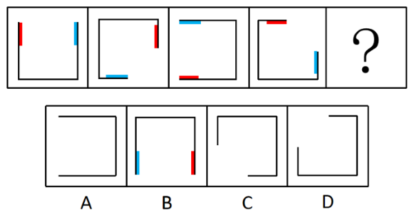
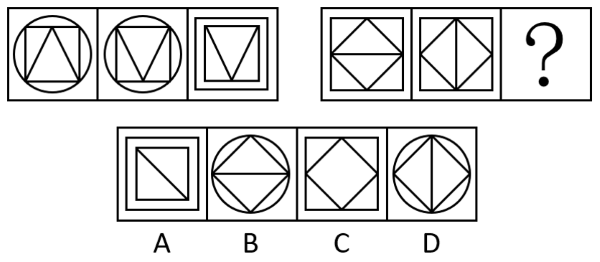
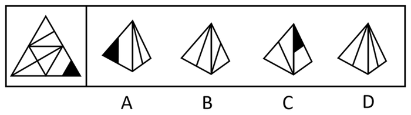
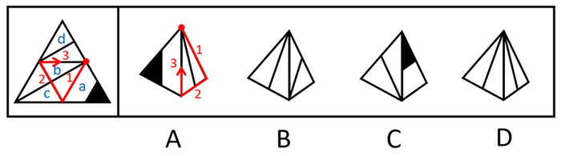
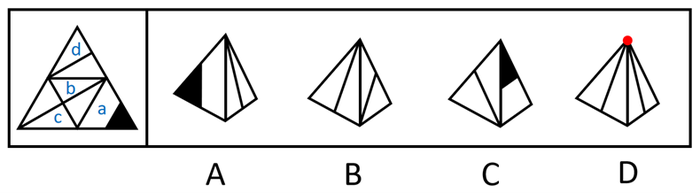
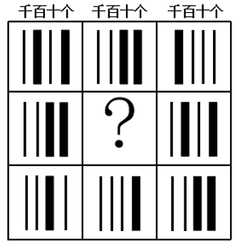
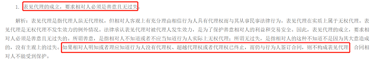

# 2021年重庆市选调优秀大学生到基层工作考试《行测》题

> 判断推理 · 30 题 · 选调 2021

## 第 1 题　qid 4675361 · 图形推理

从所给四个选项中，选择最合适的一个填入问号处，使之呈现一定的规律：

- **A**. A
- **B**. B　✅
- **C**. C
- **D**. D

**答案**：B

**官方解析**

元素组成相同，优先考虑位置关系。观察发现，线条在以正方形为路径按顺时针方向平移，且每次平移1.5个正方形边长，故？处图形线条的位置如下图所示，对应B项。

故正确答案为B。

---

## 第 2 题　qid 4675382 · 图形推理

从所给四个选项中，选择最合适的一个填入问号处，使之呈现一定规律性：

- **A**. A
- **B**. B
- **C**. C
- **D**. D　✅

**答案**：D

**官方解析**

观察题干图形，发现图1和图2的外框不变，内部图形位置变化，图2与图3的内部图形不变，外框变化。第二组图应用此规律，图1和图2的外框不变，内部图形位置变化，图2与图3的内部图形不变，外框变化，只有D符合该规律。
故正确答案为D。

---

## 第 3 题　qid 4675394 · 图形推理

把下面六个图形分为两类，使每一个图形都有各自共同特征或规律，分类最合理的一项是：

- **A**. ①②③，④⑤⑥
- **B**. ①④⑤，②③⑥
- **C**. ①③⑥，②④⑤　✅
- **D**. ①④⑥，②③⑤

**答案**：C

**官方解析**

本题为分组分类题目。元素组成不同，且无明显属性规律，考虑数量规律。观察发现，题干图形均由汉字组成，且存在封闭区域，考虑面数量，但整体数面无法分组。再次观察发现，题干图形面数量依次为4、1、2、3、5、4，图①③⑥面数量为偶数个，图②④⑤面数量为奇数个，故图①③⑥为一组，图②④⑤为一组。
故正确答案为C。

---

## 第 4 题　qid 4675381 · 图形推理

左边给定的是纸盒外表的展开图，右边哪一项能由它折叠而成？

- **A**. A
- **B**. B　✅
- **C**. C
- **D**. D

**答案**：B

**官方解析**

将题干展开图标上序号，如下图所示，逐一分析选项。

A项：选项的左侧面是面a，右侧面挨着面a中白色梯形的长底边，因此右侧面是面b。如下图所示，分别在题干和选项中，以面b中的线条与面顶点的交点为起点，绕着面b顺时针画边。在题干中，边1挨着面a，但在选项中，边3挨着面a，选项与题干不一致，排除；

B项：选项包含面c和面d，选项与题干一致，当选；

C项：选项的右侧面是面a，如下图所示，分别在题干和选项中，以面a中黑色三角形与面顶点的交点为起点，绕着面a顺时针画边。在题干中，边3挨着面d，且与面d内线条相交于边3的中点，在选项中，边3挨着左侧面，但不与左侧面内线条相交于边3的中点，选项与题干不一致，排除；

D项：选项中的两个面是面b、面c或面d，如下图所示，选项左侧面和右侧面内的线条相交，且相交于面顶点的位置，在题干的面b、面c或面d中，面内线条相交的只有面c和面b，但并不相交于面的顶点位置，选项和题干不一致，排除。

故正确答案为B。

---

## 第 5 题　qid 4675354 · 图形推理

从所给选项中，选择最合适的一个填入问号处，使之呈现一定规律：

- **A**. A　✅
- **B**. B
- **C**. C
- **D**. D

**答案**：A

**官方解析**

元素组成相似，优先考虑样式规律，黑白运算无规律，考虑其他加减同异规律。横向观察发现，题干图形满足下列二进制加法规则：右侧为小单位，左侧为大单位（已按照千位、百位、十位、个位依次标注），黑色粗线条代表1，黑色细线条代表0，根据二进制加法规则“0+0=0、0+1=1、1+0=1、1+1=10（0进位为1）”进行运算。在第一行中，第一个图为“0101”，第二个图为“0011”，先从个位加起，为“1+1=10”，此时需要往前进1位，十位相加为“0+1=1”，再与个位进上来的“1”进行相加为“1+1=10”，因此需要继续往前进1位，百位相加为“1+0=1”，再与十位进上来的“1”进行相加为“1+1=10”，需要继续往前进1位，千位相加为“0+0=0”，再与百位进上来的“1”进行相加为“0+1=1”，故第三个图为“1000”；第三行验证规律，在第三行中，第一个图为“0010”，第二个图为“0001”，先从个位加起，为“0+1=1”，十位相加为“1+0=1”，百位和千位相加均为“0+0=0”，故第三个图为“0011”，经验证符合规律。在第二行中，第一个图为“0011”，第三个图为“0101”，故？处应选择图为“0010”的选项，只有A项符合规律。

故正确答案为A。

---

## 第 6 题　qid 4675370 · 定义判断

水军，是网络水军的简称，是指那些被雇佣的、针对特定内容发布特定信息的网络写手。他们通常活跃在电子商务网站、论坛、微博等社变网络平台中，通过伪装成普通网民或消费者来转发或传播特定信息，以对正常用户产生影响，从而达到特定目的。
根据上述定义，以下不属于水军的是：

- **A**. 某主播雇网友在该平台另一个主播的直播间发带侮辱性词汇的弹幕
- **B**. 某电影上映后，电影制作方号召其员工在各大影评网站刷分
- **C**. 某电视剧开播后，该剧主演的粉丝纷纷到各大影评网站发帖评论，以提高该剧的收视率　✅
- **D**. 某明星人设崩塌，其代言品牌的公司员工在网上大肆传播该明星的正面事例，试图挽回人设

**答案**：C

**官方解析**

第一步：找出定义关键词。
“被雇佣的、针对特定内容发布特定信息的网络写手”。
第二步：逐一分析选项。
A项：该项中某主播雇网友来侮辱另一个主播，被雇佣的网友符合“被雇佣的、针对特定内容发布特定信息的网络写手”，符合定义，排除；
B项：该项中电影制作方号召其员工在各大影评网站刷分，电影制作方的员工符合“被雇佣的、针对特定内容发布特定信息的网络写手”，符合定义，排除；
C项：该项中该剧主演的粉丝纷纷到各大影评网站发帖评论，发帖是粉丝对偶像的一种自发的支持行为，该剧主演的粉丝不符合“被雇佣的、针对特定内容发布特定信息的网络写手”，不符合定义，当选；
D项：该项中代言品牌的公司员工为挽回明星的人设而在网上大肆传播该明星的正面事例，代言品牌的公司员工符合“被雇佣的、针对特定内容发布特定信息的网络写手”，符合定义，排除。
本题为选非题，故正确答案为C。

---

## 第 7 题　qid 4675355 · 定义判断

虚拟现实技术（Virtual Reality，缩写为VR），又称灵境技术，是20世纪发展起来的一项全新的实用技术。虚拟现实技术将计算机科学、电子信息、仿真技术融于一体，以实现计算机模拟虚拟环境从而给人以环境沉浸感。用户可以在虚拟现实世界体验到最真实的感受，其模拟的环境与现实世界难辨真假，让人有身临其境的感觉；同时，它具有超强的仿真系统，真正实现了人机交互，使人在操作过程中，可以随意操作并且得到环境最真实的反馈。
根据上述定义，以下不属于虚拟现实技术应用的是：

- **A**. 小红去影院观看了最新的5D电影，随着电影情节的发展，电影院会通过吹风、喷水、震动，以及3D画面模拟出相应的场景，让小红感觉自己就是影片的亲历者　✅
- **B**. 小张购买了一台头戴设备和一个手柄，从此他只需要在房间里就能玩网球游戏，除了没有拿网球拍那么累之外，其它就和在网球场打球的感觉一样
- **C**. 医学专家们利用计算机在虚拟空间中模拟出人体组织和器官，让学生在其中进行模拟操作，学生能真切感受到手术刀切入人体肌肉组织、触碰到骨头的感觉
- **D**. 人们利用计算机的统计模拟，在虚拟空间中重现了现实中的航天飞机与飞行环境，使飞行员不需要真实的航天飞机就可以进行飞行训练和实验操作，极大地降低了实验经费和实验危险系数

**答案**：A

**官方解析**

第一步：找出定义关键词。
“将计算机科学、电子信息、仿真技术融于一体”、“实现计算机模拟虚拟环境”、“给人以环境沉浸感”。
第二步：逐一分析选项。
A项：小红去影院观看了最新的5D电影，电影院通过吹风、喷水、震动，以及3D画面模拟出相应的场景，让小红感觉自己就是影片的亲历者。5D电影通过吹风、喷水、震动，以及3D画面模拟出相应的场景，而非通过计算机进行模拟，不符合“将计算机科学、电子信息、仿真技术融于一体”、“实现计算机模拟虚拟环境”，不符合定义，当选；
B项：小张通过头戴设备和手柄在房间里玩网球游戏，获得在网球场上打球一样的感觉，符合“将计算机科学、电子信息、仿真技术融于一体”、“实现计算机模拟虚拟环境”、“给人以环境沉浸感”，符合定义，排除；
C项：医学专家们利用计算机在虚拟空间中模拟出人体组织和器官，让学生在其中进行模拟操作，学生能真切感受到手术刀切入人体肌肉组织、触碰到骨头的感觉，符合“将计算机科学、电子信息、仿真技术融于一体”、“实现计算机模拟虚拟环境”、“给人以环境沉浸感”，符合定义，排除；
D项：人们利用计算机的统计模拟，在虚拟空间中重现了现实中的航天飞机与飞行环境，使飞行员不需要真实的航天飞机就可以进行飞行训练和实验操作，符合“将计算机科学、电子信息、仿真技术融于一体”、“实现计算机模拟虚拟环境”、“给人以环境沉浸感”，符合定义，排除。
本题为选非题，故正确答案为A。

---

## 第 8 题　qid 4675366 · 定义判断

内卷，指当一个群体所拥有的资源无法满足所有人的需求时，人们通过竞争来争夺资源。然而这种竞争不但对整个群体并无益处，反而会因为边际收益递减，导致内耗加剧，损害整个群体的利益。
根据上述定义，以下现象属于内卷的是：

- **A**. 前些年运力紧张，为买到车票，购票者不得不加价从“黄牛”手中购票，“黄牛”见有利可图，于是更加疯狂地购买车票，车票价格更加水涨船高　✅
- **B**. 工厂工人张师傅琢磨出一种提高产品质量、提高加工效率的新工艺并推广到全公司，根据奖励制度，该厂要付出张师傅加薪1000元的成本
- **C**. T公司每立项一款产品，都会交给两个以上部门独立研发，然后内部比拼，只有胜利者才被推向市场，失败者惨淡出局，公司投入打了“水漂”
- **D**. 艺术家对完美有一种近乎偏执的执着，宁可毁掉自己的作品，也坚决不把他认为有任何一点瑕疵的作品公诸于世，最终艺术家潦倒一生

**答案**：A

**官方解析**

第一步：找出定义关键词。
“当一个群体所拥有的资源无法满足所有人的需求时”、“人们通过竞争来争夺资源”、“这种竞争不但对整个群体并无益处、反而会因为边际收益递减”、“导致内耗加剧，损害整个群体的利益”。
第二步：逐一分析选项。
A项：运力紧张，符合“当一个群体所拥有的资源无法满足所有人的需求时”，购票者为买到车票加价购票，符合“人们通过竞争来争夺资源”，但车票价格更加水涨船高，符合“这种竞争不但对整个群体并无益处、反而会因为边际收益递减”、“导致内耗加剧，损害整个群体的利益”，符合定义，当选；
B项：张师傅琢磨出可以提高产品质量和加工效率的新工艺，工厂给予奖励，没有涉及到通过竞争争夺资源，也没有损害群体的利益，不符合“人们通过竞争来争夺资源”、“这种竞争不但对整个群体并无益处、反而会因为边际收益递减”、“导致内耗加剧，损害整个群体的利益”，不符合定义，排除；
C项：公司让两个以上部门竞争研发同一款产品，部门之间的良性竞争能让公司推出更好的产品，不符合“这种竞争不但对整个群体并无益处、反而会因为边际收益递减”、“导致内耗加剧，损害整个群体的利益”，不符合定义，排除；
D项：艺术家对于作品的完美追求，不是通过竞争争夺资源，不符合“人们通过竞争来争夺资源”，并且艺术家因此能塑造出更完美的作品，不符合“这种竞争不但对整个群体并无益处、反而会因为边际收益递减”、“导致内耗加剧，损害整个群体的利益”，不符合定义，排除。
故正确答案为A。

---

## 第 9 题　qid 4675378 · 定义判断

纯粹接触效应，是指某一外在刺激，仅仅因为呈现的次数越频繁（个体能够接触到该刺激的机会越多），个体对该刺激将越喜欢。
根据上述定义，以下属于纯粹接触效应的是:

- **A**. 某网络红人为博取眼球，经常发表各种标新立异的奇怪言论，引起社会广泛热议的同时也给他带来了不菲的收入
- **B**. 新人小李特别较真，最初与同事相处并不融治，但随着深入接触，大家发现了小李对事不对人，关系也逐渐融治
- **C**. 小陈刚拿到驾照的时候开车小心翼翼，后来随着驾龄的增长，他的技术也越来越好，面对各种突发情况都能妥善处置
- **D**. 小赵每天上下班都要路过商场，橱窗里展示的一件裙子，初看平平无奇，但小赵却越看越觉得喜欢　✅

**答案**：D

**官方解析**

第一步：找出定义关键词。
“仅仅因为个体能够接触到该刺激的机会越多”、“个体对该刺激将越喜欢”。
第二步：逐一分析选项。
A项：某网络红人因为经常发表标新立异的言论而引起社会热议，引起社会热议可以是积极的也可以是消极的，不代表社会就会越来越喜欢，不符合“个体对该刺激将越喜欢”，不符合定义，排除；
B项：同事随着深入的接触发现小李对事不对人的品质，但是同事并非仅仅因为接触小李而喜欢他，而是因为在接触的过程中发现了小李对事不对人的品质才喜欢他，不符合“仅仅因为个体能够接触到该刺激的机会越多”，不符合定义，排除；
C项：小陈的驾驶技术因为驾龄增长变得越来越好，面对突出情况能够妥善处置，但是并不代表小陈喜欢突发情况，不符合“个体对该刺激将越喜欢”，不符合定义，排除；
D项：小赵仅仅因为每天上下班都要看见橱窗里面的裙子，然后就越看越喜欢，原因就是看的次数多了，所以喜欢，符合“仅仅因为个体能够接触到该刺激的机会越多”、“个体对该刺激将越喜欢”，符合定义，当选。
故正确答案为D。

---

## 第 10 题　qid 4675357 · 定义判断

表见代理是指行为人虽无代理权，但由于本人的行为，造成了足以使善意第三人相信其有代理权的表现，而与善意第三人进行的、由本人承担法律后果的代理行为。
根据上述定义，下列选项不属于表见代理的是：

- **A**. 李某原为海生公司的业务员，2000年被公司解聘。李某在清理办公室期间发现了两份盖有公章的空白合同书并带走。同月，李某使用该空白合同书以海生公司的名义与三环公司订立购买合同。当海生公司获知后，遂发函三环公司要求其不要发货，但三环公司仍坚持发货　✅
- **B**. 陆某是本市一套房屋的产权人，去年5月，陆某儿子拿着他的印章、身价证和房屋产权证原件委托一家房产中介公司出售房屋。中介公司很快找到了下家徐某。陆某儿子便拿陆某印章和徐某签了房屋买卖合同，并到房地产交易中心办理了房屋过户手续
- **C**. 张某是甲商贸公司员工，曾长期代表甲公司与乙公司签订家电购销合同。2016年3月，张某被甲公司解聘，但甲公司并未收回给张某的尚在有效期内的授权委托书，4月，张某凭借授权委托书与乙公司签订了10万元的家电购买合同
- **D**. 甲公司因业务需要，将原圆型合同专用章更换成方型合同专用章，但当时未登记收回或销毁，由李某保管，两个月后，李某辞职，并用其同一家商场订立了购销合同

**答案**：A

**官方解析**

第一步：找出定义关键词。

“行为人无代理权”、“由于本人的行为”、“造成了足以使善意第三人相信其有代理权的表现”、“与善意第三人进行的、由本人承担法律后果的代理行为”。

第二步：逐一分析选项。

A项：当海生公司获知被解聘的李某拿着原公司盖有公章的空白合同与三环公司订立购买合同后，遂发函三环公司要求其不要发货，但三环公司仍坚持发货，说明三环公司在明知道李某没有代理权后，依然坚持发货，此时三环公司不符合“善意第三人”，不符合定义，当选；

B项：陆某儿子不是房屋产权人，不能代表陆某，符合“行为人无代理权”，但陆某儿子拿着陆某的印章、身价证和房屋产权证原件让徐某误相信其具有代理权，符合“由于本人的行为”、“造成了足以使善意第三人相信其有代理权的表现”，最终双方签订了房屋买卖合同，说明代理行为成立，符合“与善意第三人进行的、由本人承担法律后果的代理行为”，符合定义，排除；

C项：被解聘的张某拿着原公司尚在有效期内的授权委托书与乙公司签订家电购销合同，张某已被解雇，说明张某已不具有原公司的代理权，符合“行为人无代理权”，但张某因持有原公司有效期内的授权委托书而使乙公司误相信其具有代理权，符合“由于本人的行为”、“造成了足以使善意第三人相信其有代理权的表现”，最终双方签订了购销合同，说明代理行为成立，符合“与善意第三人进行的、由本人承担法律后果的代理行为”，符合定义，排除；

D项：已辞职的李某拿着原公司未回收的合同专用章与商场签订购销合同，李某已辞职，说明李某已不具有原公司的代理权，符合“行为人无代理权”，但李某因持有原公司未收回的合同专用章而使商场误相信其具有代理权，符合“由于本人的行为”、“造成了足以使善意第三人相信其有代理权的表现”，最终双方签订了购销合同，说明代理行为成立，符合“与善意第三人进行的、由本人承担法律后果的代理行为”，符合定义，排除。

注：如下图，表见代理的成立，要求相对人必须是善意且无过失。A项中三环公司在明知道李某没有代理权后依然坚持发货，属于已经知晓没有代理权，但仍要继续合同，故不符合表见代理。

本题为选非题，故正确答案为A。

---

## 第 11 题　qid 4675356 · 类比推理

2019年8月，一个天文观测团队用引力波探测到一个2.6倍太阳质量天体。此前，人们发现的最小黑洞为5倍太阳质量，而最重的中子星质量不超过2.5倍太阳质量。由于中子星是质量“不达标”（不足以形成黑洞）的恒星在寿命终结时坍缩形成的一种星体，天文学家便把2.5倍和5倍太阳质量之间的差距称为“质量间隙”。现在探测到这个2.6倍太阳质量的天体，说明：

- **A**. “质量间隙”或许并不存在　✅
- **B**. 该天体是黑洞的可能性更大
- **C**. 该天体是中子星的可能性更大
- **D**. 该天体不能以黑洞或中子星来定义

**答案**：A

**官方解析**

日常结论题，根据题干信息逐一分析选项。
A项：题干已知“2.5倍和5倍太阳质量之间的差距称为‘质量间隙’”，而现在探测到的天体是2.6倍太阳质量，即“质量间隙”中存在天体，说明“质量间隙”或者不是现有理论中的“2.5倍和5倍之间的差距”，或者可能不存在，选项可以推出，当选；
B项：题干已知“人们发现的最小黑洞为5倍太阳质量，而最重的中子星质量不超过2.5倍太阳质量”，而现在探测到的天体是2.6倍太阳质量，不能按照现有理论做出判定，故可能性大小无法推出，排除；
C项：题干已知“人们发现的最小黑洞为5倍太阳质量，而最重的中子星质量不超过2.5倍太阳质量”，而现在探测到的天体是2.6倍太阳质量，不能按照现有理论做出判定，故可能性大小无法推出，排除；
D项：题干已知“人们发现的最小黑洞为5倍太阳质量，而最重的中子星质量不超过2.5倍太阳质量”，而现在探测到的天体是2.6倍太阳质量，但题干并没有给出黑洞和中子星的定义，因此该天体不能按现有理论进行判定，选项过于绝对，无法推出，排除。
故正确答案为A

---

## 第 12 题　qid 4675360 · 逻辑判断

一遇强降雨，横断山脉山区就会多发滑坡和泥石流等地质灾害，因此每逢阴雨连绵，横断山脉地区的道路抢险部门都严阵以待。
上述结论成立所需要的假设是（    ）。

- **A**. 我国黄土高原地区也是滑坡和泥石流的多发区域
- **B**. 滑坡和泥石流很容易导致道路损毁和堵塞　✅
- **C**. 横断山脉地区一年中都有滑坡和泥石流发生
- **D**. 横断山脉地区在夏季总是阴雨连绵

**答案**：B

**官方解析**

第一步：找出论点和论据。
论点：每逢阴雨连绵，横断山脉地区的道路抢险部门都严阵以待。
论据：一遇强降雨，横断山脉山区就会多发滑坡和泥石流等地质灾害。
本题论点讨论的是雨天横断山脉地区道路抢修部门都严阵以待，论据讨论的是雨天横断山脉山区多发生滑坡和泥石流等地质灾害，论点论据话题不一致，且提问方式为“假设”，优先考虑搭桥，即建立“滑坡和泥石流等地质灾害”和“道路抢险”的联系。
第二步：逐一分析选项。
A项：该项指出我国滑坡和泥石流的多发区域地点，而论点讨论的是雨天横断山脉地区道路抢修部门都严阵以待，话题不一致，无法加强，排除；
B项：该项指出滑坡和泥石流很容易导致道路损毁和堵塞，即“滑坡和泥石流”会导致“道路隐患”，从而需要“道路抢险部门严阵以待”以便道路抢险，属于搭桥项，可以加强，当选；
C项：该项指出横断山脉地区滑坡和泥石流的发生频率，而论点讨论的是雨天横断山脉地区道路抢修部门都严阵以待，话题不一致，无法加强，排除；
D项：该项指出横断山脉地区在夏季总是阴雨连绵，而论点讨论的是雨天横断山脉地区道路抢修部门都严阵以待，话题不一致，无法加强，排除。
故正确答案为B。

---

## 第 13 题　qid 4675363 · 逻辑判断

海洋中珊瑚的美丽颜色来自于其体内与之共生的藻类生物，其中虫黄藻是最重要的一类单细胞海藻。二者各取所需，相互提供食物。全球气候变暖造成的海水升温导致虫黄藻等藻类大量死亡，进而造成珊瑚本身死亡，引发白化现象。然而研究发现，珊瑚能通过选择耐热的其他藻类生物等途径，来应对气候变暖带来的挑战。
以下哪项如果为真，将削弱这一研究发现?

- **A**. 一些虫黄藻能够比耐热的其他藻类耐受更高的海水温度
- **B**. 有些藻类耐热性的形成需要一个长期的过程
- **C**. 有些虫黄藻逐渐适应了海水温度的升高并存活下来
- **D**. 有些已白化的珊瑚礁中也发现了死去的耐热藻类生物　✅

**答案**：D

**官方解析**

第一步：找到论点和论据。
论点：珊瑚能通过选择耐热的其他藻类生物等途径，来应对气候变暖带来的挑战。
论据：无。
本题只有论点，没有论据，削弱优先考虑削弱论点，即珊瑚不能通过选择耐热的其他藻类生物等途径，来应对气候变暖带来的挑战。
第二步：逐一分析选项。
A项：指出一些虫黄藻比其他耐热藻类耐热性强，但一些不代表全部，无法判断具体数量，可能大部分虫黄藻耐受的海水温度并没有耐热的其他藻类高，只是一种可能性的削弱，保留；
B项：选项说的是藻类耐热性形成时间，与通过耐热的其他藻类生物能否应对气候变暖无关，无法削弱，排除；
C项：选项说的是一些虫黄藻的耐热性较高，而论点说的是“耐热的其他藻类生物”，属于无关项，无法削弱，排除；
D项：指出有些选择了其他耐热藻类的珊瑚也出现了白化现象，举反例证明这些耐热的其他藻类生物不能帮助珊瑚来应对气候变暖，削弱论点，削弱力度大于A项，当选。
故正确答案为D。

---

## 第 14 题　qid 4675380 · 类比推理

真真家的电话号码是一个5位数。并且由5个完全不同的数字组成。
善善猜测道：“它是84261"；
美美猜测道：“它是49280"；
诚诚猜测道：“它是26048”。
真真笑着说:“你们每个人都猜对了位置不相邻的两个数字”。则真真家的电话号码是：

- **A**. 62804
- **B**. 82406
- **C**. 64208
- **D**. 86240　✅

**答案**：D

**官方解析**

第一步：分析题干条件。
（1）善善：84261；
（2）美美：49280；
（3）诚诚：26048；
（4）真真：每个人都猜对了位置不相邻的两个数字。
第二步：逐一验证选项。
题干信息不确定，选项信息充分，优先考虑代入法。
代入A项：善善没有猜对数字，不符合条件（4），排除；
代入B项：善善只猜对了1个数字，不符合条件（4），排除；
代入C项：善善猜对了“4”和“2”，但位置相邻，不符合条件（4），排除；
代入D项：善善猜对了“8”和“2”，美美猜对了“2”和“0”，诚诚猜对了“6”和“4”，且位置均不相邻，满足条件（4），当选。
故正确答案为D。

---

## 第 15 题　qid 4675369 · 逻辑判断

所有与新型冠状病毒肺炎患者接触的人都被隔离了。所有被隔离的人都与王五接触过。
假设这个命题为真，则下面命题（    ）也是真的。

- **A**. 可能有人没有接触过新型冠状病毒肺炎患者，但接触过王五　✅
- **B**. 王五是新型冠状病毒肺炎患者
- **C**. 所有与王五接触过的人都被隔离了
- **D**. 所有新型冠状病毒肺炎患者都与王五接触过

**答案**：A

**官方解析**

第一步：翻译题干。

①与新型冠状病毒肺炎患者接触的人被隔离；

②被隔离与王五接触过；

由①②可以递推出：③与新型冠状病毒肺炎患者接触的人被隔离与王五接触过。

第二步：逐一分析选项。

A项：“没有接触过新型冠状病毒肺炎患者”，是对③的否前，可以推出可能性结论，因此“可能有人没有接触过新型冠状病毒肺炎患者，但接触过王五”，可以推出，当选；

B项：题干并未涉及新型冠状病毒肺炎患者，无法确定王五是否为新型冠状病毒肺炎患者，无法推出，排除；

C项：翻译为：与王五接触过被隔离，是对③的肯后，肯后得不到确定性的结论，无法推出，排除；

D项：题干并未涉及新型冠状病毒肺炎患者，无法得出新型冠状病毒肺炎患者是否与王五接触过，无法推出，排除。

故正确答案为A。

---

## 第 16 题　qid 4675379 · 逻辑判断

目前认为造成白垩纪末期（约6600万年前）包括恐龙在内的大量生物灭绝的原因是，一颗直径约10千米的巨大陨石撞击了地球。1991年，陨石撞击的重要证据——陨石坑在墨西哥尤卡坦半岛附近发现。有学者提出假说如下：陨石撞击地球后，岩石等产生的尘埃造成植物无法进行光合作用，气候变得寒冷，恐龙等生物无法适应这种环境变化，从而灭绝。
以下说法最能有力驳斥上述恐龙灭绝原因的是：

- **A**. 陨石撞击产生的岩石尘埃粒径约为0.1毫米，停留在大气中最多也就1周左右，阳光仅被阻挡1周的环境变化不至于引起生物灭绝　✅
- **B**. 在加拿大西部艾伯塔省的一个地区，发现大约8000万年前生活于此的恐龙有45种，但就在陨石撞击之前不久，种类已减少到只有6种
- **C**. 白垩纪末期的印度地区发生了大规模火山运动，在全球范围内带来了巨大的环境变化
- **D**. 目前尚不确定6600万年前在地球上撞出巨大陨石坑的是哪一颗小行星，因此也不清楚造成恐龙灭绝的始作俑者

**答案**：A

**官方解析**

第一步：找出论点和论据。
论点：目前认为造成白垩纪末期（约6600万年前）包括恐龙在内的大量生物灭绝的原因是，一颗直径约10千米的巨大陨石撞击了地球。
论据：陨石撞击地球后，岩石等产生的尘埃造成植物无法进行光合作用，气候变得寒冷，恐龙等生物无法适应这种环境变化，从而灭绝。
本题论点论据讨论的都是陨石撞击地球与造成恐龙等生物的灭绝之间的关系，论点论据话题一致，削弱可以优先考虑削弱论点，即指出陨石撞击地球不会造成恐龙等生物的灭绝。
第二步：逐一分析选项。
A项：该项说的是陨石撞击最多只会产生1周的环境变化，而这不至于引起生物灭绝，说明陨石撞击带来的影响很快就会结束，不会造成恐龙等生物的灭绝，削弱论点，可以削弱，当选；
B项：该项说的是8000万年前某一地区的恐龙种类在陨石撞击之前就已减少，而题干讨论的是白垩纪末期（约6600万年前）恐龙等生物灭绝的原因，话题不一致，无法削弱，排除；
C项：该项说的是白垩纪末期的印度地区发生的大规模火山运动给全球带来了巨大的环境变化，而题干讨论的是陨石撞击地球是否会造成恐龙等生物灭绝，话题不一致，无法削弱，排除；
D项：该项说的是目前尚不清楚造成恐龙灭绝的始作俑者，不明确项，无法削弱，排除。
故正确答案为A。

---

## 第 17 题　qid 4675367 · 类比推理

小赵早起去上课，室友们让小赵帮忙占一下座位。
①小钱说：我还要坐昨天的老位置，就和昨天一样在小孙和小李后面就好，他俩帮我挡着。
②小孙说：我还是往前点吧，昨天坐的地方太靠后，看不清黑板。
③小李说∶我都行，这次别让我像昨天一样坐第四排就好。
④小周说：小吴个子太高了，这次我不要坐他后面了，顺便给我带杯奶茶，谢谢。
⑤小吴说：我都行，和昨天一样，我们五个人在不同的排就好了。
小赵于是按照室友们的要求，给五个室友占好了座位。
到上课前，小吴先来到教室，看见总共五排桌子的教室里，第一排放着笔袋，第二排放着奶茶，第三排放着书包，第四排放着水杯，第五排放着一本书，都是小赵占座的东西，虽然小赵没在里面，但聪明的小吴很快就推断出自己应该坐在：

- **A**. 笔袋的位置
- **B**. 书包的位置
- **C**. 水杯的位置　✅
- **D**. 一本书的位置

**答案**：C

**官方解析**

第一步：分析题干条件。
①小钱和昨天位置相同，在小孙和小李后面；
②小孙比昨天靠前；
③小李昨天在第四排，今天不在第四排；
④小周不在小吴后面，要奶茶；
⑤和昨天一样，五个人在不同排；
⑥第一排放着笔袋，第二排放着奶茶，第三排放着书包，第四排放着水杯，第五排放着一本书。
第二步：根据题干条件进行推理。
结合条件④和⑥可知，小周在第二排放着奶茶的位置，而小周不在小吴的后面，则小吴不能在第一排放着笔袋的位置，排除A项。根据条件③可知小李昨天在第四排，再结合条件①可知小钱昨天和今天都在第五排，则小吴不能在第五排放着一本书的位置，排除D项。结合条件①③⑤可知，小李昨天在第四排，小钱昨天在第五排，则小孙昨天在前三排，而条件②说小孙比昨天还要靠前，则小孙今天在第一排或第二排，已知小周今天在第二排，所以小孙今天在第一排。另外已经推出小钱今天在第五排，那么今天只剩第三排和第四排，而条件③小李今天不在第四排，可知小李今天在第三排，则小吴今天在第四排，即放着水杯的位置，B项错误，C项正确。
故正确答案为C。

---

## 第 18 题　qid 4675371 · 逻辑判断

因为所有包装精美的歌碟都是制作很好的歌碟，所有中国风歌碟都是情调高雅的歌碟，所有这家音响店中我不推荐去听的歌碟都是情调不高雅的歌碟。因此，所有中国风歌碟都是制作很好的歌碟。
上述推论得以成立的前提条件是（    ）。

- **A**. 所有情调高雅的歌碟都是包装精美的歌碟　✅
- **B**. 所有包装不精美的歌碟都是我不可能会推荐去听的歌碟
- **C**. 所有情调高雅的歌碟都是中国风歌碟
- **D**. 所有我不推荐去听的歌碟都不是中国风歌碟

**答案**：A

**官方解析**

第一步：找出论点和论据。

论点：中国风歌碟制作很好的歌碟。

论据：包装精美的歌碟制作很好的歌碟，中国风歌碟情调高雅的歌碟，这家音响店中不推荐去听的歌碟情调不高雅的歌碟（根据逆否规则可将后两句串联推出：中国风歌碟情调高雅的歌碟这家音响店中推荐去听的歌碟）。

本题论点要得出中国风歌碟是制作很好的歌碟的结论，而论据中中国风歌碟与制作很好的歌碟之间没有直接关系，要使推论得以成立，需建立“中国风歌碟”与“制作很好的歌碟”之间的联系。

第二步：逐一分析选项。

A项：翻译为：情调高雅的歌碟包装精美的歌碟，将其补充到论据，可以得到：中国风歌碟情调高雅的歌碟包装精美的歌碟制作很好的歌碟，因此可以得到论点，可以加强，当选；

B项：翻译为：包装精美的歌碟会推荐去听的歌碟，根据逆否可以推出：推荐去听的歌碟包装精美的歌碟，但论据中限定了是“这家音响店中”会推荐去听的歌碟，而选项中会推荐去听的歌碟并不明确是否指的是在论据中的这家店，为不明确项，因此无法加强，排除；

C项：翻译为：情调高雅的歌碟中国风歌碟，将其补充到题干中，无法得到论点，因此无法加强，排除；

D项：翻译为：推荐去听的歌碟中国风歌碟，根据逆否可以推出：中国风歌碟推荐去听的歌碟，将其补充到题干中，无法得到论点，因此无法加强，排除。

故正确答案为A。

---

## 第 19 题　qid 4675358 · 逻辑判断

并非所有人都能够去当人民教师，除非有教师资格证。
如果这个假设为真，则以下哪项一定为假？

- **A**. 所有没有教师资格证的人都不能去当人民教师
- **B**. 即使有教师资格证也不一定能去当人民教师
- **C**. 没有人能够没有教师资格证就去当人民教师
- **D**. 有的人能去当人民教师，他们并没有教师资格证　✅

**答案**：D

**官方解析**

第一步：翻译题干。

题干可等价替换为“除非有教师资格证，否则有的人不能去当人民教师”。这里有无教师资格证和是否当人民教师都是同一部分人。主体一致，则可翻译为：当人民教师有教师资格证。

第二步：逐一分析选项。

A项：翻译为“有教师资格证当人民教师”，否后推否前，根据逆否等价原则可以推出，该项和题干都为真，排除；

B项：“有教师资格证”是肯定了题干的后件，肯后无法推出确定结论，该项真假不确定，排除；

C项：即所有人都需要有教师资格证才能当人民教师。翻译为“当人民教师有教师资格证”，肯前必肯后，该项和题干都为真，排除；

D项：翻译为有的人“当人民教师 且 有教师资格证”，与题干是矛盾关系，则该项为假，当选。

本题为选非题，故正确答案为D。

---

## 第 20 题　qid 4675359 · 逻辑判断

在驾驶证考试过程中，只有通过了科目一、二、三、四，才能获得机动车驾驶证，李四获得了机动车驾驶证，可见李四通过了科目一、二、三、四。
下述推理中，哪项与上述推理在形式上是相同的？

- **A**. 只有物体间发生摩擦，物体才会生热。物体间已发生了摩擦，所以物体必然要生热
- **B**. 只有年满18岁的公民，才有选举权。赵某已年满18岁了，所以他有选举权
- **C**. 只有在适当的温度下，鸡蛋才能孵出小鸡。现在，鸡蛋已经孵出了小鸡，可见温度是适当的　✅
- **D**. 我国《刑法》规定：致人重伤的处三年以上七年以下有期徒刑。被告已致人重伤，因此，他应处三年以上七年以下的有期徒刑

**答案**：C

**官方解析**

第一步：分析题干推理形式。

题干推理形式为：a（获得机动车驾驶证）b（通过了科目一、二、三、四），已经有a，所以有b。

第二步：逐一分析选项。

A项：a（生热）b（发生摩擦），已经有b，所以有a，与题干推理形式不一致，排除；

B项：a（有选举权）b（年满18岁的公民），已经有b，所以有a，与题干推理形式不一致，排除；

C项：a（孵出小鸡）b（适当的温度），已经有a，所以有b，与题干推理形式一致，当选；

D项：a（致人重伤）b（处三年以上七年以下有期徒刑），已经有a，应该有b，与题干推理形式不一致，排除。

故正确答案为C。

---

## 第 21 题　qid 4675372 · 类比推理

茕茕孑立：孤单

- **A**. 差强人意：差劲
- **B**. 望其项背：接近　✅
- **C**. 侧目而视：轻蔑
- **D**. 昨日黄花：过时

**答案**：B

**官方解析**

第一步：判断题干词语间逻辑关系。
茕茕孑立指孤零零一人站在那里，形容孤单，无依无靠，与孤单为近义关系。
第二步：判断选项词语间逻辑关系。
A项：差强人意指大体上还能使人满意，与差劲不是近义关系，与题干逻辑关系不一致，排除；
B项：望其项背指能够望见别人的颈的后部和脊背，表示赶得上或比得上，与接近为近义关系，与题干逻辑关系一致，当选；
C项：侧目而视指不敢从正面看，斜着眼睛看，形容畏惧而又愤恨，与轻蔑不是近义关系，与题干逻辑关系不一致，排除；
D项：昨日黄花是对词语“明日黄花”的误用，明日黄花用来比喻已失去新闻价值的报道或已失去应时作用的事物，指的是过时的事物，而非过时，与过时不是近义关系，与题干逻辑关系不一致，排除。
故正确答案为B。

---

## 第 22 题　qid 4675374 · 类比推理

刘彻：汉武帝

- **A**. 李隆基：贞观
- **B**. 朱棣：明成祖　✅
- **C**. 赵匡胤：宋太宗
- **D**. 爱新觉罗·玄烨：康熙

**答案**：B

**官方解析**

第一步：判断题干词语间逻辑关系。
汉武帝是指刘彻，二者是全同关系。
第二步：判断选项词语间逻辑关系。
A项：贞观是唐太宗李世民统治时期的年号，故李隆基与贞观不是全同关系，与题干逻辑关系不一致，排除；
B项：明成祖是指朱棣，二者是全同关系，与题干逻辑关系一致，保留；
C项：宋太宗是指赵光义，故赵匡胤与宋太宗不是全同关系，与题干逻辑关系不一致，排除；
D项：康熙是指爱新觉罗·玄烨，二者是全同关系，与题干逻辑关系一致，保留。
对比B、D两项，题干中汉武帝是刘彻的谥号，B项中明成祖是朱棣的庙号，D项中康熙是爱新觉罗·玄烨在位时的年号，其中谥号和庙号是古代帝王去世之后，后人给予的称号，年号则是古代帝王在位时用来纪年的一种名号，因此B项与题干逻辑关系更一致，当选。
故正确答案为B。

---

## 第 23 题　qid 4675362 · 类比推理

中国：东亚

- **A**. 迪拜：西亚
- **B**. 墨西哥：南美
- **C**. 阿尔及利亚：北非　✅
- **D**. 马尔代夫：东南亚

**答案**：C

**官方解析**

第一步：判断题干词语间逻辑关系。
中国是东亚的一个国家，二者为组成关系。
第二步：判断选项词语间逻辑关系。
A项：迪拜处于西亚地区，是阿拉伯联合酋长国的一个城市，不是一个国家，与题干逻辑关系不一致，排除；
B项：墨西哥位于北美洲，不是南美的组成部分，与题干逻辑关系不一致，排除；
C项：阿尔及利亚是非洲北部的一个国家，是北非的组成部分，与题干逻辑关系一致，当选；
D项：马尔代夫位于南亚，不是东南亚的组成部分，与题干逻辑关系不一致，排除。
故正确答案为C。

---

## 第 24 题　qid 4675368 · 类比推理

负荆请罪：廉颇

- **A**. 韦编三绝：孔子　✅
- **B**. 讳疾忌医：华佗
- **C**. 纸上谈兵：赵奢
- **D**. 一鼓作气：孙武

**答案**：A

**官方解析**

第一步：判断题干词语间逻辑关系。
“负荆请罪”讲述的是战国时，廉颇和蔺相如同在赵国做官。蔺相如因功大，拜为上卿，位在廉颇之上。廉颇不服，想侮辱蔺相如。蔺相如为了国家的利益，处处退让。后来廉颇知道了，感到很惭愧，就脱了上衣，背着荆条，向蔺相如请罪，请他责罚的故事。“廉颇”是“负荆请罪”的主人公，两者是历史典故与历史人物的对应关系。
第二步：判断选项词语间逻辑关系。
A项：“韦编三绝”讲述的是孔子晚年很爱读《周易》，翻来覆去地读，使穿连《周易》竹简的皮条断了好几次的故事。“孔子”是“韦编三绝”的主人公，二者是历史典故与历史人物的对应关系，与题干逻辑关系一致，当选；
B项：“讳疾忌医”讲述的是蔡桓公害怕生病而多次拒绝扁鹊给他诊治的故事。主人公是“蔡桓公”和“扁鹊”，而非“华佗”，与题干逻辑关系不一致，排除；
C项：“纸上谈兵”讲述的是赵括熟读兵书，却不能活用的故事。主人公是“赵括”，而非“赵奢”，与题干逻辑关系不一致，排除；
D项：“一鼓作气”讲述的是春秋时期，齐国发兵攻打鲁国，曹刿深通兵法，帮助鲁国大胜齐国的故事。主人公是“曹刿”，而非“孙武”，与题干逻辑关系不一致，排除。
故正确答案为A。

---

## 第 25 题　qid 4675364 · 类比推理

新华社：中国

- **A**. 路透社：俄罗斯
- **B**. 共同社：英国
- **C**. 埃菲社：法国
- **D**. 安莎社：意大利　✅

**答案**：D

**官方解析**

第一步，判断题干词语间逻辑关系。
新华社，是新华通讯社的简称，是中国的新闻机构，二者为新闻机构和国家的对应关系。
第二步，判断选项词语间逻辑关系。
A项：路透社是英国的新闻机构，与俄罗斯没有明显逻辑关系，与题干逻辑关系不一致，排除；
B项：共同社，是共同通讯社的简称，是日本的新闻机构，与英国没有明显逻辑关系，与题干逻辑关系不一致，排除；
C项：埃菲社是西班牙的新闻机构，与法国没有明显逻辑关系，与题干逻辑关系不一致，排除；
D项：安莎社，是安莎通讯社的简称，是意大利的新闻机构，二者为新闻机构和国家的对应关系，与题干逻辑关系一致，当选。
故正确答案为D。

---

## 第 26 题　qid 4675375 · 类比推理

氢气：氧气：燃烧

- **A**. 核燃料棒：发热：发电
- **B**. 黑火药：氧：爆炸
- **C**. 太阳：核聚变：发光
- **D**. 金属镁：二氧化碳：燃烧　✅

**答案**：D

**官方解析**

第一步：判断题干词语间逻辑关系。
氢气可以在氧气中燃烧，三者之间为对应关系。
第二步：判断选项词语间逻辑关系。
A项：核燃料棒是由铀混合物粉末烧结成的二氧化铀陶瓷芯块，它在燃烧过程中会发热，是核电站用于发电的燃料，与题干逻辑关系不一致，排除；
B项：氧是一种化学元素，黑火药可以在氧构成的氧气中爆炸，但黑火药不能在氧中爆炸，与题干逻辑关系不一致，排除；
C项：太阳内部发生着核聚变反应，二者为对应关系，发光是太阳的属性，二者为属性对应关系，与题干逻辑关系不一致，排除；
D项：金属镁可以在二氧化碳中燃烧，三者之间为对应关系，与题干逻辑关系一致，当选。
故正确答案为D。

---

## 第 27 题　qid 4675365 · 类比推理

手：足：手足

- **A**. 拼：凑：拼凑
- **B**. 光：明：光明
- **C**. 鹰：犬：鹰犬　✅
- **D**. 出：入：出入

**答案**：C

**官方解析**

第一步：判断题干词语间逻辑关系。
手和足均是人体部位，二者为并列关系，手足由手和足组成，且手足可以比喻象征兄弟。
第二步：判断选项词语间逻辑关系。
A项：拼和凑都是动作，二者为并列关系，拼凑由拼和凑组成，但拼凑没有比喻象征义，与题干逻辑关系不一致，排除；
B项：光是名词，明是形容词，二者不是并列关系，与题干逻辑关系不一致，排除；
C项：鹰和犬均是动物，二者为并列关系，鹰犬由鹰和犬组成，且鹰犬可以比喻象征走狗，与题干逻辑关系一致，当选；
D项：出和入都是动作，二者为并列关系，出入由出和入组成，但出入没有比喻象征义，与题干逻辑关系不一致，排除。
故正确答案为C。

---

## 第 28 题　qid 4675377 · 类比推理

西药：中药：康复

- **A**. 医生：手术：病人
- **B**. 实验：化学：物理
- **C**. 米饭：面条：吃饱　✅
- **D**. 政治：经济：文化

**答案**：C

**官方解析**

第一步：判断题干词语间逻辑关系。
西药和中药为并列关系，二者都可以令人康复，前两词与第三词为功能的对应关系。
第二步：判断选项词语间逻辑关系。
A项：医生为病人做手术，三者为对应关系，与题干逻辑关系不一致，排除；
B项：化学和物理为并列关系，与题干顺序相反，且与实验不是功能的对应关系，与题干逻辑关系不一致，排除；
C项：米饭和面条为并列关系，二者都可以令人吃饱，前两词与第三词为功能的对应关系，与题干逻辑关系一致，当选；
D项：政治、经济和文化都是社会生活的基本领域，三者为并列关系，与题干逻辑关系不一致，排除。
故正确答案为C。

---

## 第 29 题　qid 4675373 · 类比推理

合肥 对于 （    ） 相当于 南京 对于 （    ）

- **A**. 邺城：汝南
- **B**. 合州：柴桑
- **C**. 徽州：会稽
- **D**. 庐州：建业　✅

**答案**：D

**官方解析**

逐一代入选项。
A项：邺城，古代著名都城，遗址范围包括今河北临漳县西（邺北城、邺南城遗址等）、河南安阳市北郊（曹操高陵等）一带，与合肥无明显逻辑关系；汝南，一般指汝南县，位于河南省驻马店市，与南京无明显逻辑关系，前后逻辑关系不一致，排除；
B项：历史上有多个合州，合肥的古称为合州，二者是全同关系；柴桑，原名九江县，为江西省九江市市辖区，与南京无明显逻辑关系，前后逻辑关系不一致，排除；
C项：徽州，为浙江省最早雏形唐末两浙道的组成部分，今徽州分属安徽省与江西省，与合肥无明显逻辑关系；会稽是绍兴的古称，与南京无明显逻辑关系，前后逻辑关系不一致，排除；
D项：庐州是合肥的古称，二者是全同关系；建业是南京的古称，二者是全同关系，前后逻辑关系一致，当选。
故正确答案为D。

---

## 第 30 题　qid 4675376 · 类比推理

商场 对于 （    ） 相当于 （    ） 对于 产品

- **A**. 盈利：设备
- **B**. 货物：工厂　✅
- **C**. 顾客：价格
- **D**. 价值：工人

**答案**：B

**官方解析**

逐一代入选项。
A项：商场可能会实现盈利，二者为对应关系，设备是工业购买者用在生产经营过程中的工业产品，二者为种属关系，前后逻辑关系不一致，排除；
B项：在商场里摆放货物，二者为地点对应关系，在工厂里生产产品，二者为地点对应关系，前后逻辑关系一致，当选；
C项：商场里有顾客，二者为地点对应关系，产品有相应的价格，二者不是地点对应关系，前后逻辑关系不一致，排除；
D项：商场和价值二者无明显逻辑关系，工人生产产品，二者为主宾关系，前后逻辑关系不一致，排除。
故正确答案为B。

---
