# 2022年上海市公务员录用考试《行测》题（B类）（网友回忆版）

> 判断推理 · 35 题 · 上海 2022

## 材料 1

一小区某单元共3层住着甲、乙、丙、丁、戊、己6户人家。每层2户，1户东向，1户西向。已知：

（1）乙与甲或者丙住在同一层；

（2）丁朝向是东向；

（3）甲、戊两户1户东向、1户西向。

### 第 1 题　qid 4652026 · 逻辑判断

根据材料信息，下列哪项是可能的？

- **A**. 甲和戊住在同一层，且甲是西向　✅
- **B**. 甲和丙住在同一层，且甲是西向
- **C**. 丁和甲住在同一层，且甲是东向
- **D**. 丁和乙住在同一层，且丁是东向

**答案**：A

**官方解析**

本题属于组合排列材料题。问可能的情况，可优先考虑代入。
代入A项：甲与戊同一层，同时可以保证甲西向，戊东向；根据条件（1），乙与丙同一层，方向无约束；最后丁与己同一层，根据条件（2），丁东向则己西向即可，与材料不矛盾，即可能，当选；
代入B项：甲与丙同一层，则乙与甲或丙无法在同一层，与条件（1）冲突，排除；
代入C项：丁与甲同一层，甲是东向，则丁为西向，与条件（2）冲突，排除；
代入D项：丁与乙同一层，则乙与甲或丙无法在同一层，与条件（1）冲突，排除。
故正确答案为A。

---

### 第 2 题　qid 4652027 · 类比推理

若己朝向是东向，则下列        项中的两户可能住在同一层。

- **A**. 甲和己
- **B**. 丁和丙　✅
- **C**. 乙和丙
- **D**. 戊和丙

**答案**：B

**官方解析**

第一步：分析题干。

①乙与甲或者丙住在同一层；

②丁朝向是东向；

③甲、戊两户1户东向、1户西向。

提问方式为“可能”，优先考虑代入法解题，题干信息较多可辅助列表。

第二步：逐一代入选项。

代入A项，甲和己在同一层，根据题中已知条件己朝向是东向及②丁是东向可知：

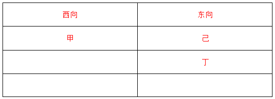

再根据①乙与甲或者丙住在同一层，甲已经和己在同一层，所以乙只能和丙在同一层，剩下戊只能和丁同一层。此时，戊和甲同为西向。

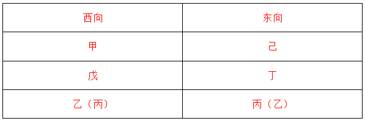

不满足③甲、戊两户1户东向、1户西向，排除；

代入B项，丁和丙在同一层，根据题中已知条件己朝向是东向及②丁是东向可知：

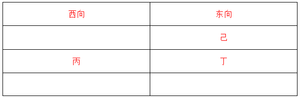

结合③甲、戊两户1户东向、1户西向，以及①乙与甲或者丙住在同一层，可以得到如下表格：

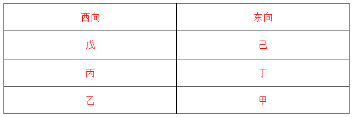

符合题干要求，当选；

代入C项，乙和丙在同一层，根据题中已知条件己朝向是东向及②丁是东向可知：

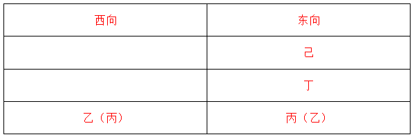

剩下的甲和戊都是在西向，不满足③甲、戊两户1户东向、1户西向，排除；

代入D项，戊和丙在同一层，根据题中已知条件己朝向是东向及②丁是东向可知：

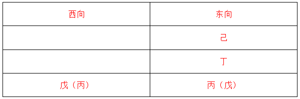

剩下的乙和甲分别在两层的西侧，不满足①乙与甲或者丙住在同一层，排除。

故正确答案为B。

---

### 第 3 题　qid 4651908 · 类比推理

翟志刚、王亚平、叶光富3名航天员乘神舟十三号载人飞船进入天和核心舱。在太空中，如果航天员想在天和核心舱中进行以下实验，其中最难完成的是               。

- **A**. 将金粉和铜粉混合
- **B**. 将牛奶加入水中混合
- **C**. 用漏斗、滤纸过滤除去水中的泥沙　✅
- **D**. 用金属环制作水膜

**答案**：C

**官方解析**

物质在天和核心舱中完全失重，所以需要重力的作用才能完成的实验难以进行。因为物质的混合与重力无关，所以金粉与铜粉的混合、牛奶与水的混合均可以在天和核心舱中实现，A、B两项均错误；用漏斗、滤纸过滤可以除去水中的泥沙，是因为将水与泥沙倒入放有滤纸的漏斗中时，水与泥沙受到重力的作用向下运动，水可以通过滤纸，而泥沙无法通过，所以水中的泥沙被去除，可见过滤操作需要利用重力，在天和核心舱中很难实现，C项正确；用金属环制作水膜时，水膜的形成是由于水的表面张力，与重力作用无关，在天和核心舱中可以实现，D项错误。
故正确答案为C。

---

### 第 4 题　qid 4651909 · 类比推理

石油分馏是将几种不同沸点的混合物分离的一种方法，属于物理变化。右图是石油分馏塔的示意图，下列有关说法错误的是：

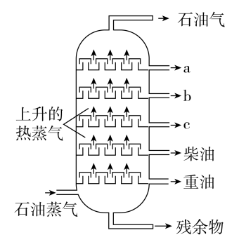

- **A**. 石油是一种混合物
- **B**. a、b、c中沸点最高的是a　✅
- **C**. 柴油中碳元素的百分含量比重油低
- **D**. 分馏的残留物还可以制得其他产品

**答案**：B

**官方解析**

A项：石油是由多种烷烃、环烷烃等有机物组成的混合物，正确；
B项：石油分馏塔越往上温度越低，石油蒸气在石油分馏塔内上升的过程中，沸点高的物质会先进行液化，沸点低的物质则会逐渐上升，在塔的高处液化，所以越往上物质的沸点越低，所以a、b、c中沸点最高的是c，错误；
C项：由B项的分析可知重油的沸点比柴油的沸点高，沸点的高低与物质中碳原子的多少有关，物质中碳原子越多，物质的沸点也就越高，所以柴油中碳元素的百分含量比重油低，正确；
D项：石油分馏出的残留物主要是沥青，可以用于制造涂料、塑料等，正确。
本题为选非题，故正确答案为B。

---

### 第 5 题　qid 4651910 · 类比推理

汽车安全气囊中的填充物主要成分是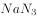、和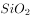。汽车发生猛烈碰撞时，分解，生成甲、乙两种单质，有关的化学方程式为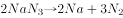；的作用是与可能会对人体造成伤害的单质甲反应，生成单质乙和两种氧化物。以下推断错误的是<u>　　</u>。

- **A**. 
汽车安全气囊里的气体是氮气

- **B**. 
单质甲是金属钠

- **C**. 
安全气囊中受到剧烈撞击反应迅速 

- **D**. 
与单质甲反应后有氮氧化合物生成 
　✅

**答案**：D

**官方解析**

A、B两项：金属钠（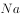）为非常活泼的金属，接触皮肤会与皮肤表面的水分发生剧烈的化学反应，生成强碱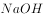，会对人体造成伤害，而氮气（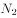）不会对人体造成伤害，可知单质甲为金属钠，单质乙为氮气，根据反应方程式可知分解后产生了大量氮气，而也可以与反应生成氮气，因此安全气囊里的气体是氮气，A、B两项均正确；

C项：由于安全气囊需要在汽车发生事故的极短时间内充气来保护驾驶员和乘客，因此安全气囊中受到剧烈撞击后，会在极短时间内释放，即安全气囊中受到剧烈撞击反应迅速，正确；

D项：根据与反应生成单质乙和两种氧化物，单质乙为，则另外两种氧化物分别为钠的氧化物和钾的氧化物，故没有氮氧化合物生成，错误。

本题为选非题，故正确答案为D。

---

### 第 6 题　qid 4651911 · 逻辑判断

如图所示为一定质量的水的体积在0-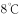范围内随温度变化的图像。根据图像及水的其他性质，下列分析判断正确的是<u>　   　</u>。

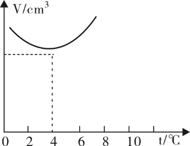

- **A**. 
因热胀冷缩，任何情况下水的体积都随温度升高而增大

- **B**. 
在冬季气温为的情况下，池塘里水温可能是上热下冷

- **C**. 
在冬季气温为的情况下，池塘里水温可能是上冷下热
　✅
- **D**. 
夏季池塘中上层的水可能比下层的水凉 

**答案**：C

**官方解析**

A项：根据图像可知，在0-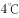时，水的体积随温度的升高而减小，在大于时，水的体积随温度的升高而增大，因此不是在任何情况下水的体积都随温度升高而增大，错误；

B、C两项：当冬季气温为时，池塘表面的水温接近外界气温，约为，由图像可知，一定质量的水在1℃时的体积大于在时的体积，即水在时的密度小于在时的密度，因此的水会由于密度更大而下沉，所以冬季池塘里的水温可能是上冷下热，B项错误，C项正确；

D项：根据图像可知，在以上时，随温度升高，水的体积增大，密度减小。在夏季（温度远大于），池塘表面的水与气温接近，温度较高，则密度较小，而温度稍低的水会由于密度更大而沉到底部，即下层的水比上层的水凉，D项错误。

故正确答案为C。

---

### 第 7 题　qid 4651912 · 逻辑判断

如图所示为某人设计的一种测量装置的电路，其中AB部分为四分之一圆弧的电阻丝，一段柔软的细金属丝拴一小球悬挂于O点并与电阻丝良好接触，将其放在水平行驶的汽车中，则该装置可以测量汽车的<u>            </u>。

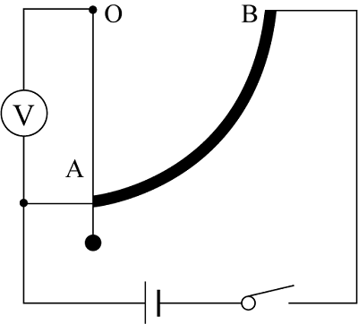

- **A**. 速度大小，电压表数值越大，汽车速度越大
- **B**. 速度大小，电压表数值越大，汽车速度越小
- **C**. 加速度大小，电压表数值越大，汽车加速度越大　✅
- **D**. 加速度大小，电压表数值越大，汽车加速度越小

**答案**：C

**官方解析**

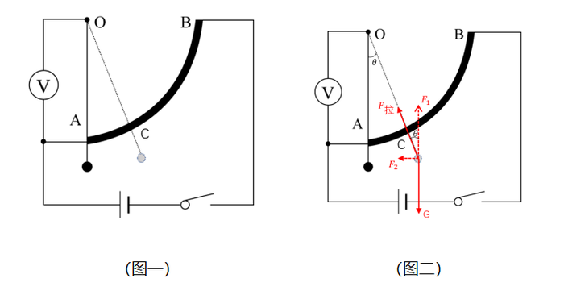

如图所示，小球由细金属丝连接于O点，小球可绕O点摆动，当小球运动到图一所示的位置时，金属丝与电阻丝相交于C点，此时电压表测量AC段电阻两端电压；

若汽车做匀速直线运动，小球也做匀速直线运动，即处于平衡状态，则不会绕O点摆动，金属丝与电阻丝相交于A点，此时电压表无示数，故无法测量汽车速度大小，A、B两项错误；

若汽车水平方向存在加速度，小球与车的加速度相同，根据牛顿第二定律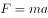可知，小球水平方向的加速度越大，水平方向所需要的合外力越大，如图二所示，对小球进行受力分析，将小球受到的拉力分解成水平方向和竖直方向，竖直方向上的分力与重力大小相等，方向相反，水平方向上的分力即为小球所受合外力，由受力分析图可知，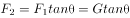，若车的加速度越大，小球为了与车达到相同的加速度，需要更大的合外力，即也会更大，金属丝与竖直方向的夹角也越大，则AC段长度越大，电压表所检测部分电阻越大，根据串联分压规律可知，电压表示数将会越大。因此该装置可以用于测量汽车加速度大小，且电压表数值越大，表示汽车加速度越大。

故正确答案为C。

---

### 第 8 题　qid 4652032 · 逻辑判断

当远洋货轮从中纬度的东海开往赤道附近的过程中，由于地球赤道半径比两极半径更大，同一物体在低纬度所受的地心引力比高纬度地区小，因此可判断船在行进的过程中所受浮力会______。假设海水的密度一定，则此过程中轮船排开水的体积______。

- **A**. 变小，不变　✅
- **B**. 变大，变小
- **C**. 不变，不变
- **D**. 变小，变大

**答案**：A

**官方解析**

根据题意可知，同一物体在低纬度所受的地心引力比高纬度地区小，物体所受重力是由地心引力提供，所以物体在低纬度地区所受重力较小，则该船由中纬度地区向赤道附近（低纬度）行进的过程中，所受重力会变小，由于船舶始终漂浮于海面上，其所受浮力与重力大小相等，因此船舶所受浮力会变小，B、C两项均错误；根据重力公式可知，物体质量不变，重力减小是因为重力加速度变小，根据浮力公式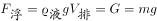，可知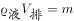，

当物体质量与液体密度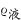不变时，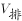也不变，即轮船排开水的体积不变，A项正确，D项错误。

故正确答案为A。

---

### 第 9 题　qid 4652037 · 逻辑判断

应用储能介质（某种结晶水合物）储存和再利用太阳能是一项新技术。其原理是：当白天阳光照射时，储能介质熔化，同时吸收热能；当夜晚降温时，储能介质凝固，同时释放出热能。某地区白天气温可达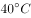，夜晚可下降至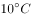，若应用上述技术调节室温，根据下表中几种常见的储能介质的数据，最佳选用<u>            </u>。

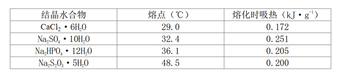

- **A**. 
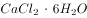

- **B**. 
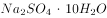
　✅
- **C**. 
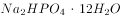

- **D**. 
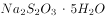

**答案**：B

**官方解析**

根据题干信息可知，选取的物质需要满足白天能熔化、晚上能凝固的条件，也就是要求选取的物质熔点在-的范围内，D项错误；根据表格中各结晶水合物熔化时吸收的热量大小可知，单位质量可储存的能量最多，故最佳选用为储能介质。

故正确答案为B。

---

### 第 10 题　qid 4652038 · 类比推理

F1赛车中，赛车手为了提升成绩，往往喜欢追求高速转弯。但高速转弯很容易侧滑出跑道引起事故。当赛车进入如图的弯道时，图中的4条路线中较合理的是<u>          </u>。

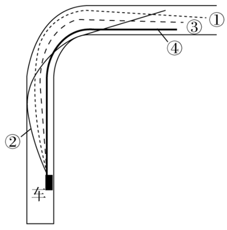

- **A**. 虚线①
- **B**. 实线②　✅
- **C**. 虚线③
- **D**. 实线④

**答案**：B

**官方解析**

赛车在转弯时做圆周运动，需要向心力，该向心力由车轮与地面之间的侧向静摩擦力提供，赛车高速转弯时若该静摩擦力不足以提供向心力，则赛车很容易侧滑出跑道。为避免赛车高速转弯时引起事故，根据向心力公式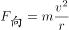可知，当赛车以相同的速度行驶时，轨道半径越大，所需向心力越小，越不容易侧滑出跑道，由图可知，2号轨道的半径最大，故选择2号路线。

故正确答案为B。

---

### 第 11 题　qid 4652043 · 逻辑判断

一般情况下，洗衣机在正常工作时是非常平稳的。而关掉电源以后，洗衣机先是振动越来越剧烈，之后振动又逐渐减弱直至停止振动。对这一现象，下列解释正确的是        。

- **A**. 正常工作时，洗衣机波轮的运转频率比洗衣机的固有频率大很多　✅
- **B**. 正常工作时，洗衣机波轮的运转频率比洗衣机的固有频率小很多
- **C**. 正常工作时，洗衣机波轮的运转频率与洗衣机的固有频率相等
- **D**. 关掉电源后，洗衣机的固有振动频率发生了改变

**答案**：A

**官方解析**

关掉电源以后，洗衣机波轮的运转频率逐渐降低，之所以振动越来越剧烈，是因为运转频率逐渐接近洗衣机的固有频率，发生了共振，当运转频率与固有频率相等时，振动达到最强，之后运转频率继续减小，逐渐远离洗衣机固有频率，振动越来越弱，可见在洗衣机正常工作时，波轮的运转频率大于洗衣机的固有频率，A项正确，B、C两项均错误；洗衣机的固有频率是其本身的属性，与其他因素无关，固有频率不会因关掉电源而发生变化，D项错误。
故正确答案为A。

---

### 第 12 题　qid 4652044 · 类比推理

一款手机充电宝标有“20000mAh，5V”的字样，某手机电池的容量为“4200mAh，5V”。当上述的充电宝显示电量为45%时，对电量显示为55%的上述手机进行充电。充电时电流为2A，则        。

- **A**. 充电宝恰好能把手机充足电
- **B**. 充电宝不能将手机充足电
- **C**. 手机充足电需要的时间约为1小时　✅
- **D**. 充电宝供电时是将电能转化为化学能

**答案**：C

**官方解析**

mAh为电量单位，充电宝剩余电量为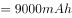，手机充满电需要的电量为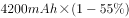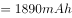，远远小于充电宝剩余电量，故充电宝不仅可以把手机电池的电量充满，还会有电量剩余，故A、B两项错误；根据电流定义公式可知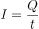，充电时间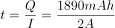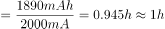，故手机充满电需要的时间约为1小时，C项正确；充电宝供电是化学能转变为电能的过程，D项错误。

故正确答案为C。

---

### 第 13 题　qid 4652047 · 逻辑判断

如图所示为蜂鸟在空中悬停的受力分析，根据图示内容判断蜂鸟能够悬停的主要原因是：

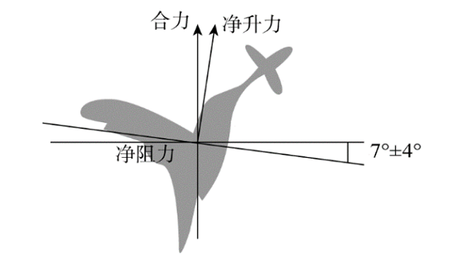

- **A**. 蜂鸟振翅的频率高，每秒可达50~70次
- **B**. 蜂鸟振翅的幅度大
- **C**. 蜂鸟振翅的方向非常接近水平面　✅
- **D**. 蜂鸟体重轻

**答案**：C

**官方解析**

一般鸟类上下扇动翅膀时，不但会得到升力，还会得到向前的力，因此既会上升，同时也会往前飞。蜂鸟可以自由调节其翅膀的角度，由图可见，蜂鸟振翅的方向非常接近水平面，这导致其几乎不会获得向前的动力，而会获得与竖直方向很接近的净升力。若将净升力进行分解，其水平方向的分力将与净阻力在水平方向的分力平衡，因此净升力与净阻力的合力为竖直向上，刚好能与竖直向下的重力平衡，从而使蜂鸟悬停在空中。因此，蜂鸟悬停的关键因素是其振翅的方向，C项正确。
故正确答案为C。

---

### 第 14 题　qid 4652034 · 图形推理

下列选项中，符合所给图形的变化规律的是（    ）。

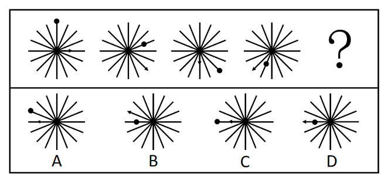

- **A**. A
- **B**. B
- **C**. C　✅
- **D**. D

**答案**：C

**官方解析**

元素组成相同，优先考虑位置规律。观察发现，小黑球每次顺时针平移3步，位置依次在线的外端、线的内部循环；小箭头每次顺时针平移2步，位置依次在线的内部、线的外端循环。因此？处图形的小黑球应在左侧横线的外端，小箭头应在左侧横线的内部，只有C项符合。
故正确答案为C。

---

### 第 15 题　qid 4652031 · 图形推理

下列选项中，符合所给图形的变化规律的是（    ）。

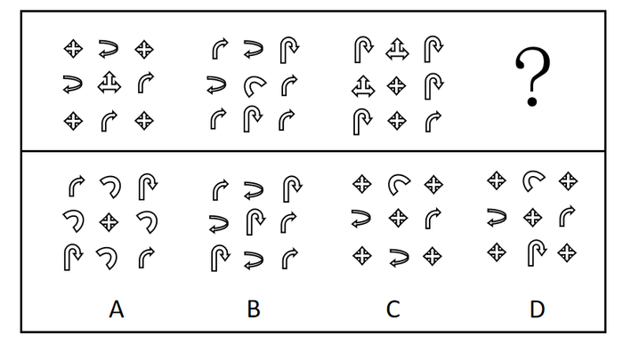

- **A**. A　✅
- **B**. B
- **C**. C
- **D**. D

**答案**：A

**官方解析**

元素组成不同，且无明显属性规律，考虑数量规律。题干出现多个小元素，优先考虑元素的种类和个数。观察发现，题干每幅图形均出现了4种元素，且每种元素的数量呈4、2、2、1分布，故？处应选择一个由4种元素构成，且每种元素的数量分别是4、2、2、1的图形，只有A项符合。
故正确答案为A。

---

### 第 16 题　qid 4652042 · 图形推理

下列选项中，符合所给图形的变化规律的是（    ）。

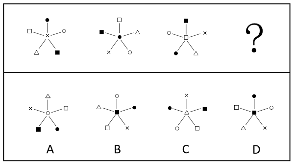

- **A**. A
- **B**. B　✅
- **C**. C
- **D**. D

**答案**：B

**官方解析**

元素组成相同，优先考虑位置规律。每幅图位于左上角的元素沿顺时针移动1格，位于左下角的元素沿逆时针移动2格，位于右上角的元素沿顺时针移动1格，位于右下角的元素沿顺时针移动2格，位于顶部的元素移动到中间，位于中间的元素移动到左下角，只有B项符合。
故正确答案为B。

---

### 第 17 题　qid 4652033 · 图形推理

下列选项中，符合所给图形的变化规律的是（    ）。

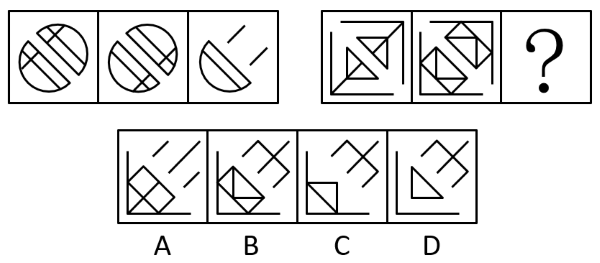

- **A**. A
- **B**. B
- **C**. C
- **D**. D　✅

**答案**：D

**官方解析**

图形元素组成相似，且相同线条重复出现，优先考虑样式规律中的加减同异。观察发现，在第一组图形中，第一个图形与第二个图形的右上部分去同存异得到第三个图形的右上部分，第一个图形与第二个图形的左下部分求同得到第三个图形的左下部分，故第二组图形应遵循同样的规律，只有D项符合。
故正确答案为D。

---

### 第 18 题　qid 4651982 · 图形推理

下列选项中，符合所给图形的变化规律的是（    ）。

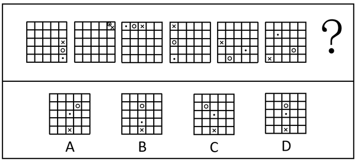

- **A**. A
- **B**. B
- **C**. C
- **D**. D　✅

**答案**：D

**官方解析**

元素组成相同，优先考虑位置规律。黑点先在外圈按照逆时针方向，每次移动4格，到图四走完外圈所有位置之后图五进入内圈，继续逆时针移动4格，到？处应该在图形第三行第三列的位置（移动轨迹如下图红线所示）；先在外圈按照逆时针方向，每次移动3格，到图五经历完外圈之后，图六进入内圈继续逆时针移动3格，到？处应该在图形第二行第三列的位置（移动轨迹如下图蓝线所示）；×在外圈按照逆时针方向，每次移动2格，到？处应该在图形第五行第三列的位置（移动轨迹如下图黄线所示），只有D项符合。

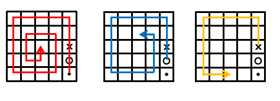

故正确答案为D。

---

### 第 19 题　qid 4651991 · 图形推理

下列选项中，符合所给图形的变化规律的是：

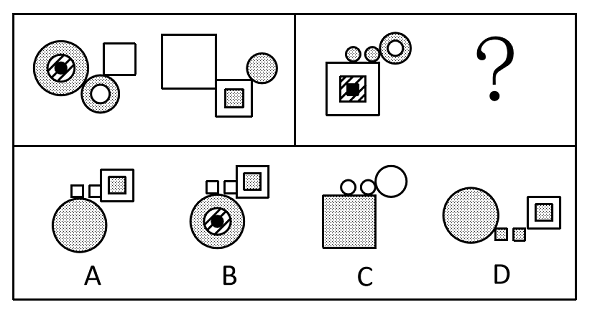

- **A**. A　✅
- **B**. B
- **C**. C
- **D**. D

**答案**：A

**官方解析**

元素组成相似，优先考虑样式规律。观察发现，第一组图一中圆圈和方块互换得到图二，排除C、D两项。继续观察发现，第一组图一中带有黑圆的阴影部分在图二中没有保留，故第二组中图一带有黑方块的阴影部分也不应该保留，只有A项符合。
故正确答案为A。

---

### 第 20 题　qid 4651995 · 图形推理

下列选项中，符合所给图形的变化规律的是：

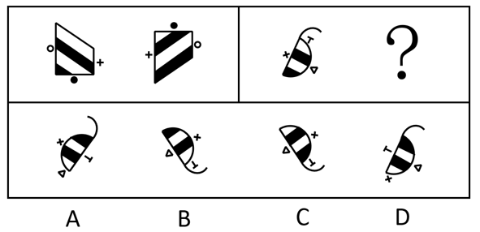

- **A**. A
- **B**. B
- **C**. C　✅
- **D**. D

**答案**：C

**官方解析**

元素组成相同，优先考虑位置规律。第一组图1上下翻转后得到 ，左右两个小元素位置互换，梯形内部黑白颜色互换得到图2；第二组遵循相同规律，图1上下翻转后得到，左右两个小元素位置互换，半圆内部黑白颜色互换得到C项。

故正确答案为C。

---

### 第 21 题　qid 4651997 · 图形推理

下列选项中，符合所给图形变化规律的是：

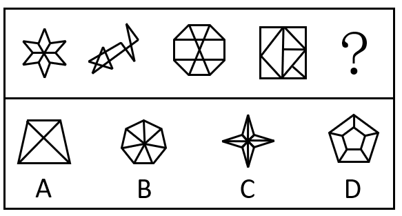

- **A**. A
- **B**. B
- **C**. C
- **D**. D　✅

**答案**：D

**官方解析**

解法一：元素组成不同，可以考虑数量规律。观察发现，题干图形明显被分割，可以考虑面数量。题干图形的面数量依次为6、8、10、8、？，可以得出根据题干图3左右两边图形面数量对称，故？处图形的面数量应为6，只有D项满足规律。
故正确答案为D。
解法二：元素组成不同，可以考虑属性规律。观察发现，题干图形依次为轴+中心对称图形、非对称图形、轴+中心对称图形、非对称图形、？，可以得出题干图形为轴+中心对称图形与非对称图形交替出现，故？处图形应为轴+中心对称图形，只有C项满足规律。
故正确答案为C。
注：本题这两种解题规律都不常规，上海考生简单了解基本解题思路即可，其他省份考生无需作为备考重点。

---

### 第 22 题　qid 4652004 · 图形推理

下列选项中立方体①肯定能转成立方体②的是：

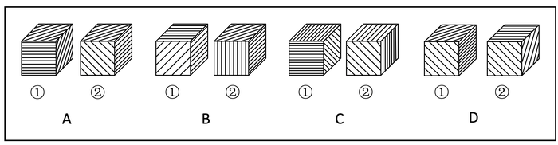

- **A**. A
- **B**. B
- **C**. C
- **D**. D　✅

**答案**：D

**官方解析**

将每个面标上序号，如下图所示，逐一分析选项。

A项：以三个面的公共点为起点，在面a内沿顺时针方向画边，立方体①中边1与面a内的线条垂直，立方体②中边1与面a内的线条平行，立方体①和立方体②中的三个面相对位置不同，因此立方体①不一定能转成立方体②，排除；

B项：立方体①中面a内的斜线指向三个面的公共点，而立方体②中面a内的斜线不指向三个面的公共点，立方体①和立方体②中的三个面相对位置不同，因此立方体①不一定能转成立方体②，排除；

C项：立方体①中面a内的斜线指向三个面的公共点，而立方体②中面a内的斜线不指向三个面的公共点，立方体①和立方体②中的三个面相对位置不同，因此立方体①不一定能转成立方体②，排除；

D项：以三个面的公共点为起点，在面a内沿逆时针方向画边，立方体①中边1与面a内的线条垂直，立方体②中边1也与面a内的线条垂直，因此立方体①和立方体②中的三个面相同，且相对位置也没有问题，立方体①肯定能转成立方体②，当选。

故正确答案为D。

---

### 第 23 题　qid 4651963 · 类比推理

把（1）图放在最左边，（2）（3）（4）图放在后面，共有6种排列，其中<u>        </u>能使四图之间存在逻辑关系。

- **A**. 只有一种排列
- **B**. 有两种排列　✅
- **C**. 有三种排列
- **D**. 有四种排列

**答案**：B

**官方解析**

题干每幅图均由大圆形、小圆形、小黑点和短折线组成，元素组成相同，优先考虑位置规律。根据题干要求，把（1）图放在最左边，（2）（3）（4）图放在后面，共有6种排列顺序。当排列顺序为（1）（2）（3）（4）时，小黑点绕着小圆形每次顺时针旋转，短折线按照在大圆形的右侧、左侧、右侧、左侧的顺序交替出现，四图之间存在逻辑关系。

当排列顺序为（1）（4）（3）（2）时，小黑点绕着小圆形每次逆时针旋转，短折线按照在大圆形的右侧、左侧、右侧、左侧的顺序交替出现，四图之间存在逻辑关系。

当排列顺序为（1）（2）（4）（3）、（1）（3）（2）（4）、（1）（3）（4）（2）或（1）（4）（2）（3）时，小黑点和短折线的位置均不存在逻辑关系。故共有两种排列能使四图之间存在逻辑关系。

故正确答案为B。

---

### 第 24 题　qid 4651988 · 图形推理

将下列六个图形按一定规律分为两大类，正确的是：

- **A**. ①③⑥，②④⑤
- **B**. ①③⑤，②④⑥
- **C**. ①⑤⑥，②③④　✅
- **D**. ①②④，③⑤⑥

**答案**：C

**官方解析**

本题为分组分类题目。观察发现，每个图形都有两个小黑点，考虑功能元素。将题干图形的两个小黑点进行连线后发现，图①⑤⑥中两个小黑点的连线与图形内部线条垂直，图②③④中两个小黑点的连线与图形内部线条平行，故图①⑤⑥为一组，图②③④为一组。
故正确答案为C。

---

### 第 25 题　qid 2616493 · 图形推理

下列两组图形均由（1）（2）（3）三个图形组成，三个图形之间存在一定变化规律。按其规律右边这组图形中，图（3）应为：

- **A**. A
- **B**. B
- **C**. C　✅
- **D**. D

**答案**：C

**官方解析**

本题为两组图形式，先看第一组图找规律。观察发现，图（1）和图（2）元素组成相同，考虑位置规律，图（1）顺时针旋转可以得到图（2）；图（3）与前两幅图元素组成相似，有相同线条重复出现，考虑样式规律，图（1）图（2）相加可以得到图（3）。第二组遵循此规律，图（1）旋转后得到图（2）如下图所示，图（1）图（2）相加得到图（3），只有C项符合，当选。

故正确答案为C。

---

### 第 26 题　qid 4652016 · 逻辑判断

处于北方的甲城干旱少雨，高大的乔木树种在这里无法存活，南方常见的阔叶树种在这里几乎看不到，生长在甲城的树都是耐旱树，即使是市民在室内种植的盆栽树种也以松柏类为主。
根据以上陈述，可以得出下列（    ）项。

- **A**. 市民在室内种植的盆栽树种在南方不常见
- **B**. 有些耐旱树并不是高大的乔木树种　✅
- **C**. 有些生长在南方的松柏类树种可以长成高大的乔木
- **D**. 有些阔叶树也可以在室内种植

**答案**：B

**官方解析**

日常结论题，根据题干信息逐一分析选项。
A项：题干中指出“市民在室内种植的盆栽树种以松柏类为主”，但并未提及松柏类在南方是否常见，无中生有，无法推出，排除；
B项：题干中指出“高大的乔木树种在甲城无法存活”“生长在甲城的树都是耐旱树”，说明生长在甲城的这些耐旱树不是高大的乔木，可以推出，当选；
C项：文段没有提及生长在南方的松柏类树种，无中生有，无法推出，排除；
D项：题干中指出“阔叶树种在甲城几乎看不到”“市民在室内种植的盆栽树种以松柏类为主”，并未提及阔叶树是否可以在室内种植，无中生有，无法推出，排除。
故正确答案为B。

---

### 第 27 题　qid 4652020 · 逻辑判断

在一次人工智能测试中，测试员让一个人类被试者和人工智能一起回答同一组试题，得到两份答案。另一群不知情的专家通过分析两份答案来判断哪一份出自人类，哪一份出自计算机，结果判断的错误率接近50%。看起来人工智能表现过于优异，其智能水平远超预期。有人认为，这个结果表明试题本身的设计可能有问题。
为了使上述结论成立，下列（    ）项命题最适合作为补充条件。

- **A**. 这个人工智能之前并没有通过图灵测试
- **B**. 专家的判断能力是很强的
- **C**. 测试员并没有在测试过程中作弊
- **D**. 该人工智能从设计上不应该与人类有如此接近的表现　✅

**答案**：D

**官方解析**

第一步：找出论点和论据。
论点：这个结果表明试题本身的设计可能有问题。
论据：在一次人工智能测试中，测试员让一个人类被试者和人工智能一起回答同一组试题，得到两份答案。另一群不知情的专家通过分析两份答案来判断哪一份出自人类，哪一份出自计算机，结果判断的错误率接近50%。看起来人工智能表现过于优异，其智能水平远超预期。
本题论据说的是人工智能表现过于优异，论点说的是试题可能有问题，论点和论据话题不一致，优先考虑搭桥，即在“人工智能表现过于优异”和“试题本身设计可能有问题”之间建立联系。
第二步：逐一分析选项。
A项：该项指出人工智能之前没有通过图灵测试（注：图灵测试是一种测试机器是不是具备人类智能的方法），即在图灵测试中，这个人工智能不具备人类智能，试题可能真的有问题，补充论据加强，保留；
B项：该项指出专家的判断能力是很强的，说明论据的可信度很高，补充论据加强，保留；
C项：测试员没有作弊，肯定了人工智能优异表现的客观性，补充论据加强，保留；
D项：该人工智能从设计上不应该与人类有如此接近的表现，即不可能过于优秀得让专家判断不出来谁是计算机谁是人类，所以可能是试题本身存在问题，建立了“人工智能表现过于优异”和“试题本身设计可能有问题”之间的联系，搭桥项，可以加强，保留。
对比上述选项，搭桥的加强力度大于补充论据，D项当选。
故正确答案为D。

---

### 第 28 题　qid 4651931 · 逻辑判断

业主小赵问物业公司的老王：“你是物业公司的员工吗？”
老王：“是的。”
小赵：“物业是为业主服务的吗？”
老王：“是的。”
小赵：“那么，你为什么不为我服务？”
下列（    ）项和上述小赵的论证错误最为类似。

- **A**. 甲乙两国是邻邦，所以，作为两国人的你我应该成为好朋友
- **B**. 你们村应该感谢我们公司每年提供大量无息贷款和捐赠物资，所以，你应该感谢我　✅
- **C**. 每片雪花都不愿意承认自己是雪崩的罪魁祸首，但其实每片雪花都对雪崩负有责任
- **D**. 张某、陈某都是甲地人，他们两人都获得了医学博士学位，由此可见，甲地出医学人才

**答案**：B

**官方解析**

第一步：分析题干论证方式。
题干为物业为“业主”服务，这里的“业主”是整体概念，而小赵偷换概念，变成了“每一位业主”，即为小赵个人服务，论证错误为“整体概念”被偷换为其中的“每个人概念”。
第二步：逐一分析选项。
A项：该项中甲乙两国是“邻邦”，即相邻，你和我应该成为好朋友，即关系好，前后说的完全是两件不同的事，而题干都在说“服务”，与题干逻辑错误不一致，排除；
B项：该项中你们村应该感谢我们公司，这里“我们公司”是整体概念，而句中偷换概念，变成了个人“我”，与题干逻辑错误一致，当选；
C项：该项中前后两句的“每片雪花”都是在表达每个个体的意思，前后并没有偷换概念，与题干逻辑错误不一致，排除；
D项：该项中张某、陈某都是甲地人，且都获得医学博士学位，所以推出甲地出医学人才，属于从部分推出整体，与题干逻辑错误不一致，排除。
故正确答案为B。

---

### 第 29 题　qid 4651945 · 逻辑判断

宫观位于高山之巅，层峦拥翠，巉岩宿云，登临其上，顿感天近云低，有如离尘绝世。宫后有亭，登亭纵目，眼底群峦，尽伏槛下，清江如带，横呈天际，平畴庐舍，宛若图画。想到所见道观所在无不是名山大川，游览者小陈推测，古代道观的选址，一定都在风景绝美之处。
下列各项如果为真，（    ）项最能质疑小陈的推测。

- **A**. 不仅是道教建筑处于名山大川，其他宗教建筑大多也风景如画
- **B**. 由于长期以来环保意识薄弱，许多道观周边风景遭到了很大的破坏
- **C**. 周边景色一般的道观，往往地处城镇，历经战乱和改建，基本消失绝迹了　✅
- **D**. “小隐隐于野，中隐隐于市，大隐隐于朝”真正的道德之士追求的是精神的净土和心灵的宁静

**答案**：C

**官方解析**

第一步：找出论点与论据。
论点：古代道观的选址，一定都在风景绝美之处。
论据：所见道观所在无不是名山大川。
论点论据均在探讨道观选址风景优美，话题一致，削弱优先考虑削弱论点。
第二步：逐一分析选项。
A项：该项说的是其他宗教建筑大多也风景如画，而论点讨论的是古代道观选址是否都在风景绝美之处，话题不一致，无法削弱，排除；
B项：该项说的是许多道观周边风景遭到了破坏，与论点讨论的古代道观选址是否都在风景绝美之处无关，话题不一致，无法削弱，排除；
C项：该项指出道观也会选址在周边景色一般的地方，只不过由于战乱和改建的原因而绝迹看不到了，直接削弱论点，当选；
D项：该项说的是真正的道德之士追求的是精神的净土和心灵的宁静，与论点讨论的古代道观选址是否都在风景绝美之处无关，话题不一致，无法削弱，排除。
故正确答案为C。

---

### 第 30 题　qid 4651956 · 逻辑判断

去年全年甲城市的空气质量优良天数比乙城市的空气质量优良天数多了15%。因此，甲城市的管理者去年在环境保护和治理方面采取的措施比乙城市的更加有效。
下列哪项问题的答案最能对上述结论做出评价？

- **A**. 甲、乙两个城市在环境保护和治理方面采取的措施有何不同
- **B**. 在环境保护和治理方面采取的措施能否在短时间内起到提升空气质量的效果
- **C**. 甲城市的居民因空气质量引发的健康问题是否比乙城市更少
- **D**. 如果采取了甲城市的措施，乙城市的空气质量是否也能得到显著提升　✅

**答案**：D

**官方解析**

第一步：找出论点和论据。
论点：甲城市的管理者去年在环境保护和治理方面采取的措施比乙城市的更加有效。
论据：去年全年甲城市的空气质量优良天数比乙城市的空气质量优良天数多了15%。
第二步：逐一分析选项。
A项：讨论甲、乙两个城市采取的措施的差异，但论点讨论的是甲、乙两个城市哪个城市的措施更有效，话题不一致，无法评价，排除；
B项：讨论环境保护和治理方面采取的措施的时效性，但论点讨论的是甲、乙两个城市哪个城市的措施更有效，话题不一致，无法评价，排除；
C项：讨论甲、乙两个城市居民的健康问题，但论点讨论的是甲、乙两个城市哪个城市的措施更有效，话题不一致，无法评价，排除；
D项：讨论甲、乙两个城市措施的效果，如果采取了甲城市的措施，乙城市的空气质量可以显著提升，则说明甲城市的措施比乙城市的更有效果。反之，则无法证明甲城市的措施比乙城市的更有效，可以评价，当选。
故正确答案为D。

---

### 第 31 题　qid 4651973 · 逻辑判断

为了明确B型烟粉虱和温室白粉虱在温度逆境下的生存特性对其种群发展的影响，研究人员对其进行了高温和低温暴露试验。结果表明，B型烟粉虱和温室白粉虱对温度逆境的适应性存在差异：B型烟粉虱对高温的适应性要高于温室白粉虱；温室白粉虱对高温敏感，但对低温的适应性要显著高于B型烟粉虱。研究人员据此推测，两种粉虱对温度逆境适应性的差异是导致其种群发展存在差异的一个重要原因。
下列各项如果为真，                    项能支持上述研究人员的推测。
（1）B型烟粉虱和温室白粉虱的卵、伪蛹和成虫在37℃～45℃下暴露1～2小时，其存活率均随着温度的上升而降低；
（2）B型烟粉虱的卵、伪蛹和成虫在37℃、39℃、41℃、43℃、45℃下暴露1～2小时后，3种供试虫态的存活率均高于温室白粉虱；
（3）B型烟粉虱在2℃下暴露2～12天，各供试虫态的存活率迅速下降，卵、2～3龄若虫、伪蛹在2℃下暴露12天后均不能存活，成虫在2℃下暴露4天后也全部死亡；而温室白粉虱卵、伪蛹在2℃下暴露12天后其存活率还能超过45%，成虫在2℃下暴露7天后仍有80%能够存活。

- **A**. 仅（1）（2）
- **B**. 仅（1）（3）
- **C**. 仅（2）（3）　✅
- **D**. （1）（2）（3）均可

**答案**：C

**官方解析**

第一步：找出论点和论据。
论点：两种粉虱对温度逆境适应性的差异是导致其种群发展存在差异的一个重要原因。
论据：B型烟粉虱对高温的适应性要高于温室白粉虱；温室白粉虱对高温敏感，但对低温的适应性要显著高于B型烟粉虱。
论点讨论的是两种粉虱对温度适应性的差异导致了种群发展差异，论据解释了B型烟粉虱对高温的适应性更高，温室白粉虱对低温的适应性更高，即讨论了两种粉虱对温度适应性的差异，论点、论据话题一致，加强优先考虑补充论据。
第二步：逐一分析选项。
（1）：两种粉虱在37℃～45℃下暴露相同时间时，存活率均随着温度的上升而降低，说明两种粉虱在相同温度下暴露相同时间，其存活情况相同，削弱论点，无法支持；
（2）：B型烟粉虱在37℃、39℃、41℃、43℃、45℃下存活率均高于温室白粉虱，说明B型烟粉虱在相对较高的温度下，适应性高于温室白粉虱，补充论据，可以支持；
（3）：在2℃下，B型烟粉虱的存活率低于温室白粉虱，说明在相对低温下，温室白粉虱的适应性高于B型烟粉虱，补充论据，可以支持。
综上，仅（2）（3）项能支持上述研究人员的推测。
故正确答案为C。

---

### 第 32 题　qid 4651987 · 逻辑判断

虫洞和黑洞都是爱因斯坦广义相对论预言的特殊时空结构，黑洞的存在已经被观测所证实，而虫洞依然属于理论假定。如果能证明虫洞真的存在，天文学研究将获得巨大突破。在近期的一项研究中，研究人员通过数值模拟的方法，发现黑洞落入虫洞会产生一种特殊的引力波频率渐降的信号——“反啾啾声”，这与双黑洞碰撞所产生的引力波频率渐高的“啾啾声”是不同的。研究者据此推测，未来人们可以根据这种特殊的引力波信号来搜寻宇宙中可能存在的虫洞。
以下各项如果为真，（    ）项最能质疑上述研究者的推测。

- **A**. 黑洞落入虫洞后可能存在三种结局：一是瞬间穿过虫洞到达另外一个宇宙；二是停留在虫洞喉部；三是黑洞落入虫洞后，由于引力的相互作用，又被拉回到原来的宇宙
- **B**. 黑洞围绕大质量天体绕行时，如果其运行的是椭圆轨道，所产生的引力波频率会不断变化，渐近时频率会逐渐增高，渐远时频率会逐渐降低　✅
- **C**. 黑洞落入虫洞后，由于引力的相互作用，又被拉回到原来的宇宙，此时他发出的引力波频率越来越小，发出“反啾啾声”
- **D**. 在此次研究中，研究人员模拟了一个五倍太阳质量黑洞，落入一个稳定、不旋转、可穿越的200倍太阳质量虫洞

**答案**：B

**官方解析**

第一步：找出论点和论据。
论点：未来人们可以根据这种特殊的引力波信号来搜寻宇宙中可能存在的虫洞。
论据：研究人员通过数值模拟的方法，发现黑洞落入虫洞会产生一种特殊的引力波频率渐降的信号——“反啾啾声”，这与双黑洞碰撞所产生的引力波频率渐高的“啾啾声”是不同的。
论点论据均在讨论黑洞落入虫洞会产生一种特殊的引力波频率渐降的信号，可利用该信号搜寻虫洞，论点论据话题一致，削弱优先考虑削弱论点，即无法通过引力波频率渐降的信号来搜寻虫洞。
第二步：逐一分析选项。
A项：黑洞落入虫洞后可能存在三种结局，但未明确指出这三种结局与引力波频率渐降的信号之间的关系，无法得知是否可以通过引力波频率渐降的信号来搜寻虫洞，无关选项，排除；
B项：黑洞围绕大质量天体绕行时，如果其运行的是椭圆轨道，渐远时引力波频率会逐渐降低，而宇宙中的大质量天体并非只有虫洞，那么即便探测到引力波频率渐降的信号，也不代表搜寻到了虫洞，所以就无法通过引力波频率渐降的信号来搜寻虫洞，削弱论点，当选；
C项：解释了黑洞落入虫洞后会发出“反啾啾声”的原因，补充论据，为加强项，排除；
D项：详细描述了研究人员的研究内容，与论点讨论的通过引力波频率渐降的信号来搜寻虫洞无关，无关选项，排除。
故正确答案为B。

---

### 第 33 题　qid 4652009 · 类比推理

某小型规划设计工作室总共有42人，小明说：“这个工作室应该有人有注册规划类的证书”，小李说：“这个工作室应该有人没有注册规划类的证书”，小王说：“工作室的负责人应该没有注册规划类的证书”。若只有一个人说对了，那么这个工作室有        人有注册规划类的证书。

- **A**. 42　✅
- **B**. 41
- **C**. 1
- **D**. 0

**答案**：A

**官方解析**

第一步：找出题干反对命题。
（1）有人有注册规划类的证书；
（2）有人没有注册规划类的证书；
（3）工作室的负责人应该没有注册规划类的证书。
条件（1）与（2）为两个“有的”，必有一真。而根据只有一个人说对了可知唯一的一真在条件（1）和（2）中，那么条件（3）一定为假。
第二步：看其余。
根据条件（3）为假，其矛盾命题“工作室的负责人有注册规划类的证书”为真，可推出条件（1）有人有注册规划类的证书为真。由于题干只有一句话为真，那么条件（2）为假，其矛盾命题“所有人都有注册规划类证书”为真，所有人即为42人，对应A项。
故正确答案为A。

---

### 第 34 题　qid 4652000 · 逻辑判断

近年来，面向大众的哲学教育逐渐普及到了青少年甚至儿童群体中。让孩子在很小的时候接受思想的启蒙与教化是一件好事。但是，从事这一教育工作的大部分教师的本职工作都是在高校中教授哲学，对于青少年的哲学教育并没有统一标准和成熟的纲领计划。如果哲学教师不懂得青少年的心智发展规律，使用不恰当的教育方式，反而对孩子的心智开发没有正面效果，甚至弊大于利。
下面（    ）项最能够成为上述结论的例证。

- **A**. 张老师想让初中同学理解哲学与自然科学的关联，经常在哲学课上提到自然科学中的案例
- **B**. 王老师每次上课都使用自己的PPT进行生动的解释说明，但很少引用哲学家的原著或原话来阐发哲学观点
- **C**. 赵老师希望告诉学生严密的论证对于哲学思想具有关键意义，在课程中展示了许多推理与反驳的案例
- **D**. 李老师为了让实验小学的学生明白阅读经典哲学家的原著对于理解哲学的必要性，规定同学每天回家阅读至少20页德国哲学家胡塞尔的巨著《纯粹现象学与现象学哲学的观念》　✅

**答案**：D

**官方解析**

第一步：找出论点和论据。
论点：如果哲学教师不懂得青少年的心智发展规律，使用不恰当的教育方式，反而对孩子的心智开发没有正面效果，甚至弊大于利。
论据：无
本题只有论点没有论据，且提问方式为“下面哪项最能够成为上述结论的例证”，加强考虑补充论据，说明不恰当的教育方式对孩子的心智开发没有正面效果。
第二步：逐一分析选项。
A项：张老师通过举例的方式帮助初中同学理解哲学与自然科学的关联，是恰当的教育方式，因此无法成为例证，无法加强，排除；
B项：王老师利用PPT生动地为学生解释说明，很少直接用哲学家的话来阐发观点，该做法便于学生理解和接受，是恰当的教育方式，因此无法成为例证，无法加强，排除；
C项：赵老师通过案例帮助学生理解严密论证的意义，是恰当的教育方式，因此无法成为例证，无法加强，排除；
D项：李老师让实验小学的学生每天读哲学家胡塞尔的巨著，该方式是不恰当的，因为小学生的识字、阅读、理解能力都有限，而哲学家的哲学原著往往较为晦涩，所以学生的阅读会异常艰难，无法达到良好的效果，甚至可能引发学生的畏难和抵触情绪，带来负面影响，可以成为例证，可以加强，当选。
故正确答案为D。

---

### 第 35 题　qid 4652021 · 类比推理

阿根廷大学的一位老师让五位留学生看校史上的五位大数学家的画像，让每位学生任意挑选两幅画像说出名字。
张说：“2号是高斯，3号是黎曼。”
倪说：“1号是希尔伯特，2号是闵可夫斯基。”
朱说：“3号是闵可夫斯基，5号是希尔伯特。”
韦说：“2号是高斯，4号是外尔。”
方说：“4号是外尔，1号是黎曼。”
老师发现每位学生都只说对了一半，那么1号画像是        。

- **A**. 黎曼
- **B**. 闵可夫斯基
- **C**. 希尔伯特
- **D**. 高斯　✅

**答案**：D

**官方解析**

此题为组合排列题，题干信息不确定，优先考虑代入法解题。
代入A项，1号是黎曼，要保证张说的只对一半，则2号是高斯，但此时倪的说法均错误，不符合题干要求，排除；
代入B项，1号是闵可夫斯基，此时倪的说法均错误，不符合题干要求，排除；
代入C项，1号是希尔伯特，要保证朱说的只对一半，则3号是闵可夫斯基，此时要保证张说的只对一半，则2号是高斯，要保证韦说的只对一半，则4号不是外尔，但此时方的说法均错误，不符合题干要求，排除；
代入D项，1号是高斯，可推出3号是黎曼，2号是闵可夫斯基，5号是希尔伯特，4号是外尔，符合题干要求，当选。
故正确答案为D。

---
