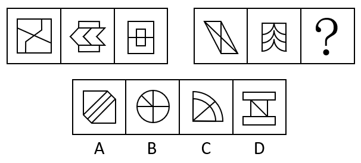
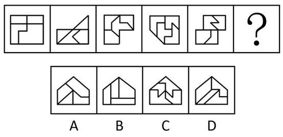
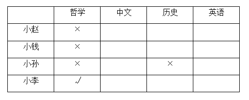

# 2022年北京市公务员录用考试《行测》题（网友回忆版）

> 判断推理 · 30 题 · 北京 2022

## 第 1 题　qid 4652224 · 图形推理

每道题包含两套图形和可供选择的4个图形。这两套图形具有某种相似性，也存在某种差异。要求你从四个选项中选择最适合取代问号的一个。正确的答案应不仅使两套图形表现出最大的相似性，而且使第二套图形也表现出自己的特征。

- **A**. A　✅
- **B**. B
- **C**. C
- **D**. D

**答案**：A

**官方解析**

元素组成不同，优先考虑属性规律。观察发现，第一套三个图形分别是中心对称图形、轴对称图形、轴对称+中心对称图形。第二套图形应遵循此规律，分别是中心对称图形、轴对称图形，故？处应选择轴对称+中心对称图形，只有A项符合。
故正确答案为A。

---

## 第 2 题　qid 4652226 · 图形推理

每道题包含两套图形和可供选择的4个图形。这两套图形具有某种相似性，也存在某种差异。要求你从四个选项中选择最适合取代问号的一个。正确的答案应不仅使两套图形表现出最大的相似性，而且使第二套图形也表现出自己的特征。

- **A**. A　✅
- **B**. B
- **C**. C
- **D**. D

**答案**：A

**官方解析**

第一组图形两两相邻比较可以发现，第一幅图中每一行黑球整体往下平移一行得到第二幅图（循环走），第二幅图中每一行黑球整体往下平移一行得到第三幅图（循环走）。第二组图形运用此规律，只有A项符合。
故正确答案为A。

---

## 第 3 题　qid 4652301 · 图形推理

每道题包含两套图形和可供选择的4个图形。这两套图形具有某种相似性，也存在某种差异。要求你从四个选项中选择最适合取代问号的一个。正确的答案应不仅使两套图形表现出最大的相似性，而且使第二套图形也表现出自己的特征。

- **A**. A
- **B**. B　✅
- **C**. C
- **D**. D

**答案**：B

**官方解析**

元素组成相似，且相同线条重复出现，优先考虑样式规律中的加减同异。问号在第二组图中间，则优先考虑图1和图3得到第二幅图的规律。观察发现，第一组图中，图1和图3求异得到图2。第二组图遵循同样的规律，图1和图3求异得到？处图形，只有B项符合。
故正确答案为B。

---

## 第 4 题　qid 4652267 · 图形推理

请从四个选项中选出最恰当的一项填在问号处，使图形呈现一定的规律性。

- **A**. A
- **B**. B　✅
- **C**. C
- **D**. D

**答案**：B

**官方解析**

元素组成不同，且无明显属性规律，优先考虑数量规律。观察发现，题干图形明显被分割，优先考虑面数量。整体数面发现，题干和选项都为4个面，继续考虑面的细化，发现题干每幅图都包含两个相同面，观察选项，只有B项符合。
故正确答案为B。

---

## 第 5 题　qid 4652269 · 图形推理

从所给的四个选项中，选择最合适的一个填入问号处，使之呈现一定的规律性：

- **A**. A　✅
- **B**. B
- **C**. C
- **D**. D

**答案**：A

**官方解析**

图形元素组成不同，且无属性规律，优先考虑数量规律。观察发现，题干图形均由黑球和白球构成，其中黑球的数量分别是8、9、10、11、12，故？处图形应有13个黑球，只有A项符合。
故正确答案为A。

---

## 第 6 题　qid 4652212 · 类比推理

小明说：“只有高级工程师才能成为公司新组建的技术专家组成员。”小红说：“不对呀，老黄是高级工程师，但是他没有被任命为技术专家组成员。”
小红的回答说明她把小明的话理解为了：

- **A**. 有的高级工程师是技术专家组成员
- **B**. 有的高级工程师不是技术专家组成员
- **C**. 所有的技术专家组成员都应该是高级工程师
- **D**. 所有的高级工程师都应该是技术专家组成员　✅

**答案**：D

**官方解析**

第一步：翻译题干。

①小明：技术专家组成员高级工程师；

②小红：老黄是高级工程师 且 技术专家组成员。

第二步：逐一分析选项。

由题干可知，小红认为小明说的不对，并进行了反驳，因此她对小明的理解就是“老黄是高级工程师 且 技术专家组成员”的矛盾命题，即“高级工程师技术专家组成员”。

A项：翻译为有的高级工程师技术专家组成员，与小红的理解不符，排除； 

B项：翻译为有的高级工程师技术专家组成员，与小红的理解不符，排除；

C项：翻译为技术专家组成员高级工程师，与小红的理解不符，排除；

D项：翻译为高级工程师技术专家组成员，与小红的理解相符，当选。

故正确答案为D。

---

## 第 7 题　qid 4652225 · 逻辑判断

某研究团队用没有生命的细菌纤维素（由细菌制造并排泄出的有机化合物，拥有许多独特的力学性能，比如柔韧性、强度和保持形状的能力）充当打印纸，用活微藻充当“墨水”，通过3D打印将活微藻沉积在细菌纤维素上，进而可以产生一种独特材料。研究人员称该项技术有望广泛应用于医疗和轻工业领域。
以下陈述如果为真，哪项无法支持上述结论？

- **A**. 该材料可以制造用于皮肤移植的光合皮肤，产生的氧气将有助于伤口修复
- **B**. 该材料能利用阳光将水和二氧化碳转化为氧气和能量，可以制造可持续能源　✅
- **C**. 该材料制成的服装不需要像传统服装那样经常清洗，能大大减少水的使用
- **D**. 该材料是可完全生物降解的高质量织物，将解决纺织业目前面临的环保问题

**答案**：B

**官方解析**

第一步：找出论点和论据。
论点：该项技术有望广泛应用于医疗和轻工业领域。
论据：某研究团队用没有生命的细菌纤维素（由细菌制造并排泄出的有机化合物，拥有许多独特的力学性能，比如柔韧性、强度和保持形状的能力）充当打印纸，用活微藻充当“墨水”，通过3D打印将活微藻沉积在细菌纤维素上，进而可以产生一种独特材料。
本题提问方式为“哪项无法支持上述结论”，故排除可以加强的选项，选择不能加强的选项即可。
第二步：逐一分析选项。
A项：指出该材料可以用于皮肤移植，有助于伤口恢复，举例说明这种材料可以用于医疗领域，可以加强，排除；
B项：指出该材料可以制造可持续能源，无法确定是否能应用于医疗和轻工业领域，无法加强，当选；
C项：指出该材料制成的服装能减少水的使用，说明这种材料可以用于服装制造业，服装制造业属于轻工业，可以加强，排除； 
D项：指出该材料将解决纺织业目前面临的环保问题，纺织业属于轻工业，可以加强，排除。
本题为选非题，故正确答案为B。

---

## 第 8 题　qid 4652281 · 逻辑判断

今年的一次大学生招聘会上，某宿舍所有6名同学均向甲公司和乙公司投递了简历。甲、乙两公司通知了他们各自所收上百份简历中一半的人员参加面试。因此，这6名同学每人获得了来自甲公司或乙公司的仅一次面试机会。
要使上述论证成立，以下哪项假设是必须的？

- **A**. 除向甲、乙公司投递简历外，该宿舍同学未向其他单位投递简历
- **B**. 该宿舍所有同学既符合甲公司的招聘条件，也符合乙公司的招聘条件
- **C**. 甲、乙两公司没有同时通知该宿舍的同一个人去参加他们的面试　✅
- **D**. 该宿舍的这6名同学都愿意参加甲公司或乙公司所通知的面试

**答案**：C

**官方解析**

第一步：找出论点和论据。
论点：这6名同学每人获得了来自甲公司或乙公司的仅一次面试机会。
论据：某宿舍所有6名同学均向甲公司和乙公司投递了简历。甲、乙两公司通知了他们各自所收上百份简历中一半的人员参加面试。
本题论点和论据均在讨论这6名同学去甲公司或乙公司面试，论点论据话题一致，且问法为“以下哪项假设是必须的”，加强优先考虑必要条件。
第二步：逐一分析选项。
A项：该项讨论的是该宿舍6名同学是否还向其他单位投递简历的情况，与论点讨论的这6名同学获得甲公司或乙公司的仅一次面试机会无关，不是论证成立的假设，排除；
B项：该项讨论的是该宿舍6名同学均符合甲公司和乙公司的招聘条件，论点讨论的是甲公司或乙公司的仅一次面试机会，符合两个公司招聘条件不能说明为什么只有一次面试机会，不是论证成立的假设，排除；
C项：该项指出甲、乙两公司没有同时通知同一个人去参加面试，所以这6名同学收到的关于甲、乙公司的面试机会只能来自于其中一家，该项是论点成立的必要条件，是论证成立的假设，当选；
D项：该项讨论的是这6位同学参加面试的意愿，与论点讨论的这6名同学获得甲公司或乙公司的仅一次面试机会无关，不是论证成立的假设，排除。
故正确答案为C。

---

## 第 9 题　qid 4652285 · 逻辑判断

某研究调查了数千名被试者的睡眠情况与健康状况，结果发现，从中年至老年（50岁至70岁间）一直处于较短睡眠模式（即每晚睡眠时长少于6小时）的人，失智风险会增加30%。研究者呼吁，中老年人适当增加睡眠时长，可以预防失智的发生。
以下陈述如果为真，哪项最能质疑研究者的观点？

- **A**. 老年人每日睡眠时间过长不仅会有疲劳感，还会记忆力降低，精力不集中
- **B**. 随着年龄的增加，身体的细胞也慢慢衰老，这就导致睡眠时间开始变短
- **C**. 心血管代谢问题和精神疾患等都是失智的重要风险因素
- **D**. 失智是一种因脑部疾病所导致的渐进性认知功能退化，跟睡眠时长无关　✅

**答案**：D

**官方解析**

第一步：找出论点和论据。
论点：中老年人适当增加睡眠时长，可以预防失智的发生。
论据：从中年至老年（50岁至70岁间）一直处于较短睡眠模式（即每晚睡眠时长少于6小时）的人，失智风险会增加30%。
本题论点和论据都在讨论睡眠时长与失智的关系，话题一致，削弱优先考虑削弱论点。
第二步：逐一分析选项。
A项：该项指出睡眠时间过长的不良表现，与论点讨论的适当增加睡眠时长可以预防失智无关，为无关项，无法削弱，排除；
B项：该项指出睡眠时间变短的原因，与论点讨论的适当增加睡眠时长可以预防失智无关，为无关项，无法削弱，排除；
C项：该项指出心血管代谢问题和精神疾患等都会引起失智，与论点讨论的适当增加睡眠时长可以预防失智无关，为无关项，无法削弱，排除；
D项：该项指出失智和睡眠时长无关，那么中老年人适当增加睡眠无法预防失智，削弱论点，当选。
故正确答案为D。

---

## 第 10 题　qid 4652264 · 逻辑判断

研究人员以某大型科技公司办公区为观察对象，探索工作场所各方面因素对员工工作效率的影响。研究者发现，与坐在墙旁的人相比，位置靠窗的员工工作效率更高，精力更集中，座位面对整个房间，且视线范围内的办公桌相对较少的员工更加专注和高效。研究人员认为，办公室布局会影响员工的工作专注力和工作效率。
以下各项如果为真，哪项不能支持研究者的结论？

- **A**. 自然光可调节人的生物节律，位置靠窗的员工更多接受自然光照射，上班时精力更加充沛
- **B**. 优秀的员工对于工位有更多的选择权，而新入职的员工往往被安排在靠墙或门口位置　✅
- **C**. 如果员工视线范围内可以看到很多同事，会很容易分心，而且容易被别的同事之间的沟通所打扰
- **D**. 办公室空气污染比户外严重，远离窗户的员工更容易因空气污染而头疼疲倦，影响办公效率

**答案**：B

**官方解析**

第一步：找出论点和论据。
论点：办公室布局会影响员工的工作专注力和工作效率。
论据：与坐在墙旁的人相比，位置靠窗的员工工作效率更高，精力更集中，座位面对整个房间，且视线范围内的办公桌相对较少的员工更加专注和高效。
本题论点论据讨论的均是办公室布局与员工的工作专注力和工作效率之间的关系，二者话题一致，加强优先考虑补充论据，且本题为选非题，排除三个能够加强的选项即可。
第二步：逐一分析选项。
A项：该项说明自然光照射可以让位置靠窗的员工精力更加充沛，证明办公室布局确实会影响员工的工作效率，补充论据，可以加强，排除；
B项：该项说明不是办公室布局影响了员工的工作效率，而是工作能力强的员工拥有更多的工位选择权，将论点的原因和结果相颠倒，属于因果倒置，可以削弱，当选；
C项：该项说明如果员工视线范围内有较多同事，容易被打扰，证明办公室布局确实会影响员工的工作专注力，补充论据，可以加强，排除；
D项：该项说明空气质量不好会影响工作效率，证明办公室布局确实会影响员工的工作效率，补充论据，可以加强，排除。
本题为选非题，故正确答案为B。

---

## 第 11 题　qid 4652218 · 逻辑判断

咖啡因是一种中枢神经系统兴奋剂，通过与腺苷受体竞争性结合等机制，刺激神经元活性，间接影响多巴胺等的释放，从而增强注意力和认知控制，有助于我们完成常规的没有挑战性的任务。不过在需要创造性地解决问题时，增强的认知控制和自发想法缺一不可，而后者有时是可遇不可求的。
根据上述材料，以下推论正确的是：

- **A**. 发明家的脑子里经常自发冒出很多新奇的点子
- **B**. 咖啡因直接作用于大脑，能提神醒脑促进记忆
- **C**. 面对枯燥无趣的常规工作时，咖啡或许能提高效率　✅
- **D**. 作为神经系统兴奋剂的咖啡，也会导致失眠和心跳过速

**答案**：C

**官方解析**

日常结论题，根据题干信息逐一分析选项。
A项：题干中并未涉及发明家是否有新奇点子的表述，无中生有，排除；
B项：根据题干第一句可知，咖啡因直接与腺苷受体竞争性结合，增强了注意力和认知控制，但并未提及记忆，无中生有，排除；
C项：题干第一句指出咖啡因可以增强注意力和认知控制，有助于完成常规的没有挑战性的任务，可以推出咖啡因有助于完成枯燥无趣的常规工作，即咖啡或许能提高枯燥无趣工作的效率，当选；
D项：题干中并未涉及咖啡是否会导致失眠和心跳过速的表述，无中生有，排除。
故正确答案为C。

---

## 第 12 题　qid 4652295 · 类比推理

中华世纪坛举办“岁月夏宫展”期间，某志愿服务分队有15名队员担任讲解员。关于这15名讲解员是否去过俄罗斯夏宫，有如下断定：
（1）所有队员都去过俄罗斯夏宫；
（2）队员清仪去过俄罗斯夏宫；
（3）有的队员去过俄罗斯夏宫；
（4）有的队员没去过俄罗斯夏宫。
后来，经详细核查，得知上述断定中只有两个为真。据此，可必然推出：

- **A**. 队员清仪去过俄罗斯夏宫
- **B**. 有队员没去过俄罗斯夏宫　✅
- **C**. 队员们都去过俄罗斯夏宫
- **D**. 队员们都没去过俄罗斯夏宫

**答案**：B

**官方解析**

本题属于真假推理题。
第一步：找出题干矛盾关系。
题干条件（1）中“所有队员都去过俄罗斯夏宫”和条件（4）“有的队员没去过俄罗斯夏宫”是一组矛盾关系，必有一真必有一假。
第二步：看其余。
已知条件中两句真话、两句假话，除去条件（1）、（4）这一组矛盾关系中的一真一假，题干条件中（2）“队员清仪去过俄罗斯夏宫”和条件（3）“有的队员去过俄罗斯夏宫”中也应该必有一真必有一假。
可以通过假设法来确定：如果假设条件（2）“队员清仪去过俄罗斯夏宫”为真，则可以推出有队员去过俄罗斯夏宫，此时条件（3）“有的队员去过俄罗斯夏宫”也是真的，与上文推理的条件（2）和条件（3）中一真一假不符。因此，题干条件（2）“队员清仪去过俄罗斯夏宫”为假，即队员清仪没去过俄罗斯夏宫，排除A项；也可以推出有的队员没去过俄罗斯夏宫，B项为真，当选；根据条件（2）为假，可得条件（3）为真，即“有的队员去过俄罗斯夏宫”，排除D项；另外根据条件（2）为假，可得条件（1）“所有队员都去过俄罗斯夏宫”就是假话，排除C项。
故正确答案为B。

---

## 第 13 题　qid 4652293 · 逻辑判断

要稳定地提高在逻辑考试上的成绩，关键是要在基本概念上有真正的理解，如果没有真正的理解，即使投入再多的精力，做再多的练习，也不可能取得真正稳定的好成绩。
以下各选项中，除了哪项外，都表达了与上述言论相同的意思？

- **A**. 只有在基本概念上有真正的理解，才能取得真正稳定的好成绩
- **B**. 除非在基本概念上有真正的理解，否则不能取得真正稳定的好成绩
- **C**. 只要在基本概念上有真正的理解，即使没有花很多精力，也能取得真正稳定的好成绩　✅
- **D**. 如果取得了真正稳定的好成绩，说明一定在基本概念上有了真正的理解

**答案**：C

**官方解析**

第一步：翻译题干。

①稳定提高成绩基本概念有真正理解；

②基本概念有真正理解取得真正稳定的好成绩。

第二步：逐一分析选项。

A项：翻译为取得真正稳定的好成绩基本概念有真正理解，是对②的否后，否后推否前，是逆否命题，排除；

B项：翻译为取得真正稳定的好成绩基本概念有真正理解，是对②的否后，否后推否前，是逆否命题，排除；

C项：翻译为基本概念有真正理解取得真正稳定的好成绩，是对②的否前，否前无法得出确定结论，当选；

D项：翻译为取得真正稳定的好成绩基本概念有真正理解，是对②的否后，否后推否前，是逆否命题，排除。

本题为选非题，故正确答案为C。

---

## 第 14 题　qid 4652229 · 逻辑判断

某研究将行走模式分为两类：一类是零星地短时间行走，另一类是不间断地行走10分钟以上。该研究追踪了某国16732名66岁至78岁女性，4年随访期间有804名女性去世。结果发现，不管是零星散步还是较长时间的不间断行走，步数更多的人寿命更长；在约4500步之后，这种效应趋于稳定。研究者提出，只要开始走路，就能降低老年女性死亡风险。
以下各项如果为真，哪项不能质疑研究者的结论？

- **A**. 中青年女性的生活方式和老年女性有很大不同，每天行走步数与死亡率没有显著关联　✅
- **B**. 正确的走路方式，才能使身体变得健壮，不当的走路方式和姿势，会危害身体健康
- **C**. 在这个年龄段，每天能够自主行走达到一定步数，通常意味着有更好的整体健康状况
- **D**. 能够坚持走路的人，或者有更多的生活内容，或者有更好的健康意识，这两者均有益健康

**答案**：A

**官方解析**

第一步：找出论点和论据。
论点：只要开始走路，就能降低老年女性死亡风险。
论据：该研究追踪了某国16732名66岁至78岁女性，4年随访期间有804名女性去世。结果发现，不管是零星散步还是较长时间的不间断行走，步数更多的人寿命更长；在约4500步之后，这种效应趋于稳定。
本题为选非题，找出三个削弱项排除，剩下的选项即为正确答案。
第二步：逐一分析选项。
A项：指出中青年女性和老年女性相比，每天行走步数和死亡率无显著关联，该项讨论的是中青年女性，而论点讨论的是老年女性，主体不一致，无法削弱，当选；
B项：指出不当的走路方式反而会危害健康，说明并不是只要开始走路就会降低死亡风险，否定论点，可以削弱，排除；
C项：指出老年女性是因为本来身体就健康才能够走路达到一定步数，而不是因为走路达到一定步数才身体健康，因果倒置，可以削弱，排除；
D项：指出能坚持走路的人，同时有更多的生活内容或更好的健康意识，这对健康有益，说明这些死亡风险低的女性除了走路之外，还有其他因素也对他们的健康有益，他因削弱，可以削弱，排除。
本题为选非题，故正确答案为A。

---

## 第 15 题　qid 4652289 · 逻辑判断

某校辩论队的小赵、小钱、小孙和小李分别是哲学、中文、历史和英语专业的，他们也都爱好下围棋。还知道如下情况：
（1）小孙和历史专业的下过围棋，并且各有输赢；
（2）哲学专业的只和中文专业的下过围棋，而且从没赢过；
（3）小钱和小孙二人曾和哲学专业的同学一起爬过山；
（4）某日小李、小赵下围棋，且小赵取胜。
据此，可以推出：

- **A**. 小赵是学英语的，小钱是学历史的
- **B**. 小钱是学历史的，小孙是学中文的
- **C**. 小赵是学历史的，小孙是学英语的
- **D**. 小李是学哲学的，小钱是学历史的　✅

**答案**：D

**官方解析**

第一步，分析题干条件。

（1）小孙和历史专业的下过围棋，并且各有输赢；

（2）哲学专业的只和中文专业的下过围棋，而且从没赢过；

（3）小钱和小孙二人曾和哲学专业的同学一起爬过山；

（4）某日小李、小赵下围棋，且小赵取胜。

第二步，根据题干条件进行推理，题干无确定信息，可以考虑最大信息法。由于对象和信息较多，为了使推理更加清晰，可以借助列表推理：

题干条件中小孙提到两次，根据条件（1）可知小孙不是历史专业，根据条件（3）可知小孙不是哲学专业；

题干条件中哲学提到两次，根据条件（3）可知小钱不是哲学专业，根据条件（2）和条件（4）可知小赵取胜，但哲学专业从没赢过，因此小赵不是哲学专业。

根据以上信息可知，小李为哲学专业，得到表格如下：

根据条件，已知小李为哲学专业，结合条件（2）和条件（4）可知，哲学专业的只和中文专业的下过围棋，而小李和小赵下过围棋，因此小赵是中文专业，进一步可知小孙是英语专业，最后推出小钱是历史专业，得到表格如下：

故正确答案为D。

---

## 第 16 题　qid 4652227 · 逻辑判断

人的平均智商每十年有一定幅度增长，这个现象被称为弗林效应，它可能是儿童时期营养、医疗和教育品质不断提升的结果。而且数据显示，平均智商最大幅的增长发生在发展中国家和地区。在这些地方，儿童时期营养、标准化教育和医疗条件的提升是影响智商的最重要因素。
由此可以推出：

- **A**. 人的平均智商并非一成不变，而是会受到社会发展变化的影响　✅
- **B**. 人的平均智商水平反映了该国家和地区的经济发展水平
- **C**. 发展中国家人的平均智商要远低于发达国家人的平均智商
- **D**. 发达国家人的平均智商增幅缓慢是因为在营养、医疗和教育方面已无太多提升空间

**答案**：A

**官方解析**

日常结论题，根据题干信息逐一分析选项。
A项：根据题干第一句话“人的平均智商每十年有一定幅度增长”可知，人的平均智商不是一成不变，根据题干最后一句话“在这些地方，儿童时期营养、标准化教育和医疗条件的提升是影响智商的最重要因素”可知，儿童时期营养、标准化教育和医疗条件的提升属于社会发展变化，因此可以推出人的平均智商是变化的且受到社会发展变化的影响，当选；
B项：题干中仅提及“发展中国家和地区”平均智商增幅最大，未提及平均智商是否会反映经济发展水平，无法推出，排除；
C项：题干中没有提及发展中国家和发达国家人的平均智商的比较，无中生有，无法推出，排除；
D项：题干中没有提及发达国家人的平均智商增幅缓慢的原因，无中生有，无法推出，排除。
故正确答案为A。

---

## 第 17 题　qid 4652261 · 逻辑判断

科学家们在给老鼠准备的“饮料”里分别加入了糖或甜味剂——安赛蜜。起初，小鼠们两种饮料都喝。可到了第二天，它们就几乎完全放弃了甜味剂，只爱喝真正的糖饮料。更“夸张”的是，被去除了味蕾上的甜味受体的小鼠，舌头尝不出任何甜味，也会偏爱选择真正的糖。后来科学家发现，小鼠和人的脑中都有一个区域只对葡萄糖而不是甜味剂有反应。这个区域在孤束核尾部（简称cNST），隐藏于大脑最原始的区域——脑干，并不在小鼠处理味觉的脑区。
根据上述材料，以下判断正确的是：

- **A**. 甜味剂的“甜”和糖的“甜”，作用在味蕾不同的受体上
- **B**. 无糖可乐受人欢迎，并不是因为它更好喝，而是因为它更健康
- **C**. 小鼠能区别出甜味剂和糖的不同是因为大脑的处理区域存在差异　✅
- **D**. 小鼠大脑处理味觉的区域仅对安赛蜜敏感，而cNST则对葡萄糖敏感

**答案**：C

**官方解析**

日常结论题，根据题干信息逐一分析选项。
A项：根据题干最后两句可知，甜味剂的“甜”和糖的“甜”作用在不同的大脑区域，但无法推出是否作用在味蕾不同的受体上，无法推出，排除；
B项：题干没有涉及无糖可乐受人欢迎的原因，无中生有，排除；
C项：根据题干最后两句可知，大脑中对于葡萄糖有反应的区域隐藏在脑干，不在处理味觉的脑区，而且该区域对于甜味剂无反应，说明小鼠能区别出甜味剂和糖是因为大脑处理区域存在差异，可以推出，当选；
D项：根据题干最后一句可知，cNST对葡萄糖敏感，且处理味觉的脑区对安赛蜜敏感，但是无法推出处理味觉的脑区是否只对安赛蜜敏感，过于绝对，无法推出，排除。
故正确答案为C。

---

## 第 18 题　qid 4652299 · 逻辑判断

人类的视觉功能包括察觉物体存在、分辨物体细节、觉察物体色彩、从视觉背景中分辨视觉对象的能力等。一项研究测查了133名年龄25-45岁的志愿者，其中63人每天吸烟超过20支，另外70人是非吸烟者。研究者测试了志愿者辨别对比度（阴影的细微差别）和颜色的能力，发现与非吸烟者相比，过量吸烟者辨别对比度和颜色的能力明显降低，或多或少有色盲或色弱的表现，红绿色和蓝黄色视觉存在缺陷。研究者提出，吸烟会损害视觉功能。
以下各项如果为真，哪一项最能支持研究者的观点？

- **A**. 调取的体检资料显示，这些志愿者小学毕业时视力指标均正常
- **B**. 测量显示，所有志愿者的视力或矫正视力，即人眼辨认细节的能力正常　✅
- **C**. 调查发现，长期吸烟会导致与年龄相关的视网膜黄斑变性的风险成倍增加
- **D**. 该研究被试志愿者中，长期吸烟的群体的年龄明显大于不吸烟的群体

**答案**：B

**官方解析**

第一步：找出论点和论据。
论点：吸烟会损害视觉功能。
论据：一项研究测查了133名年龄25-45岁的志愿者，其中63人每天吸烟超过20支，另外70人是非吸烟者。研究者测试了志愿者辨别对比度（阴影的细微差别）和颜色的能力，发现与非吸烟者相比，过量吸烟者辨别对比度和颜色的能力明显降低，或多或少有盲或色弱的表现，红绿色和蓝黄色视觉存在缺陷。
论点说的是吸烟会损害视觉功能，论据说的是过量吸烟者辨别对比度和颜色的能力明显降低，二者均讨论的是吸烟会损害视觉功能，论点和论据话题一致，加强考虑必要条件、补充论据等。
第二步：逐一分析选项。
A项：说的是志愿者小学毕业时视力指标均正常，但他们参加研究时年龄处于25-45岁，小学毕业时的视力情况与实验中志愿者视力情况无关，无法加强，排除；
B项：说的是志愿者的视力或矫正视力正常，即所有志愿者的视力基础是一致的，这是实验结论成立的必要条件。如果该条件不成立，那么辨别对比度和颜色的能力降低可能是因为视力不正常而非吸烟，该项保证了实验前提一致，是论点成立的必要条件，可以加强，保留；
C项：说的是长期吸烟会导致与年龄相关的视网膜黄斑变性的风险成倍增加，解释了为什么吸烟会损害视觉功能，补充论据，可以加强，保留；
D项：说的是长期吸烟的群体的年龄明显大于不吸烟的群体，那么辨别对比度和颜色的能力降低的原因也可能是年龄，他因削弱，排除。
对比B、C两项，B项必要条件的加强力度大于C项的补充论据，B项当选。
故正确答案为B。

---

## 第 19 题　qid 4652298 · 逻辑判断

研究人员对1971年到2008年间的36400名某国公民的膳食数据和1984年到2006年间的该国14419人的运动数据进行分析和整合。他们发现，生活在2000年代和1980年代的同龄人，摄入同样的热量、同样质量的蛋白和脂肪，做同样多的运动，2000年代的人还是会比1980年代的人在体重指数上高2.3%。换句话说，即使我们遵循同样的饮食和锻炼计划，今天的人也要比上世纪80年代的人重10%。研究者认为，这种情况可能和科技的发展有关。
以下哪项如果为真，不能支持以上观点？

- **A**. 近年来，越来越多的新型化工产品应用于日常生活，这些物质可能改变人体的荷尔蒙进程，让人体调整和维持体重的机制发生变化
- **B**. 90年代后，新型的抗抑郁药被研发出来，成为了很多国家最常用的处方药之一，而这些药物都有让人变得虚胖的副作用
- **C**. 近年来，科技发展使得人类的工作和生活方式发生了很大转变，体力劳动的比例显著下降，即使维持日常运动，总的体能支出也明显降低
- **D**. 现代人吃的肉比几十年前的人多得多，需要新的肠道菌群来消化，肠道菌群的变化可能让人的食欲大增从而体重增长　✅

**答案**：D

**官方解析**

第一步：找出论点和论据。
论点：同样的饮食和锻炼条件下，如今的人比上世纪80年代的人体重更重的情况可能和科技的发展有关。
论据：无。
本题只有论点，没有论据，可以考虑补充论据来加强，解释或者举例说明为什么如今的人们体重更重和科技发展有关，选非题排除加强项即可。
第二步：逐一分析选项。
A项：近年来，新型化工产品的应用会让人体调整和维持体重的机制发生变化，新型化工产品越来越多证明了科技的发展，科技产品影响人们的体重调节机制，解释了为什么如今的人们体重更重与科技发展有关，补充论据，可以加强，排除；
B项：90年代后，最常用的抗抑郁药被研发出来，而这些药会让人变得虚胖，新型药品的研发证明了科技的发展，药物让人变得虚胖解释了为什么如今的人们体重更重与科技发展有关，补充论据，可以加强，排除；
C项：近年来，科技发展让人们总的体能支出明显降低，而总的体能支出降低意味着人体能量消耗变少，会导致如今的人们体重更重，解释了为什么如今的人们体重更重与科技发展有关，补充论据，可以加强，排除；
D项：现代人吃的肉更多，造成肠道菌群的变化，进而体重增长，这在说明如今的人们体重更重与肠道菌群有关，与论点讨论的科技发展无关，无法加强，当选。
本题为选非题，故正确答案为D。

---

## 第 20 题　qid 4652303 · 类比推理

三位小学老师虞老师、高老师和冯老师，他们每人分别担任音乐、科学、英语、体育、思想品德和数学6科中两门课的教学。已知：
（1）科学老师和体育老师住在同一幢公寓楼；
（2）虞老师在三人中年龄最小；
（3）冯老师、音乐老师和体育老师三个人经常一起去打球；
（4）音乐老师比数学老师年龄要大些；
（5）假日里，英语老师、数学老师和虞老师喜欢结伴去旅行。
根据以上条件，可知，冯老师教：

- **A**. 音乐
- **B**. 思想品德
- **C**. 英语
- **D**. 科学　✅

**答案**：D

**官方解析**

第一步：分析题干条件。
（1）科学老师和体育老师不是同一人；
（2）虞老师年龄最小；
（3）冯老师不教音乐和体育，且音乐老师和体育老师不是同一人；
（4）音乐老师年龄大于数学老师，且音乐老师和数学老师不是同一人；
（5）虞老师不教英语和数学，且英语老师和数学老师不是同一人；
（6）每位老师担任6科中两门课的教学。
第二步：根据题干条件进行推理。
本题最大信息为虞老师，从虞老师入手解题。
由条件（2）（4）（5）可知，虞老师不教音乐、英语、数学，再根据条件（6）可以推出虞老师教科学、体育、思想品德中的两门；由条件（1）可知科学老师和体育老师不能是同一人，所以虞老师一定教思想品德，冯老师不教思想品德。
由条件（3）可知，冯老师不教音乐和体育，再根据条件（6）可以推出冯老师教数学、英语、科学中的两门；由条件（5）可知英语老师和数学老师不能是同一人，所以冯老师一定教科学。
故正确答案为D。

---

## 第 21 题　qid 4652271 · 定义判断

消费决策是指人们根据自己的消费需要，在一定的收入和其他消费环境的约束下，为了实现一定的消费目标而作出关于消费层次、消费方式、消费途径、消费范围等方面的决定或方案。
根据上述定义，以下哪种行为不属于消费决策？

- **A**. 大学生小李没有时间逛街，因此喜欢在网上买东西
- **B**. 某公司采购员计划与供应商签订乙烯采购合同　✅
- **C**. 在朋友的推荐下，小王选择购买某款高性价比的入门级单反相机
- **D**. 某老师决定在学生毕业前自费为他们每人买一本书

**答案**：B

**官方解析**

第一步：找出定义关键词。
“根据自己的消费需要”、“在一定的收入和其他消费环境的约束下”、“为了实现一定的消费目标而作出关于消费层次、消费方式、消费途径、消费范围等方面的决定或方案”。
第二步：逐一分析选项。
A项：大学生小李没有时间逛街，因此喜欢在网上买东西，没有时间逛街说明他被消费环境所约束，符合“在一定的收入和其他消费环境的约束下”，在网上买东西是他为了实现消费目标作出的关于消费途径的决定，符合“根据自己的消费需要”、“为了实现一定的消费目标而作出关于消费层次、消费方式、消费途径、消费范围等方面的决定或方案”，符合定义，排除；
B项：某公司采购员计划与供应商签订乙烯采购合同，不符合“根据自己的消费需要”，不符合定义，当选；
C项：在朋友的推荐下，小王选择购买某款高性价比的入门级单反相机，考虑性价比高的产品说明他受到价格的约束，符合 “在一定的收入和其他消费环境的约束下”，选择某款高性价比的入门级单反相机是他作出的关于消费层次的决定，符合“根据自己的消费需要”、“为了实现一定的消费目标而作出关于消费层次、消费方式、消费途径、消费范围等方面的决定或方案”，符合定义，排除；
D项：某老师决定在学生毕业前自费为他们每人买一本书，在学生毕业前是消费环境，符合“在一定的收入和其他消费环境的约束下”，决定自费为他们买书是老师作出的关于消费方式的决定，符合“根据自己的消费需要”、“为了实现一定的消费目标而作出关于消费层次、消费方式、消费途径、消费范围等方面的决定或方案”，符合定义，排除。
本题为选非题，故正确答案为B。

---

## 第 22 题　qid 4652270 · 定义判断

劳动者的受教育水平、工作经验或知识、技能、能力高于岗位需求的现象被称为资质过剩。客观资质过剩指劳动者实际拥有的任职资格超出岗位平均需求的情况，主观资质过剩指劳动者对这种情况的主观评估或感受，也被称为资质过剩感。
根据上述定义，以下符合资质过剩感的是：

- **A**. 小张想要离职，他觉得自己的技能和目前岗位不够匹配，一些工作技能用不上
- **B**. 小梁去公司应聘，招聘者认为小梁的条件已超出该岗位要求，小梁顺利入职
- **C**. 小方未能升职为市场总监，很不高兴，她觉得以自己的能力早就该升职了　✅
- **D**. 小江一直做公司会计，他的朋友都觉得，以小江的资质一直做普通会计太屈才了

**答案**：C

**官方解析**

第一步：找出定义关键词。
资质过剩：“劳动者的受教育水平、工作经验或知识、技能、能力高于岗位需求”；
客观资质过剩：“劳动者实际拥有的任职资格超出岗位平均需求的情况”；
主观资质过剩（资质过剩感）：“劳动者对这种情况（指资质过剩）的主观评估或感受”。
第二步：逐一分析选项。
A项：小张认为自己的技能和岗位不够匹配，一些工作技能用不上，但是技能和岗位不够匹配并不代表小张的技能高于岗位需求，不符合“劳动者的受教育水平、工作经验或知识、技能、能力高于岗位需求”，不符合资质过剩感，排除；
B项：招聘者认为小梁的条件超出岗位要求，并不是劳动者小梁的主观感受，不符合“劳动者对这种情况（指资质过剩）的主观评估或感受”，不符合资质过剩感，排除；
C项：小方认为按照自己的能力早就该升职，说明小方认为自己的能力超过目前其所在的岗位需求，符合“劳动者的受教育水平、工作经验或知识、技能、能力高于岗位需求”，也符合“劳动者对这种情况（指资质过剩）的主观评估或感受”，符合资质过剩感，当选；
D项：小江的朋友认为小江的资质一直做普通会计屈才，并不是劳动者小江的主观感受，不符合“劳动者对这种情况（指资质过剩）的主观评估或感受”，不符合资质过剩感，排除。
故正确答案为C。

---

## 第 23 题　qid 4652247 · 定义判断

连环马策略是指在谈判中坚持你要我让一步，我也要你让一步，确保条件互换的做法。
根据上述定义，以下属于连环马策略的是：

- **A**. 甲厂家答应购买乙公司的精密设备，乙公司需要同意免去设备使用培训费　✅
- **B**. 果农与经销商谈判，希望将三千斤芒果全部收购，部分次果也一并收购
- **C**. 吴某去买车，发现经销商没有现车还需要加价排队买，吴某要求正价买现车
- **D**. 食客对菜品不满意，不打算付钱，餐馆经理过来理论，食客只能照价结账

**答案**：A

**官方解析**

第一步：找出定义关键词。
“在谈判中”、“你要我让一步，我也要你让一步”、“确保条件互换”。
第二步：逐一分析选项。
A项：甲厂家答应购买设备的条件是乙公司免去培训费，符合“在谈判中”、“你要我让一步，我也要你让一步”、“确保条件互换”，符合定义，当选；
B项：果农希望经销商将芒果全部收购，部分次果也一并收购，果农提出了需经销商让步的条件，而经销商没有提出需果农让步的条件，不符合“你要我让一步，我也要你让一步”、“确保条件互换”，不符合定义，排除；
C项：吴某发现经销商不仅没有现车，还需要加价排队买，要求正价买现车，吴某提出了需经销商让步的条件，而经销商没有提出需吴某让步的条件，不符合“你要我让一步，我也要你让一步”、“确保条件互换”，不符合定义，排除；
D项：餐馆经理与食客理论，食客对菜品不满意，却只能照价结账，体现了食客的让步，但没有体现餐馆经理的让步，不符合“你要我让一步，我也要你让一步”、“确保条件互换”，不符合定义，排除。
故正确答案为A。

---

## 第 24 题　qid 4652214 · 定义判断

“自然后果”是一种常被运用于育儿的概念，意指行为本身会导致一个自然的后果，此结果是孩子事先未知的，但孩子可以从此自然后果的经验中，学会预期结果，控制他们之后的行为。譬如小朋友玩火烫到了之后就不会乱玩火。
根据上述定义，以下不属于自然后果的是：

- **A**. 孩子吃饭时告诉他如果不好好吃饭就会饿肚子，结果孩子担心挨饿便吃完了饭　✅
- **B**. 孩子因迟到被批评后，每晚都整理好第二天要用的物品以免临时寻找耽误时间
- **C**. 孩子因为跑太快而摔倒，家长没有马上去扶，孩子自己爬起来后不再快跑
- **D**. 孩子饭后不爱刷牙，结果有了龋齿，看完医生后坚持每天好好刷牙

**答案**：A

**官方解析**

第一步：找出定义关键词。
“行为本身会导致一个孩子事先未知的自然的后果”、“孩子可以从此自然后果的经验中学会预期结果，控制之后的行为”。
第二步：逐一分析选项。
A项：家长告诉孩子不吃饭就会饿肚子，是家长事先告知的，孩子事先就知道该行为发生的后果，不符合“行为本身会导致一个孩子事先未知的自然的后果”，不符合定义，当选；
B项：孩子迟到之后被批评，之后每晚都整理好第二天要用的物品避免迟到，迟到导致被批评是孩子事先不知道的，从中孩子学到了经验，并且去控制自己的行为，符合“行为本身会导致一个孩子事先未知的自然的后果”、“孩子可以从此自然后果的经验中学会预期结果，控制之后的行为”，符合定义，排除；
C项：孩子跑太快摔倒，自己爬起来之后不再快跑，跑太快导致摔倒是孩子事先不知道的，他从中学习经验不再快跑，符合“行为本身会导致一个孩子事先未知的自然的后果”、“孩子可以从此自然后果的经验中学会预期结果，控制之后的行为”，符合定义，排除；
D项：孩子不爱饭后刷牙引发了龋齿，之后坚持每天好好刷牙，不饭后刷牙带来龋齿这个后果是孩子事先不知道的，他从中学到了经验，每天好好刷牙控制自己的行为，符合“行为本身会导致一个孩子事先未知的自然的后果”、“孩子可以从此自然后果的经验中学会预期结果，控制之后的行为”，符合定义，排除。
本题为选非题，故正确答案为A。

---

## 第 25 题　qid 4652211 · 定义判断

虚拟货币是指没有实际形态的货币，一般是指网络运营商发行的一种类法币，只能在网络空间使用。其作用主要是企业为了在特定的范围内进行流通，吸引更多的用户参与进来。它也是一种营销手段，其本质上也是一种商品。虚拟货币只能进行单向的流通，不能作为现实世界的现金使用。
根据上述定义，以下不属于虚拟货币的是：

- **A**. 网络游戏充值后用于购买战斗装备的游戏币
- **B**. 在某电商平台购物后被赠送的可用来在该平台购物的购物豆
- **C**. 在某网络店家充值500元后得到的只能在该店家用的550元购物金
- **D**. 游戏厅里面塞进并启动夹娃娃机的游戏币　✅

**答案**：D

**官方解析**

第一步：找出定义关键词。
“网络运营商发行的一种类法币”、“只能在网络空间使用”。
第二步：逐一分析选项。
A项：网络游戏充值后获得的游戏币，是专门在网络游戏里使用的，符合“网络运营商发行的一种类法币”、“只能在网络空间使用”，符合定义，排除；
B项：某电商平台购物后赠送的购物豆，且该购物豆是在该平台购物使用的，符合“网络运营商发行的一种类法币”、“只能在网络空间使用”，符合定义，排除；
C项：在某网络店家充值500元后得到的550元购物金，且该购物金是只能在该店家使用的，符合“网络运营商发行的一种类法币”、“只能在网络空间使用”，符合定义，排除；
D项：游戏厅里面使用在夹娃娃机上的游戏币，是具体的实物游戏币，而不是在网络空间中使用的，不符合 “只能在网络空间使用”，不符合定义，当选。
本题为选非题，故正确答案为D。

---

## 第 26 题　qid 4652237 · 定义判断

负需求是指部分或大部分潜在购买者对某种产品或劳务不但没有需求，可能还有厌恶情绪。因此，营销管理的任务是分析人们为什么不喜欢这些产品，并针对目标顾客的需求调整定价，做更积极的促销，或改变顾客对某些产品或服务的信念，把负需求变为正需求。
根据上述定义，以下不属于针对负需求进行的营销管理的是：

- **A**. 某地人不爱吃动物内脏，商场播放视频介绍动物内脏富含哪些矿物质，对人体有哪些好处，并赠送了相应的菜谱，显著提升了销量
- **B**. A国民众不喜欢酱油，B国一家酱油企业通过在A国开办铁板烧餐厅，让该国民众了解“什么是酱油及其烹饪方法”，从而打开了A国市场
- **C**. 很多男性不喜欢皮肤护理美容保养服务，某美容院改造一块区域出租给理发师，上门的男顾客日渐增多　✅
- **D**. 大部分小朋友都害怕看牙医，对牙医诊所很抗拒，诊所将诊室打造成动漫风格，在等待区放满毛绒玩具，受到小朋友的欢迎

**答案**：C

**官方解析**

第一步：找出定义关键词。
“部分或大部分潜在购买者对某种产品或劳务不但没有需求，可能还有厌恶情绪”、“营销管理的任务是分析人们为什么不喜欢这些产品”、“针对目标顾客的需求调整定价，做更积极的促销”、“改变顾客对某些产品或服务的信念”、“把负需求变为正需求”。
第二步：逐一分析选项。
A项：某地人不爱吃动物内脏，符合“部分或大部分潜在购买者对某种产品或劳务不但没有需求，可能还有厌恶情绪”，商场通过介绍动物内脏的益处和赠送菜谱等措施提升了销量，符合“改变顾客对某些产品或服务的信念”、“把负需求变为正需求”，符合定义，排除；
B项：A国民众不喜欢酱油，符合“部分或大部分潜在购买者对某种产品或劳务不但没有需求，可能还有厌恶情绪”，B国的酱油企业通过开办餐厅让A国民众了解酱油及其烹饪方法，打开了市场，符合“改变顾客对某些产品或服务的信念”、“把负需求变为正需求”，符合定义，排除；
C项：很多男性不喜欢皮肤护理美容保养服务，符合“部分或大部分潜在购买者对某种产品或劳务不但没有需求，可能还有厌恶情绪”，但美容院通过改造一块区域出租给理发师来增加男顾客，并没有改变男性顾客对皮肤护理美容保养服务的认知，不符合“营销管理的任务是分析人们为什么不喜欢这些产品”、“针对目标顾客的需求调整定价，做更积极的促销”、“改变顾客对某些产品或服务的信念”、“把负需求变为正需求”，不符合定义，当选；
D项：大部分小朋友都害怕看牙医，符合“部分或大部分潜在购买者对某种产品或劳务不但没有需求，可能还有厌恶情绪”，诊所通过转变诊室的风格受到小朋友的欢迎，符合“改变顾客对某些产品或服务的信念”、“把负需求变为正需求”，符合定义，排除。
本题为选非题，故正确答案为C。

---

## 第 27 题　qid 4652300 · 定义判断

麦格克效应是一种认知现象，表现为语音感知过程中听觉和视觉之间的相互作用。人类的听觉有时会过多地受到视觉的影响，产生误听的现象；当视觉看到的一种“声音”与耳朵听到的另一种声音不匹配时，会让人们察觉到第三种声音。
根据上述定义，以下符合麦格克效应的是：

- **A**. 小梅看美剧时，总是选择有中文字幕的原音版本。妈妈说：“不是有中文配音的吗？”小梅说：“中文配音的，口型对不上，看着别扭。”
- **B**. 流感爆发时期，小王说：“最近跟大家沟通好像有些困难，现在大家都戴着口罩，看不见嘴，我更听不清别人说话了。”
- **C**. 研究者给成年志愿者观看一段视频，视频中人的嘴唇发出“ga”的音，但放出的配音却是“ba”，结果98%的志愿者表示他们听到的是“da”音　✅
- **D**. 表演者用腹语为手中的木偶配音，坐在他面前的观众会明知不可能，还是感到声音是从木偶口中发出的

**答案**：C

**官方解析**

第一步：找出定义关键词。
“语音感知过程中听觉和视觉之间的相互作用”、“人类的听觉有时会过多地受到视觉的影响，产生误听的现象”、“当视觉看到的一种‘声音’与耳朵听到的另一种声音不匹配时，会让人们察觉到第三种声音”。
第二步：逐一分析选项。
A项：中文配音与口型对不上，只是看着别扭，但并没有察觉到第三种声音，不符合“当视觉看到的一种‘声音’与耳朵听到的另一种声音不匹配时，会让人们察觉到第三种声音”，不符合定义，排除；
B项：因为戴口罩看不见嘴，导致更听不清人说话，只是听不清，并不是因为受到视觉的影响而产生误听，不符合“人类的听觉有时会过多地受到视觉的影响，产生误听的现象”，不符合定义，排除；
C项：看到嘴唇发出“ga”的音，但听到的配音是“ba”，符合“视觉看到的一种‘声音’与耳朵听到的另一种声音不匹配”，98%的志愿者表示他们听到的是“da”音，说明察觉到第三种声音，符合“语音感知过程中听觉和视觉之间的相互作用”、“会让人们察觉到第三种声音”，符合定义，当选；
D项：观众将表演者用腹语为木偶的配音当成是木偶自己的发音，是对声音发出的位置出现错误认知，但并不会察觉到第三种声音，不符合“当视觉看到的一种‘声音’与耳朵听到的另一种声音不匹配时，会让人们察觉到第三种声音”，不符合定义，排除。 
故正确答案为C。

---

## 第 28 题　qid 4652260 · 定义判断

隐形冠军企业是指那些不为公众所熟知，却在某个细分行业或市场占据领先地位，拥有核心竞争力和明确战略，其产品、服务难以被超越和模仿的中小型企业。
根据上述定义，以下属于隐形冠军企业的是：

- **A**. 某食品公司的主要产品是陈醋。该公司的陈醋味道醇厚，深受老百姓的欢迎，占据了全国陈醋市场份额的70%以上，其他品牌的陈醋始终无法超越
- **B**. 某公司只有80余名员工，给自己的定位是“给餐厅和宾馆做最好的洗洁精”，使用这种洗洁精洗出来的餐具格外晶莹闪亮，虽然大众很少听说过这家企业，它却是国内餐饮企业购买洗洁精时的不二选择　✅
- **C**. 呼吸道传染病全球爆发时，口罩最核心的材料——熔喷布的全球需求井喷。某熔喷布生产厂商提出“做全球最大的熔喷布生产商”，积极扩大生产规模，很快将自己的产品卖到了全世界
- **D**. 某公司有多个子公司，分布在不同领域，每个子公司都有各自的知名品牌，并在所属领域内拥有强大的竞争力。但这些品牌表面上并没有什么联系，这家总公司实力雄厚，公众却很少听说过这家企业

**答案**：B

**官方解析**

第一步：找出定义关键词。
“不为公众所熟知”、“在某个细分行业或市场占据领先地位，拥有核心竞争力和明确战略”、“其产品、服务难以被超越和模仿的中小型企业”。 
第二步：逐一分析选项。
A项：该品牌的陈醋占据了全国70%以上的市场份额，深受老百姓喜欢，说明该品牌在公众中已经颇有知名度，不符合“不为公众所熟知”，不符合定义，排除； 
B项：该公司仅有80余名员工，符合“中小型企业”，大众很少听说过这家企业，符合“不为公众所熟知”，同时该公司有自己的明确定位，且其产品是国内餐饮企业的不二选择，说明其有实力，也占据了市场的领先位置，符合“在某个细分行业或市场占据领先地位，拥有核心竞争力和明确战略”，符合定义，当选；
C项：该熔喷布生产厂商扩大了生产规模并将产品卖往全世界，但扩大生产规模后，其具体规模并不明确，不符合“中小型企业”，同时该厂产品虽然卖往了全世界，但其是否占据市场领先地位不明确，不符合“在某个细分行业或市场占据领先地位，拥有核心竞争力和明确战略”，不符合定义，排除；
D项：虽然总公司知名度不高，但该总公司拥有多个子公司，且这家总公司实力雄厚，因此该总公司不是中小型企业，不符合“中小型企业”，不符合定义，排除。
故正确答案为B。

---

## 第 29 题　qid 4652213 · 定义判断

城市景观分为活动景观和实质景观两个方面，活动景观主要包含的是市民的日常生活、公共活动、节日集会等反映地方民族特色、文化艺术传统、风俗习惯等浓厚生活气氛的内容，它表现为动态的“物”；实质景观指的是社区和自然环境、文化古迹、建筑群以及道路等社区各项功能设施的总体，它表现为静态的“物”。
根据上述定义，以下活动属于活动景观的是：

- **A**. 某村被确定为历史文化古村后，村民全部迁出，村里打造了一条售卖各地特产的商业街
- **B**. 某镇每年元宵节办社火，精心打扮的孩子被大人用特定方式扛在肩上表演“背棍”　✅
- **C**. 曲阜孔庙是祭祀中国古代著名思想家和教育家孔子的祠庙，每天都游人如织
- **D**. 今年清明节，某校组织学生到新落成的烈士公墓进行公祭，缅怀先烈

**答案**：B

**官方解析**

第一步：找出定义关键词。
活动景观：“市民的日常生活、公共活动、节日集会等反映地方民族特色、文化艺术传统、风俗习惯等浓厚生活气氛的内容”、“动态的‘物’”；
实质景观：“社区和自然环境、文化古迹、建筑群以及道路等社区各项功能设施的总体”、“静态的‘物’”。
第二步：逐一分析选项。
A项：该村成为历史文化古村后打造出的商业街属于道路，是静态的，符合“社区和自然环境、文化古迹、建筑群以及道路等社区各项功能设施的总体”、“静态的‘物’”，符合“实质景观”定义，不符合“活动景观”定义，排除；
B项：元宵节办社火是一种节日集会，精心打扮的孩子被大人用特定方式扛在肩上表演“背棍”体现了地方民族特色，符合“市民的日常生活、公共活动、节日集会等反映地方民族特色、文化艺术传统、风俗习惯等浓厚生活气氛的内容”、“动态的‘物’”，符合“活动景观”定义，当选；
C项：曲阜孔庙是世界文化遗产，是静态的建筑群，符合“社区和自然环境、文化古迹、建筑群以及道路等社区各项功能设施的总体”、“静态的‘物’”，符合“实质景观”定义，不符合“活动景观”定义，排除；
D项：在清明节组织学生进行公祭的活动，不是市民的日常生活，也不具有浓厚的生活气氛，不符合“市民的日常生活、公共活动、节日集会等反映地方民族特色、文化艺术传统、风俗习惯等浓厚生活气氛的内容”，不符合“活动景观”定义，排除。
故正确答案为B。

---

## 第 30 题　qid 4652272 · 定义判断

政府购买服务是指通过发挥市场机制作用，把政府直接向社会公众提供的一部分公共服务事项，按照一定的方式和程序，交由具备条件的社会力量承担，并由政府根据服务数量和质量向其支付费用。
根据上述定义，下列属于政府购买服务的是：

- **A**. 某地为了应对幼儿园数量不足的困境，鼓励民办幼儿园发展。申请人需提交申请，满足当地政府要求的资质条件。获得办园许可后，政府根据规模给予补助
- **B**. 某区为了提高本区居民的生活便利程度，由政府出资，在各个居民小区建设“便民菜站”，并通过招标投标流程，确定数家农副产品企业入驻经营
- **C**. 随着城市发展，某地政府需要建设新的供热厂，经过招标投标流程，甲公司中标，负责建设，市政府按期支付工程款
- **D**. 某市推行“免费孕前优生健康检查项目”，根据项目要求和各家医疗机构提交的申报材料等信息，选定16家民营医疗机构，并按照年终工作量支付费用　✅

**答案**：D

**官方解析**

第一步：找出定义关键词。
“把政府直接向社会公众提供的一部分公共服务事项”、“交由具备条件的社会力量承担”、“由政府根据服务数量和质量向其支付费用”。
第二步：逐一分析选项。
A项：民办幼儿园满足条件获得的是政府补助，并不是政府直接支付的费用，不符合“由政府根据服务数量和质量向其支付费用”，不符合定义，排除；
B项：“便民菜站”是政府出资建设的，不符合“交由具备条件的社会力量承担”，政府也没有给农副产品企业支付费用，不符合“由政府根据服务数量和质量向其支付费用”，不符合定义，排除；
C项：甲公司负责的是建设供热厂，供热是公共服务，但“建设供热厂”并不是公共服务，不符合“政府直接向社会公众提供的一部分公共服务事项”，不符合定义，排除；
D项：免费孕前优生健康检查是“政府直接向社会公众提供的一部分公共服务事项”，16家民营医疗机构是“具备条件的社会力量”，该市按照年终工作量支付费用，符合“由政府根据服务数量和质量向其支付费用”，符合定义，当选。
故正确答案为D。

---
