# 2022年四川下半年公务员录用考试《行测》试题（网友回忆版）

> 判断推理 · 35 题 · 四川 2022

## 第 1 题　qid 5408655 · 图形推理

从所给的四个选项中，选择最合适的一个填入问号处，使之呈现一定的规律性：

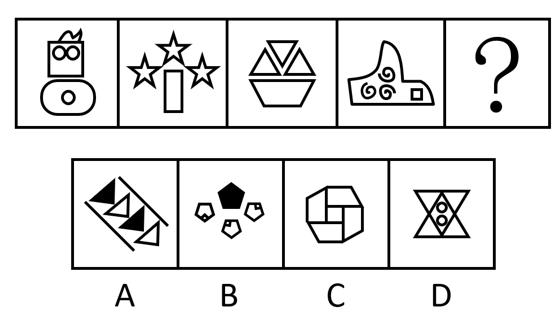

- **A**. A
- **B**. B　✅
- **C**. C
- **D**. D

**答案**：B

**官方解析**

元素组成不同，且无明显属性规律，优先考虑数量规律。观察发现，题干图形均由多个小元素构成，且图2、图3明显出现了相同小元素五角星和三角形，考虑相同元素的个数。题干图形均有3个相同的小元素，故“？”处图形也应有3个相同的小元素，只有B项符合。
故正确答案为B。

---

## 第 2 题　qid 5408653 · 图形推理

从所给的四个选项中，选择最合适的一个填入问号处，使之呈现一定的规律性：

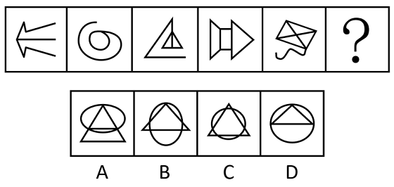

- **A**. A　✅
- **B**. B
- **C**. C
- **D**. D

**答案**：A

**官方解析**

元素组成不同，且无明显属性规律，优先考虑数量规律。观察发现，题干图4、图5分割区域明显，考虑面数量。题干图形的面数量依次为0、1、2、3、4，故“？”处应为面数量为5的图形，只有A项符合。
故正确答案为A。

---

## 第 3 题　qid 5408657 · 图形推理

从所给的四个选项中，选择最合适的一个填入问号处，使之呈现一定的规律性：

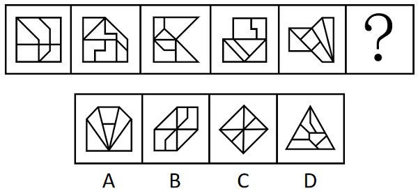

- **A**. A　✅
- **B**. B
- **C**. C
- **D**. D

**答案**：A

**官方解析**

元素组成不同，且无明显属性规律，优先考虑数量规律。观察发现，题干图形封闭区域明显，考虑面数量，但题干图形与选项图形的面数量均为6，无唯一答案，考虑面的细化。再次观察发现，题干图形大多具有三角形面，考虑三角形面的数量，依次为0、1、2、3、4，所以“？”处应为三角形面数量为5的图形，只有A项符合。
故正确答案为A。

---

## 第 4 题　qid 5408659 · 图形推理

从所给的四个选项中，选择最合适的一个填入问号处，使之呈现一定的规律性：

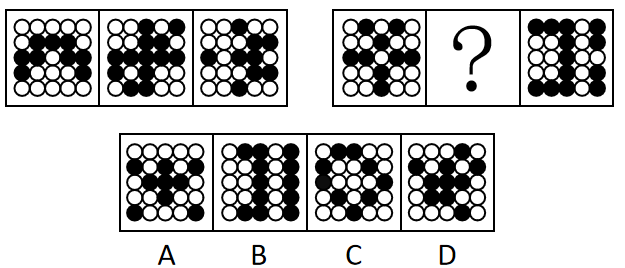

- **A**. A
- **B**. B
- **C**. C
- **D**. D　✅

**答案**：D

**官方解析**

元素组成不同，优先考虑属性规律。观察发现，题干图形中黑白球整体较为规整，优先考虑对称性。题干图形均只有1条对称轴，且第一组图形的对称轴方向依次顺时针旋转，第二组图形应遵循此规律，故？处图形的对称轴方向应从右上至左下，只有D项符合。

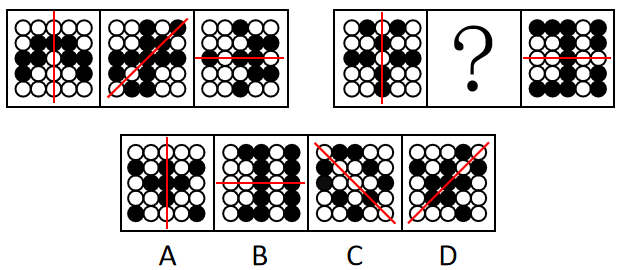

故正确答案为D。

---

## 第 5 题　qid 5408660 · 图形推理

以下哪项是由下列图形不经旋转、翻转拼合起来得到的？

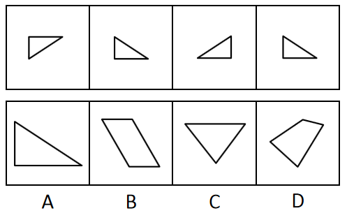

- **A**. A　✅
- **B**. B
- **C**. C
- **D**. D

**答案**：A

**官方解析**

本题考查平面拼合，可采用平行且等长相消的方式解题。消去平行且等长的线段后进行组合可得到轮廓图，即为A项。平行且等长相消的方式如下图所示：

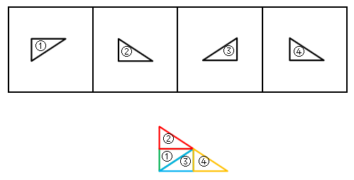

故正确答案为A。

---

## 第 6 题　qid 5408654 · 图形推理

从所给的四个选项中，选择最合适的一个填入问号处，使之呈现一定的规律性：

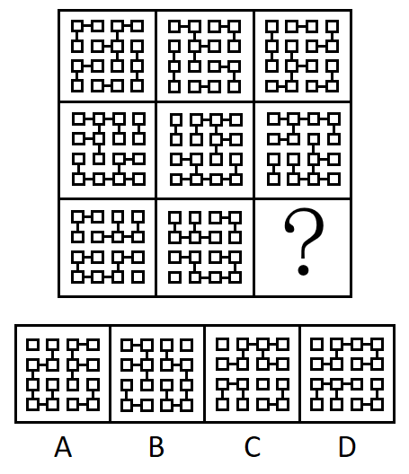

- **A**. A
- **B**. B
- **C**. C
- **D**. D　✅

**答案**：D

**官方解析**

元素组成相同，优先考虑位置规律。九宫格优先看横行，观察发现，第一行中，第一个图形左右翻转得到第二个图形，第二个图形上下翻转得到第三个图形；第二行符合此规律，第三行应用此规律，只有D项符合。
故正确答案为D。

---

## 第 7 题　qid 5408662 · 图形推理

以下为2个正方体纸盒的外表面展开图，其折叠后不可能的是：

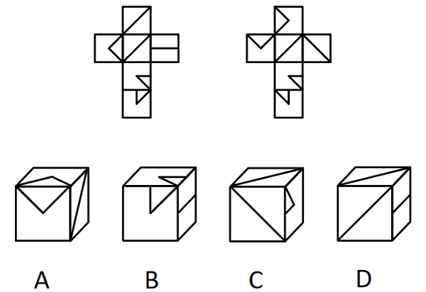

- **A**. A
- **B**. B
- **C**. C　✅
- **D**. D

**答案**：C

**官方解析**

将展开图标上序号（如下图所示），逐一进行分析。

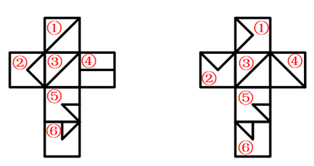

A项：选项对应题干右侧展开图的面①、面②和面③，与题干一致，排除；

B项：选项对应题干左侧展开图的面④、面⑤和面⑥，与题干一致，排除；

C项：根据两斜线面中的斜线相交于一点可以判断出选项上面和正面对应题干右侧展开图的面③和面④，选项右侧为面⑤，在选项中面③④⑤的公共点挨着面⑤中的小三角形，但题干右侧展开图中三个面的公共点没有挨着面⑤中的小三角形，与题干不一致，当选；

D项：选项对应题干左侧展开图的面①、面③和面④，与题干一致，排除。

本题为选非题，故正确答案为C。

---

## 第 8 题　qid 5408656 · 图形推理

上图是给定的多面体，下边哪一项可能是该多面体的视图？

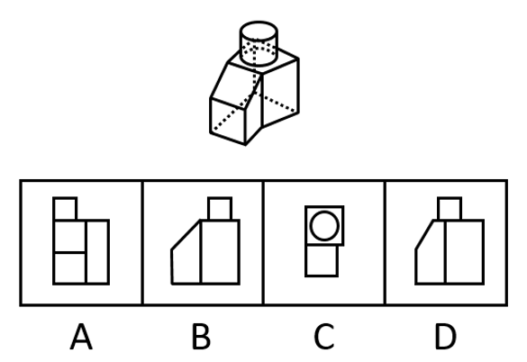

- **A**. A
- **B**. B　✅
- **C**. C
- **D**. D

**答案**：B

**官方解析**

本题考查三视图，逐一分析选项。
A项：从前往后看，选项最上方的正方形应在左侧矩形的正中间，排除；
B项：从右往左看，与题干一致，当选；
C项：从上往下看，选项上方的四边形应为梯形，排除；
D项：从右往左看，视图应和B项保持一致，排除。
故正确答案为B。

---

## 第 9 题　qid 5408658 · 图形推理

把下面六个图形分为两类，使每一类图形都有各自的共同特征和规律，分类正确的一项是：

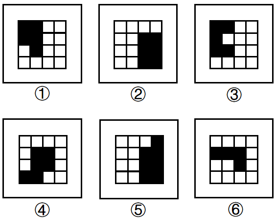

- **A**. ①②④，③⑤⑥
- **B**. ①②⑥，③④⑤　✅
- **C**. ①③⑥，②④⑤
- **D**. ①④⑥，②③⑤

**答案**：B

**官方解析**

本题为分组分类题目。元素组成不同，且无明显属性规律，优先考虑数量规律。题干图形均由黑白块构成，多个小黑块组成了一个大的黑色图形，观察发现，若小黑块的边长为1，那么图①②⑥黑色图形的周长为10，图③④⑤黑色图形的周长为12，故图①②⑥为一组，图③④⑤为一组。
故正确答案为B。

---

## 第 10 题　qid 5408661 · 图形推理

把下面六个图形分为两类，使每一类图形都有各自的共同特征或规律，分类正确的一项是：

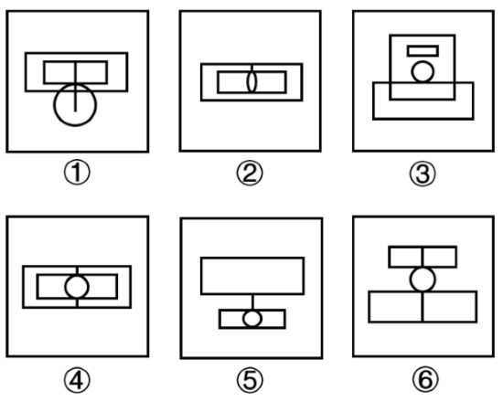

- **A**. ①②⑤，③④⑥　✅
- **B**. ①③⑤，②④⑥
- **C**. ①②③，④⑤⑥
- **D**. ①④⑤，②③⑥

**答案**：A

**官方解析**

本题为分组分类题目。元素组成不同，且无明显属性规律，考虑数量规律。观察发现，题干图形出现了“日”字变形图和圆相切，考虑笔画数。图①②⑤为一笔画图形，图③④⑥为两笔画图形。即图①②⑤为一组，图③④⑥为一组。
故正确答案为A。

---

## 第 11 题　qid 5408568 · 定义判断

求职经济是指求职者为了增加被招聘单位录用可能性，在求职应聘阶段付出的与所应聘岗位职业能力无关的各种开销。
根据上述定义，下列不属于求职经济的是：

- **A**. 研究生阶段学习文学专业的甲，自费在业余时间学习动画制作，毕业后顺利通过面试进入心仪的影视公司　✅
- **B**. 由于应聘同一职位的竞争者众多，乙请专业影视制作公司为自己拍摄制作了反映自己各方面能力和特长的视频简历，花费不菲
- **C**. 某女大学生丙为了能在面试环节有好的表现，在面试前高薪聘请专业化妆师为其针对不同的应聘岗位提供时尚、得体的化妆服务
- **D**. 大学毕业生丁分别应聘了两家单位的管理岗位和技术岗位，为了给面试官良好的第一印象，花费3000元添置了两套不同风格的服装

**答案**：A

**官方解析**

第一步：找出定义关键词。
“为了增加被招聘单位录用可能性”、“在求职应聘阶段付出的与所应聘岗位职业能力无关的各种开销”。
第二步：逐一分析选项。
A项：研究生阶段学习的甲，不明确是否处于“求职应聘阶段”；自费学习动画制作并进入影视公司，“动画制作的能力”与“影视公司的职位”相关，不符合“在求职应聘阶段付出的与所应聘岗位职业能力无关的各种开销”，不符合定义，当选；
B项：乙在应聘时花钱拍摄制作视频简历，是为了展示自己的各方面能力和特长，该花销与岗位职业能力本身无关，符合“为了增加被招聘单位录用可能性”、“在求职应聘阶段付出的与所应聘岗位职业能力无关的各种开销”，符合定义，排除；
C项：丙高薪聘请化妆师设计有针对性的岗位妆容，是为了在面试环节有更好的表现，该花销与岗位职业能力本身无关，符合“为了增加被招聘单位录用可能性”、“在求职应聘阶段付出的与所应聘岗位职业能力无关的各种开销”，符合定义，排除；
D项：丁自费添置两套面试服装，是为了给面试官留下良好的印象，该花销与岗位职业能力本身无关，符合“为了增加被招聘单位录用可能性”、“在求职应聘阶段付出的与所应聘岗位职业能力无关的各种开销”，符合定义，排除。
本题为选非题，故正确答案为A。

---

## 第 12 题　qid 5408572 · 定义判断

人力资本投资是指体现在劳动者身上的，用来提高人的生产能力从而提高人在劳动力市场上的收益能力的初始性投资。
根据上述定义，下列不属于人力资本投资的是：

- **A**. 某大学资助教师参加教学技能提升培训班的费用
- **B**. 某公司为员工添置了一批健身器材所花费的投资
- **C**. 父母在小张大学暑假期间为其支付的驾校培训费用
- **D**. 某食品加工企业为购买专利而支付的知识产权转让费　✅

**答案**：D

**官方解析**

第一步：找出定义关键词。
“体现在劳动者身上”、“用来提高人的生产能力”、“从而提高人在劳动力市场上的收益能力”。
第二步：逐一分析选项。
A项：某大学资助教师参加教学技能提升培训班，教师是劳动者，且参加技能提升培训班是为了提高教师能力，同时也提高了教师的收益能力，符合“体现在劳动者身上”、“用来提高人的生产能力”、“从而提高人在劳动力市场上的收益能力”，符合定义，排除；
B项：公司为员工添置健身器材，员工是劳动者，添置健身器材是为了提升员工的身体素质，以提高员工的生产能力，而且也提升了员工的收益能力，符合“体现在劳动者身上”、“用来提高人的生产能力”、“从而提高人在劳动力市场上的收益能力”，符合定义，排除；
C项：父母为小张支付的驾校培训费用，小张是劳动者，驾校培训可以提高小张的能力，并提高了小张的收益能力，符合“体现在劳动者身上”、“用来提高人的生产能力”、“从而提高人在劳动力市场上的收益能力”，符合定义，排除；
D项：企业为购买专利支付的费用，未体现在劳动者身上，不符合“体现在劳动者身上”，不符合定义，当选。
本题为选非题，故正确答案为D。

---

## 第 13 题　qid 5408575 · 定义判断

原子数符指的是数字符号0~9；原子音符指的是小写字母a、u、e；在两个原子数符中间加一个原子音符构成的3个连续的符号串称为密符；由三个不完全相同的密符构成的符号串称为M密码。
根据上述定义，下列符号串属于M密码的是：

- **A**. 5e6a71a3u6
- **B**. 9u8ae89u8
- **C**. 7a58u24e6　✅
- **D**. 3u53u53u5

**答案**：C

**官方解析**

第一步：找出定义关键词。
原子数符：“数字符号0~9”；
原子音符：“小写字母a、u、e”；
密符：“在两个原子数符中间加一个原子音符构成的3个连续的符号串”；
M密码：“由三个不完全相同的密符构成的符号串”。
第二步：逐一分析选项。
A项：该项中5e6a71a3u6，可以划分5e6、a71a、3u6，其中的a71a，不符合“在两个原子数符中间加一个原子音符构成的3个连续的符号串”，不属于密符，不符合M密码的定义，排除；
B项：该项中9u8ae89u8，可以划分9u8、ae8、9u8，其中的ae8，不符合“在两个原子数符中间加一个原子音符构成的3个连续的符号串”，不属于密符，不符合M密码的定义，排除；
C项：该项中7a58u24e6，可以划分7a5、8u2、4e6共三个密符，符合“由三个不完全相同的密符构成的符号串”，符合M密码的定义，当选；
D项：该项中3u53u53u5，可以划分3u5、3u5、3u5共三个密符，但这属于完全相同的密符构成的符号串，不符合“由三个不完全相同的密符构成的符号串”，不符合M密码的定义，排除。
故正确答案为C。

---

## 第 14 题　qid 5408580 · 定义判断

观念贫困是指在相对封闭落后的环境中所形成的因循守旧，难以接受新事物、新信息，不愿尝试新的生产生活方式以改变贫困生活的现象。
根据上述定义，下列属于观念贫困的是：

- **A**. 朋友们劝说老张买理财产品，但老张坚持认为理财产品都是骗人的，不愿尝试
- **B**. 受迷信观念的影响，老朱轻信了不法分子“破财消灾”的骗局，几乎倾家荡产
- **C**. 李奶奶一个人住在农村，儿子多次动员她来城里住，她就是不肯，说不适应城市生活，在农村安逸、清净
- **D**. 老刘在路边摆摊修鞋，收入低微，家庭负担重，虽然去外地鞋厂工作可以提高收入，但他担心学不会新技术，不愿外出　✅

**答案**：D

**官方解析**

第一步：找出定义关键词。
“在相对封闭落后的环境中”、“因循守旧，难以接受新事物、新信息”、“不愿尝试新的生产生活方式以改变贫困生活”。
第二步：逐一分析选项。
A项：该项指出老张坚持不买理财产品，并未提及老张的生活环境，不符合“在相对封闭落后的环境中”，也不清楚老张的经济状况，不符合“不愿尝试新的生产生活方式以改变贫困生活”，不符合定义，排除；
B项：该项指出老朱因被骗几乎倾家荡产，未提及老朱的生活环境，不符合“在相对封闭落后的环境中”，老朱轻信“破财消灾”的骗局是受迷信观念的影响，没有体现难以接受新事物、新信息，不符合“因循守旧，难以接受新事物、新信息”、“不愿尝试新的生产生活方式以改变贫困生活”，不符合定义，排除；
C项：该项指出李奶奶因不适应城市生活而选择住在农村，符合“在相对封闭落后的环境中”，但李奶奶不肯去城里住的原因是觉得农村安逸、清净，而非难以接受新事物、新信息，不符合“因循守旧，难以接受新事物、新信息”、“不愿尝试新的生产生活方式以改变贫困生活”，不符合定义，排除；
D项：该项指出老刘在路边摆摊修鞋而不愿意去外地鞋厂工作，符合“在相对封闭落后的环境中”，收入低微、家庭负担重说明生活贫困，且老刘不愿意去外地鞋厂拿更高收入的原因是担心学不会新技术，说明他不愿意接受新事物、新信息，符合“因循守旧，难以接受新事物、新信息”、“不愿尝试新的生产生活方式以改变贫困生活”，符合定义，当选。
故正确答案为D。

---

## 第 15 题　qid 5408569 · 定义判断

区域经济扩散的空间形式有两种：一种是等级扩散，即经济现象的扩张是沿着一定等级规模的地理区域进行的；另一种是接触扩散，即区域经济扩散的过程是由近及远进行的。
根据上述定义，下列情形属于接触扩散的是：

- **A**. 南方企业生产的产品由南向北逐渐扩张销售市场　✅
- **B**. 企业的产品先是占领大城市市场，接着进入中等城市
- **C**. 企业生产的产品分销时，先拿到产品的经销商先进行销售
- **D**. 企业产品销售先发展5家省级代理，再发展60家市级代理

**答案**：A

**官方解析**

第一步：找出定义关键词。
等级扩散：“经济现象的扩张是沿着一定等级规模的地理区域进行”；
接触扩散：“区域经济扩散的过程是由近及远进行”。
第二步：逐一分析选项。
A项：南方企业生产的产品由南向北逐渐扩张，即南方企业先扩张近处，再逐渐扩张远处的北方，符合“区域经济扩散的过程是由近及远进行”，符合“接触扩散”定义，当选；
B项：企业的产品先是占领大城市市场，接着进入中等城市，其中大城市和中等城市属于不同等级的城市，即属于不同等级规模的地理区域，符合“经济现象的扩张是沿着一定等级规模的地理区域进行”，符合“等级扩散”定义，不符合“接触扩散”定义，排除；
C项：企业生产的产品分销时，先拿到产品的经销商先进行销售，说明拿货时间决定了销售顺序，不符合“区域经济扩散的过程是由近及远进行”，不符合“接触扩散”定义，排除；
D项：企业产品销售先发展5家省级代理，再发展60家市级代理，说明是代理商的级别和数量发生变化，不符合“区域经济扩散的过程是由近及远进行”，不符合“接触扩散”定义，排除。
故正确答案为A。

---

## 第 16 题　qid 5408579 · 定义判断

义务冲突是指存在两个以上不相容的法律义务，为了履行其中的某种义务，迫不得已无法履行其他义务的情况。
根据上述定义，下列情形存在义务冲突的是：

- **A**. 刘某驾车途中，为避让突然冲出的行人而撞毁了路边的护栏
- **B**. 因经济条件限制，李某只能选择资助两位贫困儿童中的一位
- **C**. 在追捕两名分头逃跑的小偷的过程中，警官王某先抓捕了其中一人　✅
- **D**. 农忙时节人手不足，张某让两名还在读初中的孩子中的一人请假帮忙

**答案**：C

**官方解析**

第一步：找出定义关键词。
“存在两个以上不相容的法律义务”、“为了履行其中的某种义务”、“迫不得已无法履行其他义务的情况”。
第二步：逐一分析选项。
A项：为避让突然冲出的行人而撞毁了路边的护栏，是紧急避险，不是履行法律义务，不符合定义，排除；
B项：资助贫困儿童不是法律义务，不符合定义，排除；
C项：警察抓捕小偷是与工作相关的法律义务，要同时抓捕分头逃跑的两名小偷符合“存在两个以上不相容的法律义务”，警官王某先抓捕了其中一人，符合“为了履行其中的某种义务”、“迫不得已无法履行其他义务的情况”，符合定义，当选；
D项：张某让孩子请假帮忙做农活不是法律义务，孩子做农活也不是法律义务，不符合定义，排除。
故正确答案为C。

---

## 第 17 题　qid 5408587 · 定义判断

暗示效应是指在无对抗的条件下，用含蓄、抽象诱导的间接方法对人们的心理和行为产生影响，从而诱导人们按照一定的方式去行动或接受一定的意见，使其思想、行为与暗示者期望的目标相符合。
根据上述定义，下列体现暗示效应的是：

- **A**. “凤雏”庞统率军经过落凤坡，得知坡名，惊呼：“天绝我也！”最终被乱箭射死于“落凤坡”上
- **B**. 张飞在长坂桥独自迎战曹操大军时大吼：“我乃燕人张翼德也！谁敢与我决一死战”，吓得曹军落荒而逃
- **C**. 貂蝉为让吕布除去董卓，对吕布哭诉被董卓霸占的痛苦及对吕布的思念，吕布得知气愤不已，最终将董卓杀掉　✅
- **D**. 岳母在岳飞幼年时在其背上刺下“精忠报国”四个字，岳飞长大后果然不负母亲期望，成为一代精忠报国的抗金名将

**答案**：C

**官方解析**

第一步：找出定义关键词。
“在无对抗的条件下”、“含蓄、抽象诱导的间接方法”、“使其思想、行为与暗示者期望的目标相符合”。
第二步：逐一分析选项。
A项：庞统到了落凤坡这个地方，自己认为天要绝他，并没有人对他做出诱导行为，不符合“含蓄、抽象诱导的间接方法”、“使其思想、行为与暗示者期望的目标相符合”，不符合定义，排除；
B项：张飞大吼的内容可以直接凸显出其勇猛，不符合“含蓄、抽象诱导的间接方法”，不符合定义，排除；
C项：貂蝉的目的是让吕布除去董卓，但是她没有直接向吕布表达这个意思，而是用哭诉痛苦和思念的间接方法来诱导吕布采取除去董卓的行为，而最终吕布也确实受到了她的诱导，将董卓杀掉，符合“含蓄、抽象诱导的间接方法”、“使其思想、行为与暗示者期望的目标相符合”，符合定义，当选；
D项：岳母在岳飞背上刺字“精忠报国”，“精忠报国”直接就能体现出为国家竭尽忠诚、牺牲一切的含义，属于直接激励岳飞，不符合“含蓄、抽象诱导的间接方法”，不符合定义，排除。
故正确答案为C。

---

## 第 18 题　qid 5408590 · 定义判断

普通社会工作是人们在本职工作之外承担的、不计报酬的思想政治教育性或公益服务性活动。
根据上述定义，下列属于普通社会工作的是：

- **A**. 交通协管员小邓在工作期间阻止欲闯红灯的群众，并对其进行交通安全宣传
- **B**. 在家长进校园活动日，某高校教师为其儿子所在班级的同学们授课，向小学生们普及大数据知识　✅
- **C**. 某国有企业有偿聘请在企业管理领域有很高造诣的退休老专家刘教授为企业中层领导干部做培训讲座
- **D**. 为落实国家“双减”政策，有效衔接家长们的下班时间，阳光小学为有需要的学生开展每天两小时的课后服务工作

**答案**：B

**官方解析**

第一步：找出定义关键词。
“本职工作之外”、“不计报酬”、“思想政治教育性或公益服务性活动”。
第二步：逐一分析选项。
A项：交通协管员小邓在工作期间对欲闯红灯的群众进行交通安全宣传，“在工作期间”说明这是小邓的本职工作，不符合“本职工作之外”，不符合定义，排除；
B项：在家长进校园活动日，某高校教师向儿子所在班级的小学生们普及大数据知识，该教师作为家长参加活动，且“高校教师”说明其不是小学老师，向小学生普及知识并非自己本职工作，符合“本职工作之外”；在家长进校园活动日上作为家长进行科普，未收取金钱，符合“不计报酬”；普及大数据知识，符合“思想政治教育性或公益服务性活动”，符合定义，当选；
C项：某国有企业有偿聘请退休老专家做培训讲座，“有偿聘请”不符合“不计报酬”，不符合定义，排除；
D项：阳光小学为有需要的学生开展课后服务工作以衔接家长们的下班时间，说明该小学负责课后服务工作，那么课后服务工作就是老师的本职工作，不符合“本职工作之外”，不符合定义，排除。
故正确答案为B。

---

## 第 19 题　qid 5408589 · 定义判断

M大学开给教授的工资通常比其他大学平均工资低20％左右，却仍然能聘到称职的教授。原因主要是，许多教授非常喜欢M大学周边的湖光山色，尤其是天晴时能远眺美洲最高雪山——雷尼尔山峰。为此，他们宁可放弃其他大学更高的收入。这种现象在管理学中被称为雷尼尔效应，引申指用积极的企业精神、文化氛围和工作环境等吸引并留住人才。
根据上述定义，下列涉及雷尼尔效应的是：

- **A**. 甲放弃名企及高薪，加入一家可以居家办公，工作时间灵活的公司　✅
- **B**. 乙行事怪异，被同事视为异类，但其发明的仪器为企业创造了很高利润
- **C**. 丙因某著名公司工作压力太大而拒绝了高薪聘请，宁可待在原单位拿低薪
- **D**. 丁不在意薪水高低，只希望创意能得到采纳和支持，决不去无法满足其愿望的企业

**答案**：A

**官方解析**

第一步：找出定义关键词。
“积极的企业精神、文化氛围和工作环境”、“吸引并留住人才”。
第二步：逐一分析选项。
A项：甲加入可以居家办公，工作时间灵活的公司，说明公司是通过这种人性化的工作环境吸引甲的，符合“积极的企业精神、文化氛围和工作环境”、“吸引并留住人才”，符合定义，当选；
B项：乙发明的仪器为企业创造了很高利润，没提到该企业通过什么方式来吸引乙，不符合“积极的企业精神、文化氛围和工作环境”、“吸引并留住人才”，不符合定义，排除；
C项：丙因工作压力大拒绝了高薪而选择待在原单位拿低薪，只是说明了丙的就业选择，但是没提到原单位通过什么方式吸引丙，不符合“积极的企业精神、文化氛围和工作环境”、“吸引并留住人才”，不符合定义，排除；
D项：丁不在意薪水高低只是希望创意能得到采纳和支持，是丁自己的职业观，但是没提到企业通过什么方式吸引人才，不符合“积极的企业精神、文化氛围和工作环境”、“吸引并留住人才”，不符合定义，排除。
故正确答案为A。

---

## 第 20 题　qid 5408594 · 定义判断

隐蔽属性是指商品在使用过程中容易被顾客忽略的一些特性，商家在销售时往往采用各种手段故意隐藏这些特性，从而诱导顾客进行消费。
根据上述定义，下列属于隐蔽属性的是：

- **A**. 超市售卖特价商品时，往往会用各种手法醒目地标出新售价，而原价只是用比较小的字列出
- **B**. 因为稀缺才显得珍贵，市面上所谓“限量版”或“珍藏版”的产品多属于有意制造稀缺性的情况
- **C**. 某购物网站上某款打印机的商品页面中，打印机的价格标注得非常醒目，但后续更换耗材和配件的价格和周期却并未说明　✅
- **D**. 手机销售前往往已预先安装很多应用软件，某些软件大多数用户几乎一辈子也用不上，但这些软件归根到底都是由用户来买单的

**答案**：C

**官方解析**

第一步，找出定义关键词。
“在使用过程中”、“容易被顾客忽略的一些特性”、“采用各种手段故意隐藏这些特性”。
第二步，逐一分析选项。
A项：超市用各种手法醒目地标出特价商品的新售价，而将原价用小字列出，但售价仅体现商品的价值，并非是对商品的使用，不符合“在使用过程中”、“容易被顾客忽略的一些特性”，不符合定义，排除；
B项：市面上的“限量版”“珍藏版”的产品存在有意制造稀缺性的情况，制造稀缺性并非隐瞒特性，不符合“采用各种手段故意隐藏这些特性”，不符合定义，排除；
C项：购物网站将打印机的价格标注得十分醒目，但并未说明后续更换耗材和配件的价格和周期，更换耗材和配件的价格及周期，符合“在使用过程中”、“容易被顾客忽略的一些特性”，且商家并未对此进行说明，符合“采用各种手段故意隐藏这些特性”，符合定义，当选；
D项：手机销售前便预先安装了大多数用户用不上的应用软件并需要用户来买单，但手机销售前并未刻意隐藏这些软件，不符合“采用各种手段故意隐藏这些特性”，不符合定义，排除。
故正确答案为C。

---

## 第 21 题　qid 5408600 · 类比推理

青花瓷：青铜剑

- **A**. 蓝花草：蓝棉鞋
- **B**. 黄大衣：黄土坡
- **C**. 红星旗：红木柜　✅
- **D**. 黑皮夹：黑漆桌

**答案**：C

**官方解析**

第一步：判断题干词语间逻辑关系。
从微观的角度来讲，“青花瓷”与“青铜剑”一个是瓷器一个是武器，关联不大，二者都是物品，可以考虑命名方式，青花瓷是因其瓷身具有青花图案而命名，青铜剑是因其材料为青铜而命名。
第二步：判断选项词语间逻辑关系。
A项：蓝花草不是根据自身图案命名，与题干逻辑关系不一致，排除；
B项：黄大衣是根据衣服颜色来命名，而非自身图案，与题干逻辑关系不一致，排除；
C项：红星旗是因其带有红星图案而命名，红木柜是因其材料为红木而命名，与题干逻辑关系一致，当选；
D项：黑皮夹是根据材质命名，而非自身图案，与题干逻辑关系不一致，排除。
故正确答案为C。

---

## 第 22 题　qid 5408602 · 类比推理

爱迪生：电灯

- **A**. 伦琴：X光射线
- **B**. 瓦特：蒸汽机　✅
- **C**. 牛顿：万有引力
- **D**. 爱因斯坦：相对论

**答案**：B

**官方解析**

第一步：判断题干词语间逻辑关系。
爱迪生改良了电灯的灯丝，延长了电灯的寿命，二者为改良者和被改良事物的对应关系。
第二步：判断选项词语间逻辑关系。
A项：伦琴发现了X光射线，二者为发现者和被发现事物的对应关系，与题干逻辑关系不一致，排除；
B项：瓦特改良了蒸汽机，提高了蒸汽机的效率，二者为改良者和被改良事物的对应关系，与题干逻辑关系一致，当选；
C项：牛顿提出了万有引力，二者为创造者和研究成果的对应关系，与题干逻辑关系不一致，排除；
D项：爱因斯坦提出了相对论，二者为创造者和研究成果的对应关系，与题干逻辑关系不一致，排除。
故正确答案为B。

---

## 第 23 题　qid 5408570 · 类比推理

四边形：矩形：菱形

- **A**. 雄蕊：花药：花丝
- **B**. 固态：液态：气态
- **C**. 体裁：诗歌：散文　✅
- **D**. 塑料：着色剂：稳定剂

**答案**：C

**官方解析**

第一步：判断题干词语间逻辑关系。
“矩形”和“菱形”是两种不同的“四边形”，二者分别和一词构成种属关系。
第二步：判断选项词语间逻辑关系。
A项：“花药”和“花丝”是“雄蕊”的组成部分，二者分别和一词构成组成关系，与题干逻辑关系不一致，排除；
B项：“固态”“液态”和“气态”是物体的三种状态，三者为并列关系，与题干逻辑关系不一致，排除；
C项：“诗歌”和“散文”是两种不同的“体裁”，二者分别和一词构成种属关系，与题干逻辑关系一致，当选；
D项：“着色剂”可使塑料具有各种鲜艳、美观的颜色，“稳定剂”可以防止塑料分解、老化，二者分别和“塑料”构成对应关系，与题干逻辑关系不一致，排除。
故正确答案为C。

---

## 第 24 题　qid 5408576 · 类比推理

洗洁精 对于 （    ） 相当于 3D眼镜 对于 （    ）

- **A**. 厨房；电影院　✅
- **B**. 碗筷；观众
- **C**. 洗涤；三维
- **D**. 洗碗机；太阳镜

**答案**：A

**官方解析**

逐一代入选项。
A项：在厨房使用洗洁精，二者为地点对应关系；在电影院使用3D眼镜，二者为地点对应关系，前后逻辑关系一致，当选；
B项：洗洁精可以用于清洗碗筷，二者为工具对应关系；观众佩戴3D眼镜，二者为主宾关系，前后逻辑关系不一致，排除；
C项：洗洁精可以用于洗涤，二者为功能对应关系；通过3D眼镜可以看到三维的图像，但3D眼镜的功能不是三维，前后逻辑关系不一致，排除；
D项：洗碗机无法冲洗掉洗洁精产生的大量泡沫，因此使用洗碗机时不能使用洗洁精，二者无明显逻辑关系；3D眼镜和太阳镜是两种不同类型的眼镜，二者为并列关系，前后逻辑关系不一致，排除。
故正确答案为A。

---

## 第 25 题　qid 5408583 · 类比推理

军队 对于 （    ） 相当于 （    ） 对于 人体

- **A**. 警察；甲状腺
- **B**. 武器；维生素
- **C**. 国家；白细胞　✅
- **D**. 士兵；血小板

**答案**：C

**官方解析**

逐一代入选项。
A项：军队和警察都能维护国家安全，二者是并列关系，甲状腺是人体的一部分，二者是组成关系，前后逻辑关系不一致，排除；
B项：武器是军队配发的工具，二者是工具的对应关系，维生素是维持人体生命活动必需的一类有机物质，二者是对应关系，前后逻辑关系不一致，排除；
C项：军队能保护国家安全，二者是对应关系，白细胞能将病菌包围、吞噬，保护人体免受侵害，二者是对应关系，前后逻辑关系一致，当选；
D项：士兵是军队的一部分，二者是组成关系，血小板是人体血液中的一种成分，是人体的一部分，二者是组成关系，但前后顺序相反，前后逻辑关系不一致，排除。
故正确答案为C。

---

## 第 26 题　qid 5408584 · 逻辑判断

书报亭曾经是所有城市的标配，承载着几代人的共同记忆，但当下已经快要成为一个历史名词了。近日，《中国青年报》在显著版面刊登了上海中学生的一封信，希望《中国青年报》替青少年呼吁恢复书报亭。一个初中生的来信受到媒体的关注有些让人意外，刊登出来在瞬间点燃了网民的热情也实属罕见。由此可见，恢复书报亭十分必要。
以下哪项如果为真，最能支持上述结论？

- **A**. 城市书报亭的退出是时代变迁、城市规划、网络媒体发展的必然结果
- **B**. 书报亭具有很强的社区服务功能，是社区居民获取信息和知识的重要渠道　✅
- **C**. 青少年正处于大量吸收知识、进行探索和思考的阶段，报纸杂志是文化必需品
- **D**. 纸质的报纸杂志有着无法替代的优势，它有助于培养青少年的阅读兴趣和能力

**答案**：B

**官方解析**

第一步：找出论点和论据。
论点：恢复书报亭十分必要。
论据：一个初中生的来信即“呼吁恢复书报亭”受到媒体的关注有些让人意外，刊登出来在瞬间点燃了网民的热情也实属罕见。
论据讨论的是“呼吁恢复书报亭受到广泛的关注和支持很罕见”，论点说的是“恢复书报亭十分必要”，从论据可以合理推出论点，故论据和论点话题一致，加强优先考虑补充论据，即解释恢复书报亭十分必要的原因。
第二步：逐一分析选项。
A项：城市书报亭的退出是必然结果，但论点讨论的是有无必要恢复书报亭，话题不一致，无法加强，排除；
B项：书报亭具有很强的社区服务功能，是社区居民获取信息和知识的重要渠道，说明了书报亭对于社区居民的重要作用，解释了需要恢复书报亭的原因，补充论据，可以加强，当选；
C项：报纸杂志对于青少年来说是文化必需品，但报纸杂志不一定只能在书报亭获取，论点讨论的是有无必要恢复书报亭，话题不一致，无法加强，排除；
D项：纸质的报纸杂志对于培养青少年的阅读兴趣和能力有着无法替代的优势，但纸质的报纸杂志不一定只能在书报亭获取，论点讨论的是有无必要恢复书报亭，话题不一致，无法加强，排除。
故正确答案为B。

---

## 第 27 题　qid 5408565 · 逻辑判断

医学上把晕车叫做“晕动症”，眼睛可以通过视神经，告诉大脑我们有没有在动；而耳朵则通过平衡感知系统——前庭，感受是否真的在动。正常情况下，眼睛和耳朵提供的信息是一致的。但坐在晃动的车上时，我们接受的信息出现了分歧——耳朵会觉得“你动了”，而眼睛则觉得“你没动”。这时，大脑接收到了两个不一致的报告，就会让它有点晕。据此，有人推理出一个结论：坐在车上看手机时往往会晕车晕得更严重。
以下哪项如果为真，最能支持上述结论？

- **A**. 车内光线不足，看手机容易引起视觉疲劳
- **B**. 车辆的颠簸使眼睛难以聚焦，会损伤视力
- **C**. 看手机时会强化我们“没有动”的感觉　✅
- **D**. 晕车多数都是由于前庭发育不良引起的

**答案**：C

**官方解析**

第一步：找出论点和论据。
论点：坐在车上看手机时往往会晕车晕得更严重。
论据：坐在晃动的车上时，我们接受的信息出现了分歧——耳朵会觉得“你动了”，而眼睛则觉得“你没动”。这时，大脑接收到了两个不一致的报告，就会让它有点晕。
论据在说动没动和晕车的关系，论点在说手机和晕车的关系，论点论据话题不一致，优先考虑搭桥，即在动没动和手机之间建立联系。
第二步：逐一分析选项。
A项：选项说的是车内光线不足，看手机容易引起“视觉疲劳”，但论点讨论的是坐在车上“看手机时”是否会“晕车晕得更严重”，话题不一致，无法加强，排除；
B项：选项说的是车辆的颠簸使眼睛难以聚焦，“会损伤视力”，但论点讨论的是坐在车上“看手机时”是否会“晕车晕得更严重”，话题不一致，无法加强，排除；
C项：选项说的是看手机时会强化我们“没有动”的感觉，说明看手机时大脑接收到的两个不一致的报告会更强烈，导致晕车更严重，在“没有动”和“手机”之间搭桥，可以加强，当选；
D项：选项说的是晕车多数都是由于前庭发育不良引起的，是在说晕车的原因，但论点讨论的是坐在车上“看手机时”是否会“晕车晕得更严重”，话题不一致，无法加强，排除。
故正确答案为C。

---

## 第 28 题　qid 5408567 · 逻辑判断

近日，某研究小组开发出一种双光子成像显微镜的改进版本，它可以让科学家更快地获得大脑内血管和单个神经元等结构的高分辨率图像。有研究者认为，新技术或将促进神经科学的研究。
以下哪项如果为真，最能支持上述观点？

- **A**. 改版后较传统双光子显微镜成像快100到1000倍，所能达到的组织深度为原来的两倍
- **B**. 新技术可以更好地了解大脑内血流的变化，还能通过添加电压敏感的荧光染料或荧光钙探针来测量神经元活动　✅
- **C**. 研究人员经常使用双光子显微镜制作大脑等组织的高分辨率3D图像，但这种成像技术不易扫描大脑等组织深处，且很耗时
- **D**. 研究证明，使用改进的新技术可以在肌肉和肾脏组织切片中实现约200微米尺度的成像，在老鼠大脑中实现约300微米的成像

**答案**：B

**官方解析**

第一步：找出论点和论据。
论点：新技术或将促进神经科学的研究。
论据：某研究小组开发出一种双光子成像显微镜的改进版本，它可以让科学家更快地获得大脑内血管和单个神经元等结构的高分辨率图像。
本题论点和论据都在讨论“改进版双光子成像显微镜这项新技术”与“促进神经科学研究”之间的关系，论据论点话题一致，加强优先考虑补充论据，即解释新技术是如何促进神经科学研究的或举例说明新技术在促进神经科学研究上的作用。
第二步：逐一分析选项。
A项：本题论点讨论的是新技术或将促进神经科学研究，而该项讨论的是新技术比传统技术成像更快，达到的组织深度更深，但无法得知新技术的这些提升是否能促进神经科学研究，话题不一致，无法加强，排除；
B项：该项指出新技术能更好地了解大脑内血流变化，并测量神经元活动，说明新技术在神经科学研究上取得了进步，解释了新技术能够促进神经科学研究的原因，补充论据，可以加强，当选；
C项：该项讨论的是研究人员经常使用双光子显微镜制作大脑等组织的图像，但不易扫描大脑等组织深处且耗时，未提及改进版新技术对促进神经科学研究的作用，为无关项，无法加强，排除；
D项：该项指出新技术可以在肌肉和肾脏组织切片中实现成像，与题干讨论的大脑内血管和单个神经元无关，而在老鼠大脑中实现成像，也与论点讨论的促进神经科学研究无关，为无关项，排除。
故正确答案为B。

---

## 第 29 题　qid 5408573 · 逻辑判断

长期以来，我国高校一直按专业招生，专业分得过细过窄暴露出诸多突出问题，如太侧重职业知识与技能的传授，忽略人文素养与科学精神的培养。大类招生、大类培养被认为是高等教育发展的趋势，能扩大学生的自主选择权，更符合当前学科交叉、专业界限淡化的改革方向，有利于培养创新性、综合性人才。为此，有人主张当下所有高校应该用大类招生全面取代专业招生。
以下哪项如果为真，最能质疑上述观点？

- **A**. 一些学校的大类招生把热门专业和冷门专业放在一起搞“捆绑式招生”，是给学生“挖坑”
- **B**. 大类招生与培养是一项系统工程，需要高校建立起一套完整的支撑体系，不能一蹴而就和“一刀切”　✅
- **C**. 大类招生是大势所趋，也是形势所迫。据统计，九成的一流大学建设高校和近七成的一流学科建设高校都实行了大类招生
- **D**. 一些学校将大类招生简单作为应对新高考的举措，并没有抓住改革良机，下大力气推行大类培养，只有大类培养之名，没有大类培养之实

**答案**：B

**官方解析**

第一步：找出论点和论据。
论点：当下所有高校应该用大类招生全面取代专业招生。
论据：我国高校一直按专业招生，专业分得过细过窄暴露出诸多突出问题，如太侧重职业知识与技能的传授，忽略人文素养与科学精神的培养。大类招生、大类培养被认为是高等教育发展的趋势，能扩大学生的自主选择权，更符合当前学科交叉、专业界限淡化的改革方向，有利于培养创新性、综合性人才。
本题论点和论据都在讨论大类招生相对于专业招生的优势，当下所有高校应该用大类招生取代专业招生，论点论据话题一致，削弱优先考虑削弱论点。
第二步：逐一分析选项。
A项：选项指出部分学校的大类招生是把冷、热门专业捆绑，给学生“挖坑”，与论据中表述的大类招生能扩大学生的自主选择权相违背，削弱论据，可以削弱，保留；
B项：选项指出实行大类招生不能一蹴而就和“一刀切”，说明“当下”所有高校不能用大类招生“全面取代”专业招生，应该循序渐进，削弱论点，可以削弱，保留；
C项：选项指出大类招生是大势所趋并举例说明大部分一流大学都实行了大类招生，有加强作用，无法削弱，排除；
D项：选项指出大类招生在推行过程中出现有名无实的情况，这不利于培养创新性、综合性人才，与论据中表述的利于培养创新性、综合性人才相违背，削弱论据，可以削弱，保留。
对比A、B、D三项，B项的削弱论点的削弱力度强于A、D两项的削弱论据，当选。
故正确答案为B。

---

## 第 30 题　qid 5408577 · 逻辑判断

一个人过去的生活和个人信息会形成长期记忆储存在脑中，当某个和往事相关的线索再次出现时，便会触发对该事件的回忆。有研究者做了这样的实验：分别展示某些气味、画面和文字，请受试者以此为线索回忆自己的往事，并说出这些往事发生时的年龄。统计结果发现，哪怕参与测试的人已经步入老年，他们通过气味回忆起的往事大部分发生在人生的头十年，而通过画面或文字回忆起的大多是10~20岁时发生的事。
由此可以推出：

- **A**. 受试者的嗅觉记忆比画面文字记忆更加久远　✅
- **B**. 受试者在回忆往事时会忽略20岁以后的记忆
- **C**. 受试者在10岁以前对画面或文字缺乏感知力
- **D**. 嗅觉所唤起的记忆更清晰、情感体验更浓烈

**答案**：A

**官方解析**

日常结论题，根据题干信息逐一分析选项。
A项：题干中指出“通过气味回忆起的往事大部分发生在人生的头十年，而通过画面或文字回忆起的大多是10~20岁时发生的事”，“人生的头十年”要早于“10~20岁”，可以推出受试者的嗅觉记忆比画面文字记忆更久远，当选；
B项：题干中没有涉及到20岁以后的记忆，无中生有，排除；
C项：题干中指出“通过气味回忆起的往事大部分发生在人生的头十年，而通过画面或文字回忆起的大多是10~20岁时发生的事”，但是无法得到受试者10岁以前对画面或文字的感知力如何，无中生有，排除；
D项：题干中没有涉及到嗅觉唤起的记忆与画面、文字唤起的记忆之间的清晰度和情感体验的比较，无中生有，排除。
故正确答案为A。

---

## 第 31 题　qid 5408563 · 逻辑判断

近年来减肥人士所追捧的低碳饮食，指的是在饮食中严格限制碳水化合物的摄入量，增加蛋白质和脂肪的摄入量。一些研究指出，通过降低饮食中的碳水化合物不但可以达到减重的目的，还能在一定程度上降低血液胆固醇水平，令心脏病风险有所降低。所以不少支持者认为，长期低碳饮食对身材和健康都有益。
以下哪项如果为真，不能削弱上述结论？

- **A**. 研究发现只有1%的人能够长期坚持低碳饮食，平均坚持19个月　✅
- **B**. 低碳饮食者会更多进食蛋白质、脂肪，不适合冠心病、痛风等患者
- **C**. 碳水化合物是营养膳食的基础，长期低碳饮食会影响大脑功能，导致精神萎靡
- **D**. 少吃才是减肥的硬道理，通过改变碳水化合物、蛋白质和脂肪的比例并不能起到效果

**答案**：A

**官方解析**

第一步：找出论点和论据。
论点：长期低碳饮食对身材和健康都有益。
论据：通过降低饮食中的碳水化合物不但可以达到减重的目的，还能在一定程度上降低血液胆固醇水平，令心脏病风险有所降低。
论点论据都是在讨论低碳饮食能带来身材和健康上的好处，二者话题一致，削弱优先考虑否定论点，即低碳饮食并不能带来身材或健康上的好处。
第二步：逐一分析选项。
A项：该项指出能够坚持长期低碳饮食的人很少，讨论的是低碳饮食的方式是否容易坚持，而论点讨论的是坚持低碳饮食后是否对身材和健康有益，二者话题不一致，无关项，无法削弱，当选；
B项：该项指出低碳饮食的方式不适合冠心病、痛风等患者，说明对于一部分人群低碳饮食对健康是没有好处的，举反例否定论点，可以削弱，排除；
C项：该项指出长期低碳饮食会影响大脑功能，导致精神萎靡，说明长期低碳饮食会损害身体健康，直接否定论点，可以削弱，排除；
D项：该项指出改变摄入碳水化合物、蛋白质和脂肪的比例并不能起到减肥的效果，说明即使采取了低碳饮食的方式也无法减肥，直接否定论点，可以削弱，排除。
本题为选非题，故正确答案为A。

---

## 第 32 题　qid 5408564 · 逻辑判断

社会上曾有一种流言，说有人在使用液化气灶的厨房烹饪时接听手机，造成爆炸，并由此得出结论：在厨房里接打手机，与在加油站一样危险，如果急需打电话，必须离开有液化气灶的厨房3米左右。
以下哪项如果为真，不能驳斥上述流言？

- **A**. 厨房里的燃气平时处于密闭状态，烹饪时释放的燃气立即在灶上烧掉，不会泄漏到其他地方
- **B**. 如果厨房发生燃气泄漏，那么只要有明火，就会有爆炸的危险，不论是打电话还是产生明火、电火花等其他情况　✅
- **C**. 烹饪的灶火远大于使用手机产生的弱电火花，如果厨房已有燃气泄漏，那么引发爆炸的应该是灶上的明火，而非手机的电火花
- **D**. 加油站油枪向油箱加油时，空油箱内的油汽向外飘散，新注入的汽油向空中挥发，使车辆周围油汽密度骤增，与厨房使用燃气的情况完全不同

**答案**：B

**官方解析**

第一步：找出论点和论据。
论点：在厨房里接打手机，与在加油站一样危险，如果急需打电话，必须离开有液化气灶的厨房3米左右。
论据：社会上曾有一种流言，说有人在使用液化气灶的厨房烹饪时接听手机，造成爆炸。
论点和论据讨论的都是在厨房接打手机的危害，二者话题一致，本题为削弱选非题，排除能够削弱的选项即可。
第二步：逐一分析选项。
A项：指出厨房里的燃气平时处于密闭状态，烹饪时释放的燃气不会泄漏到其他地方，因此在厨房里接打手机是安全的，并没有危险，不需要离开有液化气灶的厨房3米左右，可以削弱，排除；
B项：指出如果厨房发生燃气泄漏会有爆炸的危险，但论点讨论的是日常情况下在厨房接打手机是否有危险，话题不一致，无法削弱，当选；
C项：指出引发爆炸的应该是灶上的明火，而非手机的电火花，因此在厨房里接打手机与厨房是否会发生爆炸无关，可以削弱，排除；
D项：指出加油站加油的情况与厨房使用燃气的情况完全不同，因此不能将这两个场景相对比，说明在厨房里接打手机，与在加油站不是同样危险，可以削弱，排除。
本题为选非题，故正确答案为B。

---

## 第 33 题　qid 5408566 · 逻辑判断

近年来，随着移动互联网的迅速发展，各类手机APP逐渐成为人们日常生活的“必需品”，但也面临着一些手机APP广告的困扰。有些用户认为“没什么感觉，不必太在意”，但也有反对者认为，手机APP广告降低了用户体验，潜藏安全风险，需要加大治理力度。
以下哪项如果为真，最能支持反对者的观点?

- **A**. 多数用户反映，手机APP广告存在伪装页面、诱导点击、弹窗信息关闭按钮过小等问题，稍不注意就可能导致财产损失　✅
- **B**. 近期，工信部针对用户反映强烈、投诉较多的手机APP出现的违规行为进行了集中整治，取得了阶段性成果
- **C**. 移动互联网时代，注意力是稀缺资源，植入广告、流量变现成为许多应用程序盈利的手段
- **D**. 手机APP接入广告本身并无不可，关键在于相关操作要符合法律规定

**答案**：A

**官方解析**

第一步：找出论点和论据。
论点：手机APP广告降低了用户体验，潜藏安全风险，需要加大治理力度。
论据：无。
本题只有论点，没有论据，加强优先考虑补充论据。
第二步：逐一分析选项。
A项：该项说的是多数用户反映手机APP广告存在可能导致财产损失的问题，补充论据说明了手机APP广告确实降低了用户体验，潜藏安全风险，需要加大治理力度，可以加强，当选；
B项：该项说的是工信部针对用户反映强烈、投诉较多的手机APP出现的违规行为进行了集中整治，但未提及手机APP广告是否降低了用户体验，是否潜藏安全风险，与论点讨论的话题不一致，无法加强，排除；
C项：该项说的是植入广告、流量变现成为许多应用程序盈利的手段，但未提及手机APP广告是否降低了用户体验，是否潜藏安全风险，与论点讨论的话题不一致，无法加强，排除；
D项：该项说的是手机APP接入广告本身并无不可，关键在于相关操作要符合法律规定，但未提及手机APP广告是否降低了用户体验，是否潜藏安全风险，与论点讨论的话题不一致，无法加强，排除。
故正确答案为A。

---

## 第 34 题　qid 5408571 · 类比推理

某大学有赵、王、李三位教授，他们分别来自广东、广西、湖南中的一个，其专业学科分别为历史学、文学与哲学之一。已知：
（1）王教授与来自湖南的教授拥有共同的爱好。
（2）历史学教授从来没有去过湖南。
（3）来自广西的教授住在历史学教授的隔壁。
（4）来自广东的教授喜欢和王教授一起下棋。
（5）李教授经常与哲学教授以及来自湖南的教授三人一起登山。
由此可知：

- **A**. 赵教授喜欢下棋
- **B**. 文学教授来自广东
- **C**. 哲学教授来自广西　✅
- **D**. 王教授住在赵教授隔壁

**答案**：C

**官方解析**

第一步：分析题干信息。

（1）王教授与来自湖南的教授拥有共同的爱好；

（2）历史学教授从来没有去过湖南；

（3）来自广西的教授住在历史学教授的隔壁；

（4）来自广东的教授喜欢和王教授一起下棋；

（5）李教授经常与哲学教授以及来自湖南的教授三人一起登山。

第二步：根据题干条件进行推理。

题干无确定信息，可以考虑最大信息法。由于对象和信息较多，为了使推理更加清晰，可以借助列表推理：

题干条件中提到湖南三次，故由此入手进行推理。根据条件（1）王教授不来自湖南、条件（5）李教授不来自湖南，可知赵教授来自湖南。又根据条件（4）王教授不来自广东，则王教授来自广西，则李教授来自广东。

根据赵教授来自湖南和条件（5）可知哲学教授是王教授。又根据赵教授来自湖南和条件（2）可知历史学教授是李教授，则赵教授是文学教授。

最后得到表格如下：

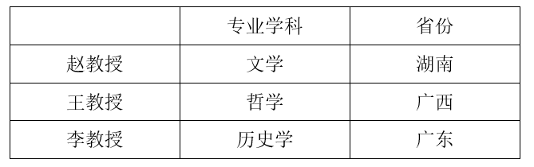

根据条件（4）可知，李教授喜欢和王教授一起下棋，A项无法推出；

根据推出的表格，文学教授来自湖南，而非广东，B项无法推出；

根据推出的表格，哲学教授来自广西，C项可以推出；

根据条件（3）可知，王教授住在李教授隔壁，D项无法推出。

故正确答案为C。

---

## 第 35 题　qid 5408574 · 类比推理

当前生物科技领域中克隆人技术是基本不可能实现的，并且在实现过程中也不能给生物科学带来任何附带的技术推动，因此克隆人技术在现阶段没有进行开发的必要。
以下哪项与上述论述的逻辑结构最为相似?

- **A**. 从北方迁徙到南方的候鸟难以适应炎热的夏季，并且还会受到此处捕食者的威胁，因此它们没有必要在这里久留
- **B**. 人类登陆金星是我们这代人无法看到的奇迹，并且就算登陆成功也不会给我们在地球上的生活带来促进意义，所以人类发展航天技术探索外星球是没有意义的　✅
- **C**. 如果要建成这座世界上最长的跨海大桥，就必须建设世界上最好的土木工程学科，并且在此基础上取得建设长距离跨海大桥的经验，不然大桥就不可能建成
- **D**. 掌握5门外语是普通人一生都难以做到的，并且投入大量时间也很难用其收获相应的经济回报，但不能因此排除部分人为了更多经济报酬去学习并掌握5门外语

**答案**：B

**官方解析**

第一步：分析题干推理形式。
题干根据克隆人技术基本不可能实现，并且在实现过程中也不能带来附带的技术推动，得到结论认为克隆人技术没有进行开发的必要。故论证方式为：根据A（克隆人技术）难以实现，而且没有更多好处，所以认为A（克隆人技术）没有必要。
第二步：逐一分析选项。
A项：根据A（从北方迁徙到南方的候鸟久留）难以实现，而且还面临许多坏处，所以认为A（从北方迁徙到南方的候鸟久留）没有意义，与题干论证方式不同，排除；
B项：根据A（人类登陆金星）难以实现，而且不会给地球生活带来更多好处，所以认为A（人类登陆金星）没有必要，与题干论证方式相同，当选；
C项：A（建成跨海大桥）需要建设土木工程学科，而且取得经验，不然A（建成跨海大桥）无法实现，与题干论证方式不同，排除；
D项：虽然A（掌握5门外语）难以实现，而且好处较少，但还是有部分人认为A（掌握5门外语）有意义，与题干论证方式不同，排除。
故正确答案为B。

---
