# 2022年四川省公务员录用考试《行测》题（网友回忆版）

> 判断推理 · 30 题 · 四川 2022

## 第 1 题　qid 4818046 · 图形推理

从所给的四个选项中，选择最合适的一个填入问号处，使之呈现一定的规律性：

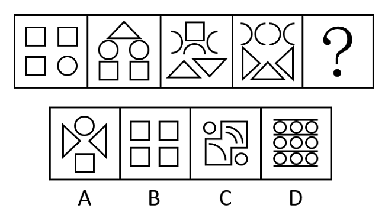

- **A**. A
- **B**. B
- **C**. C　✅
- **D**. D

**答案**：C

**官方解析**

本题元素组成不同，无明显属性规律，考虑数量规律。观察发现，题干图形中出现单一曲线、多边形，考虑线的数量。题干图形中既有曲线又有直线，考虑曲线和直线分开去数。题干图形中曲线数量依次为：1、2、3、4、？，所以？处图形的曲线数为5；直线数量依次为：12、11、10、9、？，所以？处图形的直线数为8。只有C项符合。
故正确答案为C。

---

## 第 2 题　qid 4818261 · 图形推理

从所给的四个选项中，选择最合适的一个填入问号处，使之呈现一定的规律性：

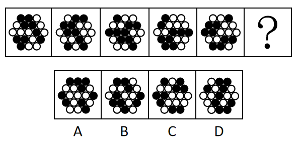

- **A**. A
- **B**. B
- **C**. C　✅
- **D**. D

**答案**：C

**官方解析**

解析一：元素组成相同，优先考虑位置规律。观察题干图形发现，图1所有黑球沿如图所示方向往左下方移动一格后得图2。

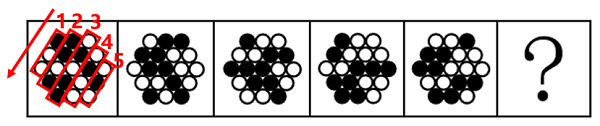

图2所有黑球沿如图所示方向往右下方移动一格后得图3。

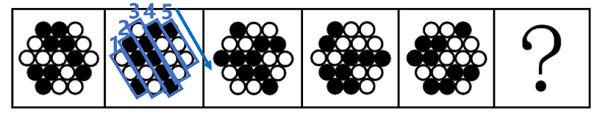

图3所有黑球沿如图所示方向往左下方移动一格后得图4。

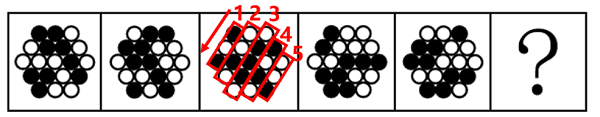

图4所有黑球沿如图所示方向往右下方移动一格后得图5。

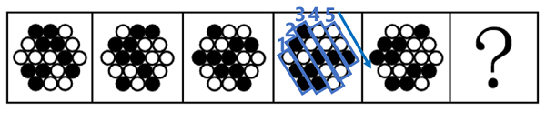

图5所有黑球沿如图所示方向往左下方移动一格后得？处图形，只有C项符合。

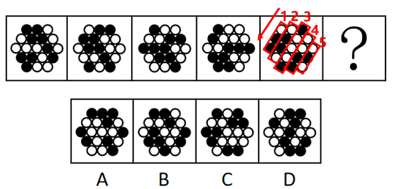

解析二：元素组成相同，优先考虑位置规律。相邻比较发现，每相邻的两幅图都有一部分区域黑白球位置摆放相同，以此类推，？处应选择一个和图5拥有一部分区域黑白球位置摆放相同的，只有C项符合。

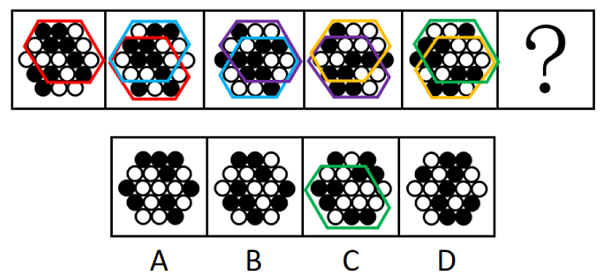

故正确答案为C。

---

## 第 3 题　qid 4818181 · 图形推理

从所给的四个选项中，选择最合适的一个填入问号处，使之呈现一定的规律性：

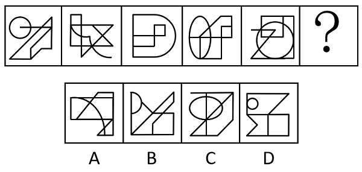

- **A**. A
- **B**. B
- **C**. C
- **D**. D　✅

**答案**：D

**官方解析**

元素组成不同，无明显属性规律，考虑数量规律。观察发现，图一、图二和图五都存在多端点图形，可以考虑笔画数。题干图形均为一笔画，所以？处图形也应该是一笔画。A项两笔画，B项两笔画，C项两笔画，D项一笔画。只有D项满足规律。
故正确答案为D。

---

## 第 4 题　qid 4818064 · 图形推理

从所给的四个选项中，选择最合适的—个填入问号处，使之呈现一定的规律性：

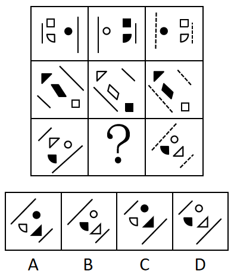

- **A**. A　✅
- **B**. B
- **C**. C
- **D**. D

**答案**：A

**官方解析**

每行图形元素形状相同，优先考虑位置规律。观察发现，第一行中，图1左右翻转得到图2，线条不变，黑白颜色互换；图2到图3位置不变，实线变成虚线，黑白颜色互换。第二行中，图1沿着直线方向翻转得到图2，线条不变，黑白颜色互换；图2到图3位置不变，实线变成虚线，黑白颜色互换。第三行中，图1沿着直线方向翻转得到图2，线条不变，黑白颜色互换；图2到图3位置不变，实线变虚线，黑白颜色互换，只有A项符合。
故正确答案为A。

---

## 第 5 题　qid 4818018 · 图形推理

右边四个图形中，只有一个是由左边的两个图形组合（只能通过上、下、左、右平移、在平面上旋转、重叠覆盖）而成的，请把它找出来：

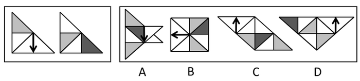

- **A**. A
- **B**. B　✅
- **C**. C
- **D**. D

**答案**：B

**官方解析**

本题考查平面拼合。将题干图1顺时针旋转后的图形与图2逆时针旋转后的图形进行拼合，即可得到B项。

故正确答案为B。

---

## 第 6 题　qid 4818019 · 图形推理

下图为同样大小的18个白色正方体和3个灰色正方体堆叠而成的多面体正视图和后视图。该多面体可拆分为①、②、③和④共4个多面体的组合，下列哪一项能填入问号处？

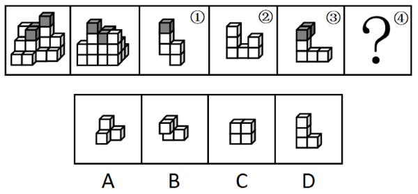

- **A**. A　✅
- **B**. B
- **C**. C
- **D**. D

**答案**：A

**官方解析**

本题考查立体拼合，如下图所示，立体图可以由①、②、③以及A项拼合而成。

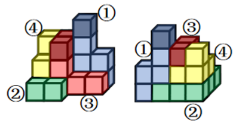

故正确答案为A。

---

## 第 7 题　qid 4817922 · 定义判断

反向社会化是一种文化反哺现象，指的是年轻一代用新知识、新观念影响前辈，使得前辈掌握新技能、新理念或者改变原有生活习惯的过程。
根据上述定义，下列没有构成反向社会化的是：

- **A**. 在小李反复介绍“断舍离”的理念后，父母终于开始整理丢弃长久不用的物品
- **B**. 小王教会母亲使用微信以后，母亲每天都在使用微信和老友进行沟通
- **C**. 小张教会姥姥电子支付以后，老人终于可以不带现金出门了
- **D**. 小赵送给父亲的65岁生日礼物是一次为期20天的新疆游　✅

**答案**：D

**官方解析**

第一步：找出定义关键词。
“年轻一代用新知识、新观念影响前辈”、“前辈掌握新技能、新理念或者改变原有生活习惯”。
第二步：逐一分析选项。
A项：小李向父母介绍“断舍离”的理念，符合“年轻一代用新知识、新观念影响前辈”，父母开始整理丢弃长久不用的物品，符合“前辈掌握新技能、新理念，或者改变原有生活习惯”，符合定义，排除；
B项：小王教母亲使用微信，符合“年轻一代用新知识、新观念影响前辈”，母亲学会使用微信后，每天使用微信和老友沟通，符合“前辈掌握新技能、新理念，或者改变原有生活习惯”，符合定义，排除；
C项：小张教姥姥使用电子支付，符合“年轻一代用新知识、新观念影响前辈”，姥姥学会电子支付后，可以不带现金出门，符合“前辈掌握新技能、新理念，或者改变原有生活习惯”，符合定义，排除；
D项：小赵送给父亲一次为期20天的新疆游，没有涉及小赵对父亲技能或观念的影响，也没有体现父亲掌握了新技能、新理念，不符合“年轻一代用新知识、新观念影响前辈”、“前辈掌握新技能、新理念或者改变原有生活习惯”，不符合定义，当选。
本题为选非题，故正确答案为D。

---

## 第 8 题　qid 4817898 · 定义判断

过失投放危险物质罪是指行为人对其行为可能引起中毒，造成危害公共安全的严重后果已经预见，而轻信能够避免，或者对这种严重后果应当预见，由于疏忽大意没有预见，以致发生了严重的中毒事故，造成严重结果危害不特定多数人的生命、健康和重大公私财产安全的行为。
根据上述定义，下列不可能构成过失投放危险物质罪的是：

- **A**. 甲误将有毒废弃物品倒入村里池塘中，致使村中牲畜饮用后中毒
- **B**. 乙将喷过敌敌畏但未冲洗干净的蔬菜拿到集市上售卖，致多名购买者中毒
- **C**. 丙误将氰化钾当作药品拿给村民张某和王某服用，导致张某和王某死亡　✅
- **D**. 丁将数个含有毒鼠强的番薯埋在田里毒野猪，同村魏某在不知情的情况下，将这些番薯挖回煮食，导致一家三口两人死亡，一人重伤

**答案**：C

**官方解析**

第一步：找出定义关键词。

“其行为可能引起中毒”、“造成危害公共安全的严重后果已经预见，而轻信能够避免”、“对这种严重后果应当预见，由于疏忽大意没有预见”、“发生了严重的中毒事故”、“危害不特定多数人的生命、健康和重大公私财产安全”。

第二步：逐一分析选项。

A项：甲误将有毒废弃物品倒入村里池塘中，说明其行为有可能会引起中毒，但甲有所疏忽，符合“其行为可能引起中毒”、“对这种严重后果应当预见，由于疏忽大意没有预见”，致使村中牲畜饮用后中毒，牲畜属于村民财产，即说明甲的行为危害了多数村民的公私财产安全，符合“发生了严重的中毒事故”、“危害不特定多数人的生命、健康和重大公私财产安全”，对应下图中原文标蓝处，符合定义，排除；

B项：乙的蔬菜上的敌敌畏没有冲洗干净就售卖，说明其行为有可能会引起中毒，但乙有所疏忽，符合“其行为可能引起中毒”、“对这种严重后果应当预见，由于疏忽大意没有预见”，蔬菜购买者是随机的，多名购买者中毒说明出现了严重的中毒事故且危害了其生命健康，符合“发生了严重的中毒事故”、“危害不特定多数人的生命、健康和重大公私财产安全”，对应下图中原文标红处，符合定义，排除；

C项：氰化钾为剧毒物质，丙误将其拿给村民张某和王某服用，张某和王某属于特定的人，不符合“危害不特定多数人的生命、健康和重大公私财产安全”，不符合定义，对应下图中原文标黄处，应属于过失致人死亡罪，不符合定义，当选；

D项：丁将有毒的番薯埋在田里毒野猪，说明其行为有可能会引起中毒，但丁有所疏忽，符合“其行为可能引起中毒”、“对这种严重后果应当预见，由于疏忽大意没有预见”，挖出番薯的人是随机的，且食用后致两人死亡、一人重伤，说明出现了严重的中毒事故且危害了生命健康，符合“发生了严重的中毒事故”、“危害不特定多数人的生命、健康和重大公私财产安全”，符合定义，排除。

本题为选非题，故正确答案为C。

定义原文：

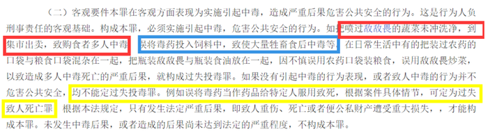

---

## 第 9 题　qid 4817883 · 定义判断

逆境胁迫记忆是指植株为适应复杂多变的自然环境而进化出的许多适应策略。即经过前期适度的非生物逆境干预处理后，对再次发生的逆境胁迫表现出较强的抗性或耐性。
根据上述定义，下列涉及逆境胁迫记忆的是：

- **A**. 木豆受病原菌侵染部位的水杨酸含量显著升高，从而提高植物抗病性
- **B**. 蘑菇被老鼠等啮齿类动物啃食过的部位，其生长素的积累会更加明显
- **C**. 玉米营养生长周期历经多次渍水锻炼，可缓解后期渍害造成的产量损失　✅
- **D**. 农民在冬季用石磙子碾压麦苗抑制小麦生长过旺，最终可提高小麦产量

**答案**：C

**官方解析**

第一步：找出定义关键词。
“植株”、“经过前期适度的非生物逆境干预处理”、“对再次发生的逆境胁迫表现出较强的抗性或耐性”。
第二步：逐一分析选项。
A项：受病原菌侵染，不符合“经过前期适度的非生物逆境干预处理”，不符合定义，排除；
B项：被老鼠等啮齿类动物啃食，不符合“经过前期适度的非生物逆境干预处理”，不符合定义，排除；
C项：玉米历经多次渍水锻炼，符合“植株”、“经过前期适度的非生物逆境干预处理”，缓解后期渍害造成的产量损失，符合“对再次发生的逆境胁迫表现出较强的抗性或耐性”，符合定义，当选；
D项：用石磙子碾压麦苗，符合“植株”、“经过前期适度的非生物逆境干预处理”，抑制小麦生长过旺，最终可提高小麦产量，不符合“对再次发生的逆境胁迫表现出较强的抗性或耐性”，不符合定义，排除。
故正确答案为C。

---

## 第 10 题　qid 4817829 · 定义判断

同侪效应是指具有相似特征、地位的个体或组织在行动决策上呈现出的某种交互影响的现象，其实现方式和手段的相近性，往往使得同侪比其他群聚对个体或组织的观点、行为具有更强的正向塑造功效。
根据上述定义，下列属于同侪效应的是：

- **A**. 青少年沉迷电子游戏，相当一部分原因是由于同伴之间相互模仿与攀比所造成的
- **B**. 讯狗公司高薪聘请的刘工程师，入职后组建了新的研发团队，短时间内就取得了巨大成绩
- **C**. 某高校通过开展老中青“传帮带”业务提升模式，快速提高了青年教师的教学水平及科研能力
- **D**. “新知”读书会的同学们每天相互监督读书打卡，结果这些同学取得的成绩远远优于其他同学　✅

**答案**：D

**官方解析**

第一步：找出定义关键词。
“具有相似特征、地位的个体或组织”、“在行动决策上呈现出的某种交互影响”、“同侪比其他群聚对个体或组织的观点、行为具有更强的正向塑造功效”。
第二步：逐一分析选项。
A项：青少年沉迷电子游戏不是正向的行为，不符合“同侪比其他群聚对个体或组织的观点、行为具有更强的正向塑造功效”，不符合定义，排除；
B项：刘工程师入职后组建了新的研发团队，不清楚研发团队成员是否为具有相似特征、地位的个体，不符合“具有相似特征、地位的个体或组织”，也未体现成员之间的交互影响，不符合“在行动决策上呈现出的某种交互影响”，不符合定义，排除；
C项：老中青“传帮带”业务涉及不同年龄层的群体，不符合“具有相似特征、地位的个体或组织”，不符合定义，排除。
D项：“新知”读书会的同学们，符合“具有相似特征、地位的个体或组织”，他们每天相互监督读书打卡，结果取得的成绩远优于其他同学，符合“在行动决策上呈现出的某种交互影响”、“同侪比其他群聚对个体或组织的观点、行为具有更强的正向塑造功效”，符合定义，当选。
故正确答案为D。

---

## 第 11 题　qid 4818003 · 定义判断

内源化学物是指机体内原已存在的和代谢过程中所形成的产物或中间产物。外源化学物是指自然界存在着的或人工合成的各种具有生物活性（即可在生物组织上诱发生物反应、化学反应）的物质。
根据上述定义，下列说法正确的是：

- **A**. 医生开具的治疗肺结核的药物属于内源化学物
- **B**. 为增加粘度，在酸奶制作过程中添加的增稠剂属于内源化学物
- **C**. 十字花科植物的细胞在降解时产生了具有芥末味道的芥子油苷，这属于内源化学物　✅
- **D**. 受长期食物匮乏影响，鸟类体内的血浆皮质酮水平缓慢上升，并维持在较高水平，这属于外源化学物

**答案**：C

**官方解析**

第一步：找出定义关键词。
内源化学物：“机体原有和代谢过程中形成的产物或中间产物”；
外源化学物：“自然界存在或人工合成的具有生物活性（即可在生物组织上诱发生物反应、化学反应）的物质”。
第二步：逐一分析选项。
A项：医生开具的治疗肺结核的药物，符合“自然界存在或人工合成的具有生物活性（即可在生物组织上诱发生物反应、化学反应）的物质”，符合“外源化学物”定义，不符合“内源化学物”定义，排除；
B项：为增加粘度，在酸奶制作过程中添加的增稠剂，符合“自然界存在或人工合成的具有生物活性（即可在生物组织上诱发生物反应、化学反应）的物质”，符合“外源化学物”定义，不符合“内源化学物”定义，排除；
C项：十字花科植物的细胞在降解时产生了芥子油苷，符合“机体原有和代谢过程中形成的产物或中间产物”，符合“内源化学物”定义，当选；
D项：鸟类体内的血浆皮质酮，符合“机体原有和代谢过程中形成的产物或中间产物”，符合“内源化学物”定义，不符合“外源化学物”定义，排除。
故正确答案为C。

---

## 第 12 题　qid 4817899 · 定义判断

专业化营销策略是在选择目标市场时，企业选择若干细分市场进行专业化经营的策略。一般分为产品专业化、市场专业化和有选择的专业化三种。产品专业化指公司提供同一类产品或服务，以满足各种不同的市场需求；市场专业化指为某个特定的顾客群提供多样化的产品、服务或解决方案；有选择的专业化则以细分市场的吸引力为标准选择多个细分市场，但各细分市场之间可能关联较小。
根据上述定义，下列属于有选择的专业化营销策略的是：

- **A**. 公司着力向全国医药市场推广某种冠心病药品
- **B**. 公司专注营销少年儿童学习、娱乐等系列产品
- **C**. 公司瞄准职业男装和学龄儿童童鞋市场开展营销　✅
- **D**. 公司集中精力于边远农村家电市场的开拓与营销

**答案**：C

**官方解析**

第一步：找出定义关键词。
专业化营销策略：“企业“、“选择若干细分市场进行专业化经营”；
产品专业化：“提供同一类产品或服务”、“满足各种不同的市场需求”；
市场专业化：“为某个特定的顾客群”、“提供多样化的产品、服务或解决方案”；
有选择的专业化：“以细分市场的吸引力为标准”、“选择多个细分市场”、“各细分市场之间可能关联较小”。
第二步：逐一分析选项。
A项：向全国医药市场推广某种冠心病药品，只涉及医药市场，不符合“选择多个细分市场”，不符合有选择的专业化营销策略的定义，排除；
B项：专注营销少年儿童学习、娱乐等系列产品，均是针对少年儿童，相互之间存在关联，不符合“各细分市场之间可能关联较小”，不符合有选择的专业化营销策略的定义，排除；
C项：公司，符合“企业”，瞄准职业男装和学龄儿童童鞋市场，符合“选择多个细分市场”，也符合“各细分市场之间可能关联较小”，符合有选择的专业化营销策略的定义，当选；
D项：边远农村家电市场的开拓与营销，只涉及边远农村家电市场，不符合“选择多个细分市场”，不符合有选择的专业化营销策略的定义，排除。
故正确答案为C。

---

## 第 13 题　qid 4818012 · 定义判断

食品安全风险评估指科学评估食品、食品添加剂及食品相关产品中的生物性、化学性和物理性危害对人体健康造成不良影响的可能性及其程度，该评估包括危害识别、危害特征描述、暴露评估、风险特征描述等内容。
根据上述定义，下列不属于食品安全风险评估范围的是：

- **A**. 某地消费者投诉超市售卖的酱油中防腐剂含量超标，要求主管部门进行核查
- **B**. 为了增加啤酒的口感和风味，某啤酒生产厂家在其中添加了果胶
- **C**. 食品包装企业创新性地使用了一种新型材料来生产食品外包装箱　✅
- **D**. 某地因为土壤原因，所种植加工的大米中某重金属元素含量超标

**答案**：C

**官方解析**

第一步：找到定义关键词。
“科学评估食品、食品添加剂及食品相关产品中的生物性、化学性和物理性危害”、“对人体健康造成不良影响的可能性及其程度”、“包括危害识别、危害特征描述、暴露评估、风险特征描述等”。
第二步：逐一分析选项。
A项：消费者投诉酱油里防腐剂含量超标，符合“科学评估食品添加剂中的化学性危害”，含量超标的防腐剂有可能危害健康，符合“对人体健康造成不良影响的可能性及其程度”，符合食品安全风险评估范围，排除；
B项：啤酒生产厂家在啤酒里添加果胶，果胶是一种天然食品添加剂，符合“科学评估食品添加剂中的化学性危害”，为了增加啤酒的口感和风味而选择添加果胶，符合“对人体健康造成不良影响的可能性及其程度”，符合食品安全风险评估范围，排除；
C项：食品包装企业使用新型材料来生产的是外包装箱，不是食品本身，不符合“科学评估食品、食品添加剂及食品相关产品中的生物性、化学性和物理性危害”，不符合食品安全风险评估范围，当选；
D项：种植加工的大米中某重金属元素含量超标，符合“科学评估食品中的物理性危害”，重金属元素含量超标可能危害人体健康，符合“对人体健康造成不良影响的可能性及其程度”，符合食品安全风险评估范围，排除。
本题为选非题，故正确答案为C。

---

## 第 14 题　qid 4817984 · 定义判断

固定行为型是动物按一定时空顺序进行的躯体活动，表现为一定的运动形式并能达到特定的生物学目的。这一行为是被一定的外部刺激引发的，一旦引发就会自动完成而不需要继续给予外部刺激。
根据上述定义，下列不属于固定行为型的是：

- **A**. 青蛙发现前方弹舌可及的飞虫后，舌头迅速弹出，随后缩回
- **B**. 工蜂发现蜜源后，到密集的蜂群中，一边激烈地振动着腹部，一边按8字形作盘旋行动
- **C**. 小猫为了清洁会用舌头舔毛，对舔不到的地方会先用唾液打湿爪子后，再用爪子打理该部位　✅
- **D**. 当灰雁的蛋滚出巢外后，它会先伸长脖颈，下颏压在蛋上把蛋拉回，即使中途有人把蛋拿走，灰雁也将继续完成这一动作

**答案**：C

**官方解析**

第一步：找出定义关键词。
“按一定时空顺序进行的躯体活动”、“被一定的外部刺激引发的”、“一旦引发就会自动完成而不需要继续给予外部刺激”。
第二步：逐一分析选项。
A项：青蛙先弹舌后缩回，符合“按一定时空顺序进行的躯体活动”，青蛙这一行为是由于发现了前方弹舌可及的飞虫，符合“被一定的外部刺激引发的”，且青蛙可自动完成这一系列动作，不需要再有其他外部刺激，符合“一旦引发就会自动完成而不需要继续给予外部刺激”，符合定义，排除；
B项：工蜂一边激烈地振动着腹部，一边按8字形作盘旋行动，符合“按一定时空顺序进行的躯体活动”，工蜂这一行为是由于发现了蜜源，符合“被一定的外部刺激引发的”，且工蜂是到蜂群中自动完成这一系列动作，不需要再有其他外部刺激，符合“一旦引发就会自动完成而不需要继续给予外部刺激”，符合定义，排除；
C项：小猫用舌头舔毛是日常行为，为了清洁身体，并没有受到外界刺激，不符合“被一定的外部刺激引发的”，不符合定义，当选；
D项：灰雁先伸长脖颈，下颏压在蛋上把蛋拉回，符合“按一定时空顺序进行的躯体活动”，灰雁这一行为是由于蛋滚出巢外，符合“被一定的外部刺激引发的”，且即使中途有人把蛋拿走，灰雁也将继续完成这一动作，体现了这一动作的自动性，符合“一旦引发就会自动完成而不需要继续给予外部刺激”，符合定义，排除。
本题为选非题，故正确答案为C。

---

## 第 15 题　qid 4817879 · 定义判断

错失恐惧症指社交活动中因过于担心错失机遇，从不拒绝任何邀约的心理状态。
根据上述定义，下列属于错失恐惧症的是：

- **A**. 小陈的心情极易受身边同事对其态度的影响，常常怀疑自己做错什么，总是被后悔自责的情绪所包围
- **B**. 农村大学生小李自尊心很强，刻苦努力，积极参加学校组织的各项活动，最终成为一名优秀的学生
- **C**. 大龄青年小张对各种集体活动或朋友聚会总是“有求必应”，生怕错过任何结识异性朋友的机会　✅
- **D**. 小赵关心时事，每隔一小时就到各大网站刷新闻，生怕错过什么大事，是单位里著名的百事通

**答案**：C

**官方解析**

第一步：找出定义关键词。
“社交活动中”、“过于担心错失机遇”、“从不拒绝任何邀约”。
第二步：逐一分析选项。
A项：小陈易受身边同事对其态度的影响而产生负面情绪，未提及有人对小陈邀约，不符合“从不拒绝任何邀约”，不符合定义，排除； 
B项：小李积极参加学校组织的各项活动并成为优秀的学生，并未提及有人对小李邀约，不符合“从不拒绝任何邀约”，不符合定义，排除；
C项：小张对各种集体活动或朋友聚会总是“有求必应”，生怕错过结交异性朋友的机会，说明他在社交活动中因害怕错失机遇，从不拒绝，符合“社交活动中”、“过于担心错失机遇”、“从不拒绝任何邀约”，符合定义，当选；
D项：小赵因关心时事到各大网站刷新闻而成为单位的百事通，只能说明他了解时事，并未提及有人对小赵邀约，不符合“从不拒绝任何邀约”，不符合定义，排除。
故正确答案为C。

---

## 第 16 题　qid 4817902 · 类比推理

病从口入：祸从口出

- **A**. 比上不足：比下有余
- **B**. 捡了芝麻：丢了西瓜
- **C**. 耳听为虚：眼见为实　✅
- **D**. 母鸡下蛋：公鸡打鸣

**答案**：C

**官方解析**

第一步：判断题干词语间逻辑关系。
病从口入指许多疾病是由于吃了不洁净的东西或饮食不规律引起的；祸从口出指说话不谨慎会招致灾祸，二者没有语义关系，考虑成语拆分，“病”和“祸”是并列关系，“入”和“出”是反义关系。
第二步：判断选项词语间逻辑关系。
A项：“比”和“比”是同义关系，“足”和“余”不是反义关系，与题干逻辑关系不一致，排除；
B项：“捡”和“丢”是反义关系，“麻”和“瓜”不是反义关系，与题干逻辑关系不一致，排除；
C项：“耳”和“眼”是并列关系，“虚”和“实”是反义关系，与题干逻辑关系一致，当选；
D项：“母”和“公”是并列关系，“蛋”和“鸣”不是反义关系，与题干逻辑关系不一致，排除。
故正确答案为C。

---

## 第 17 题　qid 4817892 · 类比推理

策略：销售：销量

- **A**. 表演：技巧：效果
- **B**. 兵器：战斗：伤亡
- **C**. 思路：答题：得分　✅
- **D**. 方法：测量：误差

**答案**：C

**官方解析**

第一步：判断题干词语间逻辑关系。
运用策略销售，可以提高销量，三者为对应关系。
第二步：判断选项词语间逻辑关系。
A项：运用技巧表演，可以增强效果，三者为对应关系，但前两词词语顺序与题干相反，与题干逻辑关系不一致，排除；
B项：运用兵器战斗，可以增加敌方的伤亡，也可以减少己方的伤亡，三者关系不够严谨，与题干逻辑关系不一致，排除；
C项：运用思路答题，可以提高得分，三者为对应关系，与题干逻辑关系一致，当选；
D项：运用方法测量，可以减少误差，三者为对应关系，但题干为“提高”，此处为“减少”，与题干逻辑关系不一致，排除。
故正确答案为C。

---

## 第 18 题　qid 4818109 · 类比推理

7：质数：自然数

- **A**. 红光：可见光：电磁波谱　✅
- **B**. 爱：感情：情感
- **C**. 煤：岩石：沉积岩
- **D**. U：字母：英文

**答案**：A

**官方解析**

第一步：判断题干词语间逻辑关系。
质数是指在大于1的自然数中，除了1和它本身以外不再有其他因数的自然数，如2、3、5、7等，因此7是质数，二者为种属关系。同时，自然数包含所有质数，二者为包容关系。
第二步：判断选项词语间逻辑关系。
A项：可见光是电磁波谱中人眼可以感知的部分，如红光、橙光、黄光、绿光等，因此，红光是可见光，二者为种属关系，同时，电磁波谱包含所有可见光，二者为包容关系，与题干逻辑关系一致，当选；
B项：爱是一种感情，但感情和情感意思相近，二者为近义关系，与题干逻辑关系不一致，排除；
C项：煤是固体可燃有机岩，两者为种属关系，沉积岩也是岩石的一种，二者为种属关系，但顺序与题干不同，与题干逻辑关系不一致，排除；
D项：U是字母，二者为种属关系，但有的字母是英文，有的字母不是英文，如汉语拼音中的字母等，有的英文是字母，有的英文不是字母，如英文单词等，二者为交叉关系，与题干逻辑关系不一致，排除。
故正确答案为A。

---

## 第 19 题　qid 4818002 · 类比推理

条件 对于 （    ）相当于 （    ）对于 建设

- **A**. 医师；设计师
- **B**. 推理；规划　✅
- **C**. 思维；混凝土
- **D**. 暗示；道路

**答案**：B

**官方解析**

逐一代入选项。
A项：条件与医师，二者无明显逻辑关系；设计师可能参与到建设当中，前后逻辑关系不一致，排除；
B项：推理需要依据条件，二者为依据的对应关系；建设需要依据规划，二者为依据的对应关系，前后逻辑关系一致，当选；
C项：条件与思维，二者无明显逻辑关系；混凝土是建设中需要的原材料，二者为原材料的对应关系，前后逻辑关系不一致，排除；
D项：条件与暗示，二者无明显逻辑关系；建设道路，二者为动宾关系，前后逻辑关系不一致，排除。
故正确答案为B。

---

## 第 20 题　qid 4818235 · 类比推理

水路运输 对于 （    ） 相当于 （    ） 对于 商朝文物

- **A**. 公路运输；四羊方尊
- **B**. 内河运输；夏代文物
- **C**. 货运船舶；遗址挖掘
- **D**. 长途运输；青铜器物　✅

**答案**：D

**官方解析**

逐一代入选项。
A项：水路运输和公路运输是两种不同的运输方式，二者是并列关系；四羊方尊是商代晚期青铜礼器，四羊方尊是商朝文物，二者是种属关系，前后逻辑关系不一致，排除；
B项：内河运输是一种水路运输，二者是种属关系；夏代文物和商朝文物是并列关系，前后逻辑关系不一致，排除；
C项：货运船舶用于水路运输，二者是工具和应用领域的对应关系；商朝文物是遗址挖掘的成果，二者是过程和成果的对应关系，前后逻辑关系不一致，排除；
D项：有的水路运输是长途运输，有的水路运输不是长途运输，有的长途运输是水路运输，有的长途运输不是水路运输，二者是交叉关系；有的青铜器物是商朝文物，有的青铜器物不是商朝文物，有的商朝文物是青铜器物，有的商朝文物不是青铜器物，二者是交叉关系，前后逻辑关系一致，当选。
故正确答案为D。

---

## 第 21 题　qid 4818081 · 类比推理

要做好新时代党的新闻舆论工作，就必须牢牢坚持党性原则。坚持党性原则，最根本的是坚持党的领导。因此坚持党的领导是做好新闻舆论工作的必备条件。
下列论述与上述推断结构最相似的是：

- **A**. 人民群众的拥护是我们党最坚固的根基。人民群众最痛恨腐败现象。因此腐败是我们党面临的最大威胁
- **B**. 强国必须强军。强军是新时代坚持和发展中国特色社会主义，实现中华民族伟大复兴的战略支撑。因此巩固和加强人民军队刻不容缓
- **C**. 国家安全是人民幸福安康的基本要求。维护国家安全才能维护全国各族人民的根本利益。因此维护全国各族人民的根本利益才能实现人民幸福安康
- **D**. 社会主义现代化是人与自然和谐共生的现代化。坚持生态文明建设是人与自然和谐共生的必然要求。因此实现社会主义现代化必须坚持生态文明建设　✅

**答案**：D

**官方解析**

第一步：分析题干推理形式。

“要做好新时代党的新闻舆论工作，就必须牢牢坚持党性原则”翻译为：①做好新时代党的新闻舆论工作坚持党性原则；

“坚持党性原则，最根本的是坚持党的领导”翻译为：②坚持党性原则坚持党的领导；

将①和②串联可以递推出③：做好新时代党的新闻舆论工作坚持党性原则坚持党的领导；

“因此坚持党的领导是做好新闻舆论工作的必备条件”翻译为：④做好新时代党的新闻舆论工作坚持党的领导。

④是对③的肯前必肯后。

第二步：逐一分析选项。

A项：“人民群众的拥护是我们党最坚固的根基”翻译为：党人民群众的拥护；“人民群众最痛恨腐败现象”无法翻译，与题干推理形式不同，排除；

B项：“强国必须强军”翻译为：①强国强军；“强军是新时代坚持和发展中国特色社会主义，实现中华民族伟大复兴的战略支撑”翻译为：②坚持和发展中国特色社会主义，实现中华民族伟大复兴强军；①和②无法串联，与题干推理形式不同，排除；

C项：“国家安全是人民幸福安康的基本要求”翻译为：①人民幸福安康国家安全；“维护国家安全才能维护全国各族人民的根本利益”翻译为：②维护全国各族人民的根本利益国家安全；①和②无法串联，与题干推理形式不同，排除；

D项：“社会主义现代化是人与自然和谐共生的现代化”翻译为：①社会主义现代化人与自然和谐共生的现代化；“坚持生态文明建设是人与自然和谐共生的必然要求”翻译为：②人与自然和谐共生的现代化坚持生态文明建设；将①和②串联可以递推出③：社会主义现代化人与自然和谐共生的现代化坚持生态文明建设；“因此实现社会主义现代化必须坚持生态文明建设”翻译为：④社会主义现代化坚持生态文明建设，④是对③的肯前必肯后，与题干推理形式相同，当选。

故正确答案为D。

---

## 第 22 题　qid 4817841 · 逻辑判断

调查显示，我国脱发人群数量达3亿，其中69.8%是30岁以下人群。有一种流行观点认为，脱发与身体内缺乏维生素有关，只要在脱发处涂抹维生素就能治愈脱发。调查显示，许多30岁左右的年轻患者对此深信不疑，纷纷采用这种方法试图治愈脱发。

以下哪项如果为真，最能质疑上述流行观点？

- **A**. 
有专家指出，引起脱发的原因有很多，并不都是缺乏维生素

- **B**. 
有研究表明，B族维生素对治疗由缺铁引起的脱发没有作用

- **C**. 
大量的临床试验证明，外用维生素治疗脱发并没有明显疗效
　✅
- **D**. 
患者应通过检查弄清脱发原因，再根据诊断结果进行针对性治疗

**答案**：C

**官方解析**

第一步：找出论点和论据。

论点：脱发与身体内缺乏维生素有关，只要在脱发处涂抹维生素就能治愈脱发。

论据：无。

本题只有论点，没有论据，削弱优先考虑削弱论点，即涂抹维生素不能治愈脱发。

第二步：逐一分析选项。

A项：该项讨论的是引起脱发的原因，而论点讨论的是涂抹维生素是否可以治愈脱发，话题不一致，无法削弱，排除；

B项：该项指出B族维生素对治疗由缺铁引起的脱发没有作用，通过举例来削弱论点，可以削弱，保留；

C项：该项指出外用维生素治疗脱发并没有明显疗效，直接削弱论点中的“只要在脱发处涂抹维生素就能治愈脱发”，削弱论点，可以削弱，保留；

D项：该项讨论的是脱发患者应如何治疗脱发，而论点讨论的是涂抹维生素是否可以治愈脱发，话题不一致，无法削弱，排除。

对比B、C两项，B项只说明B族维生素对治疗由缺铁引起的脱发没有作用，但不明确对其他原因造成的脱发是否有用，而C项直接表明外用维生素治疗脱发并没有明显疗效，C项削弱力度更强，当选。

故正确答案为C。

---

## 第 23 题　qid 4818063 · 逻辑判断

最近热播的电视剧涉及教育资源争夺战，不仅把观众的心弦绷紧到了低龄教育阶段，而且暴露了一个更为深层次的问题，即究竟什么才是好的教育。一些剧中人以为，只要孩子能够考到高分进入好的学校，就是最好的教育。
以下哪项如果为真，最能质疑上述观点？

- **A**. 应试教育是教育资源长期相对匮乏、社会选拔标准相对单一的后遗症
- **B**. 仅仅以分数作为单一评判标准，早已不能满足市场对各种人才的需要　✅
- **C**. 近年来，相关部门开展了校外培训机构专项治理，已取得阶段性成效
- **D**. 个别孩子以很高的分数考入国内著名高校，最终却走上了犯罪的道路

**答案**：B

**官方解析**

第一步：找出论点和论据。
论点：只要孩子能够考到高分进入好的学校，就是最好的教育。
论据：无。
本题只有论点，没有论据，削弱优先考虑削弱论点，即考到高分进入好的学校不是最好的教育。
第二步：逐一分析选项。
A项：选项讨论的是应试教育产生的原因，应试教育又称填鸭式教育，就是把知识一味灌输给学生，完全不考虑学生是否能够明白其中的意思，指的是一种忽略学生接受能力的教育方式，与题干看重分数的教育不同，无关项，不能削弱，排除；
B项：选项讨论的是分数作为单一评判标准（即论点的考高分进名校），无法满足市场对人才的需要，说明考高分进名校已经不符合现在人才选拔的要求，所以考高分进名校不是最好的教育，可以削弱论点，保留；
C项：选项讨论的是有关部门对校外培训机构治理取得的成效，并未提及考高分进好学校是否是最好的教育，二者话题不一致，无关项，无法削弱，排除；
D项：选项说个别孩子高分进入名校，但是最终却走上犯罪的道路，即通过举了个别孩子的例子说明高分进入好的学校也不一定是最好的教育，举例削弱论点，保留。
对比B、D两项， D项是举例削弱论点，而B项直接削弱论点，力度更强，因此择优选择B项。
故正确答案为B。

---

## 第 24 题　qid 4817948 · 逻辑判断

人人都是可以不普通的。如果你认为自己是最优秀的人，你就会按照最优秀人的标准来要求自己。如果你相信自己能够成功，你就一定能成功。只有先在心里肯定自己，你才能在行动上充分地展现自己。
根据以上陈述，可以得出以下哪项？

- **A**. 如果你不认为自己最优秀，你就不会按照最优秀人的标准来要求自己
- **B**. 如果能在行动上充分地展现自己，那么一定是先在心里肯定了自己　✅
- **C**. 有的人虽然自信能够成功，但实际上未必能够成功
- **D**. 你只有相信自己能够成功，才可能取得成功

**答案**：B

**官方解析**

第一步：翻译题干。

①认为自己是最优秀的人会按照最优秀人的标准来要求自己；

②相信自己能够成功一定能成功；

③在行动上充分地展现自己先在心里肯定自己。

第二步：逐一分析选项。

A项：翻译为：不认为自己最优秀不会按照最优秀人的标准来要求自己，是对①的否前，否前无必然结论，无法推出，排除；

B项：翻译为：在行动上充分地展现自己先在心里肯定自己，是对③的肯前，肯前必肯后，可以推出，当选；

C项：自信能够成功是对②的肯前，根据肯前必肯后，应得出一定成功，并非未必能够成功，无法推出，排除；

D项：翻译为：可能取得成功相信自己能够成功，根据②可知，既不是肯后也不是否后，无法推出，排除。

故正确答案为B。

---

## 第 25 题　qid 4818115 · 逻辑判断

作为一种户外运动，徒步正成为越来越多人的生活方式。徒步者们大多喜欢走在美丽清新的城市近郊、乡村荒野、风景名胜或国家公园中。为什么有些现代人喜欢徒步？这是他们热爱自然、回归自然的表现，徒步者希望通过回归自然获得内心的宁静。
以下哪项如果为真，不能质疑上述观点？

- **A**. 很多人希望通过徒步来锻炼身体，增强活力，促进身体健康
- **B**. 徒步者反对现代社会所推崇的“速度”价值，希望自己的生活“慢下来”
- **C**. 徒步容易激发创造力，很早就被人作为潜心思考或科学发现的重要方式
- **D**. 国家公园、带薪休假、行走文学等要素的出现，让现代人徒步成为可能　✅

**答案**：D

**官方解析**

第一步：找出论点和论据。
论点：现代人喜欢徒步是因为他们热爱自然、回归自然，徒步者希望通过回归自然获得内心的宁静。
论据：无。
本题只有论点没有论据，削弱优先考虑否定论点，且论点中存在因果关系，还可以考虑因果倒置和他因削弱。
第二步：逐一分析选项。
A项：该项说的是很多人希望通过徒步来锻炼身体，说明现代人喜欢徒步的原因是锻炼身体，而不是回归自然获得内心的宁静，削弱论点，排除；
B项：该项说的是徒步者希望自己的生活“慢下来”，说明现代人喜欢徒步的原因是让生活“慢下来”，而不是回归自然获得内心的宁静，削弱论点，排除；
C项：该项说的是徒步容易激发创造力且被人作为潜心思考或科学发现的重要方式，说明现代人喜欢徒步的原因是容易激发创造力，而不是回归自然获得内心的宁静，削弱论点，排除；
D项：该项说的是国家公园、带薪休假和行走文学等为徒步提供了条件，而题干讨论的是现代人喜欢徒步的原因，话题不一致，无法削弱，当选。
本题为选非题，故正确答案为D。

---

## 第 26 题　qid 4818163 · 逻辑判断

一些对生态和气候感兴趣的古生物学研究者发现，中国东部与国外相比，虽然化石产出的具体时期有所差异，但埋藏于紫红色岩石地层的恐龙骨骼化石的埋藏相具有相似性，这是因为晚白垩世全球古生态及古气候是相似的。在中国，埋藏的恐龙骨骼化石种属以鸟脚类鸭嘴恐龙与兽脚类恐龙为主，埋藏环境主要为冲积扇与河流环境；美洲以鸭嘴龙科为主，埋藏环境主要为平原。
要得到上述古生物学研究者的结论，需要补充的前提是：

- **A**. 晚白垩世的河流与平原具有不相同的埋藏环境
- **B**. 中国鸟脚类鸭嘴恐龙与美洲的鸭嘴龙科是不同种族
- **C**. 骨骼化石在不同地层的埋藏学特征取决于生态及气候　✅
- **D**. 晚白垩世全球各地的紫红色岩石地层具有相同的埋藏环境

**答案**：C

**官方解析**

第一步：找出论点和论据。
论点：中国东部与国外相比，虽然化石产出的具体时期有所差异，但埋藏于紫红色岩石地层的恐龙骨骼化石的埋藏相具有相似性。
论据：晚白垩世全球古生态及古气候是相似的。
本题问法为“前提”，论点讨论的是中国东部与国外的埋藏于紫红色岩石地层的恐龙骨骼化石的埋藏相具有相似性，而论据讨论的是晚白垩世全球古生态及古气候是相似的，二者话题不一致，优先考虑搭桥，即建立埋藏相与生态气候之间的联系。
第二步：逐一分析选项。
A项：该项指出晚白垩世的河流与平原具有不同的埋藏环境，而题干讨论的是恐龙骨骼化石在紫红色岩石地层的埋藏相与当时生态气候的关系，话题不一致，无法加强，排除；
B项：该项指出中国的鸟脚类鸭嘴恐龙与美洲的鸭嘴龙科属于不同种族，而题干讨论的是恐龙骨骼化石在紫红色岩石地层的埋藏相与当时生态气候的关系，话题不一致，无法加强，排除；
C项：该项指出骨骼化石在不同地层的埋藏学特征取决于生态及气候，建立了埋藏相与生态气候之间的联系，属于搭桥项，可以加强，当选；
D项：该项指出晚白垩世全球各地的紫红色岩石地层的埋藏环境相同，而题干讨论的是恐龙骨骼化石在紫红色岩石地层的埋藏相与当时生态气候的关系，话题不一致，无法加强，排除。
故正确答案为C。

---

## 第 27 题　qid 4818208 · 逻辑判断

有关专家认为，北冰洋很可能在2034年迎来第一个“无冰之夏”。北极海冰并非一成不变，一年中会动态变化：夏季持续融化，在9月前后达到最小面积；冬季持续结冻，在3月前后达到最大面积。近几十年来，由于北极地区气温持续升高，海冰在夏季的面积随之持续减少。
以下哪项如果为真，不能支持上述专家观点？

- **A**. 1988年25%左右的北极海冰持续冻结4年以上，2013年降到了7%
- **B**. 北极海冰融化后海水将能吸收大量的太阳辐射，相当于海冰的100倍　✅
- **C**. 1979年至2011年，北极海冰9月份的范围正以每十年12%的速率消融
- **D**. 北极夏季最小海冰范围在2012年只有近334万平方千米，是十年前的一半

**答案**：B

**官方解析**

第一步：找出论点和论据。
论点：北冰洋很可能在2034年迎来第一个“无冰之夏”。
论据：近几十年来，由于北极地区气温持续升高，海冰在夏季的面积随之持续减少。
本题论点和论据话题一致，都是在讨论北极海冰在夏季的面积持续减少，加强优先考虑补充论据，本题为选非题，将可以加强的选项排除即可。
第二步：逐一分析选项。
A项：该项说的是北极持续冻结4年以上的海冰从1988年的25%左右下降到了2013年的7%，举例说明了北极海冰在夏季的面积持续减少，补充论据，可以加强，排除；
B项：该项说的是北极海冰融化后的结果，但不能说明北极海冰在夏季的面积持续减少，话题不一致，无法加强，当选；
C项：该项举了1979年至2011年的例子，说明北极海冰在夏季的面积确实在持续减少，补充论据，可以加强，排除；
D项：该项说的是北极在2012年的夏季最小海冰范围是十年前的一半，举例说明了北极海冰在夏季的面积持续减少，补充论据，可以加强，排除。
本题为选非题，故正确答案为B。

---

## 第 28 题　qid 4817886 · 逻辑判断

人们往往认为，在育儿问题上，西方父母更“佛系”，东方父母更“鸡血”，某经济学家不以为然。他认为，如果一个社会中出身阶层完全决定了一个人的收入水平，那么，父母敦促孩子努力学习、成为优秀学生的行为就是徒劳的；而如果高学历及名校生能够比其他人获得更多成功时，父母就完全有理由鞭策孩子学习。
以下哪项如果为真，最能支持上述专家的观点？

- **A**. 相对于地域和文化因素，家庭经济收入水平高低对父母育儿行为有更为重要的影响
- **B**. 在收入不平等普遍存在的情况下，社会阶层流动性的高低，是影响父母育儿行为的关键因素
- **C**. 如果一个教育系统强调机会公平并淡化成年前的竞争，那么家长和孩子会有更多放松的余地
- **D**. 在教育回报率较低的国家，父母往往会更宽容；在教育回报率较高的国家，父母可能会更专断　✅

**答案**：D

**官方解析**

第一步：找出论点和论据。
论点：如果一个社会中出身阶层完全决定了一个人的收入水平，那么，父母敦促孩子努力学习、成为优秀学生的行为就是徒劳的；而如果高学历及名校生能够比其他人获得更多成功时，父母就完全有理由鞭策孩子学习。
论据：无。
本题只有论点没有论据，加强考虑补充论据，即解释原因或者举例。
第二步：逐一分析选项。
A项：该项说的是家庭收入水平会影响父母的育儿行为，但并未指出会带来什么样的影响，属于不明确选项，无法加强，排除；
B项：该项说的是在收入不平等的情况下社会阶层流动性的高低影响父母的育儿行为，但是并未指出东西方收入是否平等，也没有指出会对父母带来什么样的影响，无法加强，排除；
C项：该项说的是教育系统采取的措施对家长孩子的影响，而题干讨论的是不同社会环境下父母不同的育儿行为，话题不一致，无法加强，排除；
D项：该项指出教育回报率高低对父母育儿行为产生的不同影响，解释了为什么不同的环境下父母会采取不同的育儿行为，补充论据，可以加强，当选。
故正确答案为D。

---

## 第 29 题　qid 4817921 · 逻辑判断

在年终考评中，黄某带领的团队7人中有4人被评为优秀，已知：
(1)黄、丁、陈3人中有2人是优秀；
(2)李、杨、肖、贾4人中有2人是优秀；
(3)如果杨、贾两人中有人被评为优秀的，则陈也是优秀。
根据以上陈述，可以得出以下哪项？

- **A**. 陈、肖中至少有1人被评为优秀　✅
- **B**. 黄、李中至少有1人被评为优秀
- **C**. 丁、肖中至少有1人被评为优秀
- **D**. 丁、李中至少有1人被评为优秀

**答案**：A

**官方解析**

第一步：分析题干条件。

（1）黄、丁、陈中有2人是优秀；

（2）李、杨、肖、贾中有2人是优秀；

（3）杨或贾是优秀陈是优秀。

第二步：根据题干条件进行推理。

题干没有确定信息，且涉及多种情况，故考虑假设法。

根据条件（3）以及逆否规律，若陈不是优秀，能够推出确定结论，可先假设陈的两种情况：

第一种情况：假设陈不是优秀，根据条件（1）可知，黄和丁都是优秀，再根据条件（3）否后必否前可知，杨和贾都不是优秀，结合条件（2）可知，李和肖都是优秀；

第二种情况：假设陈是优秀，根据条件（1）可知，黄和丁中只有1人是优秀，根据条件（2）可知，李、杨、肖、贾中有2人是优秀，根据条件（3）无法推出结论，此时仅可以确定陈是优秀，其他人是否优秀均无法确定。

综合上述两种情况，可以推出陈、肖中至少有1人被评为优秀成立，对应A项。

故正确答案为A。

---

## 第 30 题　qid 4817972 · 类比推理

甲、乙、丙、丁4位同学参加学校运动会。已知他们4人每人都至少获得1个奖项，4人获奖总数为10。关于具体获奖情况，4人还有如下说法：
甲：乙和丙获奖总数为5；
乙：丙和丁获奖总数为5；
丙：丁和甲获奖总数为5；
丁：甲和乙获奖总数为4。
后来得知，获得２个奖项的人说了假话，而其他人均说了真话。
根据以上信息，甲、乙、丙、丁4人具体的获奖数分别应是：

- **A**. 2、3、2、3
- **B**. 2、4、1、3
- **C**. 2、2、2、4　✅
- **D**. 2、2、3、3

**答案**：C

**官方解析**

第一步：分析题干信息。
题干重要信息：获得２个奖项的人说了假话，而其他人均说了真话。
第二步：结合题干信息进行推理。
题干信息不确定，优先考虑代入法解题。
观察选项，发现四个选项中甲的获奖数都是2，说明甲的获奖数为2，根据题干条件“获得２个奖项的人说了假话”可知，甲说的是假话，故乙和丙的获奖总数不是5。
A项：乙和丙的获奖总数为5，排除；
B项：乙和丙的获奖总数为5，排除；
C项：乙和丙的获奖总数为4，当选；
D项：乙和丙的获奖总数为5，排除。
故正确答案为C。

---
