# 2022年国家公务员录用考试《行测》题（副省级网友回忆版）

> 判断推理 · 40 题 · 国考 2022

## 第 1 题　qid 4637313 · 图形推理

从所给的四个选项中，选择最合适的一个填入问号处，使之呈现一定的规律性：

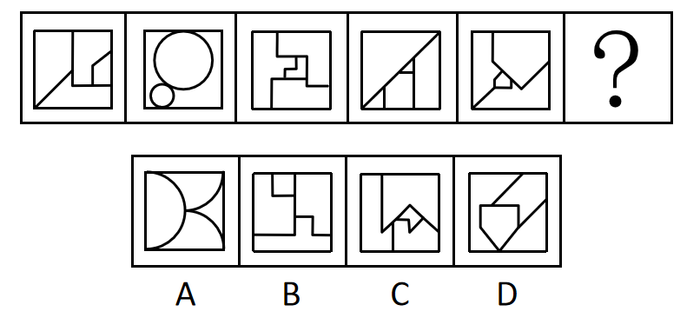

- **A**. A
- **B**. B
- **C**. C　✅
- **D**. D

**答案**：C

**官方解析**

图形元素组成不同，无明显属性规律，优先考虑数量规律。图形封闭面较多，优先考虑数面，但数面无规律。再观察发现题干图形存在明显最大面和最小面，且二者形状相同，按照此规律只有C项符合。
故正确答案为C。

---

## 第 2 题　qid 4637321 · 图形推理

从所给的四个选项中，选择最合适的一个填入问号处，使之呈现一定的规律性：

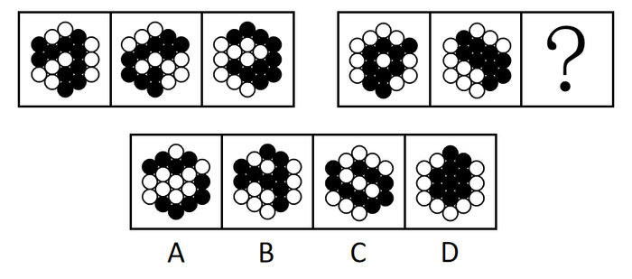

- **A**. A
- **B**. B
- **C**. C
- **D**. D　✅

**答案**：D

**官方解析**

图形元素组成相同，但无明显位置规律。观察发现，题干所有图形黑球全部相连，优先考虑部分数。第一组图形中黑球的部分数均是1，第二组图形中黑球的部分数也均是1，故？处应选择一个黑球的部分数为1的图形，排除A项。通过黑球的部分数无法得出唯一答案，再看白球的部分数，观察发现，第一组图形中白球的部分数依次为3、2、1，第二组图形中白球的部分数依次为3、2、？，故？处应选择一个白球的部分数为1的图形，只有D项符合。
故正确答案为D。

---

## 第 3 题　qid 4637579 · 图形推理

从所给的四个选项中，选择最合适的一个填入问号处，使之呈现一定的规律性：

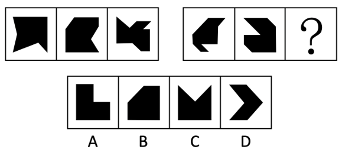

- **A**. A
- **B**. B　✅
- **C**. C
- **D**. D

**答案**：B

**官方解析**

元素组成不同，且无明显属性规律，考虑数量规律。题干所给的黑块图形出现多个明显的直角，优先考虑直角数。第一组图形中，黑块图形内部的直角个数依次为1、2、3。第二组图形运用规律，图1、图2黑块图形内部的直角个数分别为1、2，故“？”处应选择黑块图形内部直角个数为3的图形，只有B项符合。
故正确答案为B。

---

## 第 4 题　qid 4637577 · 图形推理

从所给的四个选项中，选择最合适的一个填入问号处，使之呈现一定的规律性：

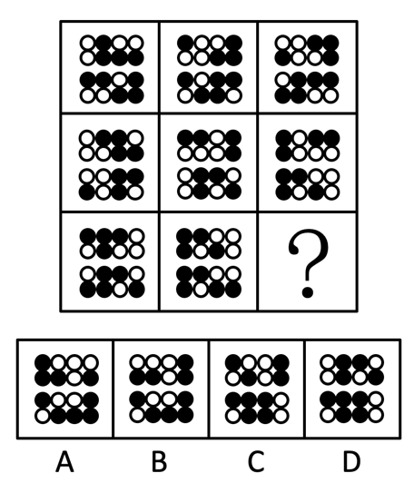

- **A**. A　✅
- **B**. B
- **C**. C
- **D**. D

**答案**：A

**官方解析**

题干每行图形均由相同的黑白球组成，元素组成相同，优先考虑位置规律。九宫格题目优先看横行。观察发现，在第一行图形中，上半部分的黑球每次逆时针平移一格，在前两行小球中转圈走，下半部分的黑球每次向左平移一格，在每一行小球中走到最左边后，再从最右边从头开始向左走（循环走）。观察可知，第二行图形同样符合此规律，同理第三行也应满足此规律。在第三行图形中，第三幅图应该在第二幅图的基础上，上半部分的黑球逆时针平移一格，下半部分的黑球向左平移一格（循环走），只有A项符合。
故正确答案为A。

---

## 第 5 题　qid 4639349 · 图形推理

左图是给定纸盒的外表面，下面哪项能由它折叠而成？

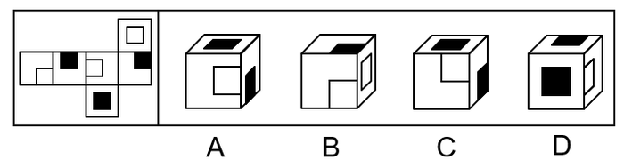

- **A**. A　✅
- **B**. B
- **C**. C
- **D**. D

**答案**：A

**官方解析**

将原展开图标上序号如下图，逐一进行分析。

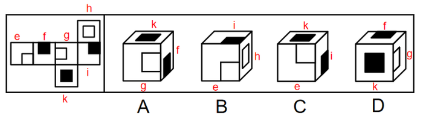

A项：选项出现了面g、面k和面f，选项与题干展开图一致，当选；

B项：选项出现了面e、面i和面h，面e和面h的公共边挨着面e中的小白块，而题干的面e和面h的公共边没有挨着面e中的小白块，选项与题干展开图不一致，排除；

C项：选项出现了面e、面k和面i，面e和面i的公共边挨着面e中的小白块，而题干的面e和面i的公共边没有挨着面e中的小白块，选项与题干展开图不一致，排除；

D项：选项出现了面k、面f和面g，面f和面g的公共边没有挨着面g中的小白块，而题干中面f和面g的公共边挨着面g中的小白块，选项与题干展开图不一致，排除。

故正确答案为A。

---

## 第 6 题　qid 4637564 · 图形推理

左图是给定的空心立体图形，将其从任一面剖开，右边哪项可能是该立体图形的截面？

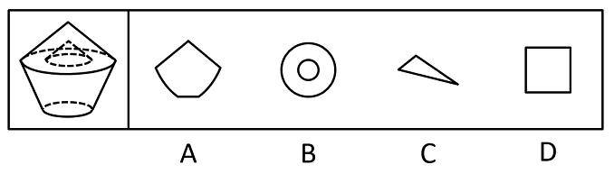

- **A**. A
- **B**. B　✅
- **C**. C
- **D**. D

**答案**：B

**官方解析**

本题考查截面图，逐一分析选项。

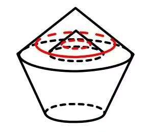

A项：无法切出，排除；

B项：从图形上半部分横着切，经过中间空心部分即可得到，当选；

C项：无法切出，排除；

D项：无法切出，排除。

故正确答案为B。

---

## 第 7 题　qid 4637338 · 图形推理

左图给定的是由相同正方体堆叠而成的多面体。该多面体可以由①、②和③三个多面体组合而成，以下哪项能填入问号处？

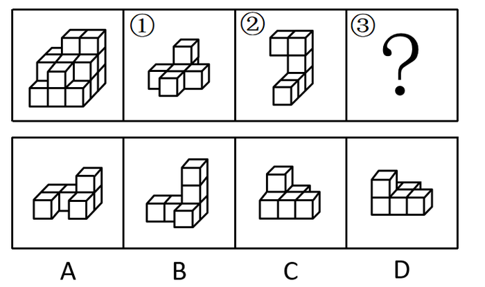

- **A**. A
- **B**. B
- **C**. C
- **D**. D　✅

**答案**：D

**官方解析**

本题考查立体拼合。

观察题干给出的多面体可知，图形可分为3层，由上至下第一层有2个小立方体，第二层有7个小立方体，第三层有9个小立方体。观察发现，图②共有3层，由上至下第一层有2个小立方体，第二层有1个小立方体，第三层有3个小立方体，可以拼合在多面体右侧，如下图所示，则题干多面体第二层还剩余6个小立方体，第三层还剩余6个小立方体。图①最下层的5个小立方体排列形状与题干多面体第二层剩余的形状相似，故图①最下层可以拼合在多面体第二层，最上层可以拼合在多面体第三层，如下图所示。根据凹凸一致的原则，剩余的形状只有D项符合。具体组合方式如下图所示：

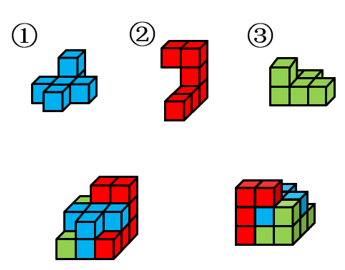

故正确答案为D。

---

## 第 8 题　qid 4637545 · 图形推理

把下面的六个图形分为两类，使每一类图形都有各自的共同特征或规律，分类正确的一项是：

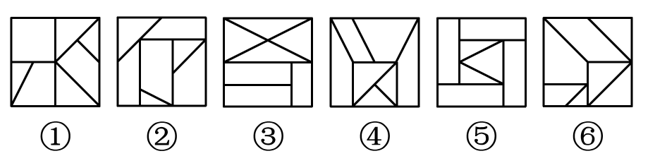

- **A**. ①②③，④⑤⑥
- **B**. ①④⑤，②③⑥
- **C**. ①②④，③⑤⑥
- **D**. ①③⑥，②④⑤　✅

**答案**：D

**官方解析**

本题为分组分类题目。元素组成不同，且无明显属性规律，考虑数量规律。观察发现，题干图形被分割明显，考虑面数量，但整体数面无法分组，所有图形的面数量均为7。再次观察发现，题干图形存在较多的三角形面，则考虑数三角形面的个数，图①③⑥均有4个三角形面，图②④⑤均有3个三角形面，故图①③⑥为一组，图②④⑤为一组。
故正确答案为D。

---

## 第 9 题　qid 4637310 · 图形推理

把下面的六个图形分为两类，使每一类图形都有各自的共同特征或规律，分类正确的一项是：

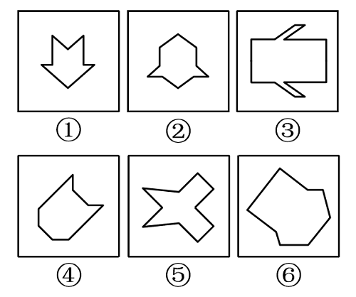

- **A**. ①②⑤，③④⑥　✅
- **B**. ①③④，②⑤⑥
- **C**. ①⑤⑥，②③④
- **D**. ①②④，③⑤⑥

**答案**：A

**官方解析**

本题为分组分类题目。元素组成不同，优先考虑属性规律。观察可知，题干图形比较规整，考虑对称性。图①②⑤一组，对称轴穿过图中的两个交点；图③④⑥一组，对称轴穿过图中的两条线，并且这两条线和对称轴垂直，对应A项。
故正确答案为A。

---

## 第 10 题　qid 4637320 · 图形推理

把下面的六个图形分为两类，使每一类图形都有各自的共同特征或规律，分类正确的一项是：

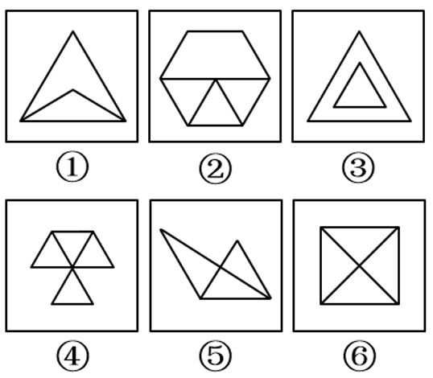

- **A**. ①②⑤，③④⑥
- **B**. ①②③，④⑤⑥
- **C**. ①③⑥，②④⑤
- **D**. ①④⑤，②③⑥　✅

**答案**：D

**官方解析**

本题为分组分类题目。元素组成不同，无明显属性规律，考虑数量规律。观察发现，图①和图⑥分别为“日”字、“田”字的变形图，考虑笔画数。图①④⑤为一笔画图形，图②③⑥为两笔画图形。即图①④⑤一组，图②③⑥一组。
故正确答案为D。

---

## 第 11 题　qid 4637371 · 定义判断

归因不变性原则是指人们会寻找某一特定结果与特定原因之间的不变联系，如果某种特定原因在许多情境下总是与某种结果相伴，人们就会把特定结果归结于那一原因。归因折扣原则是指人们不完全相信某一现象的形成确是由于某种原因所导致，即某一特定原因在产生特定结果中的作用，如果存在其他似是而非的原因，应该“打折扣”。
根据上述定义，两类归因原则均没有体现的是：

- **A**. 电视广告中明星推销洗发水时，观众觉得她的一头秀发不完全是因为洗发水才有的
- **B**. 创业失败总会使创业者背负债务，创业者小罗这几年债台高筑，朋友认为他一定是创业失败了
- **C**. 在代理了诸多离婚案件后，律师小林统计发现离婚诉讼中大多数争议与财产纠纷有关　✅
- **D**. 对一系列盗窃案的分析显示，现场都出现过同一个男人，人们容易假定该男人就是犯罪嫌疑人

**答案**：C

**官方解析**

第一步：找出定义关键词。
归因不变性原则：“某种特定原因在许多情境下总是与某种结果相伴”、“人们就会把特定结果归结于那一原因”；
归因折扣原则：“人们不完全相信某一现象的形成确是由于某种原因所导致”。
第二步：逐一分析选项。
A项：该项中观众觉得明星的秀发不完全是因为洗发水才有的，符合“人们不完全相信某一现象的形成确是由于某种原因所导致”，符合归因折扣原则定义，排除；
B项：该项中创业失败总会导致创业者背负债务，符合“某种特定原因在许多情境下总是与某种结果相伴”，朋友认为小罗这几年债台高筑的原因是创业失败，符合“人们就会把特定结果归结于那一原因”，符合归因不变性原则定义，排除；
C项：该项中律师小林发现离婚诉讼中大多数争议与财产纠纷有关，并没有体现人们是否将离婚诉讼这个结果归结于财产纠纷，不符合“某种特定原因在许多情境下总是与某种结果相伴”、“人们就会把特定结果归结于那一原因”，不符合归因不变性原则定义，同时该项也没有体现人们对于财产纠纷这个原因的质疑，不符合“人们不完全相信某一现象的形成确是由于某种原因所导致”，不符合归因折扣原则定义，当选；
D项：该项中盗窃案的现场都出现了同一个男人，符合“某种特定原因在许多情境下总是与某种结果相伴”，人们容易假定该男人就是盗窃案的犯罪嫌疑人，符合“人们就会把特定结果归结于那一原因”，符合归因不变性原则定义，排除。
本题为选非题，故正确答案为C。

---

## 第 12 题　qid 4637557 · 定义判断

按调查范围来看，可将调查分为全面调查和非全面调查。全面调查指的是一定范围内的情况普查；非全面调查是指从总体中抽取一部分对象进行情况调查，又可分为：根据随机原则选择样本的抽样调查和有意识选取若干样本进行的典型调查。
根据上述定义，下列说法正确的是：

- **A**. 对某市幼儿园所有儿童进行口腔卫生检查，这属于非全面调查
- **B**. 对省内1~3年级的全体学生进行体育活动时间的调查，这属于非全面调查
- **C**. 对全国招生规模较大的前30所医学院校进行学生就业情况调查，这属于典型调查　✅
- **D**. 对某市中考数学成绩最好的几所学校进行调查，总结相关经验，这属于抽样调查

**答案**：C

**官方解析**

第一步：找出定义关键词。
全面调查：“一定范围内的情况普查”；
非全面调查：“从总体中抽取一部分对象进行情况调查”；
抽样调查：“根据随机原则选择样本”；
典型调查：“有意识选取若干样本”。
第二步：逐一分析选项。
A项：对某市幼儿园所有儿童进行口腔卫生检查，符合“一定范围内的情况普查”，符合“全面调查”的定义，不符合“非全面调查”的定义，排除；
B项：对省内1~3年级的全体学生进行的调查，符合“一定范围内的情况普查”，符合“全面调查”的定义，不符合“非全面调查”的定义，排除；
C项：在医学院校里选取了规模较大的前30所院校进行调查，不是随机选择，是有意识地选取一部分进行调查，符合“有意识选取若干样本”，符合“典型调查”的定义，当选；
D项：对某市中考数学成绩最好的几所学校进行调查，不是随机选择，是有意识地选取一部分进行调查，符合“有意识选取若干样本”，符合“典型调查”的定义，不符合“抽样调查”的定义，排除。
故正确答案为C。

---

## 第 13 题　qid 4637546 · 定义判断

对于特定论域中的任意两个对象a、b而言，当对象a与对象b之间具有关系R时，对象b与对象a之间是否也具有关系R？基于此，对称性关系命题可分为正对称关系、反对称关系和半对称关系。（1）正对称关系：若对象a与b之间具有关系R，则对象b与a之间也具有关系R；（2）反对称关系：若对象a与b之间具有关系R，则对象b与a之间一定不具有关系R；（3）半对称关系：若对象a与b之间具有关系R，则对象b与a之间不一定具有关系R。
根据上述定义，下列关系属于半对称关系的是：

- **A**. 学生之间的同学关系
- **B**. 两个分数之间的小于关系
- **C**. 人与人之间的帮助关系　✅
- **D**. 城市与城市之间的相邻关系

**答案**：C

**官方解析**

第一步：找出定义关键词。
正对称关系：“若对象a与b之间具有关系R，则对象b与a之间也具有关系R”；
反对称关系：“若对象a与b之间具有关系R，则对象b与a之间一定不具有关系R”；
半对称关系：“若对象a与b之间具有关系R，则对象b与a之间不一定具有关系R”。
第二步：逐一分析选项。
A项：若学生a与学生b之间具有同学关系R，则学生b与学生a之间也具有同学关系R，符合“若对象a与b之间具有关系R，则对象b与a之间也具有关系R”，符合“正对称关系”定义，不符合“半对称关系”定义，排除；
B项：若分数a与分数b之间具有小于关系R，则分数b与分数a之间一定不具有小于关系R，而是具有大于关系，符合“若对象a与b之间具有关系R，则对象b与a之间一定不具有关系R”，符合“反对称关系”定义，不符合“半对称关系”定义，排除；
C项：若一个人a帮助了另一个人b（即a与b之间具有帮助关系R），不能确定b是否也帮助了a（即b与a之间不一定具有帮助关系R，可能有也可能没有），符合“若对象a与b之间具有关系R，则对象b与a之间不一定具有关系R”，符合“半对称关系”定义，当选；
D项：若城市a与城市b之间具有相邻关系R，则城市b与城市a之间也具有相邻关系R，符合“若对象a与b之间具有关系R，则对象b与a之间也具有关系R”，符合“正对称关系”定义，不符合“半对称关系”定义，排除。
故正确答案为C。

---

## 第 14 题　qid 4639313 · 定义判断

司法物理鉴定是运用物理学原理和方法，即通过检验确定物质的颜色、硬度、结构、比重、熔点、沸点、浓度、导电导热系数等物理属性，或显现肉眼看不见的痕迹特征，对与案件有关的痕迹、物品进行鉴认、识别的一种技术手段。
根据上述定义，下列仅使用了司法物理鉴定手段的是：

- **A**. 选用试剂对被害人胃内容物进行分离、提纯，明确其中毒类型
- **B**. 通过技术手段复原受害人被删除的手机信息，排查案件嫌疑人
- **C**. 使用天平称量案件中伪造文件的重量，并采用试剂染色法检验纸浆的种类
- **D**. 利用不同波长光对受害者衣物进行照射，通过观察颜色、透射率来辨别色料种类　✅

**答案**：D

**官方解析**

第一步：找出定义关键词。
“运用物理学原理和方法”、“检验确定物质的颜色、硬度、结构、比重、熔点、沸点、浓度、导电导热系数等物理属性”、“显现肉眼看不见的痕迹特征”、“与案件有关的痕迹、物品进行鉴认、识别”。
第二步：逐一分析选项。
A项：选用试剂对被害人胃内容物进行分离、提纯，是运用了化学分析的原理和方法，不符合“运用物理学原理和方法”、“检验确定物质的颜色、硬度、结构、比重、熔点、沸点、浓度、导电导热系数等物理属性”，不符合定义，排除；
B项：复原受害人被删除的手机信息，排查案件嫌疑人，是运用了技术手段进行分析，不符合“运用物理学原理和方法”、“检验确定物质的颜色、硬度、结构、比重、熔点、沸点、浓度、导电导热系数等物理属性”，不符合定义，排除；
C项：使用天平称量案件中伪造文件的重量，符合“运用物理学原理和方法”、“检验确定物质的颜色、硬度、结构、比重、熔点、沸点、浓度、导电导热系数等物理属性”，但采用试剂染色法检验纸浆的种类，试剂染色法主要利用化学试剂与被检物中某些物质发生显色、沉淀或结晶反应的现象来进行检验，不符合“运用物理学原理和方法”，不符合仅使用了司法物理鉴定手段，不符合定义，排除；
D项：利用不同波长光对衣物进行照射，观察颜色、透射率，光线照射衣物属于物理方法，符合“运用物理学原理和方法”、“检验确定物质的颜色”、“显现肉眼看不见的痕迹特征”，且检验的是受害者衣物，符合“与案件有关的痕迹、物品进行鉴认、识别”，符合定义，当选。
故正确答案为D。

---

## 第 15 题　qid 4637404 · 定义判断

由于人类建设活动的破坏和干扰，生物群体原来连续成片的生活环境被割裂，形成分散的岛状甚至碎片状的生境，生境廊道是指连接破碎化生境并适宜生物生活、移动或扩散的通道，便于实现物种基因、能量、物质的流动。
根据上述定义，下列不属于生境廊道的是：

- **A**. 国家公园内，两棵参天古树跨过公路上方枝叶相连，金丝猴借助古树跨越公路。不同区域的金丝猴群可以保持接触
- **B**. 为了让野生象群在两个自然保护区之间迁移，管理者设计建成了迁移通道，避开村寨，并保证该区域范围内有丰富的水和食物资源
- **C**. 某地将过去严重污染的河道改造为河滨公园，架设了多座拱桥，美化了环境，方便了交通，还吸引了大量鸟类来此栖息　✅
- **D**. 为避免青藏铁路隔断藏羚羊迁徙路线，动物学家设计了桥梁下方、隧道上方及路基缓坡3种形式的野生动物通路

**答案**：C

**官方解析**

第一步：找出定义关键词。
“连接破碎化生境”、“适宜生物生活、移动或扩散的通道”、“便于实现物种基因、能量、物质的流动”。
第二步：逐一分析选项。
A项：两棵参天古树跨过公路上方枝叶相连，符合“连接破碎化生境”，不同区域的金丝猴群可以通过相连的枝叶来保持接触，实现基因、能量、物质的流动，符合“适宜生物生活、移动或扩散的通道”、“便于实现物种基因、能量、物质的流动”，符合定义，排除；
B项：管理者在两个自然保护区之间建立迁移通道，符合“连接破碎化生境”，野生象群可以通过迁移通道实现基因、能量、物质的流动，符合“适宜生物生活、移动或扩散的通道”、“便于实现物种基因、能量、物质的流动”，符合定义，排除；
C项：某地将严重污染的河道改造为河滨公园，但河滨公园只是鸟类的栖息地，没有体现对于破碎化生境的连接，不符合“连接破碎化生境”、“适宜生物生活、移动或扩散的通道”，不符合定义，当选；
D项：动物学家设计野生动物通路来避免藏羚羊的迁移路线被阻隔，符合“连接破碎化生境”，多种形式的野生动物通路可以让藏羚羊之间实现基因、能量、物质的流动，符合“适宜生物生活、移动或扩散的通道”、“便于实现物种基因、能量、物质的流动”，符合定义，排除。
本题为选非题，故正确答案为C。

---

## 第 16 题　qid 4639319 · 定义判断

领主属宾句是汉语中的一种句式，句子主干由主语、动词和宾语三个部分组成。这种句子的主语和宾语之间具有比较稳定的“领有——隶属”关系：主语是“领有”的一方，宾语是“隶属”的一方；句子的动词和主语没有直接的语义关系。
根据上述定义，下列属于领主属宾句的是：

- **A**. 他的脸上长了一点肉
- **B**. 从远处走来一个挑夫
- **C**. 去年他烂了一车苹果　✅
- **D**. 他头顶上飞过一只鸟

**答案**：C

**官方解析**

第一步：找出定义关键词。
“句子主干由主语、动词和宾语三个部分组成”、“主语和宾语之间具有比较稳定的‘领有——隶属’关系：主语是‘领有’的一方，宾语是‘隶属’的一方”、“句子的动词和主语没有直接的语义关系”。
第二步：逐一分析选项。
A项：“他的脸上长了一点肉”中，主语是“他的脸上”，动词是“长”，宾语是“一点肉”，符合“句子主干由主语、动词和宾语三个部分组成”、“主语和宾语之间具有比较稳定的‘领有——隶属’关系：主语是‘领有’的一方，宾语是‘隶属’的一方”，但是主语“他的脸上”和动词“长”是有直接语义关系的，不符合“句子的动词和主语没有直接的语义关系”，不符合定义，排除；
B项：“从远处走来一个挑夫”中，只有宾语“挑夫”，没有主语，不符合“句子主干由主语、动词和宾语三个部分组成”，不符合定义，排除；
C项：“去年他烂了一车苹果”中，主语是“他”，动词是“烂”，宾语是“一车苹果”，符合“句子主干由主语、动词和宾语三个部分组成”、“主语和宾语之间具有比较稳定的‘领有——隶属’关系：主语是‘领有’的一方，宾语是‘隶属’的一方”。主语“他”和动词“烂”没有直接的语义关系，符合“句子的动词和主语没有直接的语义关系”，符合定义，当选；
D项：“他头顶上飞过一只鸟”是倒装句，即“一只鸟从他头顶飞过”，该句中主语是“一只鸟”，动词是“飞过”，没有宾语，不符合“句子主干由主语、动词和宾语三个部分组成”，不符合定义，排除。
故正确答案为C。

---

## 第 17 题　qid 4637575 · 定义判断

基因污染指原生物种基因库非预期或不受控制的基因流动，即外源基因通过转基因作物、外来入侵物种、家养动物等扩散到其他栽培作物或自然野生物种并成为后者基因的一部分。
根据上述定义，下列没有体现出基因污染的是：

- **A**. 某农场生产的大豆发现了转基因成分Bt基因，这些成分是附近地区种植的基因工程Bt大豆通过交叉授粉传播过来的
- **B**. 黑足猫是一种体型娇小但捕猎能力超强的野生猫，跑到野外的家猫和黑足猫交配后，生出血统不纯正的黑足猫，真正的黑足猫几近灭绝
- **C**. 转基因SL玉米获批做动物饲料，SL玉米只占某国玉米总产量的1%，但一年后该国22%的玉米样本被认定含有SL玉米基因
- **D**. 某国开发出耐除草剂的转基因油菜，油菜出油率提高，但这种油菜种子能在土壤中休眠数年，因此成为其他作物中的“杂草”　✅

**答案**：D

**官方解析**

第一步：找出定义关键词。
“外源基因通过转基因作物、外来入侵物种、家养动物等扩散到其他栽培作物或自然野生物种”、“成为后者基因的一部分”。
第二步：逐一分析选项。
A项：Bt基因通过基因工程种植的大豆扩散到了农场生产的大豆中，符合“外源基因通过转基因作物、外来入侵物种、家养动物等扩散到其他栽培作物或自然野生物种”、“成为后者基因的一部分”，符合定义，排除；
B项：家猫的基因扩散到了新生的黑足猫中，符合“外源基因通过转基因作物、外来入侵物种、家养动物等扩散到其他栽培作物或自然野生物种”、“成为后者基因的一部分”，符合定义，排除；
C项：SL玉米基因通过转基因SL玉米扩散到了该国的其他玉米中，符合“外源基因通过转基因作物、外来入侵物种、家养动物等扩散到其他栽培作物或自然野生物种”、“成为后者基因的一部分”，符合定义，排除；
D项：转基因油菜成为了其他作物中的“杂草”，没有体现通过基因扩散到了其他物种中，不符合“外源基因通过转基因作物、外来入侵物种、家养动物等扩散到其他栽培作物或自然野生物种”、“成为后者基因的一部分”，不符合定义，当选。
本题为选非题，故正确答案为D。

---

## 第 18 题　qid 4637367 · 定义判断

总量指标动态数列是将反映某种社会经济现象的一系列总量指标按时间先后顺序排列形成的数列，可分为两类：（1）时期数列：每个指标都表示社会经济现象在一定时期内发展过程的总量，各指标值可以相加，指标数值的大小与时期长短有直接关系；（2）时点数列：每个指标都表示社会经济现象在某一时点（时刻）上的数量，各指标值不能相加，指标数值大小和“时点间隔”长短没有直接关系，每个指标通常都是定期（间断）登记取得的。
根据上述定义，下列属于时点数列的是：

- **A**. 
2016~2020年某市税收情况

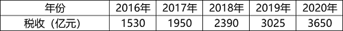

- **B**. 
2017~2020年某公司员工人数情况

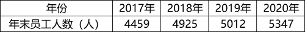
　✅
- **C**. 
2021年1~5月某地区城镇私营单位就业人员月均工资

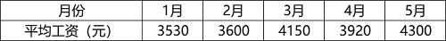

- **D**. 
2020年某地区各季度电动汽车生产产量

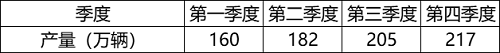

**答案**：B

**官方解析**

第一步：找出定义关键词。
总量指标动态数列：“将反映某种社会经济现象的一系列总量指标按时间先后顺序排列”；
时期数列：“每个指标都表示社会经济现象在一定时期内发展过程的总量”、“各指标值可以相加”、“指标数值的大小与时期长短有直接关系”；
时点数列：“每个指标都表示社会经济现象在某一时点（时刻）上的数量”、“各指标值不能相加”、“指标数值大小和‘时点间隔’长短没有直接关系，每个指标通常都是定期（间断）登记取得的”。
第二步：逐一分析选项。
A项：选项中每项指标表示的是每一年的税收情况，属于一定时期内的总量，符合“每个指标都表示社会经济现象在一定时期内发展过程的总量”，符合“时期数列”定义，不符合“时点数列”定义，排除；
B项：选项中每项指标表示的是每一年的年末员工人数，“年末”是个时点，符合“每个指标都表示社会经济现象在某一时点（时刻）上的数量”，指标是年末的人数，不能相加，符合“各指标值不能相加”，且和时间长短没有直接关系，统计每年的年末数据，说明其是间断取得的，符合“指标数值大小和‘时点间隔’长短没有直接关系，每个指标通常都是定期（间断）登记取得的”，符合“时点数列”定义，当选； 
C项：选项中每项指标表示的是每月的平均工资，是一整月的工资平均值，不是某一时点（时刻）上的数量，不符合“每个指标都表示社会经济现象在某一时点（时刻）上的数量”，不符合“时点数列”定义，排除；
D项：选项中每项指标表示的是每一季度的生产产量，属于一定时期内的总量，符合“每个指标都表示社会经济现象在一定时期内发展过程的总量”，符合“时期数列”定义，不符合“时点数列”定义，排除。
故正确答案为B。

---

## 第 19 题　qid 4637380 · 定义判断

在卫生经济学评价中，直接成本是指与疾病有关的预防、诊断、治疗和康复等所支出的费用，包括直接医疗成本和直接非医疗成本。直接医疗成本是指与医疗服务的提供直接相关的医疗成本，包括一切必要的医学检验和检查的成本，以及卫生服务管理成本和所有后续治疗成本。直接非医疗成本是指与医疗服务的提供直接相关的非医疗成本。
根据上述定义，下列没有体现上述成本的是：

- **A**. 患者李某前往医院看夜间急诊的出租车费
- **B**. 患者赵某因右臂受伤停工造成的工资损失　✅
- **C**. 在口腔科拔取智齿前，患者于某支付的血常规化验费
- **D**. 在陪同女儿去外地做手术期间，何某住宾馆支付的住宿费

**答案**：B

**官方解析**

第一步：找出定义关键词。
直接成本：“与疾病有关的预防、诊断、治疗和康复等所支出的费用”；
直接医疗成本：“与医疗服务的提供直接相关的医疗成本”、“包括一切必要的医学检验和检查的成本”、“卫生服务管理成本和所有后续治疗成本”；
直接非医疗成本：“与医疗服务的提供直接相关的非医疗成本”。
第二步：逐一分析选项。
A项：患者李某前往医院看夜间急诊的出租车费，是前往医疗机构治疗疾病所支付的非医疗费用，符合“与医疗服务的提供直接相关的非医疗成本”，符合“直接非医疗成本”的定义，排除；
B项：患者赵某因受伤停工造成的工资损失，不是为疾病所支出的费用，不符合“与疾病有关的预防、诊断、治疗和康复等所支出的费用”，不符合“直接成本”的定义，即也不符合“直接医疗成本”和“直接非医疗成本”的定义，当选；
C项：患者于某支付的血常规化验费，是为诊断疾病所支出的费用，符合“与医疗服务的提供直接相关的医疗成本”、“包括一切必要的医学检验和检查的成本”，符合“直接医疗成本”的定义，排除；
D项：何某陪同女儿做手术期间支付的住宿费，是为了治疗疾病所支付的非医疗费用，符合“与医疗服务的提供直接相关的非医疗成本”，符合“直接非医疗成本”的定义，排除。
本题为选非题，故正确答案为B。

---

## 第 20 题　qid 4637578 · 定义判断

地球物理勘探是通过研究和观测各种地球物理场的变化来探测地层岩性、地质构造等地质条件的过程。由于组成地壳的不同岩层介质往往在密度、弹性、导电性等方面存在差异，这些差异将引起相应的地球物理场的局部变化，通过测量这些物理场的分布和变化特征，结合已知地质资料进行分析研究，就可以达到推断地质性状的目的。
根据上述定义，下列不属于地球物理勘探的是：

- **A**. 根据岩石和矿石导电性、电磁感应特性等来记录地层界面的深度和形态
- **B**. 利用人工激发的地震波在弹性不同地层内的传播规律，了解水文地质的分布情况
- **C**. 采集岩石样品，分析岩石内的微量元素，通过发现与矿化有关的原生异常来寻找矿床　✅
- **D**. 通过观测不同岩石引起的重力差异，判断地下地层的岩性及状态，确定沉积盆地范围

**答案**：C

**官方解析**

第一步：找出定义关键词。
“研究和观测各种地球物理场的变化”、“探测地层岩性、地质构造等地质条件”、“密度、弹性、导电性”、“达到推断地质性状的目的”。
第二步：逐一分析选项。
A项：导电性、电磁感应特性都属于物理场的范畴，符合“研究和观测各种地球物理场的变化”、“密度、弹性、导电性”，记录地层界面的深度和形态，符合“探测地层岩性、地质构造等地质条件”、“达到推断地质性状的目的”，符合定义，排除；
B项：利用人工激发的地震波在弹性不同地层内的传播规律，符合“研究和观测各种地球物理场的变化”、“密度、弹性、导电性”，了解水文地质的分布情况，符合“探测地层岩性、地质构造等地质条件”、“达到推断地质性状的目的”，符合定义，排除；
C项：分析岩石内的微量元素，是在分析岩石的化学成分，不属于物理场的范畴，不符合关键词“研究和观测各种地球物理场的变化”，不符合定义，当选；
D项：重力差异属于物理场的范畴，符合“研究和观测各种地球物理场的变化”，判断地下地层的岩性及状态，确定沉积盆地范围，符合“探测地层岩性、地质构造等地质条件”、“达到推断地质性状的目的”，符合定义，排除。
本题为选非题，故正确答案为C。

---

## 第 21 题　qid 4639324 · 类比推理

珍珠：珍珠婚

- **A**. 蘑菇：蘑菇云
- **B**. 母亲：母亲河　✅
- **C**. 面包：面包树
- **D**. 槐花：槐花蜜

**答案**：B

**官方解析**

第一步：判断题干词语间逻辑关系。
珍珠婚是指像珍珠一样珍贵的婚姻关系，后者是根据前者的内在特性进行类比而命名的，二者是对应关系。
第二步：判断选项词语间逻辑关系。
A项：蘑菇云是指由于爆炸而产生的强大的爆炸云，是因为其形状类似于蘑菇而命名的，后者是根据前者的外在特性进行类比而命名的，与题干逻辑关系不一致，排除；
B项：母亲河是指像母亲一样哺育人民的河流，后者是根据前者的内在特性进行类比而命名的，二者是对应关系，与题干逻辑关系一致，当选；
C项：面包树是一种木本植物，果实淀粉含量非常丰富，是因为其果实风味类似面包而命名的，与题干逻辑关系不一致，排除；
D项：槐花蜜是蜜蜂采集洋槐花蜜酿造而成的蜂蜜，是根据其原材料而命名的，与题干逻辑关系不一致，排除。
故正确答案为B。

---

## 第 22 题　qid 4637399 · 类比推理

呼吸系统：生殖系统

- **A**. 生产计划：年度计划
- **B**. 观赏花卉：药用花卉
- **C**. 水面舰艇：巡洋舰艇
- **D**. 简牍公文：纸质公文　✅

**答案**：D

**官方解析**

第一步：判断题干词语间逻辑关系。
呼吸系统和生殖系统是两种不同的人体系统，二者是并列关系。
第二步：判断选项词语间逻辑关系。
A项：年度计划是对一年的工作、活动等所做的规划，不同的人、不同的工作的年度计划不同，生产计划是企业对生产任务作出的规划，有的生产计划是年度计划，有的生产计划不是年度计划，有的年度计划是生产计划，有的年度计划不是生产计划，二者是交叉关系，与题干逻辑关系不一致，排除；
B项：观赏花卉是具有观赏价值的花卉，药用花卉是能够防病、治病的花卉，有的观赏花卉是药用花卉，有的观赏花卉不是药用花卉，有的药用花卉是观赏花卉，有的药用花卉不是观赏花卉，二者是交叉关系，与题干逻辑关系不一致，排除；
C项：巡洋舰艇是一种在远洋活动的大型水面舰艇，与水面舰艇是种属关系，与题干逻辑关系不一致，排除；
D项：简牍公文是在竹简、木简、竹牍或木牍上书写的公文，与纸质公文是并列关系，与题干逻辑关系一致，当选。
故正确答案为D。

---

## 第 23 题　qid 4637376 · 类比推理

载歌：载舞

- **A**. 人云：亦云
- **B**. 且战：且退　✅
- **C**. 自作：自受
- **D**. 全心：全意

**答案**：B

**官方解析**

第一步：判断题干词语间逻辑关系。
“载歌”指一边唱歌，“载舞”是指一边跳舞，二者为并列关系，是两个同时进行的动作。
第二步：判断选项词语间逻辑关系。
A项：“人云”指人家说什么，“亦云”指自己也跟着说什么，两个动作存在时间先后顺序，与题干逻辑关系不一致，排除；
B项：“且战”指一边战斗，“且退”指一边向后移动，二者为并列关系，是两个同时进行的动作，与题干逻辑关系一致，当选；
C项：“自作”指自己做错了事，“自受”指自己承担不好的后果，二者存在时间先后顺序，与题干逻辑关系不一致，排除；
D项：“全心”和“全意”均是指用全部的精力，二者为近义关系，不是两个同时进行的动作，与题干逻辑关系不一致，排除。
故正确答案为B。

---

## 第 24 题　qid 4637551 · 类比推理

边防检查：走私

- **A**. 科普宣传：迷信　✅
- **B**. 农药喷洒：除害
- **C**. 个税申报：偷税
- **D**. 手术治疗：患病

**答案**：A

**官方解析**

第一步：判断题干词语间逻辑关系。
边防检查是为了防止走私，二者是对应关系，且“走私”是动词。
第二步：判断选项词语间逻辑关系。
A项：科普宣传是为了防止迷信，二者是对应关系，且“迷信”是动词，与题干逻辑关系一致，当选；
B项：农药喷洒是为了除害，而不是为了防止除害，与题干逻辑关系不一致，排除；
C项：个税申报是为了防止偷税，二者是对应关系，但“偷税”是动宾结构，与题干逻辑关系不一致，排除； 
D项：手术治疗是为了治病，而不是为了防止患病，与题干逻辑关系不一致，排除。
故正确答案为A。

---

## 第 25 题　qid 4637392 · 类比推理

独幕剧：歌剧：话剧

- **A**. 流行歌曲：通俗歌曲：现代歌曲
- **B**. 自由体操：竞技体操：艺术体操
- **C**. 远程面试：单独面试：小组面试　✅
- **D**. 顺序作业：流水作业：平行作业

**答案**：C

**官方解析**

第一步：判断题干词语间逻辑关系。
独幕剧指不分幕的小型戏剧，歌剧指综合诗歌、音乐、舞蹈等艺术而以歌唱为主的戏剧，话剧指用对话和动作来表演的戏剧。歌剧和话剧为并列关系，同时二者与独幕剧均构成交叉关系。
第二步：判断选项词语间逻辑关系。
A项：通俗歌曲又叫流行歌曲，二者为全同关系，与题干逻辑关系不一致，排除；
B项：自由体操是竞技体操的一种，二者为种属关系；体操主要包括竞技体操、艺术体操、蹦床等项目，竞技体操和艺术体操构成并列关系，与题干逻辑关系不一致，排除；
C项：远程面试是根据面试的距离远近进行分类的面试类型，单独面试和小组面试是根据面试的主体数量进行分类的面试类型，单独面试和小组面试为并列关系，二者与远程面试均构成交叉关系，与题干逻辑关系一致，当选；
D项：顺序作业、流水作业、平行作业均为施工组织的作业方式，三者为并列关系，与题干逻辑关系不一致，排除。
故正确答案为C。

---

## 第 26 题　qid 4637580 · 类比推理

剪发：烫发剂：烫发

- **A**. 催熟：防腐剂：防腐　✅
- **B**. 伐树：植树节：植树
- **C**. 风蚀：碳酸钙：溶蚀
- **D**. 镇痛：止痛药：止痛

**答案**：A

**官方解析**

第一步：判断题干词语间逻辑关系。
剪发和烫发是两种不同的美发方式，二者为并列关系；烫发剂的功能是烫发，二者为功能对应关系。
第二步：判断选项词语间逻辑关系。
A项：催熟和防腐是两种不同的技术，二者为并列关系；防腐剂的功能是防腐，二者为功能对应关系，与题干逻辑关系一致，当选；
B项：伐树和植树是两个不同的行为，二者为并列关系；在植树节植树，二者为节日和活动的对应关系，与题干逻辑关系不一致，排除；
C项：风蚀和溶蚀是两种不同的侵蚀作用，二者为并列关系；碳酸钙本身不具备溶蚀的功能，是因为碳酸盐岩等可溶岩的构成物是碳酸钙，碳酸钙能够与水中的碳酸发生反应，所以才会发生溶蚀，二者不是功能对应关系，与题干逻辑关系不一致，排除；
D项：镇痛指对急慢性疼痛等的治疗，有减少疼痛的意思，和止痛是近义关系，与题干逻辑关系不一致，排除。
故正确答案为A。

---

## 第 27 题　qid 4637403 · 类比推理

提起公诉：宣告判决：收押罪犯

- **A**. 撰写教案：课堂教学：解答疑问
- **B**. 手机点餐：外卖送餐：五星好评
- **C**. 违章行驶：交警处罚：行人受伤
- **D**. 方案设计：建筑施工：竣工验收　✅

**答案**：D

**官方解析**

第一步：判断题干词语间逻辑关系。
首先“提起公诉”，其次“宣告判决”，最后“收押罪犯”，三者为时间先后顺序的对应关系，且“提起公诉”的主体为检察院，“宣告判决”的主体为法院，“收押罪犯”的主体为监狱或看守所，三者主体不一致。
第二步：判断选项词语间逻辑关系。
A项：首先“撰写教案”，其次“课堂教学”，最后“解答疑问”，三者为时间先后顺序的对应关系，但三者的主体均为老师，与题干逻辑关系不一致，排除；
B项：首先“手机点餐”，其次“外卖送餐”，最后“五星好评”，三者为时间先后顺序的对应关系，但“手机点餐”和“五星好评”的主体均为顾客，与题干逻辑关系不一致，排除；
C项：首先“违章行驶”，其次“行人受伤”，最后“交警处罚”，三者为时间先后顺序的对应关系，但与题干顺序不一致，与题干逻辑关系不一致，排除；
D项：首先“方案设计”，其次“建筑施工”，最后“竣工验收”，三者为时间先后顺序的对应关系，且“方案设计”的主体为建筑设计研究院，“建筑施工”的主体为建设单位，“竣工验收”的主体为监理单位，三者主体不一致，与题干逻辑关系一致，当选。
故正确答案为D。

---

## 第 28 题　qid 4639334 · 类比推理

二线城市：港口城市：商业城市

- **A**. 海上战争：常规战争：空中战争
- **B**. 科技期刊：电子期刊：纸本期刊
- **C**. 自助旅游：国内旅游：探亲旅游　✅
- **D**. 街心公园：森林公园：湿地公园

**答案**：C

**官方解析**

第一步：判断题干词语间逻辑关系。
二线城市、港口城市和商业城市是从不同的划分角度去命名的，三者互为交叉关系。
第二步：判断选项词语间逻辑关系。
A项：海上战争和空中战争为并列关系，二者与常规战争均为交叉关系，与题干逻辑关系不一致，排除；
B项：电子期刊和纸本期刊为并列关系，二者与科技期刊均为交叉关系，与题干逻辑关系不一致，排除；
C项：自助旅游、国内旅游和探亲旅游是从不同的划分角度去命名的，三者互为交叉关系，与题干逻辑关系一致，当选；
D项：森林公园和湿地公园为并列关系，与题干逻辑关系不一致，排除。
故正确答案为C。

---

## 第 29 题　qid 4637384 · 类比推理

纪录片 对于 （    ） 相当于 （    ） 对于 客观题

- **A**. 电影；主观题
- **B**. 国产片；选择题
- **C**. 动画片；考试题
- **D**. 译制片；必答题　✅

**答案**：D

**官方解析**

逐一代入选项。
A项：有的纪录片是电影，有的纪录片不是电影，有的电影是纪录片，有的电影不是纪录片，二者为交叉关系。主观题是自由应答型试题，包括论述题、材料分析题等，客观题是固定应答型试题，包括判断题、选择题等，二者为矛盾关系，前后逻辑关系不一致，排除；
B项：有的纪录片是国产片，有的纪录片不是国产片，有的国产片是纪录片，有的国产片不是纪录片，二者为交叉关系。选择题是一种客观题，二者为种属关系，前后逻辑关系不一致，排除；
C项：纪录片是以真实生活为创作素材，以展现真实为本质的电影或电视艺术形式，动画片是在动画的基础上，由制作者赋予艺术内涵与思想内涵，所产生的艺术作品，二者为并列关系。有的考试题是客观题，有的考试题不是客观题，有的客观题是考试题，有的客观题不是考试题，二者为交叉关系，前后逻辑关系不一致，排除；
D项：译制片是指将原版影片的对白或解说翻译成另一种语言后，以该种语言配音混录或叠加字幕后的影片，有的纪录片是译制片，有的纪录片不是译制片，有的译制片是纪录片，有的译制片不是纪录片，二者为交叉关系。有的必答题是客观题，有的必答题不是客观题，有的客观题是必答题，有的客观题不是必答题，二者也为交叉关系，前后逻辑关系一致，当选。
故正确答案为D。

---

## 第 30 题　qid 4637382 · 类比推理

自然声源 对于 （    ） 相当于 （    ） 对于 煤炭

- **A**. 人工声源；植物遗骸
- **B**. 燕语莺声；矿石燃料　✅
- **C**. 传播介质；社区供暖
- **D**. 物体振动；地质危害

**答案**：B

**官方解析**

逐一代入选项。
A项：自然声源与人工声源二者是并列关系，煤炭是古代植物遗骸在地下经历了复杂的生物化学和物理化学变化逐渐形成的固体可燃性矿物，二者为原材料对应关系，前后逻辑关系不一致，排除；
B项：燕语莺声的意思是燕子的话语，黄鹂的歌声，燕语莺声是自然声源，二者为种属关系，煤炭是矿石燃料，二者为种属关系，前后逻辑关系一致，当选；
C项：自然声源需要在传播介质的条件下才能传播出声音，二者为必要条件对应关系，社区供暖需要煤炭来提供能量，二者为对应关系，但不是必要条件对应关系，前后逻辑关系不一致，排除；
D项：物体振动产生自然声源，二者为对应关系，煤炭与地质危害无明显逻辑关系，前后逻辑关系不一致，排除。
故正确答案为B。
备注：本题所给词语“自然声源”、“矿石燃料”与专有名词存在区别，如果按照专有名词的释义进行分析，则本题没有答案，所以解析时按照日常理解进行题干分析。

---

## 第 31 题　qid 4637555 · 逻辑判断

最近，主打白噪音的助眠产品引起很多人的兴趣。有人认为，白噪音可以掩盖环境中干扰性的刺激，有助于促进睡眠、改善睡眠质量。但研究者对此持怀疑态度，认为白噪音可改善睡眠的研究证据不足，持续白噪音甚至会对睡眠造成影响。
以下哪项如果为真，不能支持研究者的观点？

- **A**. 持续暴露在白噪音下，听觉系统会不断将声音信号转换成神经信号，上传大脑，大脑会持续保持活跃，无法充分休息
- **B**. 持续的白噪音会引起听力的损害，甚至会导致认知功能障碍，严重者还会导致失眠或嗜睡
- **C**. 白噪音会使健康志愿者睡眠期间脑电波的循环交替模式显著改变，这意味着健康人睡眠结构受到干扰
- **D**. 白噪音掩盖环境中干扰性的刺激，也会掩盖环境中有意义的声音，可能对人的生活甚至对生命造成威胁　✅

**答案**：D

**官方解析**

第一步：找出论点和论据。
论点：白噪音可改善睡眠的研究证据不足，持续白噪音甚至会对睡眠造成影响。
论据：无。
题干只有论点无论据，因是加强选非题，找到说明白噪音不可改善睡眠、持续白噪音会对睡眠造成影响的三个选项排除即可。
第二步：逐一分析选项。
A项：持续白噪音通过不断的神经信号让大脑持续保持活跃，无法休息，即从原理说明持续白噪音会对睡眠造成影响，解释原因，可以加强，排除；
B项：持续白噪音可以导致部分人失眠或嗜睡，举例说明持续白噪音会对睡眠造成影响，可以加强，排除；
C项：白噪音可通过改变脑电波使健康人睡眠结构受到干扰，即从原理说明持续白噪音会对睡眠造成影响，解释原因，可以加强，排除；
D项：白噪音会掩盖住有意义的声音或对生命造成威胁，但论点讨论的是白噪音和睡眠之间的关系，话题不一致，无关选项，无法加强，当选。
本题为选非题，故正确答案为D。

---

## 第 32 题　qid 4639340 · 逻辑判断

聚苯乙烯泡沫塑料广泛用于制造一次性咖啡杯等用品，但其原料来自石油等不可再生能源，生成的聚苯乙烯高温条件下可能产生对人体有害组分，且无法自然降解，燃烧时还会造成环境污染。研究人员开发出一种源自特定植物的环保材料，这种环保材料质量较轻，可支撑自身重量200倍的物体而不变形，还可自然降解，燃烧不会产生污染性烟尘。研究人员认为，这种环保材料有望成为制造一次性咖啡杯等用品的重要材料。
以下哪项如果为真，最能削弱上述结论？

- **A**. 这种环保材料不具有一次性咖啡杯所需的良好隔热性能，盛装液体后也很难具有聚苯乙烯泡沫塑料的耐久性　✅
- **B**. 这种环保材料大规模投入生产后，会挤垮生产聚苯乙烯泡沫塑料的厂家，减少市场上一次性咖啡杯等用品的供应量
- **C**. 对该植物有过敏反应的人群使用这种环保材料会产生过敏反应，该环保材料不适用于这类过敏人群
- **D**. 这种环保材料还不能完全替代聚苯乙烯泡沫材料，还有很多用品仍然需要使用聚苯乙烯泡沫材料生产

**答案**：A

**官方解析**

第一步：找出论点和论据。
论点：这种环保材料有望成为制造一次性咖啡杯等用品的重要材料。
论据：聚苯乙烯泡沫塑料广泛用于制造一次性咖啡杯等用品，但其原料来自石油等不可再生能源，生成的聚苯乙烯高温条件下可能产生对人体有害组分，且无法自然降解，燃烧时还会造成环境污染。研究人员开发出一种源自特定植物的环保材料，这种环保材料质量较轻，可支撑自身重量200倍的物体而不变形，还可自然降解，燃烧不会产生污染性烟尘。
本题论据讨论的是研发出的特定环保材料比聚苯乙烯泡沫塑料更环保、更安全，论点讨论的是这种环保材料有望成为制造一次性咖啡杯等用品的重要材料，本质都是在说研发出的特定环保材料比聚苯乙烯泡沫塑料更好，更适合制造一次性咖啡杯等用品，论点论据话题一致，削弱优先考虑否定论点。
第二步：逐一分析选项。
A项：该项说这种环保材料不具有一次性咖啡杯所需的良好隔热性能且耐久性不如聚苯乙烯泡沫塑料，说明即使这种环保材料更环保，但也不能成为制造一次性咖啡杯等用品的重要材料，直接否定论点，可以削弱，保留；
B项：该项说的是这种环保材料大规模生产后，一次性咖啡杯等用品的供应量会减少，而论点说的是这种环保材料是否能够成为制造一次性咖啡杯等用品的重要材料，话题不一致，无法削弱，排除；
C项：该项说过敏人群无法使用这种环保材料，说明这种材料在适用范围上有缺陷，可能无法成为制造一次性咖啡杯等用品的重要材料，举例削弱论点，可以削弱，保留；
D项：该项讨论的是这种环保材料是否能够完全替代聚苯乙烯泡沫材料，而论点说的是这种环保材料是否能成为制造一次性咖啡杯等用品的重要材料，成为重要材料不代表要完全替代聚苯乙烯泡沫材料，话题不一致，无法削弱，排除。
比较A、C两项，A项直接否定论点的削弱力度强于C项举例削弱论点，A项当选。
故正确答案为A。

---

## 第 33 题　qid 4639345 · 逻辑判断

一颗恒星足够大且经过超新星爆发，才会坍缩为一颗中子星并伴随磁场增强。在这些中子星中，只有拥有强大磁场和高自转速度才能成为磁星。一般认为，磁星的磁场是在恒星变成中子星的首十秒透过炽热内核物质的对流所产生的，只有在对流现象发生期间拥有高自转速度（周期约10毫秒左右），产生的电流才会传遍整颗天体。
由此可以推出：

- **A**. 能演变成磁星的星体一定是中子星
- **B**. 拥有高自转速度的中子星会产生强大磁场
- **C**. 如果不经历超新星爆发，大质量恒星是不会成为中子星的　✅
- **D**. 只要中子星的内核物质产生强烈对流，就会在整个星体内出现电流

**答案**：C

**官方解析**

第一步：翻译题干。

（1）坍缩为一颗中子星足够大 且 经过超新星爆发；

（2）成为磁星的中子星中子星拥有强大磁场 且 高自转速度；

（3）产生的电流传遍整颗天体在对流现象发生期间 且 拥有高自转速度。

第二步：逐一分析选项。

A项：选项翻译为“变成磁星中子星”，二者不存在逻辑关系，无法推出，排除；

B项：选项指出拥有高自转速度的中子星会产生强大磁场，根据（2）可知，中子星拥有强大磁场和高自转速度为且关系的两项，二者不存在逻辑关系，无法推出，排除；

C项：选项翻译为“经历超新星爆发成为中子星”，是对（1）且关系其中一项的否定，且关系其中一项为假，整个关系为假，因此是对（1）的否后，否后必否前，可以推出，当选；

D项：选项翻译为“中子星的内核物质产生强烈对流在整个星体内出现电流”，“强烈对流”肯定了（3）后面“且关系”中的一项，另一项无法判断，无法推出星体内是否有电流，排除。

故正确答案为C。

---

## 第 34 题　qid 4639321 · 逻辑判断

小陈、小李、小刘3人从学校脱颖而出，到市里参加竞赛。5人预测：
小陈、小李都获奖；
小陈、小李至多有1人获奖；
小陈获奖，小李未获奖；
小陈未获奖，小李获奖；
若小陈获奖，则小刘也获奖。
结果发现，只有1人预测正确。
由此可以推出：

- **A**. 小陈、小李都未获奖
- **B**. 小陈、小刘都获奖
- **C**. 小李、小刘都未获奖
- **D**. 小陈、小李都获奖　✅

**答案**：D

**官方解析**

第一步：找出题干矛盾命题。

（1）小陈 且 小李；

（2）小陈 或 小李；

（3）小陈 且 小李；

（4）小陈 且 小李；

（5）小陈小刘。

分析题干条件，（1）与（2）为矛盾关系，必有一真一假。

第二步：根据题干条件进行推理。

根据题干条件可知，只有一人预测正确，故（3）（4）（5）均为假话；根据（5）为假话可知，其矛盾命题“小陈 且 小刘”为真，即小陈获奖、小刘未获奖，排除A、B两项；根据（3）为假话可知，其矛盾命题“小陈 或 小李”为真，已知小陈获奖，否定了或关系的其中一项，则另一项一定为真，可知小李一定获奖；最终可推出小陈、小李获奖，小刘未获奖，只有D项符合。

故正确答案为D。

---

## 第 35 题　qid 4637420 · 逻辑判断

不同的读者在阅读时，会对文章进行不同的加工编码，一种是浏览，从文章中收集观点和信息，使知识作为独立的单元输入大脑，称为线性策略；一种是做笔记，在阅读时会构建一个层次清晰的架构，就像用信息积木搭建了一个“金字塔”，称为结构策略。做笔记能够对文章的主要内容进行标注，因此与单纯的浏览相比，做笔记能够取得更优的阅读效果。
要使上述论证成立，还需基于以下哪一前提？

- **A**. 阅读效果的好坏取决于能否在阅读时抓住要点　✅
- **B**. 用浏览的方式进行阅读属于知识加工的线性策略
- **C**. 做笔记涉及到了更加复杂的认知加工过程
- **D**. 与线性策略相比，结构策略能够让学习提升速度

**答案**：A

**官方解析**

第一步：找出论点和论据。
论点：与单纯的浏览相比，做笔记能够取得更优的阅读效果。
论据：做笔记能够对文章的主要内容进行标注。
本题提问为“基于以下哪一前提”，优先考虑搭桥和必要条件。论点讨论的是做笔记能够取得更优的阅读效果，而论据讨论的是做笔记是在标注文章的主要内容，二者话题不一致，优先考虑搭桥，即建立“标注文章主要内容”和“阅读效果”的联系。
第二步：逐一分析选项。
A项：该项说阅读效果的好坏取决于能否在阅读时抓住要点，将“标注文章主要内容（抓住要点）”和“阅读效果”建立了联系，属于搭桥项，可以加强，当选；
B项：该项说的是浏览阅读属于知识加工的线性策略，而论点讨论的是笔记阅读的效果，话题不一致，无法加强，排除；
C项：该项说做笔记涉及到了更加复杂的认知加工过程，但通过这个复杂的认知加工过程能否取得更优的阅读效果并不明确，属于不明确项，无法加强，排除；
D项：该项说结构策略比线性策略更能提升学习速度，强调的是两种阅读方式在提升学习速度方面的差异，而论点讨论的是阅读效果，话题不一致，无法加强，排除。
故正确答案为A。

---

## 第 36 题　qid 4639338 · 逻辑判断

地理老师在五个柜子里放入了五种矿物，每个柜子只放一种矿物：赤铁矿、黑云母、绿泥石、黄铜矿、方铅矿。已知：（1）如果一号柜放赤铁矿，那么二号柜不放黑云母；（2）或者三号柜放赤铁矿，或者一号柜放赤铁矿；（3）如果二号柜不放黑云母，那么四号柜不放绿泥石；（4）若五号柜放方铅矿，则四号柜放绿泥石。
以下哪项如果为真，可以得出“三号柜放赤铁矿”的结论？

- **A**. 二号柜不放黑云母
- **B**. 一号柜不放黄铜矿
- **C**. 五号柜放的是方铅矿　✅
- **D**. 四号柜不放绿泥石

**答案**：C

**官方解析**

第一步：翻译题干。

（1）一号柜放赤铁矿二号柜不放黑云母；

（2）三号柜放赤铁矿 或 一号柜放赤铁矿；

（3）二号柜不放黑云母四号柜不放绿泥石；

（4）五号柜放方铅矿四号柜放绿泥石。

第二步：逐一分析选项。

提问为“得出‘三号柜放赤铁矿’”，本题给出了结论，需要从结论出发倒推条件。

根据条件（2）可知：想要推出“三号柜放赤铁矿”，需要一号柜不放赤铁矿；

根据条件（1）可知：想要得到“一号柜不放赤铁矿”，需要二号柜放黑云母；

根据条件（3）可知：想要得到“二号柜放黑云母”，需要四号柜放绿泥石；

根据条件（4）可知：想要得到“四号柜放绿泥石”，需要五号柜放方铅矿。

故正确答案为C。

---

## 第 37 题　qid 4637581 · 逻辑判断

熊蜂是一类多食性昆虫，与蜜蜂相比，熊蜂体型更大且多毛，颜色各异，大多有着经典的黄黑条纹，黑身红尾。人们发现，由于密集管理型农业系统的推广，熊蜂在这些地方开始衰落，有的种类已经灭绝，相对而言，普通蜜蜂的数量并没有明显减少。因此，相比普通蜜蜂，农田利用方式的改变对熊蜂的生存威胁更大。
以下哪项如果为真，最能支持上述结论？

- **A**. 蜜蜂采食会派出“侦查员”，回来后通过一种“摆动舞”告知蜂群食源在哪里，而熊蜂不会跳舞，因此大多独自采食
- **B**. 蜜蜂会在蜂巢内储藏大量食物，熊蜂的蜂巢储存食物量较少，一旦出现食物短缺，熊蜂就会处于劣势
- **C**. 蜜蜂属于大型化社群，而熊蜂属于小型化社群，这会导致基因分异度降低，更易受到寄生虫感染而大量死亡
- **D**. 密集型农田往往种植单一植物，如果植物不是处于花期，熊蜂就会因无法如蜜蜂般进行远距离飞行而岌岌可危　✅

**答案**：D

**官方解析**

第一步：找出论点和论据。
论点：相比普通蜜蜂，农田利用方式的改变对熊蜂的生存威胁更大。
论据：由于密集管理型农业系统的推广，熊蜂在这些地方开始衰落，有的种类已经灭绝，相对而言，普通蜜蜂的数量并没有明显减少。
论点和论据都在讨论熊蜂生存情况和农田利用方式的关系，话题一致，加强优先考虑补充论据。
第二步：逐一分析选项。
A项：该项讨论蜜蜂和熊蜂的采食方式，与题干论点讨论的话题无关，无法加强，排除；
B项：该项讨论蜜蜂和熊蜂储存食物的习惯不同，出现食物短缺时熊蜂更容易受到影响，但农田利用方式的改变是否会出现食物短缺情况文段并未提及，与题干论点讨论的话题无关，无法加强，排除；
C项：该项讨论熊蜂因基因分异度降低更易受到寄生虫感染，但农田利用方式的改变是否会有寄生虫感染的风险文段并未提及，与题干论点讨论的话题无关，无法加强，排除；
D项：该项指出密集型农田对熊蜂影响更大，熊蜂无法远距离飞行而岌岌可危，解释农田利用方式的改变为什么更能威胁熊蜂的生存，解释原因，可以加强，当选。
故正确答案为D。

---

## 第 38 题　qid 4637419 · 逻辑判断

在我国北方的春天，树木花粉是一种主要的过敏原，它们通过空气传播，不可避免地被吸入体内，使过敏体质人群产生或轻或重的炎症反应。与此同时，作为树木种子的杨柳飞絮同样使过敏人群感到不适。有研究人员认为，杨柳飞絮虽然会使呼吸道产生不适，但它不是过敏原，许多声称杨柳飞絮过敏的人实际上是花粉过敏。
以下哪项如果为真，不能支持研究人员的论证？

- **A**. 杨柳飞絮容易进入人的呼吸道，并粘附其上产生刺激作用，出现类似过敏的症状
- **B**. 杨柳飞絮漫天飞舞之时，正值很多种树开花之际，二者在时间上存在着重叠
- **C**. 杨柳飞絮含有油质和多糖类物质，作用在皮肤上可通过一系列反应变成一种过敏原　✅
- **D**. 由于被杨柳飞絮包裹携带，风媒花粉更容易进入呼吸道引起过敏反应

**答案**：C

**官方解析**

第一步：找出论点和论据。
论点：杨柳飞絮虽然会使呼吸道产生不适，但它不是过敏原，许多声称杨柳飞絮过敏的人实际上是花粉过敏。
论据：无。
本题只有论点，没有论据，因为是加强选非题，找到可证明杨柳飞絮不是过敏原或者花粉才是过敏原的三个选项排除即可。
第二步：逐一分析选项。
A项：杨柳飞絮让人出现类似过敏的症状，说明杨柳飞絮没有产生过敏反应，不是过敏原，补充论据，可以加强，排除；
B项：杨柳飞絮和树开花产生的花粉在时间上存在着重叠，说明引起人过敏的可能不是杨柳飞絮而是花粉，补充论据，可以加强，排除；
C项：杨柳飞絮可通过一系列反应变成一种过敏原，可以致敏，削弱论点，无法加强，当选； 
D项：花粉被杨柳飞絮包裹携带更容易引起过敏反应，说明引起人过敏的可能不是杨柳飞絮而是花粉，补充论据，可以加强，排除。
本题为选非题，故正确答案为C。

---

## 第 39 题　qid 4637402 · 逻辑判断

由于集合了榨汁机、豆浆机、料理机、研磨机等产品功能，破壁机近年来一直备受消费者青睐。某公司生产了R型和W型两款功能相同的破壁机，相比而言R型清洗更方便，W型噪音更小。上市三年后的数据显示，R型销量更好，所以公司认为消费者更喜欢易于清洗的破壁机产品。
以下哪项如果为真，最能削弱上述观点？

- **A**. 相比W型产品，R型网上促销力度更大，价格更具优势　✅
- **B**. W型产品的外观设计更美观，许多白领上班族都更倾向于买W型
- **C**. 和其他生产破壁机产品的公司相比，该公司具有更高的市场占有率
- **D**. R型和W型产品在全国的销售渠道一致，主要投放在超市、购物中心

**答案**：A

**官方解析**

第一步：找出论点和论据。
论点：消费者更喜欢易于清洗的破壁机产品。
论据：R型清洗更方便，W型噪音更小，上市三年后的数据显示，R型销量更好。
第二步：逐一分析选项。
A项：R型除了清洗更方便，价格也更具有优势，即消费者不一定是因为R型更易清洗而购买，也可能是因为价格便宜，可以削弱，当选；
B项：该项只是说明许多白领上班族倾向于买W型，但无法得知其他类型的消费者倾向于买哪种类型，不明确选项，不能削弱，排除；
C项：该项说的是该公司市场占有率更高，并未提及消费者是否更喜欢易于清洗的破壁机产品，与论点话题不一致，不能削弱，排除；
D项：该项说的是两款破壁机的销售渠道一致，并未提及消费者是否更喜欢易于清洗的破壁机产品，与论点话题不一致，不能削弱，排除。
故正确答案为A。

---

## 第 40 题　qid 4639350 · 逻辑判断

为满足乘客用餐多样化的需要，某地区推出了旅客列车的互联网订餐服务。该服务上线一年以来，通过线上渠道（官网、订票APP等）进行了大量的宣传，但订单量除了刚推出的前三个月有小幅增长外，其他月份并未增长，甚至下降。由此可见，该地区出行的旅客对列车提供的网上订餐服务需求量不高。
以下能够削弱上述结论的有几项？
①接受旅客列车网络订餐的餐厅数量较少，食物品种相对单一
②即使推出了互联网订餐，大部分乘客还是愿意去空间较大的餐车用餐
③该地区的短程列车数量较多，相比短程列车，长程列车的网上订餐量更大
④线上宣传缺少对用户的精准定位，许多订票用户并未注意到列车有网上订餐服务

- **A**. 1项
- **B**. 2项　✅
- **C**. 3项
- **D**. 4项

**答案**：B

**官方解析**

第一步：找出论点和论据。
论点：该地区出行的旅客对列车提供的网上订餐服务需求量不高。
论据：该服务上线一年以来，通过线上渠道（官网、订票APP等）进行了大量的宣传，但订单量除了刚推出的前三个月有小幅增长外，其他月份并未增长，甚至下降。
本题论据阐述了互联网订餐服务订单量的变化，论点是基于此得出的旅客对列车提供的网上订餐服务需求量不高，论点和论据话题一致，削弱优先考虑削弱论点。
第二步：逐一分析。
①项：指出订单量少的原因可能是餐厅数量少和食物品种单一，而非需求量小，是对论点的间接否定，可以削弱；
②项：大部分乘客还是愿意去餐车用餐，说愿意去哪吃饭和是否在网上订餐不是一回事儿，无关选项（如果理解成愿意去餐车吃饭说明确实网上订餐量小的话，那是个加强项，总之不能削弱）；
③项：相比短程列车，长程列车的网上订餐量更大，说明短程列车的订餐量相对不大，而该地区又是短程列车较多，说明该地区的订餐量确实可能不高，顺着题干在说，不能削弱；
④项：指出订单量少的原因可能是许多用户并未注意到网上订餐服务，而非需求量小，是对论点的间接否定，可以削弱。
综上所述，能够削弱结论的有①、④共2项。
故正确答案为B。

---
