# 2022年国家公务员录用考试《行测》题（地市级网友回忆版）

> 判断推理 · 40 题 · 国考 2022

## 材料 1

某超市从前到后整齐排列着7排货架，放置着文具、零食、调料、日用品、酒、粮油和饮料7类商品，每类商品占据一排。已知：

（1）酒类排在调料类之前；

（2）文具类和调料类中间隔着3排；

（3）粮油类在零食类之后，中间隔着2排；

（4）日用品类紧挨在文具类前一排或者后一排。

### 第 1 题　qid 4637304 · 类比推理

下列各项中，哪一类商品不可能排在第一排？

- **A**. 文具类
- **B**. 粮油类　✅
- **C**. 酒类
- **D**. 日用品类

**答案**：B

**官方解析**

第一步：分析题干条件。
（1）酒类排在调料类之前；
（2）文具类和调料类中间隔着3排；
（3）粮油类在零食类之后，中间隔着2排；
（4）日用品类紧挨在文具类前一排或者后一排。
第二步：根据题干条件进行推理。
根据条件（3）可知，粮油类排在零食类之后，中间隔着2排，故粮油类不可能排在第一排。
本题为选非题，故正确答案为B。

---

### 第 2 题　qid 4637319 · 逻辑判断

按照从前到后，下列哪项排列是可能的？

- **A**. 文具类、零食类、日用品类、酒类、调料类、粮油类、饮料类
- **B**. 零食类、文具类、日用品类、粮油类、饮料类、调料类、酒类
- **C**. 日用品类、文具类、零食类、酒类、粮油类、调料类、饮料类
- **D**. 日用品类、文具类、酒类、零食类、饮料类、调料类、粮油类　✅

**答案**：D

**官方解析**

第一步：分析题干条件。
（1）酒类排在调料类之前；
（2）文具类和调料类中间隔着3排；
（3）粮油类在零食类之后，中间隔着2排；
（4）日用品类紧挨在文具类前一排或者后一排。
第二步：根据题干条件进行推理。
本题题干信息确定，选项信息充分，优先考虑排除法。
根据条件（1）“酒类排在调料类之前”，排除B项。
根据条件（3）“粮油类在零食类之后，中间隔着2排”，排除A、C两项。
故正确答案为D。

---

### 第 3 题　qid 4637333 · 类比推理

零食类和文具类中间最多可能隔几排？

- **A**. 2排
- **B**. 3排
- **C**. 4排
- **D**. 5排　✅

**答案**：D

**官方解析**

第一步：分析题干条件。

（1）酒类排在调料类之前；

（2）文具类和调料类中间隔着3排；

（3）粮油类在零食类之后，中间隔着2排；

（4）日用品类紧挨在文具类前一排或者后一排。

第二步：根据题干分析选项。

题干设问是“最多可能隔几排”，应以最远的距离摆放零食类和文具类，可以从涉及零食类和文具类的条件开始推理。

根据条件（3）可知，零食类在粮油类之前，且中间隔着2排，即零食类肯定不可能在第5排之后，但零食类可能在第1排，故此时可以假设二者相隔最远的情况，即文具类在第7排，零食类在第1排，验证是否符合题干条件。当文具类在第7排，零食类在第1排时，根据条件（2）、条件（3）和条件（4）可得调料类在第3排、粮油类在第4排、日用品类在第6排，再结合条件（1）可得酒类在第2排，则饮料类在第5排。此时满足题干所有条件，可能为真，故零食类和文具类最多可能隔5排。

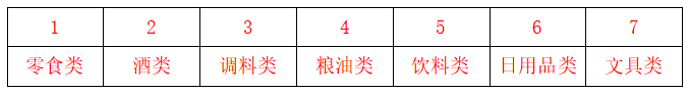

故正确答案为D。

---

### 第 4 题　qid 4637344 · 类比推理

如果零食类排在第1排，那么下列哪项中的两类商品不可能是相邻的两排？

- **A**. 文具类和粮油类
- **B**. 零食类和文具类
- **C**. 日用品类和酒类　✅
- **D**. 零食类和日用品类

**答案**：C

**官方解析**

第一步：分析题干条件。

（1）酒类排在调料类之前；

（2）文具类和调料类中间隔着3排；

（3）粮油类在零食类之后，中间隔着2排；

（4）日用品类紧挨在文具类前一排或者后一排。

第二步：根据题干条件进行推理。

若零食类排在第1排，根据条件（3）可知，粮油类在第4排，如下表：

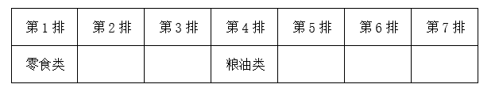

提问为“不可能”，所以考虑代入法。

代入A项，若文具类和粮油类相邻，根据条件（2）可知，文具类在第3排，调料类在第7排；根据条件（4）可知，日用品类在第2排；根据条件（1）可知，酒类在第5排或第6排，题干条件均满足，可能为真，排除；

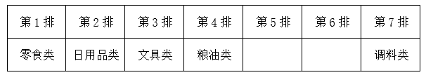

代入B项，若零食类和文具类相邻，则文具类在第2排；根据条件（2）可知，调料类在第6排；根据条件（4）可知，日用品类在第3排；根据条件（1）可知，酒类在第5排；则饮料类在第7排，题干条件均满足，可能为真，排除；

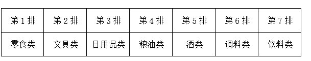

代入C项，若日用品类和酒类相邻，根据条件（4）可知，日用品类、酒类和文具类相邻，则此三类只能占据第5、6、7排的位置，而调料类和饮料类只能在第2排或第3排，与条件（1）矛盾，不可能为真，当选；

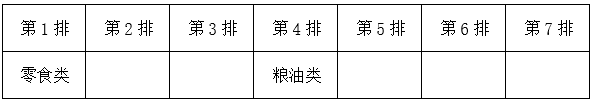

代入D项，若零食类和日用品类相邻，则日用品类在第2排；根据条件（4）可知，文具类在第3排；根据条件（2）可知，调料类在第7排；根据条件（1）可知，酒类在第5排或第6排，题干条件均满足，可能为真，排除。

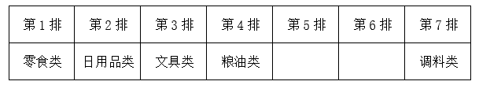

本题为选非题，故正确答案为C。

---

### 第 5 题　qid 4637352 · 逻辑判断

如果饮料类排在第1排，则以下哪项是可能的？

- **A**. 零食类排在文具类前一排　✅
- **B**. 粮油类排在调料类前一排
- **C**. 日用品类排在文具类前一排
- **D**. 酒类排在文具类前一排

**答案**：A

**官方解析**

第一步：分析题干条件。

（1）酒类排在调料类之前；

（2）文具类和调料类中间隔着3排；

（3）粮油类在零食类之后，中间隔着2排；

（4）日用品类紧挨在文具类前一排或者后一排。

第二步：根据题干条件进行推理。

若饮料类排在第1排，如下表：

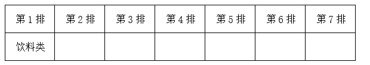

提问为“可能”，所以考虑代入法。

代入A项，若零食类排在文具前一排，根据条件（4）可知，零食类、文具类和日用品类先后相邻，可以分别放在第2排、第3排和第4排；根据条件（2）可知，调料类在第7排；根据条件（3）可知，粮油类在第5排；此时酒类放在第6排，符合条件（1）；与题干所有条件均不矛盾，可能为真，当选。

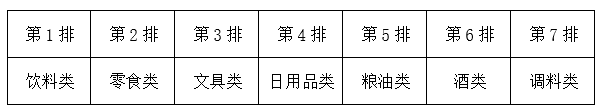

代入B项，若粮油类排在调料类前一排，结合条件（3）可知，零食类和调料类中间隔着3排，这与条件（2）矛盾，排除；

代入C项，若日用品类排在文具类前一排，根据条件（2），文具类和调料类中间隔着3排，假设文具类在调料类前，一共只有7排，则文具类只能在第3排，调料类在第7排，日用品类在第2排，如图所示，现只剩下第4、5、6排空缺，与条件（3）矛盾，排除；

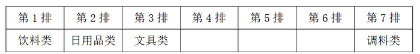

假设文具类在调料类后，根据条件（1），调料类只能在第3排，文具类在第7排，酒类在第2排，根据条件（4），日用品类在第6排，如图所示，现只剩下第4、5排空缺，与条件（3）矛盾，排除；

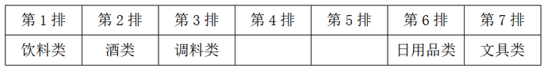

代入D项，若酒类排在文具类前一排，根据条件（4）可知，酒类、文具类和日用品类先后相邻；根据条件（1）、（2）可知，文具类只能在调料类前面，且为文具类×××调料类，进一步推出文具类在第3排，调料类在第7排，酒类在第2排，日用品类在第4排，如图所示，现只剩下第5、6排空缺，与条件（3）矛盾，排除。

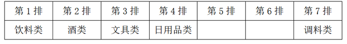

故正确答案为A。

---

### 第 6 题　qid 4637544 · 图形推理

从所给的四个选项中，选择最合适的一个填入问号处，使之呈现一定的规律性：

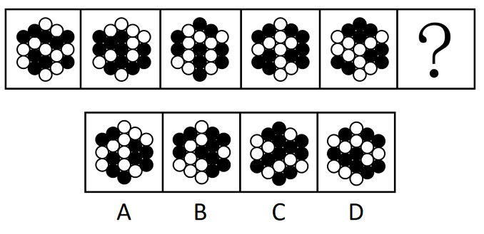

- **A**. A
- **B**. B　✅
- **C**. C
- **D**. D

**答案**：B

**官方解析**

图形组成不同，且无属性规律，优先考虑数量规律。观察发现图形均由黑球和白球构成，其中黑球的数量分别是9、10、9、10、9，故？处图形应有10个黑球，只有B项满足规律。
故正确答案为B。

---

### 第 7 题　qid 4637309 · 图形推理

从所给的四个选项中，选择最合适的一个填入问号处，使之呈现一定的规律性：

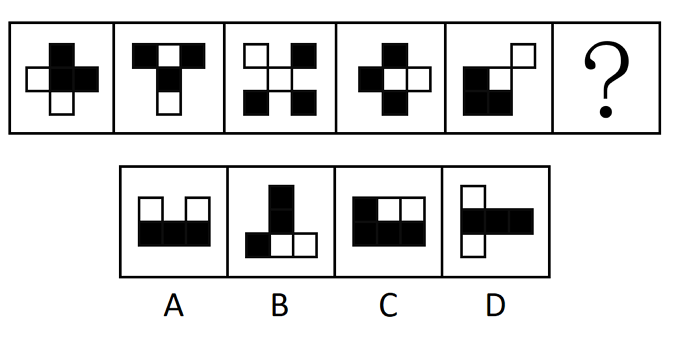

- **A**. A　✅
- **B**. B
- **C**. C
- **D**. D

**答案**：A

**官方解析**

图形元素组成相同，但无明显位置规律，考虑属性规律。观察发现，图形比较规整，考虑对称性。画出图形对称轴后发现对称轴依次逆时针旋转，故“？”处图形的对称轴应为竖直方向，只有A项符合。

故正确答案为A。

---

### 第 8 题　qid 4637579 · 图形推理

从所给的四个选项中，选择最合适的一个填入问号处，使之呈现一定的规律性：

- **A**. A
- **B**. B　✅
- **C**. C
- **D**. D

**答案**：B

**官方解析**

元素组成不同，且无明显属性规律，考虑数量规律。题干所给的黑块图形出现多个明显的直角，优先考虑直角数。第一组图形中，黑块图形内部的直角个数依次为1、2、3。第二组图形运用规律，图1、图2黑块图形内部的直角个数分别为1、2，故“？”处应选择黑块图形内部直角个数为3的图形，只有B项符合。
故正确答案为B。

---

### 第 9 题　qid 4637577 · 图形推理

从所给的四个选项中，选择最合适的一个填入问号处，使之呈现一定的规律性：

- **A**. A　✅
- **B**. B
- **C**. C
- **D**. D

**答案**：A

**官方解析**

题干每行图形均由相同的黑白球组成，元素组成相同，优先考虑位置规律。九宫格题目优先看横行。观察发现，在第一行图形中，上半部分的黑球每次逆时针平移一格，在前两行小球中转圈走，下半部分的黑球每次向左平移一格，在每一行小球中走到最左边后，再从最右边从头开始向左走（循环走）。观察可知，第二行图形同样符合此规律，同理第三行也应满足此规律。在第三行图形中，第三幅图应该在第二幅图的基础上，上半部分的黑球逆时针平移一格，下半部分的黑球向左平移一格（循环走），只有A项符合。
故正确答案为A。

---

### 第 10 题　qid 4637564 · 图形推理

左图是给定的空心立体图形，将其从任一面剖开，右边哪项可能是该立体图形的截面？

- **A**. A
- **B**. B　✅
- **C**. C
- **D**. D

**答案**：B

**官方解析**

本题考查截面图，逐一分析选项。

A项：无法切出，排除；

B项：从图形上半部分横着切，经过中间空心部分即可得到，当选；

C项：无法切出，排除；

D项：无法切出，排除。

故正确答案为B。

---

### 第 11 题　qid 4637401 · 图形推理

下列纸盒的外表面展开图中，哪项折叠成的纸盒和其他三个不一样？

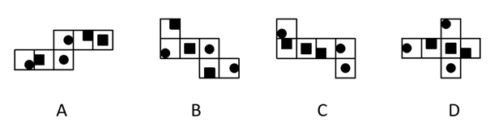

- **A**. A　✅
- **B**. B
- **C**. C
- **D**. D

**答案**：A

**官方解析**

将选项展开图标上序号，如下图所示（各选项面都相同，故相同的面用相同字母表示），逐一进行分析。

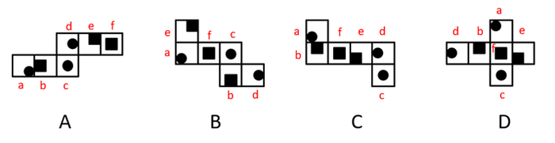

A项：以面e挨着黑块的点为起点进行顺时针画边（如下图所示），边1对应面f，边2对应面c，边3对应面d；

B项：以面e挨着黑块的点为起点进行顺时针画边（如下图所示），边1对应面f，边2对应面a，边3对应面d；

C项：以面e挨着黑块的点为起点进行顺时针画边（如下图所示），边1对应面f，边2对应面a，边3对应面d；

D项：以面e挨着黑块的点为起点进行顺时针画边（如下图所示），边1对应面f，边2对应面a，边3对应面d。

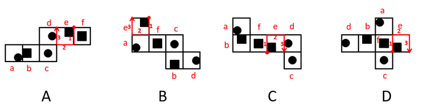

综上，只有A项与其他三项不同。

本题为选非题，故正确答案为A。

---

### 第 12 题　qid 4637338 · 图形推理

左图给定的是由相同正方体堆叠而成的多面体。该多面体可以由①、②和③三个多面体组合而成，以下哪项能填入问号处？

- **A**. A
- **B**. B
- **C**. C
- **D**. D　✅

**答案**：D

**官方解析**

本题考查立体拼合。

观察题干给出的多面体可知，图形可分为3层，由上至下第一层有2个小立方体，第二层有7个小立方体，第三层有9个小立方体。观察发现，图②共有3层，由上至下第一层有2个小立方体，第二层有1个小立方体，第三层有3个小立方体，可以拼合在多面体右侧，如下图所示，则题干多面体第二层还剩余6个小立方体，第三层还剩余6个小立方体。图①最下层的5个小立方体排列形状与题干多面体第二层剩余的形状相似，故图①最下层可以拼合在多面体第二层，最上层可以拼合在多面体第三层，如下图所示。根据凹凸一致的原则，剩余的形状只有D项符合。具体组合方式如下图所示：

故正确答案为D。

---

### 第 13 题　qid 4637369 · 图形推理

把下面的六个图形分为两类，使每一类图形都有各自的共同特征或规律，分类正确的一项是：

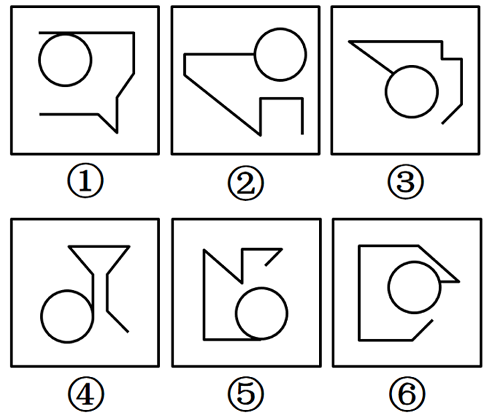

- **A**. ①②④，③⑤⑥
- **B**. ①③⑤，②④⑥
- **C**. ①④⑤，②③⑥　✅
- **D**. ①②⑥，③④⑤

**答案**：C

**官方解析**

本题为分组分类题目。元素组成不同，无明显属性规律，考虑数量规律。观察发现，每幅图形均有曲线与直线，且题干图形相切明显，考虑切点数量。图①④⑤的切点数均为1，图②③⑥的切点数均为0。即图①④⑤为一组，图②③⑥为一组。
故正确答案为C。

---

### 第 14 题　qid 4637310 · 图形推理

把下面的六个图形分为两类，使每一类图形都有各自的共同特征或规律，分类正确的一项是：

- **A**. ①②⑤，③④⑥　✅
- **B**. ①③④，②⑤⑥
- **C**. ①⑤⑥，②③④
- **D**. ①②④，③⑤⑥

**答案**：A

**官方解析**

本题为分组分类题目。元素组成不同，优先考虑属性规律。观察可知，题干图形比较规整，考虑对称性。图①②⑤一组，对称轴穿过图中的两个交点；图③④⑥一组，对称轴穿过图中的两条线，并且这两条线和对称轴垂直，对应A项。
故正确答案为A。

---

### 第 15 题　qid 4637545 · 图形推理

把下面的六个图形分为两类，使每一类图形都有各自的共同特征或规律，分类正确的一项是：

- **A**. ①②③，④⑤⑥
- **B**. ①④⑤，②③⑥
- **C**. ①②④，③⑤⑥
- **D**. ①③⑥，②④⑤　✅

**答案**：D

**官方解析**

本题为分组分类题目。元素组成不同，且无明显属性规律，考虑数量规律。观察发现，题干图形被分割明显，考虑面数量，但整体数面无法分组，所有图形的面数量均为7。再次观察发现，题干图形存在较多的三角形面，则考虑数三角形面的个数，图①③⑥均有4个三角形面，图②④⑤均有3个三角形面，故图①③⑥为一组，图②④⑤为一组。
故正确答案为D。

---

### 第 16 题　qid 4637349 · 定义判断

刑事科学技术是公安、司法机关依照刑事诉讼法的规定，应用现代科学技术的成果，收集、检验和鉴定与犯罪活动有关的物证，为侦查、起诉、审判工作提供线索和证据的专门技术。
根据上述定义，下列没有体现刑事科学技术的是：

- **A**. 通过核对公司台账、采购合同等文件资料，确定犯罪嫌疑人行贿的具体数额　✅
- **B**. 交通肇事伤亡案件中，根据车辆损毁情况推断车辆的接触点，行驶方向及事故成因
- **C**. 应用声谱仪对手机录音与犯罪嫌疑人的语音进行声学特征分析，作出是否为同一人的判断
- **D**. 对警犬识别出来的可疑物进行成分鉴定，判断嫌疑人所携带的物品是否为违禁品

**答案**：A

**官方解析**

第一步：找出定义关键词。
“公安、司法机关依照刑事诉讼法的规定”、“应用现代科学技术的成果”、“收集、检验和鉴定与犯罪活动有关的物证”、“为侦查、起诉、审判工作提供线索和证据”。
第二步：逐一分析选项。
A项：核对公司台账、采购合同等文件资料，只涉及资料核对，不符合“应用现代科学技术的成果”，不符合定义，当选；
B项：交通肇事伤亡案件中，根据车辆损毁情况推断车辆的接触点、行驶方向及事故成因，涉及应用现代科学技术中的痕迹检验，符合“应用现代科学技术的成果”、“收集、检验和鉴定与犯罪活动有关的物证”、“为侦查、起诉、审判工作提供线索和证据”，符合定义，排除；
C项：应用声谱仪对手机录音与犯罪嫌疑人的语音进行声学特征分析，涉及应用现代科学技术中的声像技术，符合“应用现代科学技术的成果”、“为侦查、起诉、审判工作提供线索和证据”，手机录音是犯罪活动的物证，符合“收集、检验和鉴定与犯罪活动有关的物证”，符合定义，排除；
D项：对警犬识别出来的可疑物进行成分鉴定，涉及应用现代科学技术中的刑事理化检验，符合“应用现代科学技术的成果”、“为侦查、起诉、审判工作提供线索和证据”，鉴定后的携带物品可以作为犯罪活动的物证，符合“收集、检验和鉴定与犯罪活动有关的物证”，符合定义，排除。
本题为选非题，故正确答案为A。

---

### 第 17 题　qid 4637371 · 定义判断

归因不变性原则是指人们会寻找某一特定结果与特定原因之间的不变联系，如果某种特定原因在许多情境下总是与某种结果相伴，人们就会把特定结果归结于那一原因。归因折扣原则是指人们不完全相信某一现象的形成确是由于某种原因所导致，即某一特定原因在产生特定结果中的作用，如果存在其他似是而非的原因，应该“打折扣”。
根据上述定义，两类归因原则均没有体现的是：

- **A**. 电视广告中明星推销洗发水时，观众觉得她的一头秀发不完全是因为洗发水才有的
- **B**. 创业失败总会使创业者背负债务，创业者小罗这几年债台高筑，朋友认为他一定是创业失败了
- **C**. 在代理了诸多离婚案件后，律师小林统计发现离婚诉讼中大多数争议与财产纠纷有关　✅
- **D**. 对一系列盗窃案的分析显示，现场都出现过同一个男人，人们容易假定该男人就是犯罪嫌疑人

**答案**：C

**官方解析**

第一步：找出定义关键词。
归因不变性原则：“某种特定原因在许多情境下总是与某种结果相伴”、“人们就会把特定结果归结于那一原因”；
归因折扣原则：“人们不完全相信某一现象的形成确是由于某种原因所导致”。
第二步：逐一分析选项。
A项：该项中观众觉得明星的秀发不完全是因为洗发水才有的，符合“人们不完全相信某一现象的形成确是由于某种原因所导致”，符合归因折扣原则定义，排除；
B项：该项中创业失败总会导致创业者背负债务，符合“某种特定原因在许多情境下总是与某种结果相伴”，朋友认为小罗这几年债台高筑的原因是创业失败，符合“人们就会把特定结果归结于那一原因”，符合归因不变性原则定义，排除；
C项：该项中律师小林发现离婚诉讼中大多数争议与财产纠纷有关，并没有体现人们是否将离婚诉讼这个结果归结于财产纠纷，不符合“某种特定原因在许多情境下总是与某种结果相伴”、“人们就会把特定结果归结于那一原因”，不符合归因不变性原则定义，同时该项也没有体现人们对于财产纠纷这个原因的质疑，不符合“人们不完全相信某一现象的形成确是由于某种原因所导致”，不符合归因折扣原则定义，当选；
D项：该项中盗窃案的现场都出现了同一个男人，符合“某种特定原因在许多情境下总是与某种结果相伴”，人们容易假定该男人就是盗窃案的犯罪嫌疑人，符合“人们就会把特定结果归结于那一原因”，符合归因不变性原则定义，排除。
本题为选非题，故正确答案为C。

---

### 第 18 题　qid 4637404 · 定义判断

由于人类建设活动的破坏和干扰，生物群体原来连续成片的生活环境被割裂，形成分散的岛状甚至碎片状的生境，生境廊道是指连接破碎化生境并适宜生物生活、移动或扩散的通道，便于实现物种基因、能量、物质的流动。
根据上述定义，下列不属于生境廊道的是：

- **A**. 国家公园内，两棵参天古树跨过公路上方枝叶相连，金丝猴借助古树跨越公路。不同区域的金丝猴群可以保持接触
- **B**. 为了让野生象群在两个自然保护区之间迁移，管理者设计建成了迁移通道，避开村寨，并保证该区域范围内有丰富的水和食物资源
- **C**. 某地将过去严重污染的河道改造为河滨公园，架设了多座拱桥，美化了环境，方便了交通，还吸引了大量鸟类来此栖息　✅
- **D**. 为避免青藏铁路隔断藏羚羊迁徙路线，动物学家设计了桥梁下方、隧道上方及路基缓坡3种形式的野生动物通路

**答案**：C

**官方解析**

第一步：找出定义关键词。
“连接破碎化生境”、“适宜生物生活、移动或扩散的通道”、“便于实现物种基因、能量、物质的流动”。
第二步：逐一分析选项。
A项：两棵参天古树跨过公路上方枝叶相连，符合“连接破碎化生境”，不同区域的金丝猴群可以通过相连的枝叶来保持接触，实现基因、能量、物质的流动，符合“适宜生物生活、移动或扩散的通道”、“便于实现物种基因、能量、物质的流动”，符合定义，排除；
B项：管理者在两个自然保护区之间建立迁移通道，符合“连接破碎化生境”，野生象群可以通过迁移通道实现基因、能量、物质的流动，符合“适宜生物生活、移动或扩散的通道”、“便于实现物种基因、能量、物质的流动”，符合定义，排除；
C项：某地将严重污染的河道改造为河滨公园，但河滨公园只是鸟类的栖息地，没有体现对于破碎化生境的连接，不符合“连接破碎化生境”、“适宜生物生活、移动或扩散的通道”，不符合定义，当选；
D项：动物学家设计野生动物通路来避免藏羚羊的迁移路线被阻隔，符合“连接破碎化生境”，多种形式的野生动物通路可以让藏羚羊之间实现基因、能量、物质的流动，符合“适宜生物生活、移动或扩散的通道”、“便于实现物种基因、能量、物质的流动”，符合定义，排除。
本题为选非题，故正确答案为C。

---

### 第 19 题　qid 4637546 · 定义判断

对于特定论域中的任意两个对象a、b而言，当对象a与对象b之间具有关系R时，对象b与对象a之间是否也具有关系R？基于此，对称性关系命题可分为正对称关系、反对称关系和半对称关系。（1）正对称关系：若对象a与b之间具有关系R，则对象b与a之间也具有关系R；（2）反对称关系：若对象a与b之间具有关系R，则对象b与a之间一定不具有关系R；（3）半对称关系：若对象a与b之间具有关系R，则对象b与a之间不一定具有关系R。
根据上述定义，下列关系属于半对称关系的是：

- **A**. 学生之间的同学关系
- **B**. 两个分数之间的小于关系
- **C**. 人与人之间的帮助关系　✅
- **D**. 城市与城市之间的相邻关系

**答案**：C

**官方解析**

第一步：找出定义关键词。
正对称关系：“若对象a与b之间具有关系R，则对象b与a之间也具有关系R”；
反对称关系：“若对象a与b之间具有关系R，则对象b与a之间一定不具有关系R”；
半对称关系：“若对象a与b之间具有关系R，则对象b与a之间不一定具有关系R”。
第二步：逐一分析选项。
A项：若学生a与学生b之间具有同学关系R，则学生b与学生a之间也具有同学关系R，符合“若对象a与b之间具有关系R，则对象b与a之间也具有关系R”，符合“正对称关系”定义，不符合“半对称关系”定义，排除；
B项：若分数a与分数b之间具有小于关系R，则分数b与分数a之间一定不具有小于关系R，而是具有大于关系，符合“若对象a与b之间具有关系R，则对象b与a之间一定不具有关系R”，符合“反对称关系”定义，不符合“半对称关系”定义，排除；
C项：若一个人a帮助了另一个人b（即a与b之间具有帮助关系R），不能确定b是否也帮助了a（即b与a之间不一定具有帮助关系R，可能有也可能没有），符合“若对象a与b之间具有关系R，则对象b与a之间不一定具有关系R”，符合“半对称关系”定义，当选；
D项：若城市a与城市b之间具有相邻关系R，则城市b与城市a之间也具有相邻关系R，符合“若对象a与b之间具有关系R，则对象b与a之间也具有关系R”，符合“正对称关系”定义，不符合“半对称关系”定义，排除。
故正确答案为C。

---

### 第 20 题　qid 4637549 · 定义判断

量表法是运用量表形式测定被调查者对问题的态度的方法。根据不同用途，量表可分为直接量表和间接量表。直接量表中，调查者设计问题并询问被调查者，被调查者在有关量表上直接表明其态度；间接量表中，被调查者按其态度或意愿，在备选问题或语句中选择出合适的语句代表其态度。
根据上述定义，下列属于间接量表的是：

- **A**. 
请给以下四部电影打分，要求其分数总和为100分：

《电影甲》<u>   </u>《电影乙》<u>   </u>《电影丙》<u>   </u>《电影丁》<u>   </u>

- **B**. 
请您按照个人喜欢的程度对下列品牌的洗衣粉进行编号，最喜欢者为1号，以此类推：

品牌甲□ 品牌乙□ 品牌丙□ 品牌丁□ 品牌戊□ 品牌己□

- **C**. 
请阅读下列语句，并在合适的一项上划“√”：

　✅
- **D**. 
请对电视剧《XX》中王小明的人物形象进行评价：

**答案**：C

**官方解析**

第一步：找出定义关键词。
量表法：“运用量表形式测定被调查者对问题的态度的方法”；
直接量表：“调查者设计问题并询问被调查者”、“被调查者直接表明其态度”；
间接量表：“被调查者按其态度或意愿”、“在备选问题或语句中选择出合适的语句代表其态度”。
第二步：逐一分析选项。
A项：给四部电影打分，分数总和为100分，被调查者可以直接分配分数，表明自己的态度，符合“调查者设计问题并询问被调查者”、“被调查者直接表明其态度”、“直接表明其态度”，符合“直接量表”的定义，不符合“间接量表”的定义，排除；
B项：按照个人喜好对六个品牌的洗衣粉进行编号，被调查者可以根据自己的喜好程度直接表明自己的态度，符合“调查者设计问题并询问被调查者”、“被调查者直接表明其态度”、“直接表明其态度”，符合“直接量表”的定义，不符合“间接量表”的定义，排除；
C项：被调查者可以从备选的五项中任选一个表明自己的态度，符合“被调查者按其态度或意愿”、“在备选问题或语句中选择出合适的语句代表其态度”，符合“间接量表”的定义，当选；
D项：对某人物形象进行评价，被调查者可以根据自己对人物的认识进行评价，表明态度，符合“调查者设计问题并询问被调查者”、“被调查者直接表明其态度”、“直接表明其态度”，符合“直接量表”的定义，不符合“间接量表”的定义，排除。
故正确答案为C。

---

### 第 21 题　qid 4637575 · 定义判断

基因污染指原生物种基因库非预期或不受控制的基因流动，即外源基因通过转基因作物、外来入侵物种、家养动物等扩散到其他栽培作物或自然野生物种并成为后者基因的一部分。
根据上述定义，下列没有体现出基因污染的是：

- **A**. 某农场生产的大豆发现了转基因成分Bt基因，这些成分是附近地区种植的基因工程Bt大豆通过交叉授粉传播过来的
- **B**. 黑足猫是一种体型娇小但捕猎能力超强的野生猫，跑到野外的家猫和黑足猫交配后，生出血统不纯正的黑足猫，真正的黑足猫几近灭绝
- **C**. 转基因SL玉米获批做动物饲料，SL玉米只占某国玉米总产量的1%，但一年后该国22%的玉米样本被认定含有SL玉米基因
- **D**. 某国开发出耐除草剂的转基因油菜，油菜出油率提高，但这种油菜种子能在土壤中休眠数年，因此成为其他作物中的“杂草”　✅

**答案**：D

**官方解析**

第一步：找出定义关键词。
“外源基因通过转基因作物、外来入侵物种、家养动物等扩散到其他栽培作物或自然野生物种”、“成为后者基因的一部分”。
第二步：逐一分析选项。
A项：Bt基因通过基因工程种植的大豆扩散到了农场生产的大豆中，符合“外源基因通过转基因作物、外来入侵物种、家养动物等扩散到其他栽培作物或自然野生物种”、“成为后者基因的一部分”，符合定义，排除；
B项：家猫的基因扩散到了新生的黑足猫中，符合“外源基因通过转基因作物、外来入侵物种、家养动物等扩散到其他栽培作物或自然野生物种”、“成为后者基因的一部分”，符合定义，排除；
C项：SL玉米基因通过转基因SL玉米扩散到了该国的其他玉米中，符合“外源基因通过转基因作物、外来入侵物种、家养动物等扩散到其他栽培作物或自然野生物种”、“成为后者基因的一部分”，符合定义，排除；
D项：转基因油菜成为了其他作物中的“杂草”，没有体现通过基因扩散到了其他物种中，不符合“外源基因通过转基因作物、外来入侵物种、家养动物等扩散到其他栽培作物或自然野生物种”、“成为后者基因的一部分”，不符合定义，当选。
本题为选非题，故正确答案为D。

---

### 第 22 题　qid 4637365 · 定义判断

回指是在语法描写中用来指一个语言单位（回指语）从先前某个已表达的单位或意义（先行语）得出自身释义的过程或结果。回指可分为直接回指和间接回指。直接回指是指回指语与先行语存在明显共指关系，回指语是对先行语的重复。间接回指是指回指语与先行语之间的关系不明显，必须通过特定语境进行判断才能确立。
根据上述定义，下列画横线部分所反映的先行语和回指语之间的关系属于直接回指的是：

- **A**. 
要向<u>前来参会的人</u>表示感谢，<u>人家</u>来参会就是对我们的支持
　✅
- **B**. 
门口停着好些<u>三轮车</u>，许多<u>车夫</u>在那里闲站着

- **C**. 
<u>这房子</u>相当讲究，<u>门</u>是楠木做的

- **D**. 
他午饭前来到<u>餐馆</u>点了一杯咖啡，<u>服务员</u>是一位意大利人

**答案**：A

**官方解析**

第一步：找出定义关键词。
回指：“用来指一个语言单位（回指语）从先前某个已表达的单位或意义（先行语）得出自身释义的过程或结果”；
直接回指：“回指语与先行语存在明显共指关系”、“回指语是对先行语的重复”；
间接回指：“回指语与先行语之间的关系不明显”、“必须通过特定语境进行判断才能确立”。
第二步：逐一分析选项。
A项：选项中先行语是“前来参会的人”，回指语是“人家”，“人家”用来指代前文中提到的“前来参会的人”，符合“回指语与先行语存在明显共指关系”、“回指语是对先行语的重复”，符合“直接回指”定义，当选；
B项：选项中先行语是“三轮车”，回指语是“车夫”，前者是物，后者是人，二者间无明显的共指关系，“车夫”也不是对“三轮车”的重复，不符合“回指语与先行语存在明显共指关系”、“回指语是对先行语的重复”，不符合“直接回指”定义，排除；
C项：选项中先行语是“这房子”，回指语是“门”，前者是整体，后者是前者的部分，二者间无明显的共指关系，“门”也不是对“房子”的重复，不符合“回指语与先行语存在明显共指关系”、“回指语是对先行语的重复”，不符合“直接回指”定义，排除；
D项：选项中先行语是“餐馆”，回指语是“服务员”，前者是场所，后者是人，二者间无明显的共指关系，“服务员”也不是对“餐馆”的重复，不符合“回指语与先行语存在明显共指关系”、“回指语是对先行语的重复”，不符合“直接回指”定义，排除。
故正确答案为A。

---

### 第 23 题　qid 4637353 · 定义判断

在生物学、医学及其子科学的研究中，对从通常的生物学环境中分离出的生物体组织成分进行体外研究的实验称为体外实验；在活体生物机体之中进行研究的实验称为体内实验。
根据上述定义，下列属于体外实验的是：

- **A**. 在培养皿中对卵子授精后观察受精卵的发育情况　✅
- **B**. 在光学显微镜下观察枯草杆菌是否具有鞭毛
- **C**. 研究不同比例氮肥对玉米植株生长的影响
- **D**. 在试管中观察药剂与某溶液的化学反应

**答案**：A

**官方解析**

第一步：找出定义关键词。
体外实验：“从通常的生物学环境中分离出的生物体组织成分”、“进行体外研究”；
体内实验：“在活体生物机体之中进行研究”。
第二步：逐一分析选项。
A项：在培养皿中对卵子授精后观察受精卵的发育情况，“卵子”是从雌性体内分离出的生殖细胞，符合“从通常的生物学环境中分离出的生物体组织成分”，观察受精卵的发育情况，符合“进行体外研究”，符合“体外实验”，当选；
B项：观察枯草杆菌是否具有鞭毛，不是将鞭毛分离出来进行研究，不符合“从通常的生物学环境中分离出的生物体组织成分”，不符合“体外实验”，排除；
C项：研究不同比例氮肥对玉米植株生长的影响，是研究不同情况下的活体植株，符合“在活体生物机体之中进行研究”，符合“体内实验”，不符合“体外实验”，排除；
D项：在试管中观察药剂与某溶液的化学反应，“药剂”和“某溶液”都不是生物体组织成分，不符合“从通常的生物学环境中分离出的生物体组织成分”，不符合“体外实验”，排除。
故正确答案为A。

---

### 第 24 题　qid 4637557 · 定义判断

按调查范围来看，可将调查分为全面调查和非全面调查。全面调查指的是一定范围内的情况普查；非全面调查是指从总体中抽取一部分对象进行情况调查，又可分为：根据随机原则选择样本的抽样调查和有意识选取若干样本进行的典型调查。
根据上述定义，下列说法正确的是：

- **A**. 对某市幼儿园所有儿童进行口腔卫生检查，这属于非全面调查
- **B**. 对省内1~3年级的全体学生进行体育活动时间的调查，这属于非全面调查
- **C**. 对全国招生规模较大的前30所医学院校进行学生就业情况调查，这属于典型调查　✅
- **D**. 对某市中考数学成绩最好的几所学校进行调查，总结相关经验，这属于抽样调查

**答案**：C

**官方解析**

第一步：找出定义关键词。
全面调查：“一定范围内的情况普查”；
非全面调查：“从总体中抽取一部分对象进行情况调查”；
抽样调查：“根据随机原则选择样本”；
典型调查：“有意识选取若干样本”。
第二步：逐一分析选项。
A项：对某市幼儿园所有儿童进行口腔卫生检查，符合“一定范围内的情况普查”，符合“全面调查”的定义，不符合“非全面调查”的定义，排除；
B项：对省内1~3年级的全体学生进行的调查，符合“一定范围内的情况普查”，符合“全面调查”的定义，不符合“非全面调查”的定义，排除；
C项：在医学院校里选取了规模较大的前30所院校进行调查，不是随机选择，是有意识地选取一部分进行调查，符合“有意识选取若干样本”，符合“典型调查”的定义，当选；
D项：对某市中考数学成绩最好的几所学校进行调查，不是随机选择，是有意识地选取一部分进行调查，符合“有意识选取若干样本”，符合“典型调查”的定义，不符合“抽样调查”的定义，排除。
故正确答案为C。

---

### 第 25 题　qid 4637578 · 定义判断

地球物理勘探是通过研究和观测各种地球物理场的变化来探测地层岩性、地质构造等地质条件的过程。由于组成地壳的不同岩层介质往往在密度、弹性、导电性等方面存在差异，这些差异将引起相应的地球物理场的局部变化，通过测量这些物理场的分布和变化特征，结合已知地质资料进行分析研究，就可以达到推断地质性状的目的。
根据上述定义，下列不属于地球物理勘探的是：

- **A**. 根据岩石和矿石导电性、电磁感应特性等来记录地层界面的深度和形态
- **B**. 利用人工激发的地震波在弹性不同地层内的传播规律，了解水文地质的分布情况
- **C**. 采集岩石样品，分析岩石内的微量元素，通过发现与矿化有关的原生异常来寻找矿床　✅
- **D**. 通过观测不同岩石引起的重力差异，判断地下地层的岩性及状态，确定沉积盆地范围

**答案**：C

**官方解析**

第一步：找出定义关键词。
“研究和观测各种地球物理场的变化”、“探测地层岩性、地质构造等地质条件”、“密度、弹性、导电性”、“达到推断地质性状的目的”。
第二步：逐一分析选项。
A项：导电性、电磁感应特性都属于物理场的范畴，符合“研究和观测各种地球物理场的变化”、“密度、弹性、导电性”，记录地层界面的深度和形态，符合“探测地层岩性、地质构造等地质条件”、“达到推断地质性状的目的”，符合定义，排除；
B项：利用人工激发的地震波在弹性不同地层内的传播规律，符合“研究和观测各种地球物理场的变化”、“密度、弹性、导电性”，了解水文地质的分布情况，符合“探测地层岩性、地质构造等地质条件”、“达到推断地质性状的目的”，符合定义，排除；
C项：分析岩石内的微量元素，是在分析岩石的化学成分，不属于物理场的范畴，不符合关键词“研究和观测各种地球物理场的变化”，不符合定义，当选；
D项：重力差异属于物理场的范畴，符合“研究和观测各种地球物理场的变化”，判断地下地层的岩性及状态，确定沉积盆地范围，符合“探测地层岩性、地质构造等地质条件”、“达到推断地质性状的目的”，符合定义，排除。
本题为选非题，故正确答案为C。

---

### 第 26 题　qid 4637387 · 类比推理

贸易摩擦：出口下滑

- **A**. 醉酒驾驶：例行检查
- **B**. 行政处罚：违规生产
- **C**. 商业垄断：市场失灵　✅
- **D**. 职务犯罪：谋取私利

**答案**：C

**官方解析**

第一步：判断题干词语间逻辑关系。
因为贸易摩擦，所以出口下滑，二者为因果对应关系。
第二步：判断选项词语间逻辑关系。
A项：通过例行检查可以发现是否有人醉酒驾驶，二者并非因果对应关系，与题干逻辑关系不一致，排除；
B项：因为违规生产，所以遭受行政处罚，二者为因果关系，但词语顺序与题干相反，与题干逻辑关系不一致，排除；
C项：因为商业垄断，所以市场失灵，二者为因果关系，与题干逻辑关系一致，当选；
D项：职务犯罪的目的是谋取私利，二者为方式与目的对应关系，与题干逻辑关系不一致，排除。
故正确答案为C。

---

### 第 27 题　qid 4637551 · 类比推理

边防检查：走私

- **A**. 科普宣传：迷信　✅
- **B**. 农药喷洒：除害
- **C**. 个税申报：偷税
- **D**. 手术治疗：患病

**答案**：A

**官方解析**

第一步：判断题干词语间逻辑关系。
边防检查是为了防止走私，二者是对应关系，且“走私”是动词。
第二步：判断选项词语间逻辑关系。
A项：科普宣传是为了防止迷信，二者是对应关系，且“迷信”是动词，与题干逻辑关系一致，当选；
B项：农药喷洒是为了除害，而不是为了防止除害，与题干逻辑关系不一致，排除；
C项：个税申报是为了防止偷税，二者是对应关系，但“偷税”是动宾结构，与题干逻辑关系不一致，排除； 
D项：手术治疗是为了治病，而不是为了防止患病，与题干逻辑关系不一致，排除。
故正确答案为A。

---

### 第 28 题　qid 4637399 · 类比推理

呼吸系统：生殖系统

- **A**. 生产计划：年度计划
- **B**. 观赏花卉：药用花卉
- **C**. 水面舰艇：巡洋舰艇
- **D**. 简牍公文：纸质公文　✅

**答案**：D

**官方解析**

第一步：判断题干词语间逻辑关系。
呼吸系统和生殖系统是两种不同的人体系统，二者是并列关系。
第二步：判断选项词语间逻辑关系。
A项：年度计划是对一年的工作、活动等所做的规划，不同的人、不同的工作的年度计划不同，生产计划是企业对生产任务作出的规划，有的生产计划是年度计划，有的生产计划不是年度计划，有的年度计划是生产计划，有的年度计划不是生产计划，二者是交叉关系，与题干逻辑关系不一致，排除；
B项：观赏花卉是具有观赏价值的花卉，药用花卉是能够防病、治病的花卉，有的观赏花卉是药用花卉，有的观赏花卉不是药用花卉，有的药用花卉是观赏花卉，有的药用花卉不是观赏花卉，二者是交叉关系，与题干逻辑关系不一致，排除；
C项：巡洋舰艇是一种在远洋活动的大型水面舰艇，与水面舰艇是种属关系，与题干逻辑关系不一致，排除；
D项：简牍公文是在竹简、木简、竹牍或木牍上书写的公文，与纸质公文是并列关系，与题干逻辑关系一致，当选。
故正确答案为D。

---

### 第 29 题　qid 4637377 · 类比推理

微型无人机：旋翼无人机

- **A**. 热带植物：香料植物　✅
- **B**. 集体决策：个人决策
- **C**. 形象思维：抽象思维
- **D**. 开环系统：闭环系统

**答案**：A

**官方解析**

第一步：判断题干词语间逻辑关系。
微型无人机是指尺寸只有手掌大小（约15cm）的飞行器，旋翼无人机是指用旋翼提供升力的无人驾驶飞行器，有的微型无人机是旋翼无人机，有的微型无人机不是旋翼无人机，有的旋翼无人机是微型无人机，有的旋翼无人机不是微型无人机，二者为交叉关系。
第二步：判断选项词语间逻辑关系。
A项：热带植物是指生活在热带地区的植物，香料植物是指能分泌和积累具有芳香气味物质的一类植物，有的热带植物是香料植物，有的热带植物不是香料植物，有的香料植物是热带植物，有的香料植物不是热带植物，二者为交叉关系，与题干逻辑关系一致，当选；
B项：集体决策是通过集体做出的决策，个人决策是指由一个人单独做出的决策，二者为并列关系，与题干逻辑关系不一致，排除；
C项：形象思维是以直观形象和表象为支柱的思维过程，抽象思维是指用词进行判断、推理并得出结论的过程，二者为并列关系，与题干逻辑关系不一致，排除；
D项：开环系统是指在一个控制系统中系统的输入信号不受输出信号影响的控制系统，闭环系统是指系统的输入影响输出，同时又受输出的直接或间接影响的系统，二者为并列关系，与题干逻辑关系不一致，排除。
故正确答案为A。

---

### 第 30 题　qid 4637392 · 类比推理

独幕剧：歌剧：话剧

- **A**. 流行歌曲：通俗歌曲：现代歌曲
- **B**. 自由体操：竞技体操：艺术体操
- **C**. 远程面试：单独面试：小组面试　✅
- **D**. 顺序作业：流水作业：平行作业

**答案**：C

**官方解析**

第一步：判断题干词语间逻辑关系。
独幕剧指不分幕的小型戏剧，歌剧指综合诗歌、音乐、舞蹈等艺术而以歌唱为主的戏剧，话剧指用对话和动作来表演的戏剧。歌剧和话剧为并列关系，同时二者与独幕剧均构成交叉关系。
第二步：判断选项词语间逻辑关系。
A项：通俗歌曲又叫流行歌曲，二者为全同关系，与题干逻辑关系不一致，排除；
B项：自由体操是竞技体操的一种，二者为种属关系；体操主要包括竞技体操、艺术体操、蹦床等项目，竞技体操和艺术体操构成并列关系，与题干逻辑关系不一致，排除；
C项：远程面试是根据面试的距离远近进行分类的面试类型，单独面试和小组面试是根据面试的主体数量进行分类的面试类型，单独面试和小组面试为并列关系，二者与远程面试均构成交叉关系，与题干逻辑关系一致，当选；
D项：顺序作业、流水作业、平行作业均为施工组织的作业方式，三者为并列关系，与题干逻辑关系不一致，排除。
故正确答案为C。

---

### 第 31 题　qid 4637415 · 类比推理

青铜器物：商朝礼器：文化遗产

- **A**. 科幻小说：微型小说：文学作品　✅
- **B**. 中式建筑：苏州园林：特色建筑
- **C**. 仰韶文化：半坡遗址：华夏文明
- **D**. 进口食品：速冻海鲜：冷冻食品

**答案**：A

**官方解析**

第一步：判断题干词语间逻辑关系。

青铜器物与商朝礼器构成交叉关系，同时二者均是文化遗产的一种，二者均与文化遗产构成种属关系。

第二步：判断选项词语间逻辑关系。

A项：科幻小说与微型小说构成交叉关系，同时二者均是文学作品的一种，二者均与文学作品构成种属关系，与题干逻辑关系一致，当选；

B项：苏州园林是一种中式建筑，二者为种属关系，中式建筑和特色建筑构成交叉关系，与题干逻辑关系不一致，排除；

C项：半坡遗址是新石器时代仰韶文化聚落遗址，二者为对应关系；仰韶文化是华夏文明的组成部分，二者为组成关系，与题干逻辑关系不一致，排除； 

D项：进口食品与速冻海鲜构成交叉关系，但进口食品与冷冻食品也构成交叉关系，与题干逻辑关系不一致，排除。

故正确答案为A。

注：青铜器物不仅是红铜与其他化学元素锡、铅等的合金，而且因为刚刚铸造完成的青铜器是金色，出土的青铜因为时间流失产生锈蚀后变为青绿色，所以被称为青铜。因此现在仅仅由红铜与其他化学元素锡、铅等物质制成的器具是不能称之为青铜器的，只能称之为铜器物。故题干青铜器物和文化遗产间是种属关系。

---

### 第 32 题　qid 4637580 · 类比推理

剪发：烫发剂：烫发

- **A**. 催熟：防腐剂：防腐　✅
- **B**. 伐树：植树节：植树
- **C**. 风蚀：碳酸钙：溶蚀
- **D**. 镇痛：止痛药：止痛

**答案**：A

**官方解析**

第一步：判断题干词语间逻辑关系。
剪发和烫发是两种不同的美发方式，二者为并列关系；烫发剂的功能是烫发，二者为功能对应关系。
第二步：判断选项词语间逻辑关系。
A项：催熟和防腐是两种不同的技术，二者为并列关系；防腐剂的功能是防腐，二者为功能对应关系，与题干逻辑关系一致，当选；
B项：伐树和植树是两个不同的行为，二者为并列关系；在植树节植树，二者为节日和活动的对应关系，与题干逻辑关系不一致，排除；
C项：风蚀和溶蚀是两种不同的侵蚀作用，二者为并列关系；碳酸钙本身不具备溶蚀的功能，是因为碳酸盐岩等可溶岩的构成物是碳酸钙，碳酸钙能够与水中的碳酸发生反应，所以才会发生溶蚀，二者不是功能对应关系，与题干逻辑关系不一致，排除；
D项：镇痛指对急慢性疼痛等的治疗，有减少疼痛的意思，和止痛是近义关系，与题干逻辑关系不一致，排除。
故正确答案为A。

---

### 第 33 题　qid 4637400 · 类比推理

城市公园：公共设施：休闲娱乐

- **A**. 国宾礼炮：电子礼炮：国事庆祝
- **B**. 医用口罩：卫生用品：过滤空气　✅
- **C**. 升降舞台：露天剧场：演出空间
- **D**. 云服务器：虚拟技术：信息备份

**答案**：B

**官方解析**

第一步：判断题干词语间逻辑关系。
“城市公园”是一种“公共设施”，二者为种属关系；“城市公园”具有“休闲娱乐”的功能，二者为功能对应关系。
第二步：判断选项词语间逻辑关系。
A项：有的“国宾礼炮”是“电子礼炮”，有的“国宾礼炮”不是“电子礼炮”，有的“电子礼炮”是“国宾礼炮”，有的“电子礼炮”不是“国宾礼炮”，二者为交叉关系；“国宾礼炮”和“电子礼炮”都有用于“国事庆祝”的功能，三者构成功能对应关系，与题干逻辑关系不一致，排除；
B项：“医用口罩”是一种“卫生用品”，二者为种属关系；“医用口罩”具有“过滤空气”的功能，二者为功能对应关系，与题干逻辑关系一致，当选；
C项：“升降舞台”是“露天剧场”的组成部分，二者为组成关系；“露天剧场”是一种“演出空间”，二者为种属关系，与题干逻辑关系不一致，排除；
D项：“云服务器”运用了“虚拟技术”，二者不是种属关系；“云服务器”具有“信息备份”的功能，二者为功能对应关系，与题干逻辑关系不一致，排除。
故正确答案为B。

---

### 第 34 题　qid 4637576 · 类比推理

国色天香 对于 （    ） 相当于 （    ） 对于 玉树临风

- **A**. 面如冠玉；螓首蛾眉　✅
- **B**. 倾国倾城；明眸皓齿
- **C**. 一表人才；仪表堂堂
- **D**. 才高八斗；亭亭玉立

**答案**：A

**官方解析**

逐一代入选项。
A项：国色天香原指色香俱美的牡丹花，后用以形容女性容貌美丽，面如冠玉形容男子面貌俊美，有如镶饰在帽上的美玉，二者是近义关系，且国色天香形容女性，面如冠玉形容男性；螓首蛾眉形容女子美丽的容貌，玉树临风形容人风度潇洒，秀美多姿，二者是近义关系，且螓首蛾眉形容女性，玉树临风形容男性，前后逻辑关系一致，当选；
B项：国色天香原指色香俱美的牡丹花，后用以形容女性容貌美丽，倾国倾城形容女子容貌极其美丽，二者是近义关系，且二者均用来形容女性；明眸皓齿形容面容美丽，玉树临风形容人风度潇洒，秀美多姿，二者是近义关系，但明眸皓齿形容女性，玉树临风形容男性，前后逻辑关系不一致，排除；
C项：国色天香原指色香俱美的牡丹花，后用以形容女性容貌美丽，一表人才形容人容貌俊秀端正，二者是近义关系，且国色天香形容女性，一表人才形容男性；仪表堂堂形容人容貌、风度庄严大方，玉树临风形容人风度潇洒，秀美多姿，二者是近义关系，但二者均用来形容男性，前后逻辑关系不一致，排除；
D项：国色天香原指色香俱美的牡丹花，后用以形容女性容貌美丽，才高八斗比喻人极有才华，二者无明显逻辑关系；亭亭玉立形容女子身材细长，也形容花木等形体挺拔，玉树临风形容人风度潇洒，秀美多姿，二者无明显逻辑关系，前后逻辑关系不一致，排除。
故正确答案为A。

---

### 第 35 题　qid 4637382 · 类比推理

自然声源 对于 （    ） 相当于 （    ） 对于 煤炭

- **A**. 人工声源；植物遗骸
- **B**. 燕语莺声；矿石燃料　✅
- **C**. 传播介质；社区供暖
- **D**. 物体振动；地质危害

**答案**：B

**官方解析**

逐一代入选项。
A项：自然声源与人工声源二者是并列关系，煤炭是古代植物遗骸在地下经历了复杂的生物化学和物理化学变化逐渐形成的固体可燃性矿物，二者为原材料对应关系，前后逻辑关系不一致，排除；
B项：燕语莺声的意思是燕子的话语，黄鹂的歌声，燕语莺声是自然声源，二者为种属关系，煤炭是矿石燃料，二者为种属关系，前后逻辑关系一致，当选；
C项：自然声源需要在传播介质的条件下才能传播出声音，二者为必要条件对应关系，社区供暖需要煤炭来提供能量，二者为对应关系，但不是必要条件对应关系，前后逻辑关系不一致，排除；
D项：物体振动产生自然声源，二者为对应关系，煤炭与地质危害无明显逻辑关系，前后逻辑关系不一致，排除。
故正确答案为B。
备注：本题所给词语“自然声源”、“矿石燃料”与专有名词存在区别，如果按照专有名词的释义进行分析，则本题没有答案，所以解析时按照日常理解进行题干分析。

---

### 第 36 题　qid 4637555 · 逻辑判断

最近，主打白噪音的助眠产品引起很多人的兴趣。有人认为，白噪音可以掩盖环境中干扰性的刺激，有助于促进睡眠、改善睡眠质量。但研究者对此持怀疑态度，认为白噪音可改善睡眠的研究证据不足，持续白噪音甚至会对睡眠造成影响。
以下哪项如果为真，不能支持研究者的观点？

- **A**. 持续暴露在白噪音下，听觉系统会不断将声音信号转换成神经信号，上传大脑，大脑会持续保持活跃，无法充分休息
- **B**. 持续的白噪音会引起听力的损害，甚至会导致认知功能障碍，严重者还会导致失眠或嗜睡
- **C**. 白噪音会使健康志愿者睡眠期间脑电波的循环交替模式显著改变，这意味着健康人睡眠结构受到干扰
- **D**. 白噪音掩盖环境中干扰性的刺激，也会掩盖环境中有意义的声音，可能对人的生活甚至对生命造成威胁　✅

**答案**：D

**官方解析**

第一步：找出论点和论据。
论点：白噪音可改善睡眠的研究证据不足，持续白噪音甚至会对睡眠造成影响。
论据：无。
题干只有论点无论据，因是加强选非题，找到说明白噪音不可改善睡眠、持续白噪音会对睡眠造成影响的三个选项排除即可。
第二步：逐一分析选项。
A项：持续白噪音通过不断的神经信号让大脑持续保持活跃，无法休息，即从原理说明持续白噪音会对睡眠造成影响，解释原因，可以加强，排除；
B项：持续白噪音可以导致部分人失眠或嗜睡，举例说明持续白噪音会对睡眠造成影响，可以加强，排除；
C项：白噪音可通过改变脑电波使健康人睡眠结构受到干扰，即从原理说明持续白噪音会对睡眠造成影响，解释原因，可以加强，排除；
D项：白噪音会掩盖住有意义的声音或对生命造成威胁，但论点讨论的是白噪音和睡眠之间的关系，话题不一致，无关选项，无法加强，当选。
本题为选非题，故正确答案为D。

---

### 第 37 题　qid 4637569 · 逻辑判断

动物实验发现，和处于寒冷环境的同等大小的小鼠相比，温暖环境小鼠的骨密度明显增强，很少出现骨质疏松。与此同时，温暖环境中小鼠的肠道菌群更为活跃，当把这些小鼠的肠道菌群移植到寒冷环境的小鼠肠道后，后者骨密度也增强了。由此可见，只要改善肠道菌群活性就可以增强骨密度。
以下哪项如果为真，最能削弱上述论证？

- **A**. 肠道中不是所有的细菌都会引起成骨细胞的增加，从而增加骨密度
- **B**. 改善肠道菌群活性还须与生活环境和饮食习惯相结合才能增强骨密度
- **C**. 改善肠道菌群活性对于年老小鼠增加骨密度的作用不十分明显
- **D**. 接受菌群移植的小鼠若持续处于寒冷环境，骨密度会很快再次降低至原有水平　✅

**答案**：D

**官方解析**

第一步：找出论点和论据。

论点：只要改善肠道菌群活性就可以增强骨密度。

论据：动物实验发现，和处于寒冷环境的同等大小的小鼠相比，温暖环境小鼠的骨密度明显增强，很少出现骨质疏松。与此同时，温暖环境中小鼠的肠道菌群更为活跃，当把这些小鼠的肠道菌群移植到寒冷环境的小鼠肠道后，后者骨密度也增强了。

本题论点说的是只要改善肠道菌群活性就可以增强骨密度，论据说的是将温暖环境中小鼠的肠道菌群移植到寒冷环境的小鼠肠道后，后者骨密度增强了。论点论据话题一致，削弱优先考虑否定论点。

第二步：逐一分析选项。

A项：该项说肠道中不是所有的细菌都会增加骨密度，而论点说的是只要改善肠道菌群活性就可以增强骨密度，与是否所有细菌都能增强骨密度无关，话题不一致，无法削弱，排除；

B项：该项说的是改善肠道菌群活性还须与生活环境和饮食习惯相结合才能增强骨密度，说明只改善肠道菌群无法增强骨密度，还需要生活环境和饮食习惯的配合，直接否定论点，可以削弱，保留；

C项：该项通过举老年小鼠的例子，说明改善肠道菌群活性不一定可以增强骨密度，还与年龄有关，举例否定论点，可以削弱，保留；

D项：该项说的是接受菌群移植的小鼠若持续处于寒冷环境，骨密度会很快再次降低至原有水平，说明只改善肠道菌群无法增强骨密度，骨密度还受环境温度的影响，直接否定论点，可以削弱，保留。

对比B、C、D三项，B项和D项是直接否定论点，力度均比C项要强。其中D项提到的其他影响因素为“环境温度”，而文段正是在探讨温暖环境和寒冷环境小鼠骨密度的区别，D项恰恰证明了不同的环境温度会影响骨密度，与题干文段相关性更强，因此，D项削弱力度更强，当选。

注：若对该题答案仍有疑问的同学可进一步参照以下的原文表述。

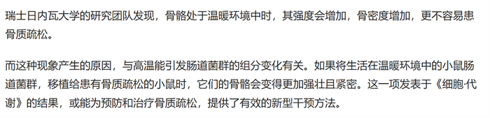

通过原文可知，温度对肠道菌群能产生影响，因此影响骨密度的根本原因是环境温度，D项削弱力度更强。

故正确答案为D。

---

### 第 38 题　qid 4637413 · 逻辑判断

一家全国连锁珠宝店的H分店，去年在当地投放大量电梯促销广告。广告投放后，客流量激增，净利润和前一年同期相比增长了30%。可见电梯促销广告对于提高企业利润十分有效。假设G、M、R、S是与H分店规模、位置等具有可比性的其他4家分店，则下列最能削弱上述论证的是：

- **A**. G分店，去年没有投放电梯广告，利润比H分店更高
- **B**. M分店，去年选择投放了报纸广告，销售额同比提升了30%
- **C**. R分店，去年投放大量电梯广告，销售额却比H分店低
- **D**. S分店，去年投放大量电梯广告，利润同比下降了10%　✅

**答案**：D

**官方解析**

第一步：找出论点和论据。
论点：电梯促销广告对于提高企业利润十分有效。
论据：H分店，去年在当地投放大量电梯促销广告。广告投放后，客流量激增，净利润和前一年同期相比增长了30%。
本题的论点和论据都在讨论投放电梯促销广告和企业利润之间的关系，论点论据话题一致，优先考虑否定论点。
第二步：逐一分析选项。
A项：G分店去年没有投放电梯广告，但是利润却比H分店更高，只能说明G分店去年利润高于H分店，但是没有说明投放电梯广告能否进一步提高G分店的利润，而题干论点讨论的是投放电梯广告能否提高利润，话题不一致，无法削弱，排除；
B项：M分店投放的是报纸广告，题干论点讨论的是电梯广告，话题不一致，无法削弱，排除；
C项：R分店投放了电梯广告，销售额比H分店低，论点讨论的是利润，该项给出的是销售额，话题不一致，无法削弱，排除；
D项：S分店投放了电梯广告但是利润同比下降了，说明投放电梯广告反而使得该店利润下降，举反例削弱论点，当选。
故正确答案为D。

---

### 第 39 题　qid 4637581 · 逻辑判断

熊蜂是一类多食性昆虫，与蜜蜂相比，熊蜂体型更大且多毛，颜色各异，大多有着经典的黄黑条纹，黑身红尾。人们发现，由于密集管理型农业系统的推广，熊蜂在这些地方开始衰落，有的种类已经灭绝，相对而言，普通蜜蜂的数量并没有明显减少。因此，相比普通蜜蜂，农田利用方式的改变对熊蜂的生存威胁更大。
以下哪项如果为真，最能支持上述结论？

- **A**. 蜜蜂采食会派出“侦查员”，回来后通过一种“摆动舞”告知蜂群食源在哪里，而熊蜂不会跳舞，因此大多独自采食
- **B**. 蜜蜂会在蜂巢内储藏大量食物，熊蜂的蜂巢储存食物量较少，一旦出现食物短缺，熊蜂就会处于劣势
- **C**. 蜜蜂属于大型化社群，而熊蜂属于小型化社群，这会导致基因分异度降低，更易受到寄生虫感染而大量死亡
- **D**. 密集型农田往往种植单一植物，如果植物不是处于花期，熊蜂就会因无法如蜜蜂般进行远距离飞行而岌岌可危　✅

**答案**：D

**官方解析**

第一步：找出论点和论据。
论点：相比普通蜜蜂，农田利用方式的改变对熊蜂的生存威胁更大。
论据：由于密集管理型农业系统的推广，熊蜂在这些地方开始衰落，有的种类已经灭绝，相对而言，普通蜜蜂的数量并没有明显减少。
论点和论据都在讨论熊蜂生存情况和农田利用方式的关系，话题一致，加强优先考虑补充论据。
第二步：逐一分析选项。
A项：该项讨论蜜蜂和熊蜂的采食方式，与题干论点讨论的话题无关，无法加强，排除；
B项：该项讨论蜜蜂和熊蜂储存食物的习惯不同，出现食物短缺时熊蜂更容易受到影响，但农田利用方式的改变是否会出现食物短缺情况文段并未提及，与题干论点讨论的话题无关，无法加强，排除；
C项：该项讨论熊蜂因基因分异度降低更易受到寄生虫感染，但农田利用方式的改变是否会有寄生虫感染的风险文段并未提及，与题干论点讨论的话题无关，无法加强，排除；
D项：该项指出密集型农田对熊蜂影响更大，熊蜂无法远距离飞行而岌岌可危，解释农田利用方式的改变为什么更能威胁熊蜂的生存，解释原因，可以加强，当选。
故正确答案为D。

---

### 第 40 题　qid 4637420 · 逻辑判断

不同的读者在阅读时，会对文章进行不同的加工编码，一种是浏览，从文章中收集观点和信息，使知识作为独立的单元输入大脑，称为线性策略；一种是做笔记，在阅读时会构建一个层次清晰的架构，就像用信息积木搭建了一个“金字塔”，称为结构策略。做笔记能够对文章的主要内容进行标注，因此与单纯的浏览相比，做笔记能够取得更优的阅读效果。
要使上述论证成立，还需基于以下哪一前提？

- **A**. 阅读效果的好坏取决于能否在阅读时抓住要点　✅
- **B**. 用浏览的方式进行阅读属于知识加工的线性策略
- **C**. 做笔记涉及到了更加复杂的认知加工过程
- **D**. 与线性策略相比，结构策略能够让学习提升速度

**答案**：A

**官方解析**

第一步：找出论点和论据。
论点：与单纯的浏览相比，做笔记能够取得更优的阅读效果。
论据：做笔记能够对文章的主要内容进行标注。
本题提问为“基于以下哪一前提”，优先考虑搭桥和必要条件。论点讨论的是做笔记能够取得更优的阅读效果，而论据讨论的是做笔记是在标注文章的主要内容，二者话题不一致，优先考虑搭桥，即建立“标注文章主要内容”和“阅读效果”的联系。
第二步：逐一分析选项。
A项：该项说阅读效果的好坏取决于能否在阅读时抓住要点，将“标注文章主要内容（抓住要点）”和“阅读效果”建立了联系，属于搭桥项，可以加强，当选；
B项：该项说的是浏览阅读属于知识加工的线性策略，而论点讨论的是笔记阅读的效果，话题不一致，无法加强，排除；
C项：该项说做笔记涉及到了更加复杂的认知加工过程，但通过这个复杂的认知加工过程能否取得更优的阅读效果并不明确，属于不明确项，无法加强，排除；
D项：该项说结构策略比线性策略更能提升学习速度，强调的是两种阅读方式在提升学习速度方面的差异，而论点讨论的是阅读效果，话题不一致，无法加强，排除。
故正确答案为A。

---
