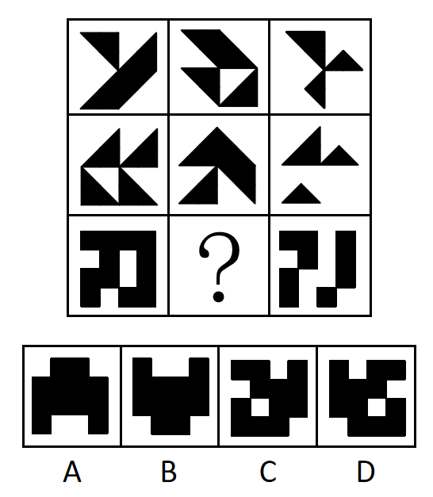
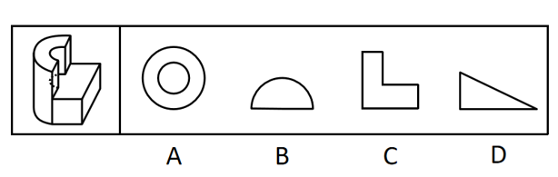
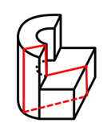
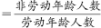
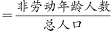
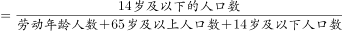
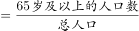
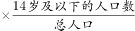
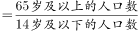

# 2022年国家公务员录用考试《行测》题（行政执法卷网友回忆版）

> 判断推理 · 40 题 · 国考 2022

## 材料 1

某超市从前到后整齐排列着7排货架，放置着文具、零食、调料、日用品、酒、粮油和饮料7类商品，每类商品占据一排。已知：

（1）酒类排在调料类之前；

（2）文具类和调料类中间隔着3排；

（3）粮油类在零食类之后，中间隔着2排；

（4）日用品类紧挨在文具类前一排或者后一排。

### 第 1 题　qid 4637304 · 类比推理

下列各项中，哪一类商品不可能排在第一排？

- **A**. 文具类
- **B**. 粮油类　✅
- **C**. 酒类
- **D**. 日用品类

**答案**：B

**官方解析**

第一步：分析题干条件。
（1）酒类排在调料类之前；
（2）文具类和调料类中间隔着3排；
（3）粮油类在零食类之后，中间隔着2排；
（4）日用品类紧挨在文具类前一排或者后一排。
第二步：根据题干条件进行推理。
根据条件（3）可知，粮油类排在零食类之后，中间隔着2排，故粮油类不可能排在第一排。
本题为选非题，故正确答案为B。

---

### 第 2 题　qid 4637319 · 逻辑判断

按照从前到后，下列哪项排列是可能的？

- **A**. 文具类、零食类、日用品类、酒类、调料类、粮油类、饮料类
- **B**. 零食类、文具类、日用品类、粮油类、饮料类、调料类、酒类
- **C**. 日用品类、文具类、零食类、酒类、粮油类、调料类、饮料类
- **D**. 日用品类、文具类、酒类、零食类、饮料类、调料类、粮油类　✅

**答案**：D

**官方解析**

第一步：分析题干条件。
（1）酒类排在调料类之前；
（2）文具类和调料类中间隔着3排；
（3）粮油类在零食类之后，中间隔着2排；
（4）日用品类紧挨在文具类前一排或者后一排。
第二步：根据题干条件进行推理。
本题题干信息确定，选项信息充分，优先考虑排除法。
根据条件（1）“酒类排在调料类之前”，排除B项。
根据条件（3）“粮油类在零食类之后，中间隔着2排”，排除A、C两项。
故正确答案为D。

---

### 第 3 题　qid 4637333 · 类比推理

零食类和文具类中间最多可能隔几排？

- **A**. 2排
- **B**. 3排
- **C**. 4排
- **D**. 5排　✅

**答案**：D

**官方解析**

第一步：分析题干条件。

（1）酒类排在调料类之前；

（2）文具类和调料类中间隔着3排；

（3）粮油类在零食类之后，中间隔着2排；

（4）日用品类紧挨在文具类前一排或者后一排。

第二步：根据题干分析选项。

题干设问是“最多可能隔几排”，应以最远的距离摆放零食类和文具类，可以从涉及零食类和文具类的条件开始推理。

根据条件（3）可知，零食类在粮油类之前，且中间隔着2排，即零食类肯定不可能在第5排之后，但零食类可能在第1排，故此时可以假设二者相隔最远的情况，即文具类在第7排，零食类在第1排，验证是否符合题干条件。当文具类在第7排，零食类在第1排时，根据条件（2）、条件（3）和条件（4）可得调料类在第3排、粮油类在第4排、日用品类在第6排，再结合条件（1）可得酒类在第2排，则饮料类在第5排。此时满足题干所有条件，可能为真，故零食类和文具类最多可能隔5排。

故正确答案为D。

---

### 第 4 题　qid 4637344 · 类比推理

如果零食类排在第1排，那么下列哪项中的两类商品不可能是相邻的两排？

- **A**. 文具类和粮油类
- **B**. 零食类和文具类
- **C**. 日用品类和酒类　✅
- **D**. 零食类和日用品类

**答案**：C

**官方解析**

第一步：分析题干条件。

（1）酒类排在调料类之前；

（2）文具类和调料类中间隔着3排；

（3）粮油类在零食类之后，中间隔着2排；

（4）日用品类紧挨在文具类前一排或者后一排。

第二步：根据题干条件进行推理。

若零食类排在第1排，根据条件（3）可知，粮油类在第4排，如下表：

提问为“不可能”，所以考虑代入法。

代入A项，若文具类和粮油类相邻，根据条件（2）可知，文具类在第3排，调料类在第7排；根据条件（4）可知，日用品类在第2排；根据条件（1）可知，酒类在第5排或第6排，题干条件均满足，可能为真，排除；

代入B项，若零食类和文具类相邻，则文具类在第2排；根据条件（2）可知，调料类在第6排；根据条件（4）可知，日用品类在第3排；根据条件（1）可知，酒类在第5排；则饮料类在第7排，题干条件均满足，可能为真，排除；

代入C项，若日用品类和酒类相邻，根据条件（4）可知，日用品类、酒类和文具类相邻，则此三类只能占据第5、6、7排的位置，而调料类和饮料类只能在第2排或第3排，与条件（1）矛盾，不可能为真，当选；

代入D项，若零食类和日用品类相邻，则日用品类在第2排；根据条件（4）可知，文具类在第3排；根据条件（2）可知，调料类在第7排；根据条件（1）可知，酒类在第5排或第6排，题干条件均满足，可能为真，排除。

本题为选非题，故正确答案为C。

---

### 第 5 题　qid 4637352 · 逻辑判断

如果饮料类排在第1排，则以下哪项是可能的？

- **A**. 零食类排在文具类前一排　✅
- **B**. 粮油类排在调料类前一排
- **C**. 日用品类排在文具类前一排
- **D**. 酒类排在文具类前一排

**答案**：A

**官方解析**

第一步：分析题干条件。

（1）酒类排在调料类之前；

（2）文具类和调料类中间隔着3排；

（3）粮油类在零食类之后，中间隔着2排；

（4）日用品类紧挨在文具类前一排或者后一排。

第二步：根据题干条件进行推理。

若饮料类排在第1排，如下表：

提问为“可能”，所以考虑代入法。

代入A项，若零食类排在文具前一排，根据条件（4）可知，零食类、文具类和日用品类先后相邻，可以分别放在第2排、第3排和第4排；根据条件（2）可知，调料类在第7排；根据条件（3）可知，粮油类在第5排；此时酒类放在第6排，符合条件（1）；与题干所有条件均不矛盾，可能为真，当选。

代入B项，若粮油类排在调料类前一排，结合条件（3）可知，零食类和调料类中间隔着3排，这与条件（2）矛盾，排除；

代入C项，若日用品类排在文具类前一排，根据条件（2），文具类和调料类中间隔着3排，假设文具类在调料类前，一共只有7排，则文具类只能在第3排，调料类在第7排，日用品类在第2排，如图所示，现只剩下第4、5、6排空缺，与条件（3）矛盾，排除；

假设文具类在调料类后，根据条件（1），调料类只能在第3排，文具类在第7排，酒类在第2排，根据条件（4），日用品类在第6排，如图所示，现只剩下第4、5排空缺，与条件（3）矛盾，排除；

代入D项，若酒类排在文具类前一排，根据条件（4）可知，酒类、文具类和日用品类先后相邻；根据条件（1）、（2）可知，文具类只能在调料类前面，且为文具类×××调料类，进一步推出文具类在第3排，调料类在第7排，酒类在第2排，日用品类在第4排，如图所示，现只剩下第5、6排空缺，与条件（3）矛盾，排除。

故正确答案为A。

---

### 第 6 题　qid 4637309 · 图形推理

从所给的四个选项中，选择最合适的一个填入问号处，使之呈现一定的规律性：

- **A**. A　✅
- **B**. B
- **C**. C
- **D**. D

**答案**：A

**官方解析**

图形元素组成相同，但无明显位置规律，考虑属性规律。观察发现，图形比较规整，考虑对称性。画出图形对称轴后发现对称轴依次逆时针旋转，故“？”处图形的对称轴应为竖直方向，只有A项符合。

故正确答案为A。

---

### 第 7 题　qid 4637313 · 图形推理

从所给的四个选项中，选择最合适的一个填入问号处，使之呈现一定的规律性：

- **A**. A
- **B**. B
- **C**. C　✅
- **D**. D

**答案**：C

**官方解析**

图形元素组成不同，无明显属性规律，优先考虑数量规律。图形封闭面较多，优先考虑数面，但数面无规律。再观察发现题干图形存在明显最大面和最小面，且二者形状相同，按照此规律只有C项符合。
故正确答案为C。

---

### 第 8 题　qid 4637321 · 图形推理

从所给的四个选项中，选择最合适的一个填入问号处，使之呈现一定的规律性：

- **A**. A
- **B**. B
- **C**. C
- **D**. D　✅

**答案**：D

**官方解析**

图形元素组成相同，但无明显位置规律。观察发现，题干所有图形黑球全部相连，优先考虑部分数。第一组图形中黑球的部分数均是1，第二组图形中黑球的部分数也均是1，故？处应选择一个黑球的部分数为1的图形，排除A项。通过黑球的部分数无法得出唯一答案，再看白球的部分数，观察发现，第一组图形中白球的部分数依次为3、2、1，第二组图形中白球的部分数依次为3、2、？，故？处应选择一个白球的部分数为1的图形，只有D项符合。
故正确答案为D。

---

### 第 9 题　qid 4637330 · 图形推理

从所给的四个选项中，选择最合适的一个填入问号处，使之呈现一定的规律性：

- **A**. A
- **B**. B
- **C**. C　✅
- **D**. D

**答案**：C

**官方解析**

图形元素组成相似，优先考虑样式规律。题干图形存在黑色和空白区域，优先考虑黑白运算。九宫格优先横向观察，第一行图形的黑白运算规律为：黑+黑=黑，黑+白=白，白+黑=白，白+白=白，第二行经验证符合此规律，第三行应用此规律，只有C项符合。
故正确答案为C。

---

### 第 10 题　qid 4637401 · 图形推理

下列纸盒的外表面展开图中，哪项折叠成的纸盒和其他三个不一样？

- **A**. A　✅
- **B**. B
- **C**. C
- **D**. D

**答案**：A

**官方解析**

将选项展开图标上序号，如下图所示（各选项面都相同，故相同的面用相同字母表示），逐一进行分析。

A项：以面e挨着黑块的点为起点进行顺时针画边（如下图所示），边1对应面f，边2对应面c，边3对应面d；

B项：以面e挨着黑块的点为起点进行顺时针画边（如下图所示），边1对应面f，边2对应面a，边3对应面d；

C项：以面e挨着黑块的点为起点进行顺时针画边（如下图所示），边1对应面f，边2对应面a，边3对应面d；

D项：以面e挨着黑块的点为起点进行顺时针画边（如下图所示），边1对应面f，边2对应面a，边3对应面d。

综上，只有A项与其他三项不同。

本题为选非题，故正确答案为A。

---

### 第 11 题　qid 4637364 · 图形推理

左图是给定的立体图形，将其从任一面剖开，以下哪项可能是该立体图形的截面？

- **A**. A
- **B**. B
- **C**. C　✅
- **D**. D

**答案**：C

**官方解析**

本题考查截面图，逐一分析选项。

A项：无法截出完整的圆环，排除；

B项：无法截出半圆，排除；

C项：如下图所示，可以截出，当选；

 

D项：长方体中无法截出直角三角形，排除。

故正确答案为C。

---

### 第 12 题　qid 4637338 · 图形推理

左图给定的是由相同正方体堆叠而成的多面体。该多面体可以由①、②和③三个多面体组合而成，以下哪项能填入问号处？

- **A**. A
- **B**. B
- **C**. C
- **D**. D　✅

**答案**：D

**官方解析**

本题考查立体拼合。

观察题干给出的多面体可知，图形可分为3层，由上至下第一层有2个小立方体，第二层有7个小立方体，第三层有9个小立方体。观察发现，图②共有3层，由上至下第一层有2个小立方体，第二层有1个小立方体，第三层有3个小立方体，可以拼合在多面体右侧，如下图所示，则题干多面体第二层还剩余6个小立方体，第三层还剩余6个小立方体。图①最下层的5个小立方体排列形状与题干多面体第二层剩余的形状相似，故图①最下层可以拼合在多面体第二层，最上层可以拼合在多面体第三层，如下图所示。根据凹凸一致的原则，剩余的形状只有D项符合。具体组合方式如下图所示：

故正确答案为D。

---

### 第 13 题　qid 4637310 · 图形推理

把下面的六个图形分为两类，使每一类图形都有各自的共同特征或规律，分类正确的一项是：

- **A**. ①②⑤，③④⑥　✅
- **B**. ①③④，②⑤⑥
- **C**. ①⑤⑥，②③④
- **D**. ①②④，③⑤⑥

**答案**：A

**官方解析**

本题为分组分类题目。元素组成不同，优先考虑属性规律。观察可知，题干图形比较规整，考虑对称性。图①②⑤一组，对称轴穿过图中的两个交点；图③④⑥一组，对称轴穿过图中的两条线，并且这两条线和对称轴垂直，对应A项。
故正确答案为A。

---

### 第 14 题　qid 4637320 · 图形推理

把下面的六个图形分为两类，使每一类图形都有各自的共同特征或规律，分类正确的一项是：

- **A**. ①②⑤，③④⑥
- **B**. ①②③，④⑤⑥
- **C**. ①③⑥，②④⑤
- **D**. ①④⑤，②③⑥　✅

**答案**：D

**官方解析**

本题为分组分类题目。元素组成不同，无明显属性规律，考虑数量规律。观察发现，图①和图⑥分别为“日”字、“田”字的变形图，考虑笔画数。图①④⑤为一笔画图形，图②③⑥为两笔画图形。即图①④⑤一组，图②③⑥一组。
故正确答案为D。

---

### 第 15 题　qid 4637369 · 图形推理

把下面的六个图形分为两类，使每一类图形都有各自的共同特征或规律，分类正确的一项是：

- **A**. ①②④，③⑤⑥
- **B**. ①③⑤，②④⑥
- **C**. ①④⑤，②③⑥　✅
- **D**. ①②⑥，③④⑤

**答案**：C

**官方解析**

本题为分组分类题目。元素组成不同，无明显属性规律，考虑数量规律。观察发现，每幅图形均有曲线与直线，且题干图形相切明显，考虑切点数量。图①④⑤的切点数均为1，图②③⑥的切点数均为0。即图①④⑤为一组，图②③⑥为一组。
故正确答案为C。

---

### 第 16 题　qid 4637372 · 定义判断

同种数罪是指行为人实施数个行为，符合数个性质相同的基本犯罪构成，触犯数个罪名相同的数罪。
根据上述定义，下列情形属于同种数罪的是：

- **A**. 甲为了自杀，在水中投入剧毒农药，其幼女误饮后身亡，甲见状也饮水身亡
- **B**. 乙为阻止警察抓捕其子，采用暴力手段妨害警察的执法行为，挥刀将警察砍成重伤
- **C**. 丙因缺钱，先是对某单位实施了盗窃，而后又使用暴力手段抢劫了素不相识的赵某
- **D**. 丁故意杀死了与其分手的女友张某，而后又杀死了在生意上与其竞争的李某　✅

**答案**：D

**官方解析**

第一步：找出定义关键词。
“行为人实施数个行为”、“符合数个性质相同的基本犯罪构成”、“触犯数个罪名相同的数罪”。
第二步：逐一分析选项。
A项：甲为了自杀，在水中投入剧毒农药，其幼女误饮后身亡，甲见状也饮水身亡，前者是幼女误饮身亡，后者是自杀，而自杀不是犯罪，不符合“符合数个性质相同的基本犯罪构成”，不符合定义，排除；
B项：乙采用暴力手段妨害警察的执法行为和挥刀将警察砍成重伤，是性质不相同的犯罪，不符合“符合数个性质相同的基本犯罪构成”、“触犯数个罪名相同的数罪”，不符合定义，排除；
C项：丙对某单位实施了盗窃和使用暴力手段抢劫赵某，是性质不相同的犯罪，不符合“符合数个性质相同的基本犯罪构成”、“触犯数个罪名相同的数罪”，不符合定义，排除；
D项：丁故意杀死了与其分手的女友张某和在生意上与其竞争的李某，丁实施的两个犯罪行为都是故意杀人，符合“行为人实施数个行为”、“符合数个性质相同的基本犯罪构成”、“触犯数个罪名相同的数罪”，符合定义，当选。
故正确答案为D。

---

### 第 17 题　qid 4637349 · 定义判断

刑事科学技术是公安、司法机关依照刑事诉讼法的规定，应用现代科学技术的成果，收集、检验和鉴定与犯罪活动有关的物证，为侦查、起诉、审判工作提供线索和证据的专门技术。
根据上述定义，下列没有体现刑事科学技术的是：

- **A**. 通过核对公司台账、采购合同等文件资料，确定犯罪嫌疑人行贿的具体数额　✅
- **B**. 交通肇事伤亡案件中，根据车辆损毁情况推断车辆的接触点，行驶方向及事故成因
- **C**. 应用声谱仪对手机录音与犯罪嫌疑人的语音进行声学特征分析，作出是否为同一人的判断
- **D**. 对警犬识别出来的可疑物进行成分鉴定，判断嫌疑人所携带的物品是否为违禁品

**答案**：A

**官方解析**

第一步：找出定义关键词。
“公安、司法机关依照刑事诉讼法的规定”、“应用现代科学技术的成果”、“收集、检验和鉴定与犯罪活动有关的物证”、“为侦查、起诉、审判工作提供线索和证据”。
第二步：逐一分析选项。
A项：核对公司台账、采购合同等文件资料，只涉及资料核对，不符合“应用现代科学技术的成果”，不符合定义，当选；
B项：交通肇事伤亡案件中，根据车辆损毁情况推断车辆的接触点、行驶方向及事故成因，涉及应用现代科学技术中的痕迹检验，符合“应用现代科学技术的成果”、“收集、检验和鉴定与犯罪活动有关的物证”、“为侦查、起诉、审判工作提供线索和证据”，符合定义，排除；
C项：应用声谱仪对手机录音与犯罪嫌疑人的语音进行声学特征分析，涉及应用现代科学技术中的声像技术，符合“应用现代科学技术的成果”、“为侦查、起诉、审判工作提供线索和证据”，手机录音是犯罪活动的物证，符合“收集、检验和鉴定与犯罪活动有关的物证”，符合定义，排除；
D项：对警犬识别出来的可疑物进行成分鉴定，涉及应用现代科学技术中的刑事理化检验，符合“应用现代科学技术的成果”、“为侦查、起诉、审判工作提供线索和证据”，鉴定后的携带物品可以作为犯罪活动的物证，符合“收集、检验和鉴定与犯罪活动有关的物证”，符合定义，排除。
本题为选非题，故正确答案为A。

---

### 第 18 题　qid 4637380 · 定义判断

在卫生经济学评价中，直接成本是指与疾病有关的预防、诊断、治疗和康复等所支出的费用，包括直接医疗成本和直接非医疗成本。直接医疗成本是指与医疗服务的提供直接相关的医疗成本，包括一切必要的医学检验和检查的成本，以及卫生服务管理成本和所有后续治疗成本。直接非医疗成本是指与医疗服务的提供直接相关的非医疗成本。
根据上述定义，下列没有体现上述成本的是：

- **A**. 患者李某前往医院看夜间急诊的出租车费
- **B**. 患者赵某因右臂受伤停工造成的工资损失　✅
- **C**. 在口腔科拔取智齿前，患者于某支付的血常规化验费
- **D**. 在陪同女儿去外地做手术期间，何某住宾馆支付的住宿费

**答案**：B

**官方解析**

第一步：找出定义关键词。
直接成本：“与疾病有关的预防、诊断、治疗和康复等所支出的费用”；
直接医疗成本：“与医疗服务的提供直接相关的医疗成本”、“包括一切必要的医学检验和检查的成本”、“卫生服务管理成本和所有后续治疗成本”；
直接非医疗成本：“与医疗服务的提供直接相关的非医疗成本”。
第二步：逐一分析选项。
A项：患者李某前往医院看夜间急诊的出租车费，是前往医疗机构治疗疾病所支付的非医疗费用，符合“与医疗服务的提供直接相关的非医疗成本”，符合“直接非医疗成本”的定义，排除；
B项：患者赵某因受伤停工造成的工资损失，不是为疾病所支出的费用，不符合“与疾病有关的预防、诊断、治疗和康复等所支出的费用”，不符合“直接成本”的定义，即也不符合“直接医疗成本”和“直接非医疗成本”的定义，当选；
C项：患者于某支付的血常规化验费，是为诊断疾病所支出的费用，符合“与医疗服务的提供直接相关的医疗成本”、“包括一切必要的医学检验和检查的成本”，符合“直接医疗成本”的定义，排除；
D项：何某陪同女儿做手术期间支付的住宿费，是为了治疗疾病所支付的非医疗费用，符合“与医疗服务的提供直接相关的非医疗成本”，符合“直接非医疗成本”的定义，排除。
本题为选非题，故正确答案为B。

---

### 第 19 题　qid 4637353 · 定义判断

在生物学、医学及其子科学的研究中，对从通常的生物学环境中分离出的生物体组织成分进行体外研究的实验称为体外实验；在活体生物机体之中进行研究的实验称为体内实验。
根据上述定义，下列属于体外实验的是：

- **A**. 在培养皿中对卵子授精后观察受精卵的发育情况　✅
- **B**. 在光学显微镜下观察枯草杆菌是否具有鞭毛
- **C**. 研究不同比例氮肥对玉米植株生长的影响
- **D**. 在试管中观察药剂与某溶液的化学反应

**答案**：A

**官方解析**

第一步：找出定义关键词。
体外实验：“从通常的生物学环境中分离出的生物体组织成分”、“进行体外研究”；
体内实验：“在活体生物机体之中进行研究”。
第二步：逐一分析选项。
A项：在培养皿中对卵子授精后观察受精卵的发育情况，“卵子”是从雌性体内分离出的生殖细胞，符合“从通常的生物学环境中分离出的生物体组织成分”，观察受精卵的发育情况，符合“进行体外研究”，符合“体外实验”，当选；
B项：观察枯草杆菌是否具有鞭毛，不是将鞭毛分离出来进行研究，不符合“从通常的生物学环境中分离出的生物体组织成分”，不符合“体外实验”，排除；
C项：研究不同比例氮肥对玉米植株生长的影响，是研究不同情况下的活体植株，符合“在活体生物机体之中进行研究”，符合“体内实验”，不符合“体外实验”，排除；
D项：在试管中观察药剂与某溶液的化学反应，“药剂”和“某溶液”都不是生物体组织成分，不符合“从通常的生物学环境中分离出的生物体组织成分”，不符合“体外实验”，排除。
故正确答案为A。

---

### 第 20 题　qid 4637365 · 定义判断

回指是在语法描写中用来指一个语言单位（回指语）从先前某个已表达的单位或意义（先行语）得出自身释义的过程或结果。回指可分为直接回指和间接回指。直接回指是指回指语与先行语存在明显共指关系，回指语是对先行语的重复。间接回指是指回指语与先行语之间的关系不明显，必须通过特定语境进行判断才能确立。
根据上述定义，下列画横线部分所反映的先行语和回指语之间的关系属于直接回指的是：

- **A**. 
要向<u>前来参会的人</u>表示感谢，<u>人家</u>来参会就是对我们的支持
　✅
- **B**. 
门口停着好些<u>三轮车</u>，许多<u>车夫</u>在那里闲站着

- **C**. 
<u>这房子</u>相当讲究，<u>门</u>是楠木做的

- **D**. 
他午饭前来到<u>餐馆</u>点了一杯咖啡，<u>服务员</u>是一位意大利人

**答案**：A

**官方解析**

第一步：找出定义关键词。
回指：“用来指一个语言单位（回指语）从先前某个已表达的单位或意义（先行语）得出自身释义的过程或结果”；
直接回指：“回指语与先行语存在明显共指关系”、“回指语是对先行语的重复”；
间接回指：“回指语与先行语之间的关系不明显”、“必须通过特定语境进行判断才能确立”。
第二步：逐一分析选项。
A项：选项中先行语是“前来参会的人”，回指语是“人家”，“人家”用来指代前文中提到的“前来参会的人”，符合“回指语与先行语存在明显共指关系”、“回指语是对先行语的重复”，符合“直接回指”定义，当选；
B项：选项中先行语是“三轮车”，回指语是“车夫”，前者是物，后者是人，二者间无明显的共指关系，“车夫”也不是对“三轮车”的重复，不符合“回指语与先行语存在明显共指关系”、“回指语是对先行语的重复”，不符合“直接回指”定义，排除；
C项：选项中先行语是“这房子”，回指语是“门”，前者是整体，后者是前者的部分，二者间无明显的共指关系，“门”也不是对“房子”的重复，不符合“回指语与先行语存在明显共指关系”、“回指语是对先行语的重复”，不符合“直接回指”定义，排除；
D项：选项中先行语是“餐馆”，回指语是“服务员”，前者是场所，后者是人，二者间无明显的共指关系，“服务员”也不是对“餐馆”的重复，不符合“回指语与先行语存在明显共指关系”、“回指语是对先行语的重复”，不符合“直接回指”定义，排除。
故正确答案为A。

---

### 第 21 题　qid 4637367 · 定义判断

总量指标动态数列是将反映某种社会经济现象的一系列总量指标按时间先后顺序排列形成的数列，可分为两类：（1）时期数列：每个指标都表示社会经济现象在一定时期内发展过程的总量，各指标值可以相加，指标数值的大小与时期长短有直接关系；（2）时点数列：每个指标都表示社会经济现象在某一时点（时刻）上的数量，各指标值不能相加，指标数值大小和“时点间隔”长短没有直接关系，每个指标通常都是定期（间断）登记取得的。
根据上述定义，下列属于时点数列的是：

- **A**. 
2016~2020年某市税收情况

- **B**. 
2017~2020年某公司员工人数情况

　✅
- **C**. 
2021年1~5月某地区城镇私营单位就业人员月均工资

- **D**. 
2020年某地区各季度电动汽车生产产量

**答案**：B

**官方解析**

第一步：找出定义关键词。
总量指标动态数列：“将反映某种社会经济现象的一系列总量指标按时间先后顺序排列”；
时期数列：“每个指标都表示社会经济现象在一定时期内发展过程的总量”、“各指标值可以相加”、“指标数值的大小与时期长短有直接关系”；
时点数列：“每个指标都表示社会经济现象在某一时点（时刻）上的数量”、“各指标值不能相加”、“指标数值大小和‘时点间隔’长短没有直接关系，每个指标通常都是定期（间断）登记取得的”。
第二步：逐一分析选项。
A项：选项中每项指标表示的是每一年的税收情况，属于一定时期内的总量，符合“每个指标都表示社会经济现象在一定时期内发展过程的总量”，符合“时期数列”定义，不符合“时点数列”定义，排除；
B项：选项中每项指标表示的是每一年的年末员工人数，“年末”是个时点，符合“每个指标都表示社会经济现象在某一时点（时刻）上的数量”，指标是年末的人数，不能相加，符合“各指标值不能相加”，且和时间长短没有直接关系，统计每年的年末数据，说明其是间断取得的，符合“指标数值大小和‘时点间隔’长短没有直接关系，每个指标通常都是定期（间断）登记取得的”，符合“时点数列”定义，当选； 
C项：选项中每项指标表示的是每月的平均工资，是一整月的工资平均值，不是某一时点（时刻）上的数量，不符合“每个指标都表示社会经济现象在某一时点（时刻）上的数量”，不符合“时点数列”定义，排除；
D项：选项中每项指标表示的是每一季度的生产产量，属于一定时期内的总量，符合“每个指标都表示社会经济现象在一定时期内发展过程的总量”，符合“时期数列”定义，不符合“时点数列”定义，排除。
故正确答案为B。

---

### 第 22 题　qid 4637404 · 定义判断

由于人类建设活动的破坏和干扰，生物群体原来连续成片的生活环境被割裂，形成分散的岛状甚至碎片状的生境，生境廊道是指连接破碎化生境并适宜生物生活、移动或扩散的通道，便于实现物种基因、能量、物质的流动。
根据上述定义，下列不属于生境廊道的是：

- **A**. 国家公园内，两棵参天古树跨过公路上方枝叶相连，金丝猴借助古树跨越公路。不同区域的金丝猴群可以保持接触
- **B**. 为了让野生象群在两个自然保护区之间迁移，管理者设计建成了迁移通道，避开村寨，并保证该区域范围内有丰富的水和食物资源
- **C**. 某地将过去严重污染的河道改造为河滨公园，架设了多座拱桥，美化了环境，方便了交通，还吸引了大量鸟类来此栖息　✅
- **D**. 为避免青藏铁路隔断藏羚羊迁徙路线，动物学家设计了桥梁下方、隧道上方及路基缓坡3种形式的野生动物通路

**答案**：C

**官方解析**

第一步：找出定义关键词。
“连接破碎化生境”、“适宜生物生活、移动或扩散的通道”、“便于实现物种基因、能量、物质的流动”。
第二步：逐一分析选项。
A项：两棵参天古树跨过公路上方枝叶相连，符合“连接破碎化生境”，不同区域的金丝猴群可以通过相连的枝叶来保持接触，实现基因、能量、物质的流动，符合“适宜生物生活、移动或扩散的通道”、“便于实现物种基因、能量、物质的流动”，符合定义，排除；
B项：管理者在两个自然保护区之间建立迁移通道，符合“连接破碎化生境”，野生象群可以通过迁移通道实现基因、能量、物质的流动，符合“适宜生物生活、移动或扩散的通道”、“便于实现物种基因、能量、物质的流动”，符合定义，排除；
C项：某地将严重污染的河道改造为河滨公园，但河滨公园只是鸟类的栖息地，没有体现对于破碎化生境的连接，不符合“连接破碎化生境”、“适宜生物生活、移动或扩散的通道”，不符合定义，当选；
D项：动物学家设计野生动物通路来避免藏羚羊的迁移路线被阻隔，符合“连接破碎化生境”，多种形式的野生动物通路可以让藏羚羊之间实现基因、能量、物质的流动，符合“适宜生物生活、移动或扩散的通道”、“便于实现物种基因、能量、物质的流动”，符合定义，排除。
本题为选非题，故正确答案为C。

---

### 第 23 题　qid 4637370 · 定义判断

除草剂必须具有良好的选择性，即在一定的用量与使用期内，能够防除杂草而又不伤害作物。其中，形态选择性是利用作物与杂草的形态结构差异而获得的选择性。生化选择性是利用作物和杂草在代谢过程中活化机制和解毒反应差异而产生的选择性。
根据上述定义，下列属于生化选择性的是：

- **A**. 将玉米种子事先用吸附性强的活性炭处理，通过这种保护物质避免或降低除草剂对种子的伤害
- **B**. 除草剂草甘膦用于作物播种、移栽或插秧之前，杀死已萌发的杂草，而这种除草剂在土壤中会很快失活或钝化，因此使用过后可安全地播种作物
- **C**. 小麦叶片窄、直立，表面有较厚的蜡质层和角质层，可使药液不易沾着，而杂草则因叶片宽、平、角质层薄，易接触除草剂而被杀伤
- **D**. 除草剂敌稗可被水稻含有的酰胺水解酶分解，而杂草不具备足量的酰胺水解酶，无法分解敌稗，易被杀死　✅

**答案**：D

**官方解析**

第一步：找出定义关键词。
形态选择性：“利用作物与杂草的形态结构差异而获得的选择性”；
生化选择性：“利用作物和杂草在代谢过程中活化机制和解毒反应差异而产生的选择性”。
第二步：逐一分析选项。
A项：通过活性炭处理的方式避免或降低除草剂对种子的伤害，没有体现除草剂在作物和杂草之间的选择性，不符合“利用作物和杂草在代谢过程中活化机制和解毒反应差异而产生的选择性”，不符合生化选择性的定义，排除；
B项：除草剂草甘膦可杀死土壤中的杂草，同时不会对土壤产生副作用，但这个过程发生在播种作物之前，没有体现除草剂在作物和杂草之间的选择性，不符合“利用作物和杂草在代谢过程中活化机制和解毒反应差异而产生的选择性”，不符合生化选择性的定义，排除；
C项：由于小麦和杂草的叶片形状及角质层的差异，除草剂可以选择性地杀伤杂草，体现了除草剂在作物和杂草之间的选择性，符合“利用作物与杂草的形态结构差异而获得的选择性”，符合形态选择性的定义，不符合生化选择性的定义，排除；
D项：水稻中含有的酰胺水解酶可以分解除草剂敌稗，而杂草因无法分解敌稗易被杀死，酰胺水解酶分解敌稗的过程体现了不同代谢过程中活化机制和解毒反应的差异，也体现了除草剂在作物和杂草之间的选择性，符合“利用作物和杂草在代谢过程中活化机制和解毒反应差异而产生的选择性”，符合生化选择性的定义，当选。
故正确答案为D。

---

### 第 24 题　qid 4637371 · 定义判断

归因不变性原则是指人们会寻找某一特定结果与特定原因之间的不变联系，如果某种特定原因在许多情境下总是与某种结果相伴，人们就会把特定结果归结于那一原因。归因折扣原则是指人们不完全相信某一现象的形成确是由于某种原因所导致，即某一特定原因在产生特定结果中的作用，如果存在其他似是而非的原因，应该“打折扣”。
根据上述定义，两类归因原则均没有体现的是：

- **A**. 电视广告中明星推销洗发水时，观众觉得她的一头秀发不完全是因为洗发水才有的
- **B**. 创业失败总会使创业者背负债务，创业者小罗这几年债台高筑，朋友认为他一定是创业失败了
- **C**. 在代理了诸多离婚案件后，律师小林统计发现离婚诉讼中大多数争议与财产纠纷有关　✅
- **D**. 对一系列盗窃案的分析显示，现场都出现过同一个男人，人们容易假定该男人就是犯罪嫌疑人

**答案**：C

**官方解析**

第一步：找出定义关键词。
归因不变性原则：“某种特定原因在许多情境下总是与某种结果相伴”、“人们就会把特定结果归结于那一原因”；
归因折扣原则：“人们不完全相信某一现象的形成确是由于某种原因所导致”。
第二步：逐一分析选项。
A项：该项中观众觉得明星的秀发不完全是因为洗发水才有的，符合“人们不完全相信某一现象的形成确是由于某种原因所导致”，符合归因折扣原则定义，排除；
B项：该项中创业失败总会导致创业者背负债务，符合“某种特定原因在许多情境下总是与某种结果相伴”，朋友认为小罗这几年债台高筑的原因是创业失败，符合“人们就会把特定结果归结于那一原因”，符合归因不变性原则定义，排除；
C项：该项中律师小林发现离婚诉讼中大多数争议与财产纠纷有关，并没有体现人们是否将离婚诉讼这个结果归结于财产纠纷，不符合“某种特定原因在许多情境下总是与某种结果相伴”、“人们就会把特定结果归结于那一原因”，不符合归因不变性原则定义，同时该项也没有体现人们对于财产纠纷这个原因的质疑，不符合“人们不完全相信某一现象的形成确是由于某种原因所导致”，不符合归因折扣原则定义，当选；
D项：该项中盗窃案的现场都出现了同一个男人，符合“某种特定原因在许多情境下总是与某种结果相伴”，人们容易假定该男人就是盗窃案的犯罪嫌疑人，符合“人们就会把特定结果归结于那一原因”，符合归因不变性原则定义，排除。
本题为选非题，故正确答案为C。

---

### 第 25 题　qid 4637373 · 定义判断

老年系数是指65岁及以上的人口数在总人口中所占的百分比；少年儿童系数是指14岁及以下人口数在总人口中的百分比；抚养比是指人口中非劳动年龄人数与劳动年龄人数之比（百分比），一般以15～64岁为劳动年龄，14岁及以下和65岁及以上称为非劳动年龄或被抚养年龄；老少比是65岁及以上的人口与14岁及以下人口数量之比（百分比）。
根据上述定义，下列说法正确的是：

- **A**. 一般情况下，抚养比大于老年系数与少年儿童系数之和　✅
- **B**. 当社会总人口不变，劳动年龄人数增加时，少年儿童系数就会减少
- **C**. 老年系数和少年儿童系数的乘积等于老少比
- **D**. 老少比通常表示的是每100名老年人对应多少少年儿童

**答案**：A

**官方解析**

第一步：找出定义关键词。 

老年系数：“65岁及以上的人口数在总人口中所占的百分比”；

少年儿童系数：“14岁及以下人口数在总人口中的百分比”；

抚养比：“人口中非劳动年龄人数与劳动年龄人数之比”、“一般以15～64岁为劳动年龄，14岁及以下和65岁及以上称为非劳动年龄或被抚养年龄”；

老少比：“65岁及以上的人口与14岁及以下人口数量之比”。

第二步：逐一分析选项。

A项：抚养比，老年系数＋少年儿童系数，劳动年龄人数一定是小于总人口的，所以一般情况下，抚养比大于老年系数与少年儿童系数之和，说法正确，当选；

B项：少年儿童系数，已知总人口不变，当劳动年龄人数增加时，65岁及以上人口数和14岁及以下人口数之和会减少，但14岁及以下人口数的具体情况不明，因此少年儿童系数不一定会减少，说法错误，排除；

C项：老年系数×少年儿童系数，老少比，两者之间不能划等号，说法错误，排除；

D项：题干中老少比是65岁及以上的人口数与14岁及以下人口数之比，正确的表述应该是每100名少年儿童对应多少老年人，说法错误，排除。

故正确答案为A。

---

### 第 26 题　qid 4637387 · 类比推理

贸易摩擦：出口下滑

- **A**. 醉酒驾驶：例行检查
- **B**. 行政处罚：违规生产
- **C**. 商业垄断：市场失灵　✅
- **D**. 职务犯罪：谋取私利

**答案**：C

**官方解析**

第一步：判断题干词语间逻辑关系。
因为贸易摩擦，所以出口下滑，二者为因果对应关系。
第二步：判断选项词语间逻辑关系。
A项：通过例行检查可以发现是否有人醉酒驾驶，二者并非因果对应关系，与题干逻辑关系不一致，排除；
B项：因为违规生产，所以遭受行政处罚，二者为因果关系，但词语顺序与题干相反，与题干逻辑关系不一致，排除；
C项：因为商业垄断，所以市场失灵，二者为因果关系，与题干逻辑关系一致，当选；
D项：职务犯罪的目的是谋取私利，二者为方式与目的对应关系，与题干逻辑关系不一致，排除。
故正确答案为C。

---

### 第 27 题　qid 4637376 · 类比推理

载歌：载舞

- **A**. 人云：亦云
- **B**. 且战：且退　✅
- **C**. 自作：自受
- **D**. 全心：全意

**答案**：B

**官方解析**

第一步：判断题干词语间逻辑关系。
“载歌”指一边唱歌，“载舞”是指一边跳舞，二者为并列关系，是两个同时进行的动作。
第二步：判断选项词语间逻辑关系。
A项：“人云”指人家说什么，“亦云”指自己也跟着说什么，两个动作存在时间先后顺序，与题干逻辑关系不一致，排除；
B项：“且战”指一边战斗，“且退”指一边向后移动，二者为并列关系，是两个同时进行的动作，与题干逻辑关系一致，当选；
C项：“自作”指自己做错了事，“自受”指自己承担不好的后果，二者存在时间先后顺序，与题干逻辑关系不一致，排除；
D项：“全心”和“全意”均是指用全部的精力，二者为近义关系，不是两个同时进行的动作，与题干逻辑关系不一致，排除。
故正确答案为B。

---

### 第 28 题　qid 4637377 · 类比推理

微型无人机：旋翼无人机

- **A**. 热带植物：香料植物　✅
- **B**. 集体决策：个人决策
- **C**. 形象思维：抽象思维
- **D**. 开环系统：闭环系统

**答案**：A

**官方解析**

第一步：判断题干词语间逻辑关系。
微型无人机是指尺寸只有手掌大小（约15cm）的飞行器，旋翼无人机是指用旋翼提供升力的无人驾驶飞行器，有的微型无人机是旋翼无人机，有的微型无人机不是旋翼无人机，有的旋翼无人机是微型无人机，有的旋翼无人机不是微型无人机，二者为交叉关系。
第二步：判断选项词语间逻辑关系。
A项：热带植物是指生活在热带地区的植物，香料植物是指能分泌和积累具有芳香气味物质的一类植物，有的热带植物是香料植物，有的热带植物不是香料植物，有的香料植物是热带植物，有的香料植物不是热带植物，二者为交叉关系，与题干逻辑关系一致，当选；
B项：集体决策是通过集体做出的决策，个人决策是指由一个人单独做出的决策，二者为并列关系，与题干逻辑关系不一致，排除；
C项：形象思维是以直观形象和表象为支柱的思维过程，抽象思维是指用词进行判断、推理并得出结论的过程，二者为并列关系，与题干逻辑关系不一致，排除；
D项：开环系统是指在一个控制系统中系统的输入信号不受输出信号影响的控制系统，闭环系统是指系统的输入影响输出，同时又受输出的直接或间接影响的系统，二者为并列关系，与题干逻辑关系不一致，排除。
故正确答案为A。

---

### 第 29 题　qid 4637399 · 类比推理

呼吸系统：生殖系统

- **A**. 生产计划：年度计划
- **B**. 观赏花卉：药用花卉
- **C**. 水面舰艇：巡洋舰艇
- **D**. 简牍公文：纸质公文　✅

**答案**：D

**官方解析**

第一步：判断题干词语间逻辑关系。
呼吸系统和生殖系统是两种不同的人体系统，二者是并列关系。
第二步：判断选项词语间逻辑关系。
A项：年度计划是对一年的工作、活动等所做的规划，不同的人、不同的工作的年度计划不同，生产计划是企业对生产任务作出的规划，有的生产计划是年度计划，有的生产计划不是年度计划，有的年度计划是生产计划，有的年度计划不是生产计划，二者是交叉关系，与题干逻辑关系不一致，排除；
B项：观赏花卉是具有观赏价值的花卉，药用花卉是能够防病、治病的花卉，有的观赏花卉是药用花卉，有的观赏花卉不是药用花卉，有的药用花卉是观赏花卉，有的药用花卉不是观赏花卉，二者是交叉关系，与题干逻辑关系不一致，排除；
C项：巡洋舰艇是一种在远洋活动的大型水面舰艇，与水面舰艇是种属关系，与题干逻辑关系不一致，排除；
D项：简牍公文是在竹简、木简、竹牍或木牍上书写的公文，与纸质公文是并列关系，与题干逻辑关系一致，当选。
故正确答案为D。

---

### 第 30 题　qid 4637415 · 类比推理

青铜器物：商朝礼器：文化遗产

- **A**. 科幻小说：微型小说：文学作品　✅
- **B**. 中式建筑：苏州园林：特色建筑
- **C**. 仰韶文化：半坡遗址：华夏文明
- **D**. 进口食品：速冻海鲜：冷冻食品

**答案**：A

**官方解析**

第一步：判断题干词语间逻辑关系。

青铜器物与商朝礼器构成交叉关系，同时二者均是文化遗产的一种，二者均与文化遗产构成种属关系。

第二步：判断选项词语间逻辑关系。

A项：科幻小说与微型小说构成交叉关系，同时二者均是文学作品的一种，二者均与文学作品构成种属关系，与题干逻辑关系一致，当选；

B项：苏州园林是一种中式建筑，二者为种属关系，中式建筑和特色建筑构成交叉关系，与题干逻辑关系不一致，排除；

C项：半坡遗址是新石器时代仰韶文化聚落遗址，二者为对应关系；仰韶文化是华夏文明的组成部分，二者为组成关系，与题干逻辑关系不一致，排除； 

D项：进口食品与速冻海鲜构成交叉关系，但进口食品与冷冻食品也构成交叉关系，与题干逻辑关系不一致，排除。

故正确答案为A。

注：青铜器物不仅是红铜与其他化学元素锡、铅等的合金，而且因为刚刚铸造完成的青铜器是金色，出土的青铜因为时间流失产生锈蚀后变为青绿色，所以被称为青铜。因此现在仅仅由红铜与其他化学元素锡、铅等物质制成的器具是不能称之为青铜器的，只能称之为铜器物。故题干青铜器物和文化遗产间是种属关系。

---

### 第 31 题　qid 4637392 · 类比推理

独幕剧：歌剧：话剧

- **A**. 流行歌曲：通俗歌曲：现代歌曲
- **B**. 自由体操：竞技体操：艺术体操
- **C**. 远程面试：单独面试：小组面试　✅
- **D**. 顺序作业：流水作业：平行作业

**答案**：C

**官方解析**

第一步：判断题干词语间逻辑关系。
独幕剧指不分幕的小型戏剧，歌剧指综合诗歌、音乐、舞蹈等艺术而以歌唱为主的戏剧，话剧指用对话和动作来表演的戏剧。歌剧和话剧为并列关系，同时二者与独幕剧均构成交叉关系。
第二步：判断选项词语间逻辑关系。
A项：通俗歌曲又叫流行歌曲，二者为全同关系，与题干逻辑关系不一致，排除；
B项：自由体操是竞技体操的一种，二者为种属关系；体操主要包括竞技体操、艺术体操、蹦床等项目，竞技体操和艺术体操构成并列关系，与题干逻辑关系不一致，排除；
C项：远程面试是根据面试的距离远近进行分类的面试类型，单独面试和小组面试是根据面试的主体数量进行分类的面试类型，单独面试和小组面试为并列关系，二者与远程面试均构成交叉关系，与题干逻辑关系一致，当选；
D项：顺序作业、流水作业、平行作业均为施工组织的作业方式，三者为并列关系，与题干逻辑关系不一致，排除。
故正确答案为C。

---

### 第 32 题　qid 4637403 · 类比推理

提起公诉：宣告判决：收押罪犯

- **A**. 撰写教案：课堂教学：解答疑问
- **B**. 手机点餐：外卖送餐：五星好评
- **C**. 违章行驶：交警处罚：行人受伤
- **D**. 方案设计：建筑施工：竣工验收　✅

**答案**：D

**官方解析**

第一步：判断题干词语间逻辑关系。
首先“提起公诉”，其次“宣告判决”，最后“收押罪犯”，三者为时间先后顺序的对应关系，且“提起公诉”的主体为检察院，“宣告判决”的主体为法院，“收押罪犯”的主体为监狱或看守所，三者主体不一致。
第二步：判断选项词语间逻辑关系。
A项：首先“撰写教案”，其次“课堂教学”，最后“解答疑问”，三者为时间先后顺序的对应关系，但三者的主体均为老师，与题干逻辑关系不一致，排除；
B项：首先“手机点餐”，其次“外卖送餐”，最后“五星好评”，三者为时间先后顺序的对应关系，但“手机点餐”和“五星好评”的主体均为顾客，与题干逻辑关系不一致，排除；
C项：首先“违章行驶”，其次“行人受伤”，最后“交警处罚”，三者为时间先后顺序的对应关系，但与题干顺序不一致，与题干逻辑关系不一致，排除；
D项：首先“方案设计”，其次“建筑施工”，最后“竣工验收”，三者为时间先后顺序的对应关系，且“方案设计”的主体为建筑设计研究院，“建筑施工”的主体为建设单位，“竣工验收”的主体为监理单位，三者主体不一致，与题干逻辑关系一致，当选。
故正确答案为D。

---

### 第 33 题　qid 4637400 · 类比推理

城市公园：公共设施：休闲娱乐

- **A**. 国宾礼炮：电子礼炮：国事庆祝
- **B**. 医用口罩：卫生用品：过滤空气　✅
- **C**. 升降舞台：露天剧场：演出空间
- **D**. 云服务器：虚拟技术：信息备份

**答案**：B

**官方解析**

第一步：判断题干词语间逻辑关系。
“城市公园”是一种“公共设施”，二者为种属关系；“城市公园”具有“休闲娱乐”的功能，二者为功能对应关系。
第二步：判断选项词语间逻辑关系。
A项：有的“国宾礼炮”是“电子礼炮”，有的“国宾礼炮”不是“电子礼炮”，有的“电子礼炮”是“国宾礼炮”，有的“电子礼炮”不是“国宾礼炮”，二者为交叉关系；“国宾礼炮”和“电子礼炮”都有用于“国事庆祝”的功能，三者构成功能对应关系，与题干逻辑关系不一致，排除；
B项：“医用口罩”是一种“卫生用品”，二者为种属关系；“医用口罩”具有“过滤空气”的功能，二者为功能对应关系，与题干逻辑关系一致，当选；
C项：“升降舞台”是“露天剧场”的组成部分，二者为组成关系；“露天剧场”是一种“演出空间”，二者为种属关系，与题干逻辑关系不一致，排除；
D项：“云服务器”运用了“虚拟技术”，二者不是种属关系；“云服务器”具有“信息备份”的功能，二者为功能对应关系，与题干逻辑关系不一致，排除。
故正确答案为B。

---

### 第 34 题　qid 4637382 · 类比推理

自然声源 对于 （    ） 相当于 （    ） 对于 煤炭

- **A**. 人工声源；植物遗骸
- **B**. 燕语莺声；矿石燃料　✅
- **C**. 传播介质；社区供暖
- **D**. 物体振动；地质危害

**答案**：B

**官方解析**

逐一代入选项。
A项：自然声源与人工声源二者是并列关系，煤炭是古代植物遗骸在地下经历了复杂的生物化学和物理化学变化逐渐形成的固体可燃性矿物，二者为原材料对应关系，前后逻辑关系不一致，排除；
B项：燕语莺声的意思是燕子的话语，黄鹂的歌声，燕语莺声是自然声源，二者为种属关系，煤炭是矿石燃料，二者为种属关系，前后逻辑关系一致，当选；
C项：自然声源需要在传播介质的条件下才能传播出声音，二者为必要条件对应关系，社区供暖需要煤炭来提供能量，二者为对应关系，但不是必要条件对应关系，前后逻辑关系不一致，排除；
D项：物体振动产生自然声源，二者为对应关系，煤炭与地质危害无明显逻辑关系，前后逻辑关系不一致，排除。
故正确答案为B。
备注：本题所给词语“自然声源”、“矿石燃料”与专有名词存在区别，如果按照专有名词的释义进行分析，则本题没有答案，所以解析时按照日常理解进行题干分析。

---

### 第 35 题　qid 4637384 · 类比推理

纪录片 对于 （    ） 相当于 （    ） 对于 客观题

- **A**. 电影；主观题
- **B**. 国产片；选择题
- **C**. 动画片；考试题
- **D**. 译制片；必答题　✅

**答案**：D

**官方解析**

逐一代入选项。
A项：有的纪录片是电影，有的纪录片不是电影，有的电影是纪录片，有的电影不是纪录片，二者为交叉关系。主观题是自由应答型试题，包括论述题、材料分析题等，客观题是固定应答型试题，包括判断题、选择题等，二者为矛盾关系，前后逻辑关系不一致，排除；
B项：有的纪录片是国产片，有的纪录片不是国产片，有的国产片是纪录片，有的国产片不是纪录片，二者为交叉关系。选择题是一种客观题，二者为种属关系，前后逻辑关系不一致，排除；
C项：纪录片是以真实生活为创作素材，以展现真实为本质的电影或电视艺术形式，动画片是在动画的基础上，由制作者赋予艺术内涵与思想内涵，所产生的艺术作品，二者为并列关系。有的考试题是客观题，有的考试题不是客观题，有的客观题是考试题，有的客观题不是考试题，二者为交叉关系，前后逻辑关系不一致，排除；
D项：译制片是指将原版影片的对白或解说翻译成另一种语言后，以该种语言配音混录或叠加字幕后的影片，有的纪录片是译制片，有的纪录片不是译制片，有的译制片是纪录片，有的译制片不是纪录片，二者为交叉关系。有的必答题是客观题，有的必答题不是客观题，有的客观题是必答题，有的客观题不是必答题，二者也为交叉关系，前后逻辑关系一致，当选。
故正确答案为D。

---

### 第 36 题　qid 4637402 · 逻辑判断

由于集合了榨汁机、豆浆机、料理机、研磨机等产品功能，破壁机近年来一直备受消费者青睐。某公司生产了R型和W型两款功能相同的破壁机，相比而言R型清洗更方便，W型噪音更小。上市三年后的数据显示，R型销量更好，所以公司认为消费者更喜欢易于清洗的破壁机产品。
以下哪项如果为真，最能削弱上述观点？

- **A**. 相比W型产品，R型网上促销力度更大，价格更具优势　✅
- **B**. W型产品的外观设计更美观，许多白领上班族都更倾向于买W型
- **C**. 和其他生产破壁机产品的公司相比，该公司具有更高的市场占有率
- **D**. R型和W型产品在全国的销售渠道一致，主要投放在超市、购物中心

**答案**：A

**官方解析**

第一步：找出论点和论据。
论点：消费者更喜欢易于清洗的破壁机产品。
论据：R型清洗更方便，W型噪音更小，上市三年后的数据显示，R型销量更好。
第二步：逐一分析选项。
A项：R型除了清洗更方便，价格也更具有优势，即消费者不一定是因为R型更易清洗而购买，也可能是因为价格便宜，可以削弱，当选；
B项：该项只是说明许多白领上班族倾向于买W型，但无法得知其他类型的消费者倾向于买哪种类型，不明确选项，不能削弱，排除；
C项：该项说的是该公司市场占有率更高，并未提及消费者是否更喜欢易于清洗的破壁机产品，与论点话题不一致，不能削弱，排除；
D项：该项说的是两款破壁机的销售渠道一致，并未提及消费者是否更喜欢易于清洗的破壁机产品，与论点话题不一致，不能削弱，排除。
故正确答案为A。

---

### 第 37 题　qid 4637385 · 逻辑判断

研究员让流行音乐爱好者听一组流行歌曲，同时用功能磁共振成像监测他们的大脑活动。在进行扫描前，研究员通过经颅磁刺激间接刺激或抑制大脑的奖赏回路。结果发现，在听音乐之前刺激奖赏回路会增加被试听音乐时的愉悦感，而抑制它则会降低愉悦感。因此，研究员认为，大脑的奖赏回路会影响人们对音乐的喜欢程度。
以下哪项如果为真，最能支持上述结论？

- **A**. 缺乏音乐快感的人听音乐时，其大脑奖赏回路的活动很微弱　✅
- **B**. 人们在享受美食时，也会出现大脑奖赏回路活动性升高
- **C**. 不喜欢流行音乐的人在听流行歌曲时，也会出现大脑奖赏回路的活动
- **D**. 音乐家喜欢的音乐，对“乐盲”而言可能是噪音，因为两者的大脑活动机制不同

**答案**：A

**官方解析**

第一步：找出论点和论据。
论点：大脑的奖赏回路会影响人们对音乐的喜欢程度。
论据：在听音乐之前刺激奖赏回路会增加被试听音乐时的愉悦感，而抑制它则会降低愉悦感。
本题论点论据都是在说明大脑的奖赏回路会影响人们对音乐的喜欢程度，论点论据话题一致，所以加强可以优先考虑补充论据，可以举例子，也可以解释原因。
第二步：逐一分析选项。
A项：举了缺乏音乐快感的人听音乐时其大脑奖赏回路的活动很微弱的例子说明了大脑奖赏回路确实可以影响人对音乐的喜欢程度，补充论据，当选；
B项：论点说的是大脑奖赏回路会影响人们对音乐的喜欢程度，该项说的是享受美食和大脑奖赏回路活动性的关系，没有提及对音乐的喜欢程度的话题，与论点话题不一致，无法加强，排除；
C项：不喜欢流行音乐的人在听流行歌曲时，也会出现大脑奖赏回路的活动，说明无论是否喜欢流行音乐，都会出现大脑奖赏回路活动，即大脑奖赏回路活动与人对音乐的喜欢程度无关，削弱项，无法加强，排除；
D项：没有具体说明对于两者的大脑活动机制不同是否与大脑奖赏回路的活动有关，不明确项，无法加强，排除。
故正确答案为A。

---

### 第 38 题　qid 4637413 · 逻辑判断

一家全国连锁珠宝店的H分店，去年在当地投放大量电梯促销广告。广告投放后，客流量激增，净利润和前一年同期相比增长了30%。可见电梯促销广告对于提高企业利润十分有效。假设G、M、R、S是与H分店规模、位置等具有可比性的其他4家分店，则下列最能削弱上述论证的是：

- **A**. G分店，去年没有投放电梯广告，利润比H分店更高
- **B**. M分店，去年选择投放了报纸广告，销售额同比提升了30%
- **C**. R分店，去年投放大量电梯广告，销售额却比H分店低
- **D**. S分店，去年投放大量电梯广告，利润同比下降了10%　✅

**答案**：D

**官方解析**

第一步：找出论点和论据。
论点：电梯促销广告对于提高企业利润十分有效。
论据：H分店，去年在当地投放大量电梯促销广告。广告投放后，客流量激增，净利润和前一年同期相比增长了30%。
本题的论点和论据都在讨论投放电梯促销广告和企业利润之间的关系，论点论据话题一致，优先考虑否定论点。
第二步：逐一分析选项。
A项：G分店去年没有投放电梯广告，但是利润却比H分店更高，只能说明G分店去年利润高于H分店，但是没有说明投放电梯广告能否进一步提高G分店的利润，而题干论点讨论的是投放电梯广告能否提高利润，话题不一致，无法削弱，排除；
B项：M分店投放的是报纸广告，题干论点讨论的是电梯广告，话题不一致，无法削弱，排除；
C项：R分店投放了电梯广告，销售额比H分店低，论点讨论的是利润，该项给出的是销售额，话题不一致，无法削弱，排除；
D项：S分店投放了电梯广告但是利润同比下降了，说明投放电梯广告反而使得该店利润下降，举反例削弱论点，当选。
故正确答案为D。

---

### 第 39 题　qid 4637420 · 逻辑判断

不同的读者在阅读时，会对文章进行不同的加工编码，一种是浏览，从文章中收集观点和信息，使知识作为独立的单元输入大脑，称为线性策略；一种是做笔记，在阅读时会构建一个层次清晰的架构，就像用信息积木搭建了一个“金字塔”，称为结构策略。做笔记能够对文章的主要内容进行标注，因此与单纯的浏览相比，做笔记能够取得更优的阅读效果。
要使上述论证成立，还需基于以下哪一前提？

- **A**. 阅读效果的好坏取决于能否在阅读时抓住要点　✅
- **B**. 用浏览的方式进行阅读属于知识加工的线性策略
- **C**. 做笔记涉及到了更加复杂的认知加工过程
- **D**. 与线性策略相比，结构策略能够让学习提升速度

**答案**：A

**官方解析**

第一步：找出论点和论据。
论点：与单纯的浏览相比，做笔记能够取得更优的阅读效果。
论据：做笔记能够对文章的主要内容进行标注。
本题提问为“基于以下哪一前提”，优先考虑搭桥和必要条件。论点讨论的是做笔记能够取得更优的阅读效果，而论据讨论的是做笔记是在标注文章的主要内容，二者话题不一致，优先考虑搭桥，即建立“标注文章主要内容”和“阅读效果”的联系。
第二步：逐一分析选项。
A项：该项说阅读效果的好坏取决于能否在阅读时抓住要点，将“标注文章主要内容（抓住要点）”和“阅读效果”建立了联系，属于搭桥项，可以加强，当选；
B项：该项说的是浏览阅读属于知识加工的线性策略，而论点讨论的是笔记阅读的效果，话题不一致，无法加强，排除；
C项：该项说做笔记涉及到了更加复杂的认知加工过程，但通过这个复杂的认知加工过程能否取得更优的阅读效果并不明确，属于不明确项，无法加强，排除；
D项：该项说结构策略比线性策略更能提升学习速度，强调的是两种阅读方式在提升学习速度方面的差异，而论点讨论的是阅读效果，话题不一致，无法加强，排除。
故正确答案为A。

---

### 第 40 题　qid 4637419 · 逻辑判断

在我国北方的春天，树木花粉是一种主要的过敏原，它们通过空气传播，不可避免地被吸入体内，使过敏体质人群产生或轻或重的炎症反应。与此同时，作为树木种子的杨柳飞絮同样使过敏人群感到不适。有研究人员认为，杨柳飞絮虽然会使呼吸道产生不适，但它不是过敏原，许多声称杨柳飞絮过敏的人实际上是花粉过敏。
以下哪项如果为真，不能支持研究人员的论证？

- **A**. 杨柳飞絮容易进入人的呼吸道，并粘附其上产生刺激作用，出现类似过敏的症状
- **B**. 杨柳飞絮漫天飞舞之时，正值很多种树开花之际，二者在时间上存在着重叠
- **C**. 杨柳飞絮含有油质和多糖类物质，作用在皮肤上可通过一系列反应变成一种过敏原　✅
- **D**. 由于被杨柳飞絮包裹携带，风媒花粉更容易进入呼吸道引起过敏反应

**答案**：C

**官方解析**

第一步：找出论点和论据。
论点：杨柳飞絮虽然会使呼吸道产生不适，但它不是过敏原，许多声称杨柳飞絮过敏的人实际上是花粉过敏。
论据：无。
本题只有论点，没有论据，因为是加强选非题，找到可证明杨柳飞絮不是过敏原或者花粉才是过敏原的三个选项排除即可。
第二步：逐一分析选项。
A项：杨柳飞絮让人出现类似过敏的症状，说明杨柳飞絮没有产生过敏反应，不是过敏原，补充论据，可以加强，排除；
B项：杨柳飞絮和树开花产生的花粉在时间上存在着重叠，说明引起人过敏的可能不是杨柳飞絮而是花粉，补充论据，可以加强，排除；
C项：杨柳飞絮可通过一系列反应变成一种过敏原，可以致敏，削弱论点，无法加强，当选； 
D项：花粉被杨柳飞絮包裹携带更容易引起过敏反应，说明引起人过敏的可能不是杨柳飞絮而是花粉，补充论据，可以加强，排除。
本题为选非题，故正确答案为C。

---
