# 2022年天津市公务员录用考试《行测》试题（网友回忆版）

> 判断推理 · 30 题 · 天津 2022

## 第 1 题　qid 5102657 · 图形推理

从所给的四个选项中，选择最合适的一个填入问号处，使之呈现一定的规律性：

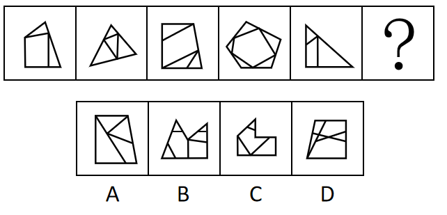

- **A**. A
- **B**. B
- **C**. C　✅
- **D**. D

**答案**：C

**官方解析**

元素组成不同，且无明显属性规律，考虑数量规律。题干图形被分割，封闭区域明显，优先考虑面数量，总的面数量依次为3、4、4、6、3无规律，故进一步考虑面的细化。观察发现题干中均存在明显最大面，且最大面的边数量与外框边数量相同，只有C项符合。
故正确答案为C。

---

## 第 2 题　qid 5102659 · 图形推理

把下面的六个图形分为两类，使每一类都有各自的共同特征或规律，分类正确的一项是：

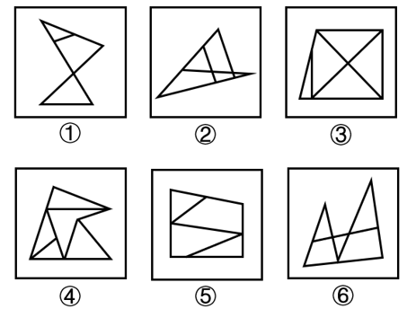

- **A**. ①②③，④⑤⑥
- **B**. ①③⑤，②④⑥
- **C**. ①⑤⑥，②③④　✅
- **D**. ①②⑥，③④⑤

**答案**：C

**官方解析**

本题为分组分类题目。元素组成不同，且无明显属性规律，考虑数量规律。观察发现，题干图①为“日”字变形图，图③为“田”字变形图，考虑笔画数。图①⑤⑥的奇点数均为2，为一笔画图形，图②③④的奇点数均为4，为两笔画图形。即图①⑤⑥一组，图②③④一组。
故正确答案为C。

---

## 第 3 题　qid 5102649 · 图形推理

把下面的六个图形分为两类，使每一类都有各自的共同特征或规律，分类正确的一项是：

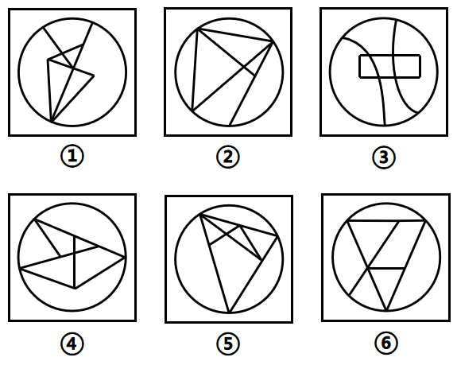

- **A**. ①②③，④⑤⑥
- **B**. ①④⑤，②③⑥　✅
- **C**. ①②⑥，③④⑤
- **D**. ①③⑥，②④⑤

**答案**：B

**官方解析**

本题为分组分类题目。元素组成不同，且无明显属性规律，考虑数量规律。观察图形发现，每幅图线条交叉明显，且都有圆形外框，内部线条与外框有明显相交，考虑数框上交点，图①④⑤框上交点为3，图②③⑥框上交点为4。
故正确答案为B。

---

## 第 4 题　qid 5102622 · 图形推理

左边给定的是纸盒的外表面，下面哪项能由它折叠而成？

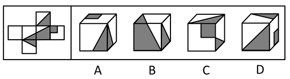

- **A**. A
- **B**. B　✅
- **C**. C
- **D**. D

**答案**：B

**官方解析**

将展开图标上序号（如下图所示），逐一进行分析。

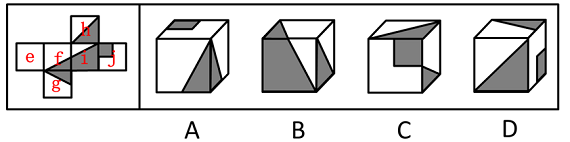

A项：选项由面f、面g和面j构成，其中面f和面j为相对面，不可能同时出现，选项与题干展开图不一致，排除；

B项：选项由面f、面i和面h构成，选项与题干展开图一致，当选；

C项：选项正面为面j，顶面为面h，右面为面f或面g，因为面j和面f为相对面，面h和面g为相对面，故右面不可能和面j或面h（即正面或顶面）同时出现，选项与题干展开图不一致，排除；

D项：选项正面为面h，右面为面j，顶面为面f或面g，因为面j和面f为相对面，面h和面g为相对面，故顶面不可能和面h或面j（即正面或右面）同时出现，选项与题干展开图不一致，排除。

故正确答案为B。

---

## 第 5 题　qid 5104943 · 图形推理

下列立体图形能由①②③组成的是：

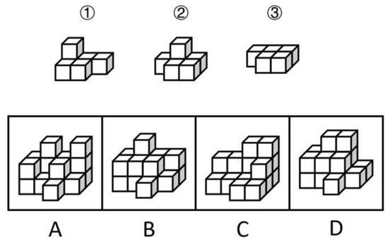

- **A**. A
- **B**. B
- **C**. C　✅
- **D**. D

**答案**：C

**官方解析**

本题考查立体拼合。如下图所示，C项可由①②③拼合而成。

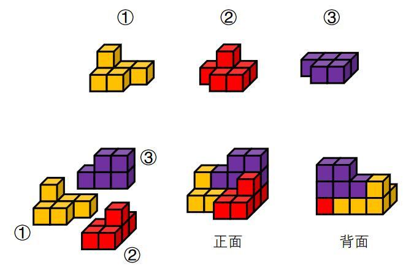

故正确答案为C。

---

## 第 6 题　qid 5104945 · 定义判断

标签效应是指当一个人被一种词语名称贴上标签时，他就会做出自我印象管理，使自己的行为与所贴的标签内容相一致。
根据上述定义，下列未体现标签效应的是：

- **A**. 高血压这一慢性疾病，在没有诊断出结果之前，症状并不明显，患者也没有感到不舒服。然而一旦确诊并告知，他们会立即紧张起来，并经常会有手脚麻木、睡眠不良等不适现象出现
- **B**. 王某小学时因体胖脸圆被同学取外号叫“王胖头”，当多年以后同学在聚会上回忆王某时，对他的认知还停留在他的外号上，即使王某已成功瘦身多年　✅
- **C**. 某艺人刚出道时将自己定位为搞笑谐星，出演了大量综艺节目和喜剧电影，深受观众喜欢
- **D**. 心理学家招募了一批纪律散漫的新兵，让他们每周给家里写信，说自己在前线如何听从指挥、奋勇杀敌，结果半年后这些士兵发生了很大的变化，他们真的像信上所说的那样去努力了

**答案**：B

**官方解析**

第一步：找出定义关键词。
“当一个人被一种词语名称贴上标签时”、“使自己的行为与所贴的标签内容相一致”。
第二步：逐一分析选项。
A项：患者一旦确诊高血压并被告知，说明此时他们被贴上“高血压患者”的标签，符合“当一个人被一种词语名称贴上标签时”，他们经常会有手脚麻木、睡眠不良等不适现象出现，说明他们认定自己是高血压患者，符合“使自己的行为与所贴的标签内容相一致”，符合定义，排除；
B项：王某因体胖脸圆被同学取外号叫“王胖头”，说明王某被贴上“胖”的标签，符合“当一个人被一种词语名称贴上标签时”，多年后同学对王某的认知还停留在他的外号上，说明这是同学对王某的印象，而非王某的自我印象，并且此时王某已成功瘦身，说明王某的行为与标签不一致，不符合“使自己的行为与所贴的标签内容相一致”，不符合定义，当选；
C项：某艺人将自己定位为搞笑谐星，说明该艺人被贴上“搞笑谐星”的标签，符合“当一个人被一种词语名称贴上标签时”，他后来出演了大量综艺节目和喜剧电影，符合“使自己的行为与所贴的标签内容相一致”，符合定义，排除；
D项：散漫的新兵被要求给家里写信说自己在前线如何听从指挥、奋勇杀敌，说明新兵们被贴上“服从”、“英勇”的标签，符合“当一个人被一种词语名称贴上标签时”，结果这些士兵真的像信上所说的那样去努力了，说明他们认定自己是英勇的士兵，符合“使自己的行为与所贴的标签内容相一致”，符合定义，排除。
本题为选非题，故正确答案为B。

---

## 第 7 题　qid 5104949 · 定义判断

独特价值效应是影响顾客对产品价格及其变化的接受程度，最终影响其购买决策的一个重要因素。具体表现为：当购买者对某种产品区别于可替代性竞争产品的特色评价越高，他对产品的价格将越不敏感。
根据上述定义，下列体现了独特价值效应的是：

- **A**. 目前，诺西那生钠是唯一能从根本上治疗脊髓性肌萎缩症的特效药，虽然一年药费几十万，但不少患病家庭仍选择贷款购买此款药物
- **B**. 在水果购买上，相对价格来说消费者更看重营养价值，因此某网购平台在年货节期间的水果消费上，车厘子与砂糖橘在销量上平分秋色
- **C**. 某家竹笋店尽管比市场均价高了一倍，但由于他家的竹笋都是每天现挖的，味道鲜美，因此一上架就被抢购一空　✅
- **D**. 某地服装批发市场已经营多年，因所售服装款式时尚、性价比高，吸引了全国各地的商家来此交易

**答案**：C

**官方解析**

第一步：找出定义关键词。
“区别于可替代性竞争产品”、“对产品的特色评价越高，对价格越不敏感”。
第二步：逐一分析选项。
A项：诺西那生钠是治疗脊髓性肌萎缩症的唯一特效药，患者购买是因为别无选择而非消费者觉得该药比其他可替代性竞争产品好，不符合“区别于可替代性竞争产品”，不符合定义，排除； 
B项：车厘子和砂糖橘属于不同样式的产品，两者并不是可替代性的竞争产品，不符合“区别于可替代性竞争产品”，不符合定义，排除；
C项：某家的竹笋都是每天现挖的，味道鲜美，符合“区别于可替代性竞争产品”，尽管比市场均价高了一倍，一上架就被抢购一空，说明消费者更在乎竹笋的质量，符合“对产品的特色评价越高，对价格越不敏感”，符合定义，当选；
D项：某地服装批发市场因所售服装款式时尚、性价比高，吸引了全国各地的商家购买，即商家购买的原因是款式和性价比，说明消费者对产品的价格是敏感的，不符合“对产品的特色评价越高，对价格越不敏感”，不符合定义，排除。
故正确答案为C。

---

## 第 8 题　qid 5104953 · 定义判断

贝格曼法则是指同一种类恒温动物的体形会随着生活地区纬度或海拔的增高而变大。这是由于随着体形的增大，动物的相对体表面积（即体表面积与动物体积之比）变小，从而导致体表发散比率变小，因而能更好地保存热量以适应高纬度地区的寒冷环境。艾伦法则是指同一分类单位的恒温动物的突出部分在低温环境中，有变短变小的趋势。
根据上述定义，下列体现了艾伦法则的是：

- **A**. 北极狼比热带的狼更肥一些，身体更接近于圆形
- **B**. 生活在印度的瘤牛因髻甲部有一肌肉组织隆起似瘤而得名，大而圆的瘤峰是一种沉积脂肪的肌肉组织，能在冬季物质匮乏时发挥一定的补给作用
- **C**. 生活在青藏高原的藏獒拥有高大的体形，强壮的体魄，但藏獒被大批贩运到内地后，体形等诸多性状发育较差
- **D**. 分布在北极地区的麝牛躯体与印度野牛一样魁梧，但耳朵特小，四肢奇短，几乎没有尾巴，看上去圆鼓鼓的，样子颇有点滑稽　✅

**答案**：D

**官方解析**

第一步：找出定义关键词。
 贝格曼法则：“同一种类恒温动物”、“体形会随着生活地区纬度或海拔的增高而变大”；
艾伦法则：“同一分类单位的恒温动物”、“突出部分在低温环境中，有变短变小的趋势”。
第二步：逐一分析选项。
A项：北极狼比热带的狼更肥，身体更接近于圆形，说的是整体体型较为圆润，但不明确突出部分的具体情况，不符合“突出部分在低温环境中，有变短变小的趋势”，不符合“艾伦法则”定义，排除；
B项：根据瘤牛“有一肌肉组织隆起似瘤”可知，瘤峰是瘤牛的突出部分，虽然该项表明瘤峰能在冬季发挥补给作用，但不明确瘤峰在冬季是否会变短变小，不符合“突出部分在低温环境中，有变短变小的趋势”，不符合“艾伦法则”定义，排除；
C项：青藏高原的藏獒被运到内地后，体形等诸多性状发育较差，但不明确藏獒的突出部分是否会变短变小，不符合“突出部分在低温环境中，有变短变小的趋势”，不符合“艾伦法则”定义，排除；
D项：北极地区的麝牛与印度野牛都属于牛科，符合“同一分类单位的恒温动物”，耳朵、四肢和尾巴都是突出部分，且北极地区的麝牛的这些突出部分都比较短小，符合“突出部分在低温环境中，有变短变小的趋势”，符合“艾伦法则”定义，当选。
故正确答案为D。

---

## 第 9 题　qid 5104955 · 定义判断

无方向性假设指变量间有一定的关系但不能预测关系的性质。如果没有理论依据，或者在文献资料和实践观察中没有证据来推测变量关系，研究者只能形成无方向性的假设。方向性假设预测了两个或两个以上变量间的关系及关系的性质。
根据上述定义，下列属于方向性假设的是：

- **A**. 在空间思维能力上男女生有差异
- **B**. 学龄儿童的低社会交往能力与母亲高的抑郁分值有关　✅
- **C**. 老人自我评价的自理能力与性别、社会文化背景有关系
- **D**. 大学教师的职业发展机会与成就感降低之间呈现显著相关关系

**答案**：B

**官方解析**

第一步：找出定义关键词。
无方向性假设：“变量间有一定的关系”、“不能预测关系的性质”；
方向性假设：“预测了两个或两个以上变量间的关系及关系的性质”。
第二步：逐一分析选项。
A项：“差异”说明男女的空间思维能力之间有关系，但没有说明具体的关系是什么，无法判断关系的性质，不符合“预测了两个或两个以上变量间的关系及关系的性质”，不符合“方向性假设”定义，排除；
B项：学龄儿童的“低”社会交往能力与母亲“高”的抑郁分值有关，不仅说明二者之间有关系，还明确表明是负相关，符合“预测了两个或两个以上变量间的关系及关系的性质”，符合“方向性假设”定义，当选；
C项：选项只能说明老人自我评价的自理能力与性别、社会文化背景有关系，但没有说明具体的关系是什么，无法判断关系的性质，不符合“预测了两个或两个以上变量间的关系及关系的性质”，不符合“方向性假设”定义，排除；
D项：指出大学教师的职业发展机会与成就感“降低”之间有关系，但没有明确表明具体的关系是什么，无法判断二者关系的性质，不符合“预测了两个或两个以上变量间的关系及关系的性质”，不符合“方向性假设”定义，排除。
故正确答案为B。

---

## 第 10 题　qid 5102678 · 定义判断

分系式是指在一个句法结构里至少有两个联合词组，这些联合词组的组成成分分别搭配，构成两套或两套以上平行的语法关系，表示两个或两个以上不同的意思。分别搭配是前一个联合结构里的并列成分依次分别跟后一个联合结构里的并列成分搭配，形成一种分系式的句法结构。
根据上述定义，下列不属于分别搭配的是：

- **A**. 裘马轻肥
- **B**. 卖官鬻爵　✅
- **C**. 吾盗天地之时利
- **D**. 井灶，人所饮食

**答案**：B

**官方解析**

第一步：找出定义关键词。
分系式：“两个联合词组”、“构成两套或两套以上平行的语法关系”；
分别搭配：“前一个联合结构里的并列成分”、“分别跟后一个联合结构里的并列成分搭配”。
第二步：逐一分析选项。
A项：“裘马轻肥”根据“肥马轻裘”而来，意思为身上穿着软皮衣，骑着肥壮骏马，其中“轻裘”和“肥马”分别为联合词组，“裘”和“马”并列，二者搭配；“轻”和“肥”并列，二者搭配，从而形成句法结构“裘马轻肥”，符合“前一个联合结构里的并列成分”、“分别跟后一个联合结构里的并列成分搭配”，符合“分别搭配”定义，排除；
B项：“卖官鬻爵”的意思是出卖官职爵位，其中“卖官”和“鬻爵”分别为联合词组，“卖”和“鬻”并列，“官”和“爵”并列，但两个联合词组中的并列成分并未搭配，不符合“前一个联合结构里的并列成分”、“分别跟后一个联合结构里的并列成分搭配”，不符合“分别搭配”定义，当选；
C项：“吾盗天地之时利”根据“吾盗天之时，吾盗地之利”而来，的意思是我偷盗天时和地利，其中“天之时”和“地之利”分别为联合词组，“天”和“地”并列，二者搭配；“时”和“利”并列，二者搭配，从而形成句法结构“天地之时利”，符合“前一个联合结构里的并列成分”、“分别跟后一个联合结构里的并列成分搭配”，符合“分别搭配”定义，排除；
D项：“井灶，人所饮食”根据“井，人所饮；灶，人所食”而来，意思是井是人打水喝的地方，灶台是人做饭吃的地方，其中“井，人所饮”和“灶，人所食”分别为联合词组，“井”和“灶”并列，二者搭配；“饮”和“食”并列，二者搭配，从而形成句法结构“井灶，人所饮食”，符合“前一个联合结构里的并列成分”、“分别跟后一个联合结构里的并列成分搭配”，符合“分别搭配”定义，排除。
本题为选非题，故正确答案为B。

---

## 第 11 题　qid 5102597 · 类比推理

镰刀：麦子

- **A**. 卷尺：刻度
- **B**. 锄头：大米
- **C**. 扳手：螺栓　✅
- **D**. 剪刀：钢材

**答案**：C

**官方解析**

第一步：判断题干词语间逻辑关系。
镰刀是割麦子的工具，二者为工具的对应关系。
第二步：判断选项词语间逻辑关系。
A项：卷尺上一定有刻度，二者不是工具对应，与题干逻辑关系不一致，排除；
B项：锄头是除草、翻土的工具，不是收割大米的工具，与题干逻辑关系不一致，排除；
C项：扳手是拧螺栓的工具，二者为工具的对应关系，与题干逻辑关系一致，当选；
D项：剪刀不是剪切钢材的工具，与题干逻辑关系不一致，排除。
故正确答案为C。

---

## 第 12 题　qid 5102602 · 类比推理

钻木：取火

- **A**. 指鹿：为马
- **B**. 以卵：击石　✅
- **C**. 画蛇：添足
- **D**. 骑虎：难下

**答案**：B

**官方解析**

第一步：判断题干词语间逻辑关系。
钻木取火的意思是用硬木棒对着木头摩擦，靠摩擦取火。拿“木”来“取火”，“木”是手用的工具，“取火”是目的，二者为工具和目的的对应关系。
第二步：判断选项词语间逻辑关系。
A项：指鹿为马的意思是指着鹿说是马，比喻故意颠倒黑白，混淆是非。“鹿”不是手用的工具，“为马”不是目的，与题干逻辑关系不一致，排除；
B项：以卵击石的意思是用鸡蛋碰石头，比喻不自量力，自取灭亡。拿“卵”来“击石”，“卵”是手用的工具，“击石”是目的，二者为工具和目的的对应关系，与题干逻辑关系一致，当选；
C项：画蛇添足的意思是画蛇时给它添上脚，比喻多此一举，弄巧成拙。“蛇”不是手用的工具，“添足”不是目的，与题干逻辑关系不一致，排除；
D项：骑虎难下的意思是骑在老虎背上不能下来，比喻事情进行中遇到困难，难以继续又无法罢手。“虎”不是手用的工具，“难下”不是目的，与题干逻辑关系不一致，排除。
故正确答案为B。

---

## 第 13 题　qid 5104887 · 类比推理

报案人：嫌疑人

- **A**. 获益人：买家　✅
- **B**. 卖家：买家
- **C**. 主角：配角
- **D**. 僧侣：道士

**答案**：A

**官方解析**

第一步：判断题干词语间逻辑关系。
有的报案人是嫌疑人，有的报案人不是嫌疑人，有的嫌疑人是报案人，有的嫌疑人不是报案人，二者为交叉关系。
第二步：判断选项词语间逻辑关系。
A项：有的获益人是买家，有的获益人不是买家，有的买家是获益人，有的买家不是获益人，二者为交叉关系，与题干逻辑关系一致，当选；
B项：卖家和买家为并列关系，与题干逻辑关系不一致，排除；
C项：主角和配角为并列关系，与题干逻辑关系不一致，排除；
D项：僧侣一般指佛教僧徒，与道士为并列关系，与题干逻辑关系不一致，排除。
故正确答案为A。

---

## 第 14 题　qid 5102606 · 类比推理

子时：时辰

- **A**. 物理：惯性
- **B**. 公民：群众
- **C**. 莲花：花卉　✅
- **D**. 碱性：石灰

**答案**：C

**官方解析**

第一步：判断题干词语间逻辑关系。
子时对应现代时间的23时至1时，是十二时辰的第一个时辰，二者为种属关系。
第二步：判断选项词语间逻辑关系。
A项：惯性是指物体保持静止状态或匀速直线运动状态的性质，是物理学名词，二者为对应关系，与题干逻辑关系不一致，排除；
B项：公民是指具有或取得某国国籍的人，群众指“人民大众”或“居民的大多数”，即与“人民”一词同义，另外也指“未加入党团的人”，表示“党员”与“群众”的区别，“干部”与“群众”的区别，二者不是种属关系，与题干逻辑关系不一致，排除；
C项：莲花是一种花卉，二者为种属关系，与题干逻辑关系一致，当选；
D项：石灰是碱性的，二者为属性对应关系，与题干逻辑关系不一致，排除。
故正确答案为C。

---

## 第 15 题　qid 5102617 · 类比推理

学生：知识：死记硬背

- **A**. 匠人：工艺：半路出家
- **B**. 作家：作品：炙手可热
- **C**. 老师：学生：谆谆教诲
- **D**. 农民：庄稼：揠苗助长　✅

**答案**：D

**官方解析**

第一步：判断题干词语间逻辑关系。
学生学习知识，二者为主宾结构，死记硬背是学习知识的一种负面方式，二者是方式对应关系。
第二步：判断选项词语间逻辑关系。
A项：匠人学习工艺，二者为主宾结构，半路出家不是学习工艺的一种方式，二者不是方式对应关系，与题干逻辑关系不一致，排除；
B项：作家写出作品，二者为主宾结构，炙手可热不是写出作品的一种方式，二者不是方式对应关系，与题干逻辑关系不一致，排除；
C项：老师教导学生，二者为主宾结构，谆谆教诲是教导学生的一种正面方式，与题干逻辑关系不一致，排除；
D项：农民种植庄稼，二者为主宾结构，揠苗助长是种植庄稼的一种负面方式，二者是方式对应关系，与题干逻辑关系一致，当选。
故正确答案为D。

---

## 第 16 题　qid 5102613 · 类比推理

碳：钻石：戒指

- **A**. 碳酸钙：珍珠：项链　✅
- **B**. 石墨：铅笔：画稿
- **C**. 刚玉：红宝石：装饰
- **D**. 硅：硅胶：石英砂

**答案**：A

**官方解析**

第一步：判断题干词语间逻辑关系。
碳是钻石的主要化学成分，二者是组成关系，钻石可以作为制作戒指的原材料，二者是原材料的对应关系。
第二步：判断选项词语间逻辑关系。
A项：碳酸钙是珍珠的主要化学成分，二者是组成关系，珍珠可以作为制作项链的原材料，二者是原材料的对应关系，与题干逻辑关系一致，当选；
B项：石墨是铅笔芯的主要化学成分，铅笔是绘制画稿的工具，二者为工具对应关系，与题干逻辑关系不一致，排除；
C项：红宝石是刚玉的一种，二者是种属关系，红宝石可以用来装饰，二者是功能的对应关系，与题干逻辑关系不一致，排除；
D项：硅胶和石英砂的主要化学成分都是二氧化硅，都含有硅元素，后两个词与第一个词均为组成关系，与题干逻辑关系不一致，排除。
故正确答案为A。

---

## 第 17 题　qid 5102596 · 类比推理

预约：核实：兑换

- **A**. 手术：插管：缝合
- **B**. 招聘：培训：辞职
- **C**. 设想：实践：总结　✅
- **D**. 募捐：调研：下乡

**答案**：C

**官方解析**

第一步：判断题干词语间逻辑关系。
先预约，后核实，然后兑换，如兑换纪念币，需要先和银行预约，然后在银行核实信息，最后兑换，三者为时间先后顺序的对应关系。
第二步：判断选项词语间逻辑关系。
A项：插管与缝合均属于手术的步骤，与手术之间并无时间先后顺序的对应关系，与题干逻辑关系不一致，排除；
B项：先招聘，后培训，最后辞职，三者为时间先后顺序的对应关系，与题干逻辑关系一致，保留；
C项：先设想，后实践，最后总结，三者为时间先后顺序的对应关系，与题干逻辑关系一致，保留；
D项：先调研，后募捐，下乡与二者无明显时间先后顺序，与题干逻辑关系不一致，排除。
比较题干和B、C两项，首先看主体，题干的“预约”和“兑换”可以是同一个主体的行为，而“核实”一般是另一个主体的行为，B、C两项没有能跟题干主体完全对应上的，有同学可能认为题干涉及两个不同主体，B项也涉及两个不同主体，这个角度没有看主体对应的具体位置，其实是非常不严谨的，不建议这么思考，容易掉坑；本题与其他题的不同之处在于，题干三个词是一件事从准备到完成的过程，C项也是从准备到完成的过程，而B项最后的辞职并非完成一件事的过程，故C项与题干逻辑关系更为一致，当选。
故正确答案为C。

---

## 第 18 题　qid 5102599 · 类比推理

工程师：研发：产品

- **A**. 飞行员：驾驶：飞机　✅
- **B**. 维修工：修理：锤子
- **C**. 保洁员：保持：环境
- **D**. 售货员：决定：售价

**答案**：A

**官方解析**

第一步：判断题干词语间逻辑关系。
“工程师”是职业，“研发产品”为工程师的工作内容，第一个词与后两个词为职业和工作内容的对应关系。
第二步：判断选项词语间逻辑关系。
A项：“飞行员”是职业，“驾驶飞机”为飞行员的工作内容，第一个词与后两个词为职业和工作内容的对应关系，与题干逻辑关系一致，当选；
B项：“维修工”是职业，但“修理锤子”并非维修工的工作内容，“锤子”是维修工修理时使用的工具，与题干逻辑关系不一致，排除；
C项：“保洁员”是职业，但“保持环境”并非保洁员的工作内容，保洁员的工作内容是保持环境整洁，与题干逻辑关系不一致，排除；
D项：“售货员”是职业，但“决定售价”并非售货员的工作内容，售货员的工作内容是售卖商品，与题干逻辑关系不一致，排除。
故正确答案为A。

---

## 第 19 题　qid 5102605 · 类比推理

羚羊 对于 （    ） 相当于 （    ） 对于 细菌

- **A**. 灵活 微小
- **B**. 猎人 医生
- **C**. 牦牛 病毒　✅
- **D**. 青草 细胞

**答案**：C

**官方解析**

逐一代入选项。
A项：灵活是羚羊的属性，微小是细菌的属性，前后均为属性对应关系，但前后词语逻辑顺序相反，前后逻辑关系不一致，排除；
B项：羚羊是猎人的猎物，二者为对应关系，但医生与细菌没有明显的逻辑关系，前后逻辑关系不一致，排除；
C项：羚羊和牦牛是两种不同的动物，病毒和细菌是两种不同的微生物，前后均为并列关系中的反对关系，前后逻辑关系一致，当选；
D项：青草是羚羊的食物，细胞是生物基本的结构和功能单位，细菌是一种单细胞生物，前后逻辑关系不一致，排除。
故正确答案为C。

---

## 第 20 题　qid 5102612 · 类比推理

执手相看泪眼 对于 （    ） 相当于 （    ） 对于 悼亡

- **A**. 托孤 老眼平生空四海
- **B**. 思乡 家祭无忘告乃翁
- **C**. 离别 十年生死两茫茫　✅
- **D**. 感怀 曾经沧海难为水

**答案**：C

**官方解析**

逐一代入选项。
A项：“执手相看泪眼”的含义是握着手互相瞧着，满眼泪花，表达了词人与恋人离别时难分难舍的情感，与“托孤”无明显逻辑关系；“老眼平生空四海”意为我平生就喜欢登高临远眺望四海，原词表达的是词人忧虑国事、痛心神州陆沉的悲愤之情，与“悼亡”无明显逻辑关系，前后逻辑关系不一致，排除；
B项：“执手相看泪眼”的含义是握着手互相瞧着，满眼泪花，表达了词人与恋人离别时难分难舍的情感，与“思乡”无明显逻辑关系；“家祭无忘告乃翁”意为（若收复中原失地的那一天到来时），举行家祭不要忘记告诉我，表达了诗人的爱国之情和对旧业光复的坚定信念，与“悼亡”无明显逻辑关系，前后逻辑关系不一致，排除；
C项：“执手相看泪眼”的含义是握着手互相瞧着，满眼泪花，表达了词人与恋人离别时难分难舍的情感，与“离别”构成对应关系；“十年生死两茫茫”意为你我夫妻生死诀别已经整整十年，表达了词人对爱侣悼亡后的思念之情，与“悼亡”构成对应关系，前后逻辑关系一致，当选；
D项：“执手相看泪眼”的含义是握着手互相瞧着，满眼泪花，表达了词人与恋人离别时难分难舍的情感，“感怀”是指有所感触而怀念，二者无明显逻辑关系；“曾经沧海难为水”意为经历过波澜壮阔的大海，别处的水再也不值得一观，暗喻了诗人对爱妻坚贞不渝的感情，是悼亡亡妻之作，与“悼亡”构成对应关系，前后逻辑关系不一致，排除。
故正确答案为C。

---

## 第 21 题　qid 5102668 · 逻辑判断

全球变暖带来的气候变化日益显著，成为影响人类发展前景的决定性因素之一。从观测和古气候重建的资料来看，人类活动对地球气候系统的影响已经非常深刻。数据显示，最近50年来的温升速率都不超过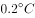/10年。即便从最近的20年来看，2011～2020年相对于1850～1900年平均值的温度变化是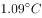，2001～2010年相对于1850～1900年平均值的温度变化是，10年的温升速率不超过。根据上述数据来看，全球变暖的步调并没有加速。

以下哪项为真，最能证明上述观点？

- **A**. 
最近20年相对于1980～1999年平均值的温度变化是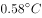，相对于1961～1990年平均值的温度变化是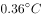

- **B**. 
目前多国出台政策强化降低GDP能源强度和二氧化碳强度的力度和幅度，按照现在人类控制排放的力度，全球气温升幅加快的可能性不大
　✅
- **C**. 
不同区域受到全球气候变暖带来的影响存在差异，比如1951～2019年中国的增温速度高于同期全球平均水平

- **D**. 
当前大气中的二氧化碳浓度高于200万年以来的任何时候，1900年以来的全球平均海平面上升速度比过去300年中任何一个世纪都快

**答案**：B

**官方解析**

第一步：找出论点和论据。

论点：全球变暖的步调并没有加速。

论据：最近50年来的温升速率都不超过/10年。即便从最近的20年来看，2011～2020年相对于1850～1900年平均值的温度变化是，2001～2010年相对于1850～1900年平均值的温度变化是，10年的温升速率不超过。

本题论点说的是全球没有加速变暖，论据说的是全球过去50年的温升速率都不超过/10年，论点和论据都在说温度，话题一致，加强优先考虑补充论据。

第二步：逐一分析选项。

A项：该项说的是最近20年对于1980～1999以及1961～1990年的平均值温度变化，1980～1999的平均值温度变化为，1961～1990的平均值温度变化为，说明1980～1999比1961～1990的温度要低，进而补充论据说明全球变暖的步调没有加速，可以加强，保留；

B项：该项说的是目前多国已经出台了政策，按照现在人类控制排放的力度，全球气温升幅加快的可能性不大，那全球温升速率加快的可能性也就不会大，进而全球变暖的步调也就不会加速，补充论据，可以加强，保留；

C项：该项说的是不同区域受到全球变暖带来的影响存在差异，强调的是全球变暖以后不同区域受到的影响，但题干在讨论全球变暖有没有加速，二者话题不一致，为无关项，无法加强，排除；

D项：该项说的是当前大气中的二氧化碳浓度比过去高，全球平均海平面上升速度比过去300年中任何一个世纪都快，说明全球变暖在加速，有削弱力度，无法加强，排除。

对比A、B两项，A补充的论据和题干论据类似，都是基于之前的数据得到的论点，B项是补充新的论据，B项比A项更明确。

故正确答案为B。

---

## 第 22 题　qid 5102595 · 逻辑判断

中微子自由流动对之后宇宙中结构的形成有很重要的影响，在中微子自由流动的尺度内，由于其具有很大的速度，所以不能被限制在势阱中，导致小尺度上结构的形成的难度加大。中微子在小尺度上对结构形成的抑制效应随着中微子质量的增加而增加，并提供了中微子质量最清晰的观测特征之一。
由此可以推出：

- **A**. 宇宙中结构的形成取决于中微子的自由流动
- **B**. 中微子由于速度很快所以不能被限制在势阱中
- **C**. 在小尺度上中微子的质量越大对结构形成的抑制作用越强　✅
- **D**. 中微子在小尺度上的质量提供了中微子质量的最清晰观测特征

**答案**：C

**官方解析**

日常结论题，根据题干信息逐一分析选项。
A项：题干表述为，中微子自由流动对宇宙中结构的形成“有很重要的影响”，而选项“取决于”表述过于绝对，无法推出，排除；
B项：题干表述为，“在中微子自由流动的尺度内”，由于其具有很大的速度，所以不能被限制在势阱中，而选项未表述该前提，无法推出，排除；
C项：题干表述为，中微子“在小尺度上”对结构形成的抑制效应“随着中微子质量的增加而增加”，即选项所表述的“在小尺度上”“中微子的质量越大”对结构形成的抑制作用“越强”，可以推出，当选；
D项：题干表述为，中微子在小尺度上“对结构形成的抑制效应”提供了中微子质量最清晰的观测特征之一，选项表述为，中微子在小尺度上的“质量”提供了中微子质量的最清晰观测特征，将“抑制效应”换成了“质量”，偷换概念，无法推出，排除。
故正确答案为C。

---

## 第 23 题　qid 5102644 · 逻辑判断

某流行病的差异研究中发现男性和女性之间的结果存在差异。研究人员注意到，虽然男性和女性感染该疾病的比例相似，但男性似乎更容易死于这种病毒诱发的肝炎。专家据此认为，免疫功能的性别差异可能是导致不同性别出现临床表现差异的原因。
以下哪项为真，最能削弱上述观点？

- **A**. 男性患者住院的概率比女性高20%左右，一旦住院接受治疗，男性患者更有可能需要进入重症监护室，而且入院后的死亡概率更高
- **B**. 随着该疾病患病人群的数据集不断扩大，支持存在差距的证据不断出现
- **C**. 近十年来与该疾病致病原理类似的病毒暴发的数据也显示在确诊的病例中，男性患者的死亡风险高于女性
- **D**. 参与研究的大多数男性都有酗酒抽烟的不良生活习惯，会容易引起其他疾病　✅

**答案**：D

**官方解析**

第一步：找出论点和论据。
论点：免疫功能的性别差异可能是导致不同性别出现临床表现差异的原因。
论据：某流行病的差异研究中发现男性和女性之间的结果存在差异。研究人员注意到，虽然男性和女性感染该疾病的比例相似，但男性似乎更容易死于这种病毒诱发的肝炎。
本题论点论据说的都是不同性别对某流行病的临床表现存在差异，话题一致，削弱优先考虑削弱论点，且论点中存在因果关系，还可以考虑因果倒置和他因削弱。
第二步：逐一分析选项。
A项：该项说男性患者住院概率和死亡概率更高，但未说明男女之间出现差异的“原因”，而论点讨论的是导致不同性别出现临床表现差异的“原因”，话题不一致，无法削弱，排除；
B项：该项说不断出现支持存在差距的证据，对论据有补充的效果，有加强的作用，无法削弱，排除；
C项：该项说与该疾病致病原理类似的病例中男性的死亡风险高于女性，但“类似”疾病与“该疾病”不能划等号，且该项未说明男女之间出现差异的“原因”，而论点讨论的是导致不同性别出现临床表现差异的“原因”，话题不一致，无法削弱，排除；
D项：该项说参与研究的大多数男性有不良的生活习惯，容易引起其他疾病，说明该流行病不同性别的临床表现差异不一定是免疫功能的性别差异导致的，也有可能是这部分男性的不良生活习惯导致的，他因削弱，可以削弱，当选。
故正确答案为D。

---

## 第 24 题　qid 5102598 · 逻辑判断

研究人员招募150名被试参与研究并将其分为两组，每组被试随机收到一个关于A公司形象的介绍材料，温暖型品牌材料为：A品牌为了进一步保持竞争力，常年致力于慈善事业，传达关爱的理念；效能型品牌的材料为：A品牌为了进一步保持竞争力，一直致力于新工艺和新技术的研发。两组被试分别阅读A品牌公司设计的怀旧广告文案与非怀旧广告文案，并填写广告口碑传播测量量表。结果表明，温暖型的品牌形象采用怀旧广告时需谨慎。
以下哪项如果为真，能够支持上述结论？

- **A**. 越来越多的企业选择打“感情牌”，采用怀旧型情感广告策略拉近和消费者之间的距离，促进品牌传播
- **B**. 温暖型品牌的怀旧广告降低了消费者的孤独感，消费者不用寻求社交联系来排解孤独，因此可能更少地使用社交网络展示产品　✅
- **C**. 消费者对怀旧广告会产生品牌历史感的感知，悠久的历史可以让消费者更加信任该品牌
- **D**. 对于效能型品牌，消费者对怀旧广告的感知更偏理性，怀旧广告会促进消费者的口碑传播

**答案**：B

**官方解析**

第一步：找出论点和论据。
论点：温暖型的品牌形象采用怀旧广告时需谨慎。
论据：无。
本题只有论点，没有论据。加强优先考虑补充论据，即解释论点成立的原因或举例子证明论点成立。
第二步：逐一分析选项。
A项：该项指出采用怀旧型情感广告策略可以促进品牌传播，说明怀旧型情感广告策略对品牌有好处，采用时无需谨慎，削弱论点，无法加强，排除；
B项：该项指出温暖型品牌的怀旧广告会降低消费者的孤独感，消费者可能更少地使用社交网络展示产品，也就是说消费者不会帮助品牌进行口碑宣传，也就不利于品牌的口碑传播，解释了为什么温暖型的品牌形象采用怀旧广告时需谨慎，解释原因，可以加强，当选；
C项：该项指出怀旧广告会让消费者更加信任该品牌，说明怀旧型情感广告策略对品牌有好处，采用时无需谨慎，削弱论点，无法加强，排除；
D项：该项指出怀旧广告会促进消费者对于“效能型”品牌的口碑传播，而论点讨论的是“温暖型”品牌，主体不一致，为无关项，无法加强，排除。
故正确答案为B。

---

## 第 25 题　qid 5102601 · 逻辑判断

44名大学生自愿参加一项羽毛球运动对大脑影响的实验，并被随机分成实验组和对照组两组。本实验包括3个流程：前测、羽毛球训练、后测。前测和后测的内容一样，均为脑结构扫描。只有实验组参加连续12周的羽毛球训练，对照组在此期间不进行任何有规律的体育运动。结果显示实验组训练后左侧下枕叶、颞中回灰质体积增加；而对照组颞中回灰质体积减小。研究人员表示，实验组被试的这种脑结构变化是羽毛球运动训练的特异性结果。
以下哪项如果为真，能够削弱上述观点？

- **A**. 灰质与知觉相关，羽毛球运动员的知觉敏感性显著高于普通成人
- **B**. 实验中观察到的对照组颞中回灰质体积减小属于大脑毕生发展的正常现象
- **C**. 他动训练对大脑中灰质的影响进行研究
- **D**. 本实验的干预时间较短，对以接受过十几年运动训练经历的被试为研究对象的实验来说，结果可比性较差　✅

**答案**：D

**官方解析**

第一步：找出论点和论据。
论点：实验组被试的这种脑结构变化是羽毛球运动训练的特异性结果。
论据：本实验包括3个流程：前测、羽毛球训练、后测。前测和后测的内容一样，均为脑结构扫描。只有实验组参加连续12周的羽毛球训练，对照组在此期间不进行任何有规律的体育运动。结果显示实验组训练后左侧下枕叶、颞中回灰质体积增加；而对照组颞中回灰质体积减小。
本题的论点是在讨论实验组训练后左侧下枕叶、颞中回灰质体积增加的这种脑结构变化是羽毛球训练的特异性结果，论据是在描述实验的过程，论点、论据话题一致，削弱优先考虑削弱论点，其次考虑削弱论据。
第二步：逐一分析选项。
A项：该项讨论的是灰质与知觉的关系，并将羽毛球运动员的知觉敏感性与普通成人进行对比，但没有提及实验组灰质的变化是否为羽毛球训练的特异性结果，话题不一致，为无关项，无法削弱，排除；
B项：该项讨论的是“对照组”的脑结构变化，而论点讨论的是“实验组”的脑结构变化与羽毛球训练的关系，主体不一致，为无关项，无法削弱，排除；
C项：该项讨论的是他动训练与大脑中灰质的关系，但没有提及羽毛球运动训练，话题不一致，为无关项，无法削弱，排除；
D项：该项指出题干中实验的干预时间较短，因此相比较于以参加过十几年训练的人为研究对象的实验来说，实验结果的可比性较差，说明该论据中的实验过程不够合理，从而指出实验的结论也不够准确，是从实验过程的角度进行削弱论据，可以削弱，当选。
故正确答案为D。

---

## 第 26 题　qid 5102640 · 逻辑判断

如今，越来越多的人深受失眠困扰。其中一些人上网寻找解决之道，比如一个名为“海军2分钟入睡法”的短视频，最近在网络上非常受欢迎。这种方法主要有5步：第1步是放松面部肌肉，包括舌头、下巴和眼周肌肉；第2步是尽可能放松肩膀、上臂和下臂，先放松其中一边，然后放松另一边；第3步是深呼气，放松胸口；第4步是依次放松大腿和小腿；第5步是用10秒来平复心绪。视频声称在2分钟内可以迅速入睡，并称这一方法可快速解决失眠难题。
以下哪项为真，最能削弱上述视频声称的观点？

- **A**. 对于失眠的人来说，最有效的“催眠剂”，就是保持规律的作息习惯
- **B**. 治疗失眠最主要的是认知行为治疗，这应该是治疗失眠的首选方法
- **C**. 该方法通过放松人的身体，从人的意识层面入手，让患者放松，调节自身情绪
- **D**. 该方法中的动作，可让人逐渐放松甚至入睡，但很快就会再次醒来　✅

**答案**：D

**官方解析**

第一步：找出论点和论据。
论点：“海军2分钟入睡法”的短视频声称在2分钟内可以迅速入睡，并称这一方法可快速解决失眠难题。
论据：无。
本题只有论点，没有论据，削弱优先考虑削弱论点，即“海军2分钟入睡法”不能解决失眠难题。
第二步：逐一分析选项。
A项：该项说的是最有效的催眠方式是保持规律的作息习惯，但无法说明题干论点的“海军2分钟入睡法”是否可以解决失眠难题，为不明确项，无法削弱，排除;
B项：该项说的是治疗失眠的首选方法是认知行为治疗，但无法说明题干论点的“海军2分钟入睡法”是否可以解决失眠难题，为不明确项，无法削弱，排除;
C项：该项说的是“海军2分钟入睡法”是如何使患者放松，调节情绪的，但未提及这样是否可以解决失眠难题，无法削弱，排除;
D项：该项说的是“海军2分钟入睡法”虽然可以助人入睡，但是很快会醒来，说明无法彻底解决失眠难题，削弱论点，可以削弱，当选。
故正确答案为D。

---

## 第 27 题　qid 5102608 · 逻辑判断

近日，研究人员招募了36名健康人员，并将其随机分配到发酵或高纤维饮食方案小组中，使其维持该方案10周，并在实验开展前3周、采取分组饮食后10周，以及结束实验饮食方案4周后，采集参与者血液和粪便样本进行分析。结果发现，发酵蔬菜会增加肠道微生物多样性。研究人员认为，发酵蔬菜可改变人体免疫状态，这有望为健康成年人减少炎症提供途径。
要得到上述研究推论，还需基于以下哪一前提?

- **A**. 食用高纤维饮食的被试体内肠道微生物的多样性保持稳定
- **B**. 肠道微生物群不仅与肠道免疫关系密切，而且影响全身免疫系统　✅
- **C**. 食用发酵蔬菜的被试血液样本中炎症蛋白的水平有所下降
- **D**. 发酵食品饮食组在实验过程中要大幅减少高纤维饮食的摄入

**答案**：B

**官方解析**

第一步：找出论点和论据。
论点：发酵蔬菜可改变人体免疫状态，这有望为健康成年人减少炎症提供途径。
论据：发酵蔬菜会增加肠道微生物多样性。
本题论点讨论的是“发酵蔬菜”和“人体免疫状态”、“减少炎症”的关系，论据讨论的是“发酵蔬菜”和“肠道微生物”的关系，话题不一致，且问法为“前提”，加强优先考虑搭桥，即可以建立“肠道微生物”和“人体免疫状态”之间的关系，也可以建立“肠道微生物”和“减少炎症”之间的关系。
第二步：逐一分析选项。
A项：选项指出食用高纤维饮食的被试体内肠道微生物的多样性保持稳定，选项说的食用高纤维饮食的被试体内肠道微生物的情况，但论点说的是发酵蔬菜与人体免疫状态、减少炎症的关系，话题不一致，无法加强，排除；
B项：选项指出肠道微生物群能影响全身免疫系统，建立了“肠道微生物”和“人体免疫状态”之间的关系，搭桥项，可以加强，当选；
C项：选项指出食用发酵蔬菜能降低炎症蛋白的水平，说明发酵蔬菜可以减少炎症，补充论据，可以加强，但加强力度比搭桥弱，排除；
D项：选项指出发酵食品饮食组在实验中要减少高纤维饮食的摄入，但减少高纤维饮食的摄入对实验结果的影响不明确，与发酵蔬菜能否改变人体免疫状态、减少炎症无关，无法加强，排除。
故正确答案为B。

---

## 第 28 题　qid 5102696 · 逻辑判断

英国第一次大规模人口迁移发生在6000年前。这些人的祖先大多来自一个被称为早期欧洲农民的群体。第二次迁徙发生在青铜时代早期，迁徙群体的祖先最终产生了英格兰和威尔士至少90%的基因组成。为了确定第三次人口迁移，研究团队对考古遗骸的近800个基因组进行了测序，发现从青铜时代早期到晚期英格兰和威尔士早期欧洲农民的血统平均比例从30%左右增加到36%左右。而在铁器时代，这一比例稳定在人口的近一半。研究人员据此表示，他们发现了法国人大规模移民至英国的证据。
要得到上述研究推论，还需基于以下哪一前提？

- **A**. 迁徙的法国人中拥有一定比例的早期欧洲农民血统　✅
- **B**. 青铜时代的中后期是英国与包括法国在内的西欧联系紧密的时期
- **C**. 基因测序利用的遗骸是在英国、西欧的考古遗址中发现的
- **D**. 今天生活在英格兰和威尔士的人比青铜时代早期的人拥有更多的早期欧洲农民血统

**答案**：A

**官方解析**

第一步：找出论点和论据。
论点：法国人大规模移民至英国。
论据：为了确定第三次人口迁移，研究团队对考古遗骸的近800个基因组进行了测序，发现从青铜时代早期到晚期英格兰和威尔士早期欧洲农民的血统平均比例从30%左右增加到36%左右。而在铁器时代，这一比例稳定在人口的近一半。
本题论点说的是法国人移民至英国，论据说的是从青铜时代到铁器时代，英格兰和威尔士的早期欧洲农民的血统平均比例增加，论点论据话题不一致，且问法为“前提”，加强优先考虑搭桥，即建立“法国人”与“早期欧洲农民”之间的联系。
第二步：逐一分析选项。
A项：该项指出迁徙的法国人中拥有一定比例的早期欧洲农民血统，建立了“法国人”与“早期欧洲农民”之间的联系，搭桥项，可以加强，当选；
B项：该项指出青铜时代的中后期，英国与法国联系紧密，但论点讨论的是法国人是否移民到了英国，话题不一致，无法加强，排除；
C项：该项指出遗骸是在英国、西欧的考古遗址中发现的，讨论的是遗址的地点，并未说明法国人是否移民到英国，无法加强，排除；
D项：该项将当前生活在英格兰和威尔士的人的早期欧洲农民血统与青铜时代的进行对比，并未说明法国人是否移民到英国，无法加强，排除。
故正确答案为A。

---

## 第 29 题　qid 5102610 · 类比推理

有的金属是固体；铁是金属；所以，铁是固体。
下列选项与题干所犯逻辑错误相同的是：

- **A**. 有的犯罪行为严重地扰乱了社会秩序；李四的行为严重地扰乱了社会秩序；所以，李四的行为是犯罪
- **B**. 有的科学家没有受过正规高等教育；张三没有受过高等教育；所以，张三是科学家
- **C**. 有的没有辨别能力的人是精神病人；精神病人没有民事行为能力；所以，没有民事行为能力的人没有辨别能力
- **D**. 有的带刺的花是玫瑰；花园里的花带刺；所以，花园里的花是玫瑰　✅

**答案**：D

**官方解析**

第一步：分析题干推理形式。
题干推理形式为：有的a（金属）是b（固体）；c（铁）是a（金属）；所以，c（铁）是b（固体）。
第二步：逐一分析选项。
A项：推理形式为“有的a（犯罪行为）是b（严重地扰乱了社会秩序）；c（李四的行为）是b（严重地扰乱了社会秩序）；所以，c（李四的行为）是a（犯罪）”，与题干所犯逻辑错误不同，排除；
B项：推理形式为“有的a（科学家）不是b（受过正规高等教育）；c（张三）不是b（受过高等教育）；所以，c（张三）是a（科学家）”，与题干所犯逻辑错误不同，排除；
C项：推理形式为“有的a（没有辨别能力的人）是b（精神病人）；b（精神病人）是c（没有民事行为能力）；所以，c（没有民事行为能力的人）是a（没有辨别能力）”，与题干所犯逻辑错误不同，排除；
D项：推理形式为“有的a（带刺的花）是b（玫瑰）；c（花园里的花）是a（带刺）；所以，c（花园里的花）是b（玫瑰）”，与题干所犯逻辑错误相同，当选。
故正确答案为D。

---

## 第 30 题　qid 5102611 · 类比推理

某个项目小组成员中有人没有参加培训心得交流会，小张、小王、小李、小宋中有一人没有参加，其他三人都参加了。公司人事在询问时，他们做了如下回答。小张：小王没有来。小王：我不但参加了，而且还分享了学习心得。小李：我早来了一会儿，但因为有事提前走了。小宋：如果小李来了，那就是我没来。
如果他们中只有一人说谎，则没有参加培训心得交流会的是：

- **A**. 小张
- **B**. 小王
- **C**. 小李
- **D**. 小宋　✅

**答案**：D

**官方解析**

本题属于真假推理题。

第一步：找出题干矛盾命题。

小张：小王没有来；

小王：小王来了；

小李：小李来了；

小宋：小李来了小宋没来。

分析题干条件，小张和小王说的话为矛盾关系，必然一真一假。

第二步：看其余。

根据题干条件已知只有一人说谎，故小李和小宋说的都是真话，即小李参加了，小李参加是对小宋说的话进行肯前，肯前必肯后，即小宋没有参加。

故正确答案为D。

---
