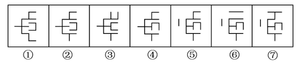
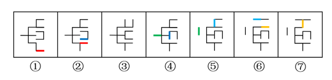
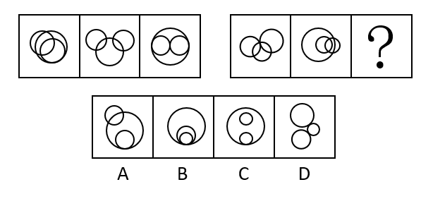
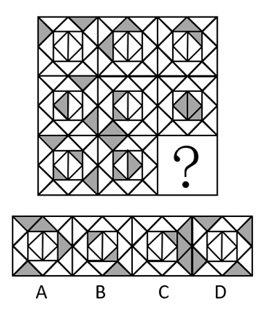
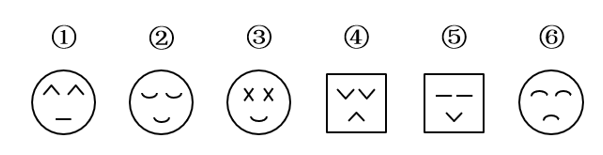
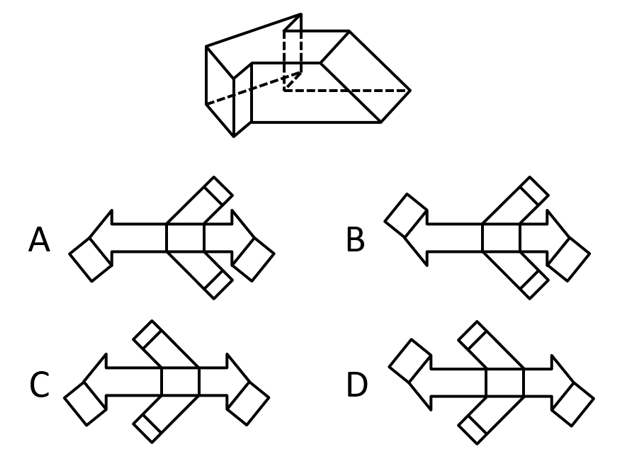
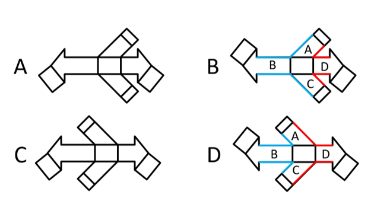

# 2022年山东省公务员录用考试《行测》试题（网友回忆版）

> 判断推理 · 30 题 · 山东 2022

## 第 1 题　qid 4662372 · 图形推理

以下七个图形去掉哪一个后，剩下的图形能呈现一定的规律性？

- **A**. ③　✅
- **B**. ④
- **C**. ⑤
- **D**. ⑥

**答案**：A

**官方解析**

元素组成相同，优先考虑位置规律。通过相邻比较发现，此题的规律为：后一幅图在前一幅图的基础上移动一根线条，应去掉图③。

故正确答案为A。

---

## 第 2 题　qid 4662396 · 图形推理

从所给的四个选项中，选择最合适的一个填入问号处，使之呈现一定的规律性：

- **A**. A
- **B**. B　✅
- **C**. C
- **D**. D

**答案**：B

**官方解析**

元素组成不同，属性、数量均无规律，考虑特殊规律。观察发现，每个图形均由3个圆构成，优先考虑图形间关系。第一组图形，图1两两之间分别为相交、相切、相交，图2两两之间分别为相交、相交、相离，图3两两之间分别为相切、相切、相切。第二组图应用此规律，图1两两之间分别为相交、相切、相交，图2两两之间分别为相交、相交、相离，？处应为3个图形两两相切，只有B项符合。
故正确答案为B。

---

## 第 3 题　qid 4662400 · 图形推理

从所给的四个选项中，选择最合适的一个填入问号处，使之呈现一定的规律性：

- **A**. A
- **B**. B
- **C**. C　✅
- **D**. D

**答案**：C

**官方解析**

题干图形中均出现了若干黑色三角形，优先考虑黑色三角形的数量。九宫格优先横向看，第一行每幅图形的黑色三角形数量均为2，第二行每幅图形的黑色三角形数量均为3，第三行每幅图形的黑色三角形数量均为4，排除B项；继续观察发现，第一行每幅图形中，黑色三角形之间的关系分别是相离、相交于点、相交于线，第二行经验证符合此规律，第三行应用此规律，故？处应选择黑色三角形之间的关系为相交于线的图形，只有C项符合。
故正确答案为C。

---

## 第 4 题　qid 4662403 · 图形推理

把下面的六个图形分为两类，使每一类图形都有各自的共同特征或规律，分类正确的一项是：

- **A**. ①③④，②⑤⑥
- **B**. ①②⑤，③④⑥
- **C**. ①④⑤，②③⑥
- **D**. ①③⑤，②④⑥　✅

**答案**：D

**官方解析**

本题为分组分类题目。元素组成不同，且无明显属性规律，考虑数量规律。题干图形内部都出现了多个小元素，优先考虑元素的个数。图①③⑤内部均有2种元素，图②④⑥内部均有1种元素，即图①③⑤为一组，图②④⑥为一组。
故正确答案为D。

---

## 第 5 题　qid 4662406 · 图形推理

下面哪一项是给定立体图形的外表面展开图？

- **A**. A
- **B**. B　✅
- **C**. C
- **D**. D

**答案**：B

**官方解析**

本题为空间重构题。观察选项，主要区别在于左侧的矩形和上下两侧的图形位置不同。

如果左侧的矩形和右侧的矩形都在同一侧，则立体图形无法拼合，排除A、C两项；

再次观察题干立体图形，对比B、D两项，如下图所示，B项中面A与面B、面C与面B、面A与面D、面C与面D的公共边等长且完全重合，而D项中面A与面B、面C与面B、面A与面D、面C与面D的公共边并不等长，无法完全重合，排除D项。

故正确答案为B。

---

## 第 6 题　qid 4662383 · 定义判断

变量是指在数量上或质量上可变的事物属性。在实验中由实验者所操纵的、对被试的行为产生影响的变量称为自变量；由自变量的变化而产生变化的变量为因变量。一项实验要求被试先识记一串不规则字符串，间隔三分钟后默写之前所识记的内容，考查被试单位时间内对材料记忆的正确率。
根据上述定义，本实验中属于因变量的是：

- **A**. 所识记字符串的长度
- **B**. 要求识记的字符串的难易程度
- **C**. 被试默写字符串的正确率　✅
- **D**. 实验过程中的噪声干扰

**答案**：C

**官方解析**

第一步：找出定义关键词。
变量：“在数量上或质量上可变的事物属性”；
自变量：“由实验者所操纵的”、“对被试的行为产生影响的变量”；
因变量：“由自变量的变化而产生变化的变量”。
第二步：逐一分析选项。
A项：实验中，需要被试识记的字符串的长度是由实验者决定的，符合“由实验者所操纵的”，同时字符串的长度这一变量会影响到被试对材料记忆的正确率，符合“对被试的行为产生影响的变量”，符合“自变量”定义，不符合“因变量”定义，排除；
B项：实验中，需要被试识记的字符串的难易程度是由实验者决定的，符合“由实验者所操纵的”，同时字符串识记的难易程度这一变量会影响到被试对材料记忆的正确率，符合“对被试的行为产生影响的变量”，符合“自变量”定义，不符合“因变量”定义，排除；
C项：实验中，“被试默写字符串的正确率”等于“被试默写字符串的正确数量”除以“字符串的实际总数量”，即该数据是因“被试默写字符串的正确数量”和“字符串的实际总数量”的变化而产生变化的变量，而“被试默写字符串的正确数量”又会因“所识记字符串的长度、难易程度”等由实验者操纵的自变量的变化而变化，因此，“被试默写字符串的正确率”符合“由自变量的变化而产生变化的变量”，符合“因变量”定义，当选；
D项：实验中，噪声干扰是否由实验者所操纵、是否会对被试的行为产生影响均不明确，不符合“自变量”定义，同时，噪声干扰是否会因某些自变量的变化而产生变化也不确定，不符合“因变量”定义，因此实验过程中的噪声干扰不符合任何一个定义，排除。
故正确答案为C。

---

## 第 7 题　qid 4662419 · 定义判断

臆造商标是指由无固定含义的臆造词构成的商标，此类商标来自当事人的独创，不会与任何商品或服务发生联系，因而具有较强的显著性。任意商标是指由与指定商品或服务无关的非独创性词汇构成的商标。
根据上述定义，下列属于臆造商标的是：

- **A**. 使用“梦乡”作为床垫的商标
- **B**. 使用“每尔”作为饮料的商标　✅
- **C**. 使用“桃花”作为电器的商标
- **D**. 使用“快好”作为药品的商标

**答案**：B

**官方解析**

第一步：找出定义关键词。
臆造商标：“无固定含义的臆造词构成的商标”、“来自当事人的独创”、“不会与任何商品或服务发生联系”、“具有较强的显著性”；
任意商标：“与指定商品或服务无关的非独创性词汇构成的商标”。
第二步：逐一分析选项。
A项：“梦乡”具有自身固定的含义，指睡熟时候的境界，属于非独创性词汇，且梦乡和床垫之间存在一定的相关性，不符合“无固定含义的臆造词构成的商标”、“来自当事人的独创”、“不会与任何商品或服务发生联系”，不符合“臆造商标”定义，排除；
B项：“每尔”无固定含义，且每尔与饮料之间不存在相关性，符合“无固定含义的臆造词构成的商标”、“来自当事人的独创”、“不会与任何商品或服务发生联系”、“具有较强的显著性”，符合“臆造商标”定义，当选；
C项：“桃花”具有自身固定的含义，指一种植物，属于非独创性词汇，且桃花和电器之间不存在相关性，符合“与指定商品或服务无关的非独创性词汇构成的商标”，符合“任意商标”定义，不符合“臆造商标”定义，排除；
D项：“快好”具有自身固定的含义，指即将痊愈，属于非独创性词汇，且快好和药品之间存在一定的相关性，不符合“无固定含义的臆造词构成的商标”、“来自当事人的独创”、“不会与任何商品或服务发生联系”，不符合“臆造商标”定义，排除。
故正确答案为B。

---

## 第 8 题　qid 4662386 · 定义判断

公民的籍贯应为本人出生时祖父的居住地（户口所在地）；祖父去世的，填写祖父去世时的户口所在地；祖父未落常住户口的，填写祖父应落常住户口的地方；公民登记籍贯后，祖父又迁移户口的，该公民的籍贯不再随之更改。弃婴，如果籍贯不详，应将收养人籍贯或收养机构所在地作为其籍贯。外国人经批准加入中华人民共和国国籍的，填写其入籍前所在国家的名称。
根据上述定义，下列关于籍贯的判断正确的是：

- **A**. 甲出生时，其祖父的户口所在地为M省N县；5岁时全家随祖父迁居至M省O市；上大学后，其户口迁至M省U市，则甲的籍贯应为M省O市
- **B**. 乙为弃婴，3个月大时被送至X省Y市福利院，14岁时被籍贯为E省F县的养父母收养，养父的父亲自出生后一直居住在E省G县，从未迁居，则乙的籍贯应为E省G县
- **C**. 丙出生在P省Q县，现户籍所在地为R省S市。丙出生时，其祖父母和父母的户口所在地为P省T市，则丙的籍贯应为P省T市　✅
- **D**. 丁出生在J国，后加入K国国籍，而后又加入中华人民共和国国籍，则丁的籍贯应为J国

**答案**：C

**官方解析**

第一步：找出定义关键词。
“公民的籍贯应为本人出生时祖父的居住地（户口所在地）”、“祖父去世的，填写祖父去世时的户口所在地”、“祖父未落常住户口的，填写祖父应落常住户口的地方”、“公民登记籍贯后，祖父又迁移户口的，该公民的籍贯不再随之更改”、“弃婴，如果籍贯不详，应将收养人籍贯或收养机构所在地作为其籍贯”、“外国人经批准加入中华人民共和国国籍的，填写其入籍前所在国家的名称”。
第二步：逐一分析选项。
A项：甲出生时，其祖父的户口所在地为M省N县，虽后面全家又迁居，户口也改变了，但根据“公民的籍贯应为本人出生时祖父的居住地（户口所在地）”和“公民登记籍贯后，祖父又迁移户口的，该公民的籍贯不再随之更改”可知，甲的籍贯应为M省N县，判断不正确，排除；
B项：乙为弃婴，根据“弃婴，如果籍贯不详，应将收养人籍贯或收养机构所在地作为其籍贯”可知，乙的籍贯应该为X省Y市或E省F县，判断不正确，排除；
C项：丙出生时其祖父的户口所在地为P省T市，根据“公民的籍贯应为本人出生时祖父的居住地（户口所在地）”可知，丙的籍贯应为P省T市，判断正确，当选；
D项：丁出生在J国，后加入K国国籍，而后又加入中华人民共和国国籍，根据“外国人经批准加入中华人民共和国国籍的，填写其入籍前所在国家的名称”可知，丁的籍贯应为K国，判断不正确，排除。
故正确答案为C。

---

## 第 9 题　qid 4662391 · 逻辑判断

方剂是指由中药配伍组成的处方，一般由君药、臣药、佐药和使药4部分组成。其中，君药是起主要治疗作用的药物，臣药是针对兼病或兼症起主要治疗作用的药物，佐药是协助君药或臣药以加强治疗作用的药物，使药是引导方中药物直达病所的药物或调和方中诸药作用的药物。
现有一伤寒患者，其治疗从发汗解表，宣肺平喘之法，下列由甘草、麻黄、杏仁和桂枝四味药组成的方剂中，属于臣药的是：

- **A**. 甘草，调和麻黄、杏仁之治疗功效
- **B**. 杏仁，肃肺降气，可以助平咳喘
- **C**. 麻黄，发汗解表以散风寒，宣发肺气以平咳喘
- **D**. 桂枝，温通经脉，以主治寒滞引发的关节疼痛　✅

**答案**：D

**官方解析**

第一步：找出定义关键词。
方剂：“由中药配伍组成的处方”；
君药：“起主要治疗作用的药物”；
臣药：“针对兼病或兼症起主要治疗作用的药物”；
佐药：“协助君药或臣药以加强治疗作用的药物”；
使药：“引导方中药物直达病所的药物”、“调和方中诸药作用的药物”。
第二步：逐一分析选项。
A项：甘草在方剂中的作用是“调和麻黄和杏仁的治疗功效”，即调和方剂中其他药物的作用，符合“调和方中诸药作用的药物”，因此甘草是“使药”，不属于“臣药”，排除；
B项：杏仁在方剂中的作用是“助平咳喘”，即加强止咳平喘的作用，符合“协助君药或臣药以加强治疗作用的药物”，因此杏仁是“佐药”，不属于“臣药”，排除；
C项：麻黄在方剂中的作用是“发汗解表以散风寒，宣发肺气以平咳喘”，正是伤寒患者的主要治疗方法，符合“起主要治疗作用的药物”，因此麻黄是“君药”，不属于“臣药”，排除；
D项：桂枝在方剂中的作用是“治疗伤寒引起的关节疼痛”，关节疼痛是由伤寒引发的兼症，符合“针对兼病或兼症起主要治疗作用的药物”，属于“臣药”，当选。
故正确答案为D。

---

## 第 10 题　qid 4662392 · 定义判断

傍同作用是指通过渲染与自己有亲近关系的人十分杰出，来掩盖和弥补自己在此方面的不足，从而获得心理上的平衡和短暂的轻松，而并不是通过自身的努力去弥补不足之处的心理。
有一则故事，在一个果园里，葡萄挂满了枝头，吸引许多狐狸前来。
下列情形最能体现傍同作用的是：

- **A**. 第一只狐狸看到自己在葡萄架下显得如此渺小，便伤心地想，如果像大象那样高，就可以想吃什么就吃什么
- **B**. 第二只狐狸仰望着葡萄架，心想，既然我吃不到葡萄，别的狐狸肯定也吃不到，我也没什么好遗憾的了
- **C**. 第三只狐狸是一位女士，她找来一位男士，男士借助梯子帮她摘到了葡萄
- **D**. 第四只狐狸说：“我的朋友已经吃过了，谁说只有猴子才能吃到果子，狐狸也一样行！”　✅

**答案**：D

**官方解析**

第一步：找出定义关键词。
“通过渲染与自己有亲近关系的人十分杰出”、“来掩盖和弥补自己在此方面的不足，从而获得心理上的平衡和短暂的轻松”。
第二步：逐一分析选项。
A项：第一只狐狸看到自己的渺小独自伤心，并感慨如果自己高大就好了，不符合“通过渲染与自己有亲近关系的人十分杰出”、“来掩盖和弥补自己在此方面的不足，从而获得心理上的平衡和短暂的轻松”，不符合定义，排除； 
B项：第二只狐狸通过自我安慰来寻求内心的满足与平衡，不符合“通过渲染与自己有亲近关系的人十分杰出”、“来掩盖和弥补自己在此方面的不足，从而获得心理上的平衡和短暂的轻松”，不符合定义，排除； 
C项：第三只狐狸通过寻求外界的帮助摘到葡萄，不符合“通过渲染与自己有亲近关系的人十分杰出”、“来掩盖和弥补自己在此方面的不足，从而获得心理上的平衡和短暂的轻松”，不符合定义，排除； 
D项：第四只狐狸通过自己的朋友已经吃到了果子来说明自己也可能吃到果子，符合“通过渲染与自己有亲近关系的人十分杰出”、“来掩盖和弥补自己在此方面的不足，从而获得心理上的平衡和短暂的轻松” ，符合定义，当选。
故正确答案为D。

---

## 第 11 题　qid 4662341 · 类比推理

存在：虚无

- **A**. 所有：有些
- **B**. 现在：未来
- **C**. 物质：意识　✅
- **D**. 原因：结果

**答案**：C

**官方解析**

第一步：判断题干词语间逻辑关系。
虚无是指空无所有，所以虚无指的是不存在，二者为并列关系中的矛盾关系。
第二步：判断选项词语间逻辑关系。
A项：所有与有些都是量词，但还存在其他量词（如：某个），二者为并列关系中的反对关系，与题干逻辑关系不一致，排除；
B项：现在与未来是两个不同的时间阶段，但还有过去这个阶段，二者为并列关系中的反对关系，与题干逻辑关系不一致，排除；
C项：物质是指独立存在于人的意识之外的客观实在，二者为并列关系中的矛盾关系，与题干逻辑关系一致，当选；
D项：原因与结果是事物发展的两个阶段，但还有过程这个阶段，二者为并列关系中的反对关系，与题干逻辑关系不一致，排除。
故正确答案为C。

---

## 第 12 题　qid 4662363 · 类比推理

谨小慎微：敢作敢为

- **A**. 事倍功半：一劳永逸
- **B**. 大公无私：唯利是图　✅
- **C**. 众口难调：同心协力
- **D**. 雅俗共赏：下里巴人

**答案**：B

**官方解析**

第一步：判断题干词语间逻辑关系。
谨小慎微的意思是对待细小的事情也要谨慎小心，形容待人处世态度小心谨慎，怕生是非；敢作敢为形容做事无所畏惧，二者是反义关系。
第二步：判断选项词语间逻辑关系。
A项：事倍功半形容做事的方法费力大，收效小；一劳永逸指辛苦一次，把事情办好，以后就不再费事了，二者是反义关系，与题干逻辑关系一致，保留；
B项：大公无私比喻一心为公，毫无私心；唯利是图是指只贪图利益，不顾及其他，二者是反义关系，与题干逻辑关系一致，保留；
C项：众口难调比喻很难将众人的意见协调一致或很难让众人都满意；同心协力的意思是为了共同的目的或为取得一致的效果而统一思想、共同努力，二者不是反义关系，与题干逻辑关系不一致，排除；
D项：雅俗共赏形容某些文艺作品既优美，又通俗，各种文化程度的人都能够欣赏；下里巴人原指战国时代楚国的民间歌曲，今用于比喻通俗的文学艺术，二者不是反义关系，与题干逻辑关系不一致，排除。
对比A、B两项，题干两个成语都是在形容人的性格，选项中只有B项也是在形容人的性格，综合对比，B项更符合题干，当选。
故正确答案为B。

---

## 第 13 题　qid 4662378 · 类比推理

黑板：案板

- **A**. 手机：相机　✅
- **B**. 视力：努力
- **C**. 法庭：前庭
- **D**. 水牛：耕牛

**答案**：A

**官方解析**

第一步：判断题干词语间逻辑关系。
黑板是指用木头或玻璃等制成的可以在上面用粉笔写字的平板，案板是指做面食、切菜用的木板、塑料板等，二者是两种不同用途的板子，为并列关系中的反对关系。
第二步：判断选项词语间逻辑关系。
A项：手机是指手持式移动电话机，是一种通讯设备，相机是指一种利用光学成像原理形成影像并记录影像的设备，二者是两种不同的电子设备，为并列关系中的反对关系，与题干逻辑关系一致，当选；
B项：视力是指在一定距离内眼睛辨别物体形象的能力，努力是指花的精力多，下的功夫大，二者没有明显的逻辑关系，与题干逻辑关系不一致，排除；
C项：法庭是指法院审理诉讼案件的地方，前庭是指正屋前的庭院，也指人和脊索动物身体器官内的某些空腔，二者没有明显的逻辑关系，与题干逻辑关系不一致，排除；
D项：水牛是水牛属的驯养家畜，是牛的一种，耕牛是耕地用的牛，有的水牛是耕牛，有的水牛不是耕牛，有的耕牛是水牛，有的耕牛不是水牛，二者为交叉关系，与题干逻辑关系不一致，排除。
故正确答案为A。

---

## 第 14 题　qid 4662387 · 类比推理

骨瘦如柴：瘦骨嶙峋

- **A**. 风餐露宿：栉风沐雨　✅
- **B**. 废寝忘食：寝食难安
- **C**. 倾囊相授：授之以渔
- **D**. 金玉良言：忠言逆耳

**答案**：A

**官方解析**

第一步：判断题干词语间逻辑关系。
骨瘦如柴和瘦骨嶙峋均形容消瘦到极点，二者为近义关系。
第二步：判断选项词语间逻辑关系。
A项：风餐露宿形容旅途或野外生活的辛苦，栉风沐雨形容经常在外面辛苦奔波劳碌，二者为近义关系，与题干逻辑关系一致，当选；
B项：废寝忘食形容非常勤奋专心，寝食难安指放心不下眼前的事，焦急到了极点，二者无明显逻辑关系，与题干逻辑关系不一致，排除；
C项：倾囊相授指把所有的技能和知识都传授给学生，授之以渔形容传授给人学习知识的方法，二者不是近义关系，与题干逻辑关系不一致，排除；
D项：金玉良言比喻像黄金和美玉一样宝贵的忠告或教诲，忠言逆耳指忠诚直率的劝告听起来不大舒服，二者无明显逻辑关系，与题干逻辑关系不一致，排除。
故正确答案为A。

---

## 第 15 题　qid 4662394 · 类比推理

瓷器：瓷土：彩绘瓷

- **A**. 鼎器：铜：青铜器
- **B**. 麦饭石：二氧化硅：岩石
- **C**. 绘画：水墨画：水粉画
- **D**. 白酒：粮食：大曲酒　✅

**答案**：D

**官方解析**

第一步：判断题干词语间逻辑关系。
瓷土可以制作成瓷器，前两词为原材料与成品的对应关系；彩绘瓷是瓷器的一种，第一词与第三词为种属关系。

第二步：判断选项词语间逻辑关系。
A项：鼎器是古代用以烹煮肉类和盛贮肉类的器具，铜经过加工可以制作成鼎器，前两个词为成品与原材料的对应关系；有的鼎器是青铜器，有的鼎器不是青铜器，有的青铜器是鼎器，有的青铜器不是鼎器，二者为交叉关系。与题干逻辑关系不一致，排除；
B项：麦饭石是一种天然的硅酸盐矿物，含有二氧化硅，前两词为组成关系，与题干逻辑关系不一致，排除；
C项：水墨画是绘画的一种，前两词为种属关系，与题干逻辑关系不一致，排除；
D项：粮食可以加工成白酒，前两词为原材料与成品的对应关系；大曲酒是白酒的一种，第一词与第三词为种属关系，与题干逻辑关系一致，当选。
故正确答案为D。

---

## 第 16 题　qid 4662375 · 类比推理

牧草：草原：奶牛

- **A**. 洞箫：竹子：竹林
- **B**. 瀑布：山崖：苍松
- **C**. 水：农田：水牛
- **D**. 鱼：小溪：翠鸟　✅

**答案**：D

**官方解析**

第一步：判断题干词语间逻辑关系。
牧草长在草原上，前两词为地点的对应关系；牧草是奶牛的食物来源，第一词与第三词为食物的对应关系。
第二步：判断选项词语间逻辑关系。
A项：洞箫是一种民族乐器，由竹子制成，前两词为原材料与成品的对应关系，与题干逻辑关系不一致，排除；
B项：瀑布是指从山壁上或河床突然降落的地方流下的水，山崖处可以形成瀑布，前两词为地点的对应关系；但苍松不是动物，第一词与第三词不能形成食物的对应关系，与题干逻辑关系不一致，排除；
C项：水在农田中，前两词为地点的对应关系；但水牛的食物来源是草，而不是水，第一词与第三词不能形成食物的对应关系，与题干逻辑关系不一致，排除；
D项：鱼生活在小溪里，前两词为地点的对应关系；鱼是翠鸟的食物来源，第一词与第三词为食物的对应关系，与题干逻辑关系一致，当选。
故正确答案为D。

---

## 第 17 题　qid 4662388 · 类比推理

蟾蜍：蛤蟆：两栖

- **A**. 蝈蝈：蟋蟀：蛐蛐
- **B**. 鸿鹄：鸿雁：飞禽
- **C**. 水蛭：蚂蟥：水生　✅
- **D**. 杨树：柳树：白杨

**答案**：C

**官方解析**

第一步：判断题干词语间逻辑关系。
蟾蜍也叫蛤蟆，是一种两栖动物。故蟾蜍与蛤蟆为全同关系，同时二者与两栖为种属关系。
第二步：判断选项词语间逻辑关系。
A项：蝈蝈和蟋蟀是并列关系，蟋蟀也叫蛐蛐，二者为全同关系，与题干逻辑关系不一致，排除；
B项：鸿鹄中的“鸿”指大雁，“鹄”指天鹅，“鸿雁”指鸟纲、鸭科、雁属的大型水禽，二者不是全同关系，与题干逻辑干系不一致，排除；
C项：水蛭也叫蚂蟥，是一种水生动物。故水蛭与蚂蟥为全同关系，同时二者与水生为种属关系，与题干逻辑关系一致，当选；
D项：杨树和柳树是两种不同的树木，二者为并列关系，与题干逻辑关系不一致，排除。
故正确答案为C。

---

## 第 18 题　qid 4662402 · 类比推理

弧 对于 （    ） 相当于 （    ） 对于 键盘

- **A**. 圆弧；蓝牙
- **B**. 椭圆；回车键　✅
- **C**. 圆心角；空格键
- **D**. 平面几何；游戏手柄

**答案**：B

**官方解析**

逐一代入选项。
A项：弧就是圆弧，二者是全同关系；键盘可以通过蓝牙连接电脑，二者是对应关系。前后逻辑关系不一致，排除；
B项：弧是椭圆的一部分，二者是组成关系；回车键是键盘的一部分，二者是组成关系，前后逻辑关系一致，当选；
C项：圆心角指在圆中过弧两端的半径构成的夹角，二者是对应关系；空格键是键盘的一部分，二者是组成关系，前后逻辑关系不一致，排除；
D项：弧是平面几何中的概念，二者是对应关系；游戏手柄和键盘都是硬件设备，二者是并列关系，前后逻辑关系不一致，排除。
故正确答案为B。

---

## 第 19 题　qid 4662426 · 类比推理

公函 对于 （    ） 相当于 （    ） 对于 武器

- **A**. 请柬；军事
- **B**. 合同；火炮
- **C**. 文件；导弹　✅
- **D**. 文书；能源

**答案**：C

**官方解析**

逐一代入选项。
A项：公函是指平行及不相隶属的部门间的来往公文，也泛指公家的函件，请柬是指邀请人参加典礼、出席会议、观看演出等送去的通知，二者是并列关系；武器可用于军事领域，二者是对应关系，前后逻辑关系不一致，排除；
B项：公函是指平行及不相隶属的部门间的来往公文，也泛指公家的函件，合同是指两方面或几方面在办理某事时，为了确定各自的权利和义务而订立的共同遵守的条文，二者是并列关系；火炮是武器的一种，二者是种属关系，前后逻辑关系不一致，排除；
C项：公函是指平行及不相隶属的部门间的来往公文，也泛指公家的函件，公函是一种文件，二者是种属关系；导弹是一种武器，二者是种属关系，前后逻辑关系一致，当选；
D项：公函是指平行及不相隶属的部门间的来往公文，也泛指公家的函件，文书是指公文、书信、契约等，公函是一种文书，二者是种属关系；能源是指能够产生能量的物质，与武器不是种属关系，前后逻辑关系不一致，排除。
故正确答案为C。

---

## 第 20 题　qid 4662444 · 类比推理

毛笔 对于 （    ） 相当于 （    ） 对于 菊花

- **A**. 颜料；丁香　✅
- **B**. 狼毫；花蕊
- **C**. 国画；园丁
- **D**. 砚台；花坛

**答案**：A

**官方解析**

逐一代入选项。
A项：毛笔和颜料均为中国书法绘画工具，二者为并列关系，丁香和菊花是两种不同的花卉，二者为并列关系，前后逻辑关系一致，当选；
B项：狼毫是毛笔的一种，二者为种属关系，花蕊是菊花的组成部分，二者为组成关系，前后逻辑关系不一致，排除；
C项：毛笔是画国画时用到的工具，园丁修剪菊花，前后逻辑关系不一致，排除；
D项：砚台和毛笔均为中国书法绘画工具，二者为并列关系，在花坛中种植菊花，二者为地点对应关系，前后逻辑关系不一致，排除。
故正确答案为A。

---

## 第 21 题　qid 4662362 · 逻辑判断

当下，运动成为人们健康生活的重要方式。但一些医学研究者认为过度运动可能导致横纹肌溶解。横纹肌溶解综合征多伴有急性肾功能衰竭及代谢紊乱，虽然发病率不高，但过量运动确实是引起横纹肌溶解的常见原因之一。如果缺乏科学的运动方法，运动者常在剧烈运动后，肌肉细胞内容物突然释放到血液中进入血液循环，出现肌痛、肢体肿胀、肌肉无力、尿呈茶色等横纹肌溶解表现。
以下哪项如果为真，最能支持上述医学研究者的论证？

- **A**. 肌肉细胞内容物突然释放到血液中会造成代谢紊乱　✅
- **B**. 加强体育锻炼不能成为预防横纹肌溶解综合征的方法
- **C**. 横纹肌溶解综合征发病率低是因过量运动情况并不多见
- **D**. 急性肾功能障碍是横纹肌溶解综合征的病因而不是病症

**答案**：A

**官方解析**

第一步：找出论点和论据。
论点：过度运动可能导致横纹肌溶解。
论据：横纹肌溶解综合征多伴有急性肾功能衰竭及代谢紊乱，虽然发病率不高，但过量运动确实是引起横纹肌溶解的常见原因之一。如果缺乏科学的运动方法，运动者常在剧烈运动后，肌肉细胞内容物突然释放到血液中进入血液循环，出现肌痛、肢体肿胀、肌肉无力、尿呈茶色等横纹肌溶解表现。
本题论点说的是过度运动可能导致横纹肌溶解，论据说的是过量运动是引起横纹肌溶解的原因之一以及横纹肌溶解的表现症状。论点论据话题一致，加强优先考虑补充论据，可以举例子或解释原因。
第二步：逐一分析选项。
A项：肌肉细胞内容物突然释放到血液中会造成代谢紊乱，而过度运动后肌肉细胞内容物会突然释放到血液中，且横纹肌溶解多伴有代谢紊乱，解释了为什么过度运动后会导致横纹肌溶解，解释原因，可以加强，保留；
B项：加强体育锻炼能否预防横纹肌溶解综合征，与论点过度运动可能导致横纹肌溶解无关，话题不一致，无法加强，排除；
C项：横纹肌溶解综合征发病率低的是因为过量运动的情况少，即从反面说明了过量运动会增加横纹肌溶解综合征的发生率，补充论据，可以加强，保留；
D项：该项说的是急性肾功能障碍是横纹肌溶解综合征的病因，而论点说的是过度运动可能导致横纹肌溶解，话题不一致，无法加强，排除。
对比A、C两项，A项直接正面解释了过量运动造成横纹肌溶解综合征的原因，而C项是通过补充反面论据说明横纹肌溶解综合征发病低和过量运动的人少有联系，不如A项正面直接，根据力度比较原则，直接&gt;间接，A项力度更强。
故正确答案为A。

---

## 第 22 题　qid 4662381 · 逻辑判断

泡茶时会泛起一层泡沫，产生这层泡沫的物质叫做“茶皂素”。研究发现，从摄入后第三个小时开始，摄入茶皂素的老鼠和不摄入的相比，前者血浆中的甘油三酯含量不到后者的一半。这是因为茶皂素起到了抑制脂肪酶活性的作用。研究者据此认为，人们可以通过喝茶来达到减肥的目的。
以下哪项如果为真，最能削弱上述结论？

- **A**. 摄入过量茶皂素会破坏人体的红细胞膜，使人出现溶血的症状
- **B**. 每天摄入一公斤干茶叶所含的茶皂素才能满足人们减肥所需　✅
- **C**. 茶皂素不只是在茶叶中有，茶树的根、茎、花和果中也含有该物质
- **D**. 目前唯一被批准生产的某种减肥药就是通过抑制脂肪酶的活性起作用的

**答案**：B

**官方解析**

第一步：找出论点和论据。
论点：人们可以通过喝茶来达到减肥的目的。
论据：从摄入后第三个小时开始，摄入茶皂素的老鼠和不摄入的相比，前者血浆中的甘油三酯含量不到后者的一半。这是因为茶皂素起到了抑制脂肪酶活性的作用。
本题论点说的是人们可以通过喝茶来达到减肥的目的，论据说的是茶皂素有抑制脂肪酶活性的作用，二者话题不一致，削弱优先考虑拆桥。
第二步：逐一分析选项。
A项：该项说的是摄入过量茶皂素对人体的危害，与论点喝茶能达到减肥的目的无关，话题不一致，无法削弱，排除；
B项：该项说明人们每天摄入一公斤干茶叶所含的茶皂素才能减肥，但一般人不可能一天摄入一公斤干茶叶，因此即使茶皂素有抑制脂肪酶活性的作用，人们也无法通过喝茶的方式来达到减肥的目的，因为所需摄入的茶叶量过大，日常无法满足，属于拆桥项，可以削弱，当选；
C项：茶树的根、茎、花和果中也含有茶皂素，但喝茶需要用到的是茶叶，与论点喝茶能达到减肥的目的无关，话题不一致，无法削弱，排除；
D项：唯一被批准的减肥药就是通过抑制脂肪酶的活性起作用的，而茶皂素有抑制脂肪酶活性的作用，说明茶皂素能够起到减肥的作用，属于加强项，无法削弱，排除。
故正确答案为B。

---

## 第 23 题　qid 4662397 · 逻辑判断

日常生活中难免会遇到风险。一般来说，成人能够自如应付大多数风险，而年幼的孩子则在风险面前显得极其脆弱。为了降低风险对孩子可能造成的伤害，父母经常告诫孩子不要和陌生人说话。有专家认为，父母这种“一刀切”的告诫方式不妥。
以下哪项如果为真，最能支持上述专家的观点？

- **A**. 孩子总要走向成人社会，父母应教会孩子怎样与陌生人打交道
- **B**. 不和陌生人说话，孩子可能会被看作性格内向或缺乏教养
- **C**. 不和陌生人说话很可能会影响孩子社会交往能力的发展
- **D**. 孩子万一遇到危险，不和陌生人说话就意味着放弃求助机会　✅

**答案**：D

**官方解析**

第一步：找出论点和论据。
论点：父母一刀切的告诫方式（即告诫孩子不要和陌生人说话）不妥。
论据：无。
本题只有论点没有论据，加强优先考虑补充论据，即指出为什么父母一刀切的告诫孩子不要和陌生人说话的做法不对。
第二步：逐一分析选项。
A项：该项只指出了父母应该教会孩子怎样与陌生人打交道，并未说明为什么父母一刀切的告诫孩子不要和陌生人说话的做法不对，无法加强，排除；
B项：该项指出不和陌生人说话可能会对孩子产生不利影响，进而说明父母一刀切告诫孩子不要和陌生人说话的做法可能不对，是可能加强的选项，保留；
C项：该项指出不和陌生人说话可能会对孩子产生不利影响，进而说明父母一刀切告诫孩子不要和陌生人说话的做法可能不对，是可能加强的选项，保留；
D项：该项指出孩子遇到危险如果不和陌生人说话，意味着放弃求助机会，指出了为什么父母一刀切的告诫孩子不要和陌生人说话的做法不对，可以加强，保留。
对比B、C、D三项，B、C两项是可能性加强，D项是比较明确的加强方式，因此D项力度更强，当选。
故正确答案为D。

---

## 第 24 题　qid 4662405 · 逻辑判断

Hila是澳大利亚漏斗网蜘蛛毒液中含有的一种保护性分子。在大鼠身上进行的一系列研究中，研究人员发现发生诱发性脑中风2小时后，使用Hila能减少鼠脑80%的损伤。即使在脑中风8小时以后，使用Hila的实验组比对照组的脑损伤仍减少了约65%。研究人员因此得出结论，Hila可以保护人类的脑细胞免受脑中风引起的损伤。
以下哪项如果为真，最能质疑上述论证？

- **A**. 目前市场上没有任何能够治疗脑中风造成伤害的药物
- **B**. 目前还未测试Hila是否能够适用于所有的脑中风病例
- **C**. 目前还不能确定Hila是否能在人类身上实现有效治疗　✅
- **D**. 将来可以在脑中风患者到达医院前的救护车上使用Hila

**答案**：C

**官方解析**

第一步：找出论点和论据。
论点：Hila可以保护人类的脑细胞免受脑中风引起的损伤。
论据：发生诱发性脑中风2小时后，使用Hila能减少鼠脑80%的损伤。即使在脑中风8小时以后，使用Hila的实验组比对照组的脑损伤仍减少了约65%。
论点讨论的是Hila可以保护人类的脑细胞免受脑中风引起的损伤，论据讨论的是使用Hila能减少大鼠的大脑因诱发性脑中风造成的损伤，论点和论据讨论的主体不一致，削弱优先考虑拆桥，即拆断“人类”和“大鼠”之间的联系。
第二步：逐一分析选项。
A项：该项指出目前市场上的药物情况，但并未明确指出目前市场上的药物是否含有Hila，也无法得知Hila是否可以保护人类的脑细胞免受脑中风引起的损伤，为无关项，无法削弱，排除；
B项：该项指出还未测试Hila是否能够适用于所有的脑中风病例，所有脑中风病例是否适用的说法过于绝对，同时“还未测试”并不意味着测试之后Hila没有效果，为不明确项，无法削弱，排除；
C项：该项指出题干中的实验结果仅是在大鼠的身上得到的，在人类身上是否同样适用是不确定的，拆断了“大鼠”和“人类”之间的联系，为拆桥项，可以削弱，当选；
D项：该项指出将来可以在什么场合和时间使用Hila，但与论点讨论的Hila是否具有保护人类的脑细胞免受脑中风引起的损伤无关，为无关项，无法削弱，排除。
故正确答案为C。

---

## 第 25 题　qid 4662408 · 逻辑判断

目前，世界上制造流感疫苗的原材料（培养基）主要依赖于鸡蛋。而更换疫苗培养基存在试验昂贵、不确定性大等问题，没有疫苗生产企业愿意主动尝试。随着流感季节的到来，市场对流感疫苗需求量会大涨，因此鸡蛋价格必将随之迅速上涨。
以下哪项如果为真，不能反驳上述结论？

- **A**. 由国家推动的新疫苗培养基试验已经获得成功
- **B**. 大部分鸡蛋生产企业都会在流感季节到来前加大鸡蛋产量
- **C**. 用于制造流感疫苗的鸡蛋仅占全球鸡蛋产量中的极小部分
- **D**. 鸡蛋制造的疫苗中含有少量卵蛋白，可能会让某些注射者过敏　✅

**答案**：D

**官方解析**

第一步：找出论点和论据。
论点：鸡蛋价格必将随之迅速上涨。
论据：目前，世界上制造流感疫苗的原材料（培养基）主要依赖于鸡蛋。而更换疫苗培养基存在试验昂贵、不确定性大等问题，没有疫苗生产企业愿意主动尝试。随着流感季节的到来，市场对流感疫苗需求量会大涨。
论据说的是制造流感疫苗依赖鸡蛋，且流感疫苗需求量大涨，论点说的是鸡蛋价格会迅速上涨，二者话题不一致，削弱可以考虑拆桥、削弱论点、削弱论据等，本题为选非题，排除能削弱的选项即可。
第二步：逐一分析选项。
A项：由国家推动的新疫苗培养基试验已经获得成功，说明流感疫苗可通过其他类型的培养基制作出来，对鸡蛋的需求量变小，那么鸡蛋价格就不会上涨，拆断了论据和论点之间的联系，拆桥项，可以削弱，排除；
B项：流感季节到来前鸡蛋产量会上升，鸡蛋供给量提高了，那么鸡蛋价格就不会上涨，直接削弱论点，排除；
C项：用于制造流感疫苗的鸡蛋仅占全球鸡蛋产量中的极小部分，说明整体来看，流感疫苗需求量上涨导致的鸡蛋需求量缺口其实很小，那么对鸡蛋价格的影响也就微乎其微，拆断了论据和论点之间的联系，拆桥项，可以削弱，排除；
D项：鸡蛋制造的疫苗可能会让某些注射者过敏，而论点讨论鸡蛋价格会因流感疫苗需求量上涨而上升，话题不一致，无关项，当选。
本题为选非题，故正确答案为D。

---

## 第 26 题　qid 4662413 · 逻辑判断

适度饮用葡萄酒有益健康，这一理念已颇普及。那么，适度饮用白酒呢？一项研究发现，葡萄酒中3大健康活性成分——萜烯类、吡嗪类和多酚类化合物，在纯粮发酵白酒中均存在，这说明两种酒都有健康因子。研究人员认为，由于纯粮发酵白酒采用多菌系自然堆积固态方式制曲、多维微生物固态发酵酿造和高温蒸馏工艺，使风味物质更加纯化，因此纯粮发酵白酒中所含的健康活性成分不输于葡萄酒，喝白酒更有利于健康。
以下哪项如果为真，最能削弱上述结论？

- **A**. 纯粮发酵白酒比蔬菜中含有的萜烯类化合物含量高
- **B**. 纯粮发酵白酒日常适宜饮用量远远低于葡萄酒　✅
- **C**. 纯粮发酵白酒中萜烯类和吡嗪类化合物的含量高于葡萄酒
- **D**. 添加中草药的纯粮发酵白酒中萜烯类化合物含量比一般纯粮发酵白酒高

**答案**：B

**官方解析**

第一步：找出论点和论据。
论点：纯粮发酵白酒中所含的健康活性成分不输于葡萄酒，喝白酒更有利于健康。
论据：葡萄酒中3大健康活性成分——萜烯类、吡嗪类和多酚类化合物，在纯粮发酵白酒中均存在，这说明两种酒都有健康因子。由于纯粮发酵白酒采用多菌系自然堆积固态方式制曲、多维微生物固态发酵酿造和高温蒸馏工艺，使风味物质更加纯化。
本题论点和论据都在讨论纯粮发酵白酒有更多健康活性成分，更有利于健康，二者话题一致，削弱优先考虑削弱论点。
第二步：逐一分析选项。
A项：该项讨论的是纯粮发酵白酒与蔬菜之间的关系，而论点讨论的是纯粮发酵白酒与葡萄酒之间的关系，话题不一致，无法削弱，排除；
B项：该项讨论的是纯粮发酵白酒的日常适宜饮用量远低于葡萄酒，说明虽然纯粮发酵白酒也存在与葡萄酒相同的3大健康活性成分，但每日的饮用量远低于葡萄酒，导致日常从纯粮发酵白酒中获取的健康活性成分总量要低于葡萄酒，所以证明纯粮发酵白酒没有葡萄酒更有利于健康，削弱论点，可以削弱，当选；
C项：该项讨论的是纯粮发酵白酒中萜烯类和吡嗪类化合物的含量高于葡萄酒，此处只提到了3大健康活性成分中的两种含量高于葡萄酒，并不明确多酚类化合物含量是否高于葡萄酒，对于纯粮发酵白酒整体的健康活性成分是否高于葡萄酒是未知的，为不明确项，无法削弱，排除；
D项：该项讨论的是添加中草药的纯粮发酵白酒与纯粮发酵白酒之间的关系，而论点讨论的是纯粮发酵白酒与葡萄酒之间的关系，话题不一致，无法削弱，排除。
故正确答案为B。

---

## 第 27 题　qid 4662418 · 逻辑判断

甲、乙关于《封神演义》中的神仙角色有如下对话：
甲：《封神演义》中的雷震子后来被封为什么神？
乙：雷神。
甲：雷神是干什么的？
乙：负责天空打雷。
甲：这怎么可能？难道在雷震子出生之前天空就不打雷吗？
以下除哪项外，均可能是上述对话中甲所做断定的假设？

- **A**. 天空中负责打雷的只有雷神
- **B**. 在雷震子之前没有其他雷神　✅
- **C**. 雷神主要负责天空打雷
- **D**. 雷震子出生之前天空就会打雷

**答案**：B

**官方解析**

第一步：找出论点和论据。
论点：雷震子不可能是负责打雷的雷神。
论据：雷震子出生之前天空就打雷。
第二步：逐一分析选项。
A项：否定A项，天空中负责打雷的不止有雷神，那就意味着就算雷震子出生之前有人在天上打雷，雷震子也可能是负责打雷的雷神，否定A项论点不成立，A项是必要条件，排除；
B项：雷震子出生之前天空没有其他雷神，说明雷震子有很大可能是可以被封为雷神的，而甲的观点是雷震子不可能被封为雷神，因此，削弱了甲的判断，不是甲所做断定的假设，当选；
C项：雷神主要负责天空打雷，而论据又说雷震子出生之前天空就打雷，说明雷震子出生之前天空已经有雷神了，进而说明雷震子很有可能不会再被封为雷神，支持了甲的判断，排除；
D项：雷震子出生之前天空就打雷，重复论据，支持甲的判断，排除。
本题为选非题，故正确答案为B。

---

## 第 28 题　qid 4662421 · 逻辑判断

有人认为，希腊人说话时经常打断对方，是由于希腊语的语法和句法所致。希腊人在交谈时，句子以动词开始，动词的构成包含大量信息，因此在第一个动词说出来后对方就已经知道他的结论是什么，这样就很容易打断他。
以下哪项如果为真，最能削弱上述观点？

- **A**. 很多人在使用方言时比使用普通话更常出现打断对方的情形
- **B**. 英语往往是结论在前、事实在后，但英国人谈话时不喜欢打断对方　✅
- **C**. 汉语是由因到果、由事实到结论，但有些使用汉语的人也喜欢打断对方
- **D**. 威尔士语动词词形变化多，包含大量信息，但威尔士人谈话时不喜欢打断对方

**答案**：B

**官方解析**

第一步：找出论点和论据。
论点：希腊人说话时经常打断对方，是由于希腊语的语法和句法所致。
论据：希腊人在交谈时，句子以动词开始，动词的构成包含大量信息，因此在第一个动词说出来后对方就已经知道他的结论是什么，这样就很容易打断他。
论点说的是希腊语的语法和句法导致希腊人说话时经常打断对方，论据在解释语法和句法为何导致说话的人容易被打断，论点论据话题一致，削弱优先考虑否论点。
第二步：逐一分析选项。
A项：该项比较的是方言和普通话之间的区别，未体现语法和句法对说话被打断的影响，话题不一致，无法削弱，排除；
B项：该项指出英语是结论在前，而论据指出希腊语中句子以动词开始，第一个动词说出来后对方就知道他的结论，即希腊语中的句子也是结论在前，说明两者语法和句法相同。但英国人谈话时不喜欢打断对方，说明这种语法和句法不会导致人说话时打断对方，可以削弱，当选；
C项：该项指出汉语由因到果，说明结论在后，而希腊语中的句子结论在前，两者语法和句法不一致，话题不一致，无法削弱，排除；
D项：该项指出威尔士语中动词词形多，包含大量信息，但未指出威尔士语中动词的位置，不明确其语法和句法是否与希腊语一致，为不明确选项，无法削弱，排除。
故正确答案为B。

---

## 第 29 题　qid 2051614 · 逻辑判断

从以10年期美国国债实际收益率为代表的实际利率与黄金价格的关系可以看出，黄金价格与实际利率在长周期维持稳定的负相关关系，并且黄金价格运行的重要高点均与实际利率的低点相对应。在浮动汇率和信用制度下，衡量美元强弱的是相对于其他主要国际货币的比价，而各种货币的风险折价收益率则是影响汇率的核心因素，这就决定了实际利率的上升期同时也是美元的强势期，美国实际利率水平和美元之间总保持着同步关系。
由此可以推出：

- **A**. 美元的强弱归根到底是由黄金的价格决定的
- **B**. 美国实际利率的长期趋势不可以看作黄金价格长期走势的核心影响变量
- **C**. 美元走势稳固的阶段，黄金的价格仍会受到利率影响而波动
- **D**. 实际利率和美元的共同走高将给黄金带来显著的下行压力　✅

**答案**：D

**官方解析**

日常结论题，根据题干信息逐一分析选项。
A项：根据题干第二句话可知，衡量美元强弱的是相对于其他主要国际货币的比价，不能说明美元的强弱是由黄金的价格决定的，无法推出，排除；
B项：根据题干第一句话可知，黄金价格与实际利率在长周期维持稳定的负相关关系，并且黄金价格运行的重要高点均与实际利率的低点相对应，说明美国实际利率的长期趋势与黄金价格有关系，但没有说明美国实际利率的长期趋势不可以看作黄金价格长期走势的核心影响变量，无法推出，排除；
C项：根据题干可知，黄金价格与实际利率在长周期维持稳定的负相关关系，并且美国实际利率水平和美元之间总保持着同步关系，因此在美元走势稳固的阶段，美国实际利率水平也是稳固的，故黄金的价格也相对稳固，而不是波动，无法推出，排除；
D项：根据题干可知，黄金价格与实际利率在长周期维持稳定的负相关关系，并且美国实际利率水平和美元之间总保持着同步关系，因此实际利率和美元的共同走高将使得黄金价格变低，即黄金将受到下行压力的作用，可以推出，当选。
故正确答案为D。

---

## 第 30 题　qid 4662432 · 逻辑判断

某市地震监控部门购买了甲、乙、丙三种型号的地震检测仪各一台。关于它们的性能，该部门负责人老李在不同场合有三种不同的说法：
（1）甲型检测仪能预测到350公里以内将可能发生的地震。
（2）有的型号的检测仪不能预测到350公里以内将可能发生的地震。
（3）有的型号的检测仪能预测到350公里以内将可能发生的地震。
事后证实，这三种说法中只有一种是真的。
根据上述信息，对于三种检测仪能否预测到350公里以内将可能发生的地震，可以得出以下哪项？

- **A**. 乙能预测，而丙不能
- **B**. 甲能预测，而乙不能
- **C**. 乙和丙都不能预测　✅
- **D**. 丙能预测，而甲不能

**答案**：C

**官方解析**

第一步：分析题干条件。
（1）甲型检测仪能预测到350公里以内将可能发生的地震；
（2）有的型号的检测仪不能预测到350公里以内将可能发生的地震；
（3）有的型号的检测仪能预测到350公里以内将可能发生的地震。
条件（2）和条件（3）为两个“有的”，必有一真，而根据“这三种说法中只有一种是真的”可知，唯一的真话应该在条件（2）和条件（3）中，那么条件（1）一定为假。
第二步：根据题干条件进行推理。
根据条件（1）为假可知，甲型检测仪不能预测到350公里以内将可能发生的地震，可推出条件（2）一定为真的，那么条件（3）一定是假的，由此可知所有型号的检测仪都不能预测到350公里以内将可能发生的地震，只有C项符合。
故正确答案为C。

---
