# 2022年广东省公务员录用考试《行测》题（乡镇卷）（网友回忆版）

> 判断推理 · 20 题 · 广东 2022

## 第 1 题　qid 4673198 · 类比推理

如图是一物体某两个角度的视图，则该物体最可能是（    ）。

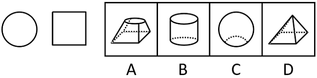

- **A**. A
- **B**. B　✅
- **C**. C
- **D**. D

**答案**：B

**官方解析**

本题考查三视图，逐一分析选项。
A项：从下往上看，可以看到正方形，但无法看到圆形，排除；
B项：从上往下看，可以看到圆形，从左往右看，可以看到正方形，当选；
C项：从上往下看，可以看到圆形，但无法看到正方形，排除；
D项：从下往上看，可以看到正方形，但无法看到圆形，排除。
故正确答案为B。

---

## 第 2 题　qid 4673229 · 图形推理

下列选项中最符合所给图形规律的是（    ）。

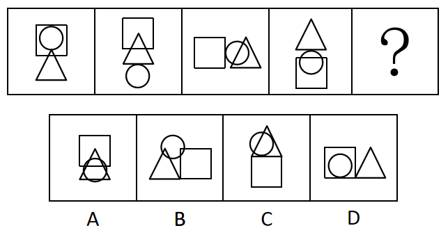

- **A**. A
- **B**. B
- **C**. C
- **D**. D　✅

**答案**：D

**官方解析**

元素组成相同，但无明显位置规律，考虑数量规律。观察发现，题干每幅图形均存在明显的圆相切，优先考虑切点数。题干图形切点数均为1，故问号处图形的切点数也应为1。A、B两项中没有切点，C项有2个切点（如图），只有D项有1个切点。

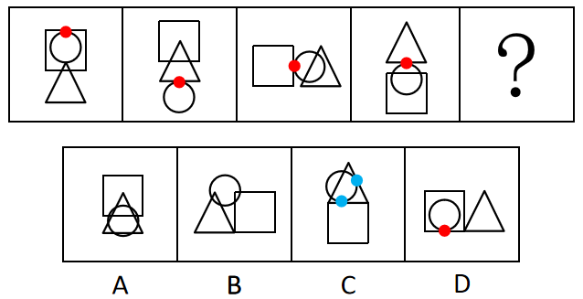

故正确答案为D。

解析二：元素组成相同，但无明显位置规律，考虑数量规律。观察发现，题干每幅图形线条交叉明显，故考虑交点数。题干图形交点数均为10，故问号处图形的交点数也应为10，只有B项符合。

故正确答案为B。

本题为争议题，但根据题干的图形特征可知，每幅图均存在相切，且圆分别与方块和三角形交替相切，且切点数均为1，考查切点数的概率更大，故粉笔更倾向于本题目的答案为D。

---

## 第 3 题　qid 4673199 · 图形推理

下列选项中最符合所给图形规律的是：

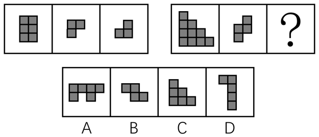

- **A**. A　✅
- **B**. B
- **C**. C
- **D**. D

**答案**：A

**官方解析**

本题考察图形拼合。左图中图2和图3拼合为图1，右图也应该遵循此规律。右图中图2和A项可拼合为图1，拼合方式如下图所示：

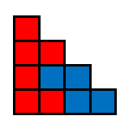

故正确答案为A。

---

## 第 4 题　qid 4673146 · 图形推理

如图所给的3个立方体为同一立方体，若不考虑立方体表面数字的大小、方向，下列选项中，最有可能是该立方体的是（    ）。

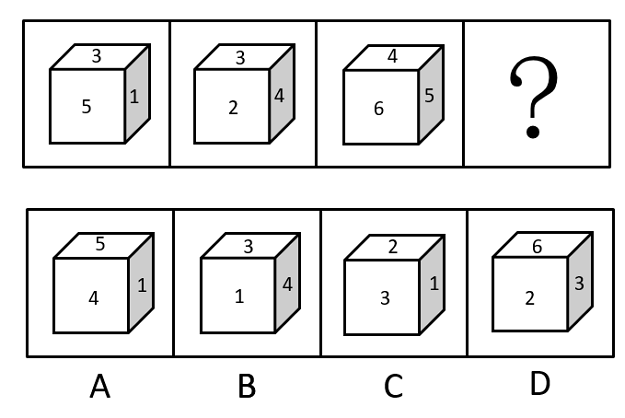

- **A**. A
- **B**. B
- **C**. C　✅
- **D**. D

**答案**：C

**官方解析**

第一步：分析题干中六面体。

根据图一可知，面3、面1、面5相邻；根据图二可知，面2、面3、面4相邻；根据图三可知，面4、面5、面6相邻；若均按照顶面为面3来看，可知正面为面5，右侧面为面1时，后面为面2、左侧面应为面4、底面应为面6（如下透视图所示），故可知面3与面6为相对面、面1与面4为相对面、面5与面2为相对面。

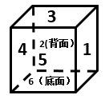

第二步：逐一分析选项。

A项：选项中面1与面4为相邻面，题干二者是相对面，相对面不能同时出现，选项与题干不一致，排除；

B项：选项中面1与面4为相邻面，题干二者是相对面，相对面不能同时出现，选项与题干不一致，排除；

C项：选项与题干一致，当选；

D项：选项中面3与面6为相邻面，题干二者是相对面，相对面不能同时出现，选项与题干不一致，排除。

故正确答案为C。

---

## 第 5 题　qid 4673172 · 图形推理

如图是某立方体的平面展开图，则该立方体最可能是：

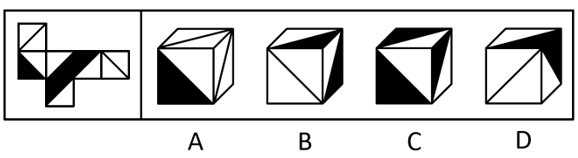

- **A**. A
- **B**. B
- **C**. C
- **D**. D　✅

**答案**：D

**官方解析**

将题干展开图标上序号如下图所示，逐一进行分析。

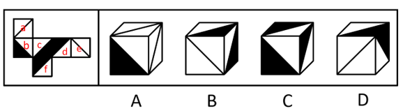

A项：选项一定包含面a和面e，由于面a和面f为相对面，面e和面c为相对面，相对面不能同时出现，面f和面c一定不可能出现，故选项的正面为面b或面d。若选项的正面为面b，在题干展开图中，面b和面e的公共边挨着面b中的黑色三角形，但在选项中，面b和面e的公共边没有挨着面b中的黑色三角形；若选项的正面为面d，在题干展开图中，面a和面d的公共边挨着面d中的黑色三角形，但在选项中，面a和面d的公共边没有挨着面d中的黑色三角形，选项与题干展开图不一致，排除；

B项：选项的上面和右面为面b、面c、面d或面f中的两个面，且面b和面d为相对面不能同时出现。若该项为面b和面c（或面d和面f），题干二者的公共边均与各自面内白色三角形挨着；若该项为面c和面d（或面c和面f、或面b和面f），题干二者的公共边均与各自面内黑色三角形挨着。而选项中的上面和右面的公共边与一个面内的白色三角形和另外一个面内的黑色三角形挨着，选项与题干展开图不一致，排除；

C项：选项中的面为面b、面c、面d或面f中的三个面，且面b和面d为相对面不能同时出现。则选项是面b、面c和面f（或是面c、面d和面f），在题干展开图中，面c和面f的公共边均与各自面内黑色三角形挨着，但在选项中，任意两个面的公共边都挨着一个白色三角形，选项与题干展开图不一致，排除；

D项：选项由面a、面c与面d（或面b、面e和面f）构成，与题干展开图一致，当选。

故正确答案为D。

---

## 第 6 题　qid 4673195 · 图形推理

从所给的四个选项中，选择最合适的一个填入问号处，使之呈现一定的规律性：

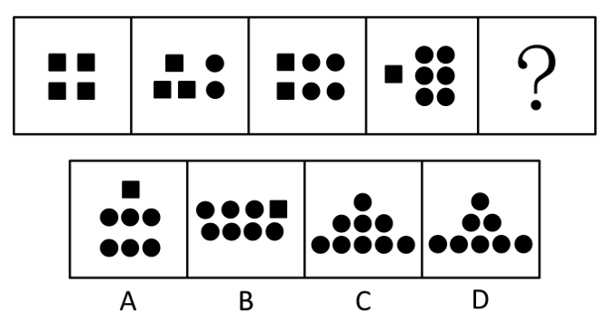

- **A**. A
- **B**. B
- **C**. C
- **D**. D　✅

**答案**：D

**官方解析**

元素组成不同，且无明显属性规律，考虑数量规律。观察发现，题干图形基本都由正方形和圆构成，其中正方形的数量分别为4、3、2、1，圆的数量分别为0、2、4、6，故？处图形应该有0个正方形和8个圆，只有D项符合。
故正确答案为D。

---

## 第 7 题　qid 4673201 · 图形推理

从所给的四个选项中，选择最合适的一个填入问号处，使之呈现一定的规律性：

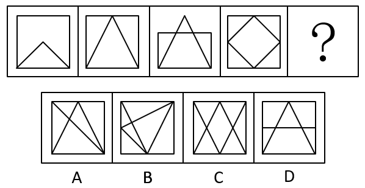

- **A**. A
- **B**. B
- **C**. C
- **D**. D　✅

**答案**：D

**官方解析**

解析一：元素组成不同，优先考虑属性规律。观察发现，题干图形出现等腰元素，考虑对称性，题干图形均为轴对称图形，据此可以排除A、B两项；继续观察发现，题干图形明显被分割，考虑数面，题干图形的面数量分别为2、3、4、5，故？处图形应该有6个面，只有D项符合。
故正确答案为D。
解析二：元素组成不同，考虑数量规律，图形明显被分割，考虑面数量。题干图形的面数量分别为2、3、4、5，故？处图形应该有6个面，排除A、C两项；再次观察发现，题干图形均为一笔画图形，故？处应选择一个一笔画图形，只有B项符合。
故正确答案为B。
本题目为争议题，但根据题干的图形特征可知，所有图形均为等腰图形，考察对称性的概率更大，故粉笔更倾向于本题目的答案为D。

---

## 第 8 题　qid 4673220 · 图形推理

从所给的四个选项中，选择最合适的一个填入问号处，使之呈现一定的规律性：

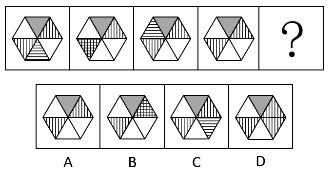

- **A**. A
- **B**. B　✅
- **C**. C
- **D**. D

**答案**：B

**官方解析**

元素组成相同，优先考虑位置规律。观察发现，内部阴影为横线的三角形，依次顺时针移动一格（移动到图4时，阴影被灰色区域遮挡），因此？处应移动到右上角，如下图所示，对应B项。

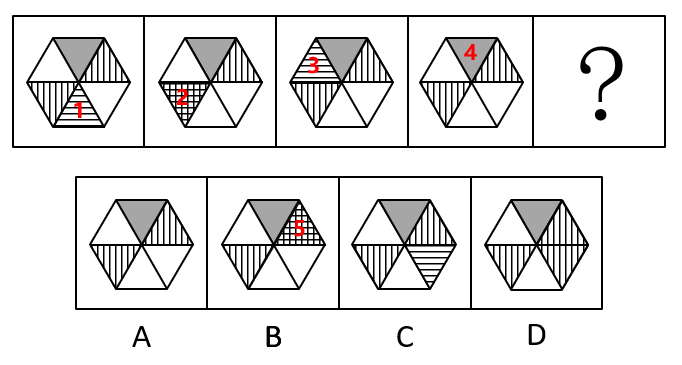

故正确答案为B。

---

## 第 9 题　qid 4673223 · 图形推理

下列选项中最符合所给图形规律的是（    ）。

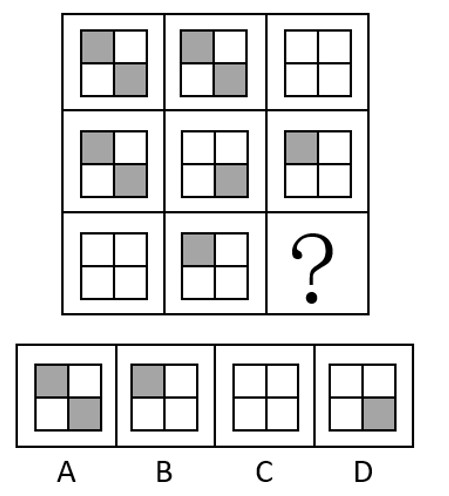

- **A**. A
- **B**. B　✅
- **C**. C
- **D**. D

**答案**：B

**官方解析**

图形元素组成相似，优先考虑样式规律。九宫格优先横着看，题干图形元素组成相似，考虑样式规律。题干图形轮廓相同，内部的颜色只有灰、白，且灰、白块数量不同，优先考虑样式规律中的黑白运算。

观察发现，第一行图形的运算规律为：灰+灰=白，白+白=白。第二行验证此规律成立，同时满足：灰+白=灰。第三行应用前两行得到的规律，因为“白+灰”的结果未知，只可排除A、D两项。说明此题并未设置“灰+白白+灰”的陷阱，否则无惟一答案。根据“白+灰=灰”可排除C项。

故正确答案为B。

---

## 第 10 题　qid 4673180 · 图形推理

下列选项中最符合所给图形规律的是（    ）。

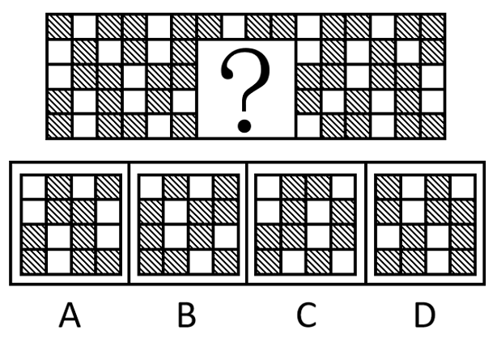

- **A**. A　✅
- **B**. B
- **C**. C
- **D**. D

**答案**：A

**官方解析**

出现黑白块，观察黑块与白块的相对位置关系，每一行都有各自的规律。第一行黑白块排列规律为黑、白、黑循环排列；第二行黑白块排列规律为白、黑循环排列；第三行黑白块排列规律为白、黑、黑循环排列；第四行黑白块排列规律为黑、白循环排列；第五行黑白块排列规律为黑、白、黑循环排列，只有A项符合。

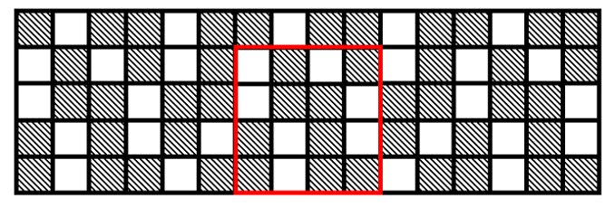

故正确答案为A。

---

## 第 11 题　qid 4673217 · 类比推理

默念：朗诵

- **A**. 竞走：散步　✅
- **B**. 贩卖：赶集
- **C**. 讲授：练习
- **D**. 调节：管理

**答案**：A

**官方解析**

第一步：判断题干词语间逻辑关系。
默念指暗中思考或不出声地读或背，朗诵指大声朗读。默念和朗诵都是阅读的方式，二者为并列关系中的反对关系。
第二步：判断选项词语间逻辑关系。
A项：竞走和散步都是行走的方式，二者为并列关系中的反对关系，与题干逻辑关系一致，当选；
B项：赶集指在集市囤物换物、买卖交易，与贩卖不是并列关系，与题干逻辑关系不一致，排除；
C项：讲授指讲解传授，与练习不是并列关系，与题干逻辑关系不一致，排除；
D项：调节指在数量、程度、规模等方面进行调整，使其符合标准，与管理不是并列关系，与题干逻辑关系不一致，排除。
故正确答案为A。

---

## 第 12 题　qid 4673202 · 类比推理

书桌：椅子

- **A**. 柜子：抽屉
- **B**. 沙发：靠枕　✅
- **C**. 灯泡：插座
- **D**. 窗户：玻璃

**答案**：B

**官方解析**

第一步：判断题干词语间逻辑关系。
书桌和椅子在一起配套使用，二者是配套使用的对应关系。
第二步：判断选项词语间逻辑关系。
A项：抽屉是柜子的组成部分，二者是组成关系，与题干逻辑关系不一致，排除；
B项：沙发和靠枕在一起配套使用，二者是配套使用的对应关系，与题干逻辑关系一致，当选；
C项：灯泡和插座没有明显的逻辑关系，与题干逻辑关系不一致，排除；
D项：玻璃是窗户的组成部分，二者是组成关系，与题干逻辑关系不一致，排除。
故正确答案为B。

---

## 第 13 题　qid 4673203 · 类比推理

航海：指南针

- **A**. 粉笔：黑板报
- **B**. 潜水：救生圈
- **C**. 通信：屏蔽器
- **D**. 驾驶：发动机　✅

**答案**：D

**官方解析**

第一步：判断题干词语间逻辑关系。
航海需要用到指南针，二者为活动和工具之间的对应关系。
第二步：判断选项词语间逻辑关系。
A项：粉笔是绘制黑板报时可能会用到的工具，二者为工具与宣传形式之间的对应关系，与题干逻辑关系不一致，排除；
B项：潜水不需要救生圈，潜水装备一般包含潜水服、呼吸器、眼罩等，因此二者无明显逻辑关系，与题干逻辑关系不一致，排除；
C项：屏蔽器是一种可以屏蔽通信信号的设备，二者不是活动与工具之间的对应关系，与题干逻辑关系不一致，排除；
D项：驾驶一般指操纵（车、船、飞机、拖拉机等）使其行驶，驾驶需要用到发动机，二者为活动和工具之间的对应关系，与题干逻辑关系一致，当选。
故正确答案为D。

---

## 第 14 题　qid 4673204 · 类比推理

创作：印刷：发行

- **A**. 撒网：钓鱼：捕捞
- **B**. 生产：研发：采购
- **C**. 播种：开花：结果　✅
- **D**. 拆除：安装：维修

**答案**：C

**官方解析**

第一步：判断题干词语间逻辑关系。
先创作，再印刷，最后发行，三者是时间先后顺序的对应关系。
第二步：判断选项词语间逻辑关系。
A项：先撒网，再捕捞，二者和钓鱼没有明显的时间先后顺序，与题干逻辑关系不一致，排除；
B项：先研发，再生产，最后采购，研发应在生产之前发生，与题干逻辑关系不一致，排除；
C项：先播种，再开花，最后结果，三者是时间先后顺序的对应关系，与题干逻辑关系一致，当选；
D项：先安装，再拆除，安装应在拆除之前发生，与题干逻辑关系不一致，排除。
故正确答案为C。

---

## 第 15 题　qid 4673127 · 类比推理

法律：诉讼：胜败

- **A**. 策略：经营：盈亏　✅
- **B**. 战争：武器：存亡
- **C**. 判断：事实：对错
- **D**. 教师：教学：优劣

**答案**：A

**官方解析**

第一步：判断题干词语间逻辑关系。
依据“法律”进行“诉讼”，“胜败”是“诉讼”可能出现的两种结果，三者是对应关系。
第二步：判断选项词语间逻辑关系。
A项：依据“策略”进行“经营”，“盈亏”是“经营”可能出现的两种结果，三者是对应关系，与题干逻辑关系一致，当选；
B项：“存亡”不是“武器”可能出现的两种结果，与题干逻辑关系不一致，排除；
C项：依据“事实”进行“判断”，但两词顺序与题干相反，与题干逻辑关系不一致，排除；
D项：不是依据“教师”进行“教学”，教学是教师的职业内容，与题干逻辑关系不一致，排除。
故正确答案为A。

---

## 第 16 题　qid 4673174 · 类比推理

某单位将《稻穗》《播种》两件乡村新风摄影作品选送参赛。关于这两件作品能否获奖，该单位员工有以下猜测：
（1）两件作品都能获奖。
（2）只有一件作品能获奖。
（3）《稻穗》不会获奖。
（4）《播种》会获奖。
结果表明，其中只有一个猜测正确。则以下判断一定正确的是（    ）。

- **A**. 《稻穗》获奖了
- **B**. 《稻穗》没获奖
- **C**. 《播种》获奖了
- **D**. 《播种》没获奖　✅

**答案**：D

**官方解析**

第一步：分析题干找关系。

（1）《稻穗》 且 《播种》；

（2）只有一件作品能获奖；

（3）《稻穗》获奖；

（4）《播种》获奖。

四句话都不是矛盾关系。

第二步：看其余。

可以使用假设法。《稻穗》《播种》的获奖情况可以分为以下四种：

①《稻穗》和《播种》都获奖了：此时条件（1）和（4）同时为真，和题干条件“只有一真”不符；

②《稻穗》获奖，但《播种》没获奖：此时只有条件（2）为真，符合题干要求；

③《稻穗》没获奖，但《播种》获奖了：此时条件（2）（3）（4）都为真，和题干条件“只有一真”不符；

④《稻穗》和《播种》都没获奖：此时只有条件（3）为真，符合题干要求。

综上所述，只有第②种和第④种情况符合题干要求，在这两种情况下《播种》都没获奖，据此可知，《播种》一定不会获奖。

故正确答案为D。

---

## 第 17 题　qid 4673132 · 逻辑判断

某公司产品的各项性能都比竞争对手的更好。所以，如果该公司能够降低产品的市场定价，与竞争对手的价格持平，那么该公司产品一定会迅速占领市场。
下列选项若为真，最能削弱上述论断的是（    ）。

- **A**. 该公司产品的生产成本较高，降低市场定价将会极大影响公司利润
- **B**. 与竞争对手相比，该公司的产品宣传力度和售后服务不具显著优势
- **C**. 该公司的生产规模很小，其产量仅能满足市场需求的百分之一　✅
- **D**. 该公司产品设计瞄准的是高端市场，降低价格不符合其市场定位

**答案**：C

**官方解析**

第一步：找出论点和论据。
论点：如果该公司能够降低产品的市场定价，与竞争对手的价格持平，那么该公司产品一定会迅速占领市场。
论据：某公司产品的各项性能都比竞争对手的更好。
本题论点讨论的是若该公司产品的价格与竞争对手持平，产品会迅速占领市场，论据讨论的是该公司产品性能比竞争对手更好，都在讨论公司产品情况与竞争对手的比较，话题一致，削弱优先考虑否定论点。
第二步：逐一分析选项。
A项：该项指出由于产品生产成本高，降价后会极大影响利润，但利润受影响指的是公司内部的事，而占有市场指的是用户的多少，二者无关，无法削弱，排除；
B项：该项指出与竞争对手相比，该公司的产品宣传力度和售后服务不具显著优势，只能说明优势不大，但不等同于比竞争对手差，因此是否会影响该公司占有市场不确定，无法削弱，排除；
C项：该项指出该公司规模小，产量仅占市场百分之一，说明就算降低价格，与竞争对手持平，但由于公司产品产量过少，能够满足的用户数量也远小于市场需求，因此不能占领市场，否定论点，可以削弱，当选；
D项：该项指出该公司产品设计的市场定位是高端市场，而论点在讨论公司产品降价后会不会占领市场，定位如何和降价后能否占领市场无关，话题不一致，无法削弱，排除。
故正确答案为C。

---

## 第 18 题　qid 4673181 · 定义判断

有调查发现，某镇的乡村振兴工作中，由县农业部门工作人员担任驻村工作队队长的村庄其农业产业发展速度明显快于由其他部门工作人员担任驻村工作队队长的村庄。据此有人认为，县农业部门的工作人员更重视当地的农业产业发展，而农业产业发展是增加当地农民收入的重要手段，因此县农业部门的工作人员开展乡村振兴工作成效往往较好。
以下选项中属于上述论证过程中隐含前提的是（    ）。

- **A**. 农业部门工作人员往往有更多农业产业相关的专业知识
- **B**. 农民收入是评价乡村振兴工作成效的重要指标　✅
- **C**. 乡村振兴工作的成效只能用农业产业发展情况来衡量
- **D**. 不同村庄农民收入在乡村振兴工作开展前基本持平

**答案**：B

**官方解析**

第一步：找出论点和论据。
论点：县农业部门的工作人员开展乡村振兴工作成效往往较好。
论据：县农业部门的工作人员更重视当地的农业产业发展，而农业产业发展是增加当地农民收入的重要手段。
论据说的是县农业部门的工作人员更重视农业产业发展、农业产业发展可增加当地农民收入，论点说的是县农业部门的工作人员开展乡村振兴工作成效往往较好，二者话题不一致，问法为“前提”，加强优先考虑搭桥，建立“农业产业发展”或“农民收入”与“乡村振兴工作成效”之间的关系。
第二步：逐一分析选项。
A项：说的是农业部门工作人员有更多农业产业相关的专业知识，而论点讨论的是农业部门工作人员的乡村振兴工作成效，有更多的专业知识不代表工作成效就一定好，不能加强，排除；
B项：说的是农民收入是评价乡村振兴工作成效的重要指标，在“农民收入”和“乡村振兴工作成效”之间建立了联系，搭桥项，可以加强，保留；
C项：说的是乡村振兴工作成效只能用农业产业发展情况来衡量，在“农业产业发展”和“乡村振兴工作成效”之间建立了联系，搭桥项，可以加强，保留；
D项：说的是不同村庄农民收入在乡村振兴工作开展前基本持平，但判断乡村振兴工作的成效是否更好不需要各村庄农民收入在此前均持平，不是论点成立的必要条件，无法加强，排除。
对比B、C两项，B项在“农民收入”和“乡村振兴工作成效”之间建立联系，将“农业产业发展”“农民收入”和“乡村振兴工作成效”三者之间的关系全部串联了起来，对题干的加强更为完整，而C项只是建立“农业产业发展”和“乡村振兴工作成效”之间的联系，未利用“农民收入”这个论据。基于加强题目的命题特点，将所有论据串联起来的选项更好，因此，粉笔倾向选择B项。
故正确答案为B。

---

## 第 19 题　qid 4673179 · 逻辑判断

某农村合作社购买了两台新型号收割机，这两台机器收割速度快，而且有助于减少收割过程中的粮食损失。但该农村合作社使用这两台收割机以来，其玉米收割总损失率高达10%，较以往反而有所上升。
以下最能解释这一现象的是（    ）。

- **A**. 使用收割机后，该农村合作社收割玉米的效率大幅提高
- **B**. 两台收割机仅被用于收割部分田地的玉米
- **C**. 操作人员培训不到位，操作收割机时常出现失误　✅
- **D**. 玉米并不是当地种植的主要粮食作物

**答案**：C

**官方解析**

第一步：找出题干矛盾。
某农村合作社购买的两台新型号收割机收割速度快，有助于减少收割过程中的粮食损失。但该农村合作社使用这两台收割机以来，其玉米收割总损失率较以往反而有所上升。
第二步：逐一分析选项。
A项：该项只是肯定新型号收割机的收割速度快，但是没有解释为什么新型号收割机能够减少收割过程中的粮食损失，但该农村合作社使用这两台收割机以来，其玉米收割总损失率较以往反而有所上升，不能解释题干矛盾，排除；
B项：该项说的是两台收割机仅被用于收割部分田地的玉米，若是新型号收割机能够减少收割过程中的粮食损失，即使仅被用于收割部分田地的玉米，该村玉米收割总损失率较以往也不可能有所上升，不能解释题干矛盾，排除；
C项：该项说的是操作人员培训不到位，操作收割机时常出现失误，说明操作人员的失误是导致玉米收割总损失率较以往反而有所上升的原因，可以解释题干矛盾，当选；
D项：该项说的是玉米并不是当地种植的主要粮食作物，但不能解释为什么使用了有助于减少收割过程中的粮食损失的新型号收割机后，玉米收割总损失率较以往反而有所上升，不能解释题干矛盾，排除。
故正确答案为C。

---

## 第 20 题　qid 4673188 · 类比推理

每一名战士都是英雄，每一名英雄都值得被纪念，因此每一名战士都值得被纪念。
下列选项的逻辑结构与题干最相似的是（    ）。

- **A**. 艺术家往往是浪漫主义者，而有些浪漫主义者会感情用事，因此艺术家常会感情用事
- **B**. 所有素食主义者都是人文主义者，而所有和平主义者都是人文主义者，因此素食主义者一定是和平主义者
- **C**. 所有的科学家都是理性主义者，所有的理性主义者都是天生的哲学家。因此科学家都是天生的哲学家　✅
- **D**. 利己主义者总是以自身利益最大化作为行事准则，而单纯追求自身利益的最大化必然会损害到他人利益，因此利己主义者总会和他人发生冲突

**答案**：C

**官方解析**

第一步：分析题干推理形式。

战士英雄，英雄值得被纪念，因此战士值得被纪念。

题干逻辑结构为：ab，bc，因此ac。

第二步：逐一分析选项。

A项：翻译为：艺术家浪漫主义者，有的浪漫主义者感情用事，因此艺术家感情用事，逻辑结构为：ab，有的bc，因此ac，与题干推理形式不一致，排除；

B项：翻译为：素食主义者人文主义者，和平主义者人文主义者，因此素食主义者和平主义者，逻辑结构为：ab，cb，因此ac，与题干推理形式不一致，排除；

C项：翻译为：科学家理性主义者，理性主义者天生的哲学家，因此科学家天生的哲学家，逻辑结构为：ab，bc，因此ac，与题干推理形式一致，当选；

D项：翻译为：利己主义者自身利益最大化，自身利益最大化损害到他人利益，因此利己主义者和他人发生冲突，“损害他人利益”与“和他人发生冲突”不是同一个含义，故逻辑结构为：ab，bc，因此ad，与题干推理形式不一致，排除。

故正确答案为C。

---
