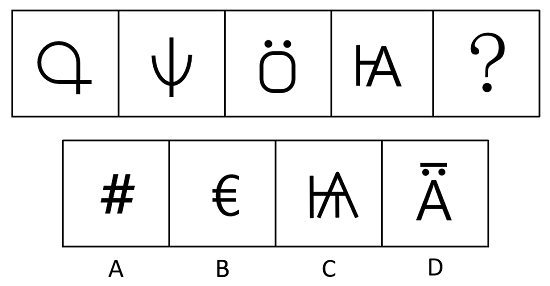
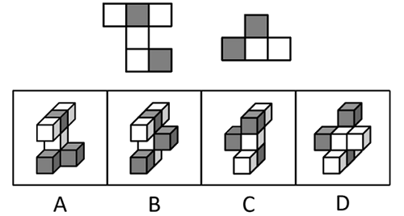
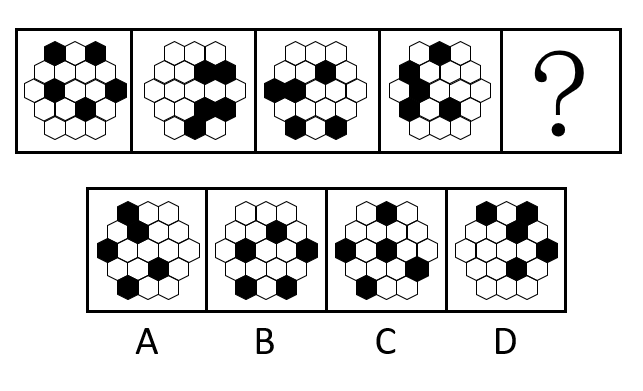
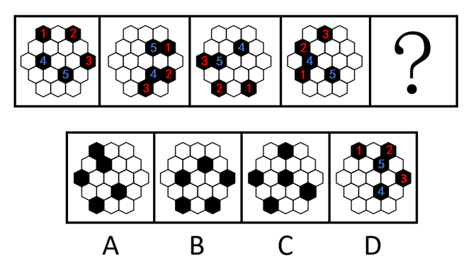
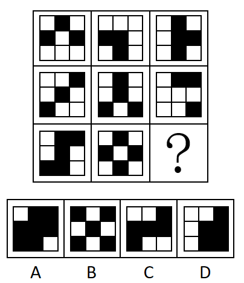
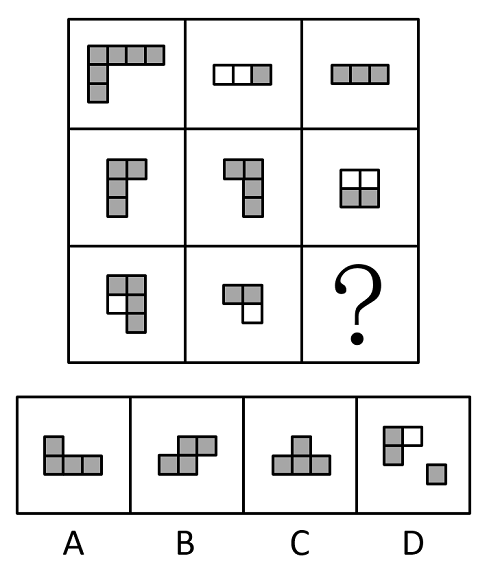
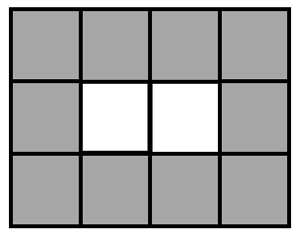

# 2022年广东省公务员录用考试《行测》题（县级卷）（网友回忆版）

> 判断推理 · 35 题 · 广东 2022

## 第 1 题　qid 4673146 · 图形推理

如图所给的3个立方体为同一立方体，若不考虑立方体表面数字的大小、方向，下列选项中，最有可能是该立方体的是（    ）。

- **A**. A
- **B**. B
- **C**. C　✅
- **D**. D

**答案**：C

**官方解析**

第一步：分析题干中六面体。

根据图一可知，面3、面1、面5相邻；根据图二可知，面2、面3、面4相邻；根据图三可知，面4、面5、面6相邻；若均按照顶面为面3来看，可知正面为面5，右侧面为面1时，后面为面2、左侧面应为面4、底面应为面6（如下透视图所示），故可知面3与面6为相对面、面1与面4为相对面、面5与面2为相对面。

第二步：逐一分析选项。

A项：选项中面1与面4为相邻面，题干二者是相对面，相对面不能同时出现，选项与题干不一致，排除；

B项：选项中面1与面4为相邻面，题干二者是相对面，相对面不能同时出现，选项与题干不一致，排除；

C项：选项与题干一致，当选；

D项：选项中面3与面6为相邻面，题干二者是相对面，相对面不能同时出现，选项与题干不一致，排除。

故正确答案为C。

---

## 第 2 题　qid 4673170 · 图形推理

下列选项中最符合所给图形规律的是（    ）。

- **A**. A
- **B**. B
- **C**. C
- **D**. D　✅

**答案**：D

**官方解析**

元素组成不同，且无明显属性规律，考虑数量规律。题干图1、图2和图4为多端点图形，考虑笔画数。题干四幅图形的笔画数依次为1、2、3、4，故“？”处选一个5笔画的图形，只有D项符合。
故正确答案为D。

---

## 第 3 题　qid 4673172 · 图形推理

如图是某立方体的平面展开图，则该立方体最可能是：

- **A**. A
- **B**. B
- **C**. C
- **D**. D　✅

**答案**：D

**官方解析**

将题干展开图标上序号如下图所示，逐一进行分析。

A项：选项一定包含面a和面e，由于面a和面f为相对面，面e和面c为相对面，相对面不能同时出现，面f和面c一定不可能出现，故选项的正面为面b或面d。若选项的正面为面b，在题干展开图中，面b和面e的公共边挨着面b中的黑色三角形，但在选项中，面b和面e的公共边没有挨着面b中的黑色三角形；若选项的正面为面d，在题干展开图中，面a和面d的公共边挨着面d中的黑色三角形，但在选项中，面a和面d的公共边没有挨着面d中的黑色三角形，选项与题干展开图不一致，排除；

B项：选项的上面和右面为面b、面c、面d或面f中的两个面，且面b和面d为相对面不能同时出现。若该项为面b和面c（或面d和面f），题干二者的公共边均与各自面内白色三角形挨着；若该项为面c和面d（或面c和面f、或面b和面f），题干二者的公共边均与各自面内黑色三角形挨着。而选项中的上面和右面的公共边与一个面内的白色三角形和另外一个面内的黑色三角形挨着，选项与题干展开图不一致，排除；

C项：选项中的面为面b、面c、面d或面f中的三个面，且面b和面d为相对面不能同时出现。则选项是面b、面c和面f（或是面c、面d和面f），在题干展开图中，面c和面f的公共边均与各自面内黑色三角形挨着，但在选项中，任意两个面的公共边都挨着一个白色三角形，选项与题干展开图不一致，排除；

D项：选项由面a、面c与面d（或面b、面e和面f）构成，与题干展开图一致，当选。

故正确答案为D。

---

## 第 4 题　qid 4673129 · 图形推理

如图是一个物体某两个角度的视图，则该图形最有可能是（    ）。

- **A**. A
- **B**. B　✅
- **C**. C
- **D**. D

**答案**：B

**官方解析**

本题考查三视图，逐一分析选项。
A项：该项的左视图可能为第一个视图，从下往上看可能为第二个视图，保留；
B项：该项左视图可能为第一个视图，从下往上看可能为第二个视图，保留；
C项：无法得到题干的第一个视图，排除；
D项：无法得到题干的第一个视图，排除。
对比A、B两个选项，B项全部小方块都可以被看到，能够满足题干要求，而A项要想满足题干的视图，那么最底部被遮挡的方块应该是一个纯白色小方块，但现在无法确定A项中最底部是否存在纯白色的小方块，故B项比A项更可能满足题干视图。
故正确答案为B。

---

## 第 5 题　qid 4673138 · 图形推理

下列选项中最符合所给图形规律的是：

- **A**. A
- **B**. B
- **C**. C
- **D**. D　✅

**答案**：D

**官方解析**

元素组成相同，优先考虑位置规律。观察发现，题干的小六边形不是常规的直线走，故考虑内外分开看。如下图所示，图形的小六边形可以分为内外两圈以及中心位置的一块空白，外圈小六边形绕着外圈依次顺时针移动三格；内圈小六边形绕着内圈依次逆时针移动两格；中心位置一直保持空白，对应D项。

故正确答案为D。

---

## 第 6 题　qid 4673130 · 图形推理

从所给的四个选项中，选择最合适的一个填入问号处，使之呈现一定的规律性：

- **A**. A
- **B**. B
- **C**. C　✅
- **D**. D

**答案**：C

**官方解析**

图形元素组成相似，优先考虑样式规律。题干图形轮廓一致，黑块个数不同，优先考虑黑白运算。九宫格优先横向观察，第一行图形的黑白运算规律为：黑+黑=白，黑+白=黑，白+黑=黑，白+白=白，第二行图形经验证符合此规律，第三行应用此规律，只有C项符合。
故正确答案为C。

---

## 第 7 题　qid 4673201 · 图形推理

从所给的四个选项中，选择最合适的一个填入问号处，使之呈现一定的规律性：

- **A**. A
- **B**. B
- **C**. C
- **D**. D　✅

**答案**：D

**官方解析**

解析一：元素组成不同，优先考虑属性规律。观察发现，题干图形出现等腰元素，考虑对称性，题干图形均为轴对称图形，据此可以排除A、B两项；继续观察发现，题干图形明显被分割，考虑数面，题干图形的面数量分别为2、3、4、5，故？处图形应该有6个面，只有D项符合。
故正确答案为D。
解析二：元素组成不同，考虑数量规律，图形明显被分割，考虑面数量。题干图形的面数量分别为2、3、4、5，故？处图形应该有6个面，排除A、C两项；再次观察发现，题干图形均为一笔画图形，故？处应选择一个一笔画图形，只有B项符合。
故正确答案为B。
本题目为争议题，但根据题干的图形特征可知，所有图形均为等腰图形，考察对称性的概率更大，故粉笔更倾向于本题目的答案为D。

---

## 第 8 题　qid 4673178 · 图形推理

下列选项中最符合所给图形规律的是（    ）。

- **A**. A　✅
- **B**. B
- **C**. C
- **D**. D

**答案**：A

**官方解析**

本题考查图形拼合。将题干每行所给的三个图形拼到一起都是中间2块为白色的4×3的矩形，如下图所示：

第三行拼合之后的结果如下图所示，图1为红色，图2为蓝色，拼合之后只有A项符合。

故正确答案为A。

---

## 第 9 题　qid 4673180 · 图形推理

下列选项中最符合所给图形规律的是（    ）。

- **A**. A　✅
- **B**. B
- **C**. C
- **D**. D

**答案**：A

**官方解析**

出现黑白块，观察黑块与白块的相对位置关系，每一行都有各自的规律。第一行黑白块排列规律为黑、白、黑循环排列；第二行黑白块排列规律为白、黑循环排列；第三行黑白块排列规律为白、黑、黑循环排列；第四行黑白块排列规律为黑、白循环排列；第五行黑白块排列规律为黑、白、黑循环排列，只有A项符合。

故正确答案为A。

---

## 第 10 题　qid 4673195 · 图形推理

从所给的四个选项中，选择最合适的一个填入问号处，使之呈现一定的规律性：

- **A**. A
- **B**. B
- **C**. C
- **D**. D　✅

**答案**：D

**官方解析**

元素组成不同，且无明显属性规律，考虑数量规律。观察发现，题干图形基本都由正方形和圆构成，其中正方形的数量分别为4、3、2、1，圆的数量分别为0、2、4、6，故？处图形应该有0个正方形和8个圆，只有D项符合。
故正确答案为D。

---

## 第 11 题　qid 4673126 · 类比推理

耳塞：噪音

- **A**. 书籍：知识
- **B**. 蜡烛：光明
- **C**. 肥皂：污渍　✅
- **D**. 风扇：低温

**答案**：C

**官方解析**

第一步：判断题干词语间逻辑关系。
耳塞是用来减少噪音的，二者为功能对应关系。
第二步：判断选项词语间逻辑关系。
A项：书籍是知识的载体，二者不是功能对应关系，与题干逻辑关系不一致，排除；
B项：蜡烛是用来增加光明的，不是用来减少光明，与题干逻辑关系不一致，排除；
C项：肥皂是用来减少污渍的，二者为功能对应关系，与题干逻辑关系一致，当选；
D项：风扇是用来降低温度的，不是用来减少低温，与题干逻辑关系不一致，排除。
故正确答案为C。

---

## 第 12 题　qid 4673128 · 类比推理

洽谈：合作

- **A**. 考试：成绩
- **B**. 打磨：切割
- **C**. 施肥：灌溉
- **D**. 投资：收益　✅

**答案**：D

**官方解析**

第一步：判断题干词语间逻辑关系。
通过洽谈来达到合作的目的，二者为方式目的对应关系。
第二步：判断选项词语间逻辑关系。
A项：成绩是考试结果的体现，二者不是方式目的对应关系，与题干逻辑关系不一致，排除；
B项：打磨和切割是两种不同的制造工艺，二者为并列关系，与题干逻辑关系不一致，排除；
C项：施肥和灌溉是两种不同的农业技术措施，二者为并列关系，与题干逻辑关系不一致，排除；
D项：通过投资来获得收益，投资是方式，收益是目的，二者为方式目的对应关系，与题干逻辑关系一致，当选。
故正确答案为D。

---

## 第 13 题　qid 4673191 · 类比推理

文字：诗词：绝句

- **A**. 笔画：隶书：汉字
- **B**. 音符：乐谱：五线谱　✅
- **C**. 税收：财政：货币
- **D**. 树木：森林：生态

**答案**：B

**官方解析**

第一步：判断题干词语间逻辑关系。
文字是诗词的组成部分，二者为组成关系；绝句是诗词的一种，二者为种属关系。
第二步：判断选项词语间逻辑关系。
A项：笔画是隶书的组成部分，二者为组成关系，隶书是汉字的一种，二者为种属关系，但顺序与题干相反，与题干逻辑关系不一致，排除；
B项：音符是乐谱的组成部分，二者为组成关系，五线谱是乐谱的一种，二者为种属关系，与题干逻辑关系一致，当选；
C项：税收是财政收入的主要来源之一，货币不是财政的一种，与题干逻辑关系不一致，排除；
D项：树木是森林的组成部分，森林是生态的组成部分，三者间两两构成组成关系，与题干逻辑关系不一致，排除。
故正确答案为B。

---

## 第 14 题　qid 4673127 · 类比推理

法律：诉讼：胜败

- **A**. 策略：经营：盈亏　✅
- **B**. 战争：武器：存亡
- **C**. 判断：事实：对错
- **D**. 教师：教学：优劣

**答案**：A

**官方解析**

第一步：判断题干词语间逻辑关系。
依据“法律”进行“诉讼”，“胜败”是“诉讼”可能出现的两种结果，三者是对应关系。
第二步：判断选项词语间逻辑关系。
A项：依据“策略”进行“经营”，“盈亏”是“经营”可能出现的两种结果，三者是对应关系，与题干逻辑关系一致，当选；
B项：“存亡”不是“武器”可能出现的两种结果，与题干逻辑关系不一致，排除；
C项：依据“事实”进行“判断”，但两词顺序与题干相反，与题干逻辑关系不一致，排除；
D项：不是依据“教师”进行“教学”，教学是教师的职业内容，与题干逻辑关系不一致，排除。
故正确答案为A。

---

## 第 15 题　qid 4673190 · 类比推理

志同道合：沆瀣一气

- **A**. 居安思危：杞人忧天　✅
- **B**. 鼠目寸光：高瞻远瞩
- **C**. 举棋不定：优柔寡断
- **D**. 口若悬河：信口开河

**答案**：A

**官方解析**

第一步：判断题干词语间逻辑关系。
“志同道合”与“沆瀣一气”都是在描述“人与人之间在某方面相投”，且前者为褒义，后者为贬义。
第二步：判断选项词语间逻辑关系。
A项：“居安思危”与“杞人忧天”都是在描述“担忧”，且前者为褒义，后者为贬义，与题干逻辑关系一致，当选；
B项：“鼠目寸光”比喻目光短浅，没有远见，“高瞻远瞩”比喻眼光远大，二者为反义关系，且前者为贬义，后者为褒义，与题干逻辑关系不一致，排除；
C项：“举棋不定”与“优柔寡断”都是在描述“犹豫”，但二者均为贬义，与题干逻辑关系不一致，排除；
D项：“口若悬河”与“信口开河”都是在描述“说话”，但前者为中性，后者为贬义，与题干逻辑关系不一致，排除。
故正确答案为A。

---

## 第 16 题　qid 4673150 · 类比推理

我国法律规定，用人单位由于生产经营需要，经协商，取得工会和劳动者同意后可以延长工作时间，且一般每日不超过一小时。某国有企业有员工在周五晚上延长工作时间，但并没有违法。
根据上述信息可以推知（    ）。

- **A**. 该企业员工延长工作一定不超过一小时
- **B**. 该企业所有员工都同意延长工作时间
- **C**. 该企业工会同意延长工作时间　✅
- **D**. 该企业属于不受工作时间限制的特殊行业

**答案**：C

**官方解析**

日常结论题，根据题干信息逐一分析选项。
A项：根据题干可知，该企业在周五晚上延长工作时间并且没有违法，已知我国法律规定延长工作时间一般每日不超过一小时，这里说的是一般情况下，可能会存在特殊情况，即超过一小时也可能不违法，因此无法得知该企业员工延长工作是否一定不超过一小时，无法推出，排除；
B项：根据题干可知，我国法律规定延长工作时间需要工会和劳动者同意，该企业只有“有员工”周五晚上延长了工作时间，不一定是所有员工，无法确定是不是所有员工都同意延长工作时间，无法推出，排除；
C项：根据题干可知，我国法律规定延长工作时间需要工会和劳动者同意，该企业已经延长工作时间并且没有违法，说明已经取得该企业工会的同意，可以推出，当选；
D项：根据题干可知，该企业为国有企业，但并未提及具体属于什么行业，不明确是否不受工作时间限制，无法推出，排除。
故正确答案为C。

---

## 第 17 题　qid 4673152 · 类比推理

子曰：“名不正，则言不顺；言不顺，则事不成；事不成，则礼乐不兴；礼乐不兴，则刑罚不中；刑罚不中，则民无所措手足。”
根据以上论述，下列推断必然正确的是（    ）。
①名正则言顺
②礼乐兴则事已成
③名不正，则民无所措手足
④只有名正言顺才事可成

- **A**. ①②
- **B**. ②③
- **C**. ②③④　✅
- **D**. ①②③④

**答案**：C

**官方解析**

第一步：翻译题干。

①言顺名正

②事成言顺

③礼乐兴事成

④刑罚中礼乐兴

⑤民所措手足刑罚中

以上条件可以串串：⑥民所措手足刑罚中礼乐兴事成言顺名正

第二步：逐一分析选项。

①错误：翻译为“名正言顺”，是对①的肯后，肯后得不到必然结论，无法推出；

②正确：翻译为“礼乐兴事成”，是对③的肯前，肯前必肯后，可以推出；

③正确：翻译为“民所措手足名正”，是对⑥的肯前，肯前必肯后，可以推出；

④正确：翻译为“事成名正 且 言顺”，即“事成名正，事成言顺”，是对⑥的肯前，肯前必肯后，可以推出。

综上，②③④正确。

故正确答案为C。

---

## 第 18 题　qid 4673162 · 逻辑判断

某机构对在广州有创业、就业、实习等经历的港澳青年进行调查，结果显示，有留穗发展意愿的港澳青年比例占七成以上；九成港澳青年通过实习了解和认识广州；有超过一半的港澳青年非常看好粤港澳大湾区的发展前景。因此，来广州实习有助于港澳青年获得对粤港澳大湾区的认同感。
要使上述推论成立，可以补充的前提是（    ）。

- **A**. 熟悉广州有助于港澳青年更好地适应在广州工作和生活
- **B**. 港澳青年的留穗发展意愿是其对粤港澳大湾区具有认同感的重要表现　✅
- **C**. 通过实习，港澳青年对粤港澳大湾区发展前景更有信心
- **D**. 超过一半的在穗实习港澳青年参与了这项调查

**答案**：B

**官方解析**

第一步：找出论点和论据。
论点：来广州实习有助于港澳青年获得对粤港澳大湾区的认同感。
论据：有留穗发展意愿的港澳青年比例占七成以上；九成港澳青年通过实习了解和认识广州；有超过一半的港澳青年非常看好粤港澳大湾区的发展前景。
本题论点讨论的是来广州实习有助于港澳青年获得对粤港澳大湾区的认同感，论据讨论的是在广州实习的港澳青年中有七成以上有留穗发展意愿、有超过一半看好粤港澳大湾区的发展前景，论点论据话题不一致，加强优先考虑搭桥。找到论据与论点中不同的关键词为“留穗发展意愿”或“看好粤港澳大湾区的发展前景”与“对粤港澳大湾区的认同感”，需要在二者之间进行搭桥。
第二步：逐一分析选项。
A项：论点讨论的是来广州实习有助于港澳青年获得对粤港澳大湾区的认同感，而该项讨论的是熟悉广州能让港澳青年更好地适应在广州工作和生活，适应工作和生活与能否获得认同感无必然联系，因此该项不是论点成立的前提，排除；
B项：该项讨论的是港澳青年的留穗发展意愿是其对粤港澳大湾区具有认同感的重要表现，指出了“留穗发展意愿”与“对粤港澳大湾区的认同感”之间的联系，搭桥项，保留；
C项：论点讨论的是来广州实习有助于港澳青年获得对粤港澳大湾区的认同感，而该项讨论的是通过实习能让港澳青年对粤港澳大湾区发展前景更有信心，但更有信心不等同于会产生认同感，话题不一致，无法加强，排除；
D项：论点讨论的是来广州实习有助于港澳青年获得对粤港澳大湾区的认同感，而该项讨论的是超过一半的在穗实习港澳青年参与了这项调查，说明论据的调查结果相对准确的，加强论据，保留。
比较B、D两项，D项是加强论据，力度没有B项搭桥强，故排除D项，B项当选。
故正确答案为B。

---

## 第 19 题　qid 4673167 · 逻辑判断

某高校调查本校学生的兴趣爱好后发现，喜欢打羽毛球的学生中，来自体育学院的学生一定喜欢登山。
根据以上条件，下列情况必定属实的是（    ）。

- **A**. 甲喜欢打羽毛球和登山，则甲是体育学院的学生
- **B**. 乙是体育学院的学生，且喜欢登山，则乙喜欢打羽毛球
- **C**. 丁不喜欢打羽毛球和登山，则丁不是体育学院的学生
- **D**. 丙喜欢打羽毛球，不喜欢登山，则丙不是体育学院的学生　✅

**答案**：D

**官方解析**

第一步：翻译题干。

题干可翻译为：喜欢打羽毛球且来自体育学院喜欢登山。

第二步：逐一分析选项。

A项：翻译为：甲喜欢打羽毛球且喜欢登山甲来自体育学院，“喜欢登山”是对题干的肯后，肯后得不到确定性的结论，无法推出，排除；

B项：翻译为：乙来自体育学院且喜欢登山乙喜欢打羽毛球，“喜欢登山”是对题干的肯后，肯后得不到确定性的结论，无法推出，排除；

C项：翻译为：丁不喜欢打羽毛球且不喜欢登山丁不来自体育学院，“不喜欢登山”是对题干的否后，根据否后必否前可知，“喜欢打羽毛球且来自体育学院”为假，则“不喜欢打羽毛球或不来自体育学院”为真，此时结合丁不喜欢打羽毛球，是对“或关系”的肯定，无法推出丁是否来自体育学院，排除；

D项：翻译为：丙喜欢打羽毛球且不喜欢登山丙不来自体育学院，“不喜欢登山”是对题干的否后，根据否后必否前可知，“喜欢打羽毛球且来自体育学院”为假，则“不喜欢打羽毛球或不来自体育学院”为真，再结合丙喜欢打羽毛球可知，“或关系”否一推一，则丙一定不是体育学院的学生，可以推出，当选。

故正确答案为D。

---

## 第 20 题　qid 4673133 · 逻辑判断

逻辑思维能力是一个人最重要的能力之一，但大部分学校都没有开设专门培养逻辑思维能力的课程。
以下选项若为真，最能有效解释上述现象的是（    ）。

- **A**. 学校内绝大多数课程的设计核心都是提高学生的逻辑思维能力　✅
- **B**. 人们的逻辑思维能力往往能随着学识和社会阅历的增长自然提高
- **C**. 绝大多数大学设有关于逻辑思维能力的公共选修课程
- **D**. 部分教师对于如何培养逻辑思维能力并没有清晰的认识

**答案**：A

**官方解析**

第一步：找出题干矛盾。
逻辑思维能力是一个人最重要的能力之一，但大部分学校都没有开设专门培养逻辑思维能力的课程。
第二步：逐一分析选项。
A项：指出学校内绝大多数课程的设计核心都是提高学生的逻辑思维能力，说明即使不开设专门培养逻辑思维能力的课程，在绝大多数的课程中也能培养到这项能力，因此不需要单独开设课程，可以解释题干矛盾，当选；
B项：指出人们的逻辑思维能力往往能随着学识和社会阅历的增长自然提高，但逻辑思维能力的自然提高和学校是否开设课程没有必然联系，能力会自然提高，不代表就没有通过课程来学习的必要性，不能解释为什么大部分学校都没有开设专门培养逻辑思维能力的课程，不能解释题干矛盾，排除；
C项：指出绝大多数大学设有关于逻辑思维能力的公共选修课程，但是题干说的主体是大部分学校，绝大多数大学不能代表大部分学校，不能解释为什么大部分学校都没有开设专门培养逻辑思维能力的课程，不能解释题干矛盾，排除；
D项：指出部分教师对于如何培养逻辑思维能力并没有清晰的认识，只是部分教师，不能代表所有教师都不知道如何培养逻辑思维能力，不能解释为什么大部分学校都没有开设专门培养逻辑思维能力的课程，不能解释题干矛盾，排除。
故正确答案为A。

---

## 第 21 题　qid 4673174 · 类比推理

某单位将《稻穗》《播种》两件乡村新风摄影作品选送参赛。关于这两件作品能否获奖，该单位员工有以下猜测：
（1）两件作品都能获奖。
（2）只有一件作品能获奖。
（3）《稻穗》不会获奖。
（4）《播种》会获奖。
结果表明，其中只有一个猜测正确。则以下判断一定正确的是（    ）。

- **A**. 《稻穗》获奖了
- **B**. 《稻穗》没获奖
- **C**. 《播种》获奖了
- **D**. 《播种》没获奖　✅

**答案**：D

**官方解析**

第一步：分析题干找关系。

（1）《稻穗》 且 《播种》；

（2）只有一件作品能获奖；

（3）《稻穗》获奖；

（4）《播种》获奖。

四句话都不是矛盾关系。

第二步：看其余。

可以使用假设法。《稻穗》《播种》的获奖情况可以分为以下四种：

①《稻穗》和《播种》都获奖了：此时条件（1）和（4）同时为真，和题干条件“只有一真”不符；

②《稻穗》获奖，但《播种》没获奖：此时只有条件（2）为真，符合题干要求；

③《稻穗》没获奖，但《播种》获奖了：此时条件（2）（3）（4）都为真，和题干条件“只有一真”不符；

④《稻穗》和《播种》都没获奖：此时只有条件（3）为真，符合题干要求。

综上所述，只有第②种和第④种情况符合题干要求，在这两种情况下《播种》都没获奖，据此可知，《播种》一定不会获奖。

故正确答案为D。

---

## 第 22 题　qid 4673176 · 逻辑判断

某青年教师学习小组需由2位七年级和1位八年级的教师组成，并且教师教授的科目各不相同。七年级的候选人有：语文老师甲，数学老师乙，英语老师丙；八年级的候选人有：数学老师丁，历史老师戊，语文老师己。则以下人选组合能够满足条件的是（    ）。

- **A**. 甲，己，戊
- **B**. 甲，乙，己
- **C**. 乙，丙，戊　✅
- **D**. 乙，丙，丁

**答案**：C

**官方解析**

第一步：分析题干条件。
（1）选2位七年级、1位八年级教师；
（2）选的3个人教授的科目各不相同；
（3）七年级：语文甲、数学乙、英语丙；
（4）八年级：数学丁、历史戊、语文己。
第二步：根据题干条件进行推理。
题干信息确定，选项信息充分，优先考虑排除法。
根据条件（1）（3）可知，被选中的七年级教师有甲、乙，乙、丙，甲、丙三种可能，排除A 项；根据条件（2）（3）（4）可知，不能同时选中甲、己，乙、丁，排除B、D两项。
故正确答案为C。

---

## 第 23 题　qid 4673181 · 定义判断

有调查发现，某镇的乡村振兴工作中，由县农业部门工作人员担任驻村工作队队长的村庄其农业产业发展速度明显快于由其他部门工作人员担任驻村工作队队长的村庄。据此有人认为，县农业部门的工作人员更重视当地的农业产业发展，而农业产业发展是增加当地农民收入的重要手段，因此县农业部门的工作人员开展乡村振兴工作成效往往较好。
以下选项中属于上述论证过程中隐含前提的是（    ）。

- **A**. 农业部门工作人员往往有更多农业产业相关的专业知识
- **B**. 农民收入是评价乡村振兴工作成效的重要指标　✅
- **C**. 乡村振兴工作的成效只能用农业产业发展情况来衡量
- **D**. 不同村庄农民收入在乡村振兴工作开展前基本持平

**答案**：B

**官方解析**

第一步：找出论点和论据。
论点：县农业部门的工作人员开展乡村振兴工作成效往往较好。
论据：县农业部门的工作人员更重视当地的农业产业发展，而农业产业发展是增加当地农民收入的重要手段。
论据说的是县农业部门的工作人员更重视农业产业发展、农业产业发展可增加当地农民收入，论点说的是县农业部门的工作人员开展乡村振兴工作成效往往较好，二者话题不一致，问法为“前提”，加强优先考虑搭桥，建立“农业产业发展”或“农民收入”与“乡村振兴工作成效”之间的关系。
第二步：逐一分析选项。
A项：说的是农业部门工作人员有更多农业产业相关的专业知识，而论点讨论的是农业部门工作人员的乡村振兴工作成效，有更多的专业知识不代表工作成效就一定好，不能加强，排除；
B项：说的是农民收入是评价乡村振兴工作成效的重要指标，在“农民收入”和“乡村振兴工作成效”之间建立了联系，搭桥项，可以加强，保留；
C项：说的是乡村振兴工作成效只能用农业产业发展情况来衡量，在“农业产业发展”和“乡村振兴工作成效”之间建立了联系，搭桥项，可以加强，保留；
D项：说的是不同村庄农民收入在乡村振兴工作开展前基本持平，但判断乡村振兴工作的成效是否更好不需要各村庄农民收入在此前均持平，不是论点成立的必要条件，无法加强，排除。
对比B、C两项，B项在“农民收入”和“乡村振兴工作成效”之间建立联系，将“农业产业发展”“农民收入”和“乡村振兴工作成效”三者之间的关系全部串联了起来，对题干的加强更为完整，而C项只是建立“农业产业发展”和“乡村振兴工作成效”之间的联系，未利用“农民收入”这个论据。基于加强题目的命题特点，将所有论据串联起来的选项更好，因此，粉笔倾向选择B项。
故正确答案为B。

---

## 第 24 题　qid 4673175 · 逻辑判断

有研究表明，随着人均收入水平的提高，人民对生活的满意度也提高了。因此，政府应该大力发展经济，从而增加人民的人均收入。
上述研究的推论暗含的前提是（    ）。

- **A**. 人均收入水平的提高能满足人民群众精神层面的需求
- **B**. 人民对生活的满意程度取决于政府在经济建设上的投入力度
- **C**. 提升人民对生活的满意度是政府工作的主要任务之一　✅
- **D**. 人均收入水平的提高对人民满意度的提升作用会不断增强

**答案**：C

**官方解析**

第一步：找出论点和论据。
论点：政府应该大力发展经济，从而增加人民的人均收入。
论据：随着人均收入水平的提高，人民对生活的满意度也提高了。
本题论点是个建议，建议政府要大力发展经济从而实现提高收入的目的，本题论点的重点在于为什么政府要大力发展经济，而不在于讨论发展经济和收入之间的关系，而现有的论据不足以证明政府为什么要大力发展经济，需要补充新的论据来支持论点。
第二步：逐一分析选项。
A项：该项说的是人均收入水平的提高能够满足人民精神层面的需求，但论点讨论的是政府大力发展经济与增加人民的人均收入的关系，话题不一致，排除；
B项：该项指出人民对生活的满意度取决于政府在经济建设上的投入力度，能够解释为什么政府要大力发展经济，可以支持，保留；
C项：该项指出了政府工作的主要任务是提高人民的满意度，而人均收入的提高会带来满意度的提高，因此，政府应该大力发展经济，可以支持，保留；
D项：该项讨论的是人均收入水平提高，人民满意度也会不断增强，跟论据表达的意思一致，但并未提到政府是否应该发展经济来增加人民的人均收入，不是论点成立的前提，排除。
对比B、C两项，C项强调 “政府工作的主要任务之一是提高满意度”，说明提高人民满意度对于政府是非常重要的，那么论点建议政府大力发展经济，就更有必要性，为论点成立的必要条件；而B项只能说明政府在经济建设上的投入力度与人民满意度有关，但政府是否会为了提高满意度而大力发展经济并不明确，因此无法确定论点政府大力发展经济的必要性。C项比B项更明确，择优选C。
故正确答案为C。

---

## 第 25 题　qid 4673169 · 逻辑判断

如今越来越多企业认识到中欧班列具有时效更高、周转更快等优势，从而选择通过中欧班列发运货物。例如，在广州大朗站，2021年前9个月已开行出口中欧班列97列、发运标箱9698个、货值29.47亿元，同比分别增长25.97%、33.80%、19.94%。尽管大朗站的工作人员数量没有明显增加，但有不少企业发现，大朗站货物通关效率比去年更高了。
下列选项最能解释这一现象的是（    ）。

- **A**. 珠三角地区增设了多个通关口岸
- **B**. 当地海关简化了通关流程　✅
- **C**. 中欧班列的列车运行速度有所提高
- **D**. 当地货物通关时间较去年有所减少

**答案**：B

**官方解析**

第一步：找出题干矛盾。
广州大朗站工作人员数量没有明显增加，但大朗站的货物通关效率比去年更高了。
第二步：逐一分析选项。
A项：该项在说珠三角地区增设了多个通关口岸，而题干讨论的是为什么广州大朗站没有明显增加工作人员，货物的通关效率却提高了，主体不一致，不能解释题干矛盾，排除；
B项：该项在说当地海关简化了通关流程，通关步骤减少，所以效率提高，很好地解释了为什么广州大朗站没有明显增加工作人员，货物的通关效率却提高了，可以解释题干矛盾，当选；
C项：该项在说中欧班列的列车运行速度有所提高，而题干讨论的是为什么广州大朗站没有明显增加工作人员，货物的通关效率却提高了，话题不一致，不能解释题干矛盾，排除；
D项：该项在说当地货物通关时间较去年有所减少，结合题干所说货物增多，货物通关时间减少即货物通关效率提高，是对题干内容的重复，不能解释题干矛盾，排除。
故正确答案为B。

---

## 第 26 题　qid 4673179 · 逻辑判断

某农村合作社购买了两台新型号收割机，这两台机器收割速度快，而且有助于减少收割过程中的粮食损失。但该农村合作社使用这两台收割机以来，其玉米收割总损失率高达10%，较以往反而有所上升。
以下最能解释这一现象的是（    ）。

- **A**. 使用收割机后，该农村合作社收割玉米的效率大幅提高
- **B**. 两台收割机仅被用于收割部分田地的玉米
- **C**. 操作人员培训不到位，操作收割机时常出现失误　✅
- **D**. 玉米并不是当地种植的主要粮食作物

**答案**：C

**官方解析**

第一步：找出题干矛盾。
某农村合作社购买的两台新型号收割机收割速度快，有助于减少收割过程中的粮食损失。但该农村合作社使用这两台收割机以来，其玉米收割总损失率较以往反而有所上升。
第二步：逐一分析选项。
A项：该项只是肯定新型号收割机的收割速度快，但是没有解释为什么新型号收割机能够减少收割过程中的粮食损失，但该农村合作社使用这两台收割机以来，其玉米收割总损失率较以往反而有所上升，不能解释题干矛盾，排除；
B项：该项说的是两台收割机仅被用于收割部分田地的玉米，若是新型号收割机能够减少收割过程中的粮食损失，即使仅被用于收割部分田地的玉米，该村玉米收割总损失率较以往也不可能有所上升，不能解释题干矛盾，排除；
C项：该项说的是操作人员培训不到位，操作收割机时常出现失误，说明操作人员的失误是导致玉米收割总损失率较以往反而有所上升的原因，可以解释题干矛盾，当选；
D项：该项说的是玉米并不是当地种植的主要粮食作物，但不能解释为什么使用了有助于减少收割过程中的粮食损失的新型号收割机后，玉米收割总损失率较以往反而有所上升，不能解释题干矛盾，排除。
故正确答案为C。

---

## 第 27 题　qid 4673185 · 逻辑判断

在新的社会发展形势下，如果医生只掌握专业理论知识和实践能力，却缺乏基本职业道德，不仅很难适应社会需求，同时还容易造成医患关系紧张。因此在医学专业学生的培养过程中，不仅要注重专业理论知识的教育，更应注重提升医德医风职业素养。
以下选项若为真，最能支持上述论断的是（    ）。

- **A**. 目前大多数医术水平较高的医生极少与患者产生冲突
- **B**. 医生在救治过程中只顾治病不顾患者感受往往导致医患关系紧张
- **C**. 医学专业学生职业素养的提升，主要依靠学校的思想道德教育
- **D**. 比起专业水平，越来越多患者就医时更看重医生的道德素养　✅

**答案**：D

**官方解析**

第一步：找出论点和论据。
论点：在医学专业学生的培养过程中，不仅要注重专业理论知识的教育，更应注重提升医德医风职业素养。
论据：如果医生只掌握专业理论知识和实践能力，却缺乏基本职业道德，不仅很难适应社会需求，同时还容易造成医患关系紧张。
本题论点和论据均在讨论医生以及医学专业学生的培养不仅要注重专业理论知识，更应注重提升医德医风职业素养，话题一致，加强优先考虑补充论据。
第二步：逐一分析选项。
A项：该项说的是医术水平较高的医生与患者冲突少，但“医术水平较高”不等同于“医德医风职业素养高”，与论点“医学专业学生的培养更应注重提升医德医风职业素养”无关，无法加强，排除；
B项：该项说的是医生如果只顾治病，而不顾患者感受会导致医患关系紧张，但“只顾治病不顾患者感受”不等同于“医德医风职业素养低”，与论点“医学专业学生的培养更应注重提升医德医风职业素养”无关，无法加强，排除；
C项：该项说的是医学专业学生职业素养提升的途径，与论点“医学专业学生的培养更应注重提升医德医风职业素养”无关，无法加强，排除； 
D项：该项说的是相较于专业水平，患者就医更看重医生的道德素养，解释了为什么医学专业学生的培养更应注重提升医德医风职业素养，解释原因，可以加强，当选。
故正确答案为D。

---

## 第 28 题　qid 4673187 · 逻辑判断

多年来，甲国居民消耗的主要粮食中，有80%以上由本国生产；而乙国居民消耗的主要粮食中有六成以上依赖进口。但经过调查发现，当国际大米价格出现上涨时，甲国国内的大米价格涨幅明显高于乙国。
下列选项如果为真，最能解释这一现象的是（    ）。

- **A**. 甲国主要粮食进口以大米为主，乙国主要粮食进口以小麦为主　✅
- **B**. 乙国居民对食物品质和口感的要求比甲国居民更高
- **C**. 乙国的粮食产量比甲国更加稳定
- **D**. 与甲国相比乙国人口少、收入高，粮食支出占其收入的比重更低

**答案**：A

**官方解析**

第一步：找出题干矛盾。
甲国的主要粮食80%由本国生产，乙国的主要粮食六成以上依赖进口，但当国际大米价格出现上涨时，甲国的大米价格涨幅明显高于乙国。
第二步：逐一分析选项。
A项：指出甲国主要进口大米，而乙国主要进口小麦，因此国际大米价格上涨对甲国的大米价格影响更大，解释了为什么当国际大米价格出现上涨时，甲国的大米价格涨幅明显高于乙国，可以解释题干矛盾，当选；
B项：指出甲、乙两国对食物品质和口感的要求存在差别，与国际大米价格对两国大米价格的影响无关，不能解释题干矛盾，排除；
C项：指出乙国的粮食产量比甲国稳定，即使甲国的粮食产量发生变化，也无法判断是增加还是减少，更无法判断变化幅度是多少，而乙国的主要粮食进口比例仍然很大，无法解释为什么当国际大米价格出现上涨时，甲国大米价格涨幅明显要高于乙国，不能解释题干矛盾，排除；
D项：指出甲、乙两国居民的粮食支出占收入的比重情况，与国际大米价格对两国大米价格的影响无关，不能解释题干矛盾，排除。
故正确答案为A。

---

## 第 29 题　qid 4673188 · 类比推理

每一名战士都是英雄，每一名英雄都值得被纪念，因此每一名战士都值得被纪念。
下列选项的逻辑结构与题干最相似的是（    ）。

- **A**. 艺术家往往是浪漫主义者，而有些浪漫主义者会感情用事，因此艺术家常会感情用事
- **B**. 所有素食主义者都是人文主义者，而所有和平主义者都是人文主义者，因此素食主义者一定是和平主义者
- **C**. 所有的科学家都是理性主义者，所有的理性主义者都是天生的哲学家。因此科学家都是天生的哲学家　✅
- **D**. 利己主义者总是以自身利益最大化作为行事准则，而单纯追求自身利益的最大化必然会损害到他人利益，因此利己主义者总会和他人发生冲突

**答案**：C

**官方解析**

第一步：分析题干推理形式。

战士英雄，英雄值得被纪念，因此战士值得被纪念。

题干逻辑结构为：ab，bc，因此ac。

第二步：逐一分析选项。

A项：翻译为：艺术家浪漫主义者，有的浪漫主义者感情用事，因此艺术家感情用事，逻辑结构为：ab，有的bc，因此ac，与题干推理形式不一致，排除；

B项：翻译为：素食主义者人文主义者，和平主义者人文主义者，因此素食主义者和平主义者，逻辑结构为：ab，cb，因此ac，与题干推理形式不一致，排除；

C项：翻译为：科学家理性主义者，理性主义者天生的哲学家，因此科学家天生的哲学家，逻辑结构为：ab，bc，因此ac，与题干推理形式一致，当选；

D项：翻译为：利己主义者自身利益最大化，自身利益最大化损害到他人利益，因此利己主义者和他人发生冲突，“损害他人利益”与“和他人发生冲突”不是同一个含义，故逻辑结构为：ab，bc，因此ad，与题干推理形式不一致，排除。

故正确答案为C。

---

## 第 30 题　qid 4673177 · 类比推理

世界科技强国必须能够在全球范围内吸引人才、留住人才、用好人才。我国要建设世界科技强国。因此，我国必须注重对国际人才的吸引与使用。
下列选项的逻辑结构与题干最相似的是（    ）。

- **A**. 人才的培养培育离不开良好的环境。因此，构筑集聚全球优秀人才的科研创新高地，完善配套制度，就能面向世界汇聚一流人才
- **B**. 国家科技创新力的根本源泉在于人才，国家、民族长远发展离不开科技创新力。因此，培养创新型人才是国家、民族的长远发展之计　✅
- **C**. 科技创新离不开科技人员持久的时间和精力投入。因此，要建立让科研人员把主要精力放在科研上的保障机制
- **D**. 榜样的力量对科技工作者来说是无穷的。两院院士是科技成果的主要贡献者，更应做好表率，激励广大科技工作者不断攻坚克难、勇攀高峰

**答案**：B

**官方解析**

第一步：分析题干推理结构。

世界科技强国在全球范围内吸引人才、留住人才、用好人才。我国建设世界科技强国。因此，我国注重对国际人才的吸引与使用。

题干的论证过程为：12，31，因此32。

第二步：逐一分析选项。

A项：翻译为人才的培养培育良好的环境，因此，构筑集聚全球优秀人才的科研创新高地，完善配套制度面向世界汇聚一流人才。第二句中的“构筑集聚全球优秀人才的科研创新高地，完善配套制度”可以等同于“良好的环境”，故该项推理形式为：12，因此23，与题干推理形式不同，排除；

B项：翻译为国家科技创新力人才，国家、民族长远发展科技创新力，因此，国家、民族的长远发展人才。该项推理形式为：12，31，因此32，与题干推理形式一致，当选；

C项：翻译为科技创新科技人员持久的时间和精力投入，因此，要建立让科研人员把主要精力放在科研上的保障机制。最后一句话中的“保障机制”在上文中并未提及，故该项推理形式为：12，因此3，与题干推理形式不同，排除；

D项：翻译为科技工作者榜样的力量，两院院士科技成果的主要贡献者，因此，两院院士做好表率，激励广大科技工作者不断攻坚克难、勇攀高峰。虽然第三句中的“做好表率，激励广大科技工作者不断攻坚克难、勇攀高峰”等同于“发挥榜样的力量”，但第二句中“科技成果的主要贡献者”与第一句中“科技工作者”是两个不同的概念，不能进行串联，故该项推理形式为：12，34，因此32，与题干推理形式不同，排除。

故正确答案为B。

---

## 第 31 题　qid 4673182 · 逻辑判断

某便利店销售一款牛奶，这款牛奶在店内每瓶售价8元，在店外自动售货机上的价格为每瓶10元，但依然有部分人选择在自动售货机上购买这款牛奶。
以下选项若为真，最不能解释这一现象的是（    ）。

- **A**. 有些人赶时间，当店内顾客过多时不愿意进店排队结账
- **B**. 有些人购买目标单一，只想买牛奶并不想购买其他商品　✅
- **C**. 有些人不愿花精力进店寻找商品，自动售货机展示商品更直观
- **D**. 有些人喜欢喝冰牛奶，只有自动售货机销售冰牛奶

**答案**：B

**官方解析**

第一步：找出题干矛盾。
某款牛奶在店内每瓶售价8元，在店外自动售货机上的价格为每瓶10元，但依然有部分人选择在自动售货机上购买这款牛奶。
第二步：逐一分析选项。
A项：该项说的是有些人在店内顾客过多的时候不愿意进店排队结账，说明这些人在店内顾客过多的时候会选择在店外自动售货机上购买这款牛奶，可以解释题干矛盾，排除；
B项：该项说的是有些人只想买牛奶并不想购买其他商品，但题干只讨论了购买牛奶的场所，并未涉及其他商品，不能解释题干矛盾，当选；
C项：该项说的是有些人不愿花精力进店寻找商品，自动售货机展示商品更直观，说明这些人会选择在自动售货机上购买这款牛奶，可以解释题干矛盾，排除；
D项：该项说的是有些人喜欢喝冰牛奶，而只有自动售货机销售冰牛奶，说明这些人会选择在自动售货机上购买这款牛奶，可以解释题干矛盾，排除。
本题为选非题，故正确答案为B。

---

## 第 32 题　qid 4673184 · 逻辑判断

某教师收集了本班学生的语文学习兴趣、每天的学习时长等信息，结合期末考试语文成绩分析后发现，与每天语文学习时长不足2小时的学生相比，学习超过2小时的学生学习兴致普遍更高，其语文期末考试平均分也更高。该教师由此得出结论，增加语文学习时长能够有效培养学习兴趣，进而提高语文成绩。
下列选项若为真，最能质疑上述结论的是（    ）。

- **A**. 该班级期末考试语文成绩最好的学生每天学习语文1小时
- **B**. 该班级的语文期末考试平均分高于其他班级
- **C**. 语文学习兴趣高的学生拥有更好的学习习惯
- **D**. 只有语文学习兴趣高的学生才乐于花更长时间学习语文　✅

**答案**：D

**官方解析**

第一步：找出论点和论据。
论点：增加语文学习时长能够有效培养学习兴趣，进而提高语文成绩。
论据：某教师收集了本班学生的语文学习兴趣、每天的学习时长等信息，结合期末考试语文成绩分析后发现，与每天语文学习时长不足2小时的学生相比，学习超过2小时的学生学习兴致普遍更高，其语文期末考试平均分也更高。
本题的论点和论据讨论的都是语文学习时长和培养学习兴趣、提高语文成绩的关系，论点和论据话题一致，削弱优先考虑削弱论点，且论点为因果关系，也可以考虑因果倒置和他因削弱。
第二步：逐一分析选项。
A项：该项说的是该班级期末考试语文成绩最好的学生每天学习语文1小时，但题干研究的是学习语文时长不足和超过2小时的学生的平均成绩，个例无法质疑整体成绩情况，无法削弱，排除；
B项：该项说的是该班级的语文期末考试平均分高于其他班级，只是说了班级整体的考试情况，并没有说明取得高成绩与该班学生学习语文的兴趣和时长之间的关系，话题不一致，无法削弱，排除；
C项：该项说的是语文学习兴趣高的学生拥有更好的学习习惯，但更好的学习习惯是否包括对学习时长的把控并不明确，无法削弱，排除；
D项：该项说的是只有语文学习兴趣高的学生才乐于花更长时间学习语文，即对语文感兴趣导致学习语文时间长，而论点认为学习语文时间长导致能够有效培养学习兴趣，该项颠倒了论点中的因果，属于因果倒置，可以削弱，当选。
故正确答案为D。

---

## 第 33 题　qid 4673186 · 类比推理

农业得到极大发展后，农民的收入水平会显著提高，农业科技水平相对落后的地区农民收入水平不能提高。由此可知，农业科技水平相对落后的地区，农业产业有待发展。
下列选项的逻辑结构与题干最相似的是（    ）。

- **A**. 气温低于10摄氏度时，某地的滑雪场就会对外开放。每年的国庆节当地的滑雪场都不对外开放。因此，每年国庆节当地气温都在10摄氏度及以上　✅
- **B**. 景无月不美，酒缺月无味。因此，只有赏月时，才能欣赏到美景、品尝到美味
- **C**. 教育水平不高的地区，往往缺乏优秀的农业生产人才。乡村振兴需要大量的农业生产人才。因此。教育水平不高的地区较难实现乡村振兴
- **D**. 人在逆境中要不忘初心，才能迎难而上，克服挑战；在顺境中也要不忘初心，才能戒骄戒躁，稳步前行，因此，人在任何处境下都要做到不忘初心

**答案**：A

**官方解析**

第一步：分析题干逻辑关系。 

题干第一句可翻译为：农业得到极大发展农民的收入水平会显著提高；

题干第二句中农业科技水平相对落后的地区“农民收入水平不能提高”是对第一句条件的“否后”，由此可以推出，农业科技水平相对落后的地区“农业产业有待发展”，即“否前”，所以本题的推理形式为“否后推否前”。

第二步：逐一分析选项。

A项：该项的第一句话可翻译为：气温低于10摄氏度某地的滑雪场就会对外开放；第二句话中每年的国庆节“当地的滑雪场都不对外开放”是对第一句话的否后。因此，每年国庆节“当地气温都在10摄氏度及以上”是对第一句话的否前，推理结构为“否后推否前”，与题干逻辑关系一致，当选；

B项：该项的第一句话翻译为：没有月景不美，第二句话的翻译为：缺月酒无味，这两句话为并列结构，与题干逻辑结构不一致，排除；

C项：该项的第一句话可以翻译为：教育水平不高缺乏优秀的农业生产人才，第二句话中乡村振兴需要大量的农业生产人才说明目前是缺乏优秀的农业人才，是对第一句话的肯后，与题干逻辑结构不一致，排除；

D项：该项的第一句话可以翻译为：迎难而上，克服挑战在逆境中要不忘初心；第二句话翻译为：戒骄戒躁，稳步前行在顺境中也要不忘初心，这两句话为并列结构，与题干逻辑结构不一致，排除；

故正确答案为A。

---

## 第 34 题　qid 4673132 · 逻辑判断

某公司产品的各项性能都比竞争对手的更好。所以，如果该公司能够降低产品的市场定价，与竞争对手的价格持平，那么该公司产品一定会迅速占领市场。
下列选项若为真，最能削弱上述论断的是（    ）。

- **A**. 该公司产品的生产成本较高，降低市场定价将会极大影响公司利润
- **B**. 与竞争对手相比，该公司的产品宣传力度和售后服务不具显著优势
- **C**. 该公司的生产规模很小，其产量仅能满足市场需求的百分之一　✅
- **D**. 该公司产品设计瞄准的是高端市场，降低价格不符合其市场定位

**答案**：C

**官方解析**

第一步：找出论点和论据。
论点：如果该公司能够降低产品的市场定价，与竞争对手的价格持平，那么该公司产品一定会迅速占领市场。
论据：某公司产品的各项性能都比竞争对手的更好。
本题论点讨论的是若该公司产品的价格与竞争对手持平，产品会迅速占领市场，论据讨论的是该公司产品性能比竞争对手更好，都在讨论公司产品情况与竞争对手的比较，话题一致，削弱优先考虑否定论点。
第二步：逐一分析选项。
A项：该项指出由于产品生产成本高，降价后会极大影响利润，但利润受影响指的是公司内部的事，而占有市场指的是用户的多少，二者无关，无法削弱，排除；
B项：该项指出与竞争对手相比，该公司的产品宣传力度和售后服务不具显著优势，只能说明优势不大，但不等同于比竞争对手差，因此是否会影响该公司占有市场不确定，无法削弱，排除；
C项：该项指出该公司规模小，产量仅占市场百分之一，说明就算降低价格，与竞争对手持平，但由于公司产品产量过少，能够满足的用户数量也远小于市场需求，因此不能占领市场，否定论点，可以削弱，当选；
D项：该项指出该公司产品设计的市场定位是高端市场，而论点在讨论公司产品降价后会不会占领市场，定位如何和降价后能否占领市场无关，话题不一致，无法削弱，排除。
故正确答案为C。

---

## 第 35 题　qid 4673135 · 类比推理

重点民生领域过度金融化，将会在危及广大民众财产安全的同时给相关行业带来沉重打击。因此，为了保护重点民生领域相关行业的健康发展，应防止其过度金融化。
下列选项的逻辑结构与题干最相似的是（    ）。

- **A**. 作家写作时需要持续投入时间和精力。这些作品的销量都很好，看来在写作过程中，创作者都投入了大量的时间和精力
- **B**. 如果未能筑牢网络法治基础，网络上的社会矛盾将会蔓延到现实社会中。因此，为防止现实社会受到网络社会矛盾的冲击，应大力巩固网络法治基础　✅
- **C**. 中国戏剧作品主要通过翻译、演出为海外受众所熟知。近年来演出量大幅下降，而中国传统文化的国际影响力越来越大，可见翻译的作用更大
- **D**. 一个企业越成熟，越能正确地看待过去的成就。某企业总是能正确地看待过去的成就，可以说它是一个成熟的企业

**答案**：B

**官方解析**

第一步：分析题干逻辑关系。
题干第一句话，重点民生领域过度金融化，将会在危及广大民众财产安全的同时给相关行业带来沉重打击，提出一个问题，以及造成的危害。第二句话，为了保护重点民生领域相关行业的健康发展，应防止其过度金融化，属于为了解决危害，提出一个对策。
题干的论证结构为：问题导致危害，因此，提出解决危害的对策。
第二步：逐一分析选项。
A项：整个文段并未涉及任何危害，与题干逻辑关系不一致，排除；
B项：未能筑牢网络法制基础，网络上的社会矛盾将会蔓延到现实社会中，属于问题导致危害，因此，防止现实社会受到网络社会矛盾冲击，应大力巩固网络法治基础，属于提出解决危害的对策，与题干逻辑关系一致，当选；
C项：演出量下降且影响力越来越大，翻译作用更大，并未提出解决危害的对策，与题干逻辑关系不一致，排除；
D项：整个文段并未涉及任何危害，与题干逻辑关系不一致，排除。
故正确答案为B。

---
