# 2022年广西区考公务员录用考试《行测》题（网友回忆版）

> 判断推理 · 40 题 · 广西 2022

## 第 1 题　qid 5101622 · 图形推理

把下面的六个图形分为两类，使每一类图形都有各自的共同特征或规律，分类正确的一项是（    ）。

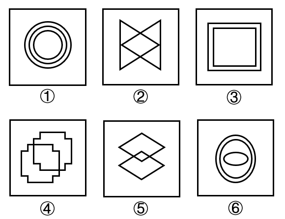

- **A**. ①②⑥，③④⑤
- **B**. ①③④，②⑤⑥
- **C**. ①③⑥，②④⑤　✅
- **D**. ①④⑥，②③⑤

**答案**：C

**官方解析**

本题为分组分类题目。观察发现，题干图形均是由多个封闭面组合而成，考虑图形间关系。图①③⑥中封闭面相包含，图②④⑤中封闭面相交。即图①③⑥一组，图②④⑤一组。
故正确答案为C。

---

## 第 2 题　qid 5101626 · 图形推理

从所给的四个选项中，选择最合适的一个填入问号处，使之呈现一定的规律性（    ）。

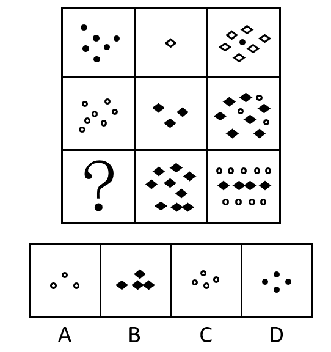

- **A**. A
- **B**. B
- **C**. C　✅
- **D**. D

**答案**：C

**官方解析**

元素组成不同，且无明显属性规律，考虑数量规律。观察发现，题干图形由小黑球、小白球、空白菱形和黑菱形构成，故优先考虑元素的种类和个数。题干图形为九宫格图形，优先横行看，第一行图1为6个小黑球，图2为1个空白菱形，图3为6个空白菱形+1个小黑球，由此发现，图1元素个数+图2元素个数=图3元素个数，同时图3两种元素的数量发生了互换；验证第二行，规律相同；故第三行也应遵循此规律，“？”处图形应该有4个小白球，只有C项符合。
故正确答案为C。

---

## 第 3 题　qid 5102413 · 图形推理

从所给的四个选项中，选择最合适的一个填入问号处，使之呈现一定的规律性：

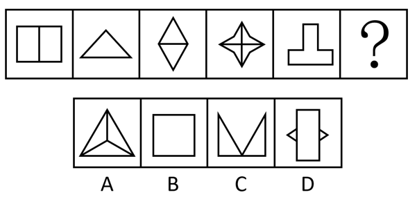

- **A**. A　✅
- **B**. B
- **C**. C
- **D**. D

**答案**：A

**官方解析**

元素组成不同，优先考虑属性规律。观察发现，每幅图形都为轴对称图形，但选不出答案，考虑对称轴的细化，题干图形对称轴数量依次为2、1、2、4、1，无规律。进一步观察发现，面分割明显，考虑数面，题干图形面数量依次为2、1、2、4、1，每幅图形面数量与对称轴数量相等，只有A项符合规律。
故正确答案为A。

---

## 第 4 题　qid 5101623 · 图形推理

从所给的四个选项中，选择最合适的一个填入问号处，使之呈现一定的规律性（    ）。

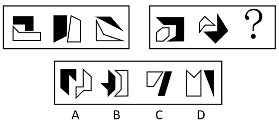

- **A**. A　✅
- **B**. B
- **C**. C
- **D**. D

**答案**：A

**官方解析**

元素组成不同，且无明显属性规律，考虑数量规律。观察发现，图形均由黑色图形和白色图形构成，可以考虑分开看，每个图形都是简单多边形，可以优先考虑数黑色图形和白色图形的边数。第一组图黑色图形边数分别为6、4、3，白色图形边数分别为5、4、4，可发现黑色图形边数与白色图形边数作差，差值为1、0、-1。第二组图黑色图形边数分别为7、5，白色图形边数分别为6、5，差值为1、0，因此，“？”处所填图形的黑色图形边数-白色图形边数=-1，A项的差值为-1，B项的差值为1，C项的差值为0，D项的差值为-2。
故正确答案为A。

---

## 第 5 题　qid 5102366 · 图形推理

把下面的六个图形分为两类，使每一类图形都有各自的共同特征或规律，分类正确的一项是：

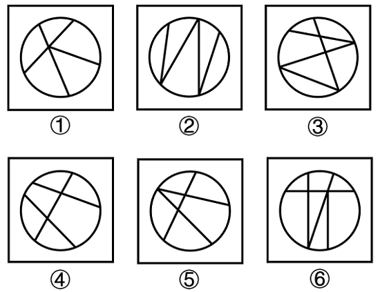

- **A**. ①②③，④⑤⑥
- **B**. ①②④，③⑤⑥　✅
- **C**. ①③④，②⑤⑥
- **D**. ①③⑥，②④⑤

**答案**：B

**官方解析**

本题为分组分类题目。元素组成不同，且无明显属性规律，考虑数量规律。观察发现，题干均为封闭图形被分割，考虑面数量，但整体数面无规律，考虑面的细化。进一步观察发现，图①②④的封闭面均由曲线和直线围成，图③⑤⑥的封闭面除由曲线和直线围成外，还存在全由直线围成的面。即①②④一组，③⑤⑥一组。
故正确答案为B。

---

## 第 6 题　qid 5102367 · 图形推理

从所给的四个选项中，选择最合适的一个填入问号处，使之呈现一定的规律性：

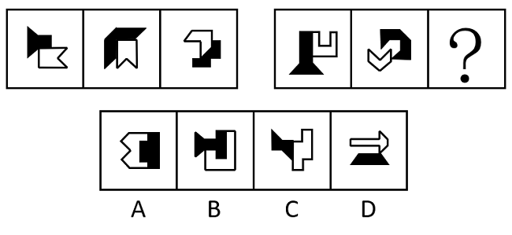

- **A**. A
- **B**. B
- **C**. C
- **D**. D　✅

**答案**：D

**官方解析**

元素组成不同，优先考虑属性规律。观察发现，题干图形出现箭头及多个等腰元素图形，考虑对称性。题干每幅图形都由两个单对称轴图形组成，因此分别画出每个图形的对称轴。第一组图形中，图1的两条对称轴平行，图2的两条对称轴相交，图3的两条对称轴垂直。第二组图形应遵循此规律，故？处图形应两条对称轴垂直，只有D项符合。

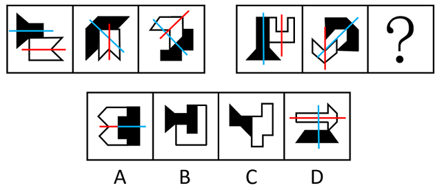

故正确答案为D。

---

## 第 7 题　qid 5102415 · 图形推理

从所给的四个选项中，选择最合适的一个填入问号处，使之呈现一定的规律性：

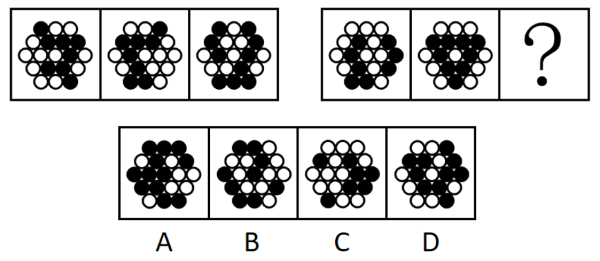

- **A**. A
- **B**. B
- **C**. C　✅
- **D**. D

**答案**：C

**官方解析**

元素组成相似，优先考虑样式规律。观察发现，题干图形轮廓和分割区域相同，但黑块数量不成规律，考虑黑白运算。第一组图形的运算规律为：黑+黑=白，白+白＝白，黑+白＝黑，白+黑＝黑，第二组图形运用此规律，只有C项符合。
故正确答案为C。

---

## 第 8 题　qid 5101625 · 图形推理

下列选项为4个正方体纸盒的外表面展开图，其中哪一个折叠成的纸盒与其他三个不一样？

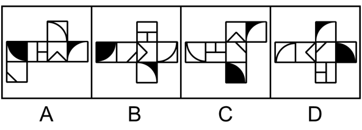

- **A**. A
- **B**. B
- **C**. C
- **D**. D　✅

**答案**：D

**官方解析**

将选项展开图标上序号，如下图所示（各选项面都相同，故相同的面用相同字母表示），逐一进行分析。

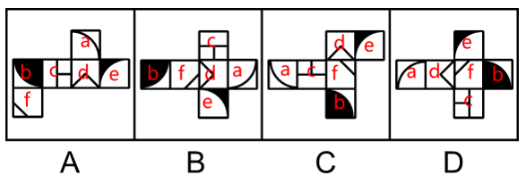

A项：以面b内黑色扇形的圆心为起点进行顺时针画边（如下图所示），边1对应面c，边2对应面f，边3对应面e；

B项：以面b内黑色扇形的圆心为起点进行顺时针画边（如下图所示），边1对应面c，边2对应面f，边3对应面e；

C项：以面b内黑色扇形的圆心为起点进行顺时针画边（如下图所示），边1对应面c，边2对应面f，边3对应面e；

D项：以面b内黑色扇形的圆心为起点进行顺时针画边（如下图所示），边1对应面f，边2对应面e，边3对应面a。

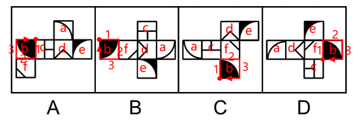

综上，只有D项与其他三项不同。

本题为选非题，故正确答案为D。

---

## 第 9 题　qid 5101624 · 图形推理

从所给的四个选项中，选择最合适的一个填入问号处，使之呈现一定的规律性（    ）。

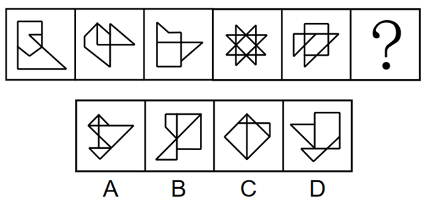

- **A**. A
- **B**. B
- **C**. C
- **D**. D　✅

**答案**：D

**官方解析**

元素组成不同，且无明显属性规律，考虑数量规律。观察发现，题干已知图形均为多圆相切变形图，考虑笔画数。题干中所有图形均由一笔画成，故？处应为一笔画图形。A、B、C三项均有4个奇点，由两笔画成，D项有2个奇点，由一笔画成。
故正确答案为D。

---

## 第 10 题　qid 5102370 · 图形推理

下图最左边的多面体由15个等大的白色正方体和3个等大的灰色正方体堆叠而成，其可以由右边2个小多面体和另一多面体组合而成，该多面体是：

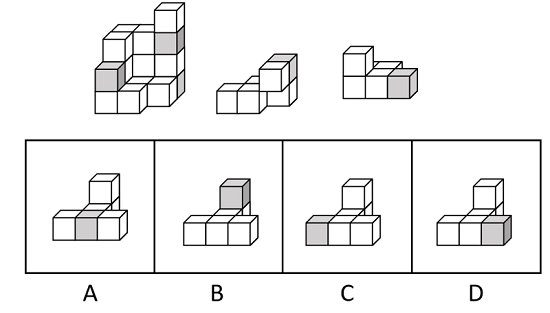

- **A**. A　✅
- **B**. B
- **C**. C
- **D**. D

**答案**：A

**官方解析**

本题考查立体拼合。如下图所示，立体图可以由①、②以及A项拼合而成。

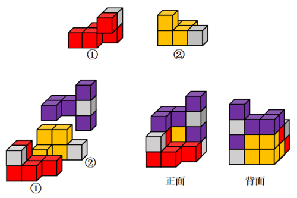

故正确答案为A。

---

## 第 11 题　qid 5101588 · 定义判断

自由联想和控制联想是联想实验的基本方法。自由联想实验中，主试者以听觉或视觉方式呈现一个刺激后（通常为词或图片），要求被试者尽快地说出头脑中浮现的词或事实，不管是什么东西，属于什么性质。与自由联想实验不同的是，控制联想实验中主试者会对被试者的联想作出一定的控制。
根据上述定义，下列属于控制联想的是（    ）。

- **A**. 在一个安静且光线适宜的房间里，心理咨询师让来访者躺在沙发上，完全放开地讲述自己童年的委屈与怨恨
- **B**. 在一项针对外国留学生对中国形象认知的研究中，研究者要求被试者在听到“中国”一词时，写下联想到的10个词语
- **C**. 美术课上在鉴赏《昭陵六骏图》时，老师让学生想象画中的马是否在运动，一名学生答到：它的四蹄是腾空的，这只马像是在飞奔　✅
- **D**. 警察在提审嫌犯时，让他在听到一个词后马上报出所想到的其他词，一开始是正常对答，然后警察突然提到“蜡烛”，嫌犯答以“牛奶瓶”，暴露了他将蜡烛插在牛奶瓶内照明的盗窃手段

**答案**：C

**官方解析**

第一步：找出定义关键词。

自由联想：“要求被试者尽快地说出头脑中浮现的词或事实”、“不管联想的是什么东西，属于什么性质”；

控制联想：“主试者对被试者的联想作出一定的控制”。

第二步：逐一分析选项。

A项：心理咨询师让来访者完全放开地讲述自己童年的委屈与怨恨，没有对被试者的联想进行控制，不符合“主试者对被试者的联想作出一定的控制”，不符合“控制联想”定义，排除；

B项：要求被试者在听到“中国”一词时，写下联想到的10个词语，对10个词语没有任何限制，符合“要求被试者尽快地说出头脑中浮现的词或事实”、“不管联想的是什么东西，属于什么性质”，符合“自由联想”定义，不符合“控制联想”定义，排除；

C项：老师让学生想象画中的马是否在运动，“是否运动”即是对学生关于马的想象进行了限制，符合“主试者对被试者的联想作出一定的控制”，符合“控制联想”定义，当选；

D项：警察让嫌犯在听到一个词后马上报出所想到的其他词，对嫌犯想到的词没有任何限制，符合“要求被试者尽快地说出头脑中浮现的词或事实”、“不管联想的是什么东西，属于什么性质”，符合“自由联想”定义，不符合“控制联想”定义，排除。（D项的表述也是“自由联想”词条下面的典型例子，如下图）

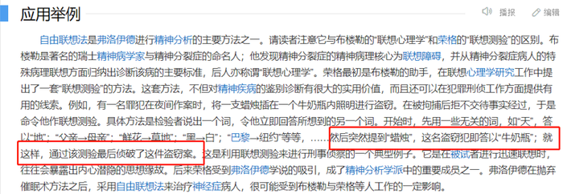

故正确答案为C。

---

## 第 12 题　qid 5101594 · 定义判断

条件自尊是指依赖他人的肯定和表扬而产生的自尊，一旦别人不再肯定自己时，就会开始自我怀疑，产生无能感、羞耻感。
根据上述定义，下列不属于条件自尊的是：

- **A**. 某次古代汉语课讲授小篆的历史和写法，内容较难，十分枯燥，许多同学昏昏欲睡，然而老师却依然讲得眉飞色舞　✅
- **B**. 小明期末考试取得了好成绩，如果家长表扬他，他会很高兴；如果家长对他的成绩不屑一顾，他就会觉得自己受了委屈
- **C**. 小吴非常喜欢分享自己的成绩，不管是考试还是参加活动，他都会第一时间把取得的好成绩发到微信朋友圈，并盯着手机看有谁给自己点了赞
- **D**. 据统计，即使生活上会遇到很多困难，但多数大学生就业时依然倾向于选择名望高、地位高、地处中心城市的工作，而不愿意选择去压力较小的小城市工作

**答案**：A

**官方解析**

第一步：找出定义关键词。
“依赖他人的肯定和表扬而产生的自尊”。
第二步：逐一分析选项。
A项：古代汉语课上，许多同学昏昏欲睡，即没有肯定老师，而老师却依然讲得眉飞色舞，即老师不依赖他人的肯定，不符合“依赖他人的肯定和表扬而产生的自尊”，不符合定义，当选；
B项：小明取得了好成绩，家长表扬他，他会很高兴，家长对他的成绩不屑一顾，他就会觉得自己受了委屈，通过两方面的对比说明小明很在意他人的表扬，符合“依赖他人的肯定和表扬而产生的自尊”，符合定义，排除；
C项：小吴喜欢分享自己的好成绩，并盯着手机看别人给自己点赞，说明小吴很在意他人对自己成绩的肯定，符合“依赖他人的肯定和表扬而产生的自尊”，符合定义，排除；
D项：即使生活上会遇到很多困难，多数大学生依然倾向于选择“名望高”“地位高”的工作，而非去压力较小的小城市工作，说明这些大学生很看重“名望”和“地位”，这也意味这些大学生在意他人的评价，对他人的肯定存在需求，符合“依赖他人的肯定和表扬而产生的自尊”，符合定义，排除。
本题为选非题，故正确答案为A。

---

## 第 13 题　qid 5101610 · 定义判断

参考价格效应是指商品的价格相对于消费者认知的其他替代商品越高，消费者对价格就越敏感。反之，消费者则对价格不敏感。
根据上述定义，下列体现了参考价格效应的是（    ）。

- **A**. 消费者购买了一件原价为2300元、现价为999元的衣服时，感到了一种在价格促销中省钱的喜悦
- **B**. 某高端电脑的价格高出同类产品20%以上，但消费者却很愿意购买，这是因为担心普通产品的性能无法令人满意
- **C**. 百货公司一楼大多是高档化妆品柜台，价格之高让普通人难以接受，但在看过这些几乎全是千元起步的价目牌后，消费者反而觉得二楼售价500元一件的衬衫也不贵
- **D**. 杂货店老板经常会将价格较低但毛利率较高的大众品牌放在顾客第一眼看不到的地方，而将价格较高的品牌放在显眼的位置，这样顾客看到大众品牌的价格时就会觉得便宜而购买　✅

**答案**：D

**官方解析**

第一步：找出定义关键词。
“其他替代商品”、“价格越高（商品与其他替代商品相比）”、“消费者对价格敏感”。
第二步：逐一分析选项。
A项：原价为2300元、现价为999元的商品，为同一件商品，并未体现“其他替代商品”，不符合定义，排除；
B项：消费者愿意购买高端电脑是因为普通产品的性能不能和高端电脑相比，说明消费者看重产品性能，对产品性能敏感，不满足“消费者对价格敏感”，不符合定义，排除；
C项：看过高档化妆品后觉得500元的衬衫不贵，“化妆品”和“衬衫”是两种功能不一致的商品，不存在替代关系，不满足“其他替代商品”，不符合定义，排除；
D项：“价格较低的大众品牌”“价格较高的品牌”说明是同一种商品存在替代性，符合“其他替代商品”，并且“价格低”和“价格高”可以体现两者之间的价格比较，“顾客看到大众品牌的价格时就会觉得便宜而购买”说明顾客购买是因为价格，符合“价格越高（商品与其他替代商品相比）”、“消费者对价格敏感”，符合定义，当选。
故正确答案为D。

---

## 第 14 题　qid 5102365 · 定义判断

“茧居族”是指那些如虫子般缩在狭小的壳里不见天日的人。这些人有以下几个特征：几乎不出门，即使偶尔出门也是去最近的商店购买生活必需品；与他人零交流，即使与家人联系也是因为生存需要；以上两点持续时间在半年以上。
根据上述定义，下列属于“茧居族”的是：

- **A**. 小李原为某公司的业务员，2020年因不适应公司业务转型而被解聘。被解聘后，小李感到非常沮丧，经常通宵达旦上网打游戏，想以此来疏解心中的苦闷
- **B**. 小田小时候就发现自己不愿与人接触，但她依然试着去上学，找工作，找男朋友。27岁那年，她辞掉工作，和男朋友分手，开始“宅”在家里，这让她感到从未有过的轻松
- **C**. 小张大学毕业后没有找到工作，由于自卑，小张退出了同学群和朋友圈，过起了几乎不出门、不与社会接触、整天与电视、电脑和漫画书为伴的生活。直到第二年毕业招聘季，小张才在父母的劝说下尝试着找工作　✅
- **D**. 小王是某市的高考状元，被一所重点大学录取。入学后，大学全新的生活方式与学习模式让小王很难适应，高考状元光环也逐渐消退，这使得小王越发地感到失落和自卑，变得越来越不愿意与同学交流，也不愿意参与班级活动

**答案**：C

**官方解析**

第一步：找出定义关键词。
“几乎不出门”、“与他人零交流”、“以上两点持续时间在半年以上”。
第二步：逐一分析选项。
A项：小李经常通宵达旦上网打游戏，但不确定小李是在家打游戏，还是在网吧打游戏，不符合“几乎不出门”，并且打游戏有时需要与他人交流，也不符合“与他人零交流”，不符合定义，排除；
B项：小田只是与男朋友分手，但不确定是否会与他人交流，不符合“与他人零交流”，不符合定义，排除；
C项：小张的生活是几乎不出门、不与社会接触，符合“几乎不出门”，也符合“与他人零交流”，并且毕业后直到第二年毕业招聘季才开始尝试找工作，说明“以上两点持续时间在半年以上”，符合定义，当选；
D项：小王不愿意与同学交流，但不确定他是否与同学之外的人交流了，不符合“与他人零交流”，并且不愿意参与班级活动，不确定是否是几乎不出门，不符合“几乎不出门”，不符合定义，排除。
故正确答案为C。

---

## 第 15 题　qid 5101591 · 定义判断

仿拟是按照已有的语言表达形式，临时造出新的语言形式的一种辞格。仿拟所模仿的一般为固定词语或短语，也可以扩大到句子、段落、篇章，甚至语体、风格。根据仿照的对象，仿拟可分为仿词、仿句、仿篇、仿体和仿调。
根据上述定义，下列不属于仿拟的是（    ）。

- **A**. 走别人的路，让别人无路可走
- **B**. 新事业从头做起，旧现象一手推平　✅
- **C**. 给你开一服爱情灵药：真心一片，温柔二钱，尊重三分
- **D**. 满心“婆理”而满口“公理”的绅士们的名言暂且置之不论不议之列

**答案**：B

**官方解析**

第一步：找出定义关键词。
“按照已有的语言表达形式”、“临时造出新的语言形式”。
第二步：逐一分析选项。
A项：“走别人的路，让别人无路可走”仿拟了意大利文学家但丁的代表作长诗《神曲》中的“走自己的路，让别人说去吧”，符合“按照已有的语言表达形式”、“临时造出新的语言形式”，符合定义，排除；
B项：“新事业从头做起，旧现象一手推平”既表述了理发的情景，同时又寄托着人们除旧布新的愿望和喜迎新社会的感情，这是“双关”的修辞手法，并没有体现出根据已有的语言表达形式来创造新的语言形式，不符合“按照已有的语言表达形式”、“临时造出新的语言形式”，不符合定义，当选；
C项：“真心一片，温柔二钱，尊重三分”，这句话仿拟的原型是中药方剂中的药方，其中“片”、“钱”、“分”是古代的计量单位，符合“按照已有的语言表达形式”、“临时造出新的语言形式”，符合定义，排除；
D项：“满心‘婆理’而满口‘公理’”中的“婆理”是仿拟“公理”这个词创造而成的，符合“按照已有的语言表达形式”、“临时造出新的语言形式”，符合定义，排除。
本题为选非题，故正确答案为B。

---

## 第 16 题　qid 5101614 · 定义判断

情绪记忆是以经历过的情绪和情感体验为内容的记忆。当经历时的情境或事件引起了个体强烈的情绪和情感体验时，这种体验就会和当时的情境或事件信息一起，保持在个体的记忆中。
根据上述定义，下列属于情绪记忆的是（    ）。

- **A**. 小航在日记中记录了上周和爸爸妈妈去公园玩时阳光明媚、内心愉悦等经历
- **B**. 一位十年前亲眼目睹过空难事件的男子到现在脑中还经常浮现起那可怕的一幕
- **C**. 小辉每次想把腿翘在桌子上时就会想起妈妈不允许这样做的呵斥声，便打消了这个念头　✅
- **D**. 沈从文对自己的故乡有很深的感情，他在后来的文学创作中也常常表达出自己对故乡的眷恋

**答案**：C

**官方解析**

第一步：找出定义关键词。
“以经历过的情绪和情感体验为内容”、“经历时的情绪和情感体验和当时的情境或事件信息一起”、“保持在个体的记忆中”。
第二步：逐一分析选项。
A项：小航在日记中记录经历，不是把情绪和情感体验保持在记忆中，不符合“保持在个体的记忆中”，不符合定义，排除；
B项：男子现在脑中还经常浮现起那可怕的一幕，符合“保持在个体的记忆中”，但浮现可怕的一幕只是体现了当时的情境信息，没有体现出他当时目睹空难时的情绪和情感体验，不符合“以经历过的情绪和情感体验为内容”、“经历时的情绪和情感体验和当时的情境或事件信息一起”，不符合定义，排除；
C项：小辉想起妈妈不允许这样做的呵斥声，便打消了这个念头，说明小辉对妈妈的呵斥声产生了害怕的情绪和情感体验，小辉回想起的就是妈妈呵斥使他害怕的情感体验，符合“以经历过的情绪和情感体验为内容”、“经历时的情绪和情感体验和当时的情境或事件信息一起”、“保持在个体的记忆中”，符合定义，当选；
D项：沈从文在后来的文学创作中也常常表达出自己对故乡的眷恋，不符合“记忆”、“以经历过的情绪和情感体验为内容”，不符合定义，排除。
故正确答案为C。

---

## 第 17 题　qid 5101603 · 定义判断

吸纳效应是指一个地区最初不管由于什么原因得到加速发展，一旦步入经济高速增长的快车道，就会产生很大的“磁性”，不断吸纳各种生产要素，将其他地区甚至国外市场的资本、技术、信息、人才和物质资源不断地吸纳到本地区来，使本地区具有丰裕的经济资源，从而突破区域经济发展过程中的资本短缺、技术落后、人才不足、信息不畅等瓶颈，为进一步发展创造条件。即使原先赖以发展的优势已经丧失，它仍然可以向前发展。
根据上述定义，下列属于吸纳效应的是（    ）。

- **A**. 浦东是最早成立的国家级新区，1990年浦东新区成立之初人口仅133万，2020年常住人口达到568万，增长率超过300%
- **B**. 在资源红利的诱导下，资金、装备等各种经济要素汇聚到了煤炭及其相关产业领域，促进了煤炭经济的繁荣，但在后期经济转型的大背景下，煤炭业逐渐衰落
- **C**. 某地在开发建设新区后，颁布了一系列创业扶持政策，多家科技巨头纷纷在该地建厂办公，全国各地毕业生到该地就业，即使是在全国范围内的抢人大战中也不落下风　✅
- **D**. 某地处于工业化快速发展阶段时人口逐渐集聚，而商业设置配套却严重不足，以外来人口为主的流动摊贩应运而生，形成了繁荣的夜市。近年来，夜市遭到周边居民投诉而被限制

**答案**：C

**官方解析**

第一步：找出定义关键词。
“一个地区”、“经济高速增长”、“吸纳各种生产要素”、“突破区域经济发展过程中的瓶颈”、“为进一步发展创造条件”。
第二步：逐一分析选项。
A项：浦东新区从1990年到2020年人口增长率超过300%，只涉及当地人口的增长，没有体现具体的经济发展，不符合“经济高速增长”，同时也没有体现“突破区域经济发展过程中的瓶颈”，不符合定义，排除；
B项：各种经济要素汇聚到了煤炭及其相关产业领域，强调的是产业领域，没有体现具体地区，不符合“一个地区”，不符合定义，排除；
C项：某地在开发建设新区后颁布扶持政策，多家科技巨头建厂办公，全国各地毕业生到该地就业，能够体现各种生产要素的聚集，符合“一个地区”、“吸纳各种生产要素”，即使在抢人大战中也不落下风，符合“为进一步发展创造条件”，符合定义，当选；
D项：某地商业设置配套严重不足，最终形成了繁荣的夜市，但是夜市遭到周边居民投诉而被限制，证明经济发展中出现了问题，不符合“为进一步发展创造条件”，不符合定义，排除。
故正确答案为C。

---

## 第 18 题　qid 5101604 · 定义判断

污染效应是指在消费环境下，当某个人、事、物等源头将其特定或抽象的属性转移到某个产品上时，消费者会根据属性转移的结果来判断产品的价值，从而决定增加还是降低购买意愿。
根据上述定义，下列属于污染效应的是：

- **A**. 某培训机构举行报名即可获赠名师签名的活动，尽管现场气氛热烈，但报名人数寥寥
- **B**. 虽然演唱会门票被黄牛党炒高了好几倍，但仍阻挡不了铁粉前往现场与偶像互动的热情
- **C**. 小张在旧书网看中一本稀缺专业书籍，尽管该书籍有些污渍且价格较高，他还是决定购买
- **D**. 小刘花5000元购买了一双某球星穿过的普通版球鞋，而这双旧鞋的价格远远高于同款新鞋　✅

**答案**：D

**官方解析**

第一步：找出定义关键词。
“在消费环境下”、“某个人、事、物等将其某些属性转移到某个产品上”、“消费者会根据属性转移的结果来判断产品的价值”、“从而决定增加还是降低购买意愿”。
第二步：逐一分析选项。
A项：某培训机构举行报名即可获赠名师签名的活动，某培训机构将名师签名附加到课程上，符合“某个人、事、物等将其某些属性转移到某个产品上”，报名人数寥寥，说明签名未影响报名的意愿，不符合“消费者会根据属性转移的结果来判断产品的价值”、“从而决定增加还是降低购买意愿”，不符合定义，排除； 
B项：演唱会门票被黄牛党炒高了好几倍，只是在说门票本身价格被炒高，并没有其他属性转移到门票上，不符合“某个人、事、物等将其某些属性转移到某个产品上”，不符合定义，排除；
C项：小张在旧书网看中一本专业书籍，稀缺性、有污染和价格较高均是目前这本书籍本身的属性，不符合“某个人、事、物等将其某些属性转移到某个产品上”，不符合定义，排除；
D项：小刘花5000元购买某球星穿过的球鞋，球星将他的名气转移到了穿过的球鞋上，符合“在消费环境下”、“某个人、事、物等将其某些属性转移到某个产品上”，这双旧鞋的价格远远高于同款新鞋，但小刘依然选择了购买，符合“消费者会根据属性转移的结果来判断产品的价值”，符合定义，当选。
故正确答案为D。

---

## 第 19 题　qid 5101587 · 定义判断

“舍本求末”基模描述了当系统出现棘手问题时，人们往往急于求成，采取短期的应急措施，反而延误了长期的根本解决问题方案的系统行为模式。
根据上述定义，下列属于“舍本求末”基模的是：

- **A**. 两家公司为了争夺更高的市场占有率，均采用了降价销售的策略，结果陷入了竞相压价的恶性循环，导致双方都严重亏损
- **B**. 某奶茶公司一度发展为行业龙头，几年后进入瓶颈期。为谋求出路，公司高层就是否裁撤门店发生严重内斗，导致业绩断崖式下滑
- **C**. 某高新技术公司产品去年的市场占有额有所下降，为挽救这一态势，该公司把重点放在了改进现有产品来继续占有市场，放弃了研发新产品的计划　✅
- **D**. 两家煤化厂合作共同开发当地的煤炭资源，几年内均赚得盆满钵满。为提高收益水平，两家企业均加大了煤炭开采力度，导致有限的煤炭资源在短时间内消耗殆尽

**答案**：C

**官方解析**

第一步：找出定义关键词。
“当系统出现棘手问题时”、“采取短期的应急措施”、“延误了长期的根本解决问题方案”。
第二步：逐一分析选项。
A项：为争夺市场占有率而采用降价销售的策略，“降价销售”是为了获得更高市场占有率，不是为了解决出现的问题，不符合“当系统出现棘手问题时”，不符合定义，排除；
B项：奶茶公司进入瓶颈期，符合“当系统出现棘手问题时”，高层为谋求出路发生严重内斗，没有提到为解决问题而采取“措施”，不符合“采取短期的应急措施”，不符合定义，排除；
C项：产品去年的市场占有额下降，符合“当系统出现棘手问题时”，改进现有产品占有市场，放弃研发新产品，符合“采取短期的应急措施”、“延误了长期的根本解决问题方案”，符合定义，当选；
D项：为提高收益水平加大煤炭开采力度，没有体现“当系统出现棘手问题时”，不符合定义，排除。
故正确答案为C。

---

## 第 20 题　qid 5101600 · 定义判断

强制型顾客参与是指为确保服务或生产的顺利完成或交付，在服务过程中将顾客被动摄入到服务或生产中，并使顾客投入体力、知识、信息、情感或其他资源。
根据上述定义，下列属于强制型顾客参与的是：

- **A**. 电商提示顾客，填写商品高分评价可获得商家代金券
- **B**. 网购买家要求卖家启动在线售后流程，以便寄回货物完成退换货
- **C**. 热水器安装师傅在安装工作完成后，请求用户对其服务给满分评价
- **D**. 眼镜店工作人员在配镜过程中，要求顾客全力配合以获取各项测试数据　✅

**答案**：D

**官方解析**

第一步：找出定义关键词。
“为确保服务或生产的顺利完成或交付”、“在服务过程中”、“将顾客被动摄入到服务或生产中”、“使顾客投入资源”。
第二步：逐一分析选项。
A项：电商提示顾客填写评价，仅仅是“提示”而非要求，因此顾客可以自主选择是否填写，不符合“将顾客被动摄入到服务或生产中”，且填写商品评价往往是在商品的购买完成之后，不符合“在服务过程中”，不符合定义，排除；
B项：买家要求卖家启动在线售后流程，是买家主动要求，不符合“将顾客被动摄入到服务或生产中”，不符合定义，排除；
C项：热水器安装师傅“在安装工作完成后”请求用户评价，不符合“在服务过程中”，不符合定义，排除；
D项：眼镜店工作人员在配镜过程中要求顾客配合以获取数据，目的是为了顺利配制眼镜，在配镜过程中符合“在服务过程中”，顾客被要求配合，符合“将顾客被动摄入到服务或生产中”、“使顾客投入资源”，目的是为了顺利配制眼镜，符合“为确保服务或生产的顺利完成或交付”，符合定义，当选。
故正确答案为D。

---

## 第 21 题　qid 5101593 · 类比推理

水落：石出

- **A**. 理屈：词穷　✅
- **B**. 狼奔：豕突
- **C**. 枕戈：待旦
- **D**. 求全：责备

**答案**：A

**官方解析**

第一步：判断题干词语间逻辑关系。
因为水面落下，所以水底的石头漏了出来，“水落”导致“石出”，二者为因果关系。
第二步：判断选项词语间逻辑关系。
A项：因为理亏，所以无言以对，“理屈”导致“词穷”，二者为因果关系，与题干逻辑关系一致，当选；
B项：“狼奔”指像狼一样奔跑，“豕突”指像猪一样冲撞，二者为并列关系，与题干逻辑关系不一致，排除；
C项：“枕戈”指枕着武器睡觉，“待旦”指等待天明，二者不是因果关系，与题干逻辑关系不一致，排除；
D项：“求全”指希望所做的事完美，“责备”指埋怨他人或自责，二者不是因果关系，与题干逻辑关系不一致，排除。
故正确答案为A。

---

## 第 22 题　qid 5101601 · 类比推理

排练：演出：节目

- **A**. 革命：建设：改革
- **B**. 起草：发表：文章　✅
- **C**. 发烧：咳嗽：感冒
- **D**. 调查：走访：问卷

**答案**：B

**官方解析**

第一步：判断题干词语间逻辑关系。
排练和演出是两个动作，分别可以和节目构成动宾结构，且存在先后顺序，即先排练节目，后演出节目。
第二步：判断选项词语间逻辑关系。
A项：革命和建设是两个动作，但与改革都不构成动宾结构，与题干逻辑关系不一致，排除；
B项：起草和发表是两个动作，分别可以和文章构成动宾结构，且存在先后顺序，即先起草文章，后发表文章，与题干逻辑关系一致，当选；
C项：感冒时可能会伴随着发烧和咳嗽，发烧和咳嗽是两个不同的症状，二者为并列关系，与题干逻辑关系不一致，排除；
D项：走访和问卷可以是两种不同的调查方式，二者为并列关系，与题干逻辑关系不一致，排除。
故正确答案为B。

---

## 第 23 题　qid 5102414 · 类比推理

蝴蝶：蟋蟀：昆虫

- **A**. 和风：细雨：气候
- **B**. 梨花：梨子：果树
- **C**. 餐桌：衣柜：家具　✅
- **D**. 日食：月晕：星球

**答案**：C

**官方解析**

第一步：判断题干词语间逻辑关系。
蝴蝶和蟋蟀都是昆虫，二者之间为并列关系，与昆虫均为种属关系。
第二步：判断选项词语间逻辑关系。
A项：和风指速度和缓的风，温和的风，细雨指的是小雨，微雨，和风和细雨均为自然界的现象，二者之间为并列关系，但二者均属于天气的一种，与气候之间不构成种属关系，与题干逻辑关系不一致，排除；
B项：梨花和梨子分别为梨树上开的花和结的果，二者之间为并列关系，且都是梨树的组成部分，与果树不构成种属关系，与题干逻辑关系不一致，排除；
C项：餐桌和衣柜都是家具，二者之间为并列关系，与家具均为种属关系，与题干逻辑关系一致，当选；
D项：日食是一种天文现象，当月球运动到太阳和地球中间，三者正好处于一条直线时，月球会挡住太阳射向地球的光，月球身后的黑影落到地球上，出现日食现象，月晕是一种自然界的光学现象，当光透过高空卷层云时，受冰晶折射作用而形成彩色光圈，出现在月亮周围的光圈叫月晕，二者与星球均无明显逻辑关系，与题干逻辑关系不一致，排除。
故正确答案为C。

---

## 第 24 题　qid 5101609 · 类比推理

潮汐能：生物质能：可再生

- **A**. 小米：核桃：可助眠
- **B**. 手套：围巾：可防寒
- **C**. 洗手液：消毒液：可除菌
- **D**. 易拉罐：塑料瓶：可回收　✅

**答案**：D

**官方解析**

第一步：判断题干词语间逻辑关系。
潮汐能和生物质能是两种可再生能源，二者为并列关系，同时二者均有可再生的特点，因此均与可再生构成属性对应关系。
第二步：判断选项词语间逻辑关系。
A项：小米和核桃是两种食物，二者为并列关系，同时二者均可助眠，因此均与可助眠构成功能对应关系，与题干逻辑关系不一致，排除；
B项：手套和围巾是两种配饰，二者为并列关系，同时二者均可防寒，因此均与可防寒构成功能对应关系，与题干逻辑关系不一致，排除；
C项：洗手液和消毒液是两种清洁用品，二者为并列关系，同时二者均可除菌，因此均与可除菌构成功能对应关系，与题干逻辑关系不一致，排除；
D项：易拉罐和塑料瓶是两种可回收容器，二者为并列关系，同时二者均有可回收的特点，因此均与可回收构成属性对应关系，与题干逻辑关系一致，当选。
故正确答案为D。

---

## 第 25 题　qid 5101596 · 类比推理

柳暗花明：峰回路转

- **A**. 天长地久：物是人非
- **B**. 天翻地覆：日新月异
- **C**. 风和日丽：碧空如洗　✅
- **D**. 和蔼可亲：语重心长

**答案**：C

**官方解析**

第一步：判断题干词语间逻辑关系。
“柳暗花明”指绿柳成荫、繁花似锦的景象，也比喻经过一番曲折后，出现新的局面；“峰回路转”形容山峰迂回，道路曲折，也比喻事情经历曲折后，出现新的转机，二者是近义关系。
第二步：判断选项词语间逻辑关系。
A项：“天长地久”意思是像天地一样长久，多比喻爱情永久不变；“物是人非”指景物依旧，而人已变更，多用以形容对故人的怀念。二者不是近义关系，与题干逻辑关系不一致，排除；
B项：“天翻地覆”形容变化极大或闹得很凶，侧重于变动得剧烈；“日新月异”指天天都有更新，月月都在变化，形容进步、发展很快，新事物、新气象不断出现，侧重于变化得快。二者不是近义关系，与题干逻辑关系不一致，排除；
C项：“风和日丽”指微风柔和，阳光明媚，形容天气晴好；“碧空如洗”指蓝色的天空像洗过一样的明净，形容天气晴朗。二者是近义关系，与题干逻辑关系一致，当选；
D项：“和蔼可亲”指说话或待人的态度很和气，使人感到亲近；“语重心长”指言辞诚恳，情意深长。二者不是近义关系，与题干逻辑关系不一致，排除。
故正确答案为C。

---

## 第 26 题　qid 5101606 · 类比推理

脱贫攻坚：转移就业：经济

- **A**. 简政放权：大众创业：市场
- **B**. 资源保护：竭泽而渔：环境
- **C**. 抗击疫情：核酸检测：民生　✅
- **D**. 人才培养：体育竞技：教育

**答案**：C

**官方解析**

第一步：判断题干词语间逻辑关系。
转移就业可以达到脱贫攻坚的目的，脱贫攻坚可以达到促进经济发展的目的。
第二步：判断选项词语间逻辑关系。
A项：通过简政放权可以达到促进大众创业的目的，但两词顺序与题干相反，与题干逻辑关系不一致，排除；
B项：竭泽而渔的意思是排尽湖水或池水捉鱼，比喻只图眼前利益，不作长远打算，竭泽而渔不是资源保护的方式，与题干逻辑关系不一致，排除；
C项：核酸检测可以达到抗击疫情的目的，抗击疫情可以达到保障民生的目的，与题干逻辑关系一致，当选；
D项：体育竞技是一种制度化、体系化的竞争性体育活动，体育竞技不是人才培养的方式，与题干逻辑关系不一致，排除。
故正确答案为C。

---

## 第 27 题　qid 5101607 · 类比推理

私塾：学校：教师

- **A**. 木箸：筷子：客官
- **B**. 轿辇：火车：旅客
- **C**. 客栈：宾馆：掌柜
- **D**. 医馆：医院：医生　✅

**答案**：D

**官方解析**

第一步：判断题干词语间逻辑关系。
私塾是旧时家庭、宗族或教师自己设立的教学处所，与学校是全同关系；教师在学校工作，二者是职业与地点的对应关系。
第二步：判断选项词语间逻辑关系。
A项：木箸是指木头筷子，是筷子的一种，二者是种属关系，不是全同关系，与题干逻辑关系不一致，排除；
B项：轿辇是古时轿子和用人拉或推的车的统称，与火车不是全同关系，与题干逻辑关系不一致，排除；
C项：客栈为古代供人暂住的场所，与宾馆是全同关系；掌柜指古代的老板或总管店铺的人，掌柜可以在客栈工作，但宾馆是现代的，掌柜与宾馆不是职业与地点的对应关系，与题干逻辑关系不一致，排除；
D项：医馆即古代医院的别称，与医院是全同关系；医生在医院工作，二者是职业与地点的对应关系，与题干逻辑关系一致，当选。
故正确答案为D。

---

## 第 28 题　qid 5102376 · 类比推理

莫愁前路无知己：天下谁人不识君

- **A**. 纸上得来终觉浅：绝知此事要躬行
- **B**. 商女不知亡国恨：隔江犹唱后庭花
- **C**. 春色满园关不住：一枝红杏出墙来
- **D**. 不识庐山真面目：只缘身在此山中　✅

**答案**：D

**官方解析**

第一步：判断题干词语间逻辑关系。
题干诗句的意思是不要担心前路茫茫没有知己，普天之下都认识你。因为“普天之下都认识你”，所以“不要担心前路茫茫没有知己”。“天下谁人不识君”为因，“莫愁前路无知己”为果，二者为因果对应关系。
第二步：判断选项词语间逻辑关系。
A项：诗句的意思是从书本上得来的知识毕竟是不够完善的，因此如果想要深入理解其中的道理，必须要亲自实践才行。因为“从书本上得来的知识不够完善”，所以“必须要亲自实践才行”。“纸上得来终觉浅”是因，“绝知此事要躬行”是果，顺序与题干相反，与题干逻辑关系不一致，排除；
B项：诗句的意思是卖唱的歌女不懂什么叫亡国之恨，所以隔着江水还高唱着《玉树后庭花》。因为“歌女不懂什么叫亡国之恨”，所以“隔着江水还能高唱”。“商女不知亡国恨”是因，“隔江犹唱后庭花”是果，顺序与题干相反，与题干逻辑关系不一致，排除；
C项：诗句的意思是一扇柴门虽然关住了游人，却关不住满园春色，一枝红色的杏花早已探出墙来。“一枝红杏出墙来”侧面体现了“春色满园”，不是“春色满园”的原因，与题干逻辑关系不一致，排除；
D项：诗句的意思是我之所以认不清庐山真正的面目，是因为我人身处在庐山之中，因为“我人身处在庐山之中”，所以“认不清庐山真正的面目”。“只缘身在此山中”是因，“不识庐山真面目”是果，二者为因果对应关系，与题干逻辑关系一致，当选。
故正确答案为D。

---

## 第 29 题　qid 5101613 · 类比推理

望尘莫及 对于 （    ） 相当于 （    ） 对于 雪中送炭

- **A**. 后来居上；济困扶贫
- **B**. 不可逾越；落井下石
- **C**. 瞠乎其后；趁火打劫
- **D**. 高不可攀；乐于助人　✅

**答案**：D

**官方解析**

逐一代入选项。
A项：“望尘莫及”是指只望见走在前面的人带起的尘土而追赶不上，形容远远落后，“后来居上”是指后起的超过先前的，二者是反义关系；“济困扶贫”意思是扶持贫穷的人接济困难的人，“雪中送炭”用来比喻在别人急需的时候给以帮助，二者是近义关系，前后逻辑关系不一致，排除；
B项：“望尘莫及”是指只望见走在前面的人带起的尘土而追赶不上，形容远远落后，“不可逾越”是指不能超过，形容障碍、阻力很大，二者是近义关系；“落井下石”是指别人掉进井里，不但不救，反而往井下投石，用来比喻乘人之危，加以打击、陷害，“雪中送炭”用来比喻在别人急需的时候给以帮助，二者是反义关系，前后逻辑关系不一致，排除；
C项：“望尘莫及”是指只望见走在前面的人带起的尘土而追赶不上，形容远远落后，“瞠乎其后”是指在别人后面干瞪眼赶不上，形容远远落在后面，二者是近义关系；“趁火打劫”是指趁人家失火的时候去抢人家的东西，泛指趁紧张危急的时候侵犯别人的权益，“雪中送炭”用来比喻在别人急需的时候给以帮助，二者是反义关系，前后逻辑关系不一致，排除；
D项：“望尘莫及”是指只望见走在前面的人带起的尘土而追赶不上，形容远远落后，“高不可攀”是指高得没法攀登，多指难以达到或攀附，二者是近义关系；“乐于助人”是指很乐意帮助别人，“雪中送炭”用来比喻在别人急需的时候给以帮助，二者是近义关系，前后逻辑关系一致，当选。
故正确答案为D。

---

## 第 30 题　qid 5101615 · 类比推理

（    ） 对于 吹尽狂沙始到金 相当于 （    ） 对于 绝知此事要躬行

- **A**. 聚少成多；纸上谈兵
- **B**. 持之以恒；身体力行　✅
- **C**. 无坚不摧；力学笃行
- **D**. 水滴石穿；实事求是

**答案**：B

**官方解析**

逐一代入选项。
A项：“聚少成多”意思是一点一滴的积累，就会由少变多，“吹尽狂沙始到金”出自刘禹锡的《浪淘沙》，其完整诗句为“千淘万漉虽辛苦，吹尽狂沙始到金”，意思是要经过千遍万遍的过滤，历尽千辛万苦，最终才能淘尽泥沙得到闪闪发光的黄金，比喻坚持到底、永不放弃，二者无明显逻辑关系；“纸上谈兵”意思是在文字上谈用兵策略，比喻不联系实际情况，空发议论，“绝知此事要躬行”出自陆游的《冬夜读书示子聿》，其完整诗句为“纸上得来终觉浅，绝知此事要躬行”，意思是从书本上得来的知识，毕竟是不够完善的，如果想要深入理解其中的道理，必须要亲自实践才行，指出实践的重要性，二者为反义关系，前后逻辑关系不一致，排除；
B项：“持之以恒”意思是长久地坚持下去，“吹尽狂沙始到金”比喻坚持到底、永不放弃，二者为近义关系；“身体力行”意思是亲身体验，努力实行，“绝知此事要躬行”是指做事必须亲身去实践，方能有所成功，二者为近义关系，前后逻辑关系一致，当选；
C项：“无坚不摧”意思是没有任何坚固的东西不能摧毁，形容力量强大，“吹尽狂沙始到金”比喻坚持到底、永不放弃，二者无明显逻辑关系；“力学笃行”意思是刻苦学习并认真的实践，“绝知此事要躬行”是指做事必须亲身去实践，方能有所成功，二者为近义关系，前后逻辑关系不一致，排除；
D项：“水滴石穿”比喻力量虽小，只要坚持不懈，事情就能成功，“吹尽狂沙始到金”比喻坚持到底、永不放弃，二者为近义关系；“实事求是”意思是从实际情况出发，不夸大，不缩小，正确地对待和处理问题，“绝知此事要躬行”是指做事必须亲身去实践，方能有所成功，二者无明显逻辑关系，前后逻辑关系不一致，排除。
故正确答案为B。

---

## 第 31 题　qid 5101618 · 逻辑判断

日前，某区物价管理部门修改了停车费收费方案和标准，将机动车停车位收费价格上调了50%，并把部分原来免费的车位也纳入了收费管理，同时对新能源车免收停车费，这样能够增加车位的流动性，根治部分车主久占车位的乱象，有效缓解交通压力。
以下哪项如果为真，最能支持上述方案？

- **A**. 该方案通过网络征求了广大市民的意见和建议
- **B**. 停车费收费方案调整后大大提升了车位空置率　✅
- **C**. 增加后的停车费标准仅与相邻城市的标准持平
- **D**. 提高燃油机动车使用成本市民会购买新能源车

**答案**：B

**官方解析**

第一步：找出论点和论据。
论点：某区物价管理部门修改了停车费收费方案和标准，这样能够增加车位的流动性，根治部分车主久占车位的乱象，有效缓解交通压力。
论据：无。
本题只有论点，没有论据，加强优先考虑补充论据，即通过解释原因或举例子的方式来说明通过“修改停车费收费方案和标准”确实能“增加车位流动性”。
第二步：逐一分析选项。
A项：该项指出此方案征求了市民的意见和建议，但是市民同意该方案不代表该方案就可以增加车位流动性，为无关项，无法加强，排除；
B项：该项指出调整方案后大大提升了车位空置率，车位空置率的提升可以增加车位的流动性，解释了为什么修改停车费收费方案和标准后，可以增加车位流动性，解释原因，可以加强，当选；
C项：该项是拿本市的停车费标准与相邻城市的停车费标准进行比较，但本市与相邻城市的收费标准持平不代表可以增加车位流动性，为无关项，无法加强，排除； 
D项：该项指出提高燃油机动车使用成本，市民会购买新能源车，但市民购买了新能源车不代表可以增加车位流动性，无法加强，排除。
故正确答案为B。

---

## 第 32 题　qid 5101592 · 类比推理

甲、乙、丙、丁四位同学正在商量小组作业的分工，他们当中一个人负责宣传资料，一个人负责收集素材，一个人负责写发言稿，一个人负责录制短视频。已知：
①乙不负责宣传资料，也不负责写发言稿
②甲不负责宣传资料，也不负责录制短视频
③丁不负责写发言稿，也不负责录制短视频
④丙不负责录制短视频，也不负责宣传资料
⑤如果甲不负责写发言稿，那么丁不负责宣传资料
那么负责收集素材的是：

- **A**. 甲
- **B**. 乙
- **C**. 丙　✅
- **D**. 丁

**答案**：C

**官方解析**

第一步：分析题干条件。

①甲、乙、丙、丁四人中一个人负责宣传资料，一个人负责收集素材，一个人负责写发言稿，一个人负责录制短视频； 

②乙不负责宣传资料，也不负责写发言稿；

③甲不负责宣传资料，也不负责录制短视频；

④丁不负责写发言稿，也不负责录制短视频；

⑤丙不负责录制短视频，也不负责宣传资料；

⑥甲不负责写发言稿丁不负责宣传资料。

第二步：根据题干条件进行推理。

“宣传资料”出现次数最多，为最大信息，可作为突破口。根据条件①、②、③和⑤可知，乙、甲和丙都不负责宣传资料，则只能是丁负责宣传资料。再结合条件⑥可知，丁负责宣传资料是对条件⑥的否后，根据否后必否前，可得甲负责写发言稿。此时，还剩乙、丙两人，一个人负责收集素材，一个人负责录制短视频。根据条件⑤可知，丙不负责录制短视频，则丙负责收集素材，乙负责录制短视频，对应C项。

故正确答案为C。

---

## 第 33 题　qid 5101617 · 逻辑判断

近日一项研究结果显示，无论亲生父母中的哪一位患有I型糖尿病，孩子的认知发展都可能受到影响。该研究首次表明，孩子学习成绩较差可能与父母患有I型糖尿病等慢性疾病有关，而不是与母亲在胎儿发育期间的高血糖有关。
以下哪项如果为真，最能加强上述论证？

- **A**. 孕期母亲患有I型糖尿病对儿童认知发展有不利影响
- **B**. 母体过高的葡萄糖穿过胎盘输送给胎儿，会影响其发展
- **C**. 妊娠期糖尿病对其子女认知功能的影响已有明确研究结论
- **D**. 母亲或父亲患有I型糖尿病的孩子，数学平均成绩要低于其他儿童　✅

**答案**：D

**官方解析**

第一步：找出论点和论据。
论点：孩子学习成绩较差可能与父母患有I型糖尿病等慢性疾病有关，而不是与母亲在胎儿发育期间的高血糖有关。
论据：无。
本题只有论点，没有论据，加强优先考虑补充论据，即解释或举例证明“孩子学习成绩较差可能与父母患有I型糖尿病等慢性疾病有关”。
第二步：逐一分析选项。
A项：该项说的是“孕期”母亲患有I型糖尿病对儿童认知发展有不利影响，不明确对认知造成影响的究竟是“母亲在胎儿发育期间的高血糖”还是“母亲患有I型糖尿病”，为不明确项，无法加强，排除；
B项：该项说的是胎儿发育期间，母体过高的葡萄糖会影响其发展，但并不明确具体影响哪方面的发展，无法加强，排除；
C项：该项说的是“妊娠期糖尿病”对子女的认知功能存在影响，而论点讨论的是I型糖尿病对孩子的影响，话题不一致，为无关项，无法加强，排除；
D项：该项说的是母亲或父亲患有I型糖尿病的孩子，数学平均成绩低于其他儿童，举例说明父母任一方患有I型糖尿病的确会导致子女成绩较差，补充论据，可以加强，当选。
故正确答案为D。

---

## 第 34 题　qid 5101608 · 逻辑判断

正常生活中的抑郁情绪是基于一定的客观事物，事出有因，同时程度较轻，来得快去得也快。而抑郁症患者的抑郁情绪是莫名出现的，如果任其发展会严重影响工作、学习和生活。生活中几乎每个人都会出现抑郁情绪，但长时间有抑郁情绪就要及时就医。
要使上述论证成立，还需基于以下哪一前提？

- **A**. 抑郁情绪会影响医生的判断，降低诊断的准确性
- **B**. 正常抑郁情绪与病理性抑郁情绪的处理方式不同　✅
- **C**. 正常的抑郁情绪不会发展为抑郁症
- **D**. 病理性抑郁通过及时治疗可以康复

**答案**：B

**官方解析**

第一步：找出论点和论据。
论点：长时间有抑郁情绪就要及时就医。
论据：正常生活中的抑郁情绪来得快去得也快，但抑郁症患者的抑郁情绪是莫名出现的，如果任其发展会严重影响工作、学习和生活。
本题论点说的是“长时间有抑郁情绪”应该“就医”，论据说的是抑郁症患者的抑郁情绪是莫名出现的且任其发展会“严重影响工作、学习和生活”，“严重影响工作、学习和生活”与“就医”之间关系紧密，可以理解为话题一致，且提问为“前提假设”，故优先考虑必要条件。
第二步：逐一分析选项。
A项：指出“抑郁情绪”对于“医生诊断”的影响，而论点说的是“长时间有抑郁情绪”如何应对，话题不一致，无法加强，排除；
B项：指出正常抑郁情绪与病理性抑郁情绪处理方式不同，否定代入，如果处理方式相同，那么病理性抑郁情绪（抑郁症）应该与来得快去得也快的正常抑郁情绪一样无需处理，此时论点不成立，即选项不成立论点也不成立，故该选项为必要条件，当选；
C项：该项说的是正常抑郁情绪不会发展为抑郁症，而论点中讨论的是长时间有抑郁情绪是否需要就医，为无关项，无法加强，排除；
D项：该项说的是病理性抑郁通过及时治疗可以康复，否定代入，即使病理性抑郁通过及时治疗不能康复，但只要能缓解症状，减轻痛苦，同样需要及时就医，即选项不成立论点依然可以成立，所以该项不是论点成立的必要条件，无法加强，排除。
故正确答案为B。

---

## 第 35 题　qid 5101616 · 逻辑判断

一项国际研究发现，如果在儿童和青少年时期身体质量指数、血压、胆固醇、甘油三酯等指标超出正常水平，再染上吸烟等不良生活习惯，那么成年后患心血管疾病风险就会大大增加。
以下哪项如果为真，最能加强上述论证？

- **A**. 儿童和青少年时期肥胖的人，成年后易患各类心血管疾病
- **B**. 该研究对超过3.8万名芬兰和美国儿童跟踪随访达十年之久
- **C**. 对心血管疾病病例的数据分析显示，大部分病例在青少年时期有不良生活习惯
- **D**. 对儿童和青少年生活习惯、健康状况等进行早期干预，有助于降低整体患病风险　✅

**答案**：D

**官方解析**

第一步：找出论点和论据。
论点：如果在儿童和青少年时期身体质量指数、血压、胆固醇、甘油三酯等指标超出正常水平，再染上吸烟等不良生活习惯，那么成年后患心血管疾病风险就会大大增加。
论据：无。
本题只有论点，没有论据，加强优先考虑补充论据。
第二步：逐一分析选项。
A项：该项说的是“儿童和青少年时期肥胖的人” 成年后易患各类心血管疾病，儿童和青少年时期肥胖，说明其身体质量指数超标，属于举例加强，保留； 
B项：该项说的是该研究调查的人数多、持续的时间久，但是其结果是否准确不确定，属于不明确项，无法加强，排除；
C项：该项说的是患有心血管疾病的病例，大部分在青少年时期有不良生活习惯，由果溯因，说明青少年时期的不良生活习惯可能会导致心血管疾病风险增加，增加了论点成立的可能性，有加强作用，保留；
D项：该项说的是“干预”儿童和青少年的“生活习惯”“健康状况”有助于“降低整体患病风险”，整体患病风险降低说明儿童和青少年心血管疾病的患病风险也是降低的，属于举反面例子加强，保留。
对比A、C、D三项，A项只说了“身体质量指数超标”和“心血管疾病”的关系，C项只说了“不良习惯”和“心血管疾病”的关系，都相对比较片面，属于同构选项，而D项说了“生活习惯”、“健康状况”和“心血管疾病”的关系，更加全面，D项的加强力度＞A项的加强力度＞C项的加强力度，故选择D项。
故正确答案为D。

---

## 第 36 题　qid 5102371 · 逻辑判断

有学者基于从食物成分和卡路里摄入等各个方面研究所谓的长寿饮食，指出长寿饮食在当今现实生活中的样子：大量的豆类、全谷物和蔬菜；没有瘦肉或加工肉和极少量的肥肉；一定量的坚果和橄榄油等。其研究报告认为，长寿饮食的关键特征是从非精制来源中摄入碳水化合物，从主要以植物为基础的来源中摄入少量但足够的蛋白质，以及足够的植物脂肪来提供大约30％的能量需求，这些食物能带来更长寿、更健康的生活。
以下哪项如果为真，最能削弱上述论证？

- **A**. 意大利撒丁岛、日本冲绳岛等地区素来以长寿老人闻名，饮食通常以植物或鱼肉等为主
- **B**. 古代人主要以植物为基础饮食从中摄入足够的蛋白质，以及靠植物脂肪来提供自身能量需求
- **C**. 有研究表明，年龄超过65岁的老年群体需大量摄入蛋白质以对抗身体虚弱及肌肉、骨质损失　✅
- **D**. 每隔3—4个月进行为期5天的禁食可能有助于降低胰岛素抵抗、血压和其他疾病风险

**答案**：C

**官方解析**

第一步：找出论点和论据。
论点：长寿饮食的关键特征是从非精制来源中摄入碳水化合物，从主要以植物为基础的来源中摄入少量但足够的蛋白质，以及足够的植物脂肪来提供大约30％的能量需求，这些食物能带来更长寿、更健康的生活。
论据：有学者基于从食物成分和卡路里摄入等各个方面研究所谓的长寿饮食，指出长寿饮食在当今现实生活中的样子：大量的豆类、全谷物和蔬菜；没有瘦肉或加工肉和极少量的肥肉；一定量的坚果和橄榄油等。
本题论点说的是长寿饮食包含哪些营养物质，论据是通过食物成分和卡路里摄入等方面对长寿饮食展开研究，并发现了长寿饮食都包含哪些食物，论点论据都在研究长寿饮食应该吃什么、吃多少，二者话题一致，削弱优先考虑削弱论点。
第二步：逐一分析选项。
A项：选项说的是意大利撒丁岛、日本冲绳岛等地区的长寿老人的饮食情况，但并未说明具体的摄入量，属于不明确项，不能削弱，排除；
B项：选项说的是古代人的饮食方式，而论点说的是现代人的饮食方式，主体不一致，不能削弱，排除；
C项：选项说的是年龄超过65岁的老年群体需大量摄入蛋白质，才能对抗身体虚弱及肌肉、骨质损失，也就是对于老人来说，需要摄入大量蛋白质维持身体健康，而非论点中涉及的少量的蛋白质，削弱论点，当选；
D项：选项说的是禁食可能有助于降低疾病风险，而论点说的是长寿饮食包含哪些营养物质，二者话题不一致，不能削弱，排除。
故正确答案为C。

---

## 第 37 题　qid 5101595 · 逻辑判断

小孔、小吴、小邓、小丁、小洪5人是某街道志愿者，某日他们被安排到南山、东江和北苑3个小区进行社区服务。每个小区安排1至2人，每人只在一个小区服务。已知：
①安排在南山小区的志愿者最少
②若小邓、小丁中至少有1人安排在南山小区，则小吴安排在北苑小区
③若小孔、小邓、小丁中至少有1人安排在东江小区，则在北苑小区服务的只有小洪
由此可以推出：

- **A**. 小吴安排在南山小区
- **B**. 小丁、小洪安排在东江小区
- **C**. 小吴、小邓安排在北苑小区
- **D**. 小邓、小丁安排在北苑小区　✅

**答案**：D

**官方解析**

第一步：分析题干条件。

①小孔、小吴、小邓、小丁、小洪5人被安排到南山、东江和北苑3个小区。每个小区安排1至2人，每人只在一个小区；

②南山小区的志愿者最少；

③小邓 或 小丁在南山小区小吴在北苑小区；

④小孔 或 小邓 或 小丁在东江小区只有小洪在北苑小区。

第二步：根据题干条件进行推理。

根据条件①和②可知，5名志愿者被安排到3个小区，每个小区安排1至2人，且南山小区的志愿者最少，则南山小区志愿者人数为1，东江小区和北苑小区志愿者人数均为2。结合条件④可知，北苑小区不可能只有小洪1人，根据否后必否前，可得小孔、小邓和小丁均不在东江小区，故小吴和小洪在东江小区。再结合条件③可知，小吴不在北苑小区，根据否后必否前，可知小邓和小丁不在南山小区，故小孔在南山小区，则小邓和小丁在北苑小区，只有D项符合。

故正确答案为D。

---

## 第 38 题　qid 5101597 · 逻辑判断

耳机为我们的生活带来了许多便利，但长时间、高分贝、睡觉佩戴等不良习惯，却正在“悄无声息”地将耳朵的健康偷走。专家表示，噪声对听力的损伤程度与噪声的强度和持续时间有关，噪声的暴露量越大，对听力的影响就越严重。
以下哪项如果为真，最能支持上述观点？

- **A**. 许多听力受损的人都喜欢持续使用耳机，并且将音量调到80分贝以上
- **B**. 如果每天以超过80分贝的音量听音乐且时长达到1小时，持续数年就会损伤听力　✅
- **C**. 降噪耳机可以适当降低背景噪声，让使用者能够以相对比较低的音量听清耳机声音
- **D**. 除个人音频设备音量过大之外，不良生活习惯和心血管疾病等因素也会造成听力损伤

**答案**：B

**官方解析**

第一步：找出论点和论据。
论点：噪声对听力的损伤程度与噪声的强度和持续时间有关，噪声的暴露量越大，对听力的影响就越严重。
论据：无。
本题只有论点，没有论据，加强考虑补充论据。
第二步：逐一分析选项。
A项：该项指出许多听力受损的人都喜欢以超过80分贝的音量持续使用耳机，但未明确说明听力受损和持续高音量地使用耳机之间存在必然的因果关系，有可能是听力受损之后喜欢上持续高音量地使用耳机，为不明确项，无法加强，排除；
B项：该项指出如果每天以超过80分贝的音量听音乐且时长达到1小时，持续数年就会损伤听力，而正常说话的声音在40-60分贝，说明持续高音量、长时间地接触噪声对听力是有损伤的，为补充论据，可以加强，当选；
C项：该项指出降噪耳机通过降低背景噪声从而达到较低的使用音量，与论点讨论的噪声的强度和持续时间对听力的损伤程度无关，为无关项，无法加强，排除；
D项：该项指出有其他原因也会造成听力损伤，与论点讨论的噪声的强度和持续时间对听力的损伤程度无关，为无关项，无法加强，排除。
故正确答案为B。

---

## 第 39 题　qid 5102373 · 逻辑判断

新冠肺炎疫情已成为一种全球性现象，它迅速席卷各个国家，是全世界共同面临的重大问题。被波及的各国需要彼此汲取经验，其中包括关于病毒的性质、彻底消灭或遏制病毒所必需的社会措施以及抗疫所需的医疗和防护设备等等。由此看来它会让世界各国变得更加紧密。
以下哪项如果为真，最能质疑上述推断？

- **A**. 东亚地区应对新冠肺炎疫情好于其他国家的原因之一是他们有应对“非典”时合作的经验
- **B**. 新冠肺炎疫情带来的威胁如此之大，引发了社会所有阶层的担忧和恐惧，大家开始抱团取暖
- **C**. 自从新冠肺炎疫情发生以来，中国就遭到少数西方媒体及政客恶意并令人惊讶的无端攻击　✅
- **D**. 新冠肺炎疫情给国际文化、经济等方面交流带来了巨大冲击，短期内很难恢复到疫情前水平

**答案**：C

**官方解析**

第一步：找出论点和论据。

论点：它（新冠肺炎疫情）会让世界各国变得更加紧密。

论据：新冠肺炎疫情已成为一种全球性现象，它迅速席卷各个国家，是全世界共同面临的重大问题。被波及的各国需要彼此汲取经验，其中包括关于病毒的性质、彻底消灭或遏制病毒所必需的社会措施以及抗疫所需的医疗和防护设备等等。

本题的论点和论据都在讨论新冠肺炎疫情和世界各国变得更加紧密的关系，论点论据话题一致，优先考虑削弱论点。

A项：该项说的是东亚地区应对新冠肺炎疫情好于其他国家的原因，论点说的是新冠肺炎疫情会让世界各国变得更加紧密，话题不一致，无法削弱，排除；

B项：该项说的是新冠肺炎疫情带来的威胁引发担忧和恐惧，大家开始抱团取暖，解释了为什么新冠肺炎疫情会让世界各国变得更加紧密，补充论据，为加强项，无法削弱，排除；

C项：该项说的是自从新冠肺炎疫情发生以来，“中国”就遭到“少数西方媒体及政客”恶意的无端攻击，有的国家会被无端攻击，说明新冠肺炎疫情并不一定会让世界各国变得更加紧密，削弱论点，保留；

D项：该项说的是新冠肺炎疫情给国际文化、经济等方面交流带来了巨大冲击，短期内很难恢复到疫情前水平，因为交流难，新冠肺炎疫情并不一定会让世界各国变得更加紧密，削弱论点，保留。

本题CD项都有削弱的力度，但是C项更直接地通过实例揭示疫情期间国家间的攻击与对立，尤其是还用了中国举例；另外我们通过查询原文，如下所示，原文也是直接表达了“一些西方媒体抹黑中国给国际抗疫团结造成了破坏”，所以本题答案给到C项。

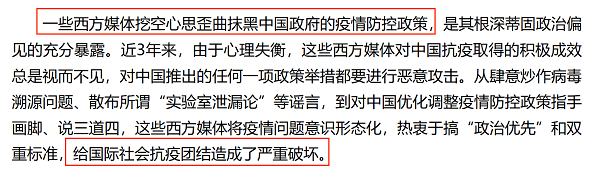

故正确答案为C。

---

## 第 40 题　qid 5101599 · 逻辑判断

线上阅读建立起四通八达的内容传播渠道，让我们获取信息的种类和数量更多了，但其并非唯一的阅读形式。事实上，传统的纸质阅读仍是一种不可或缺、具有独特优势、更适合进行深度阅读的重要阅读形式。
以下哪项如果为真，最能支持上述观点？

- **A**. 纸质书在设计、排版等各方面，更能给读者带来许多独特、珍贵的阅读体验
- **B**. 在数字时代，培养主动阅读的习惯和能力，才能过上更充实、有效的阅读生活
- **C**. 对于文本篇幅长、内容丰富的经典作品，纸质书更容易使读者形成系统思维、专注能力　✅
- **D**. 在我国成年读者中，大多数人选择的阅读形式有纸质阅读、网络阅读、新媒体音频听书阅读等

**答案**：C

**官方解析**

第一步：找出论点和论据。
论点：传统的纸质阅读仍是一种不可或缺、具有独特优势、更适合进行深度阅读的重要阅读形式。
论据：无。
本题只有论点，没有论据，加强优先考虑补充论据。
第二步：逐一分析选项。
A项：选项指出纸质书在设计、排版等各方面更给读者独特、珍贵的阅读体验，说明纸质阅读在设计、排版等方面具有“独特优势”，补充论据，可以加强，保留；
B项：选项指出培养主动阅读的习惯和能力非常重要，但这和论点中纸质阅读的优势和重要性无关，无法加强，排除；
C项：选项指出对于经典作品来说，纸质书更容易使读者形成系统思维、专注能力，说明对于经典作品来说，纸质阅读更适合“深度阅读”，补充论据，可以加强，保留；
D项：选项指出我国成年读者有多种阅读形式，但未说明纸质阅读是不是重要阅读形式，无法加强，排除；
对比A、C两项，论点说了3个优点，不可或缺和独特优势都比较笼统，但更适合深度阅读，这个“深度阅读”相对来讲，是比较具体的；
A项只是在强调纸质书在设计、排版等形式上的优势，过于表面，而C项的“形成系统思维、专注能力”是跟论点“深度阅读”更为贴切的，故C项优于A项；
另外，有学生会觉得A项是解释原因，C项是举例，按照理论解释原因大于举例，但其实A项也算是举例，A项的措辞：在······方面，更······，也是常见的举例表述，解释和举例有时候没有绝对的界限的，不同的理解角度加强方式也就不一样。换句话说，也就是两个选项都能加强时，咱们首先要比的，不是加强方式（因为这个角度有时不好界定），而是应该比谁说的跟论点核心更贴切，更是一回事儿。
故正确答案为C。

---
