# 2022年江苏省公务员录用考试《行测》题（A类）（网友回忆版）

> 判断推理 · 50 题 · 江苏 2022

## 材料 1

运动会的3000米比赛中，运动员你追我赶，其中选手甲、乙、丙、丁表现特别出色，交替领先。观众张、王、李、赵分别预测了4位选手的最终名次：

张：甲第四，乙第三，丙第二，丁第一；

王：甲第三，乙第二，丙第四，丁第一；

李：甲第四，乙第二，丙第一，丁第三；

赵：甲第二，乙第三，丙第一，丁第四。

比赛结束后，甲、乙、丙、丁确实位列前四名，而且不存在并列情况。但他们的具体名次，张全猜错了，而其余3人分别猜对了1个。

### 第 1 题　qid 4651560 · 逻辑判断

根据以上陈述，以下哪项可能为真？

- **A**. 丙第一，甲第二，丁第三，乙第四
- **B**. 乙第一，丁第二，甲第三，丙第四
- **C**. 乙第一，甲第二，丁第三，丙第四　✅
- **D**. 甲第一，丁第二，丙第三，乙第四

**答案**：C

**官方解析**

第一步：分析题干条件。
（1）张：甲第四，乙第三，丙第二，丁第一；
（2）王：甲第三，乙第二，丙第四，丁第一；
（3）李：甲第四，乙第二，丙第一，丁第三；
（4）赵：甲第二，乙第三，丙第一，丁第四；
（5）甲、乙、丙、丁位列前四名，且不存在并列；
（6）张全猜错了，其余3人分别猜对了1个。
第二步：根据题干条件进行推理。
本题题干信息不确定，选项信息充分，优先考虑代入法。
代入A项，王全猜错，不符合条件（6）王猜对1个，排除；
代入B项，王猜对2个，不符合条件（6）王猜对1个，排除；
代入C项，满足题干所有条件，当选；
代入D项，王全猜错，不符合条件（6）王猜对1个，排除。
故正确答案为C。

---

### 第 2 题　qid 4651563 · 逻辑判断

假如王猜对了甲的名次，那么以下哪项一定为真?

- **A**. 丁第四
- **B**. 丙第一　✅
- **C**. 乙第二
- **D**. 乙第一

**答案**：B

**官方解析**

第一步：分析题干条件。
（1）张：甲第四，乙第三，丙第二，丁第一；
（2）王：甲第三，乙第二，丙第四，丁第一；
（3）李：甲第四，乙第二，丙第一，丁第三；
（4）赵：甲第二，乙第三，丙第一，丁第四；
（5）甲、乙、丙、丁位列前四名，且不存在并列；
（6）张全猜错了，其余3人分别猜对了1个；
（7）王猜对了甲的名次。
第二步：根据题干条件进行推理。
从确定信息条件（7）入手进行推理，与条件（2）（6）结合，可以推出甲第三，乙不是第二，丙不是第四，丁不是第一；
根据条件（5）以及甲第三可知，乙、丙、丁都不是第三；
根据条件（6）张全猜错以及条件（1）可以推出，乙不是第三，丙不是第二，丁不是第一；
综合上述推理可知，丙不是第二、三、四，那么丙只能是第一，对应B项。
故正确答案为B。

---

## 材料 2

甲、乙、丙、丁4人为室友，来自江苏、浙江、湖南、湖北，毕业时都考上了研究生，录取她们的有师范大学、医科大学、财经大学、农业大学，已知：甲考上的不是农业大学，考上农业大学的是江苏人，丙考上了师范大学，丁是湖北人。

### 第 3 题　qid 4651549 · 逻辑判断

根据上述信息，可以推出以下哪项？

- **A**. 丙是湖南人
- **B**. 甲是浙江人
- **C**. 丁考上了财经大学
- **D**. 乙考上了农业大学　✅

**答案**：D

**官方解析**

第一步：分析题干信息。

（1）甲农业大学；

（2）考上农业大学的是江苏人；

（3）丙=师范大学；

（4）丁=湖北人。

第二步：根据题干条件进行推理。

本题题干信息较多，可考虑列表。将题干已知条件填入表格，如下表：

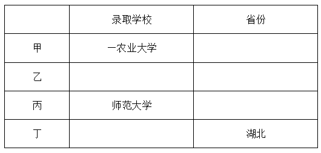

又由条件（2）可知，考上农业大学的是江苏人，说明需要将“农业大学”和“江苏”分配给同一个人，通过上表可知只能是乙，因此乙考上了农业大学，对应D项。

故正确答案为D。

---

### 第 4 题　qid 4651551 · 逻辑判断

如果考上医科大学的是湖南人，那么以下哪项为假？

- **A**. 甲考上了医科大学
- **B**. 丁考上了财经大学
- **C**. 丙不是浙江人　✅
- **D**. 丙不是湖南人

**答案**：C

**官方解析**

第一步：分析题干信息。

（1）甲农业大学；

（2）考上农业大学的是江苏人；

（3）丙=师范大学；

（4）丁=湖北人。

（5）考上医科大学的是湖南人。

第二步：根据题干条件进行推理。

由上一题结论可知，考上农业大学的是乙，因此乙是江苏人，如下表：

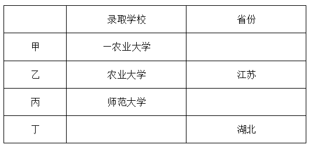

结合条件（5）可知，考上医科大学的是湖南人，说明需要将“医科大学”和“湖南”分配给同一个人，通过上表可知只能是甲，此时可以得到：甲是考上医科大学的湖南人，如下表：

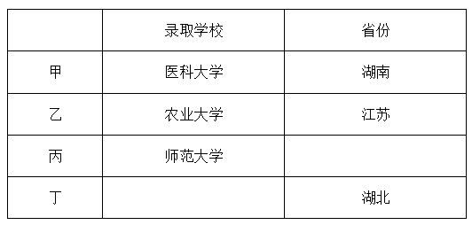

此时通过上表可知，丁被财经大学录取，丙是浙江人，如下表：

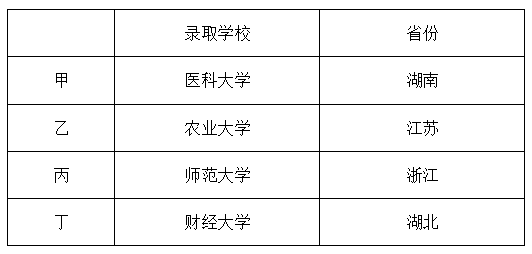

通过上表可知：甲是考上医科大学的湖南人，乙是考上农业大学的江苏人，丙是考上师范大学的浙江人，丁是考上财经大学的湖北人，A、B、D三项均符合题干条件，只有C项为假。

本题为选非题，故正确答案为C。

---

### 第 5 题　qid 4651531 · 类比推理

峰：山峰：碳达峰

- **A**. 界：世界：思想界
- **B**. 潮：海潮：移民潮　✅
- **C**. 子：儿子：菜篮子
- **D**. 羊：山羊：领头羊

**答案**：B

**官方解析**

第一步：判断题干词语间逻辑关系。
“山峰”指山突出来的顶端，山峰中的“峰”指山的尖顶。“碳达峰”指在某一个时点，二氧化碳的排放达到峰值后不再增长，之后逐步回落，碳达峰中的“峰”即峰值的意思，两个“峰”的意思不一致。题干中山峰是具体的事物，而碳达峰是抽象概念。
第二步：判断选项词语间逻辑关系。
A项：“世界”广义上来讲，就是指全部、所有、一切，世界中的“界”指范围。“思想界”指的是思想这个范畴，两个“界”的意思一致，与题干逻辑关系不一致，排除；
B项：“海潮”中的“潮”指的是潮汐、潮水，“移民潮”指的是移民的潮流，移民潮中的“潮”是比喻大规模的社会变动或运动发展的起伏形。两个“潮”的意思是不一致的。海潮是具体的事物，而移民潮是抽象概念，与题干逻辑关系一致，当选；
C项：“儿子”是指父母对孩子的一种称谓，“菜篮子”指的是装菜的一种器具。这两个“子”都是附加在名词、动词、形容词后，具有名词性（读轻声）的意思，与题干逻辑关系不一致，排除；
D项：“山羊”指的是一种动物、家畜，“领头羊”是指羊群中领头的羊，借指带领大家前进的领头人或单位。对于本意来说两个“羊”的意思是一致的，而且领头羊不是抽象概念，与题干逻辑关系不一致，排除。
故正确答案为B。

---

### 第 6 题　qid 4651538 · 类比推理

论辩：辩护：共识

- **A**. 贸易：签约：利益　✅
- **B**. 就读：休学：考试
- **C**. 调研：座谈：问卷
- **D**. 看病：诊脉：理疗

**答案**：A

**官方解析**

第一步：判断题干词语间逻辑关系。
“论辩”和“辩护”的目的都是为了达成“共识”，二者为目的对应关系。
第二步：判断选项词语间逻辑关系。
A项：“贸易”和“签约”的目的都是为了获得“利益”，二者为目的对应关系，与题干逻辑关系一致，当选；
B项：“休学”的目的不是为了“考试”，与题干逻辑关系不一致，排除；
C项：“调研”和“座谈”的目的不是为了“问卷”，与题干逻辑关系不一致，排除；
D项：“理疗”的意思是用物理疗法治疗，“看病”的目的是为了康复，并不是为了“理疗”，与题干逻辑关系不一致，排除。
故正确答案为A。

---

### 第 7 题　qid 4651542 · 类比推理

电气：煤气：气

- **A**. 酸奶：羊奶：奶
- **B**. 银河：运河：河　✅
- **C**. 正面：反面：面
- **D**. 榆钱：金钱：钱

**答案**：B

**官方解析**

第一步：判断题干词语间逻辑关系。
电气是利用电产生能量的方式，与煤气无关，而且电气不是气。煤气是气的一种，后两者是种属关系。
第二步：判断选项词语间逻辑关系。
A项：酸奶与奶是原材料与制成品的关系，羊奶是奶的一种，后两者是种属关系，与题干逻辑关系不一致，排除；
B项：银河与运河无关，而且银河不是河。运河是河的一种，后两者是种属关系，与题干逻辑关系一致，当选；
C项：正面与反面属于事物的两面性，二者为并列关系，二者均与面构成种属关系，与题干逻辑关系不一致，排除；
D项：榆钱是植物，不是钱，金钱和钱为全同关系，与题干逻辑关系不一致，排除。
故正确答案为B。

---

### 第 8 题　qid 4651548 · 类比推理

神奇：鬼斧神工

- **A**. 善良：大慈大悲
- **B**. 强大：不可一世
- **C**. 寒冷：冰天雪地　✅
- **D**. 混乱：乱七八糟

**答案**：C

**官方解析**

第一步：判断题干词语间逻辑关系。
鬼斧神工原意是像鬼神制作出来的，形容艺术技巧高超，不像是人力所能达到的，与神奇构成近义关系。鬼斧神工用夸张的修辞来表示非常神奇，程度加深。
第二步：判断选项词语间逻辑关系。
A项：大慈大悲形容人心肠慈悲，乐善好施，与善良构成近义关系。但大慈大悲没有用夸张的修辞手法，与题干逻辑关系不一致，排除；
B项：不可一世形容人自命不凡，狂妄自大到了极点。与强大没有关系，与题干逻辑关系不一致，排除；
C项：冰天雪地指寒冷的地方，也形容天气非常寒冷，与寒冷构成近义关系。冰天雪地用夸张的修辞来表示非常寒冷，程度加深，与题干逻辑关系一致，当选；
D项：乱七八糟形容毫无条理和秩序，乱的不成样子，与混乱构成近义关系。但乱七八糟没有用夸张的修辞手法，与题干逻辑关系不一致，排除。
故正确答案为C。

---

### 第 9 题　qid 4651529 · 类比推理

冬：暖冬

- **A**. 妻：未婚妻
- **B**. 人：植物人
- **C**. 菜：平价菜
- **D**. 书：有声书　✅

**答案**：D

**官方解析**

第一步：判断题干词语间逻辑关系。
暖冬是冬天，二者为种属关系。
第二步：判断选项词语间逻辑关系。
A项：未婚妻指已与某男子订婚尚未结婚的女子，故在法律意义上，未婚妻不是妻子，与题干逻辑关系不一致，排除；
B项：植物人是与植物生存状态相似的特殊人体状态，植物人是人，与题干逻辑关系一致，保留；
C项：平价菜是菜，二者为种属关系，与题干逻辑关系一致，保留；
D项：有声书指用声音来表达内容的书，二者为种属关系，与题干逻辑关系一致，保留；
对比BCD三项，冬天一般是冷的，暖冬是与冬天特性相反的特殊情况；D项书一般是无声的，有声书是书特性相反的特殊情况，D项与题干更为接近。
故正确答案为D。

---

### 第 10 题　qid 4651537 · 类比推理

灭蚊剂：蚊子

- **A**. 居家隔离：病毒
- **B**. 市场经济：垄断
- **C**. 首问负责：推诿　✅
- **D**. 民意测验：分歧

**答案**：C

**官方解析**

第一步：判断题干词语间逻辑关系。
灭蚊剂是用来消灭蚊子的，所以二者为功能对应关系。
第二步：判断选项词语间逻辑关系。
A项：居家隔离是为了阻断病毒的传播，但是并不能消灭病毒，而题干中灭蚊剂是对蚊子存在致命性伤害，与题干逻辑关系不一致，排除；
B项：市场经济和垄断没有必然的关系，与题干逻辑关系不一致，排除；
C项：首问负责的意思是谁接到问题，谁就负责到底。具体内容为最先接到来访或来办理业务时，其作为首问负责的人，首问负责是用来消除工作人员对来访人员推诿的，二者为功能对应关系，与题干逻辑关系一致，当选；
D项：民意测验是为了了解公众对特定问题的看法和意见，与分歧没有明显关系，与题干逻辑关系不一致，排除。
故正确答案为C。

---

### 第 11 题　qid 4651541 · 类比推理

水中捞月：白费功夫

- **A**. 霸王之兵：勇往直前
- **B**. 天涯海角：杳无音信
- **C**. 棋逢对手：不相上下
- **D**. 蚍蜉撼树：不自量力　✅

**答案**：D

**官方解析**

第一步：判断题干词语间逻辑关系。
水中捞月比喻去做根本做不到的事情，只能白费力气。水中捞月可以用来形容白费功夫，二者为比喻象征义，且水中捞月为贬义词。
第二步：判断选项词语间逻辑关系。
A项：霸王之兵出自《孙子兵法》，形容强大的国家必须要有一支强大的军队。勇往直前形容不怕艰险，奋勇地一直往前进。两者无明显语义关系，与题干逻辑关系不一致，排除；
B项：天涯海角形容极远的地方，或相隔极远。杳无音信形容没有一点消息。两者无明显语义关系，与题干逻辑关系不一致，排除；
C项：棋逢对手是指下棋碰上了水平相当的对手，比喻双方本领不相上下。棋逢对手可以用来形容不相上下，二者为比喻象征义，但棋逢对手为褒义词，与题干逻辑关系不一致，排除；
D项：蚍蜉撼树是指蚂蚁想摇动大树，比喻狂妄，不自量力。蚍蜉撼树可以用来形容不自量力，二者为比喻象征义，且蚍蜉撼树为贬义词，与题干逻辑关系一致，当选。
故正确答案为D。

---

### 第 12 题　qid 4651550 · 类比推理

东北亚 之于 （    ） 相当于 （    ） 之于 树冠

- **A**. 韩国；树墩
- **B**. 南亚；树根　✅
- **C**. 东半球；树洞
- **D**. 日本海；树荫

**答案**：B

**官方解析**

逐一代入选项。
A项：韩国是东北亚的一部分，二者是组成关系，树墩与树冠都是树木的组成部分，二者为并列关系，前后逻辑关系不一致，排除；
B项：东北亚和南亚是不同的地理区域，二者是并列关系，树根和树冠都是树木的组成部分，二者为并列关系，前后逻辑关系一致，当选；
C项：东北亚是东半球的一部分，二者是组成关系，树洞和树冠都是树木的组成部分，二者为并列关系，前后逻辑关系不一致，排除；
D项：日本海是东北亚的一部分，二者为组成关系，树荫是指树下日光照不到的地方，树冠经阳光照射后能形成树荫，二者为对应关系，前后逻辑关系不一致，排除。
故正确答案为B。

---

### 第 13 题　qid 4651530 · 类比推理

呼气 之于 吸气 相当于 （    ） 之于 （    ）

- **A**. 救火；灭火
- **B**. 治病；养病
- **C**. 入神；出神
- **D**. 出世；入世　✅

**答案**：D

**官方解析**

第一步：判断题干词语间逻辑关系。
呼气指呼吐空气，吸气指吸入空气，二者为语义关系中的反义关系。
第二步：判断选项词语间逻辑关系。
A项：救火和灭火均指扑灭火灾，二者为语义关系中的近义关系，与题干逻辑关系不一致，排除；
B项：治病指治疗疾病，养病指因患病而休养，二者无明显语义关系，与题干逻辑关系不一致，排除；
C项：入神指因对某事物兴趣浓厚，而精神集中，心无旁骛，出神指精神过度集中而发呆，均指精神集中，二者为语义关系中的近义关系，与题干逻辑关系不一致，排除；
D项：出世指淡泊名利，超出尘俗，入世指置身于红尘俗世之中，二者为语义关系中的反义关系，与题干逻辑关系一致，当选。
故正确答案为D。

---

### 第 14 题　qid 4651535 · 类比推理

良禽择木而栖 之于 贤臣择主而事 相当于 （    ） 之于 （    ）

- **A**. 关关雎鸠在河之洲；窈窕淑女君子好逑
- **B**. 树欲静而风不止；子欲养而亲不待
- **C**. 天有不测风云；人有旦夕祸福　✅
- **D**. 士为知己者死；女为悦己者容

**答案**：C

**官方解析**

第一步：判断题干词语间逻辑关系。
“良禽择木而栖”指的是好的鸟要选择树木栖息；“贤臣择主而事”指的是贤明的臣子要选择君主侍奉，第一句话用自然界的现象引出第二句话中的道理，二者为引申义对应。
第二步：判断选项词语间逻辑关系。
A项：“关关雎鸠在河之洲”指的是关关和鸣的雎鸠，相伴在河中的小洲；“窈窕淑女君子好逑”指的是美丽贤淑的女子，是君子的好配偶，二者不是引申义对应，与题干逻辑关系不一致，排除；
B项：“树欲静而风不止”指的是树希望静止不摆，风却不停息；“子欲养而亲不待”指的是子女想赡养父母，父母却已离去了，二者是两件不相关的事，与题干逻辑关系不一致，排除；
C项：“天有不测风云”指的是自然界的变化难以预测；“人有旦夕祸福”指的是人一生的问题难以预测，均比喻有些灾祸的发生，事先是无法预料的，第一句话用自然界的现象引出了第二句中的人的旦夕祸福，二者为引申义对应，与题干逻辑关系一致，当选；

D项：“士为知己者死”指的是志士愿意为赏识自己、了解自己的人献身；“女为悦己者容”指的是女人愿意为欣赏自己、喜欢自己的人而打扮，两句话均描述的是人，不是引申义对应，与题干逻辑关系不一致，排除。
故正确答案为C。

---

### 第 15 题　qid 4651565 · 图形推理

 请从所给的四个选项中，选出最恰当的一项填入问号处，使之呈现一定的规律性。

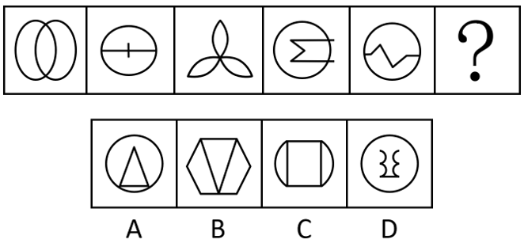

- **A**. A
- **B**. B　✅
- **C**. C
- **D**. D

**答案**：B

**官方解析**

图形元素组成不同，且无明显属性规律，考虑数量规律。观察发现，图形线条交叉明显，考虑交点数。题干图形的交点数分别为2、3、4、5、6、？，因此？处图形的交点数应为7个，只有B项符合规律。
故正确答案为B。

---

### 第 16 题　qid 4651575 · 图形推理

 请从所给的四个选项中，选出最恰当的一项填入问号处，使之呈现一定的规律性。

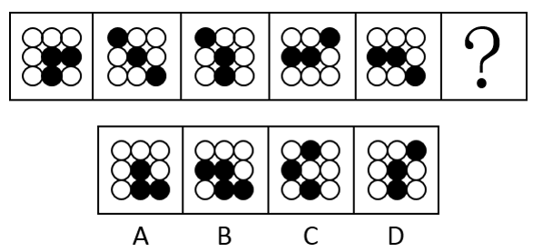

- **A**. A
- **B**. B
- **C**. C
- **D**. D　✅

**答案**：D

**官方解析**

图形元素组成相同，但无位置规律，且无属性规律，考虑数量规律。观察发现，题干图形的黑球数均为3，排除B项；继续观察发现，题干图形的黑白球被分隔开，因此考虑部分数。黑球的部分数依次是1、3、2、2、2，无规律；再观察白球的部分数，发现白球的部分数均为2，故？处应选择白球的部分数为2的图形，只有D项符合。
故正确答案为D。

---

### 第 17 题　qid 4651586 · 图形推理

请从所给的四个选项中，选出最恰当的一项填入问号处，使之呈现一定的规律性。

- **A**. A　✅
- **B**. B
- **C**. C
- **D**. D

**答案**：A

**官方解析**

元素组成不同，优先考虑属性规律。观察发现，题干图形出现箭头、等腰元素图形，考虑对称性。题干每幅图都由两个单对称轴图形组成，因此分别画出每个图形的对称轴，发现每幅图的两条对称轴之间都是垂直关系，只有A项符合。

故正确答案为A。

---

### 第 18 题　qid 4651783 · 图形推理

从所给的四个选项中，选择最合适的一个填入问号处，使之呈现一定的规律性：

- **A**. A
- **B**. B
- **C**. C
- **D**. D　✅

**答案**：D

**官方解析**

元素组成相同，优先考虑位置规律。观察发现，三角形沿着正方形的四个角依次顺时针移动一个角的位置，？处应移动到左上角，排除A项；继续观察题干，发现小圆数量发生变化，内圈小圆数量依次为1、2、1、2、1、？，？处应选择内圈有2个小圆的图形，排除B项；外圈小圆数量均为6个，排除C项，只有D项符合规律。
故正确答案为D。

---

### 第 19 题　qid 4651671 · 图形推理

请从所给的四个选项中，选出最恰当的一项填入问号处，使之呈现一定的规律性。

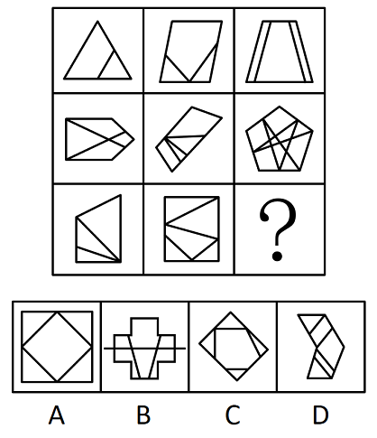

- **A**. A
- **B**. B
- **C**. C　✅
- **D**. D

**答案**：C

**官方解析**

图形元素组成不同，且无明显属性规律，优先考虑数量规律。九宫格优先横向看，题干中图形均由直线构成，考虑直线数，但整体数直线后没有规律，考虑线的细化考法，即线的方向。第一行图一有1组平行线，图二有2组平行线，图三有3组平行线，第二行也满足此规律，第三行前两个图也符合规律，故？处应该有3组平行线。只有C项符合。

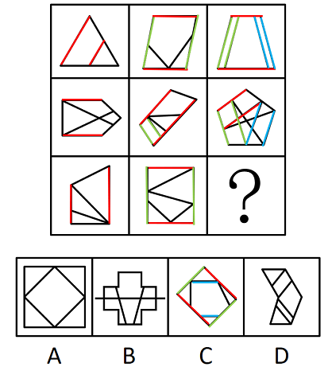

故正确答案为C。

---

### 第 20 题　qid 4651691 · 图形推理

请从所给的四个选项中，选出最恰当的一项填入问号处，使之呈现一定的规律性。

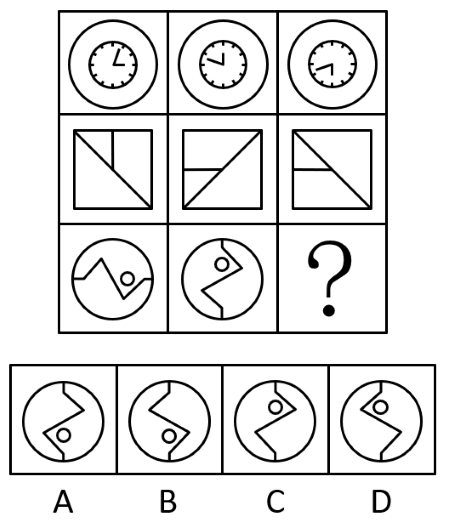

- **A**. A
- **B**. B　✅
- **C**. C
- **D**. D

**答案**：B

**官方解析**

元素组成相同，优先考虑位置规律。九宫格优先横向看，第一行中，图一逆时针旋转得到图二，图二上下翻转得到图三；第二行经验证，符合该规律；第三行应用规律，只有B项符合。

故正确答案为B。

---

### 第 21 题　qid 4651582 · 图形推理

下边四个图形中，只有一个是由上边的四个图形拼合（只能通过上、下、左、右平移）而成的，请把它找出来。

- **A**. A　✅
- **B**. B
- **C**. C
- **D**. D

**答案**：A

**官方解析**

本题考查平面拼合，可采用平行且等长相消的方式解题。消去平行且等长的线段后进行组合即可得到轮廓图，即为A项。平行且等长相消的方式如下图所示： 

故正确答案为A。

---

### 第 22 题　qid 4651584 · 图形推理

下边四个图形中，只有一个是由上边的四个图形拼合（只能通过上、下、左、右平移）而成的，请把它找出来。

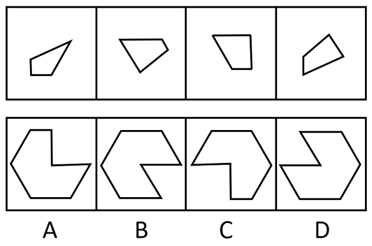

- **A**. A
- **B**. B
- **C**. C
- **D**. D　✅

**答案**：D

**官方解析**

本题考察平面拼合，可采用平行且等长相消的方法解题。消去平行且等长的线段后进行组合即可得到轮廓图，即为D项。平行且等长相消的方式如下图所示：

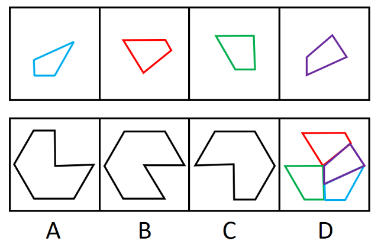

故正确答案为D。

---

### 第 23 题　qid 4651697 · 图形推理

下边四个图形中，只有一个是由上边的四个图形拼合（只能通过上、下、左、右平移）而成的，请把它找出来。

- **A**. A　✅
- **B**. B
- **C**. C
- **D**. D

**答案**：A

**官方解析**

本题考查平面拼合。消去凹凸匹配的线条后进行组合可得到轮廓图，即为A项。具体拼合方式如下图所示：

故正确答案为A。

---

### 第 24 题　qid 4651690 · 类比推理

上边四张纸片，每张纸片一面是黑色，另一面是白色，下边仅有一项能由其拼合（可以平移、旋转、翻转）而成，请把它找出来。

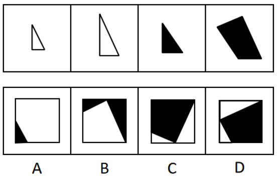

- **A**. A
- **B**. B
- **C**. C
- **D**. D　✅

**答案**：D

**官方解析**

本题考查平面拼合，可以平移、旋转、翻转，且每张纸片一面是黑色，另一面是白色，需要考虑翻转后的颜色变化。将题干图形标上序号如下图，逐一进行分析。

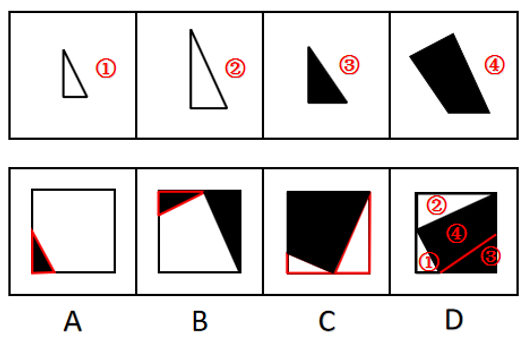

A项：左下角的三角形是由图①平移过去的，颜色应该是白色，而选项是黑色，排除；

B项：左上角的三角形是由图①旋转后平移过去的，颜色应该是白色，而选项是黑色，排除；

C项：左下角的三角形是由图①翻转且旋转后平移过去的，翻转后的面颜色应该是黑色，而选项是白色。右侧的三角形是由图②翻转后平移过去的，翻转后的面颜色应该是黑色，而选项是白色，排除；

D项：可以由题干图形拼合而成，拼合方式如图所示，当选。

故正确答案为D。

---

### 第 25 题　qid 4651698 · 类比推理

上边四张纸片，每张纸片一面是黑色，另一面是白色，下边仅有一项能由其拼合（可以平移、旋转、翻转）而成，请把它找出来。

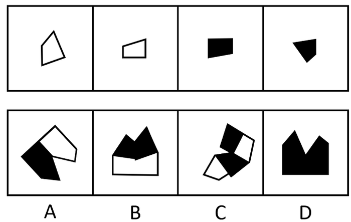

- **A**. A
- **B**. B
- **C**. C　✅
- **D**. D

**答案**：C

**官方解析**

本题考查平面拼合，根据题干可知，纸片平移、旋转，颜色不变；翻转，颜色改变，纸片①和纸片②翻转后为黑色，纸片③和纸片④翻转后为白色。将题干图形标上序号如下图，逐一进行分析。

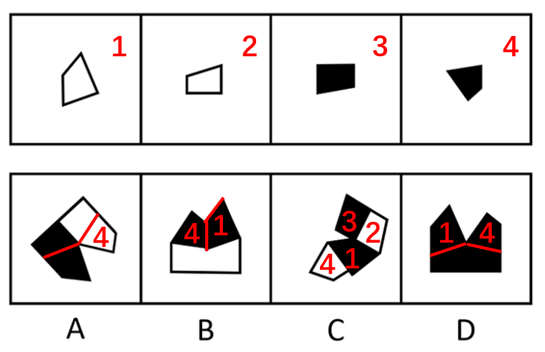

A项：图4进行了旋转，颜色应仍为黑色，而选项是白色，排除；

B项：图1进行了平移，颜色应仍为白色，而选项是黑色；图4进行了翻转，颜色应为白色，而选项是黑色，排除；

C项：可以由题干图形拼合而成，拼合方式如图所示，当选；

D项：图1进行了平移，颜色应仍为白色，而选项是黑色；图4进行了翻转，颜色应为白色，而选项是黑色，排除。

故正确答案为C。

---

### 第 26 题　qid 4651729 · 图形推理

左图给定的是多面体的外表面，右边哪一项能由它折叠而成？请把他找出来。

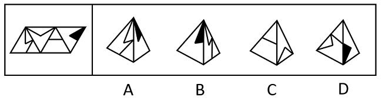

- **A**. A
- **B**. B　✅
- **C**. C
- **D**. D

**答案**：B

**官方解析**

将原展开图标上序号如下图，逐一进行分析。

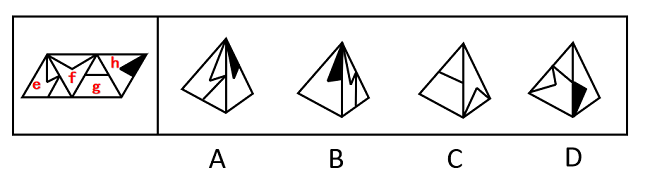

A项：选项由面e和面h构成，题干展开图中面e和面h的公共边没有挨着面e中的白色三角形，而选项中面e和面h的公共边挨着面e中的白色三角形，选项和题干不一致，排除；

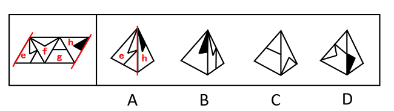

B项：选项由面e和面h构成，选项与题干一致，当选；

C项：选项由面f和面g构成，题干展开图中面g中小三角形的顶点与面f中的线段相接，而选项中面g中小三角形的顶点没有与面f中的线段相接，选项与题干不一致，排除；

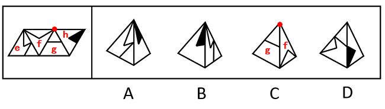

D项：选项由面e和面h构成，题干展开图中面e和面h的公共边没有挨着面e中的白色三角形，而选项中面e和面h的公共边挨着面e中的白色三角形，选项和题干不一致，排除。

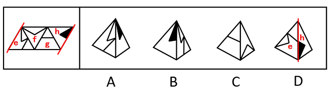

故正确答案为B。

---

### 第 27 题　qid 4651742 · 图形推理

左边给定的是纸盒外表面的展开图，右边哪一项能由它折叠而成？请把它找出来。

- **A**. A
- **B**. B
- **C**. C　✅
- **D**. D

**答案**：C

**官方解析**

将原展开图标上序号，如下图所示，逐一进行分析。

A项：选项由面e和面g构成，展开图中面e与面g的公共边挨着面g的空白面，而选项中面e与面g的公共边半边挨着面g的灰色面，选项与题干展开图不一致，排除；

B项：选项由面g和面h构成，展开图中面g和面h的公共边挨着面g的灰色面，而选项中面g和面h的公共边挨着面g的空白面，选项与题干展开图不一致，排除；

C项：选项由面e和面h构成，选项与题干展开图一致，当选；

D项：选项由面e和面f构成，以面e的灰色顶点（蓝点）为起点顺时针画边，展开图中边2与面f中的长线相交于点1（边2与边3的交点），而选项中边2与面f中的长线不相交于点1（边2与边3的交点），选项与题干展开图不一致，排除。

故正确答案为C。

---

### 第 28 题　qid 4651703 · 图形推理

左边给定的是多面体的外表面，右边哪一项能由它折叠而成？请把它找出来。

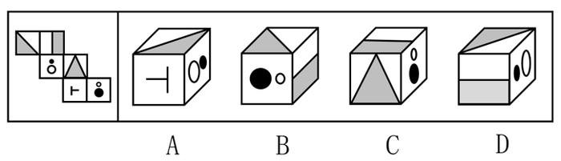

- **A**. A　✅
- **B**. B
- **C**. C
- **D**. D

**答案**：A

**官方解析**

将原展开图标上序号，如下图所示，逐一进行分析。

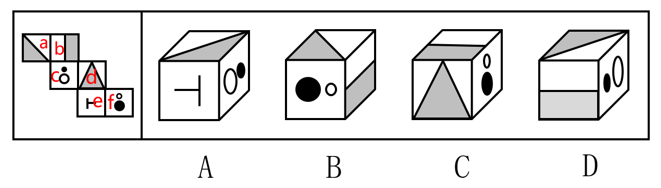

A项：选项三个面为面a、面e和面c，选项与题干展开图一致，当选；

B项：选项三个面为面a、面b和面f，在展开图和选项中以面f中挨着白色小圆的边为起始边，在面f中顺时针画边，展开图中边1对应面d，而选项中边1对应面b，选项与题干展开图不一致，排除；

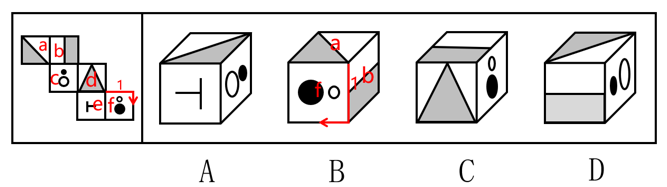

C项：选项三个面为面b、面d和面f，展开图中面d和面f的公共边挨着面f中的白色小圆，而选项中面d和面f的公共边挨着面f中的白色小圆和黑色大圆，选项与题干展开图不一致，排除；

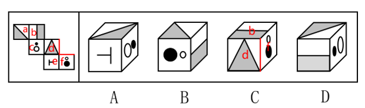

D项：选项三个面为面a、面b和面c，展开图中三个面的公共点在面a中引出一条线，而选项中三个面的公共点没有引出一条线，选项与题干展开图不一致，排除。

故正确答案为A。

---

### 第 29 题　qid 4651685 · 图形推理

左边给定的是多面体的外表面，右边哪一项能由它折叠而成? 请把它找出来。

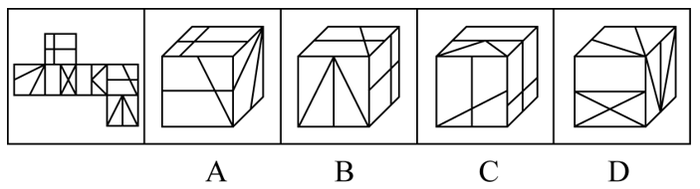

- **A**. A
- **B**. B
- **C**. C　✅
- **D**. D

**答案**：C

**官方解析**

将原展开图标上序号，如下图所示，逐一进行分析。

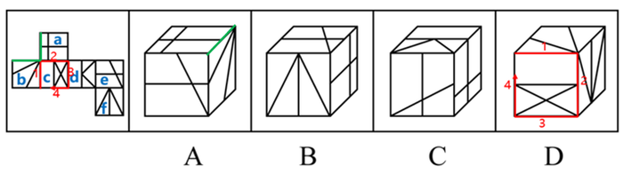

A项：选项为面a、面b和面e，题干展开图中面a和面b的公共边（如上图绿线所示）挨着面a中2个小矩形，而选项中二者的公共边挨着面a中2个大矩形，选项与题干展开图不一致，排除；

B项：选项为面a、面e和面f，题干展开图中面a和面f为相对面，不能同时出现，选项与题干展开图不一致，排除；

C项：选项为面a、面d与面e，选项与题干展开图一致，当选；

D项：选项为面b、面c和面f，以面c中空白矩形的一条长边作为起始边，顺时针进行画边（如上图所示），题干展开图中边2对应面a，而选项中边2对应面f，选项与题干展开图不一致，排除。

故正确答案为C。

---

### 第 30 题　qid 4651543 · 逻辑判断

在广袤的中华大地上，最近几十年已经新植了数以十亿计的树木，绿色植被的增长有目共睹，沙漠化和水土流失情况得到了极大缓解。据此，有专家指出，中国已经是全球变绿的最重要的力量之一。
以下哪项如果为真，最能支持上述专家的观点？

- **A**. 中国西南地区和东北地区的快速造林大大减少了我国对进口木材的依赖
- **B**. 卫星数据对比显示，中国大量过去荒漠化的地方现在已经被绿色植被所覆盖
- **C**. 中国的植被面积仅占全球的6.6%，但全球植被面积净增长的25%来自中国　✅
- **D**. 在有些国家和地区，毁林开荒正在导致具有全球气候调节功能的雨林面积大大减少

**答案**：C

**官方解析**

第一步：找出论点和论据。
论点：中国已经是全球变绿的最重要的力量之一。
论据：在广袤的中华大地上，最近几十年已经新植了数以十亿计的树木，绿色植被的增长有目共睹，沙漠化和水土流失情况得到了极大缓解。
本题论点和论据都在讨论的是中国绿化的情况，话题一致，加强优先考虑补充论据。
第二步：逐一分析选项。
A项：该项说中国快速造林减少了对进口木材的依赖，而论点讨论的是中国是全球变绿的重要力量，话题不一致，无法加强，排除；
B项：该项说中国过去荒漠化的地方已经被绿色植被所覆盖，对比的是中国的过去情况和现在情况，而论点讨论的是中国是全球变绿的重要力量之一，话题不一致，无法加强，排除；
C项：该项说全球植被面积净增长的25%来自中国，补充论据说明中国是全球变绿的重要力量之一，可以加强，当选；
D项：该项说有些国家和地区的雨林面积大大减少，而论点讨论的是中国是全球变绿的重要力量之一，话题不一致，无法加强，排除。
故正确答案为C。

---

### 第 31 题　qid 4651547 · 逻辑判断

普通话是国家通用语言，除普通话外，还有粤语、吴语等方言。近年来，用各种方言演绎的段子大量涌入影视作品、短视频和网络综艺节目，这些作品生动有趣，让那些即使是从小生长在普通话环境里的人也会觉得亲切，兴起了一股学习方言的热潮。因此，有专家认为，各种方言作品大行其道，其实不利于普通话在全国范围内的使用推广。
以下哪项如果为真，最能质疑上述专家的观点？

- **A**. 保护传承方言是国家语言文字事业的重要组成部分，也是社会大众的共同愿望
- **B**. 方言多用于家庭等非正式场合，不会损害普通话在公共场所等正式场合的应用　✅
- **C**. 短时间内让方言恢复自身活力或使用频率，既缺乏可行性，也没有必要性
- **D**. 每个人都有自己的故乡，方言承载着人们的乡土之情，是普通话的根

**答案**：B

**官方解析**

第一步：找出论点和论据。
论点：各种方言作品大行其道，其实不利于普通话在全国范围内的使用推广。
论据：无。
本题只有论点，没有论据，削弱可以优先考虑削弱论点。
第二步：逐一分析选项。
A项：该项说的是保护传承方言是国家语言文字事业的重要组成部分，也是社会大众的共同愿望，说的是保护传承方言的必要性，但未提及方言作品对普通话在全国范围内的使用推广有何影响，话题不一致，无法削弱，排除；
B项：该项说的是方言不会损害普通话在公共场所等正式场合的应用，而普通话的推广使用主要集中在公共场所等正式场合，也就是说方言作品不会损害普通话在全国范围内的推广使用，削弱论点，当选；
C项：该项说的是短时间内不需要也很难恢复方言的活力，而论点说的是方言作品不利于普通话在全国范围内的使用推广，话题不一致，无法削弱，排除；
D项：该项说的是方言承载着人们的乡土之情，说的是方言的作用，但论点说的是方言作品不利于普通话在全国范围内的使用推广，话题不一致，无法削弱，排除。
故正确答案为B。

---

### 第 32 题　qid 4651540 · 逻辑判断

某企业秉持人才为上的理念，一直致力于专业技术人才队伍建设，十年来，该企业招聘的大部分机械工人来自甲职业技术学院，今年招聘的机械工人总数明显增加，但从该学院招聘的机械工人数量却大幅减少，而且招进来的很多人没有经过职业技术学院系统的学习。
以下哪项如果为真，最能解释该企业今年招聘情况的变化？

- **A**. 该企业增设了技术培训部门，以培训新招聘的机械工人　✅
- **B**. 三年前，该企业的管理层进行了重大重组，决定推广AI的应用
- **C**. 从去年开始，权威的职业技术学院排行榜上，甲学院落后于乙学院
- **D**. 很多没有上过职业技术学院的工人很有才华，只是没有机会上学

**答案**：A

**官方解析**

第一步：找出题干矛盾。
某企业一直致力于专业技术人才队伍建设，十年来招聘的大部分机械工人来自甲职业技术学院，今年招聘的机械工人总数明显增加，但从该学院招聘的机械工人数量却大幅减少，而且招进来的很多人没有经过职业技术学院系统的学习。
第二步：逐一分析选项。
A项：该项说的是该企业增设了技术培训部门，以培训新招聘的机械工人，说明新招聘来的人虽没有经过职业技术学院系统的学习，但通过技术培训部门的培训也能掌握相应的技术从而胜任工作，能够解释题干矛盾，当选；
B项：该项说的是该企业的管理层三年前进行了重大重组，决定推广AI的应用，一方面三年前进行管理层的重大重组，不能解释为什么今年的招聘才和往年不同，另一方面，也不能确定管理层的重大重组及推广AI的应用对人才招聘的影响如何，因此不能解释题干矛盾，排除；
C项：该项说的是从去年开始，权威的职业技术学院排行榜上，甲学院落后于乙学院，这只能解释为什么该公司从甲学院招聘的机械工人数量大幅减少，但不能解释为什么招进来的很多人没有经过职业技术学院系统的学习，这明显与该企业致力于专业技术人才队伍建设的理念相违背，不能解释题干矛盾，排除；
D项：该项说的是很多没有上过职业技术学院的工人很有才华，只是没有机会上学，但有才华并不等同于有技术，这也与该企业致力于专业技术人才队伍建设的理念相违背，不能解释题干矛盾，排除。
故正确答案为A。

---

### 第 33 题　qid 4651740 · 逻辑判断

唐代大诗人刘禹锡《望洞庭》诗云：“湖光秋月两相和，潭面无风镜未磨。遥望洞庭山水翠，白银盘里一青螺。”然而，在一般不对原文做修改的宋清两朝的诸多类书中诗首句“秋月”皆作“秋色”，有专家据此指出，诗中首句的“秋月”其实应为“秋色”。
以下哪项如果为真，最能支持上述专家的观点？

- **A**. 《望洞庭》为经典名作，历朝历代众口传诵，期间难免出现不同的版本
- **B**. 月光下很难分辨山水的不同色彩，翠色，白银盘、青螺皆是白天的景观　✅
- **C**. 洞庭秋色是历代文人所关注的美景，该诗强调秋色之美也在常理之中
- **D**. 学术界公认这首诗，描写了洞庭湖的优美景色，应是诗人对洞庭湖的实景描写

**答案**：B

**官方解析**

第一步：找出论点和论据。
论点：刘禹锡《望洞庭》中首句的“秋月”其实应为“秋色”。
论据：在一般不对原文做修改的宋清两朝的诸多类书中诗首句“秋月”皆作“秋色”。
本题论点、论据都是在讨论“秋月”与“秋色”哪种用法更合理，论点论据话题一致，所以加强可以优先考虑补充论据。
第二步：逐一分析选项。
A项：指出该诗在传诵过程中出现了许多不同版本，而论点讨论的是“秋色”与“秋月”用法的合理性，这些不同的版本是否是在“秋色”一词上有所差异并不明确，不明确项，无法加强，排除；
B项：指出白银盘、青螺等景色仅能在白天观察到，说明在“秋月”的情况下无法观察到诗中描写的景色，因此该诗中的“秋月”应为“秋色”，补充论据，可以加强，当选；
C项：指出洞庭湖的秋色常被诗人们关注，该诗描写秋色有其合理性，但这仅能说明该诗可能描写了洞庭湖的“秋色”，但该诗中的“秋月”的表述是否合理，该项并未提及，不明确项，无法加强，排除；
D项：指出该诗是对洞庭湖的实景描写，讨论的是诗人所写景色的虚实，而论点讨论的是诗中“秋月”与“秋色”哪种用法更合理，话题不一致，无法加强，排除。
故正确答案为B。

---

### 第 34 题　qid 4651546 · 逻辑判断

某单位准备从甲、乙、丙、丁、戊、己六人中择优录取数名技术人员，录用情况符合如下条件：
（1）丙和丁恰有一人被录取；
（2）甲和乙至少有一人被录取；
（3）甲和丁恰有一人被录取；
（4）录取乙当且仅当录用丙；
（5）甲、戊、己中恰有两人被录用；
根据上述信息，可以推出最终录用的人数为：

- **A**. 2
- **B**. 3
- **C**. 4　✅
- **D**. 5

**答案**：C

**官方解析**

第一步：分析题干条件。

（1）要么丙要么丁；

（2）甲 或 乙；

（3）要么甲要么丁；

（4）乙丙，丙乙；

（5）甲、戊、己中有两人被录取。

第二步：根据题干条件进行推理。

根据条件（1）（5）可知，甲、丙、丁、戊、己五人中会录取三人，则只需判断乙是否会被录取，因此考虑假设法。

假设乙不被录取，根据条件（2）可知，甲会被录取，同时根据条件（4）否后必否前可得，丙不会被录取，又结合条件（1）可知，丁会被录取，此时甲、丁都会被录取，与条件（3）矛盾，因此该假设不成立，那么可以推出乙被录取，再结合“甲、丙、丁、戊、己五人中会录取三人”可以得出最终共录用4人，对应C项。

故正确答案为C。

---

### 第 35 题　qid 4651553 · 逻辑判断

麦子大约在五千年前由西亚传入中国，但由麦子做成的面食直到唐宋时期才成为北方人的主食。在此之前，北方的主粮是粟，也就是小米。秦汉时期的老百姓很不愿意种麦子，汉朝曾为增加粮食产量两次大力推广种麦子，但老百姓并没有积极响应。
以下哪项如果为真，最能解释上述历史现象？

- **A**. 外来作物很多，除了麦子，还有番薯、胡麻等，不是每种作物一传入就被接受
- **B**. 磨粉技术传播较晚，东汉时只有官宦人家才拥有上下两扇带有磨齿的磨盘
- **C**. 麦粒直接煮成的“麦饭”生硬难咽、口感很差，秦汉时期的绝大多数人都不爱吃　✅
- **D**. 东汉以后磨盘磨粉和“热汤饼”等面食技术逐渐推广开来，麦子才变得“好吃”了

**答案**：C

**官方解析**

第一步：找出题干矛盾。
秦汉时期的老百姓很不愿意种麦子，汉朝曾两次大力推广种麦子，但老百姓并没有积极响应。
第二步：逐一分析选项。
A项：该项说的是有些外来作物并不能马上被接受，但是汉朝已经两次大力推广了，为什么还是不能被接受，不能解释题干矛盾，排除；
B项：该项说的是东汉时期只有官宦人家才能将麦子磨粉，那在麦子不能被磨粉时，为什么老百姓不愿意种植，选项并没有明确说明，不能解释题干矛盾，排除；
C项：该项说的是由麦粒直接煮成的“麦饭”口感很差，秦汉时期的绝大多数人都不爱吃，因为麦粒不好吃所以不种麦子，可以解释即使国家大力推广，老百姓也不积极响应的原因，可以解释题干矛盾，当选；
D项：该项说的是麦子从东汉以后因为磨盘磨粉和面食技术才变得好吃，题干要解释的矛盾点是为什么国家推广也不种，C项很直接地说明因为不好吃，所以不种；D项在解释怎么才变得“好吃”，没有C项直接，排除。
故正确答案为C。

---

### 第 36 题　qid 4651555 · 逻辑判断

“同情用药”指的是某些重症患者可以在不参加临床试验的情况下，使用尚未获批上市的在研药物。在新冠肺炎疫情初期，提前使用抗疫药物的同情用药案例数有所增加，效果良好。但是，同情用药的实施条件十分严格，大部分患者不具备用药资格。对此，有专家建议，应该放宽同情用药的使用条件。
以下哪项如果为真，最能质疑上述专家建议的合理性?

- **A**. 同情用药会破坏新药审批的程序和权威，这对患者和社会都有不可预料的后果　✅
- **B**. 即便“无药可救”的患者愿意使用未获批的在研药物，也不一定能够成功延长生命
- **C**. 为了保护患者用药安全，大部分国家目前严禁未经过临床试验的药品上市
- **D**. 目前，大部分常见疾病都已经有一些适用药物，这些疾病并不需要同情用药

**答案**：A

**官方解析**

第一步：找出论点和论据。
论点：应该放宽同情用药的使用条件。
论据：在新冠肺炎疫情初期，提前使用抗疫药物的同情用药案例数有所增加，效果良好。但是，同情用药的实施条件十分严格，大部分患者不具备用药资格。
本题的论点和论据讨论的都是同情用药的使用条件问题，二者话题一致，优先考虑削弱论点，即表明不应放宽同情用药的使用条件。
第二步：逐一分析选项。
A项：该项说的是同情用药会破坏新药审批的程序和权威，对患者和社会都有不可预料的后果，表明放宽同情用药的使用条件会产生不利影响，因此同情用药的使用条件应该严格，可以削弱，当选；
B项：该项说的是患者愿意使用未获批的在研药物后不一定能延长生命，但是论点讨论的是同情药物的使用条件是否应当放宽，讨论内容为什么样的病人应该使用该药物，而不是使用药物后可能的效果，无法削弱，排除；
C项：该项说的是未经过临床试验的药品能否上市的问题，论点讨论的是同情用药使用的限制条件，二者话题不一致，无法削弱，排除；
D项：该项说的是大部分常见疾病是否需要同情用药，而题干讨论的同情用药指的是重症患者的特殊情况，二者话题不一致，无法削弱，排除。
故正确答案为A。

---

### 第 37 题　qid 4651561 · 类比推理

甲：这本小说太精彩了，你喜欢里面的哪个角色呢？
乙：我对小说不感兴趣，没有读过这本小说
以下哪项的对话与上述对话最为相似？

- **A**. 
教师：你不努力学习以后怎么能考上理想的大学呢？

学生：我理想的大学太难考了，再努力也不一定能考上

- **B**. 
员工甲：总经理的讲话中，你认可哪些呢？

员工乙：总经理的讲话我都赞成，我会尽全力执行讲话中的要求

- **C**. 
孩子：爸爸，夏天游泳更能锻炼身体呢，还是冬天游泳更能锻炼身体呢？

父亲：游泳是非常好的锻炼方式，在任何时候游泳都能锻炼人

- **D**. 
商户：您上个月在我们商店购买的冰箱好用吗？

顾客：你可能记错了，我上个月在你们店购买的是洗衣机
　✅

**答案**：D

**官方解析**

第一步：分析题干逻辑关系。
甲以“看过这本小说”为前提，问乙“喜欢哪个角色”，乙表示“没有读过这本小说”，没有直接回答甲的问题，而是对甲问题的前提进行否定。
第二步：逐一分析选项。
A项：教师问“不努力学习以后怎么能考上理想的大学”，学生表示“因为理想的大学太难考，再努力也不一定能考上”，是直接回答了教师的问题，没有否定问题的前提，与题干对话方式不一致，排除；
B项：员工甲问“认可总经理的哪些讲话”，员工乙表示“都赞成”，是直接回答了员工甲的问题，没有否定问题的前提，与题干对话方式不一致，排除；
C项：孩子问“是夏天游泳更能锻炼身体，还是冬天游泳更能锻炼身体”，父亲表示“任何时候游泳都能锻炼人”，是直接回答了孩子的问题，没有否定问题的前提，与题干对话方式不一致，排除；
D项：商户以“购买过冰箱”为前提，问顾客“是否好用”，顾客表示“购买的不是冰箱，而是洗衣机”，没有直接回答商户的问题，而是对商户问题的前提进行否定，与题干对话方式一致，当选。
故正确答案为D。

---

### 第 38 题　qid 4652519 · 逻辑判断

甲、乙、丙是好朋友，一个住在城东，一个住在城南，一个住在城西。三人相约到城北的射箭场比拼射箭技术，结果住在城南的比丙得分低，甲比住在城东的得分高，乙和住在城南的得分不同。
根据以上陈述，可以推出以下哪项：

- **A**. 甲住城西，乙住城东
- **B**. 乙住城东，丙住城西　✅
- **C**. 乙住城南，丙住城西
- **D**. 甲住城南，丙住城东

**答案**：B

**官方解析**

第一步：分析题干条件。
三人射箭技术的得分顺序如下：
①丙＞住在城南的；
②甲＞住在城东的；
③乙≠住在城南的。
第二步：根据题干条件进行推理。
“住在城南的”出现次数最多，为最大信息，可作为突破口。根据条件①和③可知，住在城南的既不是丙也不是乙，因此三人中住在城南的只能是甲，则条件①可表示为丙＞甲。再结合条件②可知，丙＞甲＞住在城东的，因此丙不可能住在城东，再结合甲住在城南可知，丙只能住在城西，剩下的乙就住在城东，只有B项符合。
故正确答案为B。

---

### 第 39 题　qid 4652546 · 逻辑判断

在知识经济时代，社会持续发展的前提之一是培养大量高素质人才，只有高校教育质量的提升才能培养出大量高素质人才，而高校教育质量的提升一定要求高校教师整体素养的提升。
如果以上陈述为真，则可以推出以下哪项：

- **A**. 只要社会持续发展，就要求提升高校教师整体素养　✅
- **B**. 如果没有大量高素质人才，那么高校教育质量不会有提升
- **C**. 如果培养了大量高素质人才，那么社会就能持续发展
- **D**. 如果处在知识经济时代，高校教育质量必定有所提升

**答案**：A

**官方解析**

第一步：翻译题干。

①社会持续发展培养大量高素质人才

②培养大量高素质人才高校教育质量提升

③高校教育质量提升高校教师整体素养提升

以上条件可以递推出：④社会持续发展培养大量高素质人才高校教育质量提升高校教师整体素养提升

第二步：逐一分析选项。

A项：翻译为社会持续发展提升高校教师整体素养，是对④的肯前，肯前必肯后，可以推出，当选；

B项：翻译为大量高素质人才高校教育质量提升，是对②的否前，否前得不出必然结论，无法推出，排除；

C项：翻译为培养大量高素质人才社会持续发展，是对①的肯后，肯后得不出必然结论，无法推出，排除；

D项：翻译为知识经济时代高校教育质量提升，题干中“知识经济时代”和“高校教育质量提升”之间没有推出关系，无法推出，排除。

故正确答案为A。

---

### 第 40 题　qid 4651564 · 类比推理

某高校选派甲、乙、丙、丁4位专家组成乡村振兴调研小组，担任组长的专家为男性、党员、教授。已知这4位专家中：
（1）每位专家都至少具有组长的一个特征；
（2）有党员3人，男性2人，教授1人；
（3）甲和乙性别相同；
（4）乙是党员当且仅当丙是党员；
（5）丙和丁不全是党员。
由此推出，担任组长的是：

- **A**. 甲
- **B**. 乙
- **C**. 丙　✅
- **D**. 丁

**答案**：C

**官方解析**

第一步：分析题干条件。

（1）担任组长的专家为男性、党员、教授；

（2）每位专家都至少具有组长的一个特征；

（3）有党员3人；

（4）男性2人；

（5）教授1人；

（6）甲和乙性别相同；

（7）乙、丙要么都是党员，要么都不是党员；

（8）丙不是党员或丁不是党员。

第二步：根据题干条件进行推理。

根据条件（3）和（7），得出乙和丙都是党员，再根据条件（3）和（8）得出丁不是党员，甲是党员，根据条件（4）和（6），假设甲和乙都是男性，那么丁既不是党员也不是男性，又根据条件（2），得出丁必须是教授，再根据条件（5），得出其他人都不是教授，此时并没有一个人具有担任组长的三个特征，与条件（1）矛盾，因此假设不成立；故甲和乙都不是男性，丙和丁都是男性，此时只有丙既是党员又是男性，再根据条件（1）和（5），得出丙必须也是教授。因此同时具有担任组长三个特征的专家是丙。表格如下：

故正确答案为C。

---

### 第 41 题　qid 4651556 · 定义判断

微躺青年：指面对现实中的竞争压力，既不参与过度竞争，也不消极接受现状，而在专注于本职工作的同时，合理调整工作方向，追求自我价值实现的年轻人。
下列属于微躺青年的是：

- **A**. 设计师小谭研究生毕业后，因与投资人理念不合，离开了加盟三年的设计公司到外地改做陶瓷设计。最艰难的时候，天天工作到深夜，终于设计出大受市场欢迎的产品，实现了大学以来的梦想　✅
- **B**. 随着新冠肺炎疫情防控形势好转，各地游客都明显增多，商家纷纷推出低价游，抢占旅游市场。小李把自己的旅行社转让出去后，开始在网络上进行家乡景点直播，很快就成为直播达人，带动了家乡旅游产业的发展
- **C**. 今年大学毕业的小柳投递了许多份求职信，但都石沉大海。索性在网上当起了自律监督师，每天要定十几个闹钟，最多同时监督20多个人。刚开始觉得工作枯燥乏味，但现在已经收到了数百条好评，让他很有成就感
- **D**. 小何毕业后一直在互联网公司工作，公司内部竞争压力很大，常常加班到深夜。虽然收入十分可观，但他觉得高强度工作损害了身心健康，决定每年给自己放个小长假

**答案**：A

**官方解析**

第一步：找出定义关键词。

“面对现实中的竞争压力，既不参与过度竞争，也不消极接受现状”、“专注于本职工作的同时，合理调整工作方向”、“追求自我价值实现”。

第二步：逐一分析选项。

A项：设计师小谭离开原来的设计公司后并没有消极接受现状，而是调整了工作方向，改做陶瓷设计，符合“面对现实中的竞争压力，既不参与过度竞争，也不消极接受现状”、“专注于本职工作的同时，合理调整工作方向”，经过不懈努力，设计的产品获得市场欢迎，最终实现了自身的梦想，符合“追求自我价值实现”，符合定义，当选；

B项：商家纷纷推出低价游，抢占旅游市场，小李把自己的旅行社转让出去后，在网络上进行家乡景点直播，符合“面对现实中的竞争压力，既不参与过度竞争，也不消极接受现状”，但小李是迫于市场的压力转出了旅行社，改做网络直播，不符合“追求自我价值实现”，不符合定义，排除；

C项：大学刚毕业的小柳投递的许多份求职信石沉大海，于是在网上当起了自律监督师，符合“面对现实中的竞争压力，既不参与过度竞争，也不消极接受现状”，但没有体现专注本职工作及工作方向上的调整，不符合“专注于本职工作的同时，合理调整工作方向”，不符合定义，排除；

D项：在互联网公司工作的小何由于工作强度高，决定每年给自己放个小长假，符合“面对现实中的竞争压力，既不参与过度竞争，也不消极接受现状”，但放小长假不属于工作方向上的调整，不符合“专注于本职工作的同时，合理调整工作方向”，不符合定义，排除。

注：本题正确率很低，粉笔通过多次教研并查询原文，如下图所示：

1.A项是微躺青年的典型案例，而且A项在原文的基础上最后加了“实现大学以来的梦想”，更符合定义关键词“自我价值实现”；

2.有同学质疑A项“天天工作到深夜”根本不微躺，但是注意A项说“最艰难的时候”，并不是每天都卷；

3.ACD这三个选项都是“大学毕业/研究生毕业”，都能够体现出“青年、年轻人”，而B项只是说“小李”，身份不明确，这个点也不如A项。

故正确答案为A。

---

### 第 42 题　qid 4651559 · 定义判断

田保姆：指在不改变土地承包关系的前提下，农户将耕、种、管、收等部分或全部作业环节委托给社会化组织完成，成为规模经营的参与者和受益者的新型农业经营方式。
下列不属于田保姆的是：

- **A**. 晚稻收割接近尾声，泥瓦匠老李仍然不慌不忙，在周边市区接了好几单活，他家的10亩稻田三年前已经以每年5000元的价格租给了在家务农的邻居，连收带运，啥都不用他操心　✅
- **B**. 老刘夫妇近年来一直跟着亲戚在外地打工，每到收割季节都得回家忙乎一阵子。去年，村里的几个年轻人合伙买了大型收割机，成立了生产合作社，老刘全家商量后，就把田里的农活全部包给了他们
- **C**. 每年收获季，处置成堆的秸秆都让种植户非常头疼，为了解决这个问题，大王庄村委会先后购置了10套秸秆打捆、粉碎机械，及时推出了秸秆回收加工服务项目，周围村子的农民再也不为这个事情发愁了
- **D**. 某农业科技服务公司在各个村镇建立了所管地块的示范田，定期召开现场会，展示播种方式、田间管理等，当地不少农民变成了“甩手掌柜”，随时可以通过扫描公司的二维码了解托管服务的进程

**答案**：A

**官方解析**

第一步：找出定义关键词。
“在不改变土地承包关系的前提下”、“农户将耕、种、管、收等部分或全部作业环节委托给社会化组织”、“成为规模经营的参与者和受益者”。
第二步：逐一分析选项。
A项：该项中泥瓦匠老李只是出租了家中的10亩稻田，符合“在不改变土地承包关系的前提下”，但承租对象是在家务农的邻居，并非社会化组织，不符合“农户将耕、种、管、收等部分或全部作业环节委托给社会化组织”，不符合定义，当选；
B项：该项中老刘全家只是把田里的农活包给村里年轻人成立的生产合作社，符合“在不改变土地承包关系的前提下”，生产合作社属于社会化组织，且老刘全家都是规模经营的参与者和受益者，符合“农户将耕、种、管、收等部分或全部作业环节委托给社会化组织”、“成为规模经营的参与者和受益者”，符合定义，排除；
C项：该项中大王庄村委会推出的秸秆回收加工服务项目给种植户带来了便利，但没有改变土地承包关系，符合“在不改变土地承包关系的前提下”，大王庄村委会属于社会化组织，参与秸秆回收加工服务项目的农民都是规模经营的参与者和受益者，符合“农户将耕、种、管、收等部分或全部作业环节委托给社会化组织”、“成为规模经营的参与者和受益者”，符合定义，排除；
D项：该项中某农业科技服务公司对于农民的土地来说只是起到了管理的作用，符合“在不改变土地承包关系的前提下”，农业科技服务公司属于社会化组织，当地参与托管服务的农民都是规模经营的参与者和受益者，符合“农户将耕、种、管、收等部分或全部作业环节委托给社会化组织”、“成为规模经营的参与者和受益者”，符合定义，排除。
本题为选非题，故正确答案为A。

---

### 第 43 题　qid 4651583 · 定义判断

去雇主化职业：指作为独立个体不受雇于任何雇主，依托网络平台提供商品或服务并获得相应报酬的就业形式。
下列属于去雇主化职业的是：

- **A**. 林先生辞职后来到南方注册了一家绿植盆景网店，在一个多月的时间里，租赁场地，筹措资金，完善平台，忙得不亦乐乎
- **B**. 专业买手陈女士每月穿梭在世界各地，寻找带有当季流行元素或者可能在国内热卖的款式和品牌服装，并将其带回国内
- **C**. 小李加入了一个微信群，里面提供了许多可兼职工作的岗位，经过一番挑选，他选择了一份帮忙代取快递的兼职，用赚来的钱贴补每月生活费
- **D**. 喜欢写作的大二学生小孟在某平台网文写手的影响下，也开始在这家平台上更新写的小说，得到了许多粉丝的打赏，他很有成就感　✅

**答案**：D

**官方解析**

第一步：找出定义关键词。
“作为独立个体不受雇于任何雇主”、“依托网络平台提供商品或服务”、“获得相应报酬”。
第二步：逐一分析选项。
A项：林先生辞职后注册网店提供绿植盆景，符合“作为独立个体不受雇于任何雇主”、“依托网络平台提供商品或服务”，但未体现出获得报酬，不符合“获得相应报酬”，不符合定义，排除；
B项：陈女士把服装从世界各地带回国内，但未体现出是否依托网络平台售卖，是否获得报酬，不符合“依托网络平台提供商品或服务”、“获得相应报酬”，不符合定义，排除；
C项：小李通过微信群找到代取快递的兼职，不符合“作为独立个体不受雇于任何雇主”，不符合定义，排除；
D项：小孟依托网络平台更新写的小说，符合“作为独立个体不受雇于任何雇主”、“依托网络平台提供商品或服务”，且得到了许多粉丝的打赏，符合“获得相应报酬”，符合定义，当选。
故正确答案为D。

---

### 第 44 题　qid 4651580 · 定义判断

鲜活性效应：指重在依据自己耳闻目睹的具体个案而不是权威性、科学性信息做出选择的现象。
下列不属于鲜活性效应的是：

- **A**. 众所周知，飞机的事故率在所有交通工具中是最低的。但是李先生在电视上看到一则民航客机失事的新闻后，再也没有乘坐过飞机
- **B**. 小罗看中了某知名品牌的洗衣机，正打算付款，一个好朋友打来电话告诉她，自家这个牌子的洗衣机经常出故障，小罗当场放弃了购买计划
- **C**. 王大伯非常注重养生，本来滴酒不沾，后来他看到80岁高龄的邻居老赵每天都要小酌几杯，身体一直很好。于是，他逐渐不再刻意回避喝酒
- **D**. 小缪常用的视频网站总是会给她推送某品牌的按摩椅，父亲节的时候小缪想给父亲送按摩椅当礼物，就登录该品牌的官网购买　✅

**答案**：D

**官方解析**

第一步：找出定义关键词。
“依据自己耳闻目睹的具体个案”。
第二步：逐一分析选项。
A项：李先生决定不再乘坐飞机的依据是从新闻里看到了一则民航客机失事的新闻，符合“依据自己耳闻目睹的具体个案”，符合定义，排除； 
B项：小罗决定不买该品牌洗衣机的依据是听说好朋友家里那个该品牌的洗衣机质量不好，符合“依据自己耳闻目睹的具体个案”，符合定义，排除；
C项：王大伯决定不再刻意回避喝酒的依据是看到某个邻居每天小酌并且身体一直很好，符合“依据自己耳闻目睹的具体个案”，符合定义，排除；
D项：小缪决定购买官网中按摩椅的依据是常用的视频网站经常推送该品牌的按摩椅，但没有提及视频网站的推送视频是否是利用个案来宣传，不符合“依据自己耳闻目睹的具体个案”，不符合定义，当选。
本题为选非题，故正确答案为D。

---

### 第 45 题　qid 4651577 · 定义判断

信用联动奖惩：指有关部门或组织在法定范围内根据企业、个人信用记录，采取部门联动、社会协同等方式，对其依法联合实施奖励或惩戒的行为。
下列属于信用联动奖惩的是：

- **A**. 某市设立了无偿献血“五星级志愿者”、志愿服务终身荣誉奖，获奖市民可以免除市管公园门票，免费乘坐市内公交车，享受市属公立医院诊察费半价优惠
- **B**. 餐馆老板李先生在当地政务服务网提交了经营性临时占道申请，由于其信用等级为A级，可以享受审批绿色通道，第二天就收到了城管和其他相关部门的许可短信　✅
- **C**. 阮先生在承租的公租房里开设棋牌室，违背了申请公租房时的诚信承诺，被住房保障部门扣罚了住房保证金，并纳入五年内不得申请公租房的名单。阮先生对自己的失信行为深感后悔，保证以后一定做一个诚信公民
- **D**. 某区政府接到媒体举报，辖区内一超市以次充好，将普通猪肉当黑猪肉售卖，区政府立即召集市场监管、税务等职能部门赶到超市，现场联合办公，对相关责任人进行查处

**答案**：B

**官方解析**

第一步：找出定义关键词。
“根据企业、个人信用记录”、“部门联动、社会协同”、“依法联合实施奖励或惩戒”。
第二步：逐一分析选项。
A项：根据无偿献血的志愿行为来实施奖励，不符合“根据企业、个人信用记录”，不符合定义，排除； 
B项：由于李先生的信用等级为A级，符合“根据企业、个人信用记录”，可以享受审批绿色通道，且收到城管和其他相关部门的许可短信，符合“部门联动、社会协同”，也符合“依法联合实施奖励或惩戒”，符合定义，当选；
C项：阮先生在公租房开设棋牌室是违背了诚信承诺，符合“根据企业、个人信用记录”，扣罚住房保证金、纳入五年内不得申请公租房的名单均为惩戒手段，符合“依法联合实施奖励或惩戒”，但该行为均由住房保障部门实施，未提及其他有关部门，不符合“部门联动、社会协同”，不符合定义，排除；
D项：市场监管、税务等职能部门联合办公，符合“部门联动、社会协同”，但以次充好，将普通猪肉当黑猪肉售卖，属于不诚信经营的行为，并未提及商家的信用记录，不符合“根据企业、个人信用记录”，不符合定义，排除。
故正确答案为B。

---

### 第 46 题　qid 4651573 · 定义判断

闲置经济：指将一些还有使用价值但闲置未用的物品，以较低的价格通过网络平台进行交易的经济现象。
下列属于闲置经济的是：

- **A**. 某品牌电器官网举办以旧换新活动，孔女士便把家里用了三年的电磁炉寄去换了一台新款，比直接购买省了一半的钱
- **B**. 每到毕业季，大学生就会在操场、寝室门口等校园网上公布的位置摆摊设点，将自己的专业书籍低价转让给学弟学妹
- **C**. 近年来，老陈在网上买到了不少便宜货，如老旧缝纫机、修鞋机、磅秤等，他用这些别人眼中的废品做成了再生艺术品　✅
- **D**. 小佳在社交平台看到了一则北方小镇遭受雪灾的消息，就将自己前些年穿过的厚衣物寄给平台，统一消毒后发往灾区

**答案**：C

**官方解析**

第一步：找出定义关键词。
“一些还有使用价值但闲置未用的物品”、“以较低的价格”、“通过网络平台进行交易”。
第二步：逐一分析选项。
A项：孔女士用于置换的物品是家里用了三年的电磁炉，不清楚该电磁炉是否为闲置未用的物品，不符合“一些还有使用价值但闲置未用的物品”，电磁炉以旧换新的活动并非是直接以低价进行交易，也不符合“以较低的价格进行交易”，不符合定义，排除；
B项：大学生只是通过网上公布的位置摆摊设点，但是实际交易的时候应该是在摊点通过线下的方式，不符合“通过网络平台进行交易”，不符合定义，排除；
C项：老陈在网上买到了便宜货，符合“通过网络平台进行交易”，也符合“以较低的价格”，且在别人眼中是废品，但是老陈用它们做成了再生艺术品，说明在别人眼里是闲置未用的物品，但对老陈有用，符合“一些还有使用价值但闲置未用的物品”，符合定义，当选；
D项：小佳将自己前些年穿过的厚衣物寄给平台，属于向灾区的捐赠行为，不属于交易，不符合“以较低的价格”，也不符合“通过网络平台进行交易”，不符合定义，排除。
故正确答案为C。

---

### 第 47 题　qid 4651716 · 定义判断

信息瀑布：指现实生活中，当受到前人信息的影响时，放弃自己原有的想法，跟着他人选择的现象。
下列属于信息瀑布的是：

- **A**. 小李从单位离职后在家里呆了一段时间，上个月他发现了几份适合自己的工作，就分别递交了求职信。这几天收到了多封邮件，招聘单位大都以他失业太久为理由而拒绝了他
- **B**. 公司去陌生小镇组织团建活动，午餐时看到街边的一排小餐馆，不爱吃辣的胡先生纠结了一会，最终还是跟着几位湖南同事进了一家湘菜馆
- **C**. 消费者们通常认为十多年前的服装款式已经过时，但经过时装周推广、明星带货，那些款式往往又会成为新的时尚，重新受到追捧　✅
- **D**. 某家具厂的一款外壳酷似史前巨型昆虫的黑色办公椅，全厂上下都觉得像是用回收垃圾做的，对它的市场前景表示悲观，却意外地受到了办公人士的喜爱，最终成了该厂建厂以来最畅销的椅子

**答案**：C

**官方解析**

第一步：找出定义关键词。
“当受到前人信息的影响时”、“放弃自己原有的想法，跟着他人选择的现象”。
第二步：逐一分析选项。
A项：招聘单位拒绝小李的理由是他失业太久，做出该决定并没有受到前人的影响，不符合“当受到前人信息的影响时”，不符合定义，排除；
B项：不爱吃辣的胡先生是自己纠结午餐吃什么，并未体现出同事对他的影响，不符合“当受到前人信息的影响时”，不符合定义，排除；
C项：消费者们受到时装周和明星的影响，重新接受了之前认为过时的服装，符合“当受到前人信息的影响时”、“放弃自己原有的想法，跟着他人选择的现象”，符合定义，当选；
D项：该家具厂的办公椅意外地受到办公人士的喜爱，没有体现全厂员工和这些办公人士的选择受到前人信息的影响，不符合“当受到前人信息的影响时”，不符合定义，排除。
故正确答案为C。

---

### 第 48 题　qid 4651545 · 定义判断

胶带纸思维：指使用各种表面上看似比较简单、笨拙的临时性手段，有效解决实际问题的方式。
下列不属于胶带纸思维的是：

- **A**. 临近下班的时候突然下了大雨，穿了新鞋子的小丽不想把鞋子弄脏，于是从办公室抽屉里拿了两个塑料袋套在脚上，一直走到地铁站鞋子都没湿
- **B**. 马先生家下水道堵了好几天，偶然在短视频中看到了一个用白醋兑苏打水通下水道的方法，在家试验多次都没有成功，最后还得请专业人员上门疏通　✅
- **C**. 某社区举办的花街夜市突然停电，周围一片黑暗，社工小叶立刻去商店买来了一些蜡烛，点点烛光不仅照亮花街，还吸引了更多的游客
- **D**. 小雯的房间突然掉了一块墙皮，但第二天有几个朋友要来访，她急中生智找出与朋友们的合影遮住了脱落墙皮的地方，美观又温馨

**答案**：B

**官方解析**

第一步：找出定义关键词。
“表面上看似比较简单、笨拙的临时性手段”、“有效解决实际问题”。
第二步：逐一分析选项。
A项：从办公室抽屉里拿了两个塑料袋套在鞋子上，符合“表面上看似比较简单、笨拙的临时性手段”，一直走到地铁站鞋子都没湿，符合“有效解决实际问题”，符合定义，排除；
B项：用白醋兑苏打水通下水道的方法，符合“表面上看似比较简单、笨拙的临时性手段”，但试验多次都没有成功，不符合“有效解决实际问题”，不符合定义，当选；
C项：去商店买来了一些蜡烛用来照明，符合“表面上看似比较简单、笨拙的临时性手段”，点点烛光不仅照亮花街，还吸引了更多的游客，符合“有效解决实际问题”，符合定义，排除；
D项：找出与朋友们的合影来掩盖脱落墙皮的地方，符合“表面上看似比较简单、笨拙的临时性手段”，遮住了脱落墙皮的地方，美观又温馨，符合“有效解决实际问题”，符合定义，排除。
本题为选非题，故正确答案为B。

---

### 第 49 题　qid 4651554 · 定义判断

陌生人社交困境：指在与陌生人交往过程中，由于误解他人行为动机或意图而造成不良后果的现象。
下列不属于陌生人社交困境的是：

- **A**. 早高峰时段、骑电瓶车忘戴头盔的小吴被文明交通志愿者拦下来批评教育，担心上班迟到的小吴觉得志愿者是故意针对他，当场情绪失控。路口因此造成了二十分钟的拥堵
- **B**. 赵女士在田边拍照，看到远处有村民向她挥手大喊，以为村民担心她会踩坏庄稼，就挥了挥手，继续拍照。不一会儿，她被旁边树上飞出的马蜂蛰了，又疼又肿
- **C**. 农村随迁儿童转学到城市学校后，不少孩子最初都会担心受到歧视而不愿与大家交往，抵触班级的集体活动，学习成绩也有所下滑，性格也变得更加敏感脆弱，情况严重者甚至需要半年时间，自卑心理才会逐渐消失　✅
- **D**. 杨女士经常叮嘱三岁的女儿小青不要和陌生人说话、不要随便跟陌生人走、不要吃陌生人的东西、不要给陌生人开门。结果，小青进幼儿园以后的几个月里，非常胆小，动不动就哭，平时连老师问话都不回答

**答案**：C

**官方解析**

第一步：找出定义关键词。
“在与陌生人交往过程中”、“由于误解他人行为动机或意图而造成不良后果的现象”。
第二步：逐一分析选项。
A项：小吴被志愿者拦下来，符合“在与陌生人交往过程中”，志愿者因小吴忘戴头盔对其进行批评教育是正常工作，小吴觉得志愿者是故意针对他，当场情绪失控，路口因此造成了二十分钟的拥堵，符合“由于误解他人行为动机或意图而造成不良后果的现象”，符合定义，排除；
B项：赵女士与村民的交流，符合“在与陌生人交往过程中”，她以为村民挥手大喊是担心她会踩坏庄稼，而实际上村民是在对她进行提醒，最后没有重视提醒的田女士被马峰蛰了，符合“由于误解他人行为动机或意图而造成不良后果的现象”，符合定义，排除；
C项：农村随迁儿童担心受到歧视而不愿与大家交往，并未体现出同学是否做出了某种行为使得随迁儿童产生误解，不符合“由于误解他人行为动机或意图而造成不良后果的现象”，不符合定义，当选；
D项：小青进入幼儿园后，与同学和老师都不认识，符合“在与陌生人交往过程中”，老师问话都不答说明是受到了母亲的影响而误解了老师的行为，符合“由于误解他人行为动机或意图而造成不良后果的现象”，符合定义，排除。
本题为选非题，故正确答案为C。

---

### 第 50 题　qid 4651723 · 定义判断

网约护士服务：指经过官方许可，以“线上申请、线下服务”的方式，为老弱病残孕等行动不便的人上门提供慢病管理、康复护理或专项护理等延续性的便捷服务。
下列不属于网约护士服务的是：

- **A**. 谭女士因治疗原因留置了PICC管，每周需要更换一次贴膜，家住得比较远，每次去医院换膜都要耗费大量时间。家人在线下单预约后，医院护士准备好护理用品，到谭女士家中为她更换PICC管专用贴膜，同时对其家人进行了护理指导
- **B**. 颜奶奶在医院进行了胆总管探查术，出院后需要定期进行T管维护，家属利用小程序预购了医院护理服务。接到订单后，肝胆外科护士上门为颜奶奶进行T管冲洗。家属感激地说：“护士上门服务真方便，以后再也不用发愁去医院了”
- **C**. 某民营医院最近推出了一项新的便民服务措施，慢病患者下载“医者仁心”术后护理APP，进入平台选择自己所需要的服务项目，只要详细填写服务需求，上传就医证明，完成预约后，就可以等待护士上门服务
- **D**. 刘爷爷平时独居在家，一天因高血压晕倒，被邻居及时送到医院才脱离危险。在外工作的子女急忙回家到医院为他申请定期看护服务，护士会在每次服务后将他的健康报告上传到系统中，以便子女了解刘爷爷的健康情况　✅

**答案**：D

**官方解析**

第一步：找出定义关键词。
“以‘线上申请、线下服务’的方式”、“为老弱病残孕等行动不便的人上门提供慢病管理、康复护理或专项护理等延续性的便捷服务”。
第二步：逐一分析选项。
A项：家人在线下单预约，符合“以‘线上申请、线下服务’的方式”，护士到谭女士家中为她更换PICC管专用贴膜，符合“为老弱病残孕等行动不便的人上门提供慢病管理、康复护理或专项护理等延续性的便捷服务”，符合定义，排除；
B项：家属利用小程序预购医院护理服务，符合“以‘线上申请、线下服务’的方式”，护士上门为颜奶奶进行T管冲洗，符合“为老弱病残孕等行动不便的人上门提供慢病管理、康复护理或专项护理等延续性的便捷服务”，符合定义，排除；
C项：慢病患者通过APP选择服务项目，符合“以‘线上申请、线下服务’的方式”，之后护士会上门服务，符合“为老弱病残孕等行动不便的人上门提供慢病管理、康复护理或专项护理等延续性的便捷服务”，符合定义，排除；
D项：刘爷爷的子女到“医院”申请定期看护服务，不符合“线上申请”，不符合定义，当选。
本题为选非题，故正确答案为D。

---
