# 2022年江苏省公务员录用考试《行测》题（B类）（网友回忆版）

> 判断推理 · 50 题 · 江苏 2022

## 材料 1

运动会的3000米比赛中，运动员你追我赶，其中选手甲、乙、丙、丁表现特别出色，交替领先。观众张、王、李、赵分别预测了4位选手的最终名次：

张：甲第四，乙第三，丙第二，丁第一；

王：甲第三，乙第二，丙第四，丁第一；

李：甲第四，乙第二，丙第一，丁第三；

赵：甲第二，乙第三，丙第一，丁第四。

比赛结束后，甲、乙、丙、丁确实位列前四名，而且不存在并列情况。但他们的具体名次，张全猜错了，而其余3人分别猜对了1个。

### 第 1 题　qid 4651560 · 逻辑判断

根据以上陈述，以下哪项可能为真？

- **A**. 丙第一，甲第二，丁第三，乙第四
- **B**. 乙第一，丁第二，甲第三，丙第四
- **C**. 乙第一，甲第二，丁第三，丙第四　✅
- **D**. 甲第一，丁第二，丙第三，乙第四

**答案**：C

**官方解析**

第一步：分析题干条件。
（1）张：甲第四，乙第三，丙第二，丁第一；
（2）王：甲第三，乙第二，丙第四，丁第一；
（3）李：甲第四，乙第二，丙第一，丁第三；
（4）赵：甲第二，乙第三，丙第一，丁第四；
（5）甲、乙、丙、丁位列前四名，且不存在并列；
（6）张全猜错了，其余3人分别猜对了1个。
第二步：根据题干条件进行推理。
本题题干信息不确定，选项信息充分，优先考虑代入法。
代入A项，王全猜错，不符合条件（6）王猜对1个，排除；
代入B项，王猜对2个，不符合条件（6）王猜对1个，排除；
代入C项，满足题干所有条件，当选；
代入D项，王全猜错，不符合条件（6）王猜对1个，排除。
故正确答案为C。

---

### 第 2 题　qid 4651563 · 逻辑判断

假如王猜对了甲的名次，那么以下哪项一定为真?

- **A**. 丁第四
- **B**. 丙第一　✅
- **C**. 乙第二
- **D**. 乙第一

**答案**：B

**官方解析**

第一步：分析题干条件。
（1）张：甲第四，乙第三，丙第二，丁第一；
（2）王：甲第三，乙第二，丙第四，丁第一；
（3）李：甲第四，乙第二，丙第一，丁第三；
（4）赵：甲第二，乙第三，丙第一，丁第四；
（5）甲、乙、丙、丁位列前四名，且不存在并列；
（6）张全猜错了，其余3人分别猜对了1个；
（7）王猜对了甲的名次。
第二步：根据题干条件进行推理。
从确定信息条件（7）入手进行推理，与条件（2）（6）结合，可以推出甲第三，乙不是第二，丙不是第四，丁不是第一；
根据条件（5）以及甲第三可知，乙、丙、丁都不是第三；
根据条件（6）张全猜错以及条件（1）可以推出，乙不是第三，丙不是第二，丁不是第一；
综合上述推理可知，丙不是第二、三、四，那么丙只能是第一，对应B项。
故正确答案为B。

---

## 材料 2

张研究员要在甲、乙、丙、丁、戊、己、庚7个村中选取4个进行乡村文明建设调研。因为地点、时间、经费等原因，选择还要符合以下条件：

（1）如果不选择甲，就要选乙；

（2）如果选丙，则不能选乙；

（3）如果选丁，则不能选庚；

（4）如果选戊，则要选丁；

（5）己和庚有且只有一个入选。

### 第 3 题　qid 4651757 · 逻辑判断

根据以上信息，以下哪项可能是张研究员选择的4个村？

- **A**. 甲、丙、丁、戊
- **B**. 甲、乙、丁、己　✅
- **C**. 丙、丁、戊、己
- **D**. 乙、丙、戊、庚

**答案**：B

**官方解析**

第一步：分析题干条件。

（1）甲乙；

（2）丙 乙；

（3）丁 庚；

（4）戊丁；

（5）己/庚。

第二步：逐一验证选项。

提问方式问可能，优先考虑代入法。

代入A项，不满足条件（5）己和庚有且只有一个入选，不符合题干条件，排除；

代入B项，符合题干条件，当选；

代入C项，结合条件（2）可知，丙入选了，则乙不能入选，又结合条件（1）可知，甲一定入选，与选项矛盾，排除；

代入D项，结合条件（2）可知，乙入选了，则丙不能入选，与选项矛盾，排除。

故正确答案为B。

---

### 第 4 题　qid 4651759 · 类比推理

如果张研究员选择了乙，再得知以下哪个村入选就可以确定4个要调研的村？

- **A**. 甲　✅
- **B**. 丁
- **C**. 己
- **D**. 庚

**答案**：A

**官方解析**

第一步：分析题干条件。

（1）甲乙；

（2）丙乙；

（3）丁庚；

（4）戊丁；

（5）己/庚。

第二步：根据题干条件分析选项。

张研究员选择了乙，根据条件（2）可知，丙不入选。题干所给条件较多，问法为“再得知以下哪个村入选就可以确定4个要调研的村”，可以采用代入法。

代入A项：如果甲入选，此时能够确定的是甲和乙入选，丙不入选。一共有4个村子入选，此时需要在丁、戊、己、庚中选两个。根据条件（5）可知己、庚中只能选一个，那么丁和戊中也只能选一个。如果选戊，根据条件（4）可知一定要选丁，与丁、戊只能选一个矛盾，所以选丁不选戊；根据条件（3）可知若选庚，那么就不能选丁，与之前的结论矛盾，因此只能选己。那么能够确定被选的4个村子分别是甲、乙、丁、己，当选；

代入B项：丁入选，根据条件（3）可知庚不入选，根据条件（5）可知己入选，但是甲、戊之中选哪个村子并不能确定，排除；

代入C项：己入选，根据条件（5）可知庚不入选，但是甲、丁、戊之中选哪两个村子并不能确定，排除；

代入D项：庚入选，根据条件（3）可知丁不入选，根据条件（4）得出戊不入选，同时根据条件（5）可知己不入选。最终不入选的有4个村子，分别是丙、丁、戊、己，只能有3个村子入选，与题干要求不符，排除。

故正确答案为A。

---

### 第 5 题　qid 4651699 · 类比推理

新教师：老教师

- **A**. 计划：总结
- **B**. 序言：结尾
- **C**. 草稿：定稿　✅
- **D**. 初赛：决赛

**答案**：C

**官方解析**

第一步：判断题干词语间逻辑关系。
新教师是教师，老教师是教师，二者为并列关系，且由新教师变成老教师，存在内在的转变。
第二步：判断选项词语间逻辑关系。
A项：计划是工作前的提纲，总结是工作后的评价，故二者不是并列关系，与题干逻辑关系不一致，排除；
B项：书籍或文章的开头叫“序言”，与结尾不构成并列关系，与题干逻辑关系不一致，排除；
C项：草稿指在进行文学创作前提前整理的文本内容，定稿指创作内容全部确定的最后完成稿，二者为并列关系，且由草稿变成定稿，存在内在的转变，与题干逻辑关系一致，当选；
D项：初赛和决赛为并列关系，但不是由初赛变为决赛，二者不存在内在的转变，与题干逻辑关系不一致，排除。
故正确答案为C。

---

### 第 6 题　qid 4651529 · 类比推理

冬：暖冬

- **A**. 妻：未婚妻
- **B**. 人：植物人
- **C**. 菜：平价菜
- **D**. 书：有声书　✅

**答案**：D

**官方解析**

第一步：判断题干词语间逻辑关系。
暖冬是冬天，二者为种属关系。
第二步：判断选项词语间逻辑关系。
A项：未婚妻指已与某男子订婚尚未结婚的女子，故在法律意义上，未婚妻不是妻子，与题干逻辑关系不一致，排除；
B项：植物人是与植物生存状态相似的特殊人体状态，植物人是人，与题干逻辑关系一致，保留；
C项：平价菜是菜，二者为种属关系，与题干逻辑关系一致，保留；
D项：有声书指用声音来表达内容的书，二者为种属关系，与题干逻辑关系一致，保留；
对比BCD三项，冬天一般是冷的，暖冬是与冬天特性相反的特殊情况；D项书一般是无声的，有声书是书特性相反的特殊情况，D项与题干更为接近。
故正确答案为D。

---

### 第 7 题　qid 4651537 · 类比推理

灭蚊剂：蚊子

- **A**. 居家隔离：病毒
- **B**. 市场经济：垄断
- **C**. 首问负责：推诿　✅
- **D**. 民意测验：分歧

**答案**：C

**官方解析**

第一步：判断题干词语间逻辑关系。
灭蚊剂是用来消灭蚊子的，所以二者为功能对应关系。
第二步：判断选项词语间逻辑关系。
A项：居家隔离是为了阻断病毒的传播，但是并不能消灭病毒，而题干中灭蚊剂是对蚊子存在致命性伤害，与题干逻辑关系不一致，排除；
B项：市场经济和垄断没有必然的关系，与题干逻辑关系不一致，排除；
C项：首问负责的意思是谁接到问题，谁就负责到底。具体内容为最先接到来访或来办理业务时，其作为首问负责的人，首问负责是用来消除工作人员对来访人员推诿的，二者为功能对应关系，与题干逻辑关系一致，当选；
D项：民意测验是为了了解公众对特定问题的看法和意见，与分歧没有明显关系，与题干逻辑关系不一致，排除。
故正确答案为C。

---

### 第 8 题　qid 4651541 · 类比推理

水中捞月：白费功夫

- **A**. 霸王之兵：勇往直前
- **B**. 天涯海角：杳无音信
- **C**. 棋逢对手：不相上下
- **D**. 蚍蜉撼树：不自量力　✅

**答案**：D

**官方解析**

第一步：判断题干词语间逻辑关系。
水中捞月比喻去做根本做不到的事情，只能白费力气。水中捞月可以用来形容白费功夫，二者为比喻象征义，且水中捞月为贬义词。
第二步：判断选项词语间逻辑关系。
A项：霸王之兵出自《孙子兵法》，形容强大的国家必须要有一支强大的军队。勇往直前形容不怕艰险，奋勇地一直往前进。两者无明显语义关系，与题干逻辑关系不一致，排除；
B项：天涯海角形容极远的地方，或相隔极远。杳无音信形容没有一点消息。两者无明显语义关系，与题干逻辑关系不一致，排除；
C项：棋逢对手是指下棋碰上了水平相当的对手，比喻双方本领不相上下。棋逢对手可以用来形容不相上下，二者为比喻象征义，但棋逢对手为褒义词，与题干逻辑关系不一致，排除；
D项：蚍蜉撼树是指蚂蚁想摇动大树，比喻狂妄，不自量力。蚍蜉撼树可以用来形容不自量力，二者为比喻象征义，且蚍蜉撼树为贬义词，与题干逻辑关系一致，当选。
故正确答案为D。

---

### 第 9 题　qid 4651531 · 类比推理

峰：山峰：碳达峰

- **A**. 界：世界：思想界
- **B**. 潮：海潮：移民潮　✅
- **C**. 子：儿子：菜篮子
- **D**. 羊：山羊：领头羊

**答案**：B

**官方解析**

第一步：判断题干词语间逻辑关系。
“山峰”指山突出来的顶端，山峰中的“峰”指山的尖顶。“碳达峰”指在某一个时点，二氧化碳的排放达到峰值后不再增长，之后逐步回落，碳达峰中的“峰”即峰值的意思，两个“峰”的意思不一致。题干中山峰是具体的事物，而碳达峰是抽象概念。
第二步：判断选项词语间逻辑关系。
A项：“世界”广义上来讲，就是指全部、所有、一切，世界中的“界”指范围。“思想界”指的是思想这个范畴，两个“界”的意思一致，与题干逻辑关系不一致，排除；
B项：“海潮”中的“潮”指的是潮汐、潮水，“移民潮”指的是移民的潮流，移民潮中的“潮”是比喻大规模的社会变动或运动发展的起伏形。两个“潮”的意思是不一致的。海潮是具体的事物，而移民潮是抽象概念，与题干逻辑关系一致，当选；
C项：“儿子”是指父母对孩子的一种称谓，“菜篮子”指的是装菜的一种器具。这两个“子”都是附加在名词、动词、形容词后，具有名词性（读轻声）的意思，与题干逻辑关系不一致，排除；
D项：“山羊”指的是一种动物、家畜，“领头羊”是指羊群中领头的羊，借指带领大家前进的领头人或单位。对于本意来说两个“羊”的意思是一致的，而且领头羊不是抽象概念，与题干逻辑关系不一致，排除。
故正确答案为B。

---

### 第 10 题　qid 4651542 · 类比推理

电气：煤气：气

- **A**. 酸奶：羊奶：奶
- **B**. 银河：运河：河　✅
- **C**. 正面：反面：面
- **D**. 榆钱：金钱：钱

**答案**：B

**官方解析**

第一步：判断题干词语间逻辑关系。
电气是利用电产生能量的方式，与煤气无关，而且电气不是气。煤气是气的一种，后两者是种属关系。
第二步：判断选项词语间逻辑关系。
A项：酸奶与奶是原材料与制成品的关系，羊奶是奶的一种，后两者是种属关系，与题干逻辑关系不一致，排除；
B项：银河与运河无关，而且银河不是河。运河是河的一种，后两者是种属关系，与题干逻辑关系一致，当选；
C项：正面与反面属于事物的两面性，二者为并列关系，二者均与面构成种属关系，与题干逻辑关系不一致，排除；
D项：榆钱是植物，不是钱，金钱和钱为全同关系，与题干逻辑关系不一致，排除。
故正确答案为B。

---

### 第 11 题　qid 4651700 · 类比推理

地砖：方砖：长条砖

- **A**. 菜肴：荤菜：白菜
- **B**. 零食：素食：热食
- **C**. 青茄：紫茄：番茄
- **D**. 木船：客船：货船　✅

**答案**：D

**官方解析**

第一步：判断题干词语间逻辑关系。
“方砖”和“长条砖”是两种不同形状的砖，二者为并列关系，同时均与“地砖”为交叉关系。
第二步：判断选项词语间逻辑关系。
A项：荤菜指的是所有含有动物性成分的菜，荤菜是菜肴的一种，二者是种属关系，与题干逻辑关系不一致，排除；
B项：零食、素食、热食两两之间是交叉关系，与题干逻辑关系不一致，排除；
C项：青茄、紫茄、番茄为三种蔬菜，三者为并列关系，与题干逻辑关系不一致，排除；
D项：“客船”和“货船”是两种不同功能的船，二者为并列关系，同时均与“木船”为交叉关系，与题干逻辑关系一致，当选。
故正确答案为D。

---

### 第 12 题　qid 4651550 · 类比推理

东北亚 之于 （    ） 相当于 （    ） 之于 树冠

- **A**. 韩国；树墩
- **B**. 南亚；树根　✅
- **C**. 东半球；树洞
- **D**. 日本海；树荫

**答案**：B

**官方解析**

逐一代入选项。
A项：韩国是东北亚的一部分，二者是组成关系，树墩与树冠都是树木的组成部分，二者为并列关系，前后逻辑关系不一致，排除；
B项：东北亚和南亚是不同的地理区域，二者是并列关系，树根和树冠都是树木的组成部分，二者为并列关系，前后逻辑关系一致，当选；
C项：东北亚是东半球的一部分，二者是组成关系，树洞和树冠都是树木的组成部分，二者为并列关系，前后逻辑关系不一致，排除；
D项：日本海是东北亚的一部分，二者为组成关系，树荫是指树下日光照不到的地方，树冠经阳光照射后能形成树荫，二者为对应关系，前后逻辑关系不一致，排除。
故正确答案为B。

---

### 第 13 题　qid 4651702 · 类比推理

（    ） 之于 帐篷 相当于 进餐 之于 （    ）

- **A**. 敖包；餐厅
- **B**. 野营；碗筷　✅
- **C**. 宿营；用餐
- **D**. 探险；烤鸭

**答案**：B

**官方解析**

逐一代入选项。
A项：敖包是指蒙古族人民做路标和界标的堆子，用土、石、草等堆成，与帐篷无明显对应关系；在餐厅进餐，两者是地点对应关系，前后逻辑关系不一致，排除；
B项：野营需要用到帐篷，两者是工具对应关系；进餐需要用到碗筷，两者也是工具对应关系，前后逻辑关系一致，当选；
C项：宿营是指军队行军或战斗后的临时住宿，宿营可能需要用到帐篷，两者是工具对应关系；进餐和用餐都表示“用餐”的意思，两者是全同关系，前后逻辑关系不一致，排除；
D项：探险可能需要用到帐篷，两者是工具对应关系；进餐可以吃烤鸭，两者是对象对应关系，前后逻辑关系不一致，排除。
故正确答案为B。

---

### 第 14 题　qid 4651706 · 类比推理

（    ） 之于 高洁 相当于 红色 之于 （    ）

- **A**. 高尚：红花
- **B**. 典雅：色彩
- **C**. 牡丹：喜庆　✅
- **D**. 莲花：革命

**答案**：C

**官方解析**

逐一代入选项。
A项：高尚和高洁都是形容品行高尚纯洁，二者是近义关系，红花是红色的，二者是属性对应关系，前后逻辑关系不一致，排除；
B项：典雅形容高雅而不浅俗，高洁形容高尚纯洁，二者均为美好品质，是并列关系，红色是色彩，二者是种属关系，前后逻辑关系不一致，排除；
C项：牡丹象征高洁、端庄秀雅，二者是比喻象征义，红色象征喜庆，二者是比喻象征义，前后逻辑关系一致，保留；
D项：莲花象征清白纯洁、高尚谦虚，二者是比喻象征义，红色象征革命，二者是比喻象征义，前后逻辑关系一致，保留；
比较C、D两项，题干高洁是形容词，C项喜庆是形容词，D项革命为动词，所以C项比D项更接近题干。
故正确答案为C。

---

### 第 15 题　qid 4651701 · 图形推理

请从所给的四个选项中，选出最恰当的一项填入问号处，使之呈现一定的规律性。

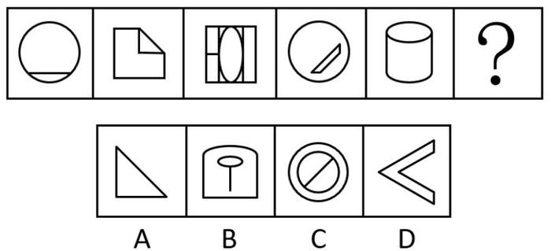

- **A**. A　✅
- **B**. B
- **C**. C
- **D**. D

**答案**：A

**官方解析**

元素组成不同，优先考虑属性规律。观察题干图形，出现等腰三角形、等腰梯形等明显轴对称图形，考虑对称性。题干对称轴数量均为1，排除C项。继续观察发现，题干对称轴依次顺时针旋转，则“？”处应该填入对称轴方向为右上-左下的图形，只有A项符合。

故正确答案为A。

---

### 第 16 题　qid 4651720 · 图形推理

请从所给的四个选项中，选出最恰当的一项填入问号处，使之呈现一定的规律性。

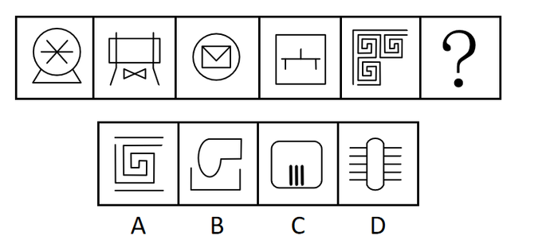

- **A**. A
- **B**. B　✅
- **C**. C
- **D**. D

**答案**：B

**官方解析**

元素组成不同，无明显属性规律，考虑数量规律。观察发现题干出现较多生活化图形，考虑部分数。题干图形的部分数均为2，故？处要选一个部分数为2的图形，只有B项符合。
故正确答案为B。

---

### 第 17 题　qid 4651708 · 图形推理

请从所给的四个选项中，选出最恰当的一项填入问号处，使之呈现一定的规律性。

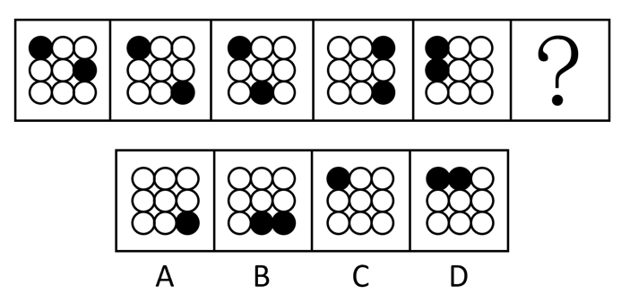

- **A**. A　✅
- **B**. B
- **C**. C
- **D**. D

**答案**：A

**官方解析**

图形元素组成相同，优先考虑位置规律。观察发现，题干图形中两个黑球沿九宫格的外圈进行平移。优先考虑就近假设，图一左上角黑球保持位置不动，但图四不符合此规律，因此图一左上角黑球对应图二右下角黑球。如下图所示，从图一到图五，黑球1沿外圈每次顺时针平移4格，黑球2沿外圈每次逆时针平移3格，因此？处图形也应满足此规律，黑球位置如下图所示，对应A项。

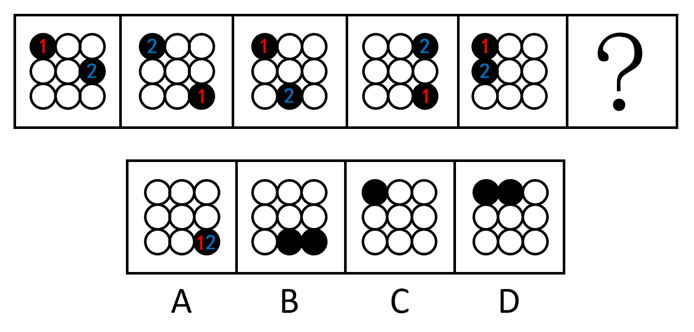

故正确答案为A。

---

### 第 18 题　qid 4651783 · 图形推理

从所给的四个选项中，选择最合适的一个填入问号处，使之呈现一定的规律性：

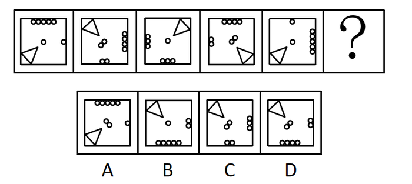

- **A**. A
- **B**. B
- **C**. C
- **D**. D　✅

**答案**：D

**官方解析**

元素组成相同，优先考虑位置规律。观察发现，三角形沿着正方形的四个角依次顺时针移动一个角的位置，？处应移动到左上角，排除A项；继续观察题干，发现小圆数量发生变化，内圈小圆数量依次为1、2、1、2、1、？，？处应选择内圈有2个小圆的图形，排除B项；外圈小圆数量均为6个，排除C项，只有D项符合规律。
故正确答案为D。

---

### 第 19 题　qid 4651707 · 图形推理

请从所给的四个选项中，选出最恰当的一项填入问号处，使之呈现出一定的规律性。

- **A**. A　✅
- **B**. B
- **C**. C
- **D**. D

**答案**：A

**官方解析**

图形元素组成不同，且无明显属性规律，考虑数量规律。观察发现，题干图形中出现明显单一直线及多边形，优先考虑数直线，发现整体数直线无规律，而题干图形中横线、竖线较多，因此考虑分开数横竖线。九宫格优先横行看，三行图形的横线数依次为3、4、3、4、3、4、4、3，三行图形的竖线数依次为2、3、2、3、2、3、3、2，单看横竖线数无规律，考虑二者做运算。发现题干所有图形的横线数减竖线数均为1，故？处应选择横线数减竖线数等于1的图形，只有A项符合规律。
故正确答案为A。

---

### 第 20 题　qid 4651744 · 图形推理

请从所给的四个选项中，选出最恰当的一项填入问号处，使之呈现出一定的规律性：

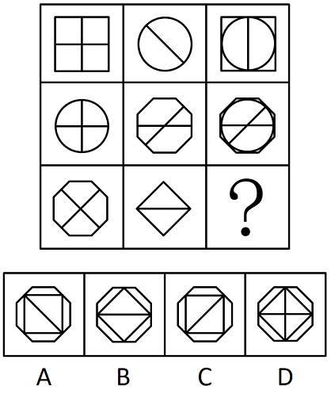

- **A**. A　✅
- **B**. B
- **C**. C
- **D**. D

**答案**：A

**官方解析**

元素组成相似，优先考虑样式规律，且相同线条重复出现，因此考虑样式规律中的加减同异。九宫格优先按行看，观察发现，第一行中，图2逆时针旋转，再与图1求异得到图3。经验证，第二行也满足此规律。因此第三行应用此规律，图2逆时针旋转，再与图1求异，得到A项图形。

故正确答案为A。

---

### 第 21 题　qid 4651582 · 图形推理

下边四个图形中，只有一个是由上边的四个图形拼合（只能通过上、下、左、右平移）而成的，请把它找出来。

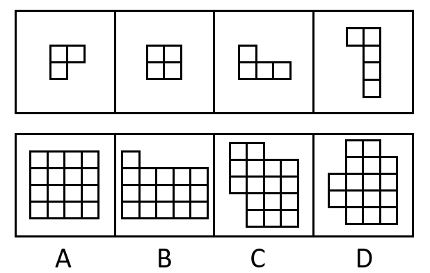

- **A**. A　✅
- **B**. B
- **C**. C
- **D**. D

**答案**：A

**官方解析**

本题考查平面拼合，可采用平行且等长相消的方式解题。消去平行且等长的线段后进行组合即可得到轮廓图，即为A项。平行且等长相消的方式如下图所示： 

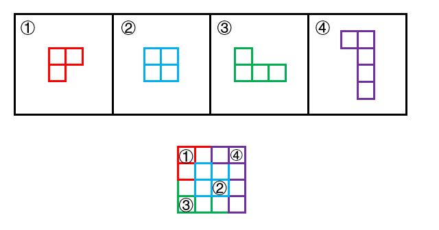

故正确答案为A。

---

### 第 22 题　qid 4651713 · 图形推理

下边四个图形中，只有一个是由上边的四个图形拼合（只能通过上、下、左、右平移）而成的，请把它找出来。

- **A**. A
- **B**. B　✅
- **C**. C
- **D**. D

**答案**：B

**官方解析**

本题考察平面拼合，可采用平行且等长相消的方式解题。消去平行且等长的线段后进行组合即可得到轮廓图，即为B项。平行且等长相消的方式如下图所示：

故正确答案为B。

---

### 第 23 题　qid 4651697 · 图形推理

下边四个图形中，只有一个是由上边的四个图形拼合（只能通过上、下、左、右平移）而成的，请把它找出来。

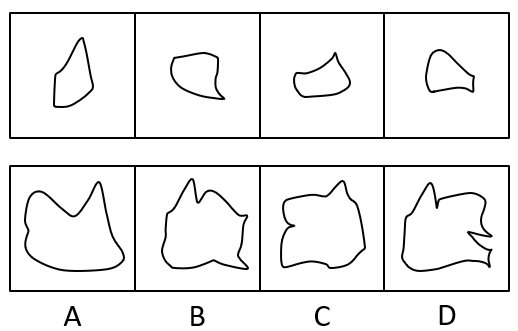

- **A**. A　✅
- **B**. B
- **C**. C
- **D**. D

**答案**：A

**官方解析**

本题考查平面拼合。消去凹凸匹配的线条后进行组合可得到轮廓图，即为A项。具体拼合方式如下图所示：

故正确答案为A。

---

### 第 24 题　qid 4651743 · 类比推理

上边四张纸片，每张纸片一面是黑色，另一面是白色，下边仅有一项能由其拼合（可以平移、旋转、翻转）而成，请把它找出来。

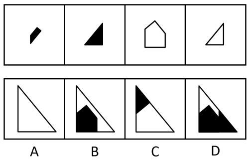

- **A**. A　✅
- **B**. B
- **C**. C
- **D**. D

**答案**：A

**官方解析**

本题考查平面拼合，可以平移、旋转、翻转，且每张纸片一面是黑色，另一面是白色，需要考虑翻转后的颜色变化。将题干图形标上序号，如下图所示，逐一分析选项。

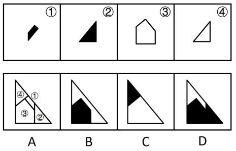

A项：可以由题干图形拼合而成，拼合方式如上图所示，当选；

B项：左下角的五边形是由图③平移过去的，颜色应该是白色，而选项是黑色，排除； 

C项：右下角的白色三角形是由图④翻转后平移过去的，颜色应该是黑色，而选项是白色，排除； 

D项：左下角的五边形是由图③平移过去的，颜色应该是白色，而选项是黑色；且右下角的三角形是由图②翻转后平移得到的，颜色应该是白色，而选项是黑色。排除。 

故正确答案为A。 

---

### 第 25 题　qid 4651714 · 类比推理

上边四张纸片，每张纸片一面是黑色，另一面是白色，下边仅有一项能由其拼合（可以平移、旋转、翻转）而成，请把它找出来。

- **A**. A
- **B**. B
- **C**. C　✅
- **D**. D

**答案**：C

**官方解析**

本题考查平面拼合，题干已知每张纸片一面是黑色，另一面是白色，且可以涉及转动，故可知，平移和旋转时纸片颜色不会改变，翻转时颜色会发生改变。经过拼合后只能得到C项。如下图所示：

故正确答案为C。

---

### 第 26 题　qid 4651717 · 图形推理

左边给定的是多面体的外表面，右边哪一项能由它折叠而成？

- **A**. A　✅
- **B**. B
- **C**. C
- **D**. D

**答案**：A

**官方解析**

将题干展开图标上序号，如下图所示，逐一进行分析。

A项：选项由面b和面c构成，选项与题干展开图一致，当选；

B项：选项由面b和面c构成，以面c中空白顶点为起点进行画边（如上图蓝线所示），展开图中边1对应面b，选项中边3对应面b，选项与题干展开图不一致，排除；

C项：选项由面a和面c构成，展开图中，二者的公共边与面a内部阴影小三角形的顶点重合，选项中不重合（如下图绿线所示），选项与题干展开图不一致，排除；

D项：选项由面b和面d构成，展开图中，二者的公共边与面d内部三角形的边重合，选项中不重合（如下图红线所示），选项与题干展开图不一致，排除。

故正确答案为A。

---

### 第 27 题　qid 4651741 · 图形推理

左边给定的是多面体的外表面，右边哪一项能由它折叠而成？

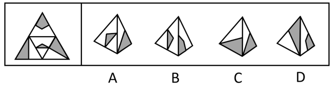

- **A**. A
- **B**. B
- **C**. C　✅
- **D**. D

**答案**：C

**官方解析**

将题干展开图标上序号，如下图所示，逐一进行分析。

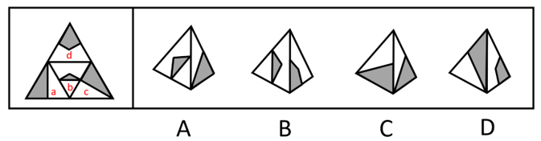

A项：选项由面b、面a或面c构成，题干展开图中面b内白色三角形的顶点（如下图蓝点所示）只与面a或面c中白色三角形相邻，而选项中面b内白色三角形的顶点与面a或面c中阴影三角形和白色三角形均相邻，选项与题干展开图不一致，排除；

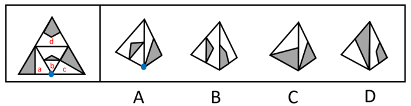

B项：选项由面b、面d构成，题干展开图中面d的白色部分挨着面b，而选项中面d的灰色部分挨着面b，选项与题干展开图不一致，排除；

C项：选项由面a、面c构成，选项与题干展开图一致，当选；

D项：选项由面d、面a或面c构成，题干展开图中面d白色部分的最长边挨着面b，而选项中面d白色部分的最长边没有挨着面b，选项与题干展开图不一致，排除。

故正确答案为C。

---

### 第 28 题　qid 4651722 · 图形推理

左边给定的是多面体的外表面，右边哪一项能由它折叠而成？请把它找出来。

- **A**. A
- **B**. B
- **C**. C　✅
- **D**. D

**答案**：C

**官方解析**

将原展开图标上序号，如下图所示，逐一进行分析。

A项：选项中出现了面a和面e，面a中黑点所在矩形的长边（如下图线1所示）与面e相邻，而展开图中该矩形的长边与面b相邻，选项与题干展开图不一致，排除；

B项：选项中出现了面c、面f，面f中白圆所在矩形的长边（如下图线2所示）与面c相邻，而展开图中该矩形的长边与面e相邻，选项与题干展开图不一致，排除；

C项：选项中出现了面c、面d和面f，选项与题干展开图一致，当选；

D项：选项中出现了面a、面e，顶面为面b或面d，面e挨着顶面的空白三角形（如下图线3所示），但展开图中面e挨着面b或面d内的阴影三角形，选项与题干展开图不一致，排除。

故正确答案为C。

---

### 第 29 题　qid 4651747 · 图形推理

左边给定的是多面体的外表面，右边哪一项能由它折叠而成？请把它找出来。

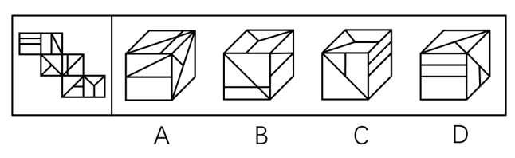

- **A**. A
- **B**. B
- **C**. C　✅
- **D**. D

**答案**：C

**官方解析**

本题考查六面体，将原展开图标上序号，如下图所示，逐一进行分析。

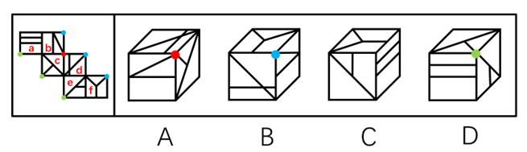

A项：选项中必然存在面b、面c和面d，题干展开图中三个面的公共点没有引出面c中的小短线，而选项中三个面的公共点引出了面c中的小短线，选项与题干展开图不一致，排除；

B项：选项中必然存在面b、面d和面f，题干展开图中三个面的公共点引出面d中的斜线，而选项中三个面的公共点没有引出面d中的斜线，选项与题干展开图不一致，排除；

C项：选项中必然存在面a、面e和面f，选项与题干展开图一致，当选；

D项：选项中必然存在面a、面c和面e，题干展开图中三个面的公共点在面a中对应的是大矩形，而选项中三个面的公共点在面a中对应的是小矩形，选项与题干展开图不一致，排除。

故正确答案为C。

---

### 第 30 题　qid 4651753 · 逻辑判断

新信息技术的不断发展，使生产要素配置发生变化；生产要素配置的变化又使企业运营模式发生变化，进而使市场对人才的需求发生变化；而市场对人才的需求发生了变化，就会促使高校重新制定人才培养方案。
以上陈述如果为真，可以推出以下哪项？

- **A**. 市场对人才的需求发生变化会导致企业运营模式发生变化
- **B**. 如果高校没有重新制定人才培养方案，说明市场对人才的需求没有什么变化　✅
- **C**. 如果没有新信息技术的不断发展，市场对人才的需求就不会发生变化
- **D**. 企业运营模式的变化不一定会导致高校重新制定人才培养方案

**答案**：B

**官方解析**

第一步：翻译题干。

①新信息技术的不断发展生产要素配置发生变化；

②生产要素配置的变化企业运营模式发生变化市场对人才的需求发生变化；

③市场对人才的需求发生了变化高校重新制定人才培养方案；

以上条件可以递推出：④新信息技术的不断发展生产要素配置发生变化企业运营模式发生变化市场对人才的需求发生变化高校重新制定人才培养方案。

第二步：逐一分析选项。

A项：翻译为市场对人才的需求发生变化企业运营模式发生变化，是对②的肯后，肯后得不出必然结论，无法推出，排除；

B项：翻译为高校重新制定人才培养方案市场对人才的需求发生变化，是对③的否后，否后必否前，可以推出，当选；

C项：翻译为新信息技术的不断发展市场对人才的需求发生变化，是对④的否前，否前得不出必然结论，无法推出，排除；

D项：根据④可知，企业运营模式的变化一定会导致高校重新制定人才培养方案，故此项无法推出，排除。

故正确答案为B。

---

### 第 31 题　qid 4651719 · 逻辑判断

盲盒是指消费者不能提前得知包装盒内具体产品的销售方式。现在许多商家大量销售盲盒，文具盲盒、零食盲盒等“盲盒+”商业模式迅速走红。心理学研究表明，打开盲盒时的不确定性会刺激人们尤其是青少年重复购买。对此，有专家认为，盲盒这种销售方式如果不加监管会给青少年的身心健康造成负面影响。
以下哪项如果为真，最能支持上述专家的观点？

- **A**. 越来越多的青少年对盲盒已从单纯的猎奇逐步升级到追求美感、情感等价值层面
- **B**. 打开盲盒时的不确定性令身心发育不成熟的青少年沉迷，激发其跟风攀比之心　✅
- **C**. 盲盒销售的价格通常远高于其实际价值，大大加重了青少年家长的经济负担
- **D**. 许多商家将盲盒销售当作清理库存商品的方式，严重损害了消费者的合法权益

**答案**：B

**官方解析**

第一步：找出论点和论据。
论点：盲盒这种销售方式如果不加监管会给青少年的身心健康造成负面影响。
论据：打开盲盒时的不确定性会刺激人们尤其是青少年重复购买。
本题论点和论据讨论的都是盲盒会给青少年造成负面影响，话题一致，加强优先考虑补充论据。
第二步：逐一分析选项。
A项：该项说的是青少年对盲盒的追求变化，从猎奇升级到追求美感、情感等价值层面，但这种追求的变化是否会给青少年的身心健康造成负面影响并不明确，无法加强，排除；
B项：该项说的是打开盲盒时的不确定性会让青少年沉迷，激发他们的跟风攀比之心，解释了为什么盲盒这种销售方式会给青少年的身心健康造成负面影响，补充论据，可以加强，当选；
C项：该项说的是盲盒的销售模式加重家长的经济负担，讲的是对家长的负面影响，没有提及是否会给青少年的身心健康造成负面影响，话题不一致，无法加强，排除；
D项：该项说的是盲盒的销售模式损害消费者的合法权益，没有提及是否会给青少年的身心健康造成负面影响，话题不一致，无法加强，排除。
故正确答案为B。

---

### 第 32 题　qid 4651721 · 逻辑判断

近年来，我国企业在设计产品时，注重融入中国元素，例如，在T恤上印上京剧脸谱等图案，推出中国航天系列文创产品······这些产品一上市，就受到消费者的热捧，“国货即潮流”的新消费观念正逐渐形成。有专家就此认为，正是这些中国元素的融入让国潮商品获得了国内消费者的青睐。
以下哪项如果为真，最能支持上述专家的观点？

- **A**. 中国文化五千年来绵延不绝，传统文化已深深刻在中国人的骨子里
- **B**. “中国制造”的高品质、高性能提升了消费者对其的认可度和忠诚度
- **C**. 随着视野的开阔，消费者渐趋理性，对明显溢价的洋品牌不再盲目追捧
- **D**. 中国文化的软实力已经深深影响着我国民众日常生活的方方面面　✅

**答案**：D

**官方解析**

第一步：找出论点和论据。
论点：正是这些中国元素的融入让国潮商品获得了国内消费者的青睐。
论据：近年来，我国企业在设计产品时，注重融入中国元素，这些产品一上市，就受到消费者的热捧，“国货即潮流”的新消费观念正逐渐形成。
论据说的是注重融入中国元素的设计产品会受到消费者的热捧，而论点说正是这些中国元素的融入让国潮商品获得了国内消费者的青睐。论点论据话题一致，所以加强可以优先考虑补充论据，可以举例子，也可以解释原因。
第二步：逐一分析选项。
A项：该项说的是中国传统文化对中国人的影响深刻，正是由于传统文化的深刻影响，才让融入中国传统文化元素的国货产品获得了国内消费者的青睐，能够解释论点，可以加强，保留；
B项：该项说的是“中国制造”的高品质、高性能会影响消费者对产品的认可度和忠诚度，但并没有说明中国元素的融入是否会影响消费者对产品的青睐程度，和论点话题不一致，无法加强，排除；
C项：该项说的是消费者对洋品牌不再盲目追捧，但对洋品牌不追捧不代表就会青睐融入中国元素的国潮商品，和论点话题不一致，无法加强，排除；
D项：该项说的是中国文化的软实力已经深深影响着我国民众日常生活的方方面面，正是由于中国文化的软实力的深刻影响，才让融入中国元素的国潮商品获得了国内消费者的青睐，能够解释论点，可以加强，保留。
对比A、D两项，A项只提及了传统文化，而D项的中国文化软实力不仅包括传统文化，还包括其他内容，论点中的中国元素不仅包括传统文化元素，还包括了航天等非传统文化元素，这也是中国文化软实力的一部分，所以D项的加强力度优于A项，D项当选。
故正确答案为D。

---

### 第 33 题　qid 4651564 · 类比推理

某高校选派甲、乙、丙、丁4位专家组成乡村振兴调研小组，担任组长的专家为男性、党员、教授。已知这4位专家中：
（1）每位专家都至少具有组长的一个特征；
（2）有党员3人，男性2人，教授1人；
（3）甲和乙性别相同；
（4）乙是党员当且仅当丙是党员；
（5）丙和丁不全是党员。
由此推出，担任组长的是：

- **A**. 甲
- **B**. 乙
- **C**. 丙　✅
- **D**. 丁

**答案**：C

**官方解析**

第一步：分析题干条件。

（1）担任组长的专家为男性、党员、教授；

（2）每位专家都至少具有组长的一个特征；

（3）有党员3人；

（4）男性2人；

（5）教授1人；

（6）甲和乙性别相同；

（7）乙、丙要么都是党员，要么都不是党员；

（8）丙不是党员或丁不是党员。

第二步：根据题干条件进行推理。

根据条件（3）和（7），得出乙和丙都是党员，再根据条件（3）和（8）得出丁不是党员，甲是党员，根据条件（4）和（6），假设甲和乙都是男性，那么丁既不是党员也不是男性，又根据条件（2），得出丁必须是教授，再根据条件（5），得出其他人都不是教授，此时并没有一个人具有担任组长的三个特征，与条件（1）矛盾，因此假设不成立；故甲和乙都不是男性，丙和丁都是男性，此时只有丙既是党员又是男性，再根据条件（1）和（5），得出丙必须也是教授。因此同时具有担任组长三个特征的专家是丙。表格如下：

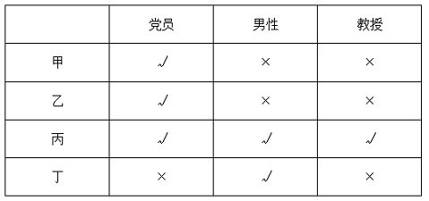

故正确答案为C。

---

### 第 34 题　qid 4651553 · 逻辑判断

麦子大约在五千年前由西亚传入中国，但由麦子做成的面食直到唐宋时期才成为北方人的主食。在此之前，北方的主粮是粟，也就是小米。秦汉时期的老百姓很不愿意种麦子，汉朝曾为增加粮食产量两次大力推广种麦子，但老百姓并没有积极响应。
以下哪项如果为真，最能解释上述历史现象？

- **A**. 外来作物很多，除了麦子，还有番薯、胡麻等，不是每种作物一传入就被接受
- **B**. 磨粉技术传播较晚，东汉时只有官宦人家才拥有上下两扇带有磨齿的磨盘
- **C**. 麦粒直接煮成的“麦饭”生硬难咽、口感很差，秦汉时期的绝大多数人都不爱吃　✅
- **D**. 东汉以后磨盘磨粉和“热汤饼”等面食技术逐渐推广开来，麦子才变得“好吃”了

**答案**：C

**官方解析**

第一步：找出题干矛盾。
秦汉时期的老百姓很不愿意种麦子，汉朝曾两次大力推广种麦子，但老百姓并没有积极响应。
第二步：逐一分析选项。
A项：该项说的是有些外来作物并不能马上被接受，但是汉朝已经两次大力推广了，为什么还是不能被接受，不能解释题干矛盾，排除；
B项：该项说的是东汉时期只有官宦人家才能将麦子磨粉，那在麦子不能被磨粉时，为什么老百姓不愿意种植，选项并没有明确说明，不能解释题干矛盾，排除；
C项：该项说的是由麦粒直接煮成的“麦饭”口感很差，秦汉时期的绝大多数人都不爱吃，因为麦粒不好吃所以不种麦子，可以解释即使国家大力推广，老百姓也不积极响应的原因，可以解释题干矛盾，当选；
D项：该项说的是麦子从东汉以后因为磨盘磨粉和面食技术才变得好吃，题干要解释的矛盾点是为什么国家推广也不种，C项很直接地说明因为不好吃，所以不种；D项在解释怎么才变得“好吃”，没有C项直接，排除。
故正确答案为C。

---

### 第 35 题　qid 4651733 · 逻辑判断

近年来，某小区流浪猫泛滥成灾。去年年初该小区的物业对流浪猫进行了绝育处理。然而在今年年初，业主们发现该小区流浪猫的数量至少有去年年初的1.5倍之多。
以下哪项如果为真，最能解释上述现象？

- **A**. 该小区多年来环境保护良好，有许多鸟类在此栖息，流浪猫极易获得食物
- **B**. 该小区少数业主去年成立了爱猫小组，定期在该小区投放食物喂养流浪猫
- **C**. 该小区有一些养宠物猫的租户今年退租后，将宠物猫遗弃在小区内
- **D**. 该小区紧邻其他大型小区，流浪猫可以在这些小区间自由流动　✅

**答案**：D

**官方解析**

第一步：找出题干矛盾。
去年年初该小区的物业对流浪猫进行了绝育处理，但今年年初该小区流浪猫的数量至少有去年年初的1.5倍之多。
第二步：逐一分析选项。
A项：该小区多年来环境保护良好，流浪猫极易获得食物，可以解释为什么多年来该小区有流浪猫，但是无法解释为什么去年年初对流浪猫进行绝育处理后，今年年初流浪猫的数量至少有去年年初的1.5倍之多，不能解释题干矛盾，排除；
B项：业主成立爱猫小组，投放食物，可以解释为什么该小区有流浪猫，但是无法解释为什么去年年初对流浪猫进行绝育处理后，今年年初流浪猫的数量至少有去年年初的1.5倍之多，不能解释题干矛盾，排除；
C项：一些租户将宠物猫遗弃在该小区，可以解释为什么流浪猫的数量增加了，但“一些”仅是少数，无法解释为什么今年年初流浪猫的数量至少有去年年初的1.5倍之多，不能解释题干矛盾，排除；
D项：该小区紧邻其他大型小区，流浪猫可以在小区间进行流动，说明一方面别的小区的流浪猫能流动到本小区，另一方面它们仍可以繁衍新的小猫。且“其他大型小区”体现出很有可能紧邻小区的非绝育猫咪数量不少，解释了为什么去年对本小区的流浪猫绝育，但今年年初流浪猫的数量至少有去年年初的1.5倍之多，可以解释题干矛盾，当选。
故正确答案为D。

---

### 第 36 题　qid 4651718 · 逻辑判断

教育部出台“双减”政策后，某市教育部门对中小学课外补习制定了具体规定：针对义务教育阶段的学科类补习只能在工作日晚上9点之前进行，周末可以进行艺术类补习。
根据上述陈述，以下哪项陈述的情况违反了该市教育部门的规定？

- **A**. 四年级同学小明在周三放学之后参加了两个艺术类辅导班
- **B**. 初三学生小红在工作日晚上九点之后仍在刻苦学习各学科知识
- **C**. 某培训机构针对上班族推出英语口语培训班，吸引了许多学员
- **D**. 某培训机构在国庆假期为小升初学生补上因疫情耽搁的数学课程　✅

**答案**：D

**官方解析**

逐一分析选项。
A项：四年级同学小明在周三放学之后参加了两个艺术类辅导班，小明参加的是艺术类补习，而题干中没有说工作日晚上是否可以进行艺术类补习，因此没有违反该市教育部门的规定，排除；
B项：初三学生小红在工作日晚上九点之后仍在刻苦学习各学科知识，小红是自己刻苦学习，并没有参加任何补习班，没有违反该市教育部门的规定，排除；
C项：某培训机构针对上班族推出英语口语培训班，这个培训机构针对的是上班族，而不是针对的义务教育阶段的学生，没有违反该市教育部门的规定，排除；
D项：某培训机构在国庆假期为小升初学生补上因疫情耽搁的数学课程，小升初学生是在义务教育阶段，国庆假期补习数学课程违反了学科类补习只能在工作日晚上9点之前进行的规定，当选。
故正确答案为D。

---

### 第 37 题　qid 4651561 · 类比推理

甲：这本小说太精彩了，你喜欢里面的哪个角色呢？
乙：我对小说不感兴趣，没有读过这本小说
以下哪项的对话与上述对话最为相似？

- **A**. 
教师：你不努力学习以后怎么能考上理想的大学呢？

学生：我理想的大学太难考了，再努力也不一定能考上

- **B**. 
员工甲：总经理的讲话中，你认可哪些呢？

员工乙：总经理的讲话我都赞成，我会尽全力执行讲话中的要求

- **C**. 
孩子：爸爸，夏天游泳更能锻炼身体呢，还是冬天游泳更能锻炼身体呢？

父亲：游泳是非常好的锻炼方式，在任何时候游泳都能锻炼人

- **D**. 
商户：您上个月在我们商店购买的冰箱好用吗？

顾客：你可能记错了，我上个月在你们店购买的是洗衣机
　✅

**答案**：D

**官方解析**

第一步：分析题干逻辑关系。
甲以“看过这本小说”为前提，问乙“喜欢哪个角色”，乙表示“没有读过这本小说”，没有直接回答甲的问题，而是对甲问题的前提进行否定。
第二步：逐一分析选项。
A项：教师问“不努力学习以后怎么能考上理想的大学”，学生表示“因为理想的大学太难考，再努力也不一定能考上”，是直接回答了教师的问题，没有否定问题的前提，与题干对话方式不一致，排除；
B项：员工甲问“认可总经理的哪些讲话”，员工乙表示“都赞成”，是直接回答了员工甲的问题，没有否定问题的前提，与题干对话方式不一致，排除；
C项：孩子问“是夏天游泳更能锻炼身体，还是冬天游泳更能锻炼身体”，父亲表示“任何时候游泳都能锻炼人”，是直接回答了孩子的问题，没有否定问题的前提，与题干对话方式不一致，排除；
D项：商户以“购买过冰箱”为前提，问顾客“是否好用”，顾客表示“购买的不是冰箱，而是洗衣机”，没有直接回答商户的问题，而是对商户问题的前提进行否定，与题干对话方式一致，当选。
故正确答案为D。

---

### 第 38 题　qid 4651711 · 逻辑判断

张先生的孩子简直就是一个“麻烦制造者”，在学校上课经常与身旁同学交头接耳，不时还与老师唱反调；在家里边写作业边听音乐，不到10分钟就又开始上蹿下跳；批评两句他根本不放在心上，反而嘻皮笑脸对你做个鬼脸。张先生觉得自家的孩子浑身上下到处是缺点，对他的未来充满了焦虑。
以下哪项如果为真，最有助于缓解张先生目前的焦虑？

- **A**. 每个孩子都有自己的行为和性格特点，这些特点可能与其父母或他人不尽相同，但不一定是真正的缺点
- **B**. 孩子思维活跃、行动自在，敢于打破常规、表达自我，恰恰是其充满活力、有创新潜能的表现　✅
- **C**. 孩子不把家长批评放在心上，是因为在他们看来，家长的批评实际上是关心爱护自己的表现
- **D**. 如果孩子过于安静，不喜欢结交同学，对家长的批评总保持沉默，家长也会感到焦虑

**答案**：B

**官方解析**

第一步：找出论点和论据。
论点：张先生觉得自家的孩子浑身上下到处是缺点，对他的未来充满了焦虑。
论据：张先生的孩子简直就是一个“麻烦制造者”，在学校上课经常与身旁同学交头接耳，不时还与老师唱反调；在家里边写作业边听音乐，不到10分钟就又开始上蹿下跳；批评两句他根本不放在心上，反而嘻皮笑脸对你做个鬼脸。
论点说的是张先生因觉得孩子充满缺点而对其未来充满焦虑，论据说的是孩子的一些表现，二者均讨论孩子充满缺点，话题一致，削弱优先考虑削弱论点。
第二步：逐一分析选项。
A项：说的是孩子与他人不同的特点不一定是真正的缺点，但孩子与他人不同的特点是否会影响孩子未来的发展并不清楚，不明确选项，无法削弱，排除；
B项：说的是孩子的表现从另一个角度看恰恰是优点，说明孩子并非充满缺点，进而也无须对其未来充满焦虑，直接削弱论点，可以削弱，当选；
C项：说的是孩子为什么不把家长批评放在心上，只解释了孩子其中一个缺点的形成原因，与张先生对孩子未来充满焦虑无关，无法削弱，排除；
D项：说的是即使孩子的表现与现在完全相反，张先生也会焦虑，但不能明确说明目前孩子的表现张先生是否会对其未来充满焦虑，二者话题不一致，无关项，无法削弱，排除。
故正确答案为B。

---

### 第 39 题　qid 4651712 · 逻辑判断

青山村山清水秀，环境优美，村民们在村委会带领下规划自己的美好未来。他们计划：
（1）如果兴建葡萄庄园或修建民宿，就要开发乡村旅游；
（2）如果发展水产养殖或开发乡村旅游，则要修建民宿；
（3）如果不兴建葡萄庄园，就发展水产养殖；
（4）如果开发乡村旅游，则要改造村容村貌。
如果上述计划得以实施，可以得出以下哪项？

- **A**. 青山村会兴建葡萄庄园
- **B**. 青山村会改造村容村貌　✅
- **C**. 青山村不会修建民宿
- **D**. 青山村不会发展水产养殖

**答案**：B

**官方解析**

第一步：分析题干条件。

（1）兴建葡萄庄园 或 修建民宿开发乡村旅游；

（2）发展水产养殖 或 开发乡村旅游修建民宿；

（3）兴建葡萄庄园发展水产养殖；

（4）开发乡村旅游改造村容村貌。

第二步：根据题干条件进行推理。

解题思路一：

题干信息较多没有明显推理起点，可从最大信息入手，条件（1）、（2）、（4）均提到了开发乡村旅游，故从开发乡村旅游这个最大信息开始假设。

假设开发乡村旅游，依据条件（2），或关系一真即真，可得：修建民宿。再依据条件（1），或关系一真即真，可得：开发乡村旅游。开发乡村旅游是对条件（4）的肯前，可得：改造村容村貌。此种假设（开发乡村旅游）与题干信息均无矛盾。

假设不开发乡村旅游，这是对条件（1）的否后，可得：兴建葡萄庄园 且 修建民宿。兴建葡萄庄园是对条件（3）的肯前，可得：发展水产养殖。再依据条件（2），或关系一真即真，可得：修建民宿，此时与已推出的不修建民宿的信息矛盾，所以第二种假设（不开发乡村旅游）不成立。

综上所述，开发乡村旅游一定成立，开发乡村旅游是对条件（4）的肯前，可得：改造村容村貌，因此，B项可以推出。

解题思路二：

条件（1）、（3）均提到“兴建葡萄庄园”，且一个是肯定一个是否定，可优先从是否兴建葡萄庄园进行假设。

假设“兴建葡萄庄园”，依据条件（1）可知，“开发乡村旅游”成立，结合条件（2）、（4）可知，“修建民宿”和“改造村容村貌”也成立；

假设“不兴建葡萄庄园”，依据条件（3）可知，“发展水产养殖”成立，结合条件（2）可知，“修建民宿”成立，根据条件（1）、（4）可知，“开发乡村旅游”、“改造村容村貌”也成立；

综上所述，无论是否兴建葡萄庄园，“开发乡村旅游”“修建民宿”“改造村容村貌”一定成立，因此，B项可以推出。

故正确答案为B。

---

### 第 40 题　qid 4651745 · 逻辑判断

某游戏公司规定，登录游戏必须实名验证，未成年人每天最多只能在线100分钟，晚上8点至次日上午6点不能使用。然而，后台的账户登录数据显示，规定实施后，未成年人账户登录游戏的平均时长与之前相比增加了15％。
以下哪项如果为真，最能解释上述现象？

- **A**. 规定实施后，许多家长通过为孩子注册未成年人账户来限制其长时间玩游戏
- **B**. 许多未成年人通过购买成年人账号或者使用其父母账号登录游戏
- **C**. 未成年人有逆反心理，新规定反而刺激了他们在节假日过度玩游戏　✅
- **D**. 规定实施后，公司推出在线满90分钟送装备活动，吸引了许多购买力不强的玩家

**答案**：C

**官方解析**

第一步：找出题干矛盾。
登录游戏必须实名验证，未成年人每天最多只能在线100分钟，但后台的账户登录数据显示，规定实施后，未成年人账户登录游戏的平均时长与之前相比增加了15％。
第二步：逐一分析选项。
A项：许多家长为孩子注册未成年人账户限制其游戏时长，说明家长在限制孩子游戏的时间，无法解释为何实名验证后未成年人账户登录时长增加，不能解释题干矛盾，排除；
B项：许多未成年人购买成年人账号或使用父母账号登录游戏，说明他们登录游戏的账户是成年人账户，但是题干说的是未成年人账户的使用情况，不能解释题干矛盾，排除；
C项：在新规之后，未成年人在节假日会过度游戏，即在节假日未成年人账户登录时长增加，可以导致未成年人账户登录游戏的平均时长比之前增加，可以解释题干矛盾，当选；
D项：规定实施后，新活动吸引许多购买力不强的玩家，但购买力不强的玩家不明确是否一定是未成年人，也可能是很多不喜欢在游戏中充值的成年人，不能解释题干矛盾，排除。
故正确答案为C。

---

### 第 41 题　qid 4651573 · 定义判断

闲置经济：指将一些还有使用价值但闲置未用的物品，以较低的价格通过网络平台进行交易的经济现象。
下列属于闲置经济的是：

- **A**. 某品牌电器官网举办以旧换新活动，孔女士便把家里用了三年的电磁炉寄去换了一台新款，比直接购买省了一半的钱
- **B**. 每到毕业季，大学生就会在操场、寝室门口等校园网上公布的位置摆摊设点，将自己的专业书籍低价转让给学弟学妹
- **C**. 近年来，老陈在网上买到了不少便宜货，如老旧缝纫机、修鞋机、磅秤等，他用这些别人眼中的废品做成了再生艺术品　✅
- **D**. 小佳在社交平台看到了一则北方小镇遭受雪灾的消息，就将自己前些年穿过的厚衣物寄给平台，统一消毒后发往灾区

**答案**：C

**官方解析**

第一步：找出定义关键词。
“一些还有使用价值但闲置未用的物品”、“以较低的价格”、“通过网络平台进行交易”。
第二步：逐一分析选项。
A项：孔女士用于置换的物品是家里用了三年的电磁炉，不清楚该电磁炉是否为闲置未用的物品，不符合“一些还有使用价值但闲置未用的物品”，电磁炉以旧换新的活动并非是直接以低价进行交易，也不符合“以较低的价格进行交易”，不符合定义，排除；
B项：大学生只是通过网上公布的位置摆摊设点，但是实际交易的时候应该是在摊点通过线下的方式，不符合“通过网络平台进行交易”，不符合定义，排除；
C项：老陈在网上买到了便宜货，符合“通过网络平台进行交易”，也符合“以较低的价格”，且在别人眼中是废品，但是老陈用它们做成了再生艺术品，说明在别人眼里是闲置未用的物品，但对老陈有用，符合“一些还有使用价值但闲置未用的物品”，符合定义，当选；
D项：小佳将自己前些年穿过的厚衣物寄给平台，属于向灾区的捐赠行为，不属于交易，不符合“以较低的价格”，也不符合“通过网络平台进行交易”，不符合定义，排除。
故正确答案为C。

---

### 第 42 题　qid 4651577 · 定义判断

信用联动奖惩：指有关部门或组织在法定范围内根据企业、个人信用记录，采取部门联动、社会协同等方式，对其依法联合实施奖励或惩戒的行为。
下列属于信用联动奖惩的是：

- **A**. 某市设立了无偿献血“五星级志愿者”、志愿服务终身荣誉奖，获奖市民可以免除市管公园门票，免费乘坐市内公交车，享受市属公立医院诊察费半价优惠
- **B**. 餐馆老板李先生在当地政务服务网提交了经营性临时占道申请，由于其信用等级为A级，可以享受审批绿色通道，第二天就收到了城管和其他相关部门的许可短信　✅
- **C**. 阮先生在承租的公租房里开设棋牌室，违背了申请公租房时的诚信承诺，被住房保障部门扣罚了住房保证金，并纳入五年内不得申请公租房的名单。阮先生对自己的失信行为深感后悔，保证以后一定做一个诚信公民
- **D**. 某区政府接到媒体举报，辖区内一超市以次充好，将普通猪肉当黑猪肉售卖，区政府立即召集市场监管、税务等职能部门赶到超市，现场联合办公，对相关责任人进行查处

**答案**：B

**官方解析**

第一步：找出定义关键词。
“根据企业、个人信用记录”、“部门联动、社会协同”、“依法联合实施奖励或惩戒”。
第二步：逐一分析选项。
A项：根据无偿献血的志愿行为来实施奖励，不符合“根据企业、个人信用记录”，不符合定义，排除； 
B项：由于李先生的信用等级为A级，符合“根据企业、个人信用记录”，可以享受审批绿色通道，且收到城管和其他相关部门的许可短信，符合“部门联动、社会协同”，也符合“依法联合实施奖励或惩戒”，符合定义，当选；
C项：阮先生在公租房开设棋牌室是违背了诚信承诺，符合“根据企业、个人信用记录”，扣罚住房保证金、纳入五年内不得申请公租房的名单均为惩戒手段，符合“依法联合实施奖励或惩戒”，但该行为均由住房保障部门实施，未提及其他有关部门，不符合“部门联动、社会协同”，不符合定义，排除；
D项：市场监管、税务等职能部门联合办公，符合“部门联动、社会协同”，但以次充好，将普通猪肉当黑猪肉售卖，属于不诚信经营的行为，并未提及商家的信用记录，不符合“根据企业、个人信用记录”，不符合定义，排除。
故正确答案为B。

---

### 第 43 题　qid 4651556 · 定义判断

微躺青年：指面对现实中的竞争压力，既不参与过度竞争，也不消极接受现状，而在专注于本职工作的同时，合理调整工作方向，追求自我价值实现的年轻人。
下列属于微躺青年的是：

- **A**. 设计师小谭研究生毕业后，因与投资人理念不合，离开了加盟三年的设计公司到外地改做陶瓷设计。最艰难的时候，天天工作到深夜，终于设计出大受市场欢迎的产品，实现了大学以来的梦想　✅
- **B**. 随着新冠肺炎疫情防控形势好转，各地游客都明显增多，商家纷纷推出低价游，抢占旅游市场。小李把自己的旅行社转让出去后，开始在网络上进行家乡景点直播，很快就成为直播达人，带动了家乡旅游产业的发展
- **C**. 今年大学毕业的小柳投递了许多份求职信，但都石沉大海。索性在网上当起了自律监督师，每天要定十几个闹钟，最多同时监督20多个人。刚开始觉得工作枯燥乏味，但现在已经收到了数百条好评，让他很有成就感
- **D**. 小何毕业后一直在互联网公司工作，公司内部竞争压力很大，常常加班到深夜。虽然收入十分可观，但他觉得高强度工作损害了身心健康，决定每年给自己放个小长假

**答案**：A

**官方解析**

第一步：找出定义关键词。

“面对现实中的竞争压力，既不参与过度竞争，也不消极接受现状”、“专注于本职工作的同时，合理调整工作方向”、“追求自我价值实现”。

第二步：逐一分析选项。

A项：设计师小谭离开原来的设计公司后并没有消极接受现状，而是调整了工作方向，改做陶瓷设计，符合“面对现实中的竞争压力，既不参与过度竞争，也不消极接受现状”、“专注于本职工作的同时，合理调整工作方向”，经过不懈努力，设计的产品获得市场欢迎，最终实现了自身的梦想，符合“追求自我价值实现”，符合定义，当选；

B项：商家纷纷推出低价游，抢占旅游市场，小李把自己的旅行社转让出去后，在网络上进行家乡景点直播，符合“面对现实中的竞争压力，既不参与过度竞争，也不消极接受现状”，但小李是迫于市场的压力转出了旅行社，改做网络直播，不符合“追求自我价值实现”，不符合定义，排除；

C项：大学刚毕业的小柳投递的许多份求职信石沉大海，于是在网上当起了自律监督师，符合“面对现实中的竞争压力，既不参与过度竞争，也不消极接受现状”，但没有体现专注本职工作及工作方向上的调整，不符合“专注于本职工作的同时，合理调整工作方向”，不符合定义，排除；

D项：在互联网公司工作的小何由于工作强度高，决定每年给自己放个小长假，符合“面对现实中的竞争压力，既不参与过度竞争，也不消极接受现状”，但放小长假不属于工作方向上的调整，不符合“专注于本职工作的同时，合理调整工作方向”，不符合定义，排除。

注：本题正确率很低，粉笔通过多次教研并查询原文，如下图所示：

1.A项是微躺青年的典型案例，而且A项在原文的基础上最后加了“实现大学以来的梦想”，更符合定义关键词“自我价值实现”；

2.有同学质疑A项“天天工作到深夜”根本不微躺，但是注意A项说“最艰难的时候”，并不是每天都卷；

3.ACD这三个选项都是“大学毕业/研究生毕业”，都能够体现出“青年、年轻人”，而B项只是说“小李”，身份不明确，这个点也不如A项。

故正确答案为A。

---

### 第 44 题　qid 4651710 · 定义判断

积极性休息：指工作、学习、运动过程中为降低强度、消除疲劳而主动变换形式或内容的调节方式。
下列属于积极性休息的是：

- **A**. 小亮昨天晚上从健身房回到家中，进门就躺倒在床上，醒来时已经是早上八点
- **B**. 小郑周末接到两个朋友电话，只好放下手里的活儿，跟他们到远郊爬了一天的山
- **C**. 疫情期间天天上网课，小丁每次听到枯燥的内容，就会偷偷地拿出手机听听音乐
- **D**. 讲座持续了两个多小时，口干舌燥的主讲人插播了一段案例小视频，现场气氛轻松起来，自己也感觉好了许多　✅

**答案**：D

**官方解析**

第一步：找出定义关键词。
“工作、学习、运动过程中”、“为降低强度、消除疲劳”、“主动变换形式或内容的调节方式”。
第二步：逐一分析选项。
A项：小亮昨天晚上从健身房回家后休息到第二天早上八点，不是健身过程中的休息，而是健身结束以后，不符合“工作、学习、运动过程中”，不符合定义，排除；
B项：小郑接到朋友电话后只好放下手里的工作去爬山，小郑不是主动选择的休息，而是被动接受了朋友的邀请，不符合“主动变换形式或内容的调节方式”，不符合定义，排除；
C项：小丁在上网课时听到枯燥的内容会拿出手机听音乐，不是因为课程强度大、学习疲劳，而是因为课程内容枯燥，不符合“为降低强度、消除疲劳”，不符合定义，排除；
D项：讲座持续了两个多小时，主讲人已经口干舌燥，所以插播了一段小视频，缓解了自己的疲劳，现场气氛也轻松起来，符合“工作、学习、运动过程中”、“为降低强度、消除疲劳”、“主动变换形式或内容的调节方式”，符合定义，当选。
故正确答案为D。

---

### 第 45 题　qid 4651723 · 定义判断

网约护士服务：指经过官方许可，以“线上申请、线下服务”的方式，为老弱病残孕等行动不便的人上门提供慢病管理、康复护理或专项护理等延续性的便捷服务。
下列不属于网约护士服务的是：

- **A**. 谭女士因治疗原因留置了PICC管，每周需要更换一次贴膜，家住得比较远，每次去医院换膜都要耗费大量时间。家人在线下单预约后，医院护士准备好护理用品，到谭女士家中为她更换PICC管专用贴膜，同时对其家人进行了护理指导
- **B**. 颜奶奶在医院进行了胆总管探查术，出院后需要定期进行T管维护，家属利用小程序预购了医院护理服务。接到订单后，肝胆外科护士上门为颜奶奶进行T管冲洗。家属感激地说：“护士上门服务真方便，以后再也不用发愁去医院了”
- **C**. 某民营医院最近推出了一项新的便民服务措施，慢病患者下载“医者仁心”术后护理APP，进入平台选择自己所需要的服务项目，只要详细填写服务需求，上传就医证明，完成预约后，就可以等待护士上门服务
- **D**. 刘爷爷平时独居在家，一天因高血压晕倒，被邻居及时送到医院才脱离危险。在外工作的子女急忙回家到医院为他申请定期看护服务，护士会在每次服务后将他的健康报告上传到系统中，以便子女了解刘爷爷的健康情况　✅

**答案**：D

**官方解析**

第一步：找出定义关键词。
“以‘线上申请、线下服务’的方式”、“为老弱病残孕等行动不便的人上门提供慢病管理、康复护理或专项护理等延续性的便捷服务”。
第二步：逐一分析选项。
A项：家人在线下单预约，符合“以‘线上申请、线下服务’的方式”，护士到谭女士家中为她更换PICC管专用贴膜，符合“为老弱病残孕等行动不便的人上门提供慢病管理、康复护理或专项护理等延续性的便捷服务”，符合定义，排除；
B项：家属利用小程序预购医院护理服务，符合“以‘线上申请、线下服务’的方式”，护士上门为颜奶奶进行T管冲洗，符合“为老弱病残孕等行动不便的人上门提供慢病管理、康复护理或专项护理等延续性的便捷服务”，符合定义，排除；
C项：慢病患者通过APP选择服务项目，符合“以‘线上申请、线下服务’的方式”，之后护士会上门服务，符合“为老弱病残孕等行动不便的人上门提供慢病管理、康复护理或专项护理等延续性的便捷服务”，符合定义，排除；
D项：刘爷爷的子女到“医院”申请定期看护服务，不符合“线上申请”，不符合定义，当选。
本题为选非题，故正确答案为D。

---

### 第 46 题　qid 4651583 · 定义判断

去雇主化职业：指作为独立个体不受雇于任何雇主，依托网络平台提供商品或服务并获得相应报酬的就业形式。
下列属于去雇主化职业的是：

- **A**. 林先生辞职后来到南方注册了一家绿植盆景网店，在一个多月的时间里，租赁场地，筹措资金，完善平台，忙得不亦乐乎
- **B**. 专业买手陈女士每月穿梭在世界各地，寻找带有当季流行元素或者可能在国内热卖的款式和品牌服装，并将其带回国内
- **C**. 小李加入了一个微信群，里面提供了许多可兼职工作的岗位，经过一番挑选，他选择了一份帮忙代取快递的兼职，用赚来的钱贴补每月生活费
- **D**. 喜欢写作的大二学生小孟在某平台网文写手的影响下，也开始在这家平台上更新写的小说，得到了许多粉丝的打赏，他很有成就感　✅

**答案**：D

**官方解析**

第一步：找出定义关键词。
“作为独立个体不受雇于任何雇主”、“依托网络平台提供商品或服务”、“获得相应报酬”。
第二步：逐一分析选项。
A项：林先生辞职后注册网店提供绿植盆景，符合“作为独立个体不受雇于任何雇主”、“依托网络平台提供商品或服务”，但未体现出获得报酬，不符合“获得相应报酬”，不符合定义，排除；
B项：陈女士把服装从世界各地带回国内，但未体现出是否依托网络平台售卖，是否获得报酬，不符合“依托网络平台提供商品或服务”、“获得相应报酬”，不符合定义，排除；
C项：小李通过微信群找到代取快递的兼职，不符合“作为独立个体不受雇于任何雇主”，不符合定义，排除；
D项：小孟依托网络平台更新写的小说，符合“作为独立个体不受雇于任何雇主”、“依托网络平台提供商品或服务”，且得到了许多粉丝的打赏，符合“获得相应报酬”，符合定义，当选。
故正确答案为D。

---

### 第 47 题　qid 4651580 · 定义判断

鲜活性效应：指重在依据自己耳闻目睹的具体个案而不是权威性、科学性信息做出选择的现象。
下列不属于鲜活性效应的是：

- **A**. 众所周知，飞机的事故率在所有交通工具中是最低的。但是李先生在电视上看到一则民航客机失事的新闻后，再也没有乘坐过飞机
- **B**. 小罗看中了某知名品牌的洗衣机，正打算付款，一个好朋友打来电话告诉她，自家这个牌子的洗衣机经常出故障，小罗当场放弃了购买计划
- **C**. 王大伯非常注重养生，本来滴酒不沾，后来他看到80岁高龄的邻居老赵每天都要小酌几杯，身体一直很好。于是，他逐渐不再刻意回避喝酒
- **D**. 小缪常用的视频网站总是会给她推送某品牌的按摩椅，父亲节的时候小缪想给父亲送按摩椅当礼物，就登录该品牌的官网购买　✅

**答案**：D

**官方解析**

第一步：找出定义关键词。
“依据自己耳闻目睹的具体个案”。
第二步：逐一分析选项。
A项：李先生决定不再乘坐飞机的依据是从新闻里看到了一则民航客机失事的新闻，符合“依据自己耳闻目睹的具体个案”，符合定义，排除； 
B项：小罗决定不买该品牌洗衣机的依据是听说好朋友家里那个该品牌的洗衣机质量不好，符合“依据自己耳闻目睹的具体个案”，符合定义，排除；
C项：王大伯决定不再刻意回避喝酒的依据是看到某个邻居每天小酌并且身体一直很好，符合“依据自己耳闻目睹的具体个案”，符合定义，排除；
D项：小缪决定购买官网中按摩椅的依据是常用的视频网站经常推送该品牌的按摩椅，但没有提及视频网站的推送视频是否是利用个案来宣传，不符合“依据自己耳闻目睹的具体个案”，不符合定义，当选。
本题为选非题，故正确答案为D。

---

### 第 48 题　qid 4651716 · 定义判断

信息瀑布：指现实生活中，当受到前人信息的影响时，放弃自己原有的想法，跟着他人选择的现象。
下列属于信息瀑布的是：

- **A**. 小李从单位离职后在家里呆了一段时间，上个月他发现了几份适合自己的工作，就分别递交了求职信。这几天收到了多封邮件，招聘单位大都以他失业太久为理由而拒绝了他
- **B**. 公司去陌生小镇组织团建活动，午餐时看到街边的一排小餐馆，不爱吃辣的胡先生纠结了一会，最终还是跟着几位湖南同事进了一家湘菜馆
- **C**. 消费者们通常认为十多年前的服装款式已经过时，但经过时装周推广、明星带货，那些款式往往又会成为新的时尚，重新受到追捧　✅
- **D**. 某家具厂的一款外壳酷似史前巨型昆虫的黑色办公椅，全厂上下都觉得像是用回收垃圾做的，对它的市场前景表示悲观，却意外地受到了办公人士的喜爱，最终成了该厂建厂以来最畅销的椅子

**答案**：C

**官方解析**

第一步：找出定义关键词。
“当受到前人信息的影响时”、“放弃自己原有的想法，跟着他人选择的现象”。
第二步：逐一分析选项。
A项：招聘单位拒绝小李的理由是他失业太久，做出该决定并没有受到前人的影响，不符合“当受到前人信息的影响时”，不符合定义，排除；
B项：不爱吃辣的胡先生是自己纠结午餐吃什么，并未体现出同事对他的影响，不符合“当受到前人信息的影响时”，不符合定义，排除；
C项：消费者们受到时装周和明星的影响，重新接受了之前认为过时的服装，符合“当受到前人信息的影响时”、“放弃自己原有的想法，跟着他人选择的现象”，符合定义，当选；
D项：该家具厂的办公椅意外地受到办公人士的喜爱，没有体现全厂员工和这些办公人士的选择受到前人信息的影响，不符合“当受到前人信息的影响时”，不符合定义，排除。
故正确答案为C。

---

### 第 49 题　qid 4651732 · 定义判断

自发性秩序：指在特定群体中存在的由众人行为自发形成并对个体成员具有内在影响或约束的社会习惯。
下列不属于自发性秩序的是：

- **A**. 某县是远近闻名的武术之乡，老老少少都会个一招半式
- **B**. 来中国不久，娅妮很快就学会了用“吃了吗”和别人打招呼
- **C**. 早高峰时段的路口车水马龙，没有一辆私家车占用公交专用车道　✅
- **D**. 某村多年以来形成了孝敬老人的风气，小辈和长辈吵架会被全村人看不起

**答案**：C

**官方解析**

第一步：找出定义关键词。
“由众人行为自发形成”、“对个体成员具有内在影响或约束的社会习惯”。
第二步：逐一分析选项。
A项：武术之乡的老老少少都会个一招半式，符合“由众人行为自发形成”，其中的单个人会个一招半式，符合“对个体成员具有内在影响或约束的社会习惯”，符合定义，排除；
B项：中国人用“吃了吗”和别人打招呼，符合“由众人行为自发形成”，娅妮受此影响很快学会这种打招呼的方式，符合“对个体成员具有内在影响或约束的社会习惯”，符合定义，排除；
C项：私家车不在早高峰时段占用公交专用车道是交通法规的要求，不符合“由众人行为自发形成”，不符合定义，当选；
D项：某村形成孝敬老人的风气，符合“由众人行为自发形成”，小辈和长辈吵架会被全村人看不起，符合“对个体成员具有内在影响或约束的社会习惯”，符合定义，排除。
本题为选非题，故正确答案为C。

---

### 第 50 题　qid 4651755 · 定义判断

网络考古：指针对多年前网络上发布的各种文字、图片、影像等资料，重新查看或考证，从中发现有价值的信息。
下列属于网络考古的是：

- **A**. 为了写一篇回忆大学生活的散文，王先生把十多年前在社交软件上的好友、大学图书馆的借书记录、当年在各种网站的帖文都翻了出来　✅
- **B**. 小吴夫妇很细心，从孩子出生前的每次产前检查，到出生时测量的数据建档、医学证明，再到数码相机里面每次留下的成长照片，都储存在了网络云相册里
- **C**. 程序员小陆从公司报废的硬盘中恢复出了公司内部的宣传资料、业务调整、人员变更等文档，交给了公司有关部门
- **D**. 多年前，网络上进行了一场“三星堆起源”的大辩论，吸引了几十万人围观留言。辩论的参与者老张回想起当年的唇枪舌剑，感慨万千

**答案**：A

**官方解析**

第一步：找出定义关键词。
“针对多年前网络上发布的各种文字、图片、影像等资料”、“重新查看或考证”、“从中发现有价值的信息”。
第二步：逐一分析选项。
A项：该项说的是王先生为了写一篇回忆大学生活的散文，把当年在各种网站的帖文都翻了出来，说明王先生重新查看了这些帖文，符合关键词“针对多年前网络上发布的各种文字、图片、影像等资料”、“重新查看或考证”，符合定义，当选；
B项：该项说的是小吴夫妇将孩子的产前检查、数据建档、医学证明、成长照片等资料储存在网络云相册里，并没有体现重新查看或考证这些资料，不符合关键词“重新查看或考证”，不符合定义，排除；
C项：该项说的是程序员小陆从公司报废的硬盘中恢复出了公司内部的资料，从硬盘中恢复的公司内部资料不属于网络上的资料，不符合关键词“针对多年前网络上发布的各种文字、图片、影像等资料”，不符合定义，排除；
D项：该项说的是老张回想起多年前的“三星堆起源”大辩论，并没有体现老张重新查看或考证有关该辩论的资料，不符合关键词“重新查看或考证”，不符合定义，排除。
故正确答案为A。

---
