# 2022年江苏省公务员录用考试《行测》题（C类）（网友回忆版）

> 判断推理 · 45 题 · 江苏 2022

## 材料 1

张研究员要在甲、乙、丙、丁、戊、己、庚7个村中选取4个进行乡村文明建设调研。因为地点、时间、经费等原因，选择还要符合以下条件：

（1）如果不选择甲，就要选乙；

（2）如果选丙，则不能选乙；

（3）如果选丁，则不能选庚；

（4）如果选戊，则要选丁；

（5）己和庚有且只有一个入选。

### 第 1 题　qid 4651757 · 逻辑判断

根据以上信息，以下哪项可能是张研究员选择的4个村？

- **A**. 甲、丙、丁、戊
- **B**. 甲、乙、丁、己　✅
- **C**. 丙、丁、戊、己
- **D**. 乙、丙、戊、庚

**答案**：B

**官方解析**

第一步：分析题干条件。

（1）甲乙；

（2）丙 乙；

（3）丁 庚；

（4）戊丁；

（5）己/庚。

第二步：逐一验证选项。

提问方式问可能，优先考虑代入法。

代入A项，不满足条件（5）己和庚有且只有一个入选，不符合题干条件，排除；

代入B项，符合题干条件，当选；

代入C项，结合条件（2）可知，丙入选了，则乙不能入选，又结合条件（1）可知，甲一定入选，与选项矛盾，排除；

代入D项，结合条件（2）可知，乙入选了，则丙不能入选，与选项矛盾，排除。

故正确答案为B。

---

### 第 2 题　qid 4651759 · 类比推理

如果张研究员选择了乙，再得知以下哪个村入选就可以确定4个要调研的村？

- **A**. 甲　✅
- **B**. 丁
- **C**. 己
- **D**. 庚

**答案**：A

**官方解析**

第一步：分析题干条件。

（1）甲乙；

（2）丙乙；

（3）丁庚；

（4）戊丁；

（5）己/庚。

第二步：根据题干条件分析选项。

张研究员选择了乙，根据条件（2）可知，丙不入选。题干所给条件较多，问法为“再得知以下哪个村入选就可以确定4个要调研的村”，可以采用代入法。

代入A项：如果甲入选，此时能够确定的是甲和乙入选，丙不入选。一共有4个村子入选，此时需要在丁、戊、己、庚中选两个。根据条件（5）可知己、庚中只能选一个，那么丁和戊中也只能选一个。如果选戊，根据条件（4）可知一定要选丁，与丁、戊只能选一个矛盾，所以选丁不选戊；根据条件（3）可知若选庚，那么就不能选丁，与之前的结论矛盾，因此只能选己。那么能够确定被选的4个村子分别是甲、乙、丁、己，当选；

代入B项：丁入选，根据条件（3）可知庚不入选，根据条件（5）可知己入选，但是甲、戊之中选哪个村子并不能确定，排除；

代入C项：己入选，根据条件（5）可知庚不入选，但是甲、丁、戊之中选哪两个村子并不能确定，排除；

代入D项：庚入选，根据条件（3）可知丁不入选，根据条件（4）得出戊不入选，同时根据条件（5）可知己不入选。最终不入选的有4个村子，分别是丙、丁、戊、己，只能有3个村子入选，与题干要求不符，排除。

故正确答案为A。

---

### 第 3 题　qid 4651786 · 类比推理

义务教育：基础教育

- **A**. 农业技术：灌溉技术
- **B**. 机械故障：突发故障
- **C**. 债券市场：金融市场　✅
- **D**. 防空演习：军事演习

**答案**：C

**官方解析**

第一步：判断题干词语间逻辑关系。
义务教育是一种基础教育，二者为种属关系。
第二步：判断选项词语间逻辑关系。
A项：灌溉技术是一种农业技术，二者为种属关系，但词语的顺序与题干相反，与题干逻辑关系不一致，排除；
B项：有的机械故障是突发故障，有的机械故障不是突发故障，有的突发故障是机械故障，有的突发故障不是机械故障，二者为交叉关系，与题干逻辑关系不一致，排除；
C项：债券市场是一种金融市场，二者为种属关系，与题干逻辑关系一致，当选；
D项：防空演习是为增强人民群众的防空袭意识和自救互救能力，提高城市人民防空袭的整体防护能力而进行的一种防空袭训练活动，军事演习是部队在完成理论学习和基础训练之后实施的近似实战的综合性训练，二者不是种属关系，与题干逻辑关系不一致，排除。
故正确答案为C。

---

### 第 4 题　qid 4651868 · 类比推理

汛情：防汛

- **A**. 疫情：免疫
- **B**. 案情：破案　✅
- **C**. 恋情：失恋
- **D**. 亲情：相亲

**答案**：B

**官方解析**

第一步：判断题干词语间逻辑关系。
汛情指汛期水位涨落的情况，防汛指在江河涨水的时期采取措施，防止泛滥成灾，依据汛情防汛，二者是依据对应关系。
第二步：判断选项词语间逻辑关系。
A项：疫情指疫病的发生和发展情况，免疫指由于具有抵抗力而不患某种传染病，二者不是依据对应关系，与题干逻辑关系不一致，排除；

B项：案情指案件的情节，依据案情破案，二者是依据对应关系，与题干逻辑关系一致，当选；

C项：先有恋情后失恋，二者不是依据对应关系，与题干逻辑关系不一致，排除；

D项：亲情指亲人的情义，不是依据亲情相亲，二者不是依据对应关系，与题干逻辑关系不一致，排除。

故正确答案为B。

---

### 第 5 题　qid 4651548 · 类比推理

神奇：鬼斧神工

- **A**. 善良：大慈大悲
- **B**. 强大：不可一世
- **C**. 寒冷：冰天雪地　✅
- **D**. 混乱：乱七八糟

**答案**：C

**官方解析**

第一步：判断题干词语间逻辑关系。
鬼斧神工原意是像鬼神制作出来的，形容艺术技巧高超，不像是人力所能达到的，与神奇构成近义关系。鬼斧神工用夸张的修辞来表示非常神奇，程度加深。
第二步：判断选项词语间逻辑关系。
A项：大慈大悲形容人心肠慈悲，乐善好施，与善良构成近义关系。但大慈大悲没有用夸张的修辞手法，与题干逻辑关系不一致，排除；
B项：不可一世形容人自命不凡，狂妄自大到了极点。与强大没有关系，与题干逻辑关系不一致，排除；
C项：冰天雪地指寒冷的地方，也形容天气非常寒冷，与寒冷构成近义关系。冰天雪地用夸张的修辞来表示非常寒冷，程度加深，与题干逻辑关系一致，当选；
D项：乱七八糟形容毫无条理和秩序，乱的不成样子，与混乱构成近义关系。但乱七八糟没有用夸张的修辞手法，与题干逻辑关系不一致，排除。
故正确答案为C。

---

### 第 6 题　qid 4651699 · 类比推理

新教师：老教师

- **A**. 计划：总结
- **B**. 序言：结尾
- **C**. 草稿：定稿　✅
- **D**. 初赛：决赛

**答案**：C

**官方解析**

第一步：判断题干词语间逻辑关系。
新教师是教师，老教师是教师，二者为并列关系，且由新教师变成老教师，存在内在的转变。
第二步：判断选项词语间逻辑关系。
A项：计划是工作前的提纲，总结是工作后的评价，故二者不是并列关系，与题干逻辑关系不一致，排除；
B项：书籍或文章的开头叫“序言”，与结尾不构成并列关系，与题干逻辑关系不一致，排除；
C项：草稿指在进行文学创作前提前整理的文本内容，定稿指创作内容全部确定的最后完成稿，二者为并列关系，且由草稿变成定稿，存在内在的转变，与题干逻辑关系一致，当选；
D项：初赛和决赛为并列关系，但不是由初赛变为决赛，二者不存在内在的转变，与题干逻辑关系不一致，排除。
故正确答案为C。

---

### 第 7 题　qid 4651800 · 类比推理

专项训练：短期训练：综合训练

- **A**. 生产实践：社会实践：科学实践
- **B**. 五年规划：中期规划：长期规划
- **C**. 抵押贷款：低息贷款：信用贷款　✅
- **D**. 体能测试：视力测试：心理测试

**答案**：C

**官方解析**

第一步：判断题干词语间逻辑关系。
“专项训练”指针对某一个项目的训练，“短期训练”指持续时间较短的训练，“综合训练”指将两种或两种以上的项目结合起来进行的训练。故“专项训练”与“综合训练”为并列关系，同时二者均与“短期训练”为交叉关系。
第二步：判断选项词语间逻辑关系。
A项：实践包括三个方面的基本内容：“生产实践”、“社会实践”与“科学实践”，故三者为并列关系，与题干逻辑关系不一致，排除；
B项：“中期规划”与“长期规划”为并列关系，与题干逻辑关系不一致，排除；
C项：“抵押贷款”指要求借款方提供一定抵押品为担保的贷款，“低息贷款”指低于一般银行贷款利率的贷款，“信用贷款”指以借款人的信誉发放的贷款，借款人不需要提供担保。故“抵押贷款”与“信用贷款”为并列关系，同时二者均与“低息贷款”为交叉关系，与题干逻辑关系一致，当选；
D项：“体能测试”、“视力测试”与“心理测试”是针对人类三个不同的方面进行的测试，故三者为并列关系，与题干逻辑关系不一致，排除。
故正确答案为C。

---

### 第 8 题　qid 4651538 · 类比推理

论辩：辩护：共识

- **A**. 贸易：签约：利益　✅
- **B**. 就读：休学：考试
- **C**. 调研：座谈：问卷
- **D**. 看病：诊脉：理疗

**答案**：A

**官方解析**

第一步：判断题干词语间逻辑关系。
“论辩”和“辩护”的目的都是为了达成“共识”，二者为目的对应关系。
第二步：判断选项词语间逻辑关系。
A项：“贸易”和“签约”的目的都是为了获得“利益”，二者为目的对应关系，与题干逻辑关系一致，当选；
B项：“休学”的目的不是为了“考试”，与题干逻辑关系不一致，排除；
C项：“调研”和“座谈”的目的不是为了“问卷”，与题干逻辑关系不一致，排除；
D项：“理疗”的意思是用物理疗法治疗，“看病”的目的是为了康复，并不是为了“理疗”，与题干逻辑关系不一致，排除。
故正确答案为A。

---

### 第 9 题　qid 4651700 · 类比推理

地砖：方砖：长条砖

- **A**. 菜肴：荤菜：白菜
- **B**. 零食：素食：热食
- **C**. 青茄：紫茄：番茄
- **D**. 木船：客船：货船　✅

**答案**：D

**官方解析**

第一步：判断题干词语间逻辑关系。
“方砖”和“长条砖”是两种不同形状的砖，二者为并列关系，同时均与“地砖”为交叉关系。
第二步：判断选项词语间逻辑关系。
A项：荤菜指的是所有含有动物性成分的菜，荤菜是菜肴的一种，二者是种属关系，与题干逻辑关系不一致，排除；
B项：零食、素食、热食两两之间是交叉关系，与题干逻辑关系不一致，排除；
C项：青茄、紫茄、番茄为三种蔬菜，三者为并列关系，与题干逻辑关系不一致，排除；
D项：“客船”和“货船”是两种不同功能的船，二者为并列关系，同时均与“木船”为交叉关系，与题干逻辑关系一致，当选。
故正确答案为D。

---

### 第 10 题　qid 4651550 · 类比推理

东北亚 之于 （    ） 相当于 （    ） 之于 树冠

- **A**. 韩国；树墩
- **B**. 南亚；树根　✅
- **C**. 东半球；树洞
- **D**. 日本海；树荫

**答案**：B

**官方解析**

逐一代入选项。
A项：韩国是东北亚的一部分，二者是组成关系，树墩与树冠都是树木的组成部分，二者为并列关系，前后逻辑关系不一致，排除；
B项：东北亚和南亚是不同的地理区域，二者是并列关系，树根和树冠都是树木的组成部分，二者为并列关系，前后逻辑关系一致，当选；
C项：东北亚是东半球的一部分，二者是组成关系，树洞和树冠都是树木的组成部分，二者为并列关系，前后逻辑关系不一致，排除；
D项：日本海是东北亚的一部分，二者为组成关系，树荫是指树下日光照不到的地方，树冠经阳光照射后能形成树荫，二者为对应关系，前后逻辑关系不一致，排除。
故正确答案为B。

---

### 第 11 题　qid 4651784 · 类比推理

直升机 之于 蜻蜓 相当于 （     ） 之于 （     ）

- **A**. 雷达；蝙蝠　✅
- **B**. 月亮；萤火虫
- **C**. 狮子；家猫
- **D**. 列车；蜈蚣

**答案**：A

**官方解析**

逐一代入选项。
A项：“直升机”是模仿“蜻蜓”的尾部在飞行中能够保持平衡的原理发明的，二者是仿生学的对应关系；“雷达”是模仿“蝙蝠”在夜间安全飞行的原理发明的，二者是仿生学的对应关系，前后逻辑关系一致，当选；
B项：“直升机”是模仿“蜻蜓”的尾部在飞行中能够保持平衡的原理发明的，二者是仿生学的对应关系；“月亮”与“萤火虫”无明显的逻辑关系，前后逻辑关系不一致，排除；
C项：“直升机”是模仿“蜻蜓”的尾部在飞行中能够保持平衡的原理发明的，二者是仿生学的对应关系；“狮子”和“家猫”是两种不同的动物，二者是并列关系，前后逻辑关系不一致，排除；
D项：“直升机”是模仿“蜻蜓”的尾部在飞行中能够保持平衡的原理发明的，二者是仿生学的对应关系；“列车”与“蜈蚣”无明显的逻辑关系，前后逻辑关系不一致，排除。
故正确答案为A。

---

### 第 12 题　qid 4651535 · 类比推理

良禽择木而栖 之于 贤臣择主而事 相当于 （    ） 之于 （    ）

- **A**. 关关雎鸠在河之洲；窈窕淑女君子好逑
- **B**. 树欲静而风不止；子欲养而亲不待
- **C**. 天有不测风云；人有旦夕祸福　✅
- **D**. 士为知己者死；女为悦己者容

**答案**：C

**官方解析**

第一步：判断题干词语间逻辑关系。
“良禽择木而栖”指的是好的鸟要选择树木栖息；“贤臣择主而事”指的是贤明的臣子要选择君主侍奉，第一句话用自然界的现象引出第二句话中的道理，二者为引申义对应。
第二步：判断选项词语间逻辑关系。
A项：“关关雎鸠在河之洲”指的是关关和鸣的雎鸠，相伴在河中的小洲；“窈窕淑女君子好逑”指的是美丽贤淑的女子，是君子的好配偶，二者不是引申义对应，与题干逻辑关系不一致，排除；
B项：“树欲静而风不止”指的是树希望静止不摆，风却不停息；“子欲养而亲不待”指的是子女想赡养父母，父母却已离去了，二者是两件不相关的事，与题干逻辑关系不一致，排除；
C项：“天有不测风云”指的是自然界的变化难以预测；“人有旦夕祸福”指的是人一生的问题难以预测，均比喻有些灾祸的发生，事先是无法预料的，第一句话用自然界的现象引出了第二句中的人的旦夕祸福，二者为引申义对应，与题干逻辑关系一致，当选；

D项：“士为知己者死”指的是志士愿意为赏识自己、了解自己的人献身；“女为悦己者容”指的是女人愿意为欣赏自己、喜欢自己的人而打扮，两句话均描述的是人，不是引申义对应，与题干逻辑关系不一致，排除。
故正确答案为C。

---

### 第 13 题　qid 4651811 · 图形推理

请从所给的四个选项中，选出最恰当的一项填入问号处，使之呈现一定的规律性。

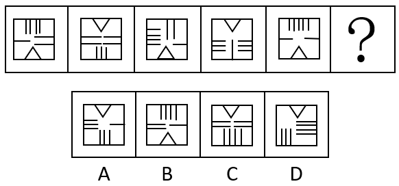

- **A**. A　✅
- **B**. B
- **C**. C
- **D**. D

**答案**：A

**官方解析**

题干每幅图形均由一个正方形和内部线条组成，元素组成相同，优先考虑位置规律。观察发现，三角形的位置依次上下移动，故？处应选择一个三角形位置在上方的图形，排除B项；题干图形内部线数量均为9，排除C项；继续观察发现，题干图形内部线条在正方形四条边上均出现，而D项内部线条只在正方形三条边上出现，排除D项。
故正确答案为A。

---

### 第 14 题　qid 4651788 · 图形推理

请从所给的四个选项中，选出最恰当的一项填入问号处，使之呈现一定的规律性。

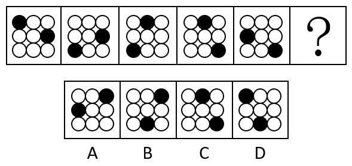

- **A**. A　✅
- **B**. B
- **C**. C
- **D**. D

**答案**：A

**官方解析**

元素组成相同，优先考虑位置规律。观察发现，题干图形中的两个黑球每次分别顺时针移动3格，如下图所示：

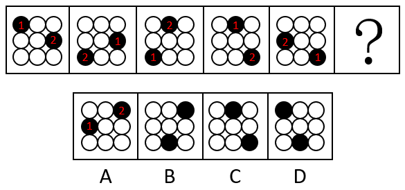

故正确答案为A。

---

### 第 15 题　qid 4651586 · 图形推理

请从所给的四个选项中，选出最恰当的一项填入问号处，使之呈现一定的规律性。

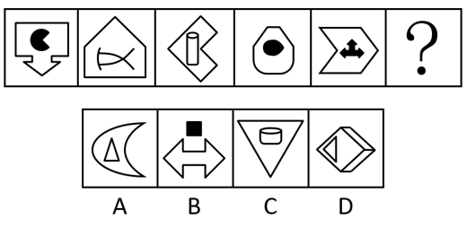

- **A**. A　✅
- **B**. B
- **C**. C
- **D**. D

**答案**：A

**官方解析**

元素组成不同，优先考虑属性规律。观察发现，题干图形出现箭头、等腰元素图形，考虑对称性。题干每幅图都由两个单对称轴图形组成，因此分别画出每个图形的对称轴，发现每幅图的两条对称轴之间都是垂直关系，只有A项符合。

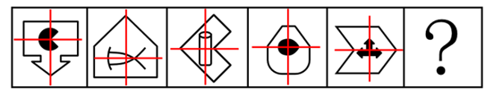

故正确答案为A。

---

### 第 16 题　qid 4651817 · 图形推理

请从所给的四个选项中，选出最恰当的一项填入问号处，使之呈现一定的规律性。

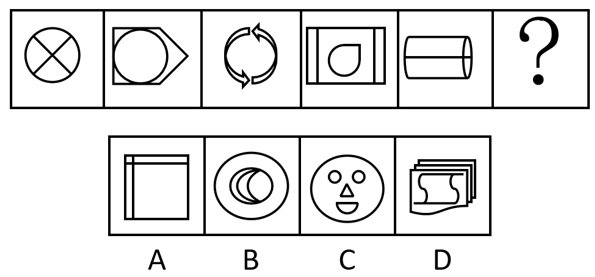

- **A**. A
- **B**. B
- **C**. C
- **D**. D　✅

**答案**：D

**官方解析**

图形元素组成不同，优先考虑属性规律。观察发现，题干图形都是由曲线和直线共同构成，排除A、B两项；继续观察发现，题干图形封闭面明显，考虑数面。题干图形面数量都为4，故“？”处应该选择面数量为4的图形，只有D项符合。
故正确答案为D。

---

### 第 17 题　qid 4651707 · 图形推理

请从所给的四个选项中，选出最恰当的一项填入问号处，使之呈现出一定的规律性。

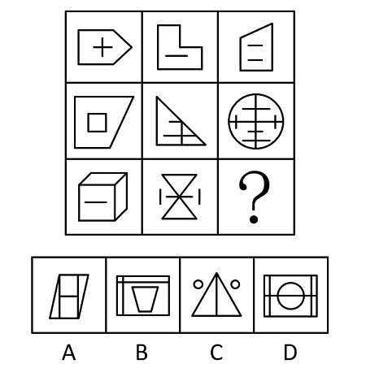

- **A**. A　✅
- **B**. B
- **C**. C
- **D**. D

**答案**：A

**官方解析**

图形元素组成不同，且无明显属性规律，考虑数量规律。观察发现，题干图形中出现明显单一直线及多边形，优先考虑数直线，发现整体数直线无规律，而题干图形中横线、竖线较多，因此考虑分开数横竖线。九宫格优先横行看，三行图形的横线数依次为3、4、3、4、3、4、4、3，三行图形的竖线数依次为2、3、2、3、2、3、3、2，单看横竖线数无规律，考虑二者做运算。发现题干所有图形的横线数减竖线数均为1，故？处应选择横线数减竖线数等于1的图形，只有A项符合规律。
故正确答案为A。

---

### 第 18 题　qid 4651805 · 图形推理

请从所给的四个选项中，选出最恰当的一项填入问号处，使之呈现一定的规律性。

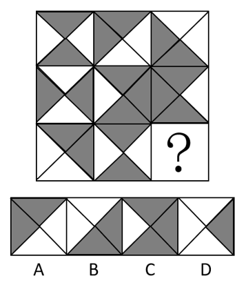

- **A**. A
- **B**. B　✅
- **C**. C
- **D**. D

**答案**：B

**官方解析**

图形元素组成相似，优先考虑样式规律。题干图形存在黑色区域和空白区域，考虑黑白运算。九宫格优先横向观察，第一行图形的黑白运算规律为：黑+黑=白，白+黑=黑，黑+白=黑，白+白=白，第二行经验证符合此规律，第三行应用此规律，只有B项符合。
故正确答案为B。

---

### 第 19 题　qid 4651798 · 图形推理

下边四个图形中，只有一个是由上边的四个图形拼合（只能通过上、下、左、右平移）而成的，请把它找出来。

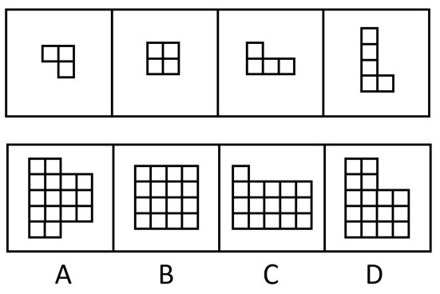

- **A**. A　✅
- **B**. B
- **C**. C
- **D**. D

**答案**：A

**官方解析**

本题考查俄罗斯方块平面拼合。从方块最多的图形入手，贴边代入选项。在题干的4个图形中，图④的方块最多，将它贴边代入各个选项中，只有A项能够把所有图形都代入进去，拼合方式如下图所示：

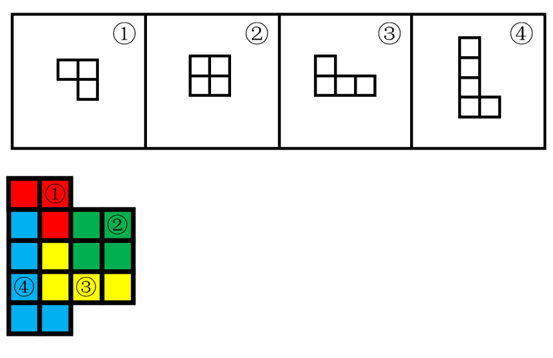

故正确答案为A。

---

### 第 20 题　qid 4651713 · 图形推理

下边四个图形中，只有一个是由上边的四个图形拼合（只能通过上、下、左、右平移）而成的，请把它找出来。

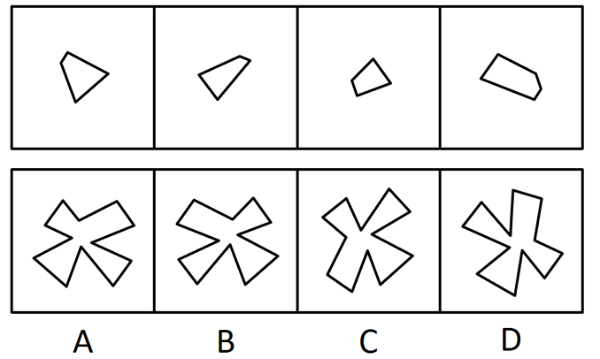

- **A**. A
- **B**. B　✅
- **C**. C
- **D**. D

**答案**：B

**官方解析**

本题考察平面拼合，可采用平行且等长相消的方式解题。消去平行且等长的线段后进行组合即可得到轮廓图，即为B项。平行且等长相消的方式如下图所示：

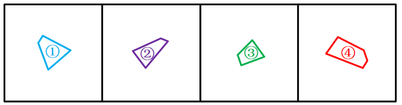

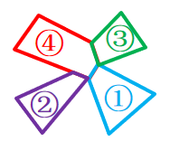

故正确答案为B。

---

### 第 21 题　qid 4651826 · 图形推理

下边四个图形中，只有一个是由上边的四个图形拼合（只能通过上、下、左、右平移）而成的，请把它找出来。

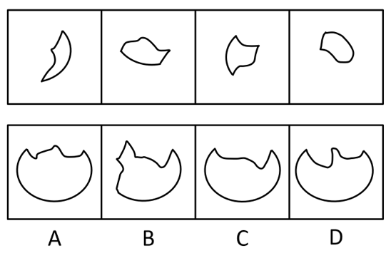

- **A**. A
- **B**. B
- **C**. C　✅
- **D**. D

**答案**：C

**官方解析**

本题考查平面拼合。消去凹凸匹配的线条后进行组合可得到轮廓图，即为C项。具体拼合方式如下图所示：

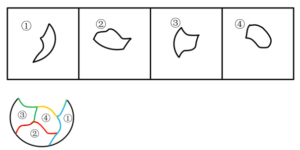

故正确答案为C。

---

### 第 22 题　qid 4651797 · 类比推理

上边四张纸片，每张纸片一面是黑色，另一面是白色，下边仅有一项能由其拼合（可以平移、旋转、翻转）而成，请把它找出来。

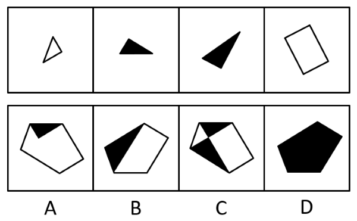

- **A**. A
- **B**. B
- **C**. C
- **D**. D　✅

**答案**：D

**官方解析**

本题考查平面拼合，可采用平行且等长相消的方式解题。将图①和图④翻转后，消去平行且等长的线段后进行组合可得到轮廓图，即为D项。平行且等长相消的方式如下图所示：

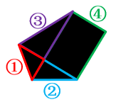

故正确答案为D。

---

### 第 23 题　qid 4651714 · 类比推理

上边四张纸片，每张纸片一面是黑色，另一面是白色，下边仅有一项能由其拼合（可以平移、旋转、翻转）而成，请把它找出来。

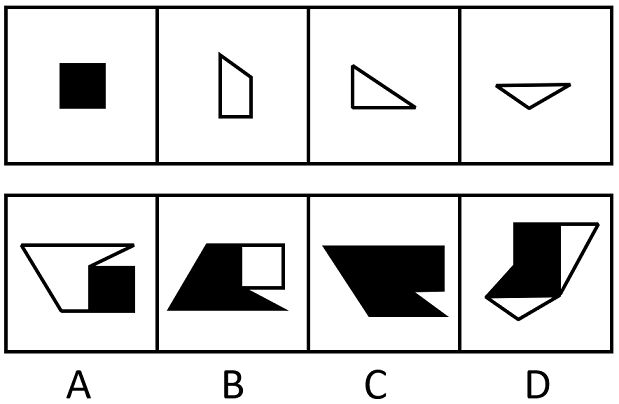

- **A**. A
- **B**. B
- **C**. C　✅
- **D**. D

**答案**：C

**官方解析**

本题考查平面拼合，题干已知每张纸片一面是黑色，另一面是白色，且可以涉及转动，故可知，平移和旋转时纸片颜色不会改变，翻转时颜色会发生改变。经过拼合后只能得到C项。如下图所示：

故正确答案为C。

---

### 第 24 题　qid 4651717 · 图形推理

左边给定的是多面体的外表面，右边哪一项能由它折叠而成？

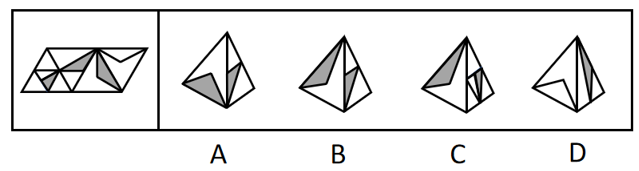

- **A**. A　✅
- **B**. B
- **C**. C
- **D**. D

**答案**：A

**官方解析**

将题干展开图标上序号，如下图所示，逐一进行分析。

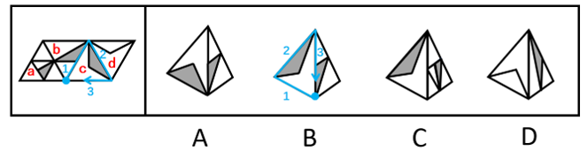

A项：选项由面b和面c构成，选项与题干展开图一致，当选；

B项：选项由面b和面c构成，以面c中空白顶点为起点进行画边（如上图蓝线所示），展开图中边1对应面b，选项中边3对应面b，选项与题干展开图不一致，排除；

C项：选项由面a和面c构成，展开图中，二者的公共边与面a内部阴影小三角形的顶点重合，选项中不重合（如下图绿线所示），选项与题干展开图不一致，排除；

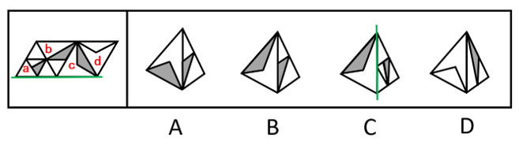

D项：选项由面b和面d构成，展开图中，二者的公共边与面d内部三角形的边重合，选项中不重合（如下图红线所示），选项与题干展开图不一致，排除。

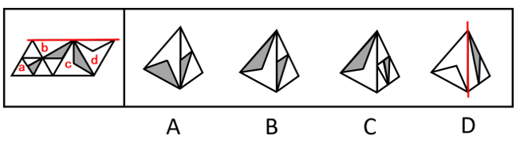

故正确答案为A。

---

### 第 25 题　qid 4651742 · 图形推理

左边给定的是纸盒外表面的展开图，右边哪一项能由它折叠而成？请把它找出来。

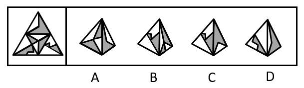

- **A**. A
- **B**. B
- **C**. C　✅
- **D**. D

**答案**：C

**官方解析**

将原展开图标上序号，如下图所示，逐一进行分析。

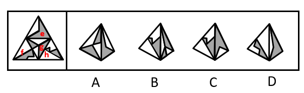

A项：选项由面e和面g构成，展开图中面e与面g的公共边挨着面g的空白面，而选项中面e与面g的公共边半边挨着面g的灰色面，选项与题干展开图不一致，排除；

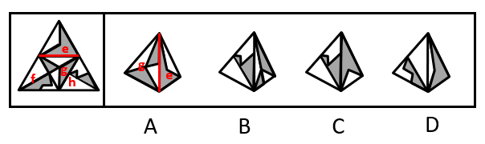

B项：选项由面g和面h构成，展开图中面g和面h的公共边挨着面g的灰色面，而选项中面g和面h的公共边挨着面g的空白面，选项与题干展开图不一致，排除；

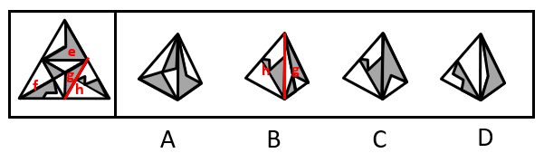

C项：选项由面e和面h构成，选项与题干展开图一致，当选；

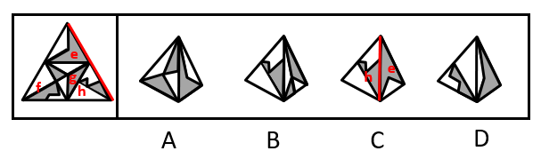

D项：选项由面e和面f构成，以面e的灰色顶点（蓝点）为起点顺时针画边，展开图中边2与面f中的长线相交于点1（边2与边3的交点），而选项中边2与面f中的长线不相交于点1（边2与边3的交点），选项与题干展开图不一致，排除。

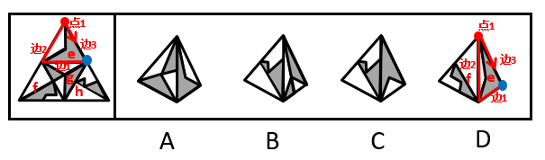

故正确答案为C。

---

### 第 26 题　qid 4651722 · 图形推理

左边给定的是多面体的外表面，右边哪一项能由它折叠而成？请把它找出来。

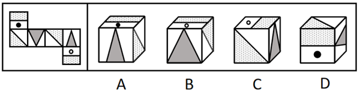

- **A**. A
- **B**. B
- **C**. C　✅
- **D**. D

**答案**：C

**官方解析**

将原展开图标上序号，如下图所示，逐一进行分析。

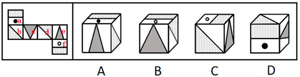

A项：选项中出现了面a和面e，面a中黑点所在矩形的长边（如下图线1所示）与面e相邻，而展开图中该矩形的长边与面b相邻，选项与题干展开图不一致，排除；

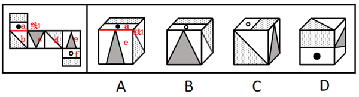

B项：选项中出现了面c、面f，面f中白圆所在矩形的长边（如下图线2所示）与面c相邻，而展开图中该矩形的长边与面e相邻，选项与题干展开图不一致，排除；

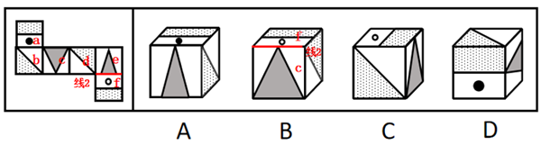

C项：选项中出现了面c、面d和面f，选项与题干展开图一致，当选；

D项：选项中出现了面a、面e，顶面为面b或面d，面e挨着顶面的空白三角形（如下图线3所示），但展开图中面e挨着面b或面d内的阴影三角形，选项与题干展开图不一致，排除。

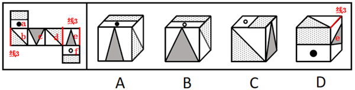

故正确答案为C。

---

### 第 27 题　qid 4651814 · 图形推理

左边给定的是多面体的外表面，右边哪一项能由它折叠而成？请把它找出来。

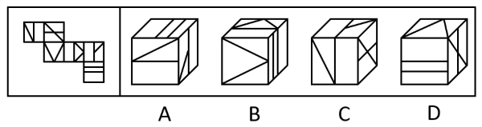

- **A**. A　✅
- **B**. B
- **C**. C
- **D**. D

**答案**：A

**官方解析**

将原展开图标上序号如下图，逐一进行分析。

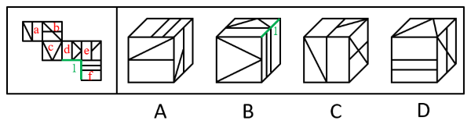

A项：选项中出现了面f、面a和面e，选项与题干展开图一致，当选；

B项：选项中包括面d、面c和面f，选项中面d与面f有公共边边1且面f内部的两条直线挨着面d内部的空白矩形，而展开图中f内部的两条直线挨着面d内部的小三角形，选项与题干不一致，排除；

C项：选项中包括面e、面a和面b，选项中面e内部的直角梯形短直角边挨着面a，而展开图中面e内部的直角梯形短直角边挨着面f，选项与题干不一致，排除；

D项：选项中包括面c、面f和面b，选项中面c内部的三角形底边挨着面f，而展开图中面c内部的三角形底边挨着面b，选项与题干不一致，排除。

故正确答案为A。

---

### 第 28 题　qid 4651543 · 逻辑判断

在广袤的中华大地上，最近几十年已经新植了数以十亿计的树木，绿色植被的增长有目共睹，沙漠化和水土流失情况得到了极大缓解。据此，有专家指出，中国已经是全球变绿的最重要的力量之一。
以下哪项如果为真，最能支持上述专家的观点？

- **A**. 中国西南地区和东北地区的快速造林大大减少了我国对进口木材的依赖
- **B**. 卫星数据对比显示，中国大量过去荒漠化的地方现在已经被绿色植被所覆盖
- **C**. 中国的植被面积仅占全球的6.6%，但全球植被面积净增长的25%来自中国　✅
- **D**. 在有些国家和地区，毁林开荒正在导致具有全球气候调节功能的雨林面积大大减少

**答案**：C

**官方解析**

第一步：找出论点和论据。
论点：中国已经是全球变绿的最重要的力量之一。
论据：在广袤的中华大地上，最近几十年已经新植了数以十亿计的树木，绿色植被的增长有目共睹，沙漠化和水土流失情况得到了极大缓解。
本题论点和论据都在讨论的是中国绿化的情况，话题一致，加强优先考虑补充论据。
第二步：逐一分析选项。
A项：该项说中国快速造林减少了对进口木材的依赖，而论点讨论的是中国是全球变绿的重要力量，话题不一致，无法加强，排除；
B项：该项说中国过去荒漠化的地方已经被绿色植被所覆盖，对比的是中国的过去情况和现在情况，而论点讨论的是中国是全球变绿的重要力量之一，话题不一致，无法加强，排除；
C项：该项说全球植被面积净增长的25%来自中国，补充论据说明中国是全球变绿的重要力量之一，可以加强，当选；
D项：该项说有些国家和地区的雨林面积大大减少，而论点讨论的是中国是全球变绿的重要力量之一，话题不一致，无法加强，排除。
故正确答案为C。

---

### 第 29 题　qid 4651553 · 逻辑判断

麦子大约在五千年前由西亚传入中国，但由麦子做成的面食直到唐宋时期才成为北方人的主食。在此之前，北方的主粮是粟，也就是小米。秦汉时期的老百姓很不愿意种麦子，汉朝曾为增加粮食产量两次大力推广种麦子，但老百姓并没有积极响应。
以下哪项如果为真，最能解释上述历史现象？

- **A**. 外来作物很多，除了麦子，还有番薯、胡麻等，不是每种作物一传入就被接受
- **B**. 磨粉技术传播较晚，东汉时只有官宦人家才拥有上下两扇带有磨齿的磨盘
- **C**. 麦粒直接煮成的“麦饭”生硬难咽、口感很差，秦汉时期的绝大多数人都不爱吃　✅
- **D**. 东汉以后磨盘磨粉和“热汤饼”等面食技术逐渐推广开来，麦子才变得“好吃”了

**答案**：C

**官方解析**

第一步：找出题干矛盾。
秦汉时期的老百姓很不愿意种麦子，汉朝曾两次大力推广种麦子，但老百姓并没有积极响应。
第二步：逐一分析选项。
A项：该项说的是有些外来作物并不能马上被接受，但是汉朝已经两次大力推广了，为什么还是不能被接受，不能解释题干矛盾，排除；
B项：该项说的是东汉时期只有官宦人家才能将麦子磨粉，那在麦子不能被磨粉时，为什么老百姓不愿意种植，选项并没有明确说明，不能解释题干矛盾，排除；
C项：该项说的是由麦粒直接煮成的“麦饭”口感很差，秦汉时期的绝大多数人都不爱吃，因为麦粒不好吃所以不种麦子，可以解释即使国家大力推广，老百姓也不积极响应的原因，可以解释题干矛盾，当选；
D项：该项说的是麦子从东汉以后因为磨盘磨粉和面食技术才变得好吃，题干要解释的矛盾点是为什么国家推广也不种，C项很直接地说明因为不好吃，所以不种；D项在解释怎么才变得“好吃”，没有C项直接，排除。
故正确答案为C。

---

### 第 30 题　qid 4651745 · 逻辑判断

某游戏公司规定，登录游戏必须实名验证，未成年人每天最多只能在线100分钟，晚上8点至次日上午6点不能使用。然而，后台的账户登录数据显示，规定实施后，未成年人账户登录游戏的平均时长与之前相比增加了15％。
以下哪项如果为真，最能解释上述现象？

- **A**. 规定实施后，许多家长通过为孩子注册未成年人账户来限制其长时间玩游戏
- **B**. 许多未成年人通过购买成年人账号或者使用其父母账号登录游戏
- **C**. 未成年人有逆反心理，新规定反而刺激了他们在节假日过度玩游戏　✅
- **D**. 规定实施后，公司推出在线满90分钟送装备活动，吸引了许多购买力不强的玩家

**答案**：C

**官方解析**

第一步：找出题干矛盾。
登录游戏必须实名验证，未成年人每天最多只能在线100分钟，但后台的账户登录数据显示，规定实施后，未成年人账户登录游戏的平均时长与之前相比增加了15％。
第二步：逐一分析选项。
A项：许多家长为孩子注册未成年人账户限制其游戏时长，说明家长在限制孩子游戏的时间，无法解释为何实名验证后未成年人账户登录时长增加，不能解释题干矛盾，排除；
B项：许多未成年人购买成年人账号或使用父母账号登录游戏，说明他们登录游戏的账户是成年人账户，但是题干说的是未成年人账户的使用情况，不能解释题干矛盾，排除；
C项：在新规之后，未成年人在节假日会过度游戏，即在节假日未成年人账户登录时长增加，可以导致未成年人账户登录游戏的平均时长比之前增加，可以解释题干矛盾，当选；
D项：规定实施后，新活动吸引许多购买力不强的玩家，但购买力不强的玩家不明确是否一定是未成年人，也可能是很多不喜欢在游戏中充值的成年人，不能解释题干矛盾，排除。
故正确答案为C。

---

### 第 31 题　qid 4651825 · 逻辑判断

上级检查组在某周的周一至周五检查了甲、乙、丙、丁、戊5个单位。已知：
（1）戊是第3个被检查单位；
（2）第4个被检查单位得到的既有批评也有表扬；
（3）乙和丁两个单位得到的只有批评；
（4）检查甲单位是在检查丁单位之后。
根据上述信息，可以推出以下哪项？

- **A**. 检查乙单位是在检查丙单位之前
- **B**. 检查甲单位是在检查戊单位之后
- **C**. 检查丙单位是在检查丁单位之前
- **D**. 检查戊单位是在检查丁单位之后　✅

**答案**：D

**官方解析**

本题为组合排列题。题干涉及排序，可优先考虑列表。

根据条件（1）可知：

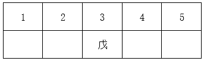

根据条件（2）（3）可知：

4不是乙、丁，故4只能是甲、丙，即如下两种假设：

假设一：

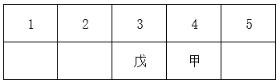

根据条件（4）检查甲单位是在检查丁单位之后，可知：丁在1或2，此时戊在丁之后；

假设二：

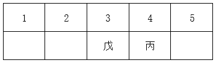

根据条件（4）检查甲单位是在检查丁单位之后，可知：若满足甲在丁之后，则丁不在5，丁只能在1或2，此时戊在丁之后。

故正确答案为D。

---

### 第 32 题　qid 4651555 · 逻辑判断

“同情用药”指的是某些重症患者可以在不参加临床试验的情况下，使用尚未获批上市的在研药物。在新冠肺炎疫情初期，提前使用抗疫药物的同情用药案例数有所增加，效果良好。但是，同情用药的实施条件十分严格，大部分患者不具备用药资格。对此，有专家建议，应该放宽同情用药的使用条件。
以下哪项如果为真，最能质疑上述专家建议的合理性?

- **A**. 同情用药会破坏新药审批的程序和权威，这对患者和社会都有不可预料的后果　✅
- **B**. 即便“无药可救”的患者愿意使用未获批的在研药物，也不一定能够成功延长生命
- **C**. 为了保护患者用药安全，大部分国家目前严禁未经过临床试验的药品上市
- **D**. 目前，大部分常见疾病都已经有一些适用药物，这些疾病并不需要同情用药

**答案**：A

**官方解析**

第一步：找出论点和论据。
论点：应该放宽同情用药的使用条件。
论据：在新冠肺炎疫情初期，提前使用抗疫药物的同情用药案例数有所增加，效果良好。但是，同情用药的实施条件十分严格，大部分患者不具备用药资格。
本题的论点和论据讨论的都是同情用药的使用条件问题，二者话题一致，优先考虑削弱论点，即表明不应放宽同情用药的使用条件。
第二步：逐一分析选项。
A项：该项说的是同情用药会破坏新药审批的程序和权威，对患者和社会都有不可预料的后果，表明放宽同情用药的使用条件会产生不利影响，因此同情用药的使用条件应该严格，可以削弱，当选；
B项：该项说的是患者愿意使用未获批的在研药物后不一定能延长生命，但是论点讨论的是同情药物的使用条件是否应当放宽，讨论内容为什么样的病人应该使用该药物，而不是使用药物后可能的效果，无法削弱，排除；
C项：该项说的是未经过临床试验的药品能否上市的问题，论点讨论的是同情用药使用的限制条件，二者话题不一致，无法削弱，排除；
D项：该项说的是大部分常见疾病是否需要同情用药，而题干讨论的同情用药指的是重症患者的特殊情况，二者话题不一致，无法削弱，排除。
故正确答案为A。

---

### 第 33 题　qid 4651733 · 逻辑判断

近年来，某小区流浪猫泛滥成灾。去年年初该小区的物业对流浪猫进行了绝育处理。然而在今年年初，业主们发现该小区流浪猫的数量至少有去年年初的1.5倍之多。
以下哪项如果为真，最能解释上述现象？

- **A**. 该小区多年来环境保护良好，有许多鸟类在此栖息，流浪猫极易获得食物
- **B**. 该小区少数业主去年成立了爱猫小组，定期在该小区投放食物喂养流浪猫
- **C**. 该小区有一些养宠物猫的租户今年退租后，将宠物猫遗弃在小区内
- **D**. 该小区紧邻其他大型小区，流浪猫可以在这些小区间自由流动　✅

**答案**：D

**官方解析**

第一步：找出题干矛盾。
去年年初该小区的物业对流浪猫进行了绝育处理，但今年年初该小区流浪猫的数量至少有去年年初的1.5倍之多。
第二步：逐一分析选项。
A项：该小区多年来环境保护良好，流浪猫极易获得食物，可以解释为什么多年来该小区有流浪猫，但是无法解释为什么去年年初对流浪猫进行绝育处理后，今年年初流浪猫的数量至少有去年年初的1.5倍之多，不能解释题干矛盾，排除；
B项：业主成立爱猫小组，投放食物，可以解释为什么该小区有流浪猫，但是无法解释为什么去年年初对流浪猫进行绝育处理后，今年年初流浪猫的数量至少有去年年初的1.5倍之多，不能解释题干矛盾，排除；
C项：一些租户将宠物猫遗弃在该小区，可以解释为什么流浪猫的数量增加了，但“一些”仅是少数，无法解释为什么今年年初流浪猫的数量至少有去年年初的1.5倍之多，不能解释题干矛盾，排除；
D项：该小区紧邻其他大型小区，流浪猫可以在小区间进行流动，说明一方面别的小区的流浪猫能流动到本小区，另一方面它们仍可以繁衍新的小猫。且“其他大型小区”体现出很有可能紧邻小区的非绝育猫咪数量不少，解释了为什么去年对本小区的流浪猫绝育，但今年年初流浪猫的数量至少有去年年初的1.5倍之多，可以解释题干矛盾，当选。
故正确答案为D。

---

### 第 34 题　qid 4651712 · 逻辑判断

青山村山清水秀，环境优美，村民们在村委会带领下规划自己的美好未来。他们计划：
（1）如果兴建葡萄庄园或修建民宿，就要开发乡村旅游；
（2）如果发展水产养殖或开发乡村旅游，则要修建民宿；
（3）如果不兴建葡萄庄园，就发展水产养殖；
（4）如果开发乡村旅游，则要改造村容村貌。
如果上述计划得以实施，可以得出以下哪项？

- **A**. 青山村会兴建葡萄庄园
- **B**. 青山村会改造村容村貌　✅
- **C**. 青山村不会修建民宿
- **D**. 青山村不会发展水产养殖

**答案**：B

**官方解析**

第一步：分析题干条件。

（1）兴建葡萄庄园 或 修建民宿开发乡村旅游；

（2）发展水产养殖 或 开发乡村旅游修建民宿；

（3）兴建葡萄庄园发展水产养殖；

（4）开发乡村旅游改造村容村貌。

第二步：根据题干条件进行推理。

解题思路一：

题干信息较多没有明显推理起点，可从最大信息入手，条件（1）、（2）、（4）均提到了开发乡村旅游，故从开发乡村旅游这个最大信息开始假设。

假设开发乡村旅游，依据条件（2），或关系一真即真，可得：修建民宿。再依据条件（1），或关系一真即真，可得：开发乡村旅游。开发乡村旅游是对条件（4）的肯前，可得：改造村容村貌。此种假设（开发乡村旅游）与题干信息均无矛盾。

假设不开发乡村旅游，这是对条件（1）的否后，可得：兴建葡萄庄园 且 修建民宿。兴建葡萄庄园是对条件（3）的肯前，可得：发展水产养殖。再依据条件（2），或关系一真即真，可得：修建民宿，此时与已推出的不修建民宿的信息矛盾，所以第二种假设（不开发乡村旅游）不成立。

综上所述，开发乡村旅游一定成立，开发乡村旅游是对条件（4）的肯前，可得：改造村容村貌，因此，B项可以推出。

解题思路二：

条件（1）、（3）均提到“兴建葡萄庄园”，且一个是肯定一个是否定，可优先从是否兴建葡萄庄园进行假设。

假设“兴建葡萄庄园”，依据条件（1）可知，“开发乡村旅游”成立，结合条件（2）、（4）可知，“修建民宿”和“改造村容村貌”也成立；

假设“不兴建葡萄庄园”，依据条件（3）可知，“发展水产养殖”成立，结合条件（2）可知，“修建民宿”成立，根据条件（1）、（4）可知，“开发乡村旅游”、“改造村容村貌”也成立；

综上所述，无论是否兴建葡萄庄园，“开发乡村旅游”“修建民宿”“改造村容村貌”一定成立，因此，B项可以推出。

故正确答案为B。

---

### 第 35 题　qid 4651711 · 逻辑判断

张先生的孩子简直就是一个“麻烦制造者”，在学校上课经常与身旁同学交头接耳，不时还与老师唱反调；在家里边写作业边听音乐，不到10分钟就又开始上蹿下跳；批评两句他根本不放在心上，反而嘻皮笑脸对你做个鬼脸。张先生觉得自家的孩子浑身上下到处是缺点，对他的未来充满了焦虑。
以下哪项如果为真，最有助于缓解张先生目前的焦虑？

- **A**. 每个孩子都有自己的行为和性格特点，这些特点可能与其父母或他人不尽相同，但不一定是真正的缺点
- **B**. 孩子思维活跃、行动自在，敢于打破常规、表达自我，恰恰是其充满活力、有创新潜能的表现　✅
- **C**. 孩子不把家长批评放在心上，是因为在他们看来，家长的批评实际上是关心爱护自己的表现
- **D**. 如果孩子过于安静，不喜欢结交同学，对家长的批评总保持沉默，家长也会感到焦虑

**答案**：B

**官方解析**

第一步：找出论点和论据。
论点：张先生觉得自家的孩子浑身上下到处是缺点，对他的未来充满了焦虑。
论据：张先生的孩子简直就是一个“麻烦制造者”，在学校上课经常与身旁同学交头接耳，不时还与老师唱反调；在家里边写作业边听音乐，不到10分钟就又开始上蹿下跳；批评两句他根本不放在心上，反而嘻皮笑脸对你做个鬼脸。
论点说的是张先生因觉得孩子充满缺点而对其未来充满焦虑，论据说的是孩子的一些表现，二者均讨论孩子充满缺点，话题一致，削弱优先考虑削弱论点。
第二步：逐一分析选项。
A项：说的是孩子与他人不同的特点不一定是真正的缺点，但孩子与他人不同的特点是否会影响孩子未来的发展并不清楚，不明确选项，无法削弱，排除；
B项：说的是孩子的表现从另一个角度看恰恰是优点，说明孩子并非充满缺点，进而也无须对其未来充满焦虑，直接削弱论点，可以削弱，当选；
C项：说的是孩子为什么不把家长批评放在心上，只解释了孩子其中一个缺点的形成原因，与张先生对孩子未来充满焦虑无关，无法削弱，排除；
D项：说的是即使孩子的表现与现在完全相反，张先生也会焦虑，但不能明确说明目前孩子的表现张先生是否会对其未来充满焦虑，二者话题不一致，无关项，无法削弱，排除。
故正确答案为B。

---

### 第 36 题　qid 4651556 · 定义判断

微躺青年：指面对现实中的竞争压力，既不参与过度竞争，也不消极接受现状，而在专注于本职工作的同时，合理调整工作方向，追求自我价值实现的年轻人。
下列属于微躺青年的是：

- **A**. 设计师小谭研究生毕业后，因与投资人理念不合，离开了加盟三年的设计公司到外地改做陶瓷设计。最艰难的时候，天天工作到深夜，终于设计出大受市场欢迎的产品，实现了大学以来的梦想　✅
- **B**. 随着新冠肺炎疫情防控形势好转，各地游客都明显增多，商家纷纷推出低价游，抢占旅游市场。小李把自己的旅行社转让出去后，开始在网络上进行家乡景点直播，很快就成为直播达人，带动了家乡旅游产业的发展
- **C**. 今年大学毕业的小柳投递了许多份求职信，但都石沉大海。索性在网上当起了自律监督师，每天要定十几个闹钟，最多同时监督20多个人。刚开始觉得工作枯燥乏味，但现在已经收到了数百条好评，让他很有成就感
- **D**. 小何毕业后一直在互联网公司工作，公司内部竞争压力很大，常常加班到深夜。虽然收入十分可观，但他觉得高强度工作损害了身心健康，决定每年给自己放个小长假

**答案**：A

**官方解析**

第一步：找出定义关键词。

“面对现实中的竞争压力，既不参与过度竞争，也不消极接受现状”、“专注于本职工作的同时，合理调整工作方向”、“追求自我价值实现”。

第二步：逐一分析选项。

A项：设计师小谭离开原来的设计公司后并没有消极接受现状，而是调整了工作方向，改做陶瓷设计，符合“面对现实中的竞争压力，既不参与过度竞争，也不消极接受现状”、“专注于本职工作的同时，合理调整工作方向”，经过不懈努力，设计的产品获得市场欢迎，最终实现了自身的梦想，符合“追求自我价值实现”，符合定义，当选；

B项：商家纷纷推出低价游，抢占旅游市场，小李把自己的旅行社转让出去后，在网络上进行家乡景点直播，符合“面对现实中的竞争压力，既不参与过度竞争，也不消极接受现状”，但小李是迫于市场的压力转出了旅行社，改做网络直播，不符合“追求自我价值实现”，不符合定义，排除；

C项：大学刚毕业的小柳投递的许多份求职信石沉大海，于是在网上当起了自律监督师，符合“面对现实中的竞争压力，既不参与过度竞争，也不消极接受现状”，但没有体现专注本职工作及工作方向上的调整，不符合“专注于本职工作的同时，合理调整工作方向”，不符合定义，排除；

D项：在互联网公司工作的小何由于工作强度高，决定每年给自己放个小长假，符合“面对现实中的竞争压力，既不参与过度竞争，也不消极接受现状”，但放小长假不属于工作方向上的调整，不符合“专注于本职工作的同时，合理调整工作方向”，不符合定义，排除。

注：本题正确率很低，粉笔通过多次教研并查询原文，如下图所示：

1.A项是微躺青年的典型案例，而且A项在原文的基础上最后加了“实现大学以来的梦想”，更符合定义关键词“自我价值实现”；

2.有同学质疑A项“天天工作到深夜”根本不微躺，但是注意A项说“最艰难的时候”，并不是每天都卷；

3.ACD这三个选项都是“大学毕业/研究生毕业”，都能够体现出“青年、年轻人”，而B项只是说“小李”，身份不明确，这个点也不如A项。

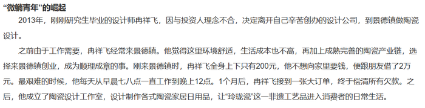

故正确答案为A。

---

### 第 37 题　qid 4651577 · 定义判断

信用联动奖惩：指有关部门或组织在法定范围内根据企业、个人信用记录，采取部门联动、社会协同等方式，对其依法联合实施奖励或惩戒的行为。
下列属于信用联动奖惩的是：

- **A**. 某市设立了无偿献血“五星级志愿者”、志愿服务终身荣誉奖，获奖市民可以免除市管公园门票，免费乘坐市内公交车，享受市属公立医院诊察费半价优惠
- **B**. 餐馆老板李先生在当地政务服务网提交了经营性临时占道申请，由于其信用等级为A级，可以享受审批绿色通道，第二天就收到了城管和其他相关部门的许可短信　✅
- **C**. 阮先生在承租的公租房里开设棋牌室，违背了申请公租房时的诚信承诺，被住房保障部门扣罚了住房保证金，并纳入五年内不得申请公租房的名单。阮先生对自己的失信行为深感后悔，保证以后一定做一个诚信公民
- **D**. 某区政府接到媒体举报，辖区内一超市以次充好，将普通猪肉当黑猪肉售卖，区政府立即召集市场监管、税务等职能部门赶到超市，现场联合办公，对相关责任人进行查处

**答案**：B

**官方解析**

第一步：找出定义关键词。
“根据企业、个人信用记录”、“部门联动、社会协同”、“依法联合实施奖励或惩戒”。
第二步：逐一分析选项。
A项：根据无偿献血的志愿行为来实施奖励，不符合“根据企业、个人信用记录”，不符合定义，排除； 
B项：由于李先生的信用等级为A级，符合“根据企业、个人信用记录”，可以享受审批绿色通道，且收到城管和其他相关部门的许可短信，符合“部门联动、社会协同”，也符合“依法联合实施奖励或惩戒”，符合定义，当选；
C项：阮先生在公租房开设棋牌室是违背了诚信承诺，符合“根据企业、个人信用记录”，扣罚住房保证金、纳入五年内不得申请公租房的名单均为惩戒手段，符合“依法联合实施奖励或惩戒”，但该行为均由住房保障部门实施，未提及其他有关部门，不符合“部门联动、社会协同”，不符合定义，排除；
D项：市场监管、税务等职能部门联合办公，符合“部门联动、社会协同”，但以次充好，将普通猪肉当黑猪肉售卖，属于不诚信经营的行为，并未提及商家的信用记录，不符合“根据企业、个人信用记录”，不符合定义，排除。
故正确答案为B。

---

### 第 38 题　qid 4651583 · 定义判断

去雇主化职业：指作为独立个体不受雇于任何雇主，依托网络平台提供商品或服务并获得相应报酬的就业形式。
下列属于去雇主化职业的是：

- **A**. 林先生辞职后来到南方注册了一家绿植盆景网店，在一个多月的时间里，租赁场地，筹措资金，完善平台，忙得不亦乐乎
- **B**. 专业买手陈女士每月穿梭在世界各地，寻找带有当季流行元素或者可能在国内热卖的款式和品牌服装，并将其带回国内
- **C**. 小李加入了一个微信群，里面提供了许多可兼职工作的岗位，经过一番挑选，他选择了一份帮忙代取快递的兼职，用赚来的钱贴补每月生活费
- **D**. 喜欢写作的大二学生小孟在某平台网文写手的影响下，也开始在这家平台上更新写的小说，得到了许多粉丝的打赏，他很有成就感　✅

**答案**：D

**官方解析**

第一步：找出定义关键词。
“作为独立个体不受雇于任何雇主”、“依托网络平台提供商品或服务”、“获得相应报酬”。
第二步：逐一分析选项。
A项：林先生辞职后注册网店提供绿植盆景，符合“作为独立个体不受雇于任何雇主”、“依托网络平台提供商品或服务”，但未体现出获得报酬，不符合“获得相应报酬”，不符合定义，排除；
B项：陈女士把服装从世界各地带回国内，但未体现出是否依托网络平台售卖，是否获得报酬，不符合“依托网络平台提供商品或服务”、“获得相应报酬”，不符合定义，排除；
C项：小李通过微信群找到代取快递的兼职，不符合“作为独立个体不受雇于任何雇主”，不符合定义，排除；
D项：小孟依托网络平台更新写的小说，符合“作为独立个体不受雇于任何雇主”、“依托网络平台提供商品或服务”，且得到了许多粉丝的打赏，符合“获得相应报酬”，符合定义，当选。
故正确答案为D。

---

### 第 39 题　qid 4651755 · 定义判断

网络考古：指针对多年前网络上发布的各种文字、图片、影像等资料，重新查看或考证，从中发现有价值的信息。
下列属于网络考古的是：

- **A**. 为了写一篇回忆大学生活的散文，王先生把十多年前在社交软件上的好友、大学图书馆的借书记录、当年在各种网站的帖文都翻了出来　✅
- **B**. 小吴夫妇很细心，从孩子出生前的每次产前检查，到出生时测量的数据建档、医学证明，再到数码相机里面每次留下的成长照片，都储存在了网络云相册里
- **C**. 程序员小陆从公司报废的硬盘中恢复出了公司内部的宣传资料、业务调整、人员变更等文档，交给了公司有关部门
- **D**. 多年前，网络上进行了一场“三星堆起源”的大辩论，吸引了几十万人围观留言。辩论的参与者老张回想起当年的唇枪舌剑，感慨万千

**答案**：A

**官方解析**

第一步：找出定义关键词。
“针对多年前网络上发布的各种文字、图片、影像等资料”、“重新查看或考证”、“从中发现有价值的信息”。
第二步：逐一分析选项。
A项：该项说的是王先生为了写一篇回忆大学生活的散文，把当年在各种网站的帖文都翻了出来，说明王先生重新查看了这些帖文，符合关键词“针对多年前网络上发布的各种文字、图片、影像等资料”、“重新查看或考证”，符合定义，当选；
B项：该项说的是小吴夫妇将孩子的产前检查、数据建档、医学证明、成长照片等资料储存在网络云相册里，并没有体现重新查看或考证这些资料，不符合关键词“重新查看或考证”，不符合定义，排除；
C项：该项说的是程序员小陆从公司报废的硬盘中恢复出了公司内部的资料，从硬盘中恢复的公司内部资料不属于网络上的资料，不符合关键词“针对多年前网络上发布的各种文字、图片、影像等资料”，不符合定义，排除；
D项：该项说的是老张回想起多年前的“三星堆起源”大辩论，并没有体现老张重新查看或考证有关该辩论的资料，不符合关键词“重新查看或考证”，不符合定义，排除。
故正确答案为A。

---

### 第 40 题　qid 4651787 · 定义判断

盲盒营销：指商家为提高复购率，将不同款式的商品或赠品放进包装盒，其中可能包含着消费者最喜欢的物品，但只有在购买并开盒后才能得知其真实情况。
下列不属于盲盒营销的是：

- **A**. 为了迎接冬奥会，某运动品牌推出了新的促销活动，将冬奥款的运动鞋与旗下普通款以随机派发的形式混合销售，爱好收藏的消费者为获得冬奥款的鞋子往往一次购买许多双
- **B**. 某干脆面厂家采用过一种销售方法，将印有水浒108将的精美卡片随机放入干脆面的包装袋里，不少小学生为了集齐全部卡片，几乎花光了零用钱，这种场景已经成了90后的童年记忆
- **C**. 某女士最近迷上了买花，因为社区团购群推出了新玩法，网上订花后，商家总是在包装盒里放一个小鸡、小鸭之类的毛绒玩具，次次出乎她的意料，让她爱不释手
- **D**. 某商家为吸引用户下载并使用其APP，每年春节举办集福卡活动，用户参与抽奖活动，随机获得各种各样的“福”字卡，集齐全套就有资格参与抽奖活动　✅

**答案**：D

**官方解析**

第一步：找出定义关键词。
“商家为提高复购率”、“将不同款式的商品或赠品放进包装盒”、“在购买并开盒后才能得知其真实情况”。
第二步：逐一分析选项。
A项：“某运动品牌推出了新的促销活动”符合“商家为提高复购率”，“将冬奥款的运动鞋与旗下普通款以随机派发的形式混合销售”符合“将不同款式的商品或赠品放进包装盒”，“爱好收藏的消费者为获得冬奥款的鞋子往往一次购买许多双”符合“在购买并开盒后才能得知其真实情况”，符合定义，排除； 
B项：“某干脆面厂家采用过一种销售方法”符合“商家为提高复购率”，“将印有水浒108将的精美卡片随机放入干脆面的包装袋里”符合“将不同款式的商品或赠品放进包装盒”，“不少小学生为了集齐全部卡片，几乎花光了零用钱”符合“在购买并开盒后才能得知其真实情况”，符合定义，排除；
C项：“社区团购群推出了新玩法”符合“商家为提高复购率”，“商家总是在包装盒里放一个小鸡、小鸭之类的毛绒玩具”符合“将不同款式的商品或赠品放进包装盒”，“次次出乎她的意料”符合“在购买并开盒后才能得知其真实情况”，符合定义，排除；
D项：某商家举办的“集福卡活动”既不是不同款式的商品也不是赠品，不符合“将不同款式的商品或赠品放进包装盒”，不符合定义，当选。
本题为选非题，故正确答案为D。

---

### 第 41 题　qid 4651559 · 定义判断

田保姆：指在不改变土地承包关系的前提下，农户将耕、种、管、收等部分或全部作业环节委托给社会化组织完成，成为规模经营的参与者和受益者的新型农业经营方式。
下列不属于田保姆的是：

- **A**. 晚稻收割接近尾声，泥瓦匠老李仍然不慌不忙，在周边市区接了好几单活，他家的10亩稻田三年前已经以每年5000元的价格租给了在家务农的邻居，连收带运，啥都不用他操心　✅
- **B**. 老刘夫妇近年来一直跟着亲戚在外地打工，每到收割季节都得回家忙乎一阵子。去年，村里的几个年轻人合伙买了大型收割机，成立了生产合作社，老刘全家商量后，就把田里的农活全部包给了他们
- **C**. 每年收获季，处置成堆的秸秆都让种植户非常头疼，为了解决这个问题，大王庄村委会先后购置了10套秸秆打捆、粉碎机械，及时推出了秸秆回收加工服务项目，周围村子的农民再也不为这个事情发愁了
- **D**. 某农业科技服务公司在各个村镇建立了所管地块的示范田，定期召开现场会，展示播种方式、田间管理等，当地不少农民变成了“甩手掌柜”，随时可以通过扫描公司的二维码了解托管服务的进程

**答案**：A

**官方解析**

第一步：找出定义关键词。
“在不改变土地承包关系的前提下”、“农户将耕、种、管、收等部分或全部作业环节委托给社会化组织”、“成为规模经营的参与者和受益者”。
第二步：逐一分析选项。
A项：该项中泥瓦匠老李只是出租了家中的10亩稻田，符合“在不改变土地承包关系的前提下”，但承租对象是在家务农的邻居，并非社会化组织，不符合“农户将耕、种、管、收等部分或全部作业环节委托给社会化组织”，不符合定义，当选；
B项：该项中老刘全家只是把田里的农活包给村里年轻人成立的生产合作社，符合“在不改变土地承包关系的前提下”，生产合作社属于社会化组织，且老刘全家都是规模经营的参与者和受益者，符合“农户将耕、种、管、收等部分或全部作业环节委托给社会化组织”、“成为规模经营的参与者和受益者”，符合定义，排除；
C项：该项中大王庄村委会推出的秸秆回收加工服务项目给种植户带来了便利，但没有改变土地承包关系，符合“在不改变土地承包关系的前提下”，大王庄村委会属于社会化组织，参与秸秆回收加工服务项目的农民都是规模经营的参与者和受益者，符合“农户将耕、种、管、收等部分或全部作业环节委托给社会化组织”、“成为规模经营的参与者和受益者”，符合定义，排除；
D项：该项中某农业科技服务公司对于农民的土地来说只是起到了管理的作用，符合“在不改变土地承包关系的前提下”，农业科技服务公司属于社会化组织，当地参与托管服务的农民都是规模经营的参与者和受益者，符合“农户将耕、种、管、收等部分或全部作业环节委托给社会化组织”、“成为规模经营的参与者和受益者”，符合定义，排除。
本题为选非题，故正确答案为A。

---

### 第 42 题　qid 4651545 · 定义判断

胶带纸思维：指使用各种表面上看似比较简单、笨拙的临时性手段，有效解决实际问题的方式。
下列不属于胶带纸思维的是：

- **A**. 临近下班的时候突然下了大雨，穿了新鞋子的小丽不想把鞋子弄脏，于是从办公室抽屉里拿了两个塑料袋套在脚上，一直走到地铁站鞋子都没湿
- **B**. 马先生家下水道堵了好几天，偶然在短视频中看到了一个用白醋兑苏打水通下水道的方法，在家试验多次都没有成功，最后还得请专业人员上门疏通　✅
- **C**. 某社区举办的花街夜市突然停电，周围一片黑暗，社工小叶立刻去商店买来了一些蜡烛，点点烛光不仅照亮花街，还吸引了更多的游客
- **D**. 小雯的房间突然掉了一块墙皮，但第二天有几个朋友要来访，她急中生智找出与朋友们的合影遮住了脱落墙皮的地方，美观又温馨

**答案**：B

**官方解析**

第一步：找出定义关键词。
“表面上看似比较简单、笨拙的临时性手段”、“有效解决实际问题”。
第二步：逐一分析选项。
A项：从办公室抽屉里拿了两个塑料袋套在鞋子上，符合“表面上看似比较简单、笨拙的临时性手段”，一直走到地铁站鞋子都没湿，符合“有效解决实际问题”，符合定义，排除；
B项：用白醋兑苏打水通下水道的方法，符合“表面上看似比较简单、笨拙的临时性手段”，但试验多次都没有成功，不符合“有效解决实际问题”，不符合定义，当选；
C项：去商店买来了一些蜡烛用来照明，符合“表面上看似比较简单、笨拙的临时性手段”，点点烛光不仅照亮花街，还吸引了更多的游客，符合“有效解决实际问题”，符合定义，排除；
D项：找出与朋友们的合影来掩盖脱落墙皮的地方，符合“表面上看似比较简单、笨拙的临时性手段”，遮住了脱落墙皮的地方，美观又温馨，符合“有效解决实际问题”，符合定义，排除。
本题为选非题，故正确答案为B。

---

### 第 43 题　qid 4651792 · 定义判断

舛互：指对陈述对象既全部否定又部分肯定，或既全部肯定又部分否定的表达技巧。
下列属于舛互的是：

- **A**. 除了下雨天，她几乎每天晚上都去父母家看看
- **B**. 这件工艺品由纯手工打造而成，连打磨的时候也没有使用机械力
- **C**. 全村人当时谁也不敢冒这个险，只有他背着一身债承包了这片荒山　✅
- **D**. 虽然他的说法听起来不可思议，但也不是一点道理都没有

**答案**：C

**官方解析**

第一步：找出定义关键词。
“既全部否定又部分肯定”、“既全部肯定又部分否定”。
第二步：逐一分析选项。
A项：几乎每天晚上都去，“几乎”说明有不去的时候，不符合“全部肯定”，也不符合“全部否定”，不符合定义，排除；
B项：纯手工打造，没有使用机械力，都是对于这件工艺品的全部肯定，不符合“既全部肯定又部分否定”，不符合定义，排除；
C项：全村人谁也不敢冒这个险，符合“全部否定”，只有他承包了荒山，符合“又部分肯定”，符合定义，当选；
D项：说法听起来不可思议，但又有道理。不符合“既全部否定又部分肯定”，也不符合“既全部肯定又部分否定”，不符合定义，排除。
故正确答案为C。

---

### 第 44 题　qid 4651554 · 定义判断

陌生人社交困境：指在与陌生人交往过程中，由于误解他人行为动机或意图而造成不良后果的现象。
下列不属于陌生人社交困境的是：

- **A**. 早高峰时段、骑电瓶车忘戴头盔的小吴被文明交通志愿者拦下来批评教育，担心上班迟到的小吴觉得志愿者是故意针对他，当场情绪失控。路口因此造成了二十分钟的拥堵
- **B**. 赵女士在田边拍照，看到远处有村民向她挥手大喊，以为村民担心她会踩坏庄稼，就挥了挥手，继续拍照。不一会儿，她被旁边树上飞出的马蜂蛰了，又疼又肿
- **C**. 农村随迁儿童转学到城市学校后，不少孩子最初都会担心受到歧视而不愿与大家交往，抵触班级的集体活动，学习成绩也有所下滑，性格也变得更加敏感脆弱，情况严重者甚至需要半年时间，自卑心理才会逐渐消失　✅
- **D**. 杨女士经常叮嘱三岁的女儿小青不要和陌生人说话、不要随便跟陌生人走、不要吃陌生人的东西、不要给陌生人开门。结果，小青进幼儿园以后的几个月里，非常胆小，动不动就哭，平时连老师问话都不回答

**答案**：C

**官方解析**

第一步：找出定义关键词。
“在与陌生人交往过程中”、“由于误解他人行为动机或意图而造成不良后果的现象”。
第二步：逐一分析选项。
A项：小吴被志愿者拦下来，符合“在与陌生人交往过程中”，志愿者因小吴忘戴头盔对其进行批评教育是正常工作，小吴觉得志愿者是故意针对他，当场情绪失控，路口因此造成了二十分钟的拥堵，符合“由于误解他人行为动机或意图而造成不良后果的现象”，符合定义，排除；
B项：赵女士与村民的交流，符合“在与陌生人交往过程中”，她以为村民挥手大喊是担心她会踩坏庄稼，而实际上村民是在对她进行提醒，最后没有重视提醒的田女士被马峰蛰了，符合“由于误解他人行为动机或意图而造成不良后果的现象”，符合定义，排除；
C项：农村随迁儿童担心受到歧视而不愿与大家交往，并未体现出同学是否做出了某种行为使得随迁儿童产生误解，不符合“由于误解他人行为动机或意图而造成不良后果的现象”，不符合定义，当选；
D项：小青进入幼儿园后，与同学和老师都不认识，符合“在与陌生人交往过程中”，老师问话都不答说明是受到了母亲的影响而误解了老师的行为，符合“由于误解他人行为动机或意图而造成不良后果的现象”，符合定义，排除。
本题为选非题，故正确答案为C。

---

### 第 45 题　qid 4651715 · 定义判断

骑楼：指底层沿街面后退且留出公共人行空间的建筑物。
下列建筑物不属于骑楼的是：

- **A**. 

- **B**. 

- **C**. 

　✅
- **D**. 
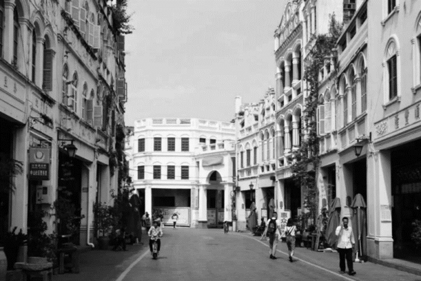

**答案**：C

**官方解析**

第一步：找出定义关键词。
“底层沿街面后退”、“留出公共人行空间”。
第二步：逐一分析选项。
A项：该项图片显示为“海口骑楼老街”，图中的沿街建筑，上面是楼房，下面是沿街廊道，该廊道既是居室(或店面)的外廊，又是室内室外的过渡空间，符合“底层沿街面后退”，同时该沿街廊道可供行人通过，符合“留出公共人行空间”，符合定义，排除；
B项：该项图片显示为“文昌铺前老街”，图中的沿街建筑，上面是楼房，下面是沿街廊道，该廊道既是居室(或店面)的外廊，又是室内室外的过渡空间，符合“底层沿街面后退”，同时该沿街廊道可供行人通过，符合“留出公共人行空间”，符合定义，排除；
C项：该项图片显示为“凤凰古城”，图中的街道两旁是建筑物的外墙，并未出现街面后退的情况也无法供行人通过，不符合“底层沿街面后退”和“留出公共人行空间”，不符合定义，当选；
D项：该项图片显示为“海口骑楼老街”，图中的沿街建筑，上面是楼房，下面是沿街廊道，该廊道既是居室(或店面)的外廊，又是室内室外的过渡空间，符合“底层沿街面后退”，同时该沿街廊道可供行人通过，符合“留出公共人行空间”，符合定义，排除。
本题为选非题，故正确答案为C。

---
