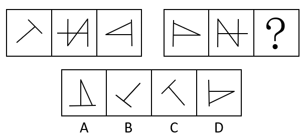
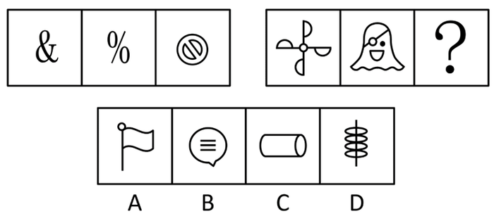
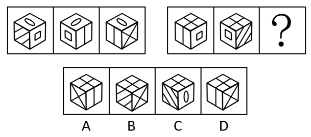
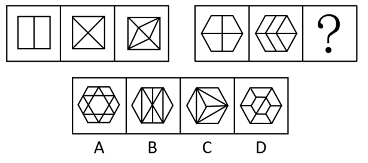
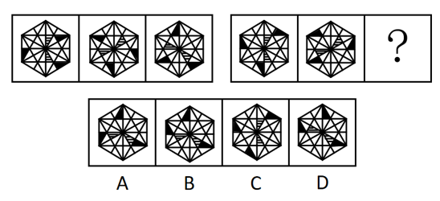
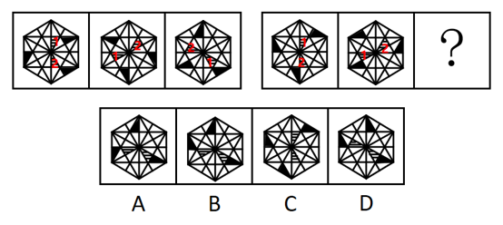

# 2022年深圳市考公务员录用考试《行测》试题（网友回忆版）

> 判断推理 · 20 题 · 深圳市考 2022

## 第 1 题　qid 4651880 · 类比推理

①选取洋葱外表皮
②吸水纸反复引滤
③滴加蔗糖溶液
④制成临时装片
⑤发生质壁分离

- **A**. ①-④-③-②-⑤　✅
- **B**. ①-③-④-②-⑤
- **C**. ③-①-④-②-⑤
- **D**. ⑤-②-③-④-①

**答案**：A

**官方解析**

第一步：先确定逻辑关系最为明显的逻辑顺序。
题干是在做“质壁分离”实验，所以第一步是选材最后一步是发生质壁分离，可以得到“选取洋葱外表皮”是第一步，“发生质壁分离”是最后一步，可以排除C、D两项。
第二步：逐一对照选项并判断正确答案。
根据第一步的结果可以判断只有A、B两项符合，A、B两项的区别是“滴加蔗糖溶液”与“制成临时装片”顺序不同，根据第四步肯定是“吸水纸反复引滤”可以得到前面紧跟着的是“滴加蔗糖溶液”，由此排除B项。
故正确答案为A。

---

## 第 2 题　qid 4651887 · 类比推理

①船只倾斜搁浅
②货轮体量空前
③航道双向堵塞
④紧急脱浅救援
⑤国际贸易受阻

- **A**. ②-①-③-⑤-④　✅
- **B**. ③-②-①-⑤-④
- **C**. ①-④-②-③-⑤
- **D**. ③-①-②-④-⑤

**答案**：A

**官方解析**

第一步：先确定逻辑关系最为明显的逻辑顺序。
观察题干，五个事件主要是围绕着“船只搁浅堵塞航道”开展的。逻辑关系的先后顺序比较明显的事件是事件①和事件③，船只要先搁浅，才能导致航道堵塞，事件①应该在事件③前面，排除B、D两项。
第二步：逐一对照选项并判断正确答案。
根据第一步的结果可以判断只有A、C两项符合，引发船只搁浅的原因是船只的重量空前超额，进而导致船只发生倾斜，这里“货轮体量空前”是造成船只搁浅的原因，因此事件②应该在事件①前面，排除C项。
故正确答案为A。

---

## 第 3 题　qid 4651889 · 类比推理

（1）百花齐放，百家争鸣
（2）星星之火，可以燎原
（3）惩前毖后，治病救人
（4）打扫干净屋子再请客
（5）枪杆子里出政权

- **A**. 5-2-3-4-1　✅
- **B**. 2-5-4-3-1
- **C**. 2-5-4-1-3
- **D**. 5-2-4-1-3

**答案**：A

**官方解析**

第一步：先确定逻辑关系最为明显的逻辑顺序。
观察题干，五个事件主要是围绕着我国不同时期提出的党政方针开展的。“百花齐放，百家争鸣”是在1956年提出的，“星星之火，可以燎原”是在1930年提出的，“惩前毖后，治病救人”是在1942年提出的，“打扫干净屋子再请客”是在1949年提出的，“枪杆子里出政权”是在1927年提出的。根据时间先后排序应该是（5）-（2）-（3）-（4）-（1）。
第二步：逐一对照选项并判断正确答案。
根据上述判断，只有A项符合题意，当选。
故正确答案为A。

---

## 第 4 题　qid 4651891 · 类比推理

（1）就读职校技能突出
（2）昼夜苦练专业技能
（3）展现大国工匠风采
（4）取得世界大赛资格
（5）入选国家集训队伍

- **A**. 2-1-3-5-4
- **B**. 2-1-5-3-4
- **C**. 1-5-2-4-3　✅
- **D**. 1-5-4-2-3

**答案**：C

**官方解析**

第一步：先确定逻辑关系最为明显的逻辑顺序。
观察题干，五个事件主要围绕“个人学习成长过程”开展的。逻辑关系的先后顺序比较明显的是事件（3）和事件（4），只有先“取得世界大赛资格”，才能“展现大国工匠风采”，因此事件（4）排在事件（3）前面，且事件（3）是一个结果表述，应该排在最后，排除A、B项。
第二步：逐一对照选项并判断正确答案。
根据第一步得到的结果可以判断只有C、D两项符合，通过分析事件（2）、（4），先“昼夜苦练专业技能”，才能“取得世界大赛资格”，因此事件（2）排在事件（4）前面，排除D项。
故正确答案为C。

---

## 第 5 题　qid 4651894 · 类比推理

（1）听信诱导，投入巨资
（2）血本无归，债台高筑
（3）扫码入群，牛刀小试
（4）获得收益，心中窃喜
（5）网上冲浪，惊现商机

- **A**. 5-4-3-1-2
- **B**. 5-3-4-1-2　✅
- **C**. 3-1-2-5-4
- **D**. 3-4-5-1-2

**答案**：B

**官方解析**

第一步：先确定逻辑关系最为明显的事件顺序。
观察题干，五个事件主要围绕“电信诈骗”的过程开展的。逻辑关系的先后顺序比较明显的是事件（3）和事件（5），先网上冲浪，发现商机后，才会扫码入群，牛刀小试，因此事件（5）应该在事件（3）前面，故事件（5）为首句，排除C、D两项。
第二步：逐一对照选项并判断正确答案。
根据第一步得到的结果可以判断只有A、B两项符合，通过分析事件（3）、（4）可知，先牛刀小试，投入资金后，才能获得收益，因此事件（3）应该在事件（4）前面，排除A项。
故正确答案为B。

---

## 第 6 题　qid 4651895 · 图形推理

从所给的四个选项中，选择最合适的一个填入问号处，使之呈现一定的规律性：

- **A**. A
- **B**. B
- **C**. C　✅
- **D**. D

**答案**：C

**官方解析**

元素组成相同，优先考虑位置规律。观察发现，第一组图二、图三分别与第二组图二、图一相同，但经过了左右翻转，因此第二组图是由第一组图整体左右翻转得到的，则？处图形应由第一组图一左右翻转得到，对应C项。
故正确答案为C。

---

## 第 7 题　qid 4651897 · 图形推理

从所给的四个选项中，选择最合适的一个填入问号处，使之呈现一定的规律性：

- **A**. A　✅
- **B**. B
- **C**. C
- **D**. D

**答案**：A

**官方解析**

解题思路一：图形元素组成不同，且无明显属性规律。观察发现，题干图形都存在曲线，且有单一曲线出现，优先考虑数曲线；第一组图形的曲线数依次为1、2、3，曲线数依次递增；第二组图的曲线数依次为5、4、？，曲线数依次递减，故？处应选择曲线数为3的图形，只有A项符合规律。
故正确答案为A。
解题思路二：图形元素组成不同，优先考虑属性规律。观察发现，第一组图形图1为不对称图形、图2为中心对称图形、图3为轴+中心对称图形，第二组图形图1为中心对称图形，图2为不对称图形，故？处应选择轴+中心对称的图形，只有D项符合规律。
故正确答案为D。
注：思路一和思路二均可以选出唯一答案，但首先，从整体图形特征来看，题干和选项的每幅图都有曲线，考查曲线的概率更大，而题干并不是所有图形都具备对称性，对称考法不是很严谨。其次，思路二考虑对称时，两组图不同对称性出现的顺序是乱的，而看曲线数时，两组图都是依次变化，依次递增、依次递减，思路一相比思路二更为严谨，因此粉笔更倾向于选A。

---

## 第 8 题　qid 4651899 · 图形推理

从所给的四个选项中，选择最合适的一个填入问号处，使之呈现一定的规律性：

- **A**. A
- **B**. B　✅
- **C**. C
- **D**. D

**答案**：B

**官方解析**

两组图形优先观察第一组，均为同一个六面体，图1整体沿水平方向顺时针旋转得到图2，图2整体沿水平方向顺时针旋转得到图3。第二组图形应用此规律，验证图1到图2，满足此规律，因此“？”处图形应由图2整体沿水平方向顺时针旋转得到，即顶面为田字面，左面为斜线面。

故正确答案为B。

---

## 第 9 题　qid 4651904 · 图形推理

从所给的四个选项中，选择最合适的一个填入问号处，使之呈现一定的规律性：

- **A**. A
- **B**. B
- **C**. C
- **D**. D　✅

**答案**：D

**官方解析**

图形元素组成不同，且无明显属性规律，优先考虑数量规律。题干图形均为多边形内部被分割，窟窿比较明显，考虑面数量。第一组图形的面数量依次为2、4、6，呈现依次递增的规律。第二组图形的面数量依次为4、6、？，故？处应选择有8个面的图形，排除A、C两项。整体数面选不出唯一答案，考虑面的细化考点，观察发现，题干图形均被分割成了面积相同的几个面，只有D项所有面的面积均相同，当选。
故正确答案为D。

---

## 第 10 题　qid 4651906 · 图形推理

请从所给的四个选项中，选出最恰当的一项填入问号处，使之呈现一定的规律性。

- **A**. A
- **B**. B
- **C**. C
- **D**. D　✅

**答案**：D

**官方解析**

图形元素组成相同，优先考虑位置规律。观察发现，第一组图形中，两个阴影部分沿内圈进行移动，阴影部分1、2均依次沿内圈逆时针移动4格，黑色三角形均依次沿外圈顺时针移动3格，第二组图形应遵循此规律，对应D项。

故正确答案为D。

---

## 第 11 题　qid 4651886 · 逻辑判断

一组人参加游戏，要求第一个人任意报数，接下来每个人都根据前一个人的报数按照既定规则继续报数。第一个人报：“1，1”；第二个人报：“2，1”；第三个人报：“1，1，1，2”；第四个人报：“1，2，3，1”；第五个人报：“1，2，1，3，2，1”；第六个人报：“1，3，2，2，3，1”。
则第七个人应报（    ）。

- **A**. 1，2，2，3，2，1
- **B**. 2，1，2，2，2，3　✅
- **C**. 3，2，2，2，1，1
- **D**. 1，2，1，3，3，1

**答案**：B

**官方解析**

从题干入手进行推理。已知第一个人报数为“1，1”，第二个人报数为“2，1”，此时第二个人报数的含义为：前一个人报了“2个1”，代入第三个人进行验证，已知第三个人报数为“1，1，1，2”，所代表的含义为：前一个人报了“1个1，1个2”，代入后三个人进行验证均满足此规律，即题干的既定规则为：后一个人报数要描述前一个人报了哪些数字（按数字从小到大的顺序）和该数字的数量（数量放在数字前）。按此规则，第七个人所报数字表示的含义应为：前一个人报了“2个1，2个2，2个3”，即“2，1，2，2，2，3”，只有B项符合。
故正确答案为B。

---

## 第 12 题　qid 4651890 · 逻辑判断

某赛事的参赛者信息如下：
（1）3人是围棋选手；
（2）4人来自广东；
（3）2人来自深圳；
（4）5人是女生；
（5）来自深圳的参赛者都是男生。
若以上信息涉及了所有参赛者，则该赛事的参赛者（    ）。

- **A**. 最多14人，最少8人
- **B**. 最多14人，最少7人
- **C**. 最多12人，最少7人　✅
- **D**. 最多12人，最少8人

**答案**：C

**官方解析**

第一步：分析题干条件。
（1）3人是围棋选手；
（2）4人来自广东；
（3）2人来自深圳；
（4）5人是女生；
（5）来自深圳的参赛者都是男生。
第二步：根据题干条件进行推理。
已知题干信息涉及了所有参赛者，且来自广东的4人当中包括来自深圳的2人。当条件（1）、（2）、（4）涉及的参赛者互不重复时，参赛人数最多，此时有3+4+5共计12位参赛者； 结合条件（3）、（5）可知，来自深圳的2人是男生，再结合条件（4）可知，至少有2+5共计7人参赛，此时条件（1）、（2）和条件（3）、（4）、（5）涉及的参赛者恰好重复（例如某参赛者可以既是女生又是围棋选手），参赛人数最少。
故正确答案为C。

---

## 第 13 题　qid 4651892 · 逻辑判断

三孩政策引发民众热议。有人认为，三孩政策将加剧性别不公，影响女性的职业发展，加重家庭经济负担，因此夫妻应当合休产假，男女共担育儿义务，这一建议如果被采纳实施，将有效降低生育对女性职业发展的负面影响，提高女性生育意愿，推动三孩政策落实。
以下选项如果为真，最能支持上述结论的是：

- **A**. 某集团的人力资源负责人表示，考虑到产假因素，业内招聘普遍倾向于录用男性
- **B**. 已有国家正在实行类似的夫妻合休全薪产假政策，受到该国国民的大力支持
- **C**. 夫妻合休产假可以优化家庭教育结构，有利于儿童身心健康成长
- **D**. 调查显示，不考虑生育三孩的女性中，大多数对生育三孩将影响其职业发展有较大顾虑　✅

**答案**：D

**官方解析**

第一步：找出论点和论据。
论点：夫妻合休产假的建议如果被采纳实施，将有效降低生育对女性职业发展的负面影响，提高女性生育意愿，推动三孩政策落实。
论据：三孩政策将加剧性别不公，影响女性的职业发展，加重家庭经济负担。
本题论点讨论的是实施合休产假后三孩政策不会影响女性职业发展，论据讨论的是三孩政策对女性职业发展的影响，论点论据话题一致。所以加强可以优先考虑补充论据，可以举例子，也可以解释原因。
第二步：逐一分析选项。
A项：指出目前女性产假是影响女性录用情况的因素，而论点讨论的是夫妻合休产假这一政策与女性职业发展以及三孩政策落实间的关系，话题不一致，无法加强，排除；
B项：指出其他国家实行夫妻合休全薪产假政策后受到了国民的支持，而论点讨论的是该政策在我国实施可能会带来的积极影响，主体不一致，无法加强，排除；
C项：指出夫妻合休产假政策有利于儿童身心健康成长，而论点讨论的是该政策与女性职业发展以及三孩政策落实间的关系，话题不一致，无法加强，排除；
D项：指出有些女性因生育三孩确实会影响其职业发展而选择不生三孩，而该政策的实施可以降低生育为女性职业发展带来的负面影响，因此该项解释了这项政策如何降低女性职业发展负面影响，进而推动三孩政策落实，可以加强，当选。
故正确答案为D。

---

## 第 14 题　qid 4651896 · 逻辑判断

与老一辈相比，年轻一代的青春痘问题更为严重。有人认为，老一辈的生活条件艰苦，饮食清淡，而当代年轻人喜爱吃油炸食品和蛋糕、巧克力等甜食。因此，油炸食品和甜食是导致年轻一代青春痘问题更为严重的原因。
以下选项如果为真，最能质疑上述观点的是：

- **A**. 青春痘是皮脂腺油脂分泌过多进而堵塞的结果
- **B**. 油炸食品和甜食易使人堆积脂肪的部位是腰腹部，而非面部
- **C**. 即使饮食清淡，少油少糖，也有可能长青春痘
- **D**. 情绪压力也易引发青春痘，当代年轻人压力高于历代　✅

**答案**：D

**官方解析**

第一步：找出论点和论据。
论点：油炸食品和甜食是导致年轻一代青春痘问题更为严重的原因。
论据：与老一辈相比，年轻一代的青春痘问题更为严重。老一辈的生活条件艰苦，饮食清淡，而当代年轻人喜爱吃油炸食品和蛋糕、巧克力等甜食。
本题论点、论据讨论的都是油炸食品和甜食与年轻一代青春痘问题的关系，话题一致，且论点中存在因果关系，削弱优先考虑因果倒置和他因削弱。
第二步：逐一分析选项。
A项：该项说明青春痘是油脂分泌过多导致的，但未提及油脂与油炸食品和甜食的关系，为不明确项，无法削弱，排除；
B项：该项说明油炸食品和甜食容易使腰腹部的脂肪增加，而题干讨论的是油炸食品和甜食与青春痘的关系，话题不一致，无法削弱，排除；
C项：该项说明饮食清淡、少油少糖可能会长青春痘，而题干讨论的是油炸食品和甜食与青春痘的关系，话题不一致，无法削弱，排除；
D项：该项说明情绪压力也易引发青春痘，并且当代年轻人压力高于历代，这意味着情绪压力大也是年轻一代青春痘问题更严重的原因，提出了其他导致年轻一代青春痘问题的原因，他因削弱，当选。
故正确答案为D。

---

## 第 15 题　qid 4651898 · 逻辑判断

一对热恋期情侣之间的对话如下：
女生问：“我是不是世界上最漂亮的女生？”
男生答：“这个问题我回答不了，我得看完世界上所有女生后才能回答！”
要使以上对话中男生的论证基本成立，最需要假设的前提是（    ）。

- **A**. 男生用情专一，不会见异思迁
- **B**. 世界上所有女生在“漂亮”上是可以比较的　✅
- **C**. “漂亮”是一种客观属性且有评判标准
- **D**. 男生可以在有生之年看完世界上所有女生

**答案**：B

**官方解析**

第一步：找出论点和论据。
论点：回答不了女朋友是否为世界上最漂亮的女生的问题。
论据：男生要看完世界上所有女生后才能回答。
本题论点说的是回答不了女朋友是否为世界上最漂亮的女生，论据说的是男生要看完世界上所有女生后才能回答，论点和论据说的都是女朋友是否为世界上最漂亮的女生的话题，二者话题一致，且提问方式为“最需要假设的前提”，加强优先考虑必要条件。
第二步：逐一分析选项。
A项：该项说的是男生用情专一，不会见异思迁，而论点说的的是回答不了女朋友是否为世界上最漂亮的女生的问题，话题不一致，不是论证成立的前提，排除；
B项：该项说的是世界上所有女生在“漂亮”上是可以比较的，假如该项不成立，即世界上所有女生在“漂亮”上是不可以比较的，那么男生就没有必要等到看完世界上所有女生后才能回答女朋友是否是世界上最漂亮的女生的问题，故当该项不成立时，题干的论证过程也不成立，因此该项是论证成立的前提，保留；
C项：该项说的是“漂亮”是一种客观属性且有评判标准，假如选项不成立，即“漂亮”不是客观属性或者没有评判标准。若“漂亮”不是客观属性，即也可以是男生主观上的认知，而男生主观上对于“漂亮”的认知并不影响男生评判世界上最漂亮的女生，故“漂亮”是一种客观属性不是论证成立的必要条件，若漂亮”没有评判标准，则男生即使看完世界上所有的女生也无法评判出女朋友是否是世界上最漂亮的女生，故漂亮有评判标准是论证成立的必要条件，该项保留；
D项：该项说的是男生可以在有生之年看完世界上所有女生，侧重于表述是否能看完所有的女生，而论证讨论的侧重点是男生看完之后能否回答女朋友是否是世界上最漂亮的女生，话题不一致，因不是论证成立的前提，排除。
比较B、C两项，C项表述中“‘漂亮’是一种客观属性”并不能成为论证成立的前提，只是局部的必要条件，而B项说的是女生在“漂亮”上是可以比较的，这句话是最贴近男生说出该论证的前提，更加贴近题干的表述，故依据对比择优的原则，B项力度更强，当选。
故正确答案为B。

---

## 第 16 题　qid 4651884 · 逻辑判断

在中国生产智能手机的成本比美国低50%。即使算上运输费用和关税，从中国进口智能手机到美国，仍比在美国生产智能手机便宜。
如果以上论述为真，最能支持该论断的是（    ）。

- **A**. 中国的劳动力成本比美国低50%
- **B**. 从中国进口智能手机到美国，将减少美国智能手机制造业50%的就业机会
- **C**. 从中国进口智能手机到美国的运输费用和关税少于在美国生产智能手机的成本的50%　✅
- **D**. 为获得更大收益，美国智能手机企业将生产线转移至中国

**答案**：C

**官方解析**

第一步：找出论点和论据。
论点：在中国生产智能手机的成本比美国低50%。即使算上运输费用和关税，从中国进口智能手机到美国，仍比在美国生产智能手机便宜。
本题只有论点，无明显论据，加强优先考虑补充论据，即证明“在中国生产智能手机的成本+运输费用+关税＜在美国生产智能手机的成本”。
第二步：逐一分析选项。
A项：该项举例说明了中国的劳动力成本比美国低，因此在中国生产智能手机的成本可能比美国低，举例加强，补充论据，保留；
B项：论点说的是算上运输费用和关税后，从中国进口智能手机到美国依然便宜，该项说的是从中国进口智能手机到美国对就业的影响，话题不一致，无法加强，排除；
C项：题干论点指出中国生产成本=50%美国生产成本，且中国生产成本+关税+运费&lt;美国生产成本，选项指出关税+运费&lt;50%美国生产成本，解释了论点逻辑成立的原因，补充论据，保留；
D项：论点说的是算上运输费用和关税后，中国生产的智能手机卖到美国依然便宜，即中国生产的智能手机性价比高，但美国企业到中国来生产智能手机是否可以延续高性价比，其中不确定成本太多，没有C项直接，排除；
对比A、C两项，A项是从成本的其中一个方面举例加强，C项直接对于论点话题中的“运输费用和关税”来解释论点原因，C项更贴近论点表述，C项当选。
故正确答案为C。

---

## 第 17 题　qid 4651888 · 类比推理

上级视察小康村，了解到以下实情：如果宅基地没有管理良好，那么村民活动中心不会建成；除非乡村道路铺设完成，否则生态旅游产业无法发展；村民活动中心建成或者乡村道路没有铺设完成。
由此可推知：

- **A**. 宅基地没有建设良好且生态旅游无法发展
- **B**. 宅基地管理良好且乡村道路铺设完成
- **C**. 宅基地没有管理良好或者生态旅游产业发展
- **D**. 宅基地管理良好或者生态旅游产业无法发展　✅

**答案**：D

**官方解析**

第一步：翻译题干。

（1）宅基地管理良好村民活动中心建成；

（2）生态旅游产业发展乡村道路铺设完成；

（3）村民活动中心建成 或 乡村道路铺设完成。

第二步：判断选项词语间逻辑关系。

条件（3）是相对比较确定的信息，可以从条件（3）入手。

条件（3）表明“村民活动中心建成”和“乡村道路铺设完成”至少有一项为真。当“村民活动中心建成”为真时，根据条件（1）否后推出否前可知，“宅基地管理良好”为真；当“乡村道路铺设完成”为真时，根据条件（2）否后推出否前可知，“生态旅游产业发展”为真。由于“村民活动中心建成”和“乡村道路铺设完成”至少有一项为真，因此“宅基地管理良好”和“生态旅游产业发展”至少一项为真，即“宅基地管理良好” 或 “生态旅游产业发展”，即为D项。

故正确答案为D。

---

## 第 18 题　qid 4651893 · 类比推理

某分公司组织员工前往总部参加年终晚会，所有员工要么选择乘高铁，要么选择乘飞机，经统计，乘高铁的员工多于乘飞机的员工，女员工人数多于男员工人数，则下列断定一定为真的是（    ）。
（1）乘飞机的女员工多于乘飞机的男员工
（2）乘高铁的男员工多于乘飞机的男员工
（3）乘高铁的女员工多于乘飞机的男员工

- **A**. （1）（2）
- **B**. 只有（3）　✅
- **C**. （2）（3）
- **D**. 一个都没有

**答案**：B

**官方解析**

第一步：整理题干信息。
（1）所有员工要么选择乘高铁，要么选择乘飞机；
（2）乘高铁的员工多于乘飞机的员工；
（3）女员工人数多于男员工人数。
第二步：根据信息整合。
将题干中提到的情况列出来，分别有两类情况，第一类：女性员工和男性员工，第二类：乘高铁和乘飞机，这两类中的两种情况非此即彼，接下来我们可以根据题中已知的条件列出2个算式：
1.乘高铁（男+女）＞乘飞机（男+女），即乘高铁女+乘高铁男＞乘飞机男+乘飞机女；
2.女（乘高铁+乘飞机）＞男（乘高铁+乘飞机），即乘高铁女+乘飞机女＞乘高铁男+乘飞机男。
那么将1和2相加，根据大大则大的原则得到：
乘高铁女+乘高铁男+乘高铁女+乘飞机女＞乘飞机男+乘飞机女+乘高铁男+乘飞机男。
算式两边相互抵消得到：
乘高铁女＞乘飞机男，则一定能推出的只有（3），（1）（2）不确定，B项当选。
故正确答案为B。

---

## 第 19 题　qid 4651901 · 逻辑判断

“小T小T，请帮我开灯，小T小T，我心情不好，给我讲个笑话吧。小T小T，请在月底提醒我，妈妈的生日快到了······”如今，各式各样的智能机器人层出不穷，人工智能通过语音识别和机器学习来模拟人的行为，给人们提供工作和生活上的便利。多位专家预测，面向家庭日常使用的人工智能机器人，将超过服务于传统制造业和物流业的机器人，成为下一个爆发式增长的市场。
以下选项如果为真，最能质疑专家预测的是（    ）。

- **A**. 人工智能机器人的研发制造工序繁杂，生产周期较长，很难实现大规模量产
- **B**. 人工智能机器人虽然层出不穷，但各品牌机器人的质量参差不齐，家庭用户评价褒贬不一
- **C**. 面向家庭的人工智能机器人看上去高端，但与实际需求落差大，若要“更像人类”，则成本过高　✅
- **D**. 人工智能和社会伦理是否会产生冲突，能否大批量投入居家使用，尚待时间检验

**答案**：C

**官方解析**

第一步：找出论点和论据。
论点：面向家庭日常使用的人工智能机器人，将超过服务于传统制造业和物流业的机器人，成为下一个爆发式增长的市场。
论据：各式各样的智能机器人层出不穷，人工智能通过语音识别和机器学习来模拟人的行为，给人们提供工作和生活上的便利。
论点和论据讨论的都是面向家庭日常使用的人工智能机器人能够满足人们的需求，大受欢迎，话题一致，削弱优先考虑否定论点。
第二步：逐一分析选项。
A项：该项说的是人工智能机器人的研发制造工序繁杂，生产周期长，很难实现大规模量产，论点说的是面向家庭日常使用的人工智能机器人是否会成为下一个爆发式增长的市场，话题不一致，无法削弱，排除；
B项：该项说的是人工智能机器人，论点说的是面向家庭日常使用的人工智能机器人，主体不一致，无法削弱，排除；
C项：该项说的是面向家庭的人工智能机器人与实际需求落差大，生产成本高，否定其成为下一个爆发式增长的市场的前提，即成本太高难以投入市场，且需求量小，因此无法成为下一个爆发式增长的市场，否定论点，可以削弱，当选；
D项：该项说的是人工智能，论点说的是面向家庭日常使用的人工智能机器人，主体不一致，无法削弱，排除。
故正确答案为C。

---

## 第 20 题　qid 4651905 · 逻辑判断

有蓝蓝、豆豆、毛毛三个男生，他们各自有一个妹妹。已知：三个妹妹分别是花花、贝贝、妞妞；花花的哥哥是豆豆的好朋友，并且在三个男生中年纪最小；毛毛的年纪比妞妞的哥哥大。
由此可推知，三对兄妹分别是（    ）。

- **A**. 蓝蓝和花花，豆豆和贝贝，毛毛和妞妞
- **B**. 蓝蓝和妞妞，豆豆和花花，毛毛和贝贝
- **C**. 蓝蓝和贝贝，豆豆和妞妞，毛毛和花花
- **D**. 蓝蓝和花花，豆豆和妞妞，毛毛和贝贝　✅

**答案**：D

**官方解析**

第一步：分析题干条件。
（1）花花的哥哥是豆豆的好朋友；
（2）花花的哥哥在三个男生中年纪最小；
（3）毛毛的年纪比妞妞的哥哥大。
第二步：根据题干条件进行推理。
题干信息确定，选项信息充分，优先考虑排除法。
根据条件（1）可知花花的哥哥不是豆豆，排除B项；
根据条件（3）可知妞妞的哥哥不是毛毛，排除A项；
结合条件（2）、（3）可知花花的哥哥不是毛毛，排除C项。
故正确答案为D。

---
