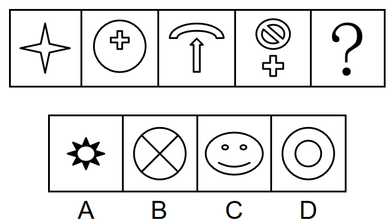

# 2022年湖北省选调生招录考试综合知识和行政职业能力测验试卷（网友回忆版）

> 判断推理 · 20 题 · 湖北 2022

## 第 1 题　qid 4808791 · 图形推理

从下列所给四个选项中选择最合适的一个填入问号处，使之呈现一定的规律性：

- **A**. A
- **B**. B
- **C**. C　✅
- **D**. D

**答案**：C

**官方解析**

元素组成不同，且无属性规律，考虑数量规律。观察发现，题干图2和图4都有圆，图3含有明显曲线，考虑曲线数。题干图形的曲线数依次为0、1、2、3，故问号处应填入有4条曲线的图形，只有C项符合。
故正确答案为C。

---

## 第 2 题　qid 4808801 · 图形推理

从下列所给四个选项中选择最合适的一个填入问号处，使之呈现一定的规律性：

- **A**. A　✅
- **B**. B
- **C**. C
- **D**. D

**答案**：A

**官方解析**

元素组成相似，且某些元素不止一次出现在各图形中，优先考虑样式规律中的遍历。比较相邻图形发现，题干已知图形都包含长方形元素，故问号处图形也应满足此规律，只有A项符合。
故正确答案为A。

---

## 第 3 题　qid 4808789 · 定义判断

越来越多的年轻人不再满足于专一职业生活方式，而是尝试拥有多重职业和身份的多元生活，体验不同的工作经历，感悟多重人生。在这种背景下，“斜杠青年”概念应运而生。“斜杠青年”指从事多种职业，体验多元化工作和生活的青年群体。在自我介绍时，他们会用“/”来区分多重职业身份。
根据上述定义，以下为“斜杠青年”的是：

- **A**. 甲，男，21岁，在校本科生/通信专业/辅修软件设计
- **B**. 乙，女，35岁，普通高中高级教师/班主任/年级主任
- **C**. 丙，女，30岁，播音主持教师/插画师/网络小说作家　✅
- **D**. 丁，男，75岁，新闻传播学教授/自由拟稿人/花艺师

**答案**：C

**官方解析**

第一步：找出定义关键词。
“从事多种职业”、“青年群体”。
第二步：逐一分析选项。
A项：甲是一名在校学生，“/”前后是所学的专业，不符合“从事多种职业”，不符合定义，排除； 
B项：乙是一名教师，“/”前后是教师职责不同角度的体现，不符合“从事多种职业”，不符合定义，排除；
C项：丙的年龄是30岁，符合“青年群体”，“/”前后为3个不同的职业身份，符合“从事多种职业”，符合定义，当选；
D项：丁的年龄是75岁，不符合“青年群体”，不符合定义，排除。
故正确答案为C。

---

## 第 4 题　qid 4808857 · 定义判断

无废城市是以创新、协调、绿色、开放、共享的新发展理念为引领，通过推动形成绿色发展方式和生活方式，持续推进固体废物源头减量和资源化利用，最大限度减少填埋量，将固体废物环境影响降至最低的城市发展模式。
根据上述定义，以下与无废城市建设无关的是：

- **A**. 著名滨海旅游城市甲市，在全市范围内开展绿色机关、绿色社区、绿色校园、绿色酒店争创活动；禁止一次性不可降解塑料袋和塑料餐具生产、销售和使用，减少塑料污染
- **B**. 乙市是有色金属基地，2018年以前，工业固体废物年均产生量约1500吨，年均综合利用量不足10吨。经努力，现在废物产生量降至1450吨以下，综合利用量超过1200吨
- **C**. 丙市对建筑废物作减法，推动建成装配式建筑产业基地，力促具备条件的新建建筑采用装配方式进行建设，既发展了生产技术，又提高了绿色建筑比例，减少了建筑废物
- **D**. 丁市矿产资源丰富，近年来大力治理因长期粗放开发导致的生态危机，城市绿化覆盖率恢复到37.9%，建成4A级景区4个，3A级景区2个，被评为省森林城市和国家园林城市　✅

**答案**：D

**官方解析**

第一步，找出定义关键词。
“推动形成绿色发展方式和生活方式，持续推进固体废物源头减量和资源化利用”、“最大限度减少填埋量”、“将固体废物环境影响降至最低的城市发展模式”。
第二步，逐一分析选项。
A项：甲市禁止一次性不可降解塑料袋和塑料餐具生产、销售和使用，减少塑料污染就是减少固体废物的污染，符合“推动形成绿色发展方式和生活方式，持续推进固体废物源头减量和资源化利用”、“最大限度减少填埋量”、“将固体废物环境影响降至最低的城市发展模式”，符合定义，排除；
B项：乙市的工业固体废物产量下降，综合利用量增加，符合“推动形成绿色发展方式和生活方式，持续推进固体废物源头减量和资源化利用”、“最大限度减少填埋量”、“将固体废物环境影响降至最低的城市发展模式”，符合定义，排除；
C项：丙市提高了绿色建筑比例，减少建筑废物是减少固体废物的一种手段，符合“推动形成绿色发展方式和生活方式，持续推进固体废物源头减量和资源化利用”、“最大限度减少填埋量”、“将固体废物环境影响降至最低的城市发展模式”，符合定义，排除；
D项：丁市经过治理，城市绿化覆盖率增加，未提及针对固体废物的具体解决情况，不符合“推动形成绿色发展方式和生活方式，持续推进固体废物源头减量和资源化利用”、“将固体废物环境影响降至最低的城市发展模式”，不符合定义，当选。
本题为选非题，故正确答案为D。

---

## 第 5 题　qid 4808782 · 定义判断

锁定是指因某些原因，导致从一个系统（可能是一种技术、产品或是标准）转换到另一个系统的转移成本大到转移不经济，从而很难从该系统退出的状态。
根据上述定义，下列情形属于锁定的是：

- **A**. 甲用某电脑操作系统多年，如改用另一操作系统就得学习和适应该系统的使用方法，他觉得费事不愿改　✅
- **B**. 乙吃饭时习惯了边吃边喝饮料，尽管他知道这个习惯对身体很不好，但是他改变不了这个不好的习惯
- **C**. 丙的电视看了多年，已经很老旧了，儿子一直劝他买一台新的，但是他觉得使用频率不高，没必要换
- **D**. 丁正在追一部电视剧，当朋友向他推荐一热播新剧时，他并不想放弃该剧

**答案**：A

**官方解析**

第一步：找出定义关键词。
“从一个系统（可能是一种技术、产品或是标准）转换到另一个系统的转移成本大到转移不经济”、“很难从该系统退出”。
第二步：逐一分析选项。
A项：甲因为觉得费事而不愿更换使用多年的电脑操作系统，转移的成本是要重新学习和适应新的操作系统，“费事”说明这些时间和精力上的转移成本对于甲来说是难以接受的，符合“从一个系统（可能是一种技术、产品或是标准）转换到另一个系统的转移成本大到转移不经济”、“很难从该系统退出”，符合定义，当选；
B项：乙无法改变边吃饭边喝饮料的习惯，并没有体现转移的成本，不符合“从一个系统（可能是一种技术、产品或是标准）转换到另一个系统的转移成本大到转移不经济”，不符合定义，排除；
C项：丙因为使用频率不高而拒绝更换电视，转移的成本可能是花费，没有明确转移成本对丙来说是否是难以接受的，不符合“从一个系统（可能是一种技术、产品或是标准）转换到另一个系统的转移成本大到转移不经济”，不符合定义，排除；
D项：丁不想放弃正在追的电视剧，并没有体现转移的成本，不符合“从一个系统（可能是一种技术、产品或是标准）转换到另一个系统的转移成本大到转移不经济”，不符合定义，排除。
故正确答案为A。

---

## 第 6 题　qid 4808788 · 定义判断

质量成本是指企业为了保证和提高产品或服务质量而支出的一切费用，以及因未达到产品质量标准，不能满足用户和消费者需要而产生的一切损失。
根据上述定义，下列情形不符合质量成本含义的是：

- **A**. 甲市行政服务中心为进一步提高窗口服务质量购置便民办公设备　✅
- **B**. 乙公司卖出的产品在保修期内出现质量问题，公司免费维修
- **C**. 丙公司拨付专款让员工学习产品质量管理国际标准体系
- **D**. 丁工厂投入巨资研制出一条优化产品性能的生产线

**答案**：A

**官方解析**

第一步：找出定义关键词。
“企业”、“为了保证和提高质量而支出的费用”、“因未达到质量标准，不能满足需要而产生的损失”。
第二步：逐一分析选项。
A项：甲市行政服务中心不符合“企业”，不符合定义，当选；
B项：乙公司产品在保修期内出现质量问题，公司免费维修，免费维修需要耗费企业成本，符合“企业”、“因未达到质量标准，不能满足需要而产生的损失”，符合定义，排除；
C项：丙公司拨付专款让员工学习国际标准体系，是为了保证和提高产品质量，符合“企业”、“为了保证和提高质量而支出的费用”，符合定义，排除；
D项：丁工厂投入巨资研制生产线，是为了优化产品性能，符合“企业”、“为了保证和提高质量而支出的费用”，符合定义，排除。
本题为选非题，故正确答案为A。

---

## 第 7 题　qid 4808755 · 定义判断

叙事性舞蹈又称“情节舞”，是通过舞蹈中不同人物的行动所构成的情节事件来塑造人物，表现作品主题的舞蹈。抒情性舞蹈又称“情绪舞”，是在特定的环境中以鲜明生动的舞蹈语言来直接抒发舞者的思想情感，以此表达舞蹈家对生活的感受和评价的舞蹈。
根据上述定义，下列不属于叙事性舞蹈的是：

- **A**. 舞蹈演员在表演中模仿农民耕地插秧的动作
- **B**. 舞蹈演员用各种动作来表达农民的喜怒哀乐　✅
- **C**. 男女舞蹈演员用舞蹈来演绎悲欢离合的故事
- **D**. 舞蹈演员用舞蹈再现了红军长征的感人篇章

**答案**：B

**官方解析**

第一步：找出定义关键词。
叙事性舞蹈：“通过舞蹈中不同人物的行动所构成的情节事件”、“塑造人物，表现作品主题”；
抒情性舞蹈：“在特定的环境中以鲜明生动的舞蹈语言”、“来直接抒发舞者的思想情感，表达舞蹈家对生活的感受和评价”。
第二步：逐一分析选项。
A项：舞蹈演员通过模仿耕地插秧的动作来塑造农民的人物形象，符合“通过舞蹈中不同人物的行动所构成的情节事件”、“塑造人物，表现作品主题”，符合叙事性舞蹈的定义，排除；
B项：舞蹈演员用各种动作来表达农民的喜怒哀乐，强调了情感的抒发，没有体现情节的叙述，不符合“通过舞蹈中不同人物的行动所构成的情节事件”，不符合叙事性舞蹈的定义，当选；
C项：男女舞蹈演员用舞蹈来演绎悲欢离合的故事，“演绎故事”对应着“情节事件”，符合“通过舞蹈中不同人物的行动所构成的情节事件”、“塑造人物，表现作品主题”，符合叙事性舞蹈的定义，排除；
D项：舞蹈演员用舞蹈再现了红军长征的感人篇章，再现了红军的形象和精神，符合“通过舞蹈中不同人物的行动所构成的情节事件”、“塑造人物，表现作品主题”，符合叙事性舞蹈的定义，排除。
本题为选非题，故正确答案为B。

---

## 第 8 题　qid 4808767 · 类比推理

青春：奋斗：幸福

- **A**. 韶华：建功：立志
- **B**. 青年：开拓：创新
- **C**. 科技：发展：驱动
- **D**. 人生：耕耘：收获　✅

**答案**：D

**官方解析**

第一步：判断题干词语间逻辑关系。
“青春”需要“奋斗”，二者为对应关系，“奋斗”带来“幸福”，二者为因果的对应关系。
第二步：判断选项词语间逻辑关系。
A项：“建功”和“立志”没有因果关系，与题干逻辑关系不一致，排除；
B项：“开拓”和“创新”没有因果关系，与题干逻辑关系不一致，排除；
C项：“科技”需要“发展”，二者为对应关系，但“发展”和“驱动”没有因果关系，与题干逻辑关系不一致，排除；
D项：“人生”需要“耕耘”，二者为对应关系，“耕耘”带来“收获”，二者为因果的对应关系，与题干逻辑关系一致，当选。
故正确答案为D。

---

## 第 9 题　qid 4808780 · 类比推理

知足：不辱

- **A**. 甚爱：大费
- **B**. 多藏：厚亡
- **C**. 知止：不殆　✅
- **D**. 知难：不退

**答案**：C

**官方解析**

第一步：判断题干词语间逻辑关系。
“知足不辱”意思是知道满足，就不会受到羞辱。因为知足，所以不辱，二者是因果对应关系，且不辱是积极的结果。
第二步：判断选项词语间逻辑关系。
A项：“甚爱大费”意思是过分贪欲必然会导致更大的耗费。因为甚爱，所以大费，二者是因果对应关系，但大费是消极的结果，与题干逻辑关系不一致，排除；
B项：“多藏厚亡”意思是过分积聚财物必然会导致过多的损失。因为多藏，所以厚亡，二者是因果对应关系，但厚亡是消极的结果，与题干逻辑关系不一致，排除；
C项：“知止不殆”意思是知道适可而止就不会遇到危险。因为知止，所以不殆，二者是因果对应关系，且不殆是积极的结果，与题干逻辑关系一致，当选；
D项：“知难不退”意思是碰到困难也不退缩。二者不是因果对应关系，与题干逻辑关系不一致，排除。
故正确答案为C。

---

## 第 10 题　qid 4808802 · 类比推理

认识世界：把握规律：追求真理

- **A**. 修正错误：发扬经验：吸取教训
- **B**. 铭记历史：传承基因：坚毅前行
- **C**. 创新理论：指导实践：推动工作　✅
- **D**. 启迪智慧：砥砺品格：坚定信念

**答案**：C

**官方解析**

第一步：判断题干词语间逻辑关系。
先认识世界，然后把握规律，最后追求真理，三者为时间先后顺序的对应关系。
第二步：判断选项词语间逻辑关系。
A项：发扬经验应在吸取教训之后，与题干逻辑关系不一致，排除；
B项：铭记历史和传承基因不存在必然的先后顺序，与题干逻辑关系不一致，排除；
C项：先创新理论，然后用理论指导实践，最后推动工作，三者为时间先后顺序的对应关系，与题干逻辑关系一致，当选；
D项：启迪智慧、砥砺品格和坚定信念三者不存在必然的先后顺序，与题干逻辑关系不一致，排除。
故正确答案为C。

---

## 第 11 题　qid 4808793 · 类比推理

读书 对于 （    ） 相当于 （    ） 对于 本领

- **A**. 知识；历练　✅
- **B**. 成才；奋斗
- **C**. 理想；担当
- **D**. 研究；切磋

**答案**：A

**官方解析**

逐一代入选项。
A项：通过“读书”可以得到“知识”，通过“历练”可以得到“本领”，二者均是方式的对应关系，前后逻辑关系一致，当选；
B项：“读书”可能会“成才”，“奋斗”可能会获得“本领”，但“成才”是动宾结构，“本领”是名词，前后逻辑关系不一致，排除；
C项：通过“读书”可能会实现“理想”，“本领”与“担当”之间无明显逻辑关系，前后逻辑关系不一致，排除；
D项：“读书”的过程中需要“研究”，“切磋”可能会增强“本领”，前后逻辑关系不一致，排除。
故正确答案为A。

---

## 第 12 题　qid 4808795 · 类比推理

冬奥会∶夏奥会∶残奥会

- **A**. 男演员∶女演员∶小演员　✅
- **B**. 运动员∶裁判员∶监督员
- **C**. 红衣服∶蓝衣服∶黄衣服
- **D**. 推土机∶挖土机∶挖掘机

**答案**：A

**官方解析**

第一步：判断题干词语间逻辑关系。
冬奥会和夏奥会分别是冬季奥林匹克运动会和夏季奥林匹克运动会，二者为并列关系；残奥会是残疾人奥林匹克运动会，冬奥会和夏奥会是从举办季节的角度划分的，残奥会是从参赛人员的角度划分的，前两个词分别与第三个词构成交叉关系。
第二步：判断选项词语间逻辑关系。
A项：男演员和女演员是不同性别的演员，二者为并列关系；小演员是年龄较小的演员，男演员和女演员是从性别的角度划分的，小演员是从年龄的角度划分的，前两个词分别与第三个词构成交叉关系，与题干逻辑关系一致，当选；
B项：运动员是体育比赛的参赛人员，裁判员是运动竞赛过程中依据竞赛规程和竞赛规则评定运动员成绩、胜负和名次的人员，监督员是起监督作用的工作人员，三者为并列关系，与题干逻辑关系不一致，排除；
C项：红衣服、蓝衣服、黄衣服是三种不同颜色的衣服，三者为并列关系，与题干逻辑关系不一致，排除；
D项：推土机和挖土机是两种不同的工程机械，二者为并列关系，挖掘机别称挖土机，二者为全同关系，与题干逻辑关系不一致，排除。
故正确答案为A。

---

## 第 13 题　qid 4808886 · 逻辑判断

2021年，人民币汇率小幅升值2.3%。展望2022年，中国外贸顺差仍将维持在较高水平，对人民币汇率形成较强支撑；人民币资产吸引力仍强，海外资金净流入中国也将支撑人民币汇率。不过，美联储货币政策收紧将导致美元阶段性走强、中美利差收窄，人民币又存在一定贬值压力。有专家据此预测，2022年人民币汇率将有降有升、保持双向波动特征。
以下各项如果为真，最能支持上述预测的是：

- **A**. 全球经济金融形势复杂多变，人民币汇率可能会出现单向波动
- **B**. 我国将会积极引导市场预期，避免人民币对美元汇率单向波动
- **C**. 我国将采取稳健的货币政策，降低货币单边升值或贬值的概率　✅
- **D**. 坚持风险中性理念，有效规避汇率风险，更好应对内外部冲击

**答案**：C

**官方解析**

第一步：找出论点和论据。
论点：2022年人民币汇率将有降有升、保持双向波动特征。
论据：展望2022年，中国外贸顺差仍将维持在较高水平，对人民币汇率形成较强支撑；人民币资产吸引力仍强，海外资金净流入中国也将支撑人民币汇率。不过，美联储货币政策收紧将导致美元阶段性走强、中美利差收窄，人民币又存在一定贬值压力。
论点和论据都在讨论人民币可能会升值也可能会贬值，将保持双向波动特征，二者话题一致，加强优先考虑补充论据。
第二步：逐一分析选项。
A项：该项指出人民币汇率可能会出现单向波动，而论点说的是人民币汇率将保持双向波动，有一定的削弱力度，无法加强，排除；
B项：该项指出我国会采取措施避免人民币对美元汇率的单向波动，但论点讨论的是人民币整体汇率的情况，为不明确项，无法加强，排除；
C项：该项指出我国会采取稳健的货币政策降低人民币汇率单向波动的概率，即让人民币汇率保持双向波动，补充论据，可以加强，当选；
D项：该项指出如何应对内外部冲击对人民币汇率的影响，没有明确说明人民币汇率的变化情况，为无关项，无法加强，排除。
故正确答案为C。

---

## 第 14 题　qid 4808888 · 逻辑判断

商务部数据显示，2021年前11个月，我国吸收外资突破1万亿元，超过2020年全年金额；整个2021年，我国实际使用外资11493.6亿元，同比增长14.9%；有专家据此认为，中国对外资的吸引力将不断提升。
以下各项如果为真，最能支持专家观点的是：

- **A**. 国际权威机构最新调查显示，97%的受访外企打算继续扩大在华投资
- **B**. 调研显示，99%的受访在华日企表示，未来3至5年会加大对华投资
- **C**. 中国经济持续增长、市场庞大、供应链发达完善、不断优化营商环境　✅
- **D**. 2021年全球跨国投资疲弱，唯有中国吸收外资增长率保持两位数

**答案**：C

**官方解析**

第一步：找出论点和论据。
论点：中国对外资的吸引力将不断提升。
论据：商务部数据显示，2021年前11个月，我国吸收外资突破1万亿元，超过2020年全年金额；整个2021年，我国实际使用外资11493.6亿元，同比增长14.9%。
论点和论据均在讨论“中国对外资的吸引力”，二者话题一致，加强优先考虑补充论据，即解释中国对外资的吸引力将不断提升的原因或举例证明。
第二步：逐一分析选项。
A项：举例说明大部分受访外企将继续扩大在华投资，即中国对外资的吸引力将不断提升，属于举例加强，可以加强，保留；
B项：举例说明大部分在华日企会加大对华投资，即中国对外资的吸引力将不断提升，属于举例加强，可以加强，保留；
C项：解释说明中国经济持续增长等原因促使中国对外资的吸引力将不断提升，属于解释原因，可以加强，保留；
D项：举例说明中国吸收外资增长率保持着高水平，即中国对外资的吸引力将不断提升，属于举例加强，可以加强，保留；
对比A、B、C、D四项，C项解释原因的力度强于A、B、D三项举例加强，C项当选。
故正确答案为C。

---

## 第 15 题　qid 4808805 · 逻辑判断

2021年我国进出口总值39.1万亿元，同比增长21.4%。其中对东盟、欧盟、美国、日本和韩国，进出口总值分别为5.67万亿元、5.35万亿元、4.88万亿元、2.4万亿元和2.34万亿元，同比分别增长19.7%、19.1%、20.2%、9.4%和18.4%。同期，对“一带一路”沿线国家和地区进出口同比增长23.6%。
根据以上叙述可推出的结论是：

- **A**. 2021年，韩国是我国的第五大贸易伙伴
- **B**. 2021年，“一带一路”沿线国家和地区经济得到了发展
- **C**. 2021年，我国外贸进出口实现较快增长，质量稳步提升
- **D**. 2021年，我国对“一带一路”沿线国家和地区进出口同比增速高于整体同比增速　✅

**答案**：D

**官方解析**

日常结论题，根据题干信息逐一分析选项。
A项：根据题干信息只能得知我国对东盟、欧盟、美国、日本和韩国的进出口情况，但题干未提到我国对外贸易进出口总值排在前五的是否为这五个贸易伙伴，无法推出，排除；
B项：根据题干信息只能得知我国对“一带一路”沿线国家和地区进出口值有增长，但题干未提到这些国家和地区的经济是否得到了发展，无法推出，排除；
C项：根据题干信息只能得知我国进出口总值有所增长，但并未提到质量是否有提升，无法推出，排除；
D项：根据题干第一句和最后一句可知2021年我国进出口整体的同比增速为21.4%，对“一带一路”沿线国家和地区进出口同比增速为23.6%，后者高于前者，即对“一带一路”沿线国家和地区进出口同比增速高于整体同比增速，可以推出，当选。
故正确答案为D。

---

## 第 16 题　qid 4808817 · 逻辑判断

进入21世纪后，中国经济总量逐步上升到世界第二位。由此，有人认为：“加入WTO对一个国家的经济增长具有明显的加速作用。”
以下各项如果为真，最能质疑上述观点的是：

- **A**. 中国进入经济高增长轨道与加入WTO几乎同时发生
- **B**. 中国的大国基础结构对经济增长具有十分重要作用
- **C**. 印度、巴西在加入WTO前后经济增速无明显变化　✅
- **D**. 中国有较低劳动成本和较高技能结合的竞争优势

**答案**：C

**官方解析**

第一步：找出论点和论据。
论点：加入WTO对一个国家的经济增长具有明显的加速作用。
论据：进入21世纪后，中国经济总量逐步上升到世界第二位。
论点讨论的是加入WTO可以让国家经济增长加快，论据讨论的是进入21世纪后，中国经济总量逐步上升，论点论据讨论的话题一致，削弱优先考虑削弱论点，即说明加入WTO无法让国家经济增长加快。（注：中国于2001年12月11日加入WTO，故题干中“进入21世纪”包括加入WTO前。）
第二步：逐一分析选项。
A项：说明中国进入经济高增长轨道与加入WTO几乎同时发生，但几乎同时发生并不能明确加入WTO是否能加速经济增长，为不明确项，无法削弱，排除；
B项：说明中国的大国基础结构对经济增长有重要作用，但与论点讨论的加入WTO是否能加速经济增长无关，为无关项，无法削弱，排除；
C项：说明印度和巴西加入WTO后经济增速没变，举例说明加入WTO并不能让一个国家的经济增长加速，举例削弱论点，可以削弱，当选；
D项：说明中国具有竞争优势，但是否有竞争优势与论点讨论的加入WTO是否能加速经济增长无关，为无关项，无法削弱，排除。
故正确答案为C。

---

## 第 17 题　qid 4808796 · 逻辑判断

序贯加强免疫策略实施后，只有完成全程接种国药中生北京公司、北京科兴公司、国药中生武汉公司新冠病毒灭活疫苗满6个月的18岁以上的目标人群，才可以进行一次同源加强免疫接种，或者选择智飞龙科马的重组蛋白疫苗或康希诺的腺病毒载体疫苗进行序贯加强免疫。
据此可推出的结论是：

- **A**. 序贯加强免疫策略优于同源加强免疫
- **B**. 同时进行序贯和同源加强免疫效果更佳
- **C**. 重组蛋白疫苗为序贯加强免疫研发生产
- **D**. 完成全程接种且满足规定条件者可进行加强免疫接种　✅

**答案**：D

**官方解析**

日常结论题，根据题干信息逐一分析选项。
A项：根据题干可知，完成全程接种且满足条件的人群可以进行一次同源加强免疫接种，或者进行序贯加强免疫，但是没有提及这两种免疫方式哪种更优，无中生有，排除；
B项：根据题干可知，对于目标人群来说，同源加强免疫接种和序贯加强免疫选择一种即可，但是没有提及同时进行序贯加强免疫和同源加强免疫的效果如何，无中生有，排除；
C项：题干仅提及采用重组蛋白疫苗或腺病毒载体疫苗均可以进行序贯加强免疫，但没有提及重组蛋白疫苗对序贯加强免疫的研发生产有何作用，无中生有，排除；
D项：根据题干可知，只有完成全程接种并且满6个月的18岁以上的目标人群，才可以进行一次同源加强免疫接种，或者选择进行序贯加强免疫，可以推出完成全程接种且满足规定条件者可进行加强免疫接种，当选。
故正确答案为D。

---

## 第 18 题　qid 4808803 · 逻辑判断

据预测，未来20到25年，行驶在公路上的汽车大概会有75%为无人驾驶汽车。有人认为，在这一趋势下，致命汽车事故会明显减少。
以下各项如果为真，最能加强上述观点的是：

- **A**. 世界上每年在汽车事故中丧生的人数大概为130万
- **B**. 致命汽车事故中有90%是由人为操作失误造成的　✅
- **C**. 致命汽车事故中不到1%是因技术缺陷导致的
- **D**. 致命汽车事故中有9%是因环境条件引起的

**答案**：B

**官方解析**

第一步：找出论点和论据。
论点：在这一趋势下，致命汽车事故会明显减少。
论据：未来20到25年，行驶在公路上的汽车大概会有75%为无人驾驶汽车。
本题论点讨论的是致命汽车事故会减少，论据讨论的是未来75%的汽车都是无人驾驶汽车，论点和论据话题不一致，加强优先考虑搭桥。
第二步：逐一分析选项。
A项：该项指出每年在汽车事故中丧生的人数，与致命汽车事故是否会减少无关，无关项，无法加强，排除；
B项：该项指出致命汽车事故中有90%是人为原因造成的，所以当未来75%的汽车都是无人驾驶的汽车时，致命汽车事故自然就会减少，建立了论点和论据的联系，搭桥项，当选；
C项：该项指出因技术缺陷导致的致命事故不到1%，与致命汽车事故是否会减少无关，无关项，无法加强，排除；
D项：该项指出因环境条件引起的致命事故有9%，与致命汽车事故是否会减少无关，无关项，无法加强，排除。
故正确答案为B。

---

## 第 19 题　qid 4808845 · 逻辑判断

研究者把36名健康受试者分为两组，让他们分别在手机和纸质书上阅读同一部小说的前6页，同时监测他们的呼吸和大脑活动。受试者读完后进行阅读理解测试。实验数据显示，和休息时比，两组受试者阅读时的呼吸都变得更短、更浅，手机阅读组更甚；两组受试者阅读所花时间无显著差异，但手机组在阅读测试中的得分显著低于纸质书组。研究者认为，手机阅读组得分低是由手机阅读时人的认知负担加重造成的。
研究者的观点如要成立，最需补充以下哪项前提？

- **A**. 更短、更浅的呼吸会使阅读者的认知负担加重　✅
- **B**. 更短、更浅的呼吸使阅读者神经紧张影响得分
- **C**. 手机阅读者的认知注意力比纸质阅读者更难集中
- **D**. 手机阅读和纸质阅读都会有认知负担只是程度不同

**答案**：A

**官方解析**

第一步：找出论点和论据。
论点：手机阅读组得分低是由手机阅读时人的认知负担加重造成的。
论据：研究者把36名健康受试者分为两组，让他们分别在手机和纸质书上阅读同一部小说的前6页，同时监测他们的呼吸和大脑活动。受试者读完后进行阅读理解测试。实验数据显示，和休息时比，两组受试者阅读时的呼吸都变得更短、更浅，手机阅读组更甚；两组受试者阅读所花时间无显著差异，但手机组在阅读测试中的得分显著低于纸质书组。
论据阐述了两个现象：手机阅读组呼吸比纸质书阅读组更短、更浅，手机组阅读测试得分低于纸质书组，而论点讨论手机阅读使人的认知负担加重进而导致了得分低，论点与论据话题不一致，问法为“前提”，加强优先考虑搭桥。
第二步：逐一分析选项。
A项：该项指出更短、更浅的呼吸会使阅读者的认知负担加重，在论据中的“呼吸”与论点中的“认知负担”间建立了联系，搭桥项，可以加强，当选；
B项：该项指出更短、更浅的呼吸使阅读者神经紧张影响得分，但不明确认知负担和神经紧张的关系，不明确项，无法加强，排除；
C项：该项指出手机阅读者的认知注意力比纸质阅读者更难集中，但并不明确这是否会导致得分低，不明确项，无法加强，排除；
D项：该项指出手机阅读和纸质阅读都会有认知负担只是程度不同，但不清楚二者谁的认知负担更重，而且也不明确认知负担是否导致了得分低，不明确项，无法加强，排除。
故正确答案为A。

---

## 第 20 题　qid 4808851 · 逻辑判断

研究人员测量了从2009年到2019年南极仅有的两种本土开花植物——南极德尚和南极漆姑草的生长情况。发现这些植物不仅密度越来越大，而且它们的生长速度也在逐年加快。德尚在这10年间增长的数量与1960年到2009年的50年一样多，而漆姑草在同一时期增长了5倍以上。研究人员认为这是气候变暖造成的。
以下哪项如果为真，最能质疑研究人员的观点？

- **A**. 2009年到2019年间南极的温度并没有明显上升　✅
- **B**. 2009年到2019年间食用这两种植物的海狗数量有所减少
- **C**. 2009年到2019年间德尚与漆姑草的增长数量存在明显差异
- **D**. 2009年到2019年间降水的增加也可能造成这两种植物的增加

**答案**：A

**官方解析**

第一步：找出论点和论据。
论点：气候变暖造成了2009年到2019年间南极德尚和南极漆姑草的密度越来越大，生长速度逐年加快。
论据：无。
本题只有论点没有论据，且论点存在因果关系，削弱可以考虑否定论点也可以考虑因果倒置或他因削弱。
第二步：逐一分析选项。
A项：该项指出2009年到2019年间南极的温度没有明显上升，温度没有明显上升说明气候几乎没有变暖，那植物生长情况变化就不是气候变暖导致的，否定论点，可以削弱，保留；
B项：该项指出2009年到2019年间食用这两种植物的海狗数量减少了，海狗数量变少和气候变暖发生在同一时间，在气候变暖的基础上增加了另外一个同时存在的原因，他因削弱，可以削弱，保留；
C项：该项指出两种植物的增长数量存在明显差异，而论点在讨论气候变暖导致两种植物密度大和生长速度加快，话题不一致，无关项，无法削弱，排除；
D项：该项指出2009年到2019年间降水增加也可能造成这两种植物的增加，降水增加与气候变暖发生在同一时间，在气候变暖的基础上增加了另外一个同时存在的原因，他因削弱，可以削弱，保留。
对比A、B、D三项，否定论点的力度比他因削弱的力度大，A项更合适。
故正确答案为A。

---
